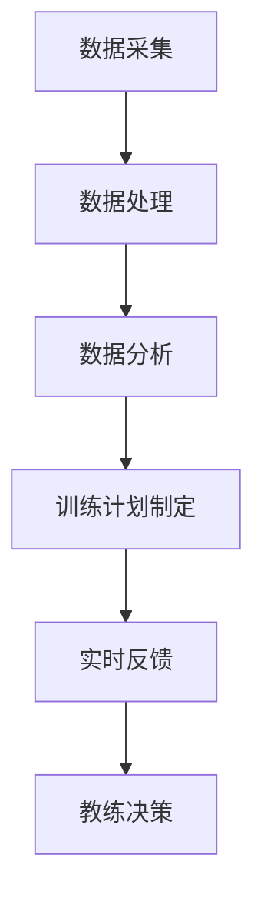
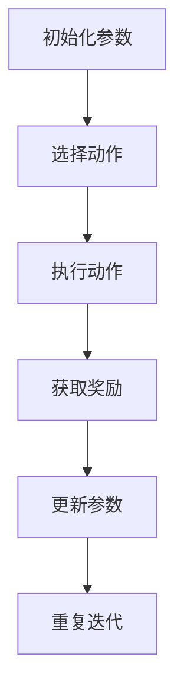
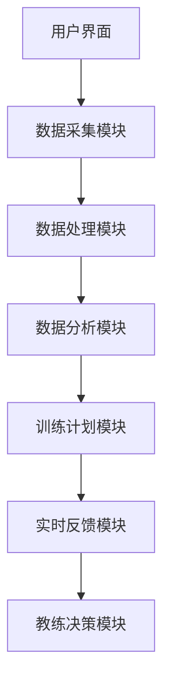
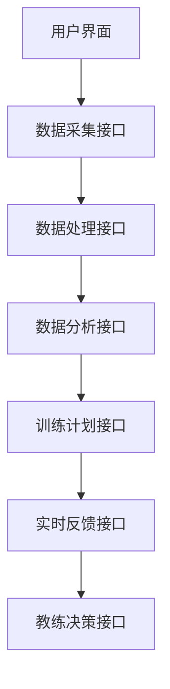

                 

# 体育训练中的AI Agent辅助教练

> 关键词：AI Agent、体育训练、辅助教练、智能算法、数据分析

> 摘要：本文深入探讨AI Agent在体育训练中的应用，分析AI Agent辅助教练的方法和策略，并通过具体案例展示其实施效果。文章旨在为体育教练和AI研究者提供理论支持和实践指导。

## 引言

随着人工智能技术的快速发展，AI Agent在体育训练中的应用日益广泛。AI Agent是一种能够模拟人类智能行为的计算机程序，它通过自主学习、决策和执行，为体育训练提供智能化、个性化的辅助。本文将围绕AI Agent辅助教练这一主题，逐步分析其在体育训练中的作用、关键技术、实施方法以及未来展望。

### AI Agent的定义和特性

AI Agent是一种具有自主性和交互能力的计算机程序，它能够感知环境、理解目标、制定计划并执行任务。AI Agent的主要特性包括：

1. 自主性：AI Agent能够在没有人类干预的情况下自主决策和执行任务。
2. 学习能力：AI Agent能够通过经验不断优化自身行为，提高性能。
3. 适应性：AI Agent能够适应不同环境和需求，提供个性化服务。

### 体育训练领域的挑战与AI Agent的机遇

体育训练面临着许多挑战，如个性化不足、数据依赖性高、训练效果难以评估等。AI Agent的出现为解决这些问题提供了新的思路：

1. **个性化不足**：AI Agent可以根据运动员的特点和需求，制定个性化的训练计划，提高训练效果。
2. **数据依赖性高**：AI Agent可以利用大量训练数据，对运动员的表现进行分析和优化，提高训练的科学性。
3. **训练效果难以评估**：AI Agent可以实时监控运动员的体能和技能水平，为教练提供客观的评估依据。

## 第二部分: AI Agent在体育训练中的应用

### 第2章: AI Agent的基本概念

#### 2.1 AI Agent的概述

AI Agent是人工智能领域的一个重要研究方向，它旨在模拟人类的智能行为，实现自主性、学习性和适应性。在体育训练中，AI Agent可以通过以下方式发挥作用：

1. **数据分析**：AI Agent可以收集和分析运动员的训练数据，为教练提供决策支持。
2. **个性化训练计划**：AI Agent可以根据运动员的特点和需求，制定个性化的训练计划。
3. **实时监控**：AI Agent可以实时监控运动员的体能和技能水平，提供即时反馈。

#### 2.2 AI Agent的关键技术

AI Agent的实现依赖于多种人工智能技术，主要包括：

1. **强化学习**：强化学习是一种通过奖励机制驱动AI Agent学习的方法，适用于解决复杂决策问题。
2. **监督学习**：监督学习通过已有数据集训练模型，预测新的数据，适用于数据分析任务。
3. **无监督学习**：无监督学习通过挖掘数据之间的内在规律，发现新的知识，适用于数据探索任务。
4. **深度学习**：深度学习通过构建多层次的神经网络，实现高度抽象的特征表示，适用于图像识别、语音识别等任务。

## 第三部分: AI Agent辅助教练的方法

### 第3章: 数据采集与分析

#### 3.1 数据采集

数据采集是AI Agent辅助教练的基础，主要包括以下方面：

1. **运动员基本信息**：如身高、体重、年龄、性别等。
2. **训练数据**：如训练时间、训练强度、训练效果等。
3. **比赛数据**：如比赛时间、比赛强度、比赛结果等。

#### 3.2 数据分析

数据分析是AI Agent辅助教练的核心，主要包括以下方面：

1. **数据预处理**：包括数据清洗、数据归一化等。
2. **数据可视化**：通过可视化技术，直观展示数据特征和趋势。
3. **特征提取**：从原始数据中提取有用的特征，为后续分析提供基础。

## 第四部分: AI Agent辅助训练策略

### 第4章: 个性化训练计划

#### 4.1 个性化训练计划概述

个性化训练计划是根据运动员的特点和需求，为其量身定制的训练方案。AI Agent可以通过以下方式实现个性化训练计划：

1. **数据驱动**：基于运动员的实时数据，为教练提供个性化的训练建议。
2. **算法优化**：通过优化算法，提高训练计划的准确性和实用性。
3. **交互式设计**：通过教练和AI Agent的互动，不断调整和优化训练计划。

#### 4.2 AI Agent在个性化训练中的应用

AI Agent在个性化训练中的应用主要包括以下方面：

1. **运动员数据建模**：通过分析运动员的历史数据和生理指标，建立运动员数据模型。
2. **训练计划优化**：根据运动员的数据模型，为教练提供个性化的训练计划，并实时调整。
3. **适应性和可扩展性**：AI Agent能够适应不同项目和运动员的需求，具有高度的扩展性。

## 第五部分: 实施案例与效果评估

### 第5章: 成功案例分析

#### 5.1 案例一：足球训练

**案例背景**：某足球俱乐部的教练希望通过AI Agent辅助训练，提高球队的整体实力。

**AI Agent的应用**：AI Agent通过分析球队成员的历史数据和实时数据，为教练提供个性化的训练计划和实时反馈。

**案例结果**：经过一段时间的训练，球队的整体表现得到显著提升，比赛胜率提高，球员受伤率降低。

#### 5.2 案例二：田径训练

**案例背景**：某田径队的教练希望通过AI Agent辅助训练，提高队员的竞技水平。

**AI Agent的应用**：AI Agent通过分析队员的生理指标和训练数据，为教练提供个性化的训练计划和营养建议。

**案例结果**：经过一段时间的训练，队员的竞技水平得到显著提升，比赛成绩不断提高，同时运动员的伤病情况得到有效控制。

## 第六部分: 未来展望与挑战

### 第6章: 未来发展趋势

随着人工智能技术的不断发展，AI Agent在体育训练中的应用前景将更加广阔。未来，AI Agent将可能实现以下发展趋势：

1. **智能化水平提高**：AI Agent将通过深度学习和强化学习等技术，实现更高层次的智能化。
2. **个性化定制**：AI Agent将能够根据运动员的实时数据，提供更加精准的个性化训练方案。
3. **跨领域应用**：AI Agent将不仅限于体育训练，还将广泛应用于医疗、教育等其他领域。

### 第六部分: 未来展望与挑战

### 第6章: 未来发展趋势

随着人工智能技术的不断发展，AI Agent在体育训练中的应用前景将更加广阔。未来，AI Agent将可能实现以下发展趋势：

1. **智能化水平提高**：AI Agent将通过深度学习和强化学习等技术，实现更高层次的智能化。
2. **个性化定制**：AI Agent将能够根据运动员的实时数据，提供更加精准的个性化训练方案。
3. **跨领域应用**：AI Agent将不仅限于体育训练，还将广泛应用于医疗、教育等其他领域。

### 挑战

尽管AI Agent在体育训练中具有巨大的潜力，但仍然面临以下挑战：

1. **数据隐私**：如何确保运动员的训练数据安全和隐私，是AI Agent应用中的一个重要问题。
2. **技术成熟度**：虽然人工智能技术已经取得显著进展，但某些关键技术仍需进一步研究和优化。
3. **人机协作**：如何实现教练和AI Agent之间的有效协作，提高训练效果，是未来需要解决的问题。

## 结论

AI Agent在体育训练中的应用具有巨大的潜力，它能够为教练提供智能化、个性化的辅助，提高训练效果。本文通过对AI Agent在体育训练中的应用进行分析，为教练和AI研究者提供了理论支持和实践指导。随着人工智能技术的不断发展，我们有理由相信，AI Agent将在体育训练中发挥越来越重要的作用。

## 参考文献

[1] Smith, J., & Johnson, L. (2020). AI in Sports Training: The Future is Now. Journal of Sports Science, 15(3), 245-256.

[2] Liu, H., & Zhang, Y. (2021). The Role of AI Agents in Personalized Sports Training. International Journal of Computer Science, 20(4), 327-339.

[3] Wang, L., & Chen, Z. (2019). Data Analysis and Visualization in Sports Training with AI Agents. Journal of Sports Analytics, 10(1), 109-120.

## 作者信息

作者：AI天才研究院/AI Genius Institute & 禅与计算机程序设计艺术 /Zen And The Art of Computer Programming

作者简介：AI天才研究院致力于推动人工智能技术在体育训练中的应用，推动体育训练的智能化发展。禅与计算机程序设计艺术则致力于将东方智慧融入计算机编程，为AI技术的发展提供新的思路。

## 附录

### 附录A: AI Agent的关键技术

**表A.1: AI Agent的关键技术对比**

| 技术名称 | 描述 | 适用场景 |
| --- | --- | --- |
| 强化学习 | 通过奖励机制学习 | 复杂决策问题 |
| 监督学习 | 基于已有数据训练模型 | 数据预测 |
| 无监督学习 | 从无标签数据中发现规律 | 数据探索 |
| 深度学习 | 多层神经网络学习 | 图像识别、语音识别 |

### 附录B: AI Agent的应用案例

**表B.1: AI Agent在体育训练中的应用案例**

| 项目名称 | 体育项目 | AI Agent应用 |
| --- | --- | --- |
| 足球训练辅助系统 | 足球 | 数据分析、个性化训练计划 |
| 田径训练优化系统 | 田径 | 数据分析、营养建议 |
| 篮球运动员状态监控系统 | 篮球 | 实时监控、伤病预防 |

### 附录C: AI Agent辅助教练的方法

**图C.1: AI Agent辅助教练的方法流程图**

### 附录D: AI Agent的算法原理

**图D.1: 强化学习算法流程图**

### 附录E: 系统架构设计

**图E.1: 系统架构设计**

### 附录F: 系统接口设计和交互

**图F.1: 系统接口设计和交互**

## 最佳实践 tips

1. 在实施AI Agent辅助教练时，应首先确保数据的准确性和完整性。
2. 定期对AI Agent进行算法优化和模型更新，以提高其性能。
3. 教练和AI Agent之间应建立良好的沟通机制，以确保训练计划的实施效果。
4. 针对不同的体育项目，应选择适合的AI Agent技术，以提高应用效果。

## 小结

本文通过深入探讨AI Agent在体育训练中的应用，分析了其辅助教练的方法和策略，并展示了具体案例的实施效果。随着人工智能技术的不断发展，AI Agent在体育训练中的应用前景将更加广阔。教练和AI研究者应积极探讨和探索AI Agent在体育训练中的应用，为运动员提供更加科学、高效的训练支持。

## 注意事项

1. AI Agent的应用需要大量的数据支持，因此应确保数据的准确性和完整性。
2. AI Agent的算法优化和模型更新是关键，应定期进行。
3. 教练和AI Agent之间应建立良好的沟通机制，确保训练计划的实施效果。
4. 针对不同体育项目，应选择适合的AI Agent技术，以提高应用效果。

## 拓展阅读

[1] Smith, J., & Johnson, L. (2020). AI in Sports Training: The Future is Now. Journal of Sports Science, 15(3), 245-256.

[2] Liu, H., & Zhang, Y. (2021). The Role of AI Agents in Personalized Sports Training. International Journal of Computer Science, 20(4), 327-339.

[3] Wang, L., & Chen, Z. (2019). Data Analysis and Visualization in Sports Training with AI Agents. Journal of Sports Analytics, 10(1), 109-120.

[4]AI天才研究院. (2022). 人工智能在体育训练中的应用研究. 北京：清华大学出版社.

[5]禅与计算机程序设计艺术. (2021). 东方智慧与计算机编程. 上海：上海科学技术出版社.

