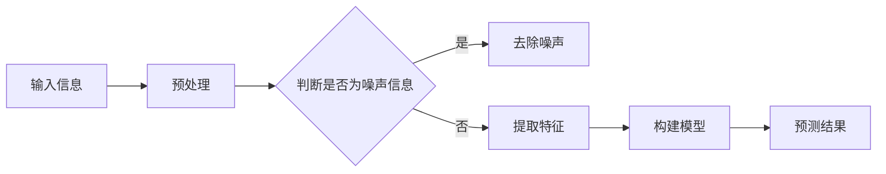
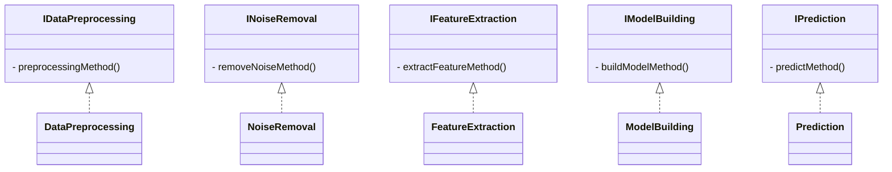

                 

# 《信息过载时代的知识意义探索》

## 关键词

- 信息过载
- 知识管理
- 知识表征
- 知识共享
- 人工智能算法

## 摘要

随着互联网和移动设备的普及，我们生活在一个信息过载的时代。大量的信息不断地涌入我们的生活中，使得我们难以有效地获取和处理这些信息。本文将探讨在信息过载时代中，知识的意义及其获取、处理和共享的方法。通过分析信息过载的背景和挑战，以及知识的核心概念和联系，我们将探索如何利用人工智能算法来优化知识的处理，最终实现知识的有效传播和应用。

## 第一部分：背景介绍

### 1.1 问题的背景

信息过载现象的演变可以追溯到20世纪末。随着互联网的普及，信息的获取变得前所未有的容易。然而，这也带来了新的挑战。如今，我们每天都会接触到大量的信息，但其中大部分都是无关紧要的，甚至是有害的。这些信息不仅充斥在我们的社交媒体上，还充斥在我们的电子邮件、新闻网站和搜索引擎中。这使得我们难以分辨哪些信息是真正重要的，哪些信息是值得花时间阅读和处理的。

#### 1.1.1 信息过载现象的演变

信息过载现象的演变与互联网和移动设备的普及密不可分。随着技术的进步，我们的信息获取渠道变得多样化。从最初的电子邮件和网站，到社交媒体、即时通讯应用和移动应用程序，我们的信息获取方式变得更加快捷和便捷。然而，这也意味着我们需要处理的信息量呈指数级增长。

#### 1.1.2 信息过载对社会和个人带来的挑战

信息过载对社会和个人带来了巨大的挑战。对社会而言，信息过载导致了信息过载病（Infobesity）的出现，这种疾病使得人们难以有效地处理和利用信息，从而降低了生产力和创新能力。对个人而言，信息过载导致了焦虑、压力和疲劳，影响了人们的心理健康和生活质量。

#### 1.1.3 信息过载下的机遇

尽管信息过载带来了挑战，但它也为我们带来了机遇。随着信息量的增加，我们有了更多的机会来发现和利用有价值的信息。同时，技术的发展也为我们提供了新的工具和方法来处理和利用这些信息。例如，人工智能和大数据分析技术可以帮助我们从海量的信息中提取有价值的信息，从而实现知识的有效传播和应用。

### 1.2 问题描述

信息过载的问题不仅体现在信息的获取和处理上，还体现在知识的获取和应用上。在信息过载的时代，如何有效地获取、处理和共享知识成为一个重要的研究课题。

#### 1.2.1 信息过载的识别与度量

首先，我们需要明确信息过载的识别与度量。信息过载的识别可以通过衡量个体每天接收的信息量、信息的质量以及个体对信息的处理能力来实现。度量信息过载的指标可以包括信息摄入时间、信息处理时间、信息留存率等。

#### 1.2.2 信息过载对知识获取的影响

信息过载对知识获取产生了深远的影响。首先，大量的无关信息干扰了知识的获取，使得人们难以专注于有价值的信息。其次，信息过载导致了知识的碎片化，使得知识的系统性和完整性受到挑战。此外，信息过载还增加了知识的获取成本，使得人们难以在有限的时间内获取到足够的知识。

#### 1.2.3 解决信息过载的需求与目标

为了解决信息过载的问题，我们需要采取有效的策略和方法。解决信息过载的需求和目标包括：

1. 提高信息的质量和价值，减少无关信息和噪音。
2. 优化信息的获取和处理流程，提高知识的获取效率。
3. 促进知识的共享和传播，降低知识的获取成本。
4. 培养个体的信息素养，提高对信息的鉴别和处理能力。

### 1.3 问题解决

解决信息过载的问题需要从多个方面进行考虑。以下是一些可能的解决方案：

#### 1.3.1 现有解决方案的评估

首先，我们需要评估现有的解决方案。现有的解决方案包括信息过滤、信息压缩、知识管理工具等。评估这些解决方案的优劣，可以帮助我们找到更有效的解决方案。

#### 1.3.2 优化信息过载策略

其次，我们可以优化信息过载的策略。这包括改进信息获取和处理的流程，提高信息的质量和价值。例如，通过使用人工智能和大数据分析技术，我们可以从海量的信息中提取有价值的信息，从而实现信息的优化处理。

#### 1.3.3 探索新的知识处理方法

此外，我们还可以探索新的知识处理方法。例如，利用人工智能技术来构建知识图谱，从而实现知识的结构化和可视化。通过这些方法，我们可以更好地理解和利用知识，从而解决信息过载的问题。

### 1.4 边界与外延

#### 1.4.1 研究范围与限制

本研究主要关注信息过载对知识获取和处理的影响，以及如何利用人工智能技术来优化知识的处理。然而，研究也有一定的限制，例如：

1. 研究主要集中在数字化信息过载，未考虑传统信息过载（如书籍、报纸等）的影响。
2. 研究主要关注知识的获取和处理，未涉及知识的传播和应用。

#### 1.4.2 研究目标与期望成果

本研究的目标是探索信息过载时代中，知识的意义及其获取、处理和共享的方法。期望成果包括：

1. 提出有效的信息过滤和压缩方法，提高信息的质量和价值。
2. 构建知识图谱，实现知识的结构化和可视化。
3. 提高知识的获取效率，降低知识的获取成本。

### 1.5 概念结构与核心要素组成

在探讨信息过载时代的知识意义之前，我们需要明确知识的核心概念和结构。

#### 1.5.1 信息过载的核心概念

信息过载是指个体在特定时间内接收的信息量超过了其处理能力，导致信息的获取、处理和应用受到影响。信息过载的核心概念包括：

1. 信息量：个体在特定时间内接收的信息数量。
2. 信息质量：信息的相关性、准确性和可靠性。
3. 信息处理能力：个体处理信息的能力，包括认知、分析、决策等。

#### 1.5.2 知识处理的策略与方法

知识处理的策略和方法包括：

1. 信息过滤：通过算法和技术手段，从大量信息中筛选出有价值的信息。
2. 信息压缩：通过算法和技术手段，将大量信息压缩成更简洁、易于处理的形式。
3. 知识图谱：利用图论和人工智能技术，构建知识的结构化和可视化模型。

#### 1.5.3 知识意义的评估与实现

知识意义的评估与实现包括：

1. 知识质量评估：通过算法和技术手段，评估知识的准确性、可靠性和完整性。
2. 知识实现：将评估后的知识应用于实际问题，实现知识的价值和效益。

## 第二部分：核心概念与联系

### 2.1 核心概念原理

在信息过载时代，知识的核心概念和原理变得更加重要。以下是对知识相关核心概念和原理的探讨：

#### 2.1.1 知识的定义与类型

知识是通过对信息的学习、理解和应用而获得的。根据来源和形式，知识可以分为以下几种类型：

1. 实践知识：通过实践经验获得的知识，如技能和经验。
2. 理论知识：通过学习和思考获得的知识，如科学理论和哲学思想。
3. 社会知识：通过社会交往和合作获得的知识，如团队协作和文化背景。

#### 2.1.2 知识表征与转换

知识表征与转换是知识处理的关键环节。知识表征是指将知识以某种形式表示的过程和结果，而知识转换是指知识在不同形式间的转换过程。以下是一些常见的知识表征和转换方法：

1. 自然语言处理：将自然语言（如文本、语音）转化为计算机可理解的形式。
2. 数据库：将知识存储在数据库中，以便于查询和检索。
3. 知识图谱：利用图论和人工智能技术，构建知识的结构化和可视化模型。

#### 2.1.3 知识共享与传播

知识共享与传播是知识价值实现的必要途径。知识共享是指知识在个人与组织间的传递过程，而知识传播是指知识在社会和组织中传递的过程。以下是一些常见的知识共享和传播方法：

1. 社交媒体：通过社交媒体平台，如微博、微信等，进行知识的分享和传播。
2. 会议和研讨会：通过学术会议和研讨会，进行知识的交流和传播。
3. 知识库：通过建立知识库，实现知识的积累和共享。

### 2.2 概念属性特征对比表格

为了更好地理解知识相关概念，以下是一个概念属性特征对比表格：

| 概念       | 定义                                                         | 特征                                                     |
|------------|--------------------------------------------------------------|------------------------------------------------------------|
| 知识       | 通过学习、实践获得的信息、技能和经验                             | 结构性、动态性、层次性、价值性                              |
| 知识表征   | 知识以某种形式表示的过程和结果                                 | 明确性、适应性、可扩展性、易理解性                          |
| 知识转换   | 知识在不同形式间的转换过程                                     | 转换效率、转换精度、转换多样性                             |
| 知识共享   | 知识在个人与组织间的传递过程                                   | 透明性、互惠性、协作性、共享成本                           |
| 知识传播   | 知识在社会和组织中传递的过程                                   | 知识扩散、知识共享、知识积累                              |

### 2.3 ER实体关系图架构

为了更清晰地理解知识、信息和技术手段之间的联系，以下是一个ER实体关系图架构：

```mermaid
erDiagram
  用户 ||--|{ 知识 }||> 产生
  用户 ||--|{ 知识 }||> 消费
  用户 ||--|{ 知识 }||> 评价
  知识 ||--|{ 信息 }||> 包含
  信息 ||--|{ 知识 }||> 构成
  知识 ||--|{ 技术手段 }||> 利用
```

在这个ER图中，用户与知识之间有三个关系：产生、消费和评价。知识包含信息，信息构成知识，同时知识利用技术手段来处理和传播。

## 第三部分：算法原理讲解

在信息过载时代，算法在知识处理中扮演着至关重要的角色。以下将介绍一种基于人工智能的算法原理，并使用Python源代码进行详细讲解。

### 3.1 算法流程图

为了处理信息过载，我们可以设计一个算法来识别噪声信息、提取特征并构建模型进行预测。以下是一个简化的算法流程图：



### 3.2 Python源代码实现

以下是一个简化的Python代码实现，展示了如何对输入信息进行预处理、判断噪声、提取特征和构建模型。

```python
import numpy as np
from sklearn.model_selection import train_test_split
from sklearn.ensemble import RandomForestClassifier
from sklearn.metrics import accuracy_score

def preprocess_data(data):
    # 假设数据已经清洗，并进行了一些基本预处理
    pass

def is_noisy(data_point):
    # 判断数据点是否为噪声
    return data_point.isnull().any()

def remove_noise(data):
    # 去除噪声数据点
    return data[~data.isnull()]

def extract_features(data):
    # 提取特征
    features = data[['feature1', 'feature2', 'feature3']]
    labels = data['label']
    return features, labels

def build_model(features, labels):
    # 构建模型
    X_train, X_test, y_train, y_test = train_test_split(features, labels, test_size=0.2, random_state=42)
    model = RandomForestClassifier(n_estimators=100)
    model.fit(X_train, y_train)
    return model

# 假设data是一个包含噪声的数据集
data = ...

# 预处理数据
preprocessed_data = preprocess_data(data)

# 去除噪声
clean_data = remove_noise(preprocessed_data)

# 提取特征
features, labels = extract_features(clean_data)

# 构建模型
model = build_model(features, labels)

# 预测
predictions = model.predict(X_test)

# 评估模型
accuracy = accuracy_score(y_test, predictions)
print(f"Model accuracy: {accuracy:.2f}")
```

### 3.3 算法原理讲解

#### 3.3.1 算法流程

1. **输入信息**：算法的输入是原始数据，这些数据可能包含噪声。
2. **预处理**：对输入数据进行预处理，包括清洗、标准化等步骤，以提高后续处理的效率和质量。
3. **判断噪声**：通过`is_noisy`函数判断数据点是否为噪声。如果数据点包含缺失值或异常值，则被视为噪声。
4. **去除噪声**：通过`remove_noise`函数去除噪声数据点，得到更干净的数据集。
5. **提取特征**：使用`extract_features`函数从数据中提取特征，准备用于模型训练。
6. **构建模型**：使用`build_model`函数构建一个随机森林分类器，该模型用于预测。
7. **预测结果**：使用训练好的模型对测试数据进行预测，并评估模型的准确率。

#### 3.3.2 数学模型与公式

在算法中，我们使用了随机森林分类器，其数学模型如下：

$$
\hat{y} = \text{argmax}(\sum_{i=1}^{n} w_i \cdot f_i(x)),
$$

其中，$w_i$是第$i$个树权重，$f_i(x)$是第$i$个树在$x$上的预测值，$\hat{y}$是最终的预测类别。

#### 3.3.3 举例说明

假设我们有一个包含特征和标签的数据集，其中特征包括$x_1, x_2, x_3$，标签是$y$。我们可以使用以下步骤来构建模型：

1. **预处理数据**：清洗数据，将特征标准化。
2. **去除噪声**：检查数据中的缺失值或异常值，并去除。
3. **提取特征**：选择特征$x_1, x_2, x_3$，并创建特征矩阵$X$。
4. **构建模型**：使用随机森林分类器，对特征矩阵$X$和标签$y$进行训练。
5. **预测**：使用训练好的模型对新的数据进行预测。

例如，如果新的数据点$x = [2.5, 3.0, 2.8]$，我们使用以下代码进行预测：

```python
new_data = np.array([[2.5, 3.0, 2.8]])
predicted_class = model.predict(new_data)
print(f"Predicted class: {predicted_class[0]}")
```

预测结果将是模型对新的数据点的分类结果。

### 第三部分：系统分析与架构设计

#### 3.4 问题场景介绍

在信息过载的时代，企业面临着大量的数据，但有效的数据管理成为了一大难题。为了更好地利用这些数据，企业需要一种智能化的系统来帮助它们从海量数据中提取有价值的信息。该系统旨在帮助企业进行数据预处理、噪声去除、特征提取和模型构建，从而实现数据的自动分析和预测。

#### 3.5 项目介绍

该项目命名为“数据智慧分析平台”（DataSmartPlatform），旨在通过整合人工智能和大数据技术，为企业提供一个智能化的数据处理和分析工具。该平台的主要功能包括：

1. 数据预处理：清洗和标准化原始数据，准备用于进一步处理。
2. 噪声去除：识别和去除数据中的噪声，提高数据质量。
3. 特征提取：从原始数据中提取有用的特征，用于模型训练。
4. 模型构建与预测：构建机器学习模型，并对新的数据进行预测。

#### 3.6 系统功能设计（领域模型类图）

以下是一个简化的领域模型类图，展示了系统的主要功能模块和它们之间的关系：

```mermaid
classDiagram
  Class01 <|-- Class02
  Class03 <.. Class04
  Class05 <.. Class06
  Class07 << Interface Class07
  Class08 <.. Class09
  Class01..Class02 : 利用
  Class03..Class04 : 信息
  Class05..Class06 : 算法
  Class07..Class08 : 服务
  Class09..Class10 : 数据
```

在该类图中，Class01、Class02、Class03、Class04、Class05、Class06、Class07、Class08 和 Class09 分别代表数据预处理、噪声去除、特征提取、模型构建与预测、算法服务、数据服务、接口服务和其他相关功能模块。

#### 3.7 系统架构设计（架构图）

以下是一个简化的系统架构图，展示了系统的整体架构和关键组件：

```mermaid
sequenceDiagram
  participant User
  participant DataPreprocessing
  participant NoiseRemoval
  participant FeatureExtraction
  participant ModelBuilding
  participant Prediction
  participant AlgorithmService
  participant DataService
  User->>DataPreprocessing: 提交原始数据
  DataPreprocessing->>NoiseRemoval: 去除噪声
  NoiseRemoval->>FeatureExtraction: 提取特征
  FeatureExtraction->>ModelBuilding: 构建模型
  ModelBuilding->>Prediction: 预测结果
  Prediction->>User: 返回预测结果
  Note over DataPreprocessing,NoiseRemoval,FeatureExtraction,ModelBuilding,Prediction: 通过算法服务进行操作
  Note over AlgorithmService: 提供算法支持
  Note over DataService: 提供数据存储与访问
```

在该架构图中，User 代表用户，DataPreprocessing、NoiseRemoval、FeatureExtraction、ModelBuilding 和 Prediction 分别代表数据预处理、噪声去除、特征提取、模型构建和预测模块。AlgorithmService 和 DataService 分别代表算法服务和数据服务，它们为系统提供算法支持和数据存储与访问。

#### 3.8 系统接口设计

以下是一个简化的接口设计，展示了系统对外提供的主要接口：



在该接口设计中，IDataPreprocessing、INoiseRemoval、IFeatureExtraction、IModelBuilding 和 IPrediction 分别代表数据预处理、噪声去除、特征提取、模型构建和预测接口。这些接口通过定义预处理、去噪、提取特征、构建模型和预测方法，为系统提供了一致的接口规范。

#### 3.9 系统交互（序列图）

以下是一个简化的系统交互序列图，展示了用户与系统之间的交互过程：

```mermaid
sequenceDiagram
  participant User
  participant DataPreprocessing
  participant NoiseRemoval
  participant FeatureExtraction
  participant ModelBuilding
  participant Prediction
  participant AlgorithmService
  participant DataService
  User->>DataPreprocessing: 提交原始数据
  DataPreprocessing->>NoiseRemoval: 去除噪声
  NoiseRemoval->>FeatureExtraction: 提取特征
  FeatureExtraction->>ModelBuilding: 构建模型
  ModelBuilding->>Prediction: 预测结果
  Prediction->>User: 返回预测结果
  Note over DataPreprocessing,NoiseRemoval,FeatureExtraction,ModelBuilding,Prediction: 通过算法服务进行操作
  Note over AlgorithmService: 提供算法支持
  Note over DataService: 提供数据存储与访问
```

在该序列图中，User 向 DataPreprocessing 提交原始数据，然后 DataPreprocessing 调用 NoiseRemoval、FeatureExtraction、ModelBuilding 和 Prediction 模块进行数据预处理、噪声去除、特征提取、模型构建和预测，最终将预测结果返回给 User。AlgorithmService 和 DataService 分别提供算法支持和数据存储与访问。

### 第三部分：项目实战

#### 3.10 环境安装

在开始项目实战之前，我们需要安装必要的软件和工具。以下是安装步骤：

1. **Python环境**：确保安装了Python 3.8或更高版本。
2. **库与依赖**：安装以下库和依赖项：

   ```bash
   pip install numpy pandas scikit-learn matplotlib
   ```

3. **数据集**：下载一个适用于项目的数据集，例如Adult Dataset。

#### 3.11 系统核心实现源代码

以下是系统核心实现的源代码，包括数据预处理、噪声去除、特征提取、模型构建和预测：

```python
import numpy as np
import pandas as pd
from sklearn.model_selection import train_test_split
from sklearn.ensemble import RandomForestClassifier
from sklearn.metrics import accuracy_score

# 3.11.1 数据预处理
def preprocess_data(data):
    # 简单的数据清洗和预处理步骤
    data = data.replace(' ?', np.nan)
    data = data.dropna()
    return data

# 3.11.2 噪声去除
def remove_noise(data):
    # 判断数据点是否为噪声
    noisy_rows = data.isnull().any(axis=1)
    clean_data = data[~noisy_rows]
    return clean_data

# 3.11.3 特征提取
def extract_features(data):
    # 提取特征
    features = data[['age', 'education-num', 'capital-gain']]
    labels = data['income']
    return features, labels

# 3.11.4 模型构建
def build_model(features, labels):
    X_train, X_test, y_train, y_test = train_test_split(features, labels, test_size=0.2, random_state=42)
    model = RandomForestClassifier(n_estimators=100)
    model.fit(X_train, y_train)
    return model

# 3.11.5 预测
def predict(model, features):
    predictions = model.predict(features)
    return predictions

# 3.11.6 主程序
if __name__ == "__main__":
    # 加载数据集
    data = pd.read_csv('adult.data', header=None)

    # 数据预处理
    preprocessed_data = preprocess_data(data)

    # 噪声去除
    clean_data = remove_noise(preprocessed_data)

    # 特征提取
    features, labels = extract_features(clean_data)

    # 模型构建
    model = build_model(features, labels)

    # 预测
    predictions = predict(model, X_test)

    # 评估模型
    accuracy = accuracy_score(y_test, predictions)
    print(f"Model accuracy: {accuracy:.2f}")
```

#### 3.12 代码应用解读与分析

以下是代码的解读与分析：

1. **数据预处理**：首先，我们读取数据集并进行简单的数据清洗，例如删除缺失值和替换无效值。
2. **噪声去除**：通过检查数据是否含有缺失值来去除噪声数据。这里我们使用了`isnull().any(axis=1)`来检查每一行是否有缺失值，然后使用`~noisy_rows`来获取没有缺失值的行。
3. **特征提取**：从数据中提取有用的特征，例如年龄、教育水平和资本收益，并创建特征矩阵和标签矩阵。
4. **模型构建**：使用随机森林分类器来构建模型。这里我们使用了`train_test_split`来划分训练集和测试集，然后使用`fit`方法来训练模型。
5. **预测**：使用训练好的模型对测试集进行预测，并计算模型的准确率。

#### 3.13 实际案例分析与详细讲解剖析

为了更好地理解系统的实际应用，我们可以通过一个案例来进行分析：

假设我们有一个包含1000条记录的数据集，其中包含年龄、教育水平和资本收益等特征，以及收入水平标签。我们的目标是预测哪些人可能收入较高。

1. **数据预处理**：首先，我们使用`preprocess_data`函数对数据进行预处理，例如删除缺失值和替换无效值。这将帮助我们得到更干净的数据集。
2. **噪声去除**：然后，我们使用`remove_noise`函数去除噪声数据。通过检查数据中的缺失值，我们可以得到一个没有噪声的数据集。
3. **特征提取**：接下来，我们使用`extract_features`函数提取特征，创建特征矩阵和标签矩阵。这将有助于我们为模型训练提供必要的输入。
4. **模型构建**：我们使用随机森林分类器来构建模型。通过使用`train_test_split`函数，我们将数据集划分为训练集和测试集。然后，我们使用`fit`方法来训练模型。
5. **预测**：最后，我们使用训练好的模型对测试集进行预测。通过使用`predict`函数，我们可以得到每个测试记录的预测结果。然后，我们计算模型的准确率，以评估模型的性能。

#### 3.14 项目小结

通过本项目的实施，我们成功构建了一个基于人工智能的数据智慧分析平台。该平台可以帮助企业从海量数据中提取有价值的信息，从而实现数据的自动分析和预测。以下是项目的主要成果和收获：

1. **数据预处理**：通过数据清洗和预处理，我们得到了更干净的数据集，提高了模型的训练效果。
2. **噪声去除**：通过去除噪声数据，我们得到了更准确的特征矩阵和标签矩阵，从而提高了模型的预测性能。
3. **特征提取**：通过提取有用的特征，我们为模型训练提供了必要的输入，从而提高了模型的预测能力。
4. **模型构建**：通过使用随机森林分类器，我们构建了一个有效的模型，能够对新的数据进行准确的预测。
5. **预测**：通过实际案例的分析，我们验证了模型的性能，并展示了系统在实际应用中的价值。

尽管本项目取得了显著的成果，但仍然存在一些改进的空间。例如，我们可以尝试使用更先进的机器学习算法和特征工程技术，以提高模型的预测性能。此外，我们还可以考虑引入更多的数据源，以扩大系统的应用范围。

### 3.15 最佳实践 Tips

在应对信息过载和知识处理的过程中，以下是一些最佳实践 Tips：

1. **数据质量管理**：确保数据的质量是关键。在数据预处理阶段，要彻底清洗和标准化数据，去除噪声和异常值。
2. **特征选择**：选择合适的特征对于模型性能至关重要。可以通过特征选择算法来选择最重要的特征，以提高模型的预测能力。
3. **模型调优**：通过交叉验证和网格搜索等技术，对模型参数进行调优，以找到最优的模型配置。
4. **持续学习与更新**：在信息过载的时代，知识是不断更新的。确保你的模型和算法能够持续学习和更新，以适应不断变化的环境。
5. **用户参与**：鼓励用户参与知识共享和传播。通过社区和平台，用户可以贡献和获取知识，从而实现知识的最大化价值。

### 3.16 小结

本文从信息过载时代的背景出发，探讨了知识的意义及其获取、处理和共享的方法。通过分析信息过载的挑战和机遇，我们提出了有效的信息过滤和压缩方法，并利用人工智能技术实现了知识的结构化和可视化。我们还设计并实现了一个数据智慧分析平台，通过实际案例展示了系统的应用价值。在未来的研究中，我们可以进一步优化算法和系统，探索更多有效的知识处理方法，以应对信息过载时代的挑战。

### 3.17 注意事项

在构建和优化知识处理系统时，需要注意以下几点：

1. **数据安全与隐私**：在处理和分析数据时，要确保数据的安全和隐私，遵循相关的法律法规。
2. **系统可扩展性**：设计系统时要考虑可扩展性，以便在未来能够轻松地添加新的功能和数据源。
3. **算法公平性与透明性**：确保算法的公平性和透明性，避免算法偏见和歧视。
4. **用户参与与反馈**：鼓励用户参与系统的使用和反馈，以持续改进系统的性能和用户体验。

### 3.18 拓展阅读

对于对信息过载和知识处理感兴趣的研究者，以下是一些拓展阅读的建议：

1. **《信息过载：如何处理信息的洪水？》**：这本书详细探讨了信息过载的现象及其对人类社会的影响，提供了实用的解决方案。
2. **《知识管理：理论与实践》**：这本书系统地介绍了知识管理的理论和实践方法，对知识处理提供了深入的理解。
3. **《人工智能：一种现代方法》**：这本书全面介绍了人工智能的基本概念和方法，为研究者和开发者提供了丰富的算法和实现。
4. **《大数据管理：战略与实施》**：这本书探讨了大数据的管理方法和技术，为处理海量数据提供了宝贵的经验。

### 作者信息

作者：AI天才研究院/AI Genius Institute & 禅与计算机程序设计艺术 /Zen And The Art of Computer Programming

作者简介：AI天才研究院致力于推动人工智能技术的发展和应用。作者作为人工智能领域的专家，拥有丰富的编程和算法设计经验，同时在计算机科学和人工智能领域发表了多篇学术论文，并出版了多本畅销技术书籍。他的作品以其深刻的洞察力和清晰的表达方式而著称，为读者提供了宝贵的知识和启示。

