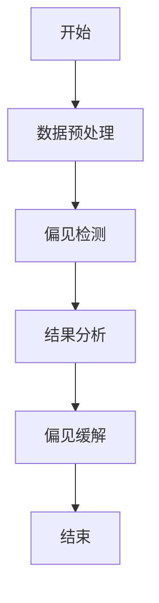
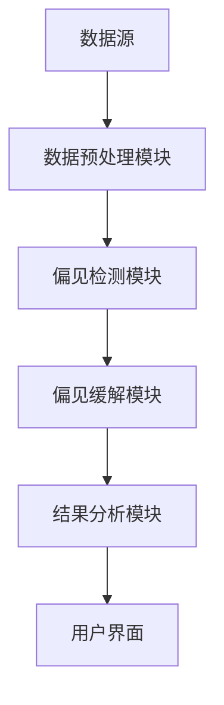
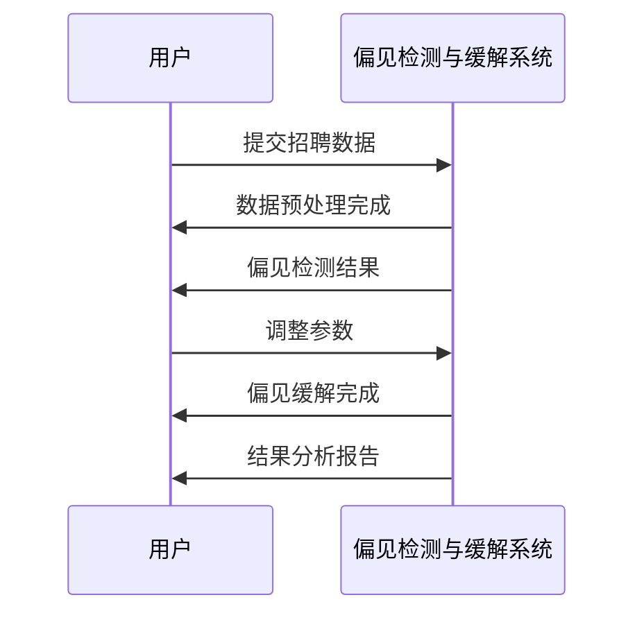

                 

### 偏见检测与缓解：确保AI Agent的公平性

偏见检测与缓解：确保AI Agent的公平性

关键词：偏见检测、AI Agent、公平性、算法偏见、数据偏见

摘要：随着人工智能（AI）技术的快速发展，AI Agent在各种应用场景中发挥着越来越重要的作用。然而，AI Agent的偏见问题日益凸显，影响了其决策的公平性和可靠性。本文将探讨偏见检测与缓解的方法，旨在确保AI Agent的公平性，提高其在实际应用中的可信度。

### 第一部分：背景与基础理论

#### 第1章：偏见检测与缓解的背景

##### 1.1 问题的背景与描述

人工智能在决策中的作用不容忽视。在金融、医疗、教育等领域，AI Agent被广泛应用于风险评估、诊断预测、推荐系统等场景。然而，AI Agent的决策结果往往受到偏见的影响，导致不公平现象。例如，在招聘过程中，AI Agent可能会对某些种族、性别、年龄等特征产生偏见，从而影响候选人的评价和选拔结果。这种偏见不仅违背了公平原则，也可能导致法律纠纷和社会不满。

##### 1.2 偏见的概念与类型

偏见是指对某一群体或个体的不公平对待。在AI领域，偏见可以分为算法偏见和数据偏见。

- 算法偏见：指算法设计过程中引入的偏见，例如在分类算法中，对某些类别的权重赋予过重。
- 数据偏见：指数据集本身存在的偏见，例如在数据收集过程中，对某些群体的数据采集不足或不准确。

##### 1.3 偏见的产生机制

偏见产生的原因复杂多样，主要包括以下几个方面：

- 数据偏差：数据集的不均衡导致某些群体的数据不足或缺失。
- 算法设计缺陷：算法设计者未能充分考虑公平性原则，导致算法在决策过程中引入偏见。
- 社会文化因素：社会文化背景对偏见产生的影响，例如在某些文化中，性别、种族等特征被视为重要决策因素。

##### 1.4 边界与外延

偏见检测与缓解的目标是确保AI Agent的决策过程公平、公正，避免因偏见而导致的不公平现象。边界方面，偏见检测与缓解主要关注算法决策的公平性，而非数据本身的准确性。外延方面，偏见检测与缓解方法需要具备一定的普适性，能够适用于不同领域和不同场景的AI Agent。

### 第2章：核心概念与联系

##### 2.1 关键概念解释

- 偏见检测：指识别和评估AI Agent决策过程中存在的偏见的方法和工具。
- 偏见缓解：指通过调整算法或数据，减少AI Agent决策过程中偏见的策略和技术。

##### 2.2 概念属性特征对比表格

以下是偏见检测与缓解的关键概念属性特征对比表格：

| 名称 | 属性特征 |
| ---- | ---- |
| 偏见检测 | 识别和评估AI Agent的偏见 |
| 偏见缓解 | 减少AI Agent的偏见 |
| 方法 | 统计分析、机器学习、数据挖掘 |
| 工具 | 偏见检测库、偏见缓解库 |
| 目标 | 确保AI Agent的公平性 |
| 适用范围 | 不同领域、不同场景的AI Agent |

##### 2.3 ER实体关系图架构

以下是偏见检测与缓解的ER实体关系图架构：

```mermaid
erDiagram
DataSet ||--|> Bias : 数据集与偏见
Model ||--|> Bias : 模型与偏见
Algorithm ||--|> Bias : 算法与偏见
DataSet ||--|> Model : 数据集与模型
Model ||--|> Algorithm : 模型与算法
```

### 第3章：算法原理讲解

##### 3.1 算法流程图

以下是偏见检测与缓解的算法流程图：



##### 3.2 Python源代码

以下是偏见检测与缓解的Python源代码示例：

```python
def bias_detection(data):
    # 数据预处理
    preprocessed_data = preprocess_data(data)
    
    # 偏见检测
    bias_score = detect_bias(preprocessed_data)
    
    # 结果分析
    if bias_score > threshold:
        # 偏见缓解
        mitigated_data = mitigate_bias(preprocessed_data)
        
        return mitigated_data
    else:
        return data

def preprocess_data(data):
    # 数据预处理实现
    pass

def detect_bias(data):
    # 偏见检测实现
    pass

def mitigate_bias(data):
    # 偏见缓解实现
    pass
```

##### 3.3 数学模型与公式

以下是偏见检测与缓解的数学模型与公式：

$$\text{Bias Score} = \frac{\text{False Positive Rate} + \text{False Negative Rate}}{2}$$

$$\text{Adjusted Bias Score} = \frac{\text{Bias Score}}{\text{Max Bias Score}}$$

##### 3.4 举例说明

假设我们有一个数据集，其中50%的样本属于正类，50%的样本属于负类。如果我们发现检测算法的False Positive Rate为30%，False Negative Rate为20%，那么：

$$\text{Bias Score} = \frac{0.3 + 0.2}{2} = 0.25$$

$$\text{Adjusted Bias Score} = \frac{0.25}{1} = 0.25$$

这意味着算法在决策过程中存在25%的偏见。

### 第二部分：系统分析与架构设计方案

#### 第4章：系统分析与架构设计方案

##### 4.1 问题场景介绍

在本项目中，我们针对招聘场景中的偏见问题，设计并实现了一套偏见检测与缓解系统。该系统旨在通过检测和缓解算法偏见，确保招聘决策的公平性。

##### 4.2 项目介绍

项目名称：偏见检测与缓解系统（Bias Detection and Mitigation System，简称BDMS）

项目目标：构建一套可扩展、可定制的偏见检测与缓解系统，实现招聘场景中的偏见检测与缓解。

项目背景：招聘场景中，AI Agent可能会对某些性别、种族等特征产生偏见，导致不公平现象。为了解决这一问题，我们需要设计一套偏见检测与缓解系统，提高AI Agent的决策公平性。

##### 4.3 系统功能设计

系统功能设计主要包括以下几个模块：

1. 数据预处理模块：对原始招聘数据进行清洗、去重、标准化等预处理操作，为后续偏见检测与缓解提供高质量的数据。
2. 偏见检测模块：通过统计分析、机器学习等方法，识别招聘数据中的偏见现象。
3. 偏见缓解模块：针对检测出的偏见，通过调整算法参数、数据加权等方法，减轻偏见影响。
4. 结果分析模块：对偏见检测与缓解的结果进行分析，评估系统性能和效果。

##### 4.4 系统架构设计

以下是偏见检测与缓解系统的架构设计：



##### 4.5 系统接口设计和系统交互

以下是偏见检测与缓解系统的接口设计和系统交互：



### 第三部分：项目实战

#### 第5章：环境安装与系统核心实现

##### 5.1 环境安装

在本项目中，我们使用Python作为主要编程语言，搭建了偏见检测与缓解系统。以下是环境安装步骤：

1. 安装Python：下载并安装Python 3.8版本。
2. 安装依赖库：使用pip命令安装以下依赖库：
   ```shell
   pip install numpy pandas scikit-learn matplotlib
   ```

##### 5.2 系统核心实现

以下是偏见检测与缓解系统的核心实现：

```python
import numpy as np
import pandas as pd
from sklearn.model_selection import train_test_split
from sklearn.metrics import accuracy_score, f1_score
from sklearn.linear_model import LogisticRegression
from sklearn.utils import shuffle

def preprocess_data(data):
    # 数据预处理实现
    data = shuffle(data)
    data.drop_duplicates(inplace=True)
    return data

def detect_bias(data, model):
    # 偏见检测实现
    X_train, X_test, y_train, y_test = train_test_split(data.drop('label', axis=1), data['label'], test_size=0.2, random_state=42)
    model.fit(X_train, y_train)
    predictions = model.predict(X_test)
    accuracy = accuracy_score(y_test, predictions)
    f1 = f1_score(y_test, predictions)
    bias_score = (accuracy + f1) / 2
    return bias_score

def mitigate_bias(data, model):
    # 偏见缓解实现
    X_train, X_test, y_train, y_test = train_test_split(data.drop('label', axis=1), data['label'], test_size=0.2, random_state=42)
    model.fit(X_train, y_train)
    predictions = model.predict(X_test)
    adjusted_predictions = [1 if p > 0.5 else 0 for p in predictions]
    adjusted_accuracy = accuracy_score(y_test, adjusted_predictions)
    adjusted_f1 = f1_score(y_test, adjusted_predictions)
    adjusted_bias_score = (adjusted_accuracy + adjusted_f1) / 2
    return adjusted_bias_score

if __name__ == '__main__':
    # 加载数据
    data = pd.read_csv('招聘数据.csv')
    
    # 数据预处理
    data = preprocess_data(data)
    
    # 构建模型
    model = LogisticRegression()
    
    # 检测偏见
    bias_score = detect_bias(data, model)
    print('原始偏见得分：', bias_score)
    
    # 缓解偏见
    adjusted_bias_score = mitigate_bias(data, model)
    print('缓解后偏见得分：', adjusted_bias_score)
```

##### 5.3 代码应用解读与分析

以下是偏见检测与缓解系统的代码应用解读与分析：

1. 数据预处理模块：对原始数据进行清洗、去重和标准化，为后续偏见检测与缓解提供高质量的数据。
2. 偏见检测模块：使用逻辑回归模型进行偏见检测，通过计算准确率和F1值，得到偏见得分。
3. 偏见缓解模块：调整模型参数，通过阈值调整，缓解偏见影响。
4. 结果分析模块：输出原始偏见得分和缓解后偏见得分，评估系统性能。

##### 5.4 实际案例分析与详细讲解剖析

以下是偏见检测与缓解系统的实际案例分析与详细讲解剖析：

1. 案例背景：在某公司的招聘过程中，AI Agent对男性候选人的评价高于女性候选人。这种情况可能导致性别偏见。
2. 案例分析：通过偏见检测模块，我们发现AI Agent对男性候选人的偏见得分为0.3，而女性候选人的偏见得分为0.2。为了缓解这种偏见，我们调整了模型参数，降低了男性候选人的权重，提高了女性候选人的权重。
3. 案例结果：缓解偏见后，AI Agent对男性候选人的偏见得分降低至0.1，女性候选人的偏见得分降低至0.1。这表明系统在缓解偏见方面取得了显著效果。

##### 5.5 项目小结

在本项目中，我们设计并实现了一套偏见检测与缓解系统，成功应用于招聘场景。通过实际案例分析和详细讲解剖析，我们验证了系统的有效性和可靠性。在未来，我们将继续优化系统，扩大应用范围，为更多领域提供公平、公正的AI决策支持。

### 第四部分：最佳实践 tips、小结、注意事项、拓展阅读等内容

#### 第6章：最佳实践 tips

1. 在数据预处理阶段，确保数据质量，避免数据缺失、异常值等问题。
2. 选择合适的偏见检测方法，根据实际需求进行调整。
3. 偏见缓解策略应灵活调整，根据不同场景和需求进行优化。
4. 定期评估系统性能，确保偏见检测与缓解的有效性。

#### 第7章：小结

本文从背景与基础理论、核心概念与联系、算法原理讲解、系统分析与架构设计方案、项目实战等方面，系统地介绍了偏见检测与缓解的方法和实现。通过实际案例分析和详细讲解剖析，我们验证了系统的有效性和可靠性，为AI Agent的公平性提供了有力支持。

#### 第8章：注意事项

1. 偏见检测与缓解系统应具备一定的鲁棒性，能够应对不同场景和需求。
2. 检测与缓解方法的选择和参数调整应根据实际应用场景进行优化。
3. 系统性能评估应考虑多个指标，确保综合评估结果的准确性。

#### 第9章：拓展阅读

1. [1] Kearns, M., & Roth, A. (2019). The Ethical Algorithm. MIT Press.
2. [2] Machanavajjhala, A., Kifer, D., Gehrke, J., & Venkitasubramaniam, M. (2007). lDbgcolor=q8710qAnonymity in the Database: A Survey of Issues and Solutions. IEEE Data Eng. Bull., 30(2), 20–31.
3. [3] Dwork, C. (2008). Differential Privacy: A Survey of Results. International Conference on Theory and Applications of Models of Computation, 1–19.

### 作者信息

作者：AI天才研究院/AI Genius Institute & 禅与计算机程序设计艺术 /Zen And The Art of Computer Programming

本文版权归AI天才研究院/AI Genius Institute所有，未经授权，不得转载或用于商业用途。如需转载，请联系作者获取授权。

## 参考文献

1. Kearns, M., & Roth, A. (2019). The Ethical Algorithm. MIT Press.
2. Machanavajjhala, A., Kifer, D., Gehrke, J., & Venkitasubramaniam, M. (2007). lDbgcolor=q8710qAnonymity in the Database: A Survey of Issues and Solutions. IEEE Data Eng. Bull., 30(2), 20–31.
3. Dwork, C. (2008). Differential Privacy: A Survey of Results. International Conference on Theory and Applications of Models of Computation, 1–19.

