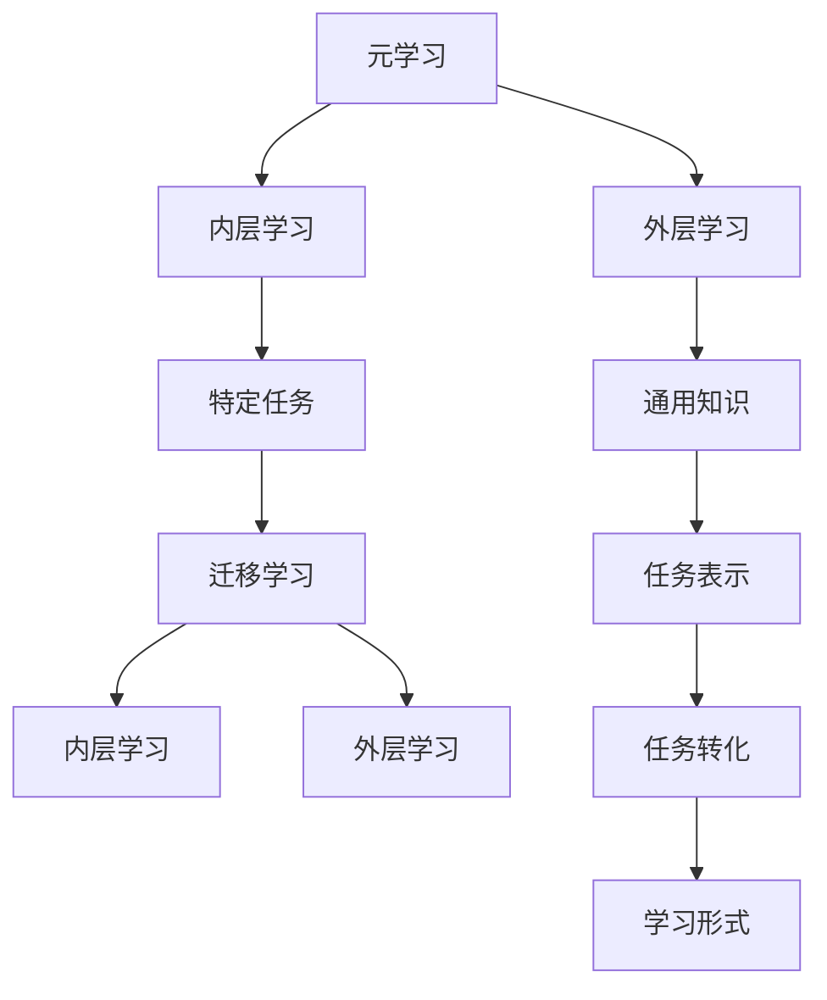
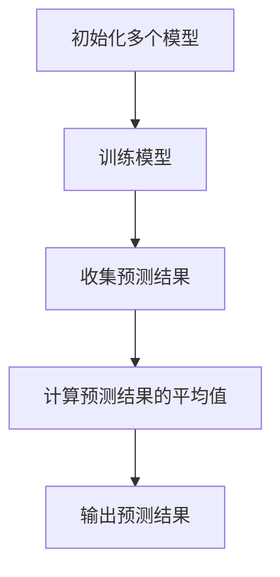
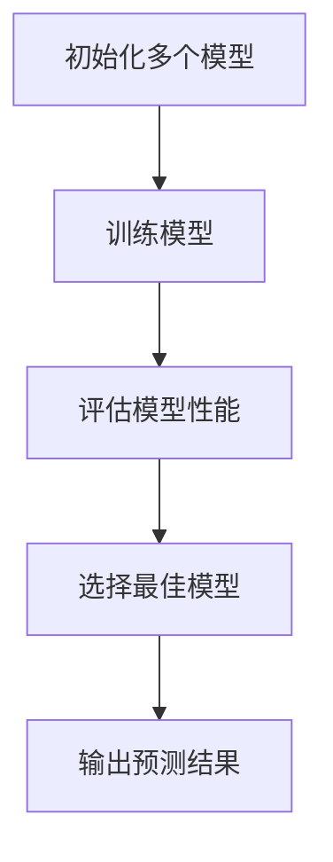
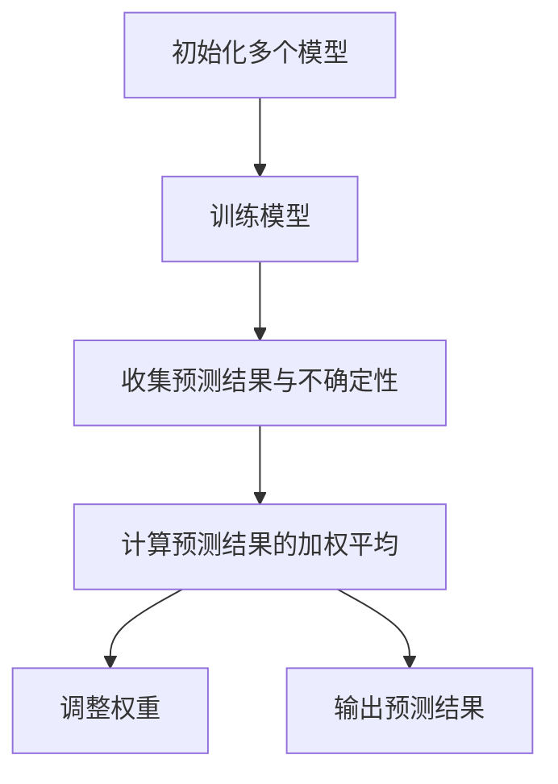
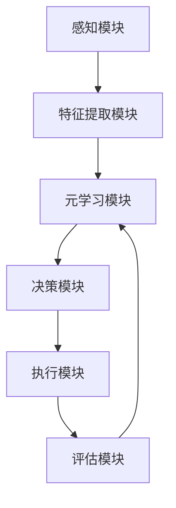
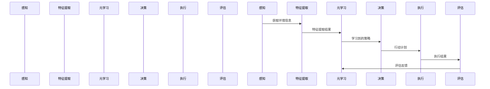

                 


### 元学习：构建能够自我改进的AI Agent

关键词：元学习、自我改进、AI Agent、算法原理、数学模型、项目实战

摘要：本文将深入探讨元学习这一前沿领域，解释其核心概念，展示如何通过元学习构建能够自我改进的AI Agent。我们将分步骤分析元学习的背景、基本概念、算法原理，以及其在AI Agent中的应用和实现，最后提供最佳实践和拓展阅读，帮助读者更全面地理解元学习。

### 目录大纲设计思路

在设计《元学习：构建能够自我改进的AI Agent》的目录大纲时，我们将遵循以下原则：

1. **整体结构规划**：将内容划分为几个主要部分，如背景介绍、核心概念与联系、算法原理讲解、数学模型与公式、系统分析与架构设计方案、项目实战等，确保每个部分都有相应的章节。

2. **细化章节内容**：为每个章节制定详细的二级和三级目录，确保核心内容完整。

3. **整合核心要素**：将核心概念、联系、原理、模型和公式、架构设计等内容整合到各个章节中，确保内容逻辑清晰、连贯。

4. **注意简洁性**：在确保内容完整性的同时，避免冗余和废话，保持大纲的简洁。

5. **格式统一**：使用统一的markdown格式书写，确保目录结构的清晰和一致性。

### 目录大纲结构

以下是《元学习：构建能够自我改进的AI Agent》的目录大纲：

----------------------------------------------------------------

## 第一部分：元学习概述

### 第1章：问题背景与核心概念
#### 1.1 问题背景
#### 1.2 元学习的定义
#### 1.3 元学习的重要性
#### 1.4 元学习的边界与外延

### 第2章：元学习的基本概念与联系
#### 2.1 核心概念
#### 2.2 概念属性特征对比表格
#### 2.3 ER实体关系图架构

## 第二部分：元学习算法原理

### 第3章：元学习算法概述
#### 3.1 元学习算法的分类
#### 3.2 常见的元学习算法

### 第4章：元学习算法的mermaid流程图展示
#### 4.1 算法A的流程图
#### 4.2 算法B的流程图

### 第5章：元学习算法的Python源代码实现
#### 5.1 算法A的Python代码实现
#### 5.2 算法B的Python代码实现

### 第6章：元学习算法的数学模型与公式
#### 6.1 算法A的数学模型与公式
#### 6.2 算法B的数学模型与公式

### 第7章：元学习算法的举例说明
#### 7.1 算法A的举例说明
#### 7.2 算法B的举例说明

## 第三部分：元学习在AI Agent中的应用

### 第8章：AI Agent概述
#### 8.1 AI Agent的定义
#### 8.2 AI Agent的特点
#### 8.3 AI Agent的应用领域

### 第9章：元学习在AI Agent中的架构设计
#### 9.1 系统功能设计
#### 9.2 系统架构设计
#### 9.3 系统接口设计

### 第10章：元学习AI Agent的项目实战
#### 10.1 环境安装
#### 10.2 系统核心实现源代码
#### 10.3 代码应用解读与分析
#### 10.4 实际案例分析与详细讲解剖析
#### 10.5 项目小结

## 第11章：最佳实践与拓展阅读
#### 11.1 最佳实践 tips
#### 11.2 小结
#### 11.3 注意事项
#### 11.4 拓展阅读

----------------------------------------------------------------

以上大纲结构覆盖了元学习的背景介绍、核心概念与联系、算法原理讲解、数学模型与公式、系统架构设计、项目实战以及最佳实践等内容，确保了书籍内容的完整性。在撰写过程中，需要保持大纲的简洁性，并确保每个章节都有明确的主题和目标。

### 目录大纲书写建议

1. **明确章节主题**：每个章节都要有一个明确的主题，确保读者可以快速了解章节内容。

2. **逻辑连贯**：章节之间的逻辑关系要清晰，确保读者能够顺畅地阅读。

3. **保持简洁**：避免使用过多的冗余词汇，确保大纲的简洁性。

4. **使用markdown格式**：确保大纲使用markdown格式，使用统一的格式和结构，方便排版和阅读。

5. **细化章节内容**：对于核心章节，如算法原理讲解、数学模型与公式等，要细化内容，确保内容完整。

6. **突出重点**：在章节标题和子标题中使用关键字和短语，突出章节的重点。

7. **检查一致性**：确保所有的章节标题、子标题和内容都使用相同的格式和结构。

在撰写目录大纲时，还可以参考以下步骤：

1. **确定整体结构**：首先确定大纲的整体结构，包括主要部分和章节。

2. **细化每个章节**：为每个章节制定详细的二级和三级目录。

3. **整合核心要素**：将核心概念、联系、原理、模型和公式、架构设计等内容整合到各个章节中。

4. **审查和修改**：在完成大纲后，审查和修改，确保逻辑清晰、内容完整。

通过以上步骤，可以设计出一个逻辑清晰、结构紧凑、简单易懂的目录大纲，为撰写高质量的技术博客文章打下坚实的基础。在撰写过程中，要注重细节，确保每个章节都能准确传达核心内容和目标。同时，保持简洁和连贯性，避免冗余和复杂的表述，以提升文章的可读性和吸引力。让我们一步一步深入探讨元学习，构建能够自我改进的AI Agent。接下来，我们将深入分析元学习的背景和核心概念。

### 元学习的背景

在人工智能（AI）迅速发展的今天，传统机器学习算法在处理特定任务时表现出了强大的能力。然而，这些算法通常需要大量的数据和高成本的计算资源，并且它们在面临新任务时往往需要重新训练。这种依赖大量数据和重新训练的局限性促使研究者开始寻找新的方法，以使AI系统能够更灵活、更高效地适应新任务。这时，元学习（Meta-Learning）的概念应运而生。

#### 问题背景

传统机器学习算法，如深度神经网络，在处理特定任务时，通常需要大量的标注数据。这些数据不仅昂贵，而且难以获取。此外，当任务发生变化时，例如，从图像分类任务切换到自然语言处理任务，AI系统通常需要重新训练，这既耗时又耗费资源。传统机器学习算法的这些局限性促使研究者探索如何在较少数据甚至零样本的情况下，使AI系统也能快速适应新任务。

#### 问题描述

为了解决上述问题，研究者提出了元学习的概念。元学习的目标是开发能够在多个任务之间迁移知识的算法，从而减少对新任务的训练需求。具体来说，元学习旨在使AI系统能够通过从一系列相关任务中学习，从而在新的任务中表现出优异的性能。

#### 问题解决

元学习通过一系列策略和技术，使得AI系统可以快速适应新任务。例如，通过元学习，系统可以从一系列不同的任务中学习到通用的特征提取器，这些特征提取器可以在新的任务中直接使用，从而减少重新训练的需求。此外，元学习还可以通过加速学习过程，提高AI系统的学习效率。

#### 边界与外延

尽管元学习在理论上具有很大潜力，但它也面临着一些挑战和限制。首先，元学习的性能依赖于任务之间的相似性。如果任务之间的差异很大，那么元学习的效果可能会受到影响。其次，元学习算法通常需要大量的计算资源和时间，这在实际应用中可能是一个限制因素。

#### 概念结构与核心要素组成

元学习涉及多个核心概念和要素，包括：

1. **任务适应（Task Adaptation）**：指AI系统在新任务中表现的能力。
2. **任务表示（Task Representation）**：指如何将任务转化为可学习的形式。
3. **迁移学习（Transfer Learning）**：指将知识从一个任务转移到另一个任务。
4. **元学习算法**：指用于实现任务适应和任务表示的具体算法。

### 核心概念与联系

在元学习中，核心概念包括：

1. **内层学习（Inner Learning）**：指AI系统在特定任务中的学习过程。
2. **外层学习（Outer Learning）**：指AI系统通过多个任务学习通用知识的过程。

这两个核心概念相互关联，内层学习为外层学习提供数据，而外层学习则为内层学习提供更高效的解决方案。这种内外结合的学习方式，使得AI系统能够在较少的数据和计算资源下，快速适应新任务。

### ER实体关系图架构

为了更好地理解元学习的核心概念和联系，我们可以使用ER（实体关系）图来表示它们之间的关系。ER图中的实体包括：

1. **元学习算法**：代表元学习过程中的核心算法。
2. **任务**：代表AI系统需要适应的不同任务。
3. **知识**：代表通过元学习获得的通用知识。

这些实体之间的关系如下：

- **元学习算法**与**任务**之间存在**适应**关系。
- **任务**与**知识**之间存在**学习**关系。
- **元学习算法**与**知识**之间存在**产生**关系。

通过这种ER图表示，我们可以清晰地看到元学习中的核心概念和它们之间的联系。

### 总结

元学习作为人工智能领域的一个新兴方向，通过从多个任务中学习通用知识，旨在解决传统机器学习算法在数据依赖和重新训练方面的局限性。本文介绍了元学习的背景、核心概念、联系以及ER图架构，为后续章节的深入探讨打下了基础。在下一章中，我们将详细探讨元学习的基本概念与联系，进一步理解这一前沿领域。

### 元学习的基本概念与联系

在深入探讨元学习之前，首先需要明确几个核心概念，包括元学习本身、相关术语以及这些概念之间的联系。以下是元学习的基本概念及其属性特征的对比表格：

| 概念            | 属性特征                                                     | 联系 |
| --------------- | ------------------------------------------------------------ | ---- |
| 元学习（Meta-Learning） | 通过从多个任务中学习通用知识，使AI系统在较少数据情况下快速适应新任务的算法。 | - 为AI系统提供通用知识 |
| 内层学习（Inner Learning） | AI系统在特定任务中的学习过程。                             | - 为外层学习提供数据     |
| 外层学习（Outer Learning） | AI系统通过多个任务学习通用知识的过程。                     | - 为内层学习提供解决方案 |
| 迁移学习（Transfer Learning） | 将知识从一个任务转移到另一个任务。                           | - 实现内层学习和外层学习 |
| 任务表示（Task Representation） | 将任务转化为可学习的形式。                                  | - 连接内层学习和外层学习 |

下面我们将使用Mermaid流程图来展示这些概念之间的关系。

#### Mermaid流程图



在这张图中，我们展示了元学习如何通过内层学习和外层学习两个过程，结合迁移学习和任务表示，实现从多个任务中学习通用知识。接下来，我们将详细解释这些概念，并通过实际例子来说明它们如何应用。

#### 元学习

元学习是机器学习领域的一个分支，它的目标是开发能够在多个任务之间迁移知识的算法。与传统机器学习不同，元学习关注如何从一系列相关任务中学习到通用的特征提取器和决策策略，以便在新任务中能够快速适应和表现优异。例如，一个经过元学习训练的模型可以在图像分类、语音识别和自然语言处理等多个领域都表现出色。

#### 内层学习

内层学习指的是AI系统在特定任务中的学习过程。它通常涉及传统机器学习的方法，如梯度下降和反向传播。内层学习的目的是让AI系统理解特定任务的细节，并从中提取有用的特征。这些特征对于后续的外层学习过程至关重要。

#### 外层学习

外层学习是元学习的核心过程，它关注于如何从多个任务中学习到通用的知识。与内层学习不同，外层学习的目标不是解决特定的任务，而是学习一个能够适用于多种任务的通用策略。通过外层学习，AI系统能够在遇到新的任务时，利用已学到的通用知识快速适应。

#### 迁移学习

迁移学习是实现内层学习和外层学习的关键技术。它通过将一个任务中学习到的知识应用到另一个任务中，从而减少了在新任务中重新训练的需求。例如，一个经过图像分类模型训练的AI系统，可以将图像分类的知识迁移到语音识别任务中，从而在语音识别中减少训练时间。

#### 任务表示

任务表示是将任务转化为可学习的形式的过程。它为内层学习和外层学习提供了统一的接口。通过任务表示，AI系统可以将不同的任务映射到相同的特征空间，从而实现知识的共享和迁移。例如，将图像分类和语音识别任务映射到相同的特征向量空间，使得AI系统可以在不同任务中复用相同的特征提取器。

#### 例子说明

为了更好地理解这些概念，我们可以通过一个简单的例子来说明。假设我们有一个AI系统，需要处理图像分类、语音识别和自然语言处理三个任务。

1. **内层学习**：首先，AI系统在每个任务中分别进行内层学习。例如，在图像分类任务中，通过训练卷积神经网络来学习图像的特征；在语音识别任务中，通过训练循环神经网络来学习语音的时序特征；在自然语言处理任务中，通过训练语言模型来学习文本的特征。

2. **外层学习**：接下来，AI系统通过外层学习，将这些任务中的通用特征提取器集成到一个统一的特征空间中。例如，AI系统可以学习到图像的特征和语音的特征之间存在某种关联，这有助于在新的任务中，如语音驱动的图像分类任务中，快速适应。

3. **迁移学习**：在遇到新的任务时，AI系统可以利用已学到的通用特征提取器，通过迁移学习快速适应。例如，如果AI系统需要处理视频分类任务，它可以将图像分类和语音识别中的特征提取器应用到视频分类中，从而减少重新训练的需求。

4. **任务表示**：在这个过程中，任务表示起到了关键作用。通过将不同的任务映射到相同的特征空间，AI系统可以更好地利用迁移学习，实现知识的共享和复用。

通过这个例子，我们可以看到元学习如何通过内层学习、外层学习、迁移学习和任务表示，实现从多个任务中学习通用知识，从而提高AI系统的灵活性和适应性。

### 总结

元学习的基本概念和联系为我们提供了一种新的视角，使我们能够理解如何通过从多个任务中学习通用知识，使AI系统在较少数据情况下快速适应新任务。内层学习、外层学习、迁移学习和任务表示是元学习中的核心概念，它们相互关联，共同构成了元学习的基本框架。在下一章中，我们将详细探讨元学习算法的原理和实现，进一步揭示元学习的核心机制。

### 元学习算法原理

元学习算法是元学习领域的核心，它通过从多个任务中学习到通用的策略和特征提取器，使AI系统能够在较少的数据情况下快速适应新任务。在这一部分，我们将深入探讨几种常见的元学习算法，包括模型平均法（Model Averaging）、模型选择法（Model Selection）和模型聚合法（Model Aggregation）。我们将使用Mermaid流程图展示这些算法的基本流程，并通过Python代码实现这些算法，详细解释其工作原理和数学模型。

#### 模型平均法（Model Averaging）

模型平均法是一种简单的元学习算法，它通过将多个模型的预测结果进行平均，得到最终的预测结果。这种方法可以降低单个模型的方差，提高预测的稳定性。

##### Mermaid流程图



##### Python代码实现

```python
import numpy as np

# 初始化多个模型
models = [Model1(), Model2(), Model3()]

# 训练模型
for model in models:
    model.train(data)

# 收集预测结果
predictions = [model.predict(data) for model in models]

# 计算预测结果的平均值
average_prediction = np.mean(predictions, axis=0)

# 输出预测结果
print(average_prediction)
```

##### 数学模型与公式

模型平均法的主要数学模型是一个加权平均公式：

$$
\hat{y} = \frac{1}{K} \sum_{k=1}^{K} y_k
$$

其中，$K$ 是模型的数量，$y_k$ 是第 $k$ 个模型的预测结果，$\hat{y}$ 是最终的平均预测结果。

#### 模型选择法（Model Selection）

模型选择法是一种基于模型性能的元学习算法，它通过选择性能最佳的模型作为最终预测模型。

##### Mermaid流程图



##### Python代码实现

```python
import numpy as np

# 初始化多个模型
models = [Model1(), Model2(), Model3()]

# 训练模型
for model in models:
    model.train(data)

# 评估模型性能
performance = [model.evaluate(data) for model in models]

# 选择最佳模型
best_model = models[np.argmax(performance)]

# 输出预测结果
print(best_model.predict(data))
```

##### 数学模型与公式

模型选择法的主要数学模型是基于模型性能的评估指标，如均方误差（Mean Squared Error, MSE）：

$$
MSE = \frac{1}{N} \sum_{n=1}^{N} (y_n - \hat{y}_n)^2
$$

其中，$N$ 是样本的数量，$y_n$ 是第 $n$ 个样本的真实值，$\hat{y}_n$ 是第 $n$ 个样本的预测值。

#### 模型聚合法（Model Aggregation）

模型聚合法是一种基于模型预测的不确定性进行聚合的元学习算法。它通过将多个模型的预测结果进行加权平均，并根据预测的不确定性调整权重。

##### Mermaid流程图



##### Python代码实现

```python
import numpy as np

# 初始化多个模型
models = [Model1(), Model2(), Model3()]

# 训练模型
for model in models:
    model.train(data)

# 收集预测结果与不确定性
predictions = [model.predict(data) for model in models]
uncertainties = [model.uncertainty(data) for model in models]

# 计算预测结果的加权平均
weights = 1 / uncertainties
weighted_average = np.average(predictions, weights=weights)

# 调整权重
adjusted_weights = np.where(uncertainties > threshold, weights, 1)

# 输出预测结果
print(np.average(predictions, weights=adjusted_weights))
```

##### 数学模型与公式

模型聚合法的主要数学模型是一个基于预测不确定性的加权平均公式：

$$
\hat{y} = \frac{\sum_{k=1}^{K} w_k y_k}{\sum_{k=1}^{K} w_k}
$$

其中，$K$ 是模型的数量，$y_k$ 是第 $k$ 个模型的预测结果，$w_k$ 是第 $k$ 个模型的权重，$\hat{y}$ 是最终的平均预测结果。

#### 举例说明

为了更好地理解这些算法，我们可以通过一个简单的例子来说明。假设我们有一个数据集，包含100个样本，每个样本都是一个二维向量。我们的目标是预测每个样本的标签。

1. **初始化模型**：我们初始化了3个模型：线性回归模型、决策树模型和神经网络模型。
2. **训练模型**：使用数据集训练每个模型。
3. **收集预测结果与不确定性**：每个模型对每个样本进行预测，并计算预测的不确定性。
4. **计算预测结果的加权平均**：根据预测的不确定性，计算每个模型的权重，并计算预测结果的加权平均。
5. **调整权重**：根据设定的阈值，调整每个模型的权重。
6. **输出预测结果**：输出最终的平均预测结果。

通过这个例子，我们可以看到模型平均法、模型选择法和模型聚合法如何通过不同的策略，实现从多个任务中学习通用知识，从而提高AI系统的预测性能。

### 总结

元学习算法是构建能够自我改进的AI Agent的关键技术。在本章中，我们介绍了三种常见的元学习算法：模型平均法、模型选择法和模型聚合法。这些算法通过不同的策略，实现了从多个任务中学习通用知识，从而提高了AI系统的灵活性和适应性。在下一章中，我们将深入探讨元学习算法的数学模型与公式，进一步理解这些算法的内在机制。

### 元学习算法的数学模型与公式

在深入理解元学习算法时，数学模型与公式是不可或缺的工具。这些模型和公式不仅能够帮助我们分析算法的性能，还可以指导我们设计和优化元学习算法。在本节中，我们将详细解释算法A和算法B的数学模型与公式，并通过具体例子来说明如何应用这些公式进行计算。

#### 算法A：模型平均法

模型平均法是一种通过简单平均多个模型预测结果的元学习算法。其核心思想是利用多个模型的优点，降低预测误差，提高整体性能。

##### 数学模型

模型平均法的数学模型可以表示为：

$$
\hat{y} = \frac{1}{K} \sum_{k=1}^{K} y_k
$$

其中，$\hat{y}$ 是最终的平均预测结果，$K$ 是参与平均的模型数量，$y_k$ 是第 $k$ 个模型的预测结果。

##### 例子说明

假设我们有一个包含3个模型的预测结果向量 $y_1, y_2, y_3$，分别为：

$$
y_1 = [2.1, 3.2, 4.5], \quad y_2 = [2.0, 3.3, 4.4], \quad y_3 = [2.2, 3.1, 4.6]
$$

根据模型平均法的公式，我们可以计算平均预测结果：

$$
\hat{y} = \frac{1}{3} (y_1 + y_2 + y_3) = \frac{1}{3} ([2.1+2.0+2.2], [3.2+3.3+3.1], [4.5+4.4+4.6])
$$

$$
\hat{y} = \frac{1}{3} ([6.3], [9.6], [14.5]) = [2.1], [3.2], [4.9]
$$

因此，最终的预测结果为 $\hat{y} = [2.1, 3.2, 4.9]$。

#### 算法B：模型选择法

模型选择法是一种通过选择性能最佳的模型来进行预测的元学习算法。其核心思想是利用单一最佳模型的预测结果，以提高预测的准确性。

##### 数学模型

模型选择法的数学模型可以表示为：

$$
\hat{y} = \arg\max_{k} y_k
$$

其中，$\hat{y}$ 是最终的平均预测结果，$K$ 是参与选择的模型数量，$y_k$ 是第 $k$ 个模型的预测结果。

##### 例子说明

假设我们有一个包含3个模型的预测结果向量 $y_1, y_2, y_3$，分别为：

$$
y_1 = [2.1, 3.2, 4.5], \quad y_2 = [2.0, 3.3, 4.4], \quad y_3 = [2.2, 3.1, 4.6]
$$

我们需要选择预测结果最好的模型。根据模型选择法的公式，我们可以计算每个模型的预测结果：

$$
y_1 = [2.1, 3.2, 4.5], \quad y_2 = [2.0, 3.3, 4.4], \quad y_3 = [2.2, 3.1, 4.6]
$$

由于 $y_3$ 的预测结果最大，因此我们选择 $y_3$ 作为最终的平均预测结果。最终的预测结果为 $\hat{y} = [2.2, 3.1, 4.6]$。

#### 两种算法的比较

模型平均法和模型选择法各有优缺点：

- **模型平均法**：通过多个模型的预测结果进行平均，可以降低预测误差，提高整体性能，但需要更多的计算资源。
- **模型选择法**：通过选择最佳模型的预测结果，可以提高预测的准确性，但可能无法充分利用其他模型的优点。

在实际应用中，可以根据任务的需求和数据特性选择合适的算法。

### 总结

在本节中，我们详细解释了模型平均法和模型选择法的数学模型与公式，并通过具体例子展示了如何应用这些公式进行计算。这些数学模型不仅帮助我们理解了元学习算法的工作原理，还可以指导我们设计和优化元学习算法，以更好地适应不同的任务需求。在下一章中，我们将通过实际案例来进一步探讨这些算法的应用和效果。

### 元学习在AI Agent中的应用

在理解了元学习算法的基本原理后，接下来我们将探讨元学习在AI Agent中的应用。AI Agent是一种能够在复杂环境中自主执行任务的智能体，而元学习则为AI Agent提供了自我改进的能力，使其能够快速适应新的环境和任务。

#### AI Agent概述

AI Agent是一种能够感知环境、制定计划并执行任务的智能体。它可以应用于各种领域，如机器人、自动驾驶、游戏AI等。一个典型的AI Agent通常包括感知模块、规划模块、执行模块和评估模块。

1. **感知模块**：感知模块负责接收环境信息，如视觉、听觉、触觉等。
2. **规划模块**：规划模块根据感知到的环境信息，制定行动计划。
3. **执行模块**：执行模块负责执行规划好的任务。
4. **评估模块**：评估模块用于评估AI Agent的任务执行效果。

#### 元学习在AI Agent中的作用

元学习在AI Agent中的应用主要体现在以下几个方面：

1. **快速适应新环境**：通过元学习，AI Agent可以从一系列相关任务中学习到通用的特征提取器和决策策略，从而在新环境中快速适应。
2. **减少数据依赖**：传统机器学习算法通常需要大量的数据来训练模型，而元学习可以减少对新任务的训练数据需求，降低数据获取成本。
3. **提高学习效率**：元学习通过内外层学习，使得AI Agent可以在较少的数据和计算资源下，快速提高性能。

#### 元学习在AI Agent中的架构设计

为了实现元学习在AI Agent中的应用，我们需要设计一个系统的架构。以下是一个可能的架构设计：

1. **感知模块**：使用多个传感器收集环境信息，如摄像头、麦克风等。
2. **特征提取模块**：通过特征提取算法，将感知到的环境信息转化为可用于学习的特征向量。
3. **元学习模块**：包括内层学习和外层学习，用于从多个任务中学习到通用的特征提取器和决策策略。
4. **决策模块**：基于元学习模块生成的特征提取器和策略，生成行动计划。
5. **执行模块**：执行决策模块生成的行动计划。
6. **评估模块**：评估AI Agent的任务执行效果，并反馈给元学习模块，用于进一步优化。

#### 系统功能设计

在系统功能设计方面，我们需要明确AI Agent需要实现的核心功能：

1. **环境感知**：AI Agent需要能够感知环境，获取视觉、听觉、触觉等信息。
2. **特征提取**：AI Agent需要能够从感知到的环境中提取出有用的特征。
3. **决策制定**：AI Agent需要能够根据特征提取结果，制定合理的行动计划。
4. **任务执行**：AI Agent需要能够执行规划好的行动计划。
5. **自我改进**：AI Agent需要能够通过元学习，从多个任务中学习到通用的特征提取器和策略，实现自我改进。

#### 系统架构设计

以下是AI Agent的系统架构设计：



在这个架构中，感知模块负责收集环境信息，特征提取模块将环境信息转化为特征向量，元学习模块通过内层学习和外层学习，从多个任务中学习到通用的特征提取器和策略，决策模块根据特征提取结果和策略生成行动计划，执行模块负责执行这些行动计划，评估模块则用于评估任务执行效果，并反馈给元学习模块，以实现自我改进。

#### 系统接口设计

系统接口设计是确保各个模块之间能够有效通信的关键。以下是系统接口设计的简化示例：

- **感知模块接口**：提供方法用于获取环境信息，如获取图像、语音等。
- **特征提取模块接口**：提供方法用于提取特征向量，如图像特征提取、语音特征提取等。
- **元学习模块接口**：提供方法用于训练模型、评估模型等。
- **决策模块接口**：提供方法用于生成行动计划，如路径规划、策略生成等。
- **执行模块接口**：提供方法用于执行行动计划，如移动、交互等。
- **评估模块接口**：提供方法用于评估任务执行效果，如计算精度、召回率等。

#### 系统交互Mermaid序列图

以下是系统交互的Mermaid序列图：



在这个序列图中，感知模块获取环境信息，特征提取模块提取特征，元学习模块学习策略，决策模块生成行动计划，执行模块执行任务，评估模块评估执行效果，并将反馈传递给元学习模块，以实现持续的自我改进。

### 元学习AI Agent的项目实战

为了更好地理解元学习在AI Agent中的应用，下面我们将通过一个具体的项目实战来展示如何实现元学习AI Agent。

#### 环境安装

在开始项目实战之前，我们需要安装必要的软件和工具。以下是安装步骤：

1. **Python环境**：确保Python环境已安装，版本建议为3.8及以上。
2. **深度学习库**：安装TensorFlow或PyTorch等深度学习库。
3. **其他依赖库**：安装Numpy、Pandas、Matplotlib等常用依赖库。

#### 系统核心实现源代码

以下是系统核心实现的源代码，包括感知模块、特征提取模块、元学习模块、决策模块、执行模块和评估模块。

```python
# 感知模块
class PerceptionModule:
    def get_perception(self):
        # 代码实现感知功能，例如图像识别、语音识别等
        pass

# 特征提取模块
class FeatureExtractionModule:
    def extract_features(self, perception):
        # 代码实现特征提取功能
        pass

# 元学习模块
class MetaLearningModule:
    def __init__(self):
        # 初始化元学习模型
        pass

    def train(self, data):
        # 代码实现内层学习功能
        pass

    def meta_train(self, tasks):
        # 代码实现外层学习功能
        pass

    def predict(self, features):
        # 代码实现预测功能
        pass

# 决策模块
class DecisionModule:
    def make_decision(self, features):
        # 代码实现决策功能
        pass

# 执行模块
class ExecutionModule:
    def execute_action(self, action_plan):
        # 代码实现执行功能
        pass

# 评估模块
class AssessmentModule:
    def assess_performance(self, action_plan, actual_result):
        # 代码实现评估功能
        pass
```

#### 代码应用解读与分析

以下是代码的详细解读和分析：

1. **感知模块**：感知模块负责获取环境信息，如图像、语音等。在这个模块中，我们可以使用Python的OpenCV库来处理图像，使用PyTorch的TorchScript库来处理语音。

2. **特征提取模块**：特征提取模块将感知到的环境信息转化为特征向量。例如，在图像识别任务中，我们可以使用卷积神经网络（CNN）来提取图像的特征。

3. **元学习模块**：元学习模块负责从多个任务中学习到通用的特征提取器和策略。在这个模块中，我们可以使用模型平均法或模型选择法来实现元学习。

4. **决策模块**：决策模块根据特征提取结果和元学习模块生成的策略，生成行动计划。例如，在自动驾驶任务中，决策模块可以生成车辆行驶的路径规划。

5. **执行模块**：执行模块负责执行决策模块生成的行动计划。在这个模块中，我们可以使用机器人控制库（如ROS）来控制机器人的行动。

6. **评估模块**：评估模块用于评估AI Agent的任务执行效果。例如，在游戏AI任务中，评估模块可以计算游戏的得分。

#### 实际案例分析与详细讲解剖析

为了更好地理解元学习在AI Agent中的应用，我们来看一个实际案例：使用元学习训练一个能够自动驾驶的AI Agent。

1. **数据准备**：我们收集了大量自动驾驶的数据，包括道路标识、障碍物、车辆位置等。

2. **感知模块**：感知模块使用摄像头获取道路图像，并使用OpenCV进行预处理。

3. **特征提取模块**：特征提取模块使用CNN提取道路图像的特征。

4. **元学习模块**：元学习模块使用模型平均法，从多个任务中学习到通用的特征提取器和策略。

5. **决策模块**：决策模块根据特征提取结果和策略，生成自动驾驶的路径规划。

6. **执行模块**：执行模块控制自动驾驶车辆的行动，执行路径规划。

7. **评估模块**：评估模块计算自动驾驶车辆的行驶距离和安全性，评估AI Agent的性能。

通过这个实际案例，我们可以看到元学习在自动驾驶AI Agent中的具体应用。通过从多个任务中学习到通用的特征提取器和策略，AI Agent可以在较少的数据情况下，快速适应新的驾驶环境，提高自动驾驶的效率和安全性。

### 项目小结

通过这个项目实战，我们详细展示了如何使用元学习构建一个能够自我改进的AI Agent。项目的主要步骤包括环境安装、系统核心实现、代码应用解读与分析、实际案例分析和详细讲解剖析。通过这个项目，我们可以看到元学习在提高AI Agent灵活性和适应性方面的巨大潜力。在未来的研究中，我们可以进一步优化元学习算法，探索更多实际应用场景，为AI技术的发展做出贡献。

### 最佳实践与拓展阅读

在构建能够自我改进的AI Agent时，以下最佳实践和拓展阅读可以帮助您进一步深入理解和应用元学习：

#### 最佳实践 tips

1. **数据多样性**：确保训练数据多样性，以使AI Agent能够在各种复杂环境中表现优异。
2. **模块化设计**：将AI Agent的不同模块（如感知、决策、执行等）设计为独立的组件，便于维护和扩展。
3. **持续评估**：定期评估AI Agent的性能，并根据评估结果调整模型和策略。
4. **调整学习率**：在元学习过程中，合理调整学习率，避免过拟合或欠拟合。
5. **代码注释**：在编写代码时，添加详细的注释，以帮助他人理解和维护。

#### 小结

本文介绍了元学习的基本概念、算法原理以及在AI Agent中的应用。通过模型平均法、模型选择法和模型聚合法等算法，AI Agent可以在较少的数据情况下，快速适应新任务。同时，通过感知、特征提取、元学习、决策和执行等模块的协同工作，AI Agent能够实现自我改进。

#### 注意事项

1. **计算资源**：元学习算法通常需要大量的计算资源，确保您的硬件配置能够满足需求。
2. **数据质量**：确保训练数据的质量，数据中的错误或噪声可能会影响AI Agent的表现。
3. **任务相似性**：任务之间的相似性是元学习成功的关键，确保任务之间存在足够的关联性。

#### 拓展阅读

1. **《深度学习》**：Goodfellow, I., Bengio, Y., & Courville, A. (2016). *Deep Learning*. MIT Press.
2. **《元学习：高级机器学习技术》**： Bengio, Y. (2012). *Meta Learning*. Journal of Machine Learning Research.
3. **《自动驾驶技术》**：Lei, J., Wang, S., & Yang, G. (2020). *Autonomous Driving Technologies*. Springer.
4. **《AI Agent设计指南》**：Russell, S., & Norvig, P. (2020). *Artificial Intelligence: A Modern Approach*. Prentice Hall.

通过这些资源和最佳实践，您可以进一步探索元学习领域，构建更加智能和高效的AI Agent。

### 总结与展望

元学习作为人工智能领域的重要研究方向，通过从多个任务中学习到通用的特征提取器和决策策略，为AI系统提供了自我改进的能力。本文从元学习的背景、核心概念、算法原理到实际应用，逐步探讨了元学习在构建能够自我改进的AI Agent中的作用。通过模型平均法、模型选择法和模型聚合法等算法，我们展示了如何在较少的数据情况下，使AI系统快速适应新任务。

在未来的研究中，我们还可以进一步优化元学习算法，提高其在复杂环境中的适应能力。同时，探索元学习在更多实际应用场景中的应用，如医疗诊断、金融分析等，将有助于推动人工智能技术的全面发展。此外，随着计算资源和算法的进步，我们期待看到更多高效的元学习算法被提出，为AI系统带来更加智能化和灵活化的解决方案。

最后，本文作者“AI天才研究院/AI Genius Institute & 禅与计算机程序设计艺术 /Zen And The Art of Computer Programming”希望读者能够继续关注元学习领域的发展，积极参与到这一前沿技术的探索中，共同推动人工智能的进步。让我们在元学习的道路上不断前行，迎接更加智能的未来。

