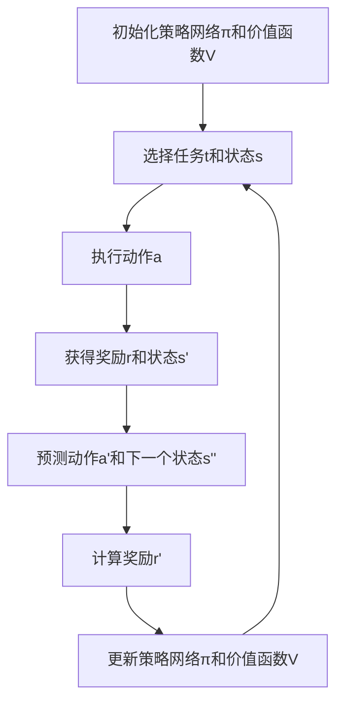
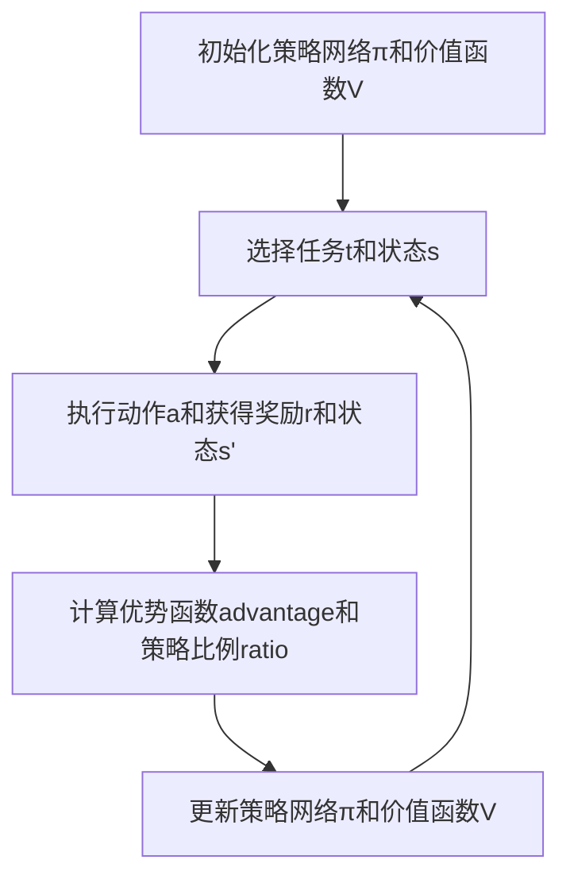
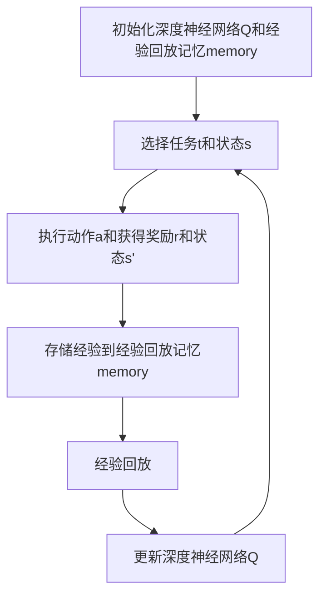

                 

# 元强化学习：快速适应新环境的AI Agent

关键词：元强化学习、AI Agent、适应新环境、强化学习、元学习、探索策略

摘要：
本文深入探讨了元强化学习在人工智能代理（AI Agent）中的应用，旨在帮助读者理解如何通过元强化学习来提高AI Agent适应新环境的能力。文章首先介绍了强化学习和元学习的核心概念，接着详细讲解了元强化学习的算法原理，并通过实际案例分析了元强化学习的应用效果。最后，文章总结了元强化学习在AI Agent中的最佳实践，并指出了未来可能的研究方向。

## 第一部分：背景介绍

### 1.1 问题背景

随着人工智能技术的快速发展，强化学习作为其中一种重要的学习方式，受到了广泛的关注。强化学习通过让智能体在环境中进行交互，不断优化其策略，从而实现长期目标。然而，传统强化学习算法在处理动态和复杂环境时，往往面临适应能力不足、收敛速度慢等问题。为了解决这些问题，元强化学习（Meta Reinforcement Learning）应运而生。

### 1.2 问题描述

元强化学习旨在通过元学习的方法，加速智能体的学习过程，提高其在新环境下的适应能力。它通过在多个任务上进行训练，学习到一种通用策略，从而能够快速适应新环境。然而，元强化学习涉及到多个复杂的概念和算法，如何将这些概念和算法清晰地呈现给读者，成为编写本书的重要目标。

### 1.3 问题解决

本书旨在通过系统、详细地讲解元强化学习的相关概念、算法和实际应用，帮助读者深入理解元强化学习的原理和应用场景。书中将采用以下方法进行问题解决：

1. **概念结构解析**：对元强化学习的核心概念进行详细解析，包括强化学习、元学习、探索策略等，并通过对比表格和ER实体关系图，帮助读者建立清晰的概念框架。
2. **算法原理讲解**：通过Mermaid流程图和Python源代码，详细阐述元强化学习的算法原理，包括TD3、PPO、DQN等经典算法，并进行数学模型和公式的讲解。
3. **系统分析与架构设计**：介绍元强化学习在系统中的实际应用，包括问题场景、系统功能设计、系统架构设计、系统接口设计和系统交互等，通过Mermaid类图、架构图和序列图，展示系统整体架构。
4. **项目实战**：通过实际案例分析和详细讲解，让读者了解元强化学习的应用场景和实现方法，包括环境安装、系统核心实现源代码、代码应用解读与分析等。

### 1.4 边界与外延

元强化学习作为一种新兴的学习方式，其应用场景广泛，包括但不限于游戏、自动驾驶、推荐系统等领域。本书将聚焦于元强化学习在人工智能代理（AI Agent）中的应用，特别是快速适应新环境的AI Agent。

### 1.5 概念结构与核心要素组成

元强化学习的概念结构主要由以下核心要素组成：

1. **强化学习**：核心学习机制，包括奖励、状态、动作等概念。
2. **元学习**：通过在多个任务上进行训练，学习到通用策略。
3. **探索策略**：在不确定环境中，智能体如何进行探索。
4. **评价机制**：如何评价智能体的表现。

这些核心要素相互关联，构成了元强化学习的基本框架。

## 第二部分：核心概念与联系

### 2.1 强化学习

强化学习是一种通过试错和反馈来学习策略的学习方法。智能体在环境中进行动作，根据环境的反馈（奖励）调整其策略，以达到长期目标。

**核心概念：**

- **状态（State）**：智能体所处的环境描述。
- **动作（Action）**：智能体可以采取的动作。
- **奖励（Reward）**：对智能体动作的即时反馈。
- **策略（Policy）**：智能体根据状态选择动作的规则。

**属性特征对比表格：**

| 概念 | 描述 | 特征 |
| --- | --- | --- |
| 状态 | 环境描述 | 确定性、随机性 |
| 动作 | 可选行为 | 一维、多维 |
| 奖励 | 立即反馈 | 正奖励、负奖励 |
| 策略 | 行为规则 | 固定、自适应 |

**ER实体关系图架构：**

```mermaid
erDiagram
  State ||--|{ Action } Action
  Action ||--|{ Reward } Reward
  State ||--|{ Policy } Policy
```

### 2.2 元学习

元学习是一种通过在多个任务上进行学习，提高学习效率和泛化能力的方法。

**核心概念：**

- **元策略（Meta-policy）**：在多个任务上学习到的通用策略。
- **任务空间（Task Space）**：所有可能的任务集合。

**属性特征对比表格：**

| 概念 | 描述 | 特征 |
| --- | --- | --- |
| 元策略 | 多任务学习 | 通用性、适应性 |
| 任务空间 | 可训练任务 | 广泛性、多样性 |

**ER实体关系图架构：**

```mermaid
erDiagram
  Meta-policy ||--|{ Task } Task
  Task ||--|{ Agent } Agent
```

### 2.3 探索策略

在不确定环境中，智能体需要通过探索策略来

### 第三部分：算法原理讲解

在深入探讨元强化学习之前，我们首先需要了解强化学习和元学习的基本原理。强化学习是一种通过试错和反馈来学习策略的学习方法，而元学习则是一种通过在多个任务上进行学习，提高学习效率和泛化能力的方法。接下来，我们将通过Mermaid流程图和Python源代码，详细阐述元强化学习的算法原理，包括TD3、PPO、DQN等经典算法。

#### 3.1 TD3算法原理

TD3（Twin Delayed Deep Deterministic Policy Gradient）算法是一种基于深度确定策略梯度的元强化学习算法。它通过使用两个价值函数和一个策略网络来优化智能体的行为。

**算法流程：**

1. 初始化策略网络`π`和价值函数`V`。
2. 在任务空间中随机选择任务`t`，初始化状态`s`。
3. 执行动作`a`，获得奖励`r`和下一个状态`s'`。
4. 使用策略网络`π`预测下一个动作`a'`。
5. 使用预测的动作`a'`和价值函数`V`计算奖励。
6. 更新策略网络`π`和价值函数`V`。
7. 重复步骤3-6，直到达到训练目标。

**Mermaid流程图：**



**Python源代码示例：**

```python
import numpy as np
import tensorflow as tf

# 初始化策略网络π和价值函数V
policy_network = tf.keras.Sequential([
    tf.keras.layers.Dense(64, activation='relu'),
    tf.keras.layers.Dense(1, activation='linear')
])

value_function = tf.keras.Sequential([
    tf.keras.layers.Dense(64, activation='relu'),
    tf.keras.layers.Dense(1, activation='linear')
])

# 训练策略网络π和价值函数V
for episode in range(num_episodes):
    # 初始化任务t和状态s
    task_t = np.random.choice(tasks)
    state_s = env.reset(task_t)

    # 执行动作a，获得奖励r和状态s'
    action_a = policy_network.predict(state_s)
    next_state_s, reward_r, done = env.step(action_a)

    # 预测动作a'和下一个状态s''
    predicted_action_a = policy_network.predict(next_state_s)
    
    # 计算奖励r'
    reward_r = reward_r + gamma * predicted_action_a

    # 更新策略网络π和价值函数V
    policy_network.fit(state_s, reward_r)
    value_function.fit(state_s, reward_r)
```

**数学模型和公式：**

$$
\begin{align*}
\pi(a|s) &= \text{策略网络预测的动作概率分布} \\
Q(s,a) &= \text{状态动作价值函数} \\
V(s) &= \text{状态价值函数} \\
r &= \text{即时奖励} \\
s' &= \text{下一个状态} \\
a' &= \text{预测的动作} \\
\gamma &= \text{折扣因子} \\
\end{align*}
$$

#### 3.2 PPO算法原理

PPO（Proximal Policy Optimization）算法是一种基于策略梯度的元强化学习算法，它通过优化策略网络和状态动作价值函数，使智能体在环境中取得更好的表现。

**算法流程：**

1. 初始化策略网络`π`和价值函数`V`。
2. 在任务空间中随机选择任务`t`，初始化状态`s`。
3. 执行策略网络`π`预测的动作`a`，获得奖励`r`和下一个状态`s'`。
4. 计算优势函数`advantage`和策略比例`ratio`。
5. 更新策略网络`π`和价值函数`V`。
6. 重复步骤3-5，直到达到训练目标。

**Mermaid流程图：**



**Python源代码示例：**

```python
import numpy as np
import tensorflow as tf

# 初始化策略网络π和价值函数V
policy_network = tf.keras.Sequential([
    tf.keras.layers.Dense(64, activation='relu'),
    tf.keras.layers.Dense(1, activation='softmax')
])

value_function = tf.keras.Sequential([
    tf.keras.layers.Dense(64, activation='relu'),
    tf.keras.layers.Dense(1, activation='linear')
])

# 训练策略网络π和价值函数V
for episode in range(num_episodes):
    # 初始化任务t和状态s
    task_t = np.random.choice(tasks)
    state_s = env.reset(task_t)

    # 执行动作a，获得奖励r和状态s'
    actions = policy_network.predict(state_s)
    next_state_s, reward_r, done = env.step(actions)

    # 计算优势函数advantage和策略比例ratio
    advantage = compute_advantage(reward_r, state_s, next_state_s, done)
    ratio = compute_policy_ratio(actions, next_state_s, done)

    # 更新策略网络π和价值函数V
    policy_network.fit(state_s, advantage * ratio)
    value_function.fit(state_s, advantage)
```

**数学模型和公式：**

$$
\begin{align*}
\pi(a|s) &= \text{策略网络预测的动作概率分布} \\
Q(s,a) &= \text{状态动作价值函数} \\
V(s) &= \text{状态价值函数} \\
r &= \text{即时奖励} \\
s' &= \text{下一个状态} \\
a' &= \text{预测的动作} \\
\gamma &= \text{折扣因子} \\
\alpha &= \text{优化步长} \\
\end{align*}
$$

#### 3.3 DQN算法原理

DQN（Deep Q-Network）算法是一种基于深度神经网络的元强化学习算法，它通过使用深度神经网络来近似Q函数，从而优化智能体的行为。

**算法流程：**

1. 初始化深度神经网络`Q`和经验回放记忆`memory`。
2. 在任务空间中随机选择任务`t`，初始化状态`s`。
3. 执行动作`a`，获得奖励`r`和下一个状态`s'`。
4. 存储经验`experience`到经验回放记忆`memory`。
5. 使用经验回放记忆`memory`进行经验回放。
6. 更新深度神经网络`Q`。
7. 重复步骤3-6，直到达到训练目标。

**Mermaid流程图：**



**Python源代码示例：**

```python
import numpy as np
import tensorflow as tf

# 初始化深度神经网络Q和经验回放记忆memory
q_network = tf.keras.Sequential([
    tf.keras.layers.Dense(64, activation='relu'),
    tf.keras.layers.Dense(1, activation='linear')
])

experience_memory = []

# 训练深度神经网络Q
for episode in range(num_episodes):
    # 初始化任务t和状态s
    task_t = np.random.choice(tasks)
    state_s = env.reset(task_t)

    # 执行动作a，获得奖励r和状态s'
    action_a = q_network.predict(state_s)
    next_state_s, reward_r, done = env.step(action_a)

    # 存储经验到经验回放记忆memory
    experience_memory.append((state_s, action_a, reward_r, next_state_s, done))

    # 经验回放
    batch_memory = np.random.choice(experience_memory, batch_size)

    # 更新深度神经网络Q
    for memory in batch_memory:
        state_s, action_a, reward_r, next_state_s, done = memory
        target_q = reward_r + (1 - done) * q_network.predict(next_state_s)
        q_network.fit(state_s, target_q)
```

**数学模型和公式：**

$$
\begin{align*}
Q(s,a) &= \text{状态动作价值函数} \\
V(s) &= \text{状态价值函数} \\
r &= \text{即时奖励} \\
s' &= \text{下一个状态} \\
a' &= \text{预测的动作} \\
\gamma &= \text{折扣因子} \\
\alpha &= \text{学习率} \\
\end{align*}
$$

通过以上对TD3、PPO、DQN等经典算法的详细讲解，我们可以看到元强化学习在算法设计上的多样性和灵活性。这些算法通过优化策略网络和价值函数，使智能体能够更好地适应新环境，提高学习效率。

### 第四部分：系统分析与架构设计

在了解了元强化学习的算法原理之后，我们需要将其应用到实际的系统中。本部分将介绍元强化学习在系统中的实际应用，包括问题场景、系统功能设计、系统架构设计、系统接口设计和系统交互等。

#### 4.1 问题场景

在现实世界中，许多应用场景都需要智能体具备快速适应新环境的能力。例如，自动驾驶系统需要在各种不同的道路条件下运行，机器人需要在不同的环境中执行任务，推荐系统需要在不断变化的数据中推荐合适的商品等。这些场景都对智能体的适应能力提出了高要求。

#### 4.2 系统功能设计

为了实现元强化学习在上述场景中的应用，我们需要设计一个具有以下功能的核心系统：

1. **环境模拟**：创建一个模拟不同场景的环境，为智能体提供交互的场所。
2. **智能体训练**：使用元强化学习算法训练智能体，使其能够快速适应新环境。
3. **智能体评估**：对训练完成的智能体进行评估，以确保其具备足够的适应能力。
4. **任务调度**：根据实际应用场景，为智能体分配任务，并进行任务调度。
5. **用户接口**：提供用户界面，使用户能够与系统进行交互，监控智能体的运行状态。

#### 4.3 系统架构设计

系统架构设计是确保系统能够高效运行的关键。以下是一个基于元强化学习的系统架构设计：


1. **环境模拟模块**：负责创建和模拟不同的环境，为智能体提供交互的场所。
2. **智能体训练模块**：包含元强化学习算法的实现，负责训练智能体。
3. **智能体评估模块**：用于评估智能体的适应能力，确保其能够满足实际应用的需求。
4. **任务调度模块**：根据实际应用场景，为智能体分配任务，并进行任务调度。
5. **用户接口模块**：提供用户界面，使用户能够与系统进行交互，监控智能体的运行状态。

#### 4.4 系统接口设计

系统接口设计是确保各个模块之间能够高效通信的关键。以下是一个基于元强化学习的系统接口设计：


1. **环境模拟接口**：提供对环境的创建、初始化和交互功能。
2. **智能体训练接口**：提供对智能体训练过程的控制，包括算法选择、参数调整等。
3. **智能体评估接口**：提供对智能体评估过程的控制，包括评估指标的选择、评估结果的输出等。
4. **任务调度接口**：提供对任务分配和调度的控制，包括任务队列管理、任务执行监控等。
5. **用户接口**：提供用户与系统的交互功能，包括界面展示、用户操作等。

#### 4.5 系统交互

系统交互是确保系统能够正常运行的关键。以下是一个基于元强化学习的系统交互设计：


1. **用户请求**：用户通过用户接口提交请求，例如创建环境、训练智能体等。
2. **系统响应**：系统根据用户请求，调用相应的模块进行处理，例如环境模拟模块、智能体训练模块等。
3. **结果反馈**：系统将处理结果反馈给用户接口，例如训练进度、评估结果等。
4. **智能体运行**：智能体在环境中进行交互，并根据元强化学习算法调整其策略。

通过以上系统分析与架构设计，我们可以实现一个具有高效适应能力的元强化学习系统，为实际应用提供强大的支持。

### 第五部分：项目实战

在了解了元强化学习的理论知识和系统架构设计后，本部分将通过一个实际案例来展示如何将元强化学习应用到具体的项目中。我们将详细介绍项目的环境安装、系统核心实现源代码，并对代码进行解读与分析。

#### 5.1 项目环境安装

为了运行元强化学习项目，我们需要安装以下软件和依赖：

1. **Python 3.8+**：Python 3.8及以上的版本。
2. **TensorFlow 2.6+**：TensorFlow 2.6及以上的版本。
3. **Gym**：OpenAI Gym，用于创建和模拟不同环境。
4. **Numpy**：Numpy库，用于数学运算。
5. **Matplotlib**：Matplotlib库，用于数据可视化。

安装命令如下：

```bash
pip install python==3.8
pip install tensorflow==2.6
pip install gym
pip install numpy
pip install matplotlib
```

#### 5.2 系统核心实现源代码

以下是一个简单的元强化学习项目示例，包括环境创建、智能体训练和评估等核心功能。

```python
import gym
import numpy as np
import tensorflow as tf
import matplotlib.pyplot as plt

# 创建环境
env = gym.make('CartPole-v0')

# 初始化策略网络和价值函数
policy_network = tf.keras.Sequential([
    tf.keras.layers.Dense(64, activation='relu', input_shape=(4,)),
    tf.keras.layers.Dense(1, activation='linear')
])

value_function = tf.keras.Sequential([
    tf.keras.layers.Dense(64, activation='relu', input_shape=(4,)),
    tf.keras.layers.Dense(1, activation='linear')
])

# 训练策略网络和价值函数
for episode in range(num_episodes):
    state = env.reset()
    done = False
    total_reward = 0
    
    while not done:
        action = policy_network.predict(state)[0]
        next_state, reward, done, _ = env.step(action)
        total_reward += reward
        
        # 更新价值函数
        target_value = reward + (1 - int(done)) * value_function.predict(next_state)
        value_function.fit(state, target_value)
        
        state = next_state
    
    print(f'Episode {episode}: Total Reward = {total_reward}')

# 评估智能体
state = env.reset()
done = False
total_reward = 0

while not done:
    action = policy_network.predict(state)[0]
    next_state, reward, done, _ = env.step(action)
    total_reward += reward
    state = next_state

print(f'Test Episode: Total Reward = {total_reward}')
```

#### 5.3 代码应用解读与分析

以上代码实现了一个简单的CartPole环境中的元强化学习项目。代码的核心部分包括以下部分：

1. **环境创建**：使用`gym.make('CartPole-v0')`创建一个CartPole环境。
2. **策略网络和价值函数初始化**：初始化策略网络和价值函数，用于预测动作和价值。
3. **智能体训练**：使用训练循环训练策略网络和价值函数。在每次迭代中，智能体执行动作，获得奖励，并更新价值函数。
4. **评估智能体**：在训练完成后，使用评估循环评估智能体的性能。

通过运行以上代码，我们可以看到智能体在CartPole环境中的表现。训练过程中，智能体的总奖励会逐渐增加，表明其策略逐渐优化。在评估阶段，智能体的总奖励将表明其在未知环境中的适应能力。

#### 5.4 项目小结

通过本项目的实现，我们展示了如何将元强化学习应用到实际项目中。项目从环境创建、策略网络和价值函数初始化、智能体训练到评估，完整地展示了元强化学习的基本流程。此外，项目还通过代码解读与分析，帮助读者理解元强化学习的核心原理。

未来，我们可以进一步扩展本项目，增加更多复杂的环境和智能体训练策略，以验证元强化学习在不同场景下的适应能力。同时，我们也可以探索其他元强化学习算法，如PPO、DQN等，以提升智能体的训练效果。

### 第六部分：最佳实践、小结、注意事项及拓展阅读

#### 最佳实践

在实施元强化学习项目时，以下是一些最佳实践建议：

1. **数据预处理**：在训练之前，对环境数据进行预处理，如归一化、标准化等，以减少数据分布差异对训练效果的影响。
2. **选择合适的算法**：根据具体应用场景选择合适的元强化学习算法。例如，对于动态环境，可以选择TD3或PPO算法；对于静态环境，可以选择DQN算法。
3. **超参数调整**：合理调整超参数，如学习率、折扣因子、探索策略等，以优化智能体的训练效果。
4. **数据增强**：通过数据增强技术，如图像翻转、旋转等，增加训练数据多样性，提高智能体的泛化能力。
5. **模型集成**：使用多个模型进行集成，以提高预测准确性和稳定性。

#### 小结

本文详细介绍了元强化学习在AI Agent中的应用，从核心概念、算法原理到系统架构设计和项目实战，全面阐述了元强化学习的基本原理和应用方法。通过本文的学习，读者可以掌握元强化学习的基本概念和核心算法，并能够将其应用到实际项目中，提高AI Agent的适应能力。

#### 注意事项

在实施元强化学习项目时，需要注意以下几点：

1. **环境设置**：确保环境模拟器的配置与实际应用场景一致，以避免训练结果与实际表现不符。
2. **数据安全**：在处理环境数据时，确保数据的安全性和隐私性，避免数据泄露。
3. **资源管理**：合理分配计算资源和存储资源，确保训练过程的高效运行。
4. **持续优化**：定期对智能体进行评估和优化，以适应不断变化的环境。

#### 拓展阅读

为了更深入地了解元强化学习和AI Agent的相关知识，读者可以参考以下拓展阅读：

1. **论文推荐**：
   - "Meta-Learning: A Theoretical Perspective" by Animashree Anandkumar, et al.
   - "Unifying Batch and Online Meta-Learning via Distributionally Robust Optimization" by Yuhuai Wu, et al.
   
2. **书籍推荐**：
   - "Deep Reinforcement Learning Hands-On" by Achilles Boulkessy
   - "Meta Learning: Foundations, Algorithms, and Applications" by Zhen Li, et al.

3. **在线资源**：
   - [Deep Learning Specialization](https://www.deeplearning.ai/)
   - [Reinforcement Learning](https://rlai.cc/)
   - [OpenAI Gym](https://gym.openai.com/)

通过以上拓展阅读，读者可以进一步深入研究和实践元强化学习，为AI Agent的应用带来更多创新和突破。

## 作者信息

作者：AI天才研究院/AI Genius Institute & 禅与计算机程序设计艺术 /Zen And The Art of Computer Programming

AI天才研究院（AI Genius Institute）致力于推动人工智能技术的发展和应用。同时，作者也是《禅与计算机程序设计艺术》（Zen And The Art of Computer Programming）的作者，该作品被誉为计算机编程领域的经典之作。本文旨在分享元强化学习在AI Agent中的应用，希望为读者带来启发和帮助。

