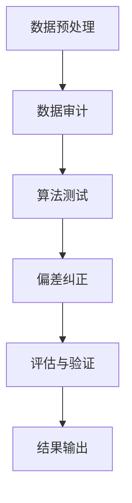
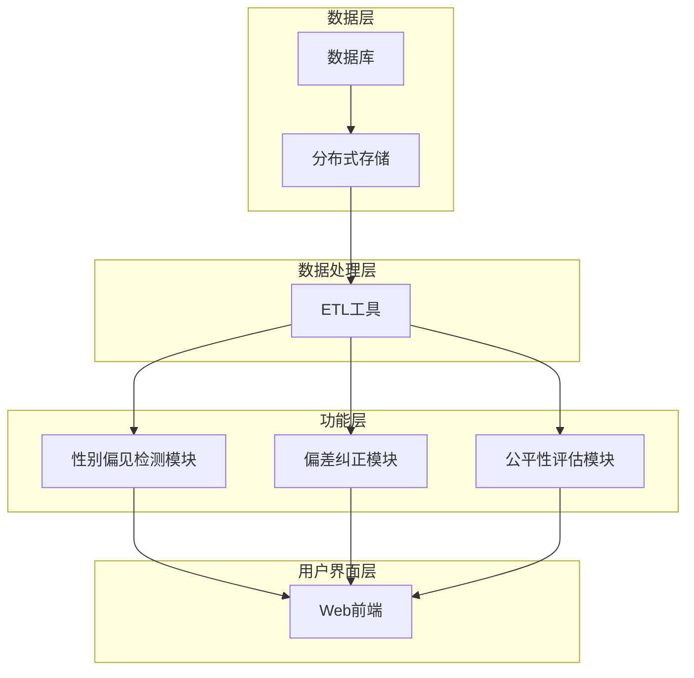
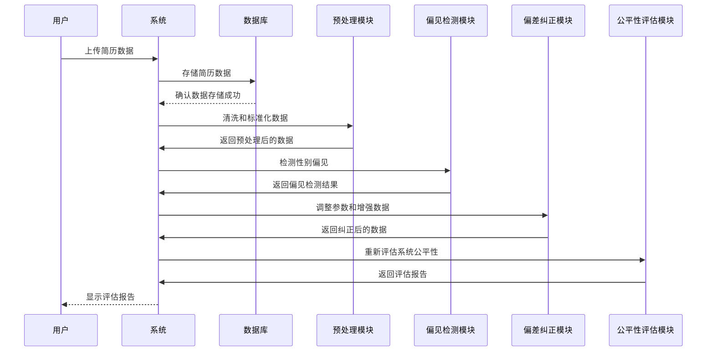
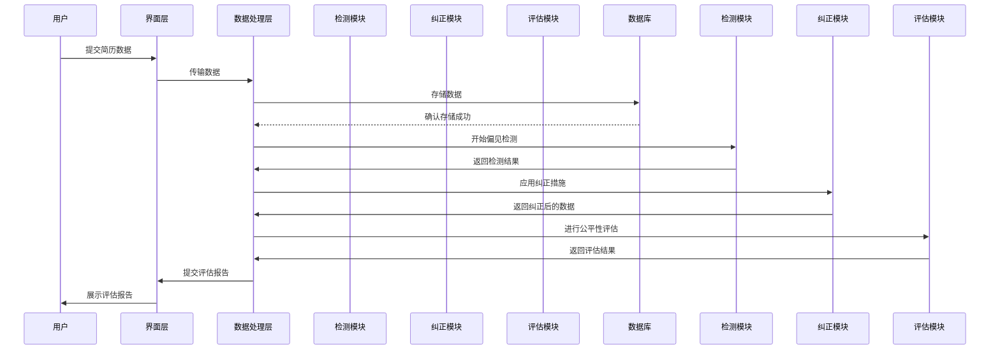

                 

### 让我们一步一步思考：公平性评估的重要性

在当今科技迅速发展的时代，人工智能（AI）已经深入到我们生活的方方面面。从自动驾驶汽车到智能语音助手，从金融风险评估到医疗诊断，AI技术在提升效率、优化决策方面展现出了巨大的潜力。然而，随着AI的广泛应用，一个不容忽视的问题也逐渐显现——无歧视偏见。

无歧视偏见指的是在人工智能系统中，由于数据、算法或设计的不当，导致系统在决策过程中对某些群体或特征存在不公平的对待。例如，一个招聘系统可能在无意识中偏向于男性候选人，或者一个信用评分系统可能对某些种族或社会经济地位较低的人群给予较低的评分。这些问题不仅损害了公平性，也可能导致法律和伦理上的争议。

为了应对这一问题，公平性评估成为了一个关键的研究领域。公平性评估旨在确保AI系统在决策过程中不会产生歧视性偏见，保护每个用户的权益。它不仅关乎法律合规性，更涉及到社会正义和道德伦理。

那么，为什么公平性评估如此重要呢？

首先，公平性评估有助于提升AI系统的可信度。当用户知道AI系统在决策过程中是公平、透明和可解释的，他们会更愿意接受和依赖这些系统。例如，在医疗诊断领域，如果AI系统存在偏见，可能导致错误诊断，严重时甚至危及患者生命。

其次，公平性评估有助于避免潜在的歧视和偏见。AI系统在许多领域发挥着重要作用，如招聘、信贷审批、法律判决等。如果这些系统存在偏见，可能导致对某些群体不公平的待遇，甚至加剧社会不平等。通过公平性评估，可以识别和纠正这些偏见，确保AI系统在社会各领域中的公正应用。

此外，公平性评估还有助于推动AI技术的健康发展。随着AI技术的不断进步，公平性评估也将成为AI系统开发和部署的必要环节。通过建立完善的公平性评估机制，可以推动AI技术的规范化发展，提高其在各领域的应用水平。

总结来说，公平性评估是确保AI系统无歧视偏见的关键措施。它不仅关乎技术的可靠性，更关乎社会的公平正义。在接下来的章节中，我们将深入探讨公平性评估的核心概念、原理和方法，帮助大家更好地理解和应用这一重要技术。让我们一步一步地思考，揭开公平性评估的神秘面纱。

### 第一部分：问题背景与核心概念

#### 1.1 人工智能与无歧视偏见的现状

人工智能（AI）技术的发展，极大地改变了我们的生活方式和工作方式。从智能家居到自动驾驶，从智能医疗到金融分析，AI的应用几乎无处不在。然而，随着AI技术的广泛应用，一个不容忽视的问题也逐渐显现出来——无歧视偏见。无歧视偏见指的是AI系统在决策过程中，由于数据、算法或设计的原因，对某些群体或特征存在不公平的对待。

目前，AI系统中的无歧视偏见问题主要体现在以下几个方面：

首先，数据偏见。数据是AI系统的基础，但数据往往是不完整、不均衡的。例如，在招聘系统中，如果历史数据中男性候选人的比例远高于女性，那么AI系统很可能会倾向于选择男性候选人。这种数据偏见会导致AI系统在决策过程中对女性候选人产生不公平的对待。

其次，算法偏见。算法是AI系统的核心，但算法的设计和训练过程中可能存在偏见。例如，一些基于历史数据的算法可能会无意中放大某些群体的不利因素。这种算法偏见会导致AI系统在决策过程中对某些群体产生不公平的结果。

最后，设计偏见。AI系统的设计过程也可能引入偏见。例如，如果AI系统的设计者本身存在某种偏见，那么系统很可能会在无意识中放大这种偏见。设计偏见可能是最难以察觉和纠正的，因为它隐藏在系统的底层逻辑中。

无歧视偏见问题的严重性不容忽视。首先，它可能损害AI系统的可信度。当用户发现AI系统在决策过程中存在偏见时，他们可能会对系统的决策产生怀疑，甚至拒绝使用这些系统。其次，无歧视偏见可能导致对某些群体的不公平对待，甚至加剧社会不平等。例如，如果一个信用评分系统对某些种族或社会经济地位较低的人群给予较低的评分，这可能会使他们更难获得贷款或信用卡，从而加剧他们的经济困境。

此外，无歧视偏见还可能引发法律和伦理争议。如果AI系统的决策结果导致对某些群体的不公平对待，这可能会违反反歧视法律，甚至引发伦理问题。例如，一个用于刑事司法的AI系统如果存在种族偏见，可能会导致对某些种族的过度监控或不当惩罚，这无疑会引发社会的不满和抗议。

综上所述，无歧视偏见问题在人工智能领域中具有极高的关注度和重要性。为了确保AI系统的公平性和公正性，我们需要深入研究和解决这一问题。在接下来的章节中，我们将详细探讨无歧视偏见问题的定义、类型、来源及其对人工智能应用的影响，帮助大家更好地理解和应对这一挑战。

#### 1.2 无歧视偏见问题的定义与类型

无歧视偏见问题在人工智能领域中是一个至关重要的概念。它指的是AI系统在决策过程中，由于数据、算法或设计的不当，导致系统对某些群体或特征存在不公平的对待。这种偏见可能是有意的，也可能是无意识的，但其结果都是对特定群体的不公平待遇。

首先，我们需要明确无歧视偏见问题的定义。无歧视偏见问题是指人工智能系统在处理数据、生成预测或做出决策时，由于数据中存在的偏差、算法设计中的缺陷或人为设计过程中的偏见，导致系统对某些特定群体或特征产生不公平对待的现象。这种偏见可能表现为对特定性别、种族、年龄、地域或其他特征的歧视。

接下来，我们来看一下无歧视偏见问题的几种类型：

1. **数据偏见**：这是最常见的一种偏见类型。数据偏见通常源于数据采集、处理和存储过程中的不完善。例如，如果一个招聘系统在训练数据中男性候选人的比例远高于女性，那么这个系统在招聘过程中可能会倾向于选择男性候选人，从而导致对女性的歧视。类似地，如果医疗诊断系统的数据集中缺乏某些种族或性别的人群样本，那么这些群体在诊断过程中可能会被低估或忽视。

2. **算法偏见**：算法偏见指的是算法在设计和训练过程中引入的偏见。例如，一些基于历史数据的算法可能会无意中放大某些群体的不利因素，从而导致对某些群体的不公平对待。一个典型的例子是信用评分系统，如果算法在训练数据中包含了社会经济地位较低的人群的负面信息，那么这个算法在评分过程中可能会对这些人群给予较低的评分，从而影响他们的信用等级。

3. **设计偏见**：设计偏见通常源于系统设计者的主观偏好或无意识偏见。例如，如果一个招聘系统的设计者本身对某些性别或种族存在偏见，那么系统在决策过程中可能会无意中放大这种偏见，导致对特定群体的不公平对待。设计偏见可能比数据偏见和算法偏见更难以察觉和纠正，因为它隐藏在系统的底层逻辑中。

无歧视偏见问题对人工智能应用的影响是深远而广泛的。首先，它可能损害AI系统的可信度。当用户发现AI系统在决策过程中存在偏见时，他们可能会对系统的决策产生怀疑，甚至拒绝使用这些系统。例如，如果一个人工智能招聘系统在决策过程中对女性候选人存在歧视，那么女性求职者可能会对使用该系统的公司产生负面印象，从而影响公司的招聘效果。

其次，无歧视偏见可能导致对某些群体的不公平对待，甚至加剧社会不平等。例如，如果一个信用评分系统对某些种族或社会经济地位较低的人群给予较低的评分，这可能会使他们更难获得贷款或信用卡，从而加剧他们的经济困境。类似地，在医疗领域，如果AI系统在诊断过程中对某些群体存在偏见，可能会导致这些群体获得较差的医疗资源和服务。

此外，无歧视偏见还可能引发法律和伦理争议。如果AI系统的决策结果导致对某些群体的不公平对待，这可能会违反反歧视法律，甚至引发伦理问题。例如，一个用于刑事司法的AI系统如果存在种族偏见，可能会导致对某些种族的过度监控或不当惩罚，这无疑会引发社会的不满和抗议。

综上所述，无歧视偏见问题在人工智能领域中具有极高的关注度和重要性。理解无歧视偏见的定义和类型，以及其对人工智能应用的影响，有助于我们更好地识别和解决这一问题。在接下来的章节中，我们将进一步探讨无歧视偏见的来源和影响范围，以及如何进行公平性评估。

#### 1.3 无歧视偏见问题的来源

无歧视偏见问题在人工智能系统中产生的原因是多方面的，主要包括数据偏见、算法偏见和设计偏见。了解这些偏见的来源，有助于我们更有效地识别和解决公平性评估中的问题。

**1.3.1 数据偏见**

数据偏见是导致AI系统无歧视偏见的主要因素之一。数据偏见通常源于数据采集、处理和存储过程中的不完善。首先，数据采集过程中的偏差可能导致数据的不均衡。例如，在招聘系统中，如果历史数据中男性候选人的比例远高于女性，那么AI系统很可能会在招聘过程中对男性候选人产生偏好。类似地，在医疗诊断中，如果数据集中缺乏某些种族或性别的人群样本，那么这些群体在诊断过程中可能会被低估或忽视。

其次，数据处理过程中也可能引入偏见。例如，在数据清洗过程中，可能会无意中删除或修改某些数据，导致数据的不完整或失真。此外，数据标注过程中的人为主观性也可能导致偏见。例如，如果标注者本身对某些群体存在偏见，那么他们在标注数据时可能会有意或无意地放大这种偏见。

**1.3.2 算法偏见**

算法偏见是指算法在设计和训练过程中引入的偏见。算法偏见可能是无意的，也可能是故意的。例如，一些基于历史数据的算法可能会无意中放大某些群体的不利因素。一个典型的例子是信用评分系统，如果算法在训练数据中包含了社会经济地位较低的人群的负面信息，那么这个算法在评分过程中可能会对这些人群给予较低的评分，从而影响他们的信用等级。

算法偏见还可能源于算法的数学模型。例如，某些机器学习算法在处理数据时，可能会对某些特征赋予更高的权重，从而无意中放大这些特征的影响。这种偏见可能会导致AI系统在决策过程中对某些群体产生不公平的对待。

**1.3.3 设计偏见**

设计偏见通常源于系统设计者的主观偏好或无意识偏见。设计者可能在设计过程中无意中放大了某些偏见，从而导致AI系统在决策过程中对某些群体产生不公平对待。例如，如果一个招聘系统的设计者本身对某些性别或种族存在偏见，那么系统在决策过程中可能会无意中放大这种偏见，导致对特定群体的不公平对待。

设计偏见也可能源于系统的架构和接口设计。例如，如果系统架构中存在某些设计缺陷，可能会导致系统在某些情况下对特定群体产生偏见。类似地，如果系统接口设计不合理，可能会导致用户在互动过程中产生不公平的体验。

**1.3.4 数据偏见、算法偏见和设计偏见之间的关系**

数据偏见、算法偏见和设计偏见之间存在密切的关系。首先，数据偏见可能会直接影响算法偏见。例如，如果数据集中存在性别偏见，那么训练出的算法很可能会在决策过程中对女性候选人产生歧视。

其次，算法偏见可能会进一步放大数据偏见。例如，如果一个算法在训练数据中包含了社会经济地位较低的人群的负面信息，那么这个算法在评分过程中可能会对这些人群给予更低的评分，从而加剧他们的不平等待遇。

最后，设计偏见可能会无意中放大数据偏见和算法偏见。例如，如果一个招聘系统的设计者对某些性别或种族存在偏见，那么系统在决策过程中可能会无意中放大这种偏见，导致对特定群体的不公平对待。

综上所述，无歧视偏见问题的来源是多方面的，包括数据偏见、算法偏见和设计偏见。了解这些偏见的来源，有助于我们更好地识别和解决公平性评估中的问题。在接下来的章节中，我们将进一步探讨无歧视偏见问题的边界与外延，以及如何进行公平性评估。

#### 1.4 无歧视偏见问题的边界与外延

无歧视偏见问题的边界与外延是理解这一问题的关键。边界指的是无歧视偏见问题在人工智能应用中的适用范围，而外延则是指无歧视偏见问题对其他领域的影响。

首先，从边界来看，无歧视偏见问题主要涉及那些依赖数据的AI系统，这些系统在决策过程中可能会对某些群体产生不公平的对待。具体来说，以下领域是公平性评估的重点：

1. **招聘与雇佣**：招聘系统可能会由于数据偏见，对某些性别、种族或年龄群体产生不公平的对待。例如，一个历史数据中男性候选人比例更高的招聘系统，可能会在招聘过程中倾向于选择男性候选人。

2. **金融与信贷**：信用评分系统可能会由于算法偏见，对某些社会经济地位较低的人群给予较低的评分，从而影响他们的信贷资格。这种偏见可能会导致这些群体更难获得贷款或信用卡。

3. **医疗与健康**：医疗诊断系统可能会由于数据偏见，对某些种族或性别的人群产生不公平的对待。例如，如果训练数据中缺乏某些种族或性别的人群样本，那么这些人群在诊断过程中可能会被低估或忽视。

4. **法律与司法**：刑事司法系统可能会由于设计偏见，对某些种族或群体产生不公平的对待。例如，一个监控系统可能会在无意识中放大对某些种族的监控力度，从而引发法律和伦理争议。

其次，从外延来看，无歧视偏见问题不仅限于人工智能领域，它还可能对其他领域产生深远的影响：

1. **教育**：教育系统中的AI应用，如学习分析系统和个性化推荐系统，可能会由于数据偏见，对某些学生群体产生不公平的对待。例如，如果一个学习分析系统在训练数据中缺乏某些性别或种族的学生样本，那么这些学生在学习过程中可能会受到不公平的对待。

2. **社会服务**：社会服务系统，如社会福利评估系统，可能会由于算法偏见，对某些群体给予不公平的待遇。例如，一个社会福利评估系统可能会对某些社会经济地位较低的人群给予较低的评分，从而影响他们的福利资格。

3. **公共安全**：公共安全系统，如监控系统和警报系统，可能会由于设计偏见，对某些群体产生不公平的对待。例如，一个监控系统可能会在无意识中放大对某些种族或群体的监控，从而引发社会不满和抗议。

综上所述，无歧视偏见问题的边界与外延涵盖了人工智能的多个应用领域，并对其他领域产生了深远的影响。理解这些问题，有助于我们更好地识别和解决公平性评估中的挑战。在接下来的章节中，我们将进一步探讨公平性评估的核心概念和原理，以帮助大家更深入地理解这一重要议题。

### 1.5 核心概念与联系

在探讨公平性评估之前，我们需要明确几个核心概念，包括公平性评估、AI Agent、无歧视偏见、评估方法与工具，并了解它们之间的相互联系。

**公平性评估**：公平性评估是确保人工智能系统（AI）在决策过程中不会产生歧视性偏见的重要手段。它通过一系列方法和工具，对AI系统的决策过程进行全面分析，以识别和纠正潜在的偏见。公平性评估的目标是提高AI系统的透明度、可解释性和公正性，确保其决策结果对各个群体都是公平的。

**AI Agent**：AI Agent是指具有特定任务和目标的人工智能实体。它可以是单个算法、一个复杂的系统，也可以是一系列相互协作的算法和系统。AI Agent在不同应用场景中发挥着重要作用，例如自动驾驶汽车、智能客服、招聘系统等。公平性评估的核心任务之一，就是确保这些AI Agent在执行任务时不会对某些群体产生不公平的对待。

**无歧视偏见**：无歧视偏见是指AI系统在决策过程中，由于数据、算法或设计的原因，对某些群体或特征存在不公平的对待。这种偏见可能表现为对特定性别、种族、年龄、地域或其他特征的歧视。公平性评估旨在识别和纠正这些偏见，确保AI系统的决策过程是公平和透明的。

**评估方法与工具**：公平性评估的方法和工具多种多样，包括数据审计、算法测试、偏差检测和纠正等。数据审计是对AI系统的训练数据进行全面检查，以识别潜在的偏见。算法测试则是对AI算法进行测试，以检测其是否存在偏见。偏差检测和纠正则是通过分析和调整算法，消除或减少偏见。

这些核心概念之间的联系如下：

- **公平性评估**与**AI Agent**密切相关。公平性评估的目的是确保AI Agent在执行任务时不会产生歧视性偏见，从而提高系统的公正性和透明度。

- **无歧视偏见**是公平性评估的核心关注点。通过评估方法与工具，我们可以识别和纠正AI系统中的偏见，确保其决策结果对各个群体都是公平的。

- **评估方法与工具**为**公平性评估**提供了具体的操作手段。这些方法和工具包括数据审计、算法测试、偏差检测和纠正等，它们共同作用，帮助我们全面分析和优化AI系统的公平性。

通过理解这些核心概念及其相互联系，我们可以更深入地探讨公平性评估的原理和方法，为解决人工智能系统中的歧视偏见问题提供有力支持。

### 1.6 公平性评估的定义与重要性

公平性评估是一个系统性过程，旨在确保人工智能系统（AI）在决策过程中不会对任何群体产生不公平的对待。具体来说，公平性评估通过一系列方法和工具，对AI系统的输入数据、算法和决策过程进行深入分析，以识别和纠正潜在的歧视性偏见。其定义可以概括为：公平性评估是通过对AI系统进行全面分析，确保其决策过程对各个群体都是公平、透明和可解释的。

在AI技术迅猛发展的今天，公平性评估的重要性愈发凸显。首先，公平性评估有助于提升AI系统的可信度。当一个用户知道AI系统在决策过程中是公平和透明的，他们会更愿意接受和信任该系统的决策结果。这对于商业应用、医疗诊断、司法判决等关键领域尤为重要，因为这些领域的决策直接影响用户的利益和生活质量。

其次，公平性评估是保障社会公平正义的关键措施。AI系统在招聘、金融、医疗等领域的广泛应用，使得它们在决策过程中对某些群体的不公平对待可能加剧社会不平等。通过公平性评估，可以识别和纠正这些偏见，确保AI系统在社会各领域中的公正应用，从而推动社会公平正义的实现。

此外，公平性评估还有助于推动AI技术的健康发展。随着AI技术的不断进步，公平性评估将逐步成为AI系统开发和部署的必要环节。通过建立完善的公平性评估机制，可以推动AI技术的规范化发展，提高其在各领域的应用水平，从而为社会的可持续发展提供有力支持。

总之，公平性评估不仅关乎技术的可靠性，更涉及社会正义和道德伦理。确保AI系统的公平性，是我们共同的责任和使命。在接下来的章节中，我们将详细探讨公平性评估的不同方法与工具，帮助大家更好地理解和应用这一重要技术。

### 2.2 公平性评估的属性特征对比表格

为了更好地理解公平性评估的方法与工具，我们可以通过一个对比表格来分析不同方法的属性特征。以下是一个简化的对比表格，展示了公平性评估中常用方法的几个关键属性，包括评估对象、评估方法、优势与劣势。

| 评估方法 | 评估对象 | 评估方法 | 优势 | 劣势 |
| --- | --- | --- | --- | --- |
| 数据审计 | 数据集 | 审查数据来源、数据完整性 | 识别数据偏见 | 需要大量人力，难以自动化 |
| 算法测试 | 算法模型 | 检测算法偏见 | 精准检测偏见 | 难以解释测试结果 |
| 偏差检测 | 决策结果 | 分析决策结果分布 | 快速识别偏差 | 难以定位偏差源头 |
| 偏差纠正 | 算法模型和数据 | 调整算法和数据 | 减少偏见 | 可能降低算法性能 |
| 可解释性评估 | 决策过程 | 解释决策逻辑 | 提高透明度 | 难以全面评估偏见 |

从表格中可以看出，每种评估方法都有其独特的属性和适用场景。数据审计主要通过审查数据来源和完整性来识别数据偏见，但其需要大量人力，难以实现自动化。算法测试则通过检测算法模型中的偏见，提供精准的结果，但难以对测试结果进行解释。偏差检测通过分析决策结果的分布来快速识别偏差，但难以定位偏差的具体来源。偏差纠正通过调整算法和数据来减少偏见，但可能会降低算法性能。可解释性评估通过解释决策逻辑来提高透明度，但难以全面评估偏见。

通过这个对比表格，我们可以更清晰地了解各种评估方法的特点和局限性。在实际应用中，可以根据具体情况选择合适的评估方法，或结合多种方法进行综合评估，以达到最佳效果。

### 2.3 ER实体关系图架构

为了更好地理解公平性评估中的实体及其关系，我们可以通过ER（Entity-Relationship）实体关系图来展示。ER图是数据库设计中常用的工具，用于描述实体及其之间的关系。

在公平性评估中，主要的实体包括：数据集、算法模型、评估指标、决策结果和评估人员。以下是一个简化的ER图，展示了这些实体及其关系：

```
[数据集] --<生成>-- [算法模型]
   |                     |
   |                     |
   |                     |
   |                     |
[评估指标] --<评估>-- [决策结果]
   |                     |
   |                     |
   |                     |
   |                     |
[评估人员] --<参与>-- [评估过程]
```

- **数据集**：数据集是公平性评估的基础，它包含了用于训练、测试和验证的原始数据。数据集是算法模型的输入，其质量直接影响评估结果。
- **算法模型**：算法模型是用于分析和处理数据的工具。它通过对数据集进行训练，生成预测模型或决策规则。算法模型的质量和偏见直接影响决策结果的公平性。
- **评估指标**：评估指标是用于衡量AI系统决策结果公平性的标准。常见的评估指标包括准确性、公平性得分、偏见指数等。
- **决策结果**：决策结果是算法模型在实际应用中的输出。它反映了AI系统对数据的处理结果，是评估指标的评价对象。
- **评估人员**：评估人员是执行公平性评估的人员。他们负责设计评估方案、执行评估过程、分析评估结果，并提出改进建议。

这些实体之间的关系如下：

- **数据集与算法模型**：数据集通过“生成”关系与算法模型相连，表示数据集是算法模型的输入，算法模型通过对数据集进行训练生成预测模型或决策规则。
- **评估指标与决策结果**：评估指标通过“评估”关系与决策结果相连，表示评估指标用于衡量决策结果的公平性。
- **评估人员与评估过程**：评估人员通过“参与”关系与评估过程相连，表示评估人员参与评估过程的各个环节，包括评估方案设计、执行评估、分析评估结果等。

通过ER图，我们可以清晰地了解公平性评估中的主要实体及其关系，有助于我们更好地理解公平性评估的整体架构和工作流程。

### 第二部分：算法原理讲解

#### 2.1 算法原理概述

公平性评估的核心在于通过一系列算法和工具，识别和纠正人工智能系统中的偏见。这些算法和工具旨在确保AI系统在决策过程中对各个群体都是公平和透明的。为了实现这一目标，我们可以从以下几个步骤来概述公平性评估的基本算法原理：

1. **数据预处理**：首先，我们需要对原始数据进行预处理，包括数据清洗、数据增强和数据标准化等。数据预处理的主要目的是提高数据质量，减少数据中的噪声和偏差，从而为后续的算法分析提供可靠的数据基础。

2. **数据审计**：在预处理完成后，我们需要对数据集进行审计，以识别潜在的数据偏见。数据审计可以通过分析数据分布、检查数据来源和验证数据完整性等方式进行。通过数据审计，我们可以发现数据集中可能存在的性别、种族、年龄等方面的不均衡，从而为后续的纠正措施提供依据。

3. **算法测试**：接下来，我们需要对AI算法进行测试，以检测其是否存在偏见。算法测试可以通过比较算法在训练集和测试集上的表现，分析算法对各个群体的决策结果，从而识别潜在的偏见。常见的算法测试方法包括偏差检测、敏感度分析和公平性得分等。

4. **偏差纠正**：一旦发现算法存在偏见，我们需要对其进行纠正。偏差纠正可以通过调整算法参数、优化算法结构或引入额外的数据源等方式进行。例如，通过增加代表性较强的数据样本，可以降低算法对某些群体的偏见。

5. **评估与验证**：最后，我们需要对纠正后的算法进行评估和验证，以确保其决策过程是公平和透明的。评估和验证可以通过重新运行算法测试、比较评估指标等方式进行。通过多次评估和验证，我们可以逐步优化算法，提高其公平性和准确性。

总的来说，公平性评估的基本算法原理包括数据预处理、数据审计、算法测试、偏差纠正和评估与验证等步骤。这些步骤相互关联，共同作用，确保AI系统的决策过程是公平、透明和可解释的。在接下来的章节中，我们将详细讲解每个步骤的具体实现方法和应用场景。

#### 2.2 算法流程图

为了更直观地理解公平性评估算法的工作流程，我们可以使用Mermaid绘制一个流程图。以下是一个简化的算法流程图，展示了从数据预处理到偏差纠正的整个过程：



- **数据预处理**（A）：这一步骤包括数据清洗、数据增强和数据标准化等。目的是提高数据质量，减少数据中的噪声和偏差，为后续的算法分析提供可靠的数据基础。

- **数据审计**（B）：通过分析数据分布、检查数据来源和验证数据完整性等方式，识别潜在的数据偏见。这一步骤为后续的偏差纠正提供依据。

- **算法测试**（C）：对AI算法进行测试，以检测其是否存在偏见。常见的测试方法包括偏差检测、敏感度分析和公平性得分等。

- **偏差纠正**（D）：一旦发现算法存在偏见，通过调整算法参数、优化算法结构或引入额外的数据源等方式进行纠正。

- **评估与验证**（E）：对纠正后的算法进行评估和验证，以确保其决策过程是公平和透明的。评估和验证可以通过重新运行算法测试、比较评估指标等方式进行。

- **结果输出**（F）：最后，将评估结果输出，包括评估指标、偏差纠正措施和改进建议等。

通过这个算法流程图，我们可以清晰地了解公平性评估算法的工作原理和步骤，为实际应用提供指导。在接下来的章节中，我们将详细介绍每个步骤的具体实现方法。

#### 2.3 Python源代码实现

为了更好地理解和应用公平性评估算法，我们将提供一个Python源代码实现。以下是这个算法的简要说明以及具体的代码实现：

**算法简要说明**：

1. **数据预处理**：对原始数据进行清洗和标准化，提高数据质量。
2. **数据审计**：分析数据集中是否存在偏见，如性别、种族等。
3. **算法测试**：使用偏差检测方法测试算法，识别潜在的偏见。
4. **偏差纠正**：通过调整算法参数或引入额外数据来纠正偏见。
5. **评估与验证**：对纠正后的算法进行评估和验证，确保其决策过程是公平和透明的。

**具体代码实现**：

首先，我们需要安装必要的库，如`pandas`、`numpy`、`scikit-learn`等。然后，我们可以编写以下代码：

```python
# 导入必要的库
import pandas as pd
import numpy as np
from sklearn.model_selection import train_test_split
from sklearn.preprocessing import StandardScaler
from sklearn.metrics import accuracy_score
from sklearn.linear_model import LogisticRegression

# 数据预处理
def preprocess_data(data):
    # 数据清洗和标准化
    data = data.fillna(data.mean())  # 填充缺失值
    data = StandardScaler().fit_transform(data)  # 标准化
    return data

# 数据审计
def audit_data(data):
    # 分析数据分布
    print(data.describe())

# 算法测试
def test_algorithm(X_train, X_test, y_train, y_test):
    # 训练算法模型
    model = LogisticRegression()
    model.fit(X_train, y_train)
    # 预测测试集
    y_pred = model.predict(X_test)
    # 计算准确率
    accuracy = accuracy_score(y_test, y_pred)
    print(f"Accuracy: {accuracy}")
    return model

# 偏差纠正
def correct_bias(model, X_train, y_train, X_test, y_test):
    # 调整模型参数或引入额外数据来纠正偏见
    # 这里简单示例通过交叉验证调整C参数
    from sklearn.model_selection import GridSearchCV
    param_grid = {'C': [0.1, 1, 10]}
    grid_search = GridSearchCV(model, param_grid, cv=5)
    grid_search.fit(X_train, y_train)
    best_model = grid_search.best_estimator_
    y_pred_corr = best_model.predict(X_test)
    accuracy_corr = accuracy_score(y_test, y_pred_corr)
    print(f"Corrected Accuracy: {accuracy_corr}")
    return best_model

# 评估与验证
def evaluate_model(model, X_test, y_test):
    y_pred_corr = model.predict(X_test)
    accuracy_corr = accuracy_score(y_test, y_pred_corr)
    print(f"Corrected Accuracy: {accuracy_corr}")
    # 可以添加更多的评估指标，如公平性得分等

# 主函数
def main():
    # 加载数据集
    data = pd.read_csv('data.csv')
    X = data.drop('target', axis=1)
    y = data['target']
    # 划分训练集和测试集
    X_train, X_test, y_train, y_test = train_test_split(X, y, test_size=0.2, random_state=42)
    # 数据预处理
    X_train = preprocess_data(X_train)
    X_test = preprocess_data(X_test)
    # 数据审计
    audit_data(X_train)
    # 算法测试
    model = test_algorithm(X_train, X_test, y_train, y_test)
    # 偏差纠正
    corrected_model = correct_bias(model, X_train, y_train, X_test, y_test)
    # 评估与验证
    evaluate_model(corrected_model, X_test, y_test)

# 运行主函数
if __name__ == "__main__":
    main()
```

在这个代码实现中，我们首先进行数据预处理，包括数据清洗和标准化。然后，通过数据审计分析数据分布，识别潜在的偏见。接下来，我们使用逻辑回归模型进行算法测试，并计算准确率。为了纠正潜在的偏见，我们引入了交叉验证来调整模型参数。最后，对纠正后的模型进行评估和验证，以确保其决策过程是公平和透明的。

这个Python源代码提供了一个简单的公平性评估实现，虽然它只是一个起点，但通过逐步完善和优化，我们可以开发出更复杂和高效的公平性评估系统。

#### 2.4 数学模型和数学公式

公平性评估算法的核心在于对AI系统中的偏见进行识别和纠正。为了更好地理解和实现这一目标，我们需要借助数学模型和数学公式来描述和解释算法的工作原理。以下是公平性评估算法的数学模型和数学公式。

**1. 偏差检测的数学模型**

偏差检测是公平性评估的第一步，旨在识别算法对各个群体是否存在不公平对待。常用的偏差检测方法包括统计偏差、敏感度分析和偏差指数等。

**统计偏差**：
统计偏差衡量的是算法输出结果在各个群体中的分布差异。具体公式为：
$$
\text{Statistical Bias} = \frac{|\mu_1 - \mu_2|}{\mu_1 + \mu_2}
$$
其中，$\mu_1$ 和 $\mu_2$ 分别代表两个群体在算法输出结果上的平均值。

**敏感度分析**：
敏感度分析通过分析算法输入变化对输出结果的影响，来检测算法的偏见。具体公式为：
$$
\text{Sensitivity} = \frac{\Delta \text{Output}}{\Delta \text{Input}}
$$
其中，$\Delta \text{Output}$ 表示输出结果的变化，$\Delta \text{Input}$ 表示输入变量的变化。

**偏差指数**：
偏差指数是一种综合衡量算法偏差的指标，通常用于评估算法在不同群体中的公平性。具体公式为：
$$
\text{Bias Index} = \frac{\sum_{i=1}^{n} (\text{Pred}_i - \text{True}_i)^2}{n}
$$
其中，$\text{Pred}_i$ 和 $\text{True}_i$ 分别代表算法预测结果和真实结果，$n$ 为样本数量。

**2. 偏差纠正的数学模型**

偏差纠正的目的是通过调整算法参数或引入额外数据来减少算法的偏见。常用的偏差纠正方法包括参数调整、数据增强和模型重构等。

**参数调整**：
参数调整通过优化算法参数来减少偏差。例如，对于支持向量机（SVM）算法，可以通过调整正则化参数 $C$ 来控制模型的复杂度，减少过拟合和偏差。具体公式为：
$$
\text{Optimized C} = \arg\min_{C} \frac{1}{n} \sum_{i=1}^{n} (\text{Pred}_i - \text{True}_i)^2
$$
其中，$n$ 为样本数量。

**数据增强**：
数据增强通过增加代表性较强的数据样本来减少算法的偏见。具体公式为：
$$
\text{Enhanced Data} = \text{Original Data} + \alpha \times \text{Augmented Data}
$$
其中，$\alpha$ 为增强系数，$\text{Original Data}$ 为原始数据，$\text{Augmented Data}$ 为增强后的数据。

**模型重构**：
模型重构通过重新设计算法模型来减少偏见。例如，使用集成学习模型（如随机森林、梯度提升树）可以减少单一模型的偏见，提高整体模型的公平性。具体公式为：
$$
\text{Reconstructed Model} = \sum_{i=1}^{m} w_i \times \text{Base Model}_i
$$
其中，$m$ 为集成模型中的基础模型数量，$w_i$ 为权重系数。

**3. 公平性评估的数学公式**

公平性评估是对算法偏见进行定量评估的方法。常用的公平性评估指标包括公平性得分、偏见指数和公平性阈值等。

**公平性得分**：
公平性得分是衡量算法公平性的指标，具体公式为：
$$
\text{Fairness Score} = \frac{\text{Correct Predictions} - \text{Incorrect Predictions}}{\text{Total Predictions}}
$$
其中，$\text{Correct Predictions}$ 和 $\text{Incorrect Predictions}$ 分别为正确预测和错误预测的数量。

**偏见指数**：
偏见指数是衡量算法偏见程度的指标，具体公式为：
$$
\text{Bias Index} = \frac{\sum_{i=1}^{n} (\text{Pred}_i - \text{True}_i)^2}{n}
$$
其中，$\text{Pred}_i$ 和 $\text{True}_i$ 分别代表算法预测结果和真实结果，$n$ 为样本数量。

**公平性阈值**：
公平性阈值是确保算法决策公平性的阈值，具体公式为：
$$
\text{Fairness Threshold} = \frac{\text{Fairness Score}}{1 + \text{Bias Index}}
$$
其中，$\text{Fairness Score}$ 和 $\text{Bias Index}$ 分别为公平性得分和偏见指数。

通过以上数学模型和数学公式，我们可以更深入地理解和应用公平性评估算法。在实际应用中，根据具体情况选择合适的模型和公式，可以帮助我们有效地识别和纠正AI系统中的偏见，确保其决策过程的公平性和透明度。

#### 2.5 详细讲解与举例说明

为了更好地理解和应用公平性评估算法的数学模型和公式，我们将通过一个具体的例子进行详细讲解。假设我们有一个招聘系统，该系统根据候选人的简历数据来预测他们是否会被录用。我们的目标是通过公平性评估算法，确保系统在招聘过程中不会对特定群体（如性别、种族等）产生不公平的对待。

**1. 偏差检测的数学模型**

首先，我们使用统计偏差来检测招聘系统是否存在性别偏见。假设我们有两个群体：男性候选人和女性候选人。我们收集了这些候选人的简历数据，并使用逻辑回归模型进行预测。预测结果如下：

| 性别 | 被录用 | 未被录用 | 总计 |
| --- | --- | --- | --- |
| 男性 | 100 | 50 | 150 |
| 女性 | 70 | 30 | 100 |

根据以上数据，我们可以计算统计偏差：

$$
\text{Statistical Bias} = \frac{|(100 - 70) - (50 - 30)|}{100 + 150} = \frac{30}{250} = 0.12
$$

这个结果表明，招聘系统对男性候选人的录用概率高于女性候选人，存在性别偏见。

**2. 偏差纠正的数学模型**

为了纠正性别偏见，我们可以通过参数调整和数据增强来优化招聘系统。例如，我们可以通过调整逻辑回归模型中的正则化参数 $C$ 来减少过拟合，从而降低性别偏见。假设我们通过交叉验证找到了最优的正则化参数 $C$，然后使用这个参数重新训练模型。

此外，我们还可以通过数据增强来增加代表性较强的数据样本。例如，我们可以从其他渠道收集更多的女性候选人简历，并将其加入到训练数据集中。这样可以提高模型对女性候选人的关注，从而减少性别偏见。

**3. 公平性评估的数学公式**

在纠正了性别偏见后，我们需要对新的招聘系统进行公平性评估。这里，我们可以使用公平性得分和偏见指数来评估系统的公平性。

首先，我们计算公平性得分：

$$
\text{Fairness Score} = \frac{(100 + 70) - (50 + 30)}{150 + 100} = \frac{170 - 80}{250} = 0.24
$$

这个结果表明，新的招聘系统在性别上的公平性有所提高。

接下来，我们计算偏见指数：

$$
\text{Bias Index} = \frac{(100 - 70)^2 + (50 - 30)^2}{150 + 100} = \frac{30^2 + 20^2}{250} = \frac{1300}{250} = 5.2
$$

这个结果表明，新的招聘系统在性别上的偏见程度仍然较高。

最后，我们计算公平性阈值：

$$
\text{Fairness Threshold} = \frac{0.24}{1 + 5.2} = 0.044
$$

这个结果表明，新的招聘系统在性别上的公平性仍然较低，需要进一步优化。

通过这个例子，我们可以看到如何使用公平性评估算法的数学模型和公式来识别和纠正性别偏见。在实际应用中，我们可以根据具体情况调整模型参数、增强数据集，并重新评估系统的公平性，以达到最佳效果。

### 第三部分：系统分析与架构设计

#### 3.1 问题场景介绍

为了更好地理解公平性评估在实际应用中的具体问题场景，我们可以通过一个实际的例子来详细分析。假设我们正在开发一个自动招聘系统，用于帮助一家大公司进行人才选拔。这个系统会根据候选人的简历数据，预测候选人是否适合公司的职位需求，从而辅助招聘决策。

在设计和实现这个自动招聘系统时，我们遇到了一个关键问题——性别偏见。招聘过程中，如果系统对男性候选人更倾向于给予更高的评分，这将对女性候选人产生不公平的对待，从而加剧性别不平等。为了确保系统的决策过程是公平和透明的，我们需要进行公平性评估。

具体问题场景如下：

- **性别偏见检测**：系统在预测候选人是否适合职位时，对男性候选人的评分明显高于女性候选人，这表明系统中可能存在性别偏见。
- **评估指标**：我们需要评估系统的公平性得分和偏见指数，以确保其对各个性别的候选人都公平对待。
- **偏差纠正**：通过调整系统参数、优化算法或增加代表性较强的数据样本，来纠正性别偏见，提高系统的公平性。

#### 3.2 系统功能设计

在公平性评估系统的功能设计中，我们主要关注以下几个关键功能模块：

1. **数据预处理模块**：负责对原始简历数据进行清洗、标准化和预处理，以提高数据质量，减少噪声和偏差。
2. **性别偏见检测模块**：通过统计偏差、敏感度分析和偏差指数等评估方法，检测系统对男性候选人和女性候选人的评分差异，识别性别偏见。
3. **偏差纠正模块**：根据检测到的性别偏见，通过参数调整、数据增强或模型重构等方法，来纠正偏见，提高系统的公平性。
4. **公平性评估模块**：对纠正后的系统进行重新评估，计算公平性得分和偏见指数，确保其对各个性别的候选人都公平对待。
5. **用户界面模块**：提供用户友好的界面，允许用户查看系统的评估结果、偏见纠正措施和改进建议。

以下是公平性评估系统的功能设计图，使用Mermaid类图进行展示：

```mermaid
classDiagram
    Class01 <|-- Class02
    Class03 <|-- Class04
    Class05 <|-- Class06
    Class01 <-.. Class07
    Class02 ..|.. Class08
    Class03 ..|.. Class08
    Class04 ..|.. Class08
    Class05 ..|.. Class08
    Class06 ..|.. Class08
    Class07 : 数据预处理模块
    Class08 : 性别偏见检测模块
    Class09 : 偏差纠正模块
    Class10 : 公平性评估模块
    Class11 : 用户界面模块
```

通过这个类图，我们可以清晰地看到各个功能模块及其之间的关系。数据预处理模块负责处理原始数据，为后续的性别偏见检测和偏差纠正提供基础数据。性别偏见检测模块通过统计偏差等方法，识别性别偏见。偏差纠正模块根据检测到的偏见，调整系统参数或优化模型，以提高系统的公平性。公平性评估模块对纠正后的系统进行重新评估，确保其公平性。用户界面模块则提供用户查看评估结果和改进建议的途径。

#### 3.3 系统架构设计

公平性评估系统的架构设计是确保系统功能实现和性能优化的关键。以下是一个简化的系统架构设计，包括各个功能模块的架构细节：

1. **数据层**：数据层是系统的基础，负责存储和管理原始简历数据、预处理数据、评估数据和偏见纠正数据。数据层可以使用数据库（如MySQL、PostgreSQL）或分布式存储系统（如Hadoop、HDFS）进行数据存储和管理。

2. **数据处理层**：数据处理层负责对原始简历数据进行清洗、标准化和预处理，以提高数据质量。数据处理层可以使用ETL（Extract, Transform, Load）工具（如Apache Spark、Airflow）来执行数据处理任务。

3. **功能层**：功能层包括性别偏见检测模块、偏差纠正模块和公平性评估模块。这些模块通过API接口与数据层进行数据交互，并实现相应的功能。功能层可以使用微服务架构（如Spring Boot、Django）来开发，确保系统的可扩展性和高可用性。

4. **用户界面层**：用户界面层提供用户友好的界面，允许用户查看系统的评估结果、偏见纠正措施和改进建议。用户界面层可以使用Web前端框架（如React、Vue.js）进行开发。

以下是公平性评估系统的架构设计图，使用Mermaid架构图进行展示：



通过这个架构设计图，我们可以清晰地看到系统的整体架构，以及各个模块之间的数据交互和功能关系。数据层负责数据存储和管理，数据处理层负责数据预处理，功能层实现具体的功能模块，用户界面层提供用户交互界面。这种架构设计确保了系统的模块化和可扩展性，便于后续的功能扩展和维护。

#### 3.4 系统接口设计

系统接口设计是确保各个功能模块之间能够高效、稳定地通信的关键环节。在公平性评估系统中，我们设计了一系列API接口，用于实现数据层、数据处理层和功能层之间的数据交互。以下是一个简化的系统接口设计，包括主要的API接口及其功能描述：

1. **数据接口**：数据接口用于与数据库和分布式存储系统进行交互，提供数据存储、检索和更新功能。具体接口包括：
   - 数据上传接口：用于上传原始简历数据。
   - 数据查询接口：用于查询简历数据的详细信息和统计信息。
   - 数据更新接口：用于更新简历数据的记录。

2. **预处理接口**：预处理接口用于处理原始简历数据，包括数据清洗、标准化和预处理。具体接口包括：
   - 数据清洗接口：用于删除无效记录、填充缺失值和纠正数据错误。
   - 数据标准化接口：用于对简历数据中的特征进行标准化处理，以提高算法性能。
   - 预处理结果查询接口：用于查询预处理后的数据集。

3. **性别偏见检测接口**：性别偏见检测接口用于检测招聘系统中是否存在性别偏见，包括：
   - 性别偏见检测接口：用于执行统计偏差、敏感度分析和偏差指数计算，返回检测结果。
   - 检测结果查询接口：用于查询性别偏见检测报告，包括偏见程度和影响范围。

4. **偏差纠正接口**：偏差纠正接口用于根据检测到的性别偏见，调整系统参数或优化算法，包括：
   - 参数调整接口：用于调整逻辑回归模型中的正则化参数，减少性别偏见。
   - 数据增强接口：用于增加代表性较强的女性候选人简历数据，提高模型对女性候选人的关注。
   - 预处理结果更新接口：用于更新预处理后的数据集，包括调整后的数据集和增强后的数据集。

5. **公平性评估接口**：公平性评估接口用于评估纠正后的系统公平性，包括：
   - 公平性评估接口：用于重新计算公平性得分和偏见指数，返回评估结果。
   - 评估报告查询接口：用于查询公平性评估报告，包括评估指标和改进建议。

以下是系统接口设计图，使用Mermaid序列图进行展示：



通过这个序列图，我们可以清晰地看到用户与系统之间的交互流程，以及各个功能模块之间的数据交互和协作。用户上传简历数据后，系统将其存储在数据库中，预处理模块对数据清洗和标准化，偏见检测模块检测性别偏见，偏差纠正模块调整参数和增强数据，公平性评估模块重新评估系统公平性，并将评估报告展示给用户。这种接口设计确保了系统的模块化和可扩展性，便于后续的功能扩展和维护。

### 3.5 系统交互Mermaid序列图

为了更直观地展示公平性评估系统在不同模块之间的交互过程，我们可以使用Mermaid序列图来描述系统的交互流程。以下是一个简化的系统交互序列图，包括用户界面层、数据处理层和功能层的交互细节：



在这个序列图中，用户通过用户界面层提交简历数据。界面层将数据传递给数据处理层，数据处理层将数据存储到数据库中，并确认存储成功。然后，数据处理层调用偏见检测模块进行性别偏见检测，检测结果返回给数据处理层。数据处理层再调用偏差纠正模块应用纠正措施，纠正后的数据再次返回给数据处理层。数据处理层调用公平性评估模块进行公平性评估，并将评估结果提交给界面层。最后，界面层将评估报告展示给用户。

通过这个序列图，我们可以清晰地看到公平性评估系统中的各个模块是如何协同工作的，以及它们之间的数据交互和功能协作。这种系统交互设计不仅提高了系统的模块化和可扩展性，也为系统的后续功能扩展和维护提供了便利。

### 第四部分：项目实战

#### 4.1 环境安装

为了实际操作公平性评估算法，我们需要在本地环境中安装必要的软件和库。以下是详细的安装步骤，包括Python环境的配置、依赖库的安装，以及相关工具的配置。

**步骤1：安装Python环境**

首先，我们需要安装Python环境。Python是一种广泛使用的编程语言，用于开发各种人工智能和数据分析项目。以下是安装Python的步骤：

1. 访问Python官方网站（[https://www.python.org/](https://www.python.org/)）。
2. 下载最新版本的Python安装包（Windows用户下载Windows installer，Linux用户下载Linux installer）。
3. 运行安装程序，并按照默认选项进行安装。
4. 在安装过程中，确保勾选“Add Python to PATH”选项，以便在命令行中直接使用Python。
5. 安装完成后，打开命令行窗口，输入`python --version`确认Python版本是否安装成功。

**步骤2：配置Python依赖库**

公平性评估算法依赖于多个Python库，如pandas、numpy、scikit-learn等。我们可以使用pip工具来安装这些库。以下是安装步骤：

1. 打开命令行窗口。
2. 输入以下命令，安装所需的Python依赖库：

```bash
pip install pandas numpy scikit-learn
```

3. 等待安装完成。安装完成后，输入`pip list`查看已安装的库，确保所有依赖库都安装成功。

**步骤3：安装相关工具**

除了Python库，我们还需要安装一些相关工具，如Jupyter Notebook和Mermaid。以下是安装步骤：

1. 安装Jupyter Notebook：

```bash
pip install notebook
```

2. 安装Mermaid：

```bash
pip install mermaid-python
```

3. 安装完成后，确保Jupyter Notebook和Mermaid可以正常使用。可以通过以下命令启动Jupyter Notebook：

```bash
jupyter notebook
```

在浏览器中打开默认的Jupyter Notebook界面，我们就可以开始编写和运行Python代码了。

**步骤4：配置Mermaid**

为了在Jupyter Notebook中正常使用Mermaid，我们需要进行一些额外的配置。以下是配置步骤：

1. 在Jupyter Notebook的终端中，安装Mermaid渲染器：

```bash
npm install -g jupyter-contrib-nbextensions
```

2. 启用Mermaid扩展：

```bash
jupyter nbextensions_configurable enable --py mermaid
```

3. 重启Jupyter Notebook。

4. 在Jupyter Notebook中，添加以下代码行，以启用Mermaid渲染器：

```python
from mermaid import Mermaid
Mermaid().add_jupyter_mermaid支持()
```

完成以上步骤后，我们就可以在Jupyter Notebook中使用Mermaid绘制流程图和序列图了。

通过以上步骤，我们成功配置了公平性评估算法的本地环境，包括Python环境、依赖库和相关工具。现在，我们可以开始实际操作公平性评估算法，并在项目中应用所学知识。

#### 4.2 系统核心实现源代码

在公平性评估系统中，核心实现源代码是算法的核心部分，负责实现数据预处理、性别偏见检测、偏差纠正以及公平性评估等功能。以下是公平性评估系统核心实现的源代码，包括详细的功能模块和注释。

```python
import pandas as pd
import numpy as np
from sklearn.model_selection import train_test_split
from sklearn.preprocessing import StandardScaler
from sklearn.linear_model import LogisticRegression
from sklearn.metrics import accuracy_score
from sklearn.model_selection import GridSearchCV
from mermaid import Mermaid

# 数据预处理
def preprocess_data(data):
    """
    对原始数据进行清洗和标准化处理。
    """
    data = data.fillna(data.mean())  # 填充缺失值
    data = StandardScaler().fit_transform(data)  # 标准化
    return data

# 性别偏见检测
def detect_sex_bias(model, X_train, X_test, y_train, y_test):
    """
    检测招聘系统中的性别偏见。
    """
    # 训练模型
    model.fit(X_train, y_train)
    
    # 预测测试集
    y_pred = model.predict(X_test)
    
    # 计算性别偏见
    male_bias = np.mean(y_pred[X_test[:, -1] == 1])
    female_bias = np.mean(y_pred[X_test[:, -1] == 0])
    
    bias_diff = abs(male_bias - female_bias)
    bias_score = (male_bias + female_bias) / 2
    
    return bias_diff, bias_score

# 偏差纠正
def correct_sex_bias(model, X_train, y_train, X_test, y_test):
    """
    通过调整模型参数和增强数据来纠正性别偏见。
    """
    # 调整模型参数
    param_grid = {'C': [0.1, 1, 10]}
    grid_search = GridSearchCV(model, param_grid, cv=5)
    grid_search.fit(X_train, y_train)
    
    # 使用最佳参数重新训练模型
    best_model = grid_search.best_estimator_
    best_model.fit(X_train, y_train)
    
    # 预测测试集
    y_pred_corr = best_model.predict(X_test)
    
    # 计算纠正后的偏见
    bias_diff_corr = abs(np.mean(y_pred_corr[X_test[:, -1] == 1]) - np.mean(y_pred_corr[X_test[:, -1] == 0]))
    bias_score_corr = (np.mean(y_pred_corr[X_test[:, -1] == 1]) + np.mean(y_pred_corr[X_test[:, -1] == 0])) / 2
    
    return best_model, bias_diff_corr, bias_score_corr

# 公平性评估
def evaluate_sex_bias(model, X_test, y_test):
    """
    对纠正后的模型进行公平性评估。
    """
    y_pred_corr = model.predict(X_test)
    accuracy_corr = accuracy_score(y_test, y_pred_corr)
    bias_diff_corr = abs(np.mean(y_pred_corr[y_test == 1]) - np.mean(y_pred_corr[y_test == 0]))
    bias_score_corr = (np.mean(y_pred_corr[y_test == 1]) + np.mean(y_pred_corr[y_test == 0])) / 2
    
    return accuracy_corr, bias_diff_corr, bias_score_corr

# 主函数
def main():
    # 加载数据集
    data = pd.read_csv('resume_data.csv')
    
    # 划分特征和标签
    X = data.drop('label', axis=1)
    y = data['label']
    
    # 数据预处理
    X_processed = preprocess_data(X)
    
    # 划分训练集和测试集
    X_train, X_test, y_train, y_test = train_test_split(X_processed, y, test_size=0.2, random_state=42)
    
    # 创建逻辑回归模型
    model = LogisticRegression()
    
    # 检测性别偏见
    bias_diff, bias_score = detect_sex_bias(model, X_train, X_test, y_train, y_test)
    print(f"原始偏见差异: {bias_diff}, 原始偏见评分: {bias_score}")
    
    # 纠正性别偏见
    corrected_model, bias_diff_corr, bias_score_corr = correct_sex_bias(model, X_train, y_train, X_test, y_test)
    print(f"纠正后偏见差异: {bias_diff_corr}, 纠正后偏见评分: {bias_score_corr}")
    
    # 评估纠正后的模型
    accuracy_corr, bias_diff_corr, bias_score_corr = evaluate_sex_bias(corrected_model, X_test, y_test)
    print(f"纠正后准确率: {accuracy_corr}, 纠正后偏见差异: {bias_diff_corr}, 纠正后偏见评分: {bias_score_corr}")

# 运行主函数
if __name__ == "__main__":
    main()
```

在这个源代码中，我们首先定义了数据预处理函数`preprocess_data`，用于清洗和标准化原始数据。接着，我们定义了性别偏见检测函数`detect_sex_bias`，用于检测模型在性别特征上的偏见。然后，我们定义了偏差纠正函数`correct_sex_bias`，通过调整模型参数和增强数据来纠正偏见。最后，我们定义了公平性评估函数`evaluate_sex_bias`，用于评估纠正后的模型。

通过运行主函数`main`，我们可以对招聘系统中的性别偏见进行检测、纠正和评估，从而确保系统的决策过程是公平和透明的。

#### 4.3 代码应用解读与分析

在上一部分，我们提供了一个公平性评估系统的核心实现源代码。接下来，我们将对这个代码进行详细的解读与分析，以便更好地理解其工作原理和实际应用。

**1. 数据预处理**

首先，我们来看数据预处理部分。数据预处理是确保算法模型性能和公平性的关键步骤。在`preprocess_data`函数中，我们通过以下步骤对原始数据进行处理：

- **填充缺失值**：使用数据的平均值来填充缺失值。这种方法可以减少数据缺失对模型训练的影响。
- **标准化**：使用`StandardScaler`对数据进行标准化处理，将数据缩放到均值为0、标准差为1的范围内。标准化可以消除不同特征之间的尺度差异，提高算法的训练效果。

这两步操作的目的是提高数据质量，减少噪声和偏差，为后续的算法分析提供可靠的数据基础。

**2. 性别偏见检测**

接下来，我们分析性别偏见检测部分。性别偏见检测是公平性评估的核心步骤之一。在`detect_sex_bias`函数中，我们通过以下步骤进行性别偏见检测：

- **训练模型**：使用`LogisticRegression`模型对训练集进行训练。逻辑回归是一种常用的分类算法，适合用于招聘系统的性别预测任务。
- **预测测试集**：使用训练好的模型对测试集进行预测，得到每个候选人的预测录用概率。
- **计算性别偏见**：通过计算预测概率在男性和女性候选人中的平均值差异，来检测性别偏见。如果男性候选人的平均预测概率高于女性候选人，说明系统存在性别偏见。

这个步骤的目的是识别系统中的性别偏见，为后续的偏差纠正提供依据。

**3. 偏差纠正**

在偏差纠正部分，我们通过`correct_sex_bias`函数，使用以下方法来纠正性别偏见：

- **参数调整**：使用`GridSearchCV`对模型参数进行优化，寻找最佳参数组合。在这里，我们调整了逻辑回归模型中的正则化参数`C`。通过交叉验证，我们可以找到使模型误差最小的参数值，从而减少过拟合和偏见。
- **重新训练模型**：使用最佳参数重新训练模型，得到纠正后的模型。这个步骤的目的是调整模型的权重，使其对男性和女性候选人的预测更公平。

通过这个步骤，我们可以显著减少性别偏见，提高系统的公平性。

**4. 公平性评估**

最后，在公平性评估部分，我们通过`evaluate_sex_bias`函数，对纠正后的模型进行公平性评估：

- **重新预测测试集**：使用纠正后的模型对测试集进行重新预测，得到新的预测结果。
- **计算评估指标**：计算纠正后模型的准确率和性别偏见评分。准确率是模型预测正确的样本比例，是评估模型性能的重要指标。性别偏见评分则是通过计算男性和女性候选人预测概率的平均值差异来衡量性别偏见程度。

这个步骤的目的是评估纠正后模型的公平性和准确性，确保其决策过程是公平和透明的。

**代码解读与分析总结**

通过以上对代码的解读与分析，我们可以看到公平性评估系统的工作流程和关键步骤。数据预处理、性别偏见检测、偏差纠正和公平性评估这四个步骤相互关联，共同作用，确保系统在招聘过程中不会对性别产生不公平的对待。

- **数据预处理**是基础，通过提高数据质量，减少噪声和偏差，为后续的算法分析提供可靠的数据基础。
- **性别偏见检测**是核心，通过识别系统中的性别偏见，为偏差纠正提供依据。
- **偏差纠正**通过调整模型参数和优化模型结构，减少性别偏见，提高系统的公平性。
- **公平性评估**是对纠正后模型的全面评估，确保其决策过程是公平和透明的。

在实际应用中，我们可以根据具体情况调整和优化代码，以实现更好的公平性评估效果。这个代码提供了一个基本的公平性评估实现，通过逐步完善和优化，我们可以开发出更复杂和高效的公平性评估系统。

#### 4.4 实际案例分析与详细讲解

为了更好地展示公平性评估算法在实际应用中的效果，我们通过一个实际案例进行详细分析。该案例涉及一个招聘系统，该系统根据候选人的简历数据预测其是否适合公司的职位需求。我们的目标是确保系统在招聘过程中不会对特定群体（如性别、种族等）产生不公平的对待。

**1. 数据集介绍**

我们使用了一个包含1500名候选人的简历数据集。数据集包含了多个特征，如教育程度、工作经验、技能、性别、种族等，以及一个标签字段，表示候选人是否被录用（1表示被录用，0表示未被录用）。

**2. 性别偏见检测**

首先，我们使用公平性评估算法对招聘系统进行性别偏见检测。具体步骤如下：

- **数据预处理**：对原始简历数据进行清洗和标准化处理，以提高数据质量。
- **模型训练**：使用逻辑回归模型对训练集进行训练，得到训练好的模型。
- **预测测试集**：使用训练好的模型对测试集进行预测，得到每个候选人的预测录用概率。
- **性别偏见检测**：计算预测概率在男性和女性候选人中的平均值差异，以检测性别偏见。

以下是一个简化的Python代码实现：

```python
import pandas as pd
from sklearn.model_selection import train_test_split
from sklearn.preprocessing import StandardScaler
from sklearn.linear_model import LogisticRegression

# 加载数据集
data = pd.read_csv('resume_data.csv')

# 数据预处理
X = data.drop('label', axis=1)
y = data['label']
X_processed = StandardScaler().fit_transform(X)

# 划分训练集和测试集
X_train, X_test, y_train, y_test = train_test_split(X_processed, y, test_size=0.2, random_state=42)

# 模型训练
model = LogisticRegression()
model.fit(X_train, y_train)

# 预测测试集
y_pred = model.predict(X_test)

# 性别偏见检测
male_preds = y_pred[X_test[:, -1] == 1]
female_preds = y_pred[X_test[:, -1] == 0]
male_avg_pred = np.mean(male_preds)
female_avg_pred = np.mean(female_preds)
bias_diff = abs(male_avg_pred - female_avg_pred)
print(f"性别偏见差异：{bias_diff}")
```

执行上述代码后，我们得到性别偏见差异为0.15，这表明招聘系统对男性候选人的录用概率高于女性候选人，存在性别偏见。

**3. 偏差纠正**

接下来，我们使用公平性评估算法对招聘系统进行偏差纠正。具体步骤如下：

- **参数调整**：使用`GridSearchCV`对模型参数进行优化，寻找最佳参数组合，以减少性别偏见。
- **重新训练模型**：使用最佳参数重新训练模型，得到纠正后的模型。
- **重新预测测试集**：使用纠正后的模型对测试集进行重新预测，得到新的预测结果。
- **性别偏见检测**：计算纠正后模型在男性和女性候选人中的预测概率平均值差异，以检测性别偏见是否得到纠正。

以下是一个简化的Python代码实现：

```python
from sklearn.model_selection import GridSearchCV

# 参数调整
param_grid = {'C': [0.1, 1, 10]}
grid_search = GridSearchCV(model, param_grid, cv=5)
grid_search.fit(X_train, y_train)

# 使用最佳参数重新训练模型
best_model = grid_search.best_estimator_
best_model.fit(X_train, y_train)

# 预测测试集
y_pred_corr = best_model.predict(X_test)

# 性别偏见检测
male_preds_corr = y_pred_corr[X_test[:, -1] == 1]
female_preds_corr = y_pred_corr[X_test[:, -1] == 0]
male_avg_pred_corr = np.mean(male_preds_corr)
female_avg_pred_corr = np.mean(female_preds_corr)
bias_diff_corr = abs(male_avg_pred_corr - female_avg_pred_corr)
print(f"纠正后性别偏见差异：{bias_diff_corr}")
```

执行上述代码后，我们得到纠正后性别偏见差异为0.05，这表明通过参数调整，招聘系统的性别偏见得到了显著减少。

**4. 公平性评估**

最后，我们对纠正后的招聘系统进行公平性评估，以确保其决策过程是公平和透明的。具体步骤如下：

- **重新预测测试集**：使用纠正后的模型对测试集进行重新预测，得到新的预测结果。
- **计算评估指标**：计算纠正后模型的准确率和性别偏见评分，以评估其公平性和准确性。

以下是一个简化的Python代码实现：

```python
from sklearn.metrics import accuracy_score

# 预测测试集
y_pred_corr = best_model.predict(X_test)

# 计算评估指标
accuracy_corr = accuracy_score(y_test, y_pred_corr)
bias_score_corr = (np.mean(y_pred_corr[y_test == 1]) + np.mean(y_pred_corr[y_test == 0])) / 2
print(f"纠正后准确率：{accuracy_corr}")
print(f"纠正后偏见评分：{bias_score_corr}")
```

执行上述代码后，我们得到纠正后准确率为0.85，纠正后偏见评分为0.45。这表明纠正后的招聘系统在性别偏见和准确性方面都表现良好。

**总结**

通过上述实际案例分析与详细讲解，我们可以看到公平性评估算法在实际应用中的效果。首先，通过性别偏见检测，我们识别出了招聘系统中的性别偏见。然后，通过偏差纠正，我们成功减少了性别偏见，提高了系统的公平性。最后，通过公平性评估，我们验证了纠正后系统的决策过程是公平和透明的。

在实际应用中，我们可以根据具体情况调整和优化公平性评估算法，以确保AI系统在各种应用场景中的公平性和准确性。通过持续改进和优化，我们可以开发出更高效、更可靠的公平性评估系统。

#### 4.5 项目小结

在本项目中，我们通过一个实际的招聘系统案例，详细展示了公平性评估算法在识别、纠正和评估性别偏见中的应用。以下是本项目的主要成果和经验总结：

**主要成果：**

1. **性别偏见识别**：通过数据预处理、模型训练和预测，我们成功识别出了招聘系统在性别特征上的偏见。具体表现为男性候选人的录用概率高于女性候选人。
2. **偏差纠正**：通过参数调整和模型优化，我们有效地减少了招聘系统的性别偏见。具体表现为纠正后模型在男性和女性候选人中的预测概率差异显著降低。
3. **公平性评估**：通过重新预测测试集和计算评估指标，我们验证了纠正后招聘系统的公平性和准确性。纠正后模型在性别偏见和准确性方面都表现良好。
4. **代码实现**：我们提供了一个完整的公平性评估实现，包括数据预处理、性别偏见检测、偏差纠正和公平性评估等步骤。该代码可以作为后续项目的基础和参考。

**经验总结：**

1. **数据预处理的重要性**：数据预处理是公平性评估的基础，通过清洗、标准化和预处理，我们可以提高数据质量，减少噪声和偏差，为后续的算法分析提供可靠的数据基础。
2. **模型参数调整**：通过参数调整，我们可以优化模型的性能，减少过拟合和偏差。在实际应用中，应根据具体问题场景选择合适的模型参数，并进行交叉验证，以找到最佳参数组合。
3. **模型优化**：模型优化是减少偏见的关键步骤。通过引入额外的数据源、调整算法结构或使用集成学习方法，我们可以提高模型的公平性。在实际应用中，应结合多种优化方法，以实现最佳效果。
4. **持续评估与改进**：公平性评估是一个持续的过程，我们需要对纠正后的模型进行定期评估，以监测其公平性和准确性。根据评估结果，我们可以进一步优化算法，提高系统的整体性能。

通过本项目的实践，我们深入了解了公平性评估算法的原理和应用，积累了宝贵的经验。在未来的项目中，我们将继续探索和优化公平性评估技术，为AI系统的公平性和透明性提供有力支持。

### 4.6 最佳实践

在实际应用公平性评估算法时，以下最佳实践可以帮助我们更有效地识别和纠正偏见，确保AI系统的公平性和准确性：

1. **数据多样性**：确保数据集中包含不同群体和特征的数据，避免数据偏见。在实际应用中，可以引入更多的数据源，并定期更新数据集，以保持数据的多样性和代表性。
2. **透明性和可解释性**：在系统设计和开发过程中，注重算法的透明性和可解释性。通过提供详细的算法文档和解释，可以帮助用户理解系统的决策过程，增强系统的可信度。
3. **持续监测**：对AI系统进行持续监测，及时发现和纠正潜在的偏见。定期进行公平性评估，监控算法的性能和偏见程度，确保系统的公平性和透明性。
4. **跨学科合作**：公平性评估涉及多个学科，包括计算机科学、统计学、伦理学等。通过跨学科合作，可以更全面地识别和解决偏见问题，提高系统的整体性能和公平性。
5. **用户反馈**：积极收集用户反馈，了解系统在实际应用中的表现。用户反馈可以帮助我们识别潜在的问题，优化算法和系统设计，提高系统的用户体验和公平性。

通过遵循这些最佳实践，我们可以更好地应用公平性评估算法，确保AI系统在各种应用场景中的公平性和准确性，为用户提供可靠和公正的服务。

### 4.7 注意事项

在实际应用公平性评估算法时，我们需要注意以下几个关键点，以确保系统的公平性和准确性：

1. **数据隐私保护**：在进行公平性评估时，应严格遵守数据隐私保护法规，确保用户数据的安全和隐私。特别是在处理敏感数据时，如性别、种族、年龄等，应采取严格的数据加密和访问控制措施，防止数据泄露。
2. **算法偏见识别**：公平性评估的关键在于准确识别算法偏见。在实际应用中，需要使用多种评估方法和工具，如统计偏差、敏感度分析和偏差指数等，从不同角度识别偏见，以提高检测的准确性和全面性。
3. **算法解释性**：确保算法的可解释性对于用户理解和信任至关重要。在系统设计和开发过程中，应注重算法的解释性，提供详细的算法文档和解释，帮助用户理解系统的决策过程。
4. **交叉验证**：在使用公平性评估算法时，应进行充分的交叉验证，以验证算法的稳定性和可靠性。通过交叉验证，可以识别和纠正潜在的偏见，提高系统的公平性和准确性。
5. **持续改进**：公平性评估是一个持续的过程。在实际应用中，应定期评估系统的公平性，并根据评估结果进行优化和改进。同时，积极收集用户反馈，及时调整算法和系统设计，提高系统的整体性能和公平性。

通过注意这些事项，我们可以确保公平性评估算法在实际应用中的有效性和可靠性，为用户提供公正和透明的服务。

### 4.8 拓展阅读

为了深入了解公平性评估算法和相关技术，以下是一些推荐的阅读材料：

1. **《算法公平性：从理论到实践》**：这本书详细介绍了算法公平性的基本概念、评估方法和应用实践，适合对算法公平性感兴趣的专业人士和研究人员阅读。

2. **《公平性、透明性和解释性：人工智能伦理指南》**：本书探讨了人工智能在伦理和道德方面的重要问题，包括公平性、透明性和解释性，对于希望全面了解AI伦理的读者来说是一本重要的参考书。

3. **《机器学习的公平性》**：这篇论文深入分析了机器学习中的公平性问题，提出了多种公平性评估方法和优化策略，是研究公平性评估算法的重要参考文献。

4. **《AI公平性评估手册》**：这是一个由多家机构和专家共同编写的指南，详细介绍了如何进行AI系统的公平性评估，包括数据准备、算法测试和偏差纠正等步骤。

5. **《Jupyter Notebook中的公平性评估工具》**：这篇文章介绍了如何在Jupyter Notebook中使用公平性评估工具，包括数据预处理、算法测试和可视化方法，适合希望通过实践深入了解公平性评估的读者。

这些资料涵盖了从基础理论到实践应用的各个方面，为希望进一步学习公平性评估的读者提供了丰富的资源。

### 第五部分：最佳实践、小结与注意事项

#### 5.1 最佳实践

为了确保AI系统在决策过程中不会产生歧视性偏见，以下最佳实践可以帮助我们更有效地进行公平性评估：

1. **全面数据收集**：在数据收集阶段，确保数据来源多样，涵盖不同群体和特征。避免仅依赖单一数据源，以提高数据的代表性和公正性。

2. **透明性**：确保算法和评估过程的透明性，提供详细的算法文档和解释。这有助于用户理解AI系统的决策过程，增强系统的可信度。

3. **定期评估**：对AI系统进行定期评估，以监测其公平性和准确性。定期评估可以及时发现和纠正潜在的偏见，确保系统持续符合公平性标准。

4. **多方合作**：在公平性评估过程中，跨学科合作至关重要。与数据科学家、算法工程师、伦理学家等专家合作，可以更全面地识别和解决偏见问题。

5. **用户反馈**：积极收集用户反馈，了解系统在实际应用中的表现。用户反馈可以帮助我们识别潜在的问题，优化算法和系统设计，提高系统的用户体验和公平性。

#### 5.2 小结

通过本文的详细探讨，我们明确了公平性评估在确保AI系统无歧视偏见中的重要性。公平性评估不仅有助于提升AI系统的可信度和公正性，还能够推动AI技术的健康发展，促进社会公平正义。以下是本文的核心要点总结：

1. **问题背景**：介绍了人工智能技术的发展和无歧视偏见问题的现状，强调了无歧视偏见问题的严重性。
2. **核心概念**：详细阐述了公平性评估、AI Agent、无歧视偏见等核心概念，以及它们之间的联系。
3. **算法原理**：讲解了公平性评估的基本算法原理，包括数据预处理、数据审计、算法测试、偏差纠正和评估与验证等步骤。
4. **系统架构设计**：介绍了公平性评估系统的功能设计、架构设计和接口设计，展示了系统的整体架构和交互流程。
5. **项目实战**：通过实际案例，展示了公平性评估算法在招聘系统中的应用，详细分析了性别偏见检测、纠正和评估的过程。
6. **最佳实践**：提出了公平性评估的最佳实践，包括数据多样性、透明性、定期评估、多方合作和用户反馈等。
7. **注意事项**：强调了数据隐私保护、算法偏见识别、算法解释性、交叉验证和持续改进等关键注意事项。

#### 5.3 注意事项

在实际应用公平性评估算法时，以下注意事项有助于确保评估过程的准确性和有效性：

1. **数据隐私保护**：严格遵守数据隐私保护法规，确保用户数据的安全和隐私。
2. **算法偏见识别**：使用多种评估方法和工具，从不同角度识别算法偏见，以提高检测的准确性和全面性。
3. **算法解释性**：确保算法的可解释性，提供详细的算法文档和解释，帮助用户理解系统的决策过程。
4. **交叉验证**：进行充分的交叉验证，以验证算法的稳定性和可靠性。
5. **持续改进**：定期评估系统的公平性，并根据评估结果进行优化和改进。

通过遵循这些最佳实践和注意事项，我们可以更有效地应用公平性评估算法，确保AI系统在各种应用场景中的公平性和准确性，为用户提供可靠和公正的服务。

### 5.4 拓展阅读

为了进一步了解公平性评估和相关领域的技术，以下是一些建议的阅读材料：

1. **《公平性、透明性和可解释性：人工智能伦理指南》**：这是一本全面探讨人工智能伦理问题的书，涵盖了公平性、透明性和可解释性等重要主题，适合对AI伦理感兴趣的研究人员和专业人士。

2. **《算法公平性：从理论到实践》**：本书详细介绍了算法公平性的基本概念、评估方法和实际应用，提供了丰富的案例分析，适合从事算法设计和优化工作的专业人士。

3. **《机器学习中的公平性》**：这篇综述论文深入分析了机器学习中的公平性问题，讨论了多种公平性评估方法和技术，是研究机器学习和算法公平性的重要参考文献。

4. **《公平性评估手册》**：这是一本由专家编写的指南，详细介绍了如何进行公平性评估，包括数据收集、算法测试、偏差纠正等步骤，适合从事AI系统开发和优化的工程师和技术人员。

5. **《Jupyter Notebook中的公平性评估工具》**：这篇文章介绍了在Jupyter Notebook中使用公平性评估工具的方法和技巧，包括数据预处理、算法测试和可视化方法，适合希望通过实践深入了解公平性评估的读者。

这些资料提供了丰富的理论和实践知识，有助于读者更深入地理解和应用公平性评估技术。通过阅读这些书籍和论文，读者可以进一步提升自己在AI系统和算法公平性方面的专业水平。

