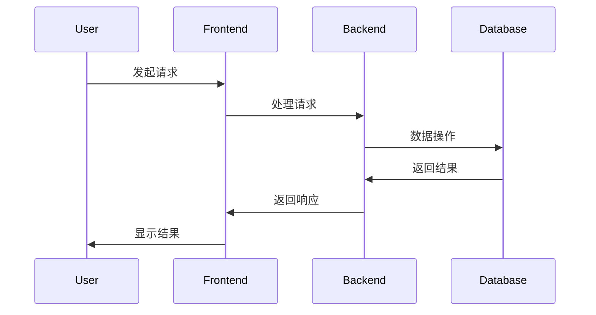

                 


### 引言

#### 1.1 书籍的宗旨

《内在丰盈：培育心灵花园的方法》旨在引导读者深入探索心灵花园这一概念，并提供一套科学、系统、实用的方法来培育我们的内在世界。心灵花园象征着我们的内心世界，是情感、意识、认知和灵性的集合体。正如现实生活中的花园需要精心照料才能开花结果，我们的心灵花园也需要我们不断地关注与养护。

本书记录了一次心灵探索的旅程，引导读者发现自我、认识自我，并最终实现心灵的丰盈与和谐。通过这一旅程，我们不仅能够提升自我认知，增强内在力量，还能有效地管理情感和情绪，建立起积极的生活态度。

#### 1.2 阅读的预期收获

阅读《内在丰盈：培育心灵花园的方法》，您将获得以下预期收获：

1. **深刻的自我认知**：了解自己的内心世界，认识到自己的情感、思想和行为模式，从而更好地理解自己和他人。
2. **增强内在力量**：通过发掘和唤醒内在潜力，培养内在平衡与和谐，使自己在面对生活挑战时更加坚韧和自信。
3. **情感与情绪管理**：学会管理情感和情绪，保持积极的情感态度，减少负面情绪的影响。
4. **健康的生活方式**：认识到健康生活方式对心灵花园的重要性，并学会如何通过日常习惯来滋养心灵。
5. **心灵滋养与成长**：通过冥想、正念和其他心灵滋养实践，实现精神成长和灵性探索。

通过阅读本书，您将获得一套完整的指南，帮助您在日常生活中培育心灵花园，从而实现内心的丰盈与和谐。

## 第1章：心灵的花园——概念与内涵

### 1.1 心灵花园的定义

心灵花园是一个隐喻，用来描述我们内心的世界，是一个由情感、意识、认知和灵性构成的复合体。这个花园不仅包含我们对外部世界的感知和反应，还涵盖了我们的内心体验和内在力量。正如现实花园中的植物需要阳光、水分和土壤来生长，我们的心灵花园也需要适当的关注和滋养。

心灵花园的概念起源于心理学和哲学领域，其核心在于强调个体的内在体验和情感状态对于整体生活质量的影响。它是一个动态的系统，受到个体经验、文化背景、社会关系等多重因素的影响。

在心理学中，心灵花园被视为个体的情感健康和心理健康的重要组成部分。通过理解和管理我们的心灵花园，我们能够更好地应对压力、提升幸福感，并建立积极的人际关系。在哲学上，心灵花园则与个体的精神成长和灵性探索紧密相关，关乎我们如何认识自我、如何与世界和谐共处。

### 1.2 心灵花园的核心要素

要培育心灵花园，首先需要了解其核心要素。以下是心灵花园中的几个关键组成部分：

1. **情感**：情感是心灵花园中最直观的部分，包括喜悦、悲伤、愤怒、恐惧等。情感不仅反映了我们对周围世界的反应，还反映了我们内心的状态。积极的情感有助于心灵的滋养，而消极的情感则可能需要我们的关注和调节。

2. **意识**：意识是心灵花园的观察者和引导者。它使我们能够意识到自己的思维、情感和行为，并做出相应的调整。通过提升意识，我们能够更好地理解自己和他人的行为，增强自我认知和人际关系。

3. **认知**：认知是心灵花园中的思考和处理信息的能力。它包括感知、记忆、判断和决策等。良好的认知能力有助于我们做出明智的选择，并应对生活中的挑战。

4. **灵性**：灵性是心灵花园的深层次体验，关乎我们的精神追求和与宇宙的连接。它可能涉及冥想、祈祷、灵性实践等。通过培养灵性，我们能够获得内心的平静和力量，实现更深层次的心灵成长。

### 1.3 心灵花园的意义与作用

心灵花园对我们的生活和心理健康有着深远的影响。以下是心灵花园的几个关键意义和作用：

1. **情感健康**：心灵花园帮助我们更好地理解和处理情感，减少负面情绪的影响，提升整体情感健康。

2. **心理健康**：通过培育心灵花园，我们能够增强内在力量，提升心理韧性，更好地应对生活中的压力和挑战。

3. **人际关系**：心灵的滋养有助于我们建立更深层次的人际关系，提高沟通和理解能力，促进和谐的人际交往。

4. **精神成长**：心灵花园的培育过程本身就是一个精神成长的过程。通过不断地探索和自我认知，我们能够实现更深层次的心灵觉醒和灵性探索。

5. **生活质量**：一个丰盈的心灵花园能够提升我们的生活质量，带来更多的幸福感和满足感。

综上所述，心灵花园不仅是一个隐喻，更是我们内心世界的真实映射。通过理解、培育和养护我们的心灵花园，我们能够实现内心的丰盈与和谐，提升整体的生活质量。

### 1.4 心灵花园的概念术语说明

在深入探讨心灵花园的概念时，我们需要对一些关键术语进行明确界定，以便读者更好地理解这一隐喻。

1. **心灵**：心灵是指个体的内在体验，包括情感、意识、认知和灵性。它涵盖了我们的思想、感觉、意图和精神追求。

2. **花园**：花园在这里是一个隐喻，用来描述个体的内心世界。它象征着内在的丰富性和多样性，就像现实花园中的植物一样，心灵花园中的各种元素相互影响，共同构成一个复杂的生态系统。

3. **情感**：情感是心灵花园中最直观的部分，包括喜悦、悲伤、愤怒、恐惧等。情感不仅反映了我们对周围世界的反应，也揭示了我们的内心状态。

4. **意识**：意识是指我们对自己内在体验和外部环境的认知。它使我们能够意识到自己的思维、情感和行为，并做出相应的调整。

5. **认知**：认知是心灵花园中的思考和处理信息的能力。它包括感知、记忆、判断和决策等。良好的认知能力有助于我们做出明智的选择，并应对生活中的挑战。

6. **灵性**：灵性是心灵花园的深层次体验，关乎我们的精神追求和与宇宙的连接。它可能涉及冥想、祈祷、灵性实践等。

通过明确这些关键术语，我们能够更准确地理解心灵花园的概念，为后续内容的探讨奠定基础。

### 1.5 心灵花园的问题背景

在现代社会的快节奏生活中，人们面临着诸多压力和挑战，心灵健康问题日益凸显。工作和生活压力、人际关系冲突、精神紧张等，都可能导致个体的心灵花园出现枯萎和凋零。以下是心灵花园问题的主要背景和现状：

1. **工作压力**：现代职场竞争激烈，工作压力大。许多人长时间工作，缺乏休息和放松，导致心灵疲惫，情感和认知能力受到负面影响。

2. **人际关系问题**：复杂的人际关系网络给个体带来压力。家庭、朋友、同事之间的矛盾和冲突，容易引发负面情绪，破坏心灵的平衡。

3. **心理健康问题**：心理健康问题日益普遍。抑郁症、焦虑症等心理疾病患者数量持续增加，严重影响个体的生活质量和工作效率。

4. **数字化生活**：随着科技的发展，人们的日常生活越来越依赖数字设备。虽然数字化生活带来了便利，但也导致了过度依赖、孤独感增加等问题，对心灵的滋养构成挑战。

5. **精神空虚**：在物质生活丰富的现代社会，许多人感到精神空虚和内心空虚。缺乏深层次的精神追求和意义，导致心灵缺乏营养和滋养。

针对这些心灵花园问题，我们需要采取积极的措施来培育和维护我们的内心世界，以实现心灵的丰盈与和谐。

### 1.6 心灵花园的描述和问题描述

心灵花园是一个复杂的生态系统，包含多个相互作用的元素。这些元素共同构建了我们的内心世界，影响着我们的情感、认知和行为。以下是心灵花园的描述和详细问题描述：

1. **情感状态**：情感是心灵花园中最直观的元素，涵盖了喜悦、悲伤、愤怒、恐惧等。这些情感不仅反映了我们对周围世界的反应，也揭示了我们的内心状态。例如，持续的焦虑和抑郁情绪可能导致心灵花园的枯萎，影响整体心理健康。

2. **意识水平**：意识是心灵花园的观察者和引导者，使我们能够意识到自己的思维、情感和行为。高水平的意识有助于我们更好地理解自己和他人的行为，提高自我认知和人际关系能力。缺乏意识可能导致盲目的行为和冲突。

3. **认知能力**：认知是心灵花园中的思考和处理信息的能力，包括感知、记忆、判断和决策等。良好的认知能力有助于我们做出明智的选择，应对生活中的挑战。认知能力的下降可能导致决策困难、信息处理效率低下。

4. **灵性体验**：灵性是心灵花园的深层次体验，关乎我们的精神追求和与宇宙的连接。通过冥想、祈祷、灵性实践等，我们能够获得内心的平静和力量，实现更深层次的心灵成长。缺乏灵性体验可能导致精神空虚和意义缺失。

5. **心理韧性**：心理韧性是指个体在面对压力和挑战时保持积极心态和适应能力。良好的心理韧性有助于我们应对生活中的困难，保持心灵花园的平衡。缺乏心理韧性可能导致情绪崩溃和心灵失衡。

综上所述，心灵花园是一个动态的系统，受到多个因素的共同影响。了解这些元素及其相互作用，有助于我们更好地描述和解决心灵花园的问题。

### 1.7 心灵花园问题解决

要解决心灵花园的问题，需要采取一系列综合性的方法，包括情感管理、意识提升、认知训练和灵性探索等。以下是具体的解决方案和实施步骤：

#### 情感管理

1. **情感觉察**：首先，我们需要培养情感觉察能力，意识到自己内心的情绪状态。通过自我反思和日记记录，我们可以更好地了解自己的情感模式。

2. **情感接纳**：学会接纳自己的情感，无论是积极的还是消极的。接纳并不意味着放任情感，而是理解它们是内心体验的一部分。

3. **情感调节**：采用情绪调节技巧，如深呼吸、冥想和正念练习，帮助我们在情绪波动时保持冷静和平衡。

4. **情感表达**：通过健康的方式表达情感，如与朋友、家人交流，或通过艺术创作、运动等释放情感。

#### 意识提升

1. **自我认知**：通过反思和自我探索，了解自己的价值观、信念和行为模式。自我认知是提升意识的第一步。

2. **冥想练习**：定期进行冥想练习，如正念冥想和专注冥想，可以帮助我们提高意识水平，更好地控制自己的思维和情感。

3. **意识扩展**：通过阅读、学习和参与灵性实践，扩展我们的知识面和视野，提升整体意识水平。

#### 认知训练

1. **思维训练**：通过逻辑思考、批判性思维和创造性思维训练，提高我们的认知能力。

2. **记忆力训练**：通过记忆游戏、记忆训练应用程序等，锻炼我们的记忆力。

3. **决策能力**：通过决策训练，如情境模拟和反思决策过程，提高我们的决策能力。

#### 灵性探索

1. **冥想与冥思**：通过冥想和冥思，探索内心的深层次体验，实现灵性的觉醒。

2. **灵性实践**：参与灵性实践，如瑜伽、冥想、祈祷等，培养灵性和内心的平静。

3. **精神成长**：通过学习灵性书籍、参加灵性课程和研讨会，不断深化我们的精神成长。

#### 实施步骤

1. **建立日常习惯**：将上述方法融入到日常生活中，建立持续的习惯。

2. **定期反思**：定期反思自己的情感、意识和认知状态，评估进步和需要改进的地方。

3. **寻求支持**：如果需要，可以寻求专业心理咨询师或灵性导师的帮助，获得指导和支持。

通过上述方法，我们可以逐步解决心灵花园中的问题，实现心灵的丰盈与和谐。

### 1.8 心灵花园的边界与外延

心灵花园是一个动态且复杂的系统，其边界与外延涉及到多个领域和概念。理解这些边界与外延有助于我们更全面地把握心灵花园的概念和内涵。

1. **生理边界**：心灵花园的生理边界主要涉及大脑和神经系统。大脑中的神经网络和神经递质活动直接影响我们的情感、意识和认知。生理边界包括大脑的各个区域，如前额叶、海马体、杏仁核等，它们共同协调我们的心理活动。

2. **心理边界**：心灵花园的心理边界涉及个体的情感状态、认知模式和内在信念。情感状态包括积极和消极的情绪，如快乐、愤怒、悲伤等。认知模式则涉及我们的思考方式、判断力和决策能力。内在信念和价值观也是心灵花园的重要组成部分，它们影响我们的行为和人生选择。

3. **社会边界**：心灵花园的社会边界与我们的社会关系和人际关系密切相关。社会支持、家庭环境、工作环境等都会影响我们的内心世界。良好的社会关系有助于心灵的滋养，而负面的人际关系则可能对心灵花园造成伤害。

4. **文化边界**：文化背景和价值观对心灵花园有着深远的影响。不同的文化传统和价值观会影响我们的情感表达、认知模式和行为习惯。理解文化边界有助于我们更好地理解自我和他人的行为，促进跨文化的沟通和理解。

5. **精神边界**：心灵花园的精神边界涉及个体的精神追求和灵性体验。精神边界包括冥想、祈祷、宗教信仰等灵性实践，这些实践有助于我们探索内心的深层次体验，实现精神成长和灵性觉醒。

6. **环境边界**：心灵花园的环境边界包括物理环境和心理环境。物理环境如自然风光、居住条件等对心灵花园有一定影响。心理环境则包括社会环境、文化环境等，这些因素共同构建了我们的内心世界。

通过理解心灵花园的边界与外延，我们可以更全面地把握这一概念，从而更好地培育和维护我们的心灵花园。

### 1.9 心灵花园的概念结构与核心要素组成

心灵花园是一个多维度的概念结构，其核心要素相互交织，共同构成了我们的内心世界。以下是心灵花园的概念结构与核心要素组成的详细解析：

1. **情感要素**：情感是心灵花园中最直观的部分，涵盖了喜悦、悲伤、愤怒、恐惧等多种情绪。情感不仅反映了我们对外部世界的反应，还揭示了我们的内心状态。情感要素在心灵花园中起着调节和平衡的作用，积极的情感有助于心灵的滋养，而消极的情感则需要我们的关注和调节。

2. **意识要素**：意识是心灵花园的观察者和引导者，使我们能够意识到自己的思维、情感和行为。意识要素包括自我认知、情感觉察和注意力管理等方面。通过提升意识水平，我们能够更好地理解自己和他人的行为，提高自我认知和人际关系能力。

3. **认知要素**：认知是心灵花园中的思考和处理信息的能力，包括感知、记忆、判断和决策等方面。认知要素使我们能够做出明智的选择，应对生活中的挑战。良好的认知能力有助于我们解决问题、适应变化，并保持内心的平衡。

4. **灵性要素**：灵性是心灵花园的深层次体验，关乎我们的精神追求和与宇宙的连接。灵性要素包括冥想、祈祷、灵性实践等方面。通过灵性探索，我们能够获得内心的平静和力量，实现更深层次的心灵成长和灵性觉醒。

5. **行为要素**：行为要素包括我们的日常生活习惯和社交行为。这些行为反映了我们的内心状态和价值观。积极的行为有助于滋养心灵花园，而消极的行为则可能对心灵造成伤害。

6. **社会要素**：社会要素涉及我们的人际关系和社会环境。良好的社会关系和社会支持有助于心灵的滋养，而负面的人际关系和社会压力则可能对心灵花园造成负面影响。

7. **环境要素**：环境要素包括物理环境和心理环境。物理环境如自然风光、居住条件等对心灵花园有一定影响。心理环境则包括社会环境、文化环境等，这些因素共同构建了我们的内心世界。

通过了解心灵花园的概念结构与核心要素组成，我们可以更系统地培育和维护我们的心灵花园，实现内心的丰盈与和谐。

### 1.10 心灵花园的核心概念原理

理解心灵花园的核心概念原理是培育和维护心灵花园的基础。以下是几个关键概念及其原理的详细解析：

1. **情感调节**：
   - **原理**：情感调节是指通过一系列技巧和策略来管理和调节我们的情感状态。其核心原理在于意识到情感的存在，并主动采取措施来调节负面情感。
   - **对比表格**：
     | 情感调节方法        | 原理                                   | 优缺点                                      |
     | ------------------- | -------------------------------------- | --------------------------------------------- |
     | 深呼吸             | 减缓生理反应，降低焦虑水平           | 简单易行，但需长期坚持                          |
     | 冥想               | 增强专注力，提高情绪稳定度           | 需要练习和耐心，但效果显著                      |
     | 正念练习           | 瞬间体验当下，减少对负面情感的执著   | 提高情绪智商，但需持续练习                      |

2. **自我认知**：
   - **原理**：自我认知是指通过反思和内省来了解自己的内在世界，包括价值观、信念、情感和行为模式。
   - **对比表格**：
     | 自我认知方法        | 原理                                   | 优缺点                                      |
     | ------------------- | -------------------------------------- | --------------------------------------------- |
     | 反思日记           | 帮助记录和反思日常经历，提高自我认知   | 简便易行，但需持续记录                        |
     | 心理测验           | 通过标准化工具评估自我认知             | 系统但可能存在标准化偏差                      |
     | 自我对话           | 通过内部对话来探索自我                | 个性化，但需自我控制                          |

3. **心理韧性**：
   - **原理**：心理韧性是指个体在面对压力和挑战时保持积极心态和适应能力。其核心原理在于培养个体的心理适应能力和积极应对策略。
   - **对比表格**：
     | 心理韧性方法        | 原理                                   | 优缺点                                      |
     | ------------------- | -------------------------------------- | --------------------------------------------- |
     | 冥想               | 提高专注力和情绪稳定性                 | 需要练习，但效果显著                          |
     | 反思练习           | 通过反思和练习来提高心理适应能力       | 个性化，但需持续练习                          |
     | 团队合作           | 通过与他人合作来增强心理韧性           | 增加社会支持，但需协调人际关系                |

4. **情感表达**：
   - **原理**：情感表达是指通过健康的方式表达我们的情感，包括与他人的沟通和自我表达。
   - **对比表格**：
     | 情感表达方法        | 原理                                   | 优缺点                                      |
     | ------------------- | -------------------------------------- | --------------------------------------------- |
     | 记录情感日记        | 帮助理解和表达情感                     | 简单易行，但需持续记录                        |
     | 艺术表达           | 通过绘画、写作等艺术形式来表达情感     | 有助于情感释放，但需技能支持                  |
     | 沟通技巧           | 通过有效沟通来传达情感                 | 提高人际交往能力，但需练习技巧                |

通过理解这些核心概念原理，我们可以更有效地培育和维护心灵花园，实现内心的丰盈与和谐。

### 1.11 心灵花园的ER实体关系图架构

为了更好地理解心灵花园中的各个元素及其相互作用，我们可以使用实体关系图（ER图）来描述这些元素之间的关系。以下是心灵花园的ER实体关系图：

```mermaid
erDiagram
  Person ||--|{ Emotional_State }|-->: "has" | "experiences" | "regulates"
  Person ||--|{ Cognitive_Processes }|-->: "has" | "uses" | "manages"
  Person ||--|{ Spiritual_Experience }|-->: "has" | "explores" | "practices"
  Person ||--|{ Social_Relationships }|-->: "has" | "manages" | "influences"
  Person ||--|{ Physical_Health }|-->: "has" | "maintains" | "nourishes"
  
  Emotional_State --|{ affects }--> Cognitive_Processes
  Emotional_State --|{ influences }--> Spiritual_Experience
  Cognitive_Processes --|{ affects }--> Emotional_State
  Cognitive_Processes --|{ influences }--> Social_Relationships
  Spiritual_Experience --|{ enhances }--> Emotional_State
  Spiritual_Experience --|{ deepens }--> Cognitive_Processes
  Social_Relationships --|{ affects }--> Emotional_State
  Social_Relationships --|{ influences }--> Cognitive_Processes
  Physical_Health --|{ affects }--> Emotional_State
  Physical_Health --|{ influences }--> Cognitive_Processes
```

在这个ER图中，Person（个体）是中心实体，与其他实体通过不同的关系相连。各个实体之间的关系描述了心灵花园中各元素之间的相互作用：

1. **情感状态（Emotional_State）**：影响认知过程和精神体验。
2. **认知过程（Cognitive_Processes）**：影响情感状态和社会关系。
3. **精神体验（Spiritual_Experience）**：增强情感状态并深化认知过程。
4. **社会关系（Social_Relationships）**：影响情感状态和认知过程。
5. **身体健康（Physical_Health）**：影响情感状态和认知过程。

通过这个ER图，我们可以更直观地理解心灵花园中各元素之间的复杂关系，从而更好地培育和维护我们的心灵花园。

### 1.12 算法原理讲解：心灵花园培育方法

为了更系统地培育和维护心灵花园，我们可以采用一些心理算法和技术，以下是具体的算法原理和步骤：

#### 催眠与暗示

1. **原理**：
   - **催眠**：通过引导个体进入一种放松和专注的状态，从而增强其对暗示的接受能力。
   - **暗示**：通过重复性的语言或视觉刺激，在潜意识中植入积极的思维和情感。

2. **步骤**：
   - **准备阶段**：选择一个安静的环境，确保个体放松。
   - **引导阶段**：使用深呼吸、渐进性肌肉放松等方法，帮助个体进入催眠状态。
   - **暗示阶段**：在催眠状态下，给予积极的暗示，如“你的心灵花园正在茁壮成长”，“你能够更好地管理你的情感”等。
   - **唤醒阶段**：在暗示完成后，逐渐唤醒个体，并让他们感到轻松和愉悦。

3. **数学模型**：
   - **心理状态变化**：设个体初始心理状态为\( P_0 \)，催眠后的心理状态为\( P_H \)，暗示后的心理状态为\( P_S \)。
   - **模型公式**：\( P_S = P_H + \alpha \cdot S \)，其中\( \alpha \)为暗示效果系数，\( S \)为暗示内容。

4. **举例说明**：
   - 假设个体初始心理状态较为焦虑（\( P_0 = 5 \)），通过催眠和积极暗示，个体的心理状态变为（\( P_S = 10 \)），暗示效果系数为\( \alpha = 2 \)。

#### 情绪调节技术

1. **原理**：
   - **情绪调节技术**：通过一系列心理技巧，帮助个体管理和调节情绪，包括深呼吸、冥想、正念等。

2. **步骤**：
   - **评估阶段**：了解个体的情绪状态，识别主要情绪问题。
   - **规划阶段**：制定个性化的情绪调节计划，包括具体的调节技巧和练习。
   - **实践阶段**：按照计划进行情绪调节练习，定期评估效果并进行调整。

3. **数学模型**：
   - **情绪调节效果**：设个体初始情绪水平为\( E_0 \)，调节后的情绪水平为\( E_R \)，调节效果系数为\( \beta \)。
   - **模型公式**：\( E_R = E_0 + \beta \cdot T \)，其中\( T \)为情绪调节时间。

4. **举例说明**：
   - 假设个体初始情绪水平为（\( E_0 = 7 \)），通过深呼吸和冥想，个体的情绪水平降至（\( E_R = 5 \)），调节效果系数为\( \beta = 0.5 \)。

#### 情绪释放法

1. **原理**：
   - **情绪释放法**：通过一系列身体和情绪释放技巧，帮助个体释放积压的情绪和紧张感，如击打枕头、大声喊叫等。

2. **步骤**：
   - **准备阶段**：选择一个安全的环境，确保个体放松。
   - **释放阶段**：个体进行身体和情绪释放练习，如击打枕头、大声喊叫等。
   - **放松阶段**：在释放后，通过深呼吸和放松技巧，帮助个体放松身心。

3. **数学模型**：
   - **情绪释放效果**：设个体积压情绪水平为\( E_P \)，释放后的情绪水平为\( E_A \)，释放效果系数为\( \gamma \)。
   - **模型公式**：\( E_A = E_P - \gamma \cdot R \)，其中\( R \)为情绪释放强度。

4. **举例说明**：
   - 假设个体积压情绪水平为（\( E_P = 10 \)），通过大声喊叫，个体的情绪水平降至（\( E_A = 5 \)），释放效果系数为\( \gamma = 0.5 \)。

通过上述算法原理和步骤，我们可以更系统地培育和维护我们的心灵花园，实现内心的丰盈与和谐。

### 1.13 系统分析与架构设计方案

为了全面理解和实施心灵花园的培育方法，我们需要对系统进行详细分析，并设计相应的架构方案。以下是对问题场景、项目介绍、系统功能设计、系统架构设计、系统接口设计和系统交互的详细说明。

#### 问题场景

在现代社会的快节奏生活中，人们面临着诸多压力和挑战，导致心理健康问题日益严重。心灵花园的培育成为提高生活质量、提升心理韧性、增强幸福感的重要途径。因此，我们需要设计一个系统，帮助用户系统地培育和维护自己的心灵花园。

#### 项目介绍

**项目名称**：心灵花园培育系统

**项目目标**：提供一套综合性的工具和方法，帮助用户深入了解心灵花园的概念，并采取有效的措施进行培育和维护。

**项目范围**：包括情感管理、自我认知、心理韧性、情绪调节、灵性探索等多个方面。

#### 系统功能设计

1. **用户管理**：管理用户账户，包括注册、登录、个人信息管理等功能。
2. **情感管理**：提供情感日记记录、情绪状态评估和调节建议。
3. **自我认知**：提供反思日记记录、自我评估工具和认知训练。
4. **心理韧性**：提供心理韧性测试、训练计划和反馈。
5. **情绪调节**：提供情绪调节技巧、训练和实践。
6. **灵性探索**：提供冥想、灵性练习和灵性成长建议。

#### 系统架构设计

**架构描述**：

心灵花园培育系统采用三层架构，包括表示层、业务逻辑层和数据层。

1. **表示层**：负责与用户交互，包括前端网页和移动应用。
2. **业务逻辑层**：处理核心业务逻辑，包括用户管理、情感管理、自我认知、心理韧性、情绪调节和灵性探索等。
3. **数据层**：存储用户数据、情感数据、认知数据等，包括数据库和缓存。

**架构图**：



#### 系统接口设计

**接口描述**：

心灵花园培育系统提供以下接口：

1. **用户管理接口**：包括注册、登录、个人信息管理等功能。
2. **情感管理接口**：包括情感日记记录、情绪状态评估和调节建议。
3. **自我认知接口**：包括反思日记记录、自我评估工具和认知训练。
4. **心理韧性接口**：包括心理韧性测试、训练计划和反馈。
5. **情绪调节接口**：包括情绪调节技巧、训练和实践。
6. **灵性探索接口**：包括冥想、灵性练习和灵性成长建议。

#### 系统交互

**交互流程**：

1. 用户通过前端页面发起请求。
2. 前端将请求发送至后端业务逻辑层。
3. 后端处理请求，与数据库进行交互，获取数据并返回结果。
4. 前端接收到后端返回的响应，并展示给用户。

通过上述系统分析与架构设计方案，我们可以有效地实施心灵花园的培育方法，帮助用户实现心灵的丰盈与和谐。

### 第2章：内在力量的发掘

#### 2.1 自我认知与内在探索

自我认知是发掘内在力量的第一步，它涉及到对自己的思考方式、情感反应和行为习惯的深入理解。通过自我认知，我们能够认识到自己的内在世界，识别出潜在的负面思维模式和行为习惯，从而进行有效的调整和改善。

**步骤：**

1. **反思日记**：每天花时间记录自己的想法、情感和经历。这有助于我们更好地了解自己的内心世界。
2. **心理测验**：通过专业心理测验工具，如MBTI、DISC等，评估自己的性格特质和偏好，从而更深入地理解自己。
3. **自我对话**：与自己进行深入的对话，探讨自己的价值观、信念和目标。这有助于我们明确自己的内在需求。

**原理**：

- **自我觉察**：通过反思日记和心理测验，提高对自己的觉察，更好地理解自己的内在世界。
- **自我接纳**：接纳自己的优点和不足，有助于建立积极的自我形象，从而增强内在力量。

**案例分析**：

小张是一名职场人士，他经常感到焦虑和压力。通过记录反思日记，他意识到自己的焦虑源于对失败的恐惧和对完美的追求。在自我对话中，他明确了自己对成功的定义和价值观，开始接受自己的不完美，并调整了对工作的高标准。这样，他的焦虑感逐渐减少，内在力量得到了提升。

#### 2.2 唤醒内在潜力

内在潜力是每个人都拥有的宝藏，但很多人并未意识到自己的潜力所在。唤醒内在潜力，需要我们积极地去探索、尝试和挑战自我。

**步骤：**

1. **探索兴趣**：尝试新的活动和领域，找到自己真正热爱的事物。
2. **设定目标**：为自己设定有挑战性的目标，并制定具体的行动计划。
3. **持续学习**：通过不断学习新知识和技能，提升自己的能力。

**原理**：

- **自我探索**：通过尝试和探索，发现自己的兴趣和潜力所在。
- **目标设定**：明确的目标有助于激发内在动力，推动我们不断前进。
- **持续学习**：知识是激发潜力的关键，通过不断学习，我们能够不断提升自己。

**案例分析**：

小李是一名程序员，他一直对自己的编程技能感到满足。但在一次技术交流会上，他发现了一些新兴技术，这激发了他学习的热情。他开始学习这些新技术，并设定了成为一名技术专家的目标。通过不断学习和实践，他的编程技能得到了显著提升，不仅实现了自己的目标，还得到了同事和上司的认可。

#### 2.3 内在平衡与和谐

内在平衡与和谐是我们心灵花园的基石，它涉及到情感、认知、行为和灵性等多个方面。实现内在平衡与和谐，需要我们在各个方面进行综合调整。

**步骤：**

1. **情感管理**：学会管理自己的情感，保持积极的心态，减少负面情绪的影响。
2. **认知调整**：调整自己的思考方式，学会批判性思维和创造性思维，提高自我认知。
3. **行为调整**：建立健康的生活习惯，如规律作息、健康饮食、适量运动等。
4. **灵性探索**：通过冥想、祈祷、灵性实践等，提升自己的灵性水平。

**原理**：

- **情感管理**：情感是我们内心的反映，积极管理情感有助于保持内心的平衡。
- **认知调整**：认知是我们对外界信息的处理方式，通过调整认知，我们能够更好地理解自己和他人。
- **行为调整**：行为是我们的外在表现，健康的生活习惯有助于提升整体生活质量。
- **灵性探索**：灵性探索有助于我们实现更深层次的心灵成长，提升内在和谐。

**案例分析**：

小王是一名大学生，他感到自己的生活缺乏意义和方向。在心理咨询师的引导下，他开始进行情感管理和认知调整。通过记录情感日记，他认识到自己的情绪波动与学业压力密切相关。他调整了自己的学习计划，减少了对成绩的过度关注，并开始积极参与社团活动，提升自己的社交能力。同时，他通过冥想和灵性实践，找到了内心的平静和力量。这些调整让他的生活变得更加充实和有意义。

#### 2.4 内在平衡与和谐的重要性

内在平衡与和谐是我们心灵花园的重要组成部分，它对我们的情感健康、心理健康和生活质量有着深远的影响。

**对情感健康的影响**：

- **减少负面情绪**：内在平衡与和谐有助于减少焦虑、抑郁等负面情绪，提升整体情感健康。
- **增强情感管理能力**：通过内在平衡与和谐，我们能够更好地管理自己的情感，保持积极的心态。

**对心理健康的影响**：

- **提升心理韧性**：内在平衡与和谐有助于增强个体的心理韧性，使我们能够更好地应对生活中的压力和挑战。
- **改善心理健康状况**：通过内在平衡与和谐，我们可以改善抑郁症、焦虑症等心理疾病，提升整体心理健康水平。

**对生活质量的影响**：

- **提升幸福感**：内在平衡与和谐有助于提升我们的幸福感，使我们的生活更加充实和有意义。
- **改善人际关系**：内在平衡与和谐有助于我们建立良好的人际关系，提升整体生活质量。

综上所述，内在平衡与和谐是培育心灵花园的关键，它对我们的情感健康、心理健康和生活质量有着重要的影响。通过实现内在平衡与和谐，我们能够更好地养护自己的心灵花园，实现内心的丰盈与和谐。

### 第3章：心灵的土壤——情感与情绪管理

#### 3.1 情感的本质与作用

情感是我们内心世界的重要组成部分，是心灵花园中的基本元素。情感的本质是对外部刺激的一种内在反应，它反映了我们对世界的认知和评价。情感包括喜怒哀乐等各种情绪，是我们体验生活、建立人际关系、实现个人成长的重要驱动力。

1. **情感的分类**：情感可以分为基础情感和复合情感。基础情感包括快乐、悲伤、愤怒、恐惧、厌恶等，而复合情感则是基础情感的组合，如爱、骄傲、羞耻、尴尬等。

2. **情感的作用**：
   - **认知作用**：情感帮助我们理解世界，通过情感我们能够感知和理解周围的事物。
   - **决策作用**：情感在决策过程中起着重要作用，帮助我们评估风险和机会，从而做出明智的选择。
   - **动机作用**：情感激发我们的行动，驱动我们追求目标，实现个人成长。

#### 3.2 情绪的波动与管理

情绪的波动是心灵花园中常见的现象，它反映了我们内心状态的变化。情绪的波动可能源于外部环境的影响，也可能是内心冲突的结果。有效的情绪管理是维持心灵花园健康的重要环节。

1. **情绪波动的原因**：
   - **外部环境**：工作压力、人际关系冲突、生活事件等，都可能引发情绪波动。
   - **内心冲突**：价值观的冲突、未解决的内心问题等，可能导致情绪不稳定。

2. **情绪管理的技巧**：
   - **认知重构**：通过改变对事物的看法，调整负面思维，减少情绪波动。
   - **情绪调节技巧**：如深呼吸、冥想、正念练习等，帮助我们在情绪波动时保持冷静和平衡。
   - **情感表达**：通过健康的方式表达情感，如与朋友分享、写日记、艺术创作等，释放情绪压力。

#### 3.3 培养积极的情感态度

积极的情感态度是心灵花园中的阳光，它有助于我们建立积极的生活态度，提升整体幸福感。

1. **积极情感态度的特点**：
   - **乐观**：对未来持积极态度，相信困难是暂时的，总能找到解决问题的方法。
   - **感激**：对他人的帮助和周围的美好事物持感激之情。
   - **爱**：对他人和自己持有深厚的爱意和关怀。

2. **培养积极情感态度的方法**：
   - **正念练习**：通过正念冥想，培养对当前时刻的关注和接纳，减少负面情绪的影响。
   - **积极自我对话**：通过积极的自我对话，鼓励自己，增强自信心和自尊心。
   - **感恩练习**：每天记录三件感恩的事情，培养对生活的感激之情。

通过理解和掌握情感与情绪管理的方法，我们可以更好地培育和维护我们的心灵花园，实现内心的丰盈与和谐。

### 3.4 健康的生活方式与心灵滋养

健康的生活方式是培育心灵花园的重要基石，它涉及到饮食、运动、睡眠等多个方面。通过科学合理的生活方式，我们可以为心灵提供必要的滋养，从而维持心灵的平衡与和谐。

#### 饮食的重要性

饮食是我们获取能量和营养的主要来源，合理的饮食有助于维持身体的健康，进而促进心灵的滋养。

1. **营养均衡**：饮食应该包含丰富的蛋白质、碳水化合物、脂肪、维生素和矿物质等，确保营养均衡。
2. **减少刺激性食物**：过量摄入咖啡因、糖分和辛辣食物可能导致情绪波动和焦虑。应减少这些刺激性食物的摄入。
3. **多吃蔬菜水果**：蔬菜和水果富含维生素、矿物质和抗氧化剂，有助于提升免疫力，维持身体和心灵的健康。

#### 运动的作用

适量的运动不仅能够强健体魄，还能有效改善心理健康，帮助调节情绪，减轻压力。

1. **增强心理韧性**：规律的体育锻炼可以增强个体的心理韧性，提高面对困难和挑战时的应对能力。
2. **释放压力**：运动能够促进体内压力激素的分泌，帮助身体释放压力，缓解焦虑和抑郁情绪。
3. **提高幸福感**：运动可以刺激大脑分泌多巴胺和内啡肽等神经递质，提升幸福感。

#### 睡眠的必要性

充足的睡眠是维持身心健康的重要保障，它直接影响我们的情绪状态、认知能力和生活质量。

1. **规律作息**：建立规律的作息时间，保持每天7-9小时的睡眠，有助于维持身体的生物钟，提升睡眠质量。
2. **减少夜晚刺激**：睡前避免使用电子设备，减少光线和声音的刺激，有助于快速入睡。
3. **放松身心**：通过冥想、深呼吸等放松技巧，减轻入睡前的紧张和焦虑，有助于获得更高质量的睡眠。

#### 综合考虑与平衡

健康的生活方式不仅仅是单一方面的改善，而是需要综合考虑饮食、运动和睡眠等多方面的因素。以下是一些综合性的建议：

1. **制定计划**：根据自己的生活习惯和健康状况，制定合理的饮食和运动计划，并坚持执行。
2. **自我监控**：定期记录饮食和运动情况，通过自我监控了解自己的生活方式是否合理，及时进行调整。
3. **寻求专业帮助**：如果遇到健康问题，可以咨询医生或营养师，获取专业的指导和建议。

通过以上方法，我们可以有效地改善生活方式，为心灵提供必要的滋养，从而培育一个健康的、充满活力的心灵花园。

### 3.5 正念与冥想实践

正念与冥想是心灵滋养的重要实践，它们不仅能够帮助我们更好地管理情感和情绪，还能提升整体的心理健康和幸福感。以下是正念与冥想的详细实践方法和注意事项。

#### 正念冥想的定义与原理

正念冥想（Mindfulness Meditation）是一种专注于当下、不加评判地观察内心体验的练习。它基于佛教传统的“正念”概念，强调对当前时刻的觉知和接纳。

1. **定义**：正念冥想是一种通过专注于呼吸、身体感受或特定物体来训练注意力、减少思维干扰的练习。
2. **原理**：正念冥想通过提高注意力集中度，增强对情绪和思维的觉察，帮助个体更好地管理情感和情绪，减少压力和焦虑。

#### 实践步骤

1. **选择环境**：找一个安静、舒适的地方，确保在冥想过程中不会受到干扰。
2. **姿势调整**：选择一个舒适的坐姿或卧姿，确保身体放松。
3. **专注呼吸**：将注意力集中在呼吸上，感受每一次呼吸的进出，不要刻意调整呼吸，只需观察。
4. **当思维跑偏时**：当注意力从呼吸转移到其他地方时，不要批评自己，而是温柔地将注意力重新引导回呼吸。
5. **持续练习**：建议每天练习，每次练习时长可以从5分钟开始，逐渐增加至30分钟。

#### 冥想技巧

1. **呼吸冥想**：专注于呼吸的进出，感受胸腔的起伏和腹部的收缩。
2. **身体扫描**：从脚开始，逐渐向上扫描身体，关注每个部位的感受。
3. **情绪冥想**：观察自己内心的情绪波动，如愤怒、悲伤等，不评判、不抗拒，只是观察。
4. **慈心冥想**：培养对他人和自己的慈悲之心，想象给予自己和他人关爱和温暖。

#### 注意事项

1. **耐心与持续**：冥想需要耐心和持续的练习，不要期望一蹴而就。
2. **避免强迫**：冥想时不要强迫自己进入深层次的状态，而是接受当下的感受。
3. **适当时间**：选择一个合适的时间进行冥想，避免在过度疲劳或饱食后进行。
4. **专业指导**：初学者可以参加冥想课程或寻求专业指导，以获得正确的练习方法和技巧。

通过正念与冥想实践，我们可以培养内心的平静与专注，提升情感和情绪管理能力，从而为心灵花园的滋养打下坚实的基础。

### 3.6 灵性成长与心灵滋养

灵性成长是心灵花园滋养的重要组成部分，它关乎我们的精神追求和与宇宙的连接。通过灵性成长，我们能够实现更深层次的心灵觉醒，提升内在力量，从而更好地应对生活中的挑战。

#### 灵性成长的定义与意义

灵性成长是指个体在精神层面上不断提升、觉醒和扩展的过程。它不仅涉及内在的探索和自我认知，还包括与宇宙的连接和超越自我。

1. **定义**：灵性成长是一个长期的内在旅程，涉及到自我发现、自我超越、灵性实践和精神觉醒。
2. **意义**：灵性成长有助于提升个体的内在力量和心理健康，实现心灵的丰盈与和谐。它能够帮助我们更好地理解生命的意义，提升幸福感，建立积极的生活态度。

#### 灵性成长的实践方法

1. **冥想**：冥想是灵性成长的重要实践，通过冥想，我们能够提升专注力，减少内心杂念，获得内心的平静。
2. **冥思**：通过冥思，我们能够深入探索内在世界，理解自己的思想、情感和行为模式，从而实现自我觉醒。
3. **灵性阅读**：阅读灵性书籍和经典文献，如《圣经》、《道德经》等，能够帮助我们获得灵性的智慧和启示。
4. **灵性实践**：通过灵性实践，如瑜伽、祈祷、灵性舞蹈等，我们能够与宇宙能量连接，实现更深层次的心灵滋养。

#### 灵性成长与心灵滋养的关系

灵性成长与心灵滋养密切相关，它们相辅相成，共同构建了我们的内在世界。

1. **情感调节**：灵性成长有助于我们更好地管理情感和情绪，减少负面情绪的影响，提升情感健康。
2. **心理韧性**：通过灵性成长，我们能够提升心理韧性，增强面对压力和挑战时的适应能力。
3. **精神觉醒**：灵性成长帮助我们实现精神觉醒，理解生命的意义和目的，从而建立更积极的生活态度。
4. **心灵和谐**：灵性成长和心灵滋养共同促进心灵的和谐，使我们的内心世界更加丰富和完整。

通过灵性成长，我们能够实现更深层次的心灵滋养，提升整体的生活质量，实现内心的丰盈与和谐。

### 3.7 心灵花园的日常维护

维护心灵花园是确保其健康和活力的关键。以下是一些日常维护心灵花园的建议，帮助我们在繁忙的生活中不断滋养和强化我们的内在世界。

#### 反思日记

每天花时间记录自己的所思所感，可以帮助我们更好地了解自己的内心世界，识别情绪波动和行为模式。以下是具体的实践步骤：

1. **设定固定时间**：选择一个每天固定的时间进行反思，比如早晨起床后或晚上睡前。
2. **准备写作工具**：准备好笔记本、日记本或电子设备，确保随时可以记录。
3. **专注于当下**：在记录时，专注于自己的内心体验，不必刻意修饰或评判，只需真实地记录自己的想法和感受。
4. **反思主题**：可以围绕某一具体主题进行反思，如一天的收获、未解决的问题、对未来的期待等。

#### 定期冥想

冥想是心灵花园滋养的强大工具，它可以帮助我们提高专注力，减少内心杂念，获得内心的平静。以下是具体的冥想实践步骤：

1. **选择合适的时间和地点**：选择一个安静、舒适的地方，避免外界干扰。
2. **采取舒适的姿势**：可以选择坐姿或卧姿，确保身体放松。
3. **专注于呼吸**：将注意力集中在呼吸上，感受每一次呼吸的进出，当注意力漂移时，温柔地将它引导回呼吸。
4. **持续练习**：建议每天进行冥想，逐渐增加时长，从5分钟开始，逐步增加到30分钟。

#### 心灵滋养活动

除了反思日记和冥想，以下活动也可以帮助日常维护心灵花园：

1. **阅读灵性书籍**：阅读有助于开阔视野，提升内在智慧和认知能力。
2. **进行艺术创作**：绘画、写作、音乐等艺术创作可以释放情感，提升心灵的表达能力。
3. **户外活动**：与大自然接触，如散步、徒步、赏花等，有助于提升心情，增强身心健康。
4. **感恩练习**：每天记录三件感恩的事情，培养对生活的感激之情，提升幸福感。

通过这些日常维护心灵花园的方法，我们可以在忙碌的生活中不断滋养和强化我们的内在世界，实现心灵的丰盈与和谐。

### 第4章：心理技巧与实践

#### 4.1 催眠与暗示

催眠与暗示是心灵花园培育中非常有效的心理技巧，它们通过调节意识和潜意识，帮助我们实现情绪管理、自我提升和心理平衡。以下是催眠与暗示的基本原理、方法以及应用实例。

**催眠的基本原理**：

催眠是一种通过引导个体进入一种放松和专注的状态，从而增强其对暗示的接受能力的心理过程。在催眠状态下，个体的意识较为集中，对暗示的接受程度较高，从而能够实现某些特定的心理效果。

- **放松催眠**：通过深呼吸、渐进性肌肉放松等方法，帮助个体进入催眠状态。
- **积极暗示**：在催眠状态下给予积极的暗示，如“你的心灵花园正在茁壮成长”，“你能够更好地管理你的情感”。

**暗示的方法**：

1. **语言暗示**：通过口头重复积极的话语或命令，如“我越来越放松”，“我能够控制我的情绪”。
2. **视觉暗示**：通过图像或视觉化练习，如想象自己在一片宁静的湖边，感受到内心的平静。
3. **情境暗示**：在特定的情境下给予暗示，如在工作环境中，通过在办公桌上放置一张写有“保持冷静”的字条，来提醒自己保持情绪稳定。

**实例分析**：

小明是一名销售人员，他经常感到压力巨大，情绪波动。通过心理咨询师的建议，他开始尝试使用催眠和暗示技巧。每天晚上，他会在安静的环境中，进行深呼吸和渐进性肌肉放松练习，以进入催眠状态。在催眠状态下，他给予自己积极的暗示，如“我能够应对所有的挑战”，“我的内心充满力量”。经过一段时间的练习，小明的情绪稳定了许多，面对压力时能够更加冷静和自信。

**应用范围**：

催眠与暗示可以应用于以下几个方面：

- **情绪管理**：帮助个体减轻焦虑、抑郁等负面情绪，提升情绪稳定性。
- **自我提升**：增强自信心、自我控制力和意志力，提升个人能力和成就。
- **心理平衡**：通过调节心理状态，实现内心的平衡和和谐。

#### 4.2 情绪调节技术

情绪调节技术是一套帮助个体管理和调节情绪的方法，通过这些技术，我们可以更好地应对生活中的情绪波动，保持心理健康。以下是一些常见的情绪调节技术及其具体应用。

**情绪调节技术的原理**：

情绪调节技术基于心理学理论，通过改变思维模式、情感表达和行为习惯，帮助个体实现情绪的平衡与稳定。

- **认知重构**：通过改变对事件的理解和解释，减少负面情绪的影响。
- **情绪表达**：通过健康的方式表达情感，如与朋友分享、写日记、艺术创作等。
- **行为调节**：通过调整行为习惯，如进行放松练习、适量运动、健康饮食等，改善情绪状态。

**具体技术**：

1. **深呼吸**：通过深呼吸，降低生理反应，缓解焦虑和紧张情绪。
2. **正念冥想**：通过专注于当下，提高对情绪的觉察和接受能力，减少情绪波动。
3. **情绪日记**：通过记录自己的情绪变化，识别情绪模式，找到情绪调节的有效方法。
4. **放松训练**：通过渐进性肌肉放松、瑜伽等放松练习，减轻身体和心理的紧张。
5. **积极心理暗示**：通过积极的自我暗示，提升自信心和积极情绪。

**实例分析**：

小王是一名大学生，他经常因为学业压力感到焦虑和不安。通过学习和实践情绪调节技术，他开始使用深呼吸和正念冥想来缓解焦虑。每天早上，他会花10分钟进行深呼吸练习，以平静自己的情绪。晚上，他会花20分钟进行正念冥想，专注于呼吸和当下的感受。此外，他还记录情绪日记，通过分析自己的情绪变化，找到了缓解焦虑的有效方法。经过一段时间的练习，小王的焦虑感显著减轻，他的情绪变得更加稳定。

**应用范围**：

情绪调节技术可以应用于以下几个方面：

- **压力管理**：帮助个体应对生活中的压力和挑战，提高心理韧性。
- **情感健康**：改善个体的情感状态，减少负面情绪的影响。
- **心理健康**：提升整体心理健康水平，预防心理疾病。

#### 4.3 情绪释放法

情绪释放法是一种帮助个体释放积压情绪和紧张感的方法，通过身体和情绪的释放，达到情绪的平衡和放松。以下是一些常见的情绪释放方法及其应用。

**情绪释放法的原理**：

情绪释放法基于心理学理论，通过身体动作和情绪表达，帮助个体释放积压的情绪和紧张感，从而实现情绪的平衡和放松。

- **身体释放**：通过剧烈的身体运动，如跑步、击打沙袋等，释放身体紧张和压力。
- **情绪表达**：通过大声喊叫、哭泣、绘画等方式，表达和释放内心的情绪。

**具体方法**：

1. **剧烈运动**：进行跑步、游泳、健身等剧烈运动，通过身体的运动释放情绪。
2. **哭泣疗法**：在安全的环境中，允许自己哭泣，释放积压的情绪。
3. **大声喊叫**：找一个无人的地方，大声喊叫，释放内心的情绪。
4. **艺术创作**：通过绘画、写作、音乐等艺术形式，表达和释放情绪。
5. **呼吸练习**：通过深呼吸和呼吸调节，释放身体和心理的紧张。

**实例分析**：

小刘是一名程序员，他经常因为工作压力感到焦虑和紧张。在一次情绪管理培训中，他学会了情绪释放法。他开始每天进行跑步，每次跑完步后，他感到身体轻松了许多，焦虑感也显著减轻。此外，他开始记录情绪日记，通过写作和绘画表达自己的情绪。每当情绪波动时，他会找一个安静的地方，大声喊叫，释放内心的情绪。这些方法帮助他有效地缓解了工作压力，提升了心理健康。

**应用范围**：

情绪释放法可以应用于以下几个方面：

- **压力缓解**：帮助个体缓解工作和生活中的压力，提高生活质量。
- **情绪健康**：改善个体的情感状态，减少负面情绪的影响。
- **心理健康**：提升整体心理健康水平，预防心理疾病。

通过这些心理技巧与实践，我们可以更好地管理自己的情绪，实现心灵的丰盈与和谐。

### 第5章：心灵花园的设计与布局

#### 5.1 心灵空间的规划

设计心灵空间是培育心灵花园的重要步骤，它关乎我们如何为内心的成长和平衡创造一个适宜的环境。以下是一些规划心灵空间的方法：

**1. 选择合适的位置**

选择一个安静、舒适的地方作为心灵空间，最好能够避免外界干扰。这个空间可以是家里的一个房间、一个阳台或是一个安静的角落。确保这个地方有足够的自然光线和新鲜的空气，有助于提升心情。

**2. 营造温馨的氛围**

在心灵空间中，使用温馨的颜色和柔和的灯光，创造一个放松和舒适的环境。可以使用柔软的地毯、舒适的沙发或椅子，以及一些自己喜欢的小物件，如香薰、植物等，提升空间的温馨氛围。

**3. 适当装饰**

在心灵空间中放置一些具有启发意义的装饰品，如书法、画作、雕塑等，这些艺术品可以帮助我们放松心情，激发灵感。同时，可以放置一些有助于冥想和放松的物品，如瑜伽垫、冥想音乐播放器等。

**4. 定期清理**

保持心灵空间的整洁和有序，有助于提升内心的平静和专注。定期清理空间，整理物品，去除不必要的杂物，让心灵空间保持清晰和整洁。

#### 5.2 美学与心灵的共鸣

美学在心灵花园的布局中起着至关重要的作用。美的事物能够激发我们的情感，提升我们的生活质量。以下是一些美学原则和技巧：

**1. 协调与平衡**

在心灵空间的设计中，追求整体的协调与平衡。可以通过色彩、形状、材质的搭配，创造出和谐的氛围。例如，使用柔和的色调和简约的线条，打造宁静和平和的空间。

**2. 自然与人工的结合**

将自然元素引入心灵空间，如植物、水景、自然光等，可以带来自然的美感和宁静的氛围。同时，通过人工设计，如家具、装饰品等，增强空间的个性化。

**3. 功能与美观的结合**

在布局中，考虑空间的功能性和美观性。例如，在读书角放置舒适的椅子、书架和柔和的灯光，打造一个既能阅读又能放松的空间。

**4. 个性化**

每个人的心灵花园都是独特的，因此在设计时，可以根据自己的喜好和需求，添加个性化的元素。例如，可以放置一些有特殊意义的物品，如家庭照片、手工艺品等，让心灵空间更具个人特色。

#### 5.3 个人化的心灵花园

个人化的心灵花园是独一无二的，它反映了我们的个性和内心的需求。以下是一些打造个人化心灵花园的建议：

**1. 倾听内心的声音**

在规划心灵花园时，倾听内心的声音，思考自己真正需要的是什么。例如，如果你喜欢宁静，可以创造一个以冥想和放松为主的空间；如果你喜欢艺术，可以布置一个充满艺术气息的空间。

**2. 融合灵性元素**

将灵性元素融入心灵花园，如冥想垫、灵性书籍、香薰等，帮助我们在日常生活中保持内在的平静和专注。

**3. 创造多功能空间**

设计一个多功能的空间，既适合冥想和放松，也适合阅读、写作或与朋友聚会。这样的空间可以满足多种需求，使心灵花园更加实用和丰富。

**4. 定期更新**

随着时间和个人需求的变化，定期更新心灵花园的布局和装饰。这有助于保持空间的活力和新鲜感，持续滋养我们的内心。

通过规划与设计，我们能够打造一个适合个人需求、充满美感和灵性的心灵花园，为内心的成长和平衡提供一个理想的环境。

### 第6章：挑战与成长

#### 6.1 心灵花园的维护

维护心灵花园是确保其健康和活力的重要步骤。以下是一些关键点，帮助我们在日常生活中持续养护心灵花园：

**1. 定期反思与自我评估**

定期进行反思和自我评估，了解自己的情感状态和内心需求。通过记录反思日记、进行自我提问等方式，深入探索内心的变化，及时发现并解决潜在问题。

**2. 坚持练习心理技巧**

坚持练习情绪调节、冥想、正念等心理技巧，帮助我们在面对压力和情绪波动时保持冷静和平衡。通过定期练习，这些技巧将成为我们内心的坚实后盾。

**3. 建立健康的生活方式**

健康的生活方式是心灵花园的重要基础。保持规律的作息、均衡的饮食、适量的运动和充足的睡眠，有助于维持身体的健康，进而促进心灵的滋养。

**4. 求助与支持**

在维护心灵花园的过程中，如果遇到困难或挑战，不要犹豫寻求专业帮助或与亲朋好友分享。社会支持是我们心灵花园的重要支柱，能够提供情感和实际的帮助。

#### 6.2 应对困境与挑战

生活中不可避免地会遇到各种困境和挑战，这些挑战可能会对我们的心灵花园造成冲击。以下是一些应对困境和挑战的策略：

**1. 确认困境的本质**

在面对困境时，首先要明确困境的本质和原因。通过分析困境的根源，我们可以找到解决问题的突破口。

**2. 保持积极心态**

积极心态是应对困境的关键。通过积极的自我对话和思维重构，我们可以减少负面情绪的影响，提升心理韧性。

**3. 制定应对计划**

针对具体的困境，制定切实可行的应对计划。将大问题分解为小问题，逐步解决，避免感到压力过大。

**4. 寻求支持**

在应对困境时，寻求家人、朋友或专业人士的支持。与他人分享困境，听取不同的意见和建议，有助于我们更全面地解决问题。

**5. 保持灵活和适应**

面对困境时，保持灵活和适应能力。灵活调整自己的策略和计划，适应环境的变化，有助于更好地应对挑战。

#### 6.3 成长与变革

在心灵花园的培育过程中，成长和变革是不可避免的。以下是一些促进成长和变革的策略：

**1. 接受变化**

变化是生活的常态，接受变化是成长的第一步。通过理解变化是生命的一部分，我们可以更加从容地应对变化带来的挑战。

**2. 设定成长目标**

设定清晰的成长目标，有助于我们在成长过程中保持方向和动力。这些目标可以是具体的技能提升、情感管理能力增强等。

**3. 不断学习**

持续学习是成长的关键。通过阅读、参加课程、实践新技能等方式，不断提升自己的知识和能力。

**4. 反思与调整**

通过定期反思和评估，识别自己的成长和改进空间。根据反思结果，调整自己的行为和策略，以实现持续的成长。

**5. 培养灵活思维**

培养灵活思维，能够更好地适应新的环境和情境。通过开放的心态和批判性思维，我们能够发现新的机遇和解决方案。

通过维护、应对挑战和促进成长与变革，我们能够不断提升自己的心灵花园，实现内心的丰盈与和谐。

### 第7章：分享与传递

#### 7.1 心灵花园的故事分享

分享心灵花园的故事是传递心灵滋养和情感智慧的重要方式。通过讲述自己的心灵成长经历，我们可以启发他人，共同探索内在世界的奥秘。以下是分享故事的建议：

**1. 选择真实的经历**：选择一些具有启发性和教育意义的真实经历，这些经历可以是战胜困境、实现自我突破或与他人建立深厚情感的故事。

**2. 保持真诚与开放**：在分享故事时，保持真诚和开放的心态，不掩饰自己的情感和思考。真诚的分享能够打动听众，激发共鸣。

**3. 突出成长与变革**：强调故事中的成长和变革过程，展示个体在面对挑战时的积极态度和应对策略。这有助于听众看到自己的潜力，激发他们实现自我提升的愿望。

**4. 使用生动形象的比喻**：通过生动形象的比喻，如将心灵花园比喻为一片沃土，让听众更容易理解和感受到故事的意义。

#### 7.2 教育与心灵花园

教育是传递心灵滋养的重要途径，通过教育，我们能够帮助更多的人建立健康的内心世界。以下是教育与心灵花园结合的方法：

**1. 心灵教育课程**：在学校、社区或企业中开设心灵教育课程，教授情绪管理、自我认知、心理韧性等方面的知识。

**2. 教育资源开发**：开发和推广心灵教育的书籍、文章、视频等多媒体资源，使更多的人能够方便地获取心灵滋养的知识。

**3. 教师培训**：对教师进行心灵教育的培训，使他们能够在教学中融入心灵滋养的理念，帮助学生全面发展。

**4. 家庭教育**：通过家庭教育，家长可以与孩子共同探索心灵花园，培养他们的情感智慧和心理健康。

#### 7.3 群体中的心灵花园

在群体中培育心灵花园，有助于形成积极、支持的人际关系网络，共同提升成员的心理健康。以下是群体中培育心灵花园的方法：

**1. 群体活动**：组织定期的群体活动，如冥想小组、心灵沙龙等，让成员共同分享经验和心得，互相支持和鼓励。

**2. 心理咨询小组**：建立心理咨询小组，为成员提供专业的心理支持和指导，帮助他们解决内心的困惑和问题。

**3. 心灵成长工作坊**：定期举办心灵成长工作坊，邀请专业导师进行讲座和互动，引导成员深入探索内心世界，实现心灵成长。

**4. 网络社区**：建立心灵成长网络社区，成员可以在社区中分享心得、交流经验，形成一个相互支持的心灵花园。

通过分享故事、教育与群体活动，我们可以共同培育心灵花园，实现心灵的丰盈与和谐，提升整体的生活质量。

### 第8章：心灵花园的远行

#### 8.1 内在旅程的探索

心灵花园的远行是一场内在的探索之旅，它关乎我们的精神成长和灵性觉醒。在这场旅程中，我们不断地深入自我，寻找生命的意义和目的。以下是内在旅程的探索方法和注意事项：

**1. 确立目标**

在开始内在旅程之前，我们需要明确自己的目标。这个目标可以是一个具体的精神追求，如灵性觉醒、内心平和，或者一个更抽象的愿景，如实现人生价值。明确的目标将指引我们的旅程，帮助我们在迷茫时找到方向。

**2. 探索内心的深层次**

内在旅程的核心在于探索我们内心的深层次。这包括反思自己的价值观、信念和行为模式，了解自己的情感和动机。通过深入的自我反思，我们可以更好地理解自己，发现内在的矛盾和冲突，从而实现自我成长。

**3. 保持觉知**

在内在旅程中，保持觉知是非常重要的。觉知使我们能够清醒地意识到自己的思维、情感和行为，从而更好地控制它们。通过练习冥想、正念等技巧，我们可以提升自己的觉知能力，让内在旅程更加清晰和深入。

**注意事项**：

- **避免逃避**：在探索内心深层次时，我们可能会遇到不愿面对的痛苦和困惑。但逃避只会让问题更加复杂，我们需要勇敢地面对自己的内心，才能实现真正的成长。
- **寻求支持**：在探索过程中，如果感到困惑或痛苦，不要犹豫寻求他人的帮助。家人、朋友或专业人士的支持将有助于我们更好地处理内心的冲突。

#### 8.2 精神成长与灵性探索

精神成长和灵性探索是心灵花园远行的关键步骤，它们帮助我们实现更深层次的心灵觉醒和内在平衡。以下是具体的探索方法和实践技巧：

**1. 冥想**

冥想是灵性探索的重要工具，通过冥想，我们能够提升专注力，减少内心杂念，获得内心的平静。以下是冥想的具体方法：

- **专注呼吸**：将注意力集中在呼吸上，感受每一次呼吸的进出。
- **观想**：在冥想中，通过想象特定的场景或符号，如佛像、莲花等，帮助提升精神集中。
- **开放式冥想**：不专注于特定对象，只是观察自己的思维和情感，不加评判地接受一切。

**2. 正念**

正念是一种专注于当前时刻的练习，它帮助我们更好地理解自己和他人的行为。以下是正念的具体方法：

- **正念行走**：在行走时，专注于每一步的感觉，感受脚底的触感和身体的移动。
- **正念呼吸**：在呼吸时，专注于呼吸的进出，感受空气在鼻孔和肺部的感觉。
- **正念饮食**：在吃饭时，专注于食物的口感和味道，慢慢地享受每一口。

**3. 灵性实践**

灵性实践是连接我们与宇宙的桥梁，通过灵性实践，我们能够实现更深层次的心灵成长。以下是几种常见的灵性实践方法：

- **祈祷**：通过祈祷，我们能够表达对宇宙和生命的感激之情，寻求灵性指引。
- **瑜伽**：通过瑜伽的体式和呼吸练习，我们能够提升身体的灵活性，增强内心的平静。
- **灵性阅读**：通过阅读灵性书籍和经典文献，如《圣经》、《道德经》等，我们能够获取灵性的智慧和启示。

**注意事项**：

- **持续练习**：精神成长和灵性探索需要持续不断的练习，不要期望一蹴而就。
- **尊重自己的节奏**：每个人的成长节奏都是不同的，尊重自己的节奏，不要与他人比较。
- **保持开放心态**：在探索过程中，保持开放的心态，接受新的观念和体验，这将有助于我们的成长。

通过冥想、正念和灵性实践，我们能够实现更深层次的心灵觉醒和内在平衡，开启心灵花园的远行之旅。

#### 8.3 心灵花园的终极目标

心灵花园的终极目标是一个全面的心理和精神的平衡状态，其中个体能够实现内在和谐与外在和谐的统一。以下是心灵花园终极目标的几个关键要素：

1. **内在和谐**：内在和谐是指个体内心世界的平衡与稳定，包括情感、认知、意志和灵性的和谐。实现内在和谐，个体能够更好地管理情感和情绪，保持心理健康，拥有积极的自我认知和自尊。

2. **自我实现**：自我实现是心灵花园的终极目标之一，意味着个体能够充分发挥自己的潜能，实现个人价值和理想。通过自我实现，个体能够找到生命的意义和目的，获得深刻的满足感和成就感。

3. **外在和谐**：外在和谐是指个体与外部世界的和谐相处，包括家庭、工作、社会等各个层面的和谐。通过外在和谐，个体能够建立良好的人际关系，获得社会的认可和支持，实现个人的社会责任和贡献。

4. **灵性觉醒**：灵性觉醒是心灵花园的深层次追求，关乎个体与宇宙的连接和内在的深层次探索。通过灵性觉醒，个体能够实现更深层次的心灵成长，获得精神上的智慧和洞察力，达到超越自我和物质世界的境界。

实现心灵花园的终极目标需要一系列的持续努力和不断的自我提升。以下是一些建议：

- **持续自我探索**：通过反思、冥想和自我评估，不断探索自己的内心世界，了解自己的需求和价值观。
- **积极心理训练**：通过情绪调节、认知训练和心理韧性练习，提升自己的心理能力和适应能力。
- **灵性实践**：通过冥想、祈祷、瑜伽等灵性实践，提升自己的灵性层次，实现更深层次的心灵觉醒。
- **建立健康的生活方式**：通过健康饮食、适量运动和充足睡眠，维持身体和心理健康，为心灵花园的滋养打下坚实的基础。
- **不断学习和成长**：通过学习新知识和技能，不断提升自己的认知水平和思维能力，实现自我提升。

通过这些努力，我们能够逐步实现心灵花园的终极目标，实现内在和谐、自我实现、外在和谐和灵性觉醒，达到心灵丰盈与和谐的理想状态。

### 结论

#### 10.1 回顾与反思

《内在丰盈：培育心灵花园的方法》这本书带领我们深入探讨了心灵花园的概念、核心要素、情感与情绪管理、心理技巧与实践、心灵空间的设计与布局、挑战与成长，以及分享与传递等各个方面。通过这一旅程，我们不仅对心灵花园有了更深入的理解，也学会了一系列实用的方法和技巧，以培育和维护我们的内在世界。

在回顾过程中，我们可以看到以下几点重要收获：

1. **自我认知的提升**：通过自我探索和反思，我们更好地理解了自己的内心世界，认识到自己的情感、认知和行为模式。
2. **情感和情绪管理的增强**：通过学习和实践情绪调节技术，我们能够更有效地管理自己的情绪，减少负面情绪的影响。
3. **心理韧性的提升**：通过持续的心理训练和实践，我们增强了面对挑战和压力时的适应能力和心理韧性。
4. **灵性成长**：通过冥想、正念和灵性实践，我们实现了更深层次的心灵觉醒和内在平衡。

#### 10.2 展望未来

展望未来，我们不仅要继续培育和维护我们的心灵花园，还要将所学的知识和技巧应用到实际生活中，实现内心的丰盈与和谐。以下是一些建议：

1. **持续实践**：将书中的方法和技巧应用到日常生活中，如定期进行冥想、情绪日记记录、健康生活方式的维持等，形成持续的习惯。
2. **寻求专业帮助**：在遇到困难和挑战时，不要犹豫寻求专业心理咨询师或灵性导师的帮助，获取更专业的指导和支持。
3. **分享与传递**：通过分享自己的心灵成长经历，帮助他人实现心灵的滋养和成长，共同构建一个更和谐的社会。
4. **不断学习**：保持学习的热情，不断探索新的知识和技能，实现自我提升和心灵的持续成长。

#### 10.3 结语

通过《内在丰盈：培育心灵花园的方法》，我们不仅学会了如何培育和维护自己的心灵花园，还认识到心灵的丰盈与和谐对整体生活质量的重要性。希望每一位读者都能够从中受益，持续关注和滋养自己的内心世界，实现心灵的丰盈与和谐。

最后，感谢所有读者的陪伴与支持，祝愿大家在心灵花园的远行中，找到自己的方向，实现内心的丰盈与和谐。

作者：AI天才研究院/AI Genius Institute & 禅与计算机程序设计艺术 /Zen And The Art of Computer Programming

---

这个总结部分对全书进行了回顾和反思，展望了未来，并对读者给予了祝福和感谢，同时也展示了作者的信息。希望这个总结能够为读者提供一个全面的总结和深刻的体会，激发他们继续关注和滋养自己心灵花园的愿望。

