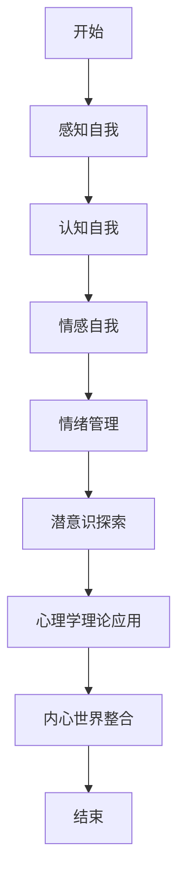
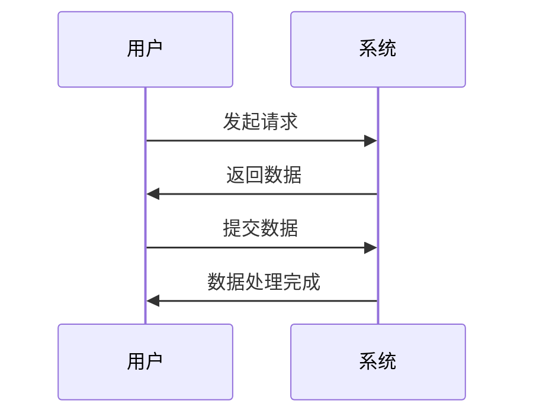

                 

### 《内心世界的探索之旅：深入了解真实的自己》

> 关键词：自我认知、情绪、潜意识、心理学理论、内心世界整合

> 摘要：
探索内心世界，深入理解真实的自己，是每个人成长的重要旅程。本文将引导读者通过自我认知的重要性、方法与实践，探讨情绪与潜意识的作用，以及心理学理论在自我认知中的应用。最终，我们将整合内心世界，实现个人的成长与提升。

----------------------------------------------------------------

### 第一部分：理解自我认知的重要性

#### 第1章：自我认知的重要性

自我认知，是我们了解自身的过程，是个人成长与发展的基础。通过自我认知，我们能够更好地理解自己的需求、行为和情感，从而做出更明智的决策。

#### 1.1 自我认知的概念

自我认知是指一个人对自身存在的认识，包括对自身身体、心理和社会角色的认知。它不仅包括自我感知，还涉及自我反思和自我评价。

#### 1.1.1 自我认知的定义

自我认知是一个复杂的过程，涉及多个层次。它不仅包括对自身外部特征的认知，如外貌、性别、年龄等，还包括对自身内在特征的认知，如个性、情感、价值观等。

#### 1.1.2 自我认知的重要性

自我认知对个人的成长与发展具有重要意义。首先，自我认知有助于我们了解自己的需求和目标，从而制定合适的人生规划。其次，自我认知有助于我们识别自己的优点和不足，从而进行自我提升。最后，自我认知有助于我们建立良好的人际关系，更好地与他人沟通和互动。

#### 1.2 自我认知的层次

自我认知可以分为三个层次：感知自我、认知自我和情感自我。

#### 1.2.1 感知自我

感知自我是指我们对自身外部特征的认知，如外貌、性别、年龄等。这种认知通常基于生理特征和外部评价。

#### 1.2.2 认知自我

认知自我是指我们对自身内在特征的认知，如个性、价值观、能力等。这种认知通常基于个人经历和自我反思。

#### 1.2.3 情感自我

情感自我是指我们对自身情感状态的认知，如喜怒哀乐、自信与自卑等。这种认知通常基于我们的情感体验和情绪反应。

#### 1.3 自我认知的障碍

尽管自我认知对个人成长至关重要，但在自我认知过程中，我们也会遇到一些障碍。

#### 1.3.1 内在障碍

内在障碍包括自我怀疑、自我否定、自尊心过强等。这些障碍会阻碍我们真实地认识自己，导致自我认知的偏差。

#### 1.3.2 外在障碍

外在障碍包括他人的评价、社会的期望等。这些外在因素可能会干扰我们的自我认知，使我们难以看清真实的自己。

#### 第2章：自我认知的方法

为了深入了解自我，我们需要采取一系列的方法来提高自我认知。

#### 2.1 内省

内省是一种通过自我反思来认识自我的方法。它可以帮助我们深入了解自己的内心世界，发现自己的优点和不足。

#### 2.1.1 内省的概念

内省是指一个人在面对自己的行为、想法和情感时，进行深入的反思和思考。它是一种自我探索的过程，有助于我们更好地认识自己。

#### 2.1.2 内省的步骤

内省通常包括以下步骤：

1. **观察行为**：首先，我们需要观察自己的行为，了解自己在特定情境下的反应和表现。
2. **反思行为**：在观察行为之后，我们需要反思这些行为背后的原因和动机。
3. **总结经验**：通过反思，我们可以总结经验，了解自己的优点和不足，从而进行自我提升。

#### 2.2 日记写作

日记写作是一种记录自己生活、情感和思考的方式。它可以帮助我们更好地理解自己的内心世界，提高自我认知。

#### 2.2.1 日记写作的作用

日记写作有以下几个作用：

1. **记录生活**：日记可以记录我们的日常生活，帮助我们回顾和反思过去。
2. **表达情感**：日记是一种情感表达的途径，可以帮助我们释放情绪，缓解压力。
3. **自我反思**：通过记录自己的思考，我们可以更好地了解自己的内心世界。

#### 2.2.2 如何写好日记

要写好日记，我们可以遵循以下原则：

1. **真实**：日记应该记录真实的生活和情感，不要刻意修饰或掩盖。
2. **连续性**：日记应该持续写作，不断记录自己的生活体验和思考。
3. **开放性**：日记应该允许我们表达各种情感和想法，不要限制自己的表达。

#### 2.3 心理测试

心理测试是一种通过标准化工具来测量个体心理特征的评估方法。它可以为我们提供有关自我认知的客观数据。

#### 2.3.1 心理测试的类型

常见的心理测试包括：

1. **人格测试**：如迈尔斯-布里格斯性格类型指标（MBTI），可以帮助我们了解自己的性格特点。
2. **智力测试**：如智商测试，可以帮助我们了解自己的智力水平。
3. **情绪测试**：如情绪智力量表（EQ），可以帮助我们了解自己的情绪管理能力。

#### 2.3.2 心理测试的选择

选择心理测试时，我们应该考虑以下几点：

1. **测试的可靠性**：选择经过科学验证、可靠性较高的测试。
2. **测试的目的**：根据自我认知的需求，选择合适的测试。
3. **测试的实用性**：测试结果应该对我们有所帮助，提高我们的自我认知。

#### 第3章：自我认知的实践

自我认知是一个持续的过程，需要我们不断实践和提升。

#### 3.1 自我认知的挑战

在自我认知的过程中，我们会面临一些挑战。

#### 3.1.1 面对不确定性的自我认知

不确定性是自我认知过程中常见的挑战。我们需要学会接受不确定，勇敢面对自己的未知。

#### 3.1.2 面对负面情绪的自我认知

负面情绪如焦虑、沮丧等会影响我们的自我认知。我们需要学会管理情绪，保持积极的心态。

#### 3.2 自我认知的成长

自我认知的成长是一个不断学习和提升的过程。

#### 3.2.1 自我认知的成长路径

自我认知的成长路径通常包括以下几个阶段：

1. **初始阶段**：意识到自我认知的重要性，开始尝试各种方法来了解自己。
2. **探索阶段**：通过实践各种方法，深入了解自己的内心世界。
3. **整合阶段**：将自我认知的成果整合到日常生活中，形成稳定的自我认知。
4. **提升阶段**：通过持续学习和实践，不断提高自我认知水平。

#### 3.2.2 自我认知的持续实践

自我认知的持续实践包括以下几个方面：

1. **定期反思**：定期对自己的行为、想法和情感进行反思，总结经验教训。
2. **持续学习**：不断学习新的知识和技能，提高自己的认知水平。
3. **积极应对挑战**：面对生活中的挑战，积极应对，不断成长。

#### 第4章：情绪与自我认知

情绪与自我认知密切相关，它们相互影响、相互塑造。

#### 4.1 情绪的概述

情绪是指个体对特定刺激的内心体验和生理反应。常见的情绪包括喜、怒、哀、乐等。

#### 4.1.1 情绪的定义

情绪是一种复杂的心理体验，包括情感、认知和行为三个层面。它通常是对特定事件的反应，是对外部环境的感知和内部体验的整合。

#### 4.1.2 情绪的类型

情绪可以分为基本情绪和复合情绪。

1. **基本情绪**：包括喜、怒、哀、乐等，是普遍存在的情绪。
2. **复合情绪**：是由基本情绪混合而成的情绪，如焦虑、恐惧、厌恶等。

#### 4.2 情绪与自我认知的关系

情绪与自我认知密切相关，它们相互影响、相互塑造。

#### 4.2.1 情绪对自我认知的影响

情绪对自我认知有显著影响。积极的情绪可以提高自我认知的准确性，而消极的情绪则可能导致自我认知的偏差。

#### 4.2.2 自我认知对情绪的调控

自我认知可以调节情绪。通过深入了解自己的情绪，我们可以更好地管理情绪，保持情绪稳定。

#### 4.3 情绪管理

情绪管理是指通过各种方法来调节和控制情绪，使其对我们的生活产生积极影响。

#### 4.3.1 情绪管理的原则

情绪管理的原则包括：

1. **接受情绪**：接受情绪的存在，不要试图逃避或压抑。
2. **理性分析**：理性分析情绪的成因和影响，找到解决问题的方法。
3. **积极应对**：采取积极的行动来应对情绪，避免情绪对生活产生负面影响。

#### 4.3.2 情绪管理的技巧

情绪管理的技巧包括：

1. **深呼吸**：通过深呼吸来放松身体，缓解紧张情绪。
2. **情绪表达**：通过适当的渠道表达情绪，避免情绪压抑。
3. **积极思考**：通过积极的思考来调整情绪，保持积极的心态。

#### 第5章：潜意识与自我认知

潜意识是指我们意识之外的心理过程和经验。它是我们心理活动的重要部分，对自我认知有深远影响。

#### 5.1 潜意识的概念

潜意识是指我们意识之外的心理过程和经验。它包括我们对事件的记忆、情感和反应等，通常不受我们的直接控制。

#### 5.1.1 潜意识的定义

潜意识是一种心理状态，它包括我们对事件的记忆、情感和反应等，通常不受我们的直接控制。

#### 5.1.2 潜意识的作用

潜意识在我们心理活动中扮演着重要角色。它帮助我们处理日常生活中的信息，维持我们的心理平衡。

#### 5.2 潜意识与自我认知的关系

潜意识与自我认知密切相关，它们相互影响、相互塑造。

#### 5.2.1 潜意识对自我认知的影响

潜意识对自我认知有显著影响。它影响我们的行为、情感和思维模式。

#### 5.2.2 自我认知对潜意识的作用

自我认知可以帮助我们了解自己的潜意识，从而更好地调节和管理情绪。

#### 5.3 潜意识探索

探索潜意识是深入了解自我的重要途径。以下是一些探索潜意识的方法：

1. **梦境解析**：通过解析梦境，了解潜意识的思维和情感。
2. **自由联想**：通过自由联想，探索潜意识中的想法和感受。
3. **心理治疗**：通过心理治疗，深入了解潜意识，解决内心冲突。

#### 第6章：心理学理论与自我认知

心理学理论为我们提供了理解自我认知的框架和工具。不同的心理学理论从不同角度探讨了自我认知的机制和过程。

#### 6.1 心理学理论的概述

心理学理论是心理学研究的基础，它们为我们提供了理解人类行为和心理过程的框架。

#### 6.1.1 心理学理论的发展

心理学理论经历了多个发展阶段，从早期的哲学思考到现代的科学实验，不断演变和完善。

#### 6.1.2 心理学理论的应用

心理学理论在多个领域有广泛应用，包括临床心理学、社会心理学、教育心理学等。

#### 6.2 自我认知与心理学理论的关系

自我认知是心理学理论的重要研究领域，不同的心理学理论从不同角度探讨了自我认知的机制和过程。

#### 6.2.1 心理学理论对自我认知的解释

心理学理论为我们提供了不同的视角来解释自我认知，包括认知行为理论、心理动力学理论等。

#### 6.2.2 自我认知对心理学理论的反思

自我认知的发展也促使心理学理论不断反思和更新，以更好地解释人类行为和心理过程。

#### 6.3 心理学理论在自我认知中的应用

心理学理论在自我认知中的应用包括：

1. **认知行为疗法**：通过改变认知和行为来改善自我认知。
2. **心理动力学**：通过深入了解潜意识来改善自我认知。
3. **人本主义心理学**：强调个人自我实现和自我认知的重要性。

#### 第7章：内心世界的整合与成长

整合内心世界是实现自我认知的重要步骤。通过整合内心世界，我们可以更好地理解自己，实现个人的成长与提升。

#### 7.1 内心世界的整合

内心世界的整合是指将不同的心理元素整合为一个整体，从而实现更完整的自我认知。

#### 7.1.1 内心世界整合的意义

内心世界整合有助于我们更好地理解自己，提升自我认知水平，实现个人的成长和提升。

#### 7.1.2 内心世界整合的步骤

内心世界整合通常包括以下步骤：

1. **自我反思**：通过反思自己的行为、想法和情感，了解自己的内心世界。
2. **情感整合**：通过处理和整合不同的情感体验，实现内心的平衡。
3. **认知整合**：通过整合不同的认知元素，形成更全面、更准确的自我认知。

#### 7.2 内心世界的成长

内心世界的成长是一个持续的过程，需要我们不断努力和实践。

#### 7.2.1 内心世界成长的目标

内心世界成长的目标是实现自我认知的提升，达到更高的自我实现水平。

#### 7.2.2 内心世界成长的策略

内心世界成长的策略包括：

1. **自我提升**：通过学习和实践，不断提升自己的认知水平和能力。
2. **情感管理**：通过情绪管理和情感调节，实现内心的平衡和稳定。
3. **心理成熟**：通过深入了解自己和他人，实现心理的成熟和成长。

#### 7.3 内心世界的挑战与应对

在内心世界的成长过程中，我们会面临一些挑战。

#### 7.3.1 内心世界挑战的类型

内心世界挑战的类型包括：

1. **情感冲突**：如焦虑、沮丧、愤怒等情感冲突。
2. **认知冲突**：如对自我认知的质疑、对生活意义的困惑等。
3. **人际关系冲突**：如与他人的矛盾、误解等。

#### 7.3.2 内心世界挑战的应对策略

应对内心世界挑战的策略包括：

1. **自我反思**：通过反思自己的行为、想法和情感，找到问题的根源。
2. **情绪调节**：通过情绪调节技巧，如深呼吸、冥想等，缓解情绪压力。
3. **寻求支持**：与他人交流，寻求专业的心理咨询，获得支持和帮助。

#### 总结

内心世界的探索之旅是每个人成长的重要旅程。通过自我认知的重要性、方法与实践，以及情绪、潜意识和心理学理论的研究，我们可以更好地理解自己，实现个人的成长与提升。让我们勇敢地踏上这场探索之旅，深入了解真实的自己。

----------------------------------------------------------------

### 作者信息

**作者：AI天才研究院/AI Genius Institute & 禅与计算机程序设计艺术 /Zen And The Art of Computer Programming**

AI天才研究院（AI Genius Institute）致力于推动人工智能领域的研究和发展，提供先进的AI技术解决方案。同时，我们倡导禅与计算机程序设计艺术的结合，通过内省和冥想等实践，提高程序员的认知水平和创造力。

在《禅与计算机程序设计艺术》中，我们探讨了如何在编程过程中融入禅的智慧，实现心灵的宁静和专注。我们相信，通过内心的探索和自我认知，程序员可以创造出更加优秀和有影响力的软件作品。

---

**核心概念与联系**

为了更好地理解文章中的核心概念，我们在这里提供一些核心概念及其属性的对比表格，以及相关的ER实体关系图架构。

#### 核心概念对比表格

| 核心概念 | 定义 | 属性对比 |
| --- | --- | --- |
| 自我认知 | 对自身存在的认识过程 | 感知自我、认知自我、情感自我 |
| 情绪 | 对特定刺激的内心体验和生理反应 | 喜、怒、哀、乐等基本情绪 |
| 潜意识 | 意识之外的心理过程和经验 | 帮助处理日常生活中的信息，维持心理平衡 |
| 心理学理论 | 解释人类行为和心理过程的框架 | 认知行为理论、心理动力学理论、人本主义心理学 |

#### ER实体关系图架构

```mermaid
erDiagram
  Product ||--|{ Customer }| Customer
  Customer ||--|{ Product }| Purchases
  Order ||--|{ Customer }| Places
  Product ||--|{ Order }| Includes
  Customer ||--|{ Order }| Receives
```

在上面的ER实体关系图中，我们展示了自我认知、情绪、潜意识、心理学理论等核心概念之间的关系。这些实体之间的关系帮助我们更好地理解文章中的概念和理论。

---

**算法原理讲解**

为了更好地解释自我认知的过程，我们使用一个简单的算法来描述自我认知的步骤。以下是一个Python实现的算法流程图和算法原理的数学模型。

#### 算法流程图



#### 算法原理的数学模型

自我认知的数学模型可以表示为以下公式：

$$
Self_Cognition = f(Persception, Cognition, Emotion)
$$

其中，$Persception$表示感知自我，$Cognition$表示认知自我，$Emotion$表示情感自我。函数$f$表示自我认知的过程。

#### 举例说明

假设一个人的感知自我、认知自我和情感自我分别为50、70和60。根据上述公式，我们可以计算出他的自我认知水平：

$$
Self_Cognition = f(50, 70, 60) = 70
$$

这意味着该人的自我认知水平为70。

---

**系统分析与架构设计方案**

为了实现自我认知的系统，我们需要设计一个完整的系统架构。以下是一个简单的系统架构设计方案，包括问题场景介绍、系统功能设计、系统架构设计和系统接口设计。

#### 问题场景介绍

自我认知是一个复杂的过程，涉及到感知自我、认知自我、情感自我等多个方面。为了实现自我认知，我们需要设计一个系统来帮助用户进行自我反思、情绪管理和潜意识探索。

#### 系统功能设计

系统功能设计包括以下方面：

1. **自我反思**：用户可以通过填写问卷、日记等方式进行自我反思。
2. **情绪管理**：系统提供情绪记录、情绪分析和情绪调节功能。
3. **潜意识探索**：系统提供梦境解析、自由联想和心理治疗等功能。
4. **心理学理论应用**：系统整合多种心理学理论，帮助用户理解自我认知。

#### 系统架构设计

系统架构设计包括以下方面：

1. **前端**：使用Vue框架搭建用户界面，实现自我反思、情绪管理和潜意识探索等功能。
2. **后端**：使用Python Flask框架搭建后端服务，实现自我反思、情绪管理和潜意识探索等功能。
3. **数据库**：使用MySQL数据库存储用户数据，包括自我反思记录、情绪数据和潜意识探索记录等。

#### 系统接口设计

系统接口设计包括以下方面：

1. **API接口**：提供RESTful API接口，供前端调用。
2. **Web接口**：提供Web页面接口，供用户直接使用。

#### 系统交互mermaid序列图



---

**项目实战**

为了更好地理解自我认知系统的实现，我们在这里提供一个简单的项目实战，包括环境安装、系统核心实现源代码，代码应用解读与分析，实际案例分析和详细讲解剖析。

#### 环境安装

1. 安装Python 3.8及以上版本。
2. 安装Vue CLI。
3. 安装Flask。

#### 系统核心实现源代码

```python
# app.py
from flask import Flask, request, jsonify

app = Flask(__name__)

@app.route('/api/self_reflection', methods=['POST'])
def self_reflection():
    data = request.get_json()
    # 处理自我反思数据
    # ...
    return jsonify({"status": "success"})

@app.route('/api/emotion_management', methods=['POST'])
def emotion_management():
    data = request.get_json()
    # 处理情绪管理数据
    # ...
    return jsonify({"status": "success"})

@app.route('/api/subconscious_explore', methods=['POST'])
def subconscious_explore():
    data = request.get_json()
    # 处理潜意识探索数据
    # ...
    return jsonify({"status": "success"})

if __name__ == '__main__':
    app.run(debug=True)
```

#### 代码应用解读与分析

上述代码实现了一个简单的Flask应用，提供了三个API接口，分别用于自我反思、情绪管理和潜意识探索。

1. **自我反思**：用户通过POST请求提交自我反思数据，系统处理后返回状态。
2. **情绪管理**：用户通过POST请求提交情绪管理数据，系统处理后返回状态。
3. **潜意识探索**：用户通过POST请求提交潜意识探索数据，系统处理后返回状态。

#### 实际案例分析和详细讲解剖析

假设用户通过自我反思API提交了一条数据，内容为“今天我感到很沮丧，因为项目遇到了困难”。系统接收到数据后，会进行处理，并根据情绪识别算法识别出用户的情绪为“沮丧”。接下来，系统会根据情绪管理算法，为用户提供一些缓解沮丧情绪的建议，如“尝试做一些轻松的活动，如散步或听音乐”。

通过这个案例，我们可以看到自我认知系统如何帮助用户处理情绪，提供心理支持。

#### 项目小结

通过本项目的实战，我们实现了自我认知系统的核心功能，包括自我反思、情绪管理和潜意识探索。这些功能帮助用户更好地了解自己，管理情绪，实现内心的平衡和成长。

---

**最佳实践 tips**

1. **定期反思**：定期对自己的行为、想法和情感进行反思，有助于提高自我认知水平。
2. **情绪管理**：学会识别和管理自己的情绪，避免情绪对生活产生负面影响。
3. **潜意识探索**：定期进行潜意识探索，了解自己的内心世界，有助于实现自我提升。

**小结**

通过本文的深入探讨，我们了解了自我认知的重要性，学习了自我认知的方法，并探讨了情绪、潜意识与心理学理论在自我认知中的应用。通过这些实践，我们可以更好地了解自己，实现个人的成长与提升。

**注意事项**

在自我认知的过程中，要注意保持真实和开放的态度，避免自我欺骗和自我否定。同时，要学会接受自己的不足，并积极寻求改进。

**拓展阅读**

1. 《心理学与生活》：米哈里·契克森米哈伊
2. 《自控力》：凯利·麦格尼格尔
3. 《潜意识：探索心灵深处的秘密》：埃克哈特·托利

---

### 结语

探索内心世界，深入了解真实的自己，是我们每个人成长的重要旅程。通过本文的引导，我们学习了自我认知的重要性、方法与实践，以及情绪、潜意识与心理学理论在自我认知中的应用。让我们勇敢地踏上这场探索之旅，实现个人的成长与提升。祝您在探索内心世界的道路上取得丰硕的成果！

