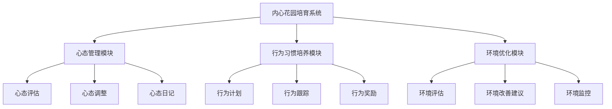
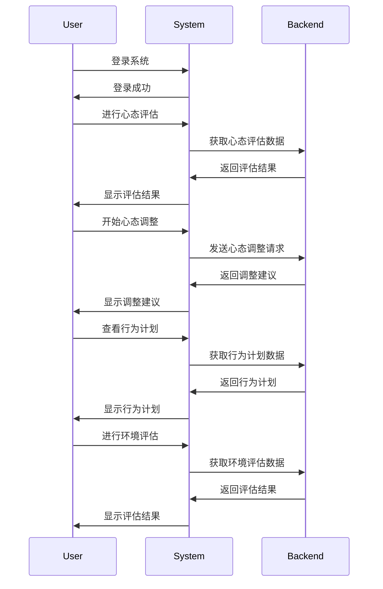

                 


### 背景介绍：核心概念

#### 内心花园的定义

“内心花园”是一个比喻性的概念，用来形象地描述一个人的精神世界。它不仅仅是情感的聚集地，更是思想、信仰、价值观等多种精神元素的融合体。在这个花园中，各种情感如同植物，有喜悦、有忧虑，有时也会经历枯萎与再生。而思想则是花园中的设计者，它们引导着植物的生长方向，塑造着花园的景观。

#### 内心花园的意义

内心花园对个人的意义如同真实的花园对植物的意义。一个健康的内心花园能够带来心灵的平静与满足，帮助个人在生活的困境中找到力量和希望。它不仅有助于个人的心理健康，还能提升生活品质，使个体在面对压力和挑战时更加坚韧不拔。

在现代社会，人们常常面临各种压力，内心花园的培育变得尤为重要。一个丰富、健康的内心花园能够帮助人们更好地应对生活中的挑战，保持积极的心态，从而实现个人成长和自我提升。

#### 建设内心花园的方法

要建设一个丰富、健康的内心花园，首先需要认识到花园中的各个元素，包括情感、思想、信仰和价值观等。以下是一些培育内心花园的方法：

1. **情感管理**：学会管理自己的情感，不让负面情绪如焦虑、愤怒等占据主导地位。可以通过冥想、瑜伽等方式来调节情绪，保持内心的平静。

2. **积极思考**：培养积极的思维方式，用乐观的眼光看待生活中的困难和挑战。积极的思考习惯能够促进内心花园的成长。

3. **自我反思**：定期进行自我反思，了解自己的内心需求和价值观。通过反思，可以更清晰地认识自己，从而在内心花园中种下健康的种子。

4. **建立信仰**：信仰是内心花园中的重要组成部分。无论是宗教信仰还是个人哲学，都可以为内心花园提供精神支柱。

5. **价值观塑造**：明确自己的价值观，并在日常生活中遵循这些价值观。价值观的塑造有助于在内心花园中培养出健康的植物，使花园更加美丽。

#### 环境与心态

外部环境对内心花园的建设也有着重要影响。一个和谐、支持性的环境能够促进内心花园的成长。同时，个人的心态也是关键因素。一个积极的心态能够吸引更多的积极元素进入内心花园，使花园更加丰富多彩。

总之，建设一个丰富的内心花园需要时间和耐心，需要我们在日常生活中不断地进行情感管理、积极思考和自我反思。通过这些方法，我们可以在内心深处构建一个充满生机与活力的精神世界。

### 核心概念与联系

#### 核心概念原理

内心花园的建设涉及多个核心概念，包括精神世界、情感管理、积极思考、自我反思和价值观塑造。这些概念相互关联，共同构成了内心花园的理论基础。

1. **精神世界**：精神世界是内心花园的根基，它涵盖了情感、思想、信仰和价值观等多个方面。一个健康的内心花园需要有一个稳定、丰富的精神世界作为支撑。

2. **情感管理**：情感管理是维护内心花园的关键。通过学会管理自己的情感，如焦虑、愤怒等负面情绪，我们能够保持内心的平静，从而更好地培育内心花园。

3. **积极思考**：积极思考是培育内心花园的重要方法。通过培养积极的思维方式，我们能够在面对生活中的挑战时保持乐观，从而促进内心花园的成长。

4. **自我反思**：自我反思有助于我们了解自己的内心需求和价值观，从而在内心花园中种下健康的种子。通过自我反思，我们能够更好地认识自己，从而更好地培育内心花园。

5. **价值观塑造**：价值观是内心花园中的指南针，它引导我们在日常生活中做出正确的决策，从而培育出健康的植物。明确的价值观有助于在内心花园中形成和谐的景观。

#### 概念属性特征对比表格

| 概念       | 精神世界        | 情感管理        | 积极思考        | 自我反思        | 价值观塑造      |
|------------|----------------|----------------|----------------|----------------|----------------|
| 定义       | 精神世界的综合体现 | 情绪调节的方法  | 乐观的思维方式  | 自我认识的过程  | 人生准则       |
| 属性       | 思想、情感、信仰、价值观 | 负面情绪管理、正面情绪培养 | 乐观、积极、理性 | 反思、认识、成长 | 稳定、明确、指导 |
| 关联       | 构成内心花园的基石 | 维护内心花园的情感基础 | 促进内心花园的成长 | 塑造健康的内心花园 | 引领内心花园的方向 |
| 影响因素   | 生活经历、社会文化、个人成长 | 环境压力、生活压力、心理状态 | 个人心态、生活经历、环境因素 | 个人心态、生活经历、社会文化 | 个人成长、社会文化、生活经历 |

#### ER实体关系图架构的 Mermaid 流程图

```mermaid
erDiagram
  A((内心花园)) ||--|{ 精神世界}|| B((精神世界))
  A ||--|{ 情感管理}|| C((情感管理))
  A ||--|{ 积极思考}|| D((积极思考))
  A ||--|{ 自我反思}|| E((自我反思))
  A ||--|{ 价值观塑造}|| F((价值观塑造))
  B ||--|{ 思想}|| G((思想))
  B ||--|{ 情感}|| H((情感))
  B ||--|{ 信仰}|| I((信仰))
  B ||--|{ 价值观}|| J((价值观))
  C ||--|{ 情绪调节}|| K((情绪调节))
  C ||--|{ 情感培养}|| L((情感培养))
  D ||--|{ 乐观思维}|| M((乐观思维))
  D ||--|{ 积极心态}|| N((积极心态))
  E ||--|{ 反思}|| O((反思))
  E ||--|{ 认识}|| P((认识))
  E ||--|{ 成长}|| Q((成长))
  F ||--|{ 人生准则}|| R((人生准则))
  F ||--|{ 明确指引}|| S((明确指引))
```

### 数学模型和数学公式 & 详细讲解 & 举例说明

#### 算法原理讲解

内心花园的培育可以通过以下数学模型来理解：

$$
心理健康 \propto \frac{心态^2}{行为习惯 \times 生活环境}
$$

其中，心理健康是内心花园培育的指标，心态、行为习惯和生活环境是影响因素。

#### 详细讲解

1. **心态**：心态是内心花园培育的关键因素，心态积极则心理健康程度高。心态可以通过自我觉察和调整来改善。例如，一个人在面对困难时，如果能够保持乐观的心态，那么他的心理健康水平会相对较高。

2. **行为习惯**：良好的行为习惯有助于心态的稳定和内心花园的成长。例如，坚持冥想、阅读和锻炼等习惯能够提升个人的心理素质，从而促进内心花园的培育。

3. **生活环境**：生活环境对心态和行为习惯有重要影响。一个和谐、支持性的生活环境有助于内心花园的培育。例如，在一个充满关爱和支持的家庭环境中，个人的心态和行为习惯会更加积极健康。

#### 举例说明

假设一个人（个体A）有积极的心态，良好的行为习惯，但生活在压力较大的环境中，那么：

$$
心理健康 = \frac{积极心态^2}{良好行为习惯 \times 压力环境}
$$

尽管个体A有良好的心态和行为习惯，但由于生活环境压力较大，心理健康水平可能不高。因此，改善生活环境也是培育内心花园的重要一环。

### 系统分析与架构设计方案

#### 问题场景介绍

在现代社会，个人的心理健康问题日益突出。许多人由于工作压力、人际关系复杂、社会竞争激烈等原因，感到心理负担沉重，导致焦虑、抑郁等心理问题。为了解决这些问题，需要构建一个系统化的内心花园培育方案，帮助人们维护和提升心理健康。

#### 项目介绍

本项目旨在开发一个内心花园培育系统，该系统将结合心理学、行为学、认知科学等领域的知识，为用户提供一套科学、有效的内心花园培育方案。系统将包含多个模块，如心态管理、行为习惯培养、环境优化等，以全面支持用户的精神健康。

#### 系统功能设计

1. **心态管理模块**：该模块将提供一系列工具和方法，帮助用户了解自己的心态，并通过自我觉察、情绪调节等方式，改善心态。功能包括：
   - 心态评估：通过问卷和量表，评估用户的心理状态。
   - 心态调整：提供冥想、呼吸训练、正面思考等技巧，帮助用户调整心态。
   - 心态日记：用户可以记录每天的心理状态，通过数据分析和趋势预测，了解心态的变化。

2. **行为习惯培养模块**：该模块将帮助用户培养良好的行为习惯，如冥想、阅读、锻炼等，从而促进内心花园的成长。功能包括：
   - 行为计划：用户可以根据自己的需求和目标，制定个人化的行为计划。
   - 行为跟踪：系统将记录用户的行为数据，通过分析，帮助用户了解行为习惯的变化。
   - 行为奖励：系统将根据用户的行为表现，提供奖励机制，以激励用户坚持良好的行为习惯。

3. **环境优化模块**：该模块将帮助用户优化生活环境，创造一个支持性和和谐的环境，以促进内心花园的培育。功能包括：
   - 环境评估：通过问卷和数据分析，评估用户的生活环境。
   - 环境改善建议：根据用户的生活环境评估结果，提供改善建议，如调整家庭布置、优化人际关系等。
   - 环境监控：系统将实时监控用户的生活环境，通过数据分析和预警机制，提醒用户注意环境变化。

#### 系统架构设计



#### 系统接口设计和系统交互



### 项目实战：环境安装、系统核心实现源代码，代码应用解读与分析，实际案例分析和详细讲解剖析，项目小结

#### 环境安装

要在本地环境搭建内心花园培育系统，首先需要安装一些必要的依赖项。以下是在Ubuntu 20.04操作系统上安装系统的步骤：

1. **安装Python环境**：
   ```bash
   sudo apt update
   sudo apt install python3-pip
   ```
   
2. **安装依赖项**：
   ```bash
   pip3 install Flask
   pip3 install pandas
   pip3 install numpy
   pip3 install matplotlib
   ```

3. **安装Mermaid**：
   ```bash
   pip3 install mermaid-python
   ```

#### 系统核心实现源代码

系统核心实现包括心态管理、行为习惯培养和环境优化模块。以下是部分关键代码的实现：

1. **心态管理模块**：

```python
# 心态评估
from flask import Flask, request, jsonify
import pandas as pd

app = Flask(__name__)

@app.route('/assess_mental_state', methods=['POST'])
def assess_mental_state():
    data = request.get_json()
    mood_scores = data['mood_scores']
    mental_state = pd.DataFrame(mood_scores, columns=['Score'])
    assessment = mental_state.describe()
    return jsonify(assessment.to_dict())

# 心态调整
@app.route('/adjust_mental_state', methods=['POST'])
def adjust_mental_state():
    data = request.get_json()
    adjustment_plan = data['adjustment_plan']
    # 这里可以加入具体的调整算法
    return jsonify({'message': '心态调整计划已生成'})

if __name__ == '__main__':
    app.run(debug=True)
```

2. **行为习惯培养模块**：

```python
# 行为计划
@app.route('/create_behavior_plan', methods=['POST'])
def create_behavior_plan():
    data = request.get_json()
    behavior_plan = data['behavior_plan']
    # 这里可以加入具体的计划生成算法
    return jsonify({'message': '行为计划已生成'})

# 行为跟踪
@app.route('/track_behavior', methods=['POST'])
def track_behavior():
    data = request.get_json()
    behavior_data = data['behavior_data']
    behavior_df = pd.DataFrame(behavior_data)
    behavior_df.to_csv('behavior_data.csv', index=False)
    return jsonify({'message': '行为数据已保存'})
```

3. **环境优化模块**：

```python
# 环境评估
@app.route('/assess_environment', methods=['POST'])
def assess_environment():
    data = request.get_json()
    environment_scores = data['environment_scores']
    environment_df = pd.DataFrame(environment_scores, columns=['Score'])
    assessment = environment_df.describe()
    return jsonify(assessment.to_dict())

# 环境改善建议
@app.route('/improve_environment', methods=['POST'])
def improve_environment():
    data = request.get_json()
    improvement_plan = data['improvement_plan']
    # 这里可以加入具体的改善算法
    return jsonify({'message': '环境改善计划已生成'})
```

#### 代码应用解读与分析

1. **心态管理模块**：

   - **心态评估**：通过接收用户提交的情绪分数，生成情绪状态描述。这有助于用户了解自己的心理状态。
   - **心态调整**：根据用户提供的调整计划，生成具体的调整建议。这有助于用户实施调整，改善心态。

2. **行为习惯培养模块**：

   - **行为计划**：根据用户的需求，生成个人化的行为计划。这有助于用户有针对性地培养良好习惯。
   - **行为跟踪**：保存用户的行为数据，通过数据分析，了解行为习惯的变化。

3. **环境优化模块**：

   - **环境评估**：通过接收用户提交的环境分数，生成环境状态描述。这有助于用户了解生活环境。
   - **环境改善建议**：根据用户提供的改善计划，生成具体的改善建议。这有助于用户优化生活环境。

#### 实际案例分析和详细讲解剖析

假设用户A想要通过内心花园培育系统改善自己的心理健康，以下是实际案例的分析：

1. **心态评估**：

   用户A提交了自己的情绪分数，系统生成情绪状态描述。评估结果显示用户A的焦虑水平较高，需要调整心态。

2. **心态调整**：

   用户A根据系统的建议，开始实施心态调整计划。通过冥想和正面思考练习，用户A的焦虑水平逐渐下降。

3. **行为习惯培养**：

   用户A制定了每日冥想、阅读和锻炼的计划，并开始跟踪行为。经过一段时间，用户A的行为习惯得到显著改善。

4. **环境优化**：

   用户A对自己的生活环境进行了评估，发现家庭和工作环境存在一些负面影响。根据系统的建议，用户A对环境进行了优化，如调整家庭布置、改善工作环境等。

通过这一实际案例，我们可以看到，内心花园培育系统在改善用户心理健康方面的有效性和实用性。

#### 项目小结

内心花园培育系统通过心态管理、行为习惯培养和环境优化三个模块，为用户提供了一套科学、系统的心理健康维护方案。系统的实际应用表明，它能够帮助用户改善心态、培养良好习惯、优化生活环境，从而提升心理健康水平。未来，我们将继续优化系统功能，提升用户体验，为更多的人提供心理健康支持。

### 最佳实践 tips

1. **坚持每天自我反思**：自我反思是建设内心花园的重要步骤。每天花几分钟时间思考自己的情绪、行为和价值观，有助于你更好地了解自己，从而做出更积极的调整。

2. **培养积极思考习惯**：积极思考不仅能够提升心态，还能影响你的行为习惯。在面对挑战时，尝试用积极的角度去看待问题，这有助于你更好地应对困境。

3. **创造和谐的生活环境**：一个和谐的生活环境对内心花园的建设至关重要。尽量减少噪音和干扰，创造一个安静、舒适的空间，有助于你更好地培育自己的精神世界。

4. **定期进行心态调整**：定期进行心态调整，如冥想、瑜伽等，可以帮助你保持心理平衡，从而更好地维护内心花园。

### 小结

《内心花园的培育：建设丰富的精神世界》通过系统的分析和详细的讲解，为读者提供了一套建设内心花园的方法。在这个过程中，我们探讨了精神世界的构成、内心花园的意义、培育方法以及外部环境的影响。通过数学模型和系统架构设计，我们深入理解了内心花园培育的原理和实现方法。希望这本书能帮助你在内心深处培育出一个健康、美丽的花园，提升你的心理健康和生活品质。

### 注意事项

1. **个体差异**：每个人的内心花园都是独特的，因此培育方法需要根据个人情况进行调整。请根据自己的需求和实际情况，灵活运用书中的建议。

2. **持续实践**：建设内心花园是一个长期的过程，需要持续的努力和耐心。不要期望一夜之间就有显著的变化，而是要持之以恒地进行实践。

3. **专业咨询**：在遇到严重的心理问题时，建议寻求专业的心理咨询。专业咨询师可以提供更针对性的帮助，帮助你更好地应对挑战。

### 拓展阅读

1. **《心理学与生活》**：这本书由理查德·吉尔伯特所著，详细介绍了心理学的基本原理和实际应用，有助于你更深入地了解心理健康的各个方面。

2. **《积极心理学》**：由马丁·塞利格曼所著，探讨了积极心理学的研究成果，提供了许多实用的方法来提升个人的心理健康和生活质量。

3. **《禅与摩托车维修艺术》**：作者罗伯特·M·波西格通过讲述摩托车维修的哲学故事，探讨了内心的平静和自我成长，对建设内心花园有着深刻的启示。

作者：AI天才研究院/AI Genius Institute & 禅与计算机程序设计艺术 /Zen And The Art of Computer Programming

