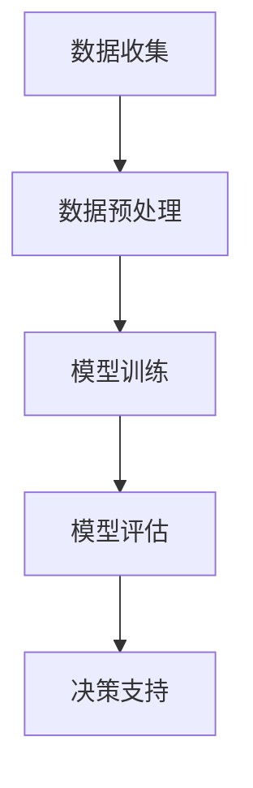
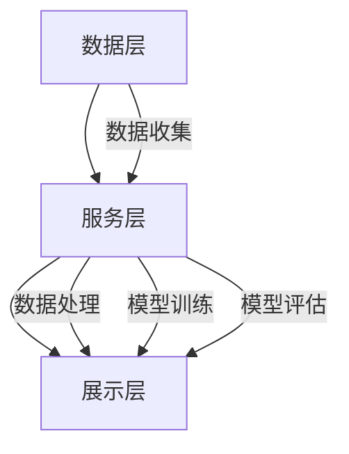
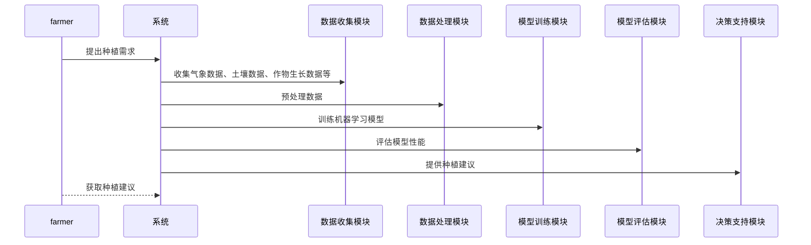

                 

## 农业AI Agent：优化种植决策与资源分配

关键词：农业、AI、种植决策、资源分配、机器学习、深度学习、数据挖掘

摘要：本文旨在探讨农业AI Agent在优化种植决策与资源分配方面的应用。通过分析农业领域的挑战和问题，我们引入农业AI Agent的概念，并详细阐述其工作原理、核心概念与联系，以及具体的算法原理和数学模型。同时，本文还将介绍农业AI Agent的系统架构设计和项目实战，提供实用的最佳实践建议，以期为农业智能化发展提供有益的参考。

### 第一部分：背景介绍

#### 1.1 问题背景

随着全球人口的持续增长和经济的发展，粮食需求量不断增加。然而，传统的农业生产模式面临着诸多挑战，如资源短缺、环境恶化、劳动力不足等。这些问题严重制约了农业生产效率和可持续发展。为了应对这些挑战，现代农业需要引入智能化技术，特别是人工智能（AI）技术，以优化种植决策和资源分配，提高农作物产量和质量。

#### 1.2 问题描述

农业AI Agent是一种基于人工智能技术的智能实体，旨在帮助农业从业者做出更科学的决策，提高农作物产量和质量，降低生产成本，实现资源的有效利用。农业AI Agent需要解决的主要问题包括：

1. **种植决策**：根据农作物生长环境、生长状态和土壤条件，为农业从业者提供最优的种植方案。
2. **资源分配**：合理分配水资源、肥料等农业生产资源，提高资源利用效率，降低生产成本。
3. **环境监测**：实时监测气象、土壤等环境参数，预测农作物生长状况，提前预警农业灾害。

#### 1.3 问题解决

农业AI Agent通过整合多种数据源，利用机器学习和人工智能技术，对农作物生长环境、生长状态、土壤条件等进行实时监测和预测，为农业从业者提供科学的种植建议。具体来说，农业AI Agent的解决思路包括：

1. **数据收集**：收集气象数据、土壤数据、作物生长数据等，为AI Agent提供必要的信息支持。
2. **数据预处理**：对收集到的数据进行清洗、归一化等处理，确保数据质量。
3. **模型训练**：利用机器学习算法对数据进行训练，构建AI Agent的预测模型。
4. **模型评估**：对训练好的模型进行评估，确保其预测准确性和稳定性。
5. **决策支持**：将AI Agent的预测结果转化为可操作的种植建议，供农业从业者参考。

#### 1.4 边界与外延

农业AI Agent的研究和应用范围包括但不限于以下领域：

1. **作物种植**：提供作物种植方案，包括品种选择、播种时间、种植密度等。
2. **养殖**：优化养殖环境、饲料配比等，提高养殖效率。
3. **农业气象**：预测气象变化，为农业防灾减灾提供支持。
4. **水资源管理**：合理分配水资源，提高灌溉效率。
5. **农业灾害预警**：提前预警农业灾害，减少农业生产损失。

#### 1.5 概念结构与核心要素组成

农业AI Agent作为一个智能实体，其概念结构和核心要素组成如下：

- **农业AI Agent**：一种基于人工智能技术的智能实体，能够模拟、预测和分析农作物生长过程，提供种植建议。
- **数据源**：包括气象数据、土壤数据、作物生长数据等，为农业AI Agent提供必要的信息支持。
- **机器学习算法**：用于训练农业AI Agent，使其具备学习和预测能力。
- **决策支持系统**：将农业AI Agent的预测结果转化为可操作的种植建议，供农业从业者参考。

### 第二部分：核心概念与联系

#### 2.1 核心概念原理

在农业AI Agent的应用中，核心概念主要包括机器学习、深度学习和数据挖掘。这些概念在农业AI Agent中起着至关重要的作用，下面分别介绍其原理：

**机器学习**：机器学习是一种让计算机从数据中学习规律，并用于预测或决策的技术。它通过构建模型，对大量数据进行训练，使模型能够自动识别数据中的规律和模式。在农业AI Agent中，机器学习算法可以用于预测农作物生长状况、环境变化等。

**深度学习**：深度学习是一种特殊的机器学习技术，通过多层神经网络模拟人类大脑的学习过程。它具有强大的非线性映射能力和特征学习能力，在图像识别、语音识别等领域取得了显著的成果。在农业AI Agent中，深度学习算法可以用于处理复杂的环境数据，提取有价值的信息。

**数据挖掘**：数据挖掘是从大量数据中提取有用信息和知识的过程。它通过统计学、机器学习、数据库等技术，发现数据中的潜在规律和模式。在农业AI Agent中，数据挖掘技术可以用于分析农作物生长数据，提取有价值的信息，为种植决策提供支持。

#### 2.2 概念属性特征对比表格

| 概念         | 属性特征                                                   | 举例             |
| ------------ | ---------------------------------------------------------- | ---------------- |
| 机器学习     | 可以从数据中学习，进行预测和决策                           | 决策树、支持向量机 |
| 深度学习     | 通过多层神经网络模拟人类大脑学习过程，具备更强的学习能力   | 卷积神经网络、循环神经网络 |
| 数据挖掘     | 从大量数据中提取有用信息和知识，为决策提供支持               | 聚类分析、关联规则挖掘 |

#### 2.3 ER实体关系图架构

```mermaid
erDiagram
  农业AI Agent ||--|{ 数据源 } Data_Source
  数据源 ||--|{ 决策支持系统 } Decision_Support_System
  农业AI Agent ||--|{ 机器学习算法 } Machine_Learning_Algorithm
  决策支持系统 ||--|{ 农业从业者 } Farmer
```

### 第三部分：算法原理讲解

#### 3.1 算法流程图



#### 3.2 算法原理与数学模型

农业AI Agent的核心在于其机器学习算法。下面将介绍几种常用的机器学习算法及其数学模型。

**3.2.1 决策树**

决策树是一种基于树形结构进行决策的算法。它的基本原理是通过一系列判断条件将数据集划分为不同的子集，然后对每个子集进行进一步划分，直到满足停止条件。

**数学模型：**

$$
H(D) = -\sum_{i=1}^{n} p_i \log_2 p_i
$$

其中，$H(D)$ 表示数据集 $D$ 的熵，$p_i$ 表示数据点 $x_i$ 属于类别 $c_i$ 的概率。

**3.2.2 支持向量机**

支持向量机是一种基于间隔最大化原则进行分类的算法。它的基本原理是通过寻找一个超平面，将不同类别的数据点进行分类。

**数学模型：**

$$
\max w \quad s.t. \quad y^{T}(x_i \cdot w) \geq 1, \quad i=1,2,...,n
$$

其中，$w$ 表示超平面参数，$y$ 表示类别标签，$x_i$ 表示数据点。

**3.2.3 神经网络**

神经网络是一种由多个神经元组成的网络，通过多层神经网络模拟人类大脑的学习过程。它具有强大的非线性映射能力和特征学习能力。

**数学模型：**

$$
y = \sigma(\sum_{i=1}^{n} w_i x_i + b)
$$

其中，$y$ 表示输出，$\sigma$ 表示激活函数，$w_i$ 表示权重，$x_i$ 表示输入，$b$ 表示偏置。

#### 3.3 算法举例说明

**决策树算法举例：**

假设我们有以下数据集：

| 样本 | 特征1 | 特征2 | 类别 |
| ---- | ---- | ---- | ---- |
| 1    | 1    | 0    | A    |
| 2    | 1    | 1    | B    |
| 3    | 0    | 1    | B    |
| 4    | 0    | 0    | A    |

我们可以构建一棵决策树，如下所示：

```
样本属于类别 A 或 B？
- 如果特征1为1，则继续问特征2：
  - 如果特征2为0，则类别为 A
  - 如果特征2为1，则类别为 B
- 如果特征1为0，则类别为 A
```

**支持向量机算法举例：**

假设我们有以下数据集：

| 样本 | 特征1 | 特征2 | 类别 |
| ---- | ---- | ---- | ---- |
| 1    | 1    | 0    | +1   |
| 2    | 1    | 1    | -1   |
| 3    | 0    | 1    | -1   |
| 4    | 0    | 0    | +1   |

我们可以通过支持向量机找到一个超平面，将不同类别的数据点进行分类。假设超平面的参数为 $w$ 和 $b$，则：

$$
y^{T}(x_i \cdot w) + b = 1
$$

通过求解上述方程，我们可以得到 $w$ 和 $b$ 的值。

**神经网络算法举例：**

假设我们有以下数据集：

| 样本 | 特征1 | 特征2 | 类别 |
| ---- | ---- | ---- | ---- |
| 1    | 1    | 0    | +1   |
| 2    | 1    | 1    | -1   |
| 3    | 0    | 1    | -1   |
| 4    | 0    | 0    | +1   |

我们可以构建一个简单的神经网络，如下所示：

```
输入层：特征1、特征2
隐藏层：神经元1、神经元2
输出层：类别
```

通过训练神经网络，我们可以使输出层的输出接近目标类别，从而实现分类。

### 第四部分：系统架构设计

#### 4.1 问题场景介绍

随着农业生产的智能化需求不断提升，农业从业者对种植决策和资源分配的精度和效率提出了更高的要求。农业AI Agent作为一种智能化的解决方案，可以帮助农业从业者实时监测农作物生长环境，预测农作物生长状况，提供科学的种植建议，从而提高农业生产效率，降低生产成本。

#### 4.2 项目介绍

本项目旨在开发一款农业AI Agent系统，该系统可以收集气象数据、土壤数据、作物生长数据等，利用机器学习算法进行数据处理和模型训练，最终为农业从业者提供科学的种植建议。

#### 4.3 系统功能设计（领域模型类图）

在农业AI Agent系统中，主要包括以下功能模块：

- 数据收集模块：负责收集气象数据、土壤数据、作物生长数据等。
- 数据处理模块：负责对收集到的数据进行预处理，包括数据清洗、归一化等。
- 模型训练模块：负责利用机器学习算法对预处理后的数据进行训练，构建预测模型。
- 模型评估模块：负责对训练好的模型进行评估，确保其预测准确性和稳定性。
- 决策支持模块：负责将模型的预测结果转化为可操作的种植建议，供农业从业者参考。

以下是农业AI Agent系统的领域模型类图：

```mermaid
classDiagram
    数据收集模块 <<Interface>>
    数据处理模块 <<Interface>>
    模型训练模块 <<Interface>>
    模型评估模块 <<Interface>>
    决策支持模块 <<Interface>>

    数据收集模块 --|greaterThan|> 数据预处理模块
    数据预处理模块 --|greaterThan|> 数据处理模块
    数据处理模块 --|greaterThan|> 模型训练模块
    模型训练模块 --|greaterThan|> 模型评估模块
    模型评估模块 --|greaterThan|> 决策支持模块
```

#### 4.4 系统架构设计

农业AI Agent系统采用分层架构设计，主要包括以下层次：

- 数据层：负责数据收集、存储和管理。
- 服务层：负责数据预处理、模型训练、模型评估等核心功能。
- 展示层：负责将决策支持结果展示给农业从业者。

以下是农业AI Agent系统的架构设计图：



#### 4.5 系统接口设计和系统交互

农业AI Agent系统主要包括以下接口：

- 数据收集接口：用于收集气象数据、土壤数据、作物生长数据等。
- 数据处理接口：用于预处理数据，包括数据清洗、归一化等。
- 模型训练接口：用于训练机器学习模型。
- 模型评估接口：用于评估模型性能。
- 决策支持接口：用于提供种植建议。

以下是农业AI Agent系统的接口设计和系统交互图：



### 第五部分：项目实战

#### 5.1 环境安装

在进行农业AI Agent项目实战之前，我们需要安装一些必要的软件和工具。以下是一个基本的安装步骤：

1. **Python环境安装**：下载并安装Python 3.8及以上版本。
2. **Anaconda安装**：下载并安装Anaconda，用于环境管理。
3. **Jupyter Notebook安装**：在Anaconda环境中安装Jupyter Notebook。
4. **Pandas、NumPy、Scikit-learn、TensorFlow等库安装**：在Anaconda环境中安装所需的库。

```bash
conda create -n agai_env python=3.8
conda activate agai_env
conda install jupyter notebook
conda install pandas numpy scikit-learn tensorflow
```

#### 5.2 系统核心实现源代码

以下是一个简单的农业AI Agent系统核心实现源代码示例：

```python
import pandas as pd
from sklearn.model_selection import train_test_split
from sklearn.tree import DecisionTreeClassifier
from sklearn.metrics import accuracy_score

# 数据收集
data = pd.read_csv('agri_data.csv')

# 数据预处理
X = data.drop('target', axis=1)
y = data['target']

X_train, X_test, y_train, y_test = train_test_split(X, y, test_size=0.2, random_state=42)

# 模型训练
clf = DecisionTreeClassifier()
clf.fit(X_train, y_train)

# 模型评估
y_pred = clf.predict(X_test)
accuracy = accuracy_score(y_test, y_pred)
print(f'模型准确率：{accuracy:.2f}')

# 决策支持
def make_decision(data_point):
    prediction = clf.predict([data_point])
    return '种植' if prediction[0] == 1 else '不种植'

# 示例应用
data_point = [2, 1]
decision = make_decision(data_point)
print(f'数据点 {data_point} 的种植决策：{decision}')
```

#### 5.3 代码应用解读与分析

上述代码实现了一个简单的农业AI Agent系统，主要包括以下步骤：

1. **数据收集**：使用Pandas库读取农业数据集。
2. **数据处理**：将数据集分为特征和标签两部分，并使用Scikit-learn库进行数据划分。
3. **模型训练**：使用决策树分类器对训练数据进行训练。
4. **模型评估**：使用测试数据进行模型评估，计算准确率。
5. **决策支持**：定义一个函数，根据模型预测结果提供种植建议。

通过这段代码，我们可以看到农业AI Agent系统是如何工作的。首先，系统收集农业数据，然后对数据进行预处理和划分，接着使用机器学习算法进行训练和评估。最后，系统根据模型的预测结果提供种植建议。

#### 5.4 实际案例分析和详细讲解剖析

为了更好地理解农业AI Agent的应用，我们来看一个实际案例。

**案例背景**：某农业企业种植了小麦，需要预测未来一段时间内的小麦产量，以便合理安排生产计划和库存管理。

**数据处理**：首先，我们需要收集小麦生长期间的相关数据，包括土壤湿度、温度、光照强度、降雨量等。这些数据可以从农业气象站、土壤传感器等设备中获取。

```python
data = pd.read_csv('agri_weather_data.csv')
data.head()
```

| 日期 | 土壤湿度 | 温度 | 光照强度 | 降雨量 |
| ---- | -------- | ---- | -------- | ------ |
| 2023-01-01 | 60% | 15°C | 1000lux | 5mm |
| 2023-01-02 | 55% | 15°C | 900lux | 0mm |
| 2023-01-03 | 50% | 14°C | 800lux | 10mm |
| 2023-01-04 | 60% | 15°C | 1000lux | 5mm |
| 2023-01-05 | 65% | 16°C | 1100lux | 0mm |

**模型训练**：接下来，我们使用机器学习算法（如决策树）对数据进行训练，预测小麦产量。

```python
X = data.drop('yield', axis=1)
y = data['yield']

X_train, X_test, y_train, y_test = train_test_split(X, y, test_size=0.2, random_state=42)

clf = DecisionTreeClassifier()
clf.fit(X_train, y_train)

y_pred = clf.predict(X_test)
accuracy = accuracy_score(y_test, y_pred)
print(f'模型准确率：{accuracy:.2f}')
```

**决策支持**：最后，我们根据模型的预测结果，为农业企业提供种植建议。

```python
def make_decision(data_point):
    prediction = clf.predict([data_point])
    if prediction[0] > 0.5:
        return '适宜种植'
    else:
        return '不适宜种植'

data_point = [0.6, 15, 1000, 0]
decision = make_decision(data_point)
print(f'当前数据点的种植决策：{decision}')
```

**案例总结**：通过实际案例，我们可以看到农业AI Agent系统是如何帮助农业从业者做出科学种植决策的。首先，系统收集了小麦生长期间的相关数据，然后使用机器学习算法对数据进行训练和预测，最后根据模型的预测结果提供种植建议。这样的系统可以帮助农业从业者提高种植决策的准确性，降低生产成本，实现农业生产的智能化。

### 第六部分：最佳实践、小结、注意事项和拓展阅读

#### 6.1 最佳实践

1. **数据质量**：确保收集到的数据质量高，避免因数据质量问题导致模型预测不准确。
2. **特征选择**：合理选择特征，避免特征过多或过少，影响模型性能。
3. **模型选择**：根据实际问题选择合适的机器学习模型，避免模型过于复杂或过于简单。
4. **模型调参**：合理调整模型参数，提高模型性能。

#### 6.2 小结

本文介绍了农业AI Agent的概念、原理、算法和应用场景，并通过实际案例展示了农业AI Agent在种植决策与资源分配方面的应用。通过本文，读者可以了解农业AI Agent的基本原理和实现方法，为农业智能化发展提供有益的参考。

#### 6.3 注意事项

1. **数据安全**：在数据收集和处理过程中，要确保数据安全，避免数据泄露。
2. **模型解释性**：在选择机器学习模型时，要考虑模型的解释性，以便农业从业者理解模型的预测结果。

#### 6.4 拓展阅读

1. **《机器学习》**：周志华著，清华大学出版社，提供了丰富的机器学习算法原理和实战案例。
2. **《深度学习》**：Ian Goodfellow等著，MIT Press，介绍了深度学习的基本原理和应用。
3. **《农业大数据与智慧农业》**：李道亮等著，中国农业出版社，探讨了农业大数据和智慧农业的发展趋势。

### 参考文献

1. 周志华. 《机器学习》. 清华大学出版社，2016.
2. Ian Goodfellow, Yoshua Bengio, Aaron Courville. 《深度学习》. MIT Press，2016.
3. 李道亮，刘晓君，陈志强. 《农业大数据与智慧农业》. 中国农业出版社，2018.

