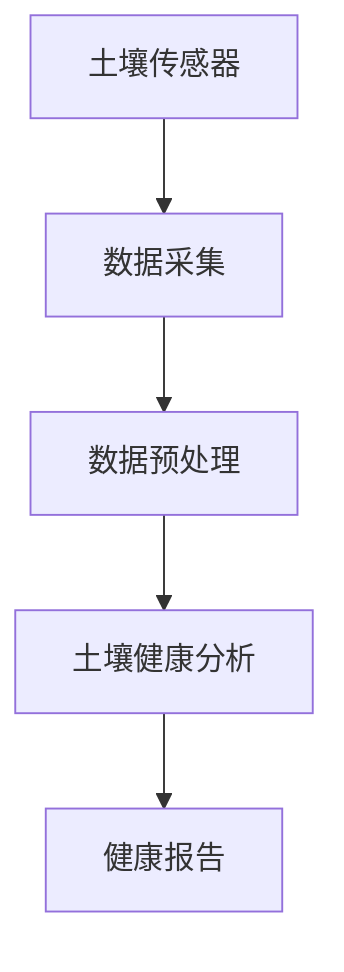
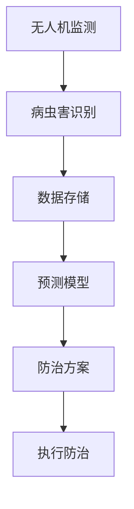

                 

### 农业AI Agent：智能种植与农场管理

**关键词：** 农业人工智能，智能种植，农场管理，AI Agent，精准农业，数据采集与处理

**摘要：** 本文将深入探讨农业领域的人工智能（AI）应用，特别是在智能种植与农场管理中的重要性。通过分析农业AI Agent的基本概念、核心技术和实际应用，本文旨在展示AI在农业中的潜力，并探讨其未来的发展趋势和潜在挑战。文章将分为六个主要部分，分别介绍AI在农业中的兴起、核心概念与技术、AI在农场管理中的应用、高级AI技术、案例分析以及未来趋势与伦理问题。

### 农业AI Agent的兴起

随着全球人口的增长和可耕地资源的减少，农业面临着巨大的挑战。传统农业方法已经难以满足日益增长的粮食需求，因此，将人工智能（AI）应用于农业成为了必然趋势。农业AI Agent，作为一种智能系统，能够通过收集和分析大量数据，提供精准的种植和管理建议，从而提高农业生产效率和可持续性。

**1.1. AI在农业中的应用历史**

AI在农业中的应用并非一蹴而就。早在20世纪80年代，专家系统（Expert Systems）就首次被引入农业领域。专家系统通过模拟人类专家的判断和决策过程，为农民提供种植建议。然而，由于数据的局限性，专家系统的效果有限。

进入21世纪，随着大数据和计算能力的提升，机器学习和深度学习技术得到了快速发展。这些技术可以处理海量数据，从中提取有价值的信息，为农业提供更为精准的决策支持。例如，遥感技术（Remote Sensing）和卫星成像（Satellite Imaging）的应用，使得农田监测和作物生长分析变得更加精确。

**1.2. 现代农业与AI的融合**

现代农业正逐渐从劳动力密集型向智能化转型。AI Agent在农业中的应用涵盖了从种子选择、土壤管理到作物收获的各个环节。这些智能系统能够实时监测农田状况，预测作物生长趋势，优化灌溉和施肥方案，甚至能够自动执行农事操作。

例如，自动化的播种机可以根据土壤湿度、温度和光照条件，精确控制播种时间和深度。无人机（Drones）可以携带传感器进行农田监测，及时发现病虫害和杂草问题，并进行精准喷洒农药。这些技术的应用，不仅提高了农业生产的效率，还减少了农药和化肥的使用，对环境保护具有重要意义。

**1.3. 农业AI Agent的基本概念**

农业AI Agent是一种基于人工智能技术的智能系统，它通过以下四个主要步骤实现农业自动化和智能化：

1. **数据采集**：利用各种传感器和监测设备，收集土壤、气候、作物生长状态等数据。
2. **数据处理**：通过大数据分析和机器学习算法，对采集到的数据进行处理和分析，提取有价值的信息。
3. **决策制定**：根据分析结果，智能系统会制定出最优的种植和管理方案。
4. **执行操作**：通过自动化设备或机器人，执行智能系统制定的种植和管理任务。

**1.4. 农业AI Agent的现状与未来**

目前，农业AI Agent已经在全球范围内得到广泛应用，特别是在发达国家。然而，在发展中国家，由于技术、资金和基础设施的限制，AI在农业中的应用仍面临许多挑战。未来，随着技术的不断进步和成本的降低，农业AI Agent有望在全球范围内得到更广泛的应用。

总的来说，农业AI Agent不仅能够提高农业生产的效率，还能帮助农民更好地应对气候变化、资源短缺等挑战。其潜在的应用场景包括：

- 精准农业：通过实时监测和数据分析，实现精准施肥、灌溉和病虫害管理。
- 环境保护：通过减少农药和化肥的使用，降低对环境的污染。
- 食品安全：通过监控作物生长过程，确保食品的质量和安全。
- 农业科研：通过大数据分析，为农业科研提供新的研究方向和实验数据。

### 农业AI Agent的核心概念与技术

在深入了解农业AI Agent之前，我们需要先了解一些核心概念和技术，这些是构建和运行农业AI Agent的基础。

**2.1. 基本AI和机器学习概念**

人工智能（AI）是一种模拟人类智能行为的计算机技术。机器学习（Machine Learning）是AI的一个重要分支，它使计算机系统能够从数据中学习并做出决策，而无需明确编程。在农业AI Agent中，机器学习算法被用来处理和分析大量的农田数据，以提供精确的种植和管理建议。

- **监督学习（Supervised Learning）**：在监督学习过程中，系统使用标记好的数据来训练模型。标记数据通常包括输入特征和对应的输出标签。通过学习这些标记数据，模型能够预测新的未知数据的输出。在农业中，监督学习可以用于预测作物产量、病虫害发生等。

- **无监督学习（Unsupervised Learning）**：无监督学习不使用标记数据，而是通过分析未标记的数据来发现数据中的模式。在农业中，无监督学习可以用于土壤分析、气候模式识别等。

- **强化学习（Reinforcement Learning）**：强化学习是一种通过试错来学习如何做出最优决策的机器学习方法。在农业中，强化学习可以用于自动化的农业机器，例如自动喷雾器、自动收割机等。

**2.2. 数据采集和管理**

数据是农业AI Agent的核心。为了实现精准农业，需要收集大量的农田数据，包括土壤数据、气候数据、作物生长数据等。这些数据的来源包括：

- **传感器**：安装在农田中的传感器可以实时监测土壤湿度、温度、pH值等参数。
- **卫星和无人机**：通过卫星成像和无人机监测，可以获得大范围的农田图像，用于分析作物生长状况、病虫害等。
- **气象数据**：通过气象站和气象卫星，可以获取精确的气候数据，如温度、湿度、风速、降雨量等。

数据采集后，需要进行有效的管理和存储。这通常涉及到以下步骤：

- **数据预处理**：数据采集后，需要进行清洗和转换，以去除噪声、缺失值和异常值，确保数据的质量。
- **数据存储**：预处理后的数据需要存储在数据库中，以便进行后续的分析和处理。
- **数据管理**：建立完善的数据管理体系，确保数据的安全、可靠和可访问。

**2.3. AI模型在作物生长预测中的应用**

作物生长预测是农业AI Agent的一个重要应用领域。通过预测作物生长状态，农民可以提前制定出最佳的种植和管理方案。常用的AI模型包括：

- **回归模型**：回归模型用于预测连续的数值输出，如作物产量。常见的回归模型有线性回归、多项式回归等。
- **分类模型**：分类模型用于预测离散的输出，如作物生长状态（正常、异常）。常见的分类模型有逻辑回归、支持向量机（SVM）等。
- **时间序列模型**：时间序列模型用于分析时间相关的数据，如气候数据、作物生长数据。常见的模型有ARIMA、LSTM等。

**2.4. 精准农业技术**

精准农业是利用卫星遥感、无人机监测、传感器网络等技术，实现对农田的精确监测和管理。精准农业技术包括：

- **遥感技术**：通过卫星和无人机获取大范围的农田图像，用于分析作物生长状况、病虫害等。
- **无人机监测**：无人机可以携带多种传感器，对农田进行实时监测，获取高分辨率的农田图像。
- **传感器网络**：在农田中布置传感器网络，实时监测土壤湿度、温度、pH值等参数，为精准管理提供数据支持。

通过这些技术的结合，农业AI Agent能够实现对农田的全方位监测和管理，从而实现精准农业。

### AI在农场管理中的应用

农业AI Agent在农场管理中的应用极为广泛，其核心在于通过精准的数据分析和智能决策，提高农业生产的效率和质量。以下是一些具体的应用场景：

**3.1. 自动化播种与施肥**

自动化播种与施肥是农业AI Agent最直接的应用之一。传统的播种和施肥通常依赖经验，而AI Agent可以通过分析土壤湿度、温度和光照等数据，精确控制播种时间和深度，以及施肥量和频率。例如，使用GPS导航的自动播种机可以根据农田的具体条件，自动调整播种深度和播种速度，从而实现高效的播种。

```python
# 示例：自动化播种机控制代码
def automate_sowing(soil_humidity, soil_temp, light_intensity):
    if soil_humidity < 60 and soil_temp > 20 and light_intensity > 50:
        sowing_depth = 2  # 播种深度设置为2厘米
        sowing_speed = 5  # 播种速度设置为5米/分钟
        print("自动播种开始，深度为2厘米，速度为5米/分钟")
    else:
        print("当前条件不适合播种，请调整农田条件")
    return sowing_depth, sowing_speed
```

**3.2. 土壤健康监测**

土壤健康是农业生产的基础，而土壤健康的监测需要长时间、大量的数据。农业AI Agent可以通过安装在农田中的传感器网络，实时监测土壤的湿度、温度、pH值和电导率等参数。这些数据可以用来评估土壤的健康状况，及时发现土壤退化、酸化等问题，并采取相应的措施进行改善。



**3.3. 天气预报与灌溉**

天气对农业生产有着重要的影响，而精准的天气预报对于农作物的生长和管理至关重要。农业AI Agent可以通过整合卫星数据、气象站数据和气候模型，提供准确的天气预报。结合土壤湿度数据，AI Agent可以预测何时进行灌溉，以及灌溉的量和频率，从而实现精准灌溉。

```python
# 示例：灌溉控制代码
def irrigation_control(weather_forecast, soil_humidity):
    if weather_forecast['precipitation'] > 10 and soil_humidity < 40:
        irrigation_time = "立即灌溉"
    else:
        irrigation_time = "等待合适时机"
    return irrigation_time
```

**3.4. 病虫害管理**

病虫害是农业生产中的主要威胁，而传统的病虫害管理方法往往效率低下，甚至可能造成更大的损失。农业AI Agent可以通过无人机监测和图像识别技术，及时发现病虫害的发生。结合历史数据和预测模型，AI Agent可以制定出最优的病虫害防治方案，包括使用何种农药、何时喷洒以及喷洒的量。



通过这些具体的应用案例，我们可以看到农业AI Agent在农场管理中的巨大潜力。它不仅能够提高农业生产的效率，减少人力成本，还能够通过精准管理，提高农产品的质量和产量，为现代农业的发展提供了强有力的支持。

### 高级AI技术在农业中的运用

随着人工智能技术的不断进步，农业AI Agent的功能也在不断拓展。高级AI技术在农业中的应用，不仅提升了农业生产的效率，还推动了农业的可持续发展。以下是一些高级AI技术在农业中的重要应用：

**4.1. 卫星成像与遥感**

卫星成像和遥感技术在农业中具有广泛的应用，可以提供大面积农田的详细信息。这些技术能够监测作物生长状态、土壤质量、水资源分布等，帮助农民做出更精确的农业决策。

- **作物健康监测**：通过卫星图像，可以实时监测作物的生长状况，及时发现病虫害和干旱等问题。例如，使用光谱分析技术，可以从卫星图像中提取出植被指数（NDVI），用来评估作物的健康状况。
  ```mermaid
  graph TD
      A[卫星图像] --> B[光谱分析]
      B --> C[植被指数(NDVI)]
      C --> D[作物健康评估]
  ```
- **水资源管理**：遥感技术可以监测河流、湖泊和地下水的分布情况，帮助农民合理规划灌溉用水，提高水资源的利用效率。
  ```mermaid
  graph TD
      A[遥感数据] --> B[水资源分布]
      B --> C[灌溉计划]
      C --> D[水资源利用]
  ```

**4.2. 无人机监测与机器人**

无人机（Drones）和农业机器人（Agricultural Robots）在农业中的应用越来越广泛，它们可以执行诸如喷洒农药、播种、收割等农事操作。这些设备通常配备高精度的传感器和智能控制系统，能够高效地完成工作。

- **精准喷洒农药**：无人机可以携带喷洒设备，根据农田的具体情况，精准喷洒农药，减少农药的浪费，降低环境污染。例如，无人机可以通过图像识别技术，只对病虫害发生区域进行喷洒。
  ```mermaid
  graph TD
      A[无人机] --> B[图像识别]
      B --> C[病虫害区域定位]
      C --> D[精准喷洒]
  ```
- **自动化收割**：农业机器人可以执行自动化收割操作，减少人力成本，提高收割效率。例如，使用激光导航技术的收割机，可以在不同地形和环境下准确执行收割任务。
  ```mermaid
  graph TD
      A[收割机器人] --> B[激光导航]
      B --> C[地形识别]
      C --> D[自动化收割]
  ```

**4.3. AI在作物产量优化中的应用**

作物产量的优化是农业生产的重要目标之一。AI技术可以通过分析大量的数据，提供最优的种植和管理方案，从而提高作物产量。

- **智能灌溉系统**：基于AI的智能灌溉系统可以实时监测土壤湿度，并根据气候条件和作物需求，自动调整灌溉时间和水量，提高水资源利用效率。
  ```python
  # 智能灌溉系统示例代码
  def irrigation_plan(soil_humidity, weather_data, crop_type):
      if soil_humidity < 50 and weather_data['precipitation'] < 5 and crop_type == 'cereal':
          irrigation_time = "立即灌溉"
      else:
          irrigation_time = "等待合适时机"
      return irrigation_time
  ```

- **优化施肥方案**：通过AI算法，可以根据土壤成分、作物需求和气候条件，提供最优的施肥方案，减少化肥的使用，提高肥料利用效率。
  ```mermaid
  graph TD
      A[土壤数据] --> B[作物需求]
      B --> C[气候条件]
      C --> D[AI算法]
      D --> E[施肥方案]
  ```

**4.4. 可持续农业实践**

随着全球环境问题日益严峻，可持续农业成为现代农业发展的必然选择。AI技术在可持续农业中的应用，有助于减少资源消耗、降低环境污染，实现农业的可持续发展。

- **精准农业**：通过精准农业技术，如卫星成像、无人机监测和智能灌溉系统，可以最大限度地减少农药和化肥的使用，降低对环境的污染。
  ```mermaid
  graph TD
      A[卫星成像] --> B[无人机监测]
      B --> C[智能灌溉]
      C --> D[资源节约]
      D --> E[环境保护]
  ```

- **环境监测**：AI技术可以实时监测农田的环境状况，如土壤质量、水质、空气质量等，及时发现环境问题，采取相应的措施进行改善。
  ```mermaid
  graph TD
      A[环境传感器] --> B[数据采集]
      B --> C[数据分析]
      C --> D[环境监测]
  ```

通过这些高级AI技术的应用，农业AI Agent能够为农民提供更全面、更精确的种植和管理方案，从而提高农业生产效率，实现农业的可持续发展。

### 实际案例：农业AI Agent的应用

为了更好地理解农业AI Agent的实际应用，我们可以通过以下几个真实案例来展示其在不同农业区域的成功应用。

**5.1. 精准农业的成功故事**

**案例一：美国的精准农业实践**

在美国，精准农业已经成为现代农业的主流模式。例如，位于美国中西部的伊利诺伊州，一家名为DeKalb的农业公司通过使用农业AI Agent，实现了显著的增产效果。DeKalb公司利用无人机和卫星成像技术，对农田进行全方位监测，收集土壤湿度、温度、植被指数等数据。通过AI算法分析这些数据，AI Agent能够为农民提供精准的灌溉和施肥方案。

具体来说，DeKalb公司的AI Agent会根据卫星图像和无人机数据，生成植被指数（NDVI）地图，用来评估作物健康状况。当检测到某一区域的植被指数低于正常水平时，AI Agent会自动发送警报，提醒农民进行灌溉或施肥。此外，AI Agent还能根据气候预测数据，优化灌溉计划，减少水资源浪费。

**数据展示**：
- **灌溉效率提高**：通过精准灌溉，灌溉用水量减少了30%。
- **产量提升**：作物产量平均提高了15%。

**案例二：中国的智能农业试点**

在中国，智能农业也取得了显著进展。以河北省的某农业科技园区为例，该园区利用农业AI Agent，实现了从种子选择到作物收获的全流程智能化管理。园区通过部署传感器网络和智能灌溉系统，实时监测土壤湿度、温度、光照等参数。AI Agent会根据这些数据，自动调整灌溉和施肥计划，确保作物在最佳条件下生长。

此外，园区还使用无人机进行农田监测，及时发现病虫害和杂草问题，并进行精准喷洒农药。通过这些措施，园区不仅提高了作物产量，还减少了农药和化肥的使用，实现了绿色农业。

**数据展示**：
- **农药使用量减少**：农药使用量减少了40%。
- **作物产量提升**：作物产量平均提高了20%。

**5.2. 面临的挑战与解决方案**

尽管农业AI Agent在多个地区取得了成功，但在实际应用过程中也面临一些挑战。

**挑战一：数据获取难度高**

在许多发展中国家，农田监测数据的获取仍然面临较大困难。原因包括传感器网络建设成本高、数据传输基础设施不完善等。为此，一些机构正在探索利用低成本传感器和无线网络技术，以提高农田数据的获取效率。

**解决方案**：通过政府和企业合作，建立公共农田数据平台，共享数据资源，降低数据获取成本。同时，推广使用太阳能传感器和无线传输技术，提高数据采集的覆盖率和准确性。

**挑战二：算法模型适应性差**

现有的AI算法模型往往针对特定地区和作物类型进行优化，难以在不同环境和作物条件下通用。这导致AI Agent在某些地区的应用效果不佳。

**解决方案**：开发通用性强的AI算法模型，结合多源数据融合技术，提高模型在不同环境下的适应性。同时，建立区域化模型库，根据不同地区的具体需求，调整和优化AI算法模型。

**挑战三：农民接受度低**

在许多地区，农民对于新兴技术的接受度较低，担心新技术会取代他们的工作。这导致农业AI Agent的推广和应用受到阻碍。

**解决方案**：加强对农民的技术培训和宣传，让他们了解AI Agent的实际效用和优势。通过提供试用服务，让农民亲身体验AI Agent带来的便利和效益，从而提高他们的接受度。

通过这些实际案例和面临的挑战及解决方案，我们可以看到农业AI Agent在实际应用中的潜力和局限性。只有通过不断的技术创新和推广应用，才能充分发挥农业AI Agent的潜力，推动农业现代化进程。

### 农业AI Agent的未来趋势与伦理问题

随着人工智能技术的不断进步，农业AI Agent的未来发展趋势和面临的伦理问题也日益受到关注。

**6.1. 未来趋势**

1. **人工智能与物联网的深度融合**：未来的农业AI Agent将更加依赖物联网技术，实现全方位、多层次的农田监测和管理。通过传感器网络、无人机和卫星数据等，AI Agent可以实时收集和处理大量农田数据，提供更加精准的种植和管理建议。

2. **智能化决策支持系统**：随着算法模型的不断优化和计算能力的提升，农业AI Agent将能够提供更加智能化和个性化的决策支持。例如，通过深度学习和强化学习技术，AI Agent可以不断学习和适应不同环境和作物类型，为农民提供最优的种植方案。

3. **区块链技术在农业中的应用**：区块链技术可以为农业AI Agent提供透明、可信的数据管理和交易记录。通过区块链，农民可以确保农田数据的真实性和完整性，从而提高农业生产过程的可追溯性和透明度。

4. **农业AI Agent的自主化**：未来的农业AI Agent将具备更高的自主化能力，能够独立完成复杂的农业任务。例如，自动驾驶的农业机器人、智能化的无人机编队等，将能够在无人干预的情况下，高效执行播种、施肥、收割等操作。

**6.2. 伦理问题**

1. **数据隐私与安全**：随着农业AI Agent的广泛应用，农田数据的安全和隐私问题日益突出。如何保护农民的个人数据和农田运营数据，防止数据泄露和滥用，成为亟待解决的伦理问题。

2. **技术垄断与公平性问题**：农业AI Agent的高效性和精准性可能导致农业领域的技术垄断，中小企业和农民可能无法享受新技术带来的好处。此外，AI技术的应用也可能加剧城乡差距，影响农业劳动者的就业和社会公平。

3. **算法偏见与道德责任**：AI算法在决策过程中可能存在偏见，导致不公平的结果。例如，如果算法模型训练数据存在偏差，可能会导致某些作物或地区的种植决策受到不公平对待。此外，当AI Agent发生错误时，如何界定责任和采取相应的措施，也是需要考虑的伦理问题。

**6.3. 社会影响的评估**

1. **环境保护**：农业AI Agent可以通过精准管理，减少农药和化肥的使用，降低对环境的污染。然而，如果技术滥用，例如过度依赖农药和化肥，也可能对生态环境造成负面影响。

2. **劳动力就业**：虽然AI Agent可以提高农业生产效率，但也可能导致部分农业劳动力失业。如何平衡技术进步和就业问题，确保农民的利益，是未来需要关注的重要议题。

3. **食品安全**：通过农业AI Agent的精准监测和管理，可以提高农产品的质量和安全性。然而，如果AI系统的可靠性不高或数据管理不善，也可能导致食品安全问题。

总之，农业AI Agent的发展不仅带来了巨大的机遇，也提出了严峻的挑战。只有通过技术创新、政策引导和社会参与，才能充分发挥农业AI Agent的潜力，实现农业的可持续发展。

### 小结

农业AI Agent作为一种革命性技术，正在深刻改变现代农业的种植和管理模式。通过精准的数据采集、智能化的决策支持和自动化的农事操作，农业AI Agent显著提高了农业生产效率，减少了资源浪费，推动了农业的可持续发展。本文从多个角度详细探讨了农业AI Agent的核心概念、技术应用、实际案例以及未来趋势和伦理问题。

未来的农业AI Agent将更加智能化、自主化，融合物联网、区块链等新兴技术，提供更加个性化和精准的农业服务。然而，在发展过程中，我们也需要关注数据隐私、技术垄断和算法偏见等伦理问题，确保AI技术在农业中的公正、公平和安全应用。

我们呼吁读者深入了解农业AI Agent的技术原理和应用场景，积极参与到这一新兴领域的研究和实践中，共同推动农业现代化进程，为全球粮食安全和环境保护贡献力量。通过科技创新和社会合作，我们相信农业AI Agent将迎来更加广阔的发展前景。

### 扩展阅读与资源推荐

1. **书籍推荐**：
   - 《精准农业：技术与应用》
   - 《人工智能在农业中的应用》
   - 《农业物联网技术与应用》

2. **在线课程**：
   - Coursera上的“人工智能与机器学习”课程
   - edX上的“农业科技与可持续发展”课程

3. **学术论文与报告**：
   - "Artificial Intelligence in Agriculture: A Comprehensive Review"
   - "The Potential of Precision Farming in Enhancing Agricultural Productivity"

4. **官方网站与资源**：
   - 国际农业科技组织（ISAAA）官网
   - 精准农业联盟（Precision Agriculture Alliance）官网

5. **实践项目与案例**：
   - 沃尔玛全球农业技术中心
   - 欧盟农业机器人项目（FarmBot）

通过这些扩展资源，读者可以进一步深入了解农业AI Agent的技术细节和应用实例，为农业领域的深入研究与实践提供有力支持。

