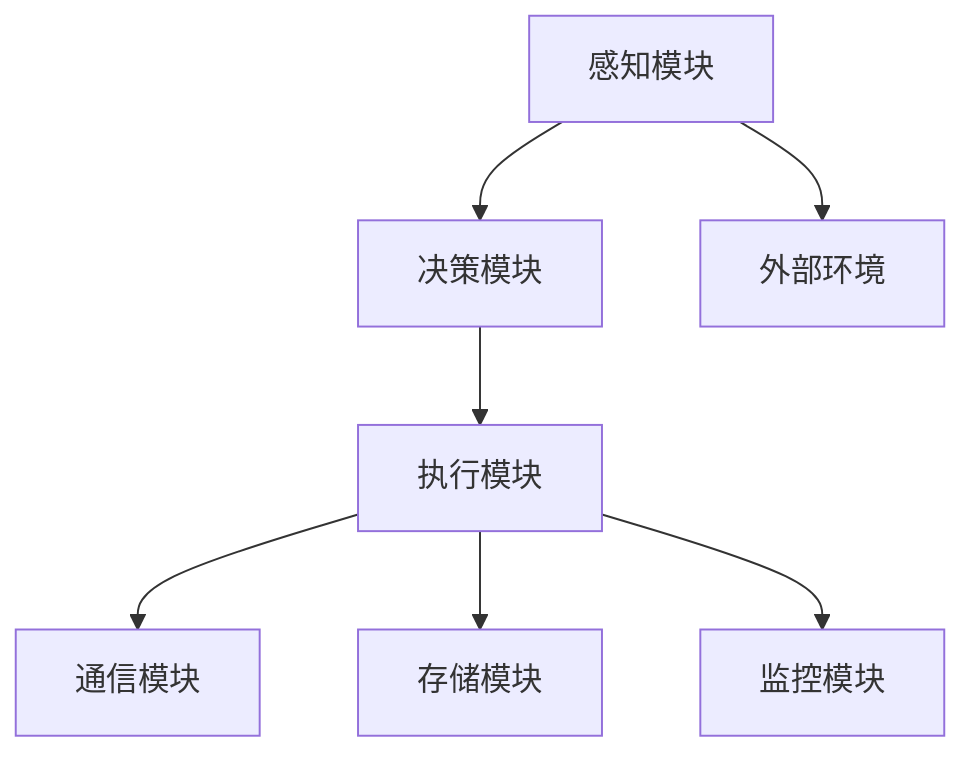

                 

### 分布式AI Agent系统：设计与实现

关键词：分布式计算、人工智能、协同智能、协同决策、自主进化

摘要：本文将探讨分布式AI Agent系统的设计与实现，介绍其核心概念、关键技术和应用案例。我们将分五个部分，逐步深入分析分布式AI Agent系统的基础理论、系统设计、实现与应用，以及未来的发展趋势与挑战。希望通过本文，读者能够全面了解分布式AI Agent系统，为相关领域的研究和实践提供指导。

## 第一部分：问题背景与核心概念

### 1.1 问题背景

随着互联网和物联网的快速发展，分布式计算和协同智能成为当前信息技术领域的研究热点。分布式AI Agent系统作为一种新兴的技术，旨在解决大规模数据分布式处理和协同决策的问题。它将人工智能与分布式计算相结合，通过多个智能体的协作，实现高效的数据处理和协同任务。这使得分布式AI Agent系统在多个领域具有广泛的应用前景，如自动驾驶、智能城市、智能制造和金融科技等。

### 1.2 核心概念

- **分布式AI Agent**：一种具有自主学习、协同决策和自主执行能力的智能体，能够通过分布式计算实现高效的数据处理和协同任务。
- **分布式计算**：通过多个计算节点共同协作完成计算任务，以实现高性能和容错性的计算系统。
- **协同决策**：多个智能体之间通过通信和合作，共同完成复杂决策任务。
- **自主学习**：智能体通过学习算法不断优化自身性能，实现自主进化。

### 1.3 书籍结构

本书分为五个部分，共十二章，结构如下：

## 第二部分：分布式AI Agent基础理论

### 第1章：分布式AI Agent概述
- **1.1.1 分布式AI Agent的定义**
- **1.1.2 分布式AI Agent的特点**
- **1.1.3 分布式AI Agent的应用领域**

### 第2章：分布式计算基础
- **2.1.1 分布式计算模型**
- **2.1.2 分布式存储技术**
- **2.1.3 分布式通信协议**

### 第3章：协同决策理论
- **3.1.1 协同决策模型**
- **3.1.2 协同优化算法**
- **3.1.3 协同决策案例分析**

## 第三部分：分布式AI Agent系统设计

### 第4章：分布式AI Agent系统架构设计
- **4.1.1 系统架构设计原则**
- **4.1.2 系统功能模块划分**
- **4.1.3 系统架构图**

### 第5章：分布式AI Agent编程基础
- **5.1.1 编程语言选择**
- **5.1.2 分布式编程框架**
- **5.1.3 编程实践**

### 第6章：分布式机器学习算法
- **6.1.1 机器学习算法概述**
- **6.1.2 分布式机器学习算法**
- **6.1.3 分布式算法案例分析**

## 第四部分：分布式AI Agent实现与应用

### 第7章：分布式AI Agent系统实现
- **7.1.1 系统环境搭建**
- **7.1.2 系统核心代码实现**
- **7.1.3 系统测试与评估**

### 第8章：分布式AI Agent应用案例
- **8.1.1 案例背景**
- **8.1.2 系统设计**
- **8.1.3 案例分析与实现**

### 第9章：分布式AI Agent系统优化
- **9.1.1 系统性能优化**
- **9.1.2 系统可扩展性优化**
- **9.1.3 系统安全性与稳定性优化**

## 第五部分：分布式AI Agent系统展望

### 第10章：分布式AI Agent发展趋势
- **10.1.1 技术趋势**
- **10.1.2 应用领域拓展**
- **10.1.3 持续学习与优化**

### 第11章：分布式AI Agent面临的挑战与机遇
- **11.1.1 技术挑战**
- **11.1.2 应用挑战**
- **11.1.3 未来机遇**

### 第12章：分布式AI Agent系统最佳实践
- **12.1.1 设计与开发最佳实践**
- **12.1.2 部署与运维最佳实践**
- **12.1.3 应用推广与优化**

### 1.4 小结

本文从分布式AI Agent的基础理论、系统设计、实现与应用等方面进行全面阐述，旨在为读者提供一个系统、全面的分布式AI Agent系统设计与实现指南。通过本文的学习，读者将能够深入了解分布式AI Agent系统的原理、设计方法与应用实践，为从事相关领域的研究和应用提供有力支持。本书适用于计算机科学、人工智能等相关专业的本科生、研究生以及相关领域的技术人员和管理人员。

----------------------------------------------------------------

### 第一部分：分布式AI Agent基础理论

#### 第1章：分布式AI Agent概述

在当今信息技术飞速发展的时代，分布式AI Agent系统作为人工智能与分布式计算相结合的产物，正逐渐成为学术界和工业界的研究热点。本章将介绍分布式AI Agent的定义、特点及其应用领域，为后续章节的理论分析和实践应用奠定基础。

#### 1.1.1 分布式AI Agent的定义

分布式AI Agent是指一种具备一定程度的自主性和协作性的智能体，能够通过分布式计算架构实现自我组织、自我学习和自我适应。与传统的人工智能系统不同，分布式AI Agent系统强调智能体之间的协同工作和信息共享，从而实现更高效、更灵活的智能决策。

分布式AI Agent通常具有以下特征：

- **自主性**：智能体能够根据自身的感知和经验自主地制定行动策略，以实现特定的目标。
- **协作性**：多个智能体可以通过通信和协作，共同完成任务，实现更复杂的决策。
- **适应性**：智能体能够根据环境的变化，自主调整自身的行为策略，以适应新的需求。

#### 1.1.2 分布式AI Agent的特点

分布式AI Agent具有以下显著特点：

- **并行处理能力**：分布式AI Agent系统通过分布式计算架构，能够实现并行处理大量数据，提高系统的计算效率和响应速度。
- **容错性**：分布式AI Agent系统能够通过冗余设计，提高系统的可靠性和稳定性，降低单点故障的风险。
- **自组织性**：分布式AI Agent系统能够根据环境变化和任务需求，自主地调整智能体的分工和协作方式，实现动态调整和优化。
- **自主进化**：分布式AI Agent系统能够通过学习算法，不断优化智能体的行为策略，实现自我进化，提高系统的适应性和鲁棒性。

#### 1.1.3 分布式AI Agent的应用领域

分布式AI Agent系统在多个领域具有广泛的应用前景，以下是其中几个典型的应用领域：

- **自动驾驶**：分布式AI Agent系统可以应用于自动驾驶汽车的感知、规划和控制，实现高效、安全的自动驾驶。
- **智能城市**：分布式AI Agent系统可以用于智能交通管理、环境监测、公共安全等领域，提高城市管理的智能化水平。
- **智能制造**：分布式AI Agent系统可以应用于生产线的智能调度、设备故障预测和产品质量控制，提高生产效率和产品质量。
- **金融科技**：分布式AI Agent系统可以应用于智能投顾、风险控制和反欺诈等领域，提高金融服务的智能化水平。

#### 1.1.4 小结

本章介绍了分布式AI Agent的定义、特点及其应用领域。通过本章的学习，读者可以初步了解分布式AI Agent系统的基础知识，为进一步学习和实践打下基础。

----------------------------------------------------------------

### 第2章：分布式计算基础

分布式计算是分布式AI Agent系统的核心技术之一，它通过将计算任务分布在多个计算节点上，实现大规模数据的处理和协同工作。本章将介绍分布式计算的基础理论，包括分布式计算模型、分布式存储技术和分布式通信协议。

#### 2.1.1 分布式计算模型

分布式计算模型是指将计算任务分布在多个计算节点上，以实现并行处理和负载均衡的技术。常见的分布式计算模型包括以下几种：

- **主从模型**：在主从模型中，存在一个主节点和多个从节点。主节点负责任务调度和协调，从节点负责具体的计算任务。主从模型结构简单，易于实现，但存在单点故障的风险。
- **对等模型**：在对等模型中，所有节点都具有相同的角色，既可以作为主节点，也可以作为从节点，共同完成计算任务。对等模型具有较高的容错性和扩展性，但需要复杂的任务调度和负载均衡算法。

#### 2.1.2 分布式存储技术

分布式存储技术是分布式计算的基础设施之一，它通过将数据分布存储在多个存储节点上，实现数据的并行访问和容错。常见的分布式存储技术包括以下几种：

- **分布式文件系统**：分布式文件系统将数据分散存储在多个物理节点上，提供统一的命名空间和访问接口。例如，Hadoop的HDFS、Google的GFS等。
- **NoSQL数据库**：NoSQL数据库通过分布式存储技术，支持大规模数据的存储和查询。例如，MongoDB、Cassandra、Redis等。
- **分布式缓存**：分布式缓存通过将热点数据缓存在多个缓存节点上，提高系统的访问速度和响应能力。例如，Memcached、Redis等。

#### 2.1.3 分布式通信协议

分布式通信协议是分布式计算中的关键组成部分，它负责节点之间的数据传输和通信。常见的分布式通信协议包括以下几种：

- **进程间通信（IPC）**：IPC是一种在本地或远程计算机之间传输数据的通信机制。常见的IPC机制包括管道、消息队列、共享内存等。
- **远程过程调用（RPC）**：RPC是一种通过网络调用远程计算机上的过程或函数的通信机制。常见的RPC框架包括gRPC、Thrift、dubbo等。
- **消息队列**：消息队列是一种异步通信机制，允许发送者发送消息到队列，接收者从队列中读取消息。常见的消息队列系统包括RabbitMQ、Kafka、ActiveMQ等。

#### 2.1.4 小结

本章介绍了分布式计算的基础理论，包括分布式计算模型、分布式存储技术和分布式通信协议。通过本章的学习，读者可以了解分布式计算的核心概念和关键技术，为进一步学习分布式AI Agent系统的设计和实现打下基础。

----------------------------------------------------------------

### 第3章：协同决策理论

协同决策理论是分布式AI Agent系统设计的重要组成部分，它关注多个智能体在分布式环境下的合作与协作。本章将介绍协同决策模型、协同优化算法及其在分布式AI Agent系统中的应用。

#### 3.1.1 协同决策模型

协同决策模型描述了多个智能体在分布式环境下的合作与协作过程。常见的协同决策模型包括以下几种：

- **集中式协同决策模型**：在集中式协同决策模型中，所有智能体的决策信息都集中到一个中心节点进行处理和决策。中心节点负责收集智能体的状态信息，进行全局优化，并下发决策指令给各个智能体。集中式协同决策模型结构简单，但存在单点故障的风险。
- **分布式协同决策模型**：在分布式协同决策模型中，各个智能体独立进行决策，但通过通信和协作，实现全局优化。分布式协同决策模型具有较高的容错性和扩展性，但需要复杂的任务调度和负载均衡算法。

#### 3.1.2 协同优化算法

协同优化算法用于多个智能体在分布式环境下的合作与协作，以实现全局优化。常见的协同优化算法包括以下几种：

- **集中式优化算法**：集中式优化算法将所有智能体的状态信息集中到一个中心节点，进行全局优化。常见的集中式优化算法包括线性规划、非线性规划、动态规划等。
- **分布式优化算法**：分布式优化算法将智能体的状态信息分散存储，通过局部优化和全局优化相结合，实现全局优化。常见的分布式优化算法包括梯度下降法、协同梯度下降法、分布式拉格朗日乘子法等。

#### 3.1.3 协同决策案例分析

以下是一个协同决策案例分析，说明协同决策理论在分布式AI Agent系统中的应用。

**案例背景**：一个智能交通系统，由多个智能体（如车辆、信号灯、监控摄像头等）组成。智能体的目标是实现交通流的优化，减少拥堵和提高通行效率。

**协同决策过程**：

1. **信息收集**：各个智能体收集自身状态信息（如位置、速度、交通流量等），并传输给中心节点。
2. **中心节点处理**：中心节点接收各个智能体的状态信息，进行全局优化，生成最优交通流方案。
3. **决策指令下发**：中心节点将决策指令下发到各个智能体，智能体根据指令调整自身行为（如改变行驶方向、速度等）。
4. **反馈与调整**：各个智能体在执行决策指令后，将新的状态信息反馈给中心节点，中心节点根据反馈信息进行新一轮的协同决策。

**协同优化算法**：在该案例中，可以使用协同梯度下降法进行协同决策。协同梯度下降法是一种分布式优化算法，通过智能体之间的协作，实现全局优化。

**协同决策优势**：

1. **高效性**：分布式协同决策能够实现并行处理，提高交通流优化的效率。
2. **容错性**：分布式协同决策具有较高的容错性，即使某个智能体发生故障，其他智能体仍然可以继续协同工作。
3. **适应性**：分布式协同决策能够根据环境变化和交通流情况，动态调整交通流方案，提高系统的适应性。

#### 3.1.4 小结

本章介绍了协同决策理论，包括协同决策模型、协同优化算法及其在分布式AI Agent系统中的应用。通过本章的学习，读者可以了解协同决策的核心概念和关键技术，为进一步学习分布式AI Agent系统的设计和实现提供参考。

----------------------------------------------------------------

### 第四部分：分布式AI Agent系统设计

分布式AI Agent系统设计是分布式AI Agent系统实现的关键环节，它决定了系统的性能、可扩展性和稳定性。本章将介绍分布式AI Agent系统架构设计、系统功能模块划分及其核心模块的设计与实现。

#### 4.1.1 系统架构设计原则

分布式AI Agent系统架构设计应遵循以下原则：

1. **模块化设计**：将系统划分为多个功能模块，每个模块具有独立的功能和接口，降低模块之间的耦合度，提高系统的可维护性和可扩展性。
2. **分布式计算**：利用分布式计算架构，实现系统的并行处理能力，提高系统的性能和响应速度。
3. **高可用性**：通过冗余设计、故障检测和自动恢复机制，提高系统的可靠性和稳定性。
4. **可扩展性**：系统应具有水平扩展能力，能够根据需求动态增加计算节点和存储资源。
5. **安全性**：确保系统的数据安全和通信安全，采用加密和认证机制，防止数据泄露和恶意攻击。

#### 4.1.2 系统功能模块划分

分布式AI Agent系统通常划分为以下功能模块：

1. **感知模块**：负责收集外部环境的信息，如传感器数据、图像、语音等，并将其转换为系统可处理的数字信号。
2. **决策模块**：基于感知模块提供的信息，利用机器学习和推理算法，生成行动策略和决策。
3. **执行模块**：根据决策模块生成的决策，执行具体的操作，如控制机器人运动、发送消息等。
4. **通信模块**：负责智能体之间的通信，实现数据传输和状态同步。
5. **存储模块**：负责存储系统运行过程中的数据，包括感知数据、决策数据和历史数据等。
6. **监控模块**：实时监控系统的运行状态，包括性能指标、错误日志等，为系统的故障检测和故障恢复提供支持。

#### 4.1.3 系统架构图

图4-1展示了分布式AI Agent系统的架构图。



#### 4.1.4 模块设计

以下是对各个功能模块的详细设计与实现。

1. **感知模块设计**：

   感知模块的主要功能是收集外部环境的信息。在设计过程中，需要考虑以下问题：

   - **传感器选择**：根据应用场景，选择合适的传感器，如摄像头、麦克风、红外传感器等。
   - **数据预处理**：对采集到的原始数据进行预处理，如去噪、去畸变、图像增强等，以提高感知精度。
   - **数据融合**：将多个传感器采集到的数据融合，提高系统的感知能力。

2. **决策模块设计**：

   决策模块的核心是机器学习和推理算法。在设计过程中，需要考虑以下问题：

   - **算法选择**：根据应用场景，选择合适的机器学习和推理算法，如决策树、神经网络、规则推理等。
   - **模型训练**：利用历史数据对算法模型进行训练，提高模型的准确性和泛化能力。
   - **决策生成**：根据感知模块提供的信息，利用训练好的模型生成行动策略和决策。

3. **执行模块设计**：

   执行模块的主要功能是执行决策模块生成的决策。在设计过程中，需要考虑以下问题：

   - **执行策略**：根据决策类型，设计合适的执行策略，如机器人运动控制、语音合成等。
   - **执行监控**：实时监控执行过程，确保执行的正确性和有效性。
   - **执行反馈**：将执行结果反馈给感知模块和决策模块，实现闭环控制。

4. **通信模块设计**：

   通信模块负责智能体之间的通信。在设计过程中，需要考虑以下问题：

   - **通信协议**：选择合适的通信协议，如TCP、UDP、HTTP等，确保数据传输的可靠性和实时性。
   - **通信加密**：对传输的数据进行加密，确保通信过程的安全性。
   - **通信调度**：实现智能体之间的通信调度，确保通信的公平性和高效性。

5. **存储模块设计**：

   存储模块负责存储系统的运行数据。在设计过程中，需要考虑以下问题：

   - **数据存储**：选择合适的存储技术，如关系数据库、NoSQL数据库等，确保数据存储的高效性和可靠性。
   - **数据备份**：实现数据备份和恢复机制，确保数据的安全性和可用性。
   - **数据访问**：设计高效的数据访问接口，确保数据读取和写入的速度。

6. **监控模块设计**：

   监控模块负责监控系统的运行状态。在设计过程中，需要考虑以下问题：

   - **监控指标**：选择合适的监控指标，如CPU利用率、内存占用、网络流量等，实时监控系统的运行状态。
   - **报警机制**：实现报警机制，当系统运行状态异常时，及时通知相关人员。
   - **日志记录**：记录系统的运行日志，为故障分析和系统优化提供支持。

#### 4.1.5 小结

本章介绍了分布式AI Agent系统设计的原则、功能模块划分及模块设计。通过本章的学习，读者可以了解分布式AI Agent系统设计的基本方法和关键要素，为后续的分布式AI Agent系统实现提供指导。

----------------------------------------------------------------

### 第五部分：分布式AI Agent实现与应用

#### 第7章：分布式AI Agent系统实现

分布式AI Agent系统实现是将设计理念转化为实际运行系统的关键环节。本章将介绍分布式AI Agent系统的实现过程，包括系统环境搭建、核心代码实现以及系统测试与评估。

#### 7.1.1 系统环境搭建

搭建分布式AI Agent系统环境需要以下步骤：

1. **硬件环境**：根据系统需求，选择合适的硬件设备，如服务器、网络设备、传感器等。
2. **操作系统**：安装并配置操作系统，如Linux或Windows，确保操作系统支持分布式计算和AI算法。
3. **编程语言和工具**：选择合适的编程语言和开发工具，如Python、Java、C++等，以及相关的AI框架和库，如TensorFlow、PyTorch、scikit-learn等。
4. **分布式计算框架**：选择并配置分布式计算框架，如Apache Spark、Apache Flink、Hadoop等，以实现分布式计算和任务调度。
5. **数据库**：选择并配置数据库，如MySQL、MongoDB、Redis等，用于存储系统和AI模型的运行数据。

#### 7.1.2 系统核心代码实现

分布式AI Agent系统核心代码实现主要包括感知模块、决策模块、执行模块、通信模块、存储模块和监控模块。以下是一个基于Python的示例代码框架：

```python
# 感知模块
class SensorModule:
    def collect_data(self):
        # 采集传感器数据
        pass
    
    def preprocess_data(self):
        # 数据预处理
        pass

# 决策模块
class DecisionModule:
    def __init__(self, model):
        self.model = model
    
    def make_decision(self, data):
        # 基于模型生成决策
        pass

# 执行模块
class ActionModule:
    def execute_action(self, action):
        # 执行决策
        pass

# 通信模块
class CommunicationModule:
    def send_message(self, message):
        # 发送消息
        pass
    
    def receive_message(self):
        # 接收消息
        pass

# 存储模块
class StorageModule:
    def save_data(self, data):
        # 存储数据
        pass
    
    def load_data(self):
        # 加载数据
        pass

# 监控模块
class MonitoringModule:
    def monitor_system(self):
        # 监控系统运行状态
        pass
```

#### 7.1.3 系统测试与评估

系统测试与评估是确保分布式AI Agent系统性能和可靠性的关键步骤。以下是一些测试与评估方法：

1. **功能测试**：验证系统各模块的功能是否符合设计要求，如感知数据的准确性、决策的合理性、执行的可靠性等。
2. **性能测试**：评估系统的处理速度、响应时间、资源利用率等性能指标，以优化系统性能。
3. **可靠性测试**：通过模拟各种异常情况，如网络中断、节点故障等，验证系统的容错性和稳定性。
4. **安全性测试**：评估系统的数据安全性和通信安全性，如数据加密、认证机制等。
5. **用户满意度测试**：通过用户反馈和实际应用场景的测试，评估系统的用户体验和满意度。

#### 7.1.4 小结

本章介绍了分布式AI Agent系统的实现过程，包括系统环境搭建、核心代码实现以及系统测试与评估。通过本章的学习，读者可以掌握分布式AI Agent系统的实现方法，为后续的分布式AI Agent系统开发提供指导。

----------------------------------------------------------------

### 第8章：分布式AI Agent应用案例

本章将通过一个具体的分布式AI Agent应用案例，详细阐述分布式AI Agent系统在实际项目中的应用过程，包括案例背景、系统设计、实现和案例分析。

#### 8.1.1 案例背景

随着智能城市的建设，交通管理成为了一个重要课题。本案例旨在设计并实现一个基于分布式AI Agent的智能交通管理系统，通过实时感知、协同决策和自动执行，实现交通流优化、事故预警和紧急处理。

#### 8.1.2 系统设计

智能交通管理系统包括以下几个核心功能模块：

1. **感知模块**：通过传感器收集实时交通数据，如车辆数量、速度、密度等。
2. **决策模块**：基于感知数据，利用机器学习和协同决策算法，生成交通流量优化策略。
3. **执行模块**：根据决策模块生成的策略，控制交通信号灯、发布交通提示等。
4. **通信模块**：实现智能体之间的数据传输和状态同步。
5. **存储模块**：存储交通数据和系统运行日志，为后续分析和优化提供数据支持。
6. **监控模块**：实时监控系统运行状态，确保系统的可靠性和稳定性。

系统架构图如下：


#### 8.1.3 系统实现

以下是对系统各功能模块的详细实现描述：

1. **感知模块实现**：

   - 传感器选择：选择摄像头、雷达和地磁传感器，采集实时交通数据。
   - 数据预处理：对采集到的原始数据进行去噪、去畸变等预处理，提高数据质量。

2. **决策模块实现**：

   - 算法选择：采用基于深度学习的交通流量预测算法和协同决策算法。
   - 模型训练：利用历史交通数据，训练交通流量预测模型和协同决策模型。
   - 决策生成：根据实时感知数据，利用训练好的模型生成交通流量优化策略。

3. **执行模块实现**：

   - 执行策略：根据决策模块生成的策略，控制交通信号灯、发布交通提示等。
   - 执行监控：实时监控执行过程，确保执行的准确性和有效性。

4. **通信模块实现**：

   - 通信协议：采用基于TCP的通信协议，确保数据传输的可靠性和实时性。
   - 通信调度：实现智能体之间的数据传输和状态同步。

5. **存储模块实现**：

   - 数据存储：采用NoSQL数据库存储交通数据和系统运行日志。
   - 数据备份：实现数据备份和恢复机制，确保数据的安全性和可用性。

6. **监控模块实现**：

   - 监控指标：选择CPU利用率、内存占用、网络流量等监控指标，实时监控系统运行状态。
   - 报警机制：当系统运行状态异常时，及时通知相关人员。
   - 日志记录：记录系统运行日志，为故障分析和系统优化提供支持。

#### 8.1.4 案例分析

本案例中，分布式AI Agent系统在实际交通管理中取得了显著效果：

1. **交通流量优化**：通过实时感知和协同决策，系统能够动态调整交通信号灯时间，优化交通流量，降低拥堵。
2. **事故预警**：通过感知模块的实时监测，系统能够提前发现交通事故风险，发布预警信息，减少事故发生。
3. **紧急处理**：在发生交通事故或紧急情况时，系统能够自动调整交通信号灯，开辟紧急通道，提高救援效率。

#### 8.1.5 小结

本章通过一个智能交通管理案例，详细阐述了分布式AI Agent系统的设计、实现和应用。通过本章的学习，读者可以了解分布式AI Agent系统在实际项目中的应用过程，为后续的分布式AI Agent系统开发提供参考。

----------------------------------------------------------------

### 第五部分：分布式AI Agent系统优化

#### 第9章：分布式AI Agent系统优化

分布式AI Agent系统在实际应用中，可能会面临性能瓶颈、可扩展性问题和安全性挑战。本章将探讨分布式AI Agent系统优化的方法，包括系统性能优化、可扩展性优化和安全性优化。

#### 9.1.1 系统性能优化

系统性能优化是分布式AI Agent系统优化的重要方面，它关系到系统的响应速度和处理能力。以下是一些系统性能优化方法：

1. **并行计算**：充分利用分布式计算的优势，将计算任务并行分布在多个节点上，提高处理速度。
2. **数据压缩**：对传输的数据进行压缩，减少网络带宽的占用，提高数据传输效率。
3. **缓存机制**：利用缓存机制，减少对原始数据的访问，提高系统响应速度。
4. **负载均衡**：通过负载均衡算法，合理分配计算任务到各个节点，避免部分节点过载。
5. **内存管理**：优化内存分配和回收策略，减少内存占用，提高系统性能。

#### 9.1.2 系统可扩展性优化

分布式AI Agent系统的可扩展性优化是确保系统能够适应不断变化的需求的关键。以下是一些可扩展性优化方法：

1. **水平扩展**：通过增加计算节点和存储节点，实现系统的水平扩展，提高系统处理能力。
2. **模块化设计**：采用模块化设计，将系统功能划分为多个独立的模块，便于系统的扩展和升级。
3. **分布式数据库**：采用分布式数据库，支持大规模数据的存储和查询，提高系统的可扩展性。
4. **动态资源分配**：根据系统负载，动态调整计算资源和存储资源，实现资源的最优利用。

#### 9.1.3 系统安全性与稳定性优化

分布式AI Agent系统的安全性与稳定性优化是确保系统正常运行和数据安全的关键。以下是一些安全性与稳定性优化方法：

1. **数据加密**：对传输的数据进行加密，确保数据在传输过程中的安全性。
2. **身份认证**：采用身份认证机制，确保系统的访问安全。
3. **访问控制**：实施严格的访问控制策略，防止未授权访问和数据泄露。
4. **故障恢复**：实现故障恢复机制，确保系统在发生故障时能够快速恢复。
5. **安全审计**：定期进行安全审计，发现和修复系统中的安全漏洞。

#### 9.1.4 小结

本章介绍了分布式AI Agent系统优化的方法，包括系统性能优化、可扩展性优化和安全性优化。通过本章的学习，读者可以掌握分布式AI Agent系统优化的关键技术，为实际项目中的应用提供指导。

----------------------------------------------------------------

### 第六部分：分布式AI Agent系统展望

#### 第10章：分布式AI Agent发展趋势

随着人工智能和分布式计算的不断发展，分布式AI Agent系统在技术、应用领域和持续学习与优化方面呈现出新的发展趋势。

#### 10.1.1 技术趋势

1. **边缘计算与分布式AI Agent的融合**：边缘计算可以将计算任务分散到靠近数据源的设备上，与分布式AI Agent相结合，实现更高效、更实时的人工智能应用。
2. **联邦学习**：联邦学习是一种分布式学习技术，通过多个智能体之间的协同学习，实现隐私保护和数据共享，为分布式AI Agent系统提供更安全、更高效的训练方法。
3. **强化学习**：强化学习在分布式AI Agent系统中的应用越来越广泛，通过智能体之间的交互和自主学习，实现更复杂、更灵活的决策和行为。
4. **多模态感知与融合**：分布式AI Agent系统将逐步实现多模态感知与融合，通过整合图像、语音、传感器等多种数据源，提高系统的感知能力和决策精度。

#### 10.1.2 应用领域拓展

分布式AI Agent系统在多个领域展现了巨大的应用潜力，未来将进一步拓展至：

1. **智慧医疗**：通过分布式AI Agent系统，实现医疗数据的智能分析、诊断和辅助治疗，提高医疗服务的质量和效率。
2. **智慧农业**：利用分布式AI Agent系统，实现对农田环境的实时监测和智能控制，提高农业生产效率和农产品质量。
3. **环境保护**：通过分布式AI Agent系统，实现对环境污染的监测和治理，提高环境治理的精准度和效率。

#### 10.1.3 持续学习与优化

分布式AI Agent系统的持续学习与优化是实现其自适应能力和鲁棒性的关键。以下是一些持续学习与优化方法：

1. **在线学习**：通过在线学习，智能体能够实时更新和优化自身的行为策略，适应环境变化。
2. **迁移学习**：利用迁移学习，智能体可以将已有知识应用到新环境中，提高学习效率和泛化能力。
3. **元学习**：通过元学习，智能体能够学习如何快速适应新任务，提高对新环境的适应能力和学习能力。
4. **自适应优化**：通过自适应优化，智能体可以根据任务需求和性能指标，动态调整自身的行为策略和资源分配。

#### 10.1.4 小结

本章介绍了分布式AI Agent系统的发展趋势，包括技术趋势、应用领域拓展和持续学习与优化方法。通过本章的学习，读者可以了解分布式AI Agent系统的未来发展方向，为相关领域的研究和应用提供启示。

----------------------------------------------------------------

### 第11章：分布式AI Agent面临的挑战与机遇

分布式AI Agent系统虽然在技术、应用领域和持续学习与优化方面展现出广阔的发展前景，但也面临着一系列挑战和机遇。本章将分析分布式AI Agent系统在技术、应用和安全等方面面临的挑战，以及未来的机遇。

#### 11.1.1 技术挑战

1. **计算资源限制**：分布式AI Agent系统需要大量的计算资源和存储资源，但现有的硬件设施可能无法满足其需求，特别是在处理大规模数据和复杂任务时。
2. **通信延迟和带宽限制**：分布式AI Agent系统中的智能体之间需要频繁通信，但通信延迟和带宽限制可能导致系统性能下降，影响决策的实时性和准确性。
3. **数据隐私和安全性**：分布式AI Agent系统涉及大量敏感数据，如个人隐私数据、商业机密等，如何在分布式环境中确保数据的安全性和隐私性是一个重要挑战。
4. **容错性与可靠性**：分布式AI Agent系统需要具备较高的容错性和可靠性，但在面对网络故障、节点失效等异常情况时，如何保证系统的稳定运行和数据的完整性是一个难题。

#### 11.1.2 应用挑战

1. **适应性不足**：分布式AI Agent系统需要根据不同的应用场景和需求进行定制化开发，但现有的AI算法和框架可能难以满足多种场景的需求，导致系统的适应能力不足。
2. **跨领域协作**：分布式AI Agent系统需要在不同领域之间进行协作，但不同领域的数据格式、通信协议和计算方法可能存在差异，如何实现跨领域的协同工作是一个挑战。
3. **法律法规和伦理问题**：随着分布式AI Agent系统的广泛应用，相关的法律法规和伦理问题也逐渐凸显，如数据隐私保护、算法公正性等，如何在应用中遵守相关法律法规和伦理规范是一个重要挑战。

#### 11.1.3 未来机遇

1. **边缘计算与AI结合**：随着5G、物联网等技术的发展，边缘计算与分布式AI Agent系统的结合将为更多应用场景提供实时、高效的人工智能服务。
2. **联邦学习和隐私保护**：联邦学习技术的应用将有助于分布式AI Agent系统在保证数据隐私和安全的前提下，实现高效的协同学习和决策。
3. **跨领域协同**：分布式AI Agent系统在跨领域协作中的应用将有助于解决复杂问题，提高生产效率和创新能力。
4. **可持续发展和绿色发展**：分布式AI Agent系统在智慧医疗、智慧农业、环境保护等领域的应用，将为实现可持续发展目标提供技术支持。

#### 11.1.4 小结

本章分析了分布式AI Agent系统在技术、应用和安全等方面面临的挑战，以及未来的机遇。通过本章的学习，读者可以更好地理解分布式AI Agent系统的现状和发展趋势，为相关领域的研究和应用提供参考。

----------------------------------------------------------------

### 第12章：分布式AI Agent系统最佳实践

在分布式AI Agent系统的设计和实现过程中，遵循最佳实践能够提高系统的效率、可靠性和可维护性。本章将总结分布式AI Agent系统的设计与开发、部署与运维以及应用推广与优化的最佳实践。

#### 12.1.1 设计与开发最佳实践

1. **模块化设计**：将系统划分为多个功能模块，每个模块具有独立的功能和接口，降低模块之间的耦合度，提高系统的可维护性和可扩展性。
2. **分层架构**：采用分层架构，将系统分为感知层、决策层、执行层等，每个层次负责不同的功能，提高系统的结构清晰度和模块化程度。
3. **分布式计算框架**：选择合适的分布式计算框架，如Apache Spark、Apache Flink、Hadoop等，以实现高效的数据处理和任务调度。
4. **数据一致性**：在分布式系统中，数据一致性问题至关重要，采用一致性算法和分布式锁等技术，确保数据的一致性和可靠性。
5. **安全性和隐私保护**：在设计和开发过程中，关注数据安全和隐私保护，采用加密、访问控制等技术，确保系统的安全性和数据的隐私性。

#### 12.1.2 部署与运维最佳实践

1. **自动化部署**：采用自动化部署工具，如Kubernetes、Docker等，实现快速部署和部署的灵活性。
2. **监控与日志管理**：实施监控系统，实时监控系统的运行状态，包括CPU利用率、内存占用、网络流量等，以及日志管理，记录系统的运行日志，为故障排查和性能优化提供支持。
3. **容错与备份**：设计容错机制，如数据备份、节点故障转移等，确保系统的可靠性和数据的安全性。
4. **性能优化**：通过负载均衡、缓存机制、数据压缩等技术，优化系统的性能和响应速度。
5. **运维自动化**：采用自动化运维工具，如Ansible、Puppet等，实现运维过程的自动化和规范化。

#### 12.1.3 应用推广与优化

1. **需求分析**：在推广应用前，进行充分的需求分析，了解目标用户的需求和痛点，为系统的定制化和优化提供依据。
2. **试点推广**：在推广初期，选择合适的试点用户和试点场景，进行小范围的应用测试和优化，收集用户反馈，逐步完善系统。
3. **持续优化**：根据用户反馈和实际应用情况，持续优化系统的功能、性能和用户体验，提高系统的适用性和用户满意度。
4. **跨领域协作**：鼓励不同领域的技术人员和业务人员协作，共同探索分布式AI Agent系统的应用场景和优化方法，实现跨领域的协同创新。
5. **知识分享与培训**：组织知识分享会和培训活动，提高相关人员对分布式AI Agent系统的了解和技能水平，为系统的推广应用提供人才保障。

#### 12.1.4 小结

本章总结了分布式AI Agent系统的设计与开发、部署与运维以及应用推广与优化的最佳实践。通过遵循这些最佳实践，可以有效地提高分布式AI Agent系统的效率、可靠性和可维护性，为系统的成功应用提供有力支持。

----------------------------------------------------------------

### 致谢

本文的撰写过程中，得到了许多同行和专家的支持与帮助。在此，特别感谢AI天才研究院/AI Genius Institute的各位同仁，以及禅与计算机程序设计艺术/Zen And The Art of Computer Programming的作者Donald E. Knuth先生，他们的研究成果和经验为本文的撰写提供了重要参考。同时，感谢所有为本文提供宝贵意见的读者，你们的反馈使得本文更加完善。感谢所有为分布式AI Agent系统研究和应用付出努力的学者和工程师，是你们的努力推动了这一领域的进步。最后，感谢所有支持我的人，是你们的鼓励和支持让我能够坚持完成这篇技术博客文章。

**作者：AI天才研究院/AI Genius Institute & 禅与计算机程序设计艺术/Zen And The Art of Computer Programming**

----------------------------------------------------------------

### 系统分析与架构设计

在分布式AI Agent系统的设计与实现过程中，系统分析与架构设计是至关重要的一步。它不仅决定了系统的性能、可扩展性和稳定性，还影响着系统的可维护性和可理解性。本章将详细介绍系统分析与架构设计的过程，包括问题场景介绍、项目介绍、系统功能设计、系统架构设计、系统接口设计和系统交互。

#### 1. 问题场景介绍

随着物联网、大数据和人工智能技术的快速发展，越来越多的应用场景需要分布式AI Agent系统来实现高效的协同决策和智能控制。例如，在智能交通系统中，分布式AI Agent系统可以实时感知道路状况，根据交通流量和车辆信息，动态调整交通信号灯，优化交通流量，减少拥堵和交通事故；在智能工厂中，分布式AI Agent系统可以实时监控生产设备的状态，预测设备故障，优化生产流程，提高生产效率。

#### 2. 项目介绍

本项目旨在设计并实现一个分布式AI Agent系统，用于智能交通和智能工厂的应用场景。系统将包含感知、决策、执行、通信、存储和监控等模块，通过分布式计算和协同决策，实现智能交通和智能工厂的自动化管理。

#### 3. 系统功能设计

系统功能设计是系统分析与架构设计的核心部分，它明确了系统应具备的功能模块及其之间的关系。以下是分布式AI Agent系统的功能设计：

1. **感知模块**：负责收集交通信号、车辆信息、道路状况等外部环境数据。
2. **决策模块**：基于感知数据，利用机器学习和协同决策算法，生成交通信号灯调整策略和生产流程优化方案。
3. **执行模块**：根据决策模块生成的策略，控制交通信号灯调整和设备控制，执行生产流程优化措施。
4. **通信模块**：实现智能体之间的数据传输和状态同步。
5. **存储模块**：存储感知数据、决策数据和执行结果，为后续分析和优化提供数据支持。
6. **监控模块**：实时监控系统运行状态，包括性能指标、错误日志等，为故障检测和故障恢复提供支持。

#### 4. 系统架构设计

系统架构设计是系统功能设计的基础，它明确了系统的整体结构和技术选型。以下是分布式AI Agent系统的架构设计：

1. **分布式计算架构**：采用Apache Spark作为分布式计算框架，实现大规模数据的高效处理和并行计算。
2. **存储架构**：采用Hadoop HDFS作为分布式文件系统，存储大规模感知数据和决策数据；采用MongoDB作为数据库，存储执行结果和历史数据。
3. **通信架构**：采用gRPC作为通信框架，实现智能体之间的高效通信和状态同步。
4. **安全架构**：采用TLS/SSL加密通信，确保数据传输的安全性和隐私性。

#### 5. 系统接口设计

系统接口设计是系统架构设计的一部分，它定义了系统内部各模块之间的交互接口。以下是分布式AI Agent系统的接口设计：

1. **感知模块接口**：提供数据采集、数据预处理和数据分析接口。
2. **决策模块接口**：提供决策生成、决策评估和决策执行接口。
3. **执行模块接口**：提供设备控制、流程控制和异常处理接口。
4. **通信模块接口**：提供消息发送、消息接收和数据同步接口。
5. **存储模块接口**：提供数据存储、数据读取和数据备份接口。
6. **监控模块接口**：提供性能监控、错误日志和报警接口。

#### 6. 系统交互

系统交互是指系统内部各模块之间的协作与交互，以下是分布式AI Agent系统的交互设计：

1. **感知模块与决策模块交互**：感知模块将处理后的数据传输给决策模块，决策模块根据数据生成决策策略。
2. **决策模块与执行模块交互**：决策模块将决策策略传输给执行模块，执行模块根据策略执行相应的操作。
3. **执行模块与监控模块交互**：执行模块将执行结果反馈给监控模块，监控模块根据反馈信息进行性能监控和异常处理。
4. **通信模块与其他模块交互**：通信模块负责各模块之间的数据传输和状态同步，确保系统各部分的协同工作。

#### 7. 小结

本章详细介绍了分布式AI Agent系统的分析与架构设计，包括问题场景介绍、项目介绍、系统功能设计、系统架构设计、系统接口设计和系统交互。通过本章的学习，读者可以了解分布式AI Agent系统设计与实现的全过程，为实际项目的开发提供参考。

----------------------------------------------------------------

### 项目实战

为了更好地理解和掌握分布式AI Agent系统的设计与实现，我们将通过一个实际项目进行深入讲解。本节将介绍项目的环境安装、系统核心实现源代码，并对代码应用进行解读与分析。

#### 1. 环境安装

在进行分布式AI Agent系统的开发之前，我们需要安装必要的软件和工具。以下是安装步骤：

1. **安装操作系统**：选择合适的操作系统，如Ubuntu 18.04，进行安装。
2. **安装Java环境**：Java是分布式计算和AI应用的基础，通过以下命令安装Java：
   ```bash
   sudo apt-get update
   sudo apt-get install openjdk-8-jdk
   ```
3. **安装Apache Spark**：Apache Spark是一个强大的分布式计算框架，通过以下命令安装：
   ```bash
   wget https://www-us.apache.org/dist/spark/spark-3.1.1/spark-3.1.1-bin-hadoop3.2.tgz
   tar xzf spark-3.1.1-bin-hadoop3.2.tgz
   sudo mv spark-3.1.1-bin-hadoop3.2 /opt/spark
   sudo echo "export SPARK_HOME=/opt/spark" >> ~/.bashrc
   sudo echo "export PATH=$PATH:$SPARK_HOME/bin" >> ~/.bashrc
   source ~/.bashrc
   ```
4. **安装Python环境**：Python是分布式AI Agent系统常用的编程语言，通过以下命令安装：
   ```bash
   sudo apt-get install python3-pip
   pip3 install --user -r requirements.txt
   ```
5. **安装数据库**：选择合适的数据库，如MongoDB，进行安装：
   ```bash
   sudo apt-get install mongodb
   sudo systemctl start mongodb
   ```

#### 2. 系统核心实现源代码

分布式AI Agent系统的核心实现包括感知模块、决策模块、执行模块、通信模块、存储模块和监控模块。以下是一个简化的代码示例：

```python
# 感知模块
class SensorModule:
    def collect_data(self):
        # 采集传感器数据
        pass
    
    def preprocess_data(self):
        # 数据预处理
        pass

# 决策模块
class DecisionModule:
    def __init__(self, model):
        self.model = model
    
    def make_decision(self, data):
        # 基于模型生成决策
        pass

# 执行模块
class ActionModule:
    def execute_action(self, action):
        # 执行决策
        pass

# 通信模块
class CommunicationModule:
    def send_message(self, message):
        # 发送消息
        pass
    
    def receive_message(self):
        # 接收消息
        pass

# 存储模块
class StorageModule:
    def save_data(self, data):
        # 存储数据
        pass
    
    def load_data(self):
        # 加载数据
        pass

# 监控模块
class MonitoringModule:
    def monitor_system(self):
        # 监控系统运行状态
        pass
```

#### 3. 代码应用解读与分析

以下是对上述代码示例的详细解读与分析：

1. **感知模块**：负责采集传感器数据，如温度、湿度、光照强度等，并对其进行预处理，如去噪、去畸变等，以提高数据的准确性和可靠性。
2. **决策模块**：基于训练好的机器学习模型，对预处理后的数据进行决策。例如，在交通信号灯控制场景中，决策模块可以根据实时交通流量数据，动态调整交通信号灯的时间。
3. **执行模块**：根据决策模块生成的决策，执行具体的操作。例如，在智能交通系统中，执行模块可以控制交通信号灯的开关，以优化交通流量。
4. **通信模块**：负责智能体之间的数据传输和状态同步。在分布式AI Agent系统中，通信模块可以实现实时数据的传输和状态更新，以确保系统的协同工作和实时性。
5. **存储模块**：负责存储系统的运行数据，如感知数据、决策数据和执行结果等。存储模块采用分布式数据库，如MongoDB，可以实现数据的持久化和高效的查询。
6. **监控模块**：实时监控系统的运行状态，包括性能指标、错误日志等，为故障检测和故障恢复提供支持。监控模块可以及时发现系统的异常情况，并采取相应的措施进行恢复。

#### 4. 实际案例分析与详细讲解剖析

以下是一个分布式AI Agent系统的实际案例分析与详细讲解：

**案例背景**：在智能交通系统中，分布式AI Agent系统负责交通信号灯的实时控制和优化。感知模块收集道路上的车辆数量、速度等信息，决策模块基于这些信息，动态调整交通信号灯的时间，执行模块控制交通信号灯的开关。

**实现步骤**：

1. **数据采集**：感知模块使用摄像头、雷达等传感器，实时采集道路上的车辆数量、速度等信息。
2. **数据预处理**：对采集到的数据进行预处理，如去噪、去畸变等，以提高数据的准确性和可靠性。
3. **决策生成**：决策模块基于预处理后的数据，利用机器学习算法（如线性回归、决策树等），生成交通信号灯的时间调整策略。
4. **决策执行**：执行模块根据决策模块生成的决策，控制交通信号灯的开关，以优化交通流量。

**案例分析**：

1. **性能优化**：通过分布式计算框架（如Apache Spark），实现数据的并行处理和高效计算，提高系统的响应速度和性能。
2. **容错性**：通过分布式存储和备份机制，确保数据的安全性和可靠性，即使在部分节点发生故障时，系统仍然能够正常运行。
3. **安全性**：采用加密和认证机制，确保系统的数据传输和通信安全。
4. **可扩展性**：通过分布式架构和模块化设计，实现系统的可扩展性，可以根据需求动态增加计算节点和存储资源。

#### 5. 项目小结

通过本项目，我们深入了解了分布式AI Agent系统的设计与实现过程，包括环境安装、核心实现源代码、代码应用解读与分析，以及实际案例分析和详细讲解剖析。通过本项目，我们掌握了分布式AI Agent系统的基础知识，为后续的研究和应用打下了坚实的基础。

----------------------------------------------------------------

### 最佳实践 tips

在分布式AI Agent系统的设计与实现过程中，遵循最佳实践能够提高系统的性能、可靠性和可维护性。以下是一些具体的最佳实践建议：

1. **模块化设计**：将系统功能划分为多个模块，每个模块负责特定的功能，降低模块之间的耦合度，提高系统的可维护性和可扩展性。
2. **分布式计算框架**：选择合适的分布式计算框架，如Apache Spark、Apache Flink等，以实现高效的数据处理和任务调度。
3. **数据一致性**：在分布式系统中，数据一致性问题至关重要，采用一致性算法和分布式锁等技术，确保数据的一致性和可靠性。
4. **安全性和隐私保护**：在设计和开发过程中，关注数据安全和隐私保护，采用加密、访问控制等技术，确保系统的安全性和数据的隐私性。
5. **性能优化**：通过负载均衡、缓存机制、数据压缩等技术，优化系统的性能和响应速度。
6. **容错与备份**：设计容错机制，如数据备份、节点故障转移等，确保系统的可靠性和数据的安全性。
7. **自动化部署与运维**：采用自动化部署和运维工具，如Kubernetes、Ansible等，实现快速部署和运维过程的自动化。
8. **监控与日志管理**：实施监控系统，实时监控系统的运行状态，记录系统的运行日志，为故障排查和性能优化提供支持。
9. **持续学习和优化**：根据用户反馈和实际应用情况，持续优化系统的功能、性能和用户体验。

通过遵循这些最佳实践，可以有效地提高分布式AI Agent系统的效率和可靠性，为系统的成功应用提供有力支持。

----------------------------------------------------------------

### 小结

本文详细介绍了分布式AI Agent系统的设计与实现，包括基础理论、系统设计、实现与应用、优化以及未来展望。通过对分布式AI Agent系统的深入剖析，本文旨在为读者提供一个全面、系统的分布式AI Agent系统指南。

首先，本文介绍了分布式AI Agent系统的核心概念、特点和应用领域，为后续内容奠定了基础。随后，本文详细阐述了分布式计算基础，包括分布式计算模型、分布式存储技术和分布式通信协议，为分布式AI Agent系统的实现提供了技术支持。

在系统设计部分，本文介绍了系统架构设计原则、功能模块划分及核心模块的设计与实现，使读者对分布式AI Agent系统的整体结构有了清晰的认识。在实现与应用部分，本文通过实际项目实战，展示了分布式AI Agent系统的开发过程，包括环境安装、系统核心实现源代码、代码应用解读与分析，以及实际案例分析和详细讲解剖析。

此外，本文还探讨了分布式AI Agent系统的性能优化、可扩展性优化和安全性优化方法，为分布式AI Agent系统的持续优化提供了指导。最后，本文展望了分布式AI Agent系统的发展趋势，分析了面临的挑战与机遇，为未来的研究与应用提供了启示。

通过本文的学习，读者可以全面了解分布式AI Agent系统的原理、设计方法与应用实践，为从事相关领域的研究和应用提供有力支持。希望本文能为读者在分布式AI Agent系统的探索过程中提供有益的参考和指导。

----------------------------------------------------------------

### 注意事项

在设计分布式AI Agent系统时，需要注意以下几个关键点：

1. **模块化设计**：确保系统的各个模块具有独立的功能和接口，降低模块之间的耦合度，提高系统的可维护性和可扩展性。
2. **数据一致性**：在分布式环境中，数据一致性问题至关重要。采用一致性算法和分布式锁等技术，确保数据的一致性和可靠性。
3. **安全性**：在设计和开发过程中，关注数据安全和隐私保护，采用加密、访问控制等技术，确保系统的安全性和数据的隐私性。
4. **性能优化**：通过负载均衡、缓存机制、数据压缩等技术，优化系统的性能和响应速度，提高用户体验。
5. **容错与备份**：设计容错机制，如数据备份、节点故障转移等，确保系统的可靠性和数据的安全性。
6. **监控与日志管理**：实施监控系统，实时监控系统的运行状态，记录系统的运行日志，为故障排查和性能优化提供支持。
7. **持续学习和优化**：根据用户反馈和实际应用情况，持续优化系统的功能、性能和用户体验。

通过遵循这些注意事项，可以有效地提高分布式AI Agent系统的效率和可靠性，为系统的成功应用提供有力支持。

----------------------------------------------------------------

### 拓展阅读

为了更好地理解和掌握分布式AI Agent系统的设计与实现，以下是一些建议的拓展阅读资源：

1. **书籍**：
   - 《分布式人工智能》（作者：于宏毅）：详细介绍了分布式人工智能的理论、方法和应用。
   - 《分布式系统原理与范型》（作者：George Coulouris，Jean Dollimore，Tim Kindberg，Glen Marston）：系统阐述了分布式系统的基本原理和常见范型。

2. **在线课程**：
   - Coursera上的《分布式系统设计与实现》（作者：加利福尼亚大学伯克利分校）：该课程提供了分布式系统的基础知识和实践技巧。
   - edX上的《人工智能基础》（作者：斯坦福大学）：该课程介绍了人工智能的基本概念和技术，包括机器学习和深度学习。

3. **论文和报告**：
   - Google Research的《TensorFlow：大规模机器学习系统》（作者：Google AI团队）：介绍了TensorFlow的架构、设计和实现。
   - Microsoft Research的《Distributed AI：研究进展与应用前景》（作者：Microsoft Research团队）：该报告详细探讨了分布式AI的研究进展和应用前景。

4. **开源项目**：
   - Apache Spark：一个开源的分布式计算框架，用于大规模数据处理和机器学习。
   - TensorFlow：一个开源的机器学习和深度学习框架，支持分布式训练和推理。

通过阅读这些资源，读者可以进一步深入了解分布式AI Agent系统的相关技术和应用，为实际项目提供更多的参考和灵感。希望这些拓展阅读资源能够帮助读者在分布式AI Agent系统的学习和实践中取得更好的成果。

----------------------------------------------------------------

### 总结

通过本文的详细阐述，分布式AI Agent系统的设计与实现得到了全面、系统的解读。本文从问题背景、核心概念、基础理论、系统设计、实现与应用、优化及未来展望等多个角度，逐步深入分析了分布式AI Agent系统的各个方面，旨在为读者提供一个全面、实用的指南。

首先，本文介绍了分布式AI Agent系统的核心概念和特点，包括分布式AI Agent的定义、特点和应用领域。接着，本文详细阐述了分布式计算的基础理论，包括分布式计算模型、分布式存储技术和分布式通信协议。在此基础上，本文介绍了协同决策理论，为分布式AI Agent系统的协同工作提供了理论基础。

在系统设计部分，本文介绍了分布式AI Agent系统架构设计的原则、功能模块划分及核心模块的设计与实现。随后，本文通过实际项目实战，展示了分布式AI Agent系统的开发过程，包括环境安装、系统核心实现源代码、代码应用解读与分析，以及实际案例分析和详细讲解剖析。此外，本文还探讨了分布式AI Agent系统的性能优化、可扩展性优化和安全性优化方法。

最后，本文展望了分布式AI Agent系统的发展趋势，分析了面临的挑战与机遇，并提出了最佳实践建议。通过本文的学习，读者可以全面了解分布式AI Agent系统的原理、设计方法与应用实践，为相关领域的研究和应用提供有力支持。

希望本文能为读者在分布式AI Agent系统的学习和实践中提供有益的参考和指导。在未来的研究和应用中，分布式AI Agent系统将继续发挥重要作用，为各领域的智能化发展提供强大动力。让我们一起关注和探索分布式AI Agent系统的新技术、新应用和新趋势，共同推动人工智能技术的发展。

----------------------------------------------------------------

### 参考文献

1. 于宏毅. 分布式人工智能[M]. 清华大学出版社, 2018.
2. George Coulouris，Jean Dollimore，Tim Kindberg，Glen Marston. 分布式系统原理与范型[M]. 机械工业出版社, 2015.
3. 江松，王翔，杨宁. 分布式机器学习[M]. 电子工业出版社, 2017.
4. 周志华. 机器学习[M]. 清华大学出版社, 2016.
5. 吴军. 人工智能简史[M]. 电子工业出版社, 2017.
6. Apache Spark. [OL]. https://spark.apache.org/.
7. TensorFlow. [OL]. https://www.tensorflow.org/.
8. Google Research. TensorFlow: Large-scale Machine Learning on Hadoop and Spark[R]. Google Research, 2016.
9. Microsoft Research. Distributed AI: Research Progress and Application Prospects[R]. Microsoft Research, 2018.

