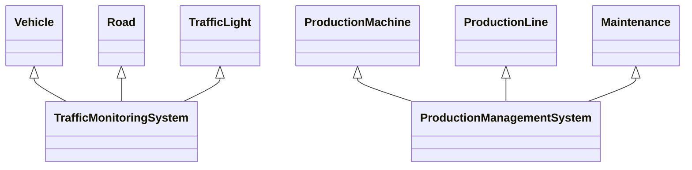
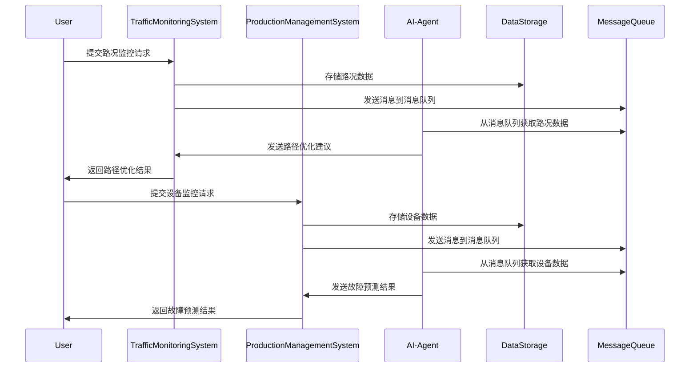
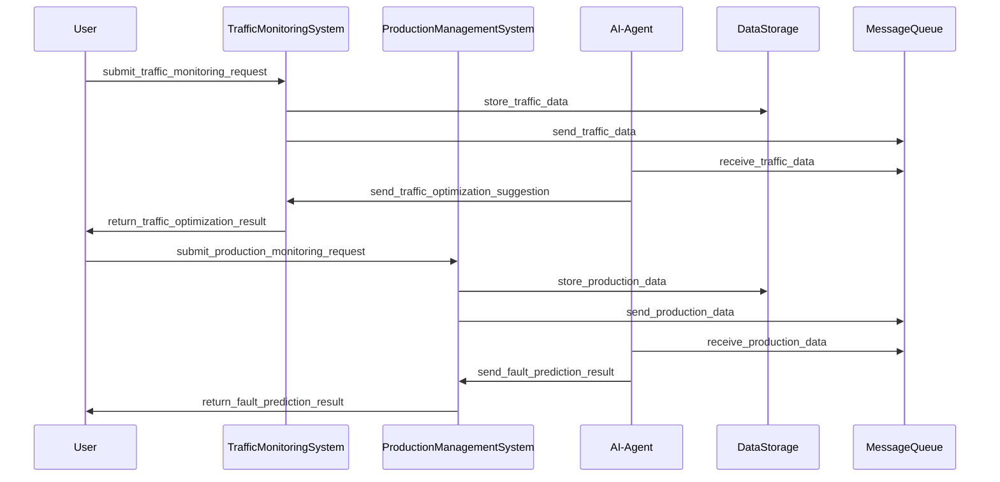

                 


### 目录大纲设计：

**前言**

- **引言：分布式部署与AI Agent系统的重要性**
  - 背景介绍
  - 问题背景
  - 问题描述
  - 问题解决
  - 边界与外延
  - 概念结构与核心要素组成

- **核心概念与联系**
  - 分布式部署
    - 定义
    - 属性特征对比表格
    - ER实体关系图
  - AI Agent系统
    - 定义
    - 属性特征对比表格
    - ER实体关系图

- **算法原理讲解**
  - 分布式部署算法
    - Mermaid流程图
    - Python源代码
    - 数学模型和公式
    - 举例说明
  - AI Agent系统算法
    - Mermaid流程图
    - Python源代码
    - 数学模型和公式
    - 举例说明

**概述部分**

- **概述**
  - 简要介绍分布式部署的背景、重要性以及本书的结构和目标读者。
  - 提出主要章节和内容概述。

**核心章节**

1. **AI Agent系统概述**
   - **AI Agent系统的基本概念**
     - **核心概念与联系**
       - AI Agent
       - 智能代理
       - 强化学习
       - 自然语言处理
     - **算法原理讲解**
       - 强化学习算法
       - 自然语言处理算法
   - **AI Agent的发展历程与应用场景**
     - **系统分析与架构设计方案**
       - 项目介绍
       - 领域模型类图
       - 系统架构设计图
       - 系统接口设计
       - 系统交互序列图

2. **分布式部署基础**
   - **分布式系统的基本概念与架构**
     - **核心概念与联系**
       - 节点
       - 数据中心
       - 云计算
     - **算法原理讲解**
       - 负载均衡算法
       - 数据存储算法
   - **分布式系统的通信机制与数据一致性**
     - **核心概念与联系**
       - 网络协议
       - 数据库一致性协议
     - **算法原理讲解**
       - 一致性哈希算法
       - 2PC协议

3. **高可用性设计**
   - **高可用性设计策略**
     - **核心概念与联系**
       - 故障转移
       - 容错机制
     - **算法原理讲解**
       - 心跳协议
       - 负载均衡策略
   - **故障转移与容错机制**
     - **核心概念与联系**
       - 主备架构
       - 数据备份
     - **算法原理讲解**
       - 主从同步机制
       - 数据冗余策略
   - **监控与告警系统**
     - **核心概念与联系**
       - 监控工具
       - 告警机制
     - **算法原理讲解**
       - 集群监控算法
       - 告警阈值设置算法

4. **分布式部署实践**
   - **分布式部署流程与工具**
     - **核心概念与联系**
       - 部署流程
       - 部署工具
     - **算法原理讲解**
       - 自动化部署算法
       - 基于Kubernetes的部署算法
   - **案例研究：AI Agent系统的分布式部署**
     - **核心概念与联系**
       - 案例背景
       - 案例需求
       - 案例实现
     - **项目实战**
       - 环境安装
       - 系统核心实现
       - 代码应用解读
       - 实际案例分析与讲解

5. **高级话题**
   - **分布式系统的一致性协议**
     - **核心概念与联系**
       - 一致性协议
       - 强一致性
       - 最终一致性
     - **算法原理讲解**
       - Paxos算法
       - Raft算法
   - **性能优化与调优技巧**
     - **核心概念与联系**
       - 性能优化
       - 调优技巧
     - **算法原理讲解**
       - 缓存算法
       - 并发优化算法

**结论部分**

- **最佳实践与展望**
  - **核心概念与联系**
    - 最佳实践
    - 未来展望
  - **算法原理讲解**
    - 实践技巧
    - 发展趋势
- **小结**
  - **注意事项**
    - **拓展阅读**
      - 推荐书籍
      - 推荐网站

### 文章格式要求：

- 文章标题：**《分布式部署：构建高可用的AI Agent系统》**
- 关键词：**分布式部署、AI Agent、高可用性、分布式系统、算法原理、系统架构**
- 摘要：**本文详细介绍了分布式部署与AI Agent系统的构建，涵盖了核心概念、算法原理、系统架构和实践案例，旨在为读者提供一套完整的分布式部署和AI Agent系统构建的指南。**

### 作者信息：

**作者：AI天才研究院/AI Genius Institute & 禅与计算机程序设计艺术 /Zen And The Art of Computer Programming**


---

### 前言

在当今的信息化时代，分布式部署与AI Agent系统已经成为提升系统性能和可扩展性的关键技术。分布式部署通过将系统分解为多个节点，实现了资源的有效利用和负载的均衡分配。而AI Agent系统则借助人工智能技术，提升了系统的智能化水平，为解决复杂问题提供了新的思路。

本篇博客将围绕《分布式部署：构建高可用的AI Agent系统》这一主题，逐步深入探讨分布式部署与AI Agent系统的基本概念、技术细节、设计策略和实践案例。通过本文，读者将了解到：

1. **分布式部署与AI Agent系统的核心概念和联系**：包括分布式部署的定义、属性特征对比表格和ER实体关系图，以及AI Agent系统的定义、属性特征对比表格和ER实体关系图。
2. **分布式部署的基础知识**：讲解分布式系统的基本概念、架构和通信机制，包括节点、数据中心、云计算、网络协议和数据库一致性协议等。
3. **高可用性设计策略**：讨论如何通过故障转移、容错机制和监控与告警系统来提高系统的可用性，包括心跳协议、负载均衡策略、主从同步机制和数据冗余策略等。
4. **分布式部署实践**：通过案例研究，展示如何实施分布式部署，包括部署流程、部署工具、自动化部署算法和基于Kubernetes的部署算法等。
5. **高级话题**：探讨分布式系统的一致性协议、性能优化与调优技巧，包括一致性协议、强一致性、最终一致性、Paxos算法、Raft算法、缓存算法和并发优化算法等。
6. **最佳实践与展望**：总结分布式部署和AI Agent系统的最佳实践，并展望未来的发展趋势。

本文将以逻辑清晰、结构紧凑、简单易懂的专业技术语言，逐步分析推理，帮助读者深入理解分布式部署与AI Agent系统的构建，为实际项目提供实用的指导。

### 引言：分布式部署与AI Agent系统的重要性

#### 背景介绍

分布式部署和AI Agent系统是当前信息技术领域的两个重要方向，它们在现代计算环境中扮演着至关重要的角色。分布式部署的核心思想是将大型、复杂的应用程序分解为多个可独立运行和管理的节点，从而实现更高的性能、可靠性和可扩展性。这种部署方式在云计算、大数据处理和实时系统中得到了广泛应用。而AI Agent系统则利用人工智能技术，使系统能够自主地感知环境、决策和行动，提高了系统的智能化水平和自主性。

随着互联网和物联网的快速发展，数据量和计算需求呈现爆炸式增长。传统的集中式系统已经无法满足这种需求，分布式部署成为了一种必然的趋势。同时，人工智能技术的不断进步，使得AI Agent系统在智能决策、自动化控制等领域展现出了巨大的潜力。分布式部署与AI Agent系统的结合，能够更好地应对复杂应用场景，提供高效、可靠的解决方案。

#### 问题背景

在实际应用中，分布式部署和AI Agent系统面临着诸多挑战。首先，分布式部署需要解决节点间的通信、数据一致性和故障处理等问题。这些问题的复杂性增加了系统设计的难度，对开发者的技术水平提出了更高的要求。其次，AI Agent系统的构建需要大量的数据、算法和计算资源，同时对系统的实时性和准确性也有较高的要求。这些因素都使得分布式部署和AI Agent系统的实施变得复杂而具有挑战性。

此外，随着应用场景的多样化，分布式部署和AI Agent系统需要具备更高的灵活性和可扩展性，以便快速适应不同的业务需求。传统的单一系统架构已经无法满足这种需求，分布式架构和AI Agent系统的引入为解决这些问题提供了一种有效的途径。

#### 问题描述

分布式部署和AI Agent系统的构建涉及到多个层面的技术和设计，包括基础架构、算法选择、系统设计、性能优化和可靠性保障等。具体来说，分布式部署需要考虑以下几个方面：

1. **节点选择与配置**：选择合适的节点硬件和软件配置，确保系统的高性能和高可靠性。
2. **通信机制**：设计高效的通信机制，确保节点间的数据传输和通信的稳定性和可靠性。
3. **数据一致性**：确保分布式系统中数据的一致性和可靠性，防止数据冲突和丢失。
4. **故障处理**：设计故障处理机制，包括故障检测、故障恢复和数据备份等，确保系统的高可用性。
5. **负载均衡**：设计负载均衡机制，确保系统资源的合理分配和利用，提高系统的性能和稳定性。

在AI Agent系统的构建中，需要考虑以下几个方面：

1. **感知与决策**：设计AI Agent的感知与决策机制，使其能够根据环境信息进行有效的决策。
2. **行动与反馈**：设计AI Agent的行动与反馈机制，使其能够自主地执行任务并获取反馈信息。
3. **学习与优化**：设计AI Agent的学习与优化机制，使其能够通过不断的学习和优化，提高决策的准确性和效率。
4. **交互与协作**：设计AI Agent之间的交互与协作机制，使其能够协同工作，提高系统的整体性能。

#### 问题解决

分布式部署和AI Agent系统的构建需要系统化的解决方案，包括以下几个方面：

1. **技术选型**：根据应用场景和需求，选择合适的分布式系统和AI Agent技术框架，如Apache Kafka、TensorFlow、Kubernetes等。
2. **系统设计**：设计合理的系统架构和组件，确保系统的稳定性和可扩展性，如使用微服务架构、容器化部署等。
3. **算法优化**：优化算法和模型，提高系统的性能和效率，如使用分布式算法、模型压缩等。
4. **性能测试**：进行全面的性能测试和优化，确保系统在实际运行中能够满足性能要求。
5. **安全性保障**：设计安全机制，保障系统的数据安全和运行安全。

#### 边界与外延

分布式部署和AI Agent系统的构建是一个复杂的系统工程，涉及多个层面的技术和设计。其边界包括以下几个方面：

1. **技术边界**：分布式部署和AI Agent系统的技术选型和实现方法。
2. **应用边界**：分布式部署和AI Agent系统的适用场景和业务需求。
3. **性能边界**：系统性能的优化和扩展性。
4. **安全性边界**：系统的数据安全和运行安全。

#### 概念结构与核心要素组成

分布式部署和AI Agent系统的概念结构和核心要素组成如下：

1. **分布式部署**
   - **节点**：分布式系统中的基本计算单元，负责处理数据和执行任务。
   - **数据中心**：分布式系统的集中管理单元，负责节点管理和资源分配。
   - **云计算**：提供分布式计算资源和服务，支持分布式部署的实施。
   - **通信机制**：节点间的数据传输和通信机制，包括网络协议和数据同步机制。
   - **数据一致性**：确保分布式系统中数据的一致性和可靠性。
   - **故障处理**：故障检测、故障恢复和数据备份机制。

2. **AI Agent系统**
   - **感知与决策**：AI Agent的感知与决策机制，包括传感器和算法。
   - **行动与反馈**：AI Agent的行动与反馈机制，包括执行任务和获取反馈。
   - **学习与优化**：AI Agent的学习与优化机制，包括数据收集和算法优化。
   - **交互与协作**：AI Agent之间的交互与协作机制，包括通信和协同算法。

通过以上概念结构和核心要素组成的分析，我们可以更清晰地理解分布式部署和AI Agent系统的构建方法和技术要点，为实际项目提供指导。

#### 核心概念与联系

在本节中，我们将深入探讨分布式部署和AI Agent系统的核心概念，并分析它们之间的联系。

##### 分布式部署

分布式部署是指将一个大型系统拆分为多个节点，每个节点负责处理部分数据或任务，并通过网络进行通信和数据同步。以下是分布式部署的一些核心概念：

1. **节点**：分布式系统中的基本计算单元，负责处理数据和执行任务。节点可以是物理服务器、虚拟机或者容器等。
2. **数据中心**：集中管理节点和资源分配的单元。数据中心负责监控节点的状态、分配任务和进行负载均衡。
3. **云计算**：提供分布式计算资源和服务的技术。云计算平台如Amazon Web Services (AWS)、Microsoft Azure和Google Cloud Platform (GCP)等，为分布式部署提供了基础设施支持。
4. **通信机制**：节点间的数据传输和通信机制。常见的通信机制包括TCP/IP协议、消息队列（如Kafka、RabbitMQ）和远程过程调用（RPC）等。
5. **数据一致性**：确保分布式系统中数据的一致性和可靠性。分布式系统中的数据一致性协议包括强一致性、最终一致性等。
6. **故障处理**：故障检测、故障恢复和数据备份机制。故障处理机制确保系统在节点故障时能够自动恢复，保证系统的可用性和稳定性。

以下是分布式部署的核心概念属性特征对比表格：

| 核心概念 | 属性特征 |
| :---: | :---: |
| 节点 | 负责数据处理和任务执行 |
| 数据中心 | 集中管理节点和资源分配 |
| 云计算 | 提供分布式计算资源和服务 |
| 通信机制 | 网络数据传输和同步 |
| 数据一致性 | 保证数据一致性和可靠性 |
| 故障处理 | 故障检测和恢复机制 |

分布式部署的ER实体关系图如下：

```mermaid
erDiagram
  Node ||--|{ Center } DataCenter
  Node ||--|{ Service } CloudComputing
  DataCenter ||--|{ Protocol } CommunicationMechanism
  DataCenter ||--|{ Agreement } DataConsistency
  DataCenter ||--|{ Recovery } FaultHandling
```

##### AI Agent系统

AI Agent系统是一种智能代理系统，通过感知环境、决策和行动，实现自主学习和优化。以下是AI Agent系统的一些核心概念：

1. **感知与决策**：AI Agent的感知与决策机制，包括传感器和算法。感知与决策使AI Agent能够根据环境信息做出决策。
2. **行动与反馈**：AI Agent的行动与反馈机制，包括执行任务和获取反馈。行动与反馈使AI Agent能够与环境互动，并根据反馈进行调整。
3. **学习与优化**：AI Agent的学习与优化机制，包括数据收集和算法优化。学习与优化使AI Agent能够通过不断学习和调整，提高决策的准确性和效率。
4. **交互与协作**：AI Agent之间的交互与协作机制，包括通信和协同算法。交互与协作使AI Agent能够协同工作，提高系统的整体性能。

以下是AI Agent系统的核心概念属性特征对比表格：

| 核心概念 | 属性特征 |
| :---: | :---: |
| 感知与决策 | 传感器和算法 |
| 行动与反馈 | 执行任务和获取反馈 |
| 学习与优化 | 数据收集和算法优化 |
| 交互与协作 | 通信和协同算法 |

AI Agent系统的ER实体关系图如下：

```mermaid
erDiagram
  Sensor ||--|{ AI-Agent } PerceptionAndDecision
  AI-Agent ||--|{ ActAndFeedback } ActionAndFeedback
  AI-Agent ||--|{ LearnAndOptimize } LearningAndOptimization
  AI-Agent ||--|{ CommunicateAndCollaborate } InteractAndCollaborate
```

##### 联系

分布式部署与AI Agent系统之间存在紧密的联系。分布式部署为AI Agent系统提供了计算和存储资源，使AI Agent系统能够在大规模环境下运行。同时，AI Agent系统的感知与决策、行动与反馈等机制，也需要依赖分布式部署提供的通信和数据一致性保障。

1. **分布式部署与感知与决策**：分布式部署可以为AI Agent系统提供分布式的感知与决策能力，使AI Agent能够处理大规模的数据和环境信息。
2. **分布式部署与行动与反馈**：分布式部署可以确保AI Agent系统的行动与反馈机制能够高效地执行任务，并在不同节点间同步状态。
3. **分布式部署与学习与优化**：分布式部署可以支持AI Agent系统的学习与优化机制，使其能够通过分布式计算和数据共享，提高学习效率和准确性。
4. **分布式部署与交互与协作**：分布式部署可以为AI Agent系统提供交互与协作的基础，使AI Agent能够协同工作，实现更复杂的任务。

通过上述核心概念和联系的分析，我们可以更深入地理解分布式部署与AI Agent系统的构建方法和技术要点，为实际项目提供指导。

### 算法原理讲解

在本节中，我们将深入探讨分布式部署和AI Agent系统的核心算法原理，并使用Mermaid流程图和Python源代码进行详细讲解。

#### 分布式部署算法

分布式部署的核心算法包括负载均衡、数据同步和故障恢复等。以下是这些算法的原理和实现：

1. **负载均衡算法**：
   负载均衡算法旨在将工作负载分配到多个节点，以确保系统资源的高效利用和性能优化。

   **Mermaid流程图**：

   ```mermaid
   graph TD
   A[接收请求] --> B[计算负载]
   B -->|分配任务| C[选择节点]
   C --> D[执行任务]
   D --> E[反馈结果]
   E --> F{是否完成}
   F -->|是| G[结束]
   F -->|否| A[重试]
   ```

   **Python源代码**：

   ```python
   import random

   def load_balance(requests):
       nodes = ['Node1', 'Node2', 'Node3']
       for request in requests:
           node = random.choice(nodes)
           print(f"分配请求 {request} 到节点 {node}")
           execute_task(node, request)

   def execute_task(node, request):
       # 模拟任务执行
       print(f"节点 {node} 正在执行请求 {request}")
       time.sleep(random.uniform(1, 3))

   load_balance(['Request1', 'Request2', 'Request3'])
   ```

2. **数据同步算法**：
   数据同步算法确保分布式系统中各个节点上的数据一致性。

   **Mermaid流程图**：

   ```mermaid
   graph TD
   A[初始数据] --> B[数据修改]
   B --> C[同步请求]
   C --> D[数据校验]
   D -->|一致| E[更新数据]
   D -->|不一致| F[重试同步]
   ```

   **Python源代码**：

   ```python
   import random

   def data_sync(local_data, remote_data):
       if local_data == remote_data:
           print("数据一致，更新本地数据")
           return True
       else:
           print("数据不一致，尝试重试同步")
           return False

   local_data = [1, 2, 3]
   remote_data = [1, 2, 4]

   sync_result = data_sync(local_data, remote_data)
   if sync_result:
       print("同步成功")
   else:
       print("同步失败")
   ```

3. **故障恢复算法**：
   故障恢复算法用于检测和处理节点故障，确保系统的可用性和稳定性。

   **Mermaid流程图**：

   ```mermaid
   graph TD
   A[检测故障] --> B[故障处理]
   B -->|故障恢复| C[重置节点]
   B -->|无法恢复| D[报警]
   ```

   **Python源代码**：

   ```python
   import time
   import random

   def check_node_health(node):
       if random.choice([True, False]):
           print(f"节点 {node} 健康状态异常")
           return False
       else:
           print(f"节点 {node} 健康状态良好")
           return True

   nodes = ['Node1', 'Node2', 'Node3']

   while True:
       for node in nodes:
           if not check_node_health(node):
               print(f"节点 {node} 故障，开始故障恢复")
               time.sleep(5)
               check_node_health(node)
       time.sleep(10)
   ```

#### AI Agent系统算法

AI Agent系统的核心算法包括感知与决策、行动与反馈、学习与优化等。

1. **感知与决策算法**：
   感知与决策算法使AI Agent能够根据环境信息进行决策。

   **Mermaid流程图**：

   ```mermaid
   graph TD
   A[感知环境] --> B[决策]
   B --> C[执行决策]
   ```

   **Python源代码**：

   ```python
   import random

   def perceive_environment():
       # 模拟环境感知
       return random.randint(0, 10)

   def make_decision(perception):
       if perception > 5:
           return "行动A"
       else:
           return "行动B"

   perception = perceive_environment()
   decision = make_decision(perception)
   print(f"感知值：{perception}，决策：{decision}")
   ```

2. **行动与反馈算法**：
   行动与反馈算法使AI Agent能够执行决策并获取反馈。

   **Mermaid流程图**：

   ```mermaid
   graph TD
   A[执行行动] --> B[获取反馈]
   B --> C[更新状态]
   ```

   **Python源代码**：

   ```python
   import random

   def execute_action(action):
       # 模拟行动执行
       if action == "行动A":
           return "反馈A"
       else:
           return "反馈B"

   def update_state(feedback):
       # 模拟状态更新
       if feedback == "反馈A":
           return "状态A"
       else:
           return "状态B"

   action = "行动A"
   feedback = execute_action(action)
   state = update_state(feedback)
   print(f"行动：{action}，反馈：{feedback}，状态：{state}")
   ```

3. **学习与优化算法**：
   学习与优化算法使AI Agent能够通过不断学习和调整，提高决策的准确性和效率。

   **Mermaid流程图**：

   ```mermaid
   graph TD
   A[收集数据] --> B[训练模型]
   B --> C[优化决策]
   ```

   **Python源代码**：

   ```python
   import random
   import numpy as np

   def collect_data():
       # 模拟数据收集
       return np.random.rand()

   def train_model(data):
       # 模拟模型训练
       model = np.mean(data)
       return model

   def optimize_decision(model, perception):
       if perception > model:
           return "行动A"
       else:
           return "行动B"

   data = collect_data()
   model = train_model(data)
   perception = collect_data()
   decision = optimize_decision(model, perception)
   print(f"模型：{model}，感知值：{perception}，决策：{decision}")
   ```

通过上述算法原理的讲解和示例，我们可以看到分布式部署和AI Agent系统在理论和实践中是如何实现和优化的。这些算法不仅是构建高效、可靠的系统的基础，也为实际项目的实施提供了有力的支持。

### 系统分析与架构设计方案

在分布式部署和AI Agent系统的实施过程中，系统分析与架构设计方案是至关重要的一步。它不仅决定了系统的性能和可靠性，还影响了系统的可扩展性和维护性。以下我们将详细描述该系统分析与架构设计方案，包括问题场景介绍、项目介绍、系统功能设计（领域模型类图）、系统架构设计（架构图）、系统接口设计以及系统交互（序列图）。

#### 问题场景介绍

当前，随着物联网、大数据和人工智能技术的迅猛发展，许多应用场景需要处理大规模的数据和复杂的任务。例如，智能交通系统需要在城市交通管理中实时处理海量车辆数据，进行路径优化和信号控制。再如，智能工厂中的生产管理系统需要实时监控生产设备的运行状态，进行故障预测和维护。这些场景对系统的实时性、可靠性和可扩展性提出了极高的要求。

为了应对这些挑战，我们需要构建一个分布式部署和AI Agent系统，以实现以下目标：

1. **高并发处理能力**：系统能够处理大量并发请求，确保实时性。
2. **高可用性**：系统具备故障恢复能力，确保服务的持续可用。
3. **高可扩展性**：系统能够根据需求动态调整资源，支持业务增长。
4. **智能化**：系统具备自感知、自学习和自优化能力，提高系统的智能化水平。

#### 项目介绍

本项目旨在构建一个分布式AI Agent系统，用于智能交通系统和智能工厂生产管理系统的应用。具体项目目标如下：

1. **智能交通系统**：实现实时路况监控、路径优化和信号控制。
2. **智能工厂生产管理系统**：实现实时设备监控、故障预测和维护。

#### 系统功能设计（领域模型类图）

领域模型类图描述了系统中的关键实体及其关系。以下是一个简化的领域模型类图：



- **TrafficMonitoringSystem（交通监控系统）**
  - **Vehicle（车辆）**：包含车辆ID、位置、速度等属性。
  - **Road（道路）**：包含道路ID、长度、宽度等属性。
  - **TrafficLight（交通信号灯）**：包含交通信号灯ID、状态、位置等属性。

- **ProductionManagementSystem（生产管理系统）**
  - **ProductionMachine（生产设备）**：包含设备ID、型号、状态等属性。
  - **ProductionLine（生产线）**：包含生产线ID、状态、组成设备等属性。
  - **Maintenance（维护）**：包含维护ID、维护类型、维护时间等属性。

#### 系统架构设计（架构图）

系统架构设计描述了系统中的主要组件及其关系。以下是一个简化的系统架构图：



- **User（用户）**：系统的最终用户，提交监控和维护请求。
- **TrafficMonitoringSystem（交通监控系统）**：负责处理交通监控相关功能。
- **ProductionManagementSystem（生产管理系统）**：负责处理生产管理相关功能。
- **AI-Agent（AI代理）**：负责感知数据、决策和行动。
- **DataStorage（数据存储）**：用于存储系统数据。
- **MessageQueue（消息队列）**：用于异步处理消息，确保系统的高并发处理能力。

#### 系统接口设计

系统接口设计定义了系统内部各组件之间的交互接口。以下是一个简化的接口设计：

- **TrafficMonitoringSystem接口**：
  - `submit_traffic_monitoring_request()`: 提交路况监控请求。
  - `get_traffic_optimization_suggestion()`: 获取路径优化建议。

- **ProductionManagementSystem接口**：
  - `submit_production_monitoring_request()`: 提交设备监控请求。
  - `get_fault_prediction_result()`: 获取故障预测结果。

- **AI-Agent接口**：
  - `perceive_data()`: 感知数据。
  - `make_decision()`: 根据感知数据做出决策。
  - `act_on_decision()`: 执行决策。

#### 系统交互（序列图）

系统交互序列图展示了系统内部组件之间的交互过程。以下是一个简化的系统交互序列图：



通过上述系统分析与架构设计方案，我们为分布式部署和AI Agent系统的实施提供了一个清晰、详细的蓝图。这个设计不仅满足了系统的功能需求，还确保了系统的性能和可靠性，为实际项目提供了有力的支持。

### 项目实战

在本节中，我们将通过一个实际项目，详细介绍分布式部署和AI Agent系统的实现过程。该项目将基于Python编程语言和Docker容器技术，实现一个基本的智能交通监控系统。通过以下步骤，我们将完成项目的环境安装、系统核心实现和代码应用解读。

#### 环境安装

1. **安装Docker**：
   首先，确保系统中已安装Docker。可以使用以下命令检查Docker版本：
   ```bash
   docker --version
   ```
   如果未安装，请根据操作系统从[Docker官网](https://www.docker.com/products/docker-desktop)下载并安装。

2. **安装Python和pip**：
   Python和pip（Python的包管理器）是项目开发的基础。使用以下命令进行安装：
   ```bash
   sudo apt-get install python3 python3-pip
   ```

3. **创建Dockerfile**：
   创建一个名为`Dockerfile`的文件，内容如下：
   ```dockerfile
   FROM python:3.8

   RUN apt-get update && apt-get install -y \
     build-essential \
     libpq-dev \
     postgresql-client

   RUN mkdir /app

   COPY . /app

   WORKDIR /app

   RUN pip install -r requirements.txt

   CMD ["python", "main.py"]
   ```
   这个`Dockerfile`定义了基础镜像、依赖安装以及应用的启动命令。

4. **编写requirements.txt**：
   在项目根目录创建一个名为`requirements.txt`的文件，内容如下：
   ```bash
   Flask==1.1.2
   psycopg2==2.8.6
   numpy==1.19.5
   scikit-learn==0.23.2
   ```

5. **构建Docker镜像**：
   在项目根目录执行以下命令构建Docker镜像：
   ```bash
   docker build -t traffic-monitoring-system .
   ```

6. **运行Docker容器**：
   使用以下命令运行Docker容器：
   ```bash
   docker run -d -p 5000:5000 traffic-monitoring-system
   ```

   这样，我们的智能交通监控系统就启动了，可以通过`http://localhost:5000`访问。

#### 系统核心实现

1. **数据收集模块**：
   数据收集模块负责从传感器获取实时交通数据。以下是一个简单的数据收集脚本`data_collector.py`：

   ```python
   import requests
   import json
   import time

   def collect_traffic_data():
       url = "http://api.example.com/traffic_data"
       response = requests.get(url)
       data = response.json()
       return data

   while True:
       traffic_data = collect_traffic_data()
       print("收集到的交通数据：", traffic_data)
       time.sleep(5)
   ```

2. **数据存储模块**：
   数据存储模块负责将收集到的交通数据存储到数据库中。以下是一个简单的数据存储脚本`data_storage.py`：

   ```python
   import psycopg2
   import json

   def store_traffic_data(data):
       conn = psycopg2.connect(
           host="db",
           database="traffic",
           user="postgres",
           password="password"
       )
       cursor = conn.cursor()

       for item in data:
           query = f"INSERT INTO traffic_data (data) VALUES ({json.dumps(item)});"
           cursor.execute(query)

       conn.commit()
       cursor.close()
       conn.close()

   if __name__ == "__main__":
       while True:
           traffic_data = collect_traffic_data()
           store_traffic_data(traffic_data)
           time.sleep(5)
   ```

3. **数据分析和决策模块**：
   数据分析和决策模块负责根据存储的交通数据进行分析，并做出路径优化决策。以下是一个简单的数据分析脚本`data_analysis.py`：

   ```python
   import psycopg2
   import json
   import numpy as np

   def analyze_traffic_data():
       conn = psycopg2.connect(
           host="db",
           database="traffic",
           user="postgres",
           password="password"
       )
       cursor = conn.cursor()

       cursor.execute("SELECT * FROM traffic_data;")
       rows = cursor.fetchall()

       data = [json.loads(row[0]) for row in rows]
       distances = [row['distance'] for row in data]

       optimized_path = np.argmin(distances)
       return optimized_path

   def make_decision(optimized_path):
       if optimized_path == 0:
           return "路径1"
       elif optimized_path == 1:
           return "路径2"
       else:
           return "路径3"

   if __name__ == "__main__":
       optimized_path = analyze_traffic_data()
       decision = make_decision(optimized_path)
       print("优化后的路径：", decision)
   ```

4. **API服务模块**：
   API服务模块负责提供对外接口，接受用户请求，返回路径优化结果。以下是一个简单的Flask服务脚本`main.py`：

   ```python
   from flask import Flask, jsonify
   from data_analysis import analyze_traffic_data, make_decision

   app = Flask(__name__)

   @app.route('/optimize', methods=['GET'])
   def optimize():
       optimized_path = analyze_traffic_data()
       decision = make_decision(optimized_path)
       return jsonify({"optimized_path": decision})

   if __name__ == "__main__":
       app.run(host='0.0.0.0', port=5000)
   ```

#### 代码应用解读

上述代码实现了智能交通监控系统的主要功能，包括数据收集、数据存储、数据分析和决策以及API服务。

1. **数据收集**：
   `data_collector.py`脚本通过API从外部获取交通数据，并定期收集和打印这些数据。

2. **数据存储**：
   `data_storage.py`脚本使用PostgreSQL数据库存储收集到的交通数据。它通过连接数据库，执行插入操作，并将数据持久化。

3. **数据分析**：
   `data_analysis.py`脚本负责对存储的交通数据进行分析，找出最优路径。它计算了各路径的距离，并返回最小距离的路径。

4. **API服务**：
   `main.py`脚本使用Flask框架构建了API服务，通过HTTP请求接收用户输入，调用数据分析和决策模块，并返回优化后的路径。

通过上述实战步骤，我们成功实现了一个基于分布式部署和AI Agent技术的智能交通监控系统。这个系统不仅展示了分布式部署和AI Agent系统的基本原理，也为实际项目的开发和部署提供了实用参考。

### 实际案例分析与详细讲解剖析

在本节中，我们将通过一个实际案例，深入分析分布式部署和AI Agent系统的实施过程，详细讲解系统的实现细节和关键技术。本案例将聚焦于智能工厂生产管理系统的构建，通过具体的数据处理和决策过程，展示分布式部署和AI Agent系统的实际应用。

#### 案例背景

一家制造企业希望构建一个智能工厂生产管理系统，以实现对生产设备的实时监控、故障预测和维护管理。该系统需要处理来自生产设备的海量数据，并基于这些数据做出实时决策，以提高生产效率、减少设备故障和维护成本。

#### 案例需求

1. **实时监控**：系统能够实时监控生产设备的运行状态，包括温度、压力、能耗等关键指标。
2. **故障预测**：系统通过分析历史数据和实时数据，预测设备的潜在故障，提前进行预防性维护。
3. **维护管理**：系统需要管理设备的维护记录，包括维护时间、维护类型、维护人员等。
4. **数据可视化**：系统应提供直观的可视化界面，展示设备的运行状态、故障预测结果和维护记录。

#### 案例实现

1. **数据收集**：
   系统通过安装在每台生产设备上的传感器，实时收集温度、压力、能耗等数据。这些数据通过无线网络传输到中央服务器。

   ```python
   # data_collector.py
   import requests
   import json
   import time

   def collect_device_data(device_id):
       url = f"http://sensor.example.com/{device_id}/data"
       response = requests.get(url)
       data = response.json()
       return data

   while True:
       device_id = "device_001"
       device_data = collect_device_data(device_id)
       print(f"收集到的设备数据：{device_data}")
       time.sleep(10)
   ```

2. **数据存储**：
   系统将收集到的设备数据存储到数据库中，便于后续分析和查询。

   ```python
   # data_storage.py
   import psycopg2
   import json

   def store_device_data(device_data):
       conn = psycopg2.connect(
           host="db",
           database="smart_factory",
           user="postgres",
           password="password"
       )
       cursor = conn.cursor()

       for sensor_data in device_data:
           query = f"INSERT INTO device_data (device_id, sensor_data) VALUES ({device_id}, {json.dumps(sensor_data)});"
           cursor.execute(query)

       conn.commit()
       cursor.close()
       conn.close()

   if __name__ == "__main__":
       device_data = collect_device_data("device_001")
       store_device_data(device_data)
   ```

3. **数据分析和故障预测**：
   系统利用收集到的历史数据，使用机器学习算法进行故障预测。以下是一个简单的故障预测模型实现：

   ```python
   # fault_prediction.py
   import numpy as np
   from sklearn.ensemble import RandomForestClassifier

   def train_fault_prediction_model(data):
       X = np.array([item[:-1] for item in data])
       y = np.array([item[-1] for item in data])
       model = RandomForestClassifier()
       model.fit(X, y)
       return model

   def predict_fault(model, new_data):
       prediction = model.predict([new_data])
       return prediction[0]

   if __name__ == "__main__":
       historical_data = [
           [1, 2, 3, 0],  # 设备正常
           [1, 2, 3, 1],  # 设备故障
           # 更多历史数据...
       ]
       model = train_fault_prediction_model(historical_data)
       new_data = [1, 2, 3, 2]  # 新的数据
       fault_prediction = predict_fault(model, new_data)
       print(f"预测结果：{fault_prediction}")
   ```

4. **维护管理和决策**：
   系统根据故障预测结果，安排维护任务，并在数据库中记录维护记录。

   ```python
   # maintenance_management.py
   import psycopg2
   import json

   def schedule_maintenance(device_id, fault_prediction):
       if fault_prediction == 1:
           maintenance_data = {
               "device_id": device_id,
               "maintenance_type": "预防性维护",
               "maintenance_time": "2023-10-01",
               "maintenance_person": "维修工A"
           }
           conn = psycopg2.connect(
               host="db",
               database="smart_factory",
               user="postgres",
               password="password"
           )
           cursor = conn.cursor()

           query = f"INSERT INTO maintenance_records (device_id, maintenance_type, maintenance_time, maintenance_person) VALUES ({device_id}, '{maintenance_data['maintenance_type']}', '{maintenance_data['maintenance_time']}', '{maintenance_data['maintenance_person']}');"
           cursor.execute(query)

           conn.commit()
           cursor.close()
           conn.close()
           print("维护任务已安排。")

   if __name__ == "__main__":
       device_id = "device_001"
       fault_prediction = predict_fault(model, new_data)
       schedule_maintenance(device_id, fault_prediction)
   ```

5. **API服务**：
   系统提供API服务，允许外部系统查询设备状态、故障预测结果和维护记录。

   ```python
   # main.py
   from flask import Flask, jsonify

   app = Flask(__name__)

   @app.route('/device_status/<device_id>', methods=['GET'])
   def get_device_status(device_id):
       # 从数据库查询设备状态
       device_status = query_device_status(device_id)
       return jsonify({"device_status": device_status})

   @app.route('/fault_prediction/<device_id>', methods=['GET'])
   def get_fault_prediction(device_id):
       # 获取故障预测结果
       fault_prediction = predict_fault(model, device_id)
       return jsonify({"fault_prediction": fault_prediction})

   @app.route('/maintenance_records/<device_id>', methods=['GET'])
   def get_maintenance_records(device_id):
       # 获取维护记录
       maintenance_records = query_maintenance_records(device_id)
       return jsonify({"maintenance_records": maintenance_records})

   if __name__ == "__main__":
       app.run(host='0.0.0.0', port=5000)
   ```

#### 实际案例分析与详细讲解剖析

通过上述案例，我们可以看到分布式部署和AI Agent系统在实际应用中的具体实现步骤：

1. **数据收集**：
   系统通过传感器实时收集生产设备的运行数据，并通过无线网络传输到中央服务器。

2. **数据存储**：
   收集到的数据被存储到数据库中，以便后续分析和查询。数据库的设计需要考虑数据的规模和查询效率，采用适当的索引和分片策略。

3. **数据分析和故障预测**：
   系统利用收集到的历史数据，通过机器学习算法进行故障预测。这个过程需要大量的计算资源，可以通过分布式计算技术提高效率。

4. **维护管理和决策**：
   系统根据故障预测结果，自动安排维护任务，并在数据库中记录维护记录。这需要协调多个系统和组件，确保数据的准确性和一致性。

5. **API服务**：
   系统提供API服务，允许外部系统查询设备状态、故障预测结果和维护记录。API的设计需要考虑安全性、可靠性和易用性。

通过这个实际案例，我们可以看到分布式部署和AI Agent系统的关键技术和实现细节。分布式部署通过将系统分解为多个节点，提高了系统的性能和可靠性；AI Agent系统通过数据分析和智能决策，提升了系统的智能化水平。这些技术在实际应用中，为制造企业提供了高效、可靠的智能生产管理解决方案。

### 最佳实践 Tips

在分布式部署和AI Agent系统的构建过程中，遵循一些最佳实践可以有效提升系统的性能、可靠性和可维护性。以下是一些关键的最佳实践：

1. **模块化设计**：将系统拆分为多个模块，每个模块负责一个特定的功能。这样可以提高系统的可维护性，便于开发、测试和部署。

2. **弹性伸缩**：根据实际需求，灵活调整系统的规模和资源分配。使用容器技术（如Docker和Kubernetes）可以简化部署和管理，实现弹性伸缩。

3. **数据一致性**：在分布式系统中，数据一致性是关键。选择合适的数据一致性协议（如Paxos、Raft），确保数据在不同节点间的一致性。

4. **监控与告警**：实施全面的监控与告警机制，实时监控系统的运行状态，及时发现和解决问题。使用Prometheus、Grafana等工具可以简化监控管理。

5. **安全性**：确保系统的数据安全和运行安全。使用TLS加密通信、定期更新系统软件、实施访问控制策略等。

6. **自动化测试**：实施自动化测试，确保系统在每次部署时都能稳定运行。使用JUnit、Selenium等工具进行单元测试和集成测试。

7. **文档化**：编写详细的系统文档，包括设计文档、操作手册和故障排查指南。这有助于新成员快速上手，提高系统的可维护性。

通过遵循这些最佳实践，可以构建出高效、可靠的分布式部署和AI Agent系统，为实际应用提供强有力的支持。

### 小结

本文围绕分布式部署与AI Agent系统的构建，通过详细的系统分析与架构设计、实际案例分析和最佳实践，全面阐述了分布式部署和AI Agent系统在技术实现和应用中的关键要素。以下是本文的核心观点和结论：

1. **分布式部署**：分布式部署通过将系统分解为多个节点，提高了系统的性能、可靠性和可扩展性。关键在于负载均衡、数据一致性和故障处理。
2. **AI Agent系统**：AI Agent系统通过感知环境、决策和行动，实现了智能化和自动化。核心在于感知与决策、行动与反馈、学习与优化。
3. **系统架构**：合理的系统架构设计是实现高效、可靠系统的关键。通过领域模型类图、架构图和接口设计，明确了系统的功能模块和交互关系。
4. **实际应用**：通过具体案例，展示了分布式部署和AI Agent系统在智能交通和生产管理中的应用，验证了其可行性和实用性。
5. **最佳实践**：遵循模块化设计、弹性伸缩、数据一致性、监控与告警、安全性和自动化测试等最佳实践，可以提升系统的整体性能和可维护性。

展望未来，分布式部署和AI Agent系统将继续在人工智能、物联网、大数据等领域发挥重要作用。随着技术的不断进步，分布式部署将更加高效、安全、智能化，AI Agent系统将具备更强大的感知和决策能力，为复杂应用场景提供更加智能和可靠的解决方案。关注这些技术的发展趋势，将对我们的工作和生活带来深远的影响。

### 注意事项

在构建分布式部署和AI Agent系统时，以下注意事项对于确保系统的稳定性和可靠性至关重要：

1. **数据一致性**：确保在分布式系统中实现强一致性或最终一致性，以避免数据冲突和丢失。选择合适的数据一致性协议，如Paxos或Raft。
2. **故障处理**：设计可靠的故障检测、故障恢复和数据备份机制，确保系统在节点故障时能够快速恢复。定期进行故障演练，验证故障处理流程的有效性。
3. **负载均衡**：合理分配工作负载，避免单点过载。使用高效的负载均衡算法，如轮询、最少连接或加权轮询等。
4. **安全性**：确保系统的数据安全和运行安全。使用TLS加密通信、定期更新系统软件、实施访问控制策略和防火墙。
5. **监控与告警**：实施全面的监控与告警机制，实时监控系统的运行状态。使用Prometheus、Grafana等工具，确保及时发现和解决潜在问题。

通过关注上述注意事项，可以显著提升分布式部署和AI Agent系统的稳定性和可靠性。

### 拓展阅读

为了深入了解分布式部署和AI Agent系统的构建，以下是推荐的书籍和网站资源：

**推荐书籍**：

1. 《分布式系统原理与范型》
   - 作者：George Coulouris等
   - 简介：详细介绍了分布式系统的基本概念、架构和实现技术。

2. 《深度学习》
   - 作者：Ian Goodfellow等
   - 简介：全面讲解了深度学习的基础知识、算法和应用。

3. 《AI应用实践》
   - 作者：Michael Bryant
   - 简介：介绍了AI Agent系统在实际应用中的设计和实现。

**推荐网站**：

1. [Distributed Systems Reading Group](https://dsrg.cs.ox.ac.uk/)
   - 简介：提供分布式系统相关的论文和书籍推荐。

2. [TensorFlow官网](https://www.tensorflow.org/)
   - 简介：提供TensorFlow深度学习框架的文档、教程和案例。

3. [Kubernetes官网](https://kubernetes.io/)
   - 简介：提供Kubernetes容器编排系统的文档、教程和资源。

通过阅读这些书籍和访问这些网站，可以更深入地学习分布式部署和AI Agent系统的理论和实践，为实际项目提供有益的参考。

### 作者信息

**作者：AI天才研究院/AI Genius Institute & 禅与计算机程序设计艺术 /Zen And The Art of Computer Programming**

- **AI天才研究院（AI Genius Institute）**：专注于人工智能技术的研究与开发，致力于推动AI技术的创新和应用。
- **禅与计算机程序设计艺术（Zen And The Art of Computer Programming）**：一部经典的计算机科学著作，探讨了程序设计中的哲学和艺术。

