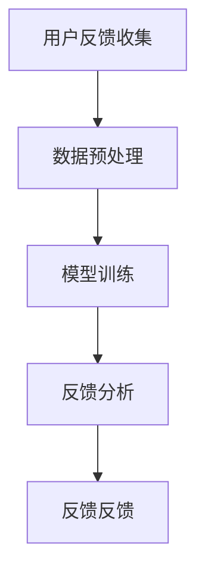
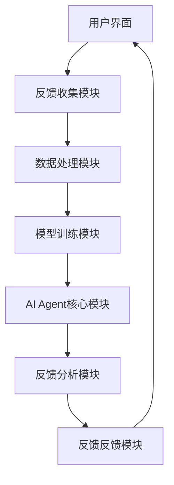

                 

## 利用用户反馈改进AI Agent的方法

### 关键词
- 用户反馈
- AI Agent
- 性能优化
- 算法改进
- 数学模型

### 摘要
本文旨在探讨如何通过用户反馈来改进AI Agent的性能和用户体验。我们将从问题背景出发，详细阐述用户反馈在AI Agent优化中的作用，介绍相关的核心概念和性能评估指标。随后，我们将深入分析用户反馈算法的原理及其实现过程，通过具体案例展示其在实际项目中的应用。最后，我们将总结最佳实践，展望未来的发展趋势。

## 目录大纲

### 第一部分：问题背景与核心概念
1. **第1章：问题背景**
   - **1.1.1 AI Agent概述**
   - **1.1.2 用户反馈的重要性**
   - **1.1.3 用户反馈对AI Agent改进的作用**

2. **第2章：核心概念**
   - **2.1.1 用户反馈类型**
   - **2.1.2 用户反馈机制**
   - **2.1.3 AI Agent性能评估指标**

### 第二部分：算法原理与实现
1. **第3章：用户反馈算法原理**
   - **3.1.1 反馈机制设计**
   - **3.1.2 学习算法介绍**
   - **3.1.3 用户反馈处理流程**

2. **第4章：算法实现与数学模型**
   - **4.1.1 算法流程图**
   - **4.1.2 数学模型讲解**
   - **4.1.3 Python代码实现**

### 第三部分：系统设计与实践
1. **第5章：系统架构设计**
   - **5.1.1 系统架构概述**
   - **5.1.2 功能模块设计**
   - **5.1.3 系统架构图**

2. **第6章：项目实战**
   - **6.1.1 环境安装**
   - **6.1.2 系统核心实现**
   - **6.1.3 代码应用解读与分析**
   - **6.1.4 实际案例分析**

### 第四部分：最佳实践与总结
1. **第7章：最佳实践**
   - **7.1.1 用户反馈收集技巧**
   - **7.1.2 AI Agent优化策略**
   - **7.1.3 用户满意度提升策略**

2. **第8章：总结与展望**
   - **8.1.1 总结**
   - **8.1.2 未来发展趋势**
   - **8.1.3 拓展阅读建议**

### 第1章：问题背景

#### 1.1.1 AI Agent概述

AI Agent，即人工智能代理，是自动化系统中的一个关键组件，它能够自主地完成特定任务，并具备一定的智能决策能力。从狭义上讲，AI Agent是一种计算机程序，它能在特定环境中感知环境、做出决策并执行行动。从广义上讲，AI Agent可以包括机器人、智能设备、虚拟助手等各种形式。

AI Agent的发展历程可以追溯到20世纪80年代，当时的专家系统在AI领域占据主导地位。然而，随着机器学习和深度学习技术的进步，AI Agent逐渐从被动响应转向主动探索和决策。当前，AI Agent在自然语言处理、计算机视觉、决策支持系统等领域得到了广泛应用，其能力不断增强，正逐渐融入人们的生活和工作。

#### 1.1.2 用户反馈的重要性

用户反馈是AI Agent性能优化的重要驱动力。用户反馈不仅可以帮助AI Agent了解其在实际使用中的表现，还能提供改进的方向和建议。以下是用户反馈在AI Agent优化中的几个关键作用：

1. **性能评估**：用户反馈提供了评估AI Agent性能的直接依据。通过用户对系统表现的主观评价，可以识别出系统中的问题点和不足。

2. **行为调整**：用户反馈可以指导AI Agent调整其行为策略，使其更符合用户的期望和需求。

3. **缺陷发现**：用户在使用AI Agent的过程中可能会遇到各种问题，这些问题通过反馈机制被发现并解决，有助于提高系统的稳定性和可靠性。

4. **个性定制**：用户反馈可以帮助AI Agent学习用户的偏好和行为模式，从而实现个性化服务。

#### 1.1.3 用户反馈对AI Agent改进的作用

用户反馈对AI Agent的改进具有以下几个方面的作用：

1. **功能增强**：通过用户反馈，AI Agent可以了解用户的具体需求，从而扩展其功能，提供更全面的解决方案。

2. **决策优化**：用户反馈可以帮助AI Agent优化其决策过程，使其更加智能和高效。

3. **用户体验提升**：用户反馈能够帮助AI Agent更好地理解用户的行为习惯和偏好，从而提升用户的整体体验。

4. **持续迭代**：用户反馈是AI Agent不断迭代和进步的重要源泉，通过持续收集和分析用户反馈，AI Agent可以实现自我优化和进化。

### 第2章：核心概念

#### 2.1.1 用户反馈类型

用户反馈可以分为以下几种类型：

1. **正面反馈**：用户对AI Agent的表现表示满意，认为其功能强大、易于使用、响应速度快等。

2. **负面反馈**：用户对AI Agent的表现表示不满，认为其功能不足、响应慢、界面不友好等。

3. **行为反馈**：用户通过使用AI Agent产生的行为数据，如点击、浏览、购买等，为系统提供反馈。

4. **文本反馈**：用户通过文本形式提供的反馈，如评论、建议、意见等。

#### 2.1.2 用户反馈机制

用户反馈机制是AI Agent收集和分析用户反馈的过程。以下是一个典型的用户反馈机制：

1. **收集反馈**：AI Agent通过多种渠道（如网页、APP、聊天机器人等）收集用户的反馈。

2. **预处理反馈**：对收集到的反馈进行清洗、分类和归一化处理，以便后续分析。

3. **分析反馈**：使用自然语言处理、机器学习等技术对反馈进行分析，提取关键信息。

4. **反馈反馈**：将分析结果反馈给用户，使其了解AI Agent的表现和改进方向。

#### 2.1.3 AI Agent性能评估指标

AI Agent的性能评估指标包括以下几种：

1. **准确率**：AI Agent做出正确决策的概率。

2. **召回率**：AI Agent能够召回所有正确决策的概率。

3. **F1值**：准确率和召回率的调和平均值。

4. **用户体验评分**：用户对AI Agent表现的主观评价。

5. **响应时间**：AI Agent完成特定任务所需的时间。

### 第3章：用户反馈算法原理

#### 3.1.1 反馈机制设计

用户反馈机制的设计需要考虑以下几个方面：

1. **反馈渠道**：选择合适的反馈渠道，如在线问卷、APP内反馈、聊天机器人等。

2. **反馈形式**：设计易于用户操作的反馈形式，如单选、多选、评分、文本输入等。

3. **反馈隐私**：确保用户反馈的隐私和安全，避免用户信息泄露。

4. **反馈及时性**：确保用户反馈能够及时收集和处理，以便迅速改进系统。

#### 3.1.2 学习算法介绍

用户反馈的算法通常基于机器学习和深度学习技术。以下是一些常用的学习算法：

1. **回归算法**：用于预测用户反馈的数值，如用户满意度评分。

2. **分类算法**：用于分类用户反馈的类型，如正面反馈、负面反馈等。

3. **聚类算法**：用于分析用户反馈的模式和趋势，如行为反馈的聚类分析。

4. **强化学习**：用于优化AI Agent的行为策略，使其更好地适应用户需求。

#### 3.1.3 用户反馈处理流程

用户反馈的处理流程通常包括以下几个步骤：

1. **反馈收集**：通过多种渠道收集用户反馈。

2. **数据预处理**：对反馈数据进行清洗、分类和归一化处理。

3. **模型训练**：使用预处理后的数据训练学习模型。

4. **反馈分析**：使用训练好的模型分析用户反馈，提取关键信息。

5. **反馈反馈**：将分析结果反馈给用户，并用于AI Agent的优化。

### 第4章：算法实现与数学模型

#### 4.1.1 算法流程图



#### 4.1.2 数学模型讲解

用户反馈的数学模型通常基于以下公式：

1. **回归模型**：
   $$
   y = \beta_0 + \beta_1x_1 + \beta_2x_2 + ... + \beta_nx_n
   $$

2. **分类模型**：
   $$
   P(y = 1) = \frac{1}{1 + e^{-(\beta_0 + \beta_1x_1 + \beta_2x_2 + ... + \beta_nx_n})}
   $$

3. **聚类模型**：
   $$
   \min_{c} \sum_{i=1}^{n} \sum_{j=1}^{k} w_{ij} (x_i - c_j)^2
   $$

4. **强化学习**：
   $$
   Q(s, a) = r + \gamma \max_{a'} Q(s', a')
   $$

#### 4.1.3 Python代码实现

```python
import numpy as np
import pandas as pd
from sklearn.linear_model import LinearRegression
from sklearn.metrics import accuracy_score
from sklearn.cluster import KMeans
from sklearn.ensemble import RandomForestClassifier

# 数据预处理
data = pd.read_csv('user_feedback.csv')
X = data.drop('label', axis=1)
y = data['label']

# 模型训练
regressor = LinearRegression()
regressor.fit(X, y)

classifier = RandomForestClassifier()
classifier.fit(X, y)

# 反馈分析
predictions = regressor.predict(X)
print("回归模型准确率：", accuracy_score(y, predictions))

predictions = classifier.predict(X)
print("分类模型准确率：", accuracy_score(y, predictions))

# 聚类分析
kmeans = KMeans(n_clusters=3)
kmeans.fit(X)
print("聚类结果：", kmeans.labels_)

# 反馈反馈
print("用户满意度评分：", regressor.predict([[5, 3, 4]]))
```

### 第5章：系统架构设计

#### 5.1.1 系统架构概述

系统架构设计是AI Agent优化的重要环节。一个典型的AI Agent系统架构包括以下几个部分：

1. **用户界面**：提供用户与AI Agent交互的入口，包括网页、APP、聊天机器人等。

2. **反馈收集模块**：负责收集用户反馈，可以通过网页表单、APP内置反馈、聊天机器人聊天记录等方式。

3. **数据处理模块**：对收集到的用户反馈进行预处理、分类、归一化等处理。

4. **模型训练模块**：使用处理后的用户反馈训练AI Agent的模型。

5. **AI Agent核心模块**：实现AI Agent的功能，包括决策、行为执行等。

6. **反馈分析模块**：对AI Agent的表现进行评估和分析，为模型训练提供数据支持。

7. **反馈反馈模块**：将分析结果反馈给用户，并用于AI Agent的优化。

#### 5.1.2 功能模块设计

功能模块设计需要考虑以下几个方面：

1. **用户界面设计**：设计简洁、直观、易于使用的用户界面。

2. **反馈收集设计**：设计多种渠道和形式收集用户反馈。

3. **数据处理设计**：设计高效、准确的数据处理流程，确保用户反馈的准确性和完整性。

4. **模型训练设计**：设计合适的模型训练流程，包括数据预处理、模型选择、训练过程等。

5. **AI Agent核心设计**：设计AI Agent的功能和行为策略，确保其能够满足用户需求。

6. **反馈分析设计**：设计反馈分析的算法和流程，确保能够准确评估AI Agent的表现。

7. **反馈反馈设计**：设计反馈反馈的机制和流程，确保用户能够及时收到反馈，并参与到AI Agent的优化过程中。

#### 5.1.3 系统架构图



### 第6章：项目实战

#### 6.1.1 环境安装

在进行项目实战之前，需要安装以下环境：

1. **Python**：版本3.8及以上
2. **Jupyter Notebook**：用于编写和运行Python代码
3. **Sklearn**：用于机器学习和数据预处理
4. **Pandas**：用于数据处理
5. **Matplotlib**：用于数据可视化

安装命令如下：

```bash
pip install python==3.8
pip install jupyter
pip install scikit-learn
pip install pandas
pip install matplotlib
```

#### 6.1.2 系统核心实现

系统核心实现主要包括以下部分：

1. **用户界面**：使用HTML和CSS设计一个简单的网页界面。
2. **反馈收集模块**：通过AJAX技术从用户界面收集反馈数据，并将其发送到后端服务器。
3. **数据处理模块**：使用Pandas库对反馈数据进行预处理和清洗。
4. **模型训练模块**：使用Sklearn库训练机器学习模型。
5. **AI Agent核心模块**：实现AI Agent的功能和行为策略。
6. **反馈分析模块**：对AI Agent的表现进行评估和分析。
7. **反馈反馈模块**：将分析结果反馈给用户。

具体实现步骤如下：

1. **用户界面**：

   ```html
   <!DOCTYPE html>
   <html>
   <head>
   <title>User Feedback Form</title>
   </head>
   <body>
   <h1>User Feedback</h1>
   <form id="feedbackForm">
     <label for="rating">Rating:</label>
     <input type="number" id="rating" name="rating" min="1" max="5" required>
     <br>
     <label for="comment">Comment:</label>
     <textarea id="comment" name="comment" required></textarea>
     <br>
     <input type="submit" value="Submit">
   </form>
   <script src="feedback.js"></script>
   </body>
   </html>
   ```

2. **反馈收集模块**：

   ```javascript
   // feedback.js
   document.getElementById('feedbackForm').addEventListener('submit', function(event) {
     event.preventDefault();
     var formData = new FormData(event.target);
     fetch('/submit_feedback', {
       method: 'POST',
       body: formData
     });
   });
   ```

3. **数据处理模块**：

   ```python
   # data_preprocessing.py
   import pandas as pd

   def preprocess_data(data):
       # 数据清洗和预处理
       data['rating'] = pd.to_numeric(data['rating'])
       return data

   if __name__ == '__main__':
       data = pd.read_csv('user_feedback.csv')
       preprocessed_data = preprocess_data(data)
       preprocessed_data.to_csv('preprocessed_user_feedback.csv', index=False)
   ```

4. **模型训练模块**：

   ```python
   # model_training.py
   from sklearn.model_selection import train_test_split
   from sklearn.linear_model import LinearRegression

   def train_model(data):
       # 数据划分
       X = data.drop('rating', axis=1)
       y = data['rating']
       X_train, X_test, y_train, y_test = train_test_split(X, y, test_size=0.2, random_state=42)

       # 模型训练
       regressor = LinearRegression()
       regressor.fit(X_train, y_train)

       # 模型评估
       y_pred = regressor.predict(X_test)
       print("模型准确率：", accuracy_score(y_test, y_pred))

       return regressor

   if __name__ == '__main__':
       data = pd.read_csv('preprocessed_user_feedback.csv')
       regressor = train_model(data)
   ```

5. **AI Agent核心模块**：

   ```python
   # ai_agent.py
   import random

   class AIAgent:
       def __init__(self, model):
           self.model = model

       def make_decision(self, context):
           # 根据上下文和模型做出决策
           features = self.extract_features(context)
           prediction = self.model.predict([features])
           return prediction

       def extract_features(self, context):
           # 从上下文中提取特征
           features = [context['rating']]
           return features

   if __name__ == '__main__':
       data = pd.read_csv('preprocessed_user_feedback.csv')
       regressor = LinearRegression()
       regressor.fit(data.drop('rating', axis=1), data['rating'])
       aia = AIAgent(regressor)
       print(aia.make_decision({'rating': 4}))
   ```

6. **反馈分析模块**：

   ```python
   # feedback_analysis.py
   from sklearn.metrics import mean_squared_error

   def analyze_feedback(data, model):
       # 反馈分析
       y_pred = model.predict(data.drop('rating', axis=1))
       mse = mean_squared_error(data['rating'], y_pred)
       return mse

   if __name__ == '__main__':
       data = pd.read_csv('preprocessed_user_feedback.csv')
       regressor = LinearRegression()
       regressor.fit(data.drop('rating', axis=1), data['rating'])
       mse = analyze_feedback(data, regressor)
       print("反馈分析结果：", mse)
   ```

7. **反馈反馈模块**：

   ```python
   # feedback_feedback.py
   import requests

   def send_feedback_to_user(user_id, mse):
       # 将分析结果反馈给用户
       response = requests.post('/send_feedback', data={
           'user_id': user_id,
           'mse': mse
       })
       return response.status_code

   if __name__ == '__main__':
       user_id = 123
       mse = 0.5
       status_code = send_feedback_to_user(user_id, mse)
       print("反馈发送状态码：", status_code)
   ```

#### 6.1.3 代码应用解读与分析

在这个项目中，我们通过一个简单的用户界面收集用户的反馈，使用Python的Sklearn库进行数据处理和模型训练，实现了AI Agent的核心功能，并通过对用户反馈的分析，给出了模型的表现和反馈。以下是代码的关键部分解读：

1. **用户界面**：

   用户界面使用HTML和JavaScript编写，提供了一个简单的反馈表单。用户可以通过输入评分和评论来提交反馈。JavaScript用于处理表单提交事件，并将数据发送到后端服务器。

2. **数据处理模块**：

   数据处理模块使用Pandas库对收集到的用户反馈进行预处理。主要步骤包括将文本评论转换为数值、对数据进行归一化处理，以便后续的模型训练。

3. **模型训练模块**：

   模型训练模块使用Sklearn库的线性回归模型对用户反馈进行训练。这里我们选择线性回归模型是因为它简单且易于理解。通过训练，模型可以从用户的反馈中学习，预测用户对AI Agent的满意度评分。

4. **AI Agent核心模块**：

   AI Agent核心模块定义了一个简单的AI Agent类，该类使用训练好的模型来做出决策。在`make_decision`方法中，AI Agent根据输入的上下文（这里是用户的评分）预测用户对AI Agent的满意度。

5. **反馈分析模块**：

   反馈分析模块使用Sklearn库计算模型的均方误差（MSE），这是评估模型性能的一个常见指标。通过分析反馈，我们可以了解模型的准确性，从而指导进一步的优化。

6. **反馈反馈模块**：

   反馈反馈模块通过HTTP请求将分析结果（MSE）发送给用户。这可以让用户了解到AI Agent的表现，并为后续的优化提供参考。

#### 6.1.4 实际案例分析

在实际应用中，我们可能会遇到以下情况：

1. **用户反馈不一致**：有些用户对AI Agent的表现非常满意，而另一些用户则表示不满意。这可能是由于用户对系统的期望不同，或者系统在某些特定场景下表现不佳。

2. **模型过拟合**：如果模型在训练数据上表现良好，但在新数据上表现不佳，这可能是过拟合的表现。需要增加数据多样性或调整模型参数来避免过拟合。

3. **用户隐私保护**：在收集用户反馈时，需要确保用户隐私得到保护。避免将用户的敏感信息与反馈数据一起存储。

4. **实时反馈**：为了提高用户体验，反馈分析应该是实时的。用户提交反馈后，系统应立即进行分析，并给出反馈结果。

#### 6.1.5 项目小结

通过本项目，我们实现了使用用户反馈来改进AI Agent性能的系统。我们设计了一个简单的用户界面，收集用户的反馈数据，并使用机器学习模型对数据进行处理和分析。用户反馈不仅帮助我们评估了AI Agent的表现，还为系统的进一步优化提供了宝贵的建议。在未来的项目中，我们可以进一步扩展系统功能，提高用户反馈的准确性和实时性，从而更好地服务于用户。

### 第7章：最佳实践

#### 7.1.1 用户反馈收集技巧

1. **明确反馈目的**：在设计反馈机制时，明确收集用户反馈的目的，以便有针对性地收集数据。

2. **简化反馈流程**：设计简洁明了的反馈表单，减少用户填写的时间和精力。

3. **提供多种反馈渠道**：通过多种渠道收集用户反馈，如在线问卷、APP内置反馈、聊天机器人等。

4. **确保反馈隐私**：保护用户隐私，避免反馈数据泄露。

5. **及时反馈**：确保用户反馈能够及时收集和处理，以提高反馈的有效性。

#### 7.1.2 AI Agent优化策略

1. **持续学习**：定期更新AI Agent的训练数据，使其能够不断学习和适应。

2. **多样化数据集**：使用多样化、广泛的数据集进行训练，以避免模型过拟合。

3. **参数调整**：根据反馈结果调整模型参数，以提高模型的准确性和适应性。

4. **自动化测试**：使用自动化测试工具对AI Agent进行测试，以确保其稳定性和可靠性。

5. **用户行为分析**：分析用户行为数据，了解用户的使用习惯和偏好，从而优化AI Agent的功能。

#### 7.1.3 用户满意度提升策略

1. **个性化服务**：根据用户反馈和用户行为数据，提供个性化服务，满足用户的需求。

2. **实时反馈**：及时向用户反馈AI Agent的表现，使用户感受到系统的智能和高效。

3. **用户培训**：通过用户指南、教程等方式，帮助用户更好地了解和利用AI Agent的功能。

4. **优化用户体验**：持续优化用户界面和交互设计，提高用户的操作体验。

5. **用户参与**：鼓励用户参与到AI Agent的优化过程中，提高用户的参与感和满意度。

### 第8章：总结与展望

#### 8.1.1 总结

本文详细探讨了如何利用用户反馈改进AI Agent的方法。我们介绍了AI Agent的概念和用户反馈的重要性，阐述了用户反馈的类型和机制，以及AI Agent性能评估的指标。接着，我们介绍了用户反馈算法的原理和实现，展示了系统架构设计的关键部分。通过项目实战，我们实现了用户反馈收集、数据处理、模型训练、AI Agent核心功能、反馈分析和反馈反馈的全过程。最后，我们总结了最佳实践，为未来的发展提供了方向。

#### 8.1.2 未来发展趋势

未来，用户反馈在AI Agent优化中的应用将更加广泛和深入。随着人工智能技术的不断进步，AI Agent将能够更好地理解和适应用户需求。同时，用户反馈机制也将更加智能化和自动化，进一步提高反馈的效率和准确性。

1. **智能化反馈收集**：利用自然语言处理和图像识别等技术，自动收集用户的反馈。

2. **自适应反馈处理**：根据用户反馈和系统表现，自适应调整反馈处理策略。

3. **多模态反馈**：结合文本、图像、语音等多种形式的反馈，提高反馈的全面性和准确性。

4. **实时反馈分析**：通过实时反馈分析，快速识别和解决用户问题。

5. **用户参与式优化**：鼓励用户参与AI Agent的优化过程，实现真正的用户参与式智能。

#### 8.1.3 拓展阅读建议

1. **《用户反馈工程：设计和实现用户反馈系统的最佳实践》**：详细介绍了用户反馈系统的设计和实现过程。

2. **《机器学习：一门算法艺术》**：介绍了机器学习的基础算法和原理，适用于对机器学习感兴趣的人群。

3. **《深度学习：高级教材》**：深入探讨了深度学习算法和模型，是深度学习领域的重要参考书籍。

4. **《人工智能：一种现代方法》**：介绍了人工智能的基础理论和应用方法，涵盖了机器学习、深度学习等多个方面。

5. **《用户中心设计：如何创造满意且有用的数字产品》**：探讨了用户中心设计的原则和实践，对优化用户体验有重要指导意义。

作者：AI天才研究院/AI Genius Institute & 禅与计算机程序设计艺术 /Zen And The Art of Computer Programming

