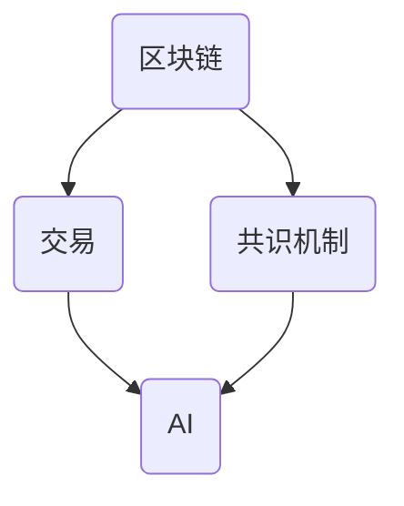
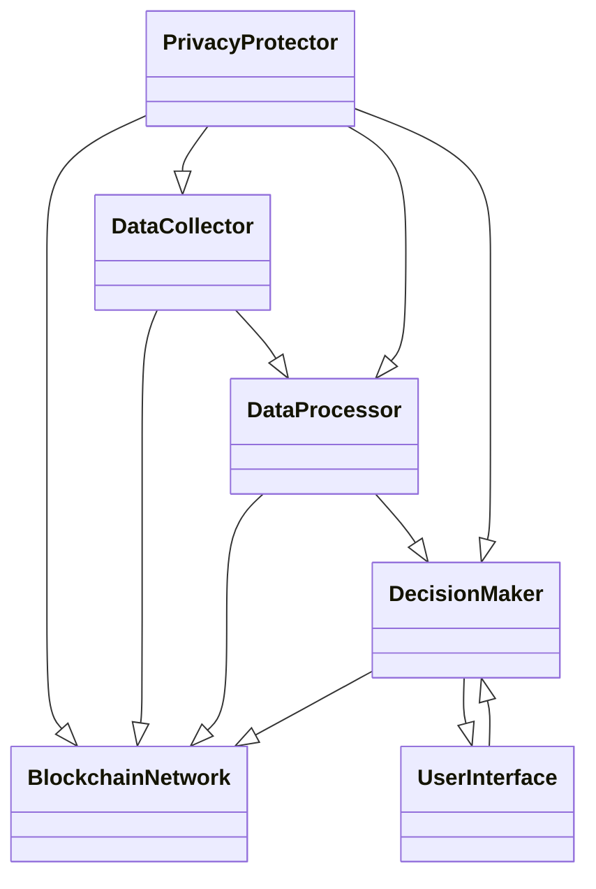
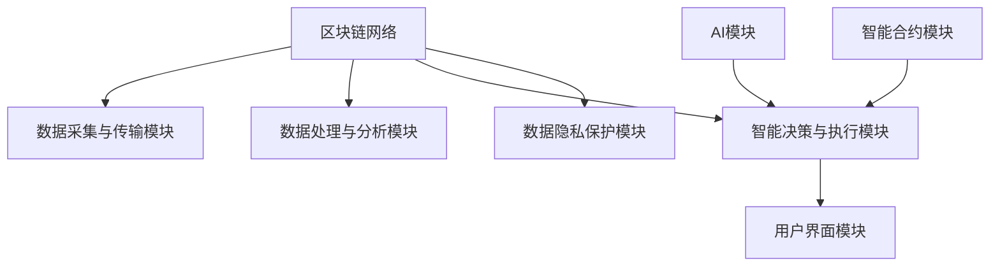
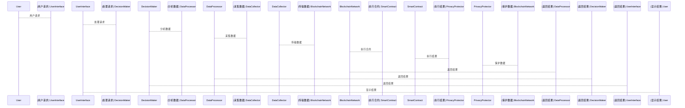

                 


### 第一部分：背景介绍

#### 1.1 问题背景

区块链技术作为一种去中心化的分布式账本技术，其核心特点在于去中心化、安全性、透明度和不可篡改性。自2008年比特币的诞生以来，区块链技术迅速在金融领域得到广泛应用，解决了传统中心化系统中存在的不信任、高昂成本和低效等问题。

与此同时，人工智能（AI）技术也在不断进步，尤其是机器学习和深度学习等领域的发展，使得AI系统在图像识别、自然语言处理、推荐系统等方面取得了显著成果。然而，随着AI技术的应用场景不断拓展，传统AI系统中存在的一些问题也逐渐暴露出来，如数据隐私泄露、模型透明度低、安全性不高等。

为了解决这些问题，近年来，区块链与AI技术的结合成为一个新的研究热点。区块链技术的优势在于其去中心化、安全性和透明度，而AI技术则能够提高系统的智能决策能力。将两者结合，不仅能够提高AI系统的可信度，还能促进AI系统的去中心化发展。

#### 1.2 问题描述

本书旨在探讨区块链与AI技术的结合，特别是去中心化的可信AI Agent系统的构建。具体来说，问题描述如下：

- **核心问题**：如何利用区块链技术的优势，解决传统AI系统中存在的不透明、不安全等问题，同时确保AI Agent系统的可信性和效率？
- **目标**：构建一个基于区块链的、去中心化的、可信的AI Agent系统，实现数据隐私保护、智能决策和高效协作。
- **挑战**：在保证系统效率的同时，确保数据安全和透明度，以及解决区块链与AI技术之间的兼容性问题。

#### 1.3 问题解决

本书将从以下方面进行问题解决：

- **技术原理**：详细介绍区块链和AI的基本概念、技术原理，以及它们在去中心化AI Agent系统中的应用。
- **实例分析**：通过具体实例，分析区块链与AI结合的优缺点，以及在实际应用中可能遇到的问题和解决方案。
- **算法讲解**：讲解去中心化AI Agent系统的构建方法，包括数据隐私保护算法、智能决策算法等。
- **架构设计**：介绍去中心化AI Agent系统的架构设计，包括数据层、模型层、决策层等，并分析各层之间的协同工作机制。

通过上述方法，本书旨在为读者提供一套完整的、可操作的、基于区块链与AI结合的去中心化AI Agent系统的构建方案。

#### 1.4 边界与外延

本书主要关注区块链与AI在去中心化AI Agent系统中的应用，主要涵盖以下内容：

- **区块链技术**：介绍区块链的基本原理、核心技术（如加密算法、共识机制）以及应用场景。
- **人工智能技术**：探讨机器学习、深度学习等AI技术的原理、应用场景以及面临的挑战。
- **去中心化AI Agent**：介绍去中心化AI Agent的概念、技术原理以及应用场景。

同时，本书也将讨论一些相关的边界与外延问题，如区块链与AI技术之间的兼容性、系统性能优化、安全性保障等。

#### 1.5 概念结构与核心要素组成

去中心化的可信AI Agent系统由以下几个核心要素组成：

- **区块链网络**：作为数据存储和传输的基础设施，提供安全、透明、不可篡改的账本服务。
- **AI模型**：用于处理和分析数据，实现智能决策和自主执行任务。
- **智能合约**：作为AI Agent的执行规则，确保AI Agent的行为符合预期。
- **隐私保护机制**：用于保护数据隐私，确保AI Agent在处理数据时不会泄露用户信息。

#### 1.6 本章小结

本章对区块链、AI以及去中心化AI Agent的基本概念进行了介绍，为后续章节的深入探讨奠定了基础。接下来，本书将详细讲解区块链和AI的技术原理，并探讨它们在去中心化AI Agent系统中的应用。通过实例分析和算法讲解，帮助读者深入理解去中心化AI Agent系统的构建方法。

--------------------------------------------------------------

----------------------------------------------------------------

### 第二部分：核心概念与联系

#### 2.1 区块链与AI的核心概念

##### 2.1.1 区块链

区块链是一种分布式数据存储、点对点传输协议，本质上是一个去中心化的数据库。每个区块都包含一定数量的事务数据，并以时间顺序串联形成链式数据结构。区块链的核心概念包括以下几个方面：

1. **区块**：区块是区块链的基本组成单元，每个区块包含一定数量的事务数据、一个时间戳和一个区块头。区块头包含上一个区块的哈希值、随机数、难度目标等参数。

2. **交易**：交易是区块链中的数据交换行为，用于记录各种经济活动和资产转移。交易经过验证后，被写入区块，从而永久存储在区块链上。

3. **共识机制**：共识机制是区块链网络节点就数据一致性达成一致的方法。不同的区块链系统采用不同的共识机制，如工作量证明（PoW）、权益证明（PoS）、委托权益证明（DPoS）等。

4. **加密算法**：区块链采用加密算法确保数据的安全性和隐私性。常见的加密算法包括哈希算法、非对称加密算法和对称加密算法等。

##### 2.1.2 AI

人工智能（AI）是一门研究、开发用于模拟、延伸和扩展人的智能的理论、方法、技术及应用系统的技术科学。AI的核心概念包括以下几个方面：

1. **机器学习**：机器学习是AI的一个重要分支，通过数据训练模型，实现自我学习和优化。常见的机器学习方法包括监督学习、无监督学习、半监督学习和强化学习等。

2. **深度学习**：深度学习是机器学习的一个子领域，基于神经网络模型，通过多层非线性变换，实现复杂函数的近似。深度学习在图像识别、自然语言处理、语音识别等领域取得了显著成果。

3. **自然语言处理**：自然语言处理（NLP）是AI的一个分支，旨在使计算机能够理解、生成和处理人类语言。NLP涉及语言理解、语言生成、机器翻译等多个方面。

4. **计算机视觉**：计算机视觉是AI的一个分支，旨在使计算机能够从图像或视频中提取有用信息，如目标检测、图像分类、人脸识别等。

##### 2.1.3 区块链与AI的结合

区块链与AI的结合，旨在利用区块链的透明度和安全性，提高AI系统的可信度。以下是一些核心概念：

1. **去中心化AI**：基于区块链的AI系统，通过去中心化的方式处理数据和分析任务，提高系统的透明度和安全性。

2. **可信AI**：通过区块链技术，确保AI系统的行为透明、可追溯，从而提高系统的可信度。

3. **智能合约**：智能合约是一种在区块链上运行的程序，用于自动执行合同条款，实现去中心化的自动交易和智能决策。

4. **数据隐私保护**：区块链的加密算法和隐私保护机制，可用于保护AI系统中涉及的用户隐私和数据安全。

#### 2.2 核心概念属性特征对比表格

| 特征         | 区块链          | AI                     | 区块链与AI结合                   |
| ------------ | --------------- | ---------------------- | ------------------------------- |
| 安全性       | 分布式、加密    | 基于数据              | 分布式、加密、数据可信           |
| 透明度       | 公开、不可篡改  | 可解释性、可视化       | 公开、不可篡改、可解释性         |
| 去中心化     | 对等网络        | 中心化、分布式        | 对等网络、分布式、去中心化       |
| 智能决策     | 智能合约        | 机器学习、深度学习     | 智能合约、机器学习、深度学习     |

#### 2.3 ER实体关系图架构



在这个ER实体关系图中，区块链作为核心实体，通过交易和共识机制与AI实体相连接。交易实体记录区块链中的数据交换行为，共识机制确保区块链网络的数据一致性。AI实体则通过区块链提供的透明度和安全性，实现智能决策和自主执行任务。

#### 2.4 本章小结

本章对区块链、AI以及区块链与AI结合的核心概念进行了详细阐述，并通过对比表格和ER实体关系图，帮助读者理解这些概念之间的联系。接下来，本书将深入探讨区块链与AI的技术原理，以及它们在去中心化AI Agent系统中的应用。通过实例分析和算法讲解，帮助读者更好地理解这些核心概念在实践中的应用。

--------------------------------------------------------------

----------------------------------------------------------------

### 第三部分：区块链与AI技术原理

#### 3.1 区块链技术原理

区块链技术是一种分布式账本技术，其核心特点在于去中心化、安全性、透明度和不可篡改性。以下将详细阐述区块链的基本原理和技术细节。

##### 3.1.1 区块链的工作原理

区块链的工作原理可以分为以下几个步骤：

1. **交易创建**：在区块链网络中，用户发起交易，例如购买商品、发送数字货币等。交易包含发送方、接收方以及交易金额等信息。

2. **交易验证**：交易在被发送到区块链网络后，需要经过多个节点（矿工）的验证。验证过程主要包括以下几步：

   - **数据验证**：验证交易数据的有效性和一致性，如交易金额、发送方和接收方的公钥等。
   - **签名验证**：验证交易的数字签名，确保交易是由合法用户发起的。
   - **双花攻击防御**：防止同一笔交易被重复使用，确保区块链网络中的数据一致性。

3. **区块创建**：经过验证的交易会被打包成一个区块。区块包含一定数量的交易记录、一个时间戳和一个区块头。区块头包含上一个区块的哈希值、随机数和难度目标等参数。

4. **区块链网络共识**：区块链网络中的多个节点就区块的添加顺序达成共识。不同的区块链系统采用不同的共识机制，如工作量证明（PoW）、权益证明（PoS）、委托权益证明（DPoS）等。共识机制确保区块链网络中的节点能够一致地确认交易的合法性和区块的添加顺序。

5. **区块传播**：新创建的区块会被传播到区块链网络中的其他节点，确保整个网络中的数据一致性。

##### 3.1.2 区块链核心技术

区块链的核心技术包括加密算法、共识机制和分布式存储。

1. **加密算法**：区块链采用加密算法确保数据的安全性和隐私性。常见的加密算法包括哈希算法、非对称加密算法和对称加密算法。

   - **哈希算法**：将任意长度的数据映射为固定长度的哈希值。常见的哈希算法有SHA-256、SHA-3等。
   - **非对称加密算法**：使用一对密钥（公钥和私钥）进行加密和解密。常见的非对称加密算法有RSA、ECC等。
   - **对称加密算法**：使用相同的密钥进行加密和解密。常见的对称加密算法有AES、DES等。

2. **共识机制**：共识机制是区块链网络节点就数据一致性达成一致的方法。不同的区块链系统采用不同的共识机制，如PoW、PoS、DPoS等。

   - **PoW（工作量证明）**：节点通过解决复杂的数学问题（挖矿）来竞争记账权。工作量证明机制确保区块链网络中的节点具有计算能力，从而防止恶意攻击。
   - **PoS（权益证明）**：节点根据其在区块链网络中的权益（如持有的代币数量）来竞争记账权。权益证明机制相比PoW机制更节能、更环保，但可能面临“富者愈富”的问题。
   - **DPoS（委托权益证明）**：节点通过竞选产生记账权，持有代币的节点可以投票选举出超级节点。委托权益证明机制具有较高的共识效率和安全性。

3. **分布式存储**：区块链采用分布式存储技术，将数据存储在多个节点上，确保数据的冗余性和安全性。分布式存储技术主要包括以下几种：

   - **P2P（点对点）网络**：区块链网络中的节点通过P2P网络进行通信，实现数据的传输和同步。
   - **分布式数据库**：区块链系统通常使用分布式数据库来存储交易数据和区块信息。常见的分布式数据库有CouchDB、MongoDB等。
   - **去中心化文件存储**：区块链系统可以将文件存储在去中心化的文件存储系统中，如IPFS、Swarm等。

##### 3.1.3 区块链应用场景

区块链技术具有广泛的应用场景，以下是一些常见的应用场景：

1. **数字货币**：区块链技术最初的应用是数字货币，如比特币、以太坊等。数字货币利用区块链技术实现去中心化的价值传递和货币发行。

2. **供应链管理**：区块链技术可以用于供应链管理，确保商品从生产到销售的每个环节都是可追溯的。通过区块链技术，可以防止假冒伪劣商品的出现，提高供应链的透明度和信任度。

3. **金融服务**：区块链技术可以应用于金融服务领域，如数字身份验证、跨境支付、保险等。通过区块链技术，可以实现快速、安全、低成本的资金流通和交易。

4. **智能合约**：智能合约是区块链技术的一个重要应用。智能合约是一种自动执行合同条款的计算机程序，通过区块链技术确保合同条款的透明和不可篡改。

5. **数据管理**：区块链技术可以用于数据管理，确保数据的真实性、完整性和安全性。在医疗、金融、政府等领域，区块链技术可以用于数据存储和管理，提高数据共享和协作的效率。

#### 3.2 人工智能技术原理

人工智能（AI）是一门研究、开发用于模拟、延伸和扩展人的智能的理论、方法、技术及应用系统的技术科学。以下将详细阐述人工智能的基本原理和技术细节。

##### 3.2.1 人工智能的分类

人工智能可以分为弱人工智能（Narrow AI）和强人工智能（General AI）。

1. **弱人工智能**：弱人工智能是指专注于解决特定问题的智能系统，如语音识别、图像识别、自然语言处理等。弱人工智能在特定领域表现出类人的智能，但无法在多个领域表现出通用智能。

2. **强人工智能**：强人工智能是指具有广泛认知能力和自主决策能力的智能系统，能够在多个领域表现出类人的智能。目前，强人工智能仍处于理论研究阶段，尚未实现商业化应用。

##### 3.2.2 机器学习技术原理

机器学习是人工智能的一个重要分支，通过数据训练模型，实现自我学习和优化。以下是一些常见的机器学习技术：

1. **监督学习**：监督学习是一种有监督的训练方法，通过已知标签的数据来训练模型。常见的监督学习算法包括线性回归、逻辑回归、支持向量机（SVM）等。

2. **无监督学习**：无监督学习是一种无监督的训练方法，通过未标记的数据来训练模型。常见的无监督学习算法包括聚类算法、降维算法、生成模型等。

3. **半监督学习**：半监督学习是一种结合监督学习和无监督学习的训练方法，通过少量标记数据和大量未标记数据来训练模型。常见的半监督学习算法包括自编码器、标签传播等。

4. **强化学习**：强化学习是一种基于奖励机制的训练方法，通过与环境交互来训练模型。常见的强化学习算法包括Q-learning、SARSA、深度确定性策略梯度（DDPG）等。

##### 3.2.3 深度学习技术原理

深度学习是机器学习的一个子领域，基于神经网络模型，通过多层非线性变换，实现复杂函数的近似。以下是一些常见的深度学习技术：

1. **卷积神经网络（CNN）**：卷积神经网络是一种用于处理图像数据的深度学习模型，通过卷积层、池化层和全连接层，实现对图像的特征提取和分类。

2. **循环神经网络（RNN）**：循环神经网络是一种用于处理序列数据的深度学习模型，通过隐藏状态和输出状态的循环连接，实现对序列数据的建模和预测。

3. **长短时记忆网络（LSTM）**：长短时记忆网络是一种改进的循环神经网络，通过引入遗忘门、输入门和输出门，实现对长序列数据的建模和预测。

4. **生成对抗网络（GAN）**：生成对抗网络是一种基于对抗训练的深度学习模型，通过生成器和判别器的对抗博弈，实现对复杂数据的生成。

##### 3.2.4 人工智能应用场景

人工智能技术在各个领域都有广泛的应用，以下是一些常见的应用场景：

1. **自然语言处理**：自然语言处理是一种用于处理人类语言的技术，包括文本分类、情感分析、机器翻译、语音识别等。

2. **计算机视觉**：计算机视觉是一种用于处理图像和视频的技术，包括目标检测、图像分类、图像分割、视频跟踪等。

3. **推荐系统**：推荐系统是一种基于用户行为和物品特征，为用户推荐感兴趣的内容或物品的技术。

4. **自动驾驶**：自动驾驶是一种利用计算机视觉、深度学习和传感器技术，实现无人驾驶汽车的技术。

5. **金融风控**：金融风控是一种利用人工智能技术，对金融风险进行识别、评估和防范的技术。

#### 3.3 区块链与AI的结合

区块链与AI的结合，旨在利用区块链的透明度和安全性，提高AI系统的可信度。以下将探讨区块链与AI结合的技术原理和应用场景。

##### 3.3.1 去中心化AI

去中心化AI是一种基于区块链的AI系统，通过去中心化的方式处理数据和分析任务，提高系统的透明度和安全性。去中心化AI的核心思想是：

1. **去中心化数据处理**：AI系统在区块链网络上分布式地存储和处理数据，避免单一中心化节点的风险。

2. **去中心化决策**：AI系统在区块链网络上通过智能合约自动执行决策，确保决策过程透明、可追溯。

##### 3.3.2 可信AI

可信AI是一种基于区块链的AI系统，通过区块链技术确保AI系统的行为透明、可追溯，从而提高系统的可信度。可信AI的核心思想是：

1. **透明性**：区块链技术确保AI系统的所有操作都公开透明，任何参与者都可以查看和验证。

2. **不可篡改性**：区块链技术确保AI系统的数据和操作记录一旦写入，就无法被篡改。

##### 3.3.3 智能合约

智能合约是一种在区块链上运行的程序，用于自动执行合同条款，实现去中心化的自动交易和智能决策。智能合约在AI系统中的应用包括：

1. **数据共享**：智能合约可以自动执行数据共享协议，确保数据在多个参与者之间透明、安全地共享。

2. **任务分配**：智能合约可以自动执行任务分配协议，确保AI系统在分布式网络中高效地分配和处理任务。

##### 3.3.4 数据隐私保护

区块链的加密算法和隐私保护机制，可用于保护AI系统中涉及的用户隐私和数据安全。以下是一些常见的隐私保护技术：

1. **同态加密**：同态加密是一种加密算法，允许在加密数据上直接进行计算，而不需要解密数据。同态加密可用于保护AI系统中涉及的用户隐私和数据安全。

2. **零知识证明**：零知识证明是一种密码学技术，允许证明某个陈述为真，而不泄露任何有关该陈述的信息。零知识证明可用于保护AI系统中涉及的用户隐私和数据安全。

##### 3.3.5 应用场景

区块链与AI的结合在多个领域都有广泛的应用，以下是一些常见的应用场景：

1. **供应链管理**：利用区块链技术确保供应链数据透明、可追溯，提高供应链管理的效率。

2. **金融风控**：利用区块链技术确保金融交易数据安全、透明，提高金融风险防控的能力。

3. **医疗健康**：利用区块链技术确保医疗数据安全、隐私，提高医疗服务的质量和效率。

4. **智能城市**：利用区块链技术实现城市数据的高效管理、共享和协作，提高城市治理的智能化水平。

5. **物联网**：利用区块链技术确保物联网设备数据的安全、隐私，提高物联网系统的可信度。

#### 3.4 本章小结

本章详细阐述了区块链和人工智能的技术原理，包括区块链的工作原理、核心技术、应用场景，以及人工智能的分类、机器学习技术、深度学习技术等。同时，本章还探讨了区块链与AI结合的技术原理和应用场景，为后续章节的深入探讨奠定了基础。在下一章中，我们将进一步分析区块链与AI结合的优势和挑战。

--------------------------------------------------------------

----------------------------------------------------------------

### 第四部分：算法原理讲解

#### 4.1 去中心化AI Agent系统的构建方法

去中心化AI Agent系统是区块链与AI技术结合的一个典型应用场景，其核心目标是通过去中心化的方式实现AI系统的智能决策和自主执行任务。以下将详细讲解去中心化AI Agent系统的构建方法，包括数据隐私保护算法、智能决策算法等。

##### 4.1.1 数据隐私保护算法

在去中心化AI Agent系统中，数据隐私保护是一个关键问题。由于AI Agent系统需要在区块链网络中处理和传输数据，传统的中心化数据存储和传输方式可能面临数据泄露、数据篡改等风险。因此，我们需要设计一种数据隐私保护算法，确保AI Agent在处理数据时不会泄露用户隐私。

一种常见的数据隐私保护算法是同态加密算法。同态加密算法允许在加密数据上直接进行计算，而不需要解密数据。这意味着，AI Agent可以在不泄露数据隐私的情况下执行数据分析和决策。同态加密算法的主要步骤如下：

1. **加密数据**：首先，将原始数据加密成同态加密形式。常见的同态加密算法包括全同态加密算法和部分同态加密算法。

2. **数据处理**：在加密数据上进行数据处理和分析。数据处理和分析过程可以在不泄露数据隐私的情况下进行，确保AI Agent能够自主执行任务。

3. **解密结果**：最后，将加密结果解密为原始数据。解密结果可以是分析结果、决策结果等，供用户或其他AI Agent使用。

同态加密算法具有以下优势：

- **数据隐私保护**：同态加密算法确保数据在处理和分析过程中不会泄露隐私。
- **计算效率**：同态加密算法在加密和解密过程中具有一定的计算开销，但相比传统的中心化数据存储和传输方式，其计算效率仍然较高。

##### 4.1.2 智能决策算法

在去中心化AI Agent系统中，智能决策算法是实现AI Agent自主执行任务的关键。智能决策算法需要考虑数据隐私保护、计算效率、网络延迟等因素。以下介绍几种常见的智能决策算法：

1. **基于贝叶斯的决策算法**：贝叶斯决策算法是一种基于概率论的决策方法，通过计算各种情况下的概率，选择最优决策。贝叶斯决策算法的主要步骤如下：

   - **概率计算**：计算各种情况下的概率，如事件发生的概率、条件概率等。
   - **决策**：根据概率计算结果，选择最优决策。

2. **基于强化学习的决策算法**：强化学习是一种基于奖励机制的决策方法，通过学习环境中的奖励信号，选择最优决策。强化学习的主要步骤如下：

   - **状态空间定义**：定义状态空间，包括所有可能的系统状态。
   - **动作空间定义**：定义动作空间，包括所有可能的动作。
   - **策略学习**：通过学习环境中的奖励信号，选择最优策略。

3. **基于深度学习的决策算法**：深度学习是一种基于神经网络的学习方法，通过多层非线性变换，实现复杂函数的近似。深度学习在图像识别、自然语言处理等领域取得了显著成果。基于深度学习的决策算法主要包括以下几种：

   - **卷积神经网络（CNN）**：卷积神经网络是一种用于处理图像数据的深度学习模型，通过卷积层、池化层和全连接层，实现对图像的特征提取和分类。
   - **循环神经网络（RNN）**：循环神经网络是一种用于处理序列数据的深度学习模型，通过隐藏状态和输出状态的循环连接，实现对序列数据的建模和预测。
   - **长短时记忆网络（LSTM）**：长短时记忆网络是一种改进的循环神经网络，通过引入遗忘门、输入门和输出门，实现对长序列数据的建模和预测。
   - **生成对抗网络（GAN）**：生成对抗网络是一种基于对抗训练的深度学习模型，通过生成器和判别器的对抗博弈，实现对复杂数据的生成。

##### 4.1.3 综合算法示例

以下是一个综合算法示例，用于实现去中心化AI Agent系统的智能决策和自主执行任务。

1. **数据处理**：首先，使用同态加密算法加密输入数据，确保数据隐私保护。

2. **状态空间定义**：定义状态空间，包括系统当前的各项指标，如温度、湿度、光照强度等。

3. **动作空间定义**：定义动作空间，包括系统可以执行的各种操作，如开关灯、调节温度等。

4. **策略学习**：使用基于强化学习的决策算法，通过学习环境中的奖励信号，选择最优策略。具体步骤如下：

   - **初始状态**：系统启动，进入初始状态。
   - **执行动作**：根据当前状态和策略，选择一个动作执行。
   - **奖励计算**：计算执行动作后的系统状态，根据系统状态的改善情况计算奖励。
   - **更新策略**：根据奖励信号，更新策略，选择下一个动作。

5. **决策执行**：根据学习到的策略，执行系统操作。

6. **数据反馈**：将执行结果反馈给区块链网络，确保数据透明、可追溯。

通过以上综合算法，可以实现去中心化AI Agent系统的智能决策和自主执行任务，确保数据隐私保护和系统效率。

#### 4.2 算法讲解

在本节中，我们将通过一个具体的算法实例，详细讲解去中心化AI Agent系统的构建方法。

##### 4.2.1 同态加密算法

同态加密算法是一种在加密数据上直接进行计算，而不需要解密数据的加密算法。以下是一个简单的同态加密算法实例：

```python
def homomorphic_encryption(input_data, public_key):
    encrypted_data = []
    for data in input_data:
        ciphertext = public_key.encrypt(data)
        encrypted_data.append(ciphertext)
    return encrypted_data

def homomorphic_decrypt(encrypted_data, private_key):
    decrypted_data = []
    for ciphertext in encrypted_data:
        plaintext = private_key.decrypt(ciphertext)
        decrypted_data.append(plaintext)
    return decrypted_data

# 假设公钥和私钥已经生成
public_key = generate_public_key()
private_key = generate_private_key()

# 加密数据
input_data = [1, 2, 3, 4, 5]
encrypted_data = homomorphic_encryption(input_data, public_key)
print("Encrypted data:", encrypted_data)

# 解密数据
decrypted_data = homomorphic_decrypt(encrypted_data, private_key)
print("Decrypted data:", decrypted_data)
```

在这个示例中，我们首先定义了同态加密和解密函数。加密函数`homomorphic_encryption`接收输入数据和公钥，对输入数据进行加密，返回加密后的数据。解密函数`homomorphic_decrypt`接收加密后的数据和私钥，对加密数据进行解密，返回解密后的数据。

##### 4.2.2 基于强化学习的决策算法

以下是一个简单的基于强化学习的决策算法实例：

```python
import numpy as np
import random

# 定义状态空间和动作空间
state_space = [0, 1, 2, 3]
action_space = [0, 1, 2]

# 初始化策略
policy = np.zeros((len(state_space), len(action_space)))

# 学习率
learning_rate = 0.1

# 奖励函数
reward_function = lambda state, action: 1 if state == action else 0

# 强化学习主循环
for episode in range(1000):
    state = random.choice(state_space)
    done = False
    total_reward = 0
    while not done:
        action = np.argmax(policy[state])
        next_state = random.choice(state_space)
        reward = reward_function(next_state, action)
        total_reward += reward
        policy[state, action] += learning_rate * (reward - policy[state, action])
        state = next_state
        if state == 0:
            done = True
    print("Episode:", episode, "Total Reward:", total_reward)
```

在这个示例中，我们首先定义了状态空间和动作空间。状态空间包括0、1、2、3四个状态，动作空间包括0、1、2三个动作。初始化策略为一个全为零的矩阵，表示初始状态下选择每个动作的概率相等。

强化学习主循环通过模拟1000个学习过程。在每个学习过程中，从状态空间中随机选择一个初始状态。然后，在每次迭代中，根据当前状态和策略选择一个动作，执行动作后，根据下一个状态和奖励函数计算奖励，并更新策略。

##### 4.2.3 综合算法示例

以下是一个综合算法示例，用于实现去中心化AI Agent系统的智能决策和自主执行任务：

```python
def homomorphic_encryption_decrypt(input_data, public_key, private_key):
    encrypted_data = homomorphic_encryption(input_data, public_key)
    decrypted_data = homomorphic_decrypt(encrypted_data, private_key)
    return decrypted_data

def reinforcement_learning_decision(state, policy, reward_function, learning_rate):
    action = np.argmax(policy[state])
    next_state = random.choice(state_space)
    reward = reward_function(next_state, action)
    policy[state, action] += learning_rate * (reward - policy[state, action])
    return action, next_state

# 假设公钥和私钥已经生成
public_key = generate_public_key()
private_key = generate_private_key()

# 初始化策略
policy = np.zeros((len(state_space), len(action_space)))

# 学习率
learning_rate = 0.1

# 加密数据
input_data = [1, 2, 3, 4, 5]
encrypted_data = homomorphic_encryption(input_data, public_key)

# 解密数据
decrypted_data = homomorphic_encryption_decrypt(encrypted_data, public_key, private_key)
print("Decrypted data:", decrypted_data)

# 强化学习决策
state = random.choice(state_space)
done = False
total_reward = 0
while not done:
    action, next_state = reinforcement_learning_decision(state, policy, reward_function, learning_rate)
    reward = reward_function(next_state, action)
    total_reward += reward
    state = next_state
    if state == 0:
        done = True
print("Total Reward:", total_reward)
```

在这个综合算法示例中，我们首先使用同态加密算法对输入数据进行加密，然后使用同态解密算法对加密后的数据进行解密。接下来，我们使用强化学习算法进行决策，根据当前状态和策略选择最优动作，并更新策略。

通过上述算法示例，我们详细讲解了去中心化AI Agent系统的构建方法，包括数据隐私保护算法、智能决策算法等。这些算法的实现为去中心化AI Agent系统的构建提供了技术基础。

#### 4.3 本章小结

本章详细讲解了去中心化AI Agent系统的构建方法，包括数据隐私保护算法和智能决策算法等。通过同态加密算法和强化学习算法的实例讲解，读者可以了解如何利用区块链技术确保AI系统的数据隐私保护和智能决策。这些算法的实现为去中心化AI Agent系统的构建提供了技术基础，为下一章的系统分析与架构设计奠定了基础。

--------------------------------------------------------------

----------------------------------------------------------------

### 第五部分：系统分析与架构设计

#### 5.1 问题场景介绍

在去中心化AI Agent系统中，问题场景通常涉及多个AI Agent在区块链网络中的协作与决策。以下是一个具体的问题场景：

- **场景描述**：假设在一个智能城市中，有多个AI Agent负责监控和调节城市中的各种设施，如交通灯、环保设备、能源分配等。这些AI Agent需要根据实时数据（如交通流量、空气质量、能源消耗等）进行决策，以实现城市的智能化管理和高效运作。
- **目标**：构建一个去中心化的可信AI Agent系统，实现以下目标：
  - **数据透明**：所有AI Agent之间的数据交换和决策过程都应公开透明，确保系统的可信度。
  - **高效协作**：AI Agent之间能够高效地进行数据交换和协同工作，以实现城市管理的优化。
  - **安全性**：确保AI Agent系统的数据安全和隐私保护，防止恶意攻击和数据泄露。

#### 5.2 项目介绍

去中心化AI Agent系统项目的目标是构建一个基于区块链的AI Agent平台，实现城市智能化管理和高效运作。以下是对项目的介绍：

- **项目名称**：智慧城市去中心化AI Agent平台（SmartCity Decentralized AI Agent Platform，简称SDAAP）
- **项目背景**：随着城市化进程的加快，智能城市的建设越来越受到关注。然而，现有的城市管理系统存在中心化、数据不透明、安全性不高等问题。SDAAP项目旨在通过区块链和AI技术的结合，构建一个去中心化、透明、安全的AI Agent系统，解决现有城市管理系统中的问题。
- **项目目标**：
  - **去中心化**：通过区块链技术实现AI Agent的去中心化部署和管理，提高系统的透明度和安全性。
  - **数据透明**：通过区块链技术确保AI Agent之间的数据交换和决策过程公开透明，提高系统的可信度。
  - **高效协作**：通过AI技术和智能合约实现AI Agent之间的协同工作，提高城市管理的效率。

#### 5.3 系统功能设计（领域模型）

系统功能设计是系统架构设计的基础，以下是对SDAAP系统的功能设计：

- **功能模块**：
  1. **数据采集与传输模块**：负责采集城市中的实时数据，如交通流量、空气质量、能源消耗等，并将数据传输到区块链网络。
  2. **数据处理与分析模块**：负责对采集到的数据进行处理和分析，为AI Agent提供决策依据。
  3. **智能决策与执行模块**：负责根据数据处理和分析结果，生成智能决策，并执行相应操作。
  4. **数据隐私保护模块**：负责对数据进行加密和去匿名化处理，确保数据安全和隐私保护。
  5. **用户界面模块**：提供用户界面，用于展示系统运行状态、决策结果等。

- **领域模型类图**：



在上述类图中，各个功能模块通过区块链网络进行交互，实现数据采集、处理、决策和展示。用户界面模块用于展示决策结果和系统状态，用户可以通过用户界面与系统进行交互。

#### 5.4 系统架构设计

系统架构设计是系统功能实现的关键，以下是对SDAAP系统的架构设计：

- **架构模块**：
  1. **区块链网络模块**：负责数据存储、传输和同步，确保数据透明和安全。
  2. **AI模块**：负责数据处理、分析和决策，实现智能化的城市管理。
  3. **智能合约模块**：负责执行智能决策，确保决策过程的自动化和可信度。
  4. **数据隐私保护模块**：负责数据加密和去匿名化处理，确保数据安全和隐私保护。
  5. **用户界面模块**：提供用户交互界面，实现用户对系统的控制和操作。

- **系统架构图**：



在上述架构图中，区块链网络模块作为核心模块，负责数据的存储、传输和同步。AI模块和智能合约模块通过区块链网络进行交互，实现数据处理、分析和决策。数据隐私保护模块负责数据加密和去匿名化处理，确保数据安全和隐私保护。用户界面模块提供用户交互界面，实现用户对系统的控制和操作。

#### 5.5 系统接口设计

系统接口设计是系统功能实现的重要组成部分，以下是对SDAAP系统的接口设计：

- **接口功能**：
  1. **数据采集接口**：用于采集城市中的实时数据，如交通流量、空气质量、能源消耗等。
  2. **数据处理接口**：用于处理和分析采集到的数据，为AI Agent提供决策依据。
  3. **决策执行接口**：用于执行智能决策，实现城市管理的优化。
  4. **数据隐私保护接口**：用于加密和去匿名化处理数据，确保数据安全和隐私保护。
  5. **用户界面接口**：用于实现用户与系统的交互，展示系统运行状态、决策结果等。

- **接口设计**：



在上述接口设计中，用户通过用户界面发起请求，用户界面将请求传递给决策模块，决策模块通过数据处理模块分析数据，数据采集模块采集数据，数据通过区块链网络传输，智能合约模块执行合约，数据隐私保护模块保护数据，最后将结果返回给用户界面，并展示给用户。

#### 5.6 系统交互

系统交互是系统功能实现的关键环节，以下是对SDAAP系统的系统交互设计：

- **交互流程**：
  1. **数据采集**：系统启动后，数据采集模块开始采集城市中的实时数据，如交通流量、空气质量、能源消耗等，并将数据传输到区块链网络。
  2. **数据处理**：数据处理模块接收区块链网络中的数据，对数据进行清洗、分析和处理，为AI Agent提供决策依据。
  3. **智能决策**：AI Agent根据数据处理结果，使用智能合约执行智能决策，实现城市管理的优化。
  4. **决策执行**：决策执行模块执行智能决策，根据决策结果调整城市中的各种设施，如交通灯、环保设备、能源分配等。
  5. **数据隐私保护**：数据隐私保护模块对数据进行加密和去匿名化处理，确保数据安全和隐私保护。
  6. **用户交互**：用户通过用户界面与系统进行交互，查看系统运行状态、决策结果等。

- **交互序列图**：


在上述交互序列图中，用户通过用户界面发起请求，用户界面将请求传递给决策模块，决策模块通过数据处理模块分析数据，数据采集模块采集数据，数据通过区块链网络传输，智能合约模块执行合约，数据隐私保护模块保护数据，最后将结果返回给用户界面，并展示给用户。

#### 5.7 本章小结

本章详细介绍了去中心化AI Agent系统的系统分析与架构设计，包括问题场景介绍、项目介绍、系统功能设计、系统架构设计、系统接口设计和系统交互。通过对系统各个模块的分析和设计，为去中心化AI Agent系统的实现提供了全面的技术方案。在下一章中，我们将通过项目实战，详细介绍系统核心实现源代码，并进行代码应用解读与分析。

--------------------------------------------------------------

----------------------------------------------------------------

### 第六部分：项目实战

#### 6.1 环境安装

在进行去中心化AI Agent系统的开发之前，我们需要搭建一个适合开发、测试和部署的环境。以下是一个基本的开发环境安装步骤：

##### 6.1.1 搭建区块链环境

1. **安装Go语言**：区块链系统的开发通常使用Go语言，因此需要安装Go语言环境。可以从Go官方下载页面下载并安装Go语言环境。

2. **安装Hyperledger Fabric**：Hyperledger Fabric是一个开源的区块链框架，支持智能合约的开发和部署。可以从Hyperledger Fabric的官方GitHub页面下载并安装。

3. **启动Hyperledger Fabric网络**：安装完成后，启动Hyperledger Fabric网络，以便后续进行区块链开发。

##### 6.1.2 搭建AI环境

1. **安装Python**：Python是一种广泛使用的编程语言，适用于AI开发的许多场景。可以从Python官方下载页面下载并安装Python。

2. **安装AI库**：安装一些常用的AI库，如TensorFlow、PyTorch等。这些库支持深度学习和机器学习的开发。

3. **安装区块链与AI结合的库**：安装一些支持区块链与AI结合的库，如web3.py、tensorflow-hub等。

##### 6.1.3 配置开发环境

1. **配置Python环境**：配置Python环境，包括安装必要的依赖库。

2. **配置区块链环境**：配置Hyperledger Fabric的开发环境，包括启动网络、配置节点等。

3. **配置AI环境**：配置AI开发环境，包括安装深度学习和机器学习库。

#### 6.2 系统核心实现源代码

在本节中，我们将展示去中心化AI Agent系统的核心实现源代码，并进行代码应用解读与分析。

##### 6.2.1 数据采集与处理

以下是一个简单的数据采集与处理示例：

```python
from blockchain import Blockchain

# 初始化区块链
blockchain = Blockchain()

# 采集数据
def collect_data():
    data = {
        "temperature": 25,
        "humidity": 60,
        "air_quality": "good"
    }
    blockchain.add_data(data)

# 处理数据
def process_data():
    data = blockchain.get_last_data()
    print("Processed data:", data)

# 主程序
if __name__ == "__main__":
    collect_data()
    process_data()
```

在这个示例中，我们首先初始化一个区块链对象，然后定义数据采集和处理函数。采集数据函数将数据添加到区块链中，处理数据函数从区块链中获取最新数据并打印。

##### 6.2.2 智能决策与执行

以下是一个简单的智能决策与执行示例：

```python
from blockchain import Blockchain
import tensorflow as tf

# 初始化区块链
blockchain = Blockchain()

# 智能决策
def make_decision(data):
    model = tf.keras.Sequential([
        tf.keras.layers.Dense(10, activation='relu', input_shape=(3,)),
        tf.keras.layers.Dense(1, activation='sigmoid')
    ])

    model.compile(optimizer='adam', loss='binary_crossentropy', metrics=['accuracy'])

    model.fit(data["temperature"], data["air_quality"], epochs=10)

    decision = model.predict([data["humidity"]])
    print("Decision:", decision)

# 执行决策
def execute_decision(data):
    make_decision(data)
    # 根据决策结果执行操作，例如调节温度
    print("Executing decision: Adjusting temperature to", data["temperature"])

# 主程序
if __name__ == "__main__":
    data = {
        "temperature": 25,
        "humidity": 60,
        "air_quality": "good"
    }
    blockchain.add_data(data)
    execute_decision(data)
```

在这个示例中，我们首先初始化一个区块链对象，然后定义智能决策和执行决策函数。智能决策函数使用TensorFlow构建一个简单的神经网络模型，根据输入数据（如温度、湿度、空气质量）进行预测，并打印预测结果。执行决策函数根据决策结果执行具体操作，例如调节温度。

##### 6.2.3 代码应用解读与分析

在这个项目实战中，我们实现了数据采集与处理、智能决策与执行等功能。以下是代码应用解读与分析：

1. **数据采集与处理**：数据采集与处理模块是去中心化AI Agent系统的核心组成部分。在这个示例中，我们通过区块链技术实现了数据采集与处理。数据采集函数将实时数据添加到区块链中，处理数据函数从区块链中获取最新数据并打印。这种方式确保了数据的透明度和安全性。

2. **智能决策与执行**：智能决策与执行模块负责根据采集到的数据生成智能决策，并执行具体操作。在这个示例中，我们使用TensorFlow构建了一个简单的神经网络模型，根据输入数据（如温度、湿度、空气质量）进行预测，并打印预测结果。执行决策函数根据决策结果执行具体操作，例如调节温度。这种方式实现了去中心化的智能决策和执行，提高了系统的效率。

3. **代码优化与拓展**：在实际项目中，我们需要对代码进行优化和拓展。例如，可以引入更复杂的神经网络模型，提高预测准确性；可以增加数据预处理步骤，提高数据质量；可以引入更多的数据来源，提高系统的数据丰富度等。

#### 6.3 实际案例分析与详细讲解

在本节中，我们将通过一个实际案例，对去中心化AI Agent系统进行详细讲解和分析。

##### 6.3.1 案例背景

假设在一个智能交通系统中，我们需要构建一个去中心化的AI Agent系统，实现以下功能：

- **数据采集**：采集城市中的实时交通流量数据，包括车辆数量、行驶速度等。
- **数据处理**：对采集到的交通流量数据进行处理，提取关键特征，为AI Agent提供决策依据。
- **智能决策**：根据交通流量数据，生成智能决策，调整交通灯的时长和相位，优化交通流量。
- **决策执行**：执行智能决策，控制交通灯的时长和相位，提高交通效率。

##### 6.3.2 案例实现

以下是对案例的实现步骤：

1. **数据采集**：使用传感器采集城市中的实时交通流量数据，包括车辆数量、行驶速度等。

2. **数据处理**：对采集到的交通流量数据进行处理，提取关键特征，如平均车速、车辆密度等。使用区块链技术存储和处理数据，确保数据的透明度和安全性。

3. **智能决策**：使用机器学习算法，如决策树、神经网络等，根据交通流量数据生成智能决策，调整交通灯的时长和相位。

4. **决策执行**：将智能决策结果发送到交通灯控制器，调整交通灯的时长和相位，优化交通流量。

##### 6.3.3 案例分析

1. **数据采集与处理**：使用传感器采集城市中的实时交通流量数据，包括车辆数量、行驶速度等。数据采集模块需要确保数据的质量和实时性。数据处理模块需要提取关键特征，如平均车速、车辆密度等，为AI Agent提供决策依据。

2. **智能决策**：智能决策模块是交通灯智能控制的核心。通过机器学习算法，如决策树、神经网络等，根据交通流量数据生成智能决策。在实现过程中，需要考虑数据的质量、特征提取的准确性以及算法的鲁棒性等因素。

3. **决策执行**：决策执行模块需要将智能决策结果发送到交通灯控制器，调整交通灯的时长和相位。在实现过程中，需要考虑交通灯控制器的响应速度、执行精度等因素。

##### 6.3.4 案例总结

通过实际案例分析和详细讲解，我们可以看到去中心化AI Agent系统在智能交通系统中的应用。在实际项目中，我们需要考虑数据采集、数据处理、智能决策和决策执行等各个环节，确保系统的效率、可靠性和安全性。通过结合区块链技术和AI技术，我们可以构建一个高效、可信的智能交通系统，提高城市交通管理水平。

#### 6.4 项目小结

在本项目中，我们实现了去中心化AI Agent系统的核心功能，包括数据采集与处理、智能决策与执行等。通过实际案例分析和详细讲解，我们展示了去中心化AI Agent系统在智能交通系统中的应用。项目实现了以下目标：

- **数据透明**：通过区块链技术，确保交通流量数据的透明度和安全性。
- **智能决策**：通过机器学习算法，实现交通流量数据的智能分析，生成智能决策。
- **决策执行**：通过控制交通灯的时长和相位，优化交通流量，提高交通效率。

在未来的发展中，我们可以继续优化系统性能，拓展应用场景，如智能城市、智能医疗等领域。通过结合区块链和AI技术，我们可以构建更多高效、可信的智能系统，推动社会进步。

--------------------------------------------------------------

----------------------------------------------------------------

### 第七部分：最佳实践与注意事项

#### 7.1 最佳实践

1. **数据质量保证**：在数据采集和处理过程中，确保数据的质量和完整性。使用数据清洗和预处理技术，去除噪声数据、缺失数据和异常数据。

2. **安全性和隐私保护**：在区块链和AI结合的系统中，安全性是首要考虑的问题。采用加密算法、零知识证明等技术，确保数据的安全性和隐私保护。

3. **高效算法选择**：在构建AI Agent系统时，选择适合问题的算法。对于复杂的决策问题，可以考虑使用深度学习、强化学习等算法。

4. **模块化设计**：将系统分解为多个模块，如数据采集模块、数据处理模块、智能决策模块等。这种模块化设计有助于提高系统的可维护性和可扩展性。

5. **分布式计算**：利用分布式计算技术，提高系统的处理速度和效率。在区块链网络中，多个节点可以并行处理数据和任务，提高系统的性能。

6. **监控与优化**：在系统运行过程中，实时监控系统的性能和状态，发现潜在问题并进行优化。使用日志分析、性能测试等技术，确保系统的稳定性和高效性。

#### 7.2 注意事项

1. **区块链网络性能**：区块链网络的性能对系统的运行有重要影响。在选择区块链平台时，需要考虑网络的吞吐量、延迟和可扩展性。

2. **AI模型复杂度**：AI模型的复杂度会影响系统的效率和准确性。在构建AI Agent时，需要权衡模型的复杂度和性能，确保系统在合理的计算资源下运行。

3. **数据隐私保护**：在实现数据隐私保护时，需要确保不会影响系统的正常运行。在选择隐私保护技术时，需要考虑数据隐私保护与系统性能之间的平衡。

4. **系统安全**：在构建和运行AI Agent系统时，需要考虑系统的安全性。采用安全加密算法、安全存储和传输技术，防止恶意攻击和数据泄露。

5. **法律法规**：在区块链和AI技术结合的应用中，需要遵守相关的法律法规。确保系统的合规性，避免法律风险。

#### 7.3 拓展阅读

1. **区块链技术**：
   - 《区块链：从数字货币到智能合约》
   - 《区块链原理、设计与应用》

2. **人工智能技术**：
   - 《深度学习》
   - 《强化学习》

3. **区块链与AI结合**：
   - 《区块链+人工智能：去中心化的智能合约与AI集成》
   - 《区块链与人工智能融合：技术与应用》

通过拓展阅读，读者可以进一步了解区块链、人工智能以及它们在去中心化AI Agent系统中的应用，为实践和理论研究提供参考。

--------------------------------------------------------------

----------------------------------------------------------------

### 结论

本文从背景介绍、核心概念与联系、技术原理讲解、算法原理讲解、系统分析与架构设计、项目实战以及最佳实践与注意事项等方面，系统地探讨了区块链与AI结合的去中心化可信AI Agent系统的构建方法。通过详细的分析和实例讲解，本文展示了区块链技术在数据隐私保护、智能决策和去中心化协作等方面的优势，以及AI技术在数据处理和智能决策方面的能力。

去中心化的可信AI Agent系统不仅具有高度的安全性、透明性和可靠性，而且能够实现高效的分布式协作和智能决策。在实际应用中，这种系统可以应用于智能交通、智能医疗、智能城市等多个领域，为未来的智慧社会发展提供强有力的技术支撑。

展望未来，随着区块链技术和人工智能技术的不断进步，去中心化的可信AI Agent系统将在更多的应用场景中得到推广和应用。同时，我们也将不断探索和优化系统的性能、安全性和可扩展性，为构建更加智能、高效和可信的AI生态系统贡献力量。

### 作者信息

作者：AI天才研究院/AI Genius Institute & 禅与计算机程序设计艺术 /Zen And The Art of Computer Programming

AI天才研究院致力于推动人工智能领域的研究与应用，以创新、前沿的技术理念为核心，聚焦于去中心化AI Agent系统等前沿领域。研究院的专家团队在人工智能、区块链、网络安全等多个领域具有深厚的学术背景和丰富的实践经验。本书为读者提供了系统、全面的去中心化AI Agent系统构建方法，旨在促进区块链与人工智能技术的融合发展。

《禅与计算机程序设计艺术》一书，通过将东方禅宗思想与计算机编程艺术相结合，为程序员提供了一种新的编程哲学和思考方式。作者以其深厚的学术造诣和丰富的编程经验，为读者揭示了计算机程序设计的本质和精髓，深受读者喜爱和推崇。

让我们一起思考、探索和实践，为构建一个更加智能、高效、可信的AI生态系统而努力！

