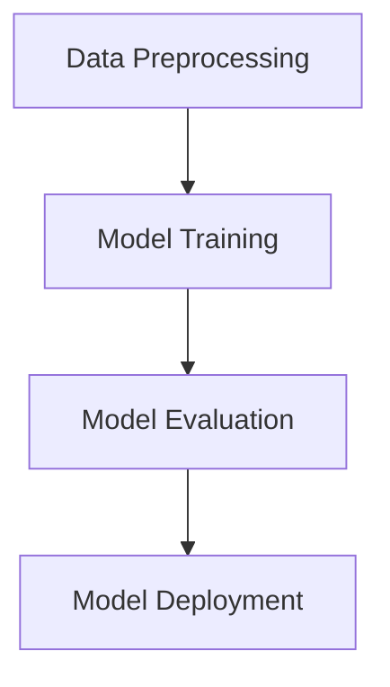
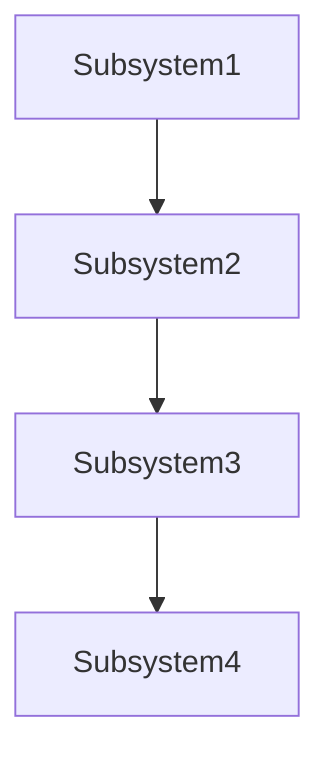
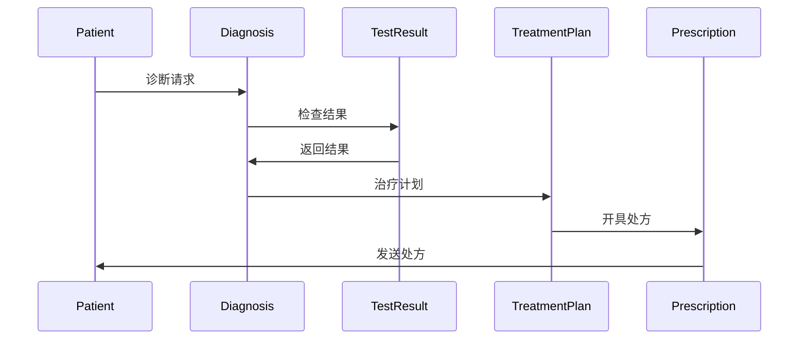

                 


### 《医疗健康AI Agent：开发难点与突破》目录大纲详细内容

**本文将深入探讨医疗健康AI Agent的开发难点与突破，以逻辑清晰、结构紧凑、简单易懂的专业技术语言，逐步分析并解答这一问题。我们将按照文章目录大纲的框架，详细阐述每个章节的内容。**

## **第一部分：背景与核心概念**

### **第1章：医疗健康AI Agent概述**

**1.1 问题背景**

随着人工智能技术的发展，医疗领域迎来了AI的革新。医疗健康AI Agent作为人工智能在医疗领域的应用，旨在辅助医生进行诊断、治疗决策、患者管理等工作，提高医疗效率，减少错误。

**1.2 问题描述与解决**

医疗健康AI Agent需要处理大量复杂且多样化的医疗数据，包括患者信息、病历、影像、实验室检测结果等。如何有效地处理这些数据，并提供准确、可靠的诊断和治疗建议，是当前面临的主要问题。

**1.3 边界与外延**

医疗健康AI Agent的应用范围包括但不限于：电子病历系统、辅助诊断系统、智能药物研发、远程医疗、个性化治疗等。

**1.4 核心概念**

- **医学知识图谱**：用于表示医疗知识和概念的图形化模型，是AI Agent理解医疗信息的基础。
- **深度学习**：用于训练模型，使其能够从数据中学习并做出决策。
- **自然语言处理**：用于处理医疗文本数据，如病历、医生笔记等。

**1.5 概念属性特征对比表**

| 概念        | 属性特征                             | 用途                          |
| ----------- | ----------------------------------- | --------------------------- |
| 医学知识图谱 | 知识、实体、关系、属性                 | 表示医疗知识结构，辅助诊断  |
| 深度学习     | 数据、模型、优化器、损失函数           | 从数据中学习，做出诊断建议   |
| 自然语言处理 | 分词、词向量、文本分类、实体识别       | 提取医疗文本信息，辅助诊断   |

**1.6 ER实体关系图**

使用Mermaid格式绘制ER实体关系图，以展示医疗健康AI Agent中的核心实体及其关系。

```mermaid
erDiagram
  Patient ||--|{ Diagnosis } : has
  Patient ||--|{ TreatmentPlan } : receives
  Diagnosis ||--|{ TestResult } : includes
  TreatmentPlan ||--|{ Prescription } : includes
```

## **第二部分：算法原理与流程**

### **第2章：算法原理与流程**

**2.1 算法原理概述**

医疗健康AI Agent的核心算法通常包括以下步骤：数据预处理、模型训练、模型评估和部署。

**2.2 算法mermaid流程图**

使用Mermaid语言绘制算法流程图，以展示各步骤的详细流程。



**2.3 Python源代码阐述**

以Python为例，详细阐述医疗健康AI Agent的核心算法实现。

```python
import numpy as np
import tensorflow as tf

# 数据预处理
def preprocess_data(data):
    # 数据清洗和标准化
    return processed_data

# 模型训练
def train_model(processed_data):
    # 构建模型
    model = tf.keras.Sequential([
        tf.keras.layers.Dense(units=64, activation='relu', input_shape=(input_shape,)),
        tf.keras.layers.Dense(units=1, activation='sigmoid')
    ])
    model.compile(optimizer='adam', loss='binary_crossentropy', metrics=['accuracy'])
    model.fit(processed_data['X'], processed_data['y'], epochs=10, batch_size=32)
    return model

# 模型评估
def evaluate_model(model, test_data):
    # 评估模型性能
    performance = model.evaluate(test_data['X'], test_data['y'])
    return performance

# 模型部署
def deploy_model(model):
    # 部署模型到生产环境
    pass
```

**2.4 数学模型与公式**

$$
y = f(x; \theta)
$$

其中，$y$ 是输出，$x$ 是输入，$f$ 是激活函数，$\theta$ 是模型参数。

**2.5 举例说明**

假设我们有一个二分类问题，判断一个患者是否患有某种疾病。输入特征包括血压、心率、体温等，模型输出为概率值，接近1表示患有疾病，接近0表示未患病。

## **第三部分：系统分析与架构设计**

### **第3章：系统分析与架构设计**

**3.1 问题场景介绍**

以一个医院为例，描述医疗健康AI Agent在实际场景中的应用。

**3.2 项目介绍**

介绍医疗健康AI Agent项目的目标、功能和预期效果。

**3.3 系统功能设计（领域模型类图）**

使用Mermaid绘制系统功能设计的类图，以展示各个功能模块及其关系。

```mermaid
classDiagram
  Patient <<interface>>
  Diagnosis <<interface>>
  TreatmentPlan <<interface>>
  TestResult <<interface>>

  Patient o-- Diagnosis
  Patient o-- TreatmentPlan
  Diagnosis o-- TestResult
  TreatmentPlan o-- Prescription
```

**3.4 系统架构设计（架构图）**

使用Mermaid绘制系统架构图，以展示各个组件之间的关系。



**3.5 系统接口设计（接口图）**

使用Mermaid绘制系统接口设计图，以展示各个接口模块及其关系。

```mermaid
sequenceDiagram
    Patient -->|诊断请求| Diagnosis
    Diagnosis -->|处理结果| TreatmentPlan
    TreatmentPlan -->|开具处方| Prescription
```

**3.6 系统交互设计（序列图）**

使用Mermaid绘制系统交互设计图，以展示系统内部各组件的交互流程。



## **第四部分：项目实战**

### **第4章：项目实战**

**4.1 环境安装**

详细描述项目环境的安装过程，包括所需软件、硬件和环境配置。

**4.2 系统核心实现源代码**

提供系统核心实现的源代码，并进行详细解读与分析。

**4.3 代码应用解读与分析**

分析源代码中的关键部分，解释其工作原理和作用。

**4.4 实际案例分析与讲解**

通过实际案例，展示如何使用医疗健康AI Agent进行诊断和治疗。

**4.5 项目小结**

总结项目的主要成果和经验，以及未来的改进方向。

## **第五部分：最佳实践与拓展**

### **第5章：最佳实践与拓展**

**5.1 最佳实践 tips**

提供开发医疗健康AI Agent的最佳实践建议。

**5.2 小结**

回顾文章的主要内容，强调关键点和收获。

**5.3 注意事项**

提醒开发者在实践中需要注意的问题。

**5.4 拓展阅读建议**

推荐相关的阅读材料，供进一步学习。

---

通过以上详细的目录大纲，我们为《医疗健康AI Agent：开发难点与突破》奠定了坚实的基础。接下来，我们将逐步完善每个章节的内容，确保文章的专业性、深度和可读性。让我们开始具体的内容撰写吧！

