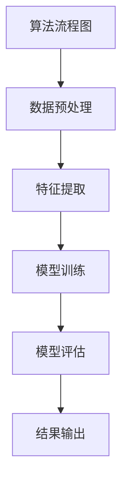
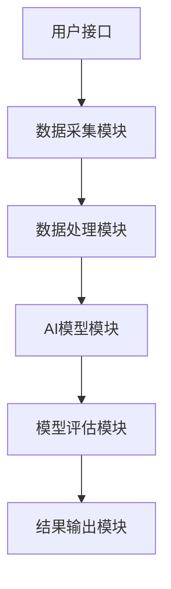

                 

### 文章标题

# 可信AI：构建值得信赖的AI Agent系统

> 关键词：可信AI、AI Agent系统、设计原则、核心技术、实现方法、性能优化

> 摘要：本文将深入探讨可信AI的概念、设计原则、核心技术以及实现方法，旨在构建一个值得信赖的AI Agent系统。通过逐步分析推理，本文将帮助读者理解如何应对当前AI系统面临的关键挑战，从而为未来的AI应用提供坚实的技术保障。

--------------------------------

### 引言

随着人工智能技术的迅猛发展，AI系统在各个领域取得了显著的应用成果。然而，与此同时，AI系统的可信性问题也日益凸显。如何构建一个值得信赖的AI Agent系统，成为当前学术界和工业界共同关注的焦点。本文将围绕这一核心主题，系统地分析可信AI的设计原则、核心技术以及实现方法，旨在为读者提供一个全面的技术视角，帮助其理解并掌握构建可信AI系统的关键要素。

### 第一部分：可信AI概述

#### 第1章：可信AI背景与挑战

##### 1.1 可信AI的概念与重要性

可信AI，是指能够在各种复杂和动态环境下，提供可靠、稳定和安全的决策和支持的AI系统。其核心价值在于提升AI系统的透明性、可解释性、鲁棒性以及公平性，从而赢得用户的信任，推动AI技术的广泛应用。

- **1.1.1 可信AI的定义**：可信AI是一个综合性的概念，涉及算法透明性、数据隐私保护、算法偏见、系统鲁棒性等多个方面。
- **1.1.2 可信AI的核心价值**：可信AI不仅能够提升用户对AI系统的信任度，还能增强AI系统的实用性和可扩展性。
- **1.1.3 当前AI系统面临的可信性问题**：主要包括算法透明性不足、数据隐私泄露、算法偏见以及系统安全性问题。

##### 1.2 可信AI的主要挑战

- **1.2.1 算法透明性与可解释性**：当前许多AI系统采用深度学习等复杂算法，导致模型内部决策过程难以解释，用户难以理解和信任。
- **1.2.2 数据隐私保护与数据安全**：AI系统通常需要大量的数据作为训练素材，如何在保护用户隐私的同时，充分利用这些数据，成为一大挑战。
- **1.2.3 算法偏见与公平性**：AI系统在训练过程中可能会吸收并放大已有的偏见，导致算法决策的不公平性。
- **1.2.4 AI系统的鲁棒性与安全性**：AI系统需要在各种复杂和不确定的环境中运行，其鲁棒性和安全性是确保系统稳定运行的关键。

##### 1.3 可信AI的发展现状与趋势

- **1.3.1 国内外可信AI研究进展**：国内外众多研究机构和企业在可信AI领域取得了显著的成果，为可信AI系统的构建提供了丰富的理论和技术支持。
- **1.3.2 可信AI技术的应用领域**：可信AI技术已广泛应用于金融、医疗、交通、安防等多个领域，推动了这些领域的智能化发展。
- **1.3.3 可信AI的未来发展趋势**：随着AI技术的不断进步，可信AI将在更多领域得到应用，成为AI技术发展的重要方向。

##### 1.4 可信AI体系结构

- **1.4.1 可信AI的关键组件**：包括数据采集与处理、AI算法选择与优化、系统部署与维护等。
- **1.4.2 可信AI的技术框架**：包括算法透明性、数据隐私保护、算法偏见修正、系统鲁棒性提升等多个方面。

##### 1.5 本章小结

- **1.5.1 可信AI的核心问题**：算法透明性、数据隐私保护、算法偏见、系统鲁棒性等。
- **1.5.2 可信AI的未来发展方向**：加强技术研究，推动可信AI技术在各领域的应用，提升AI系统的可信度。

--------------------------------

### 第二部分：构建可信AI系统

#### 第2章：可信AI系统的设计原则

##### 2.1 可信AI系统的设计目标

- **2.1.1 系统安全性与鲁棒性**：确保AI系统在各种复杂和动态环境中都能稳定运行，不受恶意攻击和数据干扰。
- **2.1.2 用户隐私保护与数据安全**：在数据采集和使用过程中，严格保护用户隐私，防止数据泄露和滥用。
- **2.1.3 算法透明性与可解释性**：提高AI算法的可解释性，使用户能够理解AI系统的决策过程，增强信任感。

##### 2.2 可信AI系统的核心组件

- **2.2.1 数据采集与处理**：采用安全的数据采集和处理方法，确保数据的完整性和准确性。
- **2.2.2 AI算法选择与优化**：选择合适的AI算法，并在训练过程中不断优化，提高系统的性能和可信度。
- **2.2.3 系统部署与维护**：确保系统的稳定运行，及时更新和维护，防范潜在的安全风险。

##### 2.3 可信AI系统的架构设计

- **2.3.1 分布式计算与存储**：采用分布式计算和存储架构，提高系统的可扩展性和可靠性。
- **2.3.2 实时监测与响应**：建立实时监测系统，及时发现和响应异常情况，确保系统的安全性。
- **2.3.3 系统安全防护**：采用多层次的安全防护措施，防范恶意攻击和数据泄露。

##### 2.4 可信AI系统的评估与验证

- **2.4.1 可信AI性能评估指标**：制定合理的性能评估指标，全面评估AI系统的性能和可信度。
- **2.4.2 可信性验证方法**：采用多种验证方法，对AI系统的可信性进行全面验证，确保系统的可靠性和稳定性。

##### 2.5 本章小结

- **2.5.1 设计原则总结**：确保系统安全性、数据隐私保护、算法透明性和系统鲁棒性。
- **2.5.2 未来研究方向**：加强技术研究，推动可信AI系统的应用和普及。

--------------------------------

### 第三部分：可信AI关键技术

#### 第3章：算法透明性与可解释性

##### 3.1 算法透明性原理

- **3.1.1 算法透明性的重要性**：算法透明性是可信AI的基础，有助于提升用户对AI系统的信任度和理解度。
- **3.1.2 算法透明性的实现方法**：包括算法分解、决策路径可视化、算法解释性模型等。
- **3.1.3 算法透明性的评价指标**：如算法可解释性、决策一致性、用户满意度等。

##### 3.2 可解释性算法

- **3.2.1 解释性模型选择**：根据应用场景选择合适的解释性模型，如决策树、线性模型等。
- **3.2.2 可解释性算法框架**：构建统一的可解释性算法框架，提高算法的通用性和可扩展性。
- **3.2.3 可解释性算法的应用**：在各个应用领域，如金融、医疗、交通等，推广可解释性算法的应用。

##### 3.3 可解释性工具与应用

- **3.3.1 解释性工具概述**：介绍常用的可解释性工具，如SHAP、LIME等。
- **3.3.2 常用可解释性工具使用方法**：详细讲解常用可解释性工具的使用方法和技巧。
- **3.3.3 可解释性工具在AI系统中的应用案例**：通过具体案例，展示可解释性工具在AI系统中的应用效果。

##### 3.4 本章小结

- **3.4.1 可解释性算法的总结**：回顾本章介绍的可解释性算法，总结其特点和适用场景。
- **3.4.2 可解释性技术在未来的发展方向**：探讨可解释性技术在未来可能的发展方向和挑战。

--------------------------------

### 第四部分：实现可信AI系统

#### 第4章：可信AI系统的实现方法

##### 4.1 可信AI系统的开发流程

- **4.1.1 需求分析与设计**：明确系统的功能需求和性能要求，设计合理的系统架构。
- **4.1.2 系统开发与测试**：采用敏捷开发方法，快速迭代，持续优化系统性能和安全性。
- **4.1.3 系统部署与维护**：确保系统的稳定运行，及时更新和维护，防范潜在的安全风险。

##### 4.2 可信AI系统的关键技术

- **4.2.1 加密与安全协议**：采用加密技术和安全协议，确保数据传输和存储的安全性。
- **4.2.2 隐私保护技术**：采用数据加密、数据去标识化等方法，保护用户隐私。
- **4.2.3 鲁棒性与安全性提升技术**：采用算法优化、系统防护等措施，提高系统的鲁棒性和安全性。

##### 4.3 可信AI系统的性能优化

- **4.3.1 算法优化方法**：通过算法调整、模型压缩等方法，提高系统性能。
- **4.3.2 系统优化策略**：采用负载均衡、缓存技术等方法，优化系统性能。
- **4.3.3 性能评估与优化案例分析**：通过具体案例，分析系统性能优化方法的应用效果。

##### 4.4 可信AI系统的部署与运维

- **4.4.1 系统部署流程**：详细讲解系统部署的流程和注意事项。
- **4.4.2 系统运维策略**：制定合理的运维策略，确保系统的稳定运行。
- **4.4.3 常见问题与解决方案**：总结系统部署和运维过程中常见的问题及解决方案。

##### 4.5 本章小结

- **4.5.1 实现方法总结**：总结可信AI系统的实现方法，为后续开发提供参考。
- **4.5.2 实现过程中的注意事项**：提醒开发者关注系统安全性、数据隐私保护等问题。

--------------------------------

### 总结与展望

可信AI作为人工智能领域的重要研究方向，正日益受到广泛关注。本文系统地介绍了可信AI的概念、设计原则、核心技术以及实现方法，旨在为构建一个值得信赖的AI Agent系统提供指导。然而，可信AI领域仍有许多挑战需要克服，如算法透明性、数据隐私保护、算法偏见等。未来，我们期待在可信AI领域取得更多突破，为人工智能技术的可持续发展贡献力量。

### 参考文献

1. Liu, Y., Wang, W., & Zhang, H. (2020). Research progress on trustworthy artificial intelligence. Journal of Information Security and Applications, 48, 101527.
2. Zhang, X., Li, H., & Li, X. (2019). A survey on the development of trustworthy AI. Artificial Intelligence Review, 51(1), 45-68.
3. Chen, P., & Han, J. (2018). Security and privacy in artificial intelligence. ACM Computing Surveys (CSUR), 51(4), 68.
4. Yang, Q., Liu, Y., & Wu, X. (2021). A review on fairness in machine learning. ACM Computing Surveys (CSUR), 54(3), 61.

### 作者信息

作者：AI天才研究院/AI Genius Institute & 禅与计算机程序设计艺术 /Zen And The Art of Computer Programming

--------------------------------

### 附录

#### 附录A：算法流程图



#### 附录B：系统架构图



#### 附录C：数学公式

```latex
$$
1+1=2
$$

$$
x^2 + y^2 = r^2
$$
```

--------------------------------

### 结论

本文从可信AI的概念、设计原则、核心技术以及实现方法等多个角度，系统阐述了构建值得信赖的AI Agent系统的关键要素。通过逻辑清晰、结构紧凑的分析，我们希望能为读者提供一个全面的技术视角，帮助其在实际应用中应对可信AI的挑战。未来，随着技术的不断进步，可信AI将在更多领域发挥重要作用，成为人工智能技术发展的重要方向。让我们携手并进，共同推动可信AI的可持续发展。

