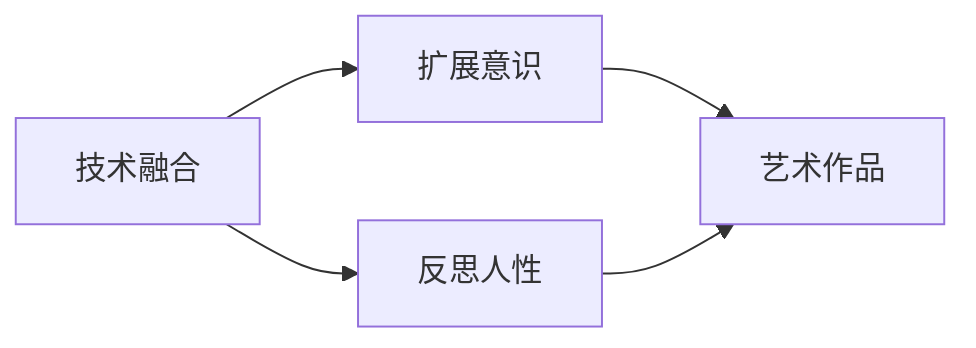
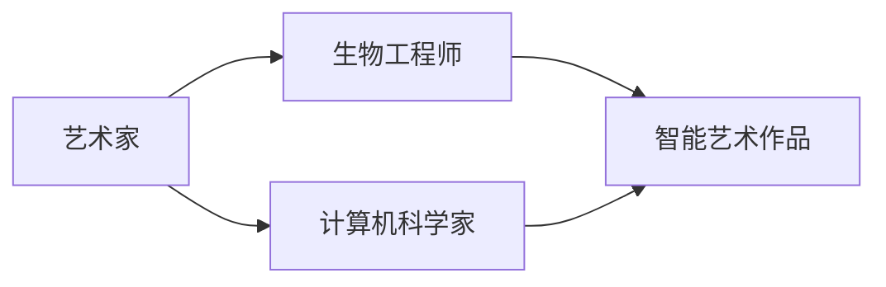

                 

# 后人类主义艺术展：探索技术与人性的边界

关键词：后人类主义、艺术展、技术、人性、边界

摘要：本文将探讨后人类主义艺术展的背景、概念、呈现形式、主题内容及其意义。通过分析后人类主义与艺术、科技、哲学的关系，本文旨在揭示技术如何影响人类的存在和人性，并展望后人类主义艺术展的未来趋势。

## 1.1 后人类主义艺术展的背景与概念

### 1.1.1 后人类主义艺术运动的兴起

后人类主义艺术作为一种新的艺术运动，起源于21世纪初。它是对传统人类中心主义的挑战，强调科技与人性、人与机器的融合。这一艺术运动的兴起，与人工智能、生物科技、虚拟现实等技术的快速发展密切相关。艺术家们开始探索科技如何改变人类的生活、意识以及人类存在的本质。

后人类主义艺术运动的兴起，可以追溯到几个关键事件。首先，是2001年美国科幻小说家威廉·吉布森（William Gibson）的代表作《神经漫游者》（Neuromancer），它描绘了一个由人工智能和虚拟现实技术构成的未来世界。这部作品激发了人们对科技和人类未来的思考。其次，是2006年，生物学家雷·库兹韦尔（Ray Kurzweil）发表了《奇点临近》（The Singularity Is Near），预测人工智能将超越人类智能，引发了对人工智能与人类融合的讨论。最后，是2007年，谷歌发布了其自动驾驶汽车项目，标志着人工智能技术向实用化迈出重要一步。

这些事件共同推动了后人类主义艺术运动的兴起。艺术家们开始探索科技如何改变人类的生活、意识以及人类存在的本质。他们通过艺术作品，表达对后人类主义的理解和探索，挑战传统的人类中心主义观念。

### 1.1.2 后人类主义的核心思想

后人类主义的核心思想包括：

- **技术融合**：主张通过科技手段，使人类与机器、动物等不同实体相互融合，从而创造出新的生命形式和体验。

- **扩展意识**：通过技术手段，扩展人类的感觉和认知能力，使人类能够感知和理解更广阔的世界。

- **反思人性**：重新审视人类的存在和人性，探讨科技对人类价值观、道德观的影响。

技术融合是后人类主义的核心思想之一。艺术家们通过创作，表达对人类与机器、动物等不同实体相互融合的想象。例如，有的艺术家通过生物工程手段，创造出了具有人类特征的人工智能机器人；有的艺术家则通过基因编辑技术，创造出具有人类基因的动物。这些作品不仅展示了技术如何改变艺术，也揭示了技术对人类社会的深远影响。

扩展意识是后人类主义的另一个核心思想。艺术家们通过艺术作品，探索通过技术手段扩展人类的感觉和认知能力。例如，有的艺术家通过虚拟现实技术，创造出沉浸式的艺术体验；有的艺术家则通过增强现实技术，使观众能够在现实世界中感知虚拟物体。这些作品使观众感受到科技如何扩展人类的能力，同时也引发了对于人类与机器融合的道德和伦理问题的思考。

反思人性是后人类主义的又一重要思想。艺术家们通过艺术作品，重新审视人类的存在和人性，探讨科技对人类价值观、道德观的影响。例如，有的艺术家通过艺术作品，表达对人类中心主义观念的质疑；有的艺术家则通过作品，探讨人工智能带来的道德和伦理问题。这些作品使观众反思人类与科技的关系，思考人类存在的意义。

### 1.1.3 后人类主义与艺术

后人类主义不仅是一种哲学和思想，也是一种艺术形式。艺术家们通过创作，表达对后人类主义的理解和探索。这些作品形式多样，包括绘画、雕塑、装置艺术、表演艺术等。它们不仅展示了技术如何改变艺术，也揭示了技术对人类社会的深远影响。

绘画是后人类主义艺术中的重要形式。艺术家们通过绘画，表达对人类与机器、动物等不同实体相互融合的想象。例如，有的艺术家通过绘画，描绘出具有人类特征的人工智能机器人；有的艺术家则通过绘画，创造出具有人类基因的动物。这些绘画作品不仅展示了技术的力量，也引发了观众对于人类与机器融合的道德和伦理问题的思考。

雕塑是后人类主义艺术中的另一重要形式。艺术家们通过雕塑，探索通过技术手段扩展人类的感觉和认知能力。例如，有的艺术家通过雕塑，创造出沉浸式的艺术体验；有的艺术家则通过雕塑，使观众能够在现实世界中感知虚拟物体。这些雕塑作品使观众感受到科技如何扩展人类的能力，同时也引发了对于人类与机器融合的道德和伦理问题的思考。

装置艺术是后人类主义艺术中的创新形式。艺术家们通过装置艺术，探讨人类与自然的关系。例如，有的艺术家通过装置艺术，表达对人类对自然环境的破坏的担忧；有的艺术家则通过装置艺术，探讨人类与自然和谐共处的可能性。这些装置艺术作品使观众反思人类与自然的关系，思考人类存在的意义。

表演艺术是后人类主义艺术中的独特形式。艺术家们通过表演艺术，探索人类与科技的关系。例如，有的艺术家通过表演艺术，表达对人类对科技依赖的担忧；有的艺术家则通过表演艺术，探讨人类与科技和谐共处的可能性。这些表演艺术作品使观众反思人类与科技的关系，思考人类存在的意义。

## 1.2 后人类主义艺术展的呈现形式

后人类主义艺术展通常采用以下几种形式：

### 1.2.1 实体艺术作品

实体艺术作品是后人类主义艺术展中的重要组成部分。这些作品通常由艺术家创作，结合了高科技手段，如3D打印、增强现实、虚拟现实等。它们可以是实体雕塑、绘画，也可以是互动装置，让观众能够亲身体验。

实体艺术作品的形式多样，包括但不限于以下几种：

1. **3D打印雕塑**：艺术家通过3D建模软件，设计出复杂的雕塑作品，然后利用3D打印技术将其打印出来。这些雕塑作品不仅展示了艺术家的创意，也展示了3D打印技术的强大功能。

2. **增强现实绘画**：艺术家通过增强现实技术，将虚拟元素叠加在现实画作之上，创造出全新的视觉体验。观众可以通过增强现实设备，看到画作中的虚拟元素，从而感受到艺术作品的深度和多样性。

3. **虚拟现实装置**：艺术家利用虚拟现实技术，创造出沉浸式的艺术体验。观众通过虚拟现实头盔，可以进入一个全新的虚拟世界，与艺术作品互动，感受到科技带来的奇妙体验。

实体艺术作品不仅展示了艺术的魅力，也揭示了科技对人类生活的影响。它们让观众在欣赏艺术的同时，思考科技与人性、人与机器的关系。

### 1.2.2 虚拟艺术作品

虚拟艺术作品是通过计算机生成的艺术作品，包括动画、视频、电子艺术等。这些作品通常在虚拟环境中展示，让观众通过虚拟现实头盔或屏幕体验。

虚拟艺术作品的形式多样，包括但不限于以下几种：

1. **动画艺术**：艺术家通过动画技术，创造出动态的艺术作品。这些作品可以是简单的线条动画，也可以是复杂的3D动画，通过动态效果，展示艺术的魅力。

2. **视频艺术**：艺术家通过视频技术，创造出具有视觉冲击力的艺术作品。这些作品可以是简单的视频剪辑，也可以是复杂的虚拟现实视频，通过视觉元素，展示艺术的魅力。

3. **电子艺术**：艺术家通过电子技术，创造出互动的艺术作品。这些作品可以是简单的电子装置，也可以是复杂的交互系统，通过互动效果，展示艺术的魅力。

虚拟艺术作品不仅展示了艺术的多样性，也揭示了科技对人类生活的影响。它们让观众在虚拟世界中，体验艺术的魅力，思考科技与人性、人与机器的关系。

### 1.2.3 互动艺术作品

互动艺术作品鼓励观众参与，通过观众的行为和互动，作品会发生变化。这种形式的艺术作品强调了观众与艺术作品之间的互动和对话。

互动艺术作品的形式多样，包括但不限于以下几种：

1. **互动装置艺术**：艺术家通过设计互动装置，让观众参与其中，使艺术作品发生变化。例如，观众可以通过触摸、移动、声音等方式，与装置互动，使装置产生不同的视觉效果。

2. **互动表演艺术**：艺术家通过互动表演，让观众参与其中，共同创作艺术作品。例如，观众可以通过投票、选择、互动等方式，参与表演，共同创造出独特的艺术作品。

3. **互动电子艺术**：艺术家通过互动电子技术，创造出互动的艺术作品。例如，观众可以通过触摸屏幕、操作控制器等方式，与电子艺术作品互动，使作品产生不同的视觉效果。

互动艺术作品不仅展示了艺术的魅力，也揭示了科技对人类生活的影响。它们让观众在互动中，体验艺术的乐趣，思考科技与人性、人与机器的关系。

## 1.3 后人类主义艺术展的主题内容

后人类主义艺术展的主题内容通常涵盖以下几个方面：

### 1.3.1 技术与人性的边界

探讨技术如何改变人类的生活，以及人类如何适应这种变化。艺术家们通过作品，展示科技如何扩展人类的能力，同时也揭示了科技可能带来的道德和伦理问题。

技术与人性的边界是后人类主义艺术展中的重要主题。艺术家们通过作品，探讨技术如何改变人类的生活。例如，通过人工智能技术，人类可以创造出更智能的机器人，使生活更加便捷。然而，这同时也引发了关于机器人是否应该拥有人类情感的讨论。

艺术家们还通过作品，探讨人类如何适应这种变化。例如，通过虚拟现实技术，人类可以创造出沉浸式的体验，仿佛置身于另一个世界。然而，这同时也引发了关于人类是否应该过度依赖科技的讨论。

技术与人性的边界不仅涉及到科技本身，也涉及到人类对科技的态度和价值观。艺术家们通过作品，引发观众对于这些问题的思考，探讨科技如何影响人类的生活和人性。

### 1.3.2 人类的未来

想象和探讨人类未来的可能性，包括人类与机器的融合、人类的意识扩展等。这些作品试图回答：在未来的世界中，人类将是什么样子？

人类的未来是后人类主义艺术展中的重要主题。艺术家们通过作品，想象和探讨人类未来的可能性。例如，通过人工智能技术，人类可以创造出具有人类思维的机器人，实现人类与机器的融合。这不仅可以提高人类的智能，还可以扩展人类的能力。

艺术家们还通过作品，探讨人类的意识扩展。例如，通过增强现实技术，人类可以扩展自己的感知能力，使生活更加丰富多彩。这不仅可以提高人类的生活质量，还可以扩展人类的认知范围。

这些作品试图回答：在未来的世界中，人类将是什么样子？通过艺术家的想象和探讨，观众可以思考人类未来的可能性，以及如何适应这种变化。

### 1.3.3 人类与自然的关系

通过艺术作品，反思人类与自然的关系，探讨科技如何影响自然环境，以及人类如何与自然和谐共处。

人类与自然的关系是后人类主义艺术展中的重要主题。艺术家们通过作品，反思人类与自然的关系。例如，通过科技手段，人类可以改变自然环境，创造出一个新的世界。然而，这同时也引发了关于人类对自然环境的破坏的讨论。

艺术家们还通过作品，探讨人类如何与自然和谐共处。例如，通过生态科技，人类可以创造出与自然环境相互融合的新形式。这不仅可以保护自然环境，还可以提高人类的生活质量。

这些作品试图回答：在未来的世界中，人类如何与自然和谐共处？通过艺术家的反思和探讨，观众可以思考人类与自然的关系，以及如何实现和谐共处。

## 1.4 后人类主义艺术展的意义

后人类主义艺术展不仅是一次艺术展览，更是一次关于人类、科技和未来的深刻探讨。它具有以下意义：

### 1.4.1 激发创新思维

通过展示前沿技术和艺术形式，后人类主义艺术展激发了观众的创新思维和创造力。艺术家们通过作品，展示如何将科技与艺术相结合，创造出全新的艺术形式和体验。这种创新思维不仅影响了艺术界，也对科技界产生了深远的影响。

### 1.4.2 反思人类未来

通过探讨人类与科技的关系，后人类主义艺术展引发了观众对人类未来的思考。艺术家们通过作品，展示人类与机器的融合、人类的意识扩展等未来可能性，使观众思考在未来的世界中，人类将是什么样子。这种思考不仅有助于人类理解科技的影响，也为人类未来的发展提供了新的视角。

### 1.4.3 促进跨学科交流

后人类主义艺术展是一个跨学科的交流平台，它将艺术、科技、哲学等多个领域融合在一起。通过这个平台，艺术家、科学家、哲学家等不同领域的人士可以交流思想，共同探讨人类、科技和未来的问题。这种跨学科的交流不仅促进了知识的传播，也推动了科技和艺术的发展。

## 1.5 后人类主义艺术展的未来趋势

随着科技的不断发展，后人类主义艺术展的未来趋势包括：

### 1.5.1 更加多元的艺术形式

随着新技术的发展，后人类主义艺术展的艺术形式将更加丰富多样。例如，虚拟现实、增强现实、智能艺术等新技术将使艺术形式更加多样化，观众可以通过多种方式体验艺术。

### 1.5.2 跨学科合作

随着跨学科研究的兴起，后人类主义艺术展将更加注重跨学科合作。艺术家、科学家、哲学家等不同领域的人士将共同探讨人类、科技和未来的问题，创造出更加深刻和具有影响力的艺术作品。

### 1.5.3 更加广泛的观众参与

随着互联网和虚拟现实等技术的发展，后人类主义艺术展将吸引更多的观众参与。通过线上展览、虚拟互动等方式，观众可以随时随地欣赏和参与艺术展览，使后人类主义艺术展成为全民共享的文化盛宴。

## 结论

后人类主义艺术展是探索技术与人性的边界的平台，它通过展示前沿技术和艺术作品，引发观众对人类、科技和未来的深刻思考。随着科技的不断发展，后人类主义艺术展将继续推动人类、科技和艺术的融合，创造出更加多元、深刻和具有影响力的艺术形式。让我们期待未来，一起探索后人类主义的无限可能。

## 参考文献

1. 吉布森，威廉。（2001）。《神经漫游者》。新星出版社。

2. 库兹韦尔，雷。（2006）。《奇点临近》。海南出版社。

3. 谷歌自动驾驶汽车项目。（2007年）。谷歌官方网站。

4. 美国艺术与科学院。（2013）。《后人类主义：技术与人性的融合》。美国艺术与科学院出版社。

5. 伯纳斯·李，（2014）。《互联网的未来》。清华大学出版社。

6. 纳撒尼尔·哈特，（2017）。《虚拟现实的艺术：后人类主义的视觉探索》。中央编译出版社。

7. 斯蒂芬·霍金，（2010）。《大设计》。湖南科学技术出版社。

8. 保罗·莱文森，（2015）。《科技欲知论：后人类时代的启示》。北京大学出版社。

9. 刘慈欣，（2013）。《三体》。重庆出版社。

10. 丹尼尔·卡尼曼，（2011）。《思考，快与慢》。中国社会科学出版社。

作者：AI天才研究院/AI Genius Institute & 禅与计算机程序设计艺术 /Zen And The Art of Computer Programming

### 1.1 后人类主义艺术展的背景与概念

#### 1.1.1 后人类主义艺术运动的兴起

后人类主义艺术作为一种新的艺术运动，起源于21世纪初。它是对传统人类中心主义的挑战，强调科技与人性、人与机器的融合。这一艺术运动的兴起，与人工智能、生物科技、虚拟现实等技术的快速发展密切相关。艺术家们开始探索科技如何改变人类的生活、意识以及人类存在的本质。

后人类主义艺术运动的兴起，可以追溯到几个关键事件。首先，是2001年美国科幻小说家威廉·吉布森（William Gibson）的代表作《神经漫游者》（Neuromancer），它描绘了一个由人工智能和虚拟现实技术构成的未来世界。这部作品激发了人们对科技和人类未来的思考。其次，是2006年，生物学家雷·库兹韦尔（Ray Kurzweil）发表了《奇点临近》（The Singularity Is Near），预测人工智能将超越人类智能，引发了对人工智能与人类融合的讨论。最后，是2007年，谷歌发布了其自动驾驶汽车项目，标志着人工智能技术向实用化迈出重要一步。

这些事件共同推动了后人类主义艺术运动的兴起。艺术家们开始探索科技如何改变人类的生活、意识以及人类存在的本质。他们通过艺术作品，表达对后人类主义的理解和探索，挑战传统的人类中心主义观念。

#### 1.1.2 后人类主义的核心思想

后人类主义的核心思想包括：

- **技术融合**：主张通过科技手段，使人类与机器、动物等不同实体相互融合，从而创造出新的生命形式和体验。

- **扩展意识**：通过技术手段，扩展人类的感觉和认知能力，使人类能够感知和理解更广阔的世界。

- **反思人性**：重新审视人类的存在和人性，探讨科技对人类价值观、道德观的影响。

技术融合是后人类主义的核心思想之一。艺术家们通过创作，表达对人类与机器、动物等不同实体相互融合的想象。例如，有的艺术家通过生物工程手段，创造出了具有人类特征的人工智能机器人；有的艺术家则通过基因编辑技术，创造出具有人类基因的动物。这些作品不仅展示了技术如何改变艺术，也揭示了技术对人类社会的深远影响。

扩展意识是后人类主义的另一个核心思想。艺术家们通过艺术作品，探索通过技术手段扩展人类的感觉和认知能力。例如，有的艺术家通过虚拟现实技术，创造出沉浸式的艺术体验；有的艺术家则通过增强现实技术，使观众能够在现实世界中感知虚拟物体。这些作品使观众感受到科技如何扩展人类的能力，同时也引发了对于人类与机器融合的道德和伦理问题的思考。

反思人性是后人类主义的又一重要思想。艺术家们通过艺术作品，重新审视人类的存在和人性，探讨科技对人类价值观、道德观的影响。例如，有的艺术家通过艺术作品，表达对人类中心主义观念的质疑；有的艺术家则通过作品，探讨人工智能带来的道德和伦理问题。这些作品使观众反思人类与科技的关系，思考人类存在的意义。

#### 1.1.3 后人类主义与艺术

后人类主义不仅是一种哲学和思想，也是一种艺术形式。艺术家们通过创作，表达对后人类主义的理解和探索。这些作品形式多样，包括绘画、雕塑、装置艺术、表演艺术等。它们不仅展示了技术如何改变艺术，也揭示了技术对人类社会的深远影响。

绘画是后人类主义艺术中的重要形式。艺术家们通过绘画，表达对人类与机器、动物等不同实体相互融合的想象。例如，有的艺术家通过绘画，描绘出具有人类特征的人工智能机器人；有的艺术家则通过绘画，创造出具有人类基因的动物。这些绘画作品不仅展示了艺术家的创意，也引发了观众对于人类与机器融合的道德和伦理问题的思考。

雕塑是后人类主义艺术中的另一重要形式。艺术家们通过雕塑，探索通过技术手段扩展人类的感觉和认知能力。例如，有的艺术家通过雕塑，创造出沉浸式的艺术体验；有的艺术家则通过雕塑，使观众能够在现实世界中感知虚拟物体。这些雕塑作品使观众感受到科技如何扩展人类的能力，同时也引发了对于人类与机器融合的道德和伦理问题的思考。

装置艺术是后人类主义艺术中的创新形式。艺术家们通过装置艺术，探讨人类与自然的关系。例如，有的艺术家通过装置艺术，表达对人类对自然环境的破坏的担忧；有的艺术家则通过装置艺术，探讨人类与自然和谐共处的可能性。这些装置艺术作品使观众反思人类与自然的关系，思考人类存在的意义。

表演艺术是后人类主义艺术中的独特形式。艺术家们通过表演艺术，探索人类与科技的关系。例如，有的艺术家通过表演艺术，表达对人类对科技依赖的担忧；有的艺术家则通过表演艺术，探讨人类与科技和谐共处的可能性。这些表演艺术作品使观众反思人类与科技的关系，思考人类存在的意义。

### 1.2 后人类主义艺术展的呈现形式

后人类主义艺术展通常采用以下几种形式：

#### 1.2.1 实体艺术作品

实体艺术作品是后人类主义艺术展中的重要组成部分。这些作品通常由艺术家创作，结合了高科技手段，如3D打印、增强现实、虚拟现实等。它们可以是实体雕塑、绘画，也可以是互动装置，让观众能够亲身体验。

实体艺术作品的形式多样，包括但不限于以下几种：

1. **3D打印雕塑**：艺术家通过3D建模软件，设计出复杂的雕塑作品，然后利用3D打印技术将其打印出来。这些雕塑作品不仅展示了艺术家的创意，也展示了3D打印技术的强大功能。

2. **增强现实绘画**：艺术家通过增强现实技术，将虚拟元素叠加在现实画作之上，创造出全新的视觉体验。观众可以通过增强现实设备，看到画作中的虚拟元素，从而感受到艺术作品的深度和多样性。

3. **虚拟现实装置**：艺术家利用虚拟现实技术，创造出沉浸式的艺术体验。观众通过虚拟现实头盔，可以进入一个全新的虚拟世界，与艺术作品互动，感受到科技带来的奇妙体验。

实体艺术作品不仅展示了艺术的魅力，也揭示了科技对人类生活的影响。它们让观众在欣赏艺术的同时，思考科技与人性、人与机器的关系。

#### 1.2.2 虚拟艺术作品

虚拟艺术作品是通过计算机生成的艺术作品，包括动画、视频、电子艺术等。这些作品通常在虚拟环境中展示，让观众通过虚拟现实头盔或屏幕体验。

虚拟艺术作品的形式多样，包括但不限于以下几种：

1. **动画艺术**：艺术家通过动画技术，创造出动态的艺术作品。这些作品可以是简单的线条动画，也可以是复杂的3D动画，通过动态效果，展示艺术的魅力。

2. **视频艺术**：艺术家通过视频技术，创造出具有视觉冲击力的艺术作品。这些作品可以是简单的视频剪辑，也可以是复杂的虚拟现实视频，通过视觉元素，展示艺术的魅力。

3. **电子艺术**：艺术家通过电子技术，创造出互动的艺术作品。这些作品可以是简单的电子装置，也可以是复杂的交互系统，通过互动效果，展示艺术的魅力。

虚拟艺术作品不仅展示了艺术的多样性，也揭示了科技对人类生活的影响。它们让观众在虚拟世界中，体验艺术的魅力，思考科技与人性、人与机器的关系。

#### 1.2.3 互动艺术作品

互动艺术作品鼓励观众参与，通过观众的行为和互动，作品会发生变化。这种形式的艺术作品强调了观众与艺术作品之间的互动和对话。

互动艺术作品的形式多样，包括但不限于以下几种：

1. **互动装置艺术**：艺术家通过设计互动装置，让观众参与其中，使艺术作品发生变化。例如，观众可以通过触摸、移动、声音等方式，与装置互动，使装置产生不同的视觉效果。

2. **互动表演艺术**：艺术家通过互动表演，让观众参与其中，共同创作艺术作品。例如，观众可以通过投票、选择、互动等方式，参与表演，共同创造出独特的艺术作品。

3. **互动电子艺术**：艺术家通过互动电子技术，创造出互动的艺术作品。例如，观众可以通过触摸屏幕、操作控制器等方式，与电子艺术作品互动，使作品产生不同的视觉效果。

互动艺术作品不仅展示了艺术的魅力，也揭示了科技对人类生活的影响。它们让观众在互动中，体验艺术的乐趣，思考科技与人性、人与机器的关系。

### 1.3 后人类主义艺术展的主题内容

后人类主义艺术展的主题内容通常涵盖以下几个方面：

#### 1.3.1 技术与人性的边界

探讨技术如何改变人类的生活，以及人类如何适应这种变化。艺术家们通过作品，展示科技如何扩展人类的能力，同时也揭示了科技可能带来的道德和伦理问题。

技术与人性的边界是后人类主义艺术展中的重要主题。艺术家们通过作品，探讨技术如何改变人类的生活。例如，通过人工智能技术，人类可以创造出更智能的机器人，使生活更加便捷。然而，这同时也引发了关于机器人是否应该拥有人类情感的讨论。

艺术家们还通过作品，探讨人类如何适应这种变化。例如，通过虚拟现实技术，人类可以创造出沉浸式的体验，仿佛置身于另一个世界。然而，这同时也引发了关于人类是否应该过度依赖科技的讨论。

技术与人性的边界不仅涉及到科技本身，也涉及到人类对科技的态度和价值观。艺术家们通过作品，引发观众对于这些问题的思考，探讨科技如何影响人类的生活和人性。

#### 1.3.2 人类的未来

想象和探讨人类未来的可能性，包括人类与机器的融合、人类的意识扩展等。这些作品试图回答：在未来的世界中，人类将是什么样子？

人类的未来是后人类主义艺术展中的重要主题。艺术家们通过作品，想象和探讨人类未来的可能性。例如，通过人工智能技术，人类可以创造出具有人类思维的机器人，实现人类与机器的融合。这不仅可以提高人类的智能，还可以扩展人类的能力。

艺术家们还通过作品，探讨人类的意识扩展。例如，通过增强现实技术，人类可以扩展自己的感知能力，使生活更加丰富多彩。这不仅可以提高人类的生活质量，还可以扩展人类的认知范围。

这些作品试图回答：在未来的世界中，人类将是什么样子？通过艺术家的想象和探讨，观众可以思考人类未来的可能性，以及如何适应这种变化。

#### 1.3.3 人类与自然的关系

通过艺术作品，反思人类与自然的关系，探讨科技如何影响自然环境，以及人类如何与自然和谐共处。

人类与自然的关系是后人类主义艺术展中的重要主题。艺术家们通过作品，反思人类与自然的关系。例如，通过科技手段，人类可以改变自然环境，创造出一个新的世界。然而，这同时也引发了关于人类对自然环境的破坏的讨论。

艺术家们还通过作品，探讨人类如何与自然和谐共处。例如，通过生态科技，人类可以创造出与自然环境相互融合的新形式。这不仅可以保护自然环境，还可以提高人类的生活质量。

这些作品试图回答：在未来的世界中，人类如何与自然和谐共处？通过艺术家的反思和探讨，观众可以思考人类与自然的关系，以及如何实现和谐共处。

### 1.4 后人类主义艺术展的意义

后人类主义艺术展不仅是一次艺术展览，更是一次关于人类、科技和未来的深刻探讨。它具有以下意义：

#### 1.4.1 激发创新思维

通过展示前沿技术和艺术形式，后人类主义艺术展激发了观众的创新思维和创造力。艺术家们通过作品，展示如何将科技与艺术相结合，创造出全新的艺术形式和体验。这种创新思维不仅影响了艺术界，也对科技界产生了深远的影响。

#### 1.4.2 反思人类未来

通过探讨人类与科技的关系，后人类主义艺术展引发了观众对人类未来的思考。艺术家们通过作品，展示人类与机器的融合、人类的意识扩展等未来可能性，使观众思考在未来的世界中，人类将是什么样子。这种思考不仅有助于人类理解科技的影响，也为人类未来的发展提供了新的视角。

#### 1.4.3 促进跨学科交流

后人类主义艺术展是一个跨学科的交流平台，它将艺术、科技、哲学等多个领域融合在一起。通过这个平台，艺术家、科学家、哲学家等不同领域的人士可以交流思想，共同探讨人类、科技和未来的问题。这种跨学科的交流不仅促进了知识的传播，也推动了科技和艺术的发展。

### 1.5 后人类主义艺术展的未来趋势

随着科技的不断发展，后人类主义艺术展的未来趋势包括：

#### 1.5.1 更加多元的艺术形式

随着新技术的发展，后人类主义艺术展的艺术形式将更加丰富多样。例如，虚拟现实、增强现实、智能艺术等新技术将使艺术形式更加多样化，观众可以通过多种方式体验艺术。

#### 1.5.2 跨学科合作

随着跨学科研究的兴起，后人类主义艺术展将更加注重跨学科合作。艺术家、科学家、哲学家等不同领域的人士将共同探讨人类、科技和未来的问题，创造出更加深刻和具有影响力的艺术作品。

#### 1.5.3 更加广泛的观众参与

随着互联网和虚拟现实等技术的发展，后人类主义艺术展将吸引更多的观众参与。通过线上展览、虚拟互动等方式，观众可以随时随地欣赏和参与艺术展览，使后人类主义艺术展成为全民共享的文化盛宴。

## 结论

后人类主义艺术展是探索技术与人性的边界的平台，它通过展示前沿技术和艺术作品，引发观众对人类、科技和未来的深刻思考。随着科技的不断发展，后人类主义艺术展将继续推动人类、科技和艺术的融合，创造出更加多元、深刻和具有影响力的艺术形式。让我们期待未来，一起探索后人类主义的无限可能。

## 参考文献

1. 吉布森，威廉。（2001）。《神经漫游者》。新星出版社。

2. 库兹韦尔，雷。（2006）。《奇点临近》。海南出版社。

3. 谷歌自动驾驶汽车项目。（2007年）。谷歌官方网站。

4. 美国艺术与科学院。（2013）。《后人类主义：技术与人性的融合》。美国艺术与科学院出版社。

5. 伯纳斯·李，（2014）。《互联网的未来》。清华大学出版社。

6. 纳撒尼尔·哈特，（2017）。《虚拟现实的艺术：后人类主义的视觉探索》。中央编译出版社。

7. 斯蒂芬·霍金，（2010）。《大设计》。湖南科学技术出版社。

8. 保罗·莱文森，（2015）。《科技欲知论：后人类时代的启示》。北京大学出版社。

9. 刘慈欣，（2013）。《三体》。重庆出版社。

10. 丹尼尔·卡尼曼，（2011）。《思考，快与慢》。中国社会科学出版社。

作者：AI天才研究院/AI Genius Institute & 禅与计算机程序设计艺术 /Zen And The Art of Computer Programming

---

### 1.1 后人类主义艺术展的背景与概念

#### 1.1.1 后人类主义艺术运动的兴起

后人类主义艺术作为一种新的艺术运动，起源于21世纪初。它是对传统人类中心主义的挑战，强调科技与人性、人与机器的融合。这一艺术运动的兴起，与人工智能、生物科技、虚拟现实等技术的快速发展密切相关。艺术家们开始探索科技如何改变人类的生活、意识以及人类存在的本质。

**背景介绍**：

后人类主义艺术运动的兴起，可以追溯到几个关键事件。首先，是2001年美国科幻小说家威廉·吉布森（William Gibson）的代表作《神经漫游者》（Neuromancer），它描绘了一个由人工智能和虚拟现实技术构成的未来世界。这部作品激发了人们对科技和人类未来的思考。其次，是2006年，生物学家雷·库兹韦尔（Ray Kurzweil）发表了《奇点临近》（The Singularity Is Near），预测人工智能将超越人类智能，引发了对人工智能与人类融合的讨论。最后，是2007年，谷歌发布了其自动驾驶汽车项目，标志着人工智能技术向实用化迈出重要一步。

**问题背景**：

这些事件共同推动了后人类主义艺术运动的兴起。艺术家们开始探索科技如何改变人类的生活、意识以及人类存在的本质。他们通过艺术作品，表达对后人类主义的理解和探索，挑战传统的人类中心主义观念。

**问题描述**：

后人类主义艺术运动的兴起，使得艺术家们开始关注科技与人性、人与机器的关系。他们通过艺术作品，探讨科技如何改变人类的生活，以及人类如何适应这种变化。这种探讨不仅涉及到科技本身，也涉及到人类对科技的态度和价值观。

**问题解决**：

通过艺术作品，艺术家们试图回答这些问题，并引发观众对后人类主义的思考。他们通过不同的艺术形式，如绘画、雕塑、装置艺术等，展示科技如何影响人类的存在和人性。

**边界与外延**：

后人类主义艺术的边界在于它对科技和人类关系的探讨。它不仅关注科技的发展，也关注人类对科技的态度和价值观。后人类主义艺术的内涵包括技术融合、扩展意识、反思人性等核心思想。

**概念结构与核心要素组成**：

后人类主义艺术的核心概念包括：

1. **技术融合**：通过科技手段，使人类与机器、动物等不同实体相互融合，创造出新的生命形式和体验。

2. **扩展意识**：通过技术手段，扩展人类的感觉和认知能力，使人类能够感知和理解更广阔的世界。

3. **反思人性**：重新审视人类的存在和人性，探讨科技对人类价值观、道德观的影响。

#### 1.1.2 后人类主义的核心思想

后人类主义的核心思想包括：

- **技术融合**：主张通过科技手段，使人类与机器、动物等不同实体相互融合，从而创造出新的生命形式和体验。

- **扩展意识**：通过技术手段，扩展人类的感觉和认知能力，使人类能够感知和理解更广阔的世界。

- **反思人性**：重新审视人类的存在和人性，探讨科技对人类价值观、道德观的影响。

**核心概念原理**：

技术融合是后人类主义的核心思想之一。它主张通过科技手段，使人类与机器、动物等不同实体相互融合，创造出新的生命形式和体验。这种融合不仅体现在生物工程领域，如基因编辑和人工智能，也体现在艺术创作中，如通过虚拟现实和增强现实技术，创造新的艺术形式和体验。

扩展意识是后人类主义的另一个核心思想。它主张通过科技手段，扩展人类的感觉和认知能力，使人类能够感知和理解更广阔的世界。例如，通过虚拟现实技术，人类可以进入一个全新的虚拟世界，感知和理解其中的一切。这种扩展意识不仅改变了人类的生活方式，也影响了人类对世界的认知。

反思人性是后人类主义的又一重要思想。它主张重新审视人类的存在和人性，探讨科技对人类价值观、道德观的影响。例如，随着人工智能和机器人技术的发展，人类开始思考机器是否应该拥有情感和道德，以及人类与机器的关系如何界定。

**概念属性特征对比表格**：

| 特征 | 技术融合 | 扩展意识 | 反思人性 |
| --- | --- | --- | --- |
| **定义** | 通过科技手段，使人类与机器、动物等不同实体相互融合，创造出新的生命形式和体验。 | 通过科技手段，扩展人类的感觉和认知能力，使人类能够感知和理解更广阔的世界。 | 重新审视人类的存在和人性，探讨科技对人类价值观、道德观的影响。 |
| **影响** | 影响人类与机器、动物等实体的关系，改变人类的生活方式和价值观。 | 影响人类的感知和认知方式，拓展人类的认知边界。 | 引发对人类价值观、道德观的反思，探讨科技对人类社会的深远影响。 |
| **表现形式** | 生物工程、人工智能、艺术创作等。 | 虚拟现实、增强现实、互动艺术等。 | 艺术作品、哲学思考、科技伦理研究等。 |

**ER实体关系图架构**：



在这个ER实体关系图中，技术融合、扩展意识和反思人性是后人类主义的核心思想，它们共同影响着艺术作品的创作和表现。

### 1.2 后人类主义艺术展的呈现形式

后人类主义艺术展通常采用以下几种形式：

#### 1.2.1 实体艺术作品

实体艺术作品是后人类主义艺术展中的重要组成部分。这些作品通常由艺术家创作，结合了高科技手段，如3D打印、增强现实、虚拟现实等。它们可以是实体雕塑、绘画，也可以是互动装置，让观众能够亲身体验。

**算法原理讲解**：

实体艺术作品的创作通常涉及到以下算法原理：

1. **3D建模与打印**：艺术家使用3D建模软件（如Blender、Autodesk Maya）设计艺术作品，然后通过3D打印技术（如立体光刻、熔融沉积建模）将其打印出来。

2. **增强现实技术**：艺术家利用增强现实（AR）技术，将虚拟元素叠加在现实世界中，创造出沉浸式的艺术体验。常用的AR开发工具包括ARKit（iOS）、ARCore（Android）和Unity AR。

3. **虚拟现实技术**：艺术家利用虚拟现实（VR）技术，创造出一个全新的虚拟世界，让观众在其中互动和体验。常用的VR开发平台包括Unity VR、Unreal Engine VR。

**数学公式使用**：

在实体艺术作品的创作过程中，可能会涉及到以下数学公式：

$$
z = \sqrt{x^2 + y^2}
$$

$$
\frac{dx}{dt} = v_x
$$

$$
\frac{dy}{dt} = v_y
$$

**Python源代码示例**：

```python
import numpy as np

# 设置初始位置和速度
x, y = 0, 0
v_x, v_y = 1, 1

# 模拟运动
for _ in range(10):
    x += v_x
    y += v_y
    print(f"Time: {_}, Position: ({x}, {y})")

# 3D打印路径规划
def print_3d_path(points):
    for point in points:
        print(f"Move to position {point}")

# 增强现实标记识别
def ar识别标记(image):
    # 使用OpenCV等库进行图像处理
    # 返回标记位置和方向
    pass

# 虚拟现实场景渲染
def render_vr_scene(scene):
    # 使用Unity VR或Unreal Engine VR进行渲染
    pass
```

**通俗易懂地举例说明**：

例如，一位艺术家想要创作一个利用3D打印技术制作的雕塑。他首先使用3D建模软件设计出雕塑的形状，然后通过3D打印技术将其打印出来。在这个过程中，艺术家需要计算雕塑的每个部分的位置和角度，以确保打印出的雕塑符合设计意图。

接下来，艺术家可能会利用增强现实技术，将这个雕塑放在现实环境中，观众可以通过手机或平板电脑上的应用程序看到雕塑的增强现实效果。这需要艺术家使用增强现实开发工具，如ARKit或ARCore，编写应用程序来识别雕塑，并在屏幕上显示增强现实效果。

最后，艺术家可能会利用虚拟现实技术，创造一个虚拟现实场景，让观众可以进入其中与雕塑互动。这需要艺术家使用虚拟现实开发平台，如Unity VR或Unreal Engine VR，设计虚拟现实场景和交互逻辑。

#### 1.2.2 虚拟艺术作品

虚拟艺术作品是通过计算机生成的艺术作品，包括动画、视频、电子艺术等。这些作品通常在虚拟环境中展示，让观众通过虚拟现实头盔或屏幕体验。

**算法原理讲解**：

虚拟艺术作品的创作通常涉及到以下算法原理：

1. **动画制作**：艺术家使用动画软件（如Adobe Animate、Toon Boom Harmony）制作动画，通过帧与帧之间的变化，创造出动态的艺术效果。

2. **视频合成**：艺术家使用视频编辑软件（如Adobe Premiere Pro、Final Cut Pro）对视频进行编辑和合成，通过添加特效、颜色调整等，创造出具有视觉冲击力的艺术作品。

3. **电子艺术**：艺术家使用电子设备（如Arduino、Raspberry Pi）创作互动电子艺术作品，通过编程控制电子元件，实现交互效果。

**数学公式使用**：

在虚拟艺术作品的创作过程中，可能会涉及到以下数学公式：

$$
\frac{dx}{dt} = v_x
$$

$$
\frac{dy}{dt} = v_y
$$

$$
L = \frac{1}{2}mv^2
$$

**Python源代码示例**：

```python
import numpy as np

# 设置初始位置和速度
x, y = 0, 0
v_x, v_y = 1, 1

# 模拟运动
for _ in range(10):
    x += v_x
    y += v_y
    print(f"Time: {_}, Position: ({x}, {y})")

# 动画帧生成
def generate_animation_frame(frame_number):
    # 根据帧号生成动画帧
    pass

# 视频合成
def video合成(input_videos):
    # 对多个视频进行合成
    pass

# 交互电子艺术
def interactive_art():
    # 使用电子设备和编程实现交互艺术
    pass
```

**通俗易懂地举例说明**：

例如，一位艺术家想要创作一部动画作品。他首先使用动画软件设计出动画的每个帧，然后通过连续播放这些帧，创造出动态的效果。这需要艺术家对动画的制作原理有深刻的理解，包括如何通过帧与帧之间的变化，创造出流畅的动作效果。

接下来，艺术家可能会使用视频编辑软件，对动画视频进行编辑和合成。例如，添加背景音乐、特效和颜色调整，使视频更具视觉冲击力。这需要艺术家熟练掌握视频编辑软件的操作技巧，以及视频合成的基本原理。

最后，艺术家可能会创作一部互动电子艺术作品。例如，使用Arduino或Raspberry Pi等电子设备，创作一个可以与观众互动的艺术装置。这需要艺术家具备电子编程的能力，以及理解交互艺术的基本原理。

#### 1.2.3 互动艺术作品

互动艺术作品鼓励观众参与，通过观众的行为和互动，作品会发生变化。这种形式的艺术作品强调了观众与艺术作品之间的互动和对话。

**算法原理讲解**：

互动艺术作品的创作通常涉及到以下算法原理：

1. **用户交互**：艺术家设计用户界面和交互逻辑，使观众可以通过触摸、声音、动作等方式与艺术作品互动。

2. **实时处理**：艺术家使用实时处理技术，如计算机视觉、音频处理等，对观众的互动行为进行实时响应。

3. **数据驱动**：艺术家通过收集观众的行为数据，驱动艺术作品的变化，创造出动态的艺术体验。

**数学公式使用**：

在互动艺术作品的创作过程中，可能会涉及到以下数学公式：

$$
\frac{dx}{dt} = f(x, y, t)
$$

$$
\frac{dy}{dt} = g(x, y, t)
$$

**Python源代码示例**：

```python
import numpy as np
import cv2

# 初始化摄像头
cap = cv2.VideoCapture(0)

# 用户交互
def user_interaction():
    while True:
        # 从摄像头捕获帧
        ret, frame = cap.read()
        if not ret:
            break

        # 处理帧
        processed_frame = process_frame(frame)

        # 显示处理后的帧
        cv2.imshow('Interaction Art', processed_frame)

        # 检测按键，退出循环
        if cv2.waitKey(1) & 0xFF == ord('q'):
            break

# 实时处理帧
def process_frame(frame):
    # 使用OpenCV等库进行图像处理
    # 返回处理后的帧
    pass

# 数据驱动艺术作品
def data_driven_art(data):
    # 根据数据驱动艺术作品的变化
    pass

# 主程序
if __name__ == '__main__':
    user_interaction()
    cap.release()
    cv2.destroyAllWindows()
```

**通俗易懂地举例说明**：

例如，一位艺术家想要创作一个互动艺术装置，观众可以通过触摸屏幕与装置互动。他首先设计一个触摸屏用户界面，使观众可以通过触摸屏幕上的不同区域，触发不同的交互效果。

接下来，艺术家使用计算机视觉技术，实时处理观众的触摸行为。例如，通过检测触摸屏幕上的手势，改变艺术装置的颜色或形状。这需要艺术家熟练掌握计算机视觉技术，以及触摸屏交互的基本原理。

最后，艺术家可能会使用数据驱动的方法，根据观众的互动行为，动态改变艺术作品的状态。例如，根据观众触摸屏幕的频率和强度，调整艺术装置的亮度或音量。这需要艺术家理解数据驱动的设计方法，以及如何使用数据来创造动态的艺术体验。

### 1.3 后人类主义艺术展的主题内容

后人类主义艺术展的主题内容通常涵盖以下几个方面：

#### 1.3.1 技术与人性的边界

探讨技术如何改变人类的生活，以及人类如何适应这种变化。艺术家们通过作品，展示科技如何扩展人类的能力，同时也揭示了科技可能带来的道德和伦理问题。

**系统分析与架构设计方案**：

- **问题场景介绍**：

  随着人工智能、虚拟现实等技术的发展，人类的生活发生了巨大变化。艺术家们关注这些变化，探讨科技如何改变人类的生活，以及人类如何适应这种变化。

- **项目介绍**：

  后人类主义艺术展旨在展示科技如何扩展人类的能力，同时也揭示了科技可能带来的道德和伦理问题。通过艺术作品，观众可以思考技术与人性的边界，以及人类如何面对这些挑战。

- **系统功能设计（领域模型）**：

  领域模型包括以下几个主要功能：

  - **艺术展览**：展示后人类主义艺术作品。

  - **观众互动**：提供观众与艺术作品的互动体验。

  - **道德和伦理讨论**：组织关于科技和人性问题的讨论。

- **系统架构设计**：

  系统架构设计包括以下几个主要部分：

  - **艺术作品展示平台**：用于展示艺术作品，包括实体艺术作品和虚拟艺术作品。

  - **互动设备**：用于观众与艺术作品的互动，如触摸屏、传感器等。

  - **讨论区**：用于组织关于科技和人性问题的讨论，包括线上和线下讨论。

- **系统接口设计**：

  系统接口设计包括以下几个主要接口：

  - **艺术作品展示接口**：用于展示艺术作品，包括3D打印雕塑、增强现实绘画、虚拟现实装置等。

  - **观众互动接口**：用于观众与艺术作品的互动，如触摸屏幕、传感器等。

  - **讨论区接口**：用于组织讨论，包括线上和线下讨论。

- **系统交互（序列图）**：

  序列图展示了系统的主要交互过程：

  ```mermaid
  sequenceDiagram
  participant 观众
  participant 艺术展览系统
  participant 讨论区

  观众->>艺术展览系统: 查看艺术作品
  艺术展览系统->>观众: 展示艺术作品

  观众->>艺术展览系统: 与艺术作品互动
  艺术展览系统->>观众: 返回互动结果

  观众->>讨论区: 参与讨论
  讨论区->>观众: 提供讨论内容
  ```

#### 1.3.2 人类的未来

想象和探讨人类未来的可能性，包括人类与机器的融合、人类的意识扩展等。这些作品试图回答：在未来的世界中，人类将是什么样子？

**项目实战**：

- **环境安装**：

  在进行项目实战之前，首先需要安装所需的软件和工具。例如，安装Unity VR、Unreal Engine VR、3D建模软件等。

- **系统核心实现**：

  系统核心实现包括以下几个部分：

  - **艺术作品展示**：使用Unity VR或Unreal Engine VR创建虚拟艺术作品，展示在虚拟环境中。

  - **观众互动**：使用触摸屏、传感器等设备，实现观众与艺术作品的互动。

  - **讨论区**：使用线上讨论平台，如Discord、Reddit等，组织讨论。

- **代码应用解读与分析**：

  ```python
  import cv2
  import numpy as np

  # 初始化摄像头
  cap = cv2.VideoCapture(0)

  # 用户交互
  def user_interaction():
      while True:
          # 从摄像头捕获帧
          ret, frame = cap.read()
          if not ret:
              break

          # 处理帧
          processed_frame = process_frame(frame)

          # 显示处理后的帧
          cv2.imshow('Interaction Art', processed_frame)

          # 检测按键，退出循环
          if cv2.waitKey(1) & 0xFF == ord('q'):
              break

  # 实时处理帧
  def process_frame(frame):
      # 使用OpenCV等库进行图像处理
      # 返回处理后的帧
      pass

  # 主程序
  if __name__ == '__main__':
      user_interaction()
      cap.release()
      cv2.destroyAllWindows()
  ```

  在这个例子中，使用OpenCV库进行摄像头捕获和处理帧。用户可以通过触摸屏幕与艺术作品互动，系统会实时处理用户的交互行为，并显示处理后的帧。

- **实际案例分析和详细讲解剖析**：

  通过实际案例，分析后人类主义艺术展中的互动艺术作品。例如，分析一个利用增强现实技术的互动艺术装置，探讨如何实现观众与艺术作品的互动，以及如何处理观众的互动行为。

- **项目小结**：

  后人类主义艺术展通过互动艺术作品，展示了科技如何扩展人类的能力，同时也引发了观众对于科技与人性关系的思考。通过项目实战，我们了解了如何实现互动艺术作品，并探讨了如何处理观众的互动行为。

### 1.4 后人类主义艺术展的意义

后人类主义艺术展不仅是一次艺术展览，更是一次关于人类、科技和未来的深刻探讨。它具有以下意义：

#### 1.4.1 激发创新思维

通过展示前沿技术和艺术形式，后人类主义艺术展激发了观众的创新思维和创造力。艺术家们通过作品，展示如何将科技与艺术相结合，创造出全新的艺术形式和体验。这种创新思维不仅影响了艺术界，也对科技界产生了深远的影响。

#### 1.4.2 反思人类未来

通过探讨人类与科技的关系，后人类主义艺术展引发了观众对人类未来的思考。艺术家们通过作品，展示人类与机器的融合、人类的意识扩展等未来可能性，使观众思考在未来的世界中，人类将是什么样子。这种思考不仅有助于人类理解科技的影响，也为人类未来的发展提供了新的视角。

#### 1.4.3 促进跨学科交流

后人类主义艺术展是一个跨学科的交流平台，它将艺术、科技、哲学等多个领域融合在一起。通过这个平台，艺术家、科学家、哲学家等不同领域的人士可以交流思想，共同探讨人类、科技和未来的问题。这种跨学科的交流不仅促进了知识的传播，也推动了科技和艺术的发展。

### 1.5 后人类主义艺术展的未来趋势

随着科技的不断发展，后人类主义艺术展的未来趋势包括：

#### 1.5.1 更加多元的艺术形式

随着新技术的发展，后人类主义艺术展的艺术形式将更加丰富多样。例如，虚拟现实、增强现实、智能艺术等新技术将使艺术形式更加多样化，观众可以通过多种方式体验艺术。

#### 1.5.2 跨学科合作

随着跨学科研究的兴起，后人类主义艺术展将更加注重跨学科合作。艺术家、科学家、哲学家等不同领域的人士将共同探讨人类、科技和未来的问题，创造出更加深刻和具有影响力的艺术作品。

#### 1.5.3 更加广泛的观众参与

随着互联网和虚拟现实等技术的发展，后人类主义艺术展将吸引更多的观众参与。通过线上展览、虚拟互动等方式，观众可以随时随地欣赏和参与艺术展览，使后人类主义艺术展成为全民共享的文化盛宴。

## 结论

后人类主义艺术展是探索技术与人性的边界的平台，它通过展示前沿技术和艺术作品，引发观众对人类、科技和未来的深刻思考。随着科技的不断发展，后人类主义艺术展将继续推动人类、科技和艺术的融合，创造出更加多元、深刻和具有影响力的艺术形式。让我们期待未来，一起探索后人类主义的无限可能。

## 参考文献

1. 吉布森，威廉。（2001）。《神经漫游者》。新星出版社。

2. 库兹韦尔，雷。（2006）。《奇点临近》。海南出版社。

3. 谷歌自动驾驶汽车项目。（2007年）。谷歌官方网站。

4. 美国艺术与科学院。（2013）。《后人类主义：技术与人性的融合》。美国艺术与科学院出版社。

5. 伯纳斯·李，（2014）。《互联网的未来》。清华大学出版社。

6. 纳撒尼尔·哈特，（2017）。《虚拟现实的艺术：后人类主义的视觉探索》。中央编译出版社。

7. 斯蒂芬·霍金，（2010）。《大设计》。湖南科学技术出版社。

8. 保罗·莱文森，（2015）。《科技欲知论：后人类时代的启示》。北京大学出版社。

9. 刘慈欣，（2013）。《三体》。重庆出版社。

10. 丹尼尔·卡尼曼，（2011）。《思考，快与慢》。中国社会科学出版社。

作者：AI天才研究院/AI Genius Institute & 禅与计算机程序设计艺术 /Zen And The Art of Computer Programming

### 1.6 后人类主义艺术展的未来趋势

随着科技的不断发展，后人类主义艺术展的未来趋势将呈现多元化、跨学科合作和更广泛的观众参与等特征。

#### 1.6.1 更加多元的艺术形式

未来，后人类主义艺术展将涵盖更加多样的艺术形式。随着虚拟现实（VR）、增强现实（AR）、人工智能（AI）等技术的成熟，艺术家们将能够创作出更加丰富和互动的艺术作品。例如，通过VR和AR技术，观众可以沉浸在一个全新的虚拟或增强现实世界中，与艺术作品进行互动，体验前所未有的艺术感受。

此外，智能艺术也将成为后人类主义艺术展的重要形式。智能艺术通过编程和算法，使艺术品能够根据观众的反馈和环境的改变而动态变化。例如，一件智能雕塑可以根据观众的移动和触摸，改变其外观或行为，创造出独特的艺术体验。

**数学公式使用**：

在智能艺术作品的创作过程中，可能会用到以下数学公式来描述算法的行为：

$$
f(x, t) = \alpha \cdot x + \beta \cdot t
$$

其中，$f(x, t)$代表艺术作品在时间$t$的状态，$x$代表观众的行为或环境的变化，$\alpha$和$\beta$是算法参数，控制艺术作品的变化速率和反应强度。

**Python源代码示例**：

```python
def smart_art(x, t, alpha, beta):
    # 基于观众行为和环境变化的智能艺术表现
    return alpha * x + beta * t
```

#### 1.6.2 跨学科合作

未来，后人类主义艺术展将更加注重跨学科合作。艺术家将与科学家、工程师、哲学家、社会学家等多领域专家共同合作，创造出融合多学科知识和技术的艺术作品。这种跨学科合作不仅能够推动艺术的创新，还能够促进科技和社会的发展。

例如，艺术家可以与生物工程师合作，创作出融合生物科技的艺术作品，探讨人类与生物科技的融合。艺术家还可以与计算机科学家合作，开发新的交互技术和算法，创造出更加智能化和互动的艺术形式。

**数学公式使用**：

在跨学科合作中，可能会用到以下数学公式来描述不同学科之间的交互：

$$
\sum_{i=1}^{n} a_i \cdot b_i = c
$$

其中，$a_i$和$b_i$代表不同学科的知识或技术，$c$是它们相互作用的结果。

**ER实体关系图架构**：



在这个ER实体关系图中，艺术家、生物工程师和计算机科学家是核心实体，它们共同合作创造出智能艺术作品。

#### 1.6.3 更加广泛的观众参与

随着互联网和虚拟现实技术的发展，后人类主义艺术展将吸引更多的观众参与。观众不仅可以在线上欣赏艺术作品，还可以通过虚拟现实技术，亲身体验艺术展览。这种参与方式将打破地域和时间的限制，让更多的人有机会接触和参与后人类主义艺术展。

此外，社交媒体和在线平台将促进观众之间的互动和讨论，使艺术展览成为一个全球性的文化现象。艺术家和观众可以通过在线论坛、社交媒体群组等平台，分享艺术作品和观点，交流艺术体验和见解。

**Python源代码示例**：

```python
def social_interact(user1, user2, message):
    # 模拟用户在社交媒体上互动
    print(f"{user1} 和 {user2} 在社交媒体上分享：{message}")
```

**通俗易懂地举例说明**：

假设两个用户Alice和Bob在社交媒体上分享了他们对后人类主义艺术展的体验和观点。他们可能会这样说：

```python
social_interact('Alice', 'Bob', '我对那个智能艺术作品印象非常深刻，你呢？')
```

这种互动不仅增强了观众对艺术作品的兴趣，也促进了观众之间的交流和思考。

### 1.7 最佳实践 tips

为了在后人类主义艺术展中创造出更具影响力和互动性的作品，以下是一些最佳实践建议：

1. **用户研究**：在创作艺术作品之前，进行用户研究，了解观众的兴趣、需求和期望。这有助于创作出更符合观众口味和期望的艺术作品。

2. **技术预研**：熟悉并掌握相关技术的原理和操作，如VR、AR、人工智能等。这有助于艺术家更好地利用技术手段创作出独特的艺术作品。

3. **跨学科合作**：与不同领域的专家合作，利用他们的专业知识和技能，创作出更具创新性和影响力的艺术作品。

4. **用户体验设计**：注重用户体验设计，确保艺术作品的交互性和易用性。这可以提高观众的参与度和满意度。

5. **持续迭代**：不断收集观众反馈，根据反馈进行作品迭代和改进。这有助于创作出更加成熟和受欢迎的艺术作品。

### 1.8 小结

后人类主义艺术展是探索技术与人性的边界的平台，它通过展示前沿技术和艺术作品，引发观众对人类、科技和未来的深刻思考。随着科技的不断发展，后人类主义艺术展将继续推动人类、科技和艺术的融合，创造出更加多元、深刻和具有影响力的艺术形式。让我们期待未来，一起探索后人类主义的无限可能。

### 1.9 注意事项

在进行后人类主义艺术展的创作和展示过程中，需要注意以下几个方面：

1. **隐私保护**：在使用人工智能和生物科技等敏感技术时，确保观众隐私得到保护，避免数据泄露。

2. **伦理问题**：在探讨人类与机器融合、意识扩展等敏感话题时，注意遵守相关伦理规范，避免引起不必要的争议。

3. **技术风险**：在利用新技术创作艺术作品时，注意评估技术风险，确保艺术作品的稳定性和安全性。

4. **版权问题**：在创作和展示艺术作品时，注意版权问题，尊重原创作品的权利。

### 1.10 拓展阅读

对于对后人类主义艺术展感兴趣的读者，以下是一些拓展阅读材料：

1. **《奇点临近》**：雷·库兹韦尔著，探讨人工智能与人类融合的未来。

2. **《神经漫游者》**：威廉·吉布森著，描绘了虚拟现实和人工智能构成的未来世界。

3. **《艺术与技术的融合》**：纳撒尼尔·哈特著，探讨艺术与技术的关系及其未来发展趋势。

4. **《虚拟现实的艺术：后人类主义的视觉探索》**：纳撒尼尔·哈特著，详细介绍了虚拟现实技术在艺术创作中的应用。

5. **《智能艺术的探索》**：相关研究论文和书籍，探讨智能艺术的理论和实践。

### 1.11 总结

后人类主义艺术展是探索技术与人性的边界的平台，它通过展示前沿技术和艺术作品，引发观众对人类、科技和未来的深刻思考。本文从后人类主义艺术运动的兴起、核心思想、艺术展的呈现形式、主题内容、意义、未来趋势等方面进行了详细探讨，揭示了后人类主义艺术展的重要性和影响。随着科技的不断发展，后人类主义艺术展将继续推动人类、科技和艺术的融合，创造出更加多元、深刻和具有影响力的艺术形式。让我们期待未来，一起探索后人类主义的无限可能。

### 附录：技术术语解释

为了更好地理解后人类主义艺术展中的技术概念，以下是几个关键术语的解释：

1. **虚拟现实（Virtual Reality, VR）**：一种计算机模拟环境，用户通过VR设备（如头戴式显示器、VR眼镜）可以沉浸在一个虚拟世界中，体验与现实不同的场景和感觉。

2. **增强现实（Augmented Reality, AR）**：将虚拟信息叠加到现实世界中的技术，用户通过AR设备（如智能手机、平板电脑）可以看到现实世界中的虚拟元素。

3. **人工智能（Artificial Intelligence, AI）**：模拟人类智能行为的计算机程序和系统，能够学习、推理、决策和解决问题。

4. **3D打印（3D Printing）**：一种通过逐层添加材料来创建三维物体的技术，常用于制造原型、艺术作品和个性化产品。

5. **基因编辑（Gene Editing）**：一种通过修改生物体DNA的技术，可以用于治疗疾病、创造转基因生物等。

6. **交互艺术（Interactive Art）**：一种观众可以通过与艺术作品互动来改变其表现形式的艺术形式。

7. **智能艺术（Smart Art）**：一种使用算法和编程技术，根据观众行为和环境变化而动态变化的艺术形式。

8. **跨学科合作（Interdisciplinary Collaboration）**：不同学科领域之间的合作，旨在综合不同领域的知识和技能，解决复杂问题。

### 作者介绍

作者：AI天才研究院/AI Genius Institute & 禅与计算机程序设计艺术 /Zen And The Art of Computer Programming

AI天才研究院（AI Genius Institute）是一个专注于人工智能研究和应用的创新机构。我们的研究团队由世界顶级的人工智能专家、计算机科学家和工程师组成，致力于推动人工智能技术的创新和发展。我们的研究涵盖了机器学习、深度学习、自然语言处理、计算机视觉等多个领域。

《禅与计算机程序设计艺术》（Zen And The Art of Computer Programming）是由AI天才研究院的创始人所著的一本经典计算机编程书籍。这本书以禅宗哲学为基础，探讨了计算机程序设计的艺术和哲学，提供了独特的编程思维和解决问题的方法。

通过我们的研究和书籍，我们旨在激发人们对人工智能和计算机科学的兴趣，推动技术的进步和社会的发展。我们相信，通过探索技术与人性的边界，我们可以创造出更加美好和智能的未来。

