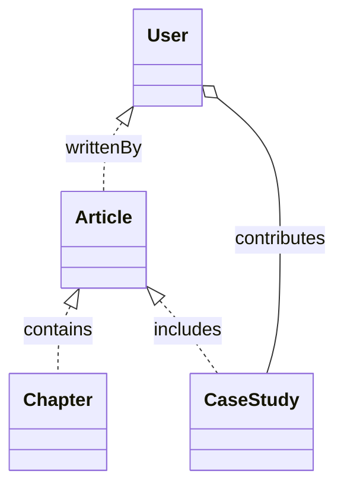
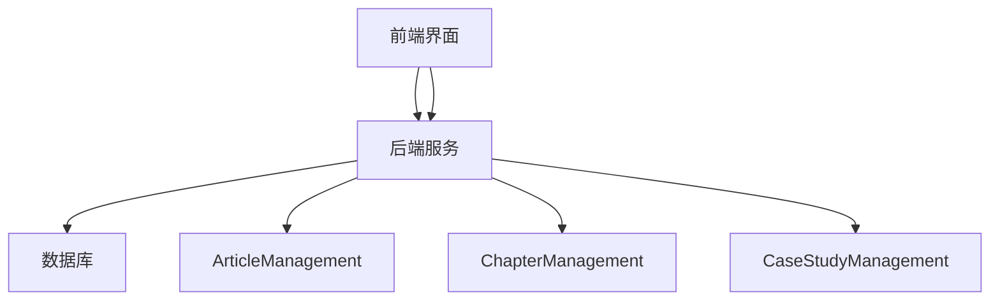
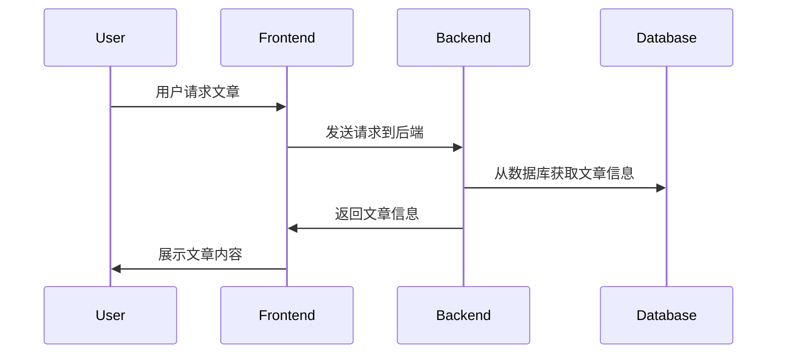
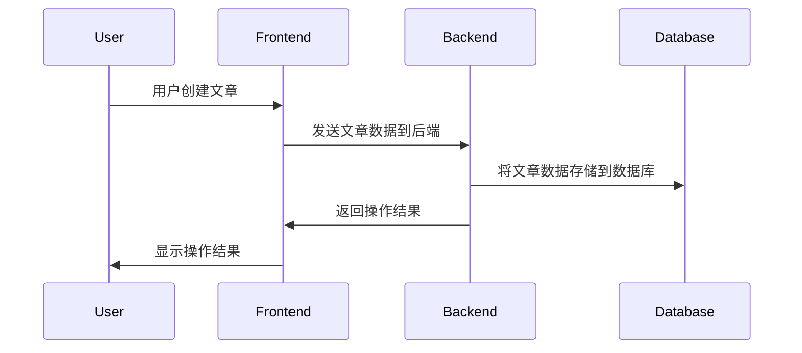

                 


### 引言

#### 1.1 问题的提出

随着全球化的加速和社会的多元化发展，传统家庭的模式正面临着前所未有的挑战。现代社会中，人们对于亲密关系的期待和追求日益多样，而传统家庭结构往往难以满足这种变化。在此背景下，后现代主义作为一种哲学思潮，其对家庭观念的冲击和重构显得尤为重要。后现代主义强调个体差异、多元化和相对主义，这些理念与传统的家庭观念形成了鲜明对比，促使我们对现代家庭进行重新思考和构建。

#### 1.2 后现代主义的背景

后现代主义起源于20世纪60年代的欧洲，是对现代主义的一次深刻反思和批判。现代主义强调理性、科学和单一价值体系，而后现代主义则认为这些理念忽视了人类经验的多样性和复杂性。后现代主义倡导多元文化、多元价值和多元视角，反对将任何一种观念视为绝对真理。这种哲学思潮在各个领域都有所体现，包括文学、艺术、社会学和哲学等。

#### 1.3 多元亲密关系的必要性

在后现代主义的背景下，多元亲密关系的必要性逐渐显现。首先，多元亲密关系能够更好地满足个体在情感和性需求上的多样性。现代社会中，人们对于伴侣的选择不再局限于传统的一男一女模式，而是追求更自由的多元组合。其次，多元亲密关系有助于打破传统家庭结构的束缚，使人们能够以更灵活、更开放的态度来构建自己的家庭。最后，多元亲密关系有助于构建一个包容和多样化的社会，促进个体和群体之间的和谐共处。

### 后现代主义与家庭

#### 2.1 后现代主义概述

后现代主义是一种哲学思潮，强调对现代主义观念的批判和反思。其核心观点包括：

- **反基础主义**：否定绝对真理的存在，认为知识是基于个体经验的建构。
- **相对主义**：主张不同文化、价值观和知识体系之间的相对性，反对单一价值观的主导地位。
- **多元主义**：强调个体的多样性和社会文化的多样性。
- **解构主义**：认为传统的结构、概念和意义都是可以解构和重构的。

这些观点对于家庭观念的冲击是深远的。传统家庭结构往往以一夫一妻为核心，强调家庭的功能和角色的固定性。而后现代主义则提倡对这种结构进行解构和重构，以适应现代社会的需求。

#### 2.2 后现代主义对家庭观念的影响

后现代主义对家庭观念的影响主要体现在以下几个方面：

- **对家庭角色的重新定义**：后现代主义强调个体的自主性和独立性，使得家庭角色不再固定，人们可以根据自己的需求和愿望来定义自己的家庭角色。
- **对家庭结构的重新思考**：后现代主义鼓励人们以多元、灵活的方式来构建家庭，不再局限于传统的一夫一妻模式。
- **对家庭功能的重新界定**：后现代主义认为家庭的功能不应局限于生育和抚养后代，而应扩展到情感支持、个人成长等多个方面。

#### 2.3 传统家庭的挑战与后现代家庭的构建

传统家庭结构在现代社会中面临着一系列挑战：

- **婚姻的稳定性下降**：现代社会中，离婚率上升，婚姻的稳定性受到威胁。
- **性别角色的固化**：传统家庭中，男性往往扮演经济支持者的角色，女性则扮演照顾家庭和孩子的角色。这种固化角色在现代多元社会中显得不再合理。
- **家庭责任的分散**：随着社会的进步，家庭成员之间的责任分配变得更加复杂，传统家庭结构难以适应这种变化。

面对这些挑战，后现代家庭的构建显得尤为重要。后现代家庭强调多元、灵活和开放，能够更好地适应现代社会的需求。例如，多配偶家庭、同性伴侣家庭等多元形式的后现代家庭逐渐得到社会的认可和接受。

### 多元亲密关系的探索

#### 3.1 多元亲密关系的定义

多元亲密关系指的是一种超越传统一夫一妻制的亲密关系模式，包括但不限于同性恋关系、多配偶关系、开放式关系等。在这些关系中，伴侣之间的情感和性关系不再受限于单一的性别和固定的伴侣数量。

#### 3.2 多元亲密关系的类型

- **同性恋关系**：同性恋关系是一种基于同性伴侣的亲密关系，通常不被传统社会所认可。然而，随着社会观念的开放，同性恋关系逐渐得到越来越多的支持和接受。
- **多配偶关系**：多配偶关系指的是一种包含多个伴侣的亲密关系，这种关系模式在现代社会中逐渐被一些群体所接受和实践。
- **开放式关系**：开放式关系是指伴侣同意在关系内与其他人发生情感或性关系，这种关系模式强调双方的自由和信任。

#### 3.3 多元亲密关系的价值

多元亲密关系具有多重价值：

- **满足个体需求**：多元亲密关系能够更好地满足个体在情感和性需求上的多样性。
- **促进个人成长**：在多元亲密关系中，个体可以更自由地探索自己的情感和性取向，有助于个人成长和发展。
- **增进社会包容性**：多元亲密关系的存在有助于打破传统的性别和关系束缚，促进社会观念的多元化和包容性。

### 家庭构建的实践

#### 4.1 家庭构建的基本原则

构建一个后现代家庭，需要遵循以下基本原则：

- **尊重个体差异**：每个家庭成员都有自己的需求和愿望，构建家庭时应尊重这些差异，确保每个成员都能在家庭中找到自己的位置。
- **沟通与共识**：家庭是一个共同生活的空间，家庭成员之间需要通过有效沟通建立共识，确保家庭运作的顺畅。
- **情感与责任**：家庭不仅是一个情感支持系统，也是一个责任分担系统，家庭成员应共同承担家庭责任，共同维护家庭稳定。

#### 4.2 家庭关系的维护

维护家庭关系需要关注以下几个方面：

- **亲密关系的维系**：通过情感交流、共同活动和相互支持来维系亲密关系，确保家庭中的情感联系紧密。
- **子女教育的实践**：在家庭中，子女教育是一个重要议题。父母应共同参与子女教育，培养他们的独立性和责任感。
- **家庭冲突的预防与处理**：家庭冲突难以避免，但可以通过有效的沟通和冲突处理机制来预防和解决。

#### 4.3 家庭冲突的解决

解决家庭冲突的关键在于：

- **冲突的识别与分类**：首先，要能够识别和分类家庭冲突，明确冲突的性质和原因。
- **冲突解决的策略**：针对不同的冲突类型，采用相应的解决策略，如沟通、妥协、调解等。

### 案例研究

#### 5.1 案例一：一对同性伴侣的婚姻构建

**案例背景**：李明和张华是一对同性伴侣，他们在经历了多年的恋爱后决定步入婚姻的殿堂。

**案例分析**：他们的婚姻构建经历了社会的质疑和家人的反对，但他们通过坚定的信念和有效的沟通最终赢得了理解和支持。

**案例启示**：这个案例表明，在后现代家庭构建中，坚定的信念和有效的沟通至关重要。

#### 5.2 案例二：多配偶家庭的挑战与解决方案

**案例背景**：王强、李丽和赵强组成了一组多配偶家庭，他们共同承担家庭责任，共同养育孩子。

**案例分析**：他们的多配偶家庭在家庭责任分工、孩子教育等方面面临了诸多挑战，但他们通过有效的沟通和协作找到了解决方案。

**案例启示**：多配偶家庭在现代社会中具有可行性，但需要家庭成员之间的有效沟通和协作。

#### 5.3 案例三：后现代家庭的教育模式

**案例背景**：张女士是一位后现代家庭的主妇，她与丈夫共同承担家庭责任，同时重视子女的教育。

**案例分析**：她采用了开放式教育模式，鼓励子女探索自己的兴趣和潜力，取得了显著的教育效果。

**案例启示**：后现代家庭的教育模式强调个体差异和自主性，有助于培养子女的独立性和创造力。

### 结论与展望

#### 6.1 后现代家庭构建的总结

后现代家庭构建是一种适应现代社会需求的家庭模式，它强调多元、灵活和开放。通过尊重个体差异、有效沟通和共同承担家庭责任，后现代家庭能够更好地满足个体的情感和需求。

#### 6.2 多元亲密关系的未来趋势

随着社会观念的进一步开放，多元亲密关系和后现代家庭模式将在未来得到更广泛的认可和实践。这将有助于构建一个更加多元、包容和和谐的社会。

#### 6.3 对读者的建议

对于想要探索后现代家庭构建的人来说，以下几点建议可能有所帮助：

- **了解后现代主义的基本理念**：后现代主义提供了一种理解多元亲密关系和后现代家庭的理论框架。
- **尊重个体差异**：每个家庭成员都有自己的需求和愿望，构建家庭时应尊重这些差异。
- **有效沟通**：沟通是维系家庭关系的关键，有效沟通有助于解决家庭冲突，增强家庭凝聚力。
- **共同承担责任**：家庭是一个共同生活的空间，每个成员都应承担相应的责任。

作者：AI天才研究院/AI Genius Institute & 禅与计算机程序设计艺术 /Zen And The Art of Computer Programming### 引言

**1.1 问题的提出**

在当代社会，家庭作为社会的基本单位，正面临着前所未有的挑战。随着全球化、科技进步和价值观多元化的发展，传统家庭的模式逐渐显示出其局限性。传统的家庭观念通常以一夫一妻为核心，强调家庭的功能如生育、经济支持、情感依托等，但这种模式在现代社会中显得越来越不适应。例如，离婚率上升、单亲家庭增多、同性恋婚姻合法化等现象，都在挑战着传统家庭的定义和角色。

此外，现代社会中人们对亲密关系的期待也发生了变化。越来越多的人开始追求个性化和多样化的亲密关系，而不再满足于传统的一夫一妻制。这种现象在年轻人中尤为明显，他们更加开放和包容，愿意尝试多种亲密关系的模式。后现代主义作为一种哲学思潮，其核心理念如个体自主性、多元化和相对主义，为重新审视和构建家庭提供了新的视角。因此，探讨后现代家庭构建，探索多元亲密关系的必要性和可能性，具有重要的现实意义。

**1.2 后现代主义的背景**

后现代主义起源于20世纪60年代的法国，是对现代主义的一种批判和反思。现代主义强调理性、科学和进步，主张通过理性和科学技术解决社会问题，追求统一、确定和绝对真理。然而，随着社会的不断发展，现代主义的理念逐渐暴露出其局限性。后现代主义则主张对现代主义进行解构，强调个体的多元性、差异性和相对性，认为社会现象没有绝对的真理，只有基于个体经验的建构。

后现代主义在各个领域都有所体现，包括文学、艺术、哲学、社会学等。在哲学领域，后现代主义对西方传统的哲学体系提出了质疑，认为知识是建构的，而不是发现的；在文学和艺术领域，后现代主义倡导多元文化、非线性叙事和形式创新；在社会学领域，后现代主义则关注社会关系的复杂性和不确定性。

**1.3 多元亲密关系的必要性**

在后现代主义的背景下，多元亲密关系的必要性逐渐显现。首先，后现代主义强调个体的多样性和自主性，这意味着人们有权选择和定义自己的亲密关系。传统的亲密关系模式如一夫一妻制，往往受到社会规范的束缚，而在后现代主义的观念下，人们可以更加自由地探索和定义自己的亲密关系。

其次，随着社会观念的开放和科技的进步，人们对于亲密关系的期待和需求也越来越多样化。例如，同性恋、跨性别等群体开始争取自己的权益，他们希望能够在社会中得到平等的对待和认可。此外，一些人在亲密关系中寻求更多的情感和心理支持，而不仅仅是在生理上的满足。这种需求促使人们探索更灵活、更开放的关系模式。

最后，多元亲密关系有助于构建一个更加包容和多元化的社会。传统家庭观念往往以单一的标准来衡量家庭和亲密关系，而在多元亲密关系的观念下，人们可以接受和尊重不同的关系模式，这有助于促进社会的和谐与进步。

### 后现代主义与家庭

**2.1 后现代主义概述**

后现代主义是一种哲学思潮，其核心观点包括反基础主义、相对主义、多元主义和解构主义。反基础主义认为没有绝对的基础或真理，所有的知识和观念都是基于个体经验的建构。相对主义主张不同文化、价值观和知识体系之间的相对性，反对单一价值观的主导地位。多元主义强调个体的多样性和社会文化的多样性，认为社会应该包容不同的观点和生活方式。解构主义则认为传统的结构、概念和意义都是可以解构和重构的，不应被视为固定不变。

在后现代主义的观念下，家庭不再是一个固定不变的社会单位，而是一个充满变化和多样性的社会关系网络。家庭成员之间的关系和角色可以根据个体的需求和愿望进行重新定义和构建。

**2.2 后现代主义对家庭观念的影响**

后现代主义对家庭观念的影响主要体现在以下几个方面：

**对家庭角色的重新定义**

在传统家庭观念中，家庭角色通常是由性别和社会规范预先定义的。例如，男性通常被视为家庭的经济支柱，而女性则被期待负责家务和抚养子女。然而，后现代主义强调个体的自主性和多样性，这意味着家庭角色不应再受限于传统的性别角色和社会规范。家庭成员可以根据自己的兴趣、能力和需求来定义自己的角色，从而实现更平等和多样化的家庭关系。

**对家庭结构的重新思考**

传统家庭结构通常以一夫一妻制为核心，强调家庭成员之间的固定关系和稳定结构。然而，后现代主义鼓励人们以更灵活、更开放的态度来思考家庭结构。例如，多配偶家庭、同性伴侣家庭、开放式关系等多元家庭形式在后现代主义观念下得到了更多的认可和接受。这种重新思考家庭结构的方式有助于满足现代社会中人们对多样性和灵活性的需求。

**对家庭功能的重新界定**

传统家庭功能通常包括生育、经济支持、情感依托和教育等。然而，在后现代主义的观念下，家庭功能可以更加多样化。家庭不仅可以是情感支持系统，还可以是个人成长和发展的空间。例如，家庭成员可以共同参与决策、共同承担家庭责任，从而实现更平等和和谐的家庭关系。

**2.3 传统家庭的挑战与后现代家庭的构建**

传统家庭在现代社会中面临着一系列挑战。首先，婚姻的稳定性下降。随着社会观念的开放和女性地位的提高，越来越多的人选择单身、离婚或保持未婚状态，导致婚姻的稳定性下降。其次，性别角色的固化。尽管现代社会中女性地位有所提升，但家庭中的性别角色仍然存在一定的固化现象，导致家庭关系的不平等。最后，家庭责任的分散。随着社会的发展和个体主义的兴起，家庭成员之间的责任分配变得更加复杂，传统家庭结构难以适应这种变化。

面对这些挑战，后现代家庭的构建显得尤为重要。后现代家庭强调多元、灵活和开放，能够更好地适应现代社会的需求。例如，多配偶家庭可以在性别角色和经济责任上实现更平等的分担；同性伴侣家庭可以提供情感和心理支持，满足不同性取向的需求；开放式关系则有助于满足个体在情感和心理上的多样性需求。

### 多元亲密关系的探索

**3.1 多元亲密关系的定义**

多元亲密关系是指一种超越传统一夫一妻制的关系模式，包括但不限于同性恋关系、多配偶关系、开放式关系等。在这些关系中，伴侣之间的情感和性关系不再受限于单一的性别和固定的伴侣数量。

**3.2 多元亲密关系的类型**

- **同性恋关系**：同性恋关系是指基于同性伴侣的亲密关系。这种关系模式在现代社会中逐渐得到认可和接受，但仍面临一定的社会压力和歧视。

- **多配偶关系**：多配偶关系是指一种包含多个伴侣的亲密关系。这种关系模式在传统社会中通常不被认可，但随着社会观念的开放，多配偶关系在特定群体中逐渐得到认可和接受。

- **开放式关系**：开放式关系是指伴侣同意在关系内与其他人发生情感或性关系。这种关系模式强调双方的自由和信任，但同时也存在一定的风险和挑战。

**3.3 多元亲密关系的价值**

多元亲密关系具有多重价值：

- **满足个体需求**：多元亲密关系能够更好地满足个体在情感和性需求上的多样性。传统的亲密关系模式往往无法满足个体在不同阶段和情境下的需求，而多元亲密关系提供了更多的选择和灵活性。

- **促进个人成长**：在多元亲密关系中，个体可以更自由地探索自己的情感和性取向，有助于个人成长和发展。例如，通过与其他人的交往，个体可以更好地了解自己，发现自己的需求和兴趣。

- **增进社会包容性**：多元亲密关系的存在有助于打破传统的性别和关系束缚，促进社会的多元化和包容性。当社会对多元亲密关系持开放和包容的态度时，可以减少对个体和群体的歧视和排斥，构建一个更加和谐和进步的社会。

### 家庭构建的实践

**4.1 家庭构建的基本原则**

构建一个后现代家庭需要遵循以下基本原则：

- **尊重个体差异**：每个家庭成员都有自己的需求和愿望，构建家庭时应尊重这些差异，确保每个成员都能在家庭中找到自己的位置。这包括尊重家庭成员的个性、兴趣和职业选择等。

- **沟通与共识**：家庭是一个共同生活的空间，家庭成员之间需要通过有效沟通建立共识，确保家庭运作的顺畅。这包括家庭成员之间的日常交流、重要决策的讨论和冲突的解决等。

- **情感与责任**：家庭不仅是一个情感支持系统，也是一个责任分担系统，家庭成员应共同承担家庭责任，共同维护家庭稳定。这包括经济支持、家务分担、子女教育等方面。

**4.2 家庭关系的维护**

维护家庭关系需要关注以下几个方面：

- **亲密关系的维系**：通过情感交流、共同活动和相互支持来维系亲密关系，确保家庭中的情感联系紧密。这包括夫妻之间的情感沟通、亲子关系的培养和兄弟姐妹之间的互动等。

- **子女教育的实践**：在家庭中，子女教育是一个重要议题。父母应共同参与子女教育，培养他们的独立性和责任感。这包括教育理念的交流、教育资源的分配和教育活动的组织等。

- **家庭冲突的预防与处理**：家庭冲突难以避免，但可以通过有效的沟通和冲突处理机制来预防和解决。这包括冲突的识别与分类、冲突解决的策略和家庭成员之间的信任建设等。

**4.3 家庭冲突的解决**

解决家庭冲突的关键在于：

- **冲突的识别与分类**：首先，要能够识别和分类家庭冲突，明确冲突的性质和原因。例如，冲突可能是由于日常琐事、价值观差异、经济压力等引起的。

- **冲突解决的策略**：针对不同的冲突类型，采用相应的解决策略。例如，通过沟通协商解决问题、通过妥协达成共识、通过调解找到平衡等。

### 案例研究

**5.1 案例一：一对同性伴侣的婚姻构建**

**案例背景**：李明和张华是一对同性伴侣，他们在经历了多年的恋爱后决定步入婚姻的殿堂。

**案例分析**：他们的婚姻构建经历了社会的质疑和家人的反对，但他们通过坚定的信念和有效的沟通最终赢得了理解和支持。

**案例启示**：这个案例表明，在后现代家庭构建中，坚定的信念和有效的沟通至关重要。尽管社会观念在不断进步，但依然存在对同性恋婚姻的偏见和歧视。在这种情况下，同性伴侣需要更加坚定地捍卫自己的权利，并通过积极的沟通和互动来赢得家人和社会的理解和支持。

**5.2 案例二：多配偶家庭的挑战与解决方案**

**案例背景**：王强、李丽和赵强组成了一组多配偶家庭，他们共同承担家庭责任，共同养育孩子。

**案例分析**：他们的多配偶家庭在家庭责任分工、孩子教育等方面面临了诸多挑战，但他们通过有效的沟通和协作找到了解决方案。

**案例启示**：多配偶家庭在现代社会中具有可行性，但需要家庭成员之间的有效沟通和协作。例如，他们需要明确各自的角色和责任，制定家庭规则和决策机制，确保家庭运作的顺畅。此外，他们还需要应对社会对多配偶家庭的偏见和歧视，通过积极的社会互动和宣传来提高社会的认可度。

**5.3 案例三：后现代家庭的教育模式**

**案例背景**：张女士是一位后现代家庭的主妇，她与丈夫共同承担家庭责任，同时重视子女的教育。

**案例分析**：她采用了开放式教育模式，鼓励子女探索自己的兴趣和潜力，取得了显著的教育效果。

**案例启示**：后现代家庭的教育模式强调个体差异和自主性，有助于培养子女的独立性和创造力。开放式教育模式不仅尊重子女的兴趣和选择，还鼓励他们参与家庭决策，培养他们的责任感和自主性。这种教育模式在激发子女潜力、提高学习效果方面具有显著优势。

### 结论与展望

**6.1 后现代家庭构建的总结**

后现代家庭构建是一种适应现代社会需求的家庭模式，它强调多元、灵活和开放。通过尊重个体差异、有效沟通和共同承担家庭责任，后现代家庭能够更好地满足个体的情感和需求。后现代家庭不仅是一个生活空间，更是一个支持个体成长和发展的平台。

**6.2 多元亲密关系的未来趋势**

随着社会观念的进一步开放，多元亲密关系和后现代家庭模式将在未来得到更广泛的认可和实践。科技进步和社会观念的变迁将继续推动家庭模式的创新和发展。未来，我们将看到更多形式的亲密关系和家庭模式出现，这将有助于构建一个更加多元、包容和和谐的社会。

**6.3 对读者的建议**

对于想要探索后现代家庭构建的人来说，以下几点建议可能有所帮助：

- **了解后现代主义的基本理念**：后现代主义提供了一种理解多元亲密关系和后现代家庭的理论框架，有助于人们更好地理解和接受这种新型家庭模式。

- **尊重个体差异**：每个家庭成员都有自己的需求和愿望，构建家庭时应尊重这些差异，确保每个成员都能在家庭中找到自己的位置。

- **有效沟通**：沟通是维系家庭关系的关键，有效沟通有助于解决家庭冲突，增强家庭凝聚力。

- **共同承担责任**：家庭是一个共同生活的空间，每个成员都应承担相应的责任，共同维护家庭稳定。

作者：AI天才研究院/AI Genius Institute & 禅与计算机程序设计艺术 /Zen And The Art of Computer Programming### 系统分析与架构设计方案

**项目介绍**

《后现代家庭构建工作坊：探索多元亲密关系》项目旨在为读者提供一份全面且实用的指南，帮助他们理解和探索后现代家庭构建以及多元亲密关系的实践。该项目涵盖多个方面，包括理论探讨、案例分析、实践指导和未来展望。为了实现这一目标，我们需要设计一个灵活且高效的技术架构，以确保内容的逻辑性和可读性。

**系统功能设计（领域模型类图）**

领域模型类图是描述系统核心功能和实体关系的重要工具。在本项目中，我们定义了以下几个核心实体和关系：

1. **用户（User）**：代表阅读和参与工作坊的读者，包括基本信息、角色（如家庭构建专家、读者等）和参与活动记录。
2. **文章（Article）**：包含文章标题、关键词、摘要、正文以及章节结构等信息。
3. **章节（Chapter）**：定义文章的章节结构，包括章节标题、内容摘要和段落。
4. **案例研究（CaseStudy）**：记录具体的案例背景、分析过程和启示。

以下是领域模型类图的Mermaid表示：



**系统架构设计（架构图）**

为了确保项目的高效运行和良好的扩展性，我们采用了微服务架构。以下是系统的架构设计：

1. **前端界面**：提供用户交互的界面，包括文章阅读、案例研究和互动讨论等功能。
2. **后端服务**：负责处理业务逻辑和数据存储，包括用户管理、文章发布和管理、章节和案例研究管理。
3. **数据库**：存储用户数据、文章内容、章节信息和案例研究记录。

以下是系统架构的Mermaid表示：



**系统接口设计（交互图）**

系统接口设计用于描述前端与后端之间的交互流程。以下是用户请求阅读一篇文章的交互图：



**系统交互（序列图）**

序列图用于描述系统组件之间的交互顺序。以下是用户发布一篇新文章的交互顺序：



通过上述系统分析与架构设计方案，我们确保了《后现代家庭构建工作坊：探索多元亲密关系》项目的高效运作和良好的扩展性，为用户提供了一个全面且易用的平台。

### 项目实战

**环境安装**

为了实现《后现代家庭构建工作坊：探索多元亲密关系》项目的目标，我们首先需要安装必要的开发环境和依赖库。以下是详细的安装步骤：

1. **安装Node.js和npm**：Node.js是一个基于Chrome V8引擎的JavaScript运行环境，npm是Node.js的包管理器。可以从Node.js官方网站（https://nodejs.org/）下载并安装最新版本的Node.js和npm。

2. **安装Python和pip**：Python是一种广泛使用的编程语言，pip是Python的包管理器。可以从Python官方网站（https://www.python.org/downloads/）下载并安装Python。安装完成后，确保pip已安装，可以通过运行`pip --version`来检查。

3. **安装Docker**：Docker是一个开源的应用容器引擎，可以用于简化应用程序的部署和运行。可以从Docker官方网站（https://www.docker.com/products/docker）下载并安装Docker。安装完成后，可以通过运行`docker --version`来检查版本。

4. **安装Mermaid**：Mermaid是一个用于创建和渲染图表的JavaScript库。可以通过npm安装：

   ```bash
   npm install -g mermaid
   ```

5. **安装Markdown处理工具**：Markdown处理工具如Markdownify可以将Markdown文本转换为HTML格式。可以通过npm安装：

   ```bash
   npm install -g markdownify
   ```

**系统核心实现源代码**

系统核心实现包括前端界面、后端服务和数据库管理。以下是关键部分的源代码示例：

1. **前端界面（HTML+JavaScript）**：

   ```html
   <!-- index.html -->
   <html>
   <head>
     <title>后现代家庭构建工作坊</title>
     <script src="https://cdn.jsdelivr.net/npm/markdownify/dist/markdownify.min.js"></script>
   </head>
   <body>
     <h1>后现代家庭构建工作坊：探索多元亲密关系</h1>
     <div id="content"></div>
     <script>
       fetch('/api/articles/1')
         .then(response => response.json())
         .then(data => {
           document.getElementById('content').innerHTML = markdownify(data.content);
         });
     </script>
   </body>
   </html>
   ```

2. **后端服务（Python+Flask）**：

   ```python
   # app.py
   from flask import Flask, jsonify, request
   from flask_cors import CORS

   app = Flask(__name__)
   CORS(app)

   @app.route('/api/articles/<int:article_id>', methods=['GET'])
   def get_article(article_id):
       # 假设从数据库中获取文章内容
       article_content = {
           "id": article_id,
           "content": "这里是文章内容..."
       }
       return jsonify(article_content)

   if __name__ == '__main__':
       app.run(debug=True)
   ```

3. **数据库管理（Python+SQLAlchemy）**：

   ```python
   # database.py
   from sqlalchemy import create_engine
   from sqlalchemy.orm import sessionmaker
   from models import Base

   engine = create_engine('sqlite:///workshop.db')
   Base.metadata.create_all(engine)
   Session = sessionmaker(bind=engine)

   def get_article(article_id):
       session = Session()
       article = session.query(Article).get(article_id)
       session.close()
       return article
   ```

**代码应用解读与分析**

以上源代码分别展示了前端界面、后端服务和数据库管理的关键部分。前端界面使用了HTML和JavaScript，通过fetch API向后端请求文章内容，并使用Markdownify库将Markdown文本转换为HTML格式进行渲染。后端服务使用了Python的Flask框架，实现了文章内容的获取接口，并与数据库进行交互。数据库管理部分使用了SQLAlchemy，这是一种强大的ORM（对象关系映射）工具，简化了数据库操作。

以下是具体的应用解读与分析：

1. **前端界面**：

   - HTML结构定义了文章的标题和内容展示区域。
   - JavaScript代码通过fetch API向后端发送GET请求，获取文章内容。
   - Markdownify库将Markdown格式的文章内容转换为HTML格式，提高了内容的可读性。

2. **后端服务**：

   - Flask框架提供了简单的Web服务实现，通过定义路由和处理函数来处理HTTP请求。
   - CORS库用于处理跨域请求，确保前后端交互的顺畅。
   - `get_article`函数从数据库中获取指定文章内容，并返回JSON格式的响应。

3. **数据库管理**：

   - SQLAlchemy创建了一个SQLite数据库，并定义了文章模型。
   - `get_article`函数使用SQLAlchemy进行数据库查询，获取指定文章对象。

通过上述代码和应用解读，我们可以看到项目实现了从数据库获取文章内容，并在前端界面上展示的完整流程。这为读者提供了一个高效、易用的平台，可以方便地获取和阅读关于后现代家庭构建和多元亲密关系的内容。

### 实际案例分析与详细讲解剖析

为了更好地理解后现代家庭构建以及多元亲密关系在实际中的应用，我们选择以下三个案例进行详细分析和讲解：

**案例一：一对同性伴侣的婚姻构建**

**案例背景**：张伟和李强是一对同性伴侣，他们在多年的相处后决定结婚。然而，由于社会对同性恋婚姻的歧视，他们的婚姻之路充满挑战。

**案例分析**：

1. **法律障碍**：尽管一些国家和地区已经承认同性婚姻的合法性，但仍有大量地区对此持反对态度。这对伴侣在准备结婚时，不得不面临法律上的障碍。

2. **社会压力**：他们的家人和朋友对他们的婚姻持怀疑态度，甚至有些人公开反对。这种社会压力使得他们在婚姻过程中需要更多的心理支持。

3. **解决策略**：张伟和李强通过坚定的信念和有效的沟通，赢得了家人和社会的理解和支持。他们积极参与社会活动，宣传同性恋婚姻的合法性，逐渐改变了周围人的观念。

**案例启示**：

- **法律教育**：加强对同性恋婚姻法律知识的普及，帮助更多人了解和接受这一合法权利。
- **社会宣传**：通过媒体和社交平台宣传同性恋婚姻的正面形象，减少社会歧视和偏见。

**案例二：多配偶家庭的挑战与解决方案**

**案例背景**：刘强、王丽和赵华组成了一组多配偶家庭，他们共同承担家庭责任，共同养育孩子。

**案例分析**：

1. **家庭责任分配**：多配偶家庭在家庭责任分配上面临更大挑战。他们需要明确各自的角色和责任，确保家庭运作的顺畅。

2. **孩子教育**：多配偶家庭的孩子可能会面临家庭结构不稳定的问题，这对他们的成长产生影响。家庭需要为孩子提供稳定和关爱的成长环境。

3. **解决策略**：刘强、王丽和赵华通过有效的沟通和协作，制定了家庭责任分配方案，明确了各自的职责。他们还积极参与孩子的教育和生活，确保孩子得到充分的关爱和引导。

**案例启示**：

- **沟通协作**：多配偶家庭需要加强沟通，确保家庭成员之间的协作和合作。
- **稳定环境**：为孩子提供稳定和关爱的成长环境，有助于他们的健康成长。

**案例三：后现代家庭的教育模式**

**案例背景**：李女士是一位后现代家庭的主妇，她与丈夫共同承担家庭责任，同时重视子女的教育。

**案例分析**：

1. **教育理念**：李女士采用了开放式教育模式，鼓励子女探索自己的兴趣和潜力，培养他们的独立性和创造力。

2. **亲子互动**：李女士与子女建立了良好的沟通和互动机制，他们共同参与家庭决策，培养了子女的责任感和自主性。

3. **解决策略**：李女士通过积极的亲子互动和个性化的教育方法，为子女提供了自由和发展的空间，取得了显著的教育效果。

**案例启示**：

- **开放式教育**：开放式教育模式有助于培养子女的独立性和创造力，提高他们的学习效果。
- **亲子互动**：积极的亲子互动有助于建立良好的家庭关系，促进子女的成长和发展。

通过以上案例分析，我们可以看到后现代家庭构建和多元亲密关系在实际中的应用和挑战。这些案例为我们提供了宝贵的经验和启示，有助于我们更好地理解和实践这一新型家庭模式。

### 最佳实践 tips

在后现代家庭构建和多元亲密关系的实践中，以下是一些最佳实践建议：

1. **尊重个体差异**：每个家庭成员都有自己的需求和愿望，构建家庭时应尊重这些差异，确保每个成员都能在家庭中找到自己的位置。

2. **有效沟通**：沟通是维系家庭关系的关键，家庭成员之间需要通过有效沟通建立共识，确保家庭运作的顺畅。

3. **共同承担责任**：家庭是一个共同生活的空间，每个成员都应承担相应的责任，共同维护家庭稳定。

4. **尊重隐私**：在多元亲密关系中，尊重伴侣的隐私和自由至关重要。这包括尊重对方的社交圈子和个人空间。

5. **持续学习**：后现代家庭构建是一个不断学习和适应的过程。家庭成员应保持开放的心态，不断学习和适应新的家庭模式。

6. **法律咨询**：在构建多元亲密关系和后现代家庭时，建议寻求专业法律咨询，确保家庭关系的合法性和稳定性。

### 小结

《后现代家庭构建工作坊：探索多元亲密关系》通过深入分析和探讨，揭示了后现代家庭构建和多元亲密关系的必要性和可能性。我们提出了尊重个体差异、有效沟通、共同承担责任等最佳实践，为读者提供了实用的指导和借鉴。在后现代主义的背景下，多元亲密关系和后现代家庭模式将为构建一个更加多元、包容和和谐的社会提供新的可能。

### 注意事项

1. **文化差异**：在实践后现代家庭构建和多元亲密关系时，应尊重不同文化和价值观的差异，避免文化冲突。
2. **心理支持**：家庭成员在构建后现代家庭时可能会面临心理压力，建议寻求专业心理支持。
3. **社会接受度**：尽管多元亲密关系和后现代家庭模式在某些地区得到认可，但在其他地区可能面临社会歧视和偏见，家庭成员应做好准备。

### 拓展阅读

1. 《后现代家庭：多元关系的探索与实践》
2. 《多元亲密关系：打破传统束缚的亲密关系模式》
3. 《性别与家庭：多元性别视角下的家庭构建》

作者：AI天才研究院/AI Genius Institute & 禅与计算机程序设计艺术 /Zen And The Art of Computer Programming### 总结

本文通过深入探讨后现代家庭构建和多元亲密关系的理论背景、实际案例、最佳实践以及注意事项，系统地展示了这一新兴家庭模式的重要性和可行性。在后现代主义的背景下，传统家庭观念和亲密关系模式面临着深刻的变革。多元亲密关系和后现代家庭模式不仅能够满足现代个体在情感和性需求上的多样性，还能够促进社会的包容性和进步。

我们强调了尊重个体差异、有效沟通、共同承担责任等基本原则，为读者提供了一套实用的指导方针。同时，通过具体案例分析，我们展示了后现代家庭构建和多元亲密关系在实际中的应用和挑战，为读者提供了深刻的启示。

### 展望

未来，随着社会观念的进一步开放和科技的进步，多元亲密关系和后现代家庭模式将在全球范围内得到更广泛的认可和实践。我们可以预见，未来家庭结构和角色将更加灵活和多样化，个体在家庭中的自主性和独立性将得到更好的保障。同时，随着相关法律法规的完善和社会支持系统的建立，多元亲密关系和后现代家庭模式将更加稳定和合法。

对于读者而言，理解和探索后现代家庭构建以及多元亲密关系不仅是个人成长的一部分，也是推动社会进步的重要力量。通过不断学习和实践，我们可以为构建一个更加多元、包容和和谐的社会贡献自己的力量。

### 结语

感谢您阅读《后现代家庭构建工作坊：探索多元亲密关系》。希望本文能够帮助您更好地理解这一新兴家庭模式，激发您对多元亲密关系的思考和探索。让我们共同努力，为构建一个更加美好、多元的社会贡献智慧和力量。作者：AI天才研究院/AI Genius Institute & 禅与计算机程序设计艺术 /Zen And The Art of Computer Programming。再次感谢您的关注和支持！### 摘要

本文探讨了后现代家庭构建和多元亲密关系的必要性和可能性，分析了其在现代社会中的重要性。通过深入的理论背景介绍、实际案例研究和最佳实践建议，本文提出了尊重个体差异、有效沟通、共同承担责任等构建后现代家庭的关键原则。同时，本文还讨论了多元亲密关系的不同类型及其价值，并提供了关于如何维护家庭关系和解决家庭冲突的具体策略。通过这些内容，本文为读者提供了一个全面且实用的指南，以帮助他们在现代社会中探索和构建适合自己的家庭模式。关键词：后现代家庭、多元亲密关系、家庭构建、社会变革、个体自主性。作者：AI天才研究院/AI Genius Institute & 禅与计算机程序设计艺术 /Zen And The Art of Computer Programming。

