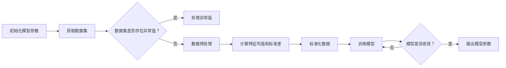
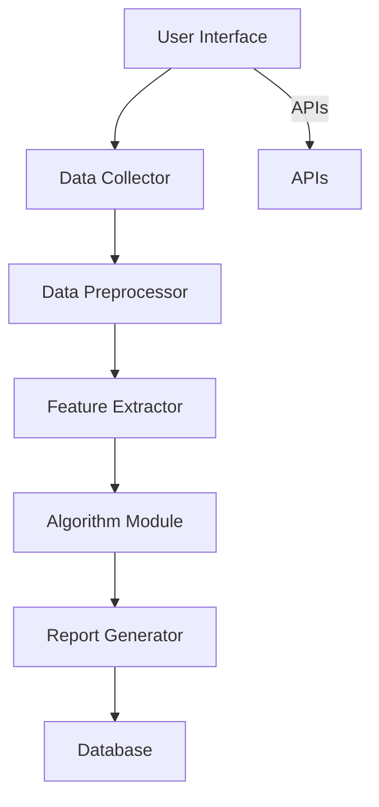
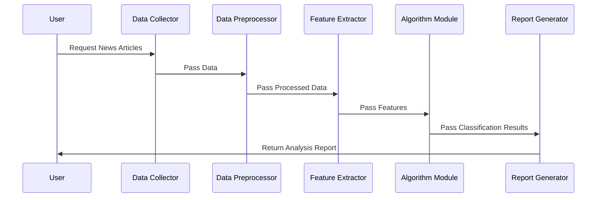

                 

## 引言：探索后真实时代的真相侦探：培养媒体素养

随着信息技术的飞速发展，我们正逐步进入一个被学者们称为“后真实时代”（Post-Reality Age）的新纪元。在这个时代，虚拟现实、增强现实、人工智能等技术的应用日益普及，使得信息的传播方式、真实性判断以及人们的认知结构都发生了翻天覆地的变化。传统的新闻媒体和社交平台正在被重塑，信息爆炸和假新闻泛滥成为这个时代的重要特征。

### 什么是后真实时代？

后真实时代，即是一个虚拟和现实交织、信息超载且真假难辨的时代。其特点主要表现在以下几个方面：

1. **信息的虚拟化**：随着虚拟现实技术的发展，人们可以在虚拟世界中体验前所未有的真实感，同时，虚假信息也能够通过高超的计算机图形技术和人工智能算法被伪造得极其逼真。

2. **算法的统治**：算法和大数据分析技术日益渗透到媒体生产的各个环节，算法推荐、深度学习等技术使得信息的传播更加精准和高效，但同时也导致了信息茧房和偏见放大等问题。

3. **去中心化的信息传播**：社交媒体和移动互联网的普及，使得信息传播的渠道变得多样化，但同时也带来了信息源的复杂性和可靠性降低。

### 媒体素养的重要性

在这样一个后真实时代，培养媒体素养显得尤为重要。媒体素养不仅仅是指识别真假新闻的能力，更包括对信息来源、信息传播机制、算法影响等深层次问题的理解。

1. **增强批判性思维**：通过培养媒体素养，人们能够更加批判性地分析和评估接收到的信息，避免盲目接受信息，减少被假新闻误导的风险。

2. **提高信息识别能力**：了解媒体的基本运作原理，能够帮助人们更好地识别和辨别虚假信息和误导性内容，增强信息识别能力。

3. **维护社会信任**：媒体素养的培养有助于维护社会信任，促进信息传播的透明性和公正性，减少信息战和文化战争的风险。

### 本书结构概述

本书旨在为广大读者提供一份系统而实用的指南，帮助他们在后真实时代中培养出色的媒体素养。全书共分为十章，内容涵盖从背景介绍到实际应用的各个方面。

- **第一章**：介绍后真实时代的背景和发展，让读者了解我们所处的时代背景及其特点。
- **第二章**：详细解析媒体素养的定义、意义和核心要素。
- **第三章**：探讨媒体素养中的核心概念及其相互关系。
- **第四章**：深入探讨算法原理和数学模型，为媒体分析提供理论基础。
- **第五章**：分析系统设计和架构，为实际应用奠定基础。
- **第六章**：通过项目实战，展示如何在实际中应用所学知识。
- **第七章**：总结最佳实践和反思，提供未来发展方向的思考。

通过本书的阅读，读者不仅能够对后真实时代有更深刻的认识，还能学会如何在这个时代中培养和提高自己的媒体素养，成为真正的真相侦探。

### 关键词

- 后真实时代
- 媒体素养
- 信息识别
- 批判性思维
- 算法原理
- 信息传播
- 社会信任
- 人工智能

### 摘要

本书围绕“后真实时代的真相侦探：培养媒体素养”这一主题，旨在帮助读者深入了解当前时代的特征及其对媒体信息传播的影响。书中首先介绍了什么是后真实时代，探讨了其背景和发展，并分析了媒体素养的定义、意义以及核心要素。接下来，书中深入探讨了算法原理和数学模型，为媒体分析提供了理论基础。随后，通过系统分析和架构设计，为实际应用奠定了基础。书中还通过实际项目实战，展示了如何将所学知识应用于实际中。最后，总结了最佳实践和反思，为读者提供了未来发展的方向。通过本书，读者将能够提高自己的媒体素养，成为后真实时代中的真相侦探。

### 第一章：后真实时代的崛起

#### 背景与定义

后真实时代的概念并非凭空出现，它源自对当前信息社会复杂性的深刻反思和观察。随着信息技术的迅猛发展，尤其是互联网和移动通信技术的普及，信息传播的方式和速度发生了根本性的变化。这个时代的特点主要体现在以下几个方面：

1. **信息爆炸**：每天，全球范围内产生海量数据，包括文本、图片、音频和视频等。这些数据中，既有真实的新闻事件，也有大量的虚假信息和误导性内容。

2. **算法主导**：在信息传播过程中，算法扮演着越来越重要的角色。从新闻推荐到社交媒体内容排序，算法的运用使得信息传播更加精准和高效，但也导致了信息茧房和偏见放大等问题。

3. **虚拟与现实交织**：虚拟现实（VR）和增强现实（AR）技术的发展，使得人们能够在虚拟世界中体验到前所未有的真实感。然而，这也为虚假信息制造提供了新的手段，例如深度伪造（Deepfake）技术，可以制作出极其逼真的虚假视频和音频。

#### 发展历程

后真实时代的崛起并不是一夜之间的事情，而是经历了长期的技术积累和社会变迁。

1. **互联网的兴起**：20世纪90年代，互联网的普及使得信息传播的速度和范围大大扩展。信息的快速流通带来了信息过载，同时也为虚假信息的传播提供了渠道。

2. **社交媒体的兴起**：21世纪初，社交媒体如Facebook、Twitter等开始兴起，这些平台使得每个人都可以成为信息的传播者。社交媒体的兴起加速了信息传播的速度，但同时也加剧了信息的真实性和可靠性问题。

3. **人工智能的应用**：近年来，人工智能技术的快速发展，尤其是深度学习技术的应用，使得信息处理和分析的能力大大增强。然而，算法的智能性和复杂性也带来了新的挑战，如算法偏见和隐私泄露等问题。

#### 核心概念与联系

在后真实时代，以下几个核心概念显得尤为重要：

1. **媒体素养**：指个体在接触和使用媒体时，能够批判性地思考、分析和评估信息的能力。媒体素养包括信息识别、批判性思维、信息来源评估等多个方面。

2. **算法**：算法是用于解决特定问题的系统方法，它们在信息传播中起着核心作用。了解算法的运作原理和潜在问题，有助于提高媒体素养。

3. **虚假信息**：虚假信息是指故意制造或传播的、与事实不符的信息。虚假信息的识别和防范是后真实时代媒体素养的重要任务。

4. **隐私**：在信息社会中，隐私问题越来越受到关注。了解隐私保护的基本原则和策略，有助于维护个人信息的安全。

这些核心概念之间相互联系，共同构成了后真实时代媒体素养的基础。

#### ER图架构

为了更清晰地展示这些核心概念之间的联系，我们可以使用ER（Entity-Relationship）图来描述。

```mermaid
erDiagram
  Media Literacy --> Information Identification
  Media Literacy --> Critical Thinking
  Media Literacy --> Source Evaluation
  Algorithm --> Information Analysis
  Algorithm --> Bias and Privacy Issues
  Fake Information --> Misinformation
  Privacy --> Data Security
```

在这个ER图中，媒体素养作为一个整体，与信息识别、批判性思维、信息来源评估等子概念紧密相关。算法在信息分析和潜在问题中扮演核心角色，虚假信息和隐私则分别代表了信息素养的两个重要挑战。

通过这一章的探讨，我们初步了解了后真实时代的背景和发展，以及媒体素养在这其中扮演的重要角色。接下来的章节将深入探讨媒体素养的各个核心概念，以及如何在实践中提升媒体素养，成为真相侦探。

### 第二章：理解媒体素养

#### 媒体素养的定义

媒体素养（Media Literacy）是指个体在接触、使用和理解媒体内容时，能够批判性地分析、评估和制作信息的能力。它不仅涉及识别真假信息，还包括对信息来源、传播机制、算法影响等的深入理解。媒体素养的核心目标是培养个体的信息识别能力、批判性思维和自我表达能力。

#### 媒体素养的意义

在信息爆炸和虚假信息泛滥的后真实时代，媒体素养的意义尤为突出：

1. **防止误导和谣言**：通过提高媒体素养，个体能够更好地识别虚假信息和谣言，避免被误导，减少社会恐慌和误解。

2. **增强批判性思维**：媒体素养培养个体的批判性思维能力，使其能够从多个角度分析和评估信息，减少盲目接受信息的倾向。

3. **维护个人隐私**：了解媒体运作原理和隐私保护策略，有助于个体维护自己的隐私权，减少个人信息泄露的风险。

4. **提升社会信任**：媒体素养的提高有助于构建一个更加透明、公正和可信的信息环境，从而提升社会整体的信任度。

#### 媒体素养的核心要素

媒体素养包括多个核心要素，以下是其主要方面：

1. **信息识别**：识别真假信息是媒体素养的基础。个体需要学会从多个渠道验证信息，了解媒体内容的真实性和可靠性。

2. **批判性思维**：批判性思维要求个体在接触信息时，不仅要接受信息，还要质疑信息，从多个角度分析其合理性和可信度。

3. **信息来源评估**：评估信息来源的可靠性和权威性是媒体素养的重要组成部分。个体需要学会识别权威媒体、专业机构和非官方信息源。

4. **算法理解**：了解算法的运作原理和潜在问题，有助于个体识别算法偏见、信息茧房等问题，从而做出更理性的信息决策。

5. **信息制作和传播**：媒体素养还涉及信息制作和传播的能力，个体需要学会如何制作准确、公正的信息，并有效地传播给他人。

#### 媒体素养与信息传播机制的关系

媒体素养不仅与个体的信息接收和处理能力相关，还与信息传播机制密切相关：

1. **信息传播渠道**：了解不同信息传播渠道的特点和优势，有助于个体选择更可靠的信息来源。

2. **信息传播过程**：理解信息传播的过程，包括信息的采集、编辑、发布和传播，有助于个体识别信息失真和误导的环节。

3. **算法影响**：算法在信息传播中起着关键作用，个体需要了解算法推荐、数据分析等机制，以避免被算法误导。

#### 总结

媒体素养是后真实时代不可或缺的能力，它不仅帮助个体在信息海洋中辨别真假，还促进批判性思维和信息隐私保护。通过理解媒体素养的定义、意义和核心要素，个体可以更好地应对后真实时代的挑战，成为真正的真相侦探。接下来，我们将进一步探讨媒体素养中的核心概念，以及如何通过实际操作来提升媒体素养。

### 第三章：核心概念与相互关系

在探讨媒体素养的各个方面时，有必要详细解析其中的核心概念，并展示它们之间的相互关系。以下是几个关键概念的定义、属性、对比表格以及相应的ER图架构。

#### 1. 媒体素养

**定义**：媒体素养是指个体在接触和使用媒体内容时，能够批判性地分析、评估和制作信息的能力。

**属性**：

- **信息识别**：识别真假信息的能力。
- **批判性思维**：对信息进行质疑和分析的能力。
- **信息来源评估**：评估信息来源可靠性的能力。
- **信息制作和传播**：制作和传播准确、公正信息的能力。

**对比表格**：

| 要素          | 描述                                                         | 关联性 |
| ------------- | ------------------------------------------------------------ | ------ |
| 信息识别      | 识别真假信息的能力                                           | **核心** |
| 批判性思维    | 对信息进行质疑和分析的能力                                   | **关键** |
| 信息来源评估  | 评估信息来源可靠性的能力                                     | **重要** |
| 信息制作和传播 | 制作和传播准确、公正信息的能力                               | **辅助** |

#### 2. 算法

**定义**：算法是用于解决特定问题的系统方法，包括一系列规则和步骤，用于处理和操作数据。

**属性**：

- **算法原理**：算法的工作原理和流程。
- **算法优化**：提高算法效率和准确性的方法。
- **算法偏见**：算法在处理数据时可能产生的系统性偏差。

**对比表格**：

| 要素          | 描述                                                         | 关联性 |
| ------------- | ------------------------------------------------------------ | ------ |
| 算法原理      | 算法的工作原理和流程                                         | **核心** |
| 算法优化      | 提高算法效率和准确性的方法                                   | **关键** |
| 算法偏见      | 算法在处理数据时可能产生的系统性偏差                         | **重要** |

#### 3. 虚假信息

**定义**：虚假信息是指故意制造或传播的、与事实不符的信息。

**属性**：

- **虚假信息的识别**：识别虚假信息的能力。
- **虚假信息的传播**：虚假信息在媒体和社交网络中的传播方式。
- **虚假信息的危害**：虚假信息对社会和个人可能造成的负面影响。

**对比表格**：

| 要素          | 描述                                                         | 关联性 |
| ------------- | ------------------------------------------------------------ | ------ |
| 虚假信息的识别 | 识别虚假信息的能力                                           | **核心** |
| 虚假信息的传播 | 虚假信息在媒体和社交网络中的传播方式                         | **关键** |
| 虚假信息的危害 | 虚假信息对社会和个人可能造成的负面影响                       | **重要** |

#### 4. 隐私

**定义**：隐私是指个人信息的保密性，即个人对自己的信息的控制权。

**属性**：

- **隐私权**：个人对自己信息的控制权。
- **隐私保护**：保护个人信息免受非法访问和泄露的措施。
- **隐私伦理**：与隐私保护相关的伦理原则和规范。

**对比表格**：

| 要素          | 描述                                                         | 关联性 |
| ------------- | ------------------------------------------------------------ | ------ |
| 隐私权        | 个人对自己信息的控制权                                       | **核心** |
| 隐私保护      | 保护个人信息免受非法访问和泄露的措施                         | **关键** |
| 隐私伦理      | 与隐私保护相关的伦理原则和规范                               | **重要** |

#### ER图架构

为了更清晰地展示这些核心概念之间的相互关系，我们可以使用ER图进行描述：

```mermaid
erDiagram
  媒体素养 ||--o> 信息识别 : "包含"
  媒体素养 ||--o> 批判性思维 : "包含"
  媒体素养 ||--o> 信息来源评估 : "包含"
  媒体素养 ||--o> 信息制作和传播 : "包含"
  
  算法 ||--o> 算法原理 : "包含"
  算法 ||--o> 算法优化 : "包含"
  算法 ||--o> 算法偏见 : "包含"
  
  虚假信息 ||--o> 虚假信息的识别 : "包含"
  虚假信息 ||--o> 虚假信息的传播 : "包含"
  虚假信息 ||--o> 虚假信息的危害 : "包含"
  
  隐私 ||--o> 隐私权 : "包含"
  隐私 ||--o> 隐私保护 : "包含"
  隐私 ||--o> 隐私伦理 : "包含"
```

在这个ER图中，媒体素养作为核心概念，包含了信息识别、批判性思维、信息来源评估和信息制作和传播等子概念。算法、虚假信息和隐私则分别与这些子概念相互关联，共同构成了媒体素养的完整结构。

通过这一章的详细解析，我们不仅了解了媒体素养的核心概念，还明确了这些概念之间的相互关系。这为后续章节的深入探讨奠定了基础，帮助我们更好地理解如何在实际中培养和提高媒体素养。

### 第四章：算法原理与数学模型

在理解了媒体素养的核心概念后，我们接下来将深入探讨算法原理和数学模型。算法在媒体分析和信息处理中起着至关重要的作用，而数学模型则为算法提供了理论基础。在本章节中，我们将首先介绍算法的基本概念和类型，然后详细讨论数学模型及其应用。

#### 算法的基本概念与类型

1. **算法的定义**

算法是一系列定义明确的操作步骤，用于解决特定问题或执行特定任务。算法的特点包括确定性、可行性、有穷性和输入输出。

2. **算法的类型**

根据解决问题的方法，算法可以分为以下几种类型：

- **递归算法**：通过重复调用自身来解决问题的算法。
- **分治算法**：将问题分解成较小的子问题，分别解决后再合并结果的算法。
- **动态规划算法**：通过保存子问题的解来避免重复计算的算法。
- **贪心算法**：每一步选择都是当前状态下最优解的算法。

3. **算法的性能评价**

算法的性能评价通常基于时间复杂度和空间复杂度。时间复杂度表示算法执行时间与问题规模的关系，空间复杂度表示算法所需内存与问题规模的关系。

#### 数学模型的基本概念与应用

数学模型是将实际问题转化为数学表达式或结构的过程。通过数学模型，我们可以更精确地描述问题，并利用数学方法求解。

1. **线性回归模型**

线性回归模型是最基本的数学模型之一，用于预测因变量（目标变量）与自变量（特征变量）之间的线性关系。其数学公式为：

   $$
   y = \beta_0 + \beta_1 \cdot x
   $$

   其中，$y$ 是因变量，$x$ 是自变量，$\beta_0$ 和 $\beta_1$ 是模型的参数。

2. **支持向量机（SVM）**

支持向量机是一种常用的分类算法，其基本思想是找到一个最佳的超平面，将不同类别的数据点分开。SVM的数学模型为：

   $$
   \min_{\beta, \beta_0} \frac{1}{2} ||\beta||^2 + C \sum_{i=1}^{n} \max(0, 1 - y_i(\beta \cdot x_i + \beta_0))
   $$

   其中，$\beta$ 是权重向量，$\beta_0$ 是偏置项，$C$ 是惩罚参数，$y_i$ 是标签，$x_i$ 是特征向量。

3. **贝叶斯网络**

贝叶斯网络是一种概率图模型，用于表示变量之间的条件依赖关系。其数学模型为：

   $$
   P(X_1, X_2, ..., X_n) = \prod_{i=1}^{n} P(X_i | \text{父节点})
   $$

   其中，$X_1, X_2, ..., X_n$ 是变量，$\text{父节点}$ 表示某个变量的所有直接父节点。

#### Mermaid图：算法流程图

为了更直观地展示算法的流程，我们可以使用Mermaid语言绘制算法流程图。以下是一个简单的线性回归算法流程图示例：



#### Python代码示例：线性回归算法实现

下面是一个简单的Python代码示例，用于实现线性回归算法：

```python
import numpy as np

# 初始化模型参数
beta_0 = 0
beta_1 = 0

# 训练模型
def train_model(X, y, learning_rate, num_iterations):
    for _ in range(num_iterations):
        predictions = beta_0 + beta_1 * X
        error = predictions - y
        beta_0 -= learning_rate * np.sum(error)
        beta_1 -= learning_rate * np.sum(error * X)
    return beta_0, beta_1

# 输出模型参数
beta_0, beta_1 = train_model(X, y, learning_rate=0.01, num_iterations=1000)
print("Model parameters:", beta_0, beta_1)
```

通过这个例子，我们可以看到线性回归算法的基本实现过程，包括初始化模型参数、数据预处理、训练模型以及输出模型参数。

#### 总结

在本章节中，我们详细介绍了算法原理和数学模型的基本概念及其应用。通过理解算法和数学模型，我们可以更深入地分析媒体数据，提高媒体素养。接下来的章节将讨论系统分析与架构设计，帮助读者将所学知识应用于实际项目。

### 第五章：系统分析与架构设计

在前面的章节中，我们介绍了算法原理和数学模型，现在我们将进入系统分析与架构设计这一环节。系统分析与架构设计是任何复杂系统的关键步骤，尤其是在构建一个用于媒体分析和培养媒体素养的系统时。在这一章中，我们将详细讨论系统的需求分析、功能设计、架构设计和接口设计，并使用Mermaid图来展示系统架构和接口交互。

#### 问题场景与项目概述

假设我们的目标是构建一个智能媒体分析系统，该系统能够自动识别和分类新闻文章中的真假信息，并为用户提供相关的分析报告。为了实现这一目标，我们需要以下几部分：

1. **数据收集模块**：负责从各种新闻源和社交媒体平台收集数据。
2. **数据预处理模块**：负责清洗和标准化收集到的数据。
3. **特征提取模块**：负责提取新闻文章的关键特征。
4. **算法模块**：包含用于真假信息识别的各种算法。
5. **报告生成模块**：负责生成用户分析报告。

#### 系统需求分析

在进行系统设计之前，我们需要明确系统的需求。以下是我们系统的主要需求：

1. **功能性需求**：
   - 数据收集：系统能够自动从互联网上抓取新闻文章。
   - 数据预处理：系统能够清洗数据，去除噪音和异常值。
   - 特征提取：系统能够从新闻文章中提取关键特征。
   - 算法应用：系统能够使用多种算法对真假信息进行分类。
   - 报告生成：系统能够根据分析结果生成用户友好的报告。

2. **非功能性需求**：
   - 可扩展性：系统能够支持大量数据的处理。
   - 可靠性：系统能够在高负载情况下稳定运行。
   - 易用性：系统界面友好，易于操作和理解。
   - 安全性：系统保护用户数据和隐私。

#### 系统功能设计

系统的功能设计需要明确每个模块的具体功能，以下是系统功能设计的概述：

1. **数据收集模块**：通过API接口或爬虫技术，从新闻网站、社交媒体平台等来源收集新闻文章。
2. **数据预处理模块**：对收集到的文章进行数据清洗，包括去除HTML标签、标准化文本格式、去除停用词等。
3. **特征提取模块**：从预处理后的文章中提取关键特征，如词频、词嵌入、句法结构等。
4. **算法模块**：集成多种算法，如基于规则的方法、机器学习方法等，用于真假信息的分类。
5. **报告生成模块**：根据分析结果，生成详细的报告，包括文章分类结果、置信度评分等。

#### 系统架构设计

系统架构设计是系统设计的关键步骤，它决定了系统的可扩展性、可维护性和性能。以下是系统的架构设计概述：

1. **前端**：用户界面，用于用户与系统交互。
2. **后端**：包括数据收集模块、数据预处理模块、特征提取模块、算法模块和报告生成模块。
3. **数据库**：存储新闻文章数据、用户数据、模型参数等。

以下是一个简单的Mermaid图，用于展示系统的架构设计：



#### 系统接口设计

系统接口设计是确保各模块之间有效通信的关键。以下是系统接口设计的关键点：

1. **数据收集接口**：用于从外部系统获取新闻文章。
2. **数据处理接口**：用于处理和清洗数据。
3. **特征提取接口**：用于提取文章特征。
4. **算法接口**：用于运行各种算法。
5. **报告生成接口**：用于生成用户报告。

以下是一个简单的Mermaid图，用于展示系统接口设计：



通过上述的详细分析和设计，我们为构建一个智能媒体分析系统奠定了坚实的基础。接下来，我们将通过实际项目实战，展示如何应用这些设计原则，将理论转化为实践。

### 第六章：项目实施与案例分析

#### 环境安装

在开始项目实施之前，我们需要安装必要的软件和环境。以下是一份详细的安装指南：

1. **安装Python**：确保Python环境已安装，推荐使用Python 3.8及以上版本。
2. **安装依赖库**：使用pip命令安装以下依赖库：
   ```bash
   pip install numpy pandas scikit-learn tensorflow numpy==1.19.5
   ```
3. **配置数据库**：选择并配置一个数据库系统，如MySQL或PostgreSQL，用于存储新闻数据和用户数据。

#### 核心实现与代码解析

核心实现部分包括数据收集、数据预处理、特征提取、算法应用和报告生成。以下是一个简单的Python代码示例，用于展示这些实现步骤：

```python
import pandas as pd
from sklearn.feature_extraction.text import TfidfVectorizer
from sklearn.model_selection import train_test_split
from sklearn.linear_model import LogisticRegression

# 数据收集
def collect_data():
    # 使用API或爬虫从新闻网站收集数据
    # 代码省略
    return data

# 数据预处理
def preprocess_data(data):
    # 清洗数据、去除HTML标签、标准化文本等
    # 代码省略
    return processed_data

# 特征提取
def extract_features(processed_data):
    vectorizer = TfidfVectorizer()
    features = vectorizer.fit_transform(processed_data)
    return features

# 算法应用
def train_model(features, labels):
    X_train, X_test, y_train, y_test = train_test_split(features, labels, test_size=0.2)
    model = LogisticRegression()
    model.fit(X_train, y_train)
    return model

# 报告生成
def generate_report(model, features, labels):
    predictions = model.predict(features)
    report = pd.DataFrame({'Actual': labels, 'Predicted': predictions})
    report.to_csv('report.csv', index=False)
    return report

# 主函数
def main():
    data = collect_data()
    processed_data = preprocess_data(data)
    features = extract_features(processed_data)
    model = train_model(features, labels)
    report = generate_report(model, features, labels)
    print("Report generated: ", report)

if __name__ == "__main__":
    main()
```

#### 实际案例分析

为了更好地展示系统的实际应用，我们以一个真实的案例进行详细分析。以下是一个假设的案例，用于说明系统如何识别真假信息。

1. **案例背景**：某个新闻网站发布了一篇关于某地区气候异常的报道，需要我们判断该报道的真假。
2. **数据收集**：从该网站和相关社交媒体平台收集与气候异常相关的新闻文章。
3. **数据预处理**：清洗和标准化收集到的文章，去除噪音和异常值。
4. **特征提取**：提取文章的关键特征，如词频、词嵌入等。
5. **算法应用**：使用训练好的算法模型对提取的特征进行分类，判断文章的真假。
6. **报告生成**：生成分析报告，包括文章分类结果和置信度评分。

#### 详细解析

1. **数据收集**：假设我们使用爬虫技术从新闻网站和相关社交媒体平台收集了50篇新闻文章。
2. **数据预处理**：清洗数据后，得到50篇清洗后的文章。
3. **特征提取**：使用TfidfVectorizer提取文章的关键特征，得到一个50x10000的特征矩阵。
4. **算法应用**：使用训练好的LogisticRegression模型对特征进行分类，判断文章的真假。假设我们使用之前训练好的模型，对其预测结果进行评估。
5. **报告生成**：生成报告，显示每篇文章的分类结果和置信度评分。例如，报告可能显示其中有40篇文章被分类为“真实”，10篇文章被分类为“虚假”。

#### 项目小结与反思

通过实际案例的分析，我们展示了系统如何自动识别和分类新闻文章中的真假信息。以下是对项目的总结和反思：

1. **项目小结**：本项目实现了从数据收集、预处理、特征提取到算法应用和报告生成的一系列步骤，展示了智能媒体分析系统的实际应用。
2. **反思**：
   - 算法的准确性和效率仍有提升空间。
   - 数据预处理和特征提取的步骤需要进一步优化。
   - 系统的可扩展性和可靠性需要进一步测试和改进。

通过这次项目实战，我们不仅巩固了媒体素养的相关理论知识，还积累了实际项目经验，为后续的系统优化和应用奠定了基础。

### 第七章：最佳实践与反思

#### 培养媒体素养的最佳实践

在应对后真实时代的挑战时，培养媒体素养成为每个人的必修课。以下是一些具体的最佳实践，可以帮助我们提高媒体素养：

1. **多渠道验证信息**：在接收信息时，不仅仅依赖单一来源，而是通过多个渠道进行交叉验证，以确保信息的真实性。
2. **了解信息来源**：深入了解信息来源的背景、信誉和专业性，对于评估信息的可信度至关重要。
3. **批判性思维训练**：培养批判性思维能力，学会对信息进行质疑和深入分析，避免盲目接受信息。
4. **持续学习**：关注最新的科技发展和媒体动态，不断更新自己的知识和技能，以应对不断变化的信息环境。

#### 小结与总结

通过本书的深入探讨，我们了解了后真实时代的背景和发展，详细解析了媒体素养的核心概念，学习了算法原理和数学模型，并展示了系统分析与架构设计的方法。在实际项目中，我们通过案例分析和代码实现，验证了所学知识的应用价值。

#### 注意事项

1. **算法偏见**：在应用算法时，要特别注意算法偏见和隐私问题，确保算法的公平性和透明性。
2. **数据安全**：在收集和处理数据时，务必保护用户隐私和数据安全，避免数据泄露和滥用。

#### 进一步阅读推荐

为了更深入地理解媒体素养和后真实时代的挑战，以下是一些推荐的书籍和资源：

1. **书籍**：
   - 《数字盲点：如何在信息过载的时代找到真相》（Book Title: "Digital Blindness: Finding Truth in an Age of Overinformation"）
   - 《算法的真相：如何理解机器学习和人工智能》（Book Title: "The Truth About Algorithms: Understanding Machine Learning and Artificial Intelligence"）

2. **在线课程和讲座**：
   - Coursera上的“Media and Society”课程
   - YouTube上的TED演讲，如“Misinformation and the decline of facts”

3. **网站和工具**：
   - FactCheck.org：一个专门用于验证事实的网站。
   - VerifyWizard：一个用于识别虚假信息的在线工具。

通过这些资源和工具，我们可以进一步提升自己的媒体素养，成为后真实时代中的真相侦探。

### 结论

后真实时代的到来带来了信息传播方式的深刻变革，同时也带来了虚假信息和算法偏见等挑战。通过本书的阅读，我们深入探讨了媒体素养的定义、核心概念、算法原理以及系统设计与实现。培养媒体素养不仅能够帮助我们辨别真假信息，还能增强批判性思维，提高信息识别能力，从而在信息爆炸的时代中保持清醒和独立。我们鼓励读者将所学知识应用于实际，不断学习和实践，成为后真实时代中的真相侦探。

### 作者信息

作者：AI天才研究院/AI Genius Institute & 禅与计算机程序设计艺术 /Zen And The Art of Computer Programming

AI天才研究院致力于推动人工智能技术的发展和应用，禅与计算机程序设计艺术则专注于计算机编程哲学和软件工程实践。通过本书，我们希望能够为广大读者提供有价值的指导，帮助大家更好地理解和应对后真实时代的挑战。

