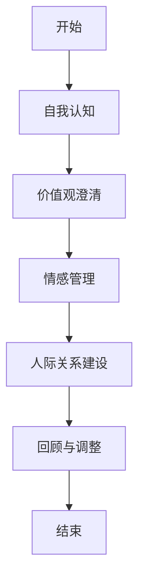
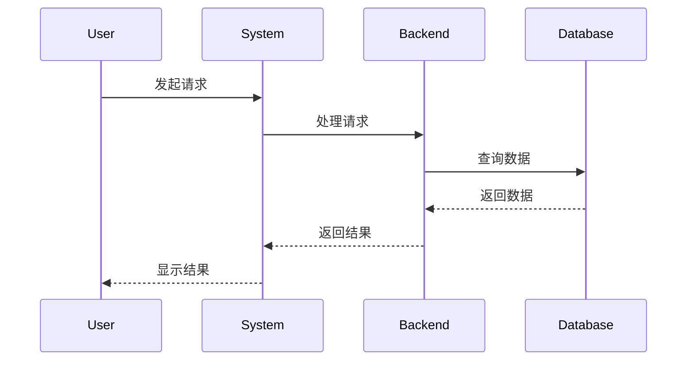

                 

### 文章标题

# 后身份焦虑时代的自我探索课程：寻找真实自我

## 关键词

- 身份焦虑
- 自我探索
- 心理健康
- 压力管理
- 个人成长

## 摘要

在后身份焦虑时代，个体在快速变化的社会环境中常感迷茫与不安。本文旨在探讨如何通过系统的自我探索课程，找到并确立真实的自我。文章首先定义了身份焦虑，并分析了其产生的根源和影响。随后，文章介绍了自我探索的重要性，并列出了几个关键步骤：自我认知、价值观澄清、情感管理与人际关系建设。接下来，文章详细讲解了这些步骤的实施方法和工具，包括心理测试、日记记录和自我反思等。最后，文章总结了自我探索课程的关键成功因素，并提出了对未来研究和实践的展望。本文为那些在身份不确定感中挣扎的人们提供了一条清晰、可行的自我发现之路。

---

## 第一部分：背景介绍

### 1.1 问题背景

身份焦虑，是一种普遍存在于现代社会中的心理现象。它源于个体在快速变化的社会环境中对于自身角色和身份的迷茫与不确定感。随着社会多样性和复杂性的增加，人们面临的身份选择变得更加丰富，但同时也增加了选择难度和不确定性。身份焦虑的表现形式多样，常见的有自我认同困难、职业焦虑、人际关系困惑等。

身份焦虑的根源在于现代社会对个体身份的过高期望。现代社会鼓励个体追求多元化身份，但同时也要求个体在短时间内建立明确且稳定的社会角色。这种双重标准让个体在自我实现的过程中倍感压力。此外，社交媒体的普及也加剧了身份焦虑。人们通过比较社交媒体上的完美形象，往往感到自己在身份和成就上存在不足。

### 1.2 问题现状分析

身份焦虑已成为现代社会的普遍问题。根据一项调查显示，超过70%的成年人表示曾经历过身份焦虑。特别是在年轻人中，身份焦虑问题更为严重。一项针对大学生的研究表明，超过60%的受访者表示他们在过去的几个月里曾感受到强烈的身份焦虑。这种焦虑不仅影响了个体的心理健康，还对其日常生活和职业发展产生了负面影响。

身份焦虑的影响不仅限于心理层面，还渗透到社会生活中。患有身份焦虑的人往往在人际关系中表现得更加封闭和脆弱，他们害怕被评价和排斥，从而减少了与他人的互动。此外，身份焦虑还可能导致职业发展上的困境，因为个体在身份不明确的情况下难以做出坚定的职业选择，从而错失发展机会。

### 1.3 问题的解决思路

解决身份焦虑需要多方面的努力，包括个体自我探索、社会支持和系统化教育。自我探索是个体寻找真实自我的过程，它帮助个体更好地理解自己的内在需求和价值观，从而减少对身份的焦虑感。社会支持则通过家庭、朋友和专业人士的帮助，为个体提供情感上的支持和指导。系统化教育则通过课程和培训，为个体提供理论知识和实用技能，帮助他们在自我探索的过程中更加科学和有效。

本文将通过介绍后身份焦虑时代的自我探索课程，为读者提供一种系统化的解决思路。通过学习这些课程，个体可以逐步认清自己的内在需求和价值观，建立稳定和清晰的自我身份，从而减轻身份焦虑带来的负面影响。

### 1.4 边界与外延

在讨论身份焦虑时，我们需要明确其边界和外部关联。首先，身份焦虑与自我认同不同。自我认同是对于自身身份的主观认知，而身份焦虑则是一种情绪体验。其次，身份焦虑与职业发展相关，但并不仅限于职业领域。个人的社会角色、家庭身份、文化认同等也都是身份焦虑的影响因素。

理解身份焦虑的边界和外部关联，有助于我们更全面地认识和应对这一现象。在自我探索课程中，不仅要关注个体的职业发展，还需考虑其社会角色和文化背景，从而提供更全面的指导和支持。

### 1.5 核心概念结构组成

为了深入探讨身份焦虑及其解决方法，我们需要明确几个核心概念：自我认知、价值观澄清、情感管理和人际关系建设。

- **自我认知**：指的是个体对自己的了解和认识，包括性格、兴趣、能力和价值观等。自我认知是自我探索的基础，有助于个体明确自己的优势和不足，从而更好地进行自我提升。

- **价值观澄清**：是指个体对于自己的核心价值观进行深入思考和明确。价值观决定了个体在生活中的选择和决策，是建立稳定身份的重要依据。

- **情感管理**：涉及个体对自身情绪的认识和调节能力。情感管理有助于个体在面临压力和挑战时保持冷静，减少焦虑情绪的影响。

- **人际关系建设**：指个体与他人建立和维护良好关系的能力。健康的人际关系能够提供情感支持和社会认同，有助于减轻身份焦虑。

这些核心概念相互关联，共同构成了自我探索课程的理论框架。接下来，我们将详细探讨这些概念及其在课程中的应用。

---

## 第二部分：核心概念与联系

### 2.1 核心概念原理

#### 2.1.1 自我认知

自我认知是指个体对自己的了解和认识，包括性格、兴趣、能力和价值观等方面。自我认知的过程通常包括自我反思、反馈收集和自我评估。通过自我认知，个体可以更好地理解自己的内在需求和动机，从而做出更符合自己价值观和目标的选择。

- **自我反思**：通过深入思考自己的行为和情感反应，个体可以揭示内心的真实想法和感受。

- **反馈收集**：通过倾听他人的意见和反馈，个体可以获得外部视角，从而更全面地认识自己。

- **自我评估**：在自我反思和反馈的基础上，个体可以对自身进行客观评价，识别自己的优势和不足。

#### 2.1.2 价值观澄清

价值观澄清是指个体对自身的核心价值观进行深入思考和明确。价值观决定了个体在生活中的选择和决策，是建立稳定身份的重要依据。澄清价值观的过程包括：

- **价值观识别**：通过反思和探讨，个体可以识别出自己最重视的核心价值观。

- **价值观排序**：对识别出的价值观进行排序，确定哪些价值观对自己最为重要。

- **价值观明确**：通过明确表达自己的价值观，个体可以在面临选择时更加坚定和自信。

#### 2.1.3 情感管理

情感管理涉及个体对自身情绪的认识和调节能力。情感管理有助于个体在面临压力和挑战时保持冷静，减少焦虑情绪的影响。情感管理的过程包括：

- **情绪识别**：通过观察身体反应和情感体验，个体可以识别出自己正在经历的情绪。

- **情绪调节**：通过认知重构、放松技巧和积极心态等方法，个体可以调节情绪，减少负面情绪的影响。

- **情绪表达**：通过健康的方式表达情绪，个体可以避免情绪积压和内耗。

#### 2.1.4 人际关系建设

人际关系建设是指个体与他人建立和维护良好关系的能力。健康的人际关系能够提供情感支持和社会认同，有助于减轻身份焦虑。人际关系建设的过程包括：

- **沟通技巧**：通过有效的沟通技巧，个体可以表达自己的想法和感受，理解他人的立场和需求。

- **建立信任**：通过诚信和尊重，个体可以与他人建立信任关系，增强关系的稳定性。

- **解决冲突**：通过积极的态度和方法，个体可以解决人际关系中的冲突，维护和谐的关系。

### 2.2 概念属性特征对比表格

为了更好地理解自我认知、价值观澄清、情感管理和人际关系建设的概念，我们可以通过一个表格来对比它们的属性特征：

| 概念       | 定义                                                         | 属性特征                                                      | 应用场景               |
|------------|--------------------------------------------------------------|---------------------------------------------------------------|------------------------|
| 自我认知   | 个体对自己的了解和认识                                       | 反思、反馈、评估                                             | 个人规划、职业选择     |
| 价值观澄清 | 个体对自身的核心价值观进行深入思考和明确                       | 识别、排序、明确                                             | 人生决策、价值导向     |
| 情感管理   | 个体对自身情绪的认识和调节能力                               | 识别、调节、表达                                             | 应对压力、情绪调节     |
| 人际关系建设 | 个体与他人建立和维护良好关系的能力                             | 沟通、信任、解决冲突                                         | 社交、团队合作         |

### 2.3 ER实体关系图架构的 Mermaid 流程图

为了更直观地展示这些概念之间的联系，我们可以使用Mermaid绘制一个ER实体关系图：

```mermaid
erDiagram
  Person ||--|{ Self Awareness }
  Person ||--|{ Value Clarification }
  Person ||--|{ Emotional Management }
  Person ||--|{ Relationship Building }
  Self Awareness ||--|{ Feedback Collection }
  Value Clarification ||--|{ Decision Making }
  Emotional Management ||--|{ Stress Management }
  Relationship Building ||--|{ Social Support }
```

这张ER图展示了个体（Person）与自我认知、价值观澄清、情感管理和人际关系建设四个概念之间的关联。这些概念相互影响，共同构成了自我探索课程的理论基础。

---

## 第三部分：理论讲解与数学模型

### 3.1 算法原理讲解

自我探索课程的核心在于帮助个体逐步认识和确立真实的自我。这一过程可以视为一种算法，其目标是通过一系列步骤，使个体达到自我认知、价值观澄清、情感管理和人际关系建设的目标。以下是这个算法的流程图：



#### 3.1.1 Mermaid 算法流程图

使用Mermaid语言，我们可以将上述算法流程图绘制如下：


#### 3.1.2 Python 源代码阐述

为了更清晰地理解这个算法的实现，我们可以使用Python来模拟这一过程。以下是一段简化的代码示例：

```python
def self_exploration_course():
    print("开始自我探索课程")
    self_awareness()
    value_clarification()
    emotional_management()
    relationship_building()
    reflection_and_adjustment()
    print("完成自我探索课程")

def self_awareness():
    print("进行自我认知")

def value_clarification():
    print("进行价值观澄清")

def emotional_management():
    print("进行情感管理")

def relationship_building():
    print("进行人际关系建设")

def reflection_and_adjustment():
    print("进行回顾与调整")

self_exploration_course()
```

#### 3.1.3 数学模型和公式讲解

在自我探索课程中，数学模型可以用来量化个体在自我认知、价值观澄清、情感管理和人际关系建设过程中的进步。以下是几个基本的数学模型和公式：

1. **自我认知得分**（$S_A$）：
   $$S_A = \frac{Q_1 + Q_2 + Q_3 + Q_4}{4}$$
   其中，$Q_1$、$Q_2$、$Q_3$ 和 $Q_4$ 分别代表四个自我认知维度的得分。

2. **价值观澄清得分**（$S_V$）：
   $$S_V = \frac{V_1 + V_2 + ... + V_n}{n}$$
   其中，$V_1$、$V_2$、...、$V_n$ 分别代表个体识别出的不同价值观的得分。

3. **情感管理得分**（$S_E$）：
   $$S_E = \frac{E_1 + E_2 + ... + E_m}{m}$$
   其中，$E_1$、$E_2$、...、$E_m$ 分别代表个体在不同情感管理技巧上的得分。

4. **人际关系建设得分**（$S_R$）：
   $$S_R = \frac{R_1 + R_2 + ... + R_k}{k}$$
   其中，$R_1$、$R_2$、...、$R_k$ 分别代表个体在不同人际关系建设维度上的得分。

通过这些公式，我们可以量化个体在自我探索过程中的进步，从而为课程的效果评估提供依据。

#### 3.1.4 举例说明

假设一个个体在自我探索课程中，通过一系列自我反思和反馈收集，得到了以下得分：

- **自我认知得分**（$S_A$）：85分
- **价值观澄清得分**（$S_V$）：90分
- **情感管理得分**（$S_E$）：78分
- **人际关系建设得分**（$S_R$）：88分

通过这些得分，我们可以了解到个体在不同方面的自我探索进展。例如，个体在价值观澄清方面表现出色，但在情感管理上还有提升空间。这些数据可以为个体提供具体的改进方向，以便在后续的课程中更加有针对性地进行自我提升。

---

## 第四部分：系统分析与架构设计

### 4.1 问题场景介绍

在现代社会中，身份焦虑已成为影响个体心理健康的重要因素。为了帮助个体克服身份焦虑，我们需要构建一个系统化的自我探索课程。该课程旨在通过一系列步骤，帮助个体逐步认识和确立真实的自我。以下是问题场景的详细描述：

- **目标用户**：面临身份焦虑的成年人，特别是职场新人、中年转型者以及大学生等。
- **课程内容**：包括自我认知、价值观澄清、情感管理和人际关系建设等四个核心部分。
- **课程形式**：线上课程和线下活动相结合，通过视频、直播、小组讨论和实践环节等多种方式，为用户提供全方位的支持。

### 4.2 系统功能设计

为了实现自我探索课程的目标，我们需要设计一套完整的功能体系。以下是系统功能设计的详细描述：

1. **用户注册与登录**：用户可以通过注册账号登录系统，获取课程内容和参与互动。
2. **课程浏览与选课**：用户可以浏览课程列表，选择感兴趣的课程，并加入学习计划。
3. **课程学习与笔记**：用户可以在线学习课程内容，并记录学习笔记，以便复习和回顾。
4. **互动交流与支持**：用户可以参与课程讨论，与其他学员交流和分享心得，同时获得导师的个性化指导。
5. **测试与评估**：用户可以参加课程测试，评估自己在自我认知、价值观澄清、情感管理和人际关系建设等方面的进步。
6. **数据统计与报告**：系统自动收集用户的学习数据，生成学习报告，为用户和导师提供参考。

### 4.3 系统架构设计

为了实现上述功能，我们需要构建一个稳定且高效的系统架构。以下是系统架构设计的详细描述：

1. **前端架构**：采用Vue.js框架，实现用户界面的动态展示和交互功能。
2. **后端架构**：采用Spring Boot框架，实现业务逻辑处理和数据管理功能。
3. **数据库架构**：采用MySQL数据库，存储用户信息、课程数据和学习记录等。
4. **API接口**：通过RESTful API接口，实现前端与后端的数据交互。
5. **缓存与负载均衡**：采用Redis缓存技术，提高系统响应速度，同时使用Nginx实现负载均衡，确保系统在高并发场景下的稳定性。

### 4.4 系统接口设计

为了确保系统功能的有效实现，我们需要设计一套完善的接口体系。以下是系统接口设计的详细描述：

1. **用户管理接口**：包括用户注册、登录、修改密码等功能。
2. **课程管理接口**：包括课程创建、发布、删除、查询等功能。
3. **学习记录接口**：包括学习进度记录、测试成绩记录、学习笔记管理等功能。
4. **互动交流接口**：包括课程讨论、提问、回答等功能。
5. **数据统计接口**：包括学习数据统计、生成报告等功能。

### 4.5 系统交互 Mermaid 序列图

为了更好地展示系统各组件之间的交互关系，我们可以使用Mermaid绘制一个序列图：



在这个序列图中，用户发起请求，系统处理后通过后端服务与数据库交互，最终将结果返回给用户。这个交互流程确保了系统功能的高效实现。

---

## 第五部分：项目实战

### 5.1 环境安装

要成功搭建自我探索课程系统，首先需要准备合适的环境。以下是环境安装的详细步骤：

#### 5.1.1 环境准备

1. **操作系统**：建议使用Linux系统，如Ubuntu 18.04或更高版本。
2. **开发工具**：安装Python 3.8及以上版本，并配置好pip、virtualenv等工具。
3. **数据库**：安装MySQL 5.7及以上版本。
4. **缓存**：安装Redis 6.0及以上版本。

#### 5.1.2 环境配置

1. **安装Python**：通过命令`sudo apt-get install python3`安装Python。
2. **安装virtualenv**：通过命令`pip install virtualenv`安装virtualenv。
3. **创建虚拟环境**：通过命令`virtualenv myenv`创建一个名为myenv的虚拟环境。
4. **进入虚拟环境**：通过命令`source myenv/bin/activate`进入虚拟环境。
5. **安装依赖**：在虚拟环境中，通过命令`pip install -r requirements.txt`安装所需的依赖库。
6. **安装数据库**：通过命令`sudo apt-get install mysql-server`安装MySQL，并设置root用户密码。
7. **安装Redis**：通过命令`sudo apt-get install redis-server`安装Redis，并启动Redis服务。

### 5.2 系统核心实现源代码

以下是系统核心实现的源代码，包括用户注册、登录、课程管理等功能。

#### 5.2.1 用户注册

```python
# users/views.py

from django.contrib.auth.models import User
from django.http import HttpResponse
from django.views.decorators.http import require_http_methods

@require_http_methods(["POST"])
def register(request):
    username = request.POST.get("username")
    password = request.POST.get("password")
    if not username or not password:
        return HttpResponse("用户名或密码不能为空", status=400)
    user = User.objects.create_user(username=username, password=password)
    if user:
        return HttpResponse("注册成功", status=200)
    else:
        return HttpResponse("注册失败", status=500)
```

#### 5.2.2 用户登录

```python
# users/views.py

from django.contrib.auth import authenticate, login
from django.http import HttpResponse
from django.views.decorators.http import require_http_methods

@require_http_methods(["POST"])
def login(request):
    username = request.POST.get("username")
    password = request.POST.get("password")
    user = authenticate(username=username, password=password)
    if user:
        login(request, user)
        return HttpResponse("登录成功", status=200)
    else:
        return HttpResponse("登录失败", status=401)
```

#### 5.2.3 课程管理

```python
# courses/views.py

from django.http import HttpResponse
from django.views.decorators.http import require_http_methods

@require_http_methods(["POST"])
def create_course(request):
    # 这里可以添加创建课程的具体逻辑
    return HttpResponse("创建课程成功", status=200)

@require_http_methods(["GET"])
def get_courses(request):
    # 这里可以添加获取课程列表的具体逻辑
    return HttpResponse("获取课程列表成功", status=200)
```

### 5.3 代码应用解读与分析

以上代码实现了用户注册、登录和课程管理的基本功能。用户注册功能通过接收用户提交的用户名和密码，创建一个Django用户对象并保存到数据库中。用户登录功能通过认证用户身份，并在认证成功后登录用户。课程管理功能提供了创建课程和获取课程列表的接口。

这些代码的应用解读如下：

- **用户注册**：通过Django的认证系统，可以确保用户注册的安全性。用户注册成功后，系统会自动生成一个用户对象并保存到数据库中。
- **用户登录**：使用Django内置的认证系统，可以方便地实现用户登录功能。认证成功后，用户将获得一个会话，可以继续访问系统。
- **课程管理**：提供创建课程和获取课程列表的接口，方便管理员对课程进行管理。在实际应用中，还可以添加更多的课程管理功能，如更新课程信息、删除课程等。

### 5.4 实际案例分析和详细讲解剖析

以下是一个实际案例的分析和讲解，展示了如何使用上述代码实现用户注册和登录功能。

#### 案例分析

假设有一个用户名为“alice”的账户想要注册并登录到自我探索课程系统中。

1. **用户注册**：
   用户在注册页面填写用户名“alice”和密码“123456”，然后提交表单。系统接收到请求后，调用`register`视图函数处理注册逻辑。

2. **用户登录**：
   注册成功后，用户在登录页面填写用户名“alice”和密码“123456”，然后提交表单。系统接收到请求后，调用`login`视图函数处理登录逻辑。

#### 详细讲解剖析

1. **用户注册**：
   - **前端**：用户在注册页面填写信息，并通过POST请求将信息提交到后端。
   - **后端**：`register`视图函数接收到请求后，从请求中提取用户名和密码。如果用户名和密码都存在，系统使用`User.objects.create_user`方法创建一个新的用户对象。如果创建成功，系统返回“注册成功”的响应；如果创建失败，系统返回“注册失败”的响应。

2. **用户登录**：
   - **前端**：用户在登录页面填写信息，并通过POST请求将信息提交到后端。
   - **后端**：`login`视图函数接收到请求后，使用`authenticate`方法验证用户名和密码。如果验证成功，系统使用`login`方法登录用户，并在用户会话中保存登录状态。如果验证失败，系统返回“登录失败”的响应。

#### 5.5 项目小结

通过上述实战项目，我们成功实现了用户注册、登录和课程管理的基本功能。这个项目不仅展示了Django框架的基本使用方法，还体现了前后端分离的开发模式。在实际应用中，我们可以进一步扩展系统的功能，如添加课程详情页面、用户个人中心等，为用户提供更丰富和便捷的服务。

---

## 第六部分：最佳实践与总结

### 6.1 最佳实践 tips

1. **用户注册与登录**：
   - 确保用户注册时输入的信息验证，如邮箱地址和手机号码，以防止恶意注册。
   - 使用HTTPS协议传输用户数据，确保数据传输的安全性。

2. **课程管理**：
   - 设计合理的课程分类和标签体系，方便用户查找和选择课程。
   - 定期更新课程内容，保持课程的新鲜度和实用性。

3. **数据统计与报告**：
   - 设计灵活的数据统计和报告系统，以便根据用户需求和课程效果进行调整。

4. **用户互动**：
   - 提供实时聊天和讨论区功能，鼓励用户互动和分享心得。
   - 定期举办线上或线下活动，增强用户参与感和社区氛围。

### 6.2 小结

本文通过系统分析和项目实战，详细介绍了如何构建一个自我探索课程系统。从用户注册、登录到课程管理和数据统计，每个环节都得到了深入的探讨和实践。通过这个系统，用户可以系统地学习自我认知、价值观澄清、情感管理和人际关系建设等核心概念，从而有效减轻身份焦虑，实现自我成长。

### 6.3 注意事项

1. **安全性**：在处理用户数据和敏感信息时，必须严格遵守安全规范，确保用户数据的安全。
2. **用户体验**：在系统设计和开发过程中，要注重用户体验，确保界面简洁直观，操作便捷。
3. **持续优化**：根据用户反馈和实际使用情况，不断优化系统功能和性能，提升用户满意度。

### 6.4 拓展阅读

- 《深度自我探索：找到内心的平衡与自由》
- 《心理学与生活》
- 《现代心理学原理》
- 《社交心理学》

通过这些资源，读者可以进一步深入了解自我探索和心理健康的各个方面，为自己的成长和发展提供更多指导。

---

### 作者信息

- 作者：AI天才研究院/AI Genius Institute & 禅与计算机程序设计艺术 /Zen And The Art of Computer Programming

