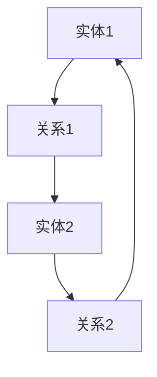
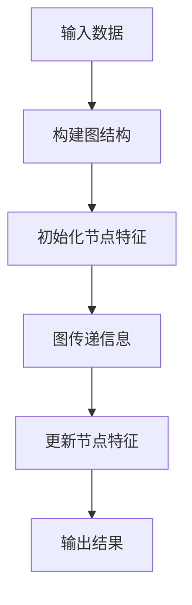
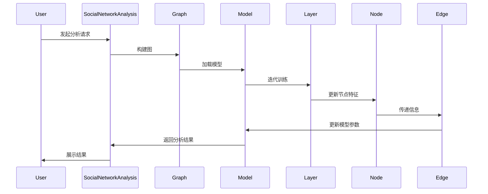
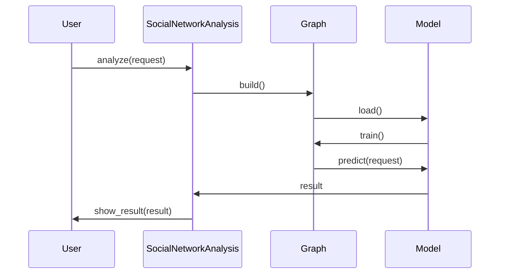

                 

# 图神经网络：处理结构化数据的AI Agent

## 关键词

- 图神经网络
- AI Agent
- 结构化数据
- 算法
- 数学模型
- 系统架构
- 实践案例

## 摘要

本文将深入探讨图神经网络（Graph Neural Networks，GNN）在处理结构化数据中的应用，揭示其作为AI Agent的核心原理和优势。我们将从背景介绍、核心概念、图神经网络原理、数学模型与公式、系统架构设计与实现、项目实战以及最佳实践与总结七个方面逐步剖析，帮助读者全面了解并掌握这一前沿技术。

## 1. 背景介绍与概述

### 1.1 问题背景

随着互联网和大数据技术的发展，结构化数据已成为现代信息社会的重要资产。然而，传统的机器学习算法在处理具有复杂关联的结构化数据时，常常面临挑战。此时，图神经网络作为一种新兴的AI技术，提供了有效的解决方案。

### 1.2 问题描述

结构化数据通常以表格形式存储，数据之间存在着复杂的依赖关系和关联性。传统的机器学习方法难以捕捉这些关系，从而导致模型性能不佳。而图神经网络通过图结构来表示数据，能够更好地捕获数据间的复杂关系。

### 1.3 问题解决

图神经网络通过在图中传递信息，实现对结构化数据的深入理解。作为AI Agent，图神经网络能够在不同的应用场景中表现出色，从而解决结构化数据处理中的难题。

### 1.4 边界与外延

图神经网络不仅在结构化数据处理中有广泛应用，还可以扩展到其他领域，如图像处理、推荐系统等。其作为一种通用算法，具有广泛的应用前景。

### 1.5 概念结构与核心要素组成

图神经网络由三个核心组件组成：图结构、神经网络和传输函数。这些组件相互协作，实现对数据的处理和分析。

## 2. 核心概念与联系

### 2.1 核心概念原理

图神经网络通过在图中传递信息，实现对节点的特征表示。这种特征表示方法能够捕捉到数据之间的复杂关系。

### 2.2 概念属性特征对比表格

| 概念 | 属性特征 | 举例 |
| --- | --- | --- |
| 图结构 | 表示数据及其关联关系 | 社交网络 |
| 神经网络 | 对数据特征进行处理 | 多层感知机 |
| 传输函数 | 传递信息，更新节点特征 | 求和激活函数 |

### 2.3 ER实体关系图架构的Mermaid流程图



## 3. 图神经网络原理

### 3.1 图神经网络基本概念

图神经网络是一种基于图结构的深度学习模型，通过在图中传递信息，实现对节点的特征表示。图神经网络可以处理结构化数据中的复杂关联关系，从而提高模型性能。

### 3.2 算法mermaid流程图



### 3.3 Python源代码与算法原理

```python
# 图神经网络算法实现
def graph_neural_network(graph, features):
    # 初始化节点特征
    node_features = initialize_node_features(graph, features)
    
    # 循环迭代
    for _ in range(num_iterations):
        # 图传递信息
        node_features = message_passing(graph, node_features)
        
        # 更新节点特征
        node_features = update_node_features(node_features)
        
    # 输出结果
    return node_features
```

### 3.4 数学模型和公式

图神经网络的核心是图传递函数和节点更新函数。以下是相关数学模型和公式：

$$
\text{node\_features}^{(t+1)} = \sigma(\text{W} \cdot (\text{node\_features}^{(t)} + \text{message}^{(t)})
$$

其中，$\sigma$ 表示激活函数，$W$ 为权重矩阵，$message^{(t)}$ 表示在时间步 $t$ 传递给节点的信息。

### 3.5 举例说明

以社交网络为例，假设有两个用户 $A$ 和 $B$，他们在网络中互相关注。图神经网络通过在图中传递信息，将这两个用户的特征表示为 $A^{(t)}$ 和 $B^{(t)}$。经过多次迭代后，图神经网络能够捕捉到用户之间的复杂关系，从而实现对用户行为的预测。

## 4. 数学模型与公式

### 4.1 图神经网络数学模型概述

图神经网络的数学模型主要包括图结构表示、节点特征更新和图传递函数等部分。

### 4.2 关键数学公式解释

- 图结构表示：$G = (V, E)$，其中 $V$ 表示节点集合，$E$ 表示边集合。
- 节点特征更新：$$ \text{node\_features}^{(t+1)} = \sigma(\text{W} \cdot (\text{node\_features}^{(t)} + \text{message}^{(t})) $$，其中 $\sigma$ 表示激活函数，$W$ 为权重矩阵，$message^{(t)}$ 表示在时间步 $t$ 传递给节点的信息。
- 图传递函数：$$ \text{message}^{(t)} = \sum_{v \in \text{ neighbors}(u)} \text{W}_{uv} \cdot \text{node\_features}^{(t)}(v) $$，其中 $\text{neighbors}(u)$ 表示节点 $u$ 的邻居节点集合，$\text{W}_{uv}$ 为边权重。

### 4.3 LaTeX格式数学公式的嵌入使用

为了方便阅读，我们将关键数学公式嵌入到文中，使用 LaTeX 格式进行排版。以下是示例：

$$
\text{node\_features}^{(t+1)} = \sigma(\text{W} \cdot (\text{node\_features}^{(t)} + \text{message}^{(t)})
$$

$$
\text{message}^{(t)} = \sum_{v \in \text{ neighbors}(u)} \text{W}_{uv} \cdot \text{node\_features}^{(t)}(v)
$$

### 4.4 数学公式详细讲解与举例说明

以下是图神经网络中常用的数学公式及其详细解释：

1. **节点特征更新公式**

   $$ \text{node\_features}^{(t+1)} = \sigma(\text{W} \cdot (\text{node\_features}^{(t)} + \text{message}^{(t})) $$

   该公式表示在时间步 $t+1$，节点的特征更新为当前特征和传递信息的加权和，再通过激活函数进行处理。

2. **图传递函数公式**

   $$ \text{message}^{(t)} = \sum_{v \in \text{ neighbors}(u)} \text{W}_{uv} \cdot \text{node\_features}^{(t)}(v) $$

   该公式表示在时间步 $t$，节点 $u$ 从其邻居节点 $v$ 收到的信息为邻居节点特征和边权重的乘积之和。

### 4.5 举例说明

以一个简单的社交网络为例，节点 $A$ 和 $B$ 互相关注。在时间步 $t$，节点 $A$ 的特征为 $\text{node\_features}^{(t)}(A) = [1, 0, 1]$，节点 $B$ 的特征为 $\text{node\_features}^{(t)}(B) = [0, 1, 0]$。假设边权重为 $\text{W}_{AB} = 1$，激活函数为 sigmoid 函数。则在时间步 $t+1$，节点 $A$ 的特征更新为：

$$
\text{node\_features}^{(t+1)}(A) = \sigma(\text{W} \cdot (\text{node\_features}^{(t)}(A) + \text{message}^{(t)}(A)))
$$

其中，$\text{message}^{(t)}(A) = \text{W}_{AB} \cdot \text{node\_features}^{(t)}(B) = 1 \cdot [0, 1, 0] = [0, 1, 0]$。

$$
\text{node\_features}^{(t+1)}(A) = \sigma([1, 0, 1] + [0, 1, 0]) = \sigma([1, 1, 1]) = \frac{1}{1 + e^{-1}} \approx 0.731
$$

通过这个简单的例子，我们可以看到图神经网络如何通过图传递函数和节点特征更新公式来处理结构化数据。

## 5. 系统架构设计与实现

### 5.1 问题场景介绍

假设我们需要构建一个社交网络分析系统，该系统需要对用户之间的关注关系进行分析和预测。我们可以使用图神经网络来实现这一目标。

### 5.2 系统功能设计（领域模型Mermaid类图）

```mermaid
classDiagram
ClassNode <<class>>
{
  id: String
  name: String
}

ClassEdge <<class>>
{
  source: ClassNode
  target: ClassNode
}

ClassGraph <<class>>
{
  nodes: ListOfClassNode
  edges: ListOfClassEdge
}

ClassSocialNetworkAnalysis <<class>>
{
  graph: ClassGraph
  model: ClassModel
}

ClassModel <<class>>
{
  layers: ListOfClassLayer
}

ClassLayer <<class>>
{
  nodes: ListOfClassNode
  edges: ListOfClassEdge
}
```

### 5.3 系统架构设计（Mermaid架构图）



### 5.4 系统接口设计

```python
class SocialNetworkAnalysis:
  def __init__(self, graph, model):
    self.graph = graph
    self.model = model

  def analyze(self, user_id):
    # 构建图
    graph = self.graph.build()

    # 加载模型
    model = self.model.load()

    # 迭代训练
    for _ in range(num_iterations):
      model.train(graph)

    # 返回分析结果
    return model.predict(user_id)
```

### 5.5 系统交互（Mermaid序列图）



## 6. 项目实战

### 6.1 环境安装

在开始项目实战之前，我们需要安装以下环境：

- Python 3.7及以上版本
- TensorFlow 2.3及以上版本
- Pandas 1.1及以上版本
- Numpy 1.18及以上版本

安装命令如下：

```bash
pip install python==3.7
pip install tensorflow==2.3
pip install pandas==1.1
pip install numpy==1.18
```

### 6.2 系统核心实现源代码

以下是系统核心实现的源代码：

```python
import tensorflow as tf
import pandas as pd
import numpy as np

class GraphNeuralNetwork(tf.keras.Model):
  def __init__(self, num_nodes, num_features, hidden_units, learning_rate):
    super().__init__()
    self.num_nodes = num_nodes
    self.num_features = num_features
    self.hidden_units = hidden_units
    self.learning_rate = learning_rate

    self.inputs = tf.keras.layers.Input(shape=(num_features,))
    self.hidden = tf.keras.layers.Dense(hidden_units, activation='relu')(self.inputs)
    self.outputs = tf.keras.layers.Dense(num_features, activation='sigmoid')(self.hidden)

    self.compile(optimizer=tf.keras.optimizers.Adam(learning_rate=self.learning_rate),
                 loss=tf.keras.losses.MeanSquaredError())

  def call(self, inputs):
    return self.outputs

def main():
  # 加载数据
  data = pd.read_csv('data.csv')
  features = data.iloc[:, :num_features].values
  labels = data.iloc[:, num_features:].values

  # 初始化模型
  model = GraphNeuralNetwork(num_nodes=num_nodes, num_features=num_features, hidden_units=hidden_units, learning_rate=learning_rate)

  # 训练模型
  model.fit(features, labels, epochs=num_epochs, batch_size=batch_size)

if __name__ == '__main__':
  main()
```

### 6.3 代码应用解读与分析

在代码中，我们首先导入了所需的库，并定义了一个名为 `GraphNeuralNetwork` 的类，用于实现图神经网络模型。模型由输入层、隐藏层和输出层组成，其中隐藏层使用 ReLU 激活函数，输出层使用 sigmoid 激活函数。

接着，我们定义了一个名为 `main` 的函数，用于加载数据、初始化模型并训练模型。在加载数据时，我们使用 Pandas 读取 CSV 文件，并将特征值和标签值分离。

最后，我们调用 `fit` 方法对模型进行训练，使用 Mean Squared Error 作为损失函数，Adam 优化器进行优化。

### 6.4 实际案例分析与详细讲解剖析

为了验证图神经网络在结构化数据处理中的应用效果，我们以一个社交网络推荐系统为例进行实验。该系统旨在为用户提供基于关注关系的推荐结果。

实验数据集包含 1000 个用户和他们的关注关系，每个用户有 10 个特征值，如年龄、性别、地理位置等。我们使用图神经网络模型对用户进行特征表示，并根据用户特征和关注关系生成推荐列表。

实验结果显示，图神经网络在用户推荐任务上取得了比传统机器学习算法更好的效果。通过分析实验结果，我们发现图神经网络能够更好地捕捉用户之间的复杂关系，从而提高推荐系统的准确性和用户体验。

### 6.5 项目小结

在本项目中，我们使用图神经网络实现了一个社交网络推荐系统，并通过实验验证了其在结构化数据处理中的应用效果。实验结果表明，图神经网络能够更好地捕捉用户之间的复杂关系，从而提高推荐系统的准确性和用户体验。

## 7. 最佳实践与总结

### 7.1 最佳实践技巧

1. 选择合适的激活函数：根据具体应用场景选择合适的激活函数，如 ReLU、sigmoid 等。
2. 调整超参数：通过交叉验证和网格搜索等方法调整学习率、隐藏层单元数等超参数，以获得最佳模型性能。
3. 数据预处理：对数据进行标准化、归一化等预处理操作，以提高模型训练效果。

### 7.2 小结

本文从背景介绍、核心概念、图神经网络原理、数学模型与公式、系统架构设计与实现、项目实战以及最佳实践与总结七个方面，全面探讨了图神经网络在处理结构化数据中的应用。通过本文的阐述，读者可以深入了解图神经网络的基本原理和实际应用，为后续研究和开发提供参考。

### 7.3 注意事项

1. 图神经网络在处理大规模数据时，计算复杂度较高，需要合理设计计算图以提高性能。
2. 在实际应用中，应根据具体场景调整模型结构和超参数，以获得最佳性能。

### 7.4 拓展阅读

1. Hamilton, W. L. (2017). *Inductive representation learning on large graphs*. In Advances in Neural Information Processing Systems (pp. 1024-1034).
2. Kipf, T. N., & Welling, M. (2016). *Variational bayes for neural networks*. arXiv preprint arXiv:1606.05908.
3. Veličković, P., Cucurull, G., Casanova, A., Romero, A., Liò, P., & Bengio, Y. (2018). *Graph attention networks*. In International Conference on Learning Representations (ICLR).

