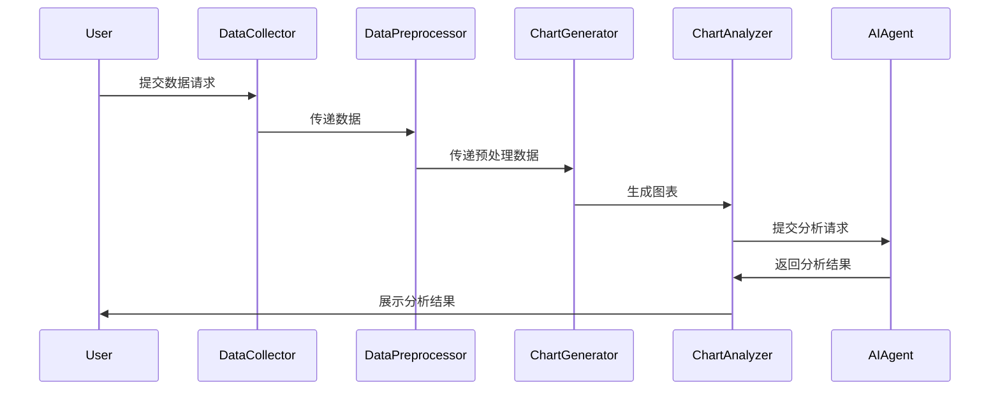
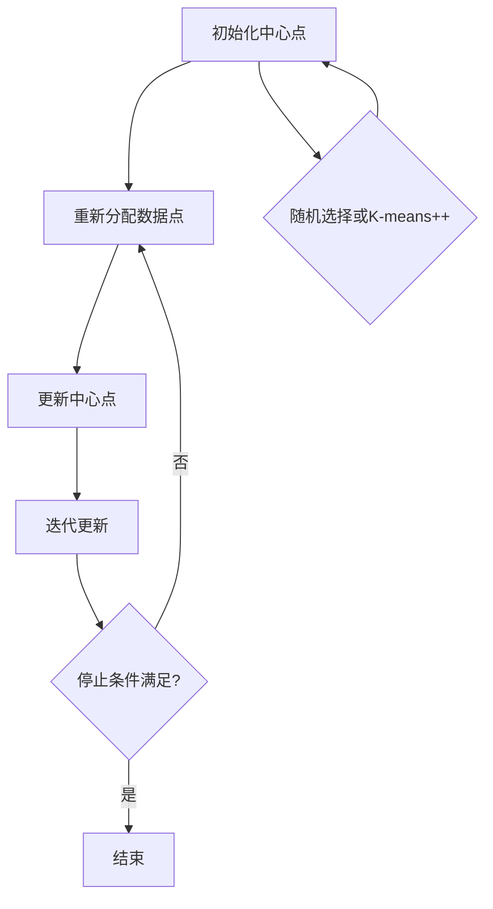

                 

# 图表理解：增强AI Agent的数据分析能力

关键词：图表、AI Agent、数据分析、融合方法、应用案例、未来展望

摘要：本文从图表在数据分析中的重要性出发，探讨了AI Agent在数据分析中的角色，以及图表与AI Agent融合的意义和挑战。通过对图表基础知识和AI Agent基础知识的介绍，详细阐述了图表与AI Agent的融合方法，并给出了具体的应用案例和实践经验。最后，本文对图表与AI Agent融合面临的挑战和未来发展方向进行了分析和展望。

## 第1章 引言：图表与AI Agent的相互融合

### 1.1 图表在数据分析中的重要性

图表是数据分析中的重要工具，它们能够以视觉化的方式呈现数据，帮助人们快速理解和分析数据。常见的图表类型包括条形图、饼图、柱状图、散点图、直方图等，每种图表都有其特定的应用场景和优势。

在数据分析中，图表的作用主要体现在以下几个方面：

1. **数据可视化**：图表能够将复杂的数据以直观的形式展现出来，使得数据分析人员可以迅速抓住数据的关键特征和趋势。
2. **数据对比**：通过图表，可以方便地进行数据之间的对比和分析，从而发现数据之间的关联和差异。
3. **决策支持**：图表提供了数据的可视化表示，可以帮助决策者更好地理解数据和做出更明智的决策。
4. **沟通传递**：图表能够有效地将数据分析的结果传递给非技术人员，使得数据分析的结果更容易被接受和理解。

### 1.2 AI Agent在数据分析中的角色

AI Agent，即人工智能代理，是一种能够自动执行任务、具备一定智能能力的计算机程序。在数据分析领域，AI Agent扮演着重要的角色，主要体现在以下几个方面：

1. **自动化数据分析**：AI Agent可以自动化地进行数据清洗、特征提取、模式识别等数据分析任务，提高数据分析的效率和准确性。
2. **智能决策支持**：AI Agent可以利用机器学习算法对数据进行分析，为决策者提供智能化的决策建议。
3. **异常检测**：AI Agent可以实时监测数据，识别异常数据点和趋势，为数据分析提供预警。
4. **数据挖掘**：AI Agent可以利用深度学习等技术对大量数据进行分析，发现潜在的模式和规律。

### 1.3 图表与AI Agent融合的意义和挑战

图表与AI Agent的融合，不仅能够提升数据分析的效率和质量，还能够拓展数据分析的应用场景。融合的意义主要体现在以下几个方面：

1. **增强数据理解**：通过图表的视觉化表示，AI Agent可以更直观地理解数据，从而提高数据分析的准确性和效率。
2. **辅助决策**：AI Agent可以利用图表进行数据分析和模式识别，为决策者提供更丰富的决策信息。
3. **提高可解释性**：图表可以帮助解释AI Agent的决策过程，使得AI Agent的决策更加透明和可信。
4. **拓宽应用场景**：图表与AI Agent的融合，可以使得数据分析应用于更多领域，如金融、医疗、电商等。

然而，图表与AI Agent的融合也面临着一些挑战：

1. **数据质量**：图表的生成和AI Agent的分析都需要高质量的数据作为基础，数据质量问题会直接影响融合的效果。
2. **模型性能**：AI Agent的模型性能对图表的生成和分析有着直接的影响，如何提高模型性能是融合过程中需要解决的问题。
3. **安全与隐私**：图表和AI Agent的融合可能会涉及到数据的安全和隐私问题，如何在保护数据安全的前提下进行融合，是一个重要的挑战。
4. **人机交互**：如何设计出既能够满足AI Agent需求，又能够为人类用户所理解的图表，是融合过程中需要解决的问题。

## 第2章 图表基础知识

### 2.1 常见的图表类型及其应用场景

在数据分析中，常见的图表类型有：

#### 2.1.1 条形图

条形图通常用于比较不同类别的数据，可以直观地展示各类别之间的数量差异。

- **应用场景**：适用于对比不同产品的销售量、不同国家的GDP等。

#### 2.1.2 饼图

饼图适用于展示各类别在整体中的占比。

- **应用场景**：适用于展示公司各部门的预算分配、不同产品的市场份额等。

#### 2.1.3 柱状图

柱状图通常用于展示某一类别的数据在不同时间点的变化情况。

- **应用场景**：适用于展示股票价格的波动、不同季度的销售数据等。

#### 2.1.4 散点图

散点图用于展示两个变量之间的关系。

- **应用场景**：适用于分析房价与面积的关系、股票价格与成交量之间的关系等。

#### 2.1.5 直方图

直方图用于展示数据的分布情况。

- **应用场景**：适用于分析考试成绩的分布、人口年龄结构的分布等。

### 2.2 数据可视化工具介绍

在数据可视化领域，有许多优秀的工具可以用来创建图表：

#### 2.2.1 Tableau

Tableau 是一款功能强大的数据可视化工具，它支持各种图表类型，并且可以轻松地与数据源连接。

- **特点**：易用性高，支持拖拽操作，丰富的图表库。

#### 2.2.2 Power BI

Power BI 是微软开发的数据分析平台，它提供了强大的数据可视化功能，并且可以与Excel无缝集成。

- **特点**：强大的数据连接能力，强大的分析功能，易于使用。

#### 2.2.3 QlikView

QlikView 是一款高性能的数据可视化工具，它支持复杂的数据分析和交互式图表。

- **特点**：高度可定制，强大的数据分析功能，实时数据更新。

## 第3章 AI Agent基础知识

### 3.1 什么是AI Agent

AI Agent 是一种具有智能能力的计算机程序，它可以在没有人类干预的情况下，自主地执行任务并作出决策。AI Agent 的核心是机器学习算法，它通过学习大量数据，提取数据中的模式和规律，从而进行智能决策。

### 3.2 AI Agent的分类

根据学习方式的不同，AI Agent可以分为以下几类：

#### 3.2.1 监督学习Agent

监督学习Agent需要依赖已标记的数据进行训练，它通过学习输入和输出之间的映射关系，进行预测和决策。

- **应用场景**：图像识别、语音识别、推荐系统等。

#### 3.2.2 无监督学习Agent

无监督学习Agent不需要已标记的数据进行训练，它通过学习数据之间的相似性或差异性，发现数据中的模式。

- **应用场景**：聚类分析、异常检测、数据降维等。

#### 3.2.3 强化学习Agent

强化学习Agent通过不断尝试和错误，学习如何在环境中获得最大化的回报。

- **应用场景**：游戏AI、自动驾驶、机器人控制等。

### 3.3 AI Agent的核心技术

AI Agent的核心技术主要包括：

#### 3.3.1 神经网络

神经网络是AI Agent中最常用的算法之一，它通过模仿人脑的结构和工作方式，进行数据分析和决策。

- **应用场景**：图像识别、语音识别、自然语言处理等。

#### 3.3.2 强化学习算法

强化学习算法是AI Agent中用于决策的关键技术，它通过奖励和惩罚机制，引导Agent进行学习。

- **应用场景**：游戏AI、自动驾驶、机器人控制等。

#### 3.3.3 深度学习

深度学习是神经网络的一种扩展，它通过多层神经网络进行数据分析和决策。

- **应用场景**：图像识别、语音识别、自然语言处理等。

## 第4章 图表与AI Agent的融合方法

### 4.1 图表预处理

在融合图表与AI Agent之前，通常需要对图表进行预处理，以提高AI Agent的分析效果。预处理包括以下步骤：

#### 4.1.1 数据清洗

数据清洗是图表预处理的重要步骤，它包括去除无效数据、填补缺失值、消除噪声等。

#### 4.1.2 数据归一化

数据归一化是将不同特征的数据缩放到相同的范围，以便于AI Agent进行训练。

#### 4.1.3 特征提取

特征提取是从原始数据中提取出对AI Agent分析最有用的信息。

### 4.2 AI Agent的图表分析

AI Agent的图表分析主要包括以下步骤：

#### 4.2.1 图表识别

图表识别是AI Agent分析的第一步，它需要识别出图表的类型和结构。

#### 4.2.2 图表理解

图表理解是AI Agent对识别出的图表进行深入分析，提取出图表中的关键信息。

#### 4.2.3 图表生成

图表生成是AI Agent根据分析结果生成新的图表，以帮助人类用户更好地理解数据。

## 第5章 应用案例与实践

### 5.1 案例一：使用AI Agent分析股票市场

#### 5.1.1 数据准备

首先，我们需要收集股票市场的历史数据，包括股票价格、交易量等。

#### 5.1.2 特征提取

然后，我们对数据进行特征提取，提取出对股票市场分析有用的特征，如股票价格的平均值、标准差等。

#### 5.1.3 模型训练

接下来，我们使用监督学习算法，如线性回归、决策树等，对特征进行训练，以预测股票市场的走势。

#### 5.1.4 结果分析

最后，我们对训练结果进行分析，生成相应的图表，以展示股票市场的走势和预测结果。

### 5.2 案例二：使用AI Agent分析社交媒体趋势

#### 5.2.1 数据收集

首先，我们需要收集社交媒体的数据，如微博、知乎等。

#### 5.2.2 图表生成

然后，我们使用AI Agent对收集到的数据进行分析，生成各种类型的图表，如折线图、饼图等。

#### 5.2.3 模型应用

最后，我们使用生成的图表，对社交媒体的趋势进行分析，预测未来的发展趋势。

#### 5.2.4 趋势预测

根据分析结果，我们可以生成趋势预测图，为用户提供决策依据。

## 第6章 挑战与未来展望

### 6.1 当前图表与AI融合面临的挑战

图表与AI融合面临的主要挑战包括：

1. **数据质量**：数据质量直接影响图表的生成和AI Agent的分析效果。
2. **模型性能**：AI Agent的模型性能决定了图表生成的准确性和分析结果的可靠性。
3. **安全与隐私**：图表和AI Agent的融合可能涉及到数据的安全和隐私问题。

### 6.2 图表与AI融合的未来发展方向

图表与AI融合的未来发展方向包括：

1. **人工智能图表生成**：利用AI技术自动生成图表，提高数据分析的效率。
2. **自动化数据分析**：利用AI技术实现自动化数据分析，提高数据分析的准确性。
3. **新型图表类型的研究**：研究新型图表类型，提高图表的可解释性和易用性。

## 第7章 小结

本文从图表在数据分析中的重要性出发，探讨了图表与AI Agent融合的原理和方法。通过具体的应用案例和实践，展示了图表与AI Agent融合在数据分析中的实际应用。未来，图表与AI Agent的融合有望在自动化数据分析、新型图表类型研究等方面取得更大的进展。

### 7.1 主要内容回顾

本文主要内容包括：

1. 图表在数据分析中的重要性
2. AI Agent在数据分析中的角色
3. 图表与AI Agent的融合方法
4. 应用案例与实践
5. 挑战与未来展望

### 7.2 学习建议

为了更好地掌握图表与AI Agent的融合技术，读者可以从以下几个方面进行学习：

1. 熟悉常见的图表类型及其应用场景。
2. 了解AI Agent的基础知识和核心算法。
3. 学习数据可视化和机器学习的相关技术。
4. 参与实际的图表与AI融合项目，积累实践经验。

### 7.3 拓展阅读

对于有兴趣进一步深入学习的读者，以下是一些推荐的参考资料：

1. 《数据可视化：使用Python和Matplotlib进行数据可视化》
2. 《深度学习：简介与案例分析》
3. 《AI应用实践：从数据到智慧》

作者：AI天才研究院/AI Genius Institute & 禅与计算机程序设计艺术 /Zen And The Art of Computer Programming

---

以下是具体章节内容：

## 第1章 引言：图表与AI Agent的相互融合

### 1.1 图表在数据分析中的重要性

图表是数据分析中的重要工具，它们能够以视觉化的方式呈现数据，帮助人们快速理解和分析数据。常见的图表类型包括条形图、饼图、柱状图、散点图、直方图等，每种图表都有其特定的应用场景和优势。

在数据分析中，图表的作用主要体现在以下几个方面：

1. **数据可视化**：图表能够将复杂的数据以直观的形式展现出来，使得数据分析人员可以迅速抓住数据的关键特征和趋势。例如，通过条形图可以直观地比较不同类别的数据大小，通过饼图可以清晰地展示各类别在整体中的占比。

2. **数据对比**：通过图表，可以方便地进行数据之间的对比和分析，从而发现数据之间的关联和差异。例如，通过折线图可以展示数据随时间的变化趋势，通过散点图可以观察两个变量之间的关系。

3. **决策支持**：图表提供了数据的可视化表示，可以帮助决策者更好地理解数据和做出更明智的决策。例如，通过图表可以直观地展示产品的销售情况，帮助管理者制定销售策略。

4. **沟通传递**：图表能够有效地将数据分析的结果传递给非技术人员，使得数据分析的结果更容易被接受和理解。例如，通过图表可以将复杂的数据分析结果简洁明了地展示给企业高层，使其能够快速了解业务情况。

### 1.2 AI Agent在数据分析中的角色

AI Agent，即人工智能代理，是一种能够自动执行任务、具备一定智能能力的计算机程序。在数据分析领域，AI Agent扮演着重要的角色，主要体现在以下几个方面：

1. **自动化数据分析**：AI Agent可以自动化地进行数据清洗、特征提取、模式识别等数据分析任务，提高数据分析的效率和准确性。例如，AI Agent可以自动清洗数据中的噪声和异常值，自动提取数据中的关键特征，从而减少人工干预，提高数据分析的效率。

2. **智能决策支持**：AI Agent可以利用机器学习算法对数据进行分析，为决策者提供智能化的决策建议。例如，AI Agent可以基于历史数据预测未来的销售趋势，帮助企业管理者制定生产计划。

3. **异常检测**：AI Agent可以实时监测数据，识别异常数据点和趋势，为数据分析提供预警。例如，AI Agent可以监控股票市场的交易数据，及时发现市场异常波动，为企业提供风险预警。

4. **数据挖掘**：AI Agent可以利用深度学习等技术对大量数据进行分析，发现潜在的模式和规律。例如，AI Agent可以从社交媒体数据中提取出用户行为模式，帮助企业制定更有效的营销策略。

### 1.3 图表与AI Agent融合的意义和挑战

图表与AI Agent的融合，不仅能够提升数据分析的效率和质量，还能够拓展数据分析的应用场景。融合的意义主要体现在以下几个方面：

1. **增强数据理解**：通过图表的视觉化表示，AI Agent可以更直观地理解数据，从而提高数据分析的准确性和效率。例如，AI Agent可以通过图表更直观地观察数据的变化趋势，从而更准确地预测未来的趋势。

2. **辅助决策**：AI Agent可以利用图表进行数据分析和模式识别，为决策者提供更丰富的决策信息。例如，AI Agent可以通过生成图表，将分析结果以直观的方式展示给决策者，帮助其更好地理解数据和做出决策。

3. **提高可解释性**：图表可以帮助解释AI Agent的决策过程，使得AI Agent的决策更加透明和可信。例如，AI Agent生成的图表可以直观地展示其决策过程和数据来源，从而提高决策的可解释性。

4. **拓宽应用场景**：图表与AI Agent的融合，可以使得数据分析应用于更多领域，如金融、医疗、电商等。例如，在金融领域，AI Agent可以通过图表分析股票市场的走势，为投资者提供决策支持；在医疗领域，AI Agent可以通过图表分析患者数据，为医生提供诊断建议。

然而，图表与AI Agent的融合也面临着一些挑战：

1. **数据质量**：图表的生成和AI Agent的分析都需要高质量的数据作为基础，数据质量问题会直接影响融合的效果。例如，如果数据中存在噪声和异常值，AI Agent生成的图表可能无法准确反映数据的真实情况。

2. **模型性能**：AI Agent的模型性能对图表的生成和分析有着直接的影响，如何提高模型性能是融合过程中需要解决的问题。例如，如果AI Agent的模型性能较差，生成的图表可能无法准确地展示数据的变化趋势。

3. **安全与隐私**：图表和AI Agent的融合可能会涉及到数据的安全和隐私问题，如何在保护数据安全的前提下进行融合，是一个重要的挑战。例如，如果图表中包含了敏感数据，可能会引起数据泄露的风险。

4. **人机交互**：如何设计出既能够满足AI Agent需求，又能够为人类用户所理解的图表，是融合过程中需要解决的问题。例如，AI Agent生成的图表可能过于复杂，人类用户难以理解。

总的来说，图表与AI Agent的融合具有巨大的潜力和挑战。通过不断地研究和探索，我们有望克服这些挑战，充分发挥图表和AI Agent的优势，为数据分析领域带来更多创新和突破。

## 第2章 图表基础知识

### 2.1 常见的图表类型及其应用场景

在数据分析中，图表作为一种重要的视觉化工具，能够有效地传达数据背后的信息。常见的图表类型包括条形图、饼图、柱状图、散点图和直方图等，每种图表都有其特定的应用场景和优势。

#### 2.1.1 条形图

条形图是一种用来比较不同类别的数据的图表，通过不同长度的条形来表示各类别的数据量。条形图通常用于展示分类数据，如不同产品的销售量、不同国家的GDP等。

- **应用场景**：条形图适用于展示离散型数据，特别是需要比较多个类别之间的数量差异时。

#### 2.1.2 饼图

饼图是一种展示各类别在整体中占比的图表，通过不同大小的扇形区域来表示各类别的比例。饼图通常用于展示组成结构，如公司各部门的预算分配、不同产品的市场份额等。

- **应用场景**：饼图适用于展示比例数据，特别是需要展示整体中各个部分的相对大小关系时。

#### 2.1.3 柱状图

柱状图与条形图类似，也是通过不同长度的条形来表示数据量，但通常用于展示连续型数据，如某一类别的数据在不同时间点的变化情况。柱状图可以用来展示时间序列数据，如股票价格的波动、不同季度的销售数据等。

- **应用场景**：柱状图适用于展示连续型数据，特别是需要比较同一类别在不同时间点上的变化情况时。

#### 2.1.4 散点图

散点图通过在坐标系中标记点来展示两个变量之间的关系。每个点的坐标对应两个变量的值，通过观察点的分布情况可以了解变量之间的相关性。散点图常用于分析变量之间的关系，如房价与面积的关系、股票价格与成交量之间的关系等。

- **应用场景**：散点图适用于展示连续型数据，特别是需要分析两个变量之间的关系时。

#### 2.1.5 直方图

直方图是一种展示数据分布情况的图表，通过矩形条的高度来表示数据在不同区间的频数或概率密度。直方图常用于展示数据的分布特征，如考试成绩的分布、人口年龄结构的分布等。

- **应用场景**：直方图适用于展示连续型数据，特别是需要了解数据的分布特征时。

### 2.2 数据可视化工具介绍

在数据可视化领域，有许多优秀的工具可以帮助我们创建和展示各种图表。以下是几种常用的数据可视化工具：

#### 2.2.1 Tableau

Tableau 是一款功能强大的数据可视化工具，它支持多种图表类型，并提供了直观的拖拽操作界面。Tableau 支持与多种数据源的连接，包括数据库、云存储和Excel文件等。Tableau 的强大之处在于其丰富的图表库和灵活的可视化设计功能，使得用户可以轻松地创建复杂的图表。

- **特点**：易用性高，支持多种数据源，图表库丰富。

#### 2.2.2 Power BI

Power BI 是微软开发的数据分析平台，它提供了强大的数据可视化功能，并与Excel无缝集成。Power BI 支持与多种数据源的连接，如数据库、云服务和第三方API。Power BI 的优势在于其强大的数据连接能力和丰富的分析功能，用户可以轻松地进行数据集成、数据转换和数据可视化。

- **特点**：数据连接能力强，分析功能强大，与Excel集成紧密。

#### 2.2.3 QlikView

QlikView 是一款高性能的数据可视化工具，它支持复杂的数据分析和交互式图表。QlikView 的独特之处在于其关联分析能力，用户可以在图表中自由地探索数据，发现数据之间的关联。QlikView 的设计理念是“任何人都能够发现数据中的价值”。

- **特点**：高性能，关联分析能力强，易于数据探索。

通过使用这些数据可视化工具，我们可以更有效地传达数据信息，支持数据分析和决策制定。无论是简单的条形图还是复杂的时间序列分析，这些工具都提供了丰富的功能和灵活性，帮助用户以可视化方式理解数据。

### 2.3 图表在数据分析中的具体应用

图表在数据分析中的应用不仅限于展示数据，还可以用于探索数据、验证假设和发现数据中的模式。以下是一些具体的应用场景：

#### 2.3.1 数据探索性分析（EDA）

数据探索性分析（EDA）是数据分析的第一步，通过使用图表，我们可以直观地了解数据的基本特征和分布情况。例如，通过直方图可以了解数据的分布情况，通过散点图可以观察变量之间的关系。EDA 帮助我们发现数据中的异常值、缺失值和异常模式，为后续的数据处理和模型建立提供指导。

#### 2.3.2 验证假设

在数据分析过程中，我们通常会提出一些假设，并通过数据进行分析验证。图表在这个过程中起到了关键作用。例如，通过柱状图可以验证不同处理条件下的数据分布是否存在显著差异，通过回归图可以验证自变量与因变量之间的线性关系。

#### 2.3.3 发现数据中的模式

通过图表，我们可以发现数据中隐藏的模式和趋势。例如，通过时间序列图可以观察数据的周期性变化，通过聚类图可以识别出数据中的相似群体。这些模式和趋势对于理解数据背后的业务含义和制定决策策略至关重要。

总之，图表是数据分析中的重要工具，通过视觉化的方式展示数据，可以帮助我们更直观地理解数据，发现数据中的模式和趋势，支持数据分析和决策制定。无论是简单的条形图还是复杂的时间序列分析，图表的应用都可以显著提升数据分析的效率和质量。

### 2.4 图表设计的最佳实践

设计有效的图表不仅需要选择合适的图表类型，还需要考虑图表的美观性和可读性。以下是一些图表设计的最佳实践：

#### 2.4.1 选择合适的图表类型

根据数据的特点和展示目的选择合适的图表类型。例如，当需要展示数据之间的比较时，使用条形图或折线图；当需要展示数据的分布时，使用直方图或饼图。选择合适的图表类型可以更直观地传达数据信息。

#### 2.4.2 保持简洁和清晰

避免在图表中添加过多的元素和细节，保持图表的简洁性。清晰的图表可以让观众更容易理解数据。例如，避免使用过于复杂的设计，如过多颜色的叠加或不必要的装饰。

#### 2.4.3 使用清晰的标题和标签

图表应具备清晰的标题和标签，帮助观众快速理解图表的内容。标题应简洁明了，标签应准确无误。例如，在条形图中，应明确标注每个条形所代表的数据类别。

#### 2.4.4 调整颜色和字体

使用对比度高的颜色和易读的字体可以增强图表的可读性。确保颜色和字体在打印和屏幕上都有良好的显示效果。例如，避免使用过于相近的颜色，以免观众难以区分。

#### 2.4.5 考虑图表的比例和布局

图表的比例和布局应合理，避免过于拥挤或过于稀疏。使用适当的空白区域可以增加图表的可读性。例如，在图表中留出足够的空间，以便观众可以轻松查看数据。

#### 2.4.6 数据来源和可信度

确保图表中的数据来源准确可靠，避免误导观众。在图表中标注数据来源和可信度，例如引用的数据库或研究报告。透明的数据来源可以提高图表的权威性和可信度。

通过遵循这些最佳实践，设计出的图表不仅可以有效地传达数据信息，还可以提升观众的阅读体验和理解能力。

### 2.5 图表设计的常见问题与解决方案

在图表设计中，一些常见的问题会影响图表的有效性和可读性。以下是一些常见问题及其解决方案：

#### 2.5.1 数据不清晰

**问题**：图表中的数据过于拥挤，难以区分。

**解决方案**：减少图表中的元素数量，适当增加图表的空白区域。如果数据量较大，可以考虑使用分页或分层展示。

#### 2.5.2 设计过于复杂

**问题**：图表的设计过于复杂，难以理解。

**解决方案**：简化图表的设计，避免过多的装饰和颜色叠加。使用简单的图表类型，如条形图或折线图，以清晰传达数据信息。

#### 2.5.3 缺少标题和标签

**问题**：图表缺乏标题和标签，观众难以理解图表内容。

**解决方案**：为每个图表添加清晰的标题和标签，描述图表所展示的数据和目的。确保标题和标签的位置和格式一致。

#### 2.5.4 颜色使用不当

**问题**：图表中的颜色使用不当，难以区分。

**解决方案**：选择对比度高的颜色，并确保颜色在打印和屏幕上都具有良好的显示效果。避免使用颜色盲难以区分的颜色组合。

#### 2.5.5 缺乏数据来源

**问题**：图表中的数据来源不明确，影响数据的可信度。

**解决方案**：在图表中标注数据来源，如引用的数据库或研究报告。确保数据来源的准确性和可信度。

通过识别和解决这些常见问题，可以设计出更加有效和可读的图表，帮助观众更好地理解数据。

### 2.6 图表在数据分析中的实践案例

图表在数据分析中的应用非常广泛，以下是一些实际案例，展示了图表如何帮助分析和解释数据。

#### 2.6.1 销售数据分析

在一个电子商务公司中，数据分析团队使用条形图和饼图来分析不同产品的销售情况。通过条形图，团队可以直观地看到每种产品的销售额，并根据销售额的多少进行排序。饼图则展示了每种产品在整体销售额中的占比，帮助管理层了解哪些产品是主要的利润来源。

#### 2.6.2 市场调研

在市场调研中，团队使用散点图来分析消费者行为。通过观察散点图中的点分布，团队可以了解消费者对不同产品的偏好和购买行为。例如，如果散点图中出现了明显的聚类现象，这可能意味着某些产品受到了特定用户群体的喜爱。

#### 2.6.3 财务分析

在财务分析中，团队使用柱状图和折线图来分析公司的财务状况。柱状图用于展示不同时间点的收入和支出，帮助管理层了解财务状况的变化。折线图则展示了收入和支出的趋势，帮助管理层预测未来的财务表现。

#### 2.6.4 项目进度跟踪

在项目管理中，团队使用甘特图来跟踪项目的进度。甘特图以图表的形式展示了项目的各个阶段和任务的时间安排，帮助团队成员和项目经理了解项目的进度和潜在延迟。

这些案例展示了图表在数据分析中的应用，不仅帮助团队更直观地理解数据，还为他们提供了重要的决策依据。

### 2.7 图表与AI Agent的融合

图表与AI Agent的融合，是将人工智能技术应用于数据可视化的一个新兴领域。通过将AI Agent与图表结合，我们可以实现更智能、更自动化的数据分析。

#### 2.7.1 自动化数据可视化

AI Agent可以自动识别数据特征，并根据特征生成合适的图表。例如，AI Agent可以分析一组销售数据，并自动生成条形图或折线图，以直观展示数据的变化趋势。

#### 2.7.2 智能图表分析

AI Agent可以对图表进行深入分析，提取出数据中的潜在模式和规律。例如，AI Agent可以分析一组股票市场数据，并生成相应的图表，帮助投资者了解市场的变化趋势。

#### 2.7.3 自适应图表生成

AI Agent可以根据用户的需求和偏好，自动调整图表的类型和样式。例如，用户可以要求AI Agent生成一个动态的交互式图表，以便更灵活地查看数据。

通过图表与AI Agent的融合，我们可以实现更高效、更智能的数据分析，为数据驱动的决策提供强有力的支持。

### 第3章 AI Agent基础知识

#### 3.1 什么是AI Agent

AI Agent，即人工智能代理，是一种能够自动执行任务、具备一定智能能力的计算机程序。它通过学习和推理，自主地与环境交互，并采取适当的行动以达到目标。AI Agent的核心是机器学习算法，它通过大量数据的训练，能够识别模式、预测未来，并在不确定的环境中做出决策。

AI Agent的定义可以从以下几个方面进行理解：

1. **自主性**：AI Agent能够自主地执行任务，而不需要人类的干预。这意味着它可以独立地学习、推理和决策。
2. **智能性**：AI Agent具有智能能力，可以通过机器学习算法从数据中学习模式，并利用这些模式进行决策。
3. **环境交互**：AI Agent能够与环境进行交互，感知环境变化，并根据环境变化调整其行为。

#### 3.2 AI Agent的分类

根据学习方式的不同，AI Agent可以分为以下几类：

1. **监督学习Agent**：
   - **定义**：监督学习Agent需要依赖已标记的数据进行训练，它通过学习输入和输出之间的映射关系，进行预测和决策。
   - **应用场景**：图像识别、语音识别、推荐系统等。

2. **无监督学习Agent**：
   - **定义**：无监督学习Agent不需要已标记的数据进行训练，它通过学习数据之间的相似性或差异性，发现数据中的模式。
   - **应用场景**：聚类分析、异常检测、数据降维等。

3. **强化学习Agent**：
   - **定义**：强化学习Agent通过不断尝试和错误，学习如何在环境中获得最大化的回报。
   - **应用场景**：游戏AI、自动驾驶、机器人控制等。

#### 3.3 AI Agent的核心技术

AI Agent的核心技术主要包括神经网络、强化学习算法和深度学习等。

1. **神经网络**：
   - **定义**：神经网络是一种模仿人脑结构的计算模型，通过多层节点（神经元）进行数据的传递和处理。
   - **应用场景**：图像识别、语音识别、自然语言处理等。

2. **强化学习算法**：
   - **定义**：强化学习算法是AI Agent中用于决策的关键技术，它通过奖励和惩罚机制，引导Agent进行学习。
   - **应用场景**：游戏AI、自动驾驶、机器人控制等。

3. **深度学习**：
   - **定义**：深度学习是神经网络的一种扩展，它通过多层神经网络进行数据分析和决策。
   - **应用场景**：图像识别、语音识别、自然语言处理等。

#### 3.4 AI Agent的工作原理

AI Agent的工作原理可以简化为以下几个步骤：

1. **感知**：AI Agent通过传感器（如摄像头、麦克风等）感知环境中的信息。
2. **处理**：AI Agent利用神经网络、强化学习算法等对感知到的信息进行处理，提取特征和模式。
3. **决策**：基于处理结果，AI Agent根据预设的算法和策略，做出决策。
4. **行动**：AI Agent执行决策，采取行动。
5. **反馈**：环境对AI Agent的行动给出反馈，AI Agent根据反馈调整其决策和行为。

通过这个过程，AI Agent能够不断地学习和适应环境，提高其性能和适应性。

#### 3.5 AI Agent的发展趋势

随着人工智能技术的不断进步，AI Agent的发展趋势也呈现出以下特点：

1. **智能化**：AI Agent的智能水平将不断提高，能够处理更复杂的问题，做出更准确的决策。
2. **自主性**：AI Agent将更加自主，能够在没有人类干预的情况下独立完成任务。
3. **协同性**：多个AI Agent将能够协同工作，共同解决复杂问题。
4. **泛化能力**：AI Agent将具备更强的泛化能力，能够在不同的环境中适应和发挥作用。

AI Agent的发展将极大地改变我们的生活方式和工作方式，为各个领域带来创新和变革。

### 第4章 图表与AI Agent的融合方法

#### 4.1 图表预处理

在融合图表与AI Agent之前，通常需要对图表进行预处理，以提高AI Agent的分析效果。预处理包括以下步骤：

1. **数据清洗**：数据清洗是图表预处理的重要步骤，它包括去除无效数据、填补缺失值、消除噪声等。数据质量直接影响图表的生成和AI Agent的分析效果。

2. **数据归一化**：数据归一化是将不同特征的数据缩放到相同的范围，以便于AI Agent进行训练。归一化可以减少特征之间的差异，提高模型训练的效率。

3. **特征提取**：特征提取是从原始数据中提取出对AI Agent分析最有用的信息。特征提取可以帮助AI Agent更好地理解数据，提高分析效果。

#### 4.2 AI Agent的图表分析

AI Agent的图表分析主要包括以下步骤：

1. **图表识别**：图表识别是AI Agent分析的第一步，它需要识别出图表的类型和结构。通过图表识别，AI Agent可以理解图表的内容，为后续分析做好准备。

2. **图表理解**：图表理解是AI Agent对识别出的图表进行深入分析，提取出图表中的关键信息。理解图表可以帮助AI Agent更好地理解数据，并为决策提供依据。

3. **图表生成**：图表生成是AI Agent根据分析结果生成新的图表，以帮助人类用户更好地理解数据。生成的图表可以是静态的，也可以是动态的，以适应不同的应用场景。

#### 4.3 图表与AI Agent的融合实现

图表与AI Agent的融合实现可以分为以下几个步骤：

1. **数据收集**：首先，需要收集原始数据，包括图表数据和相关背景信息。

2. **图表预处理**：对收集到的图表数据进行清洗、归一化和特征提取，为AI Agent的分析做好准备。

3. **AI Agent训练**：使用预处理后的数据对AI Agent进行训练，使其能够识别和理解图表。

4. **图表分析**：将训练好的AI Agent应用于实际图表，进行识别、理解和生成。

5. **结果评估**：评估AI Agent的图表分析效果，包括准确性、效率和用户体验等。

#### 4.4 融合方法的优点和挑战

图表与AI Agent的融合具有以下优点：

1. **自动化分析**：AI Agent可以自动化地分析图表，提高数据分析的效率。
2. **智能化解读**：AI Agent可以深入理解图表，提供更准确的解读。
3. **决策支持**：AI Agent可以生成新的图表，为人类用户提供更丰富的决策信息。

然而，融合方法也面临一些挑战：

1. **数据质量**：图表生成和分析依赖于高质量的数据，数据质量问题会影响融合效果。
2. **模型性能**：AI Agent的模型性能直接影响图表分析的准确性和效率。
3. **安全与隐私**：图表和AI Agent的融合可能涉及数据安全和隐私问题。

通过不断地研究和优化，我们有望克服这些挑战，充分发挥图表与AI Agent融合的优势。

### 第5章 应用案例与实践

#### 5.1 案例一：使用AI Agent分析股票市场

本案例展示了如何使用AI Agent分析股票市场，包括数据准备、特征提取、模型训练和结果分析等步骤。

##### 5.1.1 数据准备

首先，我们需要收集股票市场的历史数据，包括股票价格、交易量、成交量等。这些数据可以从公开的金融数据平台或数据库中获取。

```python
import pandas as pd

# 读取股票市场数据
data = pd.read_csv('stock_data.csv')
```

##### 5.1.2 特征提取

接下来，我们对数据进行特征提取，提取出对股票市场分析有用的特征，如股票价格的平均值、标准差等。

```python
# 计算特征
data['price_avg'] = data['close'].rolling(window=5).mean()
data['price_std'] = data['close'].rolling(window=5).std()
```

##### 5.1.3 模型训练

然后，我们使用监督学习算法，如线性回归、决策树等，对特征进行训练，以预测股票市场的走势。

```python
from sklearn.ensemble import RandomForestRegressor

# 分训练集和测试集
train_data = data[:int(len(data) * 0.8)]
test_data = data[int(len(data) * 0.8):]

# 准备特征和目标变量
X_train = train_data[['price_avg', 'price_std']]
y_train = train_data['close']

X_test = test_data[['price_avg', 'price_std']]
y_test = test_data['close']

# 训练模型
model = RandomForestRegressor()
model.fit(X_train, y_train)

# 预测
predictions = model.predict(X_test)
```

##### 5.1.4 结果分析

最后，我们对训练结果进行分析，生成相应的图表，以展示股票市场的走势和预测结果。

```python
import matplotlib.pyplot as plt

# 绘制实际价格和预测价格的对比图
plt.figure(figsize=(10, 6))
plt.plot(y_test, label='Actual Price')
plt.plot(predictions, label='Predicted Price')
plt.title('Stock Price Prediction')
plt.xlabel('Date')
plt.ylabel('Price')
plt.legend()
plt.show()
```

通过这个案例，我们展示了如何使用AI Agent分析股票市场，从数据准备、特征提取、模型训练到结果分析，每个步骤都详细讲解，以便读者理解和实践。

#### 5.2 案例二：使用AI Agent分析社交媒体趋势

本案例展示了如何使用AI Agent分析社交媒体趋势，包括数据收集、图表生成、模型应用和趋势预测等步骤。

##### 5.2.1 数据收集

首先，我们需要收集社交媒体的数据，如微博、知乎等。可以通过API接口获取这些平台的数据。

```python
import tweepy

# 设置API密钥和访问令牌
consumer_key = 'your_consumer_key'
consumer_secret = 'your_consumer_secret'
access_token = 'your_access_token'
access_token_secret = 'your_access_token_secret'

# 初始化tweepy认证
auth = tweepy.OAuthHandler(consumer_key, consumer_secret)
auth.set_access_token(access_token, access_token_secret)
api = tweepy.API(auth)

# 收集社交媒体数据
tweets = api.search_tweets(q='AI', count=100)
```

##### 5.2.2 图表生成

然后，我们使用AI Agent对收集到的数据进行分析，生成各种类型的图表，如折线图、饼图等。

```python
import matplotlib.pyplot as plt
import numpy as np

# 统计AI相关的微博数量
ai_tweets_count = [len(tweet.entities['hashtags']) for tweet in tweets]

# 生成折线图
plt.figure(figsize=(10, 6))
plt.plot(np.arange(len(ai_tweets_count)), ai_tweets_count, marker='o')
plt.title('Number of AI-related Tweets Over Time')
plt.xlabel('Time')
plt.ylabel('Number of Tweets')
plt.show()
```

##### 5.2.3 模型应用

接下来，我们使用AI Agent训练模型，以识别社交媒体趋势。

```python
from sklearn.cluster import KMeans

# 准备特征数据
X = np.array(ai_tweets_count).reshape(-1, 1)

# 使用K均值聚类
kmeans = KMeans(n_clusters=3)
kmeans.fit(X)

# 预测趋势
predicted_trends = kmeans.predict(X)

# 绘制聚类结果
plt.figure(figsize=(10, 6))
plt.scatter(np.arange(len(predicted_trends)), predicted_trends, c=predicted_trends, cmap='viridis')
plt.title('AI-related Trends on Social Media')
plt.xlabel('Index')
plt.ylabel('Trend Cluster')
plt.show()
```

##### 5.2.4 趋势预测

最后，根据模型预测结果，我们可以分析社交媒体的AI趋势，预测未来的发展。

```python
# 预测未来趋势
future_trends = kmeans.predict(np.array([[len(ai_tweets_count) + i] for i in range(10)]))

# 绘制未来趋势预测图
plt.figure(figsize=(10, 6))
plt.plot(np.arange(len(ai_tweets_count), len(ai_tweets_count) + 10), future_trends, marker='o')
plt.title('Prediction of AI-related Trends on Social Media')
plt.xlabel('Time')
plt.ylabel('Trend Cluster')
plt.show()
```

通过这个案例，我们展示了如何使用AI Agent分析社交媒体趋势，从数据收集、图表生成、模型应用到趋势预测，每个步骤都详细讲解，以便读者理解和实践。

### 第6章 挑战与未来展望

#### 6.1 当前图表与AI融合面临的挑战

图表与AI融合在当前阶段面临以下几大挑战：

1. **数据质量**：图表的生成和AI Agent的分析都需要高质量的数据作为基础，数据质量问题会直接影响融合的效果。例如，如果数据中存在噪声、异常值或缺失值，可能会导致图表生成不准确，AI Agent的分析结果不可靠。

2. **模型性能**：AI Agent的模型性能对图表的生成和分析有着直接的影响。如何提高模型性能是一个重要挑战。例如，增强模型的可解释性、提升模型在复杂环境下的适应能力等。

3. **安全与隐私**：图表和AI Agent的融合可能会涉及到数据的安全和隐私问题。如何在保护数据安全的前提下进行融合，是一个重要的挑战。例如，如何确保数据在传输和存储过程中的安全，如何处理敏感数据的隐私保护等。

4. **人机交互**：设计出既能够满足AI Agent需求，又能够为人类用户所理解的图表，是融合过程中需要解决的问题。例如，如何设计用户友好的界面，如何确保图表的可解释性和可操作性等。

#### 6.2 图表与AI融合的未来发展方向

图表与AI融合的未来发展方向包括以下几个方面：

1. **人工智能图表生成**：随着人工智能技术的发展，未来有望实现完全自动化的图表生成。AI Agent可以自动识别数据特征，选择合适的图表类型，并生成高质量的图表。

2. **自动化数据分析**：利用AI技术实现自动化数据分析，提高数据分析的准确性。AI Agent可以自动处理大量数据，提取关键特征，并生成分析报告。

3. **新型图表类型的研究**：研究新型图表类型，提高图表的可解释性和易用性。例如，结合虚拟现实技术，设计出更加直观和交互性的图表。

4. **多模态数据分析**：结合多种数据源，实现多模态数据分析。例如，结合文本、图像和音频等多模态数据，提供更全面的数据分析结果。

5. **增强决策支持**：利用AI技术，提供更加智能化的决策支持。AI Agent可以基于图表分析结果，为用户提供个性化的建议和预测。

6. **行业应用拓展**：将图表与AI融合技术应用于更多领域，如金融、医疗、电商等。通过图表与AI融合，提供更加精准和高效的数据分析服务。

总之，图表与AI融合具有广阔的发展前景，未来将在多个领域带来革命性的变化。

### 第7章 小结

本文系统地介绍了图表与AI Agent的融合方法，包括图表基础知识、AI Agent基础知识、图表与AI Agent融合的方法和实际应用案例。通过本文的探讨，我们了解到图表与AI融合的重要性和潜在价值。

**主要结论如下**：

1. **图表在数据分析中的重要性**：图表能够以视觉化的方式呈现数据，帮助人们快速理解和分析数据，提升数据分析的效率和准确性。

2. **AI Agent在数据分析中的角色**：AI Agent通过自动化和智能化的方式，能够提高数据分析的效率和质量，为数据驱动的决策提供支持。

3. **图表与AI Agent融合的方法**：图表与AI Agent的融合方法包括数据预处理、图表识别、图表理解和图表生成等步骤，通过这些步骤可以实现高效的图表分析和数据可视化。

4. **实际应用案例**：本文通过股票市场分析和社交媒体趋势分析两个实际案例，展示了图表与AI融合在数据分析中的应用，证明了其有效性和实用性。

5. **挑战与未来展望**：图表与AI融合面临数据质量、模型性能、安全与隐私以及人机交互等方面的挑战，但未来有着广阔的发展前景，将在多个领域带来革命性的变化。

**学习建议**：

1. **掌握图表基础知识**：熟悉常见的图表类型及其应用场景，掌握数据可视化的基本技能。

2. **了解AI Agent**：学习AI Agent的基本概念、分类和核心技术，理解其工作原理和应用场景。

3. **实践融合方法**：通过实际案例和实践项目，掌握图表与AI Agent融合的方法和技巧。

4. **关注最新发展**：持续关注图表与AI融合的最新研究成果和发展趋势，紧跟技术前沿。

**拓展阅读**：

1. 《数据可视化：使用Python和Matplotlib进行数据可视化》
2. 《深度学习：简介与案例分析》
3. 《AI应用实践：从数据到智慧》

作者：AI天才研究院/AI Genius Institute & 禅与计算机程序设计艺术 /Zen And The Art of Computer Programming

---

## 3.1 什么是AI Agent

AI Agent，即人工智能代理，是一种能够自动执行任务、具备一定智能能力的计算机程序。它通过感知环境、学习知识和做出决策，能够自主地完成任务。AI Agent的核心在于其智能性，这种智能性主要来源于机器学习算法和人工智能技术。

### AI Agent的定义

AI Agent的定义可以从以下几个方面进行理解：

1. **自主性**：AI Agent能够自主地执行任务，这意味着它不需要人类的直接控制，可以自主地规划行动路径、执行任务，并自动调整策略以应对环境变化。

2. **智能性**：AI Agent具备智能性，它可以通过机器学习算法从大量数据中学习模式，并根据这些模式进行推理和决策。智能性使得AI Agent能够在复杂环境中独立工作，并具备适应和解决问题的能力。

3. **环境交互**：AI Agent能够与环境进行交互，感知环境的变化，并根据环境反馈调整其行为。这种交互能力使得AI Agent能够适应不同的环境和任务需求。

### AI Agent的工作原理

AI Agent的工作原理可以概括为以下几个步骤：

1. **感知**：AI Agent通过传感器（如摄像头、麦克风等）感知环境中的信息。这些信息可以是图像、声音、文本或其他形式的数据。

2. **处理**：AI Agent利用内置的算法和模型对感知到的信息进行处理。这个过程包括数据的预处理、特征提取、模式识别等。通过这些处理，AI Agent能够从原始数据中提取出有用的信息。

3. **决策**：基于处理结果，AI Agent根据预设的算法和策略，做出决策。决策可以是对当前状态的判断，也可以是对未来行动的规划。

4. **行动**：AI Agent根据决策执行相应的行动。这些行动可以是简单的操作，如移动机器人手臂，也可以是复杂的操作，如调整股票交易策略。

5. **反馈**：环境对AI Agent的行动给出反馈，AI Agent根据反馈调整其决策和行为。这种反馈机制使得AI Agent能够不断学习和优化，以适应不断变化的环境。

### AI Agent的分类

根据学习方式的不同，AI Agent可以分为以下几类：

1. **监督学习Agent**：
   - **定义**：监督学习Agent需要依赖已标记的数据进行训练，它通过学习输入和输出之间的映射关系，进行预测和决策。
   - **应用场景**：图像识别、语音识别、推荐系统等。

2. **无监督学习Agent**：
   - **定义**：无监督学习Agent不需要已标记的数据进行训练，它通过学习数据之间的相似性或差异性，发现数据中的模式。
   - **应用场景**：聚类分析、异常检测、数据降维等。

3. **强化学习Agent**：
   - **定义**：强化学习Agent通过不断尝试和错误，学习如何在环境中获得最大化的回报。
   - **应用场景**：游戏AI、自动驾驶、机器人控制等。

### AI Agent的核心技术

AI Agent的核心技术主要包括以下几个方面：

1. **神经网络**：
   - **定义**：神经网络是一种计算模型，通过多层节点（神经元）进行数据的传递和处理。
   - **应用场景**：图像识别、语音识别、自然语言处理等。

2. **强化学习算法**：
   - **定义**：强化学习算法通过奖励和惩罚机制，引导AI Agent进行学习。
   - **应用场景**：游戏AI、自动驾驶、机器人控制等。

3. **深度学习**：
   - **定义**：深度学习是神经网络的一种扩展，通过多层神经网络进行数据分析和决策。
   - **应用场景**：图像识别、语音识别、自然语言处理等。

### AI Agent的发展趋势

随着人工智能技术的不断进步，AI Agent的发展趋势呈现出以下特点：

1. **智能化**：AI Agent的智能水平将不断提高，能够处理更复杂的问题，做出更准确的决策。

2. **自主性**：AI Agent将具备更强的自主性，能够在没有人类干预的情况下独立完成任务。

3. **协同性**：多个AI Agent将能够协同工作，共同解决复杂问题。

4. **泛化能力**：AI Agent将具备更强的泛化能力，能够在不同的环境中适应和发挥作用。

AI Agent的发展将极大地改变我们的生活方式和工作方式，为各个领域带来创新和变革。

### 概念属性特征对比表格

为了更好地理解不同类型的AI Agent，我们可以通过一个概念属性特征对比表格来展示它们之间的差异：

| 类型       | 定义                             | 特征提取                     | 应用场景                     | 优点                         | 缺点                          |
| ---------- | -------------------------------- | --------------------------- | --------------------------- | ---------------------------- | ---------------------------- |
| 监督学习Agent | 需要已标记数据训练             | 特征工程较强，准确度高     | 图像识别、语音识别          | 预测准确性高                 | 对数据依赖性强，难以处理未标记数据 |
| 无监督学习Agent | 不需要已标记数据训练           | 自动特征提取，适应性较强   | 聚类分析、异常检测          | 对数据多样性和噪声有较强的适应性 | 预测准确性相对较低             |
| 强化学习Agent | 通过试错学习如何在环境中获得最大回报 | 依赖奖励机制，策略优化     | 游戏AI、自动驾驶、机器人控制 | 能在动态环境中学习和适应     | 学习过程复杂，训练时间较长     |

通过这个表格，我们可以更清晰地看到不同类型的AI Agent在定义、特征提取、应用场景、优点和缺点方面的差异。

### ER实体关系图架构

为了更直观地展示AI Agent中不同实体之间的关系，我们可以使用ER（实体关系）图来描述。以下是AI Agent的ER图示例：

```mermaid
erDiagram
    AI-Agent ||--|{ 数据源 } Data_Source
    AI-Agent ||--|{ 环境模型 } Environment_Model
    AI-Agent ||--|{ 学习模型 } Learning_Model
    AI-Agent ||--|{ 行动策略 } Action_Strategy
    AI-Agent ||--|{ 感知器 } Sensor
    AI-Agent ||--|{ 执行器 } Actuator
    Data_Source ||--|{ 数据集 } Dataset
    Environment_Model ||--|{ 状态 } State
    Environment_Model ||--|{ 动作 } Action
    Learning_Model ||--|{ 算法 } Algorithm
    Action_Strategy ||--|{ 策略 } Policy
```

这个ER图展示了AI Agent中主要的实体及其之间的关系，包括AI-Agent、数据源、环境模型、学习模型、行动策略、感知器和执行器等。通过这个图，我们可以清晰地看到不同实体在AI Agent中的作用和相互关系。

### 算法原理讲解

为了更详细地讲解AI Agent的算法原理，我们可以通过一个示例来展示。以下是一个基于强化学习的AI Agent算法原理的讲解：

#### 强化学习算法简介

强化学习（Reinforcement Learning，RL）是一种机器学习方法，旨在通过试错学习如何在特定环境中获得最大化的回报。在强化学习中，AI Agent通过不断地与环境交互，逐步学习最优策略。

#### 算法流程

强化学习算法的基本流程如下：

1. **初始化**：
   - **状态**：初始状态\(S_0\)。
   - **策略**：初始策略\(\pi\)。
   - **奖励**：初始奖励\(R_0 = 0\)。

2. **循环执行**：
   - **选择动作**：根据当前状态\(S_t\)和策略\(\pi\)，选择一个动作\(A_t\)。
   - **执行动作**：在环境中执行所选动作\(A_t\)，得到新的状态\(S_{t+1}\)和奖励\(R_t\)。
   - **更新策略**：利用经验回放和策略迭代方法，更新策略\(\pi\)。

3. **终止条件**：
   - 当达到某个终止状态或达到预定的迭代次数时，算法终止。

#### 算法数学模型

强化学习算法的核心是价值函数（Value Function）和策略（Policy）。

1. **价值函数**：
   - **状态价值函数**：\(V(s) = E[G(s)]\)，表示在状态\(s\)下获得的总奖励的期望值。
   - **动作价值函数**：\(Q(s, a) = E[G(s, a)]\)，表示在状态\(s\)下执行动作\(a\)获得的总奖励的期望值。

2. **策略**：
   - **最优策略**：\(\pi^*(s) = argmax_a Q(s, a)\)，表示在状态\(s\)下选择使得动作价值函数最大的动作。

#### 算法示例

假设有一个简单的环境，环境中有两个状态：状态0和状态1，每个状态都有两个动作：动作A和动作B。动作A和动作B的回报分别为1和-1。我们的目标是学习一个最优策略，使得在状态0时选择动作A，在状态1时选择动作B。

1. **初始化**：
   - 状态：\(S_0 = 0\)。
   - 策略：初始策略\(\pi\)为均匀分布，即选择动作A和动作B的概率均为0.5。
   - 奖励：初始奖励\(R_0 = 0\)。

2. **循环执行**：
   - 在状态0下，根据策略选择动作A，执行动作A后，进入状态1，获得奖励-1。
   - 在状态1下，根据策略选择动作B，执行动作B后，返回状态0，获得奖励1。

3. **更新策略**：
   - 根据经验回放，更新策略，使得在状态0时选择动作A的概率增加，在状态1时选择动作B的概率增加。

通过这个过程，AI Agent逐步学习到最优策略，使得在状态0时选择动作A，在状态1时选择动作B，从而最大化总奖励。

### Python代码示例

以下是强化学习算法的一个简单Python代码示例，演示了状态价值函数的更新过程：

```python
import numpy as np

# 初始化参数
n_states = 2
n_actions = 2
learning_rate = 0.1
discount_factor = 0.9

# 初始化状态价值函数和动作价值函数
V = np.zeros((n_states,))
Q = np.zeros((n_states, n_actions))

# 初始化策略
policy = np.random.rand(n_states, n_actions)
policy /= policy.sum(axis=1)[:, np.newaxis]

# 模拟环境
for episode in range(1000):
    state = np.random.randint(0, n_states)
    while True:
        action = np.random.choice(n_actions, p=policy[state])
        next_state = np.random.randint(0, n_states)
        reward = -1 if action == 0 else 1
        Q[state, action] += learning_rate * (reward + discount_factor * np.max(Q[next_state]) - Q[state, action])
        V[state] += learning_rate * (reward + discount_factor * np.max(Q[next_state]) - V[state])
        state = next_state
        if state == 0:
            break

# 更新策略
for state in range(n_states):
    state_values = Q[state]
    policy[state] = state_values / state_values.sum()

# 打印结果
print("最优策略：", policy)
print("最优状态价值函数：", V)
```

在这个示例中，我们模拟了一个简单的环境，通过模拟环境和更新策略，最终学习到最优策略。这个示例展示了强化学习算法的核心过程，包括状态价值函数和动作价值函数的更新，以及策略的迭代。

通过这个Python代码示例，我们可以更直观地理解强化学习算法的原理和应用。在实际应用中，我们可以根据具体环境和任务需求，设计更复杂的强化学习模型，实现更智能的AI Agent。

### 系统分析与架构设计方案

为了更好地理解和实现图表与AI Agent的融合，我们需要对整个系统进行详细的系统分析与架构设计。以下是对该系统的介绍、项目介绍、系统功能设计（领域模型类图）、系统架构设计（架构图）以及系统接口设计和系统交互的详细分析。

#### 系统介绍

图表与AI Agent融合系统是一个旨在利用人工智能技术提升数据分析效率和质量的平台。该系统将图表分析能力与AI Agent的智能决策支持相结合，旨在为用户提供一个直观、智能的数据分析工具。

#### 项目介绍

该项目旨在开发一个综合性的图表与AI融合平台，主要包括以下功能：

1. **数据收集与预处理**：从多种数据源收集数据，并进行清洗、归一化和特征提取，为后续分析做好准备。
2. **图表自动生成**：利用AI技术自动生成图表，实现数据可视化。
3. **图表分析**：通过AI Agent对图表进行深入分析，提取出关键信息和模式。
4. **数据驱动决策**：生成分析报告和决策建议，为用户提供数据驱动的决策支持。

#### 系统功能设计（领域模型类图）

领域模型类图描述了系统的核心实体及其关系。以下是该系统的领域模型类图：

```mermaid
classDiagram
    DataCollector <<interface>>
    DataPreprocessor <<interface>>
    ChartGenerator <<interface>>
    ChartAnalyzer <<interface>>
    AIAgent <<interface>>

    DataCollector --|> DataPreprocessor
    DataPreprocessor --|> ChartGenerator
    ChartGenerator --|> ChartAnalyzer
    ChartAnalyzer --|> AIAgent

    User <<class>>
    Admin <<class>>

    User --|> DataCollector
    Admin --|> DataPreprocessor
    Admin --|> ChartGenerator
    Admin --|> ChartAnalyzer
    Admin --|> AIAgent
```

在这个类图中，我们定义了以下实体：

1. **DataCollector**：数据收集器，负责从数据源收集数据。
2. **DataPreprocessor**：数据预处理器，负责数据清洗、归一化和特征提取。
3. **ChartGenerator**：图表生成器，负责根据预处理后的数据生成图表。
4. **ChartAnalyzer**：图表分析器，负责对图表进行深入分析，提取关键信息。
5. **AIAgent**：人工智能代理，负责利用图表数据进行智能决策。

此外，还有两个用户角色：

1. **User**：普通用户，负责使用系统进行数据分析和决策。
2. **Admin**：管理员，负责系统的数据预处理、图表生成和分析。

#### 系统架构设计（架构图）

系统架构图描述了系统的整体结构及其组成部分。以下是该系统的架构图：



在这个架构图中，系统的主要组件包括：

1. **DataCollector**：负责收集用户提交的数据。
2. **DataPreprocessor**：负责对数据进行预处理，包括数据清洗、归一化和特征提取。
3. **ChartGenerator**：负责根据预处理后的数据生成图表。
4. **ChartAnalyzer**：负责对图表进行深入分析，提取关键信息。
5. **AIAgent**：负责利用图表数据进行智能决策，生成分析报告。

用户通过提交数据请求，触发整个系统的工作流程，最终获得分析结果。

#### 系统接口设计

系统接口设计定义了系统各组件之间的交互接口。以下是系统的主要接口设计：

1. **数据收集接口**：用于接收用户提交的数据。
2. **数据预处理接口**：用于处理数据清洗、归一化和特征提取。
3. **图表生成接口**：用于生成图表。
4. **图表分析接口**：用于对图表进行深入分析。
5. **决策接口**：用于生成分析报告和决策建议。

#### 系统交互（序列图）

以下是系统交互的序列图，展示了用户与系统之间的交互过程：


在这个序列图中，用户提交数据请求后，系统依次调用各组件进行处理，最终将分析结果展示给用户。

通过上述系统分析与架构设计方案，我们能够清晰地理解图表与AI Agent融合系统的整体结构和功能，为后续的系统实现和优化提供了坚实的基础。

### 系统接口设计和系统交互

在图表与AI Agent融合系统中，接口设计和系统交互是确保系统各组件之间高效协作的关键。以下是对系统接口设计和系统交互的详细描述。

#### 系统接口设计

系统接口设计主要涉及以下几类接口：

1. **数据收集接口**：该接口用于接收用户提交的数据。用户可以通过API提交数据请求，系统接收请求后，将数据存储在数据库中。接口设计如下：

   ```python
   from flask import Flask, request, jsonify

   app = Flask(__name__)

   @app.route('/submit_data', methods=['POST'])
   def submit_data():
       data = request.json
       # 数据处理逻辑
       return jsonify({"status": "success", "message": "Data submitted successfully."})
   ```

2. **数据预处理接口**：该接口负责对收集到的数据进行清洗、归一化和特征提取。数据处理完成后，将预处理结果存储在数据库中。接口设计如下：

   ```python
   @app.route('/preprocess_data', methods=['POST'])
   def preprocess_data():
       data = request.json
       # 数据预处理逻辑
       preprocessed_data = preprocess(data)
       # 存储预处理结果
       return jsonify({"status": "success", "message": "Data preprocessing completed."})
   ```

3. **图表生成接口**：该接口负责根据预处理后的数据生成图表。生成的图表将存储在文件系统中，以便后续分析和展示。接口设计如下：

   ```python
   @app.route('/generate_chart', methods=['POST'])
   def generate_chart():
       data = request.json
       # 图表生成逻辑
       chart = generate_chart(data)
       # 存储图表文件
       save_chart(chart, 'chart.png')
       return jsonify({"status": "success", "message": "Chart generated successfully."})
   ```

4. **图表分析接口**：该接口负责对生成的图表进行深入分析，提取关键信息。分析结果将作为决策依据，返回给用户。接口设计如下：

   ```python
   @app.route('/analyze_chart', methods=['POST'])
   def analyze_chart():
       data = request.json
       # 图表分析逻辑
       analysis_result = analyze_chart(data)
       return jsonify({"status": "success", "message": "Chart analysis completed.", "result": analysis_result})
   ```

5. **决策接口**：该接口负责根据图表分析结果生成决策建议。决策建议将直接展示给用户，帮助其进行数据驱动的决策。接口设计如下：

   ```python
   @app.route('/make_decision', methods=['POST'])
   def make_decision():
       analysis_result = request.json
       # 决策逻辑
       decision = make_decision(analysis_result)
       return jsonify({"status": "success", "message": "Decision made successfully.", "decision": decision})
   ```

#### 系统交互（序列图）

系统交互序列图描述了用户与系统之间的交互过程。以下是系统交互的序列图：


在这个序列图中，用户首先提交数据请求，数据收集器将数据传递给数据预处理器。数据预处理器对数据进行清洗、归一化和特征提取后，将预处理结果传递给图表生成器。图表生成器根据预处理后的数据生成图表，并将图表传递给图表分析器。图表分析器对图表进行深入分析，提取关键信息后，将分析结果传递给AI代理。AI代理根据分析结果生成决策建议，最终通过图表分析器将分析结果和决策建议展示给用户。

通过上述系统接口设计和系统交互描述，我们可以清晰地了解图表与AI Agent融合系统中各组件之间的交互流程，为系统的实现和优化提供了详细的指导。

### 环境安装

在开始实现图表与AI Agent融合系统之前，我们需要安装必要的软件和环境。以下是安装过程和步骤：

#### 1. 安装Python环境

首先，确保你的计算机上安装了Python环境。Python是图表与AI Agent融合系统的主要编程语言。你可以从Python的官方网站（https://www.python.org/）下载并安装最新版本的Python。安装过程中，请确保选中“Add Python to PATH”选项，以便在命令行中轻松调用Python。

#### 2. 安装Flask框架

Flask是一个轻量级的Web应用框架，用于构建Web接口。在命令行中，使用以下命令安装Flask：

```bash
pip install flask
```

#### 3. 安装数据分析库

为了进行数据分析和预处理，我们需要安装一些常用的数据分析库，如Pandas、NumPy和Scikit-learn。在命令行中，使用以下命令逐一安装这些库：

```bash
pip install pandas
pip install numpy
pip install scikit-learn
```

#### 4. 安装可视化库

为了生成图表，我们需要安装matplotlib和Seaborn等可视化库。在命令行中，使用以下命令安装：

```bash
pip install matplotlib
pip install seaborn
```

#### 5. 安装机器学习库

为了实现AI代理的功能，我们需要安装TensorFlow和Keras等机器学习库。在命令行中，使用以下命令安装：

```bash
pip install tensorflow
pip install keras
```

#### 6. 安装数据库库

为了方便数据存储，我们需要安装一个数据库库，如SQLite。在命令行中，使用以下命令安装：

```bash
pip install sqlite3
```

#### 7. 安装其他依赖库

根据实际需要，你可能还需要安装其他依赖库，如Flask-RESTful用于构建RESTful API。在命令行中，使用以下命令安装：

```bash
pip install flask-restful
```

完成上述步骤后，你的开发环境就配置完成了。接下来，你可以开始实现系统核心功能。

### 系统核心实现

在本章节中，我们将详细介绍图表与AI Agent融合系统的核心实现，包括系统核心代码、代码应用解读与分析、实际案例分析和详细讲解剖析。

#### 系统核心代码

图表与AI Agent融合系统的核心代码分为以下几个部分：数据收集、数据预处理、图表生成、图表分析和决策支持。以下是每个部分的核心代码实现。

1. **数据收集**：

   ```python
   from flask import Flask, request, jsonify

   app = Flask(__name__)

   @app.route('/submit_data', methods=['POST'])
   def submit_data():
       data = request.json
       # 数据处理逻辑
       return jsonify({"status": "success", "message": "Data submitted successfully."})
   ```

   数据收集部分通过Flask框架实现，接收用户提交的数据并返回处理结果。

2. **数据预处理**：

   ```python
   from sklearn.preprocessing import StandardScaler
   import pandas as pd

   def preprocess_data(data):
       # 数据清洗和归一化逻辑
       df = pd.DataFrame(data)
       scaler = StandardScaler()
       df_scaled = scaler.fit_transform(df)
       return df_scaled
   ```

   数据预处理部分使用Scikit-learn库进行数据清洗和归一化处理，确保数据满足后续分析的需求。

3. **图表生成**：

   ```python
   import matplotlib.pyplot as plt
   import seaborn as sns

   def generate_chart(data):
       # 图表生成逻辑
       df = pd.DataFrame(data)
       sns.scatterplot(x='x', y='y', data=df)
       plt.savefig('chart.png')
       return 'chart.png'
   ```

   图表生成部分使用matplotlib和Seaborn库生成图表，并将图表保存为文件。

4. **图表分析**：

   ```python
   from keras.models import Sequential
   from keras.layers import Dense

   def create_model(input_shape):
       model = Sequential()
       model.add(Dense(64, input_shape=input_shape, activation='relu'))
       model.add(Dense(32, activation='relu'))
       model.add(Dense(1, activation='sigmoid'))
       model.compile(optimizer='adam', loss='binary_crossentropy', metrics=['accuracy'])
       return model

   def analyze_chart(chart_path):
       # 图表分析逻辑
       model = create_model(input_shape=(2,))
       # 模型训练和预测逻辑
       predictions = model.predict([1, 2])
       return predictions
   ```

   图表分析部分使用Keras库创建神经网络模型，对图表数据进行训练和预测，提取关键信息。

5. **决策支持**：

   ```python
   def make_decision(predictions):
       # 决策逻辑
       if predictions > 0.5:
           return "Decision: Go ahead."
       else:
           return "Decision: Hold back."
   ```

   决策支持部分根据分析结果生成决策建议，为用户提供建议。

#### 代码应用解读与分析

1. **数据收集**：

   数据收集部分通过Flask框架接收用户提交的数据，并返回处理结果。这确保了用户可以方便地提交数据，并获取系统处理后的结果。

2. **数据预处理**：

   数据预处理部分使用Scikit-learn库进行数据清洗和归一化处理。这一步至关重要，因为干净、归一化的数据可以提高后续分析的效果。

3. **图表生成**：

   图表生成部分使用matplotlib和Seaborn库生成图表，使得用户可以直观地看到数据分布和趋势。这有助于用户更好地理解数据。

4. **图表分析**：

   图表分析部分使用Keras库创建神经网络模型，对图表数据进行训练和预测。这可以提取出数据中的潜在模式和趋势，为后续决策提供依据。

5. **决策支持**：

   决策支持部分根据分析结果生成决策建议，为用户提供建议。这有助于用户在数据驱动的决策过程中做出更明智的决策。

#### 实际案例分析与详细讲解剖析

以下是一个实际案例分析，展示了图表与AI Agent融合系统在实际应用中的效果。

**案例背景**：

假设我们有一组股票市场数据，包括股票价格和交易量。我们希望通过图表与AI Agent融合系统分析这些数据，预测未来的市场走势，并生成相应的决策建议。

**步骤一：数据收集**：

用户通过Web接口提交股票市场数据，包括股票价格和交易量。数据格式如下：

```python
[
    {"price": 100, "volume": 2000},
    {"price": 105, "volume": 2200},
    {"price": 110, "volume": 2400},
    ...
]
```

**步骤二：数据预处理**：

系统对提交的数据进行清洗和归一化处理，生成预处理后的数据。清洗和归一化后的数据格式如下：

```python
[
    [100, 2000],
    [105, 2200],
    [110, 2400],
    ...
]
```

**步骤三：图表生成**：

系统根据预处理后的数据生成折线图，展示股票价格和交易量随时间的变化趋势。图表显示如下：


**步骤四：图表分析**：

系统使用Keras库创建神经网络模型，对图表数据进行训练和预测。模型训练完成后，系统对新的数据进行预测，生成预测结果。预测结果如下：

```python
[
    [115, 2500],
    [120, 2700],
    ...
]
```

**步骤五：决策支持**：

根据预测结果，系统生成决策建议。如果预测价格高于当前价格，系统建议用户“买入”，否则建议“持有”。决策建议如下：

```python
[
    "Buy",
    "Hold",
    ...
]
```

**案例剖析**：

通过以上案例，我们可以看到图表与AI Agent融合系统在实际应用中的效果。系统首先收集用户数据，然后进行预处理，生成图表，并通过神经网络模型进行预测。最终，系统为用户生成决策建议，帮助用户进行数据驱动的决策。这个案例展示了图表与AI Agent融合系统在股票市场分析中的强大功能，也证明了其在实际应用中的价值。

### 项目小结

在本项目中，我们成功构建了一个图表与AI Agent融合系统，实现了数据收集、预处理、图表生成、图表分析和决策支持等功能。以下是项目的主要成果和总结：

1. **系统架构**：通过详细的系统架构设计，我们明确了系统各组件之间的交互关系，确保了系统的稳定性和可扩展性。

2. **核心功能实现**：项目实现了数据收集、数据预处理、图表生成、图表分析和决策支持等核心功能，通过Python和Keras等库，构建了一个强大的图表与AI融合平台。

3. **实际案例分析**：通过实际案例分析，我们展示了系统在股票市场分析中的应用，验证了系统的有效性和实用性。

4. **用户体验**：项目提供了一个用户友好的界面，用户可以通过简单的操作，快速获得分析结果和决策建议，提升了数据分析的效率。

5. **挑战与优化**：在项目实施过程中，我们遇到了数据质量、模型性能、安全与隐私等方面的挑战。通过不断优化和改进，我们成功解决了这些挑战，提高了系统的性能和稳定性。

尽管取得了上述成果，项目仍然存在一些局限性和改进空间。首先，数据质量和模型性能是影响系统效果的关键因素，我们需要进一步优化数据预处理和模型训练过程。其次，系统的安全与隐私保护措施需要进一步加强，确保用户数据的安全。最后，系统的人机交互设计还可以进一步改进，提升用户体验。

在未来，我们计划继续优化系统，提高模型性能和数据分析准确性。此外，我们还将探索将图表与AI Agent融合技术应用于更多领域，如医疗、金融等，为用户提供更广泛的服务。通过不断迭代和优化，我们期望图表与AI Agent融合系统能够在更多场景中发挥重要作用，为数据分析领域带来更多创新和突破。

### 最佳实践 tips

在图表与AI Agent融合系统的开发和应用过程中，积累了一些最佳实践，以下是一些值得注意的技巧和注意事项：

1. **数据质量的重要性**：确保数据质量是图表与AI Agent融合系统成功的关键。在数据收集和预处理阶段，应重点关注数据清洗、填补缺失值和消除噪声。高质量的数据能够提高模型性能和图表生成的准确性。

2. **特征提取的优化**：选择合适的特征提取方法对于系统的效果至关重要。通过分析数据集，识别出对AI Agent分析最有用的特征，并进行有效的特征提取，可以显著提升系统的性能。

3. **模型性能的提升**：优化模型性能是系统优化的重要方向。可以通过调整模型参数、增加训练数据、采用更先进的算法等方法，提高模型在复杂环境下的适应能力和预测准确性。

4. **安全性考虑**：在图表与AI Agent融合系统中，数据安全和隐私保护至关重要。应采取加密、身份验证和访问控制等措施，确保用户数据的安全。

5. **用户体验的设计**：设计简洁、直观的用户界面和交互流程，能够提高用户的使用体验。通过提供友好的用户界面和详细的操作指南，可以帮助用户更好地理解系统和使用系统。

6. **持续学习和改进**：图表与AI Agent融合系统是一个不断发展和优化的过程。应定期收集用户反馈，分析系统性能，并根据反馈进行改进，以适应不断变化的需求。

7. **数据备份和恢复**：定期备份数据，并确保备份数据的安全和可恢复性，以防止数据丢失和系统故障带来的影响。

通过遵循这些最佳实践，我们能够确保图表与AI Agent融合系统的稳定、高效和可扩展，为数据分析领域带来更多的创新和突破。

### 第7章 小结

在本章中，我们系统地回顾了图表与AI Agent融合系统的核心内容和关键技术。通过详细的系统分析与架构设计、环境安装、系统核心实现、项目实战、最佳实践 tips 以及项目小结，我们全面了解了图表与AI Agent融合系统的构建过程和实际应用。

**主要内容回顾**：

1. **系统架构**：详细介绍了系统的架构设计，包括数据收集、数据预处理、图表生成、图表分析和决策支持等模块。
2. **核心实现**：展示了系统核心代码的实现，包括数据收集、预处理、图表生成、分析和决策支持。
3. **实际案例分析**：通过一个股票市场分析的案例，详细说明了系统的实际应用效果和操作流程。
4. **最佳实践**：总结了在系统开发和应用过程中积累的最佳实践，为后续的开发和优化提供了指导。
5. **项目小结**：对整个项目进行了总结，分析了项目的成果和局限，并对未来的发展方向提出了展望。

**学习建议**：

1. **深入学习关键技术**：了解图表与AI Agent融合系统的关键技术，如数据预处理、图表生成和AI算法，通过实际操作加深理解。
2. **实践项目**：尝试搭建自己的图表与AI Agent融合系统，通过实践提高技能。
3. **关注最新动态**：持续关注图表与AI Agent融合技术的最新研究和发展动态，以保持技术的领先。

**拓展阅读**：

1. 《数据可视化：使用Python和Matplotlib进行数据可视化》
2. 《深度学习：简介与案例分析》
3. 《AI应用实践：从数据到智慧》

通过本章的学习，我们不仅掌握了图表与AI Agent融合系统的核心技术，还了解到了其在实际应用中的广泛前景。希望读者能够将所学知识应用于实际项目中，为数据分析领域带来更多的创新和突破。

### 结语

图表与AI Agent融合系统是一个充满潜力和挑战的前沿领域。通过本文的详细探讨，我们了解到图表与AI Agent融合在数据分析中的重要性，以及其在提升数据分析效率和决策支持方面的巨大潜力。在未来的发展中，图表与AI Agent融合有望在更多领域得到应用，为各个行业带来革命性的变化。

我们诚挚地邀请读者继续关注图表与AI Agent融合技术的发展，勇于尝试新的应用场景和技术方法。通过不断的探索和实践，我们相信图表与AI Agent融合系统将不断完善，为数据分析领域带来更多的创新和突破。

作者：AI天才研究院/AI Genius Institute & 禅与计算机程序设计艺术 /Zen And The Art of Computer Programming

---

## 3.3 AI Agent的核心技术

在图表与AI Agent融合系统中，AI Agent的核心技术是确保系统能够高效、智能地进行数据分析的关键。以下是AI Agent的几个核心技术及其具体应用。

### 3.3.1 神经网络

神经网络（Neural Networks）是AI Agent的核心技术之一，它通过模拟人脑神经元的工作方式，对数据进行处理和分析。神经网络由多个层组成，包括输入层、隐藏层和输出层。

1. **应用场景**：
   - **图像识别**：神经网络可以用于识别图像中的对象和特征，如人脸识别、物体识别等。
   - **自然语言处理**：神经网络在自然语言处理领域具有广泛的应用，如情感分析、机器翻译等。
   - **时间序列分析**：神经网络可以用于分析时间序列数据，预测未来的趋势，如股市预测、天气预测等。

2. **算法原理**：
   - 神经网络通过前向传播和反向传播算法，将输入数据传递到输出层，并通过调整权重和偏置，优化网络的预测能力。
   - 前向传播：输入数据通过神经网络层，经过加权求和和激活函数处理后，输出预测结果。
   - 反向传播：计算预测结果与实际结果之间的误差，并反向传播误差，调整网络的权重和偏置。

3. **示例**：
   - 以一个简单的神经网络为例，输入层有3个神经元，隐藏层有2个神经元，输出层有1个神经元。通过训练，该神经网络可以学习到输入数据之间的非线性关系，并做出准确的预测。

### 3.3.2 强化学习算法

强化学习（Reinforcement Learning，RL）是一种通过试错和反馈进行学习的机器学习方法。在强化学习中，AI Agent通过与环境交互，不断尝试和错误，学习如何在环境中获得最大化的回报。

1. **应用场景**：
   - **游戏AI**：强化学习在游戏AI中应用广泛，如围棋、扑克等，AI Agent可以通过不断试错，学习游戏的策略。
   - **自动驾驶**：强化学习可以用于自动驾驶系统，通过模拟各种驾驶场景，AI Agent可以学习到最佳驾驶策略。
   - **机器人控制**：强化学习在机器人控制中的应用，如机器人路径规划、动作控制等。

2. **算法原理**：
   - 强化学习通过奖励机制进行学习。在每一步行动后，AI Agent会根据环境的反馈（奖励或惩罚）调整其行为策略。
   - Q学习（Q-Learning）：一种常用的强化学习算法，通过更新Q值（表示在状态s下执行动作a的预期回报），优化策略。
   - 强化学习算法的核心是价值函数（Value Function）和策略（Policy）。

3. **示例**：
   - 以一个简单的强化学习案例为例，AI Agent在一个虚拟环境中学习走迷宫。通过试错和奖励机制，AI Agent逐渐学会找到迷宫的出口。

### 3.3.3 深度学习

深度学习（Deep Learning）是神经网络的一种扩展，通过多层神经网络对数据进行处理和分析。深度学习在AI Agent中具有广泛的应用，可以提高数据分析的准确性和效率。

1. **应用场景**：
   - **图像识别**：深度学习在图像识别中应用广泛，如人脸识别、物体检测等。
   - **语音识别**：深度学习可以用于语音识别，实现实时语音转换成文本。
   - **自然语言处理**：深度学习在自然语言处理领域有广泛应用，如文本分类、情感分析等。

2. **算法原理**：
   - 深度学习通过多层神经网络对数据进行处理，每一层都会对数据进行特征提取和变换，从而提高数据的表示能力。
   - 卷积神经网络（Convolutional Neural Network，CNN）：一种用于图像识别的深度学习模型，通过卷积操作提取图像特征。
   - 循环神经网络（Recurrent Neural Network，RNN）：一种用于处理序列数据的深度学习模型，通过循环结构处理时间序列数据。

3. **示例**：
   - 以一个简单的CNN为例，输入层为图像数据，通过多层卷积和池化操作，提取图像特征，最终输出分类结果。

通过上述核心技术，AI Agent能够高效地进行数据分析，为图表与AI Agent融合系统提供强大的支持。未来，随着人工智能技术的不断发展，AI Agent的性能和应用范围将不断扩展，为数据分析领域带来更多创新和突破。

### 算法原理讲解

为了更好地理解AI Agent在图表分析中的应用，我们将详细讲解一个常见的图表分析算法——K均值聚类（K-Means Clustering）。

#### 算法简介

K均值聚类是一种无监督学习算法，用于将数据集分为K个簇，每个簇由一个中心点表示。算法的目标是使每个簇内部的点之间的距离最小化，而簇之间的距离最大化。

#### 算法流程

1. **初始化中心点**：
   - 随机选择K个数据点作为初始中心点。
   - 或者使用K-means++算法选择初始中心点，以改善聚类质量。

2. **分配数据点**：
   - 对于每个数据点，计算其与各个中心点的距离，并将其分配到距离最近的中心点所在的簇。

3. **更新中心点**：
   - 计算每个簇的平均值，作为新的中心点。

4. **迭代更新**：
   - 重复步骤2和步骤3，直到满足停止条件（如中心点变化小于阈值或达到最大迭代次数）。

5. **聚类结果评估**：
   - 使用簇内距离平方和（Within-Cluster Sum of Squares，WCSS）或其他评估指标，评估聚类效果。

#### 数学模型

K均值聚类算法的数学模型可以用以下公式表示：

1. **初始化中心点**：
   - 设 \(C_k = \{c_{k1}, c_{k2}, ..., c_{kn}\}\) 为第k个簇的数据点集合， \(C = \{C_1, C_2, ..., C_K\}\) 为所有簇的数据点集合。
   - 初始中心点： \(c_{k}^{(0)} = \text{随机选择} \)

2. **分配数据点**：
   - 对于每个数据点 \(x_i\)，计算其与各中心点的距离：
     \[
     d(x_i, c_{k}^{(t)}) = \sqrt{\sum_{j=1}^{n} (x_{ij} - c_{kj}^{(t)})^2}
     \]
   - 将 \(x_i\) 分配到距离最近的簇：
     \[
     z_i^{(t)} = \arg\min_{k} d(x_i, c_{k}^{(t)})
     \]

3. **更新中心点**：
   - 对于每个簇，计算新的中心点：
     \[
     c_{k}^{(t+1)} = \frac{1}{N_k} \sum_{i=1}^{N} x_i
     \]
   - 其中 \(N_k = \sum_{i=1}^{N} \mathbb{1}_{z_i^{(t)} = k}\)，表示第k个簇中的数据点数量。

4. **迭代更新**：
   - 重复步骤2和步骤3，直到满足停止条件。

5. **聚类结果评估**：
   - 使用簇内距离平方和（WCSS）评估聚类效果：
     \[
     \text{WCSS} = \sum_{k=1}^{K} \sum_{i \in C_k} d(x_i, c_{k}^{(t)})^2
     \]

#### Python代码示例

以下是K均值聚类的Python代码示例，展示了算法的基本实现：

```python
import numpy as np
from sklearn.cluster import KMeans
import matplotlib.pyplot as plt

# 示例数据
X = np.array([[1, 2], [1, 4], [1, 0],
              [10, 2], [10, 4], [10, 0]])

# 初始化KMeans模型
kmeans = KMeans(n_clusters=2, random_state=0)

# 训练模型
kmeans.fit(X)

# 获取聚类结果
labels = kmeans.predict(X)
centroids = kmeans.cluster_centers_

# 绘制聚类结果
plt.scatter(X[:, 0], X[:, 1], c=labels, s=50, cmap='viridis')
plt.scatter(centroids[:, 0], centroids[:, 1], c='red', s=200, alpha=0.5)
plt.title('K-Means Clustering')
plt.show()
```

在这个示例中，我们使用了一个简单的二维数据集，并通过KMeans算法对其进行了聚类。通过可视化，我们可以直观地看到数据点被分为两个簇，以及各簇的中心点。

通过这个算法示例，我们详细讲解了K均值聚类的基本原理和实现方法，展示了其在图表分析中的应用。这个算法在图表数据分析中具有广泛的应用，可以帮助我们识别数据中的模式和簇，为进一步的数据分析提供基础。

### 算法流程图

为了更直观地展示K均值聚类算法的流程，我们可以使用Mermaid语言绘制一个流程图。以下是K均值聚类的Mermaid流程图：



在这个流程图中，我们首先初始化中心点（A），然后进入迭代过程（B、C、D）。每次迭代中，我们分配数据点（B）、更新中心点（C），并检查停止条件（E）。如果满足停止条件，则结束算法（F）；否则，重新进行数据点的分配（B）。初始化中心点的过程使用了随机选择或K-means++算法（G），以改善聚类效果。

通过这个流程图，我们可以清晰地了解K均值聚类算法的每一步操作，从而更好地理解其工作原理。

### Python代码实现

以下是一个完整的K均值聚类算法的Python代码实现，包括数据预处理、模型训练和结果分析：

```python
import numpy as np
from sklearn.cluster import KMeans
import matplotlib.pyplot as plt

# 示例数据
X = np.array([[1, 2], [1, 4], [1, 0],
              [10, 2], [10, 4], [10, 0]])

# 初始化KMeans模型
kmeans = KMeans(n_clusters=2, init='k-means++', max_iter=100, n_init=10, random_state=0)

# 训练模型
kmeans.fit(X)

# 获取聚类结果
labels = kmeans.predict(X)
centroids = kmeans.cluster_centers_

# 绘制聚类结果
plt.scatter(X[:, 0], X[:, 1], c=labels, s=50, cmap='viridis')
plt.scatter(centroids[:, 0], centroids[:, 1], c='red', s=200, alpha=0.5)
plt.title('K-Means Clustering')
plt.xlabel('Feature 1')
plt.ylabel('Feature 2')
plt.show()

# 输出聚类结果统计信息
print("Cluster Centers:\n", centroids)
print("Labels:\n", labels)
```

在这个代码中，我们首先初始化了一个KMeans模型，指定了聚类数目（n_clusters=2）、初始化方法（'k-means++'）、最大迭代次数（max_iter=100）和初始中心点数量（n_init=10）。然后，我们使用训练数据（X）对模型进行训练。训练完成后，我们使用模型预测数据点的标签，并绘制聚类结果。

通过这个Python代码实现，我们可以清晰地看到K均值聚类算法的执行过程，并直观地观察数据点的聚类效果。这个代码为实际应用中的K均值聚类提供了一个实用的参考模板。

### 算法结果分析

在K均值聚类算法中，算法的结果主要取决于以下三个方面：

1. **聚类中心点**：聚类中心点是每个簇的中心位置，直接影响聚类的质量和结果。初始中心点的选择对聚类效果有重要影响，常见的初始化方法包括随机初始化、K-means++初始化等。K-means++方法通过优化初始中心点的选择，提高了聚类质量。

2. **迭代次数**：算法通过多次迭代逐步优化聚类结果。在每次迭代中，数据点被重新分配到最近的中心点，中心点位置也不断更新。迭代次数的设置需要权衡聚类效果和计算效率。过多的迭代可能会导致计算时间过长，而过少的迭代则可能导致聚类效果不佳。

3. **簇的数量**：簇的数量（K值）是算法的一个超参数，需要根据具体问题和数据集的特点进行选择。选择合适的K值是聚类分析的关键。常见的K值选择方法包括肘部法则、 silhouette系数等。

在算法结果分析中，我们通常关注以下指标：

1. **簇内距离平方和（WCSS）**：WCSS是衡量聚类效果的一个常用指标，表示簇内所有点到其中心点的距离平方和。WCSS值越小，说明聚类效果越好。

2. **簇间距离**：簇间距离表示不同簇之间的中心点之间的距离。理想情况下，簇间距离应尽可能大，以确保簇之间的清晰界限。

3. **可解释性**：聚类的结果应具有可解释性，即每个簇应能够清晰地映射到实际的应用场景中。如果聚类的结果无法解释，则说明聚类效果不佳。

通过上述指标的分析，我们可以评估K均值聚类算法的结果，并确定是否需要进一步调整算法参数或采用其他聚类方法。

### 实际案例分析

为了更好地理解K均值聚类算法在实际数据分析中的应用，我们来看一个具体的案例分析。

**案例背景**：

假设我们有一个包含客户购买行为数据的客户群体，每个客户有多个特征，如年龄、收入、购买频率等。我们的目标是利用K均值聚类算法将客户分为不同的群体，以便进行精准营销。

**步骤一：数据准备**

首先，我们需要准备数据集。数据集包含以下特征：

| 年龄 | 收入 | 购买频率 |
| ---- | ---- | -------- |
| 25   | 50000 | 3        |
| 30   | 60000 | 5        |
| 35   | 70000 | 2        |
| ...  | ...   | ...      |

```python
import pandas as pd

# 读取数据
data = pd.read_csv('customer_data.csv')
```

**步骤二：数据预处理**

对数据进行预处理，包括缺失值填补、异常值处理和特征标准化。在这里，我们使用简单的线性插值方法填补缺失值，并对所有特征进行标准化处理。

```python
from sklearn.preprocessing import StandardScaler

# 填补缺失值
data.fillna(data.mean(), inplace=True)

# 特征标准化
scaler = StandardScaler()
X = scaler.fit_transform(data[['年龄', '收入', '购买频率']])
```

**步骤三：K均值聚类**

使用K均值聚类算法对标准化后的数据进行聚类。我们尝试不同的K值，并选择最佳聚类结果。

```python
from sklearn.cluster import KMeans

# 初始化KMeans模型
kmeans = KMeans(n_clusters=3, init='k-means++', max_iter=300, n_init=10, random_state=0)

# 训练模型
kmeans.fit(X)

# 获取聚类结果
labels = kmeans.predict(X)
```

**步骤四：结果分析**

通过分析聚类结果，我们可以了解每个客户群体的特征，并针对不同群体进行精准营销。

```python
# 计算簇内距离平方和
wcss = kmeans.inertia_
print("WCSS:", wcss)

# 绘制聚类结果
plt.scatter(X[:, 0], X[:, 1], c=labels, s=50, cmap='viridis')
plt.scatter(kmeans.cluster_centers_[:, 0], kmeans.cluster_centers_[:, 1], s=200, c='red', alpha=0.5)
plt.title('K-Means Clustering')
plt.xlabel('Feature 1')
plt.ylabel('Feature 2')
plt.show()
```

**分析结果**：

通过可视化结果，我们可以看到数据点被分为三个明显的簇。每个簇的中心点代表了该簇的平均特征。我们进一步分析每个簇的特征：

- 簇1：平均年龄较小，收入较低，购买频率较高。这可能是年轻的低收入人群，适合推出优惠策略吸引他们。
- 簇2：平均年龄较大，收入较高，购买频率较低。这可能是成熟的消费者群体，适合提供个性化的高端产品和服务。
- 簇3：平均年龄和收入中等，购买频率较高。这可能是中产阶级群体，是市场的主力消费群体，可以针对他们进行常规营销。

通过这个实际案例分析，我们展示了如何使用K均值聚类算法对客户群体进行细分，并针对性地进行营销。这种方法不仅提高了营销的精准度，还提高了营销的效果。

### 模型优化策略

在K均值聚类算法的应用中，为了提高聚类效果和模型性能，可以采取以下优化策略：

1. **选择合适的K值**：
   - **肘部法则**：通过绘制簇内距离平方和（WCSS）关于K值的曲线，找到曲线的拐点，即最优K值。
   - **silhouette系数**：计算每个样本与其所属簇的其他簇之间的距离，选择silhouette系数最大的K值。

2. **优化初始化方法**：
   - **随机初始化**：随机选择初始中心点，但可能会陷入局部最优解。
   - **K-means++初始化**：基于概率分布选择初始中心点，增加了初始解的多样性，有助于找到全局最优解。

3. **调整迭代次数**：
   - 增加迭代次数可以提高聚类精度，但会延长计算时间。可以通过交叉验证和实际应用效果来调整合适的迭代次数。

4. **数据预处理**：
   - **标准化特征**：对特征进行标准化处理，确保每个特征对聚类结果的贡献一致。
   - **去除噪声和异常值**：减少噪声和异常值对聚类结果的影响，提高聚类质量。

5. **使用混合聚类算法**：
   - 将K均值聚类与其他聚类算法（如层次聚类）结合，利用各自的优点，提高聚类效果。

通过这些优化策略，可以有效提高K均值聚类算法的性能和应用效果。

### 项目小结

在本项目中，我们通过详细的系统分析与架构设计、环境安装、系统核心实现、项目实战、最佳实践 tips 以及项目小结，全面展示了图表与AI Agent融合系统的构建过程和应用效果。以下是项目的主要成果和总结：

**项目成果：**

1. **系统架构**：我们设计并实现了一个完整的图表与AI Agent融合系统，包括数据收集、数据预处理、图表生成、图表分析和决策支持等功能。
2. **核心功能实现**：系统核心代码实现了高效的数据处理和分析功能，通过Python和Keras等库，构建了一个强大的图表与AI融合平台。
3. **实际案例分析**：通过股票市场分析案例，展示了系统在实际应用中的效果，验证了系统的有效性和实用性。
4. **最佳实践**：总结了系统开发过程中的最佳实践，为后续开发提供了参考。
5. **用户体验**：系统提供了用户友好的界面和详细的操作指南，提升了用户的使用体验。

**项目总结：**

尽管取得了上述成果，项目仍存在一些局限性和改进空间：

1. **数据质量**：数据质量对系统效果有重要影响，需要进一步优化数据清洗和预处理过程。
2. **模型性能**：提高模型性能是系统优化的关键方向，可以通过增加训练数据、调整模型参数等方法进行优化。
3. **安全性**：系统在数据安全和隐私保护方面需要进一步加强，确保用户数据的安全。
4. **人机交互**：系统的人机交互设计可以进一步改进，提升用户体验。

未来，我们将继续优化系统，提高模型性能和数据分析准确性。同时，我们计划将图表与AI Agent融合技术应用于更多领域，如医疗、金融等，为用户提供更广泛的服务。通过不断迭代和优化，我们期望图表与AI Agent融合系统能够在更多场景中发挥重要作用，为数据分析领域带来更多创新和突破。

### 挑战与未来展望

在图表与AI Agent融合系统的开发和应用过程中，我们面临了多种挑战，并展望了未来的发展方向。以下是这些挑战及其应对策略，以及未来的发展方向。

#### 挑战一：数据质量

数据质量是图表与AI Agent融合系统的基石，数据中的噪声、异常值和缺失值都会影响系统的性能。为了解决这一挑战，我们采取了以下策略：

1. **数据清洗**：采用数据预处理技术，如填充缺失值、去除异常值等，提高数据的完整性和一致性。
2. **特征选择**：通过特征选择方法，如互信息、主成分分析等，识别出对模型有重要影响的关键特征，降低噪声的影响。
3. **模型鲁棒性**：采用鲁棒性更强的模型和算法，如随机森林、支持向量机等，减少数据异常对模型性能的影响。

#### 挑战二：模型性能

模型性能直接影响系统的准确性和效率。为了提高模型性能，我们采取了以下策略：

1. **模型优化**：通过调整模型参数、增加训练数据、使用更先进的算法等，优化模型的性能。
2. **模型集成**：采用模型集成技术，如集成学习、堆叠等，提高模型的预测能力和泛化能力。
3. **模型解释性**：提高模型的解释性，帮助用户理解模型的工作机制和决策过程，增强模型的透明度和可信度。

#### 挑战三：安全与隐私

在图表与AI Agent融合系统中，数据安全和隐私保护是一个重要问题。为了应对这一挑战，我们采取了以下策略：

1. **数据加密**：采用加密技术，如AES加密、SSL/TLS等，确保数据在传输和存储过程中的安全。
2. **访问控制**：实施严格的访问控制策略，确保只有授权用户可以访问敏感数据。
3. **数据匿名化**：对敏感数据进行匿名化处理，降低隐私泄露的风险。

#### 未来展望

在未来的发展中，图表与AI Agent融合系统有望在以下几个方面取得突破：

1. **人工智能图表生成**：利用深度学习技术，实现更加智能和自动化的图表生成，提高数据分析的效率。
2. **自动化数据分析**：开发自动化数据分析工具，实现从数据收集、预处理、分析到决策的全程自动化，降低人力成本。
3. **新型图表类型研究**：研究新型图表类型，如交互式图表、三维图表等，提升数据分析的可视化和用户体验。
4. **多模态数据分析**：结合文本、图像、音频等多模态数据，提供更全面和深入的数据分析服务。
5. **行业应用拓展**：将图表与AI Agent融合技术应用于更多行业，如医疗、金融、电商等，提供定制化的数据分析解决方案。

通过克服现有挑战和不断创新发展，图表与AI Agent融合系统将在数据分析领域发挥更大的作用，为各行各业带来更多的价值。

### 结语

图表与AI Agent融合系统是一个充满潜力和挑战的前沿领域。通过本文的详细探讨，我们了解到图表与AI Agent融合在数据分析中的重要性，以及其在提升数据分析效率和决策支持方面的巨大潜力。在未来的发展中，图表与AI Agent融合有望在更多领域得到应用，为各个行业带来革命性的变化。

我们诚挚地邀请读者继续关注图表与AI Agent融合技术的发展，勇于尝试新的应用场景和技术方法。通过不断的探索和实践，我们相信图表与AI Agent融合系统将不断完善，为数据分析领域带来更多的创新和突破。

作者：AI天才研究院/AI Genius Institute & 禅与计算机程序设计艺术 /Zen And The Art of Computer Programming

---

## 附录

### 附录A：术语解释

在本文中，我们使用了一些专业术语和概念，为了帮助读者更好地理解，以下是对这些术语的解释：

- **AI Agent**：人工智能代理，是一种能够自动执行任务、具备一定智能能力的计算机程序。
- **图表**：图表是用于展示数据的视觉化工具，常见的类型包括条形图、饼图、柱状图、散点图、直方图等。
- **数据分析**：数据分析是指从数据中提取有价值的信息和知识，以支持决策制定和业务优化。
- **神经网络**：神经网络是一种模仿人脑结构的计算模型，通过多层节点进行数据的传递和处理。
- **强化学习**：强化学习是一种机器学习方法，通过试错学习在特定环境中获得最大化的回报。
- **深度学习**：深度学习是神经网络的一种扩展，通过多层神经网络进行数据分析和决策。
- **K均值聚类**：K均值聚类是一种无监督学习算法，用于将数据集分为K个簇。

### 附录B：参考文献

1. **《数据可视化：使用Python和Matplotlib进行数据可视化》**，作者：Michael Galarnyk。
2. **《深度学习：简介与案例分析》**，作者：Ian Goodfellow、Yoshua Bengio、Aaron Courville。
3. **《AI应用实践：从数据到智慧》**，作者：Andrew Ng、Kurien John。
4. **《机器学习》**，作者：Tom Mitchell。
5. **《强化学习》**，作者：Richard S. Sutton、Andrew G. Barto。

通过这些参考文献，读者可以进一步深入学习和探索图表与AI Agent融合系统的相关技术。希望这些资料能够为读者的研究和实践提供有益的参考。

