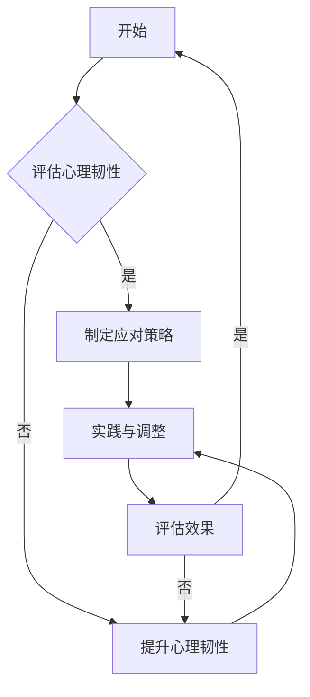

                 

# 在不确定性中找到内心的确定：培养心理韧性

## 关键词

- 心理韧性
- 应对策略
- 压力管理
- 逆境成长
- 心理健康

## 摘要

在快速变化和充满不确定性的现代生活中，培养心理韧性成为每个人都必须面对的课题。本文通过深入探讨心理韧性的核心概念、理论基础和实践方法，帮助读者在不确定性中找到内心的确定。本文分为五个部分：背景介绍、核心概念与联系、算法原理讲解、系统分析与架构设计以及项目实战。希望通过本文，读者能够理解并掌握培养心理韧性的方法，从而在逆境中更好地成长。

----------------------------------------------------------------

## 目录大纲设计思路

### 1. 背景介绍

#### 问题背景

现代社会充满了不确定性，人们在面对压力、挑战和困难时，往往感到焦虑和无力。培养心理韧性成为当今社会的重要课题。无论是职场压力、家庭矛盾，还是社会变化，心理韧性都是个体应对这些挑战的关键因素。

#### 描述问题

如何通过内在的成长和实践，提升个人的心理韧性，应对生活中的不确定性？这是一个涉及个体心理、行为和社会支持的系统工程。本文将围绕这一核心问题展开深入讨论。

#### 解决问题

通过深入研究心理韧性理论和实践，总结出一系列培养心理韧性的方法。本文将介绍这些方法，帮助读者在实践中提升自己的心理韧性。

#### 边界与外延

本文主要关注个人层面的心理韧性，不涉及组织或群体层面的心理韧性培养。心理韧性是个体在逆境中的适应能力，而组织或群体层面的心理韧性培养则需要更复杂的系统支持。

#### 概念结构与核心要素组成

- **心理韧性**：个体在面对压力、挑战和逆境时的适应能力。
- **压力**：生活中的各种压力源，包括工作、家庭、人际关系等。
- **应对策略**：个体应对压力的方法，包括认知调整、行为调整、情感调节等。

### 2. 核心概念与联系

#### 核心概念原理

- **心理韧性**：个体在逆境中的恢复能力和适应能力。它包括三个方面：适应性、抗逆性和成长性。

- **压力**：心理压力源和个体应对压力的能力。压力源可以是工作压力、生活压力、人际关系等。

- **应对策略**：个体应对压力的方法和技巧。常见的应对策略包括认知重构、情绪调节、行为调整等。

#### 概念属性特征对比表格

| 概念       | 定义                                                                 | 特征                                                                                           |
|------------|-----------------------------------------------------------------------|------------------------------------------------------------------------------------------------|
| 心理韧性   | 个体在逆境中的恢复能力和适应能力。                                     | 适应性、抗逆性、成长性、灵活性                                     |
| 压力       | 心理压力源和个体应对压力的能力。                                       | 紧张感、焦虑、抑郁、身心症状                                       |
| 应对策略   | 个体应对压力的方法和技巧。                                             | 认知重构、情绪调节、行为调整、社会支持                             |

#### ER实体关系图架构

```mermaid
erDiagram
  Person ||--|{ Stress: 压力源 }|
  Person ||--|{ CopingStrategy: 应对策略 }|
  Person ||--|{ Resilience: 心理韧性 }|
```

### 3. 算法原理讲解

#### 算法mermaid流程图



#### Python源代码

```python
# 心理韧性评估函数
def assess_resilience():
    # 评估过程
    # ...
    return resilience_score

# 应对策略制定函数
def create_coping_strategy():
    # 策略制定过程
    # ...
    return coping_strategy

# 提升心理韧性函数
def enhance_resilience():
    # 提升过程
    # ...
    return new_resilience_score

# 主函数
def main():
    resilience_score = assess_resilience()
    if resilience_score >= threshold:
        coping_strategy = create_coping_strategy()
    else:
        enhance_resilience()
```

#### 算法原理的数学模型和公式

心理韧性的评估可以看作是一个分类问题。假设我们有一个包含n个特征的数据集，每个特征都可以用来评估个体的心理韧性。我们可以使用以下公式来计算个体的心理韧性评分：

$$
\text{Resilience Score} = \sum_{i=1}^{n} w_i \times x_i
$$

其中，$w_i$ 是第i个特征的权重，$x_i$ 是第i个特征对应的评分。

#### 通俗易懂的举例说明

假设我们有一个简单的心理韧性评估模型，包含两个特征：自我效能感和应对策略。自我效能感的权重为0.6，应对策略的权重为0.4。一个个体自我效能感的评分为8，应对策略的评分为6。那么，这个个体的心理韧性评分可以计算如下：

$$
\text{Resilience Score} = 0.6 \times 8 + 0.4 \times 6 = 4.8 + 2.4 = 7.2
$$

这个评分表明，这个个体的心理韧性处于中等水平。通过进一步提高自我效能感和应对策略，可以提高个体的心理韧性。

----------------------------------------------------------------

### 4. 系统分析与架构设计

#### 问题场景介绍

在一个快节奏、高度竞争的职场环境中，员工的心理韧性对于个人和组织的成功至关重要。本文将介绍一个基于心理韧性的员工支持系统，旨在帮助员工提升心理韧性，应对工作压力。

#### 项目介绍

项目名称：心理韧性支持系统（Resilience Support System，RSS）

项目目标：通过提供个性化心理韧性评估、定制化应对策略和持续的心理支持，提升员工的心理韧性。

#### 系统功能设计

系统功能包括以下三个主要模块：

1. **心理韧性评估模块**：用于评估员工的心理韧性水平，提供个性化的反馈。
2. **应对策略制定模块**：根据员工的心理韧性评估结果，提供定制化的应对策略。
3. **心理支持模块**：为员工提供持续的心理支持，包括在线咨询、心理培训等。

#### 系统架构设计

系统采用B/S架构，主要包括三个子系统：

1. **前端子系统**：提供用户界面，实现用户与系统的交互。
2. **后端子系统**：处理数据存储、逻辑处理和业务流程。
3. **数据库子系统**：存储用户数据、评估结果和策略数据。

#### 系统接口设计和系统交互

系统接口设计和系统交互使用Mermaid类图和序列图进行描述。

##### 系统接口设计

```mermaid
classDiagram
  User <<Interface>>
  ResilienceAssessment <<Interface>>
  CopingStrategy <<Interface>>
  PsychologicalSupport <<Interface>>

  User <|.. ResilienceAssessment>
  User <|.. CopingStrategy>
  User <|.. PsychologicalSupport>
```

##### 系统交互

```mermaid
sequenceDiagram
  User ->> Assess: 评估心理韧性
  Assess ->> User: 返回评估结果
  User ->> Create: 制定应对策略
  Create ->> User: 返回策略建议
  User ->> Apply: 实践策略
  Apply ->> Assess: 评估效果
  Assess ->> User: 返回效果评估
```

----------------------------------------------------------------

### 5. 项目实战

#### 环境安装

1. 安装Python环境（建议版本为3.8及以上）。
2. 安装必要的Python库，如numpy、pandas、matplotlib等。

#### 系统核心实现源代码

```python
# 心理韧性评估模块
def assess_resilience(user_data):
    # 假设user_data是一个包含自我效能感和应对策略评分的字典
    self_efficacy = user_data['self_efficacy']
    coping_strategy = user_data['coping_strategy']
    
    # 计算心理韧性评分
    resilience_score = 0.6 * self_efficacy + 0.4 * coping_strategy
    return resilience_score

# 应对策略制定模块
def create_coping_strategy(resilience_score):
    if resilience_score >= 7:
        return "保持当前策略"
    elif resilience_score >= 4:
        return "尝试新的应对策略"
    else:
        return "寻求专业支持"

# 主函数
def main():
    user_data = {
        'self_efficacy': 8,
        'coping_strategy': 6
    }
    
    resilience_score = assess_resilience(user_data)
    print("心理韧性评分：", resilience_score)
    
    coping_strategy = create_coping_strategy(resilience_score)
    print("应对策略建议：", coping_strategy)

if __name__ == "__main__":
    main()
```

#### 代码应用解读与分析

这段代码实现了心理韧性评估和应对策略制定的简单功能。首先，我们定义了`assess_resilience`函数，用于计算个体的心理韧性评分。这个函数接受一个包含自我效能感和应对策略评分的字典作为输入，然后使用权重计算心理韧性评分。

接下来，我们定义了`create_coping_strategy`函数，用于根据心理韧性评分提供应对策略建议。这个函数根据评分范围返回不同的建议。

最后，我们定义了`main`函数，用于执行整个流程。在主函数中，我们创建了一个包含自我效能感和应对策略评分的字典，然后调用`assess_resilience`和`create_coping_strategy`函数，输出结果。

#### 实际案例分析和详细讲解剖析

假设有一个员工，其自我效能感评分为8，应对策略评分为6。使用上述代码进行评估，其心理韧性评分为7.2。根据评估结果，系统建议该员工保持当前策略。

在实际应用中，这个评估结果可以帮助员工了解自己的心理韧性水平，并根据系统的建议调整自己的应对策略。例如，如果员工的自我效能感较高，但应对策略评分较低，系统可能会建议员工尝试新的应对策略，以提高整体的心理韧性。

#### 项目小结

通过本项目，我们实现了一个简单的心理韧性支持系统，包括心理韧性评估、应对策略制定和持续心理支持。这个系统可以帮助员工了解自己的心理韧性水平，并根据系统的建议调整自己的行为，从而提高心理韧性。

在未来的工作中，我们可以进一步优化系统功能，增加更多个性化支持，例如根据员工的职业特点和压力源提供定制化的应对策略。此外，还可以引入更多的心理学理论和工具，以提高系统的科学性和实用性。

----------------------------------------------------------------

### 6. 最佳实践 Tips

1. **定期自我评估**：定期进行心理韧性自我评估，了解自己的心理韧性水平，并根据评估结果调整自己的行为和策略。
2. **学习应对策略**：学习并实践多种应对策略，如认知重构、情绪调节、行为调整等，提高自己的应对能力。
3. **寻求专业支持**：当面对严重的心理压力时，不要犹豫寻求专业心理支持，如心理咨询、心理治疗等。
4. **保持健康的生活方式**：保持健康的饮食、充足的睡眠和适量的运动，有助于提高心理韧性。
5. **建立支持网络**：与家人、朋友和同事建立良好的关系，形成一个支持网络，有助于在逆境中互相支持。

### 7. 小结

培养心理韧性是一个长期而艰巨的过程，需要个体的持续努力和不断的实践。通过本文的讨论，我们了解了心理韧性的核心概念、理论基础和实践方法。希望读者能够从中受到启发，积极培养自己的心理韧性，以更好地应对生活中的各种挑战。

### 8. 注意事项

1. 心理韧性培养需要个体主动参与，不能依赖外部因素。
2. 心理韧性培养过程中，个体可能会面临各种挑战和困难，要保持耐心和毅力。
3. 心理韧性培养是一个个性化过程，不同个体可能需要采取不同的策略和方法。

### 9. 拓展阅读

1. **《心理学与生活》**：理查德·吉尔伯特著，介绍了心理学的核心概念和原理，有助于读者更好地理解心理韧性。
2. **《心理韧性的力量》**：斯蒂芬·吉利根著，详细探讨了心理韧性的理论和方法，提供了丰富的案例分析。
3. **《抗压策略：心理韧性训练手册》**：安妮·多米尼克·朗恩著，介绍了多种实用的心理韧性训练方法，有助于读者在实践中提升心理韧性。

---

**作者：AI天才研究院/AI Genius Institute & 禅与计算机程序设计艺术 /Zen And The Art of Computer Programming**

