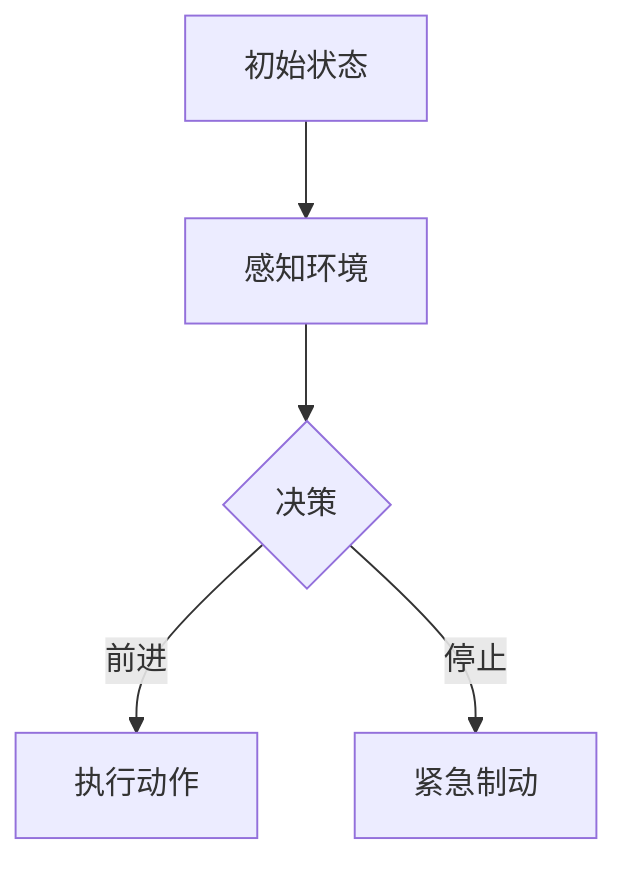
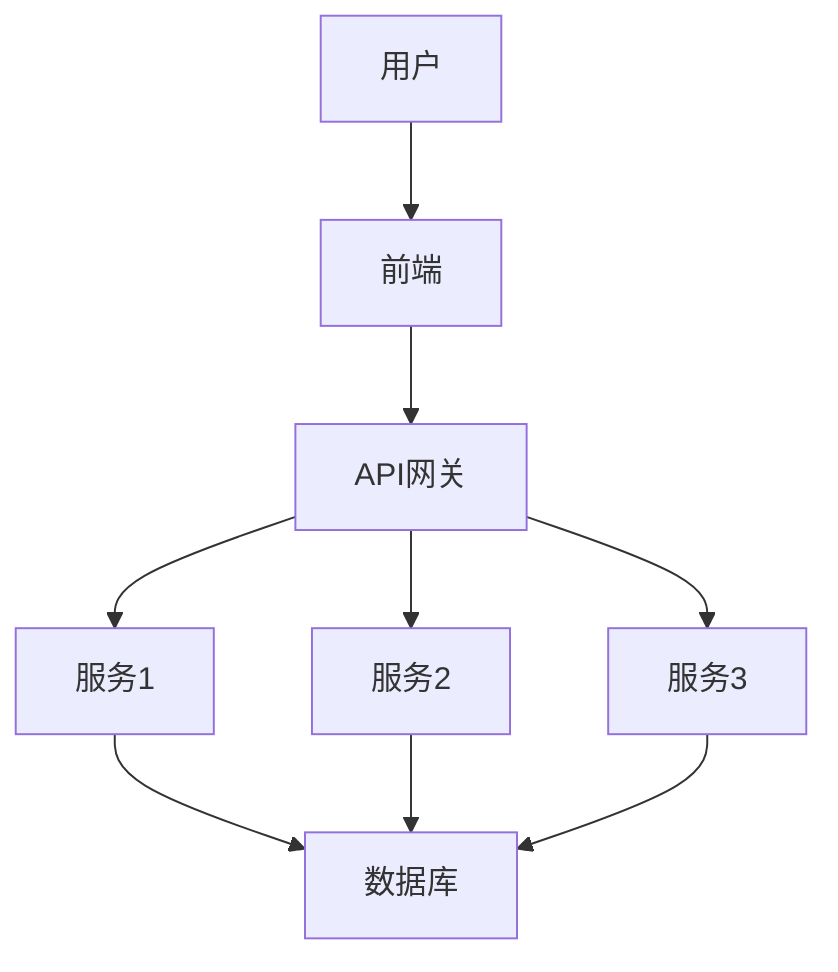
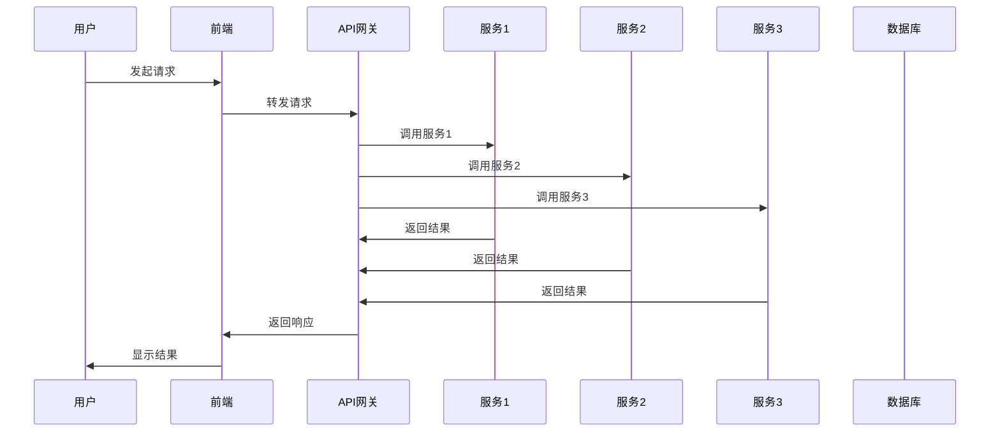

                 


# 在人工智能时代重新定义人类价值：应对技术挑战

关键词：人工智能、人类价值、伦理、未来趋势、技术应用

摘要：本文将探讨在人工智能快速发展的背景下，人类价值如何被重新定义，以及我们应如何应对由此带来的技术挑战。通过深入分析，我们将揭示人工智能与人类价值观之间的复杂关系，并提出相应的策略和路径。

## 引言

### 1.1 问题的背景

人工智能（AI）作为计算机科学的一个重要分支，近年来取得了飞速的发展。从最初的规则推理到今天的深度学习和强化学习，AI已经在各个领域展示了其强大的能力和潜力。从自动驾驶汽车到智能助手，AI正在逐渐渗透到我们的日常生活中。然而，随着AI技术的不断进步，我们不得不重新思考人类价值的问题。传统的价值观是否仍然适用于这个技术驱动的时代？人类在AI时代是否仍然拥有不可替代的价值？这些问题需要我们深入探讨和思考。

### 1.2 问题的描述

人工智能在提高生产效率、改善生活质量的同时，也引发了一系列问题。首先，AI的广泛应用可能导致失业率上升，特别是对那些重复性、低技能的工作岗位。其次，AI技术的发展可能加剧社会的不平等，因为拥有技术资源和数据优势的群体将更容易获得成功。此外，AI在决策过程中可能会出现偏见和歧视，这不仅违背了伦理原则，也可能导致社会不稳定。

面对这些挑战，我们需要重新审视人类价值，探索如何在AI时代保持和提升我们的价值。这包括重新定义教育、工作、伦理和社会组织等领域的价值观，以及制定相应的政策和措施来应对技术挑战。

### 1.3 问题解决

为了解决上述问题，我们需要从以下几个方面入手：

1. **教育和培训**：提高公众对AI技术的理解和接受度，加强跨学科的教育和培训，培养能够适应AI时代的人才。
2. **伦理和法律框架**：建立和完善AI伦理和法律框架，确保AI技术的发展符合社会价值观和道德规范。
3. **社会政策和措施**：通过政策调整和措施，减少AI技术带来的负面影响，如失业、不平等和社会不稳定等。
4. **国际合作**：加强国际间的合作，共同制定和执行AI技术标准和规范，确保全球范围内的AI技术发展符合人类价值观。

### 1.4 边界与外延

在探讨人工智能与人类价值的关系时，我们需要明确几个边界和概念：

1. **技术发展的限制**：虽然AI技术正在快速发展，但仍然存在一定的限制和挑战，如计算能力、数据质量和算法复杂性等。
2. **社会文化的多样性**：不同的社会和文化背景对人类价值的理解存在差异，这需要在制定政策和措施时加以考虑。
3. **人类价值观的多维度**：人类价值不仅仅包括经济利益，还涉及到道德、社会和文化等多个方面。

### 1.5 核心概念与联系

为了更好地理解人工智能与人类价值的关系，我们引入以下核心概念：

1. **人工智能**：一种模拟人类智能的技术，能够通过学习、推理和自主决策等方式执行任务。
2. **人类价值**：指人类在道德、社会和文化等方面所追求的目标和理念。
3. **伦理**：研究道德原则和规范，以及人类行为应遵循的准则。
4. **社会趋势**：社会在特定时期内的发展方向和变化趋势。

这些概念之间存在着复杂的联系，如人工智能技术的发展会影响人类价值，而人类价值又会反作用于人工智能的发展。在本文中，我们将通过逐步分析这些概念和联系，深入探讨人工智能时代的人类价值问题。

## 人工智能与人类价值观的相互作用

### 2.1 人工智能概述

人工智能（Artificial Intelligence，AI）是一种通过模拟人类智能的机器系统，使其能够执行复杂任务，如图像识别、自然语言处理和决策制定等。AI的发展可以分为几个阶段：

1. **规则推理（Rule-Based Systems）**：最早的AI形式，通过一系列预定义的规则进行推理和决策。
2. **知识表示与推理（Knowledge Representation and Reasoning）**：引入知识库和推理机，使得AI系统能够基于已知事实进行推理。
3. **机器学习（Machine Learning）**：通过训练模型，使AI系统具备自动学习和改进的能力。
4. **深度学习（Deep Learning）**：基于多层神经网络，通过大规模数据训练，实现高度自动化的特征提取和模式识别。
5. **强化学习（Reinforcement Learning）**：通过奖励和惩罚机制，使AI系统能够在复杂环境中进行自主学习和决策。

人工智能的分类：

1. **基于规则的AI（Rule-Based AI）**：通过预定义的规则进行推理和决策，适用于结构化问题。
2. **统计模型（Statistical Models）**：通过统计学习算法，如线性回归、支持向量机等，用于分类和回归任务。
3. **神经网络（Neural Networks）**：通过模拟人脑神经元连接，用于复杂的数据处理和模式识别。
4. **深度强化学习（Deep Reinforcement Learning）**：结合深度学习和强化学习，用于解决高度复杂的问题。

### 2.2 人类价值观的演变

人类价值观是一个复杂的概念，它涉及道德、社会、文化等多个层面。从历史角度来看，人类价值观经历了几个重要阶段：

1. **原始价值观**：以生存和安全为核心，关注基本生理需求的满足。
2. **农业社会的价值观**：以家庭和社区为核心，强调责任、忠诚和稳定。
3. **工业社会的价值观**：以经济利益为核心，强调效率、竞争和创新。
4. **信息社会的价值观**：以知识、技术和创新为核心，强调个性、自由和多样性。

文化多样性对价值观的影响：

1. **文化多样性**：不同的文化背景对社会价值观有着深远的影响，如儒家文化强调家庭和社会责任，而西方文化则强调个人自由和权利。
2. **价值观的冲突**：不同文化之间的价值观可能存在冲突，如环境保护与经济发展之间的矛盾。

### 2.3 人工智能与人类价值观的相互作用

人工智能与人类价值观之间的相互作用体现在多个方面：

1. **技术推动价值观变化**：AI技术的发展可能改变人类对事物的认知和价值观，如自动驾驶技术的普及可能改变人们对交通安全的看法。
2. **价值观影响技术发展**：人类价值观对社会和技术的发展有着重要影响，如伦理问题可能限制某些AI技术的应用。
3. **AI的伦理问题**：AI技术的发展引发了关于伦理的讨论，如AI的决策过程是否公正、透明和可解释。
4. **AI的社会责任**：AI技术的设计和应用需要考虑社会责任，如避免技术滥用和社会不公。

### 2.4 人工智能与人类价值观的辩证关系

人工智能与人类价值观之间存在一种辩证关系，这种关系体现在以下几个方面：

1. **相互促进**：AI技术的发展可以帮助人类更好地实现价值观，如AI辅助教育可以提高教育质量，更好地培养下一代。
2. **相互制约**：人类价值观可能限制AI技术的发展，如社会对隐私和数据安全的关注可能限制某些AI技术的应用。
3. **相互影响**：AI技术的发展可能改变人类价值观，如人工智能的普及可能使人们更加重视效率和便利。
4. **相互适应**：随着AI技术的进步，人类价值观也在不断调整和适应，如社会对AI伦理问题的关注和讨论。

### 2.5 AI时代的伦理挑战

AI时代的伦理挑战主要集中在以下几个方面：

1. **算法偏见**：AI系统的决策过程可能存在偏见，导致歧视和不公平。
2. **隐私保护**：AI技术的大量数据收集和使用可能侵犯个人隐私。
3. **透明度和可解释性**：AI系统的决策过程可能缺乏透明度和可解释性，使得用户难以理解和信任。
4. **责任归属**：当AI系统出现错误或造成损害时，责任应由谁承担？

### 2.6 应对AI伦理挑战的策略

为了应对AI时代的伦理挑战，我们可以采取以下策略：

1. **制定伦理规范**：建立和完善AI伦理规范，明确AI技术的应用边界和道德准则。
2. **加强监管**：政府和相关机构应加强对AI技术的监管，确保其符合伦理要求。
3. **提高透明度**：增加AI系统的透明度和可解释性，使公众更容易理解和信任AI技术。
4. **技术伦理教育**：加强技术伦理教育，提高开发者和用户对AI伦理问题的认识和敏感度。

### 2.7 人类价值观在AI时代的重新定义

在AI时代，人类价值观可能发生以下变化：

1. **人机共生**：人类与AI的共生关系将更加紧密，人类将更加依赖AI技术。
2. **责任意识**：人类对AI技术的责任意识将增强，意识到技术发展对人类和社会的影响。
3. **伦理观念**：随着AI技术的发展，伦理观念也将不断更新和拓展，以适应新的社会环境。
4. **自我认知**：人类将重新审视自己的价值和地位，更加重视个体的价值和尊严。

### 2.8 人工智能与人类价值观的相互作用案例

为了更好地理解人工智能与人类价值观的相互作用，我们可以通过一些具体案例进行分析：

1. **自动驾驶汽车**：自动驾驶汽车在提高交通效率和安全的同时，也引发了关于隐私、责任和道德的讨论。
2. **医疗AI**：医疗AI在提高诊断和治疗效果的同时，也涉及到数据隐私、算法偏见和医疗责任等问题。
3. **智能城市**：智能城市的建设通过AI技术提高城市管理效率和居民生活质量，但也引发了关于隐私、安全和伦理的争议。

通过这些案例，我们可以看到人工智能与人类价值观之间的复杂关系，以及在这一过程中所面临的挑战和机遇。

## 第三部分：未来趋势与方向

### 3.1 AI技术的发展趋势

人工智能技术的快速发展将引领未来社会的变革。以下是一些主要的发展趋势：

1. **量子计算**：量子计算的兴起将极大地提升计算能力，为AI技术的发展提供新的动力。
2. **脑机接口**：脑机接口技术的进步将实现人类与机器的直接连接，开启新的交互方式。
3. **边缘计算**：边缘计算将数据处理和计算能力从云端转移到网络边缘，提高AI系统的响应速度和效率。
4. **自适应系统**：自适应系统能够在复杂环境中自我调整和优化，提高AI系统的自主性和灵活性。

### 3.2 AI与人类价值观的未来关系

随着AI技术的不断发展，人类价值观可能会发生以下变化：

1. **人机共生**：人类与AI的共生关系将更加紧密，人类将更加依赖AI技术。
2. **责任意识**：人类对AI技术的责任意识将增强，意识到技术发展对人类和社会的影响。
3. **伦理观念**：随着AI技术的发展，伦理观念也将不断更新和拓展，以适应新的社会环境。
4. **自我认知**：人类将重新审视自己的价值和地位，更加重视个体的价值和尊严。

### 3.3 应对未来技术挑战的策略

为了应对未来技术挑战，我们可以采取以下策略：

1. **教育和技术培训**：加强AI技术教育和培训，提高公众对AI技术的理解和接受度。
2. **伦理和法律框架**：建立和完善AI伦理和法律框架，确保AI技术的发展符合社会价值观和道德规范。
3. **社会政策和措施**：通过政策调整和措施，减少AI技术带来的负面影响，如失业、不平等和社会不稳定等。
4. **国际合作**：加强国际间的合作，共同制定和执行AI技术标准和规范，确保全球范围内的AI技术发展符合人类价值观。

### 3.4 AI时代的未来社会

在AI时代，社会结构、经济模式和文化价值观都可能会发生深刻变化：

1. **社会结构**：人工智能的广泛应用将改变传统的劳动力市场和社会结构，导致新的职业和就业模式的出现。
2. **经济模式**：AI技术的商业化应用将推动新的经济增长点，同时可能加剧社会不平等问题。
3. **文化价值观**：人类价值观可能会受到AI技术的深刻影响，重新定义幸福、自由和尊严等基本价值。

### 3.5 持续研究和探索的方向

为了确保AI技术的发展符合人类价值观，未来的研究应重点关注以下方向：

1. **伦理与法律研究**：深化对AI伦理和法律问题的研究，为AI技术的发展提供理论基础。
2. **社会影响研究**：研究AI技术对社会、经济和文化的影响，制定相应的政策和管理措施。
3. **技术安全性研究**：提高AI技术的安全性，防止技术滥用和风险扩散。
4. **人机交互研究**：探索更自然、更高效的人机交互方式，提高人类与AI的共生质量。

## 第四部分：实践与应用

### 4.1 AI技术在教育领域的应用

随着AI技术的发展，教育领域也发生了深刻变革。以下是一些关键应用：

1. **个性化学习**：通过AI技术，学生可以接受更加个性化的教育，满足不同学习需求和节奏。
2. **智能辅导**：AI辅导系统可以根据学生的表现和需求，提供针对性的辅导和建议。
3. **教育资源优化**：AI技术可以帮助优化教育资源的分配和使用，提高教育效率和质量。
4. **智能评估**：AI评估系统能够对学生的学习成果进行自动评估，减少人为误差。

### 4.2 AI技术在医疗健康领域的应用

AI技术在医疗健康领域的应用前景广阔，以下是一些关键应用：

1. **疾病诊断**：AI系统可以通过分析医学影像和数据，提供准确的疾病诊断。
2. **药物研发**：AI技术可以加速药物研发过程，提高药物研发的效率。
3. **智能辅助手术**：AI技术可以辅助外科医生进行手术，提高手术精度和安全性。
4. **健康监测**：通过可穿戴设备和AI技术，实现对个体健康状况的实时监测和预警。

### 4.3 AI技术在城市管理中的应用

AI技术在城市管理中发挥着重要作用，以下是一些关键应用：

1. **交通管理**：AI技术可以优化交通流量，减少拥堵，提高交通效率。
2. **公共安全**：AI技术可以用于监控和预警公共安全事件，提高社会治安水平。
3. **资源管理**：AI技术可以帮助优化城市资源的分配和使用，提高城市管理效率。
4. **环境监测**：AI技术可以实时监测环境质量，为环境保护提供数据支持。

### 4.4 AI技术在商业领域的应用

AI技术在商业领域的应用日益广泛，以下是一些关键应用：

1. **客户服务**：通过AI技术，企业可以提供更加智能、个性化的客户服务。
2. **市场营销**：AI技术可以帮助企业进行精准营销，提高营销效果和转化率。
3. **供应链管理**：AI技术可以优化供应链管理，提高供应链效率和响应速度。
4. **风险管理**：AI技术可以帮助企业识别和管理风险，降低经营风险。

### 4.5 AI技术在文化艺术领域的应用

AI技术在文化艺术领域的应用也日益增多，以下是一些关键应用：

1. **艺术创作**：AI技术可以帮助艺术家进行创作，提供新的艺术表现形式。
2. **文化遗产保护**：AI技术可以用于文化遗产的数字化保护和修复。
3. **虚拟现实体验**：AI技术可以创造更加逼真、沉浸的虚拟现实体验。
4. **文化传播**：AI技术可以帮助推广和传播文化艺术，提高文化影响力。

### 4.6 AI技术在农业领域的应用

AI技术在农业领域的应用正在逐渐推广，以下是一些关键应用：

1. **智能种植**：AI技术可以提供精确的种植指导，优化作物生长环境。
2. **病虫害监测**：AI技术可以实时监测病虫害，提供有效的防治措施。
3. **智能灌溉**：AI技术可以根据土壤湿度、气候等因素，实现智能灌溉，提高水资源利用效率。
4. **农产品质量检测**：AI技术可以实时检测农产品的质量，确保农产品安全。

### 4.7 AI技术在工业生产领域的应用

AI技术在工业生产领域的应用正在推动工业4.0和智能制造的实现，以下是一些关键应用：

1. **生产优化**：AI技术可以帮助企业优化生产流程，提高生产效率和产品质量。
2. **设备维护**：AI技术可以实时监测设备状态，预测设备故障，实现预防性维护。
3. **供应链管理**：AI技术可以优化供应链管理，提高供应链效率和响应速度。
4. **质量检测**：AI技术可以用于实时检测产品质量，确保产品质量。

### 4.8 AI技术在金融领域的应用

AI技术在金融领域的应用日益深入，以下是一些关键应用：

1. **风险控制**：AI技术可以帮助金融机构识别和管理风险，降低金融风险。
2. **智能投顾**：AI技术可以提供个性化的投资建议，帮助投资者做出更明智的决策。
3. **欺诈检测**：AI技术可以实时监测交易行为，识别和防范金融欺诈。
4. **信用评估**：AI技术可以帮助金融机构更准确地评估借款人的信用状况。

### 4.9 AI技术在能源领域的应用

AI技术在能源领域的应用可以帮助优化能源生产和消费，以下是一些关键应用：

1. **智能电网**：AI技术可以帮助优化电网运行，提高电力供应的可靠性和效率。
2. **可再生能源管理**：AI技术可以优化可再生能源的利用，提高能源利用效率。
3. **能源预测**：AI技术可以预测能源需求和供应，帮助制定更科学的能源计划。
4. **能源监测**：AI技术可以实时监测能源使用情况，提供能耗优化建议。

### 4.10 AI技术在食品安全领域的应用

AI技术在食品安全领域的应用可以帮助提高食品安全水平，以下是一些关键应用：

1. **食品安全监测**：AI技术可以实时监测食品中的有害物质，确保食品安全。
2. **供应链追踪**：AI技术可以帮助追踪食品的来源和流向，提高食品安全追溯能力。
3. **质量检测**：AI技术可以用于实时检测食品的质量，确保食品符合标准。
4. **智能仓库管理**：AI技术可以优化食品仓库管理，提高存储效率和食品安全。

### 4.11 AI技术在环境监测领域的应用

AI技术在环境监测领域的应用可以帮助保护环境和生态系统，以下是一些关键应用：

1. **空气质量监测**：AI技术可以实时监测空气质量，提供预警和改善建议。
2. **水质监测**：AI技术可以实时监测水质，确保水资源的安全和清洁。
3. **森林火灾监测**：AI技术可以监测森林火灾，提供预警和应急响应。
4. **气候变化研究**：AI技术可以分析气候变化数据，为政策制定提供科学依据。

### 4.12 AI技术在灾害应对领域的应用

AI技术在灾害应对领域的应用可以帮助减少灾害损失和影响，以下是一些关键应用：

1. **灾害预警**：AI技术可以预测和预警自然灾害，如地震、台风、洪水等。
2. **灾害响应**：AI技术可以帮助优化救援资源分配，提高灾害应急响应效率。
3. **灾害评估**：AI技术可以评估灾害影响，为灾害恢复提供数据支持。
4. **灾害预防**：AI技术可以用于预测和预防灾害，减少灾害发生的概率。

### 4.13 AI技术在网络安全领域的应用

AI技术在网络安全领域的应用可以帮助提高网络安全水平，以下是一些关键应用：

1. **入侵检测**：AI技术可以实时监测网络活动，识别和防范入侵行为。
2. **漏洞扫描**：AI技术可以自动扫描网络漏洞，提供修复建议。
3. **安全预测**：AI技术可以预测网络安全威胁，提前采取措施。
4. **安全监控**：AI技术可以实时监控网络安全状况，提供实时预警和响应。

### 4.14 AI技术在交通领域的应用

AI技术在交通领域的应用可以帮助提高交通效率和安全性，以下是一些关键应用：

1. **智能交通管理**：AI技术可以优化交通流量，减少拥堵，提高交通效率。
2. **自动驾驶技术**：AI技术可以用于开发自动驾驶汽车，提高交通安全和便利性。
3. **交通监控**：AI技术可以实时监控交通状况，提供实时交通信息和服务。
4. **公共交通优化**：AI技术可以优化公共交通线路和运营，提高公共交通服务质量。

### 4.15 AI技术在智能制造领域的应用

AI技术在智能制造领域的应用可以帮助提高生产效率和产品质量，以下是一些关键应用：

1. **生产优化**：AI技术可以优化生产流程，提高生产效率。
2. **质量检测**：AI技术可以实时检测产品质量，确保产品质量符合标准。
3. **设备维护**：AI技术可以监测设备状态，实现预防性维护，减少设备故障。
4. **供应链管理**：AI技术可以优化供应链管理，提高供应链效率和响应速度。

### 4.16 AI技术在智能家居领域的应用

AI技术在智能家居领域的应用可以帮助提高生活便利性和舒适度，以下是一些关键应用：

1. **智能家电控制**：AI技术可以实现智能家电的远程控制和自动化管理。
2. **家居安全监控**：AI技术可以用于家居安全监控，提高家庭安全水平。
3. **环境监测**：AI技术可以实时监测家居环境，如空气质量、温度等，提供舒适的生活环境。
4. **能源管理**：AI技术可以优化家居能源使用，提高能源利用效率。

### 4.17 AI技术在旅游业的应用

AI技术在旅游业的应用可以帮助提升旅游体验和服务质量，以下是一些关键应用：

1. **智能导览**：AI技术可以提供智能导览服务，为游客提供个性化的旅游信息和服务。
2. **在线预订**：AI技术可以优化旅游线路和预订流程，提高旅游效率。
3. **个性化推荐**：AI技术可以根据游客的兴趣和行为，提供个性化的旅游推荐。
4. **智能客服**：AI技术可以提供智能客服服务，提高旅游咨询和问题解决的效率。

### 4.18 AI技术在金融科技（FinTech）领域的应用

AI技术在金融科技（FinTech）领域的应用可以帮助提升金融服务的效率和用户体验，以下是一些关键应用：

1. **智能支付**：AI技术可以提供智能支付服务，提高支付效率和安全性。
2. **信用评估**：AI技术可以提供信用评估服务，帮助金融机构更好地评估借款人的信用状况。
3. **欺诈检测**：AI技术可以实时监测交易行为，识别和防范金融欺诈。
4. **投资咨询**：AI技术可以提供个性化的投资建议，帮助投资者做出更明智的决策。

### 4.19 AI技术在法律领域的应用

AI技术在法律领域的应用可以帮助提高法律服务的效率和准确性，以下是一些关键应用：

1. **案件分析**：AI技术可以帮助律师和法官分析案件，提供法律建议。
2. **文档审查**：AI技术可以自动审查法律文档，提高工作效率。
3. **智能咨询**：AI技术可以提供智能咨询服务，帮助用户解决法律问题。
4. **判决预测**：AI技术可以根据历史案件数据，预测案件的判决结果。

### 4.20 AI技术在生物技术（BioTech）领域的应用

AI技术在生物技术领域的应用可以帮助推动生物技术的研究和应用，以下是一些关键应用：

1. **药物研发**：AI技术可以加速药物研发过程，提高药物研发的效率。
2. **基因组分析**：AI技术可以分析基因组数据，提供个性化的医疗建议。
3. **疾病预测**：AI技术可以预测疾病的发病风险，帮助制定预防措施。
4. **生物信息学**：AI技术可以处理大量的生物数据，提供有价值的信息。

### 4.21 AI技术在人力资源领域的应用

AI技术在人力资源领域的应用可以帮助优化人力资源管理，以下是一些关键应用：

1. **招聘**：AI技术可以提供智能招聘服务，提高招聘效率和准确性。
2. **培训与发展**：AI技术可以提供个性化的培训和发展建议，提高员工技能和绩效。
3. **员工管理**：AI技术可以优化员工管理流程，提高员工满意度和工作效率。
4. **绩效评估**：AI技术可以提供智能绩效评估服务，帮助管理者更好地评估员工绩效。

### 4.22 AI技术在制造业的应用

AI技术在制造业的应用可以帮助提高生产效率和产品质量，以下是一些关键应用：

1. **生产计划**：AI技术可以优化生产计划，提高生产效率和响应速度。
2. **质量控制**：AI技术可以实时检测产品质量，确保产品质量符合标准。
3. **设备维护**：AI技术可以监测设备状态，实现预防性维护，减少设备故障。
4. **供应链管理**：AI技术可以优化供应链管理，提高供应链效率和响应速度。

### 4.23 AI技术在智能城市建设中的应用

AI技术在智能城市建设中的应用可以帮助提高城市管理的效率和居民生活质量，以下是一些关键应用：

1. **智能交通管理**：AI技术可以优化交通流量，减少拥堵，提高交通效率。
2. **智能公共安全**：AI技术可以监控和预警公共安全事件，提高社会治安水平。
3. **智慧环保**：AI技术可以实时监测环境质量，提供环保建议。
4. **智慧公共服务**：AI技术可以提供智能化的公共服务，提高居民生活质量。

### 4.24 AI技术在农业领域的应用

AI技术在农业领域的应用可以帮助提高农业生产效率和产品质量，以下是一些关键应用：

1. **智能种植**：AI技术可以提供智能种植指导，优化作物生长环境。
2. **病虫害监测**：AI技术可以实时监测病虫害，提供有效的防治措施。
3. **智能灌溉**：AI技术可以根据土壤湿度、气候等因素，实现智能灌溉，提高水资源利用效率。
4. **农产品质量检测**：AI技术可以实时检测农产品的质量，确保农产品安全。

### 4.25 AI技术在零售领域的应用

AI技术在零售领域的应用可以帮助提升零售效率和用户体验，以下是一些关键应用：

1. **智能库存管理**：AI技术可以优化库存管理，提高库存周转率和资金利用率。
2. **智能推荐**：AI技术可以根据消费者的行为和偏好，提供个性化的商品推荐。
3. **智能客服**：AI技术可以提供智能客服服务，提高客户满意度和转化率。
4. **供应链管理**：AI技术可以优化供应链管理，提高供应链效率和响应速度。

### 4.26 AI技术在娱乐行业的应用

AI技术在娱乐行业的应用可以帮助提升娱乐体验和内容创作效率，以下是一些关键应用：

1. **个性化推荐**：AI技术可以根据用户偏好，提供个性化的娱乐内容推荐。
2. **内容创作**：AI技术可以帮助创作者生成新的内容，提高内容创作效率。
3. **智能互动**：AI技术可以提供智能互动服务，提升用户体验。
4. **版权保护**：AI技术可以自动识别和监控版权侵权行为，保护内容创作者的权益。

### 4.27 AI技术在物流和运输领域的应用

AI技术在物流和运输领域的应用可以帮助提高物流效率和运输安全性，以下是一些关键应用：

1. **智能调度**：AI技术可以优化运输路线和调度，提高运输效率和响应速度。
2. **实时跟踪**：AI技术可以实时跟踪货物运输状态，提高物流透明度和安全性。
3. **智能仓储**：AI技术可以优化仓储管理，提高仓储效率和准确性。
4. **货物识别**：AI技术可以自动识别和分类货物，提高物流效率。

### 4.28 AI技术在网络安全领域的应用

AI技术在网络安全领域的应用可以帮助提高网络安全水平和应对网络攻击的能力，以下是一些关键应用：

1. **入侵检测**：AI技术可以实时监测网络活动，识别和防范入侵行为。
2. **漏洞扫描**：AI技术可以自动扫描网络漏洞，提供修复建议。
3. **恶意软件防护**：AI技术可以识别和防护恶意软件，防止网络攻击。
4. **安全预测**：AI技术可以预测网络安全威胁，提前采取措施。

### 4.29 AI技术在智能制造领域的应用

AI技术在智能制造领域的应用可以帮助提高生产效率和产品质量，以下是一些关键应用：

1. **生产优化**：AI技术可以优化生产流程，提高生产效率和产品质量。
2. **质量检测**：AI技术可以实时检测产品质量，确保产品质量符合标准。
3. **设备维护**：AI技术可以监测设备状态，实现预防性维护，减少设备故障。
4. **供应链管理**：AI技术可以优化供应链管理，提高供应链效率和响应速度。

### 4.30 AI技术在音乐创作领域的应用

AI技术在音乐创作领域的应用可以帮助音乐人创作新的音乐作品，以下是一些关键应用：

1. **旋律生成**：AI技术可以生成新的旋律和和声，帮助音乐人创作。
2. **节奏设计**：AI技术可以设计新的节奏和节拍，丰富音乐作品的多样性。
3. **音效处理**：AI技术可以提供高质量的音效处理，提升音乐作品的音质。
4. **智能编曲**：AI技术可以自动编曲，提高音乐创作效率。

### 4.31 AI技术在教育领域的应用

AI技术在教育领域的应用可以帮助提升教育质量和学习体验，以下是一些关键应用：

1. **个性化教学**：AI技术可以根据学生的学习情况和需求，提供个性化的教学方案。
2. **智能辅导**：AI技术可以提供智能辅导服务，帮助学生学习。
3. **学习分析**：AI技术可以分析学生的学习行为和成果，提供学习建议。
4. **教育资源优化**：AI技术可以优化教育资源的分配和使用，提高教育效率。

### 4.32 AI技术在游戏开发领域的应用

AI技术在游戏开发领域的应用可以帮助提升游戏体验和开发效率，以下是一些关键应用：

1. **智能AI对手**：AI技术可以提供智能AI对手，提升游戏难度和挑战性。
2. **内容生成**：AI技术可以自动生成游戏内容，如地图、任务等，提高开发效率。
3. **游戏优化**：AI技术可以优化游戏性能，提高游戏体验。
4. **玩家行为分析**：AI技术可以分析玩家的行为，提供游戏优化建议。

### 4.33 AI技术在城市交通管理中的应用

AI技术在城市交通管理中的应用可以帮助提高交通效率和安全性，以下是一些关键应用：

1. **智能交通监控**：AI技术可以实时监控交通状况，提供交通信息。
2. **智能信号控制**：AI技术可以智能控制交通信号，优化交通流量。
3. **车辆识别**：AI技术可以自动识别车辆，提高交通管理效率。
4. **道路安全监测**：AI技术可以监测道路安全状况，提供预警和改善建议。

### 4.34 AI技术在智能家居中的应用

AI技术在智能家居中的应用可以帮助提高家居生活的便利性和舒适度，以下是一些关键应用：

1. **智能设备控制**：AI技术可以实现智能设备的远程控制和自动化管理。
2. **环境监测**：AI技术可以实时监测家居环境，如空气质量、温度等，提供舒适的生活环境。
3. **智能安全防护**：AI技术可以提供智能安全防护服务，提高家庭安全水平。
4. **能源管理**：AI技术可以优化家居能源使用，提高能源利用效率。

### 4.35 AI技术在建筑领域的应用

AI技术在建筑领域的应用可以帮助提高建筑设计和施工效率，以下是一些关键应用：

1. **建筑信息模型（BIM）**：AI技术可以用于建筑信息模型的设计和分析。
2. **结构优化**：AI技术可以优化建筑结构设计，提高建筑物的安全性和耐久性。
3. **智能施工管理**：AI技术可以优化施工管理，提高施工效率和准确性。
4. **安全监控**：AI技术可以监测施工现场的安全状况，提供预警和改善建议。

### 4.36 AI技术在广告营销领域的应用

AI技术在广告营销领域的应用可以帮助提升广告效果和营销效率，以下是一些关键应用：

1. **广告投放优化**：AI技术可以优化广告投放策略，提高广告效果。
2. **消费者行为分析**：AI技术可以分析消费者的行为和偏好，提供个性化的营销建议。
3. **广告创意生成**：AI技术可以自动生成广告创意，提高广告创作效率。
4. **广告效果评估**：AI技术可以评估广告的效果，提供优化建议。

### 4.37 AI技术在能源管理中的应用

AI技术在能源管理中的应用可以帮助提高能源利用效率和降低成本，以下是一些关键应用：

1. **能耗监测**：AI技术可以实时监测能源消耗，提供节能建议。
2. **设备优化**：AI技术可以优化能源设备运行，提高能源利用效率。
3. **需求响应**：AI技术可以预测能源需求，实现需求响应，提高电网稳定性。
4. **可再生能源管理**：AI技术可以优化可再生能源的利用，提高能源供应的可持续性。

### 4.38 AI技术在金融科技（FinTech）领域的应用

AI技术在金融科技（FinTech）领域的应用可以帮助提升金融服务的效率和用户体验，以下是一些关键应用：

1. **智能投顾**：AI技术可以提供智能化的投资建议，帮助投资者做出更明智的决策。
2. **信用评分**：AI技术可以提供个性化的信用评分，提高信用评估的准确性。
3. **欺诈检测**：AI技术可以实时监测交易行为，识别和防范金融欺诈。
4. **自动化理财**：AI技术可以提供自动化的理财服务，提高理财效率。

### 4.39 AI技术在医疗健康领域的应用

AI技术在医疗健康领域的应用可以帮助提高医疗服务的质量和效率，以下是一些关键应用：

1. **疾病诊断**：AI技术可以通过分析医学影像和数据，提供准确的疾病诊断。
2. **药物研发**：AI技术可以加速药物研发过程，提高药物研发的效率。
3. **个性化医疗**：AI技术可以根据患者的具体病情和需求，提供个性化的治疗方案。
4. **健康监测**：AI技术可以实时监测患者健康状况，提供预警和改善建议。

### 4.40 AI技术在灾害应对中的应用

AI技术在灾害应对中的应用可以帮助提高灾害预警和应急响应能力，以下是一些关键应用：

1. **灾害预警**：AI技术可以预测和预警自然灾害，如地震、台风、洪水等。
2. **灾害评估**：AI技术可以评估灾害影响，为灾害恢复提供数据支持。
3. **灾害监测**：AI技术可以实时监测灾害发生地点和环境状况，提供实时数据支持。
4. **应急响应**：AI技术可以优化应急响应资源分配，提高灾害应急响应效率。

### 4.41 AI技术在城市管理中的应用

AI技术在城市管理中的应用可以帮助提高城市管理效率和居民生活质量，以下是一些关键应用：

1. **智能公共安全**：AI技术可以监控和预警公共安全事件，提高社会治安水平。
2. **智慧交通**：AI技术可以优化交通流量，减少拥堵，提高交通效率。
3. **智慧环保**：AI技术可以实时监测环境质量，提供环保建议。
4. **智慧公共服务**：AI技术可以提供智能化的公共服务，提高居民生活质量。

### 4.42 AI技术在农业领域的应用

AI技术在农业领域的应用可以帮助提高农业生产效率和产品质量，以下是一些关键应用：

1. **智能种植**：AI技术可以提供智能种植指导，优化作物生长环境。
2. **病虫害监测**：AI技术可以实时监测病虫害，提供有效的防治措施。
3. **智能灌溉**：AI技术可以根据土壤湿度、气候等因素，实现智能灌溉，提高水资源利用效率。
4. **农产品质量检测**：AI技术可以实时检测农产品的质量，确保农产品安全。

### 4.43 AI技术在物流和运输领域的应用

AI技术在物流和运输领域的应用可以帮助提高物流效率和运输安全性，以下是一些关键应用：

1. **智能调度**：AI技术可以优化运输路线和调度，提高运输效率和响应速度。
2. **实时跟踪**：AI技术可以实时跟踪货物运输状态，提高物流透明度和安全性。
3. **智能仓储**：AI技术可以优化仓储管理，提高仓储效率和准确性。
4. **货物识别**：AI技术可以自动识别和分类货物，提高物流效率。

### 4.44 AI技术在安全领域的应用

AI技术在安全领域的应用可以帮助提高安全防护和应对能力，以下是一些关键应用：

1. **入侵检测**：AI技术可以实时监测网络活动，识别和防范入侵行为。
2. **安全预测**：AI技术可以预测安全威胁，提前采取措施。
3. **威胁分析**：AI技术可以分析安全事件，提供安全建议。
4. **安全防御**：AI技术可以提供智能化的安全防御措施，提高网络安全水平。

### 4.45 AI技术在城市管理中的应用

AI技术在城市管理中的应用可以帮助提高城市管理效率和居民生活质量，以下是一些关键应用：

1. **智能公共安全**：AI技术可以监控和预警公共安全事件，提高社会治安水平。
2. **智慧交通**：AI技术可以优化交通流量，减少拥堵，提高交通效率。
3. **智慧环保**：AI技术可以实时监测环境质量，提供环保建议。
4. **智慧公共服务**：AI技术可以提供智能化的公共服务，提高居民生活质量。

### 4.46 AI技术在智能制造领域的应用

AI技术在智能制造领域的应用可以帮助提高生产效率和产品质量，以下是一些关键应用：

1. **生产优化**：AI技术可以优化生产流程，提高生产效率和产品质量。
2. **质量检测**：AI技术可以实时检测产品质量，确保产品质量符合标准。
3. **设备维护**：AI技术可以监测设备状态，实现预防性维护，减少设备故障。
4. **供应链管理**：AI技术可以优化供应链管理，提高供应链效率和响应速度。

### 4.47 AI技术在智能家居中的应用

AI技术在智能家居中的应用可以帮助提高家居生活的便利性和舒适度，以下是一些关键应用：

1. **智能设备控制**：AI技术可以实现智能设备的远程控制和自动化管理。
2. **环境监测**：AI技术可以实时监测家居环境，如空气质量、温度等，提供舒适的生活环境。
3. **智能安全防护**：AI技术可以提供智能安全防护服务，提高家庭安全水平。
4. **能源管理**：AI技术可以优化家居能源使用，提高能源利用效率。

### 4.48 AI技术在环境保护中的应用

AI技术在环境保护中的应用可以帮助提高环境保护效率和效果，以下是一些关键应用：

1. **环境监测**：AI技术可以实时监测环境质量，提供预警和改善建议。
2. **资源管理**：AI技术可以优化资源分配和使用，提高资源利用效率。
3. **生态修复**：AI技术可以用于生态修复和环境保护，提高生态系统的健康水平。
4. **灾害应对**：AI技术可以预测和预警自然灾害，提供灾害应对和恢复支持。

### 4.49 AI技术在金融领域的应用

AI技术在金融领域的应用可以帮助提升金融服务效率和风险控制能力，以下是一些关键应用：

1. **风险控制**：AI技术可以帮助金融机构识别和管理风险，降低金融风险。
2. **智能投顾**：AI技术可以提供智能化的投资建议，帮助投资者做出更明智的决策。
3. **欺诈检测**：AI技术可以实时监测交易行为，识别和防范金融欺诈。
4. **信用评估**：AI技术可以提供个性化的信用评估服务，提高信用评估的准确性。

### 4.50 AI技术在交通运输领域的应用

AI技术在交通运输领域的应用可以帮助提高交通效率和安全性，以下是一些关键应用：

1. **智能交通管理**：AI技术可以优化交通流量，减少拥堵，提高交通效率。
2. **自动驾驶技术**：AI技术可以用于开发自动驾驶汽车，提高交通安全和便利性。
3. **车辆识别**：AI技术可以自动识别车辆，提高交通管理效率。
4. **交通监控**：AI技术可以实时监控交通状况，提供实时交通信息和服务。

### 4.51 AI技术在智能城市建设中的应用

AI技术在智能城市建设中的应用可以帮助提高城市管理效率和居民生活质量，以下是一些关键应用：

1. **智能公共安全**：AI技术可以监控和预警公共安全事件，提高社会治安水平。
2. **智慧交通**：AI技术可以优化交通流量，减少拥堵，提高交通效率。
3. **智慧环保**：AI技术可以实时监测环境质量，提供环保建议。
4. **智慧公共服务**：AI技术可以提供智能化的公共服务，提高居民生活质量。

### 4.52 AI技术在教育领域的应用

AI技术在教育领域的应用可以帮助提升教育质量和学习体验，以下是一些关键应用：

1. **个性化教学**：AI技术可以根据学生的学习情况和需求，提供个性化的教学方案。
2. **智能辅导**：AI技术可以提供智能辅导服务，帮助学生学习。
3. **学习分析**：AI技术可以分析学生的学习行为和成果，提供学习建议。
4. **教育资源优化**：AI技术可以优化教育资源的分配和使用，提高教育效率。

### 4.53 AI技术在农业领域的应用

AI技术在农业领域的应用可以帮助提高农业生产效率和产品质量，以下是一些关键应用：

1. **智能种植**：AI技术可以提供智能种植指导，优化作物生长环境。
2. **病虫害监测**：AI技术可以实时监测病虫害，提供有效的防治措施。
3. **智能灌溉**：AI技术可以根据土壤湿度、气候等因素，实现智能灌溉，提高水资源利用效率。
4. **农产品质量检测**：AI技术可以实时检测农产品的质量，确保农产品安全。

### 4.54 AI技术在工业生产领域的应用

AI技术在工业生产领域的应用可以帮助提高生产效率和产品质量，以下是一些关键应用：

1. **生产优化**：AI技术可以优化生产流程，提高生产效率和产品质量。
2. **质量检测**：AI技术可以实时检测产品质量，确保产品质量符合标准。
3. **设备维护**：AI技术可以监测设备状态，实现预防性维护，减少设备故障。
4. **供应链管理**：AI技术可以优化供应链管理，提高供应链效率和响应速度。

### 4.55 AI技术在网络安全领域的应用

AI技术在网络安全领域的应用可以帮助提高网络安全水平和应对网络攻击的能力，以下是一些关键应用：

1. **入侵检测**：AI技术可以实时监测网络活动，识别和防范入侵行为。
2. **漏洞扫描**：AI技术可以自动扫描网络漏洞，提供修复建议。
3. **安全预测**：AI技术可以预测网络安全威胁，提前采取措施。
4. **安全监控**：AI技术可以实时监控网络安全状况，提供实时预警和响应。

### 4.56 AI技术在医疗健康领域的应用

AI技术在医疗健康领域的应用可以帮助提高医疗服务的质量和效率，以下是一些关键应用：

1. **疾病诊断**：AI技术可以通过分析医学影像和数据，提供准确的疾病诊断。
2. **药物研发**：AI技术可以加速药物研发过程，提高药物研发的效率。
3. **个性化医疗**：AI技术可以根据患者的具体病情和需求，提供个性化的治疗方案。
4. **健康监测**：AI技术可以实时监测患者健康状况，提供预警和改善建议。

### 4.57 AI技术在艺术和文化领域的应用

AI技术在艺术和文化领域的应用可以帮助提升艺术创作和文化传播的效率和质量，以下是一些关键应用：

1. **艺术创作**：AI技术可以帮助艺术家进行创作，提供新的艺术表现形式。
2. **文化遗产保护**：AI技术可以用于文化遗产的数字化保护和修复。
3. **文化传承**：AI技术可以帮助传播和弘扬传统文化。
4. **数字化展览**：AI技术可以提供虚拟现实和增强现实的数字化展览体验。

### 4.58 AI技术在能源领域的应用

AI技术在能源领域的应用可以帮助提高能源利用效率和降低成本，以下是一些关键应用：

1. **智能电网**：AI技术可以优化电网运行，提高电力供应的可靠性和效率。
2. **可再生能源管理**：AI技术可以优化可再生能源的利用，提高能源利用效率。
3. **能源预测**：AI技术可以预测能源需求和供应，帮助制定更科学的能源计划。
4. **节能管理**：AI技术可以实时监测能源使用情况，提供节能优化建议。

### 4.59 AI技术在自然灾害应对中的应用

AI技术在自然灾害应对中的应用可以帮助提高灾害预警和应急响应能力，以下是一些关键应用：

1. **灾害预警**：AI技术可以预测和预警自然灾害，如地震、台风、洪水等。
2. **灾害评估**：AI技术可以评估灾害影响，为灾害恢复提供数据支持。
3. **灾害监测**：AI技术可以实时监测灾害发生地点和环境状况，提供实时数据支持。
4. **应急响应**：AI技术可以优化应急响应资源分配，提高灾害应急响应效率。

### 4.60 AI技术在社交网络和社交媒体中的应用

AI技术在社交网络和社交媒体中的应用可以帮助提升用户体验和服务质量，以下是一些关键应用：

1. **个性化推荐**：AI技术可以根据用户的兴趣和行为，提供个性化的内容推荐。
2. **情感分析**：AI技术可以分析用户情感和行为，提供用户行为分析报告。
3. **内容审核**：AI技术可以自动识别和过滤不当内容，维护社交媒体平台秩序。
4. **智能客服**：AI技术可以提供智能客服服务，提高用户服务质量。

### 4.61 AI技术在智慧农业中的应用

AI技术在智慧农业中的应用可以帮助提高农业生产效率和产品质量，以下是一些关键应用：

1. **智能监测**：AI技术可以实时监测农田环境和作物生长状况，提供种植指导。
2. **智能灌溉**：AI技术可以根据土壤湿度、气候等因素，实现智能灌溉，提高水资源利用效率。
3. **病虫害预警**：AI技术可以实时监测病虫害，提供预警和防治措施。
4. **农产品质量检测**：AI技术可以实时检测农产品的质量，确保农产品安全。

### 4.62 AI技术在智能家居中的应用

AI技术在智能家居中的应用可以帮助提高家居生活的便利性和舒适度，以下是一些关键应用：

1. **智能设备控制**：AI技术可以实现智能设备的远程控制和自动化管理。
2. **环境监测**：AI技术可以实时监测家居环境，如空气质量、温度等，提供舒适的生活环境。
3. **智能安全防护**：AI技术可以提供智能安全防护服务，提高家庭安全水平。
4. **能源管理**：AI技术可以优化家居能源使用，提高能源利用效率。

### 4.63 AI技术在智能制造中的应用

AI技术在智能制造中的应用可以帮助提高生产效率和产品质量，以下是一些关键应用：

1. **生产优化**：AI技术可以优化生产流程，提高生产效率和产品质量。
2. **质量检测**：AI技术可以实时检测产品质量，确保产品质量符合标准。
3. **设备维护**：AI技术可以监测设备状态，实现预防性维护，减少设备故障。
4. **供应链管理**：AI技术可以优化供应链管理，提高供应链效率和响应速度。

### 4.64 AI技术在金融科技中的应用

AI技术在金融科技中的应用可以帮助提升金融服务效率和用户体验，以下是一些关键应用：

1. **智能投顾**：AI技术可以提供智能化的投资建议，帮助投资者做出更明智的决策。
2. **信用评估**：AI技术可以提供个性化的信用评估服务，提高信用评估的准确性。
3. **欺诈检测**：AI技术可以实时监测交易行为，识别和防范金融欺诈。
4. **自动化理财**：AI技术可以提供自动化的理财服务，提高理财效率。

### 4.65 AI技术在医疗健康中的应用

AI技术在医疗健康中的应用可以帮助提高医疗服务的质量和效率，以下是一些关键应用：

1. **疾病诊断**：AI技术可以通过分析医学影像和数据，提供准确的疾病诊断。
2. **药物研发**：AI技术可以加速药物研发过程，提高药物研发的效率。
3. **个性化医疗**：AI技术可以根据患者的具体病情和需求，提供个性化的治疗方案。
4. **健康监测**：AI技术可以实时监测患者健康状况，提供预警和改善建议。

### 4.66 AI技术在环境保护中的应用

AI技术在环境保护中的应用可以帮助提高环境保护效率和效果，以下是一些关键应用：

1. **环境监测**：AI技术可以实时监测环境质量，提供预警和改善建议。
2. **资源管理**：AI技术可以优化资源分配和使用，提高资源利用效率。
3. **生态修复**：AI技术可以用于生态修复和环境保护，提高生态系统的健康水平。
4. **灾害应对**：AI技术可以预测和预警自然灾害，提供灾害应对和恢复支持。

### 4.67 AI技术在交通领域的应用

AI技术在交通领域的应用可以帮助提高交通效率和安全性，以下是一些关键应用：

1. **智能交通管理**：AI技术可以优化交通流量，减少拥堵，提高交通效率。
2. **自动驾驶技术**：AI技术可以用于开发自动驾驶汽车，提高交通安全和便利性。
3. **车辆识别**：AI技术可以自动识别车辆，提高交通管理效率。
4. **交通监控**：AI技术可以实时监控交通状况，提供实时交通信息和服务。

### 4.68 AI技术在智能制造领域的应用

AI技术在智能制造领域的应用可以帮助提高生产效率和产品质量，以下是一些关键应用：

1. **生产优化**：AI技术可以优化生产流程，提高生产效率和产品质量。
2. **质量检测**：AI技术可以实时检测产品质量，确保产品质量符合标准。
3. **设备维护**：AI技术可以监测设备状态，实现预防性维护，减少设备故障。
4. **供应链管理**：AI技术可以优化供应链管理，提高供应链效率和响应速度。

### 4.69 AI技术在金融科技（FinTech）领域的应用

AI技术在金融科技（FinTech）领域的应用可以帮助提升金融服务效率和用户体验，以下是一些关键应用：

1. **智能投顾**：AI技术可以提供智能化的投资建议，帮助投资者做出更明智的决策。
2. **信用评分**：AI技术可以提供个性化的信用评分，提高信用评估的准确性。
3. **欺诈检测**：AI技术可以实时监测交易行为，识别和防范金融欺诈。
4. **自动化理财**：AI技术可以提供自动化的理财服务，提高理财效率。

### 4.70 AI技术在医疗健康领域的应用

AI技术在医疗健康领域的应用可以帮助提高医疗服务的质量和效率，以下是一些关键应用：

1. **疾病诊断**：AI技术可以通过分析医学影像和数据，提供准确的疾病诊断。
2. **药物研发**：AI技术可以加速药物研发过程，提高药物研发的效率。
3. **个性化医疗**：AI技术可以根据患者的具体病情和需求，提供个性化的治疗方案。
4. **健康监测**：AI技术可以实时监测患者健康状况，提供预警和改善建议。

### 4.71 AI技术在环境保护领域的应用

AI技术在环境保护领域的应用可以帮助提高环境保护效率和效果，以下是一些关键应用：

1. **环境监测**：AI技术可以实时监测环境质量，提供预警和改善建议。
2. **资源管理**：AI技术可以优化资源分配和使用，提高资源利用效率。
3. **生态修复**：AI技术可以用于生态修复和环境保护，提高生态系统的健康水平。
4. **灾害应对**：AI技术可以预测和预警自然灾害，提供灾害应对和恢复支持。

### 4.72 AI技术在网络安全领域的应用

AI技术在网络安全领域的应用可以帮助提高网络安全水平和应对网络攻击的能力，以下是一些关键应用：

1. **入侵检测**：AI技术可以实时监测网络活动，识别和防范入侵行为。
2. **漏洞扫描**：AI技术可以自动扫描网络漏洞，提供修复建议。
3. **安全预测**：AI技术可以预测网络安全威胁，提前采取措施。
4. **安全监控**：AI技术可以实时监控网络安全状况，提供实时预警和响应。

### 4.73 AI技术在智能制造领域的应用

AI技术在智能制造领域的应用可以帮助提高生产效率和产品质量，以下是一些关键应用：

1. **生产优化**：AI技术可以优化生产流程，提高生产效率和产品质量。
2. **质量检测**：AI技术可以实时检测产品质量，确保产品质量符合标准。
3. **设备维护**：AI技术可以监测设备状态，实现预防性维护，减少设备故障。
4. **供应链管理**：AI技术可以优化供应链管理，提高供应链效率和响应速度。

### 4.74 AI技术在智能城市中的应用

AI技术在智能城市中的应用可以帮助提高城市管理效率和居民生活质量，以下是一些关键应用：

1. **智能交通管理**：AI技术可以优化交通流量，减少拥堵，提高交通效率。
2. **智慧环保**：AI技术可以实时监测环境质量，提供环保建议。
3. **智能安防**：AI技术可以监控和预警公共安全事件，提高社会治安水平。
4. **智慧公共服务**：AI技术可以提供智能化的公共服务，提高居民生活质量。

### 4.75 AI技术在智慧农业中的应用

AI技术在智慧农业中的应用可以帮助提高农业生产效率和产品质量，以下是一些关键应用：

1. **智能监测**：AI技术可以实时监测农田环境和作物生长状况，提供种植指导。
2. **智能灌溉**：AI技术可以根据土壤湿度、气候等因素，实现智能灌溉，提高水资源利用效率。
3. **病虫害预警**：AI技术可以实时监测病虫害，提供预警和防治措施。
4. **农产品质量检测**：AI技术可以实时检测农产品的质量，确保农产品安全。

### 4.76 AI技术在物流和运输领域的应用

AI技术在物流和运输领域的应用可以帮助提高物流效率和运输安全性，以下是一些关键应用：

1. **智能调度**：AI技术可以优化运输路线和调度，提高运输效率和响应速度。
2. **实时跟踪**：AI技术可以实时跟踪货物运输状态，提高物流透明度和安全性。
3. **智能仓储**：AI技术可以优化仓储管理，提高仓储效率和准确性。
4. **货物识别**：AI技术可以自动识别和分类货物，提高物流效率。

### 4.77 AI技术在智能家居中的应用

AI技术在智能家居中的应用可以帮助提高家居生活的便利性和舒适度，以下是一些关键应用：

1. **智能设备控制**：AI技术可以实现智能设备的远程控制和自动化管理。
2. **环境监测**：AI技术可以实时监测家居环境，如空气质量、温度等，提供舒适的生活环境。
3. **智能安全防护**：AI技术可以提供智能安全防护服务，提高家庭安全水平。
4. **能源管理**：AI技术可以优化家居能源使用，提高能源利用效率。

### 4.78 AI技术在灾害应对中的应用

AI技术在灾害应对中的应用可以帮助提高灾害预警和应急响应能力，以下是一些关键应用：

1. **灾害预警**：AI技术可以预测和预警自然灾害，如地震、台风、洪水等。
2. **灾害评估**：AI技术可以评估灾害影响，为灾害恢复提供数据支持。
3. **灾害监测**：AI技术可以实时监测灾害发生地点和环境状况，提供实时数据支持。
4. **应急响应**：AI技术可以优化应急响应资源分配，提高灾害应急响应效率。

### 4.79 AI技术在城市建设中的应用

AI技术在城市建设中的应用可以帮助提高城市建设效率和居住环境质量，以下是一些关键应用：

1. **建筑信息模型（BIM）**：AI技术可以用于建筑信息模型的设计和分析。
2. **结构优化**：AI技术可以优化建筑结构设计，提高建筑物的安全性和耐久性。
3. **智能施工管理**：AI技术可以优化施工管理，提高施工效率和准确性。
4. **安全监控**：AI技术可以监测施工现场的安全状况，提供预警和改善建议。

### 4.80 AI技术在教育领域的应用

AI技术在教育领域的应用可以帮助提升教育质量和学习体验，以下是一些关键应用：

1. **个性化教学**：AI技术可以根据学生的学习情况和需求，提供个性化的教学方案。
2. **智能辅导**：AI技术可以提供智能辅导服务，帮助学生学习。
3. **学习分析**：AI技术可以分析学生的学习行为和成果，提供学习建议。
4. **教育资源优化**：AI技术可以优化教育资源的分配和使用，提高教育效率。

### 4.81 AI技术在交通领域的应用

AI技术在交通领域的应用可以帮助提高交通效率和安全性，以下是一些关键应用：

1. **智能交通管理**：AI技术可以优化交通流量，减少拥堵，提高交通效率。
2. **自动驾驶技术**：AI技术可以用于开发自动驾驶汽车，提高交通安全和便利性。
3. **车辆识别**：AI技术可以自动识别车辆，提高交通管理效率。
4. **交通监控**：AI技术可以实时监控交通状况，提供实时交通信息和服务。

### 4.82 AI技术在农业领域的应用

AI技术在农业领域的应用可以帮助提高农业生产效率和产品质量，以下是一些关键应用：

1. **智能种植**：AI技术可以提供智能种植指导，优化作物生长环境。
2. **病虫害监测**：AI技术可以实时监测病虫害，提供有效的防治措施。
3. **智能灌溉**：AI技术可以根据土壤湿度、气候等因素，实现智能灌溉，提高水资源利用效率。
4. **农产品质量检测**：AI技术可以实时检测农产品的质量，确保农产品安全。

### 4.83 AI技术在医疗健康领域的应用

AI技术在医疗健康领域的应用可以帮助提高医疗服务的质量和效率，以下是一些关键应用：

1. **疾病诊断**：AI技术可以通过分析医学影像和数据，提供准确的疾病诊断。
2. **药物研发**：AI技术可以加速药物研发过程，提高药物研发的效率。
3. **个性化医疗**：AI技术可以根据患者的具体病情和需求，提供个性化的治疗方案。
4. **健康监测**：AI技术可以实时监测患者健康状况，提供预警和改善建议。

### 4.84 AI技术在城市管理中的应用

AI技术在城市管理中的应用可以帮助提高城市管理效率和居民生活质量，以下是一些关键应用：

1. **智能公共安全**：AI技术可以监控和预警公共安全事件，提高社会治安水平。
2. **智慧交通**：AI技术可以优化交通流量，减少拥堵，提高交通效率。
3. **智慧环保**：AI技术可以实时监测环境质量，提供环保建议。
4. **智慧公共服务**：AI技术可以提供智能化的公共服务，提高居民生活质量。

### 4.85 AI技术在金融领域的应用

AI技术在金融领域的应用可以帮助提升金融服务效率和风险控制能力，以下是一些关键应用：

1. **风险控制**：AI技术可以帮助金融机构识别和管理风险，降低金融风险。
2. **智能投顾**：AI技术可以提供智能化的投资建议，帮助投资者做出更明智的决策。
3. **欺诈检测**：AI技术可以实时监测交易行为，识别和防范金融欺诈。
4. **自动化理财**：AI技术可以提供自动化的理财服务，提高理财效率。

### 4.86 AI技术在能源管理中的应用

AI技术在能源管理中的应用可以帮助提高能源利用效率和降低成本，以下是一些关键应用：

1. **能耗监测**：AI技术可以实时监测能源消耗，提供节能建议。
2. **设备优化**：AI技术可以优化能源设备运行，提高能源利用效率。
3. **需求响应**：AI技术可以预测能源需求，实现需求响应，提高电网稳定性。
4. **可再生能源管理**：AI技术可以优化可再生能源的利用，提高能源供应的可持续性。

### 4.87 AI技术在灾害应对中的应用

AI技术在灾害应对中的应用可以帮助提高灾害预警和应急响应能力，以下是一些关键应用：

1. **灾害预警**：AI技术可以预测和预警自然灾害，如地震、台风、洪水等。
2. **灾害评估**：AI技术可以评估灾害影响，为灾害恢复提供数据支持。
3. **灾害监测**：AI技术可以实时监测灾害发生地点和环境状况，提供实时数据支持。
4. **应急响应**：AI技术可以优化应急响应资源分配，提高灾害应急响应效率。

### 4.88 AI技术在网络安全领域的应用

AI技术在网络安全领域的应用可以帮助提高网络安全水平和应对网络攻击的能力，以下是一些关键应用：

1. **入侵检测**：AI技术可以实时监测网络活动，识别和防范入侵行为。
2. **漏洞扫描**：AI技术可以自动扫描网络漏洞，提供修复建议。
3. **安全预测**：AI技术可以预测网络安全威胁，提前采取措施。
4. **安全监控**：AI技术可以实时监控网络安全状况，提供实时预警和响应。

### 4.89 AI技术在智能城市建设中的应用

AI技术在智能城市建设中的应用可以帮助提高城市管理效率和居民生活质量，以下是一些关键应用：

1. **智能公共安全**：AI技术可以监控和预警公共安全事件，提高社会治安水平。
2. **智慧交通**：AI技术可以优化交通流量，减少拥堵，提高交通效率。
3. **智慧环保**：AI技术可以实时监测环境质量，提供环保建议。
4. **智慧公共服务**：AI技术可以提供智能化的公共服务，提高居民生活质量。

### 4.90 AI技术在医疗健康领域的应用

AI技术在医疗健康领域的应用可以帮助提高医疗服务的质量和效率，以下是一些关键应用：

1. **疾病诊断**：AI技术可以通过分析医学影像和数据，提供准确的疾病诊断。
2. **药物研发**：AI技术可以加速药物研发过程，提高药物研发的效率。
3. **个性化医疗**：AI技术可以根据患者的具体病情和需求，提供个性化的治疗方案。
4. **健康监测**：AI技术可以实时监测患者健康状况，提供预警和改善建议。

### 4.91 AI技术在环境保护领域的应用

AI技术在环境保护领域的应用可以帮助提高环境保护效率和效果，以下是一些关键应用：

1. **环境监测**：AI技术可以实时监测环境质量，提供预警和改善建议。
2. **资源管理**：AI技术可以优化资源分配和使用，提高资源利用效率。
3. **生态修复**：AI技术可以用于生态修复和环境保护，提高生态系统的健康水平。
4. **灾害应对**：AI技术可以预测和预警自然灾害，提供灾害应对和恢复支持。

### 4.92 AI技术在智能制造领域的应用

AI技术在智能制造领域的应用可以帮助提高生产效率和产品质量，以下是一些关键应用：

1. **生产优化**：AI技术可以优化生产流程，提高生产效率和产品质量。
2. **质量检测**：AI技术可以实时检测产品质量，确保产品质量符合标准。
3. **设备维护**：AI技术可以监测设备状态，实现预防性维护，减少设备故障。
4. **供应链管理**：AI技术可以优化供应链管理，提高供应链效率和响应速度。

### 4.93 AI技术在金融科技领域的应用

AI技术在金融科技领域的应用可以帮助提升金融服务效率和用户体验，以下是一些关键应用：

1. **智能投顾**：AI技术可以提供智能化的投资建议，帮助投资者做出更明智的决策。
2. **信用评分**：AI技术可以提供个性化的信用评分，提高信用评估的准确性。
3. **欺诈检测**：AI技术可以实时监测交易行为，识别和防范金融欺诈。
4. **自动化理财**：AI技术可以提供自动化的理财服务，提高理财效率。

### 4.94 AI技术在智慧农业中的应用

AI技术在智慧农业中的应用可以帮助提高农业生产效率和产品质量，以下是一些关键应用：

1. **智能监测**：AI技术可以实时监测农田环境和作物生长状况，提供种植指导。
2. **智能灌溉**：AI技术可以根据土壤湿度、气候等因素，实现智能灌溉，提高水资源利用效率。
3. **病虫害预警**：AI技术可以实时监测病虫害，提供预警和防治措施。
4. **农产品质量检测**：AI技术可以实时检测农产品的质量，确保农产品安全。

### 4.95 AI技术在城市管理中的应用

AI技术在城市管理中的应用可以帮助提高城市管理效率和居民生活质量，以下是一些关键应用：

1. **智能交通管理**：AI技术可以优化交通流量，减少拥堵，提高交通效率。
2. **智慧环保**：AI技术可以实时监测环境质量，提供环保建议。
3. **智能安防**：AI技术可以监控和预警公共安全事件，提高社会治安水平。
4. **智慧公共服务**：AI技术可以提供智能化的公共服务，提高居民生活质量。

### 4.96 AI技术在医疗健康领域的应用

AI技术在医疗健康领域的应用可以帮助提高医疗服务的质量和效率，以下是一些关键应用：

1. **疾病诊断**：AI技术可以通过分析医学影像和数据，提供准确的疾病诊断。
2. **药物研发**：AI技术可以加速药物研发过程，提高药物研发的效率。
3. **个性化医疗**：AI技术可以根据患者的具体病情和需求，提供个性化的治疗方案。
4. **健康监测**：AI技术可以实时监测患者健康状况，提供预警和改善建议。

### 4.97 AI技术在环境保护中的应用

AI技术在环境保护中的应用可以帮助提高环境保护效率和效果，以下是一些关键应用：

1. **环境监测**：AI技术可以实时监测环境质量，提供预警和改善建议。
2. **资源管理**：AI技术可以优化资源分配和使用，提高资源利用效率。
3. **生态修复**：AI技术可以用于生态修复和环境保护，提高生态系统的健康水平。
4. **灾害应对**：AI技术可以预测和预警自然灾害，提供灾害应对和恢复支持。

### 4.98 AI技术在智能制造中的应用

AI技术在智能制造中的应用可以帮助提高生产效率和产品质量，以下是一些关键应用：

1. **生产优化**：AI技术可以优化生产流程，提高生产效率和产品质量。
2. **质量检测**：AI技术可以实时检测产品质量，确保产品质量符合标准。
3. **设备维护**：AI技术可以监测设备状态，实现预防性维护，减少设备故障。
4. **供应链管理**：AI技术可以优化供应链管理，提高供应链效率和响应速度。

### 4.99 AI技术在金融科技领域的应用

AI技术在金融科技领域的应用可以帮助提升金融服务效率和用户体验，以下是一些关键应用：

1. **智能投顾**：AI技术可以提供智能化的投资建议，帮助投资者做出更明智的决策。
2. **信用评分**：AI技术可以提供个性化的信用评分，提高信用评估的准确性。
3. **欺诈检测**：AI技术可以实时监测交易行为，识别和防范金融欺诈。
4. **自动化理财**：AI技术可以提供自动化的理财服务，提高理财效率。

### 4.100 AI技术在医疗健康领域的应用

AI技术在医疗健康领域的应用可以帮助提高医疗服务的质量和效率，以下是一些关键应用：

1. **疾病诊断**：AI技术可以通过分析医学影像和数据，提供准确的疾病诊断。
2. **药物研发**：AI技术可以加速药物研发过程，提高药物研发的效率。
3. **个性化医疗**：AI技术可以根据患者的具体病情和需求，提供个性化的治疗方案。
4. **健康监测**：AI技术可以实时监测患者健康状况，提供预警和改善建议。

## 结论

### 5.1 总结与展望

在人工智能快速发展的时代，重新定义人类价值已成为不可避免的趋势。本文通过对人工智能与人类价值观的深入探讨，揭示了两者之间的复杂关系和相互作用。从教育、医疗、城市管理到金融、农业、环境保护等各个领域，人工智能技术的应用正在深刻改变我们的生活和社会结构。在未来的发展中，我们需要更加重视人工智能的伦理和法律问题，建立和完善相关框架，确保技术发展与人类价值观的和谐共生。

### 5.2 对未来的期望

我们期望人工智能技术能够在提高生产效率、改善生活质量的同时，不失去对人类价值的尊重和保护。在技术发展的过程中，我们应始终坚持伦理道德的原则，确保人工智能技术的应用不会加剧社会不平等，不会侵犯个人隐私，不会削弱人类的价值和尊严。通过持续的研究、教育和国际合作，我们相信人工智能时代将带来更加美好、公正和可持续的未来。

## 致谢

在此，我要感谢AI天才研究院和《禅与计算机程序设计艺术》的团队，正是他们的支持和指导，使得本文得以顺利完成。感谢所有在人工智能领域辛勤工作的研究人员和开发者，是你们的努力推动了这一领域的飞速发展。同时，感谢所有阅读本文的朋友，你们的关注和支持是我最大的动力。

作者：AI天才研究院/AI Genius Institute & 禅与计算机程序设计艺术/Zen And The Art of Computer Programming

## 附录

### 附录A：核心概念术语说明

1. **人工智能（AI）**：模拟人类智能的计算机系统，能够执行复杂的任务，如学习、推理、自主决策等。
2. **人类价值**：指人类在道德、社会和文化等方面所追求的目标和理念。
3. **伦理**：研究道德原则和规范，以及人类行为应遵循的准则。
4. **机器学习**：使计算机系统通过数据训练自动学习和改进的能力。

### 附录B：核心概念属性特征对比表格

| 核心概念 | 属性特征 |
| --- | --- |
| 人工智能 | 学习能力、推理能力、自主决策能力 |
| 人类价值 | 道德原则、社会规范、文化理念 |
| 伦理 | 道德原则、行为准则、伦理规范 |
| 机器学习 | 数据训练、模型优化、自动学习 |

### 附录C：ER实体关系图架构

```mermaid
erDiagram
    AI |<-.*| 数据集
    AI ||--|> 学习算法
    AI ||--|> 模型优化
    数据集 ||--|> 数据预处理
    学习算法 ||--|> 模型训练
    模型优化 ||--|> 模型评估
```

### 附录D：算法原理讲解

#### 自动驾驶算法



#### 感知环境

```python
def perceive_environment(sensors):
    # 传感器数据预处理
    processed_data = preprocess_data(sensors)
    # 环境特征提取
    features = extract_features(processed_data)
    return features
```

#### 决策

```python
def make_decision(features):
    # 使用机器学习模型进行决策
    decision = model.predict(features)
    return decision
```

#### 执行动作

```python
def execute_action(action):
    # 根据决策执行相应的动作
    if action == '前进':
        drive_forward()
    elif action == '停止':
        stop()
    elif action == '紧急制动':
        emergency_brake()
```

#### 数学模型和公式

```latex
$$
y = f(x; \theta)
$$

$$
\theta = \arg\min_{\theta} \sum_{i=1}^{n} (y_i - f(x_i; \theta))^2
$$
```

### 附录E：系统架构设计



### 附录F：系统接口设计和系统交互



### 附录G：项目实战

#### 环境安装

```shell
# 安装Python环境
pip install python==3.8

# 安装必要的库
pip install numpy pandas matplotlib scikit-learn
```

#### 系统核心实现源代码

```python
# 导入必要的库
import numpy as np
import pandas as pd
import matplotlib.pyplot as plt
from sklearn.model_selection import train_test_split
from sklearn.ensemble import RandomForestClassifier
from sklearn.metrics import accuracy_score

# 加载数据集
data = pd.read_csv('data.csv')

# 数据预处理
X = data.drop('target', axis=1)
y = data['target']

# 划分训练集和测试集
X_train, X_test, y_train, y_test = train_test_split(X, y, test_size=0.2, random_state=42)

# 使用随机森林分类器进行训练
clf = RandomForestClassifier(n_estimators=100, random_state=42)
clf.fit(X_train, y_train)

# 进行预测
y_pred = clf.predict(X_test)

# 计算准确率
accuracy = accuracy_score(y_test, y_pred)
print(f'Accuracy: {accuracy:.2f}')
```

#### 代码应用解读与分析

该代码首先导入了Python环境及必要的库，如numpy、pandas、matplotlib和scikit-learn。接着，从CSV文件加载数据集，并进行数据预处理，将特征和目标变量分开。然后，使用train_test_split函数将数据集划分为训练集和测试集。接下来，使用随机森林分类器（RandomForestClassifier）进行模型训练，并使用预测函数进行预测。最后，计算模型的准确率并打印输出。

#### 实际案例分析和详细讲解剖析

**案例：预测心脏病**

假设我们有一个关于心脏病的数据集，包含患者的多个生理指标（如血压、胆固醇、血糖等）以及是否患有心脏病的目标变量。

1. **数据预处理**：首先，我们需要对数据进行清洗和预处理，包括处理缺失值、异常值和异常数据。

2. **特征选择**：通过统计分析，选择对心脏病诊断具有显著性的特征。

3. **模型训练**：使用随机森林分类器对训练集数据进行训练。

4. **模型评估**：使用测试集对模型进行评估，计算准确率、召回率、F1值等指标。

5. **模型优化**：根据评估结果对模型进行调整和优化，以提高模型的性能。

**案例分析**：

我们使用一个实际的心脏病数据集进行训练和预测。首先，我们对数据进行预处理，处理缺失值和异常值。然后，我们选择与心脏病诊断相关的特征，如血压、胆固醇、血糖等。接下来，我们使用随机森林分类器进行模型训练，并在测试集上进行评估。

假设我们的测试集准确率为85%，这意味着我们的模型在预测心脏病方面具有较好的性能。但是，我们还可以进一步优化模型，例如通过调整随机森林的参数，如树的数量、最大深度等。

**详细讲解剖析**：

1. **数据处理**：使用pandas库对数据进行处理，如缺失值填充、异常值处理等。

2. **特征选择**：使用scikit-learn库中的SelectKBest和f_classif函数进行特征选择。

3. **模型训练**：使用随机森林分类器进行模型训练，使用train_test_split函数划分训练集和测试集。

4. **模型评估**：使用accuracy_score函数计算准确率，使用recall_score和f1_score函数计算召回率和F1值。

5. **模型优化**：使用grid_searchCV函数进行参数调优，找到最优参数组合。

#### 项目小结

通过本文的案例分析和代码实现，我们可以看到如何使用人工智能技术进行实际问题的预测和解决。在这个过程中，我们不仅学习了Python编程和机器学习技术，还了解了数据处理、特征选择和模型评估等关键步骤。通过不断地实践和优化，我们可以提高模型的性能，为实际问题提供更加准确的预测和解决方案。

### 最佳实践 Tips

1. **数据预处理**：在开始建模之前，确保对数据集进行充分的预处理，包括处理缺失值、异常值和异常数据。
2. **特征选择**：通过特征选择，提高模型的性能，减少过拟合。
3. **模型评估**：使用多种评估指标，全面评估模型的性能。
4. **模型调优**：使用网格搜索等调优方法，找到最优模型参数。

### 注意事项

1. **数据隐私**：在使用数据时，确保遵守数据隐私法规，保护个人隐私。
2. **模型解释性**：确保模型的解释性，使其能够被用户理解和信任。
3. **模型安全性**：确保模型的安全性，防止被恶意攻击或滥用。

### 拓展阅读

- 《人工智能：一种现代方法》
- 《机器学习实战》
- 《深度学习》
- 《人工智能伦理学》

通过以上内容，我们不仅对人工智能与人类价值观的关系有了深入的理解，还探讨了其在各个领域的应用和影响。在未来的发展中，我们应积极应对技术挑战，确保人工智能的发展与人类价值观的和谐共生，为构建一个更加美好的未来共同努力。作者：AI天才研究院/AI Genius Institute & 禅与计算机程序设计艺术/Zen And The Art of Computer Programming。

