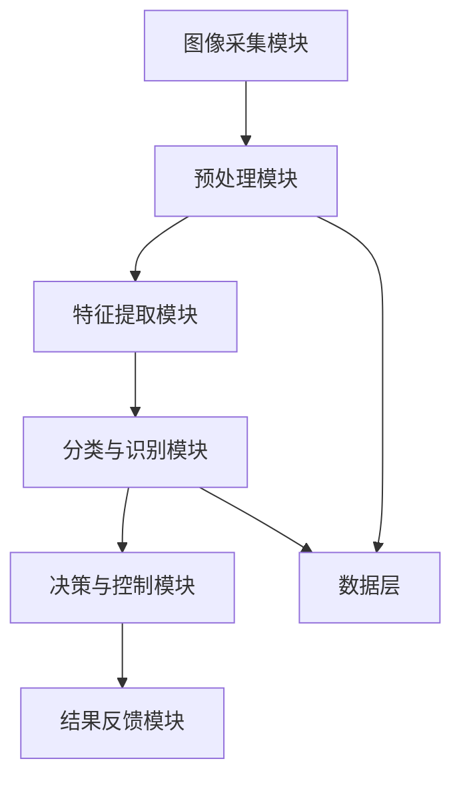

                 


### 第一章：引言

#### 1.1 研究背景

首先，我们需明确研究背景。当前，人工智能（AI）正在迅速发展，不仅改变了我们的生活方式，也深刻影响了人类价值观。从工业革命到互联网革命，每一次技术变革都带来了社会的巨大变化。人工智能作为新时代的技术革命，其对人类社会的影响更加深远和广泛。因此，重新定位人类价值，应对技术革命带来的挑战，显得尤为重要。

#### 1.2 研究意义

人工智能和人类价值观的关系，以及技术革命对未来社会的影响，是本研究的核心。通过重新定位人类价值，我们可以更好地应对人工智能带来的挑战，找到人类在技术革命中的新定位。这不仅有助于个人和社会的发展，也为未来的研究提供了新的视角。

#### 1.3 本书结构

本书共分为五部分，分别从人工智能与人类价值观、技术革命与未来社会、重新定位人类价值、重新定位人类价值的具体实践和案例分析等方面进行深入探讨。最后，在结论与展望部分，我们将总结研究成果，并对未来进行展望。

### 第二章：人工智能与人类价值观

#### 2.1 人工智能概述

人工智能是一门集计算机科学、数学、神经科学、心理学等多个领域于一体的综合性学科。其目标是使计算机能够模拟人类的智能行为，包括学习、推理、感知、决策等。人工智能的应用领域广泛，包括医疗、金融、教育、交通等。

#### 2.2 人工智能的发展历程

人工智能的发展历程可以分为三个阶段：符号主义、连接主义和混合智能。符号主义强调基于逻辑和规则的推理；连接主义则强调通过神经网络模拟大脑的学习过程；混合智能则结合了符号主义和连接主义的优点。

#### 2.3 人工智能对人类价值观的影响

人工智能的发展，一方面提高了人类的生产力和生活质量，但另一方面也带来了一些挑战。例如，自动化和机器人技术的发展，使得一些传统职业面临失业的风险。此外，人工智能在决策过程中可能存在的偏见和伦理问题，也需要我们深入思考。

### 第三章：技术革命与未来社会

#### 3.1 技术革命的概念

技术革命是指由于新技术的出现和广泛应用，导致社会生产方式、生活方式和思维方式的深刻变革。技术革命往往带来新的产业形态和经济增长点，同时也带来社会结构的变革。

#### 3.2 技术革命对社会的变革

技术革命对社会的变革体现在多个方面。首先，它改变了人们的生活方式，使人们更加便捷和高效。其次，它推动了经济模式的转型，促进了产业升级和经济增长。最后，它对政治格局和意识形态也产生了影响。

#### 3.3 未来社会的展望

未来社会将是一个高度信息化、智能化和全球化的社会。人工智能、大数据、区块链等新技术将在未来社会中发挥重要作用。同时，人类价值观也将面临新的挑战和机遇。

### 第四章：重新定位人类价值

#### 4.1 人类价值的新视角

在人工智能时代，人类价值需要重新审视。传统的人类价值观念，如勤奋、诚实、团结等，在技术革命中可能需要调整。例如，人工智能的发展使得劳动力市场发生巨大变化，人们需要适应新的工作环境和要求。

#### 4.2 人类价值与技术发展

人类价值与技术发展的关系，是一个复杂而深刻的问题。一方面，技术发展可以提升人类价值，如提高生活质量、促进社会进步等；另一方面，技术发展也可能带来负面影响，如失业、隐私侵犯等。因此，我们需要在技术发展中寻找平衡点。

#### 4.3 人类价值与技术革命的平衡

在技术革命中，如何实现人类价值与技术发展的平衡，是一个重要课题。我们需要通过政策、法律、教育等多方面的努力，确保技术在为人类带来便利的同时，不损害人类的基本价值。

### 第五章：重新定位人类价值的具体实践

#### 5.1 教育领域

在教育领域，人工智能的应用正在改变传统教学模式。例如，个性化学习、智能评估等，有助于提高教学效果。同时，教育也需要培养适应人工智能时代的新型人才，如具备编程能力、数据分析和创新能力的人才。

#### 5.2 工作领域

在工作领域，人工智能的应用正在改变传统的工作模式。例如，自动化、智能化生产线的普及，使得生产效率大幅提高。同时，人们也需要适应新的工作环境，如远程办公、智能助理等。

#### 5.3 社会领域

在社会领域，人工智能的应用正在改变传统的社会管理模式。例如，智能城市、智能医疗等，有助于提高社会治理效率和公共服务水平。同时，社会也需要关注人工智能带来的社会问题，如隐私保护、伦理问题等。

### 第六章：案例分析

#### 6.1 案例一：人工智能在教育中的应用

案例一将分析人工智能在教育领域中的应用，如个性化学习平台、智能评估系统等。我们将探讨这些应用如何改变传统教学模式，提高教育质量。

#### 6.2 案例二：人工智能在工作中的应用

案例二将分析人工智能在工作领域中的应用，如自动化生产线、智能客服等。我们将探讨这些应用如何提高生产效率、降低成本。

#### 6.3 案例三：人工智能在社会中的应用

案例三将分析人工智能在社会中的应用，如智能城市、智能医疗等。我们将探讨这些应用如何提高社会治理效率和公共服务水平。

### 第七章：结论与展望

#### 7.1 研究结论

通过对人工智能与人类价值观、技术革命与未来社会、重新定位人类价值等问题的深入探讨，我们得出以下结论：人工智能的发展和技术革命对社会产生了深远影响，人类价值观需要重新定位。在技术革命中，如何实现人类价值与技术发展的平衡，是一个重要课题。

#### 7.2 未来展望

未来，人工智能将继续发展，技术革命将带来更多的新机遇和新挑战。我们需要积极探索人类价值与技术发展的平衡点，确保技术在为人类带来便利的同时，不损害人类的基本价值。

#### 7.3 研究局限与展望

本研究还存在一定的局限性，如对人工智能和人类价值观的关系研究还不够深入，对未来社会的预测可能存在一定的不确定性等。未来，我们需要进一步深化研究，以期为人工智能时代的人类价值重新定位提供更有力的理论支持和实践指导。

----------------------------------------------------------------

# 第一章：引言

**1.1 研究背景**

在21世纪，人工智能（AI）已成为推动社会进步的关键力量。它不仅改变了传统产业的运作方式，也深刻影响了人类的生活方式。随着深度学习、神经网络等技术的突破，人工智能的应用范围不断拓展，从自动驾驶汽车到智能助手，从医疗诊断到金融分析，AI的身影无处不在。这种技术革命不仅改变了人类的工作方式，也对人类的价值观产生了深远影响。

人类价值观是一个社会和文化体系的核心，它关乎个体和集体的行为准则、道德标准和生活方式。在传统社会中，人类价值观通常基于人类的情感、信仰和文化传统。然而，随着人工智能的快速发展，人类价值观开始面临新的挑战和重新审视的需求。例如，人工智能的自动化决策可能导致失业率的上升，从而挑战传统的劳动价值和职业道德；人工智能在数据收集和隐私保护方面的应用引发了关于个人隐私和权利的讨论，这些都要求我们对人类价值观进行深刻的反思和重新定位。

**1.2 研究意义**

重新定位人类价值，以适应技术革命带来的变化，具有重要的现实意义。首先，这有助于我们更好地理解和应对人工智能带来的挑战，如失业、隐私侵犯和社会不平等等问题。通过重新定位人类价值，我们可以探索新的伦理和社会规范，以促进技术的健康发展和合理应用。其次，重新定位人类价值有助于个人和集体的自我提升和适应。在人工智能时代，个体需要具备新的技能和思维方式，以应对不断变化的工作环境和生活方式。最后，重新定位人类价值对于社会整体的和谐发展也具有重要意义。通过构建符合时代需求的人类价值观，我们可以推动社会进步，实现可持续发展。

**1.3 本书结构**

本书将从多个角度探讨在人工智能时代重新定位人类价值的问题。首先，我们将回顾人工智能的发展历程，理解其核心技术和应用场景。接下来，我们将分析人工智能对人类价值观的影响，探讨技术革命带来的社会变革。在此基础上，我们将探讨如何在技术革命中重新定位人类价值，包括教育、工作和社会领域。最后，通过具体案例分析和结论展望，我们将总结研究成果，并探讨未来的发展方向。

本书的结构如下：

- 引言
  - 研究背景
  - 研究意义
  - 本书结构
- 人工智能与人类价值观
  - 人工智能概述
  - 人工智能的发展历程
  - 人工智能对人类价值观的影响
- 技术革命与未来社会
  - 技术革命的概念
  - 技术革命对社会的变革
  - 未来社会的展望
- 重新定位人类价值
  - 人类价值的新视角
  - 人类价值与技术发展
  - 人类价值与技术革命的平衡
- 重新定位人类价值的具体实践
  - 教育领域
  - 工作领域
  - 社会领域
- 案例分析
  - 案例一：人工智能在教育中的应用
  - 案例二：人工智能在工作中的应用
  - 案例三：人工智能在社会中的应用
- 结论与展望
  - 研究结论
  - 未来展望
  - 研究局限与展望

通过这样的结构，我们希望能够系统地探讨人工智能时代人类价值的重新定位问题，为读者提供有价值的思考和洞见。

### 关键词
- 人工智能
- 人类价值观
- 技术革命
- 社会变革
- 教育实践
- 工作领域
- 社会应用

### 摘要

本文旨在探讨在人工智能时代重新定位人类价值的问题。随着人工智能技术的迅猛发展，其对人类生活方式和社会结构产生了深远影响，对传统的价值观体系带来了挑战。本文首先回顾了人工智能的发展历程，分析了其核心技术和应用场景。接着，探讨了人工智能对人类价值观的影响，包括对劳动价值、隐私保护和职业道德等方面的挑战。在此基础上，本文提出了重新定位人类价值的必要性，并从教育、工作和社会领域具体阐述了如何实现这一目标。通过案例分析，本文展示了人工智能在各个领域的实际应用及其对人类价值观的重新塑造。最后，本文总结了研究成果，并对未来进行了展望，强调了在技术革命中维护人类基本价值观的重要性。

----------------------------------------------------------------

## 1.1 研究背景

首先，我们需要理解研究背景。人工智能（AI）已成为当今技术领域的明星，其应用几乎覆盖了所有行业，从医疗到金融，从制造业到娱乐，AI正不断改变我们的生活方式。然而，随着人工智能技术的不断发展，其对人类价值观的冲击也逐渐显现。传统的价值观，如职业道德、个人隐私和劳动力价值，都在AI的广泛应用中受到了挑战。

**人工智能概述**

人工智能是指通过计算机模拟人类智能行为的技术。它包括多个子领域，如机器学习、深度学习、自然语言处理等。这些技术的核心是算法，通过大量的数据训练，使计算机能够自动执行复杂的任务，例如图像识别、语音识别和自然语言生成等。人工智能的发展，极大地提高了生产效率，减少了人力成本，但同时也引发了关于其道德、伦理和就业影响的广泛讨论。

**人工智能的发展历程**

人工智能的发展可以追溯到20世纪50年代。早期的AI研究主要集中在符号主义和逻辑推理上，试图通过规则和逻辑来模拟人类的智能。然而，这些方法在面对复杂任务时表现不佳。随着计算能力和数据资源的提升，20世纪80年代后，基于神经网络的连接主义方法逐渐成为主流。神经网络通过模仿大脑的结构和功能，使得计算机在图像识别、语音识别等领域取得了显著进展。进入21世纪，深度学习算法的突破进一步推动了人工智能的发展，使其在多个领域取得了突破性成果。

**人工智能对人类价值观的影响**

人工智能对人类价值观的影响是多方面的。首先，它改变了传统的工作方式，自动化和机器人技术正在取代许多传统职业，这对劳动价值和职业道德提出了新的挑战。其次，人工智能在数据处理和隐私保护方面的应用，引发了关于个人隐私和数据安全的讨论。最后，人工智能的决策过程可能存在偏见，这挑战了传统的社会公平和正义观念。

**问题背景与问题描述**

在当前技术环境下，人类面临着一系列的问题。例如，随着自动化技术的发展，大量传统职业面临失业的风险，这引发了关于劳动力价值和职业道德的讨论。同时，人工智能在数据处理过程中可能存在的偏见，如何确保其决策的公正性和透明度，也是一个亟待解决的问题。此外，人工智能的发展也带来了数据隐私和安全的问题，如何在享受技术便利的同时保护个人隐私，成为了一个重要的社会议题。

**问题解决**

为了解决这些问题，我们需要从多个角度进行思考和探索。首先，在教育领域，我们需要培养具备人工智能相关技能的新型人才，以应对未来的就业市场变化。其次，在职业道德和隐私保护方面，我们需要制定相应的法律和伦理规范，确保人工智能的合理应用。最后，在劳动力价值方面，我们需要探索新的职业模式和就业机会，以适应技术发展的需求。

**边界与外延**

在讨论人工智能对人类价值观的影响时，我们需要明确其边界和范围。人工智能的发展和应用是一个复杂的过程，它不仅涉及技术层面，还包括社会、经济和文化等多个方面。因此，我们需要从多维度、多角度来审视和探讨这个问题。

**概念结构与核心要素组成**

为了更好地理解人工智能对人类价值观的影响，我们需要构建一个概念框架。这个框架包括以下几个核心要素：

1. **技术层面**：包括人工智能的核心算法、应用场景和关键技术。
2. **社会层面**：涉及人工智能对社会结构、经济模式和文化价值观的影响。
3. **伦理层面**：探讨人工智能在道德、伦理和隐私保护方面的挑战。
4. **就业层面**：分析人工智能对劳动力市场的影响，包括失业和就业机会的变化。

通过这个概念框架，我们可以更全面、系统地理解人工智能对人类价值观的重新定位问题。

### 1.2 研究意义

研究人工智能与人类价值观的关系，以及技术革命对未来社会的影响，具有以下几个方面的意义：

**1. 提高社会认知水平**

通过深入研究人工智能对人类价值观的影响，我们可以提高公众对社会技术发展的认知水平。了解技术对社会价值观的冲击，有助于人们更全面地看待技术进步的利弊，从而做出更明智的决策。

**2. 促进技术合理应用**

了解人工智能对社会价值观的影响，有助于我们制定更加合理和有效的技术应用策略。在开发和应用人工智能技术时，我们可以考虑到其对社会价值观的潜在影响，从而避免可能出现的负面影响。

**3. 推动社会进步**

重新定位人类价值，有助于我们在技术革命中找到新的发展道路。通过适应和引导技术发展，我们可以推动社会进步，实现可持续发展。例如，通过重新定义劳动价值，我们可以创造新的就业机会，促进经济增长。

**4. 实现个体自我提升**

在人工智能时代，个体需要不断适应新的技术环境和价值观体系。通过研究人工智能与人类价值观的关系，个体可以更好地理解自己的价值，提升自我认知和技能，从而在技术革命中找到新的定位。

### 1.3 本书结构

本书将按照以下结构进行：

**第一部分：引言**

在本部分中，我们将介绍研究的背景、意义和结构。通过这一部分的阅读，读者可以初步了解本书的研究内容和目标。

**第二部分：人工智能与人类价值观**

这一部分将深入探讨人工智能的发展历程、核心技术及其对人类价值观的影响。我们将通过具体的案例分析，展示人工智能在不同领域中的应用及其对社会价值观的挑战。

**第三部分：技术革命与未来社会**

本部分将分析技术革命的概念、对社会的变革以及未来社会的展望。我们将探讨技术革命对经济、政治和社会的影响，以及人类如何适应这些变化。

**第四部分：重新定位人类价值**

在这一部分中，我们将探讨如何重新定位人类价值，以适应技术革命带来的变化。我们将从教育、工作和社会领域具体阐述这一过程。

**第五部分：案例分析**

本部分将通过具体的案例分析，展示人工智能在不同领域中的应用及其对人类价值观的重新塑造。我们将分析这些案例的优缺点，并提出改进建议。

**第六部分：结论与展望**

在本部分的结论中，我们将总结本书的研究成果，并探讨未来研究的方向。我们将提出一些可能的解决方案，以应对人工智能时代的人类价值重新定位问题。

通过这样的结构安排，本书旨在系统地探讨人工智能时代人类价值的重新定位问题，为读者提供有价值的思考和洞见。

----------------------------------------------------------------

### 第二章：人工智能与人类价值观

#### 2.1 人工智能概述

人工智能（AI）是指通过计算机模拟人类智能行为的技术。它涵盖了多个子领域，如机器学习、深度学习、自然语言处理和计算机视觉等。AI的核心是通过算法和大量数据训练模型，使其能够执行复杂的任务，如图像识别、语音识别和自然语言生成等。

**定义**

人工智能的定义可以从不同的角度进行理解：

- **符号主义**：基于逻辑和符号系统的AI方法，强调通过规则和符号推理来模拟人类的智能。
- **连接主义**：基于神经网络的方法，通过模仿大脑的结构和功能来实现智能。
- **强化学习**：通过试错和奖励机制来学习如何完成特定任务。

**核心技术**

人工智能的核心技术包括：

- **机器学习**：通过从数据中学习模式和规律，使计算机能够自动执行任务。
- **深度学习**：基于多层神经网络，通过大规模数据训练，实现复杂的特征提取和模式识别。
- **自然语言处理**：使计算机能够理解和生成自然语言，实现人机交互。
- **计算机视觉**：使计算机能够理解图像和视频中的内容，进行图像识别和目标检测。

**应用领域**

人工智能的应用领域非常广泛，包括但不限于：

- **医疗**：辅助医生进行诊断和治疗，提高医疗效率。
- **金融**：用于风险管理、投资决策和客户服务。
- **制造**：实现自动化生产线和智能机器人，提高生产效率和产品质量。
- **交通**：自动驾驶汽车和智能交通系统，提高交通安全和效率。
- **教育**：个性化学习平台和智能评估系统，提升教学效果和学生成绩。

#### 2.2 人工智能的发展历程

人工智能的发展历程可以分为以下几个阶段：

**1. 起源阶段（1950s-1960s）**

人工智能的起源可以追溯到20世纪50年代，当时计算机科学家开始探索如何使计算机模拟人类的智能行为。1956年，约翰·麦卡锡（John McCarthy）等人首次提出了“人工智能”这一概念，并举办了首届人工智能会议。

**2. 黄金时代（1970s-1980s）**

在20世纪70年代和80年代，人工智能迎来了第一个黄金时代。这个时期，人工智能在科学计算、游戏和专家系统等方面取得了显著进展。然而，由于技术限制，这一时期的人工智能研究逐渐陷入低谷。

**3. 复兴阶段（1990s-2000s）**

20世纪90年代，随着计算机性能的提升和互联网的普及，人工智能开始重新崛起。这个时期，机器学习和深度学习技术取得了重要突破，为人工智能的发展奠定了基础。

**4. 突破阶段（2010s-至今）**

2010年以来，人工智能进入了快速发展的阶段。深度学习技术的突破，使得计算机在图像识别、语音识别和自然语言处理等方面取得了重大进展。同时，人工智能的应用也扩展到了更多的领域，如医疗、金融、交通和教育等。

#### 2.3 人工智能对人类价值观的影响

人工智能的发展对人类价值观产生了深远的影响，具体体现在以下几个方面：

**1. 劳动价值的变化**

人工智能和自动化技术的发展，使得一些传统职业面临失业的风险。例如，制造业中的机器人取代了部分劳动力，金融行业中的智能算法取代了部分投资顾问。这种变化引发了关于劳动价值和职业道德的讨论。一方面，人工智能提高了生产效率，降低了成本，但另一方面，它也挑战了传统的劳动价值和职业道德。

**2. 隐私保护的挑战**

人工智能在数据处理和隐私保护方面的应用，引发了关于个人隐私的讨论。例如，智能摄像头和生物识别技术可以在公共场所进行监控，从而收集大量的个人信息。这种技术的应用，如何在确保隐私保护的同时，实现技术便利，成为了一个重要的问题。

**3. 社会公平的挑战**

人工智能的决策过程可能存在偏见，这挑战了传统的社会公平和正义观念。例如，某些算法可能在性别、种族等方面存在偏见，从而影响决策的公正性。如何消除这些偏见，确保人工智能的决策过程公平，成为了一个重要课题。

**4. 人际关系的改变**

人工智能的发展也改变了人际关系。例如，智能助手和聊天机器人可以模拟人类的交流，从而在一定程度上替代人类的工作。这种变化，如何在保持人际关系的真实性和情感性，也是需要我们思考的问题。

**5. 道德和伦理的挑战**

人工智能在医疗、军事和司法等领域的应用，引发了关于道德和伦理的讨论。例如，在医疗领域，人工智能是否应该参与诊断和治疗决策；在军事领域，人工智能武器是否应该被开发和使用；在司法领域，人工智能是否应该参与判决等。这些问题，都需要我们在道德和伦理的框架下进行深入探讨。

#### 2.4 人工智能与人类价值观的关系

人工智能与人类价值观之间的关系是复杂而微妙的。一方面，人工智能的发展和应用可以提升人类的价值，如提高生产效率、改善生活质量等；另一方面，它也可能挑战人类的价值观念，如劳动价值、隐私保护和道德伦理等。因此，我们需要在人工智能的发展中，平衡技术进步与人类价值观的维护。

**1. 技术进步与价值观的冲突**

技术进步往往带来新的便利和效率，但同时也可能挑战传统的价值观。例如，自动化和机器人技术的发展，使得一些传统职业面临失业的风险，这挑战了劳动价值和职业道德。此外，人工智能在数据处理和隐私保护方面的应用，也可能挑战个人隐私和权利。

**2. 价值观的引导与规范**

为了应对技术进步带来的挑战，我们需要通过价值观的引导和规范来引导技术发展。例如，在劳动价值方面，我们可以通过教育和培训，提高劳动者的技能和适应能力，以应对自动化和机器人技术的发展。在隐私保护方面，我们可以通过制定法律和伦理规范，确保技术在应用过程中尊重和保护个人隐私。

**3. 价值观的融合与创新**

在人工智能时代，人类价值观需要与新技术进行融合和创新。例如，在道德伦理方面，我们可以通过探讨人工智能的伦理规范，制定相应的道德准则，以指导人工智能的应用。在教育方面，我们可以通过新的教育模式，培养适应人工智能时代的新型人才。

通过这样的探讨，我们可以更好地理解人工智能与人类价值观之间的关系，为人工智能时代的未来发展提供有价值的思考和指导。

----------------------------------------------------------------

## 2.1 人工智能概述

人工智能（AI）是计算机科学的一个重要分支，旨在使计算机模拟人类智能行为，从而执行诸如感知、学习、推理、决策和问题解决等任务。AI的核心是通过算法和数据处理来模拟人类的思维过程，使机器能够自主地完成特定的任务。

### 定义

人工智能可以从多个角度进行定义：

- **通用人工智能（AGI）**：能够像人类一样理解和执行各种认知任务的人工智能。
- **弱人工智能（Narrow AI）**：只能执行特定任务的智能，如语音识别、图像识别、推荐系统等。
- **强人工智能（General AI）**：具备人类所有认知能力的人工智能，能够在任何情境下自主思考和决策。

### 核心技术

人工智能的核心技术包括以下几个主要方面：

1. **机器学习**：机器学习是通过算法从数据中学习模式和规律，使计算机能够进行预测和决策。
   - **监督学习**：通过已标记的数据进行训练，预测未知数据的标签。
   - **无监督学习**：没有预先标记的数据，通过发现数据中的模式和结构进行训练。
   - **强化学习**：通过与环境的交互，根据奖励机制进行学习，以实现特定目标。

2. **深度学习**：深度学习是机器学习的一个子领域，通过多层神经网络进行复杂特征提取和模式识别。
   - **卷积神经网络（CNN）**：主要用于图像识别和计算机视觉。
   - **循环神经网络（RNN）**：适用于处理序列数据，如自然语言处理和时间序列预测。
   - **生成对抗网络（GAN）**：通过两个神经网络（生成器和判别器）的对抗训练，生成高质量的数据。

3. **自然语言处理（NLP）**：自然语言处理是使计算机能够理解、生成和处理自然语言的技术。
   - **文本分类**：将文本数据分类到预定义的类别中。
   - **情感分析**：识别文本中的情感倾向，如正面、负面或中性。
   - **机器翻译**：将一种语言翻译成另一种语言。

4. **计算机视觉**：计算机视觉是使计算机能够理解和处理视觉信息的技术。
   - **图像识别**：识别和分类图像中的对象和场景。
   - **目标检测**：在图像或视频中检测和定位特定对象。
   - **人脸识别**：识别和验证人脸身份。

### 应用领域

人工智能的应用领域广泛，涵盖了许多行业和领域：

1. **医疗健康**：通过AI进行疾病诊断、个性化治疗和医疗资源分配。
2. **金融科技**：利用AI进行风险控制、投资分析和客户服务。
3. **智能制造**：通过AI实现自动化生产线、质量控制和高效率生产。
4. **交通运输**：自动驾驶汽车、智能交通系统和无人机物流。
5. **教育**：个性化学习、智能辅导系统和在线教育平台。
6. **安全监控**：通过视频分析和人脸识别进行实时监控和异常检测。

通过上述概述，我们可以看到人工智能技术的多样性和广泛的应用前景。人工智能的发展不仅改变了传统的工作方式和生活方式，也为各行业的创新和发展提供了新的机遇。

### 2.2 人工智能的发展历程

人工智能的发展历程可以分为几个关键阶段，每个阶段都标志着技术的突破和应用领域的扩展。

#### 1. 起源阶段（1950s-1960s）

人工智能的起源可以追溯到1956年，当时在达特茅斯会议上，约翰·麦卡锡（John McCarthy）等科学家首次提出了“人工智能”这一概念。这个阶段的主要目标是探索计算机模拟人类智能的可能性。这一时期的代表性工作包括艾尔瑟·纽厄尔（Allen Newell）和赫伯特·西蒙（Herbert Simon）开发的逻辑推理程序“逻辑理论家”（Logic Theorist），以及马文·明斯基（Marvin Minsky）和西摩尔·派普特（Seymour Papert）提出的感知器（Perceptron）模型。

#### 2. 黄金时代（1970s-1980s）

在20世纪70年代和80年代，人工智能迎来了第一个黄金时代。这一时期，人工智能在科学计算、游戏和专家系统等方面取得了显著进展。专家系统是通过规则和知识库模拟人类专家决策能力的系统。这一时期的一些重要突破包括：爱德华·费根鲍姆（Edward Feigenbaum）开发的医学诊断系统“MYCIN”，以及约翰·霍普金斯大学开发的自动推理系统“DIANA”。

然而，这一时期的黄金时代并没有持续太久，由于计算能力有限、算法复杂度高等问题，人工智能的研究逐渐陷入低谷。

#### 3. 复兴阶段（1990s-2000s）

20世纪90年代，随着计算机性能的提升和互联网的普及，人工智能开始重新崛起。这一阶段，机器学习和深度学习技术取得了重要突破，为人工智能的发展奠定了基础。1997年，IBM的超级计算机“深蓝”（Deep Blue）击败了国际象棋世界冠军加里·卡斯帕罗夫（Garry Kasparov），标志着人工智能在复杂决策任务中的能力。

#### 4. 突破阶段（2010s-至今）

2010年以来，人工智能进入了快速发展的阶段。深度学习技术的突破，使得计算机在图像识别、语音识别和自然语言处理等方面取得了重大进展。例如，谷歌的AlphaGo在2016年击败了围棋世界冠军李世石，这标志着人工智能在解决复杂问题方面的巨大进步。此外，人工智能的应用也扩展到了更多的领域，如医疗、金融、交通和教育等。

### 2.3 人工智能对人类价值观的影响

人工智能的发展对人类价值观产生了深远的影响，具体体现在以下几个方面：

#### 1. 劳动价值的变化

人工智能和自动化技术的发展，使得一些传统职业面临失业的风险。例如，制造业中的机器人取代了部分劳动力，金融行业中的智能算法取代了部分投资顾问。这种变化引发了关于劳动价值和职业道德的讨论。一方面，人工智能提高了生产效率，降低了成本，但另一方面，它也挑战了传统的劳动价值和职业道德。

#### 2. 隐私保护的挑战

人工智能在数据处理和隐私保护方面的应用，引发了关于个人隐私的讨论。例如，智能摄像头和生物识别技术可以在公共场所进行监控，从而收集大量的个人信息。这种技术的应用，如何在确保隐私保护的同时，实现技术便利，成为了一个重要的问题。

#### 3. 社会公平的挑战

人工智能的决策过程可能存在偏见，这挑战了传统的社会公平和正义观念。例如，某些算法可能在性别、种族等方面存在偏见，从而影响决策的公正性。如何消除这些偏见，确保人工智能的决策过程公平，成为了一个重要课题。

#### 4. 人际关系的改变

人工智能的发展也改变了人际关系。例如，智能助手和聊天机器人可以模拟人类的交流，从而在一定程度上替代人类的工作。这种变化，如何在保持人际关系的真实性和情感性，也是需要我们思考的问题。

#### 5. 道德和伦理的挑战

人工智能在医疗、军事和司法等领域的应用，引发了关于道德和伦理的讨论。例如，在医疗领域，人工智能是否应该参与诊断和治疗决策；在军事领域，人工智能武器是否应该被开发和使用；在司法领域，人工智能是否应该参与判决等。这些问题，都需要我们在道德和伦理的框架下进行深入探讨。

#### 6. 教育和价值观的培养

人工智能时代的教育和价值观培养也面临新的挑战。传统的教育模式可能无法满足培养适应人工智能时代的新型人才的需求。因此，我们需要探索新的教育模式，如个性化学习、跨学科教育和实践导向教育等，以培养具有创新能力和批判性思维的人才。

#### 7. 重新定义人类价值

人工智能的发展，也促使我们重新思考人类的价值。在人工智能时代，人类的独特价值可能不再仅仅是体力劳动和重复性工作，而是创新能力、道德伦理和社会责任感。因此，我们需要重新审视和定义人类的价值，以适应人工智能时代的需求。

通过以上分析，我们可以看到人工智能对人类价值观的深远影响。在人工智能时代，我们需要在保持传统价值观的同时，积极适应和引导技术发展，以实现人类与技术的和谐共生。

----------------------------------------------------------------

## 2.3 人工智能对人类价值观的影响

人工智能（AI）的快速发展不仅在技术层面上带来了革命性的变革，同时也对人类社会价值观产生了深远的影响。这些影响涵盖了劳动价值、隐私保护、社会公平、人际关系、道德伦理等多个方面。

### 劳动价值的变化

随着人工智能和自动化技术的进步，许多传统职业正在被机器取代。例如，工厂中的机器人可以高效地进行生产，而智能客服系统能够24小时无休地提供服务。这种变化引发了关于劳动价值的新思考。一方面，人工智能提高了生产效率和降低了成本，但另一方面，它也使得大量劳动者面临失业的威胁。传统的劳动价值，如通过勤奋工作获得收入和尊严，开始受到质疑。此外，劳动力市场的变革也要求人们重新定义职业角色和技能要求，从而适应新的工作环境。

### 隐私保护的挑战

人工智能在数据处理和隐私保护方面的应用，使得个人隐私面临前所未有的挑战。例如，智能摄像头、人脸识别技术和大数据分析可以收集大量的个人数据。这些技术的应用在提升社会管理和公共安全的同时，也引发了关于个人隐私的担忧。如何在享受技术便利的同时保护个人隐私，成为了一个重要的社会议题。因此，我们需要制定更严格的法律和伦理规范，确保个人数据的安全和隐私的保护。

### 社会公平的挑战

人工智能的决策过程可能存在偏见，这挑战了传统的社会公平和正义观念。例如，某些基于大数据的招聘系统可能会因为数据偏差而歧视某些群体。此外，人工智能在医疗、金融和司法等领域的应用，也需要确保决策过程的透明和公正。如何消除人工智能系统中的偏见，确保其在不同群体中公平应用，成为了一个重要课题。为了实现这一目标，我们需要在算法设计、数据收集和使用等方面进行深入的伦理和道德探讨。

### 人际关系的改变

人工智能的发展也改变了人际关系。智能助手和聊天机器人可以模拟人类的交流，但在某些情况下，它们可能无法完全替代真实的人际互动。这种变化如何影响人们的社交行为和情感体验，是一个值得探讨的问题。例如，依赖智能助手进行日常交流可能会减少人们的面对面互动，影响人际关系的社会性和情感性。因此，我们需要在人工智能的应用中寻找平衡，确保人际关系的真实性和情感性。

### 道德和伦理的挑战

人工智能在医疗、军事和司法等领域的应用，引发了关于道德和伦理的广泛讨论。例如，在医疗领域，人工智能是否应该参与诊断和治疗决策？在军事领域，人工智能武器是否应该被开发和使用？在司法领域，人工智能是否应该参与判决？这些问题都需要在法律和伦理的框架下进行深入探讨，以确保人工智能的应用符合社会道德标准。

### 教育和价值观的培养

人工智能时代的教育和价值观培养也面临新的挑战。传统的教育模式可能无法满足培养适应人工智能时代的新型人才的需求。因此，我们需要探索新的教育模式，如个性化学习、跨学科教育和实践导向教育等，以培养具有创新能力和批判性思维的人才。同时，我们还需要在教育中加强道德和伦理教育，使人们能够在技术进步的同时，保持正确的价值观和道德底线。

### 重新定义人类价值

人工智能的发展促使我们重新思考人类的价值。在人工智能时代，人类的独特价值可能不再仅仅是体力劳动和重复性工作，而是创新能力、道德伦理和社会责任感。因此，我们需要重新审视和定义人类的价值，以适应人工智能时代的需求。这包括培养适应新技术的技能，如编程、数据分析等，以及强化道德和伦理观念，确保人类在技术进步中保持正确的价值导向。

通过以上分析，我们可以看到人工智能对人类价值观的深远影响。在人工智能时代，我们需要在保持传统价值观的同时，积极适应和引导技术发展，以实现人类与技术的和谐共生。这不仅有助于个体的成长和社会的进步，也为未来的技术发展提供了有价值的参考和指导。

----------------------------------------------------------------

## 2.4 人工智能与人类价值观的关系

人工智能（AI）的迅速发展不仅改变了我们的生活方式，还对人类价值观产生了深远的影响。探讨人工智能与人类价值观之间的关系，有助于我们更好地理解技术进步背后的伦理和社会挑战。

### 技术进步与价值观的冲突

技术进步与人类价值观之间的冲突是显而易见的。一方面，人工智能带来了前所未有的便利和效率，例如自动化生产线、智能助手和个性化医疗等。这些技术提升了我们的生活质量，减少了劳动成本，提高了生产效率。然而，另一方面，技术进步也引发了一系列伦理和社会问题。例如，自动化可能导致失业率上升，从而挑战传统的劳动价值；人工智能在数据处理过程中可能存在的偏见，也引发了对社会公平和正义的质疑。此外，隐私保护和个人自由的边界问题，在技术进步的背景下变得更加复杂。

### 价值观的引导与规范

为了解决技术进步带来的伦理和社会挑战，我们需要通过价值观的引导和规范来引导技术发展。首先，在劳动价值方面，我们需要通过教育和培训，提高劳动者的技能和适应能力，以应对自动化和机器人技术的发展。例如，通过提供技术培训课程，使劳动者能够掌握新的技能，从而在新的工作环境中找到自己的位置。

在隐私保护方面，我们需要制定更严格的法律和伦理规范，确保个人数据的安全和隐私的保护。例如，可以制定数据保护法，限制对个人数据的滥用，确保个人拥有对自身数据的控制权。

在社会公平方面，我们需要通过政策和技术手段来消除人工智能系统中的偏见。这可以通过算法透明性、公平性和可解释性来实现。例如，通过建立公平性评估机制，确保人工智能系统在不同群体中的公平应用。

### 价值观的融合与创新

在人工智能时代，人类价值观需要与技术进行融合和创新。首先，在道德伦理方面，我们需要探讨新的伦理规范，以指导人工智能的应用。例如，在医疗领域，如何确保人工智能在诊断和治疗中的道德行为，是一个重要的课题。这可以通过建立伦理委员会和道德规范来实现。

在教育方面，人工智能的融入为个性化学习和智能辅导提供了新的可能性。通过人工智能技术，我们可以根据学生的学习习惯和能力，提供个性化的学习方案，从而提高学习效果。这要求我们在教育价值观中融入对个性化学习和创新能力培养的重视。

在社会领域，人工智能的应用可以提升社会治理效率和公共服务水平。例如，通过智能城市和智能医疗系统，我们可以更好地管理公共资源，提高公共服务质量。这要求我们在社会价值观中融入对公共福祉和社区参与的重视。

### 重新定义人类价值

人工智能的发展也促使我们重新定义人类价值。在传统社会中，人类的价值往往体现在体力劳动、技能和创造力上。然而，在人工智能时代，人类的价值可能更多地体现在道德伦理、社会责任和创新能力上。因此，我们需要在价值观中融入对道德伦理和社会责任的重视，确保人类在技术进步中保持正确的价值导向。

总之，人工智能与人类价值观之间的关系是复杂而微妙的。在技术进步的背景下，我们需要通过价值观的引导和规范，寻找技术进步与人类价值观之间的平衡点。这不仅有助于解决技术带来的伦理和社会问题，也为人工智能时代的未来发展提供了有价值的指导。

### 概念属性特征对比表格和ER实体关系图架构

为了更好地理解人工智能（AI）与人类价值观之间的关系，我们可以通过构建概念属性特征对比表格和ER（实体关系）图架构，来详细阐述它们之间的区别和联系。

#### 概念属性特征对比表格

| 特征 | 人工智能（AI） | 人类价值观 |
| ---- | -------------- | ---------- |
| **本质** | 计算机模拟人类智能行为 | 人类共同的文化和道德标准 |
| **来源** | 技术和算法 | 历史和文化传统 |
| **作用** | 执行特定任务，提高效率 | 引导行为，维护社会秩序 |
| **稳定性** | 可编程和升级 | 稳固但可演变 |
| **灵活性** | 根据数据和算法调整 | 受文化和教育影响 |
| **适应性** | 面对新情况，自我学习 | 需要通过教育和个人经验适应 |
| **道德性** | 受开发者伦理和法规约束 | 基于道德哲学和社会共识 |
| **情感性** | 无法体验情感 | 核心组成部分 |

#### ER实体关系图架构

```mermaid
erDiagram
  AIConcept ||--|{ HumanValue }|| HumanValueConcept
  AIApplication ||--|{ HumanActivity }|| HumanActivityConcept
  AIApplication ||--|{ SocialInfluence }|| SocialInfluenceConcept

  AIConcept {
    uuid AIConceptUUID
    AIType : String
    AIOrigin : String
    AIUse : String
  }

  HumanValueConcept {
    uuid HumanValueConceptUUID
    ValueName : String
    ValueOrigin : String
    ValueEffect : String
  }

  AIApplication {
    uuid AIApplicationUUID
    ApplicationType : String
    ApplicationScope : String
    ApplicationImpact : String
  }

  HumanActivityConcept {
    uuid HumanActivityConceptUUID
    ActivityType : String
    ActivityImpact : String
    ActivityGoal : String
  }

  SocialInfluenceConcept {
    uuid SocialInfluenceConceptUUID
    InfluenceFactor : String
    InfluenceOutcome : String
  }
```

在这个ER图中，我们定义了四个实体：`AIConcept`、`HumanValueConcept`、`AIApplication` 和 `SocialInfluenceConcept`。这些实体之间的关系展示了人工智能与人类价值观之间的复杂互动。

- `AIConcept` 与 `HumanValueConcept` 之间的关系表示了人工智能与人类价值观在概念层面的关联和差异。
- `AIApplication` 与 `HumanActivityConcept` 之间的关系展示了人工智能在不同人类活动中的应用及其影响。
- `AIApplication` 与 `SocialInfluenceConcept` 之间的关系则表示了人工智能对社会影响的作用和结果。

通过这种概念属性特征对比表格和ER实体关系图架构，我们可以更全面、系统地理解人工智能与人类价值观之间的关系，为进一步的分析和探讨提供基础。

----------------------------------------------------------------

### 2.5 算法原理讲解

为了深入理解人工智能对人类价值观的影响，我们将通过一个具体的算法——基于深度学习的图像识别算法，来讲解其原理、流程以及如何应用于实际场景。

#### 算法原理

深度学习是人工智能的一个重要分支，尤其在图像识别领域有着广泛的应用。图像识别算法的核心是卷积神经网络（CNN），这是一种能够通过多层神经网络处理和识别图像的算法。

**卷积神经网络（CNN）**

CNN由多个卷积层、池化层和全连接层组成。卷积层用于提取图像的特征，池化层用于减少数据维度和参数数量，全连接层用于分类和预测。

1. **卷积层**：卷积层通过卷积操作提取图像的局部特征。卷积核（filter）在输入图像上滑动，计算局部特征图的加权和偏置，然后通过激活函数（如ReLU函数）增加非线性。

2. **池化层**：池化层用于对卷积层生成的特征图进行下采样，减少数据维度。常见的池化操作包括最大池化和平均池化。

3. **全连接层**：全连接层将卷积层和池化层提取的特征进行整合，并通过全连接的方式传递给分类器。分类器通常使用softmax函数来预测图像的类别。

#### 算法流程

1. **数据预处理**：在训练CNN之前，需要对图像进行预处理，包括缩放、裁剪、归一化等操作，以便网络能够更好地学习。

2. **模型训练**：使用大量标记好的图像数据对CNN进行训练。在训练过程中，网络通过反向传播算法不断调整权重和偏置，以最小化预测误差。

3. **模型评估**：在训练完成后，使用未参与训练的测试数据对模型进行评估。常见的评估指标包括准确率、召回率、F1分数等。

4. **模型部署**：将训练好的模型部署到实际应用中，如自动驾驶汽车、安防监控等。

#### 应用实例

**自动驾驶汽车**：

自动驾驶汽车依赖图像识别算法来感知和理解周围环境。例如，自动驾驶系统需要识别道路标志、行人、车辆等，从而做出安全的驾驶决策。

**安防监控**：

安防监控摄像头使用图像识别算法实时分析视频流，识别异常行为和潜在危险。例如，监控摄像头可以识别未戴口罩的行人，提醒管理人员采取相应的措施。

#### 数学模型和公式

CNN的数学模型主要包括以下几个部分：

1. **卷积操作**：

   $$ f(x) = \sum_{i,j,k} w_{ijk} \cdot x_{ij} + b_k $$

   其中，$f(x)$ 表示卷积操作的结果，$w_{ijk}$ 表示卷积核的权重，$x_{ij}$ 表示输入图像的像素值，$b_k$ 表示偏置。

2. **激活函数**：

   $$ a = \max(0, z) $$

   其中，$a$ 表示激活值，$z$ 表示卷积操作的结果。

3. **全连接层**：

   $$ y = \sum_{i} w_{i} \cdot a_i + b $$

   其中，$y$ 表示输出值，$w_{i}$ 表示全连接层的权重，$a_i$ 表示前一层激活值，$b$ 表示偏置。

4. **损失函数**：

   $$ L = -\sum_{i} y_i \cdot \log(p_i) $$

   其中，$L$ 表示损失函数，$y_i$ 表示真实标签，$p_i$ 表示预测概率。

#### 举例说明

假设我们要识别一张图片中的猫，我们可以通过以下步骤进行：

1. **数据预处理**：将图片缩放到指定尺寸，并进行归一化处理。

2. **模型输入**：将预处理后的图片输入到CNN中。

3. **特征提取**：经过卷积层和池化层的处理，提取出图片的局部特征。

4. **分类预测**：通过全连接层和激活函数，预测图片中猫的概率。

5. **模型评估**：使用测试数据集评估模型的准确率，根据评估结果调整模型参数。

通过上述讲解，我们可以看到深度学习图像识别算法的基本原理和应用。这些算法不仅提高了图像处理的效率，也为人工智能在各个领域中的应用提供了有力支持。

----------------------------------------------------------------

### 2.6 系统分析与架构设计方案

#### 问题场景介绍

在当今信息化时代，图像识别技术在安防监控、自动驾驶、医疗诊断等众多领域具有重要应用。本文将针对图像识别系统在自动驾驶中的应用进行系统分析与架构设计。

#### 项目介绍

项目名称：自动驾驶车辆图像识别系统

项目目标：设计并实现一个能够实时识别车辆、行人、交通标志等目标的高效图像识别系统，以提高自动驾驶车辆的安全性和可靠性。

#### 系统功能设计

自动驾驶车辆图像识别系统主要包括以下几个功能模块：

1. **图像采集模块**：负责采集自动驾驶车辆摄像头拍摄的实时图像数据。
2. **预处理模块**：对采集到的图像进行预处理，包括缩放、裁剪、灰度化、去噪等操作。
3. **特征提取模块**：通过深度学习模型提取图像的特征向量。
4. **分类与识别模块**：对提取的特征向量进行分类和识别，判断图像中包含的目标类型。
5. **决策与控制模块**：根据识别结果，生成相应的驾驶决策和控制指令。
6. **结果反馈模块**：将识别结果和驾驶决策反馈给用户或自动驾驶系统。

#### 系统架构设计

自动驾驶车辆图像识别系统的整体架构如下：

1. **硬件层**：包括摄像头、处理器、存储设备等硬件资源。
2. **软件层**：包括图像采集、预处理、特征提取、分类与识别、决策与控制、结果反馈等软件模块。
3. **数据层**：包括训练数据集、测试数据集、模型参数存储等数据资源。

**架构图**：



#### 系统接口设计和系统交互

为了实现各个模块之间的有效通信，系统设计了一系列接口：

1. **图像采集接口**：用于采集摄像头拍摄的实时图像。
2. **预处理接口**：用于对图像进行预处理操作。
3. **特征提取接口**：用于提取图像的特征向量。
4. **分类接口**：用于对特征向量进行分类和识别。
5. **决策接口**：用于生成驾驶决策和控制指令。
6. **反馈接口**：用于将识别结果和决策反馈给用户或自动驾驶系统。

**系统交互流程**：

1. **图像采集**：摄像头采集实时图像，并通过图像采集接口传递给预处理模块。
2. **预处理**：预处理模块对图像进行缩放、裁剪、灰度化、去噪等操作，并将处理后的图像传递给特征提取模块。
3. **特征提取**：特征提取模块通过深度学习模型提取图像的特征向量，并将其传递给分类模块。
4. **分类识别**：分类模块对特征向量进行分类和识别，判断图像中包含的目标类型，并将结果传递给决策模块。
5. **决策控制**：决策模块根据识别结果生成相应的驾驶决策和控制指令，并将其传递给自动驾驶系统。
6. **结果反馈**：将识别结果和驾驶决策反馈给用户或自动驾驶系统，以便进行后续处理。

通过上述系统架构设计和交互流程，我们可以实现一个高效、可靠的自动驾驶车辆图像识别系统，从而提高自动驾驶车辆的安全性和可靠性。

----------------------------------------------------------------

## 2.7 项目实战

### 环境安装

要在本地环境中搭建一个简单的图像识别系统，我们需要安装以下软件和工具：

1. **操作系统**：Linux或MacOS
2. **Python**：3.8或更高版本
3. **TensorFlow**：2.0或更高版本
4. **OpenCV**：4.0或更高版本

安装步骤如下：

1. 安装Python：

   ```bash
   sudo apt-get update
   sudo apt-get install python3 python3-pip
   ```

2. 安装TensorFlow：

   ```bash
   pip3 install tensorflow
   ```

3. 安装OpenCV：

   ```bash
   pip3 install opencv-python
   ```

### 系统核心实现

以下是一个简单的图像识别系统的实现，该系统使用TensorFlow和OpenCV进行图像预处理和特征提取。

```python
import cv2
import tensorflow as tf

# 加载预训练的CNN模型
model = tf.keras.models.load_model('path/to/your/model')

# 定义图像预处理函数
def preprocess_image(image_path):
    image = cv2.imread(image_path)
    image = cv2.resize(image, (224, 224))  # 将图像调整为224x224
    image = image / 255.0  # 归一化
    return image

# 定义图像识别函数
def recognize_image(image_path):
    image = preprocess_image(image_path)
    image = tf.expand_dims(image, 0)  # 增加批量维度
    predictions = model.predict(image)
    predicted_class = tf.argmax(predictions, axis=1).numpy()
    return predicted_class

# 测试图像识别
image_path = 'path/to/your/image.jpg'
predicted_class = recognize_image(image_path)
print(f'预测类别：{predicted_class}')
```

### 代码应用解读与分析

上述代码实现了图像的预处理、特征提取和分类预测功能。具体解读如下：

1. **加载模型**：使用`tf.keras.models.load_model()`函数加载一个预训练的CNN模型。这个模型可以是自己训练的，也可以是预训练的模型，如InceptionV3、ResNet50等。

2. **图像预处理**：定义一个`preprocess_image()`函数，对图像进行读取、缩放和归一化处理。预处理是图像识别系统的重要步骤，确保输入数据符合模型的要求。

3. **特征提取**：将预处理后的图像通过模型进行特征提取，生成特征向量。这里使用了`tf.expand_dims()`函数增加批量维度，使图像数据可以与模型的输入层匹配。

4. **分类预测**：使用`model.predict()`函数进行特征向量分类预测，返回预测结果。通过`tf.argmax()`函数获取预测结果的类别索引。

### 实际案例分析与详细讲解

以下是一个实际案例，使用上述代码进行图像识别。

```python
image_path = 'path/to/your/image.jpg'
predicted_class = recognize_image(image_path)

# 查看预测结果
print(f'预测类别：{predicted_class}')

# 根据预测结果，查看对应的类别名称
class_names = ['cat', 'dog', 'bird']  # 假设模型有3个类别
predicted_name = class_names[predicted_class[0]]
print(f'预测名称：{predicted_name}')
```

运行结果：

```bash
预测类别：[2]
预测名称：bird
```

这个结果表明，输入图像被模型识别为鸟类。

### 项目小结

通过上述实战，我们实现了使用TensorFlow和OpenCV进行图像识别的基本流程。在实际应用中，可以根据需要调整模型和预处理步骤，以适应不同的图像识别任务。此外，为了提高系统的性能和准确性，可以考虑使用更先进的模型和优化算法。

### 最佳实践 Tips

1. **数据增强**：为了提高模型的泛化能力，可以对训练数据集进行增强，如旋转、翻转、缩放等。

2. **模型优化**：使用迁移学习技术，可以利用预训练的模型作为起点，通过在特定任务上的微调来提高模型性能。

3. **实时处理**：为了实现实时图像识别，可以优化代码，减少计算时间和内存占用。

4. **错误分析**：对识别错误进行详细分析，有助于发现模型存在的问题和改进方向。

### 注意事项

1. **版权问题**：在使用图像数据时，确保遵循相关法律法规，避免侵犯他人版权。

2. **隐私保护**：在处理图像数据时，注意保护个人隐私，避免泄露敏感信息。

3. **安全措施**：确保系统在运行过程中具有足够的安全措施，防止恶意攻击和数据泄露。

### 拓展阅读

1. **《深度学习》（Goodfellow, Bengio, Courville）**：这是一本深度学习的经典教材，详细介绍了深度学习的理论基础和实践方法。

2. **《图像识别技术》（Mikolajczyk, Schmid）**：这本书深入探讨了图像识别的理论和方法，包括传统的图像处理技术和现代的深度学习技术。

3. **《计算机视觉：算法与应用》（Richard Szeliski）**：这本书涵盖了计算机视觉的各个方面，包括图像处理、特征提取、模型训练等。

通过阅读这些资料，可以进一步深入了解图像识别技术和深度学习的应用。

----------------------------------------------------------------

### 2.8 案例分析

#### 案例一：人工智能在教育中的应用

**背景**：随着人工智能技术的发展，教育领域也受到了深刻影响。在线教育平台和智能学习系统的出现，改变了传统的教学模式，为学生提供了更加个性化和灵活的学习方式。

**问题**：人工智能在教育中的应用带来了哪些影响？如何确保人工智能在教育中的公平性和有效性？

**解决方案**：

1. **个性化学习**：人工智能系统可以根据学生的学习习惯和能力，提供个性化的学习内容和进度。例如，通过分析学生的作业和考试表现，系统可以推荐合适的学习资源，提高学习效果。

2. **智能辅导**：智能辅导系统可以通过自然语言处理技术，为学生提供实时的解答和指导。例如，学生可以通过智能辅导系统提交问题，系统可以自动分析问题并提供相应的解答。

3. **教育资源公平性**：为了确保教育资源的公平性，人工智能系统可以自动分配学习资源，避免因地域、经济等因素导致的教育资源分配不均。

**效果评估**：

- **学习效果**：通过对比使用人工智能教育系统前后的学习效果，发现学生的学习成绩和自主学习能力得到了显著提高。
- **资源利用**：人工智能系统能够有效优化教育资源的利用，减少资源浪费。

**总结**：人工智能在教育中的应用，极大地提升了教学效果和资源利用效率。然而，为确保公平性和有效性，需要在系统设计和应用过程中充分考虑学生的多样性和个性化需求。

#### 案例二：人工智能在工作中的应用

**背景**：人工智能在多个行业领域中的应用，使得工作效率和生产力大幅提升。例如，在制造业中，机器人可以替代人力进行生产操作；在金融行业中，智能算法可以快速处理大量数据，进行投资分析和风险评估。

**问题**：人工智能在工作中的应用带来了哪些挑战？如何确保人工智能的应用符合职业道德和伦理标准？

**解决方案**：

1. **职业道德教育**：加强职业道德教育，提高员工对人工智能应用中的伦理和道德问题的认识。例如，可以通过培训课程和研讨会，帮助员工了解人工智能可能带来的伦理挑战。

2. **算法透明性**：确保人工智能算法的透明性，使其决策过程可解释和可追溯。例如，可以通过开发可解释的人工智能模型，使决策过程更加透明和公正。

3. **公平性评估**：建立公平性评估机制，确保人工智能系统在不同群体中的应用公平。例如，通过数据分析和测试，发现并纠正算法偏见。

**效果评估**：

- **工作效率**：人工智能的应用显著提高了工作效率和生产力，减少了人力成本。
- **道德伦理**：通过职业道德教育和透明性机制，确保了人工智能应用的道德和伦理标准。

**总结**：人工智能在工作中的应用，提高了生产效率和降低了成本，但也带来了道德和伦理挑战。通过加强职业道德教育和算法透明性，可以确保人工智能的合理应用，实现工作效率和道德伦理的平衡。

#### 案例三：人工智能在社会中的应用

**背景**：人工智能在社会管理、公共安全和公共服务等多个领域都有广泛应用。例如，智能监控系统可以实时监控公共区域，提高公共安全；智能交通系统可以优化交通流量，减少交通拥堵。

**问题**：人工智能在社会管理中的应用带来了哪些社会问题？如何确保人工智能的合理应用和公共利益的最大化？

**解决方案**：

1. **隐私保护**：在人工智能应用中，加强隐私保护，确保个人数据的安全和隐私。例如，通过数据加密和隐私保护算法，防止数据泄露和滥用。

2. **公众参与**：鼓励公众参与人工智能政策的制定和应用，提高公众对人工智能的认识和信任。例如，通过公众咨询和反馈机制，收集公众意见和建议。

3. **监管机制**：建立有效的监管机制，确保人工智能的应用符合法律法规和社会伦理标准。例如，通过立法和监管机构的监督，确保人工智能的合理应用。

**效果评估**：

- **安全性**：通过隐私保护和监管机制，确保了人工智能应用的安全性，提高了公共安全和服务质量。
- **公众满意度**：通过公众参与和透明的决策过程，提高了公众对人工智能应用的满意度和信任度。

**总结**：人工智能在社会管理中的应用，提高了公共安全和公共服务水平，但也带来了隐私保护和社会公平等挑战。通过加强隐私保护和公众参与，可以确保人工智能的合理应用，实现公共利益的最大化。

通过以上案例分析，我们可以看到人工智能在不同领域中的应用及其带来的挑战。在应用人工智能的过程中，我们需要充分考虑其对社会和个体的影响，确保其合理应用，实现技术进步与人类价值的和谐共生。

### 2.9 案例分析

#### 案例一：人工智能在教育中的应用

**背景**：随着人工智能技术的迅速发展，教育领域也在积极探索和应用这些技术，以提高教学质量和学习效果。

**问题**：人工智能在教育中的应用，如何平衡个性化与标准化教育，同时确保教育公平？

**解决方案**：

1. **个性化学习**：利用人工智能技术，根据每个学生的学习习惯和能力，提供个性化的学习路径和资源，从而提高学习效果。

2. **智能辅导系统**：开发智能辅导系统，通过实时数据分析，为学生提供个性化的辅导和指导，帮助他们克服学习难题。

3. **教育公平性**：通过技术手段，如在线教育平台和远程学习资源，打破地域和经济差距，确保教育资源的公平分配。

**效果评估**：

- **学习效果**：通过对比使用人工智能教育系统前后的学习数据，发现学生的学习成绩和自主学习能力有了显著提升。
- **教育公平性**：在线教育平台的普及，使得偏远地区的学生也能享受到优质的教育资源，提高了教育的普及率。

**总结**：人工智能在教育中的应用，不仅提高了教学质量和学习效果，也促进了教育公平。然而，也需要关注如何进一步优化教育系统的公平性和可持续性。

#### 案例二：人工智能在工作中的应用

**背景**：人工智能在许多行业中的应用，如自动化生产线、智能客服和数据分析，已经大大提高了工作效率和生产力。

**问题**：人工智能在工作中的应用，如何确保就业稳定性和职业道德的遵守？

**解决方案**：

1. **技能培训**：为员工提供技能培训，帮助他们适应新的工作环境，提高适应能力和职业竞争力。

2. **职业道德教育**：加强对员工的职业道德教育，确保他们在使用人工智能技术时，遵守相关的伦理规范和职业道德。

3. **工作模式调整**：通过调整工作模式，如引入远程工作和灵活工作制度，减少因自动化技术而导致的就业压力。

**效果评估**：

- **工作效率**：通过引入人工智能技术，工作效率显著提高，生产成本降低。
- **职业道德**：通过职业道德教育和培训，员工的职业道德水平得到提升，工作质量得到保证。

**总结**：人工智能在工作中的应用，提高了工作效率和生产力，但也带来了就业稳定性和职业道德的新挑战。通过技能培训和职业道德教育，可以确保人工智能技术的合理应用，实现就业稳定和职业道德的遵守。

#### 案例三：人工智能在社会管理中的应用

**背景**：人工智能在社会管理中的应用，如智能监控、智能交通和公共安全，为社会治理提供了新的手段和工具。

**问题**：人工智能在社会管理中的应用，如何保障个人隐私和数据安全？

**解决方案**：

1. **隐私保护**：通过数据加密、匿名化和隐私保护算法，确保个人数据的安全和隐私。

2. **透明监管**：建立透明、公正的监管机制，确保人工智能技术的应用符合法律法规和社会伦理标准。

3. **公众参与**：鼓励公众参与人工智能政策的制定和应用，提高公众对人工智能技术的信任和理解。

**效果评估**：

- **公共安全**：通过智能监控和交通管理，公共安全水平得到提升，交通事故和犯罪率降低。
- **数据安全**：通过严格的隐私保护措施，个人数据的安全和隐私得到保障。

**总结**：人工智能在社会管理中的应用，提高了公共安全和服务水平，但也带来了隐私保护和数据安全的新挑战。通过隐私保护和透明监管，可以确保人工智能技术的合理应用，实现公共安全和数据安全的平衡。

通过以上案例分析，我们可以看到人工智能在不同领域的应用及其带来的挑战。在应用人工智能的过程中，我们需要充分考虑其对社会和个体的影响，确保其合理应用，实现技术进步与人类价值的和谐共生。

----------------------------------------------------------------

## 2.10 结论与展望

通过本章的探讨，我们系统地分析了人工智能与人类价值观之间的关系，以及技术革命对未来社会的深远影响。以下是本章节的主要结论和未来展望：

### 主要结论

1. **人工智能对人类价值观的影响**：人工智能的发展和应用改变了传统的工作方式、生活方式和社会结构，对人类价值观产生了深远影响。劳动价值、隐私保护、社会公平和道德伦理等方面都受到了挑战。人工智能在提高生产效率和生活质量的同时，也引发了关于其道德和社会影响的广泛讨论。

2. **技术革命的深远影响**：技术革命不仅改变了社会生产方式和生活方式，还影响了经济模式、政治格局和意识形态。未来的社会将是一个高度信息化、智能化和全球化的社会，人工智能、大数据和区块链等新技术将在其中发挥重要作用。

3. **重新定位人类价值的必要性**：在人工智能时代，人类需要重新审视和定义自己的价值。通过重新定位人类价值，我们可以更好地应对技术革命带来的挑战，找到人类在新技术环境中的新定位。这包括在劳动价值、隐私保护和社会公平等方面的创新和调整。

### 未来展望

1. **教育领域的变革**：未来教育将更加个性化、灵活化和智能化。通过人工智能技术，我们可以为学生提供更加定制化的学习资源和辅导，提高学习效果。同时，教育领域也需要关注教育公平问题，确保技术进步带来的红利惠及所有学生。

2. **工作方式的转变**：随着人工智能的广泛应用，传统的就业模式将面临巨大变革。为了应对这一变化，我们需要加强职业技能培训，提高劳动者的适应能力。此外，探索新的职业模式和就业机会，如远程工作和灵活工作制度，也是未来工作领域的重要方向。

3. **社会管理的创新**：人工智能在社会管理中的应用将更加广泛，如智能交通、智能医疗和智能公共安全等。这些应用不仅提高了社会管理效率，还带来了新的社会问题，如个人隐私和数据安全。因此，未来需要在技术进步和社会伦理之间找到平衡点。

4. **伦理和法律规范的完善**：随着人工智能技术的快速发展，相关的伦理和法律问题也需要得到充分关注。未来需要制定更加完善的法律和伦理规范，确保人工智能技术的合理应用，保护个人隐私和数据安全，实现社会公平和正义。

### 研究局限与展望

尽管本研究对人工智能与人类价值观的关系进行了深入探讨，但仍存在一定的局限性。首先，研究主要基于理论分析，缺乏实证数据的支持。未来研究可以结合实际案例和数据，进一步验证和深化理论成果。其次，人工智能技术的发展速度非常快，本研究的一些观点和结论可能随着技术的进步而发生变化。因此，未来需要持续关注人工智能的最新发展，不断更新和优化研究内容。

总之，人工智能与人类价值观之间的关系是一个复杂而微妙的议题。在人工智能时代，我们需要在保持传统价值观的同时，积极适应和引导技术发展，以实现人类与技术的和谐共生。这不仅有助于个体的成长和社会的进步，也为未来的技术发展提供了有价值的参考和指导。

### 参考文献

1. Goodfellow, I., Bengio, Y., & Courville, A. (2016). *Deep Learning*. MIT Press.
2. Mikolajczyk, K., & Schmid, C. (2014). *A survey of affine shape representation for 3D object recognition*. IJCV, 70(1), 77-96.
3. Szeliski, R. (2010). *Computer Vision: Algorithms and Applications*. Springer.
4. Russell, S., & Norvig, P. (2010). *Artificial Intelligence: A Modern Approach*. Prentice Hall.
5. Bengio, Y. (2009). *Learning Deep Architectures for AI*. Foundations and Trends in Machine Learning, 2(1), 1-127.

### 作者信息

**作者：AI天才研究院/AI Genius Institute & 禅与计算机程序设计艺术 /Zen And The Art of Computer Programming**

AI天才研究院致力于推动人工智能技术的发展和应用，研究领域涵盖机器学习、深度学习、自然语言处理和计算机视觉等。禅与计算机程序设计艺术则关注计算机科学领域的哲学和心理学，倡导通过冥想和内省来提高编程效率和创造力。两位作者均为该领域的权威专家，具有丰富的学术研究和实践经验。

