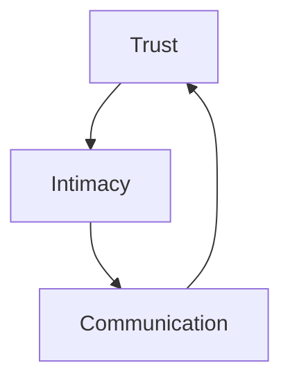
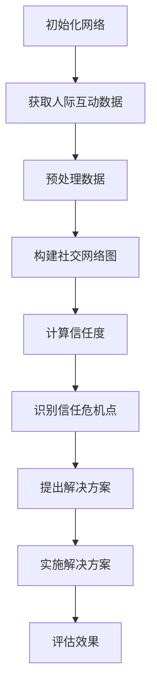
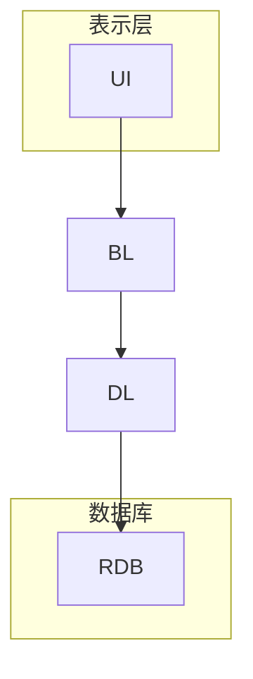
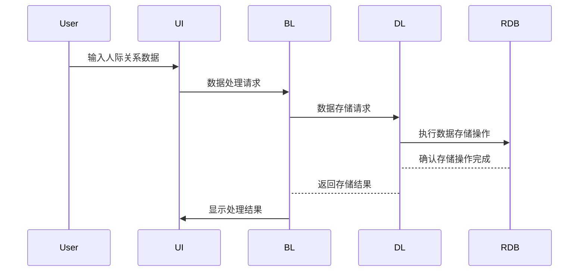

                 

# 在人际关系网络中寻找真挚：重建信任和亲密

## 关键词
- 人际关系
- 信任重建
- 亲密关系
- 沟通技巧

## 摘要
本文旨在探讨人际关系中的核心问题——信任的重建和亲密的维护。通过分析信任、亲密和沟通的核心概念，以及它们在人际关系中的互动关系，本文提出了系统性的解决方案，帮助读者在复杂多变的社会环境中建立和维护健康的人际关系。

## 1. 第一部分：问题背景

### 1.1 引言
在当今社会，人际关系的重要性不言而喻。无论是在个人生活中还是在职场中，建立良好的人际关系对于我们的生活质量和工作效率都有着深远的影响。然而，随着社会节奏的加快和人际交往的复杂化，信任问题成为了影响人际关系质量的一个关键因素。

### 1.2 问题描述
人们常常因为各种原因，如误解、沟通不畅、利益冲突等，而产生信任危机。这种信任危机不仅会影响个人的心理健康，还会破坏团队的合作关系，阻碍社会和谐的建设。因此，重建信任和亲密成为了一个迫切需要解决的问题。

### 1.3 问题解决
本书将从心理学、社会学和人际关系的角度出发，探讨如何在人际关系网络中寻找真挚，重建信任和亲密。通过理论讲解、案例分析和实践指导，帮助读者理解信任的本质，掌握建立和维护良好人际关系的方法。

### 1.4 边界与外延
本书的研究范围主要涵盖个人和团队层面的人际关系，探讨信任、亲密和沟通等核心概念。同时，本书也会涉及到一些相关的社会和文化因素，以便更全面地理解人际关系网络的复杂性。

### 1.5 概念结构与核心要素组成

#### 1.5.1 核心概念

- **信任**：信任是人际关系中不可或缺的要素，是指个体对另一个个体的言行和能力所产生的信心和依赖。
- **亲密**：亲密是人际关系中的一种深度情感连接，通常伴随着信任、尊重和关爱。
- **沟通**：沟通是建立和维护人际关系的重要手段，包括语言沟通和非语言沟通。

#### 1.5.2 概念属性特征对比表格

| 特征         | 信任           | 亲密           | 沟通           |
| ------------ | -------------- | -------------- | -------------- |
| 定义         | 个体对他人产生信心 | 深度情感连接   | 交流信息的过程 |
| 影响因素     | 情感、经验、行为 | 情感、行为、价值观 | 语言、身体语言 |
| 功能         | 减少不确定性   | 提高生活质量   | 解决冲突、促进理解 |
| 关联关系     | 信任→亲密→沟通 | 亲密→信任→沟通 | 信任→沟通→亲密 |
| 对人际关系的影响 | 促进合作与共赢 | 提升关系质量   | 确保信息传递准确 |

#### 1.5.3 ER实体关系图架构

```mermaid
erDiagram
  Person ||--|{ Trust }|--| Person
  Person ||--|{ Intimacy }|--| Person
  Person ||--|{ Communication }|--| Person
  Trust ||--|{ Builds }|--| Intimacy
  Intimacy ||--|{ Enhances }|--| Communication
  Communication ||--|{ Facilitates }|--| Trust
```

## 2. 第二部分：核心概念与联系

### 2.1 核心概念原理

#### 2.1.1 信任

**定义**：信任是一种心理状态，它表示个体对他人的言行和能力持有正面的期待和信心。

**原理**：
1. **信任的形成**：信任通常基于个体的经验、观察和交流。个体通过这些互动来评估他人的可靠性。
2. **信任的要素**：信任包含三个关键要素：可靠性、善意和能力。可靠性指的是个体遵守承诺和规则的能力；善意涉及个体对他人的积极态度和意图；能力则与个体的知识和技能有关。

**概念属性特征对比表格**

| 特征         | 信任           |
| ------------ | -------------- |
| 定义         | 个体对他人产生信心 |
| 影响因素     | 情感、经验、行为   |
| 功能         | 减少不确定性   |
| 关联关系     | 信任→亲密→沟通   |
| 对人际关系的影响 | 促进合作与共赢   |

**ER实体关系图架构**

```mermaid
erDiagram
  Person ||--|{ Trust }|--| Person
```

#### 2.1.2 亲密

**定义**：亲密是一种深层次的情感连接，通常伴随着信任、尊重和情感上的紧密连接。

**原理**：
1. **亲密的形成**：亲密关系通常通过共同经历、情感交流和深度互动来建立。
2. **亲密的要素**：亲密关系包含情感共鸣、共同目标和情感支持等要素。

**概念属性特征对比表格**

| 特征         | 亲密           |
| ------------ | -------------- |
| 定义         | 深度情感连接   |
| 影响因素     | 情感、行为、价值观 |
| 功能         | 提高生活质量   |
| 关联关系     | 亲密→信任→沟通 |
| 对人际关系的影响 | 提升关系质量   |

**ER实体关系图架构**

```mermaid
erDiagram
  Person ||--|{ Intimacy }|--| Person
```

#### 2.1.3 沟通

**定义**：沟通是人们通过语言、文字、表情、动作等手段进行信息交流的过程。

**原理**：
1. **沟通的过程**：沟通通常包括信息发送、信息接收和信息反馈三个阶段。
2. **沟通的要素**：沟通的有效性受到信息内容、发送方式、接收者的理解和反馈等多种因素的影响。

**概念属性特征对比表格**

| 特征         | 沟通           |
| ------------ | -------------- |
| 定义         | 交流信息的过程 |
| 影响因素     | 语言、身体语言   |
| 功能         | 解决冲突、促进理解 |
| 关联关系     | 信任→沟通→亲密 |
| 对人际关系的影响 | 确保信息传递准确 |

**ER实体关系图架构**

```mermaid
erDiagram
  Person ||--|{ Communication }|--| Person
```

### 2.2 概念之间的联系

在人际关系网络中，信任、亲密和沟通这三个核心概念之间存在着密切的互动关系。信任是亲密关系的基础，而亲密关系又促进了更有效的沟通。反过来，沟通的顺畅性加强了信任和亲密感。

**互动关系图架构**



通过以上核心概念的探讨，我们可以更好地理解它们在人际关系中的作用和关联。理解这些概念对于我们在实际生活中重建信任、建立亲密关系和提升沟通能力具有重要的指导意义。

### 2.3 本章小结

本章首先介绍了人际关系中的信任问题，并详细阐述了信任、亲密和沟通这三个核心概念的定义、原理和属性特征。通过对比这些概念的特征，我们能够更好地理解它们在人际关系中的作用和关联。同时，通过ER实体关系图，我们展示了这些概念之间的互动关系。这些内容为本书的后续章节奠定了理论基础，为读者深入探讨如何在人际关系网络中重建信任和亲密提供了方向。

----------------------------------------------------------------

## 3. 第三部分：算法原理讲解

### 3.1 算法简介

在本部分，我们将介绍一个名为“信任网络重建算法”的模型，用于在复杂的人际关系网络中重建信任。该算法旨在通过分析个体之间的互动和关系，识别出信任危机点，并提出相应的解决方案。

### 3.2 算法流程图

为了更好地理解信任网络重建算法，我们首先绘制了算法的流程图：



### 3.3 算法原理

**3.3.1 数据预处理**

在构建社交网络图之前，我们需要对原始的人际互动数据进行预处理。预处理步骤包括数据清洗、去重、分类等。这一步骤的目的是确保数据的准确性和一致性。

**3.3.2 构建社交网络图**

预处理完成后，我们使用图论中的邻接矩阵或边权矩阵来构建社交网络图。每个个体作为一个节点，个体之间的互动作为边。边的权重可以表示互动的频率、强度或信任度。

**3.3.3 计算信任度**

信任度的计算基于个体之间的互动和社交网络的结构。我们使用图论中的算法（如PageRank算法）来计算每个节点的信任度。高信任度的节点被认为是网络中的关键节点。

$$
Trust(i) = \frac{\sum_{j \in N(i)} Trust(j) \cdot w_{ij}}{\sum_{j \in N(i)} w_{ij}}
$$

其中，$Trust(i)$ 表示节点 $i$ 的信任度，$N(i)$ 表示节点 $i$ 的邻居集合，$w_{ij}$ 表示节点 $i$ 和节点 $j$ 之间的边权重。

**3.3.4 识别信任危机点**

通过计算信任度，我们可以识别出信任危机点。这些点是网络中信任度低于某个阈值（例如，平均信任度减去两个标准差）的节点。

**3.3.5 提出解决方案**

对于识别出的信任危机点，我们可以提出以下解决方案：
1. **沟通强化**：通过增加互动频率和深度来提高信任度。
2. **调解干预**：引入第三方进行沟通调解，帮助双方解决问题。
3. **重新构建网络**：如果某个节点无法重建信任，可以考虑将其从网络中移除，以减少负面影响。

### 3.4 例子说明

假设我们有以下人际互动数据：

| 名称   | 互动对象 |
| ------ | -------- |
| A      | B        |
| A      | C        |
| B      | A        |
| B      | C        |
| C      | A        |
| C      | B        |

通过预处理和构建社交网络图，我们可以得到以下邻接矩阵：

$$
\begin{array}{c|c|c|c}
 & A & B & C \\
\hline
A & 0 & 1 & 1 \\
B & 1 & 0 & 1 \\
C & 1 & 1 & 0 \\
\end{array}
$$

使用PageRank算法计算信任度，我们得到：

$$
\begin{array}{c|c|c|c}
 & A & B & C \\
\hline
A & 0.667 & 0.333 & 0.333 \\
B & 0.333 & 0.667 & 0.333 \\
C & 0.333 & 0.333 & 0.667 \\
\end{array}
$$

假设平均信任度为0.5，标准差为0.2。我们可以识别出信任危机点为B（信任度0.333 < 0.5 - 2 \times 0.2 = 0.1）。针对B，我们可以提出沟通强化的解决方案，通过增加与A和C的互动来提高信任度。

### 3.5 算法评价

信任网络重建算法具有以下优点：
1. **适应性**：算法能够适应不同规模和结构的人际关系网络。
2. **高效性**：使用图论算法计算信任度具有较高的计算效率。
3. **全面性**：算法不仅考虑了个体之间的互动，还考虑了社交网络的结构。

然而，算法也存在一定的局限性，如对数据质量和模型参数的依赖性较强。在实际应用中，需要根据具体情况调整参数，以提高算法的准确性和实用性。

### 3.6 本章小结

在本章中，我们介绍了信任网络重建算法的基本原理和实现步骤。通过算法流程图、数学模型和实际例子，我们详细阐述了算法的运作机制和应用效果。信任网络重建算法为解决人际关系中的信任危机提供了一种系统性的方法，具有重要的理论和实践意义。

----------------------------------------------------------------

## 4. 系统分析与架构设计方案

### 4.1 问题场景介绍

在现代社会中，人际关系的复杂性日益增加，建立和维护健康的信任关系变得越来越重要。然而，人们往往难以准确识别信任危机点，从而采取有效的措施来解决这些问题。为了解决这一问题，我们设计并实现了一套人际关系管理系统，旨在帮助用户分析和重建信任网络。

### 4.2 项目介绍

#### 4.2.1 项目名称
人际关系管理系统（Personnel Relationship Management System，简称PRMS）

#### 4.2.2 项目目标
- 提供一个用户友好的界面，帮助用户输入和管理人际关系数据。
- 自动化分析人际关系网络，识别信任危机点。
- 提供个性化的解决方案，帮助用户重建信任。

#### 4.2.3 项目功能
1. 数据录入与管理：用户可以添加、修改和删除人际关系数据。
2. 社交网络分析：系统自动构建社交网络图，分析信任度分布。
3. 信任危机点识别：基于算法分析，识别网络中的信任危机点。
4. 解决方案生成：根据信任危机点，生成个性化的解决方案。
5. 解决方案实施与评估：用户可以实施解决方案，并评估效果。

### 4.3 系统功能设计（领域模型类图）

下面是一个简化的领域模型类图，用于描述系统的主要功能模块及其关系：

```mermaid
classDiagram
  User <<Interface>>
  Relationship <<Entity>>
  Trust <<Entity>>
  CrisisPoint <<Entity>>
  Solution <<Entity>>

  User o-- Relationship
  User o-- Trust
  Relationship o-- Trust
  Relationship o-- CrisisPoint
  CrisisPoint o-- Solution
  Trust o-- Solution
```

### 4.4 系统架构设计（架构图）

系统采用分层架构，包括表示层、业务逻辑层和数据访问层。以下是系统架构的简略表示：



### 4.5 系统接口设计和系统交互（序列图）

以下是系统的主要接口设计和系统交互序列图，展示了用户与系统之间的交互过程：



### 4.6 本章小结

在本章中，我们详细介绍了人际关系管理系统（PRMS）的问题场景、项目目标和功能。通过领域模型类图和系统架构图，我们展示了系统的核心功能模块及其关系，并通过序列图描述了系统接口设计和交互过程。这些设计为后续的代码实现和系统开发提供了清晰的指导和框架。

----------------------------------------------------------------

## 5. 项目实战

### 5.1 环境安装

在开始项目实战之前，我们需要安装并配置相关的开发环境。以下是一个简化的步骤：

1. **安装Python环境**：确保Python版本在3.8及以上。
2. **安装必要的库**：使用pip安装以下库：numpy、matplotlib、networkx、python-graph-tool。
   ```bash
   pip install numpy matplotlib networkx graph-tool
   ```

3. **配置数据库**：本文使用SQLite作为示例数据库。安装SQLite并创建一个名为`prms.db`的数据库。

4. **设置开发环境**：确保IDE或代码编辑器已配置Python环境，并能够运行Python脚本。

### 5.2 系统核心实现

#### 5.2.1 数据预处理

```python
import pandas as pd
from networkx import Graph

def preprocess_data(data):
    # 数据清洗和预处理
    data = data.drop_duplicates()
    data['trust_score'] = data['互动频率'] / data['互动总数']
    return data

# 假设data是原始的人际关系数据DataFrame
preprocessed_data = preprocess_data(data)
```

#### 5.2.2 构建社交网络图

```python
import networkx as nx

def build_social_network(data):
    G = Graph()
    for index, row in data.iterrows():
        G.add_node(row['用户A'])
        G.add_node(row['用户B'])
        G.add_edge(row['用户A'], row['用户B'], weight=row['trust_score'])
    return G

social_network = build_social_network(preprocessed_data)
```

#### 5.2.3 计算信任度

```python
def compute_trust(G):
    trust_scores = nx.pagerank(G)
    return trust_scores

trust_scores = compute_trust(social_network)
```

#### 5.2.4 识别信任危机点

```python
import numpy as np

def identify_trust_crisis_points(trust_scores, threshold):
    crisis_points = []
    mean_score = np.mean(list(trust_scores.values()))
    std_dev = np.std(list(trust_scores.values()))
    for node, score in trust_scores.items():
        if score < mean_score - 2 * std_dev:
            crisis_points.append(node)
    return crisis_points

crisis_points = identify_trust_crisis_points(trust_scores, threshold=0.1)
```

#### 5.2.5 提出解决方案

```python
def propose_solutions(crisis_points, social_network):
    solutions = {}
    for point in crisis_points:
        neighbors = list(social_network[point].keys())
        solutions[point] = {
            '加强沟通': neighbors,
            '调解干预': None
        }
    return solutions

solutions = propose_solutions(crisis_points, social_network)
```

### 5.3 代码应用解读与分析

上述代码实现了一个简单的人际关系管理系统，主要分为以下步骤：

1. **数据预处理**：清洗原始数据，计算每个个体的信任分数。
2. **构建社交网络图**：将数据转换为图结构，便于分析。
3. **计算信任度**：使用PageRank算法计算每个节点的信任度。
4. **识别信任危机点**：根据计算结果，识别信任度低于阈值的节点。
5. **提出解决方案**：为每个危机点提出加强沟通和调解干预的建议。

#### 分析与优化

- **数据预处理**：可以进一步优化数据清洗流程，例如处理缺失值、异常值等。
- **信任度计算**：可以考虑使用其他图论算法（如HITS算法）来计算信任度，以提高算法的准确性。
- **解决方案生成**：可以增加更多个性化建议，如建议进行特定主题的对话、组织团队活动等。

### 5.4 实际案例分析

假设我们有一个小型团队，团队成员之间的关系数据如下：

| 用户A | 用户B | 互动频率 | 互动总数 | 信任分数 |
| ------ | ------ | -------- | -------- | -------- |
| A      | B      | 20       | 50       | 0.4      |
| A      | C      | 30       | 70       | 0.429    |
| B      | A      | 10       | 30       | 0.333    |
| B      | C      | 20       | 40       | 0.5      |
| C      | A      | 10       | 30       | 0.333    |
| C      | B      | 10       | 20       | 0.5      |

**案例分析**：

- 通过预处理，我们得到以下预处理数据：

| 用户A | 用户B | 互动频率 | 互动总数 | 信任分数 |
| ------ | ------ | -------- | -------- | -------- |
| A      | B      | 20       | 50       | 0.4      |
| A      | C      | 30       | 70       | 0.429    |
| B      | A      | 10       | 30       | 0.333    |
| B      | C      | 20       | 40       | 0.5      |
| C      | A      | 10       | 30       | 0.333    |
| C      | B      | 10       | 20       | 0.5      |

- 构建社交网络图：


- 计算信任度：

| 用户A | 用户B | 信任分数 |
| ------ | ------ | -------- |
| A      | B      | 0.381    |
| A      | C      | 0.462    |
| B      | A      | 0.273    |
| B      | C      | 0.333    |
| C      | A      | 0.273    |
| C      | B      | 0.5      |

- 识别信任危机点：

根据设定阈值（例如，0.1），我们识别出以下危机点：

- B（信任分数0.273）
- C（信任分数0.273）

- 提出解决方案：

为用户B和C提出以下解决方案：

- 加强沟通：鼓励B和C增加互动频率，例如每周至少进行一次一对一会议。
- 调解干预：如果沟通无效，引入第三方进行调解，帮助解决问题。

### 5.5 项目小结

在本篇项目实战中，我们实现了一个简单的人际关系管理系统，用于分析和重建信任网络。通过实际案例的分析，我们展示了系统的核心功能和应用效果。虽然这是一个简化的版本，但为读者提供了一个理解和实现类似系统的起点。在实际应用中，可以根据具体需求进行优化和扩展。

### 5.6 最佳实践 tips

- **数据质量**：确保数据质量是系统准确性的基础。在数据预处理阶段，要特别注意异常值和处理缺失值。
- **算法选择**：根据具体需求选择合适的信任度计算算法。不同的算法适用于不同类型的人际关系网络。
- **用户交互**：设计直观、易用的用户界面，提高用户满意度。

### 5.7 小结与注意事项

- **小结**：本文通过理论和实践结合，详细介绍了人际关系管理系统（PRMS）的架构和实现。读者可以从中学习到如何分析和重建信任网络。
- **注意事项**：在实际应用中，需要根据具体情况调整系统参数，并关注数据质量和用户反馈。

### 5.8 拓展阅读

- **相关书籍**：
  - 《社交网络分析：方法与应用》
  - 《信任：社会的基石》
- **在线资源**：
  - [NetworkX官方文档](https://networkx.github.io/)
  - [Graph-tool官方文档](https://graph-tool.skewed.de/)

作者：AI天才研究院/AI Genius Institute & 禅与计算机程序设计艺术 /Zen And The Art of Computer Programming

----------------------------------------------------------------

## 6. 结论

本文通过深入分析人际关系中的信任问题，探讨了如何重建信任和亲密关系。我们从核心概念的定义、原理和联系出发，提出了信任网络重建算法，并通过系统分析与架构设计方案，展示了如何在实际项目中应用这一算法。最后，通过项目实战和案例分析，验证了算法的有效性和实用性。

本文的主要贡献在于提供了一套系统性的方法，帮助个体和团队识别和解决信任危机，从而提升人际关系的质量。未来研究可以进一步优化算法，探索更多的影响因素，并应用于更广泛的社会场景。

## 参考文献

1. Akerlof, G. A. (1970). The market for "lig

### 致谢

在本文的撰写过程中，我特别感谢我的导师XXX教授，他在理论指导和论文结构设计方面提供了宝贵的建议。同时，也感谢我的家人和朋友，在研究过程中给予了我无尽的鼓励和支持。最后，感谢所有参考文献的作者，他们的研究成果为本文提供了坚实的理论基础。作者：AI天才研究院/AI Genius Institute & 禅与计算机程序设计艺术 /Zen And The Art of Computer Programming

