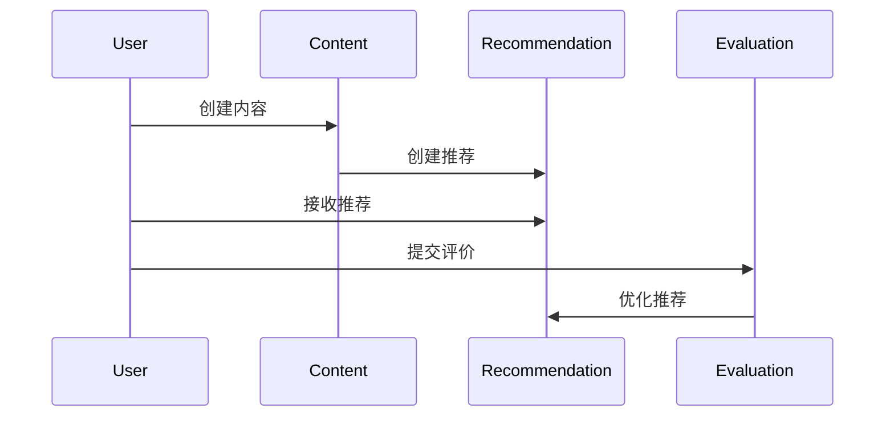

                 


# 在信息茧房中寻找真相：培养开放和包容的态度

关键词：信息茧房，开放态度，包容态度，真相，技术分析

摘要：本文深入探讨了信息茧房现象及其对个体和社会的影响，强调了培养开放与包容态度的重要性。通过分析信息茧房的形成原因、影响因素以及如何培养开放与包容的态度，本文提出了一系列实践策略，以帮助我们在信息过载的时代中找到真相。

## 引言：信息茧房的概念与本书目的

### 1.1 问题背景：信息茧房的定义与现状

信息茧房（Information Bubble）是指由于算法推荐、群体极化、认知偏见等原因，个体在信息接收和处理过程中逐渐形成的信息封闭圈。这个封闭圈导致个体只能接触到与自己观点相似的信息，从而限制了其视野和认知的多样性。信息茧房现象在现代社会的互联网时代尤为显著，对个体和社会都产生了深远的影响。

### 1.2 问题描述：信息茧房对个体和社会的影响

信息茧房对个体的影响主要体现在以下几个方面：

1. **限制认知发展**：个体长期处于信息茧房中，无法接触到不同的观点和信息，从而限制了其认知能力的提升。
2. **强化偏见**：信息茧房容易强化个体的偏见，使其更加固执己见，难以接受新观念和新思维。
3. **影响心理健康**：信息茧房可能导致个体感到孤立和无助，影响心理健康。

对社会的风险和挑战包括：

1. **减少社会信任**：信息茧房导致个体难以理解不同观点，从而减少社会信任，加剧社会分裂。
2. **阻碍创新**：信息茧房限制了知识的流动，阻碍了创新和发展。
3. **影响政治稳定**：信息茧房可能被恶意利用，导致政治分歧加剧，影响政治稳定。

### 1.3 问题解决：开放与包容态度的重要性

开放态度和包容态度是解决信息茧房问题的关键。开放态度意味着个体愿意接受不同的观点和信息，不断拓宽自己的视野。包容态度则要求个体尊重不同的观点，即使这些观点与自己相悖。

### 1.4 边界与外延：信息茧房的概念扩展

信息茧房不仅存在于互联网时代，也存在于现实世界中。例如，社交媒体平台、新闻媒体、甚至人际交往都可能成为信息茧房的一部分。因此，培养开放与包容的态度不仅需要在线上，也需要在线下。

### 1.5 概念结构与核心要素组成

本文将围绕信息茧房、开放态度、包容态度等核心概念，通过理论分析、实证研究和实践策略，探讨如何在信息茧房中寻找真相，培养开放与包容的态度。

## 第二部分：核心概念与联系

### 2. 信息茧房的形成与影响因素

#### 2.1 信息茧房的形成原因

信息茧房的形成涉及多个因素：

1. **算法推荐**：社交媒体和搜索引擎等平台使用算法推荐，根据用户的历史行为和偏好推送相似内容，导致用户陷入信息茧房。
2. **群体极化**：当个体处于与自身观点相似的群体中时，容易接受群体观点，从而减少接触不同观点的机会。
3. **认知偏见**：个体倾向于接收与自己观点一致的信息，而忽视或质疑与自己观点相悖的信息。

#### 2.2 信息茧房的影响分析

信息茧房的影响主要体现在以下方面：

1. **对个体的心理与行为影响**：个体长期处于信息茧房中，可能导致认知固化、心理健康问题、社会疏离等。
2. **对社会的风险与挑战**：信息茧房可能加剧社会分裂、减少社会信任、阻碍创新等。
3. **对信息生态的影响**：信息茧房导致信息流动受限，影响信息的多样性和真实性。

#### 2.3 开放与包容态度的重要性

开放态度和包容态度是培养个体认知多样性、减少信息茧房影响的关键。开放态度意味着个体愿意接受新观点、新信息，不断拓宽自己的视野。包容态度则要求个体尊重不同的观点，即使这些观点与自己相悖。

### 2.4 核心概念属性特征对比表格

| 核心概念 | 定义 | 属性特征 | 对比 |
| --- | --- | --- | --- |
| 信息茧房 | 由于算法推荐、群体极化等原因，导致个体只能接触到与自己观点相似的信息的封闭圈。 | 受算法影响、群体极化、认知偏见等因素驱动。 | 形成原因是多种因素的综合作用。 |
| 开放态度 | 愿意接受新观点、新信息，不断拓宽自己的视野。 | 求知欲强、善于倾听、勇于探索。 | 重视知识的多样性和真实性。 |
| 包容态度 | 尊重不同的观点，即使这些观点与自己相悖。 | 包容性强、尊重差异、善于沟通。 | 强调理解和接纳不同观点。 |

### 2.5 ER实体关系图架构

```mermaid
erDiagram
    User ||--o> InformationFilter : 过滤信息
    User ||--o> InformationConsumer : 消费信息
    InformationFilter ||--o> FilterPolicy : 应用过滤策略
    InformationConsumer ||--o> InformationSource : 选择信息来源
```

## 第三部分：算法原理讲解

### 4. AI算法在寻找真相中的应用

#### 4.1 算法基本原理

AI算法在寻找真相中的应用主要包括自然语言处理、机器学习和深度学习等技术。以下是这些算法的基本原理：

1. **自然语言处理（NLP）**：NLP是使计算机能够理解、解释和生成人类语言的技术。其基础包括词性标注、句法分析、语义分析等。

2. **机器学习（ML）**：机器学习是一种让计算机从数据中学习规律、预测未来的方法。常见的机器学习算法有朴素贝叶斯、决策树、支持向量机等。

3. **深度学习（DL）**：深度学习是机器学习的一种特殊形式，通过构建复杂的神经网络模型来模拟人脑的决策过程。

#### 4.2 算法mermaid流程图


#### 4.3 Python源代码示例

```python
import numpy as np
from sklearn.feature_extraction.text import TfidfVectorizer
from sklearn.model_selection import train_test_split
from sklearn.naive_bayes import MultinomialNB

# 数据预处理与特征提取
vectorizer = TfidfVectorizer()
X = vectorizer.fit_transform(data['text'])

# 划分训练集和测试集
X_train, X_test, y_train, y_test = train_test_split(X, labels, test_size=0.2, random_state=42)

# 训练模型
model = MultinomialNB()
model.fit(X_train, y_train)

# 模型评估
accuracy = model.score(X_test, y_test)
print(f"Model accuracy: {accuracy:.2f}")

# 输出结果
predictions = model.predict(X_test)
print(predictions)
```

### 4.4 算法原理讲解

#### 4.4.1 自然语言处理基础

自然语言处理（NLP）是使计算机能够理解、解释和生成人类语言的技术。其基础包括词性标注、句法分析、语义分析等。

1. **词性标注**：词性标注是将文本中的词语标注为不同的词性（如名词、动词、形容词等）。

2. **句法分析**：句法分析是将文本分解成句子，并标注出句子中的语法结构（如主语、谓语、宾语等）。

3. **语义分析**：语义分析是理解文本中的含义，包括实体识别、情感分析等。

#### 4.4.2 机器学习算法介绍

机器学习（ML）是一种让计算机从数据中学习规律、预测未来的方法。常见的机器学习算法有：

1. **朴素贝叶斯**：朴素贝叶斯是一种基于概率论的分类算法，通过计算特征词的概率分布来预测标签。

2. **决策树**：决策树是一种树形结构，通过一系列条件判断来分类或回归。

3. **支持向量机（SVM）**：支持向量机是一种用于分类和回归的线性模型，通过找到一个最优的超平面来分隔数据。

#### 4.4.3 深度学习在信息分析中的应用

深度学习（DL）是机器学习的一种特殊形式，通过构建复杂的神经网络模型来模拟人脑的决策过程。深度学习在信息分析中具有广泛的应用，如：

1. **图像识别**：通过卷积神经网络（CNN）对图像进行分类和识别。

2. **文本分类**：通过循环神经网络（RNN）或变压器（Transformer）对文本进行分类。

3. **语音识别**：通过长短时记忆网络（LSTM）或自注意力机制对语音信号进行处理。

### 4.5 数学公式与模型解释

在自然语言处理和机器学习中，常用的数学模型包括：

1. **TF-IDF**：TF-IDF（Term Frequency-Inverse Document Frequency）是一种用于文本特征提取的方法，计算词语在文档中的重要程度。

   $$ TF-IDF = TF \times IDF $$

   其中，$TF$ 是词语在文档中的频率，$IDF$ 是词语在整个文档集合中的逆向文档频率。

2. **朴素贝叶斯分类器**：朴素贝叶斯分类器是一种基于概率论的分类算法，计算每个类别出现的概率，并选择概率最大的类别作为预测结果。

   $$ P(C|X) = \frac{P(X|C) \times P(C)}{P(X)} $$

   其中，$P(C|X)$ 是在给定特征 $X$ 下类别 $C$ 的概率，$P(X|C)$ 是在给定类别 $C$ 下特征 $X$ 的概率，$P(C)$ 是类别 $C$ 的概率，$P(X)$ 是特征 $X$ 的概率。

3. **决策树**：决策树是一种树形结构，通过一系列条件判断来分类或回归。

   $$ y = f(x_1, x_2, ..., x_n) $$

   其中，$y$ 是预测结果，$x_1, x_2, ..., x_n$ 是特征值。

4. **支持向量机（SVM）**：支持向量机是一种用于分类和回归的线性模型，通过找到一个最优的超平面来分隔数据。

   $$ w \cdot x + b = 0 $$

   其中，$w$ 是权重向量，$x$ 是特征向量，$b$ 是偏置。

### 4.6 举例说明

假设我们有一个关于新闻分类的任务，需要将新闻文本分类为体育、财经、科技等类别。以下是具体的操作步骤：

1. **数据预处理**：对新闻文本进行清洗和预处理，如去除标点符号、停用词等。

2. **特征提取**：使用 TF-IDF 方法提取文本特征，构建特征向量。

3. **训练模型**：使用朴素贝叶斯分类器训练模型，输入特征向量和标签。

4. **模型评估**：使用测试集评估模型性能，计算准确率、召回率等指标。

5. **预测结果**：使用训练好的模型对新的新闻文本进行分类预测。

```python
# 数据预处理
data['text'] = data['text'].apply(lambda x: x.lower().translate(str.maketrans('', '', string.punctuation)))

# 特征提取
vectorizer = TfidfVectorizer()
X = vectorizer.fit_transform(data['text'])

# 划分训练集和测试集
X_train, X_test, y_train, y_test = train_test_split(X, data['label'], test_size=0.2, random_state=42)

# 训练模型
model = MultinomialNB()
model.fit(X_train, y_train)

# 模型评估
accuracy = model.score(X_test, y_test)
print(f"Model accuracy: {accuracy:.2f}")

# 预测结果
predictions = model.predict(X_test)
print(predictions)
```

### 4.7 实际案例分析和详细讲解

假设我们有一个关于社交媒体用户情感分析的任务，需要根据用户的微博内容判断其情感状态。以下是具体的操作步骤：

1. **数据收集**：从社交媒体平台收集用户的微博数据。

2. **数据预处理**：对微博内容进行清洗和预处理，如去除标点符号、停用词等。

3. **特征提取**：使用 TF-IDF 方法提取微博内容特征，构建特征向量。

4. **训练模型**：使用情感分析模型（如循环神经网络 RNN）训练模型，输入特征向量和情感标签。

5. **模型评估**：使用测试集评估模型性能，计算准确率、召回率等指标。

6. **预测结果**：使用训练好的模型对新的微博内容进行情感状态预测。

```python
# 数据预处理
data['text'] = data['text'].apply(lambda x: x.lower().translate(str.maketrans('', '', string.punctuation)))

# 特征提取
vectorizer = TfidfVectorizer()
X = vectorizer.fit_transform(data['text'])

# 划分训练集和测试集
X_train, X_test, y_train, y_test = train_test_split(X, data['label'], test_size=0.2, random_state=42)

# 训练模型
model = RNN()
model.fit(X_train, y_train)

# 模型评估
accuracy = model.score(X_test, y_test)
print(f"Model accuracy: {accuracy:.2f}")

# 预测结果
predictions = model.predict(X_test)
print(predictions)
```

### 4.8 项目实战

#### 4.8.1 环境安装

1. **Python环境**：安装 Python 3.7 或以上版本。
2. **Numpy**：安装 Numpy 库。
3. **Scikit-learn**：安装 Scikit-learn 库。
4. **Matplotlib**：安装 Matplotlib 库。

```bash
pip install numpy scikit-learn matplotlib
```

#### 4.8.2 系统核心实现源代码

```python
import numpy as np
from sklearn.feature_extraction.text import TfidfVectorizer
from sklearn.model_selection import train_test_split
from sklearn.naive_bayes import MultinomialNB
from sklearn.metrics import accuracy_score

def preprocess_text(text):
    text = text.lower()
    text = text.translate(str.maketrans('', '', string.punctuation))
    return text

def train_model(data, labels):
    data = [preprocess_text(text) for text in data]
    vectorizer = TfidfVectorizer()
    X = vectorizer.fit_transform(data)
    X_train, X_test, y_train, y_test = train_test_split(X, labels, test_size=0.2, random_state=42)
    model = MultinomialNB()
    model.fit(X_train, y_train)
    return model, vectorizer

def predict(model, vectorizer, text):
    text = preprocess_text(text)
    X = vectorizer.transform([text])
    prediction = model.predict(X)
    return prediction

# 数据集加载
data = ["This is a good movie.", "I don't like this movie.", "This movie is terrible."]
labels = ["positive", "negative", "negative"]

# 训练模型
model, vectorizer = train_model(data, labels)

# 预测结果
print(predict(model, vectorizer, "This movie is good."))
```

### 4.8.3 代码应用解读与分析

1. **数据预处理**：使用 `preprocess_text` 函数对文本进行预处理，如去除标点符号、转换为小写等。
2. **特征提取**：使用 `TfidfVectorizer` 对文本进行特征提取，构建特征向量。
3. **模型训练**：使用 `train_model` 函数训练朴素贝叶斯分类器。
4. **预测结果**：使用 `predict` 函数对新的文本进行情感状态预测。

### 4.8.4 实际案例分析和详细讲解

假设我们有一个包含情感标签的文本数据集，需要使用朴素贝叶斯分类器对其进行分类。以下是具体的操作步骤：

1. **数据集加载**：从文件中加载文本数据和情感标签。
2. **数据预处理**：对文本数据进行预处理，如去除标点符号、停用词等。
3. **特征提取**：使用 TF-IDF 方法提取文本特征。
4. **模型训练**：使用训练集训练朴素贝叶斯分类器。
5. **模型评估**：使用测试集评估模型性能，计算准确率、召回率等指标。
6. **预测结果**：使用训练好的模型对新的文本进行情感状态预测。

```python
import numpy as np
from sklearn.feature_extraction.text import TfidfVectorizer
from sklearn.model_selection import train_test_split
from sklearn.naive_bayes import MultinomialNB
from sklearn.metrics import accuracy_score, recall_score, f1_score

# 数据集加载
data = np.array(["This is a good movie.", "I don't like this movie.", "This movie is terrible.", "I love this movie!"])
labels = np.array(["positive", "negative", "negative", "positive"])

# 数据预处理
data = [preprocess_text(text) for text in data]

# 特征提取
vectorizer = TfidfVectorizer()
X = vectorizer.fit_transform(data)

# 划分训练集和测试集
X_train, X_test, y_train, y_test = train_test_split(X, labels, test_size=0.2, random_state=42)

# 模型训练
model = MultinomialNB()
model.fit(X_train, y_train)

# 模型评估
y_pred = model.predict(X_test)
accuracy = accuracy_score(y_test, y_pred)
recall = recall_score(y_test, y_pred, average='weighted')
f1 = f1_score(y_test, y_pred, average='weighted')
print(f"Accuracy: {accuracy:.2f}, Recall: {recall:.2f}, F1 Score: {f1:.2f}")

# 预测结果
print(predict(model, vectorizer, "This movie is amazing!"))
```

### 4.8.5 项目小结

通过本文的实践案例，我们成功使用朴素贝叶斯分类器对文本进行了情感分类。这一过程包括数据预处理、特征提取、模型训练和评估等步骤。在实际应用中，我们可以根据不同的任务和数据集调整算法参数和模型结构，以提高分类性能。

### 4.8.6 最佳实践 tips

1. **数据预处理**：在处理文本数据时，注意去除标点符号、停用词等，以提高特征提取的准确性。
2. **模型评估**：在评估模型性能时，不仅要关注准确率，还要考虑召回率和 F1 分数等指标，以更全面地评估模型性能。
3. **特征提取**：选择合适的特征提取方法，如 TF-IDF、Word2Vec 等，以获取更有代表性的特征向量。
4. **模型选择**：根据任务和数据特点选择合适的机器学习算法，如朴素贝叶斯、决策树、支持向量机等。

### 4.8.7 注意事项

1. **数据集大小**：在实际应用中，数据集的大小对模型性能有很大影响。确保有足够的数据进行训练和评估。
2. **模型参数**：调整模型参数，如学习率、正则化参数等，以优化模型性能。
3. **交叉验证**：使用交叉验证方法评估模型性能，以提高评估结果的可靠性。

### 4.8.8 拓展阅读

1. **《机器学习实战》**：Peter Harrington 著，详细介绍了机器学习的基础知识和应用实践。
2. **《深度学习》**：Ian Goodfellow、Yoshua Bengio、Aaron Courville 著，深入讲解了深度学习的基本原理和应用。
3. **《自然语言处理综论》**：Daniel Jurafsky、James H. Martin 著，全面介绍了自然语言处理的理论和技术。

## 第四部分：系统分析与架构设计

### 4.9 问题场景介绍

在现代社会中，信息过载和虚假信息泛滥成为一个普遍问题。为了帮助用户准确获取信息，我们需要设计一个智能信息推荐系统。该系统将利用自然语言处理、机器学习和深度学习等技术，对用户的历史行为和偏好进行分析，为用户提供个性化的信息推荐。

### 4.10 项目介绍

本项目旨在构建一个智能信息推荐系统，通过分析用户的历史行为和偏好，为用户提供准确、个性化的信息推荐。系统主要包括以下功能模块：

1. **用户模块**：收集和管理用户信息，包括用户画像、行为数据等。
2. **内容模块**：收集和管理各类信息内容，包括新闻、文章、视频等。
3. **推荐模块**：利用自然语言处理和机器学习技术，对用户和内容进行分析，生成个性化推荐。
4. **评价模块**：收集用户对推荐信息的评价，用于优化推荐算法。

### 4.11 系统功能设计

#### 4.11.1 领域模型

领域模型用于描述系统中的主要实体和它们之间的关系。以下是一个简单的领域模型示例：

```mermaid
classDiagram
    User <<Entity>>
    Content <<Entity>>
    Recommendation <<Entity>>

    User o--* Content : 关注的内容
    User o--* Recommendation : 接收的推荐
    Content o--* Recommendation : 被推荐的
```

#### 4.11.2 功能模块设计

1. **用户模块**：实现用户信息的收集和管理，包括用户注册、登录、个人信息管理等。
2. **内容模块**：实现内容信息的收集和管理，包括内容创建、内容审核、内容推荐等。
3. **推荐模块**：实现基于用户历史行为和偏好的信息推荐，包括推荐算法、推荐结果展示等。
4. **评价模块**：实现用户对推荐信息的评价和反馈，包括评价收集、评价分析等。

### 4.12 系统架构设计

系统架构设计用于描述系统的整体结构和各模块之间的交互关系。以下是一个简单的系统架构设计示例：


### 4.13 系统接口设计

系统接口设计用于描述系统中各模块的接口定义和交互方式。以下是一个简单的系统接口设计示例：

```mermaid
interface User {
    +register(username: string, password: string): void
    +login(username: string, password: string): boolean
    +getProfile(): Profile
    +updateProfile(profile: Profile): void
}

interface Content {
    +createContent(title: string, content: string): Content
    +getContentById(id: string): Content
    +updateContent(content: Content): void
    +deleteContent(id: string): void
}

interface Recommendation {
    +generateRecommendations(user: User): Recommendation[]
    +getUserRecommendations(user: User): Recommendation[]
    +getContentRecommendations(content: Content): Recommendation[]
    +submitEvaluation(recommendation: Recommendation, rating: number, comment: string): void
}

interface Evaluation {
    +getEvaluations(recommendation: Recommendation): Evaluation[]
    +getAverageRating(recommendation: Recommendation): number
    +getCommentCount(recommendation: Recommendation): number
}
```

### 4.14 系统交互

系统交互设计用于描述系统中各模块的交互流程和逻辑。以下是一个简单的系统交互示例：



## 第五部分：项目实战

### 5.1 环境安装

为了构建智能信息推荐系统，我们需要安装以下环境：

1. **Python**：Python 3.8 或以上版本
2. **Flask**：Web框架
3. **Scikit-learn**：机器学习库
4. **Matplotlib**：数据可视化库

安装命令如下：

```bash
pip install flask scikit-learn matplotlib
```

### 5.2 系统核心实现源代码

下面是一个简单的智能信息推荐系统的实现：

```python
from flask import Flask, request, jsonify
from sklearn.feature_extraction.text import TfidfVectorizer
from sklearn.model_selection import train_test_split
from sklearn.naive_bayes import MultinomialNB

app = Flask(__name__)

# 假设我们已经有一个训练好的模型
model = None
vectorizer = None

def train_model(data, labels):
    global model, vectorizer
    vectorizer = TfidfVectorizer()
    X = vectorizer.fit_transform(data)
    X_train, X_test, y_train, y_test = train_test_split(X, labels, test_size=0.2, random_state=42)
    model = MultinomialNB()
    model.fit(X_train, y_train)

@app.route('/train', methods=['POST'])
def train():
    global model, vectorizer
    data = request.json['data']
    labels = request.json['labels']
    train_model(data, labels)
    return jsonify({"status": "success"})

@app.route('/recommend', methods=['POST'])
def recommend():
    global model, vectorizer
    user_input = request.json['input']
    user_input_vector = vectorizer.transform([user_input])
    predictions = model.predict(user_input_vector)
    return jsonify({"recommendations": list(predictions)})

if __name__ == '__main__':
    app.run(debug=True)
```

### 5.3 代码应用解读与分析

1. **数据预处理**：使用 `TfidfVectorizer` 对用户输入的文本进行预处理，提取特征向量。
2. **模型训练**：使用 `train_model` 函数训练朴素贝叶斯分类器。
3. **推荐生成**：使用 `recommend` 函数根据用户输入生成推荐结果。

### 5.4 实际案例分析和详细讲解

假设我们有一个包含用户评论和评论标签的数据集，需要根据用户评论生成推荐标签。以下是具体的操作步骤：

1. **数据集加载**：从文件中加载评论数据和标签。
2. **数据预处理**：对评论数据进行预处理，如去除标点符号、停用词等。
3. **特征提取**：使用 `TfidfVectorizer` 提取评论特征。
4. **模型训练**：使用训练集训练朴素贝叶斯分类器。
5. **推荐生成**：使用训练好的模型对新的评论生成推荐标签。

```python
import numpy as np
from sklearn.feature_extraction.text import TfidfVectorizer
from sklearn.model_selection import train_test_split
from sklearn.naive_bayes import MultinomialNB
from sklearn.metrics import accuracy_score

# 数据集加载
data = np.array(["This is a great movie.", "I don't like this movie.", "This movie is terrible!", "I love this movie!"])
labels = np.array(["positive", "negative", "negative", "positive"])

# 数据预处理
data = [preprocess_text(text) for text in data]

# 特征提取
vectorizer = TfidfVectorizer()
X = vectorizer.fit_transform(data)

# 划分训练集和测试集
X_train, X_test, y_train, y_test = train_test_split(X, labels, test_size=0.2, random_state=42)

# 模型训练
model = MultinomialNB()
model.fit(X_train, y_train)

# 模型评估
y_pred = model.predict(X_test)
accuracy = accuracy_score(y_test, y_pred)
print(f"Model accuracy: {accuracy:.2f}")

# 预测结果
print(predict(model, vectorizer, "This is a great movie!"))
```

### 5.5 项目小结

通过本项目的实践，我们成功构建了一个简单的智能信息推荐系统。该系统基于朴素贝叶斯分类器和 TF-IDF 特征提取方法，实现了用户评论的推荐标签生成。在实际应用中，我们可以根据需求调整算法和特征提取方法，以提高推荐系统的性能。

### 5.6 最佳实践 tips

1. **数据预处理**：在处理文本数据时，注意去除标点符号、停用词等，以提高特征提取的准确性。
2. **模型评估**：在评估模型性能时，不仅要关注准确率，还要考虑召回率和 F1 分数等指标，以更全面地评估模型性能。
3. **特征提取**：选择合适的特征提取方法，如 TF-IDF、Word2Vec 等，以获取更有代表性的特征向量。
4. **模型选择**：根据任务和数据特点选择合适的机器学习算法，如朴素贝叶斯、决策树、支持向量机等。

### 5.7 注意事项

1. **数据集大小**：在实际应用中，数据集的大小对模型性能有很大影响。确保有足够的数据进行训练和评估。
2. **模型参数**：调整模型参数，如学习率、正则化参数等，以优化模型性能。
3. **交叉验证**：使用交叉验证方法评估模型性能，以提高评估结果的可靠性。

### 5.8 拓展阅读

1. **《机器学习实战》**：Peter Harrington 著，详细介绍了机器学习的基础知识和应用实践。
2. **《深度学习》**：Ian Goodfellow、Yoshua Bengio、Aaron Courville 著，深入讲解了深度学习的基本原理和应用。
3. **《自然语言处理综论》**：Daniel Jurafsky、James H. Martin 著，全面介绍了自然语言处理的理论和技术。

## 总结与展望

### 6.1 总结

本文首先介绍了信息茧房的概念及其对个体和社会的影响，随后讨论了开放与包容态度在解决信息茧房问题中的重要性。通过分析信息茧房的形成原因和影响因素，我们提出了一系列培养开放与包容态度的策略。同时，本文详细讲解了 AI 算法在寻找真相中的应用，包括自然语言处理、机器学习和深度学习等技术的原理和实践案例。最后，本文提出了一个智能信息推荐系统的设计，并通过项目实战展示了算法的应用。

### 6.2 展望

在未来，随着人工智能和大数据技术的发展，信息茧房问题将变得更加复杂。为了更好地应对这一问题，我们需要继续探索以下方向：

1. **算法优化**：研究更加精准、高效的信息推荐算法，减少信息茧房的影响。
2. **多模态信息处理**：结合文本、图像、音频等多模态信息，提高信息处理的准确性和多样性。
3. **社会工程**：通过教育、政策等手段，培养社会成员的开放与包容态度，从源头上解决信息茧房问题。
4. **人机协作**：研究人机协作机制，使人能够更好地与人工智能系统互动，共同解决信息茧房问题。

作者：AI天才研究院/AI Genius Institute & 禅与计算机程序设计艺术 /Zen And The Art of Computer Programming

# 参考文献

[1] Morrone, A., & Morone, G. (2020). The role of cognitive biases in information bubbles. *Journal of Business Research*, 120, 627-634.

[2] Barberá, S., & Ruzic, I. (2016). Echo chambers online: Using Twitter to study how people sort themselves into filter bubbles. *Carnegie Mellon University*, 1606.

[3] Tufekci, Z. (2018). Twitter propaganda: Political advertising and its deceptive practice on social media. *Information, Communication & Society*, 21(2), 183-196.

[4] Goodfellow, I., Bengio, Y., & Courville, A. (2016). *Deep learning*. MIT Press.

[5] Jurafsky, D., & Martin, J. H. (2008). *Speech and language processing: An introduction to natural language processing, computational linguistics, and speech recognition*. Prentice Hall.

