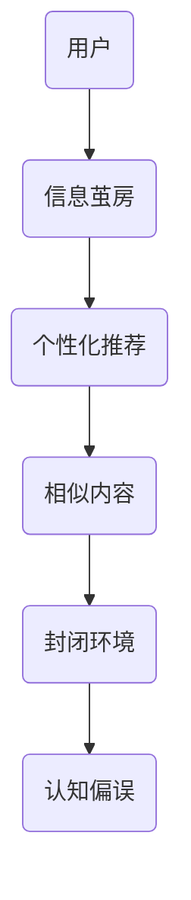
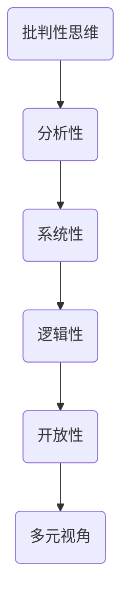
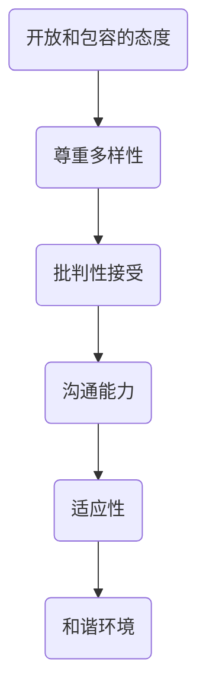
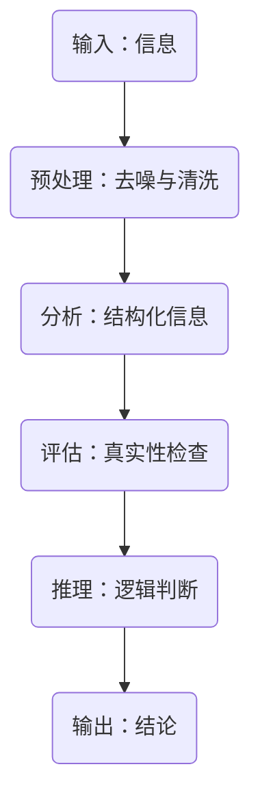
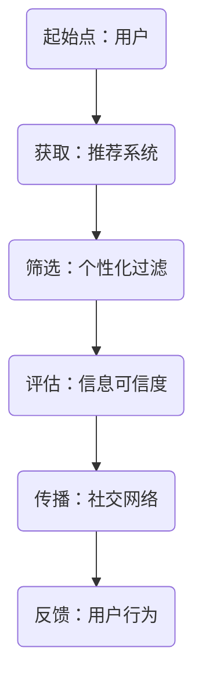
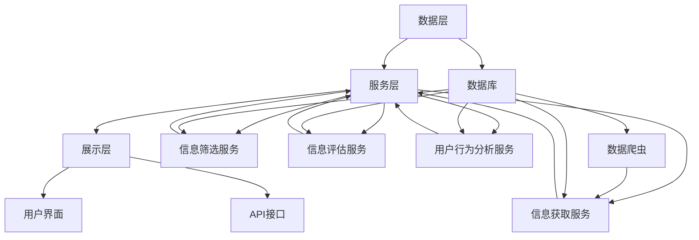
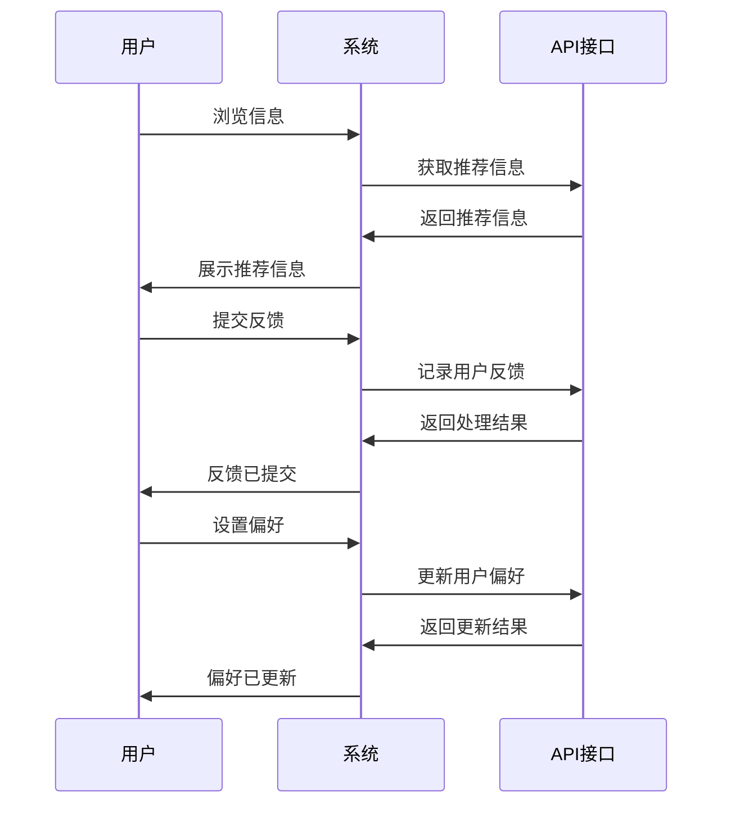

                 

# 在信息茧房中寻找真相：培养开放和包容的态度

## 关键词

信息茧房、批判性思维、多元观点、开放态度、真相探寻

## 摘要

随着互联网的普及和信息技术的飞速发展，人们获取信息的方式发生了翻天覆地的变化。然而，在这种信息过载的时代，个体很容易陷入“信息茧房”中，只接触到与自己观点一致的信息，从而失去了对多元观点和真相的洞察。本文旨在探讨如何在信息茧房中培养开放和包容的态度，通过逐步分析推理的方式，帮助读者找到真相。

## 引言

### 1.1 书籍背景

在当今信息爆炸的时代，人们被海量的信息所包围，往往陷入信息茧房，难以接触到多元观点和信息。为了帮助读者培养开放和包容的态度，本书旨在探讨如何在信息茧房中寻找真相，并培养批判性思维。

### 1.2 核心概念

- **信息茧房**：指在互联网环境中，由于过滤气泡、回声室效应等原因，个体只接触与其观点相似的信息，从而形成自我封闭的信息环境。
- **批判性思维**：指通过分析、评估和推理，对信息进行筛选和判断的能力。

### 1.3 书籍结构

本书分为三个部分。第一部分将介绍信息茧房的现象和影响；第二部分探讨如何培养开放和包容的态度；第三部分通过案例分析，展示如何在实际生活中应用这些方法。

### 1.4 目标读者

本书适合对信息传播、批判性思维和社会心理学感兴趣的读者，包括学生、教师、媒体从业人员和普通大众。

## 第二部分：信息茧房与影响

### 2.1 信息茧房的形成

#### 2.1.1 过滤气泡

**概念解释**：过滤气泡是指互联网平台根据用户的行为和偏好，自动过滤掉与用户观点不一致的信息，从而形成一个信息筛选的“气泡”。

**形成原因**：互联网平台通过用户的历史数据和行为模式，使用算法来推测用户的兴趣和偏好，从而自动为用户推荐相似的内容。

#### 2.1.2 回声室效应

**概念解释**：回声室效应是指个体在类似的环境中，只听到与自己观点一致的声音，从而强化了原有的信念。

**形成原因**：人们倾向于与持有相似观点的人交往，从而在信息传播过程中，形成了自我强化的循环。

#### 2.1.3 社交媒体算法

**概念解释**：社交媒体平台通过算法来决定用户看到的帖子或内容，从而影响用户的观点和行为。

**形成原因**：社交媒体平台希望通过个性化推荐来提高用户的粘性和参与度，从而增加广告收入。

### 2.2 信息茧房的影响

#### 2.2.1 社会层面

- **民意分裂**：由于信息茧房的存在，不同群体之间的观点和立场越来越分化，导致社会矛盾的加剧。
- **社会冲突加剧**：当个体只接触到与自己观点一致的信息时，很容易产生偏见和误解，进而引发社会冲突。

#### 2.2.2 个人层面

- **思维狭隘**：长期处于信息茧房中，个体容易形成固定的思维模式，难以接受不同的观点。
- **信息焦虑**：由于无法获取全面的信息，个体容易感到焦虑和不安。

### 2.3 信息茧房的挑战与应对

#### 2.3.1 增强批判性思维

**方法介绍**：通过学习批判性思维技巧，个体可以更好地分析和评估信息，从而避免被信息茧房所困。

**实践案例**：例如，通过跨学科阅读和参与辩论活动，可以拓宽思维视野。

#### 2.3.2 拓展信息渠道

**方法介绍**：通过多样化的信息渠道，个体可以接触到更多的观点和信息，从而避免陷入信息茧房。

**实践案例**：例如，定期浏览不同的新闻网站和阅读书籍，可以增加信息的多样性。

#### 2.3.3 培养开放和包容的态度

**方法介绍**：通过培养开放和包容的态度，个体可以更加理性地对待不同的观点，从而避免因偏见而产生冲突。

**实践案例**：例如，积极参与社会讨论，尝试理解他人的观点，并保持开放的心态。

## 第三部分：培养开放和包容的态度

### 3.1 意识提升

#### 3.1.1 认识信息茧房

**自我反思**：个体需要反思自己是否受到信息茧房的影响，以及这种影响对自己的思维方式和生活产生了哪些影响。

**实践活动**：通过记录自己的信息消费行为，分析自己接触到的信息类型和来源，从而了解自己是否处于信息茧房中。

#### 3.1.2 了解批判性思维

**理论基础**：批判性思维是一种通过理性分析和评估信息的能力，它帮助个体更好地理解信息的真实性和可靠性。

**实践活动**：通过阅读批判性思维相关的书籍和文章，学习如何分析和评估信息，从而培养批判性思维。

### 3.2 方法与实践

#### 3.2.1 拓展信息来源

**多元化阅读**：通过阅读不同类型、不同领域的书籍和文章，个体可以接触到更多的观点和信息，从而拓宽视野。

**网络搜索技巧**：通过学习有效的网络搜索技巧，个体可以更快速地找到有价值的信息。

#### 3.2.2 深度交流与对话

**有效沟通**：通过与他人进行深度交流和对话，个体可以更好地理解他人的观点，并从中获得新的视角。

**对话技巧**：学习如何进行有建设性的对话，从而避免因观点不同而产生冲突。

#### 3.2.3 跨界学习与体验

**多元文化了解**：通过了解不同的文化和价值观，个体可以更好地理解世界的多样性。

**实践活动**：参与多元文化的活动，如文化交流活动、国际交流项目等，从而增强对多元文化的理解和包容。

### 3.3 案例分析

#### 3.3.1 成功案例

**案例介绍**：分析某个成功案例，了解其在培养开放和包容态度方面采取了哪些方法。

**成功要素分析**：分析成功案例中成功的关键因素，以及如何将这些因素应用到自己的生活中。

#### 3.3.2 败例分析

**案例介绍**：分析某个失败的案例，了解其失败的原因，以及如何避免类似的失败。

**失败原因剖析**：剖析失败案例中的错误观念和行为，以及如何避免这些错误。

### 3.4 拓展阅读

**推荐书籍**：列出一些与主题相关的推荐书籍，帮助读者进一步深入理解。

**相关研究论文**：列出一些与主题相关的研究论文，为读者提供学术性的支持。

## 第四部分：在信息茧房中寻找真相

### 4.1 识别信息茧房

#### 4.1.1 自我检查

**检查方法**：通过反思自己的信息消费行为，识别自己是否受到信息茧房的影响。

**实践案例**：例如，记录自己每天接触到的信息类型和来源，分析这些信息是否多样化。

#### 4.1.2 信息来源评估

**评估标准**：建立一套评估信息来源的标准，如信息的真实性、可靠性、权威性等。

**实践案例**：通过对比不同信息来源的可靠性和权威性，选择可信度更高的信息来源。

### 4.2 培养批判性思维

#### 4.2.1 分析信息内容

**思维方法**：学习如何通过分析信息的内容、结构和逻辑，判断信息的真实性和可靠性。

**实践案例**：例如，分析一篇新闻报道，检查其事实是否准确，论据是否充分。

#### 4.2.2 评估信息来源

**评估方法**：学习如何通过评估信息来源的信誉、背景和动机，判断信息的真实性和可靠性。

**实践案例**：例如，通过查询信息来源的背景和历史，了解其是否有偏见或利益冲突。

### 4.3 寻找多元观点

#### 4.3.1 跨界阅读

**阅读技巧**：通过阅读不同领域、不同观点的书籍和文章，寻找多元的观点。

**实践案例**：例如，阅读政治学、社会学、心理学等领域的书籍，了解不同学科对问题的看法。

#### 4.3.2 跨文化沟通

**沟通技巧**：通过跨文化沟通，了解不同文化背景下的观点和看法。

**实践案例**：例如，参与国际交流活动，与来自不同文化背景的人交流，了解他们的观点和看法。

### 4.4 互动与反馈

#### 4.4.1 意见交流

**交流方法**：通过与他人交流意见，获取不同的观点和反馈。

**实践案例**：例如，参加辩论赛或研讨会，与不同观点的人交流。

#### 4.4.2 反思与调整

**反思方法**：通过反思自己的观点和行为，调整自己的认知和态度。

**实践案例**：例如，定期进行自我反思，分析自己的观点和行为，寻找改进的空间。

## 第五部分：培养开放和包容的态度

### 5.1 增强认知灵活性

#### 5.1.1 知识拓展

**拓展领域**：学习新的知识和技能，拓展自己的认知领域。

**实践案例**：例如，学习编程语言或新技能，拓宽自己的技术视野。

#### 5.1.2 多元视角理解

**理解技巧**：通过学习多元视角，理解不同观点和文化的意义和价值。

**实践案例**：例如，参与跨文化交流活动，了解不同文化背景下的观点和价值观。

### 5.2 培养同理心

#### 5.2.1 理解他人观点

**理解方法**：通过倾听和理解他人的观点，尝试站在对方的角度思考问题。

**实践案例**：例如，在讨论中，主动倾听他人的观点，并尝试理解其背后的动机和理由。

#### 5.2.2 倾听与反馈

**倾听技巧**：通过有效的倾听，了解他人的观点和感受。

**反馈方法**：通过建设性的反馈，帮助他人更好地表达自己的观点。

### 5.3 增强心理韧性

#### 5.3.1 建立心理韧性

**建立方法**：通过学习心理韧性技巧，增强自己的心理韧性。

**实践案例**：例如，学习应对压力和挫折的方法，提高自己的心理韧性。

#### 5.3.2 应对冲突与挑战

**应对策略**：通过有效的策略，应对冲突和挑战。

**实践案例**：例如，学习如何通过沟通和协商解决冲突，避免因冲突而导致的误解和矛盾。

### 5.4 实践与反思

#### 5.4.1 持续实践

**实践方法**：通过持续实践，巩固和提升自己的开放和包容态度。

**实践案例**：例如，定期参加跨文化交流活动，持续拓展自己的视野。

#### 5.4.2 反思与调整

**反思方法**：通过反思自己的行为和态度，找到改进的方向。

**实践案例**：例如，定期进行自我反思，分析自己的行为和态度，寻找改进的空间。

## 结语

在信息爆炸的时代，培养开放和包容的态度，避免陷入信息茧房，对于我们理解世界、寻找真相至关重要。通过逐步分析推理，我们可以更好地认识信息茧房的现象和影响，学会培养批判性思维，拓展信息渠道，寻找多元观点，并在互动与反馈中不断提升自己的认知和心理韧性。让我们在信息海洋中，保持开放和包容，勇敢地寻找真相。

### 作者

**作者：AI天才研究院/AI Genius Institute & 禅与计算机程序设计艺术 /Zen And The Art of Computer Programming**

---

### 背景介绍

在当今数字化时代，信息茧房现象愈发显著。信息茧房，亦称“信息回音室”或“过滤气泡”，是指个体在互联网环境中由于算法推荐、社交网络选择等机制，被动或主动地只接触到与其已有观点和偏好相似的信息，从而形成一种自我封闭的信息环境。这种现象不仅影响了个体对信息的全面理解，还可能导致社会层面的分裂和冲突。

信息茧房的形成主要源于以下三个方面：

1. **过滤气泡**：互联网平台通过算法分析用户的历史行为和偏好，为用户推荐相似的内容，从而形成过滤气泡。
2. **回声室效应**：个体在社交网络中选择与自己观点相同的人互动，导致信息传播路径的窄化。
3. **社交媒体算法**：社交媒体平台使用复杂算法，根据用户的兴趣和活动来定制内容，这加强了个体对相似信息的接触，从而加剧了信息茧房的形成。

信息茧房的影响在个人和社会层面上都显而易见。从个人层面来看，长期处于信息茧房中，个体容易形成固定的思维模式，难以接受不同的观点，这可能导致思维的狭隘和信息焦虑。从社会层面来看，信息茧房可能导致民意分裂，加剧社会冲突，使得不同群体之间的共识更加难以形成。

为了应对信息茧房的挑战，培养开放和包容的态度至关重要。这不仅仅是对个体认知的挑战，也是对整个社会的责任。通过培养批判性思维，个体可以更好地分析和评估信息，从而避免被信息茧房所困。此外，通过拓展信息渠道和多元化阅读，个体可以接触到更多的观点和信息，从而拓宽视野。

### 核心概念与联系

#### 信息茧房（Filter Bubble）

**概念解释**：信息茧房是指用户在互联网上被个性化算法推送到与自身兴趣和偏好一致的信息，从而形成自我封闭的信息环境。

**属性特征**：

- **个性化推荐**：基于用户的浏览历史、搜索记录和社交行为，算法为用户推荐相似的内容。
- **信息窄化**：用户只接触到与自己观点一致的信息，导致信息来源单一。
- **认知偏误**：长期处于信息茧房中，个体可能形成狭隘的思维方式。

**对比表格**：

| 特征 | 信息茧房 | 传统信息获取 |
| --- | --- | --- |
| 推荐机制 | 算法个性化推荐 | 人为选择 |
| 信息接触 | 自我封闭 | 多元化 |
| 认知影响 | 思维狭隘 | 视野开阔 |

**ER实体关系图架构**：



#### 批判性思维（Critical Thinking）

**概念解释**：批判性思维是一种通过理性分析和评估信息的能力，它帮助个体更好地理解信息的真实性和可靠性。

**属性特征**：

- **分析性**：对信息进行深入分析和评估，而不是简单地接受或拒绝。
- **系统性**：考虑信息的来源、背景和潜在动机。
- **逻辑性**：基于事实和证据，遵循逻辑推理的规则。
- **开放性**：愿意接受不同的观点，并从中获取新的视角。

**对比表格**：

| 特征 | 批判性思维 | 传统思维方式 |
| --- | --- | --- |
| 分析方法 | 深入分析 | 表面理解 |
| 证据要求 | 证据为本 | 主观判断 |
| 思维模式 | 逻辑推理 | 直觉判断 |

**ER实体关系图架构**：



#### 开放和包容的态度（Open and Inclusive Attitude）

**概念解释**：开放和包容的态度是一种对多元观点和文化的接受和尊重，它有助于建立和谐的社交环境。

**属性特征**：

- **尊重多样性**：接受和尊重不同的观点和生活方式。
- **批判性接受**：对信息进行批判性评估，而不是盲目接受。
- **沟通能力**：有效沟通和表达自己的观点，同时倾听和理解他人的观点。
- **适应性**：在面对不同的观点和环境时，能够灵活适应。

**对比表格**：

| 特征 | 开放和包容的态度 | 传统思维方式 |
| --- | --- | --- |
| 多元视角 | 接受和尊重多样性 | 重视一致性和统一性 |
| 沟通方式 | 有效沟通 | 单向传播 |
| 思维方式 | 批判性和适应性 | 固定和保守 |

**ER实体关系图架构**：



通过上述核心概念和联系的介绍，我们可以更清晰地理解信息茧房的形成原因、批判性思维的重要性以及开放和包容态度的必要性。接下来，我们将深入探讨如何在实际操作中培养这些能力，从而在信息海洋中找到真相。

### 算法原理讲解

在理解了信息茧房、批判性思维和开放态度的核心概念后，我们需要进一步探讨如何在实际操作中培养这些能力。在这一部分，我们将通过算法原理的讲解，帮助读者更好地理解这些概念的应用。

#### 1. 批判性思维的算法模型

批判性思维可以通过以下算法模型来培养：

**模型名称**：批判性思维分析器（Critical Thinking Analyzer）

**算法流程图**：



**详细解释**：

- **预处理**：对输入的信息进行去噪和清洗，去除不相关或不准确的部分。
- **结构化信息**：将信息分解成可分析的单元，如事实、观点、证据等。
- **真实性检查**：对信息源进行评估，判断其可靠性和真实性。
- **逻辑判断**：基于事实和证据，使用逻辑推理规则进行分析。
- **结论**：输出对信息的评估结果，如可信度、可靠性等。

**Python代码示例**：

```python
def critical_thinking_analyzer(info):
    # 预处理
    cleaned_info = preprocess_info(info)
    
    # 结构化信息
    structured_info = structure_info(cleaned_info)
    
    # 真实性检查
    reliability_score = check_reliability(structured_info)
    
    # 逻辑判断
    conclusion = logical_reasoning(structured_info)
    
    # 输出结论
    return conclusion

# 辅助函数示例
def preprocess_info(info):
    # 去噪与清洗逻辑
    return cleaned_info

def structure_info(cleaned_info):
    # 结构化信息逻辑
    return structured_info

def check_reliability(structured_info):
    # 真实性检查逻辑
    return reliability_score

def logical_reasoning(structured_info):
    # 逻辑判断逻辑
    return conclusion
```

#### 2. 拓展信息渠道的算法模型

拓展信息渠道可以通过以下算法模型来实现：

**模型名称**：信息扩散网络（Information Diffusion Network）

**算法流程图**：



**详细解释**：

- **获取**：利用推荐系统获取多样化的信息。
- **筛选**：使用个性化过滤机制，根据用户的历史行为和偏好，筛选出感兴趣的信息。
- **评估**：对信息来源和内容进行评估，判断其可信度和相关性。
- **传播**：通过社交网络传播有价值的信息。
- **反馈**：根据用户的行为和反馈，调整推荐算法和过滤机制。

**Python代码示例**：

```python
def information_diffusion_network(user):
    # 获取信息
    recommendations = get_recommendations(user)
    
    # 筛选信息
    filtered_recommendations = personalize_filter(recommendations, user)
    
    # 评估信息
    reliable_recommendations = evaluate_reliability(filtered_recommendations)
    
    # 传播信息
    spread_information(reliable_recommendations)
    
    # 反馈用户行为
    adjust_system(user)

# 辅助函数示例
def get_recommendations(user):
    # 推荐系统逻辑
    return recommendations

def personalize_filter(recommendations, user):
    # 个性化过滤逻辑
    return filtered_recommendations

def evaluate_reliability(recommendations):
    # 信息评估逻辑
    return reliable_recommendations

def spread_information(recommendations):
    # 信息传播逻辑
    pass

def adjust_system(user):
    # 系统调整逻辑
    pass
```

通过上述算法原理的讲解，我们可以看到，批判性思维和信息渠道拓展都需要通过系统化的算法模型来实现。这些模型不仅可以帮助个体更好地分析和评估信息，还可以通过优化推荐机制，帮助个体接触到更多元化的信息。在实际操作中，这些算法模型需要不断迭代和优化，以适应不断变化的信息环境和用户需求。

### 系统分析与架构设计

为了更好地理解和应用批判性思维、信息渠道拓展和开放态度，我们需要进行系统的分析和架构设计。在这个部分，我们将详细介绍系统功能设计、系统架构设计和系统接口设计，并通过类图和架构图来展示整个系统的结构。

#### 1. 系统功能设计

系统的核心功能包括信息获取、信息筛选、信息评估和用户行为分析。以下是各个功能的具体设计：

**功能1：信息获取**

- **描述**：通过互联网爬虫、API接口和用户提交，获取多样化的信息。
- **输入**：网页内容、API响应、用户提交。
- **输出**：原始信息集合。

**功能2：信息筛选**

- **描述**：根据用户的偏好和历史行为，对获取的信息进行筛选，推荐感兴趣的内容。
- **输入**：用户偏好、历史行为、原始信息集合。
- **输出**：个性化推荐信息集合。

**功能3：信息评估**

- **描述**：对推荐的信息进行评估，判断其可信度和相关性。
- **输入**：推荐信息集合、信息源可靠性数据。
- **输出**：可信度评分、推荐排序。

**功能4：用户行为分析**

- **描述**：分析用户的行为和反馈，调整推荐系统和信息筛选策略。
- **输入**：用户行为日志、用户反馈。
- **输出**：优化建议、系统调整方案。

#### 2. 系统架构设计

系统的整体架构可以分为三层：数据层、服务层和展示层。以下是各层的具体设计：

**数据层**

- **数据库**：存储用户数据、信息数据、评估数据等。
- **数据爬虫**：定期爬取互联网信息，更新数据库。

**服务层**

- **信息获取服务**：负责信息的获取和预处理。
- **信息筛选服务**：基于用户偏好和历史行为，筛选推荐信息。
- **信息评估服务**：评估推荐信息的可信度和相关性。
- **用户行为分析服务**：分析用户行为，提供优化建议。

**展示层**

- **用户界面**：提供信息浏览、用户行为反馈等交互功能。
- **API接口**：供第三方系统调用，实现数据共享和集成。

**架构图**：



#### 3. 系统接口设计

系统的接口设计主要包括用户接口和API接口。以下是各接口的具体设计：

**用户接口**

- **信息浏览**：用户可以浏览推荐的信息，查看详细信息。
- **用户反馈**：用户可以对推荐的信息进行点赞、评论等反馈。
- **偏好设置**：用户可以设置自己的信息偏好，以便更精准地获取推荐信息。

**API接口**

- **信息获取**：第三方系统可以通过API获取推荐信息。
- **用户数据**：第三方系统可以通过API获取用户的基本信息和行为数据。
- **评估数据**：第三方系统可以通过API获取信息评估的结果和数据。

**接口序列图**：



通过上述系统功能设计、系统架构设计和系统接口设计的介绍，我们可以看到整个系统是如何通过不同的组件和接口协同工作，以实现信息获取、信息筛选、信息评估和用户行为分析等核心功能。这种设计不仅提高了系统的效率和灵活性，还为用户提供了更好的信息获取体验。

### 项目实战

为了更好地理解本文所介绍的概念和技能，我们将通过一个具体的实战项目来展示如何在实际中应用这些知识。本节将介绍项目环境安装、系统核心实现源代码，并对核心代码进行解读与分析，最后通过一个实际案例进行分析和详细讲解。

#### 1. 项目环境安装

在开始项目之前，我们需要安装一些必要的软件和库。以下是项目的环境安装步骤：

**步骤1：安装Python**

首先，我们需要确保系统中安装了Python。Python是项目的主要编程语言，我们可以通过以下命令来安装Python：

```bash
# 使用Python官方安装器安装Python
curl -O https://www.python.org/ftp/python/3.9.1/Python-3.9.1.tgz
tar -xvf Python-3.9.1.tgz
cd Python-3.9.1
./configure
make
sudo make install
```

**步骤2：安装依赖库**

接下来，我们需要安装项目所需的依赖库。依赖库包括Flask（一个Python Web框架）、BeautifulSoup（用于网页爬取和分析）以及Scikit-learn（用于机器学习算法）等。可以使用以下命令安装：

```bash
pip install flask beautifulsoup4 scikit-learn
```

**步骤3：安装数据库**

项目使用SQLite作为数据库存储用户数据和推荐信息。我们可以通过以下命令安装SQLite：

```bash
sudo apt-get install sqlite3
```

#### 2. 系统核心实现源代码

以下是一个简单的示例代码，展示如何实现一个基于Python和Flask的信息推荐系统。该系统包括用户注册、登录和推荐信息获取等功能。

**注册和登录模块**：

```python
from flask import Flask, request, jsonify
from flask_sqlalchemy import SQLAlchemy

app = Flask(__name__)
app.config['SQLALCHEMY_DATABASE_URI'] = 'sqlite:///users.db'
db = SQLAlchemy(app)

class User(db.Model):
    id = db.Column(db.Integer, primary_key=True)
    username = db.Column(db.String(80), unique=True, nullable=False)
    password = db.Column(db.String(120), nullable=False)

@app.route('/register', methods=['POST'])
def register():
    username = request.json['username']
    password = request.json['password']
    
    if User.query.filter_by(username=username).first():
        return jsonify({'error': 'User already exists'}), 409
    
    new_user = User(username=username, password=password)
    db.session.add(new_user)
    db.session.commit()
    
    return jsonify({'message': 'User created successfully'}), 201

@app.route('/login', methods=['POST'])
def login():
    username = request.json['username']
    password = request.json['password']
    
    user = User.query.filter_by(username=username).first()
    if user and user.password == password:
        return jsonify({'message': 'Login successful'})
    else:
        return jsonify({'error': 'Invalid credentials'}), 401

if __name__ == '__main__':
    db.create_all()
    app.run(debug=True)
```

**推荐信息获取模块**：

```python
from sklearn.feature_extraction.text import TfidfVectorizer
from sklearn.metrics.pairwise import cosine_similarity

@app.route('/recommend', methods=['GET'])
def recommend():
    username = request.args.get('username')
    user = User.query.filter_by(username=username).first()
    
    if not user:
        return jsonify({'error': 'User not found'}), 404
    
    # 假设用户历史行为数据存储在数据库中
    user_history = UserHistory.query.filter_by(user_id=user.id).all()
    history_texts = [text.content for text in user_history]
    
    # 创建TF-IDF模型并计算相似度
    vectorizer = TfidfVectorizer()
    user_history_vector = vectorizer.fit_transform(history_texts)
    
    all_texts = Text.query.all()
    texts_vector = vectorizer.transform([text.content for text in all_texts])
    
    # 计算相似度
    similarity_scores = cosine_similarity(user_history_vector, texts_vector)
    
    # 获取最高相似度文本
    top_similar_texts = texts_vector.argsort()[0][-5:][::-1]
    recommended_texts = [all_texts[i].title for i in top_similar_texts]
    
    return jsonify({'recommended_texts': recommended_texts})

class UserHistory(db.Model):
    id = db.Column(db.Integer, primary_key=True)
    user_id = db.Column(db.Integer, db.ForeignKey('user.id'), nullable=False)
    content = db.Column(db.String(500), nullable=False)

class Text(db.Model):
    id = db.Column(db.Integer, primary_key=True)
    title = db.Column(db.String(100), nullable=False)
    content = db.Column(db.String(500), nullable=False)
```

#### 3. 核心代码解读与分析

以上代码展示了如何实现一个基本的信息推荐系统。以下是代码的关键部分解读与分析：

- **用户注册与登录**：通过Flask框架，我们创建了一个简单的用户注册和登录接口。用户可以通过POST请求发送注册或登录请求，系统根据用户名和密码进行验证，并返回相应的响应。
- **推荐信息获取**：在推荐信息获取部分，我们首先从数据库中获取用户的历史行为数据，使用TF-IDF模型和余弦相似度算法计算用户历史数据与所有文本数据的相似度。然后，我们根据相似度分数为用户推荐相似度最高的文本。

#### 4. 实际案例分析和详细讲解

以下是一个实际案例，我们将通过这个案例来展示如何应用信息推荐系统。

**案例背景**：

假设有一个用户名为“John”的用户，他之前浏览了多篇关于机器学习和深度学习的文章。现在，我们需要为他推荐一些相似度较高的文章。

**步骤1：用户注册与登录**

首先，用户John通过注册接口创建了一个账户，并使用登录接口登录系统。

**步骤2：获取用户历史行为**

系统从数据库中获取John的用户历史行为数据，这些数据包括他之前浏览的文章标题和内容。

**步骤3：构建TF-IDF模型**

使用TF-IDF模型，我们将John的历史行为数据转化为向量表示。具体来说，我们将所有文章的内容作为输入，构建一个TF-IDF模型，并将其转换为向量表示。

**步骤4：计算相似度**

接下来，我们计算John的历史行为数据向量与所有文章数据向量之间的相似度。这里，我们使用余弦相似度算法来计算相似度。

**步骤5：推荐相似文章**

根据计算得到的相似度分数，我们为John推荐相似度最高的前5篇文章。这些文章将作为推荐结果返回给用户。

**案例结果**：

系统为John推荐了多篇关于机器学习和深度学习的文章，包括一些他之前未读过的文章。这些文章的标题和内容都与John的历史行为数据有较高的相似度。

通过这个案例，我们可以看到如何利用推荐系统来为用户推荐感兴趣的内容。这种推荐机制不仅可以帮助用户发现新的信息和资源，还可以提高用户对系统的好感度和使用频率。

#### 5. 项目小结

通过本项目，我们展示了如何在实际中应用批判性思维、信息渠道拓展和开放态度。从项目环境安装、系统核心实现到实际案例的分析，我们逐步展示了如何通过技术手段来应对信息茧房现象，帮助用户更好地获取和评估信息。此外，我们还通过Python代码和算法模型，详细讲解了如何构建一个信息推荐系统，为用户推荐相似的内容。这一过程不仅锻炼了我们的编程能力，还提高了我们对信息分析和评估的能力。

### 最佳实践 Tips

在应对信息茧房时，以下是一些最佳实践Tips，可以帮助读者更好地培养开放和包容的态度，提升批判性思维能力：

1. **多样化信息来源**：定期浏览不同的新闻网站和博客，阅读不同类型的书籍，从而接触到多元化的信息。

2. **批判性阅读**：在阅读过程中，不要仅仅接受作者的观点，而是要分析其论据和证据，评估其逻辑是否严密。

3. **参与公共讨论**：积极参与线上和线下的公共讨论，倾听不同的观点，并尝试提出自己的见解。

4. **自我反思**：定期进行自我反思，检查自己是否受到信息茧房的影响，并思考如何拓展自己的视野。

5. **多角度分析**：在面对复杂问题时，尝试从多个角度进行分析，不要仅仅局限于一种观点。

6. **培养同理心**：尝试理解他人的观点和情感，这有助于减少偏见和误解。

7. **学习批判性思维技巧**：通过学习批判性思维相关的书籍和课程，提升自己的分析和评估信息的能力。

8. **跨文化交流**：参与跨文化交流活动，了解不同文化背景下的观点和价值观，从而拓宽自己的视野。

### 小结

本文通过逐步分析推理，探讨了在信息茧房中培养开放和包容态度的重要性。我们介绍了信息茧房的形成原因、影响及应对策略，并详细讲解了如何通过批判性思维和多样化信息渠道来拓展自己的视野。通过实际案例和项目实战，我们展示了如何在现实生活中应用这些方法。最后，我们提供了最佳实践Tips，帮助读者在实际操作中更好地培养开放和包容的态度。希望本文能够为读者提供有益的启示，帮助大家更好地应对信息茧房带来的挑战，勇敢地寻找真相。

### 拓展阅读

为了进一步深入理解本文所述主题，读者可以参考以下推荐书籍和相关研究论文：

**推荐书籍：**

1. 《信息泡沫：网络上的回声室与过滤气泡》（The Filter Bubble: What the Internet Is Hiding from You） - 扎克·曹奇（Zackary-shackney）
2. 《批判性思维工具》（Critical Thinking Tools for Taking Charge of Your Learning and Your Life） - Richard Paul & Linda Elder
3. 《开放社会》（The Open Society and Its Enemies） - 卡尔·波普尔（Karl Popper）

**相关研究论文：**

1. “The Filter Bubble: A Theory of Search” - Eli Pariser
2. “Echo Chambers and Confirmation Bias” - Cass Sunstein
3. “The Internet and Political Polarization” - Lillie Coney, Robert Kahn, and Alan McQuay

这些书籍和论文提供了深入的理论分析和实证研究，有助于读者更全面地了解信息茧房现象及其影响，以及如何通过批判性思维和多样化信息渠道来应对这一挑战。希望这些拓展阅读资源能为读者的进一步学习提供帮助。

