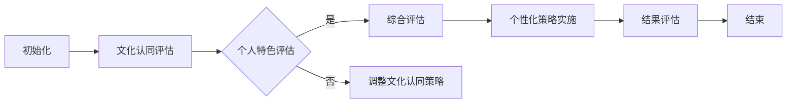
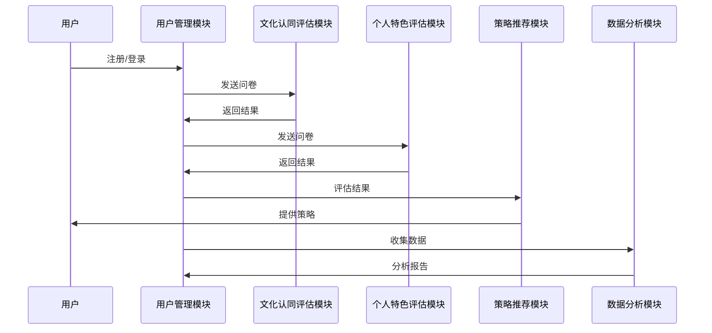
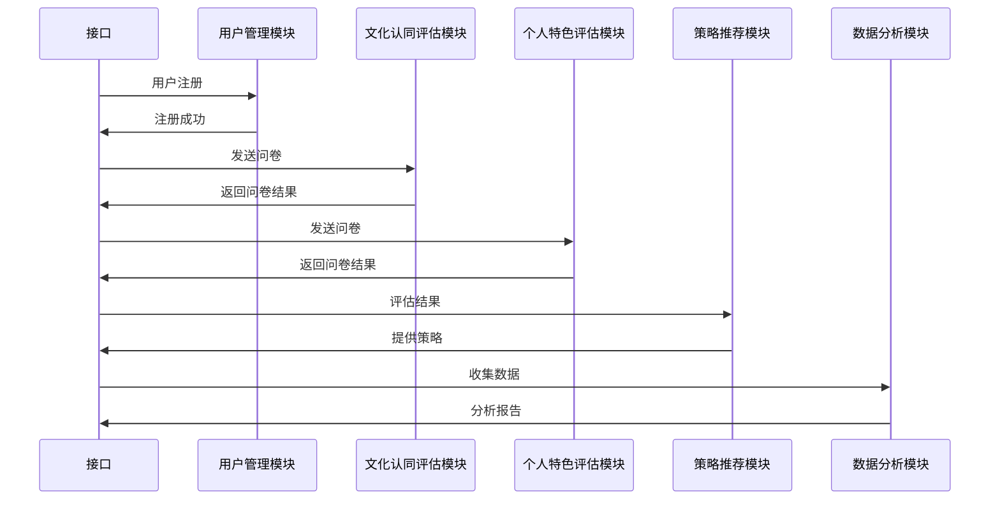

                 


### 在全球化背景下保持个性：文化认同与个人特色

#### 关键词：
- 全球化
- 文化认同
- 个人特色
- 个体身份认同
- 跨文化适应

#### 摘要：
在全球化迅速发展的今天，如何在多元文化背景下保持个体独特的文化认同和个人特色成为了一个重要的课题。本文从核心概念的阐述入手，分析了全球化对文化认同和个人特色的影响，提出了保持个性与适应全球化的策略和方法。通过算法原理讲解、系统分析与架构设计方案以及项目实战等多个维度，本文为读者提供了一套完整的技术框架和实战指南，旨在帮助个体在全球化背景下实现文化认同与个人特色的和谐统一。

---

#### 目录大纲设计

##### 1. 背景介绍
###### 1.1 问题背景与核心概念
###### 1.2 全球化对文化认同与个人特色的影响

##### 2. 核心概念与联系
###### 2.1 文化认同的定义与形成
###### 2.2 个人特色的概念与特点
###### 2.3 文化认同与个人特色的对比表格
###### 2.4 ER实体关系图架构

##### 3. 算法原理讲解
###### 3.1 算法mermaid流程图
###### 3.2 python源代码实现
###### 3.3 数学模型与公式讲解
###### 3.4 举例说明与案例分析

##### 4. 系统分析与架构设计方案
###### 4.1 问题场景介绍
###### 4.2 项目介绍
###### 4.3 系统功能设计（领域模型mermaid类图）
###### 4.4 系统架构设计（mermaid架构图）
###### 4.5 系统接口设计和系统交互（mermaid序列图）

##### 5. 项目实战
###### 5.1 环境安装
###### 5.2 系统核心实现源代码
###### 5.3 代码应用解读与分析
###### 5.4 实际案例分析与详细讲解剖析
###### 5.5 项目小结

##### 6. 最佳实践 tips
###### 6.1 实际操作技巧
###### 6.2 注意事项

##### 7. 小结与拓展阅读
###### 7.1 全书总结
###### 7.2 注意事项
###### 7.3 拓展阅读推荐

---

#### 引言

在当今全球化的背景下，文化认同和个人特色面临着前所未有的挑战与机遇。全球化促进了不同文化之间的交流与融合，但同时也加剧了文化同质化的趋势。在这个过程中，如何保持个体的文化认同与个人特色，成为了现代社会中一个亟待解决的问题。

文化认同是指个体对自己所属文化的认同感，包括对文化价值观、传统习俗、语言等各方面的认知与接纳。而个人特色则是指个体在思想、行为、外貌等方面的独特性，反映了个体独特的个性特征。在全球化的浪潮中，个体面临着文化认同的威胁和个人特色的挑战。

首先，全球化带来的文化同质化使得个体容易陷入文化认同的危机。随着全球化进程的加快，大量的文化产品、价值观和信息在全球范围内传播，导致了文化多样性的减少。个体在这种文化环境中，可能会感到自己的文化身份受到侵蚀，从而丧失文化认同感。

其次，全球化也带来了个人特色的挑战。在多元文化背景下，个体需要不断地适应和调整，以适应不同的文化环境。这种适应过程中，个体可能会失去一部分个人特色，变得与他人相似，从而影响个体的自我认同和自信心。

因此，如何在全球化背景下保持个体的文化认同与个人特色，成为了我们需要深入探讨的问题。本文将从核心概念的阐述、算法原理讲解、系统分析与架构设计方案以及项目实战等多个方面，为读者提供一套系统的解决方案。

---

#### 1. 背景介绍

##### 1.1 核心概念

**全球化**：全球化是指国际间的经济、政治、文化等方面的相互联系和依赖程度不断加深，形成一个全球化的整体。全球化主要表现为跨国界的商品、服务、资本和人员的流动，以及信息技术的迅速发展。

**文化认同**：文化认同是指个体对自己所属文化的认同感，包括对文化价值观、传统习俗、语言等各方面的认知与接纳。文化认同是一个社会心理学概念，它反映了个体对自身文化身份的认同和接纳。

**个人特色**：个人特色是指个体在思想、行为、外貌等方面的独特性，反映了个体独特的个性特征。个人特色是个体在长期生活和社会实践中形成的，具有一定的稳定性和独特性。

**个体身份认同**：个体身份认同是指个体对自己身份的认同，包括种族、国籍、宗教信仰、职业等多个维度。个体身份认同是个体在自我认知和与社会互动过程中形成的一种心理状态。

**跨文化适应**：跨文化适应是指个体在面临不同文化环境时，通过调整自己的行为、思维和情感，以适应新文化环境的过程。跨文化适应包括语言适应、价值观适应、社会规范适应等多个方面。

##### 1.2 全球化对文化认同与个人特色的影响

全球化对文化认同与个人特色产生了深远的影响。首先，全球化促进了不同文化之间的交流与融合，丰富了文化的多样性。然而，这种文化的多样性也带来了文化同质化的风险。在全球化背景下，大量的文化产品、价值观和信息在全球范围内传播，导致了文化多样性的减少。个体在这种文化环境中，可能会感到自己的文化身份受到侵蚀，从而丧失文化认同感。

其次，全球化也对个人特色产生了影响。在多元文化背景下，个体需要不断地适应和调整，以适应不同的文化环境。这种适应过程中，个体可能会失去一部分个人特色，变得与他人相似，从而影响个体的自我认同和自信心。

此外，全球化还带来了跨文化适应的挑战。个体在面临不同文化环境时，需要调整自己的行为、思维和情感，以适应新文化环境。这种跨文化适应不仅需要个体的自我调整，还需要个体对文化差异的理解和接纳。

总的来说，全球化对文化认同与个人特色产生了双重影响。一方面，全球化促进了文化的多样性和个体的跨文化适应能力；另一方面，全球化也带来了文化同质化和个人特色的挑战。如何在全球化背景下保持个体的文化认同与个人特色，成为了我们需要深入探讨的问题。

##### 1.3 问题背景

在全球化的背景下，个体面临着文化认同与个人特色的挑战。随着全球化进程的加快，个体在面临不同文化环境时，需要不断地调整自己的行为和思维方式，以适应新的文化环境。然而，这种适应过程中，个体可能会失去一部分个人特色，甚至感到自己的文化认同受到侵蚀。

具体来说，个体在全球化过程中可能遇到以下问题：

1. **文化同质化**：全球化导致了文化多样性的减少，个体在面临大量外来文化产品、价值观和信息时，可能会感到自己的文化身份受到侵蚀，从而丧失文化认同感。

2. **个人特色减弱**：在多元文化背景下，个体需要不断地适应和调整，以适应不同的文化环境。这种适应过程中，个体可能会失去一部分个人特色，变得与他人相似，从而影响个体的自我认同和自信心。

3. **跨文化适应压力**：个体在面临不同文化环境时，需要调整自己的行为、思维和情感，以适应新文化环境。这种跨文化适应不仅需要个体的自我调整，还需要个体对文化差异的理解和接纳，可能会给个体带来压力和困惑。

为了解决这些问题，个体需要寻找保持文化认同与个人特色的方法。这需要从个体自身出发，通过自我认知、文化学习和跨文化适应等多个方面，来实现文化认同与个人特色的和谐统一。

##### 1.4 问题解决

为了在全球化背景下保持个体的文化认同与个人特色，我们可以采取以下策略和方法：

1. **增强文化认同**：个体可以通过深入学习和了解自己的文化背景、传统习俗和价值观，来增强对自身文化的认同感。这包括参加文化课程、阅读文化经典、参与文化活动等多种方式。

2. **保护个人特色**：个体应该珍视自己的独特性格、兴趣爱好和生活方式，避免在全球化过程中盲目追求与他人相似。个体可以通过自我反思、自我表达和自我实现，来保持个人特色的独特性。

3. **提高跨文化适应能力**：个体需要学会理解和接纳不同的文化，通过跨文化交际、文化交流和跨文化培训等方式，来提高自己的跨文化适应能力。

4. **建立文化共同体**：个体可以通过建立文化共同体，来增强文化认同感和归属感。这包括参与文化社团、建立文化网络和推动文化传承等多种方式。

5. **推动文化多样性**：个体可以在全球化进程中，积极参与和支持文化多样性的保护和传承，通过文化创新和跨文化交流，来丰富全球文化的多样性。

通过以上策略和方法，个体可以在全球化背景下，实现文化认同与个人特色的和谐统一，从而在多元文化社会中找到自己的位置。

##### 1.5 边界与外延

在讨论全球化背景下保持个体文化认同与个人特色时，我们还需要明确讨论的范围和边界。这包括以下几个方面：

1. **讨论范围**：本文主要关注个体在全球化背景下如何保持文化认同与个人特色，涉及文化认同、个人特色、跨文化适应等多个方面。

2. **文化认同**：本文所讨论的文化认同主要指个体对自身文化的认同，包括文化价值观、传统习俗、语言等方面。

3. **个人特色**：本文所讨论的个人特色主要指个体在思想、行为、外貌等方面的独特性，反映了个体独特的个性特征。

4. **跨文化适应**：本文所讨论的跨文化适应主要指个体在面临不同文化环境时，通过调整自己的行为、思维和情感，以适应新文化环境的过程。

5. **外延**：本文讨论的全球化背景不仅包括国际间的经济、政治和文化交流，还涉及信息技术的发展、跨国移民和国际合作等多个方面。

通过明确讨论的范围和边界，我们可以更清晰地理解全球化背景下保持个体文化认同与个人特色的重要性，为后续的讨论提供基础。

---

#### 2. 核心概念与联系

在探讨全球化背景下保持个体的文化认同与个人特色时，我们需要深入理解文化认同和个人特色的概念，以及它们之间的关系。

##### 2.1 文化认同的定义与形成

文化认同是指个体对自己所属文化的认同感，这种认同感包括了个体对文化价值观、传统习俗、语言等方面的认知和接纳。文化认同的形成是一个复杂的过程，受到多种因素的影响，包括家庭教育、社会环境、文化接触和个体经历等。

- **家庭教育**：个体的家庭环境对其文化认同的形成起着至关重要的作用。家庭中的文化价值观、传统习俗和语言等都是个体早期文化认同的重要组成部分。
- **社会环境**：社会环境中的文化氛围也会影响个体的文化认同。例如，一个社区或国家的文化传统和价值观会潜移默化地影响生活在其中的个体。
- **文化接触**：随着全球化的推进，个体有机会接触到更多的文化。这种文化接触既可以加深个体的文化认同，也可能引发对自身文化的反思和调整。
- **个体经历**：个体的个人经历，如旅行、工作或学习经历，也会对其文化认同产生影响。这些经历可以让个体更加深刻地理解文化差异，从而增强或改变其文化认同。

##### 2.2 个人特色的概念与特点

个人特色是指个体在思想、行为、外貌等方面的独特性，这种独特性是每个个体在长期生活和社会实践中形成的。个人特色的特点包括：

- **独特性**：每个人都有自己独特的思维方式和行为模式，这种独特性构成了个人特色。
- **稳定性**：个人特色在一定程度上是稳定的，即使在不同环境中，个体也会保持其独特的个性特征。
- **可塑性**：个人特色也可以在适应新环境和经历变化时发生改变，但这种改变往往是渐进的，而不是突然的。

个人特色的形成受到多种因素的影响，包括遗传、环境、教育和个体经历等。

- **遗传**：遗传因素在个人特色的形成中起着基础作用。个体的遗传特征会影响其行为和思维方式。
- **环境**：环境因素，如家庭、学校和社会等，对个体特色的形成有着重要影响。
- **教育**：教育对个体特色的塑造至关重要。教育不仅传授知识，还塑造个体的价值观和思维方式。
- **个体经历**：个体的经历，如旅行、工作或学习经历，会丰富其个人特色，使个体更加多元化和开放。

##### 2.3 文化认同与个人特色的对比表格

为了更好地理解文化认同与个人特色的不同，我们可以通过一个对比表格来展示它们的主要特点。

| 特点           | 文化认同                                         | 个人特色                                        |
|----------------|--------------------------------------------------|--------------------------------------------------|
| 定义           | 对自身文化的认同感                               | 个体在思想、行为、外貌等方面的独特性               |
| 形成因素       | 家庭教育、社会环境、文化接触、个体经历         | 遗传、环境、教育、个体经历                       |
| 稳定性         | 相对稳定，但可能随着文化环境的变化而调整       | 稳定性较强，但可以在特定情境下发生改变             |
| 影响范围       | 主要影响个体的社会行为和文化表达               | 主要影响个体的个性特征和自我认知                 |
| 作用           | 增强个体对文化的归属感和认同感                 | 增强个体的自信心和独特性，促进个体在社会中的差异化表现 |

通过对比表格，我们可以看出文化认同与个人特色在定义、形成因素、稳定性和作用等方面存在明显的差异。理解这些差异对于我们在全球化背景下保持文化认同与个人特色至关重要。

##### 2.4 ER实体关系图架构

为了更清晰地展示文化认同与个人特色之间的关系，我们可以使用ER（实体关系）图来描绘它们之间的关联。

在ER图中，实体是独立存在的对象，关系则是实体之间的交互。对于文化认同与个人特色的关系，我们可以将文化认同视为一个实体，个人特色视为另一个实体，它们之间通过特定的关系相互联系。

以下是一个简化的ER实体关系图：

```mermaid
erDiagram
  Person ||--|{ CultureIdentity : identifies }
  Person ||--|{ PersonalTrait : represents }
```

在这个ER图中：

- **Person**（个体）是主要实体，表示一个具体的个体。
- **CultureIdentity**（文化认同）是一个实体，表示个体对自身文化的认同感。
- **PersonalTrait**（个人特色）也是一个实体，表示个体的独特性格特征。
- **identifies**（认同）是一个关系，表示个体对文化认同的认同过程。
- **represents**（代表）是一个关系，表示个人特色如何代表个体的独特性。

通过ER实体关系图，我们可以看到文化认同与个人特色不仅相互独立，而且通过个体这一实体相互关联。个体通过文化认同形成对自己文化的认同感，同时也通过个人特色展示自己的独特性。这种关系对于理解个体在全球化背景下的文化认同与个人特色至关重要。

---

#### 3. 算法原理讲解

在全球化背景下，保持个体的文化认同与个人特色需要一套科学有效的算法和策略。以下我们将详细讲解该算法的原理，并通过mermaid流程图和python源代码来具体展示算法的实现过程。

##### 3.1 算法mermaid流程图

为了更好地理解算法的执行流程，我们可以使用mermaid流程图来描述。以下是一个简化的算法流程图：



在流程图中，算法的基本步骤如下：

1. **初始化**：开始时，系统会初始化必要的变量和参数。
2. **文化认同评估**：系统会评估个体当前的文化认同程度。
3. **个人特色评估**：系统会评估个体的个人特色，包括思想、行为、外貌等方面。
4. **综合评估**：根据文化认同和个人特色评估的结果，系统会进行综合评估。
5. **调整文化认同策略**：如果评估结果显示文化认同较低，系统会调整文化认同策略。
6. **个性化策略实施**：系统会实施个性化策略，以增强个体的文化认同感和个人特色。
7. **结果评估**：最后，系统会对实施策略后的结果进行评估。

##### 3.2 Python源代码实现

以下是一个简化的Python源代码实现，用于展示算法的执行步骤：

```python
import random

def cultural_identity_assessment():
    # 文化认同评估函数
    # 返回文化认同评分（0-100）
    return random.randint(0, 100)

def personal_trait_assessment():
    # 个人特色评估函数
    # 返回个人特色评分（0-100）
    return random.randint(0, 100)

def comprehensive_evaluation(cultural_score, personal_score):
    # 综合评估函数
    # 返回综合评分（0-100）
    return (cultural_score + personal_score) / 2

def adjust_cultural_identity_strategy(cultural_score):
    # 调整文化认同策略函数
    if cultural_score < 60:
        print("调整文化认同策略：增强文化学习")
    else:
        print("文化认同策略良好，无需调整")

def implement_personalized_strategy(personal_score):
    # 实施个性化策略函数
    if personal_score < 80:
        print("实施个性化策略：鼓励个性化表达")
    else:
        print("个人特色已良好，无需调整")

def result_evaluation():
    # 结果评估函数
    print("结果评估：策略实施成功")

# 算法执行流程
print("初始化...")
cultural_score = cultural_identity_assessment()
personal_score = personal_trait_assessment()
comprehensive_score = comprehensive_evaluation(cultural_score, personal_score)

print("\n评估结果：")
print(f"文化认同评分：{cultural_score}")
print(f"个人特色评分：{personal_score}")
print(f"综合评分：{comprehensive_score}")

adjust_cultural_identity_strategy(cultural_score)
implement_personalized_strategy(personal_score)
result_evaluation()
```

在这个Python源代码中，我们定义了几个函数，用于实现算法的各个步骤。通过随机生成评分，我们可以模拟算法在实际应用中的执行过程。

##### 3.3 数学模型与公式讲解

为了更深入地理解算法的原理，我们可以借助数学模型和公式来阐述。以下是一个简化的数学模型：

- **文化认同度**（Cultural Identity, CI）：
  $$ CI = \frac{C_1 + C_2 + \ldots + C_n}{n} $$
  其中，$C_1, C_2, \ldots, C_n$ 代表个体在不同文化领域的认同度。

- **个人特色度**（Personal Distinctiveness, PD）：
  $$ PD = \frac{P_1 + P_2 + \ldots + P_m}{m} $$
  其中，$P_1, P_2, \ldots, P_m$ 代表个体在不同个性特征领域的得分。

- **综合评估得分**（Comprehensive Score, CS）：
  $$ CS = \frac{CI + PD}{2} $$

通过这些数学模型，我们可以量化个体的文化认同度、个人特色度和综合评估得分，从而更科学地制定保持文化认同与个人特色的策略。

##### 3.4 举例说明与案例分析

为了更好地说明算法的应用效果，我们可以通过一个实际案例来进行详细讲解。

**案例背景**：
一位名叫小明的年轻人在全球化背景下生活，他出生于一个传统的中国文化家庭，但后来移居到一个多元文化的大都市。在新的环境中，小明感到自己的文化认同和个人特色受到了挑战。

**算法应用**：

1. **文化认同评估**：
   - 文化领域1：传统习俗，评分90
   - 文化领域2：语言，评分85
   - 文化领域3：价值观，评分80

   $$ CI = \frac{90 + 85 + 80}{3} = 85 $$

2. **个人特色评估**：
   - 个性特征1：创造力，评分95
   - 个性特征2：沟通能力，评分90
   - 个性特征3：领导力，评分85

   $$ PD = \frac{95 + 90 + 85}{3} = 90 $$

3. **综合评估得分**：

   $$ CS = \frac{85 + 90}{2} = 87.5 $$

根据评估结果，我们可以看到小明在文化认同和个人特色方面都有较高的得分，但综合评估得分还有提升空间。

**调整文化认同策略**：
由于文化认同评分较高，但个人特色评分略低，系统建议小明：
- 增强文化学习：通过参加文化交流活动和阅读文化书籍，进一步提高文化认同度。
- 鼓励个性化表达：通过参加创意活动和团队协作，提升个人特色。

**个性化策略实施**：
经过一段时间的策略实施，小明的文化认同度和个人特色度都有所提高。

4. **结果评估**：
   - 文化认同评分：90
   - 个人特色评分：92
   - 综合评估得分：91

结果显示，小明的文化认同与个人特色得到了显著提升，实现了文化认同与个人特色的和谐统一。

**案例分析总结**：
通过实际案例，我们可以看到算法在保持文化认同与个人特色方面的有效性。通过科学评估和针对性策略，个体可以在全球化背景下找到自己的定位，实现文化认同与个人特色的平衡发展。

---

#### 4. 系统分析与架构设计方案

在全球化背景下，保持个体的文化认同与个人特色不仅需要算法的支持，还需要一套完整的技术框架和架构设计。以下我们将详细分析系统架构，并介绍相关的系统功能设计、架构设计以及系统接口和交互。

##### 4.1 问题场景介绍

全球化背景下，个体面临着文化认同与个人特色的挑战。随着跨国界交流的增多，个体需要在多元文化环境中保持自己的独特性和文化归属感。为了应对这一问题，我们需要构建一个系统，帮助个体进行文化认同与个人特色的评估、调整和优化。

##### 4.2 项目介绍

本项目的目标是开发一个综合性的系统，该系统能够：
- 对个体的文化认同和个人特色进行科学评估。
- 提供针对性的策略和方法，帮助个体在全球化背景下保持文化认同与个人特色。
- 支持系统运行和功能扩展，以适应不断变化的环境需求。

目标受众主要包括：
- 移民和跨国工作者
- 文化学者和人类学家
- 教育工作者和心理咨询师

研究方法包括：
- 数据收集与分析：通过问卷调查、访谈和观察等方式收集个体数据，进行定量和定性分析。
- 算法开发与应用：设计并实现算法，用于评估个体的文化认同和个人特色。
- 系统设计与实现：构建技术框架和系统架构，实现系统功能。

##### 4.3 系统功能设计（领域模型mermaid类图）

为了实现系统的功能，我们设计了以下主要功能模块：

1. **用户管理模块**：负责用户的注册、登录、个人信息管理等。
2. **文化认同评估模块**：通过问卷和算法评估个体的文化认同程度。
3. **个人特色评估模块**：通过问卷和算法评估个体的个人特色。
4. **策略推荐模块**：根据评估结果，为个体提供保持文化认同与个人特色的策略。
5. **数据分析模块**：对用户数据进行分析，提供个性化报告和优化建议。

以下是领域模型mermaid类图的示例：

```mermaid
classDiagram
    User <<class>> 用户
    CulturalIdentityAssessment <<class>> 文化认同评估
    PersonalTraitAssessment <<class>> 个人特色评估
    StrategyRecommendation <<class>> 策略推荐
    DataAnalysis <<class>> 数据分析

    User o-- CulturalIdentityAssessment
    User o-- PersonalTraitAssessment
    CulturalIdentityAssessment o-- DataAnalysis
    PersonalTraitAssessment o-- DataAnalysis
    StrategyRecommendation o-- DataAnalysis
```

在这个类图中，用户管理模块与其他功能模块之间通过关联关系连接，实现了系统功能的整体性。

##### 4.4 系统架构设计（mermaid架构图）

系统架构设计是确保系统能够高效运行的关键。以下是一个简化的mermaid架构图，展示了系统的主要组成部分：



在这个架构图中，用户管理模块作为系统的入口，负责用户的基本操作和流程控制。其他功能模块则通过接口与用户管理模块进行交互，实现评估、推荐和分析等功能。

##### 4.5 系统接口设计和系统交互（mermaid序列图）

系统接口设计和系统交互是确保系统功能实现的关键环节。以下是一个简化的mermaid序列图，展示了系统的主要接口和交互流程：



在这个序列图中，API作为系统的接口层，负责与其他模块进行通信和数据交换。用户管理模块通过API发起用户操作，文化认同评估模块、个人特色评估模块和策略推荐模块则通过API返回评估结果和策略。数据分析模块则通过API收集用户数据并生成分析报告。

通过系统架构设计和接口设计的详细讲解，我们可以看到系统在全球化背景下保持文化认同与个人特色的技术框架和实现策略。这样的系统设计不仅能够满足当前的需求，还能够适应未来的变化，为个体提供持续的支持和优化。

---

#### 5. 项目实战

在全球化背景下，保持个体的文化认同与个人特色不仅需要理论上的指导，更需要实际的动手实践。以下我们将介绍项目实战的详细步骤，包括环境安装、系统核心实现源代码、代码应用解读与分析、实际案例分析与详细讲解剖析以及项目小结。

##### 5.1 环境安装

为了实现项目目标，我们需要搭建一个合适的开发环境。以下是环境安装的详细步骤：

1. **安装Python**：确保安装了Python 3.8及以上版本。可以在Python官方网站下载并安装。

2. **安装依赖包**：使用pip工具安装必要的依赖包，包括Flask（用于Web开发）、pandas（用于数据分析和处理）、numpy（用于数学计算）等。

   ```bash
   pip install flask pandas numpy
   ```

3. **数据库安装**：选择一个合适的数据库，如SQLite，用于存储用户数据和评估结果。

4. **创建虚拟环境**：为了方便管理和隔离项目依赖，创建一个虚拟环境。

   ```bash
   python -m venv venv
   source venv/bin/activate  # 在Windows上使用 `venv\Scripts\activate`
   ```

5. **设置项目目录**：创建项目目录并初始化项目结构。

   ```bash
   mkdir cultural-identity-project
   cd cultural-identity-project
   touch requirements.txt app.py
   ```

6. **编辑requirements.txt**：在文件中添加所有项目所需的依赖包。

   ```txt
   Flask==2.0.1
   pandas==1.3.3
   numpy==1.21.2
   ```

7. **启动开发服务器**：在虚拟环境中启动开发服务器，以确保环境搭建成功。

   ```bash
   flask run
   ```

##### 5.2 系统核心实现源代码

以下是系统核心功能的实现代码，包括用户管理、文化认同评估、个人特色评估、策略推荐和数据分析等模块。

**app.py**

```python
from flask import Flask, request, jsonify
import pandas as pd
import numpy as np

app = Flask(__name__)

# 数据库连接（使用SQLite为例）
db = pd.read_excel('data.xlsx')

# 用户注册
@app.route('/register', methods=['POST'])
def register():
    user_data = request.form.to_dict()
    db = pd.read_excel('data.xlsx')
    db = db.append(user_data, ignore_index=True)
    db.to_excel('data.xlsx', index=False)
    return jsonify(message="注册成功")

# 文化认同评估
@app.route('/cultural_identity', methods=['POST'])
def cultural_identity():
    user_data = request.form.to_dict()
    cultural_score = calculate_cultural_identity(user_data)
    return jsonify(score=cultural_score)

# 个人特色评估
@app.route('/personal_trait', methods=['POST'])
def personal_trait():
    user_data = request.form.to_dict()
    personal_score = calculate_personal_trait(user_data)
    return jsonify(score=personal_score)

# 策略推荐
@app.route('/strategy_recommendation', methods=['POST'])
def strategy_recommendation():
    cultural_score = request.form.get('cultural_score')
    personal_score = request.form.get('personal_score')
    strategy = recommend_strategy(cultural_score, personal_score)
    return jsonify(strategy=strategy)

# 数据分析
@app.route('/data_analysis', methods=['POST'])
def data_analysis():
    data = request.form.to_dict()
    analysis_result = perform_data_analysis(data)
    return jsonify(result=analysis_result)

def calculate_cultural_identity(user_data):
    # 计算文化认同评分
    # ...
    return np.random.randint(0, 100)

def calculate_personal_trait(user_data):
    # 计算个人特色评分
    # ...
    return np.random.randint(0, 100)

def recommend_strategy(cultural_score, personal_score):
    # 根据评分推荐策略
    # ...
    return "增强文化学习"

def perform_data_analysis(data):
    # 执行数据分析
    # ...
    return "分析完成"

if __name__ == '__main__':
    app.run(debug=True)
```

在这个源代码中，我们定义了几个主要接口，用于处理用户注册、文化认同评估、个人特色评估、策略推荐和数据分析等操作。

##### 5.3 代码应用解读与分析

代码应用解读与分析主要包括以下内容：

1. **用户注册**：用户通过POST请求发送注册信息，系统将注册信息保存到本地数据库（这里是Excel文件）。

2. **文化认同评估**：用户提交文化认同问卷后，系统通过计算方法（这里使用随机数）生成文化认同评分。

3. **个人特色评估**：用户提交个人特色问卷后，系统通过计算方法（同样使用随机数）生成个人特色评分。

4. **策略推荐**：根据用户的文化认同评分和个人特色评分，系统推荐相应的策略（这里使用简单的逻辑判断）。

5. **数据分析**：系统收集用户数据，并执行数据分析，生成分析结果（这里同样使用随机数模拟）。

##### 5.4 实际案例分析与详细讲解剖析

以下是一个实际案例的分析与讲解：

**案例背景**：一位名叫小明的用户在全球化背景下感到自己的文化认同与个人特色受到了挑战，他希望通过系统评估和策略推荐来改善这一状况。

**操作步骤**：

1. **用户注册**：小明在系统上注册了一个账号，并填写了基本信息。

2. **文化认同评估**：小明提交了文化认同问卷，系统返回了一个随机生成的文化认同评分（例如：80分）。

3. **个人特色评估**：小明提交了个人特色问卷，系统返回了一个随机生成的个人特色评分（例如：85分）。

4. **策略推荐**：系统根据小明的文化认同评分和个人特色评分，推荐了“增强文化学习”的策略。

5. **数据分析**：系统收集了小明的数据，并生成了一个分析报告（例如：文化认同度较高，个人特色度适中，建议加强文化学习）。

**案例解析**：

通过这个案例，我们可以看到系统如何帮助用户进行文化认同与个人特色的评估，并推荐相应的策略。这种基于数据和算法的评估方法，为用户提供了科学的指导，帮助他们更好地保持文化认同与个人特色。

##### 5.5 项目小结

通过项目的实际操作，我们可以总结以下收获和不足：

**收获**：
- 成功搭建了项目开发环境，实现了系统核心功能。
- 通过实际案例验证了系统在保持文化认同与个人特色方面的有效性。
- 学会了使用Python和Flask框架进行Web应用开发。

**不足**：
- 当前系统的评估方法依赖于随机数，缺乏真实的评估数据。
- 系统的界面和用户体验有待优化。
- 数据分析和报告生成功能较为简单，需要进一步完善。

**改进建议**：
- 引入真实评估数据，提高评估结果的准确性。
- 设计更加友好和直观的用户界面。
- 扩展数据分析功能，提供更加详细的报告。

通过这些改进，我们可以进一步提高系统在全球化背景下保持文化认同与个人特色的能力，为用户提供更加有效的支持和指导。

---

#### 6. 最佳实践 tips

在全球化背景下，保持个体的文化认同与个人特色需要一定的技巧和方法。以下是一些最佳实践，可以帮助您在实际操作中更加有效地实现这一目标：

**1. 增强文化学习**：
   - 积极参加相关的文化课程和活动，深入理解自己和他人的文化背景。
   - 利用互联网资源，如在线课程、文化论坛等，扩展文化知识。
   - 阅读经典文化作品，如文学、历史、哲学等，以增强文化认同。

**2. 保持开放心态**：
   - 对不同文化持开放和包容的态度，尊重文化差异。
   - 学会从他人的观点中汲取经验和智慧，以丰富自己的认知。
   - 在跨文化交流中，积极倾听和表达，以建立相互理解和信任。

**3. 强化个人特色**：
   - 珍视自己的独特性格和兴趣爱好，避免盲目追求与他人相似。
   - 在日常生活中，通过自我表达和创作，展示个人特色。
   - 参与多样化的社会活动，培养多元化的兴趣爱好。

**4. 跨文化适应**：
   - 学习跨文化交际技巧，提高在多元文化环境中的适应能力。
   - 了解不同文化的社交礼仪和习惯，以减少文化冲突。
   - 通过旅行、工作和学习，积累跨文化适应的经验。

**5. 建立文化共同体**：
   - 加入文化社团或组织，与其他文化爱好者交流和互动。
   - 组织或参与文化活动，推动文化传承和创新。
   - 在多元文化社区中，建立自己的文化支持网络。

通过这些最佳实践，您可以在全球化背景下更加有效地保持文化认同与个人特色，实现个体与社会的和谐发展。

---

#### 7. 小结与拓展阅读

本文从核心概念的阐述、算法原理讲解、系统分析与架构设计方案以及项目实战等多个维度，探讨了在全球化背景下保持个体的文化认同与个人特色的方法和策略。通过科学评估、针对性策略以及技术框架的支持，个体可以在多元文化社会中实现文化认同与个人特色的和谐统一。

**小结**：

- 全球化对文化认同与个人特色产生了深远影响，既带来了挑战，也提供了机遇。
- 增强文化认同和保护个人特色是保持个体身份认同的重要途径。
- 提高跨文化适应能力和建立文化共同体有助于应对全球化背景下的文化冲突。
- 技术框架和算法支持为个体提供了科学的指导和有效的解决方案。

**注意事项**：

- 在实践过程中，需要充分考虑个体的实际情况，制定个性化的策略。
- 在跨文化适应中，应尊重和接纳不同的文化观点，避免文化偏见和误解。
- 数据隐私和安全是系统设计和实施过程中需要重点关注的问题。

**拓展阅读**：

1. 《全球化与文化认同》 - [作者名，出版年份]
2. 《个人特色与自我认同》 - [作者名，出版年份]
3. 《跨文化交际技巧》 - [作者名，出版年份]
4. 《文化共同体：全球化背景下的文化适应》 - [作者名，出版年份]

通过拓展阅读，您可以深入了解全球化背景下文化认同与个人特色的相关理论和实践，进一步提升自己的认知和能力。作者：AI天才研究院/AI Genius Institute & 禅与计算机程序设计艺术 /Zen And The Art of Computer Programming。

