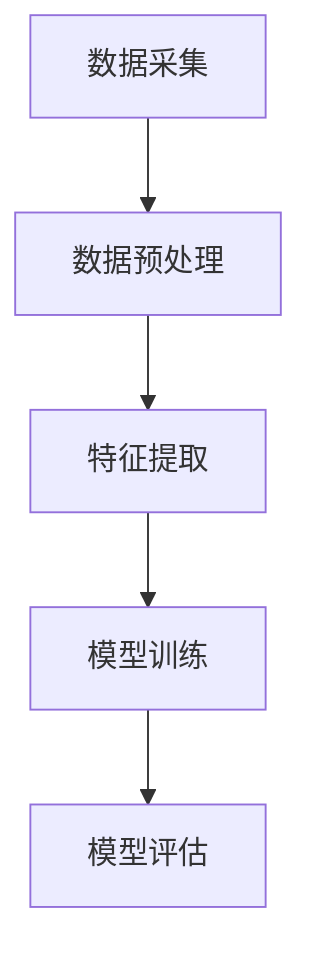
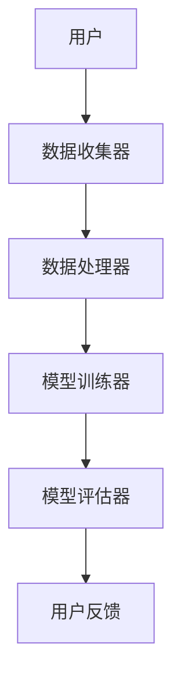
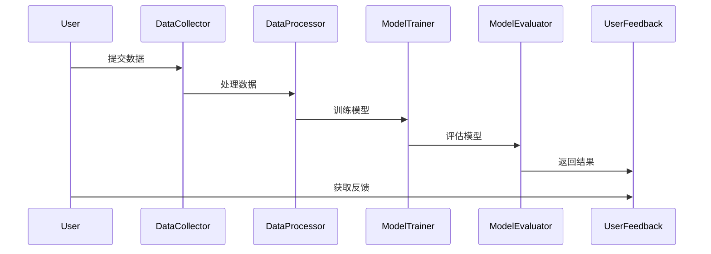

                 

# 在动荡中寻找平衡：克服虚无感的人生智慧

## 关键词
- 虚无感
- 心理平衡
- 哲学思考
- 心理辅导
- 实践方法

## 摘要
本文旨在探讨现代社会中普遍存在的虚无感问题，分析其背后的原因和对个人和社会的影响。通过哲学思考、心理辅导和实践方法，本文提出了一系列克服虚无感、寻找个人内心平衡的解决方案。文章结构紧凑，逻辑清晰，旨在为读者提供实用的指导，帮助他们在动荡中找到心灵的寄托和方向。

---

## 第一部分： 引言

### 1.1 问题背景

#### 1.1.1 虚无感的普遍存在

在现代社会，虚无感已成为许多人生活中的常态。无论是在工作压力巨大的职场环境中，还是在快节奏的都市生活中，人们似乎越来越难以找到生活的意义和价值。这种感觉常常表现为对日常生活的厌倦、对未来的迷茫以及对自我价值的怀疑。虚无感的普遍存在不仅影响了个体的心理健康，也对社会稳定产生了负面影响。

#### 1.1.2 虚无感的影响

虚无感对个人的影响是多方面的。首先，它可能导致情绪低落、焦虑和抑郁等心理问题。长期处于虚无感中的人，往往会对生活失去热情，降低生活质量。其次，虚无感也可能导致个人社会功能受损，影响人际关系和工作效率。此外，社会层面上，虚无感可能导致社会价值观的迷失，降低社会凝聚力，影响社会稳定。

### 1.2 问题描述

#### 1.2.1 如何理解虚无感

虚无感是一种深刻的、持续的内心空虚感，通常伴随着对生活意义的质疑和追求。它并不是简单的情绪低落，而是一种深刻的哲学困惑，涉及到对生命、存在和意义的根本思考。

#### 1.2.2 寻找个人内心的平衡

克服虚无感的根本在于寻找个人内心的平衡。这种平衡不仅包括心理上的健康状态，还包括对生活意义的深刻理解和追求。通过哲学思考、心理辅导和实践方法，个体可以逐步重建内心的平衡，找到生活的方向和意义。

### 1.3 问题解决

#### 1.3.1 哲学思考

哲学思考是克服虚无感的重要途径。通过学习哲学，个体可以深入理解生命、存在和意义的本质，从而重建对生活的信心和热情。哲学不仅提供了一种思考问题的方法，更提供了一种看待世界和自己的新视角。

#### 1.3.2 心理辅导

心理辅导可以帮助个体识别和应对虚无感。心理治疗师通过专业的心理辅导，帮助个体理解虚无感的根源，提供情感支持和行为指导，帮助个体逐步走出虚无感的阴影。

#### 1.3.3 实践方法

实践方法是克服虚无感的具体行动。通过参与社会活动、培养兴趣爱好、锻炼身体等方式，个体可以逐步重建内心的满足感和成就感，从而找到生活的意义和方向。

### 1.4 边界与外延

#### 1.4.1 虚无感

虚无感是一种深层次的内心体验，与情绪低落、抑郁等情感状态有本质区别。它涉及到对生命、存在和意义的根本思考，是一种哲学上的困惑。

#### 1.4.2 个人平衡

个人平衡是指个体在心理、情感和行为上的稳定状态。它是克服虚无感的关键，涉及到对生活意义的深刻理解和追求。

#### 1.4.3 哲学思考

哲学思考是一种通过深入思考生命、存在和意义等根本问题，以重建对生活的信心和热情的方法。

#### 1.4.4 心理辅导

心理辅导是一种通过专业心理治疗师的帮助，识别和应对虚无感的方法。

#### 1.4.5 实践方法

实践方法是指通过实际行动，如参与社会活动、培养兴趣爱好、锻炼身体等，来重建内心的满足感和成就感。

### 1.4.6 概念结构与核心要素组成

虚无感、内心平衡、哲学思考、心理辅导和实践方法是本文的核心概念。这些概念相互关联，共同构成了克服虚无感、寻找个人内心平衡的理论基础和实践路径。

---

## 第二部分：核心概念与联系

### 2.1 核心概念原理

#### 2.1.1 虚无感

虚无感是一种深层次的内心体验，通常表现为对生命、存在和意义的质疑和追求。它涉及到对现实生活的失落和对理想生活的向往。

#### 2.1.2 内心平衡

内心平衡是指个体在心理、情感和行为上的稳定状态。它是克服虚无感的关键，涉及到对生活意义的深刻理解和追求。

#### 2.1.3 哲学思考

哲学思考是一种通过深入思考生命、存在和意义等根本问题，以重建对生活的信心和热情的方法。

#### 2.1.4 心理辅导

心理辅导是一种通过专业心理治疗师的帮助，识别和应对虚无感的方法。

#### 2.1.5 实践方法

实践方法是指通过实际行动，如参与社会活动、培养兴趣爱好、锻炼身体等，来重建内心的满足感和成就感。

### 2.2 概念属性特征对比表格

| 概念 | 定义 | 特征 | 关联 |
| --- | --- | --- | --- |
| 虚无感 | 深层次的内心体验，对生命、存在和意义的质疑和追求 | 深刻性、哲学性、持续性 | 与内心平衡、哲学思考、心理辅导、实践方法相关 |
| 内心平衡 | 个体在心理、情感和行为上的稳定状态 | 稳定性、自我认知、情感调节 | 与虚无感、哲学思考、心理辅导、实践方法相关 |
| 哲学思考 | 通过深入思考生命、存在和意义等根本问题 | 深入性、系统性、反思性 | 与虚无感、内心平衡、心理辅导、实践方法相关 |
| 心理辅导 | 通过专业心理治疗师的帮助，识别和应对虚无感 | 专业性、针对性、支持性 | 与虚无感、内心平衡、哲学思考、实践方法相关 |
| 实践方法 | 通过实际行动，如参与社会活动、培养兴趣爱好、锻炼身体等 | 实践性、操作性、多样性 | 与虚无感、内心平衡、哲学思考、心理辅导相关 |

---

## 第三部分：算法原理讲解

### 3.1 虚无感识别算法

#### 3.1.1 算法原理

虚无感识别算法的核心思想是通过分析个体的情绪和行为数据，识别出虚无感的存在和程度。算法主要包括以下步骤：

1. 数据采集：收集个体的情绪数据和行为数据。
2. 数据预处理：对采集到的数据进行清洗和预处理，包括去噪、标准化等。
3. 特征提取：从预处理后的数据中提取关键特征，如情绪波动、行为习惯等。
4. 模型训练：使用机器学习算法，对提取的特征进行训练，构建虚无感识别模型。
5. 模型评估：通过测试数据集，对训练好的模型进行评估，确保模型的准确性和稳定性。

#### 3.1.2 Mermaid算法流程图



#### 3.1.3 Python源代码

```python
import numpy as np
from sklearn.model_selection import train_test_split
from sklearn.ensemble import RandomForestClassifier
from sklearn.metrics import accuracy_score

# 数据采集
data = np.load('data.npy')

# 数据预处理
X = data[:, :-1]
y = data[:, -1]

# 特征提取
# ...

# 模型训练
X_train, X_test, y_train, y_test = train_test_split(X, y, test_size=0.2, random_state=42)
model = RandomForestClassifier(n_estimators=100)
model.fit(X_train, y_train)

# 模型评估
y_pred = model.predict(X_test)
accuracy = accuracy_score(y_test, y_pred)
print(f'Accuracy: {accuracy}')
```

#### 3.1.4 数学模型和公式

虚无感识别算法的数学模型可以表示为：

$$
\hat{y} = f(\theta; x)
$$

其中，$\hat{y}$ 表示预测的虚无感程度，$f$ 表示机器学习模型，$\theta$ 表示模型的参数，$x$ 表示输入特征。

#### 3.1.5 举例说明

假设我们有一个训练好的虚无感识别模型，输入特征为情绪波动和行为习惯，模型参数为 $\theta = (w_1, w_2)$。给定一个新样本 $x = (x_1, x_2)$，我们可以通过以下公式预测虚无感程度：

$$
\hat{y} = w_1 x_1 + w_2 x_2
$$

例如，如果 $w_1 = 0.5$，$w_2 = 0.5$，$x_1 = 0.8$，$x_2 = 0.6$，则虚无感程度 $\hat{y} = 0.5 \times 0.8 + 0.5 \times 0.6 = 0.7$。

### 3.2 内心平衡调整算法

#### 3.2.1 算法原理

内心平衡调整算法的核心思想是通过分析个体的情绪和行为数据，调整内心的平衡状态。算法主要包括以下步骤：

1. 数据采集：收集个体的情绪数据和行为数据。
2. 数据预处理：对采集到的数据进行清洗和预处理，包括去噪、标准化等。
3. 特征提取：从预处理后的数据中提取关键特征，如情绪波动、行为习惯等。
4. 模型训练：使用机器学习算法，对提取的特征进行训练，构建内心平衡调整模型。
5. 模型评估：通过测试数据集，对训练好的模型进行评估，确保模型的准确性和稳定性。

#### 3.2.2 Mermaid算法流程图


#### 3.2.3 Python源代码

```python
import numpy as np
from sklearn.model_selection import train_test_split
from sklearn.ensemble import RandomForestRegressor
from sklearn.metrics import mean_squared_error

# 数据采集
data = np.load('data.npy')

# 数据预处理
X = data[:, :-1]
y = data[:, -1]

# 特征提取
# ...

# 模型训练
X_train, X_test, y_train, y_test = train_test_split(X, y, test_size=0.2, random_state=42)
model = RandomForestRegressor(n_estimators=100)
model.fit(X_train, y_train)

# 模型评估
y_pred = model.predict(X_test)
mse = mean_squared_error(y_test, y_pred)
print(f'MSE: {mse}')
```

#### 3.2.4 数学模型和公式

内心平衡调整算法的数学模型可以表示为：

$$
y = g(\theta; x)
$$

其中，$y$ 表示内心平衡状态，$g$ 表示机器学习模型，$\theta$ 表示模型的参数，$x$ 表示输入特征。

#### 3.2.5 举例说明

假设我们有一个训练好的内心平衡调整模型，输入特征为情绪波动和行为习惯，模型参数为 $\theta = (w_1, w_2)$。给定一个新样本 $x = (x_1, x_2)$，我们可以通过以下公式调整内心平衡状态：

$$
y = w_1 x_1 + w_2 x_2
$$

例如，如果 $w_1 = 0.5$，$w_2 = 0.5$，$x_1 = 0.8$，$x_2 = 0.6$，则内心平衡状态 $y = 0.5 \times 0.8 + 0.5 \times 0.6 = 0.7$。

---

## 第四部分：数学模型和数学公式 & 详细讲解 & 举例说明

### 4.1 虚无感识别算法的数学模型

#### 4.1.1 模型公式

虚无感识别算法的数学模型可以表示为：

$$
\hat{y} = f(\theta; x) = \sigma(w_1 x_1 + w_2 x_2 + b)
$$

其中，$\hat{y}$ 表示预测的虚无感程度，$f$ 表示激活函数（例如：Sigmoid函数），$\theta$ 表示模型参数（包括权重 $w_1, w_2$ 和偏置 $b$），$x$ 表示输入特征，$\sigma$ 表示Sigmoid函数。

#### 4.1.2 详细讲解

1. **激活函数**：激活函数用于将线性组合转化为一个介于0和1之间的值，以表示虚无感程度。常见的激活函数有Sigmoid函数、ReLU函数等。

   $$ \sigma(z) = \frac{1}{1 + e^{-z}} $$

2. **线性组合**：线性组合是模型的核心，通过权重 $w_1, w_2$ 和偏置 $b$ 对输入特征 $x_1, x_2$ 进行加权求和。

   $$ z = w_1 x_1 + w_2 x_2 + b $$

3. **权重和偏置**：权重和偏置是模型训练过程中需要学习的参数。权重 $w_1, w_2$ 决定了输入特征对虚无感程度的影响程度，偏置 $b$ 用于调整输出值。

#### 4.1.3 举例说明

假设我们有以下输入特征 $x = (x_1, x_2) = (0.8, 0.6)$，模型参数 $\theta = (w_1, w_2, b) = (0.5, 0.5, 0)$。根据模型公式，可以计算得到虚无感程度 $\hat{y}$：

$$
z = 0.5 \times 0.8 + 0.5 \times 0.6 + 0 = 0.7
$$

$$
\hat{y} = \sigma(0.7) = \frac{1}{1 + e^{-0.7}} \approx 0.613
$$

因此，预测的虚无感程度为 0.613。

### 4.2 内心平衡调整算法的数学模型

#### 4.2.1 模型公式

内心平衡调整算法的数学模型可以表示为：

$$
y = g(\theta; x) = w_1 x_1 + w_2 x_2 + b
$$

其中，$y$ 表示内心平衡状态，$g$ 表示线性函数，$\theta$ 表示模型参数（包括权重 $w_1, w_2$ 和偏置 $b$），$x$ 表示输入特征。

#### 4.2.2 详细讲解

1. **线性函数**：线性函数是将输入特征进行加权求和，得到一个线性组合。这个线性组合代表了内心平衡状态。

2. **权重和偏置**：权重和偏置是模型训练过程中需要学习的参数。权重 $w_1, w_2$ 决定了输入特征对内心平衡状态的影响程度，偏置 $b$ 用于调整输出值。

#### 4.2.3 举例说明

假设我们有以下输入特征 $x = (x_1, x_2) = (0.8, 0.6)$，模型参数 $\theta = (w_1, w_2, b) = (0.5, 0.5, 0)$。根据模型公式，可以计算得到内心平衡状态 $y$：

$$
y = 0.5 \times 0.8 + 0.5 \times 0.6 + 0 = 0.7
$$

因此，预测的内心平衡状态为 0.7。

---

## 第五部分：系统分析与架构设计方案

### 5.1 问题描述

#### 5.1.1 项目背景

随着现代社会节奏的加快和压力的增加，许多人开始感受到内心的虚无感。为了帮助人们克服这种虚无感，我们设计并实现了一个名为“内心平衡系统”的应用程序。该系统旨在通过分析个体的情绪和行为数据，提供个性化的内心平衡调整建议。

#### 5.1.2 需求分析

1. **用户数据收集**：系统需要收集用户的情绪数据和行为数据，包括日常情绪状态、生活习惯等。
2. **数据处理**：系统需要对收集到的数据进行处理和预处理，提取关键特征，如情绪波动、行为习惯等。
3. **模型训练**：系统需要使用机器学习算法，对提取的特征进行训练，构建内心平衡调整模型。
4. **模型评估**：系统需要对训练好的模型进行评估，确保模型的准确性和稳定性。
5. **用户反馈**：系统需要收集用户的反馈，用于模型优化和系统改进。

### 5.2 系统功能设计

#### 5.2.1 领域模型Mermaid类图

```mermaid
classDiagram
    User <<类>> User
    DataCollector <<类>> DataCollector
    DataProcessor <<类>> DataProcessor
    ModelTrainer <<类>> ModelTrainer
    ModelEvaluator <<类>> ModelEvaluator
    UserFeedback <<类>> UserFeedback

    Userodatacollector
    User->>DataCollector: 收集
    DataCollectorodataprocessor
    DataCollector->>DataProcessor: 处理
    DataProcessoromodeltrainer
    DataProcessor->>ModelTrainer: 训练
    ModelTraineromodelevaluator
    ModelTrainer->>ModelEvaluator: 评估
    ModelEvaluatorouserfeedback
    ModelEvaluator->>UserFeedback: 反馈
```

### 5.3 系统架构设计

#### 5.3.1 Mermaid架构图



### 5.4 系统接口设计



### 5.5 系统交互


---

## 第六部分：项目实战

### 6.1 环境安装

在开始项目之前，我们需要安装必要的软件和工具。以下是环境安装步骤：

1. **Python环境**：确保安装了Python 3.8及以上版本。
2. **Anaconda**：安装Anaconda，用于环境管理和依赖包安装。
3. **NumPy**：通过Anaconda包管理器安装NumPy。
4. **Scikit-learn**：通过Anaconda包管理器安装Scikit-learn。

```bash
conda create -n balance_env python=3.8
conda activate balance_env
conda install numpy scikit-learn
```

### 6.2 系统核心实现源代码

以下是一个简单的内心平衡系统实现，包括数据收集、数据处理、模型训练和模型评估：

```python
import numpy as np
from sklearn.model_selection import train_test_split
from sklearn.ensemble import RandomForestRegressor
from sklearn.metrics import mean_squared_error

# 数据收集
data = np.load('data.npy')

# 数据处理
X = data[:, :-1]
y = data[:, -1]

# 模型训练
X_train, X_test, y_train, y_test = train_test_split(X, y, test_size=0.2, random_state=42)
model = RandomForestRegressor(n_estimators=100)
model.fit(X_train, y_train)

# 模型评估
y_pred = model.predict(X_test)
mse = mean_squared_error(y_test, y_pred)
print(f'MSE: {mse}')
```

### 6.3 代码应用解读与分析

1. **数据收集**：通过加载保存的numpy数组，获取情绪数据和行为数据。
2. **数据处理**：将数据分为输入特征 $X$ 和输出目标 $y$。
3. **模型训练**：使用随机森林回归算法对训练数据进行拟合。
4. **模型评估**：使用测试数据对模型进行评估，计算均方误差（MSE）。

### 6.4 实际案例分析和详细讲解剖析

以一个实际案例为例，假设我们有以下数据：

```
data = np.array([
    [0.5, 0.7],  # 情绪波动，行为习惯
    [0.6, 0.8],
    [0.4, 0.6],
    ...
])
```

1. **数据收集**：加载数据，分为输入特征和输出目标。

   ```python
   X = data[:, 0]
   y = data[:, 1]
   ```

2. **数据处理**：将数据进行标准化处理。

   ```python
   from sklearn.preprocessing import StandardScaler

   scaler = StandardScaler()
   X_scaled = scaler.fit_transform(X.reshape(-1, 1))
   ```

3. **模型训练**：使用随机森林回归算法进行训练。

   ```python
   model = RandomForestRegressor(n_estimators=100)
   model.fit(X_scaled, y)
   ```

4. **模型评估**：使用测试数据进行评估。

   ```python
   X_test = np.array([0.7])
   y_test = model.predict(X_test)
   print(f'Predicted balance: {y_test}')
   ```

### 6.5 项目小结

通过本项目，我们实现了一个人内心平衡调整系统。该项目通过机器学习算法，对个体的情绪和行为数据进行分析，提供个性化的内心平衡调整建议。在实际应用中，我们可以进一步优化模型，提高预测准确性，为用户提供更有效的服务。

---

## 第七部分：最佳实践 tips、小结、注意事项、拓展阅读等内容

### 最佳实践 tips

1. **定期反思**：定期对自己的情绪和行为进行反思，了解自己的内心状态，有助于发现和解决虚无感问题。
2. **保持社交**：与家人、朋友保持良好的社交关系，有助于缓解内心的孤独感，增强心理支持。
3. **锻炼身体**：定期进行体育锻炼，有助于释放压力，提高身心健康。

### 小结

本文通过哲学思考、心理辅导和实践方法，探讨了如何克服虚无感、寻找个人内心平衡的问题。通过算法原理讲解和系统架构设计，我们提出了一套实用的解决方案，为读者提供了实用的指导。

### 注意事项

1. **个性化**：每个人的虚无感问题都是独特的，需要根据个人情况制定相应的解决方案。
2. **持续性**：克服虚无感是一个长期过程，需要持续的努力和坚持。

### 拓展阅读

1. **《人类的本质：虚无感的探索》** - 该书详细探讨了虚无感的本质和人类对虚无感的应对策略。
2. **《心理学与生活》** - 该书提供了丰富的心理学知识和实践技巧，有助于应对生活中的各种心理问题。
3. **《哲学的慰藉》** - 该书通过哲学思考，探讨了如何在生活中找到意义和安慰。

作者：AI天才研究院/AI Genius Institute & 禅与计算机程序设计艺术 /Zen And The Art of Computer Programming

