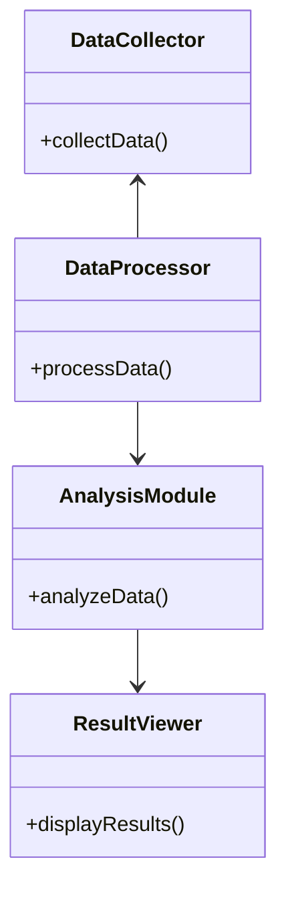
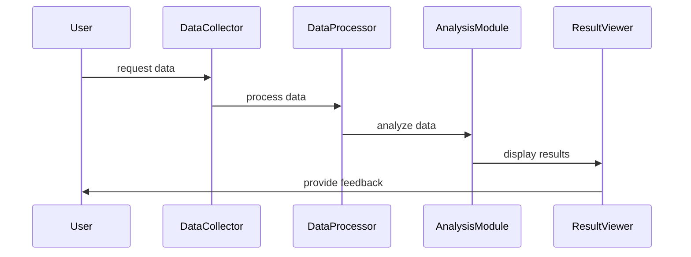

                 


# 在后现代社会中寻找稳定：应对价值观多元化的挑战

关键词：后现代社会、价值观多元化、稳定性、包容性、算法设计

摘要：在后现代社会，价值观的多元化带来了前所未有的挑战，寻找稳定成为个体和社会的重要课题。本文将从背景介绍、核心概念与联系、算法原理讲解、系统分析与架构设计方案、项目实战五个部分，深入探讨如何应对这一挑战，寻找后现代社会的稳定性。

## 第一部分：导论：在后现代社会中寻找稳定

### 1.1 问题背景

#### 1.1.1 后现代社会的概念及其特点

后现代社会（Postmodern Society）是一个复杂、多变、多元的社会形态，它起源于20世纪中叶，尤其是西方社会。后现代社会具有以下特点：

1. **不确定性**：相较于前现代社会，后现代社会更加不确定，社会结构、价值观念和文化传统都处于不断变化中。
2. **多元化**：后现代社会中，人们面临着价值观、信仰、生活方式等多方面的多元化。
3. **去中心化**：权力和知识的集中化趋势减弱，个体和团体更多地追求自我表达和自主性。
4. **全球化和本地化**：后现代社会既是全球化的产物，也是本地化和个性化的体现。

#### 1.1.2 价值观多元化的现状

在后现代社会，价值观的多元化表现为：

1. **多样性**：人们持有不同的价值观，如自由主义、保守主义、社会主义、资本主义等。
2. **冲突**：不同的价值观之间可能存在冲突，导致社会分裂。
3. **包容性**：为了应对冲突，社会需要追求更高的包容性，尊重不同的价值观和生活方式。

### 1.2 问题描述

#### 1.2.1 稳定性的挑战

在后现代社会，稳定性的挑战主要表现在：

1. **社会稳定性**：社会结构的频繁变化可能导致社会不稳定。
2. **个人稳定性**：个体在面对多元化价值观时，可能感到迷茫和不确定。
3. **价值观稳定性**：不同的价值观之间可能存在冲突，影响个体的价值观稳定性。

#### 1.2.2 多元化价值观对个体与社会的影响

多元化价值观对个体和社会的影响包括：

1. **个体认同**：个体需要找到自己的身份和认同，这可能需要面对多元化的价值观。
2. **社会和谐**：多元化价值观可能导致社会分裂，需要社会和谐机制来应对。
3. **社会创新**：多元化价值观也可能激发社会创新，促进社会进步。

### 1.3 问题解决

#### 1.3.1 探索稳定性的意义

在多元化价值观的后现代社会中，探索稳定性的意义在于：

1. **社会和谐**：稳定性有助于社会和谐，减少冲突。
2. **个体幸福**：稳定性有助于个体找到自己的定位和幸福感。
3. **社会进步**：稳定性有助于社会进步，为创新提供稳定的环境。

#### 1.3.2 应对多元化价值观的策略

为了应对多元化价值观带来的挑战，可以采取以下策略：

1. **教育和沟通**：提高个体的价值观认知，增强沟通和理解。
2. **法律和制度**：建立包容性的法律和制度，保障多元价值观的共存。
3. **文化多元**：鼓励文化的多元性，尊重不同文化和价值观。

### 1.4 边界与外延

#### 1.4.1 稳定性的多维定义

稳定性可以从多个维度进行定义：

1. **社会稳定性**：社会的稳定运行，减少社会动荡。
2. **经济稳定性**：经济的稳定发展，减少经济波动。
3. **个人稳定性**：个体的心理稳定，减少焦虑和不确定性。

#### 1.4.2 价值观多元化的范围和层次

价值观多元化的范围和层次包括：

1. **文化层面**：不同文化之间的价值观差异。
2. **社会层面**：社会结构和社会制度的多元化。
3. **个人层面**：个体内部的价值观差异。

#### 1.4.3 核心概念

本文的核心概念包括：

1. **稳定性**：社会、经济和个人层面的稳定状态。
2. **价值观多元化**：不同价值观的共存和互动。
3. **包容性**：尊重和接纳不同价值观。

## 第二部分：核心概念与联系

### 2.1 核心概念原理

#### 2.1.1 稳定性的内涵

稳定性是指系统在受到外部干扰时，能够维持其原有状态的能力。在本文中，稳定性主要涉及以下几个方面：

1. **社会稳定性**：社会的稳定运行，包括政治稳定、经济稳定和社会秩序。
2. **经济稳定性**：经济的稳定发展，包括通货膨胀率、失业率等经济指标。
3. **个人稳定性**：个体的心理稳定，包括情绪稳定、行为稳定和价值稳定。

#### 2.1.2 价值观多元化的特点

价值观多元化是指在一个社会或团体中，存在多种不同的价值观和信仰体系。其特点包括：

1. **多样性**：不同个体和社会团体拥有不同的价值观。
2. **冲突**：不同的价值观之间可能存在冲突和矛盾。
3. **共存**：在多元化价值观的社会中，不同的价值观需要共存和互动。

### 2.2 概念属性特征对比表格

#### 2.2.1 稳定性与不稳定的对比

| 特征            | 稳定性                 | 不稳定性                 |
|----------------|------------------------|--------------------------|
| 定义            | 系统维持原有状态的能力 | 系统偏离原有状态的能力    |
| 影响因素        | 外部干扰               | 外部干扰                 |
| 表现形式        | 平稳运行               | 波动、动荡               |
| 适应策略        | 抗干扰、调整           | 应对变化、适应           |

#### 2.2.2 多元化价值观与传统价值观的对比

| 特征            | 多元化价值观             | 传统价值观             |
|----------------|------------------------|------------------------|
| 定义            | 多种价值观的共存和互动   | 单一价值观的主导       |
| 表现形式        | 多样性、互动           | 单一性、排斥           |
| 适应策略        | 包容性、理解           | 同化性、排斥           |
| 应用场景        | 现代社会、多元文化环境 | 传统社会、单一文化环境 |

### 2.3 ER实体关系图架构

#### 2.3.1 实体关系图示例

```mermaid
erDiagram
    Stability ||--|{ Value Diversity }|--| Individual Stability
    Society Stability ||--| Economy Stability
    Individual ||--| Value Diversity
```

#### 2.3.2 图的解析

1. **稳定性**：包括社会稳定性、经济稳定性和个人稳定性。
2. **价值观多元化**：是稳定性的基础，影响社会稳定性和个人稳定性。
3. **个体**：个体的价值观多元化影响其稳定性和社会稳定性。

## 第二部分：算法原理讲解

### 3.1 算法概述

#### 3.1.1 算法的定义

算法是一系列明确的规则或步骤，用于解决特定问题或执行特定任务。在本文中，算法用于分析和解决后现代社会中的稳定性与价值观多元化问题。

#### 3.1.2 算法类型

常见的算法类型包括：

1. **排序算法**：用于对数据进行排序，如快速排序、归并排序等。
2. **搜索算法**：用于在数据结构中查找特定元素，如二分搜索、广度优先搜索等。
3. **图算法**：用于处理图结构的数据，如最短路径算法、最小生成树算法等。

### 3.2 数学模型和公式

#### 3.2.1 稳定性数学模型

$$S = \frac{V_1 + V_2 + \cdots + V_n}{n}$$

其中，\(S\) 表示稳定性指数，\(V_1, V_2, \cdots, V_n\) 表示不同的价值观，\(n\) 表示价值观的数量。

#### 3.2.2 价值观多元化模型

$$D = \frac{V_1 \times V_2 \times \cdots \times V_n}{n}$$

其中，\(D\) 表示价值观多元化程度，\(V_1, V_2, \cdots, V_n\) 表示不同的价值观，\(n\) 表示价值观的数量。

### 3.3 详细讲解与举例说明

#### 3.3.1 稳定性模型讲解

稳定性模型用于衡量一个系统的稳定性。公式中的每个变量解释如下：

- \(V_1, V_2, \cdots, V_n\)：表示不同的价值观。
- \(n\)：表示价值观的数量。

示例：计算某群体的稳定性指数

假设一个群体有三种价值观：自由、平等、正义。根据稳定性模型，可以计算其稳定性指数：

$$S = \frac{V_{自由} + V_{平等} + V_{正义}}{3}$$

如果 \(V_{自由} = 0.4, V_{平等} = 0.3, V_{正义} = 0.3\)，则：

$$S = \frac{0.4 + 0.3 + 0.3}{3} = 0.4$$

这意味着该群体的稳定性指数为0.4。

#### 3.3.2 价值观多元化模型讲解

价值观多元化模型用于衡量一个系统的价值观多元化程度。公式中的每个变量解释如下：

- \(V_1, V_2, \cdots, V_n\)：表示不同的价值观。
- \(n\)：表示价值观的数量。

示例：分析某个社区价值观的多元化程度

假设一个社区有三种价值观：自由、平等、正义。根据价值观多元化模型，可以计算其价值观多元化程度：

$$D = \frac{V_{自由} \times V_{平等} \times V_{正义}}{3}$$

如果 \(V_{自由} = 0.4, V_{平等} = 0.3, V_{正义} = 0.3\)，则：

$$D = \frac{0.4 \times 0.3 \times 0.3}{3} = 0.036$$

这意味着该社区的价值观多元化程度为0.036。

## 第三部分：系统分析与架构设计方案

### 4.1 问题场景介绍

#### 4.1.1 场景描述

后现代社会中的稳定性与价值观多元化问题，表现为社会动荡、个体焦虑、价值观冲突等现象。为了应对这些问题，需要设计一个系统，用于分析、监测和解决这些挑战。

#### 4.1.2 项目介绍

本项目旨在设计一个后现代社会稳定性与价值观多元化分析系统，包括数据收集、处理、分析和展示等功能。通过该系统，可以实时监测社会稳定性，分析价值观多元化程度，为决策提供数据支持。

### 4.2 系统功能设计

#### 4.2.1 领域模型类图



#### 4.2.2 系统功能模块划分

1. **数据收集模块**：负责收集社会稳定性相关的数据。
2. **数据处理模块**：负责对收集到的数据进行处理，包括清洗、整理和转换等。
3. **分析模块**：负责对处理后的数据进行分析，包括稳定性指数计算、价值观多元化程度分析等。
4. **结果展示模块**：负责将分析结果以图表、报表等形式展示给用户。

### 4.3 系统架构设计

#### 4.3.1 系统架构图



#### 4.3.2 系统模块解释

1. **数据收集模块**：从各种来源收集社会稳定性相关的数据，如媒体报道、政府数据、社交媒体等。
2. **数据处理模块**：对收集到的数据进行处理，使其符合分析需求。
3. **分析模块**：根据处理后的数据，计算稳定性指数和价值观多元化程度。
4. **结果展示模块**：将分析结果以可视化形式展示给用户，帮助用户更好地理解分析结果。

### 4.4 系统接口设计和系统交互

#### 4.4.1 接口设计

1. **数据收集接口**：用于接收用户请求，获取数据。
2. **数据处理接口**：用于处理数据，提供数据服务。
3. **数据分析接口**：用于分析数据，提供分析结果。
4. **结果展示接口**：用于将分析结果展示给用户。

#### 4.4.2 系统交互序列图


## 第四部分：项目实战

### 5.1 环境安装

#### 5.1.1 环境准备

1. **硬件环境**：计算机、网络连接。
2. **软件环境**：操作系统（如Linux、Windows等）、编程环境（如Python、Java等）。

#### 5.1.2 安装步骤

1. 安装操作系统。
2. 配置网络连接。
3. 安装编程环境。
4. 安装相关依赖库。

### 5.2 系统核心实现

#### 5.2.1 源代码介绍

```python
# 数据收集模块
class DataCollector:
    def collect_data(self):
        # 实现数据收集功能
        pass

# 数据处理模块
class DataProcessor:
    def process_data(self, data):
        # 实现数据处理功能
        pass

# 分析模块
class AnalysisModule:
    def analyze_data(self, processed_data):
        # 实现数据分析功能
        pass

# 结果展示模块
class ResultViewer:
    def display_results(self, results):
        # 实现结果展示功能
        pass
```

#### 5.2.2 核心代码解读

- **数据收集模块**：实现数据收集功能，从各种来源获取数据。
- **数据处理模块**：实现数据处理功能，对收集到的数据进行清洗、整理和转换。
- **分析模块**：实现数据分析功能，根据处理后的数据计算稳定性指数和价值观多元化程度。
- **结果展示模块**：实现结果展示功能，将分析结果以可视化形式展示给用户。

### 5.3 代码应用解读与分析

#### 5.3.1 应用场景

假设有一个后现代社会稳定性与价值观多元化分析系统，用于监测和分析某个城市的社会稳定性和价值观多元化程度。

#### 5.3.2 分析与解读

- **数据收集**：从多个来源（如媒体报道、政府数据、社交媒体等）收集数据。
- **数据处理**：对收集到的数据进行处理，使其符合分析需求。
- **数据分析**：根据处理后的数据，计算该城市的稳定性指数和价值观多元化程度。
- **结果展示**：将分析结果以图表、报表等形式展示给用户，帮助用户更好地理解分析结果。

### 5.4 实际案例分析和详细讲解剖析

#### 5.4.1 案例介绍

以某个城市为例，分析其社会稳定性和价值观多元化程度。

#### 5.4.2 案例分析

1. **数据收集**：从媒体报道、政府数据、社交媒体等渠道收集相关数据。
2. **数据处理**：对收集到的数据进行处理，包括数据清洗、格式转换等。
3. **数据分析**：根据处理后的数据，计算该城市的稳定性指数和价值观多元化程度。
4. **结果展示**：将分析结果以图表、报表等形式展示给用户。

#### 5.4.3 案例讲解

1. **数据收集**：从多个渠道收集数据，如新闻报道、政府公告、社交媒体等。
2. **数据处理**：对收集到的数据进行处理，使其符合分析需求。
3. **数据分析**：根据处理后的数据，计算该城市的稳定性指数和价值观多元化程度。
4. **结果展示**：将分析结果以图表、报表等形式展示给用户，帮助用户更好地理解分析结果。

### 5.5 项目小结

#### 5.5.1 项目总结

本项目设计并实现了一个后现代社会稳定性与价值观多元化分析系统，从数据收集、处理、分析到结果展示，实现了对后现代社会稳定性和价值观多元化的监测和分析。

#### 5.5.2 经验与启示

1. **数据的重要性**：数据是分析和决策的基础，需要确保数据的质量和完整性。
2. **算法的准确性**：算法的准确性直接影响分析结果的可靠性，需要不断优化和改进算法。
3. **用户参与**：用户参与是项目成功的关键，需要充分考虑用户需求和反馈，持续改进系统。 

## 结束语

在后现代社会中，寻找稳定、应对价值观多元化是一项重要任务。通过本文的讨论，我们提出了一系列解决方案，包括核心概念分析、算法设计、系统架构和项目实战。希望这些讨论能够为读者提供有益的启示，帮助他们在后现代社会中应对稳定性与价值观多元化的挑战。作者：AI天才研究院/AI Genius Institute & 禅与计算机程序设计艺术 /Zen And The Art of Computer Programming

