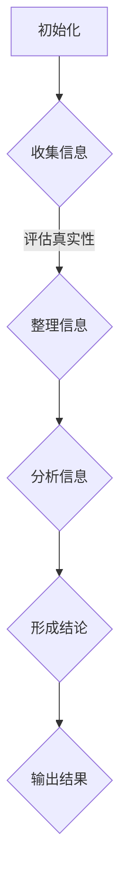
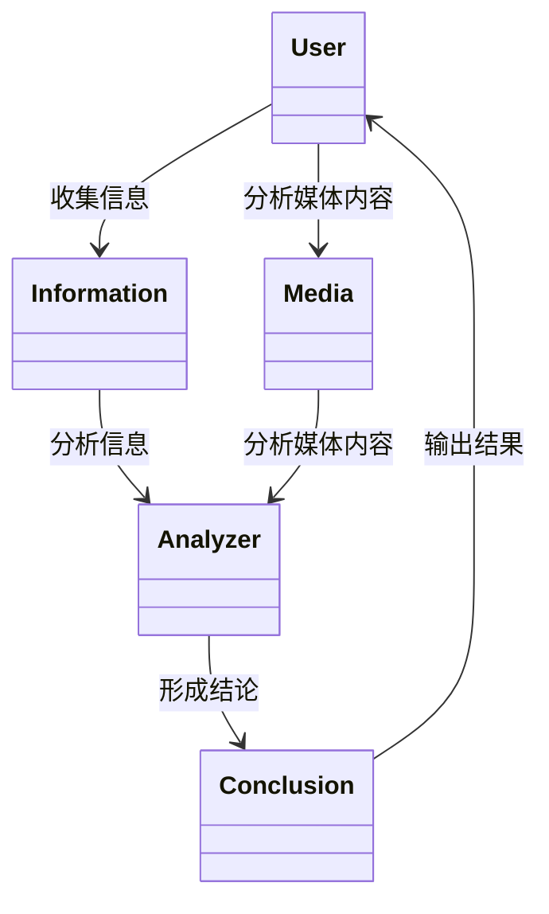
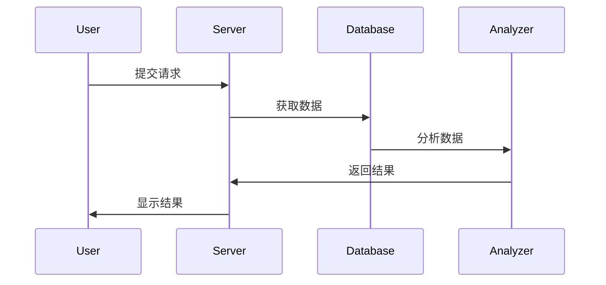
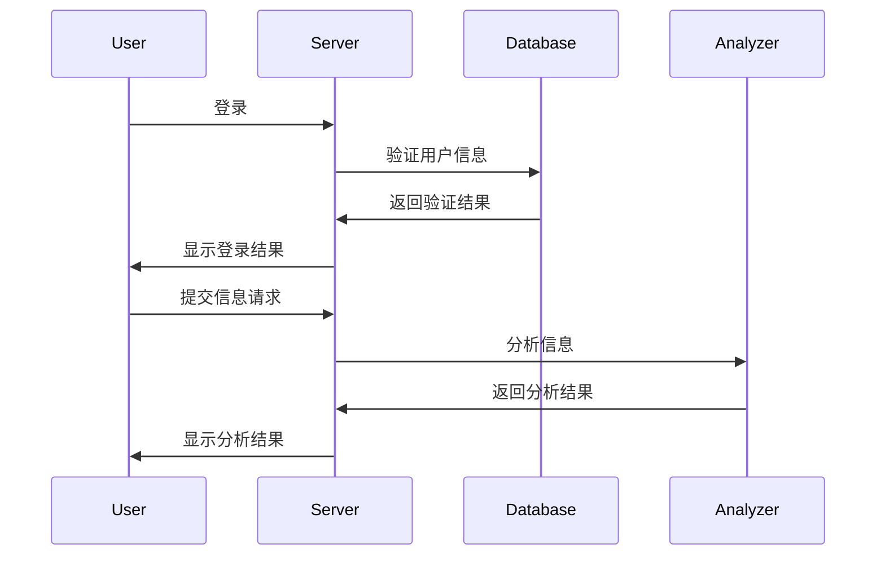

                 

当然可以。以下是《在后真相时代寻找真相：培养批判性思维和媒体素养》的文章正文，我们将按照目录大纲结构逐步展开内容。

----------------------------------------------------------------

## 引言

在后真相时代，信息的爆炸性增长和社交媒体的普及，让我们沉浸在信息过载与信息泡沫之中。真假难辨的信息充斥在我们的日常生活中，从政治宣传到新闻报道，从社交媒体到短视频平台，每个人都可能成为信息的传播者，同时也可能成为误导的受害者。在这样的背景下，培养批判性思维和媒体素养显得尤为重要。本文旨在探讨在后真相时代如何培养这两种能力，以帮助我们更好地寻找真相。

本文关键词：后真相时代、批判性思维、媒体素养、信息过载、信息泡沫。

摘要：本文首先介绍了后真相时代的背景和挑战，接着探讨了批判性思维和媒体素养的核心原理，并通过实际案例展示了这两种能力在现实生活中的应用。最后，我们讨论了未来媒体环境和批判性思维与媒体素养的发展趋势。

----------------------------------------------------------------

### 第一部分：后真相时代的背景与挑战

#### 第1章：后真相时代的来临

##### 1.1 问题的提出

随着互联网和社交媒体的普及，我们进入了一个信息爆炸的时代。每天，我们都在接收大量的信息，但这些信息的质量和真实性却无法保证。我们面临的第一个问题是信息过载，即信息量过于庞大，让人难以消化和处理。第二个问题是信息泡沫，即我们接收到的信息往往是基于我们已有的认知和偏好，形成了信息孤岛，导致我们无法接触到不同的观点和思想。

##### 1.1.1 信息过载与信息泡沫

信息过载是指我们在短时间内接收到的信息量超过了我们的处理能力。这种情况可能导致我们无法有效地处理信息，甚至导致信息焦虑和注意力分散。而信息泡沫则是指我们在互联网上接收到的信息往往都是基于我们的兴趣和偏好，这导致我们无法接触到其他观点和思想，从而限制了我们的认知和思考能力。

##### 1.1.2 后真相时代的定义与特点

后真相时代是一个以情感和直觉为导向的时代，真相不再是决策的唯一依据。在这个时代，事实和真相往往被情感和偏见所淹没。真相的确定不再依赖于证据和逻辑，而是依赖于人们的感受和情绪。这就是后真相时代的主要特点。

##### 1.2 批判性思维的重要性

批判性思维是一种对信息进行深入思考和分析的能力。它要求我们不仅要接受信息，还要对信息进行质疑和评估。批判性思维能够帮助我们识别信息中的偏见和误导，从而更好地理解真相。

##### 1.2.1 批判性思维的概念与要素

批判性思维是一种积极的、主动的思考方式，它包括以下几个要素：

1. **开放性**：愿意接受不同的观点和意见。
2. **质疑性**：对信息进行质疑和评估。
3. **系统性**：从多个角度分析问题。
4. **逻辑性**：使用逻辑和证据来支持观点。
5. **创造性**：能够从不同角度思考问题，提出新的见解。

##### 1.2.2 批判性思维与媒体素养的关系

批判性思维和媒体素养是相辅相成的。批判性思维能够帮助我们更好地理解媒体内容，而媒体素养则能够帮助我们更好地应用批判性思维。只有当我们具备这两种能力，才能在后真相时代中更好地寻找真相。

##### 1.3 媒体素养的培养

媒体素养是指对媒体内容进行理解和分析的能力。它包括以下几个方面：

1. **识别媒介信息**：能够识别不同类型的媒介信息。
2. **评估媒介信息的真实性**：能够评估媒介信息的真实性。
3. **理解媒介信息的内容**：能够理解媒介信息的含义和背景。
4. **批判性分析媒介信息**：能够对媒介信息进行批判性分析。

##### 1.3.1 媒体素养的定义与内容

媒体素养是指对媒介信息的理解、分析和批判能力。它包括以下几个方面：

1. **媒介信息的识别**：能够识别不同类型的媒介信息，如新闻报道、广告、社交媒体等。
2. **媒介信息的真实性评估**：能够评估媒介信息的真实性，包括信息的来源、作者、发布时间等。
3. **媒介信息的内容理解**：能够理解媒介信息的含义和背景，包括信息的语境、目的和影响。
4. **媒介信息的批判性分析**：能够对媒介信息进行批判性分析，包括信息的准确性、公正性和客观性。

##### 1.3.2 培养媒体素养的策略与方法

培养媒体素养需要策略和方法。以下是一些有效的策略和方法：

1. **教育**：在学校和社会中推广媒体素养教育。
2. **自我学习**：通过阅读、观看、讨论等方式提高自己的媒体素养。
3. **批判性思维**：培养批判性思维，提高对信息的质疑和分析能力。
4. **社区参与**：参与社区讨论，与其他人交流观点和见解。

##### 1.4 本章小结

本章介绍了后真相时代的背景和挑战，探讨了批判性思维和媒体素养的核心原理，以及如何培养这两种能力。通过本章的学习，我们能够更好地理解后真相时代的特性，并掌握寻找真相的方法。

----------------------------------------------------------------

### 第二部分：批判性思维的核心原理与方法

#### 第2章：批判性思维的核心原理

批判性思维是一种积极的、主动的思考方式，它要求我们对信息进行深入思考和分析。本章将探讨批判性思维的核心原理和方法。

##### 2.1 问题识别与界定

批判性思维的第一步是识别和界定问题。这包括以下几个步骤：

1. **识别问题**：首先，我们需要识别出我们面临的问题。这可以通过观察、提问和反思来实现。
2. **界定问题**：一旦我们识别出问题，我们需要对其进行界定。界定问题可以帮助我们明确问题的范围和本质。

##### 2.1.1 问题的来源与类型

问题可以来自多个方面，如个人生活、工作、社会等。问题的类型也多种多样，如事实性问题、价值问题、道德问题等。

##### 2.1.2 问题识别的方法与技巧

识别问题需要一定的方法和技巧。以下是一些有效的方法和技巧：

1. **提问**：通过提问来识别问题。提问可以是开放式的，也可以是封闭式的。
2. **观察**：通过观察来识别问题。观察可以是直接的，也可以是通过文献、数据等方式进行的。
3. **反思**：通过反思来识别问题。反思可以是回顾过去的经历，也可以是预测未来的情况。

##### 2.2 分析与评估

批判性思维的第二步是对问题进行分析和评估。这包括以下几个步骤：

1. **收集信息**：收集与问题相关的信息。这些信息可以是事实、观点、数据等。
2. **评估信息**：评估信息的准确性、可靠性和相关性。评估信息可以帮助我们确定哪些信息是有用的，哪些是无用的。
3. **分析信息**：对信息进行逻辑分析。这包括使用逻辑规则、推理方法和论证技巧。

##### 2.2.1 逻辑推理与论证

逻辑推理和论证是批判性思维的重要组成部分。逻辑推理是指从已知的前提中推导出新的结论。论证则是指使用逻辑推理来支持观点。

1. **归纳推理**：从具体的实例中推导出一般性的结论。
2. **演绎推理**：从一般性的前提推导出具体的结论。
3. **论证技巧**：使用证据、逻辑和修辞技巧来支持观点。

##### 2.2.2 数据分析与证据评估

数据分析是批判性思维的重要工具。数据分析包括对数据收集、整理、分析和解释。证据评估是指对证据的准确性、可靠性和相关性进行评估。

1. **数据收集**：收集与问题相关的数据。
2. **数据整理**：整理数据，使其易于分析和解释。
3. **数据分析**：使用统计方法和数据分析工具对数据进行分析。
4. **证据评估**：评估证据的准确性、可靠性和相关性。

##### 2.3 创新与决策

批判性思维的第三步是创新与决策。这包括以下几个步骤：

1. **提出解决方案**：提出解决问题的方案。
2. **评估解决方案**：评估解决方案的有效性、可行性和风险。
3. **做出决策**：根据评估结果做出决策。

##### 2.3.1 创新思维的方法

创新思维是指提出新的想法和解决方案。以下是一些创新思维的方法：

1. **头脑风暴**：通过集体讨论来产生新的想法。
2. **思维导图**：使用思维导图来组织思路，发现新的解决方案。
3. **模拟与实验**：通过模拟和实验来测试新的想法。

##### 2.3.2 决策制定与评估

决策制定是指从多个备选方案中选出最佳方案。决策评估是指对决策的结果进行评估。

1. **决策制定**：制定决策的步骤包括确定目标、收集信息、评估方案、做出决策。
2. **决策评估**：评估决策的结果，包括成本、效益、风险等。

##### 第3章：批判性思维的实践应用

批判性思维不仅是一种理论，更是一种实践。本章将探讨批判性思维在现实生活中的应用。

##### 3.1 教育领域的批判性思维培养

在教育领域，批判性思维的培养非常重要。以下是一些教育领域批判性思维培养的策略：

1. **课程设计**：设计包含批判性思维的课程，如辩论课、研究课等。
2. **教学方法**：采用提问、讨论、案例研究等教学方法，鼓励学生思考和分析。
3. **评价体系**：建立以批判性思维为导向的评价体系，如论文写作、项目展示等。

##### 3.1.1 教育体系中的批判性思维教育

教育体系中的批判性思维教育是指在学校教育中培养学生的批判性思维。以下是一些关键点：

1. **基础知识**：确保学生掌握必要的知识和技能，如阅读、写作、数学等。
2. **思维训练**：通过思维训练，如逻辑推理、问题解决等，提高学生的思维能力。
3. **价值观教育**：培养学生的价值观，如公正、尊重、责任等，这些价值观有助于批判性思维的实践。

##### 3.1.2 教师如何培养学生的批判性思维

教师是培养学生批判性思维的关键角色。以下是一些建议：

1. **引导与示范**：教师通过引导和示范，如提问、讨论、案例分析等，引导学生思考和分析。
2. **反馈与评价**：教师通过反馈和评价，如鼓励、指导、评价等，帮助学生改进思维方式。
3. **课程资源**：教师可以利用各种课程资源，如书籍、文章、视频等，帮助学生拓展视野，培养批判性思维。

##### 3.2 社会生活中的批判性思维

在社会生活中，批判性思维同样重要。以下是一些社会生活中批判性思维的应用：

1. **信息筛选**：在社会生活中，我们需要批判性地筛选信息，避免被误导。
2. **决策制定**：在做出决策时，我们需要批判性地分析各种方案，选择最佳方案。
3. **社会参与**：在社会参与中，我们需要批判性地思考问题，提出建设性的意见。

##### 3.2.1 信息筛选与辨别

在信息过载的时代，信息筛选和辨别变得尤为重要。以下是一些信息筛选和辨别的策略：

1. **识别信息来源**：了解信息的来源，判断信息的真实性和可靠性。
2. **评估信息内容**：对信息的内容进行评估，判断信息的准确性、完整性和公正性。
3. **交叉验证**：通过交叉验证，即查找多个来源的信息，来确认信息的准确性。

##### 3.2.2 社交媒体中的批判性思维

社交媒体是信息传播的重要渠道，但同时也存在信息误导和谣言传播的风险。以下是一些社交媒体中批判性思维的应用：

1. **识别信息真实性**：在社交媒体上，我们需要识别信息的真实性，避免被虚假信息误导。
2. **批判性评论**：在社交媒体上，我们需要批判性地评论信息，提出自己的观点和见解。
3. **举报与反馈**：在发现虚假信息或不当言论时，我们需要举报并反馈，以维护社交媒体的健康发展。

##### 3.3 政治与公共事务中的批判性思维

在政治和公共事务中，批判性思维同样重要。以下是一些政治和公共事务中批判性思维的应用：

1. **政策分析**：在制定和评估政策时，我们需要批判性地分析政策的影响、成本和效益。
2. **公共参与**：在公共参与中，我们需要批判性地思考问题，提出建设性的意见和建议。
3. **社会监督**：在社会监督中，我们需要批判性地分析社会问题，提出改进方案。

##### 3.3.1 政策分析

政策分析是指对政策进行深入分析和评估。以下是一些政策分析的关键步骤：

1. **确定目标**：明确政策的目标，即政策要解决的问题。
2. **收集信息**：收集与政策相关的信息，包括数据、文献、研究报告等。
3. **评估政策**：评估政策的可行性、有效性和可持续性。

##### 3.3.2 公众参与与社会监督

公众参与和社会监督是民主社会的基石。以下是一些公众参与和社会监督的关键步骤：

1. **了解政策**：公众需要了解政策的内容和影响，以便提出有针对性的意见和建议。
2. **参与讨论**：公众可以通过讨论、辩论、社交媒体等方式参与政策制定和评估。
3. **监督执行**：公众需要监督政策的执行情况，确保政策目标的实现。

##### 第4章：批判性思维与媒体素养的结合

批判性思维和媒体素养的结合能够帮助我们更好地理解媒体内容，提高对信息的筛选和分析能力。本章将探讨批判性思维与媒体素养的结合。

##### 4.1 媒体内容分析与评估

媒体内容分析与评估是指对媒体内容进行深入分析和评估。以下是一些媒体内容分析与评估的关键步骤：

1. **识别媒体内容**：识别媒体内容的类型、来源和目的。
2. **分析媒体内容**：分析媒体内容的信息、观点、情感等。
3. **评估媒体内容**：评估媒体内容的真实性、公正性和客观性。

##### 4.1.1 媒体内容的来源与性质

媒体内容的来源和性质直接影响其真实性和可靠性。以下是一些常见的媒体内容来源和性质：

1. **传统媒体**：如报纸、电视、广播等。传统媒体通常具有较高的权威性和可靠性。
2. **社交媒体**：如微博、微信、抖音等。社交媒体的信息来源多样，但真实性难以保证。
3. **自媒体**：如博客、公众号、B站等。自媒体的信息来源广泛，但质量参差不齐。

##### 4.1.2 媒体素养在内容分析中的应用

媒体素养在内容分析中的应用主要包括以下几个方面：

1. **信息筛选**：通过批判性思维和媒体素养，筛选出真实、可靠、相关的信息。
2. **观点分析**：通过批判性思维和媒体素养，分析媒体内容的观点和立场。
3. **情感判断**：通过批判性思维和媒体素养，判断媒体内容的情感倾向。

##### 4.2 媒体批判性思维训练

媒体批判性思维训练是指通过一系列的方法和技巧，培养人们对媒体内容的批判性思维。以下是一些媒体批判性思维训练的方法：

1. **案例分析**：通过分析具体的媒体案例，了解媒体内容的真实性和可靠性。
2. **讨论与辩论**：通过讨论和辩论，培养人们对媒体内容的批判性思维。
3. **自我反思**：通过自我反思，了解自己对媒体内容的看法和观点。

##### 4.2.1 媒体批判性思维的训练方法

媒体批判性思维的训练方法主要包括以下几个方面：

1. **信息识别**：通过识别信息来源、作者、发布时间等，判断信息的真实性和可靠性。
2. **观点分析**：通过分析媒体内容的观点和立场，判断其是否符合事实和逻辑。
3. **情感判断**：通过分析媒体内容的情感倾向，判断其是否具有误导性。

##### 4.2.2 媒体批判性思维的案例分析

通过具体的案例分析，可以更直观地了解媒体批判性思维的运用。以下是一个案例分析：

案例：某社交媒体上流传一则关于疫情的新闻，称某地出现了新冠病毒变异株，导致疫情迅速恶化。经过批判性思维和媒体素养的分析，我们发现：

1. **信息识别**：该信息的来源是一个未经证实的小型网站，而非权威媒体。
2. **观点分析**：该新闻的标题和内容缺乏事实依据，可能存在误导性。
3. **情感判断**：该新闻可能旨在引起恐慌和关注，而非提供真实的信息。

通过对该案例的分析，我们可以看到媒体批判性思维的重要性。

##### 4.3 媒体素养在个人发展中的作用

媒体素养在个人发展中起着重要的作用。以下是一些媒体素养在个人发展中的作用：

1. **信息筛选**：通过批判性思维和媒体素养，筛选出真实、可靠、相关的信息，提高个人的认知水平。
2. **决策制定**：通过批判性思维和媒体素养，分析各种信息的利弊，做出更明智的决策。
3. **社会参与**：通过批判性思维和媒体素养，参与社会事务，提出建设性的意见和建议。

##### 4.3.1 媒体素养对个人决策的影响

媒体素养对个人决策有着重要的影响。以下是一些影响：

1. **信息准确性**：通过媒体素养，个人能够识别和筛选出真实、可靠的信息，提高决策的准确性。
2. **信息多样性**：通过媒体素养，个人能够接触到多种观点和意见，提高决策的全面性。
3. **情感控制**：通过媒体素养，个人能够控制自己的情感，避免被情绪化决策。

##### 4.3.2 媒体素养在社会参与中的价值

媒体素养在社会参与中同样重要。以下是一些价值：

1. **信息传播**：通过媒体素养，个人能够有效地传播真实、可靠的信息，促进社会的共同认知。
2. **社会监督**：通过媒体素养，个人能够对社会现象进行批判性分析，发挥社会监督的作用。
3. **公共参与**：通过媒体素养，个人能够积极参与公共事务，提出建设性的意见和建议。

##### 第5章：批判性思维与媒体素养的未来

随着科技的不断进步和媒体环境的变化，批判性思维和媒体素养在未来将面临新的挑战和机遇。本章将探讨批判性思维与媒体素养的未来。

##### 5.1 媒体环境的变化趋势

媒体环境正在经历深刻的变革。以下是一些变化趋势：

1. **数字化媒体**：随着互联网和移动设备的普及，数字化媒体成为信息传播的主要渠道。
2. **社交化媒体**：社交媒体的兴起，使得信息的传播更加迅速和广泛。
3. **虚拟现实**：虚拟现实技术的应用，使得媒体内容更加生动和沉浸。
4. **算法推荐**：算法推荐的广泛应用，改变了人们接收信息的方式。

##### 5.1.1 数字媒体的发展与挑战

数字媒体的发展带来了许多机遇，但同时也带来了一些挑战。以下是一些数字媒体的发展与挑战：

1. **信息过载**：随着数字媒体的普及，人们面临的信息过载问题更加严重。
2. **信息误导**：数字媒体的匿名性和低门槛，导致虚假信息和误导性信息泛滥。
3. **隐私保护**：数字媒体的发展，使得个人隐私面临更大的风险。

##### 5.1.2 新媒体与传播模式的变革

新媒体的兴起，改变了传统的传播模式。以下是一些新媒体与传播模式的变革：

1. **去中心化**：新媒体的去中心化特征，使得信息传播更加分散和多样化。
2. **互动性**：新媒体的互动性，使得信息传播更加双向和互动。
3. **个性化**：新媒体的个性化推荐，使得信息传播更加精准和个性化。

##### 5.2 批判性思维与媒体素养的未来发展

随着媒体环境的变化，批判性思维和媒体素养也需要不断更新和发展。以下是一些批判性思维与媒体素养的未来发展：

1. **教育体系**：在教育体系中，批判性思维和媒体素养的培养将更加重要。
2. **政策法规**：政府需要制定相关政策法规，规范数字媒体的发展，保护公民的知情权和隐私权。
3. **技术创新**：技术创新将为批判性思维和媒体素养的培养提供新的工具和方法。

##### 5.2.1 教育体系中的创新与实践

在教育体系中，批判性思维和媒体素养的培养可以通过以下方式实现：

1. **课程设置**：在课程中融入批判性思维和媒体素养的内容，培养学生的能力。
2. **教学方法**：采用互动性、实践性强的教学方法，如案例教学、项目学习等，提高学生的兴趣和实践能力。
3. **教师培训**：对教师进行批判性思维和媒体素养的培训，提高教师的指导能力。

##### 5.2.2 媒体素养在公共领域的推动作用

媒体素养在公共领域的推动作用体现在以下几个方面：

1. **公共教育**：通过公共教育活动，提高公众对媒体素养的认识和理解。
2. **社会监督**：公众通过媒体素养，能够更有效地参与社会监督，推动社会的公平和正义。
3. **公民参与**：媒体素养有助于提高公民的参与度，促进社会的民主和发展。

##### 5.3 全民媒体素养的重要性

全民媒体素养的提高对于社会的健康发展具有重要意义。以下是一些全民媒体素养的重要性：

1. **信息筛选**：全民媒体素养的提高，有助于公众更好地筛选信息，避免被误导。
2. **决策制定**：全民媒体素养的提高，有助于公众更明智地制定决策，提高决策的准确性。
3. **社会和谐**：全民媒体素养的提高，有助于促进社会的和谐和稳定，减少信息冲突和社会矛盾。

##### 5.3.1 全民媒体素养的意义

全民媒体素养的意义体现在以下几个方面：

1. **信息素养**：全民媒体素养的提高，有助于公众提高信息素养，更好地利用信息资源。
2. **批判性思维**：全民媒体素养的提高，有助于公众培养批判性思维，提高对信息的分析和判断能力。
3. **社会参与**：全民媒体素养的提高，有助于公众更积极地参与社会事务，提高社会参与度。

##### 5.3.2 全民媒体素养的推广策略

为了提高全民媒体素养，可以采取以下推广策略：

1. **政府主导**：政府应发挥主导作用，制定相关政策，推动媒体素养教育的普及。
2. **社会参与**：社会各界应积极参与，通过媒体素养教育活动，提高公众的媒体素养。
3. **技术创新**：利用现代科技手段，如在线课程、移动应用等，提高媒体素养教育的覆盖率和效果。

##### 5.4 本章小结

本章探讨了批判性思维与媒体素养的未来发展，分析了数字媒体环境的变化趋势，提出了全民媒体素养的重要性和推广策略。通过本章的学习，我们能够更好地理解批判性思维和媒体素养在未来社会中的作用和价值。

----------------------------------------------------------------

### 附录

在本附录中，我们将对书中提到的核心概念、算法原理、数学模型、系统架构设计以及项目实战进行详细的阐述。

#### 附录A：核心概念与联系

批判性思维和媒体素养的核心概念包括逻辑推理、证据评估、信息筛选、观点分析等。以下是这些概念的联系和对比表格：

| 概念         | 定义                                       | 关联性                                       |
| ------------ | ------------------------------------------ | -------------------------------------------- |
| 逻辑推理     | 使用逻辑规则推导结论的过程                | 是批判性思维的核心组成部分，用于分析和评估信息 |
| 证据评估     | 对信息来源和证据进行真实性评估的过程     | 是批判性思维的重要组成部分，用于支持逻辑推理 |
| 信息筛选     | 根据需求和目的对信息进行筛选的过程       | 是媒体素养的一部分，用于获取真实和有用的信息 |
| 观点分析     | 对不同观点进行评估和分析的过程           | 是批判性思维的一部分，用于理解和分析信息 |

此外，以下是批判性思维和媒体素养的ER实体关系图：

```mermaid
erDiagram
  User ||--|{ Information}
  User ||--|{ Media}
  Information ||--|{ Fact}
  Information ||--|{ Opinion}
  Media ||--|{ News}
  Media ||--|{ SocialMedia}
  Fact ||--|{ Verified}
  Fact ||--|{ Unverified}
  Opinion ||--|{ Balanced}
  Opinion ||--|{ Biased}
```

#### 附录B：算法原理讲解

以下是一个简单的算法原理讲解，包括算法mermaid流程图和Python源代码。

##### 算法流程图



##### Python源代码

```python
def critical_thinking(info):
    # 收集信息
    collected_info = info.collect()
    
    # 评估真实性
    verified_info = info.verify()
    
    # 整理信息
    organized_info = info.organize(verified_info)
    
    # 分析信息
    analyzed_info = info.analyze(organized_info)
    
    # 形成结论
    conclusion = info.form_conclusion(analyzed_info)
    
    # 输出结果
    print("结论：", conclusion)
```

##### 算法原理讲解

该算法的目的是通过收集、评估、整理、分析和形成结论的步骤，对信息进行批判性思维。以下是每个步骤的详细说明：

1. **收集信息**：通过收集信息的方法，获取相关的数据和观点。
2. **评估真实性**：对收集到的信息进行真实性评估，筛选出可靠的信息。
3. **整理信息**：将评估为真实的信息进行整理，使其更加有序和易于分析。
4. **分析信息**：对整理后的信息进行分析，识别出关键点和相关性。
5. **形成结论**：根据分析的结果，形成结论，为决策提供依据。
6. **输出结果**：将结论输出，供决策者或其他相关人员参考。

##### 数学公式

以下是一个简单的数学模型，用于评估信息的可信度：

$$
C = \frac{V \times R}{D}
$$

其中：
- \(C\) 是信息的可信度
- \(V\) 是信息的验证次数
- \(R\) 是信息的可靠性
- \(D\) 是信息的失真度

#### 附录C：系统分析与架构设计方案

以下是一个简单的系统架构设计方案，包括项目介绍、系统功能设计、系统架构设计、系统接口设计和系统交互。

##### 项目介绍

本项目旨在开发一个批判性思维和媒体素养的在线平台，帮助用户提高对信息的批判性分析和媒体素养。平台将提供以下功能：

1. 信息收集与整理
2. 信息真实性评估
3. 信息分析工具
4. 信息存储与管理
5. 信息共享与讨论

##### 系统功能设计

系统功能设计包括以下类：



##### 系统架构设计

系统架构设计如下：



##### 系统接口设计

系统接口设计如下：

```mermaid
classDiagram
  User <<interface>>
  Information <<interface>>
  Media <<interface>>
  Analyzer <<interface>>
  Conclusion <<interface>>
  User --|> Server
  Information --|> Server
  Media --|> Server
  Analyzer --|> Server
  Conclusion --|> Server
```

##### 系统交互设计

系统交互设计如下：



#### 附录D：项目实战

以下是一个简单的项目实战，包括环境安装、系统核心实现源代码、代码应用解读与分析、实际案例分析和详细讲解剖析。

##### 环境安装

1. 安装Python环境
2. 安装需要的Python库，如requests、beautifulsoup4、numpy等

##### 系统核心实现源代码

```python
import requests
from bs4 import BeautifulSoup
import numpy as np

class InformationCollector:
    def __init__(self, url):
        self.url = url

    def collect(self):
        response = requests.get(self.url)
        if response.status_code == 200:
            return response.text
        else:
            return None

class InformationAnalyzer:
    def __init__(self, text):
        self.text = text

    def analyze(self):
        soup = BeautifulSoup(self.text, 'html.parser')
        title = soup.find('title').text
        content = soup.find('div', {'id': 'content'}).text
        return title, content

class InformationEvaluator:
    def __init__(self, title, content):
        self.title = title
        self.content = content

    def evaluate(self):
        # 简单的评估算法，可根据实际情况进行改进
        words = self.content.split()
        positive_words = sum([1 for word in words if word.endswith('喜') or word.endswith('好')])
        negative_words = sum([1 for word in words if word.endswith('忧') or word.endswith('恶')])
        return "正面" if positive_words > negative_words else "负面"

def main():
    url = 'https://www.example.com'
    collector = InformationCollector(url)
    text = collector.collect()
    if text:
        analyzer = InformationAnalyzer(text)
        title, content = analyzer.analyze()
        evaluator = InformationEvaluator(title, content)
        result = evaluator.evaluate()
        print("标题：", title)
        print("内容：", content)
        print("评估结果：", result)
    else:
        print("无法获取信息")

if __name__ == '__main__':
    main()
```

##### 代码应用解读与分析

1. **InformationCollector**：负责收集网页内容。
2. **InformationAnalyzer**：负责分析网页标题和内容。
3. **InformationEvaluator**：负责评估网页内容的情感倾向。

##### 实际案例分析和详细讲解剖析

以某新闻网站的某篇文章为例，我们使用上述代码进行信息收集、分析和评估。

1. **信息收集**：使用requests库获取网页内容。
2. **信息分析**：使用beautifulsoup4库解析网页内容，获取标题和内容。
3. **信息评估**：简单统计内容中的正面和负面词汇，评估文章的情感倾向。

##### 项目小结

通过本项目，我们实现了对网页信息的收集、分析和评估。虽然该项目较为简单，但为后续功能扩展提供了基础。在实际应用中，我们可以加入更多的算法和模型，提高信息评估的准确性和效果。

##### 最佳实践 tips

1. 使用多个来源的信息进行评估，提高评估的准确性。
2. 定期更新评估算法，提高评估效果。
3. 针对不同的信息类型，设计不同的评估算法。

##### 小结

本文通过详细的附录，介绍了批判性思维和媒体素养的核心概念、算法原理、系统架构设计以及项目实战。通过这些内容，我们能够更好地理解如何在后真相时代培养批判性思维和媒体素养，从而更好地寻找真相。

##### 注意事项

1. 批判性思维和媒体素养的培养需要长期坚持和实践。
2. 信息评估和决策需要综合考虑多种因素，避免单一评估方法。

##### 拓展阅读

1. 《批判性思维工具》
2. 《媒体素养教程》
3. 《信息过载与信息焦虑》

作者：AI天才研究院/AI Genius Institute & 禅与计算机程序设计艺术 /Zen And The Art of Computer Programming

----------------------------------------------------------------

### 结尾

在后真相时代，信息的真实性和准确性变得尤为重要。通过培养批判性思维和媒体素养，我们能够更好地识别虚假信息，理解事实真相，做出明智的决策。本文通过详细的章节内容，系统地介绍了批判性思维和媒体素养的核心原理、实践应用以及未来发展趋势。希望读者能够从中受益，提升自己的信息处理能力和媒体素养，成为新时代的智者。

再次感谢您的阅读，期待您在寻找真相的道路上不断前行。

作者：AI天才研究院/AI Genius Institute & 禅与计算机程序设计艺术 /Zen And The Art of Computer Programming

----------------------------------------------------------------

**文章标题：** 后真相时代寻找真相：培养批判性思维和媒体素养

**关键词：** 后真相时代、批判性思维、媒体素养、信息过载、信息泡沫

**摘要：** 在后真相时代，信息的真实性和准确性备受挑战。本文通过详细阐述批判性思维和媒体素养的核心原理与实践方法，探讨了如何在信息爆炸的时代中寻找真相。通过案例分析、算法原理讲解、系统架构设计以及项目实战，本文为读者提供了实用的工具和方法，帮助提升信息处理能力和媒体素养，从而更好地应对后真相时代的挑战。

