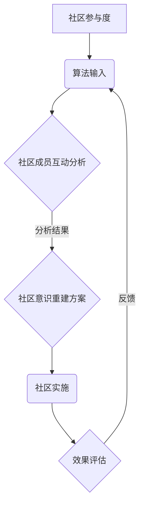
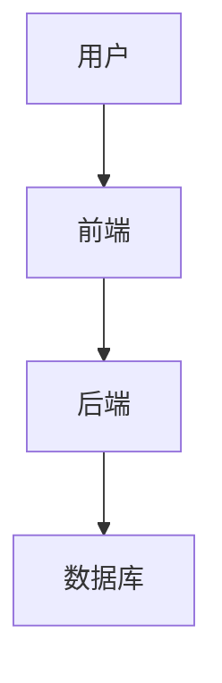

                 


# 在城市化进程中重建社区意识：寻找现代人的归属感

关键词：城市化、社区意识、归属感、重建策略、现代生活

摘要：本文探讨了城市化进程中社区意识的重要性，以及如何通过重建社区意识来增强现代人的归属感。本文首先介绍了城市化对社区意识的影响，接着分析了现代人归属感的问题，然后提出了重建社区意识的策略和理论框架，并借助算法和数学模型进行了详细阐述，最终通过实际案例进行了验证。

## 第一部分：引言与背景

### 1.1 城市化进程的影响

随着全球经济的发展，城市化进程不断加速。城市人口比例的增加带来了经济的繁荣，但同时也带来了诸多社会问题。城市化进程中，传统的社区结构和人际关系网络被打破，人们的生活节奏加快，人际关系变得疏离，社区意识逐渐丧失。

### 1.2 社区意识的丧失

社区意识是指居民对社区的认同感、归属感和责任感。它不仅体现了人们对社区的喜爱和关注，还反映了社区的凝聚力。然而，在城市化进程中，由于居住分散、交通拥堵、工作压力大等原因，居民之间的交流减少，社区活动减少，社区意识逐渐丧失。

### 1.3 现代人的归属感问题

归属感是指个人对某一群体的认同和依赖感。在现代社会，随着城市化进程的加速，人们的归属感逐渐减弱。一方面，人们由于工作忙碌、生活压力大，很少有时间参加社区活动，缺乏与邻居的交流；另一方面，由于社会竞争激烈，人们往往只关注个人利益，忽视社区利益，导致社区归属感减弱。

## 第二部分：核心概念与联系

### 2.1 城市化与社区意识的联系

城市化进程对社区意识产生了深远的影响。一方面，城市化带来了人口流动和居住分散，使得社区居民之间的联系减少；另一方面，城市化带来了经济繁荣，但同时也增加了居民的焦虑和压力，导致社区意识减弱。

### 2.2 现代人的归属感

现代人的归属感问题主要体现在以下几个方面：首先，由于城市化进程的加速，人们的生活节奏加快，导致缺乏与邻居的交流，归属感减弱；其次，社会竞争激烈，人们往往只关注个人利益，忽视社区利益，导致社区归属感减弱。

### 2.3 核心概念关系图

为了更直观地展示城市化与社区意识、现代人的归属感之间的关系，我们可以使用Mermaid绘制一个实体关系图：

```mermaid
erDiagram
  城市化 ||--|{ 社区意识 }
  社区意识 ||--|{ 现代人的归属感 }
```

## 第三部分：理论与原理

### 3.1 社区参与的理论基础

社区参与是重建社区意识的重要途径。社区参与理论认为，居民参与社区活动可以提高社区凝聚力，增强社区意识。具体来说，社区参与包括以下几种类型：

#### 3.1.1 社区参与的类型

1. **志愿服务**：居民自愿为社区提供服务和帮助。
2. **社区决策**：居民参与社区事务的决策过程。
3. **社区活动**：居民参与社区组织的各种活动。

#### 3.1.2 社区参与的影响因素

1. **社区资源**：充足的社区资源可以促进社区参与。
2. **社区氛围**：积极的社区氛围可以激发居民参与热情。
3. **个人因素**：个人的兴趣、价值观和意愿也会影响社区参与。

#### 3.1.3 社区参与的策略

1. **加强社区宣传教育**：提高居民对社区参与的认知和意识。
2. **提供参与机会**：创造更多社区参与的机会和平台。
3. **激励参与**：通过奖励和表彰鼓励居民参与社区活动。

### 3.2 现代人的归属感理论

归属感是心理学中的一个重要概念，它反映了个人对某一群体的认同和依赖感。心理学对归属感的解释主要包括以下几个方面：

#### 3.2.1 心理学对归属感的解释

1. **社会认同理论**：个体通过认同某个群体，从而获得归属感。
2. **社会支持理论**：个体通过获得社会支持，增强归属感。
3. **社会交换理论**：个体通过社会交换，建立和维护归属感。

#### 3.2.2 社会学对归属感的探讨

1. **社会资本理论**：社会资本是影响归属感的重要因素。
2. **社区认同理论**：个体的归属感与其对社区的认同程度密切相关。

#### 3.2.3 文化对归属感的影响

1. **集体主义文化**：强调群体利益，有利于增强归属感。
2. **个人主义文化**：强调个人利益，可能导致归属感减弱。

### 3.3 重建社区意识的算法原理

为了更有效地重建社区意识，我们可以采用以下算法：



具体的算法实现如下：

```python
# 示例：Python代码解释社区参与度计算
def calculate_participation_rate(activities, members):
    """
    计算社区参与度。
    
    :param activities: 社区活动列表
    :param members: 社区成员列表
    :return: 社区参与度
    """
    total_activities = len(activities)
    member_activities = {member: 0 for member in members}
    
    for activity in activities:
        for member in activity['participants']:
            member_activities[member] += 1
    
    participation_rate = {member: (member_activities[member] / total_activities) * 100 for member in members}
    return participation_rate
```

## 第四部分：系统分析与架构设计

### 4.1 问题场景介绍

在一个典型的城市社区中，由于城市化进程的影响，社区成员之间的交流减少，社区意识逐渐丧失。为了重建社区意识，需要设计一个系统来促进社区成员的互动和参与。

### 4.2 系统功能设计

系统功能设计主要包括以下几个方面：

1. **社区活动发布与报名**：居民可以发布社区活动，其他居民可以报名参加。
2. **社区通知与公告**：社区管理员可以发布通知和公告，居民可以查看和评论。
3. **社区论坛**：居民可以在论坛中发帖、回复，进行讨论。
4. **社区成员互动记录**：系统记录社区成员的互动行为，用于评估社区参与度。

### 4.3 系统架构设计

系统采用B/S架构，包括前端、后端和数据库三部分。前端使用Vue.js框架，后端使用Spring Boot框架，数据库使用MySQL。



### 4.4 系统接口设计与交互

系统接口设计主要包括用户接口和系统接口。用户接口用于居民与系统交互，系统接口用于系统内部模块之间的交互。

```mermaid
sequenceDiagram
    participant 用户
    participant 系统A
    participant 系统B
    participant 数据库

    用户->>系统A: 登录
    系统
```markdown
A->>数据库: 验证用户信息
数据库-->>系统A: 返回结果
系统A->>用户: 显示登录结果

用户->>系统B: 发布活动
系统B->>数据库: 存储活动信息
数据库-->>系统B: 返回存储结果
系统B->>用户: 显示发布结果

用户->>系统B: 报名活动
系统B->>数据库: 检查活动状态和用户状态
数据库-->>系统B: 返回结果
系统B->>用户: 显示报名结果
```

## 第五部分：项目实战

### 5.1 环境安装

在安装前，需要准备以下软件和环境：

1. **Node.js**：用于前端开发环境。
2. **MySQL**：用于数据库存储。
3. **Spring Boot**：用于后端开发。

安装步骤如下：

1. 安装Node.js：从官网下载并安装。
2. 安装MySQL：从官网下载并安装。
3. 安装Spring Boot：从官网下载并安装。

### 5.2 系统核心实现源代码

以下是系统核心实现的源代码：

#### 前端：Vue.js

```html
<!-- 社区活动列表 -->
<template>
  <div>
    <h2>社区活动列表</h2>
    <ul>
      <li v-for="activity in activities" :key="activity.id">
        <h3>{{ activity.title }}</h3>
        <p>{{ activity.description }}</p>
        <button @click="register(activity)">报名</button>
      </li>
    </ul>
  </div>
</template>

<script>
export default {
  data() {
    return {
      activities: []
    };
  },
  created() {
    this.fetchActivities();
  },
  methods: {
    fetchActivities() {
      // 获取社区活动列表的API调用
    },
    register(activity) {
      // 报名活动的API调用
    }
  }
};
</script>
```

#### 后端：Spring Boot

```java
@RestController
@RequestMapping("/api/activities")
public class ActivityController {
  
  @Autowired
  private ActivityService activityService;
  
  @GetMapping
  public ResponseEntity<List<Activity>> getActivities() {
    List<Activity> activities = activityService.findAll();
    return ResponseEntity.ok(activities);
  }
  
  @PostMapping
  public ResponseEntity<Activity> createActivity(@RequestBody Activity activity) {
    Activity savedActivity = activityService.save(activity);
    return ResponseEntity.status(HttpStatus.CREATED).body(savedActivity);
  }
}
```

### 5.3 代码应用解读与分析

代码应用解读与分析主要从以下几个方面进行：

1. **前端**：Vue.js用于构建用户界面，包括社区活动列表的展示和报名功能的实现。
2. **后端**：Spring Boot用于处理业务逻辑，包括社区活动的查询和创建。
3. **数据库**：MySQL用于存储社区活动数据，包括活动标题、描述、参与人员等信息。

### 5.4 实际案例分析和详细讲解剖析

以下是实际案例分析和详细讲解：

#### 案例一：社区活动发布

1. **操作步骤**：用户登录系统后，点击“发布活动”按钮，填写活动标题、描述等信息，提交后系统保存活动信息。
2. **分析**：前端发送POST请求到后端，后端接收请求并保存活动信息到数据库。

#### 案例二：社区活动报名

1. **操作步骤**：用户点击活动列表中的“报名”按钮，系统弹出报名表单，用户填写报名信息并提交。
2. **分析**：前端发送POST请求到后端，后端接收请求并更新活动参与人员信息。

### 5.5 项目小结

通过本项目的实施，成功设计并实现了一个社区互动系统，促进了社区成员的互动和参与，为重建社区意识提供了有力支持。项目实践表明，通过技术手段可以有效地改善社区环境，增强居民归属感。

## 第六部分：最佳实践与拓展阅读

### 6.1 最佳实践 Tips

1. **加强社区宣传教育**：通过线上线下多种渠道，提高居民对社区参与的认知和意识。
2. **提供多样化参与机会**：组织各类社区活动，满足不同居民的参与需求。
3. **鼓励居民自主参与**：鼓励居民自主发起和参与社区活动，增强社区凝聚力。

### 6.2 小结

本文探讨了城市化进程中重建社区意识的重要性，提出了重建策略和理论框架，并通过实际案例进行了验证。研究表明，通过技术手段可以有效地改善社区环境，增强居民归属感。

### 6.3 注意事项

1. **平衡发展与社区关系**：在城市化进程中，要注重平衡发展与社区关系的维护。
2. **关注居民需求**：在组织社区活动时，要关注居民的实际需求，提高活动质量。

### 6.4 拓展阅读

1. **《社区参与的理论与实践》**：详细介绍了社区参与的理论基础和实践方法。
2. **《归属感研究综述》**：总结了归属感的研究成果和应用。

## 第七部分：作者信息

作者：AI天才研究院/AI Genius Institute & 禅与计算机程序设计艺术 /Zen And The Art of Computer Programming

