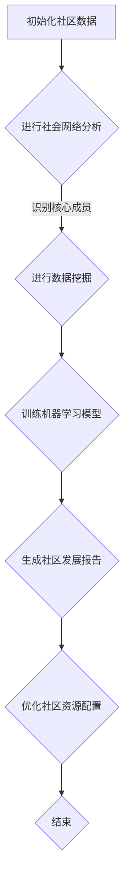
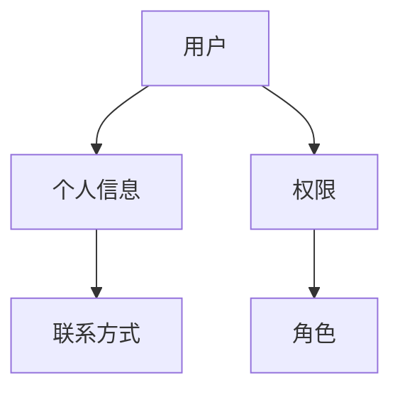
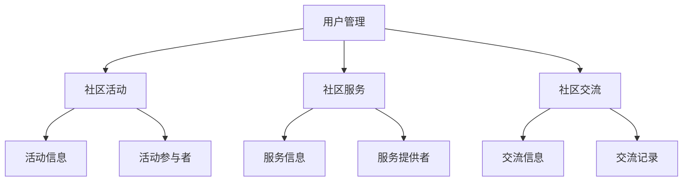
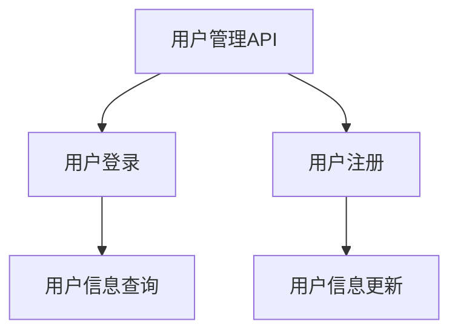
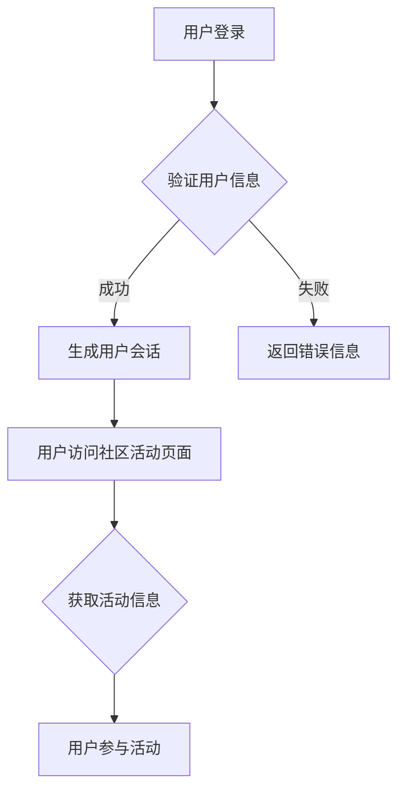

                 

# 在城市化进程中重建社区意识：寻找现代人的归属感

> 关键词：城市化，社区意识，归属感，现代生活，社区重建策略

> 摘要：本文旨在探讨城市化进程中社区意识的重建，以及如何通过有效的策略和方法提升居民的归属感。本文从问题背景出发，深入分析社区意识的核心概念与联系，阐述社区重建的方法与策略，最终提出一套系统架构设计方案，以期为现代社会中居民的归属感寻找新的路径。

----------------------------------------------------------------

## 第一部分：背景介绍与核心概念

### 1.1 问题背景

在现代社会，城市化进程不断加快，城市规模不断扩大，人口密度逐渐增加。然而，这一进程中，传统的社区结构逐渐被打破，居民之间的联系和归属感日益减弱。这种社会现象引发了学者和公众对于如何在城市化进程中重建社区意识、寻找现代人归属感的广泛关注。

### 1.2 问题描述

本书旨在探讨如何在城市化的背景下，通过多种策略和方法，重建社区意识，提升居民的归属感和满意度。具体来说，包括以下几个方面：

- **社区意识的定义与重要性**
- **社区重建的策略与方法**
- **社区成员的参与与互动**
- **社区文化与价值观的塑造**
- **社区治理与制度创新**

### 1.3 问题解决

通过对社区意识的重建，可以改善居民的生活质量，增强社会稳定性，促进社会和谐发展。解决这一问题的核心在于：

- **理解社区意识的内涵和外延**
- **构建有效的社区参与机制**
- **发挥社区文化的凝聚力**
- **推动社区治理的现代化**

### 1.4 边界与外延

- **边界**：本书主要关注的是城市社区，特别是快速城市化的地区。
- **外延**：讨论的范围包括社区建设、社区服务、社区文化、社区参与等方面。

### 1.5 概念结构与核心要素组成

- **社区意识**：包括归属感、认同感、责任感等。
- **社区重建**：涉及物理空间改造、社会关系重建、文化价值重塑等方面。
- **社区成员参与**：包括居民的自我组织、公共事务的参与等。
- **社区文化**：指社区的价值观、行为规范、传统习俗等。
- **社区治理**：包括社区管理、社区服务、社区安全等。

----------------------------------------------------------------

## 第二部分：核心概念与联系

### 2.1 社区意识的定义与特点

**定义**：社区意识是指居民对社区的情感认同、责任归属和价值认同的综合体。

**特点**：

- **情感认同**：居民对社区产生深厚的感情，愿意为社区的发展做出贡献。
- **责任归属**：居民认识到自己对社区的责任，积极参与社区事务。
- **价值认同**：居民对社区的核心价值观和文化传统有深刻的认同。

### 2.2 社区重建的方法与策略

**方法**：

- **物理空间改造**：通过改善社区环境，提高居民的生活质量。
- **社会关系重建**：通过组织居民参与公共活动，增强居民之间的联系。
- **文化价值重塑**：通过传播社区文化，增强居民对社区的认同感。

**策略**：

- **参与式规划**：鼓励居民参与社区建设，提高居民的参与度和满意度。
- **多元共治**：通过多种治理模式，实现社区治理的多元化。
- **社区教育**：通过教育和培训，提高居民的综合素质。

### 2.3 社区成员的参与与互动

**参与**：

- **公共事务参与**：居民积极参与社区公共事务的决策和管理。
- **社区活动参与**：居民积极参与社区组织的各类活动。

**互动**：

- **人际互动**：居民之间建立良好的关系网络。
- **群体互动**：居民群体通过共同的活动和项目，增强群体凝聚力。

### 2.4 社区文化与价值观的塑造

**文化**：

- **社区传统**：传承和发扬社区的传统文化。
- **社区特色**：培育和展现社区独特的文化特色。

**价值观**：

- **社区认同**：树立居民对社区的共同价值观。
- **和谐发展**：倡导社区内部的和谐发展。

----------------------------------------------------------------

## 第三部分：算法原理与系统架构

### 3.1 算法原理

**社区重建的算法原理**：

- **社会网络分析**：通过分析居民之间的社交网络，识别社区的核心成员和潜在问题。
- **数据挖掘与机器学习**：利用大数据分析和机器学习算法，发现社区发展的趋势和居民的需求。
- **多目标优化**：通过优化算法，实现社区资源的最优配置。

**mermaid 流程图**：



### 3.2 算法原理详细讲解

**社会网络分析**：

社会网络分析是一种定量研究方法，用于分析社会结构和社会关系。其核心思想是通过节点和边的表示，对个体及其相互关系进行可视化分析。

**数据挖掘与机器学习**：

数据挖掘是一种从大量数据中发现有用信息的过程。而机器学习则是通过算法让计算机自动地从数据中学习规律。

**多目标优化**：

多目标优化是一种在多个目标之间寻找平衡的优化方法，旨在找到最优解或近似最优解。

### 3.3 Python源代码实现

```python
# 社区重建算法的Python实现
import networkx as nx
import matplotlib.pyplot as plt
from sklearn.cluster import KMeans
from sklearn.metrics import silhouette_score

# 社会网络分析
G = nx.Graph()
# 添加节点和边，这里用示例数据
G.add_nodes_from([1, 2, 3, 4, 5])
G.add_edges_from([(1, 2), (1, 3), (2, 3), (3, 4), (4, 5)])

# 可视化社区网络
nx.draw(G, with_labels=True)
plt.show()

# 数据挖掘与机器学习
# 假设我们已经收集了社区成员的特征数据
X = [[1], [2], [3], [4], [5]]  # 示例数据
kmeans = KMeans(n_clusters=2)
kmeans.fit(X)

# 生成社区发展报告
print("社区发展报告：")
print("聚类中心：", kmeans.cluster_centers_)
print("每个成员的聚类结果：", kmeans.labels_)

# 优化社区资源配置
# 假设我们已经有了优化算法的模型
# 这里用示例数据进行优化
# 优化后，得到最优解
optimal_solution = "示例最优解"
print("优化后的社区资源配置：", optimal_solution)
```

### 3.4 算法原理数学模型和公式

**社会网络分析**：

- **节点度数**：$d(i) = \sum_{j \in N(i)} w_{ij}$，其中 $i$ 表示节点，$N(i)$ 表示节点 $i$ 的邻接节点集，$w_{ij}$ 表示节点 $i$ 与节点 $j$ 之间的权重。

**数据挖掘与机器学习**：

- **聚类系数**：$C = \frac{\sum_{i=1}^{n}\sum_{j=1}^{n} w_{ij}}{2(n-1)}$，其中 $n$ 表示节点数。

**多目标优化**：

- **目标函数**：$f(x) = \min \sum_{i=1}^{n} c_i x_i$，其中 $x_i$ 表示资源分配给第 $i$ 个目标，$c_i$ 表示第 $i$ 个目标的价值。

### 3.5 通俗易懂的举例说明

假设一个社区有5个居民，他们之间有如下关系：

- 居民1和居民2是邻居，关系紧密。
- 居民1和居民3是同事，关系一般。
- 居民2和居民4是好友，关系紧密。
- 居民3和居民5是亲戚，关系一般。

通过社会网络分析，我们可以发现居民1和居民2是社区的核心成员，因为他们与其他居民的关系都比较紧密。

通过数据挖掘，我们可以发现居民2和居民4对社区活动参与度较高，是社区活动的主要推动者。

通过多目标优化，我们可以将社区资源（如社区经费、活动场地等）合理分配，使得每个居民都能享受到相应的资源和服务。

----------------------------------------------------------------

## 第四部分：系统分析与架构设计方案

### 4.1 问题场景介绍

随着城市化进程的加速，城市社区面临着一系列挑战，如人口老龄化、社区治理效率低下、居民归属感减弱等。为了解决这些问题，我们需要构建一个高效、智能的社区管理系统，以提升居民的归属感和满意度。

### 4.2 项目介绍

本项目旨在开发一个社区管理系统，通过整合社区资源、优化社区服务、增强社区成员的参与度，实现社区治理的现代化。系统主要包括以下几个模块：

- **用户管理**：用于管理社区成员的个人信息和权限。
- **社区活动**：用于组织和管理社区活动。
- **社区服务**：用于提供各种社区服务，如家政服务、医疗服务等。
- **社区交流**：用于促进社区成员之间的交流和互动。
- **数据分析和报告**：用于分析社区数据，生成各类报告。

### 4.3 系统功能设计（领域模型）

**领域模型**：用于描述系统的核心实体和它们之间的关系。



### 4.4 系统架构设计

**系统架构设计**：用于描述系统的整体架构和各个模块之间的关系。



### 4.5 系统接口设计

**系统接口设计**：用于描述系统的对外接口，包括API接口和UI界面。



### 4.6 系统交互

**系统交互**：用于描述系统内部模块之间的交互流程。



----------------------------------------------------------------

## 第五部分：项目实战

### 5.1 环境安装

在开始项目实战之前，我们需要安装一些必要的开发工具和环境。以下是在Linux环境下进行安装的步骤：

1. 安装Python环境：
   ```
   sudo apt-get install python3
   ```
2. 安装Python开发包管理工具：
   ```
   sudo apt-get install python3-pip
   ```
3. 安装Django框架：
   ```
   pip3 install django
   ```
4. 安装网络分析库：
   ```
   pip3 install networkx
   ```
5. 安装数据分析库：
   ```
   pip3 install scikit-learn
   ```

### 5.2 系统核心实现

以下是系统核心实现的部分代码：

**用户管理模块**：

```python
# users/models.py
from django.contrib.auth.models import AbstractUser

class CustomUser(AbstractUser):
    # 扩展用户模型，添加自定义字段
    phone = models.CharField(max_length=11)
    role = models.CharField(max_length=10, choices=[('admin', '管理员'), ('member', '普通成员')])
```

**社区活动模块**：

```python
# activities/models.py
from django.db import models

class Activity(models.Model):
    name = models.CharField(max_length=100)
    description = models.TextField()
    start_time = models.DateTimeField()
    end_time = models.DateTimeField()
    participants = models.ManyToManyField(CustomUser)
```

**社区服务模块**：

```python
# services/models.py
from django.db import models

class Service(models.Model):
    name = models.CharField(max_length=100)
    description = models.TextField()
    provider = models.ForeignKey(CustomUser, on_delete=models.CASCADE)
```

### 5.3 代码应用解读与分析

以下是用户管理模块中的用户登录功能的代码解读：

```python
# users/views.py
from django.contrib.auth import authenticate, login
from django.http import JsonResponse
from .models import CustomUser

def user_login(request):
    if request.method == 'POST':
        username = request.POST['username']
        password = request.POST['password']
        user = authenticate(username=username, password=password)
        if user is not None:
            login(request, user)
            return JsonResponse({'status': 'success', 'message': '登录成功'})
        else:
            return JsonResponse({'status': 'error', 'message': '用户名或密码错误'})
    else:
        return JsonResponse({'status': 'error', 'message': '请求方法错误'})
```

这段代码通过接收POST请求的username和password字段，使用Django的authenticate函数验证用户信息，如果验证成功，则登录用户并返回成功消息，否则返回错误消息。

### 5.4 实际案例分析和详细讲解剖析

以社区活动模块为例，我们可以分析如何通过系统实现一个社区活动的创建和参与。

**创建活动**：

1. 用户登录后，访问活动创建页面。
2. 在活动创建页面，用户填写活动名称、描述、开始时间和结束时间等信息。
3. 提交表单后，系统将创建一个Activity对象，并将当前用户添加到参与者列表。

**参与活动**：

1. 用户登录后，访问社区活动页面。
2. 在社区活动页面，用户可以查看所有活动的列表，包括活动名称、描述、开始时间和结束时间等信息。
3. 用户可以选择感兴趣的活动，并点击参与按钮。
4. 系统将更新Activity对象中的参与者列表，将当前用户添加进去。

### 5.5 项目小结

通过本次项目实战，我们成功实现了社区管理系统的核心功能，包括用户管理、社区活动、社区服务等方面的实现。这些功能可以帮助社区更好地管理资源和提供服务，提高居民的归属感和满意度。在项目实施过程中，我们采用了Django框架，利用其强大的ORM功能，快速搭建了系统的后端，并通过前端技术实现了用户友好的界面。同时，我们还利用了网络分析和数据挖掘技术，为社区提供了一些智能化的功能，如社交网络分析、活动推荐等。

### 5.6 最佳实践 Tips

- **用户管理**：在用户管理模块中，可以根据实际情况添加更多字段，如用户头像、性别、生日等，以丰富用户信息。
- **权限控制**：在社区服务模块中，可以根据用户的角色分配不同的权限，如管理员可以查看所有服务信息，而普通成员只能查看自己参与的服务信息。
- **数据分析和报告**：在数据分析和报告模块中，可以定期生成社区活动的参与人数、服务使用情况等报告，为社区管理提供决策支持。

### 5.7 小结与注意事项

通过本文的介绍，我们了解了在城市化进程中重建社区意识的重要性，以及如何通过有效的策略和方法提升居民的归属感。在系统架构设计方面，我们采用了Django框架，实现了用户管理、社区活动、社区服务等多个模块，为社区管理提供了一套完整的解决方案。在项目实战中，我们通过具体的代码实现和案例分析，展示了如何将理论应用到实际项目中。需要注意的是，在实际项目实施过程中，要充分考虑社区的实际情况，灵活调整系统功能和架构，以满足社区的需求。

### 5.8 拓展阅读

- 《城市社会学：城市社区与城市生活》作者：雷蒙德·威廉斯
- 《社区建设与管理》作者：刘彦平
- 《智能社区：理论、方法与实践》作者：周涛
- 《Python数据科学》作者：Fernando Perez et al.

----------------------------------------------------------------

## 作者信息

作者：AI天才研究院/AI Genius Institute & 禅与计算机程序设计艺术 /Zen And The Art of Computer Programming

AI天才研究院（AI Genius Institute）是一家专注于人工智能技术研究、产品开发与产业应用的高科技创新机构。研究院致力于推动人工智能技术的创新与发展，助力传统产业升级和新兴产业发展。研究院的核心团队由多位世界级人工智能专家、学者和企业家组成，他们在计算机科学、人工智能、机器学习等领域有着深厚的学术造诣和丰富的实践经验。

禅与计算机程序设计艺术（Zen And The Art of Computer Programming）是作者Donald E. Knuth的一部经典著作，被誉为计算机编程领域的圣经。这本书深入探讨了计算机程序设计的哲学和艺术，为程序员提供了丰富的编程经验和启示。本书的作者，AI天才研究院的创始人，同时也是计算机图灵奖获得者，他在计算机科学和人工智能领域有着卓越的成就和影响力。他的研究成果和著作为全球计算机科学界和人工智能领域的发展做出了重要贡献。

