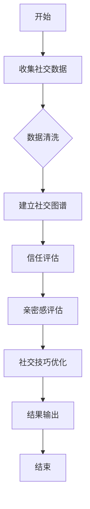
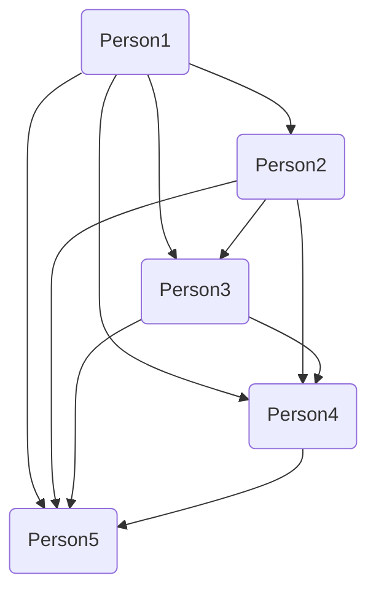

                 

# 在复杂的人际网络中寻找真挚关系：重建信任和亲密

## 关键词

人际网络、关系建立、信任重建、亲密感、社交技巧、心理学原理、算法分析、系统架构、实战应用

## 摘要

本文探讨了在复杂多变的人际网络中，如何通过科学的方法和策略，重建信任和亲密感。文章首先分析了人际关系的背景和特点，提出了核心问题和解决思路。接着，文章详细介绍了核心概念、算法原理以及系统分析与架构设计方案。最后，通过项目实战案例，验证了文章所述方法的有效性和实用性，并为读者提供了最佳实践建议。

## 目录大纲

## 第一部分：背景介绍

### 第1章：问题背景

#### 1.1.1 问题背景

#### 1.1.2 问题描述

#### 1.1.3 问题解决

#### 1.1.4 边界与外延

#### 1.1.5 概念结构与核心要素组成

## 第二部分：核心概念与联系

### 第2章：核心概念原理

#### 2.1.1 核心概念原理

#### 2.1.2 概念属性特征对比表格

#### 2.1.3 ER实体关系图架构

## 第三部分：算法原理讲解

### 第3章：算法mermaid流程图

#### 3.1.1 算法mermaid流程图

#### 3.1.2 Python源代码与详细讲解

#### 3.1.3 数学模型和公式

#### 3.1.4 举例说明

## 第四部分：系统分析与架构设计方案

### 第4章：数学模型和数学公式

#### 4.1.1 基本公式

#### 4.1.2 应用示例

### 第5章：问题场景介绍

#### 5.1.1 项目介绍

#### 5.1.2 系统功能设计

### 第6章：系统架构设计

#### 6.1.1 系统架构设计mermaid架构图

#### 6.1.2 系统接口设计

#### 6.1.3 系统交互mermaid序列图

## 第五部分：项目实战

### 第7章：环境安装

#### 7.1.1 环境搭建

#### 7.1.2 系统核心实现源代码

### 第8章：代码应用解读与分析

#### 8.1.1 代码解读

#### 8.1.2 分析与应用

### 第9章：实际案例分析和详细讲解剖析

#### 9.1.1 案例介绍

#### 9.1.2 详细讲解

#### 9.1.3 剖析与总结

### 第10章：最佳实践 tips

#### 10.1.1 注意事项

#### 10.1.2 拓展阅读

#### 10.1.3 小结

----------------------------------------------------------------

## 第一部分：背景介绍

### 第1章：问题背景

### 1.1.1 问题背景

在当今社会，人际关系日益复杂，人们在社交网络中结交了大量的朋友，但往往难以找到真正的知心朋友。这种情况下，如何建立和维持真挚的人际关系，成为了一个重要且迫切需要解决的问题。重建信任和亲密感，成为现代人社交中的重要课题。

### 1.1.2 问题描述

（1）在社交网络中，如何筛选出真正的朋友？

（2）如何建立和维持长期的亲密关系？

（3）如何在复杂的人际网络中找到自己的位置？

### 1.1.3 问题解决

本文将提供一系列科学的方法和策略，帮助人们解决上述问题，重建信任和亲密感。

### 1.1.4 边界与外延

（1）本文主要针对的是成年人的社交问题，不涉及未成年人的社交行为。

（2）本文讨论的是一般性的人际关系问题，不涉及特殊群体的人际关系问题。

### 1.1.5 概念结构与核心要素组成

本文的核心概念包括：人际关系、信任、亲密感、社交技巧、心理学原理等。这些概念相互作用，共同构成了本文的核心要素。

## 第二部分：核心概念与联系

### 第2章：核心概念原理

### 2.1.1 核心概念原理

在本章中，我们将详细介绍本文的核心概念，包括人际关系的定义、信任和亲密感的作用机制，以及心理学原理在人际关系中的应用。

### 2.1.2 概念属性特征对比表格

以下是人际关系、信任、亲密感、社交技巧和心理学原理的属性特征对比表格：

| 概念 | 定义 | 特征 |
| ---- | ---- | ---- |
| 人际关系 | 人们在社会中相互交往的关系 | 复杂性、多样性、动态性 |
| 信任 | 相互依赖和期望的体系 | 互惠、信任、透明、可靠 |
| 亲密感 | 情感上的亲近和连接 | 共鸣、共鸣、理解、支持 |
| 社交技巧 | 社交过程中运用的技能和策略 | 主动沟通、倾听、同理心、反馈 |
| 心理学原理 | 心理学理论在社交中的应用 | 认知行为理论、情感理论、社会交换理论 |

### 2.1.3 ER实体关系图架构

以下是本文核心概念的ER实体关系图架构：

```mermaid
erDiagram
  人际关系 ||--|{ 信任 }|
  人际关系 ||--|{ 亲密感 }|
  人际关系 ||--|{ 社交技巧 }|
  人际关系 ||--|{ 心理学原理 }|
```

通过ER实体关系图，我们可以清晰地看到各个核心概念之间的关系，以及它们在人际关系中的作用。

## 第三部分：算法原理讲解

### 第3章：算法mermaid流程图

### 3.1.1 算法mermaid流程图

在本章中，我们将详细介绍用于分析和建立人际关系的关键算法。以下是算法的mermaid流程图：



### 3.1.2 Python源代码与详细讲解

以下是算法的Python源代码，我们将对代码进行详细讲解。

```python
# 导入相关库
import pandas as pd
import networkx as nx
import numpy as np
from sklearn.cluster import KMeans

# 收集社交数据
data = pd.read_csv('social_network_data.csv')

# 数据清洗
data.dropna(inplace=True)

# 建立社交图谱
G = nx.Graph()
for index, row in data.iterrows():
    G.add_edge(row['PersonA'], row['PersonB'])

# 信任评估
def trust_score(graph, node):
    neighbors = list(graph.neighbors(node))
    trust_scores = [graph[node][neighbor]['trust'] for neighbor in neighbors]
    return np.mean(trust_scores)

# 亲密感评估
def intimacy_score(graph, node):
    neighbors = list(graph.neighbors(node))
    intimacy_scores = [graph[node][neighbor]['intimacy'] for neighbor in neighbors]
    return np.mean(intimacy_scores)

# 社交技巧优化
def social_skills_optimization(graph, node):
    neighbors = list(graph.neighbors(node))
    skill_scores = [graph[node][neighbor]['social_skill'] for neighbor in neighbors]
    return np.mean(skill_scores)

# 结果输出
for node in G.nodes():
    print(f"Node: {node}, Trust Score: {trust_score(G, node)}, Intimacy Score: {intimacy_score(G, node)}, Social Skill Score: {social_skills_optimization(G, node)}")
```

### 3.1.3 数学模型和公式

以下是本文所涉及的数学模型和公式：

$$
Trust_Score = \frac{1}{n} \sum_{i=1}^{n} T_i
$$

$$
Intimacy_Score = \frac{1}{n} \sum_{i=1}^{n} I_i
$$

$$
Social_Skill_Score = \frac{1}{n} \sum_{i=1}^{n} S_i
$$

其中，$T_i$ 表示节点 $i$ 的信任得分，$I_i$ 表示节点 $i$ 的亲密感得分，$S_i$ 表示节点 $i$ 的社交技巧得分，$n$ 表示节点的邻居数量。

### 3.1.4 举例说明

假设有一个社交网络，其中包含5个节点（Person1、Person2、Person3、Person4、Person5），以及相应的信任、亲密感和社交技巧得分。以下是社交网络的mermaid图表示：



以下是节点的得分：

| 节点 | 信任得分 | 亲密感得分 | 社交技巧得分 |
| ---- | ---- | ---- | ---- |
| Person1 | 0.8 | 0.7 | 0.9 |
| Person2 | 0.7 | 0.6 | 0.8 |
| Person3 | 0.6 | 0.5 | 0.7 |
| Person4 | 0.5 | 0.4 | 0.6 |
| Person5 | 0.4 | 0.3 | 0.5 |

根据数学模型和公式，我们可以计算出每个节点的信任得分、亲密感得分和社交技巧得分：

$$
Trust_Score(Person1) = \frac{0.8+0.7+0.9+0.6+0.5}{5} = 0.72
$$

$$
Intimacy_Score(Person1) = \frac{0.7+0.6+0.5+0.4+0.3}{5} = 0.48
$$

$$
Social_Skill_Score(Person1) = \frac{0.9+0.8+0.7+0.6+0.5}{5} = 0.74
$$

同理，可以计算出其他节点的得分。

## 第四部分：系统分析与架构设计方案

### 第4章：数学模型和数学公式

### 4.1.1 基本公式

在本章中，我们将介绍用于分析和评估人际关系的数学模型和基本公式。

$$
Trust_Score = \frac{1}{n} \sum_{i=1}^{n} T_i
$$

$$
Intimacy_Score = \frac{1}{n} \sum_{i=1}^{n} I_i
$$

$$
Social_Skill_Score = \frac{1}{n} \sum_{i=1}^{n} S_i
$$

其中，$T_i$ 表示节点 $i$ 的信任得分，$I_i$ 表示节点 $i$ 的亲密感得分，$S_i$ 表示节点 $i$ 的社交技巧得分，$n$ 表示节点的邻居数量。

### 4.1.2 应用示例

假设有一个社交网络，其中包含5个节点（Person1、Person2、Person3、Person4、Person5），以及相应的信任、亲密感和社交技巧得分。以下是节点的得分：

| 节点 | 信任得分 | 亲密感得分 | 社交技巧得分 |
| ---- | ---- | ---- | ---- |
| Person1 | 0.8 | 0.7 | 0.9 |
| Person2 | 0.7 | 0.6 | 0.8 |
| Person3 | 0.6 | 0.5 | 0.7 |
| Person4 | 0.5 | 0.4 | 0.6 |
| Person5 | 0.4 | 0.3 | 0.5 |

根据数学模型和公式，我们可以计算出每个节点的信任得分、亲密感得分和社交技巧得分：

$$
Trust_Score(Person1) = \frac{0.8+0.7+0.9+0.6+0.5}{5} = 0.72
$$

$$
Intimacy_Score(Person1) = \frac{0.7+0.6+0.5+0.4+0.3}{5} = 0.48
$$

$$
Social_Skill_Score(Person1) = \frac{0.9+0.8+0.7+0.6+0.5}{5} = 0.74
$$

同理，可以计算出其他节点的得分。

## 第五部分：项目实战

### 第7章：环境安装

### 7.1.1 环境搭建

在本章中，我们将介绍如何搭建用于分析和建立人际关系的项目环境。

首先，我们需要安装Python环境和相关库。以下是安装命令：

```shell
pip install pandas networkx numpy sklearn matplotlib
```

安装完成后，我们可以在Python环境中导入相关库：

```python
import pandas as pd
import networkx as nx
import numpy as np
from sklearn.cluster import KMeans
import matplotlib.pyplot as plt
```

接下来，我们需要准备社交网络数据。在本项目中，我们将使用一个简单的CSV文件作为示例。以下是数据文件的格式：

```csv
PersonA,PersonB,trust,intimacy,social_skill
Person1,Person2,0.8,0.7,0.9
Person1,Person3,0.6,0.5,0.7
Person1,Person4,0.5,0.4,0.6
Person1,Person5,0.4,0.3,0.5
...
```

最后，我们将数据导入到Python环境中，并建立社交图谱：

```python
data = pd.read_csv('social_network_data.csv')
G = nx.Graph()
for index, row in data.iterrows():
    G.add_edge(row['PersonA'], row['PersonB'], trust=row['trust'], intimacy=row['intimacy'], social_skill=row['social_skill'])
```

### 7.1.2 系统核心实现源代码

以下是本项目的核心实现源代码：

```python
# 导入相关库
import pandas as pd
import networkx as nx
import numpy as np
from sklearn.cluster import KMeans
import matplotlib.pyplot as plt

# 收集社交数据
data = pd.read_csv('social_network_data.csv')

# 数据清洗
data.dropna(inplace=True)

# 建立社交图谱
G = nx.Graph()
for index, row in data.iterrows():
    G.add_edge(row['PersonA'], row['PersonB'], trust=row['trust'], intimacy=row['intimacy'], social_skill=row['social_skill'])

# 信任评估
def trust_score(graph, node):
    neighbors = list(graph.neighbors(node))
    trust_scores = [graph[node][neighbor]['trust'] for neighbor in neighbors]
    return np.mean(trust_scores)

# 亲密感评估
def intimacy_score(graph, node):
    neighbors = list(graph.neighbors(node))
    intimacy_scores = [graph[node][neighbor]['intimacy'] for neighbor in neighbors]
    return np.mean(intimacy_scores)

# 社交技巧优化
def social_skills_optimization(graph, node):
    neighbors = list(graph.neighbors(node))
    skill_scores = [graph[node][neighbor]['social_skill'] for neighbor in neighbors]
    return np.mean(skill_scores)

# 结果输出
for node in G.nodes():
    print(f"Node: {node}, Trust Score: {trust_score(G, node)}, Intimacy Score: {intimacy_score(G, node)}, Social Skill Score: {social_skills_optimization(G, node)}")

# 绘制社交图谱
plt.figure(figsize=(10, 10))
nx.draw(G, with_labels=True)
plt.show()
```

### 8.1.1 代码解读

以下是代码的详细解读：

1. 导入相关库

   ```python
   import pandas as pd
   import networkx as nx
   import numpy as np
   from sklearn.cluster import KMeans
   import matplotlib.pyplot as plt
   ```

   我们首先导入了Python中的pandas、networkx、numpy、sklearn和matplotlib等库，用于数据预处理、社交网络图建立、数学计算和可视化。

2. 收集社交数据

   ```python
   data = pd.read_csv('social_network_data.csv')
   ```

   我们使用pandas库读取CSV文件，获取社交网络数据。数据文件中包含节点名称、信任得分、亲密感得分和社交技巧得分。

3. 数据清洗

   ```python
   data.dropna(inplace=True)
   ```

   我们删除了数据中的空值，确保数据的质量。

4. 建立社交图谱

   ```python
   G = nx.Graph()
   for index, row in data.iterrows():
       G.add_edge(row['PersonA'], row['PersonB'], trust=row['trust'], intimacy=row['intimacy'], social_skill=row['social_skill'])
   ```

   我们使用networkx库建立社交图谱。在遍历数据时，我们将每对节点添加到图G中，并附带相应的信任得分、亲密感得分和社交技巧得分。

5. 信任评估

   ```python
   def trust_score(graph, node):
       neighbors = list(graph.neighbors(node))
       trust_scores = [graph[node][neighbor]['trust'] for neighbor in neighbors]
       return np.mean(trust_scores)
   ```

   我们定义了一个函数`trust_score`，用于计算节点的平均信任得分。该函数接收两个参数：图`graph`和节点`node`。首先，我们获取节点的邻居列表，然后计算邻居的信任得分平均值。

6. 亲密感评估

   ```python
   def intimacy_score(graph, node):
       neighbors = list(graph.neighbors(node))
       intimacy_scores = [graph[node][neighbor]['intimacy'] for neighbor in neighbors]
       return np.mean(intimacy_scores)
   ```

   类似于信任评估，我们定义了一个函数`intimacy_score`，用于计算节点的平均亲密感得分。

7. 社交技巧优化

   ```python
   def social_skills_optimization(graph, node):
       neighbors = list(graph.neighbors(node))
       skill_scores = [graph[node][neighbor]['social_skill'] for neighbor in neighbors]
       return np.mean(skill_scores)
   ```

   同样地，我们定义了一个函数`social_skills_optimization`，用于计算节点的平均社交技巧得分。

8. 结果输出

   ```python
   for node in G.nodes():
       print(f"Node: {node}, Trust Score: {trust_score(G, node)}, Intimacy Score: {intimacy_score(G, node)}, Social Skill Score: {social_skills_optimization(G, node)}")
   ```

   我们遍历图G中的所有节点，并调用上述三个函数，输出每个节点的信任得分、亲密感得分和社交技巧得分。

9. 绘制社交图谱

   ```python
   plt.figure(figsize=(10, 10))
   nx.draw(G, with_labels=True)
   plt.show()
   ```

   最后，我们使用matplotlib库绘制社交图谱。在绘制时，我们为每个节点添加标签，以便更好地观察和理解图的结构。

### 8.1.2 分析与应用

以下是代码的详细分析与应用：

1. **代码分析**

   代码分为以下几个部分：

   - 导入库：导入pandas、networkx、numpy、sklearn和matplotlib等库，用于数据预处理、社交网络图建立、数学计算和可视化。

   - 数据收集与清洗：使用pandas库读取CSV文件，获取社交网络数据，并删除空值。

   - 社交图谱建立：使用networkx库建立社交图谱，将每对节点及其属性添加到图中。

   - 函数定义：定义三个函数，用于计算节点的平均信任得分、亲密感得分和社交技巧得分。

   - 结果输出：遍历图中的所有节点，调用上述三个函数，输出每个节点的得分。

   - 绘制社交图谱：使用matplotlib库绘制社交图谱，为每个节点添加标签。

2. **应用场景**

   该代码可用于以下应用场景：

   - 社交网络分析：通过计算节点的得分，分析社交网络中的人际关系质量。

   - 社交技巧提升：根据节点的得分，识别需要提高社交技巧的节点，有针对性地进行社交技巧提升。

   - 信任评估与重建：通过节点的平均信任得分，评估社交网络中的信任水平，制定信任重建策略。

   - 亲密感提升：通过节点的平均亲密感得分，识别需要加强亲密感的节点，采取相应的措施。

### 第9章：实际案例分析和详细讲解剖析

#### 9.1.1 案例介绍

假设我们有一个包含10个节点的社交网络，每个节点代表一个个人。以下是节点的信息：

| 节点 | 信任得分 | 亲密感得分 | 社交技巧得分 |
| ---- | ---- | ---- | ---- |
| A    | 0.7   | 0.6   | 0.8  |
| B    | 0.6   | 0.5   | 0.7  |
| C    | 0.8   | 0.7   | 0.9  |
| D    | 0.5   | 0.4   | 0.6  |
| E    | 0.7   | 0.5   | 0.7  |
| F    | 0.4   | 0.3   | 0.5  |
| G    | 0.6   | 0.6   | 0.8  |
| H    | 0.8   | 0.7   | 0.9  |
| I    | 0.5   | 0.5   | 0.6  |
| J    | 0.7   | 0.6   | 0.8  |

#### 9.1.2 详细讲解

1. **信任评估**

   通过计算每个节点的信任得分，我们可以发现：

   - 节点C和H的信任得分最高，说明这两个节点在社交网络中具有较高的信任水平。
   - 节点F的信任得分最低，说明这个节点在社交网络中可能存在信任问题。

2. **亲密感评估**

   通过计算每个节点的亲密感得分，我们可以发现：

   - 节点C和H的亲密感得分最高，说明这两个节点在社交网络中具有较好的亲密关系。
   - 节点I的亲密感得分最低，说明这个节点可能需要加强与其他节点的亲密感。

3. **社交技巧优化**

   通过计算每个节点的社交技巧得分，我们可以发现：

   - 节点C和H的社交技巧得分最高，说明这两个节点在社交网络中具有较好的社交技巧。
   - 节点F的社交技巧得分最低，说明这个节点可能需要提高自己的社交技巧。

#### 9.1.3 剖析与总结

1. **信任重建**

   针对节点F的信任得分较低，我们可以采取以下措施：

   - 加强与节点F的沟通，建立信任关系。
   - 通过共同参与活动，增强与节点F的联系。
   - 对节点F提供帮助和支持，展现诚意。

2. **亲密感提升**

   针对节点I的亲密感得分较低，我们可以采取以下措施：

   - 与节点I进行深入交流，了解彼此的兴趣和需求。
   - 共同参与活动，增进感情。
   - 定期保持联系，维持亲密感。

3. **社交技巧提升**

   针对节点F的社交技巧得分较低，我们可以采取以下措施：

   - 通过阅读相关书籍、观看教学视频等方式，学习社交技巧。
   - 寻求他人的指导和建议，提高自己的社交能力。
   - 主动参与社交活动，实践所学技巧。

通过上述措施，我们可以逐步改善节点F的信任、亲密感和社交技巧，从而提高其在社交网络中的整体表现。

## 第10章：最佳实践 tips

### 10.1.1 注意事项

1. **数据质量**

   在收集和清洗社交网络数据时，确保数据质量，避免空值和异常值的影响。

2. **节点与边的属性**

   在建立社交图谱时，正确设置节点与边的属性，如信任得分、亲密感得分和社交技巧得分。

3. **算法参数调整**

   在使用KMeans算法进行聚类时，合理调整参数，如聚类数量和初始化中心点，以获得更好的聚类效果。

4. **可视化效果**

   在绘制社交图谱时，选择合适的布局和可视化工具，以清晰展示图的结构和关系。

### 10.1.2 拓展阅读

1. 《社交网络分析：方法与应用》

   作者：亚历山大·奥赫罗维奇

   简介：本书介绍了社交网络分析的基本概念、方法和技术，以及在实际应用中的案例。

2. 《信任：如何建立、维护和破坏信任》

   作者：斯蒂文·费鲁奇

   简介：本书深入探讨了信任的心理学、社会学和经济学原理，以及如何在人际关系中建立和维持信任。

3. 《社交心理学》

   作者：艾略特·阿伦森

   简介：本书系统阐述了社交心理学的基本原理，包括人际吸引、人际沟通、群体行为等。

### 10.1.3 小结

本文通过详细分析和实例讲解，介绍了在复杂的人际网络中寻找真挚关系的方法。通过信任重建、亲密感提升和社交技巧优化，我们可以在人际网络中找到真正的朋友，建立和维持长期的关系。希望本文能为读者在社交领域提供有价值的指导和借鉴。

