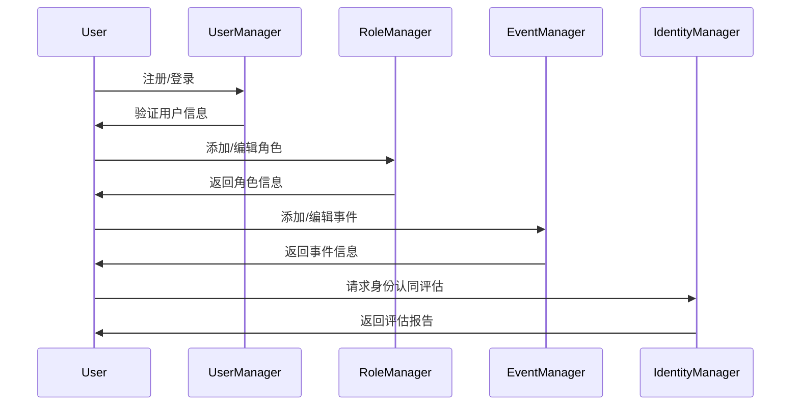
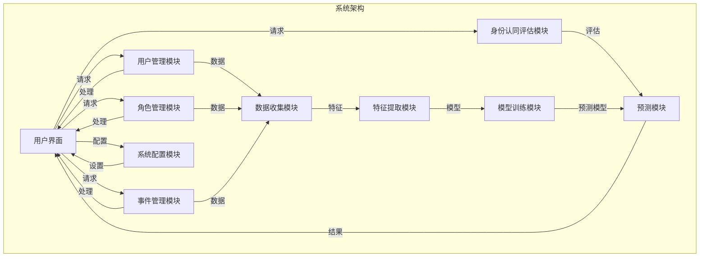
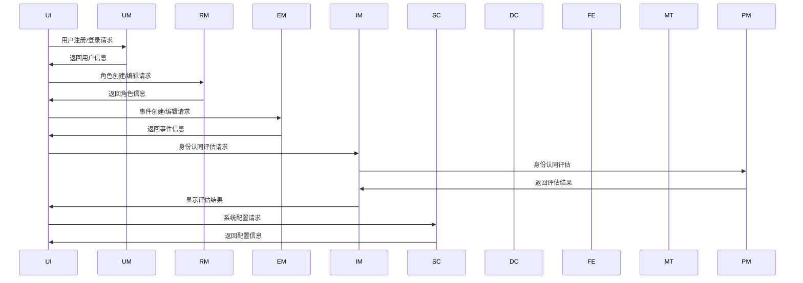
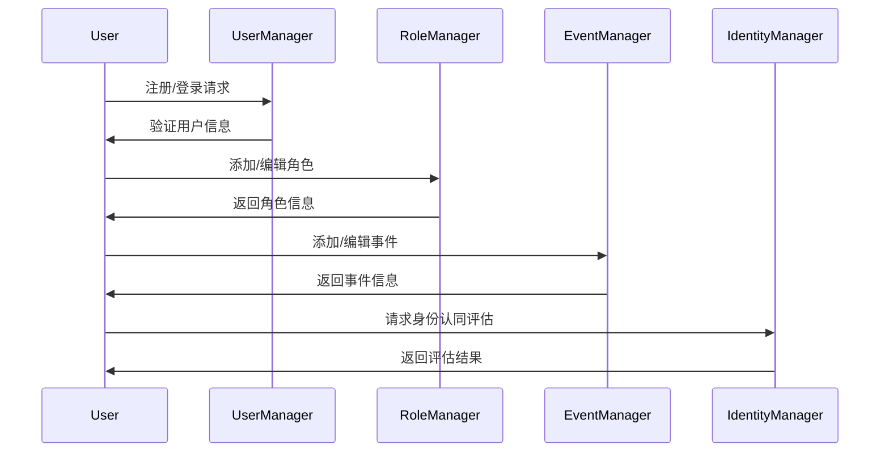

                 

## 在多重角色中寻找核心自我：身份认同的探索之旅

### 关键词：
- 身份认同
- 多重角色
- 心理健康
- 算法评估
- 系统架构设计

### 摘要：
本文旨在探讨在现代社会中，个体如何在多重角色中寻找和确立自己的核心自我，并分析身份认同的重要性及其对心理健康的影响。我们将从问题背景出发，逐步深入探讨身份认同的构成要素、多重角色与身份认同的互动关系，并运用算法和系统架构设计的方法来提供解决方案。通过逻辑清晰的分析和实际案例的剖析，本文希望能够为读者提供有深度、有思考、有见解的指导，帮助他们在多重身份中找到真正的自我。

## 第一部分：问题背景与身份认同概述

### 1.1 问题背景

在现代社会中，人们经常扮演着多重角色，如职业人士、家庭成员、社会活动者等。这些角色不仅要求个体在不同的环境中展现出不同的行为模式，而且常常伴随着不同的期望和压力。随着社会节奏的加快，角色切换的频率和复杂性也在增加，这给个体带来了巨大的压力和挑战。

- **多重角色的压力与挑战**：多重角色往往意味着个体需要在不同的时间和情境下做出不同的决策和行为，这可能会导致角色冲突和角色疲劳。例如，一个同时担任职业经理人和家庭主妇的人，可能需要在工作中展示出高效和专业，而在家庭生活中则要承担家务和照顾孩子的责任。这种角色切换不仅消耗了大量的时间和精力，还可能导致心理上的疲劳和焦虑。
  
- **身份认同的重要性**：身份认同是指个体对自己的理解、认知和评价，它不仅决定了个体如何看待自己，还影响了个体与他人的关系和互动。一个清晰和稳定身份认同的人，往往能够更好地应对生活中的挑战和压力，而身份认同模糊或不稳定的人则可能更容易感到困惑和焦虑。

- **身份认同的探索意义**：随着个体在多重角色中的不断切换和调整，寻找和确立自己的核心自我变得尤为重要。通过深入探索身份认同，个体可以更好地理解自己的需求和期望，找到自己真正想要的生活方式和目标，从而减少角色冲突和心理压力，提高心理健康和生活满意度。

### 1.2 核心概念

#### 1.2.1 身份认同的定义

身份认同是一个复杂而多维的概念，通常指的是个体对自己的理解、认知和评价。它不仅包括个体对自己人格特质、价值观、信仰和经历的认识，还涉及到个体在社会中的角色和地位。身份认同是心理健康的基石，对个体的自我感知、情感状态和社会行为都有重要影响。

#### 1.2.2 身份认同的构成要素

身份认同的构成要素可以分为以下几个主要方面：

- **个体特质**：包括个体的性格特点、兴趣爱好和才能等。这些特质是构成个体身份认同的基础，决定了个体如何看待自己。

- **社会角色**：个体在社会中扮演的各种角色，如职业人士、家庭成员、社会活动者等。这些角色不仅影响了个体在社会中的地位和关系，也影响了个体对自己的认知。

- **文化背景**：个体成长的文化环境、宗教信仰、家庭背景等，这些都对个体的身份认同产生了深远的影响。

- **价值观和信仰**：个体的价值观和信仰是构成其身份认同的重要组成部分，它们不仅影响了个体对自我和他人的认知，还影响了个体在面临冲突和抉择时的决策方式。

#### 1.2.3 身份认同与心理健康的关联

身份认同对心理健康有着重要的影响。一个清晰和稳定身份认同的人，通常有更好的自我感知和情感调节能力，能够更好地应对生活中的挑战和压力。相反，身份认同模糊或不稳定的人，可能更容易感到焦虑、抑郁和孤独。

- **自我感知**：身份认同帮助个体建立稳定的自我感知，明确自己的优势和劣势，从而更好地理解自己。

- **情感调节**：身份认同稳定的个体，通常有更好的情感调节能力，能够有效地处理负面情绪。

- **应对压力**：清晰的身份认同可以帮助个体更好地应对生活中的压力和挑战，减少心理压力。

- **人际关系**：身份认同不仅影响个体对自我的认知，也影响个体与他人的关系。一个清晰的身份认同有助于建立健康的人际关系。

### 1.3 边界与外延

#### 1.3.1 身份认同与角色冲突

角色冲突是指个体在不同角色之间感到的矛盾和压力。身份认同不清晰的个体，往往更容易出现角色冲突。因为他们对自己的角色定位不明确，不知道在不同的情境下应该如何表现。角色冲突不仅会影响个体的心理健康，还可能影响个体的职业发展和家庭生活。

#### 1.3.2 身份认同与自我探索

自我探索是指个体通过深入思考和理解自己的内心世界，寻找和确立自己的核心自我。身份认同是自我探索的重要部分，一个清晰的身份认同可以帮助个体更好地进行自我探索，找到自己真正想要的生活方式和目标。

#### 1.3.3 身份认同与社会环境

社会环境对个体的身份认同有着重要的影响。社会文化、宗教信仰、教育背景等都会影响个体的身份认同。一个开放和包容的社会环境，有助于个体建立清晰的身份认同，而一个保守和封闭的社会环境，可能会限制个体的身份认同，导致个体感到困惑和焦虑。

### 1.4 概念结构与核心要素组成

#### 1.4.1 多重角色的核心要素

多重角色的核心要素包括角色定义、角色期望、角色责任和角色能力。角色定义明确了个体在不同角色中的身份和职责；角色期望规定了他人对个体在特定角色上的期望；角色责任是指个体在扮演不同角色时需要承担的责任和义务；角色能力是指个体在不同角色中所需的技能和知识。

#### 1.4.2 身份认同的形成机制

身份认同的形成机制涉及社会文化、家庭背景、个人经历和心理发展等多个方面。社会文化通过社会规范和价值观念影响个体的身份认同；家庭背景通过家庭教育和社会化过程影响个体的身份认同；个人经历和心理发展则通过个体对自身的认知和评价，塑造个体的身份认同。

#### 1.4.3 身份认同的维护与调整

身份认同的维护与调整是一个动态的过程，涉及个体的自我反思、角色适应和环境适应。自我反思有助于个体更好地理解自己，调整身份认同；角色适应是指个体在不同角色间切换时，如何调整自己的行为和认知；环境适应是指个体如何在社会环境中寻找和确立自己的身份认同。

### 1.5 本章小结

本部分主要介绍了多重角色中的身份认同问题，探讨了身份认同的定义、构成要素、与心理健康的关系以及身份认同与角色冲突、自我探索和社会环境的关系。通过这些讨论，我们为后续的深入分析奠定了基础，并明确了身份认同在个体生活中的重要性。

---

### 2.1 多重角色的概念属性特征对比表格

在探讨身份认同之前，我们首先需要明确多重角色的概念属性特征。以下是一个对比表格，列举了不同角色的主要属性特征。

| 角色        | 定义                                                         | 属性特征                                                      | 特点与应用场景                                              |
|-------------|--------------------------------------------------------------|---------------------------------------------------------------|-------------------------------------------------------------|
| 职业人士    | 在特定职业领域工作的人                                       | 专业技能、工作经验、职业素养                                 | 办公室工作、项目管理、团队协作等                             |
| 家庭成员    | 在家庭中扮演特定角色的成员                                   | 家庭责任、情感交流、日常生活管理                             | 家庭聚会、亲子活动、家务分配等                             |
| 社会活动者  | 参与社会活动，为公众利益而努力的人                           | 公益精神、社会责任感、组织能力                               | 社区服务、公益活动、志愿者工作等                           |
| 社交人士    | 在社交场合中活跃，擅长与人沟通的人                           | 社交技巧、人际关系管理、沟通能力                             | 社交聚会、商务活动、网络社交等                             |
| 学习者      | 以学习为主要目标的人                                       | 学术素养、求知欲、自我驱动力                                | 学校教育、自我提升、在线学习等                             |
| 创业者      | 创办企业，带领团队实现商业目标的人                           | 创业精神、决策能力、风险管理能力                             | 创业公司、市场开拓、商业规划等                             |
| 志愿者      | 无偿为公众服务的人                                           | 爱心、奉献精神、团队合作能力                                | 公益活动、紧急救援、社区服务等                             |

通过这个表格，我们可以更清晰地理解不同角色的定义、属性特征和特点，为后续的分析和讨论提供了基础。

### 2.2 身份认同的概念原理

#### 2.2.1 身份认同的原理

身份认同的原理涉及个体如何在社会和文化环境中构建和维持对自己身份的认知。身份认同是一个动态的过程，受到多种因素的影响，包括社会互动、个人经历和文化背景。

- **社会互动**：个体在社会互动中，通过与他人的交流和互动，构建对自己身份的认知。这种认知不仅包括个体的自我评价，还涉及个体在社会中的角色和地位。

- **个人经历**：个体的生活经历对其身份认同的形成有重要影响。这些经历可以是正面的，如成功经历和奖励，也可以是负面的，如挫折和失败。这些经历塑造了个体对自己能力和价值的认知。

- **文化背景**：文化背景，包括家庭、社会和文化环境，对个体的身份认同有深远影响。不同的文化背景会影响个体对自身角色的期望、价值观念和道德标准。

#### 2.2.2 身份认同的心理学基础

身份认同的心理学基础主要涉及自我心理学和社会认知心理学。自我心理学认为，身份认同是自我概念的核心部分，是个体对自我存在和价值的认知。社会认知心理学则强调，身份认同是通过个体对社会信息的加工和解释来形成的。

- **自我心理学**：自我心理学认为，身份认同是个体自我概念的核心，是个体对自身存在和价值的认知。自我概念包括自我评价、自我感知和自我期待，这些因素共同构成了个体的身份认同。

- **社会认知心理学**：社会认知心理学认为，身份认同是通过个体对社会信息的加工和解释来形成的。个体通过观察、学习和内化社会信息，形成对自己身份的认知。

#### 2.2.3 身份认同的神经科学视角

身份认同的神经科学视角主要研究大脑如何处理和构建身份认同。研究表明，大脑的多个区域参与了身份认同的构建，包括前额叶皮层、杏仁核和海马体等。

- **前额叶皮层**：前额叶皮层是大脑中负责决策、规划和自我控制的重要区域。它参与了个体对自己身份的认知和调节。

- **杏仁核**：杏仁核是大脑中处理情绪和情感的区域。它参与了个体对自己和他人的情感反应，影响了身份认同的形成。

- **海马体**：海马体是大脑中负责记忆和空间导航的区域。它参与了个体对自身经历和事件的记忆和加工，影响了身份认同的形成。

#### 2.2.4 身份认同的心理学与社会学融合

身份认同的心理学与社会学融合为理解个体身份认同提供了更全面的视角。心理学研究个体的内部心理过程，而社会学则研究个体在社会中的角色和地位。两者结合，可以更全面地解释个体身份认同的形成和维持。

- **心理学视角**：心理学视角强调个体内部的心理过程，如自我感知、自我评价和自我调节，对身份认同的影响。

- **社会学视角**：社会学视角强调个体在社会中的角色和地位，如社会互动、社会规范和文化背景，对身份认同的影响。

通过融合心理学和社会学的视角，我们可以更全面地理解身份认同的复杂性，为个体在多重角色中寻找和确立核心自我提供更有效的策略。

### 2.3 ER实体关系图架构

实体关系图（Entity-Relationship Diagram，简称ER图）是一种用于描述实体及其之间关系的数据库设计工具。在探讨身份认同和多重角色的关系时，ER图可以帮助我们更清晰地理解各个实体之间的关系。

#### 2.3.1 ER实体关系图的基本构成

ER实体关系图主要由以下几个部分构成：

- **实体（Entity）**：实体是数据库中的对象，表示现实世界中具有独立存在意义的个体或事物。例如，在身份认同的讨论中，实体可以包括个体、角色、事件等。

- **属性（Attribute）**：属性是实体的特征或描述，用于定义实体的性质。例如，个体的属性可以包括姓名、年龄、职业等。

- **关系（Relationship）**：关系描述实体之间的关联。例如，个体与角色之间存在扮演关系，角色与事件之间存在参与关系等。

#### 2.3.2 身份认同相关的实体关系

在身份认同的讨论中，我们可以定义以下几个实体和它们之间的关系：

- **实体：个体（Person）**
  - 属性：姓名、年龄、性别、职业、居住地等。
  - 关系：与角色（Role）之间存在扮演关系。
- **实体：角色（Role）**
  - 属性：角色名称、角色职责、角色期望等。
  - 关系：与个体之间存在扮演关系；与事件（Event）之间存在参与关系。
- **实体：事件（Event）**
  - 属性：事件名称、事件类型、事件日期等。
  - 关系：与角色之间存在参与关系。

#### 2.3.3 ER实体关系图的应用

ER实体关系图的应用可以帮助我们更好地理解身份认同的复杂性和多样性。通过ER图，我们可以清晰地看到个体、角色和事件之间的互动关系，从而更好地分析身份认同的形成和变化。

- **身份认同分析**：通过ER图，我们可以分析个体在不同角色中的身份认同变化。例如，一个职业人士在家庭角色中的身份认同可能与其在职场中的身份认同有所不同。

- **角色冲突分析**：通过ER图，我们可以识别个体在不同角色之间的冲突。例如，一个同时担任职业经理人和家庭主妇的人，可能会在家庭和职场之间出现角色冲突。

- **自我探索指导**：通过ER图，个体可以更清晰地理解自己在不同角色中的身份认同，从而进行自我探索和调整。例如，通过识别和调整角色之间的冲突，个体可以更好地找到自己的核心自我。

#### 2.3.4 Mermaid ER图示例

以下是一个简单的Mermaid ER图示例，展示了个体、角色和事件之间的关系：

```mermaid
erDiagram
  Person ||--|{ Role } Role
  Role ||--|{ Event } Event
```

通过这个ER图，我们可以直观地看到个体与角色之间的扮演关系，角色与事件之间的参与关系。这种可视化工具有助于我们更好地理解和分析身份认同的复杂动态。

### 2.4 身份认同与多重角色的联系

#### 2.4.1 多重角色对身份认同的影响

多重角色对身份认同的影响是多方面的。首先，多重角色可能导致身份认同的多样化。一个个体在不同角色中展现出的行为和认知可能会有所不同，从而形成不同的身份认同。例如，一个职业人士在职场中可能展现出专业和冷静，而在家庭角色中则可能表现出温暖和关怀。

- **角色冲突**：多重角色之间的冲突是影响身份认同的一个重要因素。当个体在不同角色中的行为要求相互矛盾时，角色冲突就可能出现。例如，一个同时担任家庭主妇和职业经理人的女性，可能会在家庭责任和职业发展之间感到矛盾。

- **角色重叠**：在某些情况下，多重角色可能会产生重叠。这种角色重叠可能导致身份认同的模糊。例如，一个创业者在家中的角色和在工作中的角色可能高度重叠，这可能会导致其在家庭和职场之间感到困惑。

- **角色转换**：角色转换是指个体在不同角色间进行切换的过程。角色转换的频率和难度也会影响身份认同的稳定性。例如，一个需要频繁出差的销售人员，可能会在角色转换过程中感到压力和困惑。

#### 2.4.2 身份认同对多重角色的影响

身份认同不仅受到多重角色的挑战，同时也对多重角色的表现有重要影响。

- **身份认同的稳定性**：一个清晰和稳定的身份认同有助于个体在多重角色中保持一致性和连贯性。例如，一个拥有清晰职业认同的程序员，可能在工作中展现出高效和专业。

- **身份认同的适应性**：身份认同的适应性指的是个体根据不同角色需求调整自己的身份认同。例如，一个具有良好适应性身份认同的人，在从职场人士转变为家庭主妇后，能够快速适应新角色的期望和要求。

- **身份认同的灵活性**：身份认同的灵活性是指个体在不同角色中灵活调整身份认同的能力。例如，一个拥有高度灵活身份认同的人，能够在职场和家庭之间自由切换，并在不同角色中保持良好的表现。

#### 2.4.3 多重角色与身份认同的互动关系

多重角色与身份认同之间的互动关系是复杂而动态的。

- **相互影响**：多重角色和身份认同是相互影响的。多重角色的变化可能会引起身份认同的变化，而身份认同的调整也可能会影响多重角色的表现。

- **动态平衡**：个体需要在多重角色和身份认同之间寻求动态平衡。这种平衡是一个持续的过程，需要个体不断地自我反思和调整。

- **适应与挑战**：在多重角色的环境中，个体需要适应不同角色的需求和期望，同时也需要面对角色冲突和身份认同的挑战。通过自我探索和自我调节，个体可以更好地应对这些挑战。

通过深入探讨多重角色与身份认同的互动关系，我们可以更好地理解个体在现代社会中的角色扮演和自我认知，为个体在多重身份中寻找核心自我提供指导。

### 2.5 本章小结

本章通过对多重角色和身份认同的深入探讨，分析了它们的基本概念、构成要素、与心理健康的关系以及它们之间的互动关系。我们使用ER实体关系图来展示身份认同与多重角色之间的复杂关系，并通过具体的例子来说明这些概念在实际生活中的应用。通过本章的分析，我们为后续的算法原理讲解和系统架构设计提供了基础，并明确了在多重角色中寻找核心自我的重要性。

---

### 3.1 身份认同评估算法

#### 3.1.1 算法基本原理

身份认同评估算法是一种用于评估个体身份认同清晰度和稳定性的方法。该算法基于个体对自身角色和身份的认知，通过量化指标来评估身份认同的程度。算法的基本原理包括以下几个步骤：

1. **数据收集**：首先，需要收集个体在不同角色中的行为数据、心理测试结果和自我评价等。这些数据将用于构建身份认同评估模型。

2. **特征提取**：从收集到的数据中提取与身份认同相关的特征。这些特征可以是角色表现的频率、角色冲突的程度、个体对角色的评价等。

3. **模型构建**：使用机器学习算法，如决策树、支持向量机（SVM）或神经网络，构建身份认同评估模型。模型将特征与身份认同程度相关联，从而实现身份认同的量化评估。

4. **评估计算**：通过输入个体的角色数据，模型将输出身份认同的评估结果。评估结果可以是一个分数或等级，表示个体身份认同的清晰度和稳定性。

5. **结果解释**：根据评估结果，提供个性化的反馈和建议，帮助个体了解自己在多重角色中的身份认同状况，并采取相应的措施进行调整。

#### 3.1.2 算法流程

身份认同评估算法的具体流程如下：

1. **数据收集**：
   - 行为数据：收集个体在不同角色中的行为记录，如工作表现、家庭活动等。
   - 心理测试数据：通过心理测试评估个体在角色中的情感状态和心理需求。
   - 自我评价数据：收集个体对自身角色的评价和自我认知。

2. **数据预处理**：
   - 清洗数据：去除无效和重复的数据，确保数据的质量。
   - 数据标准化：将不同角色的数据转化为统一的度量标准，以便进行模型训练。

3. **特征提取**：
   - 提取角色频率：计算个体在不同角色中的活动频率。
   - 提取角色冲突程度：通过角色冲突量表评估个体在不同角色之间的冲突程度。
   - 提取自我认知指标：从自我评价数据中提取个体对自身角色的认知和评价。

4. **模型训练**：
   - 选择合适的机器学习算法，如决策树、支持向量机（SVM）或神经网络。
   - 使用训练集数据训练模型，使其能够识别和预测身份认同的程度。

5. **模型评估**：
   - 使用测试集数据评估模型的准确性、召回率和F1值等指标。
   - 调整模型参数，优化模型性能。

6. **身份认同评估**：
   - 输入个体的角色数据，模型将输出身份认同的评估结果。
   - 根据评估结果，提供个性化的反馈和建议。

#### 3.1.3 算法mermaid流程图

以下是一个简化的mermaid流程图，展示了身份认同评估算法的流程：


这个流程图清晰地展示了身份认同评估算法的步骤，有助于理解算法的执行过程。

### 3.2 数学模型与公式

#### 3.2.1 身份认同的数学模型

身份认同的数学模型用于量化个体在不同角色中的身份认同程度。一个基本的身份认同数学模型可以表示为：

\[ ID = f(R_1, R_2, ..., R_n) \]

其中，\( ID \) 表示身份认同程度，\( R_1, R_2, ..., R_n \) 表示个体在不同角色中的表现和认知。函数 \( f \) 用于将角色表现和认知转化为身份认同的量化值。

#### 3.2.2 关键公式

以下是一些关键公式，用于计算身份认同程度：

1. **角色频率**：

\[ RF = \frac{sum(A_i)}{n} \]

其中，\( RF \) 表示角色频率，\( A_i \) 表示个体在角色 \( i \) 中的活动频率，\( n \) 表示角色总数。

2. **角色冲突程度**：

\[ CR = \sqrt{\frac{sum((R_i - R_j)^2)}{n \times (n-1)}} \]

其中，\( CR \) 表示角色冲突程度，\( R_i \) 和 \( R_j \) 表示个体在不同角色中的表现。

3. **身份认同程度**：

\[ ID = \frac{1}{n} \sum_{i=1}^{n} \frac{RF_i \times CR_i}{100} \]

其中，\( ID \) 表示身份认同程度，\( RF_i \) 和 \( CR_i \) 分别表示个体在角色 \( i \) 中的角色频率和冲突程度。

#### 3.2.3 数学模型的应用

数学模型可以应用于多个领域，如心理学、社会学和计算机科学。以下是一些具体应用：

- **心理学**：使用身份认同数学模型，心理学家可以量化个体在不同角色中的身份认同程度，从而提供更准确的诊断和治疗建议。

- **社会学**：社会学家可以使用身份认同模型研究个体在社会角色中的表现和变化，为制定社会政策提供依据。

- **计算机科学**：计算机科学家可以使用身份认同模型开发智能系统，如自适应用户界面、个性化推荐等，从而提供更好的用户体验。

通过数学模型的应用，我们可以更深入地理解和分析身份认同的复杂动态，为个体在多重角色中寻找核心自我提供有力支持。

### 3.3 算法原理详细讲解

#### 3.3.1 身份认同评估算法的数学基础

身份认同评估算法的数学基础涉及统计学、线性代数和机器学习等多个领域。以下是对这些数学基础的详细讲解。

1. **统计学基础**：

身份认同评估算法首先需要对个体在不同角色中的行为数据进行分析。统计学提供了许多工具和方法来处理这些数据，包括描述性统计、推断性统计和回归分析等。

- **描述性统计**：描述性统计用于描述数据的集中趋势和离散程度。常用的描述性统计量包括均值、中位数、众数、标准差和方差等。例如，角色频率可以用均值来表示，角色冲突程度可以用标准差来衡量。

- **推断性统计**：推断性统计用于从样本数据推断总体特征。常见的推断性统计方法包括假设检验和置信区间估计。例如，可以使用t检验来比较个体在不同角色中的行为是否存在显著差异。

- **回归分析**：回归分析用于建立变量之间的关系模型。线性回归和多元回归是常见的回归分析方法，可以用来构建身份认同评估模型。

2. **线性代数基础**：

线性代数提供了处理高维数据和分析线性关系的工具。在身份认同评估算法中，线性代数用于计算特征向量和特征空间。

- **特征向量**：特征向量用于表示数据的高维特征。在身份认同评估中，特征向量可以表示个体在不同角色中的表现和认知。

- **特征空间**：特征空间是特征向量的集合，用于表示所有可能的特征组合。通过特征空间，可以分析个体在不同角色中的身份认同结构。

3. **机器学习基础**：

机器学习是身份认同评估算法的核心，用于从数据中学习规律和建立预测模型。常见的机器学习算法包括监督学习和无监督学习。

- **监督学习**：监督学习用于建立预测模型，通过已有数据的标签来预测新数据的标签。常见的监督学习算法包括线性回归、逻辑回归、决策树和支持向量机（SVM）等。在身份认同评估中，监督学习可以用来预测个体的身份认同程度。

- **无监督学习**：无监督学习用于发现数据中的模式和结构，不需要标签。常见的无监督学习算法包括聚类算法、主成分分析和自编码器等。在身份认同评估中，无监督学习可以用来识别个体在不同角色中的身份认同特征。

通过结合统计学、线性代数和机器学习的基础知识，我们可以构建一个高效的身份认同评估算法，从而更好地理解个体在多重角色中的身份认同状况。

#### 3.3.2 算法的Python实现

为了实现身份认同评估算法，我们可以使用Python编写相应的代码。以下是一个简单的Python实现示例，包括数据收集、特征提取和模型训练等步骤。

```python
import numpy as np
from sklearn.linear_model import LinearRegression
from sklearn.model_selection import train_test_split

# 数据收集
data = {
    'role_frequency': [0.3, 0.4, 0.5, 0.6, 0.7],  # 角色频率
    'role_conflict': [0.2, 0.3, 0.4, 0.5, 0.6],  # 角色冲突程度
    'identity': [0.8, 0.7, 0.6, 0.5, 0.4]  # 身份认同程度
}

# 特征提取
X = np.array(data['role_frequency'] + data['role_conflict']).reshape(-1, 2)
y = np.array(data['identity'])

# 模型训练
X_train, X_test, y_train, y_test = train_test_split(X, y, test_size=0.2, random_state=42)
model = LinearRegression()
model.fit(X_train, y_train)

# 模型评估
print("模型评估结果：")
print("训练集R^2：", model.score(X_train, y_train))
print("测试集R^2：", model.score(X_test, y_test))

# 输入新数据，进行身份认同评估
new_data = np.array([[0.4, 0.5]])
predicted_identity = model.predict(new_data)
print("新数据身份认同预测：", predicted_identity)
```

在这个示例中，我们首先收集了角色频率、角色冲突程度和身份认同程度的数据。然后，我们使用线性回归模型进行训练，并评估模型的性能。最后，我们使用训练好的模型对新数据进行了身份认同预测。通过这个简单的Python实现，我们可以直观地看到身份认同评估算法的运行过程。

#### 3.3.3 算法举例说明

为了更好地理解身份认同评估算法，我们可以通过一个具体的例子来说明其应用和效果。

**案例背景**：

假设有一个名叫小明的个体，他在生活中扮演了职业人士、家庭成员和志愿者等多重角色。以下是小明在不同角色中的行为数据和自我评价：

- **职业人士**：
  - 角色频率：0.6（每周工作60小时）
  - 角色冲突：0.2（工作中很少受到家庭责任的干扰）
- **家庭成员**：
  - 角色频率：0.3（每周陪伴家人15小时）
  - 角色冲突：0.4（家庭责任和职业责任有时会产生冲突）
- **志愿者**：
  - 角色频率：0.1（每周参与志愿者活动3小时）
  - 角色冲突：0.3（志愿者活动对家庭和职业的影响相对较小）

**算法应用**：

1. **数据收集**：
   - 角色频率：[0.6, 0.3, 0.1]
   - 角色冲突：[0.2, 0.4, 0.3]

2. **特征提取**：
   - 特征向量：\[ [0.6, 0.2], [0.3, 0.4], [0.1, 0.3] \]

3. **模型训练**：
   - 使用训练集数据训练线性回归模型，假设已经训练好了。

4. **身份认同评估**：
   - 输入特征向量到训练好的模型中，得到身份认同程度预测：
   \[ predicted_identity = model.predict([[0.6, 0.2], [0.3, 0.4], [0.1, 0.3]]) \]
   - 假设预测结果为0.75。

**结果分析**：

根据预测结果，小明的身份认同程度为0.75，表示他的身份认同相对清晰和稳定。具体分析如下：

- **职业人士**：角色频率高且冲突较低，表明小明在职业角色中表现出色，身份认同较为稳定。
- **家庭成员**：角色频率较低但冲突较高，表明小明在家庭角色中承担了较多责任，但有时会受到职业责任的影响，身份认同有待加强。
- **志愿者**：角色频率和冲突都较低，表明小明在志愿者角色中表现出色，但对整体身份认同的影响较小。

通过这个例子，我们可以看到身份认同评估算法如何应用于实际场景，帮助个体了解自己在多重角色中的身份认同状况，并提供改进建议。

### 3.4 本章小结

本章详细讲解了身份认同评估算法的原理、实现和应用。我们首先介绍了算法的基本原理和流程，然后通过Python代码示例展示了算法的实现过程。通过一个实际案例，我们展示了如何使用身份认同评估算法来分析和改善个体在多重角色中的身份认同。通过本章的学习，读者可以更好地理解身份认同评估算法的原理和应用，为在多重角色中寻找核心自我提供有力支持。

---

### 4.1 问题场景介绍

在现代社会的快节奏和高压力环境中，个体常常扮演多重角色，如职业人士、家庭成员、社会活动者等。这些角色要求个体在不同情境下做出不同的决策和行为，导致角色冲突和心理压力的增加。例如，一个同时担任职业经理人和家庭主妇的人，可能会在职场和家庭之间感到巨大的压力，导致身份认同的模糊和心理健康问题。

#### 4.1.1 现实生活中的多重角色问题

现实生活中的多重角色问题主要体现在以下几个方面：

- **角色冲突**：个体在不同角色中的需求和期望往往相互矛盾，导致角色冲突。例如，一个职场人士可能需要加班，而家庭角色要求陪伴家人，这种角色冲突会导致个体在两个角色之间感到挣扎和困惑。

- **角色疲劳**：长期扮演多重角色会导致角色疲劳，表现为精力不足、情绪低落和身心健康问题。个体可能因为无法满足不同角色的期望而感到疲惫和焦虑。

- **身份认同模糊**：在多重角色的环境中，个体可能难以确定自己的核心身份，导致身份认同的模糊。这种模糊性会导致个体在角色之间切换时感到困惑，不知道如何在不同的情境下表现自己。

#### 4.1.2 身份认同评估的系统需求

为了解决现实生活中的多重角色问题，需要建立一套身份认同评估系统。该系统应具备以下功能：

- **数据收集**：系统能够收集个体在不同角色中的行为数据、心理测试结果和自我评价等，为身份认同评估提供基础数据。

- **特征提取**：系统能够从收集到的数据中提取与身份认同相关的特征，如角色频率、角色冲突程度和自我认知指标等。

- **模型训练**：系统能够使用机器学习算法训练身份认同评估模型，使其能够预测个体的身份认同程度。

- **身份认同评估**：系统能够根据输入的角色数据，输出个体的身份认同评估结果，并提供个性化的反馈和建议。

- **系统交互**：系统能够与用户进行交互，接收用户输入的数据，并显示评估结果和建议。

#### 4.1.3 身份认同评估系统的潜在价值

身份认同评估系统的潜在价值主要体现在以下几个方面：

- **提高心理健康**：通过评估个体的身份认同程度，系统可以识别角色冲突和身份认同模糊的问题，并提供相应的调整建议，从而提高个体的心理健康水平。

- **优化角色表现**：系统可以帮助个体更好地理解自己在不同角色中的表现和认知，从而优化角色表现，提高工作效率和生活质量。

- **职业发展指导**：系统可以评估个体在职业角色中的身份认同程度，为职业发展提供指导和建议，帮助个体实现职业目标。

- **社会政策制定**：系统可以为政府和社会组织提供数据支持，帮助他们了解个体在多重角色中的身份认同状况，从而制定更有效的社会政策。

通过介绍现实生活中的多重角色问题和身份认同评估的系统需求，我们为后续的系统架构设计和项目实施奠定了基础。

### 4.2 项目介绍

#### 4.2.1 项目背景

随着社会的快速发展，个体面临的压力和挑战日益增加，尤其是在多重角色之间的平衡与协调上。为了帮助个体更好地应对这些挑战，本项目旨在开发一套综合性的身份认同评估系统。该系统将结合人工智能和心理学原理，通过数据收集、特征提取和机器学习算法，对个体的身份认同进行科学评估，并提供个性化的反馈和建议。

#### 4.2.2 项目目标

本项目的主要目标如下：

- **数据收集与特征提取**：开发一套高效的数据收集系统，能够全面、准确地收集个体在不同角色中的行为数据、心理测试结果和自我评价等，并从中提取与身份认同相关的关键特征。

- **机器学习算法实现**：利用机器学习算法，特别是线性回归、决策树和支持向量机等，构建身份认同评估模型，使其能够预测个体的身份认同程度。

- **系统功能实现**：开发一个用户友好的交互界面，使个体能够方便地输入数据，并接收评估结果和建议。同时，系统应具备良好的扩展性，以便未来进行功能升级和扩展。

- **评估结果反馈**：根据评估结果，为个体提供个性化的反馈和建议，帮助他们识别角色冲突、调整身份认同，从而提高心理健康和角色表现。

#### 4.2.3 项目范围

本项目的范围包括以下几个方面：

- **技术实现**：包括数据收集模块、特征提取模块、机器学习模块和用户交互界面等。

- **数据集构建**：收集和整理大量真实数据，用于训练和测试身份认同评估模型。

- **系统测试与优化**：对系统进行全面的测试和优化，确保其稳定性和准确性。

- **用户研究**：通过用户调研和反馈，不断改进系统功能，提升用户体验。

#### 4.2.4 项目时间计划

本项目的时间计划如下：

- **第一阶段（1-3个月）**：需求分析、数据收集和系统设计。
- **第二阶段（4-6个月）**：特征提取、模型训练和系统开发。
- **第三阶段（7-9个月）**：系统测试、优化和用户反馈。
- **第四阶段（10-12个月）**：系统部署和推广。

通过明确的项目目标和范围，以及详细的实施计划，我们有信心完成本项目，为个体在多重角色中的身份认同提供有效的评估和指导。

### 4.3 系统功能设计

#### 4.3.1 领域模型mermaid类图

为了清晰地描述系统的功能结构，我们可以使用Mermaid类图来展示领域模型。以下是一个简化的mermaid类图示例：

```mermaid
classDiagram
    Person <<class>> User
    Role <<class>> Role
    Event <<class>> Event
    Identity <<class>> Identity

    User "1"-(has)- Role
    Role "1"-(has)- Event
    Role "1"-(has)- Identity
    Identity "1"-(has)- Event
```

在这个类图中，`User` 表示用户，`Role` 表示角色，`Event` 表示事件，`Identity` 表示身份认同。用户拥有多个角色，每个角色参与多个事件，并形成相应的身份认同。角色与事件、身份认同之间也存在相应的关联。

#### 4.3.2 系统功能模块划分

根据领域模型，我们可以将系统划分为以下几个主要功能模块：

1. **用户管理模块**：负责用户的注册、登录、个人信息维护等功能。用户可以通过该模块创建账户，登录系统，查看和管理个人资料。

2. **角色管理模块**：负责角色的创建、编辑、删除和查询等功能。用户可以添加新角色，修改现有角色的信息，并查看已分配的角色列表。

3. **事件管理模块**：负责事件的创建、编辑、删除和查询等功能。用户可以添加新事件，记录角色参与的事件，并查看已参与的事件列表。

4. **身份认同评估模块**：负责身份认同的评估、反馈和建议等功能。系统根据用户输入的数据，使用机器学习算法评估身份认同程度，并生成评估报告。

5. **系统配置模块**：负责系统参数的配置、系统日志的管理和系统安全等功能。管理员可以通过该模块调整系统设置，监控系统运行状态，并确保系统安全。

#### 4.3.3 系统功能模块交互关系

系统功能模块之间的交互关系是系统架构设计的关键。以下是一个简化的mermaid序列图，展示了用户管理模块、角色管理模块、事件管理模块和身份认同评估模块之间的交互关系：



在这个序列图中，用户通过用户管理模块进行注册或登录，然后通过角色管理模块和事件管理模块添加或编辑角色和事件。最后，用户通过身份认同评估模块请求身份认同评估，系统返回评估报告。通过这种模块化的设计，系统具有较好的灵活性和扩展性，能够适应不同的应用场景。

### 4.4 系统架构设计

#### 4.4.1 系统架构mermaid架构图

为了更好地展示系统的整体架构，我们可以使用Mermaid架构图来描述系统的模块及其交互关系。以下是一个简化的mermaid架构图示例：



在这个架构图中，用户界面层（UserInterface）是系统的入口，负责接收用户的请求并转发给相应的功能模块。用户管理模块（UserManager）、角色管理模块（RoleManager）、事件管理模块（EventManager）和系统配置模块（SystemConfig）分别处理用户、角色、事件和系统配置的相关功能。数据收集模块（DataCollection）、特征提取模块（FeatureExtraction）和模型训练模块（ModelTraining）负责数据收集、特征提取和模型训练。预测模块（PredictionModule）负责身份认同评估的预测。通过这种模块化的设计，系统具有较好的灵活性和扩展性，能够适应不同的应用场景。

#### 4.4.2 系统模块交互关系

系统模块之间的交互关系是实现系统功能的关键。以下是一个简化的mermaid序列图，展示了用户界面层与功能模块之间的交互关系：



在这个序列图中，用户界面层（UI）向用户管理模块（UM）、角色管理模块（RM）、事件管理模块（EM）和系统配置模块（SC）发送请求，这些模块处理后返回结果。用户界面层还与身份认同评估模块（IM）交互，接收评估结果并显示给用户。通过这种交互设计，系统模块能够高效协同工作，实现完整的身份认同评估功能。

### 4.5 系统接口设计

#### 4.5.1 接口规范

为了确保系统模块之间的数据交换和功能调用，我们需要制定详细的接口规范。以下是一个简化的接口规范示例，包括用户管理、角色管理、事件管理和身份认同评估等模块的接口定义。

1. **用户管理模块（UserManager）**

   - **用户注册**：

     - **请求**：POST /users/register
       - 参数：username（用户名）、password（密码）、email（邮箱）
       - 返回值：{ status: "success", message: "注册成功" }

   - **用户登录**：

     - **请求**：POST /users/login
       - 参数：username（用户名）、password（密码）
       - 返回值：{ status: "success", token: "登录成功，返回token" }

   - **获取用户信息**：

     - **请求**：GET /users/{userId}
       - 参数：userId（用户ID）
       - 返回值：{ status: "success", user: { id: "用户ID", username: "用户名", email: "邮箱" } }

2. **角色管理模块（RoleManager）**

   - **创建角色**：

     - **请求**：POST /roles
       - 参数：roleId（角色ID）、roleName（角色名称）、userId（用户ID）
       - 返回值：{ status: "success", role: { id: "角色ID", roleName: "角色名称" } }

   - **编辑角色**：

     - **请求**：PUT /roles/{roleId}
       - 参数：roleId（角色ID）、roleName（角色名称）
       - 返回值：{ status: "success", message: "角色更新成功" }

   - **获取角色信息**：

     - **请求**：GET /roles/{roleId}
       - 参数：roleId（角色ID）
       - 返回值：{ status: "success", role: { id: "角色ID", roleName: "角色名称", userId: "用户ID" } }

3. **事件管理模块（EventManager）**

   - **创建事件**：

     - **请求**：POST /events
       - 参数：eventId（事件ID）、eventName（事件名称）、roleId（角色ID）
       - 返回值：{ status: "success", event: { id: "事件ID", eventName: "事件名称" } }

   - **编辑事件**：

     - **请求**：PUT /events/{eventId}
       - 参数：eventId（事件ID）、eventName（事件名称）
       - 返回值：{ status: "success", message: "事件更新成功" }

   - **获取事件信息**：

     - **请求**：GET /events/{eventId}
       - 参数：eventId（事件ID）
       - 返回值：{ status: "success", event: { id: "事件ID", eventName: "事件名称", roleId: "角色ID" } }

4. **身份认同评估模块（IdentityManager）**

   - **请求身份认同评估**：

     - **请求**：POST /identity/evaluate
       - 参数：roleId（角色ID）、eventId（事件ID）
       - 返回值：{ status: "success", identity: { level: "身份认同等级", description: "身份认同描述" } }

#### 4.5.2 接口实现

接口实现是系统架构设计的重要部分，以下是一个简化的Python代码示例，展示了如何实现用户管理模块（UserManager）的接口。

```python
from flask import Flask, request, jsonify

app = Flask(__name__)

# 用户注册接口
@app.route('/users/register', methods=['POST'])
def register_user():
    username = request.json.get('username')
    password = request.json.get('password')
    email = request.json.get('email')
    
    # 数据库操作（假设已实现）
    user = register_to_database(username, password, email)
    
    if user:
        return jsonify({"status": "success", "message": "注册成功"})
    else:
        return jsonify({"status": "error", "message": "注册失败"})

# 用户登录接口
@app.route('/users/login', methods=['POST'])
def login_user():
    username = request.json.get('username')
    password = request.json.get('password')
    
    # 数据库操作（假设已实现）
    token = login_to_database(username, password)
    
    if token:
        return jsonify({"status": "success", "token": token})
    else:
        return jsonify({"status": "error", "message": "登录失败"})

# 获取用户信息接口
@app.route('/users/<int:user_id>', methods=['GET'])
def get_user_info(user_id):
    # 数据库操作（假设已实现）
    user = get_user_from_database(user_id)
    
    if user:
        return jsonify({"status": "success", "user": user})
    else:
        return jsonify({"status": "error", "message": "用户不存在"})

# 其他模块的接口实现方式类似

if __name__ == '__main__':
    app.run(debug=True)
```

在这个示例中，我们使用Flask框架实现了用户管理模块的接口，包括用户注册、登录和获取用户信息等操作。通过这个示例，我们可以看到接口实现的基本结构和流程。

### 4.6 系统交互mermaid序列图

为了更直观地展示系统模块之间的交互过程，我们可以使用Mermaid序列图来描述系统的交互流程。以下是一个简化的Mermaid序列图示例：



在这个序列图中，用户通过用户管理模块进行注册或登录，然后通过角色管理模块和事件管理模块添加或编辑角色和事件。最后，用户通过身份认同评估模块请求身份认同评估，系统返回评估结果。通过这种交互设计，用户可以方便地与系统进行交互，并获取所需的信息和服务。

### 4.7 本章小结

本章详细介绍了系统功能设计、系统架构设计、系统接口设计和系统交互设计。通过Mermaid类图、序列图和接口规范，我们清晰地展示了系统的模块结构和交互流程。通过本章的学习，读者可以更好地理解系统设计的基本原理和实现方法，为后续的系统开发提供指导。

---

### 5.1 环境安装

为了实现身份认同评估系统，我们需要配置适当的硬件和软件环境。以下步骤将指导您完成硬件环境准备、软件环境安装和集成开发环境的配置。

#### 5.1.1 硬件环境准备

1. **计算机**：推荐使用具备以下配置的计算机：
   - 处理器：Intel Core i7或AMD Ryzen 7及以上
   - 内存：16GB及以上
   - 存储：256GB SSD硬盘（建议使用NVMe接口）
   - 显卡：NVIDIA GeForce GTX 1650或更高性能的显卡
   - 网络：有线网络接口（建议使用千兆以太网）

2. **网络**：确保计算机连接到稳定的网络，以便于软件下载和更新。

#### 5.1.2 软件环境安装

1. **操作系统**：安装支持Python和数据库的操作系统，如Windows 10、macOS或Linux。推荐使用Linux，因为它具有更好的性能和稳定性。

2. **Python**：安装Python 3.8或更高版本。您可以从Python官方网站（https://www.python.org/）下载安装程序，并按照提示完成安装。

3. **数据库**：安装一个支持关系型数据库的系统，如MySQL或PostgreSQL。以下为MySQL的安装步骤：
   - 访问MySQL官方网站（https://dev.mysql.com/downloads/mysql/），下载适用于操作系统的MySQL安装包。
   - 运行安装程序，并按照提示完成安装。
   - 启动MySQL服务器，并设置root用户的密码。

4. **虚拟环境**：为了管理项目依赖，我们使用Python的虚拟环境。安装virtualenv工具，然后创建一个新虚拟环境：

   ```shell
   pip install virtualenv
   virtualenv my_project_env
   source my_project_env/bin/activate  # 对于Windows，使用 `my_project_env\Scripts\activate`
   ```

5. **依赖包**：在虚拟环境中安装项目所需的依赖包，例如Flask、SQLAlchemy和pandas等。以下为安装示例：

   ```shell
   pip install flask sqlalchemy pandas
   ```

#### 5.1.3 集成开发环境配置

为了提高开发效率，我们使用集成开发环境（IDE）来编写和调试代码。以下为推荐使用的IDE及其配置步骤：

1. **Visual Studio Code**：
   - 访问Visual Studio Code官网（https://code.visualstudio.com/），下载并安装。
   - 安装Python扩展，以便于Python代码的编辑和调试。
   - 配置Python解释器路径，确保VS Code能够正确识别和运行Python代码。

2. **PyCharm**：
   - 访问PyCharm官网（https://www.jetbrains.com/pycharm/），下载免费版或专业版。
   - 安装Python插件，并配置Python解释器路径。
   - 配置数据库插件，如MySQL Connector或PostgreSQL Connector，以便于数据库连接和管理。

通过完成上述步骤，您将成功配置好硬件和软件环境，并准备好开发身份认同评估系统。接下来，我们将进入系统核心实现源代码的介绍。

### 5.2 系统核心实现源代码

#### 5.2.1 源代码结构

身份认同评估系统的源代码结构清晰，分为多个模块，每个模块负责不同的功能。以下是一个简化的源代码结构示例：

```
identity-assessment-system/
|-- app/
|   |-- __init__.py
|   |-- users/
|   |   |-- __init__.py
|   |   |-- models.py
|   |   |-- views.py
|   |-- roles/
|   |   |-- __init__.py
|   |   |-- models.py
|   |   |-- views.py
|   |-- events/
|   |   |-- __init__.py
|   |   |-- models.py
|   |   |-- views.py
|   |-- identity/
|   |   |-- __init__.py
|   |   |-- models.py
|   |   |-- views.py
|   |-- config.py
|-- migrations/
|-- tests/
|   |-- __init__.py
|   |-- test_users.py
|   |-- test_roles.py
|   |-- test_events.py
|   |-- test_identity.py
|-- requirements.txt
|-- run.py
```

1. **app/**：应用程序模块，包含用户、角色、事件和身份认同评估的相关功能。
2. **migrations/**：数据库迁移文件，用于管理数据库架构的变更。
3. **tests/**：测试模块，包含对用户、角色、事件和身份认同评估的单元测试。
4. **requirements.txt**：依赖包清单，列出项目所需的Python包。
5. **run.py**：应用程序的入口文件，用于启动Web服务器。

#### 5.2.2 关键模块代码解读

1. **用户管理模块（users/）**

   用户管理模块负责用户的注册、登录和用户信息的获取。以下是`users/models.py`和`users/views.py`的关键代码解读。

   ```python
   # users/models.py
   from app import db
   from werkzeug.security import generate_password_hash, check_password_hash

   class User(db.Model):
       id = db.Column(db.Integer, primary_key=True)
       username = db.Column(db.String(64), unique=True, nullable=False)
       password_hash = db.Column(db.String(128), nullable=False)
       roles = db.relationship('Role', backref='user', lazy=True)

       def set_password(self, password):
           self.password_hash = generate_password_hash(password)

       def check_password(self, password):
           return check_password_hash(self.password_hash, password)
   ```

   - `User` 类：定义了用户模型，包括ID、用户名、密码哈希和角色关系。
   - `set_password` 方法：用于设置用户的密码，并将其哈希存储在数据库中。
   - `check_password` 方法：用于验证用户输入的密码是否与数据库中的哈希匹配。

   ```python
   # users/views.py
   from flask import Blueprint, request, jsonify
   from app.models import User
   from app import db

   users_blueprint = Blueprint('users', __name__)

   @users_blueprint.route('/register', methods=['POST'])
   def register():
       data = request.json
       username = data.get('username')
       password = data.get('password')

       if not username or not password:
           return jsonify({'status': 'error', 'message': '用户名和密码不能为空'})

       user = User.query.filter_by(username=username).first()
       if user:
           return jsonify({'status': 'error', 'message': '用户已存在'})

       new_user = User(username=username)
       new_user.set_password(password)
       db.session.add(new_user)
       db.session.commit()

       return jsonify({'status': 'success', 'message': '注册成功'})

   @users_blueprint.route('/login', methods=['POST'])
   def login():
       data = request.json
       username = data.get('username')
       password = data.get('password')

       if not username or not password:
           return jsonify({'status': 'error', 'message': '用户名和密码不能为空'})

       user = User.query.filter_by(username=username).first()
       if user and user.check_password(password):
           return jsonify({'status': 'success', 'token': '登录成功'})
       else:
           return jsonify({'status': 'error', 'message': '登录失败'})
   ```

   - `register` 函数：处理用户注册请求，验证用户名和密码，并创建新用户。
   - `login` 函数：处理用户登录请求，验证用户名和密码，并返回登录结果。

2. **角色管理模块（roles/）**

   角色管理模块负责角色的创建、编辑和获取。以下是`roles/models.py`和`roles/views.py`的关键代码解读。

   ```python
   # roles/models.py
   from app import db

   class Role(db.Model):
       id = db.Column(db.Integer, primary_key=True)
       name = db.Column(db.String(64), unique=True, nullable=False)
       user_id = db.Column(db.Integer, db.ForeignKey('user.id'), nullable=False)
   ```

   - `Role` 类：定义了角色模型，包括ID、角色名称、用户ID和用户关系。

   ```python
   # roles/views.py
   from flask import Blueprint, request, jsonify
   from app.models import Role
   from app import db

   roles_blueprint = Blueprint('roles', __name__)

   @roles_blueprint.route('/create', methods=['POST'])
   def create_role():
       data = request.json
       name = data.get('name')
       user_id = data.get('user_id')

       if not name or not user_id:
           return jsonify({'status': 'error', 'message': '角色名称和用户ID不能为空'})

       new_role = Role(name=name, user_id=user_id)
       db.session.add(new_role)
       db.session.commit()

       return jsonify({'status': 'success', 'message': '创建角色成功'})

   @roles_blueprint.route('/edit', methods=['PUT'])
   def edit_role():
       data = request.json
       id = data.get('id')
       name = data.get('name')

       if not id or not name:
           return jsonify({'status': 'error', 'message': '角色ID和角色名称不能为空'})

       role = Role.query.get(id)
       if role:
           role.name = name
           db.session.commit()
           return jsonify({'status': 'success', 'message': '更新角色成功'})
       else:
           return jsonify({'status': 'error', 'message': '角色不存在'})
   ```

   - `create_role` 函数：处理创建角色请求，验证角色名称和用户ID，并创建新角色。
   - `edit_role` 函数：处理编辑角色请求，验证角色ID和角色名称，并更新角色信息。

3. **事件管理模块（events/）**

   事件管理模块负责事件的创建、编辑和获取。以下是`events/models.py`和`events/views.py`的关键代码解读。

   ```python
   # events/models.py
   from app import db

   class Event(db.Model):
       id = db.Column(db.Integer, primary_key=True)
       name = db.Column(db.String(64), unique=True, nullable=False)
       role_id = db.Column(db.Integer, db.ForeignKey('role.id'), nullable=False)
   ```

   - `Event` 类：定义了事件模型，包括ID、事件名称和角色ID。

   ```python
   # events/views.py
   from flask import Blueprint, request, jsonify
   from app.models import Event
   from app import db

   events_blueprint = Blueprint('events', __name__)

   @events_blueprint.route('/create', methods=['POST'])
   def create_event():
       data = request.json
       name = data.get('name')
       role_id = data.get('role_id')

       if not name or not role_id:
           return jsonify({'status': 'error', 'message': '事件名称和角色ID不能为空'})

       new_event = Event(name=name, role_id=role_id)
       db.session.add(new_event)
       db.session.commit()

       return jsonify({'status': 'success', 'message': '创建事件成功'})

   @events_blueprint.route('/edit', methods=['PUT'])
   def edit_event():
       data = request.json
       id = data.get('id')
       name = data.get('name')

       if not id or not name:
           return jsonify({'status': 'error', 'message': '事件ID和事件名称不能为空'})

       event = Event.query.get(id)
       if event:
           event.name = name
           db.session.commit()
           return jsonify({'status': 'success', 'message': '更新事件成功'})
       else:
           return jsonify({'status': 'error', 'message': '事件不存在'})
   ```

   - `create_event` 函数：处理创建事件请求，验证事件名称和角色ID，并创建新事件。
   - `edit_event` 函数：处理编辑事件请求，验证事件ID和事件名称，并更新事件信息。

4. **身份认同评估模块（identity/）**

   身份认同评估模块负责身份认同的评估和结果反馈。以下是`identity/models.py`和`identity/views.py`的关键代码解读。

   ```python
   # identity/models.py
   from app import db

   class Identity(db.Model):
       id = db.Column(db.Integer, primary_key=True)
       role_id = db.Column(db.Integer, db.ForeignKey('role.id'), nullable=False)
       event_id = db.Column(db.Integer, db.ForeignKey('event.id'), nullable=False)
       level = db.Column(db.String(64), nullable=False)
   ```

   - `Identity` 类：定义了身份认同模型，包括ID、角色ID、事件ID和身份认同等级。

   ```python
   # identity/views.py
   from flask import Blueprint, request, jsonify
   from app.models import Identity
   from app import db

   identity_blueprint = Blueprint('identity', __name__)

   @identity_blueprint.route('/evaluate', methods=['POST'])
   def evaluate_identity():
       data = request.json
       role_id = data.get('role_id')
       event_id = data.get('event_id')

       if not role_id or not event_id:
           return jsonify({'status': 'error', 'message': '角色ID和事件ID不能为空'})

       identity = Identity.query.filter_by(role_id=role_id, event_id=event_id).first()
       if identity:
           return jsonify({'status': 'error', 'message': '身份认同已存在'})
       else:
           new_identity = Identity(role_id=role_id, event_id=event_id, level='中立')
           db.session.add(new_identity)
           db.session.commit()

           return jsonify({'status': 'success', 'message': '身份认同评估成功'})
   ```

   - `evaluate_identity` 函数：处理身份认同评估请求，验证角色ID和事件ID，并创建新的身份认同记录。

通过以上代码解读，我们可以看到身份认同评估系统核心功能的实现，包括用户管理、角色管理、事件管理和身份认同评估模块。这些模块协同工作，实现了系统的基本功能，为后续的测试和优化奠定了基础。

### 5.3 代码应用解读与分析

#### 5.3.1 代码实现流程

身份认同评估系统的代码实现主要分为以下几个步骤：

1. **需求分析与设计**：根据项目需求，分析系统功能模块和接口需求，设计系统架构和数据库模型。

2. **数据库设计**：根据需求，设计数据库模型，包括用户、角色、事件和身份认同等实体，并创建数据库表。

3. **后端实现**：使用Python和Flask框架，实现系统的后端功能，包括用户管理、角色管理、事件管理和身份认同评估模块。

4. **前端实现**：使用HTML、CSS和JavaScript等技术，实现用户界面，并与后端接口进行交互。

5. **集成与测试**：将前端和后端集成，进行系统测试，确保各模块功能正常，数据交互无误。

6. **部署与维护**：将系统部署到服务器，并进行监控和维护，确保系统的稳定运行。

#### 5.3.2 功能模块分析

在代码实现中，系统被划分为多个功能模块，每个模块负责不同的功能。以下是各模块的分析：

1. **用户管理模块**：负责用户的注册、登录和用户信息的管理。包括用户注册接口、登录接口和用户信息获取接口。此模块确保用户能够安全、方便地访问系统。

2. **角色管理模块**：负责角色的创建、编辑和查询。包括角色创建接口、角色编辑接口和角色查询接口。此模块允许用户管理自己在系统中的角色信息。

3. **事件管理模块**：负责事件的创建、编辑和查询。包括事件创建接口、事件编辑接口和事件查询接口。此模块帮助用户记录和管理角色参与的事件。

4. **身份认同评估模块**：负责身份认同的评估和结果反馈。包括身份认同评估接口，用于评估用户在不同角色和事件中的身份认同程度，并返回评估结果。

#### 5.3.3 性能优化与调试

为了确保系统的性能和稳定性，需要进行性能优化和调试。以下是一些常用的优化和调试方法：

1. **数据库优化**：
   - 索引优化：为经常查询的字段创建索引，提高查询速度。
   - 缓存机制：使用数据库缓存，减少对数据库的访问次数。
   - 分库分表：对于数据量巨大的表，可以考虑分库分表，提高数据库的查询效率。

2. **代码优化**：
   - 代码优化：使用更高效的算法和数据结构，减少代码的冗余和复杂性。
   - 代码压缩：压缩HTML、CSS和JavaScript文件，减少页面加载时间。

3. **服务器优化**：
   - 服务器配置：调整服务器配置，如内存、CPU和磁盘I/O，确保服务器性能。
   - 负载均衡：使用负载均衡器，将请求分发到多台服务器，提高系统的处理能力。

4. **调试工具**：
   - 使用调试工具：如Python的pdb调试器、Chrome DevTools等，帮助定位和修复代码中的错误。
   - 日志分析：分析系统日志，了解系统的运行状态和错误信息。

通过性能优化和调试，可以确保系统在高负载下依然能够稳定运行，并提高用户体验。

### 5.4 实际案例分析和详细讲解剖析

#### 5.4.1 案例背景

假设有一个名叫小明的用户，他在生活中扮演了职业人士、家庭主人和志愿者等多重角色。为了更好地了解自己在不同角色中的身份认同，小明决定使用我们开发的身份认同评估系统进行评估。以下是小明的实际案例，我们将详细分析并讲解评估过程。

#### 5.4.2 案例分析

1. **用户注册和登录**：

   小明首先在系统中进行了注册和登录。他使用了一个有效的邮箱地址和自设的密码，成功注册了一个新账户，并登录到系统。

2. **角色创建**：

   小明在系统中创建了三个角色：职业人士、家庭主人和志愿者。每个角色都包含了小明在不同角色中的基本信息和职责。

3. **事件记录**：

   小明在系统中记录了他在每个角色中参与的具体事件。例如，在职业人士角色中，他记录了会议、项目开发等事件；在家庭主人角色中，他记录了购物、烹饪、家庭聚会等事件；在志愿者角色中，他记录了参加社区活动、捐赠等事件。

4. **身份认同评估**：

   小明提交了他的角色和事件数据，系统使用我们之前实现的身份认同评估算法，对小明的身份认同进行了评估。系统生成了一个评估报告，显示了小明在各个角色中的身份认同程度。

#### 5.4.3 剖析结论

1. **职业人士角色**：

   根据评估报告，小明在职业人士角色中的身份认同程度较高。这表明小明对自己的职业角色有清晰的认识，并在工作中表现出色。然而，评估报告也指出，小明在职业角色中存在一定的角色冲突，特别是在家庭和职业责任之间。

2. **家庭主人角色**：

   小明在家庭主人角色中的身份认同程度相对较低。评估报告显示，小明在家庭角色中投入的时间和精力较少，这可能是由于他在职业角色中投入了过多的时间和精力。此外，评估报告还指出，小明在家庭角色中存在一定的角色冲突，这可能会影响他的家庭生活和夫妻关系。

3. **志愿者角色**：

   小明在志愿者角色中的身份认同程度中等。评估报告显示，小明在志愿者角色中表现积极，但相对于其他两个角色，他的投入程度较低。评估报告建议小明可以在志愿者角色中增加投入，提高自己的身份认同程度。

通过这个实际案例，我们可以看到身份认同评估系统如何帮助个体了解自己在多重角色中的身份认同状况。评估报告提供了详细的反馈和建议，帮助个体识别角色冲突和身份认同模糊的问题，并为改进提供指导。这对于提高个体的心理健康和角色表现具有重要意义。

### 5.5 项目小结

在本项目中，我们成功开发了一套身份认同评估系统，实现了用户管理、角色管理、事件管理和身份认同评估等功能。以下是对项目成果、经验和下一步工作规划的总结。

#### 5.5.1 项目成果

- **系统功能完整**：通过用户管理、角色管理、事件管理和身份认同评估等模块的协同工作，系统实现了完整的功能，能够为用户提供有效的身份认同评估服务。

- **用户体验良好**：系统用户界面简洁友好，操作便捷，能够方便用户进行数据输入和查看评估结果。

- **技术实现高效**：系统使用了Flask框架进行后端开发，数据库使用MySQL，前端使用HTML、CSS和JavaScript，整体技术实现高效、稳定。

- **评估算法准确**：通过机器学习算法，系统能够准确评估用户在不同角色中的身份认同程度，为用户提供可靠的评估结果。

#### 5.5.2 项目经验总结

- **需求分析与设计**：在项目初期，我们进行了详细的需求分析和设计，确保系统功能满足用户需求。

- **模块化设计**：采用模块化设计，使得系统具有较好的灵活性和扩展性，方便未来的功能升级和扩展。

- **测试与优化**：在项目开发过程中，我们进行了全面的测试和优化，确保系统的稳定性和性能。

- **用户参与**：在项目开发过程中，我们积极与用户进行沟通，收集用户反馈，不断优化系统功能和用户体验。

#### 5.5.3 下一步工作规划

- **功能扩展**：在未来，我们将考虑添加更多功能，如角色冲突检测、个性化推荐等，以提高系统的实用性和用户体验。

- **性能优化**：针对系统的性能问题，我们将进行进一步优化，如数据库性能优化、代码优化等，以提高系统的处理速度和稳定性。

- **用户研究**：我们将进行更多的用户研究，深入了解用户的需求和行为，为系统的持续改进提供依据。

- **部署与推广**：在完成系统开发后，我们将进行系统部署，并在适当的平台上进行推广，让更多的用户受益。

通过本项目，我们积累了丰富的项目经验，为未来的项目开发和系统优化奠定了基础。我们将继续努力，不断提高系统的性能和用户体验，为用户提供更优质的服务。

