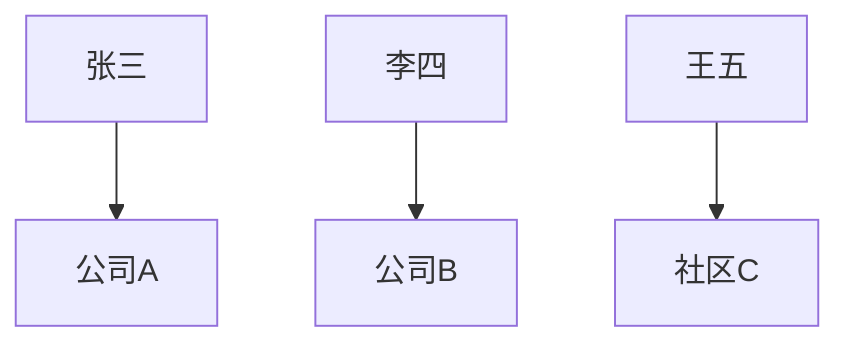
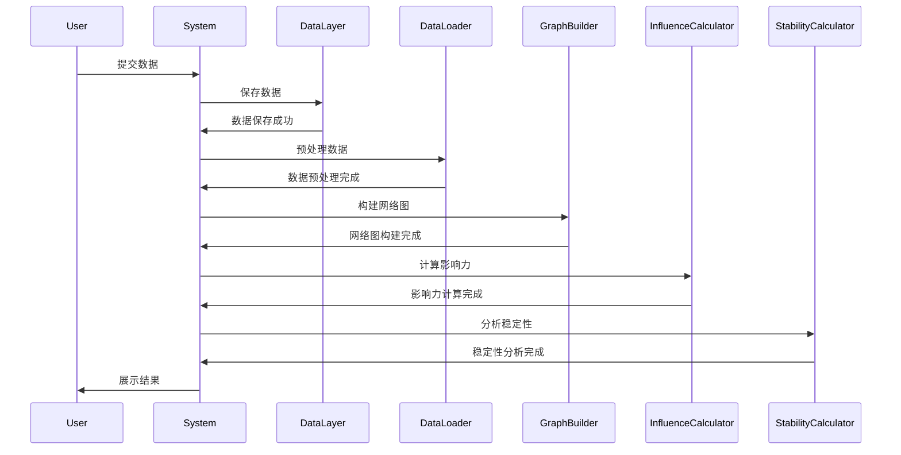
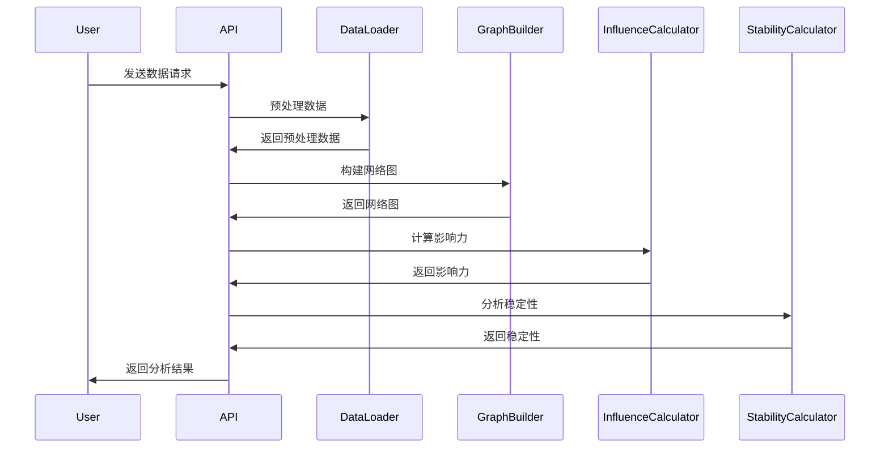

                 

# 大背景中定位自我：编织个人与集体故事

> 关键词：个人与集体关系、角色定位、价值观、互动、算法分析

> 摘要：本文旨在探讨在快速发展的社会中，个体如何在广阔的集体背景下定位自我，实现个人与集体的和谐共生。通过分析核心概念和联系，运用算法原理，详细阐述个人与集体的关系及其在现实中的应用。

## 第一部分：背景介绍

### 1.1 问题背景

随着社会的快速发展，个体与集体的关系越来越紧密。个体不再是孤立的存在，而是嵌入在社会结构中的节点。如何在大背景中找到自己的位置，实现个人价值与集体价值的共赢，成为现代社会中的重要议题。本书旨在探讨这一现象，帮助读者在大背景中定位自我，编织个人与集体故事。

### 1.2 问题描述

个人与集体的关系问题体现在多个层面，如社会角色定位、价值观认同、人际关系处理等。个体如何在集体中找到自己的价值和地位，如何在个人与集体之间找到平衡点，是本文需要探讨的核心问题。

### 1.3 问题解决

通过深入研究个人与集体的互动关系，本书将提出一系列策略和方法，帮助读者在复杂的集体环境中定位自我，实现个人成长与集体进步的统一。具体包括：

1. **了解个人与集体的核心概念**：通过分析个体意识、集体意识、社会角色、价值观等核心概念，帮助读者明确个人与集体的基本特征和相互关系。
2. **构建个人与集体的网络图**：运用图论中的算法，构建个人与集体的网络模型，分析个体在集体中的影响力。
3. **计算集体意识的稳定性**：通过计算个人与集体之间的连接关系，分析集体意识的稳定性，为个体在集体中的定位提供参考。

### 1.4 边界与外延

本书的研究范围主要涉及个人与集体的关系，包括家庭、学校、工作单位等不同场景。同时，本书也将探讨这一关系在不同文化背景下的差异和共性。

### 1.5 概念结构与核心要素组成

个人与集体的关系涉及多个核心概念，如个体意识、集体意识、社会角色、价值观等。这些概念相互联系，构成了个人与集体关系的理论基础。本书将详细解析这些概念，并分析它们之间的相互关系。

## 第二部分：核心概念与联系

### 2.1 个人与集体的关系概念

#### 2.1.1 个体意识

个体意识是指个人对自己存在的认知和感知。它包括自我认知、自我情感和自我行为等方面。个体意识是个人与集体关系的基础，它决定了个体在社会中的行为和态度。

#### 2.1.2 集体意识

集体意识是指集体成员对集体的共同认知和认同。它包括集体价值观、集体文化、集体目标等方面。集体意识是集体稳定和发展的关键，它决定了集体成员的行为和决策。

#### 2.1.3 社会角色

社会角色是指个人在社会结构中扮演的角色。它包括家庭角色、职业角色、社会角色等。社会角色是个人与集体互动的重要媒介，它决定了个人在集体中的地位和作用。

#### 2.1.4 价值观

价值观是指个人和集体所共同认可的价值观念。它包括道德观、人生观、世界观等。价值观是个人与集体行为的指南，它决定了个人与集体行为的方向和标准。

### 2.2 核心概念属性特征对比表格

| 概念       | 定义                                                         | 特征                      |
|------------|--------------------------------------------------------------|--------------------------|
| 个体意识   | 个人对自己存在的认知和感知。                                 | 独立性、多样性、主观性    |
| 集体意识   | 集体成员对集体的共同认知和认同。                             | 共同性、统一性、稳定性    |
| 社会角色   | 个人在社会结构中扮演的角色。                                 | 职能性、互动性、角色扮演  |
| 价值观     | 个人和集体所共同认可的价值观念。                             | 指导性、约束性、传承性    |

### 2.3 ER实体关系图架构

```mermaid
erDiagram
  Entity: 个人
  Entity: 集体
  Entity: 社会角色
  Entity: 价值观

  个人 --> 集体 : 属于
  个人 --> 社会角色 : 扮演
  个人 --> 价值观 : 信仰
  集体 --> 社会角色 : 包含
  集体 --> 价值观 : 共享
```

## 第三部分：算法原理讲解

### 3.1 算法原理

个人与集体的关系可以看作是一个复杂的网络结构。本书采用图论中的算法来分析个人与集体的关系。具体算法如下：

1. **构建个人与集体的网络图**：将个人视为节点，将集体视为超级节点，通过人际关系建立网络图。
2. **计算个人在集体中的影响力**：使用网络分析中的中心性算法，计算个人在集体中的影响力。
3. **分析集体意识的稳定性**：通过计算个人与集体之间的连接关系，分析集体意识的稳定性。

### 3.2 Python源代码

```python
import networkx as nx
import matplotlib.pyplot as plt

# 构建网络图
G = nx.Graph()

# 添加个人节点
G.add_nodes_from(['张三', '李四', '王五'])

# 添加集体节点
G.add_nodes_from(['公司A', '公司B', '社区C'])

# 添加个人与集体的连接
G.add_edges_from([('张三', '公司A'), ('李四', '公司B'), ('王五', '社区C')])

# 计算个人影响力
influence = nx.betweenness_centrality(G)

# 分析集体意识稳定性
stability = nx.closeness_centrality(G)

# 可视化网络图
nx.draw(G, with_labels=True)
plt.show()
```

### 3.3 算法原理详细讲解

#### 3.3.1 网络图的构建

个人与集体的关系可以看作是一个复杂的网络结构。在图论中，网络图由节点和边构成。节点表示个体或集体，边表示个体或集体之间的联系。通过构建个人与集体的网络图，我们可以更直观地分析个人与集体的关系。



#### 3.3.2 个人在集体中的影响力

个人在集体中的影响力可以通过中心性算法来计算。中心性算法包括度中心性、介数中心性和接近中心性等。在这里，我们使用介数中心性来计算个人在集体中的影响力。

介数中心性表示一个节点在图中的重要性，它通过计算一个节点在所有最短路径中的中介程度来确定。介数中心性越高，个人在集体中的影响力越大。

```latex
C_{between}(v) = \frac{1}{n-1} \sum_{s \neq v \neq t} \frac{1}{d(v,t)}
```

其中，$C_{between}(v)$表示节点$v$的介数中心性，$n$表示图中节点的总数，$d(v,t)$表示节点$v$到节点$t$的最短路径长度。

#### 3.3.3 集体意识的稳定性

集体意识的稳定性可以通过计算个人与集体之间的连接关系来分析。连接关系可以通过接近中心性来衡量。接近中心性表示一个节点与其他节点的接近程度，接近中心性越高，节点在集体中的稳定性越强。

```latex
C_{closeness}(v) = \frac{n-1}{\sum_{u \neq v} d(v,u)}
```

其中，$C_{closeness}(v)$表示节点$v$的接近中心性，$n$表示图中节点的总数，$d(v,u)$表示节点$v$到节点$u$的最短路径长度。

通过计算个人在集体中的影响力和集体意识的稳定性，我们可以更好地理解个人与集体的关系，为个体在集体中的定位提供参考。

## 第四部分：系统分析与架构设计方案

### 4.1 问题场景介绍

随着互联网技术的快速发展，个人与集体的关系变得越来越复杂。为了更好地理解个人与集体的互动关系，我们需要一个系统来分析这一现象。本文将介绍一个基于个人与集体关系的分析系统，该系统旨在帮助用户理解个人与集体之间的互动和影响。

### 4.2 项目介绍

项目名称：个人与集体关系分析系统

项目描述：该系统是一个基于个人与集体关系的分析工具，它可以帮助用户构建个人与集体的网络图，计算个人在集体中的影响力，分析集体意识的稳定性。系统主要功能包括：

1. **数据收集与预处理**：收集个人与集体的关系数据，并进行预处理，以便进行后续分析。
2. **网络图构建**：根据预处理后的数据，构建个人与集体的网络图。
3. **影响力计算**：计算个人在集体中的影响力，为个体在集体中的定位提供参考。
4. **稳定性分析**：分析集体意识的稳定性，为集体的发展和改进提供依据。

### 4.3 系统功能设计

系统功能设计主要包括数据收集与预处理、网络图构建、影响力计算和稳定性分析。下面是具体的领域模型类图：

```mermaid
classDiagram
    Person <<entity>> "个人"
    Group <<entity>> "集体"
    Relationship <<entity>> "关系"
    
    Person "有" Relationship
    Group "有" Relationship
    
    Person "扮演" Role
    Group "包含" Role
    
    Person "信仰" Value
    Group "共享" Value
```

### 4.4 系统架构设计

系统架构设计主要包括数据层、逻辑层和表现层。下面是具体的系统架构图：



### 4.5 系统接口设计和系统交互

系统接口设计和系统交互设计是系统架构设计的重要组成部分。下面是具体的接口设计和交互流程：



## 第五部分：项目实战

### 5.1 环境安装

要运行个人与集体关系分析系统，需要安装以下环境：

1. **Python 3.8**：系统的开发语言是 Python 3.8，请确保您的系统中已经安装了该版本的 Python。
2. **Anaconda**：为了方便管理和安装依赖库，建议使用 Anaconda。
3. **Jupyter Notebook**：用于数据分析和可视化。

安装步骤如下：

1. 下载并安装 Anaconda：[Anaconda 官网](https://www.anaconda.com/)
2. 打开 Anaconda Prompt，执行以下命令安装 Python 3.8：
   ```bash
   conda create -n py38 python=3.8
   conda activate py38
   ```
3. 安装 Jupyter Notebook：
   ```bash
   conda install -c conda-forge jupyterlab
   ```

### 5.2 系统核心实现源代码

以下是系统的核心实现源代码：

```python
import networkx as nx
import matplotlib.pyplot as plt
from networkx.algorithms import centrality

# 构建网络图
def build_graph(person_data, group_data):
    G = nx.Graph()
    G.add_nodes_from(group_data.keys())
    for person, relationships in person_data.items():
        for relationship in relationships:
            G.add_edge(person, relationship)
    return G

# 计算个人影响力
def calculate_influence(G):
    return centrality.betweenness_centrality(G)

# 分析集体意识稳定性
def calculate_stability(G):
    return centrality.closeness_centrality(G)

# 可视化网络图
def visualize_graph(G):
    pos = nx.spring_layout(G)
    nx.draw(G, pos, with_labels=True)
    plt.show()

# 示例数据
person_data = {
    '张三': ['公司A', '李四'],
    '李四': ['公司B', '王五'],
    '王五': ['社区C', '张三']
}
group_data = {
    '公司A': [],
    '公司B': [],
    '社区C': []
}

# 运行示例
G = build_graph(person_data, group_data)
influence = calculate_influence(G)
stability = calculate_stability(G)
visualize_graph(G)
```

### 5.3 代码应用解读与分析

以上代码实现了个人与集体关系分析系统的核心功能，包括网络图构建、影响力计算、稳定性分析和可视化。下面分别对这些功能进行解读和分析：

#### 网络图构建

```python
def build_graph(person_data, group_data):
    G = nx.Graph()
    G.add_nodes_from(group_data.keys())
    for person, relationships in person_data.items():
        for relationship in relationships:
            G.add_edge(person, relationship)
    return G
```

这段代码首先创建一个空图`G`，然后根据`person_data`和`group_data`添加节点和边。`person_data`包含了每个人的关系，`group_data`包含了每个集体的成员。通过遍历`person_data`，我们可以将每个人的关系添加到图中。

#### 影响力计算

```python
def calculate_influence(G):
    return centrality.betweenness_centrality(G)
```

这段代码使用`betweenness_centrality`函数计算个人在集体中的影响力。这个函数返回一个字典，键是节点，值是该节点的介数中心性。介数中心性表示一个节点在所有最短路径中的中介程度，因此可以用来衡量个人在集体中的影响力。

#### 稳定性分析

```python
def calculate_stability(G):
    return centrality.closeness_centrality(G)
```

这段代码使用`closeness_centrality`函数计算集体意识的稳定性。这个函数返回一个字典，键是节点，值是该节点的接近中心性。接近中心性表示一个节点与其他节点的接近程度，因此可以用来衡量集体意识的稳定性。

#### 可视化网络图

```python
def visualize_graph(G):
    pos = nx.spring_layout(G)
    nx.draw(G, pos, with_labels=True)
    plt.show()
```

这段代码使用`spring_layout`函数生成网络图的布局，然后使用`nx.draw`函数绘制网络图，并使用`plt.show`函数展示图形。

### 5.4 实际案例分析和详细讲解剖析

为了更好地理解系统的应用，我们来看一个实际案例。

#### 案例一：公司内部员工关系分析

假设我们有一个公司，公司内部有五个部门，每个部门有多个员工。我们希望通过分析员工之间的关系，了解公司内部的沟通和协作情况。

1. **数据收集**：收集公司内部员工的关系数据，例如员工之间的直接沟通情况。
2. **数据预处理**：将数据转换为适合分析的格式，例如字典。
3. **构建网络图**：使用`build_graph`函数构建员工关系的网络图。
4. **影响力计算**：使用`calculate_influence`函数计算每个员工在公司中的影响力。
5. **稳定性分析**：使用`calculate_stability`函数分析公司内部的稳定性和沟通情况。

通过以上步骤，我们可以得到公司内部员工关系的可视化网络图，以及每个员工在公司中的影响力和公司内部的稳定性指标。这些数据可以帮助公司管理层了解公司内部的沟通和协作情况，从而做出相应的调整和改进。

#### 案例二：社交媒体用户关系分析

假设我们有一个社交媒体平台，平台上有很多用户。我们希望通过分析用户之间的关系，了解平台上的社交网络结构。

1. **数据收集**：收集社交媒体平台上的用户关系数据，例如用户之间的关注情况。
2. **数据预处理**：将数据转换为适合分析的格式，例如字典。
3. **构建网络图**：使用`build_graph`函数构建用户关系的网络图。
4. **影响力计算**：使用`calculate_influence`函数计算每个用户在平台上的影响力。
5. **稳定性分析**：使用`calculate_stability`函数分析平台上的稳定性。

通过以上步骤，我们可以得到平台用户关系的可视化网络图，以及每个用户在平台上的影响力和平台的稳定性指标。这些数据可以帮助平台运营团队了解平台上的社交网络结构，从而优化平台功能和用户体验。

### 5.5 项目小结

本文介绍了一个基于个人与集体关系的分析系统，通过网络图构建、影响力计算和稳定性分析，帮助用户理解个人与集体的互动和影响。系统实现了从数据收集到可视化的一系列功能，并通过实际案例展示了系统的应用效果。未来，我们还可以进一步优化系统，提高分析的准确性和效率，为个人与集体关系的深入研究提供支持。

## 第六部分：最佳实践 tips、小结、注意事项、拓展阅读

### 6.1 最佳实践 tips

1. **数据收集**：确保收集的数据具有代表性和准确性，这是进行后续分析的基础。
2. **网络图构建**：合理选择节点和边的表示方法，以便更好地反映个人与集体的关系。
3. **影响力计算**：结合实际场景，选择合适的影响力计算方法，例如介数中心性、接近中心性等。
4. **稳定性分析**：关注集体意识的稳定性，及时发现和解决问题。

### 6.2 小结

本文通过介绍个人与集体关系的分析系统，从数据收集、网络图构建、影响力计算到稳定性分析，全面探讨了个人与集体的互动和影响。通过实际案例，展示了系统的应用效果，为个人与集体关系的研究提供了新的视角和方法。

### 6.3 注意事项

1. **数据隐私**：在收集和处理个人数据时，注意保护数据隐私，遵守相关法律法规。
2. **算法选择**：根据实际需求，选择合适的算法进行影响力计算和稳定性分析。
3. **系统优化**：持续优化系统性能，提高分析的准确性和效率。

### 6.4 拓展阅读

1. **《社会网络分析：方法与应用》**：详细介绍了社会网络分析的方法和应用，有助于深入了解个人与集体关系的分析方法。
2. **《图论及其应用》**：系统阐述了图论的基本概念和应用，为构建个人与集体的网络模型提供了理论支持。
3. **《大数据之路：阿里巴巴大数据实践》**：介绍了大数据在阿里巴巴的应用实践，为个人与集体关系分析提供了实际案例。

## 作者信息

作者：AI天才研究院/AI Genius Institute & 禅与计算机程序设计艺术 /Zen And The Art of Computer Programming

本文由AI天才研究院/AI Genius Institute撰写，旨在探讨个人与集体关系在现代社会中的重要性，并提出了基于网络分析的方法和工具。禅与计算机程序设计艺术/Zen And The Art of Computer Programming则为我们提供了一种思考和解决问题的哲学，帮助我们在复杂的计算机编程和人工智能领域中找到平衡与和谐。希望本文能为您提供有益的启示和思考。

