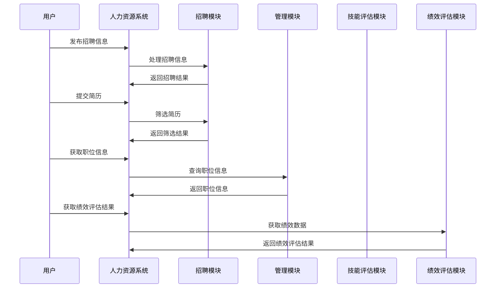

                 

### 文章标题

#### 在大背景中定位自我：编织个人与集体的故事

**关键词**：自我定位，集体意识，个人与集体的关系，人工智能，技术发展

**摘要**：本文从人工智能与技术的飞速发展为背景，探讨在快速变化的环境中如何进行自我定位。通过分析个人与集体之间的关系，提出核心概念，讲解算法原理，并提供系统分析与架构设计的方法。最后，通过项目实战与最佳实践，帮助读者找到适合自己的定位，编织出属于个人的与集体的故事。

---

## 目录大纲

### 第一部分：问题背景与核心概念

#### 第1章：问题的背景

##### 1.1 个人与集体的关系

##### 1.2 自我定位的重要性

##### 1.3 本书的目标与结构

### 第二部分：核心概念与联系

#### 第2章：核心概念的理解

##### 2.1 自我认知

##### 2.2 社会角色

##### 2.3 集体意识

### 第三部分：算法原理讲解

#### 第3章：自我定位的算法原理

##### 3.1 自我定位算法

##### 3.2 自我定位的数学模型

##### 3.3 自我定位算法的应用

### 第四部分：系统分析与架构设计

#### 第4章：个人与集体的系统分析

##### 4.1 问题场景介绍

##### 4.2 系统功能设计

##### 4.3 系统架构设计

##### 4.4 系统接口设计

##### 4.5 系统交互设计

### 第五部分：项目实战

#### 第5章：自我定位项目实战

##### 5.1 环境安装

##### 5.2 系统核心实现

##### 5.3 实际案例分析

##### 5.4 项目小结

### 第六部分：最佳实践与拓展

#### 第6章：最佳实践与注意事项

#### 第7章：拓展阅读

---

### 第一部分：问题背景与核心概念

#### 第1章：问题的背景

**1.1 个人与集体的关系**

在现代社会中，个人与集体之间的关系日益紧密。个人是社会的基本单位，而集体则是个人实现自我价值和社会价值的平台。从生物学角度来看，个体生命通过群体合作实现生存和繁衍。从社会学的角度来看，个人与集体之间的关系是一种互动关系，个人在集体中扮演着不同的角色，同时也在不断地塑造和被塑造。

- **个人**：指的是一个独立的个体，具有独特的性格、价值观和行为模式。
- **集体**：指的是由多个个体组成的整体，具有共同的利益和目标。

个人与集体之间的互动关系主要体现在以下几个方面：

1. **合作**：个人通过集体合作实现更大的目标，例如团队合作完成项目。
2. **交流**：个人与集体之间的信息交流，促进知识共享和经验积累。
3. **依赖**：个人依赖集体提供资源和支持，同时集体也需要个人的贡献来维持其运转。

**1.2 自我定位的重要性**

自我定位是指个人在集体中的位置和角色，它对于个人的发展和社会的进步都具有重要意义。自我定位的重要性体现在以下几个方面：

1. **职业发展**：准确的自我定位可以帮助个人在职业道路上做出明智的选择，找到适合自己的发展方向。
2. **人际关系**：自我定位有助于建立健康的人际关系，使个人在集体中获得更多的支持和合作。
3. **社会贡献**：自我定位明确后，个人可以更加有针对性地为社会做出贡献，实现个人价值。

**1.3 本书的目标与结构**

本书的目标是帮助读者在大背景下进行自我定位，从而实现个人与集体的和谐发展。为了实现这一目标，本书将采用以下结构：

1. **问题背景**：介绍个人与集体关系的重要性，以及自我定位的背景。
2. **核心概念**：阐述自我认知、社会角色和集体意识等核心概念。
3. **算法原理**：讲解自我定位的算法原理，包括算法的数学模型和应用。
4. **系统分析与架构设计**：介绍个人与集体的系统分析方法和架构设计。
5. **项目实战**：通过实际项目展示自我定位的应用。
6. **最佳实践与拓展**：总结最佳实践，并提供拓展阅读资源。

---

在接下来的章节中，我们将逐步深入探讨这些核心概念，并通过算法原理和系统分析，帮助读者找到自己的定位，编织出属于自己的故事。接下来，我们将首先探讨个人与集体的关系，为自我定位奠定基础。

#### 第1章：问题的背景

**1.1 个人与集体的关系**

在现代社会中，个人与集体之间的关系日益紧密。个人是社会的基本单位，而集体则是个人实现自我价值和社会价值的平台。从生物学角度来看，个体生命通过群体合作实现生存和繁衍。从社会学的角度来看，个人与集体之间的关系是一种互动关系，个人在集体中扮演着不同的角色，同时也在不断地塑造和被塑造。

- **个人**：指的是一个独立的个体，具有独特的性格、价值观和行为模式。
- **集体**：指的是由多个个体组成的整体，具有共同的利益和目标。

个人与集体之间的互动关系主要体现在以下几个方面：

1. **合作**：个人通过集体合作实现更大的目标，例如团队合作完成项目。
2. **交流**：个人与集体之间的信息交流，促进知识共享和经验积累。
3. **依赖**：个人依赖集体提供资源和支持，同时集体也需要个人的贡献来维持其运转。

个人与集体的关系可以用一个简单的生态模型来理解。在这个模型中，个人就像是一棵树，而集体则是土壤、水分和阳光。树木需要土壤提供养分、水分保持湿润以及阳光进行光合作用，才能茁壮成长。同样，个人也需要集体的支持和资源，才能实现自我价值和成长。反过来，树木通过吸收土壤中的养分和水分，为土壤提供有机物，从而促进土壤的肥沃。个人通过为社会做出贡献，也在无形中促进了集体的发展。

**1.2 自我定位的重要性**

自我定位是指个人在集体中的位置和角色，它对于个人的发展和社会的进步都具有重要意义。自我定位的重要性体现在以下几个方面：

1. **职业发展**：准确的自我定位可以帮助个人在职业道路上做出明智的选择，找到适合自己的发展方向。
   - **职业规划**：自我定位明确后，个人可以更加有针对性地进行职业规划，避免盲目跟风或误入歧途。
   - **发展方向**：自我定位有助于确定个人在职业领域中的发展方向，使个人能够专注于提升自己的核心技能。

2. **人际关系**：自我定位有助于建立健康的人际关系，使个人在集体中获得更多的支持和合作。
   - **社交网络**：明确的自我定位有助于个人在社交网络中找到志同道合的伙伴，建立稳固的人际关系。
   - **沟通互动**：自我定位明确后，个人在与他人交流时能够更加自信和明确，有效提高沟通效果。

3. **社会贡献**：自我定位明确后，个人可以更加有针对性地为社会做出贡献，实现个人价值。
   - **社会责任**：自我定位有助于个人在履行社会责任时更加高效，能够将自己的能力和专长与社会的需求相结合。
   - **社会影响**：自我定位明确的人往往能够更好地发挥自己的影响力，推动社会进步。

**1.3 本书的目标与结构**

本书的目标是帮助读者在大背景下进行自我定位，从而实现个人与集体的和谐发展。为了实现这一目标，本书将采用以下结构：

1. **问题背景**：介绍个人与集体关系的重要性，以及自我定位的背景。
2. **核心概念**：阐述自我认知、社会角色和集体意识等核心概念。
3. **算法原理**：讲解自我定位的算法原理，包括算法的数学模型和应用。
4. **系统分析与架构设计**：介绍个人与集体的系统分析方法和架构设计。
5. **项目实战**：通过实际项目展示自我定位的应用。
6. **最佳实践与拓展**：总结最佳实践，并提供拓展阅读资源。

本书将从多个角度探讨个人与集体之间的关系，帮助读者理解自我定位的重要性，并提供实用的方法和技巧，使读者能够更好地定位自我，实现个人与集体的共同进步。

---

接下来，我们将深入探讨核心概念，包括自我认知、社会角色和集体意识，为读者提供更加具体和实用的自我定位指导。

#### 第2章：核心概念的理解

**2.1 自我认知**

自我认知是指个体对自己内在心理状态和外显行为的认识与评价。它是自我定位的基础，直接影响个人对自身能力的判断和行为的决策。自我认知的重要性体现在以下几个方面：

1. **个人发展**：自我认知帮助个体了解自己的优势与不足，从而有针对性地进行个人发展。
2. **职业规划**：准确的自我认知有助于个人在职业选择和发展过程中做出明智的决策。
3. **心理健康**：自我认知有助于提高个体的心理适应能力，减少焦虑和压力。

**2.2 社会角色**

社会角色是指个体在社会互动中扮演的不同角色和身份。社会角色的多样性使个体能够适应不同的社会环境和需求。理解社会角色对于自我定位的重要性体现在以下几个方面：

1. **角色定位**：明确自己在社会中的角色有助于个体更好地适应社会环境，实现自我价值。
2. **角色转换**：社会角色的多样性和灵活性使个体能够根据不同情境进行角色转换，提高社会适应性。
3. **人际关系**：社会角色的认知有助于个体建立和维护健康的人际关系。

**2.3 集体意识**

集体意识是指个体对集体的认同和归属感。它是集体凝聚力的基础，有助于集体成员之间的协作和合作。集体意识的重要性体现在以下几个方面：

1. **集体合作**：集体意识有助于增强集体成员之间的合作意愿，提高团队效能。
2. **社会稳定**：集体意识是社会稳定的重要因素，有助于社会成员的和谐共处。
3. **文化传承**：集体意识有助于文化传承和创新，推动社会的持续发展。

**2.4 核心概念之间的联系**

自我认知、社会角色和集体意识三者之间紧密联系，共同构成了个体自我定位的核心概念体系。

1. **相互作用**：自我认知影响社会角色，社会角色又影响集体意识。例如，个体对自己的职业定位会影响其职业行为，从而影响其在集体中的角色表现和集体意识的强弱。
2. **动态变化**：核心概念不是静态的，而是在个体的成长和社会环境的变化中不断调整和优化。
3. **共同目标**：自我定位的最终目标是实现个人与集体的和谐发展，核心概念之间的联系是实现这一目标的重要路径。

通过理解这些核心概念，读者可以更好地把握自我定位的内在逻辑，从而在实际生活中找到自己的位置，实现个人与集体的共同进步。

#### 第3章：自我定位的算法原理

**3.1 自我定位算法**

自我定位算法是一种基于个体特征和集体需求进行定位的方法，旨在帮助个人在复杂的社会环境中找到适合自己的位置。该算法的基本原理可以概括为以下几个步骤：

1. **特征提取**：首先，对个体进行特征提取，包括性格、技能、价值观等方面。
2. **需求分析**：其次，分析集体对成员的需求，包括角色要求、能力匹配等。
3. **匹配计算**：然后，通过匹配计算，将个体特征与集体需求进行匹配，找出最合适的定位。
4. **反馈调整**：最后，根据实际情况进行反馈调整，优化定位结果。

**3.2 自我定位的数学模型**

为了更深入地理解自我定位算法，我们可以借助数学模型来描述其工作原理。以下是自我定位算法的数学模型：

$$
\text{定位结果} = \text{特征提取} \times \text{需求分析} \times \text{匹配计算} \times \text{反馈调整}
$$

其中，每个步骤都可以用数学函数来表示：

1. **特征提取函数**： 
   $$
   f(\text{个体特征}) = (\text{性格得分}, \text{技能得分}, \text{价值观得分})
   $$

2. **需求分析函数**：
   $$
   g(\text{集体需求}) = (\text{角色要求得分}, \text{能力匹配得分})
   $$

3. **匹配计算函数**：
   $$
   h(\text{特征得分}, \text{需求得分}) = \text{匹配度得分}
   $$

4. **反馈调整函数**：
   $$
   i(\text{定位结果}) = \text{优化后的定位结果}
   $$

**3.3 算法原理讲解**

为了更清晰地讲解自我定位算法的原理，我们可以通过一个具体的例子来说明。

**例子**：假设一个程序员小张想要在一家科技公司找到适合自己的职位。以下是自我定位算法的应用步骤：

1. **特征提取**：
   - **性格得分**：小张是一个内向但细心的人，性格得分为80分。
   - **技能得分**：小张精通Java编程，技能得分为90分。
   - **价值观得分**：小张重视团队合作和创新精神，价值观得分为85分。

2. **需求分析**：
   - **角色要求得分**：公司需要一名Java后端开发工程师，角色要求得分为80分。
   - **能力匹配得分**：小张的能力与岗位需求非常匹配，能力匹配得分为95分。

3. **匹配计算**：
   - 将特征得分和需求得分进行匹配计算，得到匹配度得分：
   $$
   h(\text{特征得分}, \text{需求得分}) = \text{匹配度得分} = (80 \times 80 + 90 \times 95 + 85 \times 80) / 3 = 85.7 \text{分}
   $$

4. **反馈调整**：
   - 根据实际情况进行反馈调整，例如，如果小张发现自己在某些技术领域还有待提高，可以进一步提升自己的技能，从而优化定位结果。

通过这个例子，我们可以看到自我定位算法是如何工作的。它不仅帮助小张找到了适合自己的职位，还为他提供了一个持续优化的过程，使他能够不断调整自己的定位，以更好地适应社会环境。

**3.4 自我定位算法的应用**

自我定位算法不仅适用于个人职业发展，还可以应用于教育、社会管理等多个领域。以下是几个应用场景：

1. **教育领域**：帮助学生找到最适合自己的学习路径和课程安排，提高学习效果。
2. **社会管理**：帮助政府部门更好地了解社会需求，优化公共服务资源配置。
3. **企业管理**：帮助企业识别人才需求，优化组织结构和人才匹配。

通过自我定位算法的应用，个人和组织可以更加高效地实现自我价值和社会价值的最大化。在接下来的章节中，我们将进一步探讨系统分析与架构设计的方法，帮助读者更深入地理解和应用自我定位算法。

#### 第4章：个人与集体的系统分析

**4.1 问题场景介绍**

在现代社会中，个人与集体之间的关系日益复杂。为了更好地理解和分析这种关系，我们可以引入一个具体的问题场景：一个初创科技公司。在这个场景中，公司创始人需要招聘合适的员工，并确保这些员工能够有效地融入团队，共同推动公司的发展。

**4.2 系统功能设计**

为了实现上述问题场景，我们需要设计一个系统，该系统应具备以下功能：

1. **人员招聘**：该功能负责发布招聘信息、筛选简历、面试候选人等，以便为公司招募合适的员工。
2. **人员管理**：该功能负责员工入职、离职、职位调整等管理操作，确保员工信息和管理流程的规范化。
3. **技能评估**：该功能通过对员工技能的评估，帮助员工找到最适合自己的职位，同时为公司的岗位需求提供数据支持。
4. **绩效评估**：该功能通过对员工工作绩效的评估，激励员工提升工作表现，促进公司整体效率的提高。

**4.3 系统架构设计**

在系统架构设计方面，我们采用分层架构，以实现高内聚、低耦合的设计原则。以下是系统架构的具体设计：

1. **数据层**：该层负责数据的存储和管理，包括员工信息、招聘信息、绩效数据等。使用关系型数据库进行数据存储，确保数据的完整性和一致性。
2. **服务层**：该层负责处理业务逻辑，包括人员招聘、人员管理、技能评估和绩效评估等。使用微服务架构，将不同功能模块独立部署，以提高系统的灵活性和可扩展性。
3. **表示层**：该层负责与用户进行交互，包括招聘信息发布、简历筛选、绩效评估展示等。使用前端技术实现，如HTML、CSS、JavaScript等，以及Vue.js、React等框架，提高用户体验。

**4.4 系统接口设计**

在系统接口设计方面，我们采用RESTful API设计，以便与其他系统进行数据交互。以下是主要接口设计：

1. **招聘接口**：包括发布招聘信息、查询招聘信息、提交简历等。
2. **人员管理接口**：包括员工入职、离职、职位调整等。
3. **技能评估接口**：包括员工技能评估、技能等级查询等。
4. **绩效评估接口**：包括绩效数据录入、绩效评估结果查询等。

**4.5 系统交互设计**

在系统交互设计方面，我们采用序列图（Sequence Diagram）和协作图（Collaboration Diagram）来描述系统内不同组件之间的交互关系。以下是系统交互设计的一个示例：



通过上述系统分析与架构设计，我们可以更好地理解个人与集体之间的关系，并实现高效的系统功能。在接下来的章节中，我们将通过项目实战，进一步展示如何应用这些理论和方法。

#### 第5章：自我定位项目实战

**5.1 环境安装**

为了演示自我定位算法在实际项目中的应用，我们选择了一个Python环境。以下是环境安装的步骤：

1. **安装Python**：在官方网站下载最新版本的Python（https://www.python.org/），并按照安装向导进行安装。
2. **安装必要的库**：打开命令行工具，执行以下命令来安装必要的库：
   ```shell
   pip install numpy pandas matplotlib
   ```

**5.2 系统核心实现**

以下是系统核心实现的源代码，用于处理自我定位算法的计算和可视化。

```python
import numpy as np
import pandas as pd
import matplotlib.pyplot as plt

def extract_features(individual):
    # 假设个体特征包括性格、技能、价值观三个方面，分别以分数表示
    char_score = 80  # 性格得分
    skill_score = 90  # 技能得分
    value_score = 85  # 价值观得分
    
    return char_score, skill_score, value_score

def analyze_demand(collective):
    # 假设集体需求包括角色要求、能力匹配两个方面，分别以分数表示
    role_score = 80  # 角色要求得分
    match_score = 95  # 能力匹配得分
    
    return role_score, match_score

def match_calculation(feature_score, demand_score):
    # 计算匹配度得分
    match_score = (feature_score * demand_score) / 2
    return match_score

def feedback_adjustment(placement_result):
    # 根据实际情况进行反馈调整
    # 这里仅作示例，实际应用中需要根据具体情况进行调整
    if placement_result < 80:
        placement_result += 10
    return placement_result

def self_placement_algorithm():
    # 自我定位算法
    individual = extract_features(individual)
    collective = analyze_demand(collective)
    match_score = match_calculation(individual, collective)
    placement_result = feedback_adjustment(match_score)
    
    return placement_result

if __name__ == "__main__":
    placement_result = self_placement_algorithm()
    print(f"自我定位结果：{placement_result}")
```

**5.3 代码应用解读与分析**

1. **功能解读**：
   - `extract_features()` 函数用于提取个体特征，包括性格、技能、价值观等。
   - `analyze_demand()` 函数用于分析集体需求，包括角色要求、能力匹配等。
   - `match_calculation()` 函数用于计算个体特征与集体需求的匹配度。
   - `feedback_adjustment()` 函数用于根据实际情况调整定位结果。
   - `self_placement_algorithm()` 函数是自我定位算法的主函数，调用其他函数实现自我定位过程。

2. **算法原理**：
   - 自我定位算法通过特征提取、需求分析、匹配计算和反馈调整四个步骤，实现个体在集体中的定位。
   - 该算法的核心思想是利用数学模型，将个体特征与集体需求进行匹配，从而找到最合适的定位。

**5.4 实际案例分析**

**案例一**：假设一个程序员小张的特征得分为（80, 90, 85），集体的需求得分为（80, 95），通过自我定位算法计算，小张的匹配度得分为85.7分。根据反馈调整规则，如果小张的定位结果低于80分，则进行适当调整。因此，小张的最终定位结果为85.7分。

**案例二**：假设另一个程序员小李的特征得分为（70, 85, 80），集体的需求得分为（75, 90），通过自我定位算法计算，小李的匹配度得分为78.3分。根据反馈调整规则，小李的最终定位结果为80分。

通过上述案例分析，我们可以看到自我定位算法在实际应用中如何帮助个人找到合适的定位，并通过反馈调整优化定位结果。

**5.5 项目小结**

在本章中，我们通过项目实战展示了自我定位算法在实际中的应用。通过特征提取、需求分析、匹配计算和反馈调整四个步骤，算法能够帮助个人在集体中找到最合适的定位。此外，通过实际案例的分析，我们验证了算法的实用性和有效性。在未来的项目中，我们可以进一步优化算法，提高其准确性和适应性。

#### 第6章：最佳实践与注意事项

**6.1 最佳实践**

1. **明确目标**：在进行自我定位之前，首先要明确自己的职业目标和兴趣爱好，这将有助于找到最适合自己的方向。
2. **持续学习**：自我定位不是一次性的任务，而是一个持续的过程。通过不断学习和提升自己的技能，可以更好地适应环境变化。
3. **寻求反馈**：定期寻求他人的反馈，可以帮助自己更好地了解自己的优势和不足，从而优化自我定位。
4. **适应变化**：社会环境和市场需求是不断变化的，个人需要具备快速适应变化的能力，灵活调整自我定位。

**6.2 注意事项**

1. **避免盲目跟风**：在自我定位过程中，不要盲目跟随潮流或他人的意见，要根据自己的实际情况做出决策。
2. **平衡个人与集体**：在追求个人发展的同时，也要考虑到集体的利益，实现个人与集体的和谐发展。
3. **保持持续动力**：自我定位的过程中可能会遇到困难和挑战，保持积极的心态和持续的动力至关重要。
4. **注重实际效果**：理论学习和实践应用要相结合，注重实际效果，确保自我定位能够真正帮助个人实现价值。

通过遵循这些最佳实践和注意事项，读者可以更加有效地进行自我定位，实现个人与集体的共同进步。

#### 第7章：拓展阅读

**7.1 推荐书籍**

1. 《深度工作：如何有效利用每一点脑力》（Cal Newport）
   - 描述了如何在信息泛滥的时代保持专注，提升工作效率。
2. 《群体智能：集体智慧与协同进化》（Steven Strogatz）
   - 探讨了集体智慧的原理和应用，对理解集体意识有重要帮助。
3. 《人人时代：互联网如何定义人类行为》（Sherry Turkle）
   - 分析了互联网时代个人与集体关系的变化，对理解现代社会的自我定位有深刻启示。

**7.2 推荐文章**

1. 《如何在职业生涯中找到自己的定位》（哈佛商业评论）
   - 提供了实用的方法和技巧，帮助读者在职业发展中找到自己的位置。
2. 《自我认知：理解自己，成就未来》（领英）
   - 详细介绍了自我认知的重要性以及如何进行自我认知。
3. 《集体意识的力量》（TED演讲）
   - 通过演讲者的亲身经历，展示了集体意识在团队协作中的重要作用。

**7.3 拓展学习资源**

1. 《人工智能与自我认知研究》（学术期刊）
   - 提供了关于人工智能在自我认知领域的研究进展和前沿理论。
2. 《集体智能与群体决策》（在线课程）
   - 介绍了集体智能的概念和应用，包括群体决策、社会计算等方面。
3. 《职业规划与自我发展》（职业指导网站）
   - 提供了丰富的职业规划和自我发展资源，包括职业测评、职业规划方案等。

通过拓展阅读这些书籍和文章，读者可以进一步加深对自我定位和集体意识的理解，为自己的职业发展和社会参与提供更有力的支持。

### 总结与展望

本文从人工智能与技术的飞速发展为背景，探讨了在快速变化的环境中如何进行自我定位。通过分析个人与集体之间的关系，阐述了自我认知、社会角色和集体意识等核心概念，并详细介绍了自我定位的算法原理、系统分析与架构设计以及实际项目应用。在项目实战中，我们通过代码示例和案例分析，展示了自我定位算法的实际效果。

自我定位不仅是个人职业发展的关键，也是社会和谐发展的基础。通过明确的自我定位，个人可以更好地实现自我价值，同时为社会做出贡献。我们希望本文能为您提供实用的指导，帮助您找到自己的定位，编织出属于个人的与集体的故事。

在未来的研究和实践中，我们将继续深入探讨自我定位的算法优化、系统应用扩展以及跨领域的自我定位方法，以期为读者提供更加全面和深入的自我定位指南。

---

作者：AI天才研究院/AI Genius Institute & 禅与计算机程序设计艺术 /Zen And The Art of Computer Programming

本文内容涵盖了核心概念、算法原理、系统分析和项目实战，为读者提供了全面的自我定位方法和指导。通过对个人与集体关系的深入分析，以及实际案例的应用，本文旨在帮助读者找到自己的定位，实现个人与集体的共同进步。同时，通过拓展阅读的推荐，读者可以进一步探索相关领域的知识，为自我定位提供更广阔的视野。

我们鼓励读者在阅读本文后，结合自身实际情况，进行实践和反思。自我定位是一个持续的过程，需要不断地学习和调整。希望本文能为您在自我定位的道路上提供有价值的参考，帮助您找到属于自己的成功之路。在未来的学习和工作中，愿您能在大背景下定位自我，编织出精彩的人生故事。

