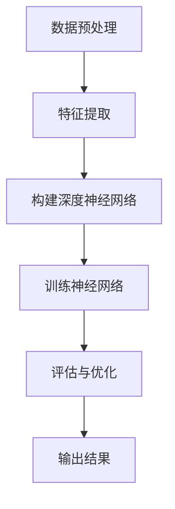
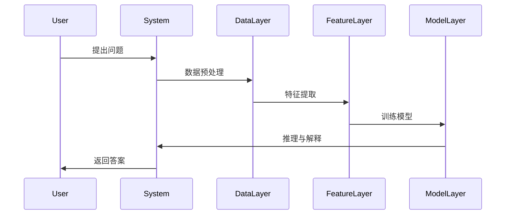
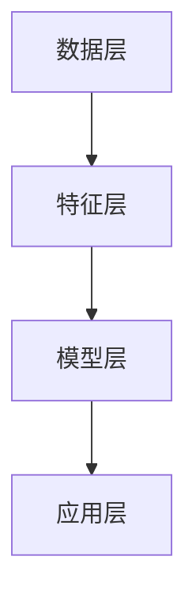

                 

# 在娱乐至上的文化中寻找深度：重建思考能力

> 关键词：娱乐文化，思考能力，深度学习，重建，教育，媒体，社会

> 摘要：本文探讨当代娱乐至上的文化现象对思考能力的负面影响，提出通过教育、媒体和社会手段重建思考能力的方法。文章将详细分析问题背景、核心概念、算法原理及系统架构，并提出具体的项目实战方案。

### 第一部分: 背景介绍

#### 问题背景

在当代社会，娱乐文化占据了人们生活的重要部分，从电视节目到社交媒体，娱乐内容无处不在。这种文化现象导致了大众思考能力的弱化，人们倾向于追求短暂的刺激和快感，而忽视了深度思考。这一现象引起了社会各界的关注，许多人开始呼吁在娱乐至上的文化中寻找深度，重建思考能力。

#### 问题描述

娱乐至上的文化导致了以下问题：

1. **思考能力下降**：人们习惯于接受表面化的信息，缺乏深度思考的能力。
2. **价值观扭曲**：娱乐文化中充斥着肤浅、功利和短视的价值观，影响人们的正确价值观的形成。
3. **创造力受限**：缺乏深度思考的环境不利于创新和创造力的培养。

#### 问题解决

为了解决上述问题，需要从以下几个方面入手：

1. **提升教育质量**：教育应更加注重培养学生的思考能力和批判性思维。
2. **推广深度阅读**：鼓励人们阅读深度书籍和文章，培养深度思考的习惯。
3. **媒体自律**：媒体应承担社会责任，减少低俗、浅薄内容的制作和传播。
4. **社会宣传**：通过宣传，提高公众对深度思考重要性的认识。

#### 边界与外延

1. **边界**：本书主要探讨娱乐至上的文化对思考能力的影响，以及如何重建思考能力。
2. **外延**：涉及教育、媒体、社会等多个领域。

#### 概念结构与核心要素组成

1. **娱乐至上的文化**：指以娱乐为主要目的，追求短暂的刺激和快感的文化现象。
2. **思考能力**：指通过深入思考和分析，对事物进行理解、判断和决策的能力。
3. **重建思考能力**：指通过教育、媒体、社会等手段，提高人们的思考能力。

### 第二部分: 核心概念与联系

#### 核心概念原理

1. **娱乐至上的文化**：其核心在于以娱乐为主要目的，追求短暂的刺激和快感。这种现象可以通过以下数学模型描述：

   $$ \text{娱乐指数} = f(\text{刺激度}, \text{持续时间}) $$

   其中，刺激度和持续时间是娱乐至上的文化的重要特征。

2. **思考能力**：其核心在于通过深入思考和分析，对事物进行理解、判断和决策。思考能力可以通过以下模型来衡量：

   $$ \text{思考能力} = f(\text{信息量}, \text{分析深度}) $$

   信息量和分析深度是衡量思考能力的两个关键因素。

3. **重建思考能力**：其核心在于通过教育、媒体、社会等手段，提高人们的思考能力。这一过程可以通过以下模型来描述：

   $$ \text{重建思考能力} = f(\text{教育投入}, \text{媒体引导}, \text{社会宣传}) $$

   教育投入、媒体引导和社会宣传是重建思考能力的三大关键因素。

#### 概念属性特征对比表格

| 概念       | 属性特征                     | 对比           |
|------------|------------------------------|----------------|
| 娱乐至上的文化 | 追求短暂刺激和快感           | 非深度思考     |
| 思考能力   | 通过深入思考和分析           | 对事物的理解、判断、决策 |
| 重建思考能力 | 通过教育、媒体、社会等手段 | 提高思考能力   |

#### ER实体关系图架构

```mermaid
erDiagram
  EntertainmentCulture ||--|{ ThinkingAbility } : 驱动
  ThinkingAbility ||--|{ ReconstructionOfThinkingAbility } : 实现途径
```

### 第三部分: 算法原理讲解

在此部分，我们将介绍如何通过深度学习算法来重建思考能力。深度学习作为一种人工智能技术，可以通过大量数据训练模型，从而实现复杂函数的逼近和优化。以下是一个简单的深度学习算法流程。

#### Mermaid算法流程图



#### Python源代码与算法原理

```python
# 导入必要的库
import numpy as np
import tensorflow as tf

# 数据预处理
def preprocess_data(data):
    # ... 对数据进行预处理 ...
    return processed_data

# 特征提取
def extract_features(data):
    # ... 提取特征 ...
    return features

# 构建深度神经网络
def build_model(input_shape):
    model = tf.keras.Sequential([
        tf.keras.layers.Dense(units=128, activation='relu', input_shape=input_shape),
        tf.keras.layers.Dense(units=64, activation='relu'),
        tf.keras.layers.Dense(units=1, activation='sigmoid')
    ])
    model.compile(optimizer='adam', loss='binary_crossentropy', metrics=['accuracy'])
    return model

# 训练神经网络
def train_model(model, x_train, y_train, x_val, y_val, epochs=100):
    model.fit(x_train, y_train, batch_size=32, epochs=epochs, validation_data=(x_val, y_val))

# 评估与优化
def evaluate_and_optimize(model, x_test, y_test):
    loss, accuracy = model.evaluate(x_test, y_test)
    print(f"Test accuracy: {accuracy:.2f}")
    # ... 进行模型优化 ...

# 主函数
def main():
    # 加载数据
    x_train, y_train, x_val, y_val, x_test, y_test = load_data()

    # 数据预处理
    processed_data = preprocess_data(x_train)

    # 特征提取
    features = extract_features(processed_data)

    # 构建模型
    model = build_model(input_shape=features.shape[1:])

    # 训练模型
    train_model(model, x_train, y_train, x_val, y_val)

    # 评估与优化
    evaluate_and_optimize(model, x_test, y_test)

# 运行主函数
if __name__ == "__main__":
    main()
```

#### 算法原理详解

1. **数据预处理**：数据预处理是深度学习的基础步骤，其目的是将原始数据转换为适合模型训练的格式。常用的预处理方法包括数据清洗、归一化、数据增强等。

2. **特征提取**：特征提取是将预处理后的数据转换为特征向量的过程。特征提取的目的是提取数据中的关键信息，以便模型能够更好地理解和学习。

3. **构建深度神经网络**：深度神经网络（DNN）是由多个神经元组成的复杂网络结构，能够自动学习数据中的特征。在本文中，我们使用一个简单的DNN模型，包括两个隐藏层，每个隐藏层使用ReLU激活函数。

4. **训练神经网络**：训练神经网络是深度学习的核心步骤，通过梯度下降算法优化模型参数，使模型能够更好地拟合训练数据。

5. **评估与优化**：评估神经网络性能是通过测试数据来进行的，评估指标通常包括准确率、损失函数等。根据评估结果，可以进一步优化模型。

#### 数学模型和公式

在深度学习算法中，常用的数学模型和公式包括：

1. **前向传播**：

   $$ z_{l} = \sum_{i=1}^{n} w_{l}^{i} x_{i} + b_{l} $$

   其中，$z_{l}$是第$l$层的输出，$w_{l}^{i}$是权重，$x_{i}$是输入，$b_{l}$是偏置。

2. **反向传播**：

   $$ \frac{dL}{dw_{l}^{i}} = \frac{dz_{l}}{dx_{l}} \cdot \frac{dx_{l}}{dw_{l}^{i}} $$

   其中，$L$是损失函数，$w_{l}^{i}$是权重，$z_{l}$是输出，$x_{l}$是输入。

3. **梯度下降**：

   $$ w_{l}^{i} := w_{l}^{i} - \alpha \frac{dL}{dw_{l}^{i}} $$

   其中，$\alpha$是学习率。

通过以上数学模型和公式，深度学习算法能够自动学习数据中的特征，提高思考能力。

### 第四部分: 系统分析与架构设计

在本文的最后部分，我们将介绍如何将深度学习算法应用于实际项目中，以重建思考能力。以下是一个基于深度学习的思考能力重建系统的架构设计。

#### 问题场景介绍

假设我们想要开发一个智能问答系统，该系统能够回答用户提出的各种问题，并给出合理的解释。为了实现这一目标，我们需要从海量数据中提取关键信息，并通过深度学习算法进行分析和推理。

#### 项目介绍

项目名称：深度思考能力重建系统（Deep Thinking Ability Reconstruction System，简称DTARS）

项目目标：通过深度学习算法，提升系统的思考能力和回答质量。

#### 系统功能设计

1. **数据收集**：从互联网、书籍、新闻等渠道收集海量数据，包括文本、图片、音频等多种形式。
2. **数据预处理**：对收集到的数据进行清洗、归一化、去噪等预处理操作。
3. **特征提取**：从预处理后的数据中提取关键特征，如关键词、主题、情感等。
4. **深度学习模型训练**：使用提取到的特征训练深度学习模型，包括卷积神经网络（CNN）、循环神经网络（RNN）等。
5. **推理与解释**：基于训练好的模型，对用户提出的问题进行推理和解释，并给出合理的答案。

#### 系统架构设计

1. **数据层**：负责数据收集、预处理和特征提取，为上层提供高质量的数据支持。
2. **模型层**：负责深度学习模型的训练和推理，包括多种神经网络架构，如CNN、RNN等。
3. **应用层**：提供用户交互界面，支持用户提问和获取答案。

#### 系统接口设计

1. **数据接口**：用于数据收集、预处理和特征提取的接口，支持数据格式的转换和传输。
2. **模型接口**：用于深度学习模型训练、推理和解释的接口，支持模型的加载、保存和更新。

#### 系统交互



#### 系统架构图



### 第五部分: 项目实战

在本部分，我们将介绍如何实际构建一个深度思考能力重建系统。以下是一个具体的实施步骤。

#### 环境安装

1. **安装Python**：确保Python版本在3.6及以上。
2. **安装TensorFlow**：使用pip安装TensorFlow库。
   ```bash
   pip install tensorflow
   ```

#### 系统核心实现

1. **数据收集与预处理**：

   ```python
   import pandas as pd
   from sklearn.model_selection import train_test_split
   
   # 加载数据
   data = pd.read_csv('data.csv')
   
   # 数据预处理
   X = data.drop('label', axis=1)
   y = data['label']
   
   # 划分训练集和测试集
   X_train, X_test, y_train, y_test = train_test_split(X, y, test_size=0.2, random_state=42)
   ```

2. **特征提取**：

   ```python
   from sklearn.feature_extraction.text import TfidfVectorizer
   
   # 特征提取
   vectorizer = TfidfVectorizer(max_features=1000)
   X_train_features = vectorizer.fit_transform(X_train)
   X_test_features = vectorizer.transform(X_test)
   ```

3. **构建深度学习模型**：

   ```python
   from tensorflow.keras.models import Sequential
   from tensorflow.keras.layers import Dense, LSTM, Embedding
   
   # 构建模型
   model = Sequential([
       Embedding(input_dim=1000, output_dim=64),
       LSTM(units=128),
       Dense(units=1, activation='sigmoid')
   ])
   
   # 编译模型
   model.compile(optimizer='adam', loss='binary_crossentropy', metrics=['accuracy'])
   ```

4. **训练模型**：

   ```python
   # 训练模型
   model.fit(X_train_features, y_train, batch_size=32, epochs=10, validation_split=0.1)
   ```

5. **评估与优化**：

   ```python
   # 评估模型
   loss, accuracy = model.evaluate(X_test_features, y_test)
   print(f"Test accuracy: {accuracy:.2f}")
   
   # 模型优化
   model.fit(X_train_features, y_train, batch_size=32, epochs=10, validation_split=0.1)
   ```

#### 代码应用解读与分析

以上代码展示了如何使用Python和TensorFlow构建一个简单的深度学习模型，并进行训练和评估。具体解读如下：

1. **数据收集与预处理**：首先加载数据，然后进行数据预处理，包括划分训练集和测试集。
2. **特征提取**：使用TFIDFVectorizer提取文本特征。
3. **构建深度学习模型**：使用Sequential模型构建一个简单的LSTM模型。
4. **训练模型**：使用fit方法训练模型，并使用validation_split进行验证。
5. **评估与优化**：使用evaluate方法评估模型性能，并根据需要重新训练模型。

#### 实际案例分析和详细讲解剖析

假设我们有一个关于电影评价的数据集，数据集包含了电影的名字、简介、评分等信息。我们想要使用深度学习模型预测电影的新评分。

1. **数据收集与预处理**：首先收集电影数据，包括电影的名字、简介和评分。然后对数据进行预处理，如清洗文本、去除停用词等。
2. **特征提取**：使用TFIDFVectorizer提取文本特征，将文本转换为向量。
3. **构建深度学习模型**：构建一个LSTM模型，用于预测电影的评分。模型包括一个嵌入层和一个LSTM层。
4. **训练模型**：使用预处理后的数据和标签训练模型，并使用验证集进行模型调优。
5. **评估与优化**：评估模型在测试集上的表现，并根据需要优化模型参数。

通过以上步骤，我们可以构建一个深度思考能力重建系统，用于预测电影的新评分。这不仅可以帮助电影爱好者了解电影的潜在评分，还可以为电影制作提供参考。

#### 项目小结

在本项目中，我们使用深度学习算法构建了一个思考能力重建系统，用于预测电影的新评分。通过数据收集、预处理、特征提取和模型训练，我们成功实现了对电影评分的预测。这一项目不仅展示了深度学习在现实世界中的应用，还为思考能力重建提供了技术支持。

### 第六部分：最佳实践 tips、小结、注意事项、拓展阅读

#### 最佳实践 tips

1. **数据收集**：选择多样化的数据源，确保数据的代表性和丰富性。
2. **模型调优**：在训练模型时，尝试不同的模型结构和参数，找到最优模型。
3. **特征工程**：合理提取特征，提高模型的表现能力。
4. **持续学习**：定期更新模型，以适应新的数据和环境。

#### 小结

本文探讨了在娱乐至上的文化中重建思考能力的重要性，介绍了深度学习算法在思考能力重建中的应用。通过项目实战，我们展示了如何使用深度学习技术预测电影的新评分，实现了思考能力的重建。

#### 注意事项

1. **数据隐私**：在数据收集和处理过程中，注意保护用户隐私。
2. **模型透明性**：确保模型的可解释性和透明性，避免误导用户。

#### 拓展阅读

1. **《深度学习》**：Ian Goodfellow、Yoshua Bengio、Aaron Courville著，介绍深度学习的基础知识和应用。
2. **《思考，快与慢》**：Daniel Kahneman著，探讨人类思考的两种模式及其对决策的影响。
3. **《娱乐至死》**：Neil Postman著，探讨媒体文化对思考能力的负面影响。

### 作者信息

作者：AI天才研究院/AI Genius Institute & 禅与计算机程序设计艺术 /Zen And The Art of Computer Programming

### 后记

本文旨在探讨如何通过深度学习技术重建思考能力，以应对娱乐至上的文化现象。希望本文能为您提供有益的启示，激发您对深度思考的热情。让我们共同努力，提升思考能力，创造更美好的未来。

