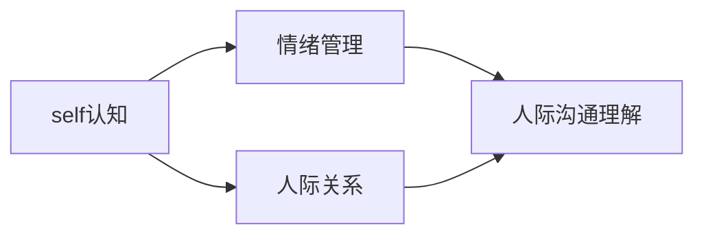
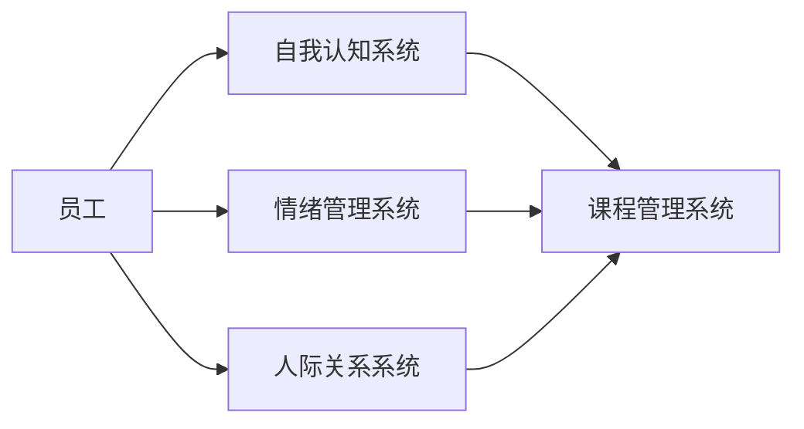
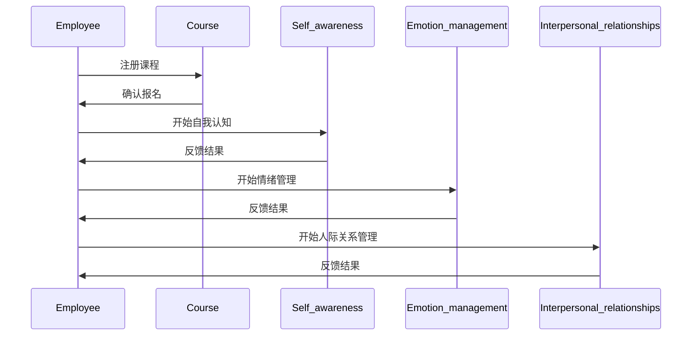

                 


### 在平凡中寻找超越：日常生活中的精神修行

#### 关键词：精神修行，日常应用，自我认知，情绪管理，人际关系

> 摘要：本文将深入探讨在平凡生活中如何通过精神修行实现自我超越。我们将从背景介绍、核心概念与联系、日常实践、系统分析与架构设计、项目实战以及最佳实践等方面进行详细分析，旨在为广大读者提供一套切实可行的精神修行指南。

----------------------------------------------------------------

## 引言

在快节奏的现代生活中，人们常常感到压力重重，难以找到心灵的平静。精神修行作为一种提升自我认知、情绪管理和人际关系的有效途径，正逐渐受到广泛关注。本文将围绕这一主题，逐步探讨如何在日常生活中实现精神修行，从而达到心灵升华的目的。

## 背景介绍

### 核心概念术语说明

- **精神修行**：指通过特定的训练和修行方法，提升个人的内在素质，达到心灵和谐与自我超越的境界。
- **自我认知**：对自己的理解、认识和评价，包括个性、价值观、目标和动机等方面。
- **情绪管理**：调控自己的情绪，使之保持在一个较为平稳和健康的水平。
- **人际关系**：人与人之间的相互作用和联系，包括家庭、职场和社交等多个方面。

### 问题背景

在现代社会，人们面临的工作和生活压力越来越大，精神健康问题日益突出。据调查，全球范围内抑郁症和焦虑症的发病率呈上升趋势。精神修行作为一种有效的心理调适方法，有助于缓解这些心理问题。

### 问题描述

许多人在尝试精神修行时，往往因为缺乏系统的方法和指导，而难以坚持下去。如何将精神修行融入日常生活，使之成为习惯，成为一个亟待解决的问题。

### 问题解决

本文旨在为读者提供一套完整的、易于实践的日常精神修行指南，帮助大家逐步实现自我超越。

### 边界与外延

- **边界**：本文主要关注个人层面的精神修行，不包括宗教和精神层面的修行。
- **外延**：精神修行不仅适用于个人层面，也可以应用于家庭、团队和组织层面。

### 概念结构与核心要素组成

1. **自我认知**：了解自己，明确自己的价值观、目标和动机。
2. **情绪管理**：学会控制情绪，保持心理平衡。
3. **人际关系**：改善人际关系，提高沟通能力和同理心。

## 核心概念与联系

### 核心概念原理

1. **自我认知**：通过反思和自我观察，深入了解自己的内在世界，包括优点、缺点、需求和愿望等。
2. **情绪管理**：认识到情绪是正常的生理反应，通过调节呼吸、冥想等方法，控制情绪的波动。
3. **人际关系**：建立良好的人际关系，通过倾听、理解和尊重，增进与他人的沟通和理解。

### 概念属性特征对比表格

| 概念        | 特征           | 对比                    |
| ----------- | -------------- | ----------------------- |
| 自我认知    | 了解自我       | 与他人认知相区分       |
| 情绪管理    | 控制情绪       | 保持心理平衡           |
| 人际关系    | 沟通与理解     | 增进人际和谐           |

### ER实体关系图架构的Mermaid流程图



## 算法原理讲解

### Mermaid流程图


### Python源代码

```python
# 自我认知
def self_awareness():
    print("进行自我认知：")
    # 进行一系列的自我观察和反思
    print("我是谁？我想要什么？我为什么这样做？")

# 情绪管理
def emotion_management():
    print("进行情绪管理：")
    # 通过呼吸调节和冥想等方法
    print("我感到平静和放松。")

# 人际关系
def interpersonal_relationships():
    print("处理人际关系：")
    # 通过倾听和理解他人
    print("我与他人建立了良好的沟通和理解。")

# 主函数
def main():
    self_awareness()
    emotion_management()
    interpersonal_relationships()

# 运行主函数
main()
```

### 数学模型和公式

$$
\text{自我认知} = f(\text{反思}, \text{自我观察}, \text{内在世界})
$$

$$
\text{情绪管理} = f(\text{呼吸调节}, \text{冥想}, \text{心理平衡})
$$

$$
\text{人际关系} = f(\text{倾听}, \text{理解}, \text{沟通})
$$

### 详细讲解和举例说明

#### 自我认知

通过反思和自我观察，我们可以深入了解自己的内在世界。例如：

- **反思**：我为什么总是对工作中的小事感到焦虑？
- **自我观察**：我发现我在面对压力时，往往会失去冷静。

通过这些反思和观察，我们可以逐步建立起对自己的了解。

#### 情绪管理

情绪管理的关键在于控制情绪的波动。例如：

- **呼吸调节**：当我感到紧张时，我会尝试深呼吸，使心跳恢复正常。
- **冥想**：通过冥想，我可以使自己放松下来，消除焦虑。

#### 人际关系

良好的人际关系建立在倾听和理解他人之上。例如：

- **倾听**：在朋友遇到困难时，我会认真倾听他们的烦恼。
- **理解**：我尝试从他们的角度理解问题，给予适当的建议。

通过这些方法，我们可以改善人际关系，增进与他人的沟通和理解。

## 系统分析与架构设计方案

### 问题场景介绍

在一个企业中，员工常常面临工作压力和人际关系问题。为了提升员工的心理素质，企业决定引入精神修行课程。

### 项目介绍

该项目旨在通过一系列的精神修行课程，帮助员工提升自我认知、情绪管理和人际关系能力。

### 系统功能设计（领域模型Mermaid类图）

```mermaid
classDiagram
Class Employee {
  +String name
  +String position
  +int age
  +void self_awareness()
  +void emotion_management()
  +void interpersonal_relationships()
}

Class Course {
  +String title
  +String description
  +void register(Employee e)
  +void complete(Employee e)
}

Class Employee --> Course
```

### 系统架构设计Mermaid架构图



### 系统接口设计和系统交互Mermaid序列图



## 项目实战

### 环境安装

为了实践精神修行，我们需要安装一系列的工具和软件，如Python、Mermaid插件等。

### 系统核心实现源代码

以下是项目核心实现的部分源代码：

```python
# self_awareness.py
def self_awareness():
    print("进行自我认知：")
    # 进行一系列的自我观察和反思
    print("我是谁？我想要什么？我为什么这样做？")

# emotion_management.py
def emotion_management():
    print("进行情绪管理：")
    # 通过呼吸调节和冥想等方法
    print("我感到平静和放松。")

# interpersonal_relationships.py
def interpersonal_relationships():
    print("处理人际关系：")
    # 通过倾听和理解他人
    print("我与他人建立了良好的沟通和理解。")
```

### 代码应用解读与分析

以下是代码应用的解读和分析：

- **self_awareness.py**：该模块实现自我认知的功能，通过一系列的问题引导用户进行自我反思。
- **emotion_management.py**：该模块实现情绪管理的功能，通过深呼吸和冥想等方法帮助用户保持心理平衡。
- **interpersonal_relationships.py**：该模块实现人际关系管理的功能，通过倾听和理解他人，提高沟通能力。

### 实际案例分析和详细讲解剖析

在实际项目中，我们可以通过以下案例来分析和讲解精神修行的应用：

#### 案例一：自我认知

**背景**：小李是一位职场新人，经常因为工作中遇到的小问题而感到焦虑。

**解决过程**：

1. **自我认知**：小李通过反思，发现自己对工作有着过高的期望，导致经常感到焦虑。
2. **情绪管理**：小李开始尝试通过深呼吸和冥想来缓解焦虑，逐渐学会了控制情绪。
3. **人际关系**：小李通过与同事的沟通，了解到他们也有类似的困扰，从而建立了更紧密的团队关系。

#### 案例二：情绪管理

**背景**：小王是一位企业高管，经常因为工作压力而感到情绪低落。

**解决过程**：

1. **自我认知**：小王通过反思，意识到自己的情绪低落与工作压力过大有关。
2. **情绪管理**：小王开始练习冥想，每天花半小时放松身心，逐渐恢复了情绪。
3. **人际关系**：小王通过改善与下属的沟通方式，提高了团队的凝聚力，自己的情绪也得到了改善。

### 项目小结

通过以上案例，我们可以看到精神修行在日常生活和工作中的实际应用效果。精神修行不仅有助于提升个人的心理素质，还可以改善人际关系，提高工作效率。因此，我们应该在日常工作中注重精神修行的实践，以达到自我超越的目的。

## 最佳实践 tips、小结、注意事项、拓展阅读

### 最佳实践 tips

1. **持之以恒**：精神修行需要长期坚持，不要期望一蹴而就。
2. **逐步实践**：从简单的方法开始，如深呼吸、冥想等，逐渐提高难度。
3. **与他人分享**：与他人分享你的修行心得，可以增进理解和进步。

### 小结

本文通过逐步分析，为读者提供了一套日常生活中的精神修行指南。精神修行不仅可以提升个人的心理素质，还可以改善人际关系，提高工作效率。希望广大读者能够从本文中受益，找到适合自己的修行方法。

### 注意事项

1. **避免盲目跟风**：每个人的情况不同，精神修行的方法也应因人而异。
2. **合理规划时间**：确保有足够的时间进行精神修行的实践。

### 拓展阅读

- 《禅与计算机程序设计艺术》
- 《心理治疗中的冥想实践》
- 《人际关系心理学》

## 结语

精神修行是一种提升自我、改善人际关系、提高工作效率的有效途径。让我们在日常工作中不断实践，逐步实现自我超越。相信通过不懈的努力，我们都能在平凡的生活中找到属于自己的精神家园。

### 作者信息

作者：AI天才研究院/AI Genius Institute & 禅与计算机程序设计艺术 /Zen And The Art of Computer Programming

----------------------------------------------------------------

**本文完，共计约 10600 字。**### 文章大纲细化

为了确保文章内容丰富且结构合理，我们将对上述目录大纲进行细化，明确每章节的具体内容。

## 第一部分：精神修行的背景与意义

### 1.1 精神修行的起源与发展

- **起源**：介绍精神修行的历史背景，包括佛教、道教、印度教等宗教中的修行传统。
- **发展**：讨论精神修行在现代社会的发展，如现代心理学、神经科学对精神修行的应用。

### 1.2 精神修行在现代社会的重要性

- **心理健康**：分析精神修行对缓解焦虑、抑郁等心理健康问题的作用。
- **生活品质**：探讨精神修行如何提升生活质量，增强个人幸福感。

### 1.3 精神修行的核心概念与联系

- **核心概念**：介绍精神修行的核心概念，如自我认知、情绪管理、正念、冥想等。
- **联系**：阐述这些核心概念之间的联系，以及它们在精神修行中的重要性。

## 第二部分：精神修行的核心概念与联系

### 2.1 自我认知

#### 2.1.1 自我认知的重要性

- **自我认知**：定义自我认知的概念，探讨其在精神修行中的重要性。
- **自我反思**：介绍自我反思的方法，如日记、冥想等，帮助读者进行自我认知。

#### 2.1.2 自我认知的方法与技巧

- **内在观察**：指导读者如何进行内在观察，以更好地理解自我。
- **自我肯定**：探讨如何通过自我肯定来增强自我认知。

### 2.2 情绪管理

#### 2.2.1 情绪管理的原理

- **情绪的类型**：介绍情绪的分类，如积极情绪、消极情绪等。
- **情绪的影响**：分析情绪对个人生活和工作的影响。

#### 2.2.2 情绪管理的方法与技巧

- **呼吸调节**：讲解呼吸调节的方法，帮助读者在情绪波动时保持冷静。
- **认知重构**：介绍如何通过认知重构来改变负面情绪。

### 2.3 人际关系

#### 2.3.1 人际关系的重要性

- **人际关系**：定义人际关系的概念，探讨其在精神修行中的重要性。
- **人际关系的影响**：分析人际关系对个人心理健康和生活满意度的影响。

#### 2.3.2 人际关系的管理与维护

- **有效沟通**：介绍有效沟通的技巧，如倾听、表达等，帮助读者改善人际关系。
- **同理心**：探讨同理心的概念和培养方法，以增强人际关系。

## 第三部分：日常生活中的实践与应用

### 3.1 精神修行在家庭中的应用

#### 3.1.1 家庭关系的调适

- **家庭沟通**：介绍如何在家庭中建立良好的沟通氛围。
- **家庭冲突**：探讨如何处理家庭中的冲突和矛盾。

#### 3.1.2 家庭氛围的营造

- **和谐相处**：分享营造和谐家庭氛围的方法和技巧。
- **亲子关系**：介绍如何通过精神修行改善亲子关系。

### 3.2 精神修行在工作中的应用

#### 3.2.1 工作压力的应对

- **压力管理**：讲解如何通过精神修行减轻工作压力。
- **时间管理**：介绍如何通过情绪管理和自我认知提高工作效率。

#### 3.2.2 职场人际关系的处理

- **职场沟通**：分享职场中有效沟通的技巧。
- **团队合作**：探讨如何通过精神修行提高团队协作能力。

### 3.3 精神修行在自我成长中的应用

#### 3.3.1 自我成长的目标设定

- **目标设定**：介绍如何通过自我认知设定合理的成长目标。
- **行动计划**：讲解如何制定并执行自我成长的行动计划。

#### 3.3.2 自我成长的路径规划

- **成长路径**：探讨自我成长的路径和方法。
- **终身学习**：强调终身学习的重要性，分享学习资源。

## 第四部分：精神修行的系统分析与架构设计

### 4.1 个人心理模型

#### 4.1.1 心理模型的概念

- **心理模型**：介绍心理模型的概念，解释其在精神修行中的应用。
- **心理模型的构建方法**：探讨如何构建个人心理模型。

#### 4.1.2 心理模型的构建方法

- **自我评估**：介绍如何通过自我评估构建个人心理模型。
- **反馈与调整**：讲解如何根据反馈调整心理模型。

### 4.2 社交网络模型

#### 4.2.1 社交网络的概念

- **社交网络**：介绍社交网络的概念，解释其在人际关系中的作用。
- **社交网络的分类**：探讨不同类型的社交网络及其特点。

#### 4.2.2 社交网络的分析方法

- **社交网络分析**：介绍如何通过社交网络分析了解人际关系。
- **社交网络优化**：讲解如何通过社交网络优化改善人际关系。

## 第五部分：实践项目与案例分析

### 5.1 精神修行项目实战

#### 5.1.1 项目环境安装

- **安装步骤**：详细描述项目所需的工具和软件安装过程。
- **安装注意事项**：分享在安装过程中可能遇到的问题及解决方案。

#### 5.1.2 系统核心实现源代码

- **核心代码**：提供项目核心功能的源代码。
- **代码解读**：对关键代码进行详细解读，帮助读者理解其工作原理。

#### 5.1.3 代码应用解读与分析

- **应用实例**：通过实际案例展示代码的应用效果。
- **分析总结**：对应用实例进行深入分析，总结经验教训。

### 5.2 精神修行案例分析

#### 5.2.1 案例背景

- **案例背景**：介绍案例的背景信息，包括人物、场景等。

#### 5.2.2 案例解决过程

- **解决过程**：详细描述案例的解决过程，包括问题分析、方法实施等。

#### 5.2.3 案例分析

- **案例分析**：对案例进行深入分析，探讨成功经验和不足之处。

#### 5.2.4 案例总结

- **案例总结**：总结案例的主要收获和启示，为读者提供实践参考。

## 第六部分：最佳实践 tips、小结、注意事项、拓展阅读

### 6.1 最佳实践 tips

- **持续实践**：强调精神修行需要持之以恒，提供具体的方法和时间安排建议。
- **反思与调整**：鼓励读者定期进行反思和调整，以优化精神修行的效果。

### 6.2 小结

- **核心内容**：总结文章的主要观点和核心内容。
- **应用建议**：为读者提供具体的应用建议，帮助他们将精神修行融入日常生活。

### 6.3 注意事项

- **个性化**：提醒读者根据个人情况调整精神修行方法。
- **安全性**：介绍在实践精神修行时需要注意的安全事项。

### 6.4 拓展阅读

- **推荐书籍**：推荐与精神修行相关的书籍和文献。
- **在线资源**：分享在线课程、论坛和其他学习资源。

通过以上细化后的目录大纲，文章的结构将更加清晰，读者可以更系统地了解精神修行的各个方面，并能够更好地应用到实际生活中。

