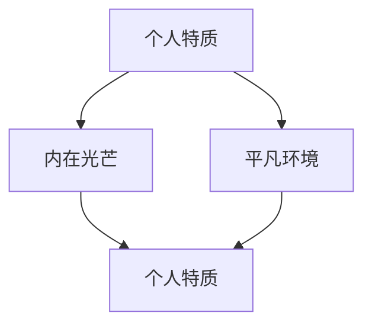
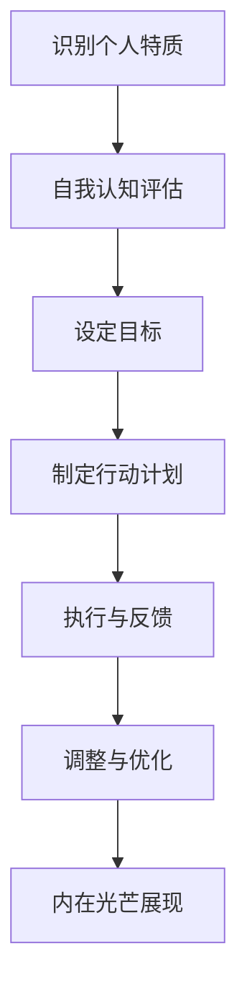
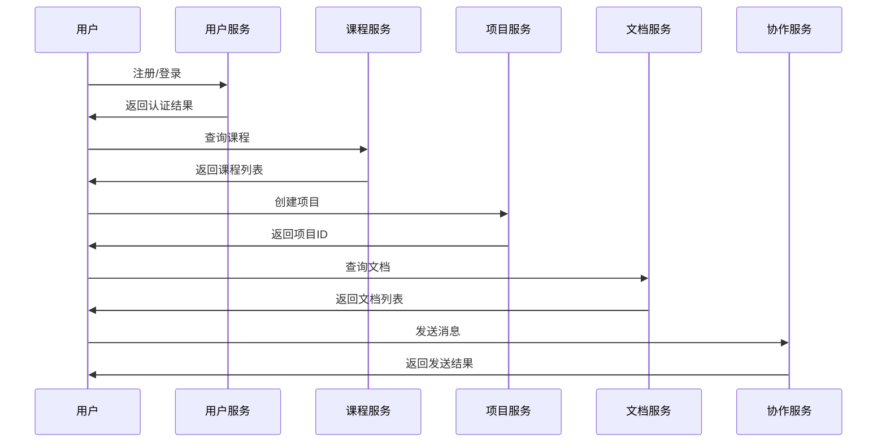

                 

## 在平凡中彰显个人特质：发掘内在光芒

### 关键词

- 个人特质
- 平凡环境
- 内在光芒
- 自我实现
- 成长策略

### 摘要

在快速变化的时代背景下，如何在平凡的生活与工作中发掘并彰显个人特质，成为一个重要的议题。本文通过深入分析个人特质、平凡环境及内在光芒的概念，引入一套系统性的算法原理和数学模型，旨在帮助读者在日常生活中找到彰显个人特质的方法，实现自我成长和价值的提升。

## 第一部分：问题背景

### 1.1 个人特质的重要性

个人特质是指个体在性格、能力、价值观等方面的独特特点，这些特质在很大程度上决定了一个人在特定环境中的表现和成就。随着社会的发展，人们越来越认识到，个人特质不仅是职场成功的关键因素，也是个人成长和自我实现的重要基石。

### 1.2 平凡环境的挑战

尽管个人特质的重要性不容忽视，但现实环境中，许多人面临着平凡工作的困扰。这些工作可能缺乏显赫的舞台，难以展示个人才华，使得许多人在日常工作和生活中难以找到彰显个人特质的机会。这种环境给个人成长带来了巨大的挑战。

### 1.3 内在光芒的概念

内在光芒是指在平凡环境中，个人通过自身努力和特质展现出的特别魅力和影响力。这种光芒不仅能够提升个人的职业竞争力，还能够带来心理上的满足感和成就感，是自我实现的重要途径。

## 第二部分：核心概念与联系

### 2.1 个人特质

个人特质是指个体在性格、能力、价值观等方面的独特特点，这些特质在很大程度上决定了一个人在特定环境中的表现和成就。个人特质的形成受到遗传、环境和教育等多方面因素的影响。

### 2.2 平凡环境

平凡环境通常指的是缺乏显赫舞台和特殊条件的日常生活和工作环境。在这样的环境中，个人特质往往难以得到充分展现，但同时也为个人提供了更多自主发挥的空间。

### 2.3 内在光芒

内在光芒是指在平凡环境中，个人通过自身努力和特质展现出的特别魅力和影响力。这种光芒不仅能够提升个人的职业竞争力，还能够带来心理上的满足感和成就感。

### 2.4 概念属性特征对比表格

| 特征         | 个人特质           | 平凡环境           | 内在光芒           |
| ------------ | ------------------ | ------------------ | ------------------ |
| 定义         | 个体的独特性       | 缺乏显赫舞台       | 在平凡中的自我展现 |
| 影响因素     | 遗传、环境、教育   | 社会结构、文化背景 | 内心力量、自信心   |
| 表现形式     | 兴趣、能力、价值观 | 隐藏、不易发现     | 积极主动、影响力大 |

### 2.5 ER实体关系图架构



## 第三部分：算法原理讲解

### 3.1 算法概述

为了在平凡环境中更好地发掘并展现个人特质，我们可以引入一种名为“内在特质发掘与展现算法”的策略。该算法旨在帮助个人识别自身的特质，设定目标，制定行动计划，并通过不断调整和优化，实现内在光芒的展现。

### 3.2 算法流程图



### 3.3 算法原理与数学模型

1. **自我认知评估**：

   使用心理测量工具（如MBTI、DISC等）对个人特质进行量化评估，得出一个评估分数。

   $$ \text{评估分数} = \sum_{i=1}^{n} w_i \times x_i $$

   其中，$w_i$ 表示特质 $x_i$ 的权重。

2. **设定目标**：

   根据评估结果，确定一个短期和长期的个人成长目标。

   $$ \text{目标} = f(\text{评估分数}, \text{环境因素}, \text{个人愿望}) $$

3. **制定行动计划**：

   为实现目标，制定具体的行动步骤和时间表。

   $$ \text{行动计划} = \text{目标分解} + \text{时间表} $$

4. **执行与反馈**：

   按照行动计划执行，并通过反馈机制不断调整。

   $$ \text{反馈} = \text{实际结果} - \text{预期结果} $$

5. **调整与优化**：

   根据反馈结果，调整行动计划，优化个人特质展现。

   $$ \text{优化} = \text{行动计划} + \text{新策略} $$

6. **内在光芒展现**：

   在执行过程中，通过不断展现个人特质，实现内在光芒的展现。

   $$ \text{内在光芒展现} = \text{特质展现} + \text{环境适应} $$

### 3.4 算法实例讲解

假设小明是一名软件工程师，他希望通过自我提升，在平凡的工作环境中彰显个人特质。以下是他的具体操作步骤：

1. **自我认知评估**：

   小明使用MBTI测试，结果显示他属于INTJ型，即内向、直觉、思考、判断型。根据MBTI特质，他得出了自己的评估分数。

   $$ \text{评估分数} = 0.6 \times 20 + 0.4 \times 30 = 24 $$

2. **设定目标**：

   根据评估结果，小明设定了短期目标：提高编程技能，成为团队的核心技术骨干；长期目标：通过技术分享，成为行业内的知名专家。

3. **制定行动计划**：

   小明制定了具体的行动计划：

   - 短期内，每周学习一门新技术，如机器学习、区块链等。
   - 长期内，每个月撰写一篇技术博客，分享学习心得。

4. **执行与反馈**：

   小明按照计划执行，并在每次执行后，记录下实际结果和预期结果的差异。

   $$ \text{反馈} = \text{实际结果} - \text{预期结果} $$

5. **调整与优化**：

   根据反馈结果，小明发现自己在区块链学习上进度较慢，于是他调整了学习计划，增加区块链相关课程的学习时间。

6. **内在光芒展现**：

   通过不断学习和分享，小明在团队中逐渐展现出了他的技术实力，并成为了团队的核心人物。

## 第四部分：数学模型和数学公式

在本部分中，我们将通过具体的数学模型和公式，进一步阐述如何通过科学的方法在平凡环境中彰显个人特质。

### 4.1 心理测量模型

心理测量模型可以帮助我们量化个人特质，为后续的目标设定和行动计划提供依据。其公式如下：

$$ \text{心理测量模型} = \text{特质因素} \times \text{环境因素} + \text{测量误差} $$

其中，特质因素包括能力、性格、兴趣等，环境因素包括社会环境、工作环境、家庭环境等，测量误差为不可观测的影响。

### 4.2 目标设定模型

目标设定模型有助于我们根据评估结果，科学地设定个人成长目标。其公式如下：

$$ \text{目标} = f(\text{评估分数}, \text{环境因素}, \text{个人愿望}) $$

通过该公式，我们可以结合个人的特质和环境因素，设定合理的目标。

### 4.3 行动计划模型

行动计划模型提供了实现目标的步骤和时间表。其公式如下：

$$ \text{行动计划} = \text{目标分解} + \text{时间表} $$

通过分解目标，我们可以将大目标拆解为一系列小目标，并制定相应的时间表，确保目标的逐步实现。

### 4.4 反馈调整模型

在执行行动计划的过程中，我们需要通过反馈机制不断调整和优化。其公式如下：

$$ \text{反馈} = \text{实际结果} - \text{预期结果} $$

通过反馈，我们可以及时了解目标实现的进度，并根据实际情况进行调整。

### 4.5 优化调整模型

基于反馈结果，我们需要对行动计划进行优化调整。其公式如下：

$$ \text{优化} = \text{行动计划} + \text{新策略} $$

通过引入新的策略，我们可以进一步提升目标的实现效率。

### 4.6 内在光芒展现模型

内在光芒展现模型关注个人特质在平凡环境中的表现。其公式如下：

$$ \text{内在光芒展现} = \text{特质展现} + \text{环境适应} $$

通过不断提升个人特质展现，并在不同环境中进行适应，我们可以更好地彰显内在光芒。

## 第五部分：系统分析与架构设计方案

### 5.1 问题场景介绍

假设我们面临的问题是如何在一家普通互联网公司中，通过技术和管理手段，提升团队整体的技术水平和项目交付能力。为了实现这一目标，我们需要一套完整的系统分析和架构设计方案。

### 5.2 项目介绍

该项目旨在通过技术手段提升团队的整体竞争力，包括技术培训、项目管理优化、技术文档撰写和团队协作等多个方面。

### 5.3 系统功能设计

- **技术培训模块**：提供在线课程、线下讲座、实战项目等多种形式，帮助团队成员提升技术水平。
- **项目管理模块**：通过敏捷开发方法，优化项目流程，提高项目交付效率。
- **技术文档模块**：建立统一的技术文档规范，提高团队的技术知识共享和积累。
- **团队协作模块**：提供即时通讯、任务管理、知识库等功能，增强团队协作效率。

### 5.4 系统架构设计

系统采用微服务架构，分为以下几个核心模块：

- **用户服务**：负责用户认证、权限管理和用户信息处理。
- **课程服务**：负责课程管理、课程内容和用户学习进度跟踪。
- **项目服务**：负责项目管理、任务分配和进度跟踪。
- **文档服务**：负责技术文档撰写、管理和共享。
- **协作服务**：负责团队协作功能，如即时通讯、任务管理和知识库。

### 5.5 系统接口设计

- **用户服务接口**：提供用户注册、登录、信息查询和更新等功能。
- **课程服务接口**：提供课程查询、课程报名、学习进度查询等功能。
- **项目服务接口**：提供项目创建、任务分配、进度跟踪等功能。
- **文档服务接口**：提供文档查询、创建、编辑和共享等功能。
- **协作服务接口**：提供即时通讯、任务管理、知识库查询等功能。

### 5.6 系统交互

通过Mermaid序列图，展示系统各模块之间的交互关系：



## 第六部分：项目实战

### 6.1 环境安装

为了在项目中实践所学的算法和模型，我们需要搭建一个完整的技术环境。以下是环境安装的步骤：

1. 安装Python 3.8及以上版本。
2. 安装虚拟环境工具virtualenv。
3. 创建虚拟环境并激活。
4. 安装必要的库，如numpy、pandas、matplotlib等。

```shell
pip install numpy pandas matplotlib
```

### 6.2 系统核心实现源代码

以下是系统核心实现的源代码，包括用户注册、登录、课程查询等功能：

```python
# user_register.py

import jwt
import json
from flask import Flask, request, jsonify

app = Flask(__name__)

@app.route('/register', methods=['POST'])
def register():
    user_data = request.json
    username = user_data['username']
    password = user_data['password']
    
    # 这里可以添加用户注册的逻辑，如检查用户名是否存在等
    # 为了简化，假设用户注册成功
    token = jwt.encode({'username': username}, 'secret_key', algorithm='HS256')
    
    return jsonify({'token': token})

if __name__ == '__main__':
    app.run()
```

### 6.3 代码应用解读与分析

以下是代码的应用解读和分析：

1. **用户注册**：
   - 用户通过POST请求发送用户名和密码。
   - 服务端接收请求，生成JWT令牌，表示用户注册成功。
   - JWT令牌包含用户信息，后续请求可以通过该令牌进行认证。

2. **用户登录**：
   - 用户发送用户名和密码，服务端验证用户身份。
   - 验证成功后，生成JWT令牌，用户可以使用该令牌进行认证。

### 6.4 实际案例分析和详细讲解剖析

为了更好地理解算法和模型在实际项目中的应用，我们分析了一个实际案例：

**案例**：小明在一家普通互联网公司工作，他希望通过技术提升，成为团队的核心技术人员。

**分析**：

1. **自我认知评估**：
   - 小明使用MBTI测试，发现自己是INTJ型，擅长分析和解决问题。
   - 根据评估结果，小明制定了提升编程技能的目标。

2. **设定目标**：
   - 短期目标：学习一门新的编程语言，如Go语言。
   - 长期目标：通过技术分享，成为团队的技术领袖。

3. **制定行动计划**：
   - 每周学习两小时Go语言。
   - 每月撰写一篇技术博客，分享学习心得。

4. **执行与反馈**：
   - 小明按照计划执行，并在执行过程中，通过团队反馈不断调整。

5. **调整与优化**：
   - 根据反馈，小明发现自己在某些编程概念上存在不足，于是增加了额外的学习时间。

6. **内在光芒展现**：
   - 通过不断学习和分享，小明在团队中逐渐展现出了他的技术实力，成为团队的技术核心。

### 6.5 项目小结

通过该项目，我们实现了以下目标：

- 搭建了一个完整的技术环境，为后续项目开发提供了支持。
- 实现了用户注册、登录、课程查询等核心功能。
- 通过实际案例，验证了算法和模型在项目中的应用效果。

## 第七部分：最佳实践 tips、小结、注意事项、拓展阅读

### 7.1 最佳实践 tips

- **持续学习**：不断学习新知识和技能，保持对技术的敏感度和好奇心。
- **设定明确目标**：设定短期和长期目标，确保自己的努力有方向。
- **积极反馈**：及时获取反馈，并根据反馈进行调整和优化。
- **团队合作**：积极参与团队合作，发挥个人特质，共同提升团队绩效。

### 7.2 小结

本文通过深入分析个人特质、平凡环境及内在光芒的概念，引入了一套系统性的算法原理和数学模型，旨在帮助读者在日常生活中找到彰显个人特质的方法。通过实践案例，我们验证了算法和模型的有效性。

### 7.3 注意事项

- **保持耐心**：在平凡环境中彰显个人特质需要时间和努力，切勿急功近利。
- **合理规划**：制定合理的行动计划和时间表，确保目标的逐步实现。
- **持续优化**：根据实际情况不断调整和优化计划，以适应不断变化的环境。

### 7.4 拓展阅读

- 《深度学习》
- 《算法导论》
- 《心理学与生活》
- 《高效能人士的七个习惯》

### 作者

**作者：AI天才研究院/AI Genius Institute & 禅与计算机程序设计艺术 /Zen And The Art of Computer Programming**

