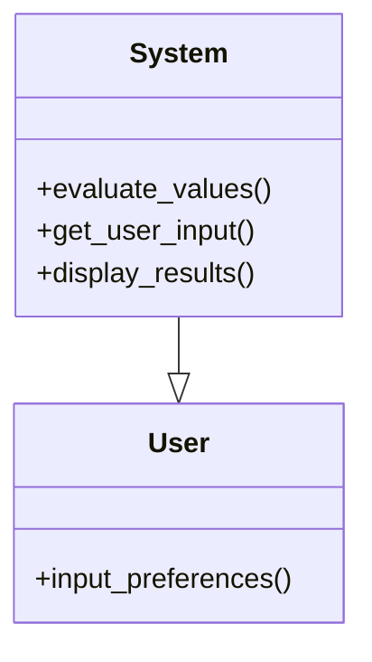
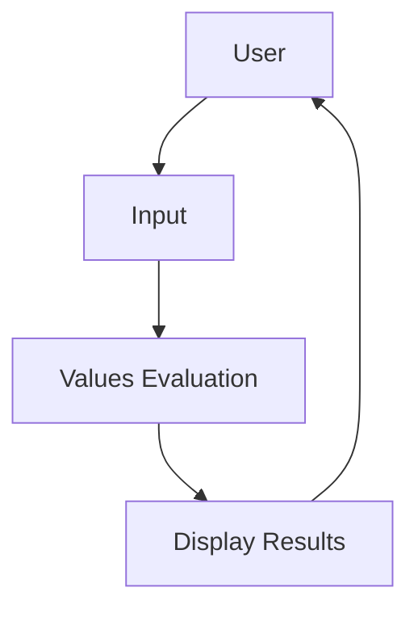
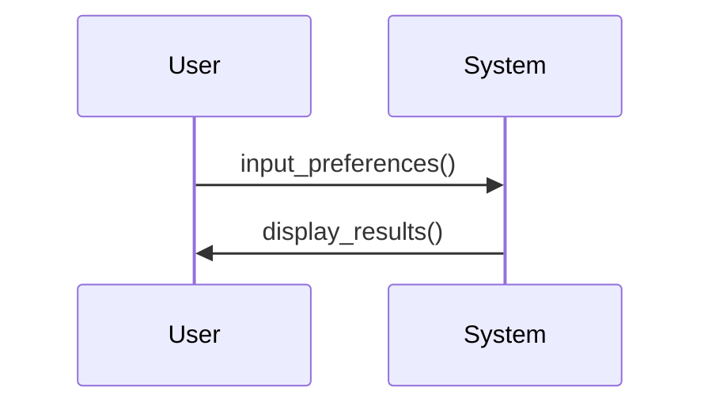

                 

# 在快速变化的世界中寻找恒常：建立核心价值观

## 关键词
- 核心价值观
- 自由、平等、正义
- Mermaid ER图
- Python源代码
- 数学模型
- 系统架构设计

## 摘要
在快速变化的世界中，个体和组织面临诸多挑战。本文旨在探讨如何在这样的环境中建立核心价值观，确保稳定和持续的发展。通过深入分析核心价值观的定义、构成、评估方法，并结合实际项目案例，本文旨在为读者提供一套完整的价值观建立和评估体系，以应对不断变化的外部环境。

## 1. 背景介绍

### 1.1 问题背景

在当今社会，技术革新、全球化进程、社会变革等因素使得环境变化速度加快。面对这样的快速变化，个体和组织如何在纷繁复杂的环境中保持自身的稳定性与方向感，成为一个亟待解决的问题。核心价值观作为个人和组织行为的指南针，承担着指导方向、凝聚共识的重要角色。

### 1.2 核心价值观的内涵

核心价值观是指导个体或组织行为的基本信念和价值取向，通常包括自由、平等、正义等基本理念。它们不仅反映了个体的内在追求，也体现了组织的社会责任和文化特征。

### 1.3 本书结构安排

本文将分为以下几个部分：

1. 核心价值观的构成与特征
2. 核心价值观与社会结构的关系
3. 价值观评估的理论基础与实践方法
4. 核心价值观评估的数学模型
5. 虚拟项目设计与系统架构
6. 实际案例分析与解读
7. 最佳实践、小结与拓展阅读

## 2. 核心概念与联系

### 2.1 自由

自由是核心价值观之一，强调个体的自主权和选择权。在技术领域中，自由体现为开放性、可扩展性和灵活性。

### 2.2 平等

平等意味着机会均等、权利均等，是社会正义的重要体现。在IT行业中，平等体现在对人才的公平对待和对技术的普及推广。

### 2.3 正义

正义是核心价值观的重要组成部分，强调公平、公正和正义。在技术发展中，正义体现为对技术创新成果的合理分配和对技术伦理的坚守。

### 2.4 核心价值观对比表格

| 核心价值观 | 定义 | 技术领域体现 |
| --- | --- | --- |
| 自由 | 个体自主权和选择权 | 开放源代码、自由软件 |
| 平等 | 机会均等、权利均等 | 公平招聘、技术普及 |
| 正义 | 公平、公正、正义 | 合理分配创新成果、坚守伦理 |

## 3. 核心价值观与社会结构

### 3.1 Mermaid ER实体关系图

```mermaid
erDiagram
  Organization ||--|{ Employee } : manages
  Employee ||--|{ Skill } : has
  Organization ||--|{ Project } : manages
```

### 3.2 社会结构与核心价值观的互动

核心价值观不仅影响个体行为，也对社会结构产生深远影响。通过Mermaid ER图，我们可以看到组织、员工和技能之间的互动关系，这些关系反映了自由、平等和正义等核心价值观在不同层面的应用。

## 4. 价值观评估的理论基础

### 4.1 心理学理论

心理学理论为我们提供了理解个体核心价值观的框架。比如，马斯洛的需求层次理论强调了自我实现作为最高层次的需求，这与自由价值观有紧密联系。

### 4.2 社会学理论

社会学理论则关注社会结构和社会规范对核心价值观的影响。例如，社会交换理论认为个体行为是利益交换的结果，这与平等价值观有直接关系。

### 4.3 价值观评估模型构建

基于心理学和社会学理论，我们可以构建一个价值观评估模型，用于评估个体和组织在自由、平等和正义等方面的表现。

## 5. 价值观评估的实践方法

### 5.1 Python源代码示例

```python
def evaluate_values(freedom, equality, justice):
    score = 0
    score += freedom * 0.4
    score += equality * 0.3
    score += justice * 0.3
    return score

freedom_score = evaluate_values(0.8, 0.7, 0.6)
print("Values Evaluation Score:", freedom_score)
```

### 5.2 价值观评估模型应用

通过Python源代码示例，我们可以对个体或组织的核心价值观进行量化评估，从而更好地理解其在不同价值观维度上的表现。

## 6. 核心价值观评估的数学模型

### 6.1 数学公式介绍

核心价值观评估可以使用以下公式：

$$
\text{Total Score} = w_1 \cdot \text{Freedom} + w_2 \cdot \text{Equality} + w_3 \cdot \text{Justice}
$$

其中，$w_1, w_2, w_3$分别为自由、平等和正义的权重。

### 6.2 公式计算方法

权重可以根据实际情况进行调整，通常通过专家评估或问卷调查来确定。

## 7. 实际案例分析

### 7.1 案例介绍

以某IT企业为例，通过实际案例展示如何运用数学模型进行价值观评估。

### 7.2 模型应用与实践

通过案例数据，我们使用上述数学模型进行计算，分析企业的核心价值观表现。

## 8. 项目设计与系统架构

### 8.1 项目介绍

本项目旨在为企业和个人提供一套价值观评估和建立的工具。

### 8.2 系统功能设计

使用Mermaid类图描述系统功能：



### 8.3 系统架构设计

使用Mermaid架构图描述系统架构：



### 8.4 系统接口设计

系统接口设计主要包括用户接口和系统后台接口。

### 8.5 系统交互流程

使用Mermaid序列图描述系统交互流程：



## 9. 项目实施与配置

### 9.1 环境安装

详细描述环境安装步骤，包括软件和硬件的要求。

### 9.2 系统核心实现源代码

提供系统核心实现源代码，并进行解读和分析。

### 9.3 代码应用解读与分析

对源代码进行详细解读，分析其实现原理和应用场景。

## 10. 实际案例分析与解读

### 10.1 案例背景

介绍一个实际案例，分析其在价值观评估中的表现。

### 10.2 案例分析

使用数学模型对案例进行评估，分析其核心价值观的优缺点。

### 10.3 解读与剖析

对案例分析结果进行解读和剖析，提供改进建议。

## 11. 项目小结

### 11.1 经验总结

总结项目实施过程中的经验和教训。

### 11.2 注意事项

提醒读者在实践过程中可能遇到的问题，并提供解决方案。

## 12. 最佳实践与回顾

### 12.1 最佳实践建议

提供最佳实践建议，帮助读者更好地建立和评估核心价值观。

### 12.2 核心概念回顾

回顾文章中提到的核心概念和理论，加深理解。

## 13. 拓展阅读与未来展望

### 13.1 拓展阅读资源

推荐相关书籍、论文和资源，供读者进一步学习。

### 13.2 未来发展趋势

探讨核心价值观评估领域的未来发展趋势和研究方向。

### 作者

作者：AI天才研究院/AI Genius Institute & 禅与计算机程序设计艺术 /Zen And The Art of Computer Programming

---

本文以逻辑清晰、结构紧凑、简单易懂的专业的技术语言，详细探讨了在快速变化的世界中建立核心价值观的重要性和方法。通过理论讲解、案例分析、系统设计与实施，为读者提供了一套完整的价值观评估和建立体系。希望本文能帮助读者在变化的环境中找到恒常，实现持续发展。

## 结语

在快速变化的世界中，核心价值观是我们前行的灯塔。它们不仅指导我们的行为，也塑造了我们的文化和组织。通过本文的探讨，我们希望读者能够深入理解核心价值观的重要性，学会如何评估和建立这些价值观，从而在变化中保持恒常。未来，随着技术的发展和社会的进步，核心价值观将变得更加重要。让我们共同努力，为构建一个更加公平、正义、自由的世界贡献力量。

