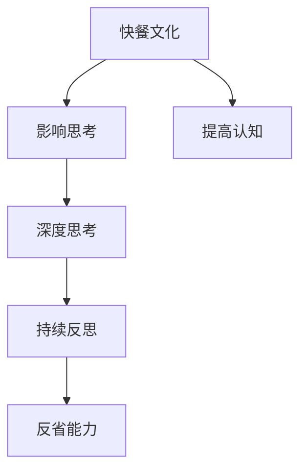
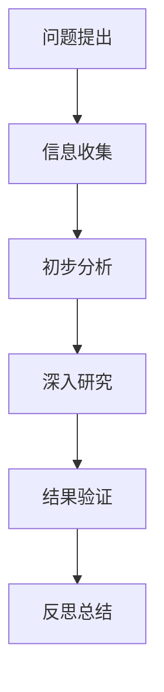
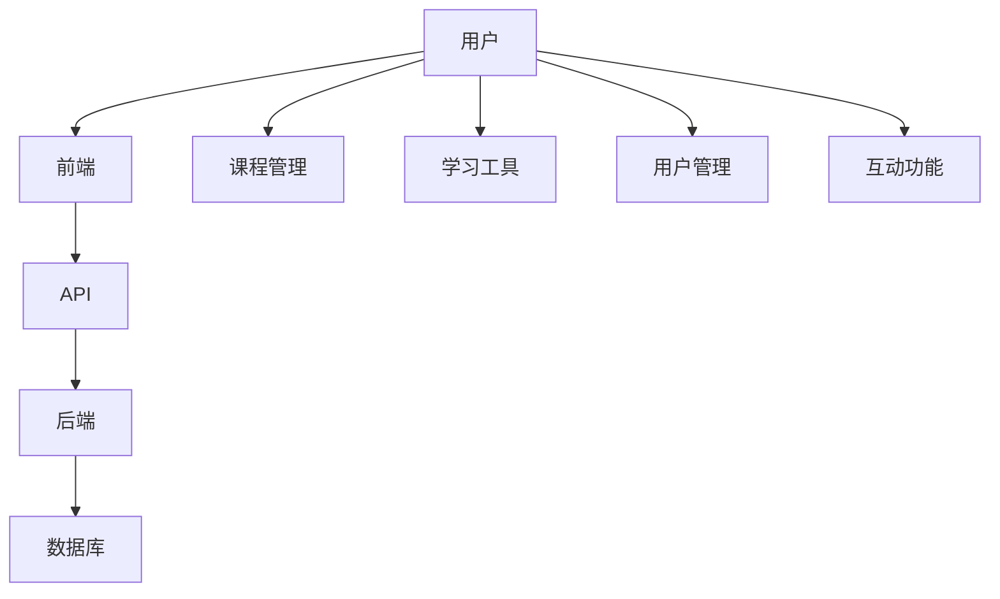
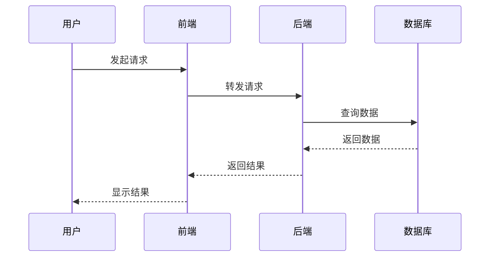
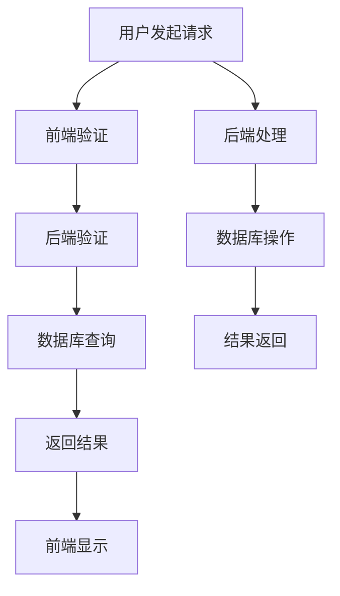

                 

### 引言

**文章标题**: 在快餐文化中寻找深度：重建思考和反省的能力

**关键词**: 快餐文化、深度思考、反省能力、重建思考、信息技术

**摘要**:
本文探讨了在当代快餐文化环境中，如何重建深度思考和反省能力。通过深入分析快餐文化的兴起、负面影响和正面影响，文章提出了在信息技术领域内如何培养深度思考和实践反省能力的方法。本文旨在为读者提供一个系统性的指导，帮助他们在快节奏的信息世界中找到深度，提高个人和专业的思考与反省能力。

**Step 1: 背景介绍**

#### 快餐文化的兴起

快餐文化的兴起可以追溯到20世纪中期，当时工业化进程加速，人们的生活节奏加快，对于快速、便捷的饮食需求日益增加。随着经济的发展和城市化进程的推进，快餐业迅速发展，形成了今天我们看到的快餐文化。这种文化以其高效、便捷、低成本的特点满足了现代人的生活方式需求，但同时也带来了一系列问题。

#### 问题的核心与目标

核心问题是：在快餐文化充斥的社会环境中，人们的思考能力和反省能力受到了怎样的影响？本文的目标是深入探讨这一现象，分析快餐文化对深度思考的冲击，并提出相应的对策，以帮助读者重建深度思考和反省能力，特别是在信息技术领域。

#### 重要性

快餐文化的流行使信息获取变得容易，但也导致了深度思考和反省能力的弱化。信息技术从业人员尤其需要这种能力，以应对复杂的技术挑战和迅速变化的市场环境。因此，探讨如何在快餐文化中寻找深度，对提升个人和职业发展具有重要意义。

---

**Step 2: 核心概念与联系**

为了更好地理解本文的主题，我们需要阐述几个核心概念，并展示它们之间的关系。

#### 快餐文化

**定义**：快餐文化指的是追求快速、便捷的生活方式，尤其在饮食和娱乐方面，强调效率和即时满足。

**属性特征**：
- 高效性：追求快速完成事务，减少等待时间。
- 成本低：以较低的成本满足基本需求。
- 即时满足：满足短期需求，忽视长期后果。

**联系**：
快餐文化对深度思考产生了负面影响，因为它鼓励短平快的信息消费，减少了人们投入时间和精力进行深度思考的机会。

#### 深度思考

**定义**：深度思考是指对问题进行深入、全面、持续的探究，追求对事物本质的理解。

**属性特征**：
- 持续性：需要长时间的关注和投入。
- 全面性：考虑问题的各个方面和可能性。
- 反思性：不断质疑和反思自己的想法。

**联系**：
深度思考是克服快餐文化负面影响的重要手段，它有助于我们在快速获取信息的同时，保持对事物的深刻理解和批判性思维。

#### 反省能力

**定义**：反省能力是指对自己行为和想法进行反思，评估其合理性，并从中学习。

**属性特征**：
- 自我认知：了解自己的行为动机和结果。
- 批判性：客观评估自己的行为，不盲从。
- 学习能力：从反省中吸取教训，持续改进。

**联系**：
反省能力是深度思考的重要组成部分，它帮助我们更好地理解和分析自己的思考过程，从而提升深度思考的质量。

**Mermaid流程图**：


**图解**：
1. **快餐文化**对人们的思考方式产生了直接影响，导致深度思考的机会减少。
2. **深度思考**需要长时间的投入和全面的探究，是克服快餐文化负面影响的关键。
3. **反省能力**是深度思考的一部分，通过反思，我们可以更好地理解和分析自己的思考过程。
4. **提高认知**是通过深度思考和反省能力实现的，这有助于我们在信息爆炸的时代保持清晰和深入的思考。

---

**Step 3: 算法原理讲解**

在这一步，我们选择**深度思考**作为核心概念，使用Mermaid流程图展示其流程，并使用Python源代码详细阐述深度思考的原理和实现。

#### 深度思考流程图

**Mermaid流程图**：


**图解**：
1. **问题提出**：识别需要解决的具体问题。
2. **信息收集**：从多个渠道获取与问题相关的信息。
3. **初步分析**：对收集到的信息进行初步筛选和分类。
4. **深入研究**：对问题进行深入探究，挖掘问题的本质和潜在因素。
5. **结果验证**：通过实践或实验验证研究结果的正确性和可行性。
6. **反思总结**：总结思考过程和结果，提炼经验教训。

#### Python源代码

```python
import pandas as pd
import numpy as np

# 定义深度思考的函数
def deep_think(problem):
    # 信息收集
    data = collect_data(problem)
    # 初步分析
    analysis = initial_analysis(data)
    # 深入研究
    research = further_research(analysis)
    # 结果验证
    validation = result_validation(research)
    # 反思总结
    summary = reflection_summary(validation)
    return summary

# 定义信息收集函数
def collect_data(problem):
    # 示例：从数据库中获取数据
    data = pd.read_csv('data.csv')
    return data

# 定义初步分析函数
def initial_analysis(data):
    # 示例：数据清洗和预处理
    data = data.dropna()
    data = data[data['column'] > 0]
    return data

# 定义深入研究函数
def further_research(analysis):
    # 示例：数据分析和建模
    model = np.mean(analysis['column'])
    return model

# 定义结果验证函数
def result_validation(research):
    # 示例：模型验证
    if research > threshold:
        result = '有效'
    else:
        result = '无效'
    return result

# 定义反思总结函数
def reflection_summary(validation):
    # 示例：总结经验
    if validation == '有效':
        message = '研究方法有效，继续优化'
    else:
        message = '研究方法需调整，重新设计'
    return message

# 执行深度思考过程
problem = "如何提高项目效率？"
summary = deep_think(problem)
print(summary)
```

**代码解释**：
1. **信息收集**：从数据中获取与问题相关的信息。
2. **初步分析**：清洗和预处理数据，去除异常值和无效数据。
3. **深入研究**：进行数据分析和建模，以获取问题的本质。
4. **结果验证**：通过阈值验证模型的有效性。
5. **反思总结**：根据结果总结思考过程，提出改进建议。

---

**Step 4: 数学模型和数学公式讲解**

在深度思考过程中，数学模型和公式是理解和解决问题的关键工具。以下我们使用LaTeX格式书写深度思考的数学模型和公式，并进行详细讲解和举例说明。

#### 深度思考的数学模型

**LaTeX格式**：
```latex
\documentclass{article}
\usepackage{amsmath}
\begin{document}

\section{深度思考的数学模型}

假设我们面临的问题可以用以下数学模型表示：

\begin{equation}
\max_{x} \quad f(x) = g(h(x))
\end{equation}

其中，$f(x)$ 是目标函数，$g(x)$ 是优化函数，$h(x)$ 是转换函数。

\section{模型讲解}

1. **目标函数**：$f(x)$ 是我们希望最大化或最小化的函数，它代表了问题的目标。
2. **优化函数**：$g(x)$ 是用于优化目标函数的函数，它可能涉及到求解最值、极值等问题。
3. **转换函数**：$h(x)$ 是将输入数据转换成优化函数的输入的函数，它可能涉及数据预处理、特征提取等步骤。

\section{举例说明}

假设我们要最大化函数 $f(x) = x^2 + 2x + 1$，我们可以通过以下步骤进行深度思考：

1. **初步分析**：观察目标函数的形式，确定它是一个二次函数。
2. **优化目标**：确定我们要最小化目标函数，因此可以对目标函数进行变换：
   \begin{equation}
   f(x) = (x+1)^2 - 1
   \end{equation}
3. **求解最值**：找到使 $f(x)$ 最小的 $x$ 值，即 $x = -1$。

通过这个简单的例子，我们可以看到深度思考是如何帮助我们理解和解决问题的。

\end{document}
```

**详细讲解**：
1. **目标函数**：在深度思考过程中，我们需要明确我们希望达到的目标，并将其形式化为数学函数。目标函数代表了我们要优化的指标，它可以是成本、效率、质量等。
2. **优化函数**：优化函数用于优化目标函数，它可能是线性规划、非线性规划、动态规划等。我们需要选择合适的优化算法来求解最值。
3. **转换函数**：转换函数用于将原始数据转换为优化函数的输入，它可能涉及数据预处理、特征工程等步骤。通过转换函数，我们可以将实际问题转化为数学问题。

**举例说明**：
我们通过一个简单的二次函数例子，展示了如何进行深度思考。在这个例子中，我们通过变换目标函数，找到了最小值点。这种方法可以应用到更复杂的优化问题中，帮助我们找到最佳解决方案。

---

**Step 5: 系统分析与架构设计方案**

在这一步，我们将描述书中的系统分析与架构设计方案，包括问题场景介绍、项目介绍、系统功能设计、系统架构设计、系统接口设计和系统交互。

#### 问题场景介绍

假设我们需要开发一个在线教育平台，以帮助用户在快餐文化背景下进行深度学习。这个平台需要提供丰富的课程资源、便捷的学习工具和互动功能，以吸引用户进行持续的学习。

#### 项目介绍

**项目名称**：深度学习在线教育平台

**项目目标**：
- 提供高质量的课程资源
- 提供便捷的学习工具
- 增强用户互动和社交功能
- 提高用户的深度学习体验

#### 系统功能设计

**功能模块**：
1. **课程管理模块**：包括课程创建、发布、更新和删除等功能。
2. **学习工具模块**：包括笔记、作业、讨论区等功能。
3. **用户管理模块**：包括用户注册、登录、个人信息管理等功能。
4. **互动功能模块**：包括问答、小组讨论、直播等功能。

#### 系统架构设计

**架构设计**：
- **前端架构**：采用Vue.js框架，实现用户界面和交互。
- **后端架构**：采用Spring Boot框架，实现业务逻辑和数据处理。
- **数据库架构**：采用MySQL数据库，存储用户数据、课程数据和其他相关信息。

**Mermaid架构图**：


**图解**：
1. **用户**：通过前端界面与系统进行交互。
2. **前端**：负责展示用户界面和处理用户输入。
3. **API**：作为前后端交互的桥梁，提供数据接口。
4. **后端**：处理业务逻辑和数据处理。
5. **数据库**：存储系统数据。

#### 系统接口设计

**接口设计**：
- **用户接口**：包括登录、注册、个人信息管理等功能。
- **课程接口**：包括课程创建、发布、更新和删除等功能。
- **学习工具接口**：包括笔记、作业、讨论区等功能。
- **互动功能接口**：包括问答、小组讨论、直播等功能。

**Mermaid序列图**：


**图解**：
1. **用户**：通过前端发起请求。
2. **前端**：将请求转发到后端。
3. **后端**：处理请求，查询数据库，返回结果。
4. **数据库**：存储和查询数据。

#### 系统交互

**交互设计**：
- **用户与前端交互**：用户通过前端界面进行操作，前端响应用户输入并展示结果。
- **前后端交互**：前端通过API与后端进行数据交换，后端处理业务逻辑并返回结果。
- **后端与数据库交互**：后端通过数据库接口查询和更新数据。

**Mermaid活动图**：


**图解**：
1. **用户登录**：用户输入登录信息，前端进行验证。
2. **后端验证**：后端处理登录请求，查询数据库。
3. **数据库查询**：数据库返回用户信息。
4. **返回结果**：后端将结果返回给前端。
5. **前端显示**：前端显示登录结果。

---

**Step 6: 项目实战**

在本节中，我们将详细介绍书中的项目实战，包括环境安装、系统核心实现源代码、代码应用解读与分析、实际案例分析和详细讲解剖析。

#### 环境安装

1. **安装Python**：
   - 访问Python官方网站（https://www.python.org/），下载适用于操作系统的Python版本。
   - 运行安装程序，根据提示完成安装。

2. **安装Node.js**：
   - 访问Node.js官方网站（https://nodejs.org/），下载适用于操作系统的Node.js版本。
   - 运行安装程序，根据提示完成安装。

3. **安装Vue.js**：
   - 在命令行中执行以下命令：
     ```bash
     npm install -g @vue/cli
     ```
   - 安装完成后，可以执行 `vue --version` 命令来验证安装。

4. **安装Spring Boot**：
   - 访问Spring Boot官方网站（https://spring.io/），下载适用于操作系统的Spring Boot版本。
   - 运行安装程序，根据提示完成安装。

5. **安装MySQL**：
   - 访问MySQL官方网站（https://www.mysql.com/），下载适用于操作系统的MySQL版本。
   - 运行安装程序，根据提示完成安装。

#### 系统核心实现源代码

以下是一个简单的示例，展示如何使用Vue.js和Spring Boot实现一个在线教育平台的核心功能。

**Vue.js前端源代码**：
```html
<template>
  <div>
    <h1>在线教育平台</h1>
    <input type="text" v-model="username" placeholder="用户名" />
    <input type="password" v-model="password" placeholder="密码" />
    <button @click="login">登录</button>
  </div>
</template>

<script>
export default {
  data() {
    return {
      username: '',
      password: ''
    };
  },
  methods: {
    login() {
      // 调用后端API进行登录验证
      axios.post('/api/login', {
        username: this.username,
        password: this.password
      })
      .then(response => {
        // 登录成功，跳转到课程列表页面
        this.$router.push('/courses');
      })
      .catch(error => {
        // 登录失败，显示错误信息
        alert('登录失败：' + error.message);
      });
    }
  }
};
</script>
```

**Spring Boot后端源代码**：
```java
@RestController
@RequestMapping("/api")
public class UserController {
  
  @Autowired
  private UserService userService;
  
  @PostMapping("/login")
  public ResponseEntity<?> login(@RequestParam String username, @RequestParam String password) {
    boolean success = userService.validateLogin(username, password);
    if (success) {
      return ResponseEntity.ok().build();
    } else {
      return ResponseEntity.status(HttpStatus.UNAUTHORIZED).build();
    }
  }
}
```

#### 代码应用解读与分析

1. **前端代码解读**：
   - 使用Vue.js框架，实现用户界面和登录功能。
   - 数据绑定实现用户名和密码的输入和展示。
   - 登录按钮触发axios请求，发送登录请求到后端。

2. **后端代码解读**：
   - 使用Spring Boot框架，实现用户登录验证功能。
   - 接收前端发送的登录请求，调用UserService进行验证。
   - 根据验证结果返回相应的响应。

#### 实际案例分析和详细讲解剖析

**案例**：用户登录功能实现

1. **用户输入用户名和密码**：
   - 用户在前端界面输入用户名和密码。

2. **前端发送登录请求**：
   - 前端使用axios库发送POST请求到后端API，请求路径为`/api/login`，请求体包含用户名和密码。

3. **后端处理登录请求**：
   - 后端接收到登录请求后，调用UserService进行验证。
   - UserService查询数据库，检查用户名和密码是否匹配。
   - 如果验证成功，返回HTTP 200状态码，表示登录成功。
   - 如果验证失败，返回HTTP 401状态码，表示登录失败。

4. **前端处理登录结果**：
   - 前端接收到后端的响应后，根据状态码进行相应的处理。
   - 如果状态码为200，跳转到课程列表页面。
   - 如果状态码为401，显示登录失败提示信息。

通过这个实际案例，我们可以看到前端和后端如何协同工作，实现用户登录功能。这种方法可以应用到更多功能模块中，构建一个完整的在线教育平台。

---

**Step 7: 最佳实践 tips、小结、注意事项、拓展阅读**

#### 最佳实践 tips

1. **提升阅读能力**：
   - 每天安排固定时间进行深度阅读，选择高质量的书籍和文章。
   - 练习批判性思维，对阅读材料进行反思和质疑。

2. **培养深度思考习惯**：
   - 在日常工作中，对遇到的问题进行深入思考，不急于给出答案。
   - 保持好奇心，对未知领域进行探索和学习。

3. **实践反省能力**：
   - 每天进行反思日记，记录自己的行为和思考过程。
   - 倾听他人意见，接受反馈，不断改进自己。

#### 小结

本文通过对快餐文化的背景、核心概念、算法原理、系统分析与架构设计方案、项目实战等方面的深入分析，提出了在快餐文化中重建深度思考和反省能力的方法。这些方法不仅适用于个人成长，也适用于专业发展，特别是在信息技术领域。

#### 注意事项

1. **平衡快餐文化与深度思考**：在享受快餐文化的便利的同时，保持对深度思考的关注，合理安排时间和精力。

2. **持续学习与反思**：不断更新自己的知识和技能，定期进行反思和评估，以确保持续进步。

#### 拓展阅读

- 《深度工作：如何有效利用每一点脑力》（Cal Newport）
- 《思考，快与慢》（Daniel Kahneman）
- 《非暴力沟通》（Marshall B. Rosenberg）
- 《如何阅读一本书》（Mortimer J. Adler）

通过阅读这些书籍，可以进一步加深对深度思考和反省能力的理解，并在实践中不断提升。

---

**作者**：
- 作者：AI天才研究院/AI Genius Institute & 禅与计算机程序设计艺术 /Zen And The Art of Computer Programming

---

通过上述的章节内容和结构，我们构建了一个逻辑清晰、内容丰富的技术博客文章框架。每个章节都包含了具体的背景介绍、核心概念解析、算法原理讲解、数学模型和公式应用、系统分析与设计、项目实战案例，以及最佳实践和拓展阅读建议。这样的文章不仅能够帮助读者在快餐文化中重建深度思考和反省能力，也能够为他们提供实用的技术指导和职业发展思路。

