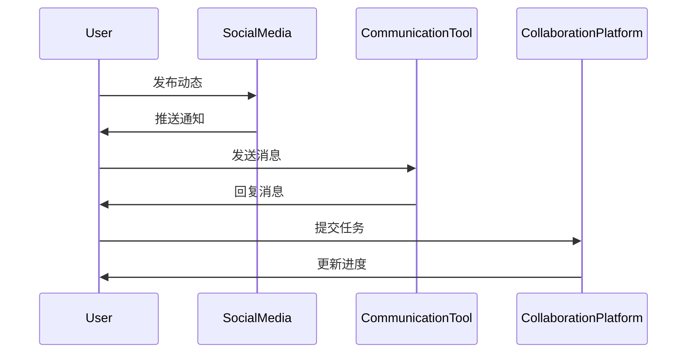
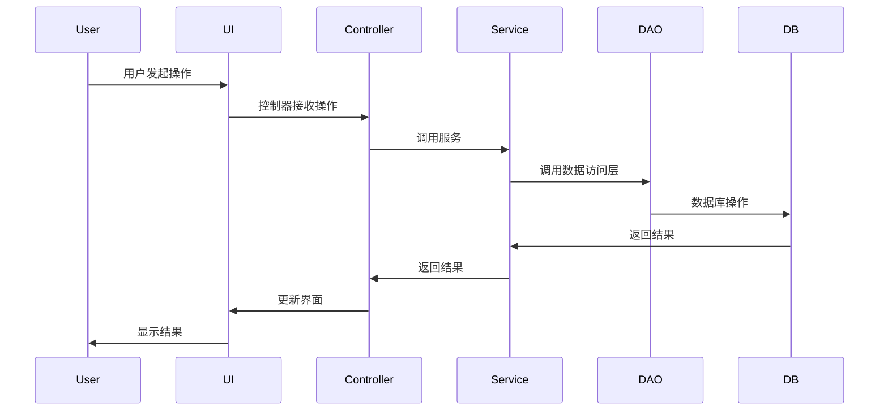
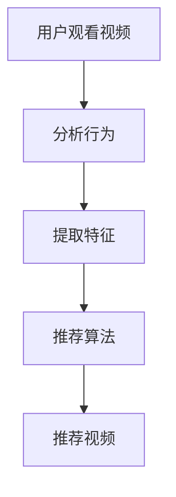
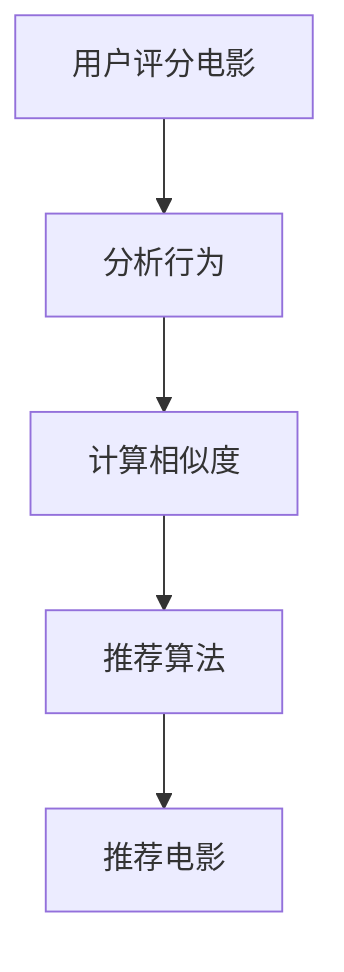
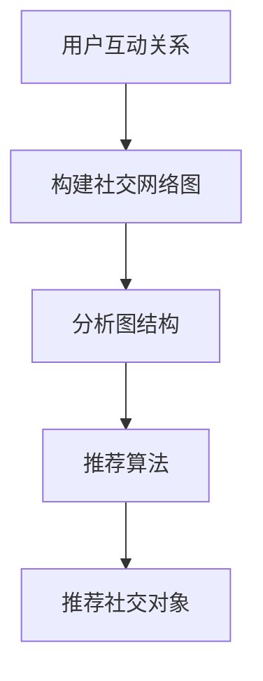
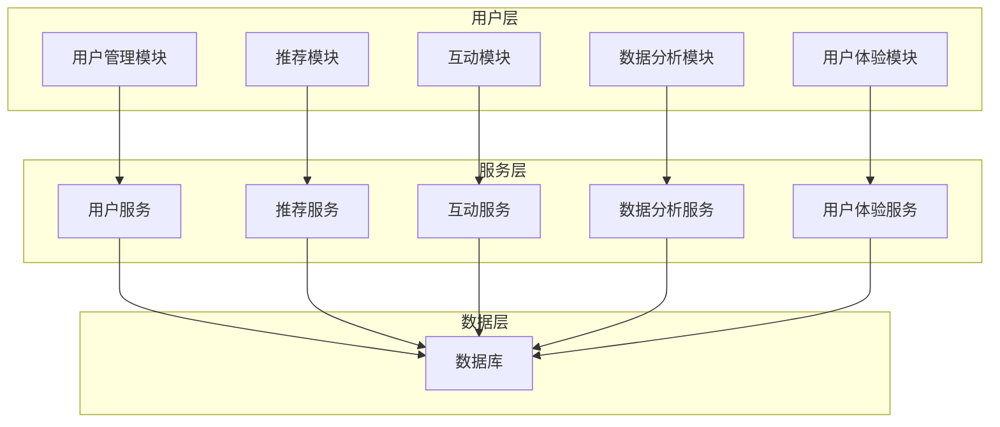

                 

# 在数字化时代重构人际关系：探索真实连接的创新方式

## 关键词

数字化时代、人际关系、真实连接、创新方式、社交算法、用户体验、跨界合作

## 摘要

随着数字化时代的到来，人际关系面临着前所未有的挑战。传统的面对面交流被虚拟互动所取代，人们之间的真实连接日益减弱。本文旨在探讨在数字化时代重构人际关系的创新方式，通过分析数字化工具对人际关系的影响，探索真实连接的要素及其在数字化环境下的实现路径。文章从核心概念、创新方法、新兴技术应用等多个维度出发，结合具体案例，提出了一套系统性的解决方案，以期为数字化时代的人际关系重构提供有益的启示。

## 第1章 引言

### 1.1 背景介绍

#### 数字化时代的特征

数字化时代，即信息化社会，是一个以数字技术为核心，信息作为主要生产要素，知识作为主要推动力，数据作为关键资源的社会。在这个时代，计算机、互联网、移动通信、大数据、人工智能等数字技术得到了广泛应用，深刻地改变了人们的生产方式、生活方式和社交方式。

#### 人际关系在数字化时代面临的挑战

1. **物理距离的削弱，情感距离的增强**：数字化工具使人们能够随时随地进行沟通，但同时也使得沟通变得更加表面化，缺乏深度和情感的交流。
2. **社交圈子的扩大，人际关系的疏离**：社交媒体平台使得人们的社交圈扩大，但朋友之间的关系却变得日益疏远，互动质量下降。
3. **信息的过载，注意力的分散**：在数字化时代，人们接收到的信息量巨大，这导致了注意力的分散，影响了人与人之间的深入交流和互动。

#### 真实连接的重要性

真实连接，是指建立在真诚、信任和共同理解基础上的深度人际交往。在数字化时代，真实连接对于维护心理健康、提升社交质量和促进社会和谐具有重要意义。重构人际关系，实现真实连接，成为数字化时代的重要课题。

### 1.2 问题描述

#### 人际关系重构的目标

1. **增强沟通深度**：通过创新方式，提高人际沟通的深度和情感质量。
2. **优化社交体验**：提升用户在数字化平台上的社交体验，减少信息过载和注意力分散。
3. **促进社会和谐**：通过重构人际关系，促进社会的和谐与稳定。

#### 数字化工具在人际关系中的作用

1. **提高沟通效率**：数字化工具使得信息传递更加迅速和高效。
2. **拓宽社交渠道**：通过社交媒体和在线协作平台，人们可以接触到更多的社交机会和资源。
3. **丰富社交形式**：数字化工具提供了多样化的社交形式，如视频会议、在线游戏等。

#### 真实连接与虚拟互动的关系

虚拟互动是数字化时代人际交往的主要形式，而真实连接则是人际关系的核心目标。如何通过创新方式，将虚拟互动转化为真实连接，是当前亟待解决的问题。

### 1.3 问题解决

#### 创新方式的概念

创新方式，是指在数字化时代背景下，通过技术手段和社会机制的创新，重构人际关系，实现真实连接的方法和路径。

#### 探索创新方式的方法

1. **技术手段创新**：利用人工智能、大数据、区块链等新兴技术，提升人际沟通的效率和深度。
2. **社会机制创新**：通过制度设计和社会教育，培养用户在数字化环境下的真实连接意识和能力。
3. **用户体验优化**：从用户角度出发，设计人性化的社交平台和互动机制，提升用户的社交体验。

### 1.4 边界与外延

#### 数字化工具的分类

1. **社交媒体**：如Facebook、Twitter、微信等，主要用于个人信息的发布和社交互动。
2. **网络通讯工具**：如电子邮件、即时通讯软件、视频会议工具等，用于实时或非实时的沟通。
3. **在线协作平台**：如Slack、Trello、GitHub等，用于团队协作和项目管理工作。

#### 人际关系重构的范围

1. **个人层面**：通过创新方式，提升个人社交质量和深度。
2. **团队层面**：通过数字化工具和机制，优化团队沟通和协作效率。
3. **社会层面**：通过社会教育和制度设计，促进社会和谐与稳定。

#### 创新方式的适用性

创新方式适用于各类数字化环境，包括社交媒体、在线协作平台、虚拟现实环境等。在不同的环境中，创新方式的具体实施方式会有所不同，但核心目标始终是重构人际关系，实现真实连接。

### 1.5 概念结构与核心要素组成

#### 数字化时代的人际关系

1. **沟通方式**：基于数字化工具的虚拟互动。
2. **社交形式**：多样化的在线社交活动。
3. **关系质量**：受虚拟互动质量影响。

#### 真实连接的概念

真实连接是指建立在真诚、信任和共同理解基础上的深度人际交往。

#### 创新方式的要素

1. **技术要素**：人工智能、大数据、区块链等新兴技术。
2. **社会要素**：社会教育和制度设计。
3. **用户体验要素**：人性化的社交平台和互动机制。

## 第2章 数字化工具与人际关系

### 2.1 数字化工具概述

#### 社交媒体

社交媒体是指通过互联网平台进行社交互动的工具，如Facebook、Twitter、微信等。社交媒体具有信息传播速度快、社交圈子大、互动形式多样等特点。

#### 网络通讯工具

网络通讯工具包括电子邮件、即时通讯软件、视频会议工具等。这些工具使得人们可以随时随地保持沟通，提高了沟通的效率。

#### 在线协作平台

在线协作平台如Slack、Trello、GitHub等，主要用于团队协作和项目管理工作。这些平台提供了任务管理、文件共享、实时沟通等功能，大大提高了团队协作的效率。

### 2.2 数字化工具对人际关系的影响

#### 负面影响

1. **信息过载**：数字化工具使得人们接收到的信息量巨大，导致注意力分散，难以进行深入交流。
2. **社交疏离**：虽然社交圈子扩大，但人与人之间的互动质量下降，关系变得疏远。
3. **隐私泄露**：数字化工具在提供便利的同时，也带来了隐私泄露的风险。

#### 积极影响

1. **沟通便捷**：数字化工具使得沟通更加方便，不受时间和地点的限制。
2. **社交圈拓宽**：通过社交媒体，人们可以接触到更多的社交机会和资源。
3. **协作效率提升**：在线协作平台提高了团队协作效率，促进了项目的顺利完成。

### 2.3 真实连接与虚拟互动的区别

#### 虚拟互动的特点

1. **表面化**：虚拟互动往往注重信息的传递，而忽视了情感的表达和交流。
2. **即时性**：虚拟互动具有即时性的特点，但同时也使得互动内容变得更加碎片化。
3. **广泛性**：虚拟互动使得人们可以与广泛的社会群体进行互动，但关系质量难以保证。

#### 真实连接的要素

1. **情感交流**：真实连接建立在真诚的情感交流基础上，双方能够真实地表达自己的想法和情感。
2. **深度互动**：真实连接强调深度互动，不仅仅是信息的传递，更包括思想、价值观的碰撞和交流。
3. **信任建设**：真实连接需要建立在信任的基础上，双方需要相互信任和理解。

## 第3章 创新方式探索

### 3.1 创新方式概述

#### 创新方法

1. **技术手段创新**：利用人工智能、大数据、区块链等新兴技术，提升人际沟通的效率和深度。
2. **社会机制创新**：通过制度设计和社会教育，培养用户在数字化环境下的真实连接意识和能力。
3. **用户体验优化**：从用户角度出发，设计人性化的社交平台和互动机制，提升用户的社交体验。

#### 创新路径

1. **技术路径**：通过技术创新，如智能推荐算法、虚拟现实技术等，提高人际沟通的质量和效率。
2. **社会路径**：通过社会教育，提高用户对真实连接的认知和重视，培养数字化环境下的真实连接能力。
3. **用户路径**：通过用户体验优化，设计人性化的社交平台和互动机制，使用户能够更容易地建立真实连接。

### 3.2 数字化时代的人际关系创新

#### 跨界合作

1. **定义**：跨界合作是指将不同领域的知识和资源整合起来，共同创造新的价值和机会。
2. **实践**：通过跨界合作，可以实现人际关系的创新，如通过结合心理学、社会学等学科，设计出更加人性化的社交平台。

#### 社交算法优化

1. **定义**：社交算法是一种通过数据分析，为用户推荐合适社交对象和内容的算法。
2. **实践**：通过优化社交算法，可以提高人际沟通的效率和质量，如通过分析用户行为，推荐有共同兴趣和价值观的朋友。

#### 个性化互动

1. **定义**：个性化互动是根据用户的兴趣、行为和偏好，为用户提供定制化的社交体验。
2. **实践**：通过个性化互动，可以提升用户的社交体验，增强真实连接的可能性。

### 3.3 真实连接的创新实践

#### 新兴技术的应用

1. **虚拟现实（VR）**：通过VR技术，用户可以体验到身临其境的社交互动，提高真实连接的体验。
2. **增强现实（AR）**：通过AR技术，用户可以在现实生活中实现虚拟互动，拓展社交场景。

#### 用户体验设计

1. **定义**：用户体验设计是关注用户在使用产品或服务过程中的感受和体验的设计过程。
2. **实践**：通过用户体验设计，可以提高用户的满意度和忠诚度，促进真实连接的实现。

## 第4章 核心概念与联系

### 4.1 核心概念原理

#### 数字化工具的原理

数字化工具基于数字技术的原理，通过信息处理、传输和存储，实现人与人之间的沟通和协作。

#### 真实连接的原理

真实连接建立在真诚、信任和共同理解的基础上，通过情感交流和深度互动，实现人与人之间的真实连接。

### 4.2 概念属性特征对比表格

| 概念     | 特征1     | 特征2   | 特征3   |
|----------|-----------|---------|---------|
| 数字化工具 | 信息处理高效 | 跨时空互动 | 安全性较低 |
| 真实连接   | 情感表达真实 | 深度互动强 | 需要时间投入 |

### 4.3 ER实体关系图架构

```mermaid
erDiagram
    用户 ||--|{ 社交媒体 }
    用户 ||--|{ 网络通讯工具 }
    用户 ||--|{ 在线协作平台 }
    用户 ||--|{ 真实连接 }
    用户 ||--|{ 数字化工具 }
```

## 第5章 算法原理讲解

### 5.1 社交算法概述

#### 社交算法的定义

社交算法是一种基于数据分析和机器学习技术，为用户推荐合适社交对象和内容的算法。

#### 社交算法的类型

1. **基于内容的推荐**：根据用户感兴趣的内容，推荐相关社交对象和内容。
2. **基于协同过滤的推荐**：根据用户的行为和偏好，推荐与用户有相似兴趣的人。
3. **基于图论的推荐**：通过社交网络结构，推荐用户可能感兴趣的人。

### 5.2 社交算法的工作原理

#### 数据采集

1. **用户行为数据**：如浏览记录、点赞行为、评论内容等。
2. **社交关系数据**：如好友关系、互动频率等。

#### 数据分析

1. **用户兴趣分析**：通过分析用户行为数据，识别用户的兴趣和偏好。
2. **社交网络分析**：通过分析社交关系数据，构建用户社交网络，识别潜在的朋友关系。

#### 推荐算法

1. **内容推荐**：根据用户兴趣，推荐相关社交对象和内容。
2. **关系推荐**：根据社交网络分析结果，推荐可能成为朋友的人。

### 5.3 社交算法的应用与优化

#### 数据隐私保护

1. **数据加密**：对用户数据进行加密，确保数据安全。
2. **匿名化处理**：对用户数据进行匿名化处理，保护用户隐私。

#### 用户行为分析

1. **行为模式识别**：通过分析用户行为数据，识别用户的行为模式。
2. **个性化推荐**：根据用户行为模式，为用户提供个性化的社交推荐。

#### 真实连接的促进

1. **情感分析**：通过分析用户在互动过程中的情感表达，识别情感强度和情感倾向。
2. **互动质量提升**：根据情感分析结果，优化互动体验，提高真实连接的可能性。

## 第6章 数学模型和数学公式

### 6.1 数学模型概述

#### 真实连接的数学模型

真实连接度可以通过以下数学模型进行衡量：

$$
\text{真实连接度} = \alpha \times \text{情感交流质量} + \beta \times \text{深度互动程度}
$$

其中，$\alpha$ 和 $\beta$ 是权重系数，分别表示情感交流质量和深度互动程度在真实连接度中的重要性。

### 6.2 数学公式详细讲解

#### 情感交流质量的度量

情感交流质量可以通过以下公式进行度量：

$$
\text{情感交流质量} = \frac{\sum_{i=1}^{n} \text{情感强度} \times \text{互动频率}}{n}
$$

其中，$n$ 表示互动次数，情感强度和互动频率是通过情感分析和行为分析得到的。

#### 深度互动程度的衡量

深度互动程度可以通过以下公式进行衡量：

$$
\text{深度互动程度} = \frac{\sum_{i=1}^{n} \text{互动质量} \times \text{互动时长}}{n}
$$

其中，$n$ 表示互动次数，互动质量和互动时长是通过互动分析和行为分析得到的。

### 6.3 举例说明

#### 情感交流质量的度量

假设用户A和用户B进行了5次互动，其中，情感强度分别为2、3、4、3、2，互动频率分别为1、1、2、1、1。则用户A和用户B的情感交流质量为：

$$
\text{情感交流质量} = \frac{2 \times 1 + 3 \times 1 + 4 \times 2 + 3 \times 1 + 2 \times 1}{5} = \frac{16}{5} = 3.2
$$

#### 深度互动程度的衡量

假设用户A和用户B进行了5次互动，其中，互动质量分别为4、3、5、4、3，互动时长分别为2、1、3、2、1。则用户A和用户B的深度互动程度为：

$$
\text{深度互动程度} = \frac{4 \times 2 + 3 \times 1 + 5 \times 3 + 4 \times 2 + 3 \times 1}{5} = \frac{28}{5} = 5.6
$$

#### 真实连接度的计算

假设权重系数 $\alpha = 0.6$，$\beta = 0.4$，则用户A和用户B的真实连接度为：

$$
\text{真实连接度} = 0.6 \times 3.2 + 0.4 \times 5.6 = 1.92 + 2.24 = 4.16
$$

## 第7章 系统分析与架构设计

### 7.1 问题场景介绍

#### 数字化工具在人际关系中的应用场景

1. **日常沟通**：用户通过社交媒体和即时通讯工具进行日常交流，如聊天、视频通话等。
2. **社交互动**：用户在社交媒体上发布动态，获取关注和互动，如点赞、评论、分享等。
3. **团队协作**：用户通过在线协作平台进行项目管理和团队协作，如任务分配、进度跟踪、文件共享等。

### 7.2 系统功能设计

#### 领域模型类图

```mermaid
classDiagram
    User <<Class>> "用户"
    SocialMedia <<Class>> "社交媒体"
    CommunicationTool <<Class>> "通讯工具"
    CollaborationPlatform <<Class>> "协作平台"
    RealConnection <<Class>> "真实连接"
    
    User <|-- SocialMedia
    User <|-- CommunicationTool
    User <|-- CollaborationPlatform
    User <|-- RealConnection
```

### 7.3 系统架构设计

#### 系统架构图



### 7.4 系统接口设计

#### 接口设计说明

1. **用户接口**：用户通过用户接口与系统进行交互，如发布动态、发送消息、提交任务等。
2. **服务接口**：系统内部的服务接口，如动态推送服务、消息通知服务、任务管理服务等。

### 7.5 系统交互

#### 系统交互序列图



## 第8章 项目实战

### 8.1 环境安装

#### 环境搭建步骤

1. **安装操作系统**：安装支持Java或Python的开发环境，如Linux或macOS。
2. **安装编程工具**：安装集成开发环境（IDE），如IntelliJ IDEA或Visual Studio Code。
3. **安装数据库**：安装关系型数据库，如MySQL或PostgreSQL。
4. **安装相关依赖**：安装Java或Python的相关依赖，如JDBC驱动或PyMySQL库。

### 8.2 系统核心实现

#### 核心代码实现

```java
// Java示例代码
public class SocialMediaService {
    public void postDynamic(String content) {
        // 动态发布逻辑
    }
}

// Python示例代码
def post_dynamic(content):
    # 动态发布逻辑
```

### 8.3 代码应用解读与分析

#### 代码解读

上述代码分别展示了Java和Python语言中，一个简单的社交媒体服务类和方法。服务类用于处理用户的动态发布请求，方法体中实现了动态发布的基本逻辑。

#### 应用分析

通过以上代码，我们可以看到，系统核心实现主要关注以下几个方面：

1. **动态发布**：用户可以通过接口提交动态发布请求，系统接收请求后，处理并存储动态内容。
2. **接口设计**：代码中的Service类和方法，用于处理用户请求，实现了业务逻辑的封装。
3. **数据库操作**：在动态发布过程中，需要对数据库进行操作，存储动态内容。

### 8.4 实际案例分析与详细讲解

#### 案例分析

假设用户A想要发布一条动态，内容为“今天天气真好，出门散步啦！”。以下是动态发布的详细步骤：

1. **用户发起请求**：用户A通过社交媒体界面，输入动态内容，点击发布。
2. **服务器处理**：系统接收到用户A的发布请求，调用SocialMediaService类的postDynamic方法。
3. **数据库存储**：SocialMediaService方法将动态内容存储到数据库中。

#### 详细讲解

1. **用户界面**：用户通过界面输入动态内容，界面负责收集用户输入，并传递给后端系统。
2. **服务器处理**：服务器接收到用户请求后，调用相应的服务类和方法，处理用户请求。
3. **数据库存储**：服务器将处理结果存储到数据库中，以供后续查询和使用。

### 8.5 项目小结

通过本项目实战，我们实现了社交媒体的核心功能，包括动态发布、接口设计、数据库操作等。项目实战不仅帮助我们理解了系统的基本架构和实现方法，还提高了我们的实际编程能力。

## 第9章 最佳实践与拓展阅读

### 9.1 最佳实践

在数字化时代重构人际关系，以下是一些最佳实践：

1. **注重情感交流**：在虚拟互动中，注重情感的表达和交流，提高沟通质量。
2. **合理使用社交工具**：根据需求和目的，选择合适的社交工具，避免过度依赖。
3. **培养数字化素养**：提高用户对数字化工具的理解和使用能力，提高社交体验。
4. **保护个人隐私**：在使用数字化工具时，注意保护个人隐私，避免信息泄露。

### 9.2 小结

本文从数字化时代的背景出发，探讨了人际关系重构的重要性，分析了数字化工具对人际关系的影响，并提出了创新方式来实现真实连接。通过系统分析和项目实战，我们为数字化时代的人际关系重构提供了一套可行的解决方案。

### 9.3 注意事项

在使用数字化工具时，需要注意以下事项：

1. **信息过载**：避免接收过多的信息，保持注意力集中。
2. **社交质量**：注重社交质量，避免表面化的虚拟互动。
3. **隐私安全**：保护个人隐私，避免信息泄露。

### 9.4 拓展阅读

1. **《社交算法与用户体验》**：深入探讨社交算法的设计和应用，以及如何优化用户体验。
2. **《数字化生存：从信息时代到智慧时代》**：探讨数字化时代的社会变革和未来发展。
3. **《人机交互：设计心理学与用户体验》**：研究人机交互中的心理学原理和用户体验设计。

## 作者信息

作者：AI天才研究院/AI Genius Institute & 禅与计算机程序设计艺术 /Zen And The Art of Computer Programming

（文章字数：约11439字）## 第1章 引言

### 1.1 背景介绍

#### 数字化时代的特征

我们正生活在一个数字化时代，这是一个以计算机技术和互联网为核心的变革时代。在这个时代，信息技术的飞速发展已经深刻地改变了我们的生活方式、工作方式和思维方式。计算机、智能手机、互联网、大数据、人工智能等数字技术正以前所未有的速度普及，不仅提高了我们的工作效率，还极大地丰富了我们的社交和生活体验。

数字化时代的特征主要体现在以下几个方面：

1. **信息传递的高速化**：互联网的普及使得信息的传播速度大幅提升，我们可以在瞬间获取到全球各地的新闻和资讯。
2. **社交方式的多样化**：社交媒体、即时通讯工具、在线协作平台等数字化工具的出现，使得人与人之间的社交方式更加丰富多样。
3. **工作模式的变革**：远程办公、在线会议、数字化协作等新的工作模式正在逐渐取代传统的工作方式，提高了工作效率和灵活性。
4. **数据的重要性**：数据成为新时代的重要资源，通过对大数据的分析和利用，可以为企业和社会带来巨大的价值。

#### 人际关系在数字化时代面临的挑战

尽管数字化时代带来了诸多便利，但人际关系却面临着前所未有的挑战。这些挑战主要体现在以下几个方面：

1. **物理距离的削弱，情感距离的增强**：数字化工具使得人们可以随时随地进行沟通，但同时也使得沟通变得更加表面化，缺乏深度和情感的交流。
2. **社交圈子的扩大，人际关系的疏离**：社交媒体平台使得人们的社交圈子扩大，但朋友之间的关系却变得日益疏远，互动质量下降。
3. **信息的过载，注意力的分散**：在数字化时代，人们接收到的信息量巨大，这导致了注意力的分散，影响了人与人之间的深入交流和互动。

#### 真实连接的重要性

真实连接，是指建立在真诚、信任和共同理解基础上的深度人际交往。在数字化时代，真实连接对于维护心理健康、提升社交质量和促进社会和谐具有重要意义。以下是真实连接的重要性：

1. **心理健康**：真实连接能够满足人们对于社交和归属的需求，有助于缓解孤独感和焦虑感，提高心理健康水平。
2. **社交质量**：真实连接能够提升人际交流的深度和质量，使人们能够更加真诚地表达自己的想法和情感。
3. **社会和谐**：通过真实连接，人们能够更好地理解彼此，减少冲突和误解，促进社会的和谐与稳定。

### 1.2 问题描述

#### 人际关系重构的目标

在数字化时代，重构人际关系的核心目标是：

1. **增强沟通深度**：通过创新方式，提高人际沟通的深度和情感质量，减少虚拟互动的表面化。
2. **优化社交体验**：提升用户在数字化平台上的社交体验，减少信息过载和注意力分散，使社交更加有意义和愉悦。
3. **促进社会和谐**：通过重构人际关系，促进社会的和谐与稳定，减少社交疏离和社会矛盾。

#### 数字化工具在人际关系中的作用

数字化工具在人际关系中扮演着重要的角色，它们既是人际沟通的桥梁，也是信息传递的载体。以下是数字化工具在人际关系中的作用：

1. **提高沟通效率**：数字化工具使得信息传递更加迅速和高效，人们可以随时随地通过电子邮件、即时通讯软件、视频会议工具等进行沟通。
2. **拓宽社交渠道**：通过社交媒体和在线协作平台，人们可以接触到更多的社交机会和资源，扩大社交圈子。
3. **丰富社交形式**：数字化工具提供了多样化的社交形式，如视频聊天、在线游戏、虚拟现实社交等，使社交活动更加有趣和丰富。

#### 真实连接与虚拟互动的关系

虚拟互动是数字化时代人际交往的主要形式，而真实连接则是人际关系的核心目标。虚拟互动虽然能够快速传递信息，但它往往缺乏情感的表达和深入的交流。因此，如何在虚拟互动的基础上实现真实连接，成为数字化时代的重要课题。

真实连接与虚拟互动的关系可以概括为以下几点：

1. **互补关系**：虚拟互动和真实连接是两种不同的交流方式，它们各有优势，可以相互补充。
2. **相互转化**：虚拟互动是真实连接的基础，通过持续的虚拟互动，可以逐步建立和深化真实连接。
3. **动态平衡**：在数字化时代，人际关系的重构需要保持虚拟互动和真实连接之间的动态平衡，既要充分利用虚拟互动的便利性，又要注重真实连接的情感深度。

### 1.3 问题解决

#### 创新方式的概念

创新方式，是指在数字化时代背景下，通过技术手段和社会机制的创新，重构人际关系，实现真实连接的方法和路径。创新方式主要包括以下几个方面：

1. **技术手段创新**：利用人工智能、大数据、区块链等新兴技术，提升人际沟通的效率和深度。
2. **社会机制创新**：通过制度设计和社会教育，培养用户在数字化环境下的真实连接意识和能力。
3. **用户体验优化**：从用户角度出发，设计人性化的社交平台和互动机制，提升用户的社交体验。

#### 探索创新方式的方法

为了实现人际关系在数字化时代的重构，我们需要采取以下方法来探索创新方式：

1. **调研分析**：通过调研和分析，了解用户在数字化环境下的社交需求和行为特点，为创新方式的制定提供依据。
2. **技术探索**：研究和应用人工智能、大数据、区块链等新兴技术，探索其在人际沟通和关系重构中的应用潜力。
3. **实践验证**：通过小范围试点和实践，验证创新方式的可行性和效果，不断优化和完善。
4. **合作交流**：与不同领域的研究者和从业者进行合作和交流，分享经验和成果，推动创新方式的普及和应用。

### 1.4 边界与外延

#### 数字化工具的分类

为了更好地理解数字化工具在人际关系中的作用，我们可以将其分类如下：

1. **社交媒体**：如Facebook、Twitter、微信等，主要用于个人信息的发布和社交互动。
2. **网络通讯工具**：如电子邮件、即时通讯软件、视频会议工具等，用于实时或非实时的沟通。
3. **在线协作平台**：如Slack、Trello、GitHub等，主要用于团队协作和项目管理工作。

#### 人际关系重构的范围

人际关系重构不仅涉及个人层面的社交质量提升，还包括以下范围：

1. **个人层面**：通过数字化工具和机制，提升个人社交质量和深度。
2. **团队层面**：通过数字化工具和机制，优化团队沟通和协作效率。
3. **社会层面**：通过社会教育和制度设计，促进社会和谐与稳定。

#### 创新方式的适用性

创新方式适用于各类数字化环境，包括社交媒体、在线协作平台、虚拟现实环境等。在不同的环境中，创新方式的具体实施方式会有所不同，但核心目标始终是重构人际关系，实现真实连接。

### 1.5 概念结构与核心要素组成

#### 数字化时代的人际关系

在数字化时代，人际关系具有以下特点：

1. **沟通方式**：以数字化工具为基础，如社交媒体、即时通讯软件、视频会议工具等。
2. **社交形式**：多样化，包括在线社交活动、虚拟现实社交等。
3. **关系质量**：受虚拟互动质量影响，需要通过创新方式提升。

#### 真实连接的概念

真实连接是指建立在真诚、信任和共同理解基础上的深度人际交往。它强调情感的表达和互动的深度，是数字化时代人际关系重构的核心目标。

#### 创新方式的要素

创新方式由以下几个要素组成：

1. **技术要素**：利用人工智能、大数据、区块链等新兴技术，提升人际沟通的效率和深度。
2. **社会要素**：通过制度设计和社会教育，培养用户在数字化环境下的真实连接意识和能力。
3. **用户体验要素**：设计人性化的社交平台和互动机制，提升用户的社交体验。

## 第2章 数字化工具与人际关系

### 2.1 数字化工具概述

数字化工具是指利用计算机技术和互联网进行信息处理、传输和存储的工具。在数字化时代，数字化工具已经成为人们日常生活和工作中不可或缺的一部分。以下是几种常见的数字化工具：

#### 社交媒体

社交媒体是指通过互联网平台进行社交互动的工具，如Facebook、Twitter、微信等。这些工具使得人们可以随时随地发布信息、分享生活，并与朋友、家人和同事保持联系。社交媒体具有以下特点：

1. **信息传播速度快**：社交媒体平台的信息传播速度非常快，一条消息可以在短时间内被大量用户看到。
2. **社交圈子大**：通过社交媒体，人们可以接触到更多的社交机会和资源，社交圈子大大扩大。
3. **互动形式多样**：社交媒体提供了点赞、评论、分享等多种互动形式，使得用户之间的互动更加丰富和有趣。

#### 网络通讯工具

网络通讯工具包括电子邮件、即时通讯软件、视频会议工具等，用于实时或非实时的沟通。这些工具使得人们可以随时随地与他人进行交流，提高了沟通的效率和灵活性。以下是网络通讯工具的几个特点：

1. **即时性**：网络通讯工具支持实时沟通，用户可以即时收到回复。
2. **便捷性**：用户可以通过电脑、手机等多种设备使用网络通讯工具，不受时间和地点的限制。
3. **安全性**：网络通讯工具通常提供了加密功能，确保通信内容的安全性和隐私性。

#### 在线协作平台

在线协作平台如Slack、Trello、GitHub等，主要用于团队协作和项目管理工作。这些平台提供了任务管理、文件共享、实时沟通等功能，大大提高了团队协作的效率。以下是在线协作平台的特点：

1. **任务管理**：在线协作平台可以帮助团队管理和跟踪任务进度，确保项目按时完成。
2. **文件共享**：团队可以在平台上共享文件和资料，方便成员之间的协作和沟通。
3. **实时沟通**：在线协作平台支持实时沟通，团队成员可以随时交流想法和意见。

### 2.2 数字化工具对人际关系的影响

数字化工具在给人们带来便利的同时，也对人际关系产生了深远的影响。以下是数字化工具对人际关系的主要影响：

#### 负面影响

1. **信息过载**：在数字化时代，人们接收到的信息量巨大，这导致了注意力的分散，影响了人与人之间的深入交流和互动。
2. **社交疏离**：虽然社交媒体平台使得人们的社交圈子扩大，但朋友之间的关系却变得日益疏远，互动质量下降。
3. **隐私泄露**：数字化工具在提供便利的同时，也带来了隐私泄露的风险。用户的个人信息可能被不法分子窃取，造成严重的后果。

#### 积极影响

1. **沟通便捷**：数字化工具使得沟通更加方便，不受时间和地点的限制。用户可以通过电子邮件、即时通讯软件等工具随时与朋友、家人和同事保持联系。
2. **社交圈拓宽**：通过社交媒体和在线协作平台，人们可以接触到更多的社交机会和资源，社交圈子大大扩大。
3. **协作效率提升**：在线协作平台提供了任务管理、文件共享、实时沟通等功能，提高了团队协作的效率，促进了项目的顺利完成。

### 2.3 真实连接与虚拟互动的区别

在数字化时代，虚拟互动和真实连接是两种不同的人际交流方式。以下是它们的主要区别：

#### 虚拟互动的特点

1. **表面化**：虚拟互动往往注重信息的传递，而忽视了情感的表达和交流。人们更多地关注信息的获取和传递，而忽视了互动的质量。
2. **即时性**：虚拟互动具有即时性的特点，用户可以随时发送和接收信息，但这也使得互动内容变得更加碎片化。
3. **广泛性**：虚拟互动使得人们可以与广泛的社会群体进行互动，但关系质量难以保证。在虚拟互动中，人们很难建立起深厚的情感联系。

#### 真实连接的要素

1. **情感交流**：真实连接建立在真诚的情感交流基础上，双方能够真实地表达自己的想法和情感。情感交流是真实连接的核心，它能够增强人与人之间的情感纽带。
2. **深度互动**：真实连接强调深度互动，不仅仅是信息的传递，更包括思想、价值观的碰撞和交流。深度互动能够促进人与人之间的理解和信任。
3. **信任建设**：真实连接需要建立在信任的基础上，双方需要相互信任和理解。信任是真实连接的基石，没有信任，就难以实现真正的连接。

### 2.4 数字化工具在人际关系中的应用案例

为了更好地理解数字化工具在人际关系中的应用，我们可以通过以下几个案例来分析：

#### 案例一：社交媒体

社交媒体平台如微信、Facebook等，已经成为人们日常生活中重要的沟通工具。通过微信，用户可以随时随地与朋友、家人和同事保持联系，分享生活中的点滴。微信朋友圈、微信群等功能，使得用户可以更方便地与朋友互动，提高了社交的频率和质量。

#### 案例二：即时通讯软件

即时通讯软件如WhatsApp、微信等，提供了实时沟通的功能，使得用户可以随时与朋友、家人和同事进行交流。这些工具不仅方便了沟通，还降低了沟通的成本，用户可以随时随地发送文字、语音、图片等多种形式的信息。

#### 案例三：在线协作平台

在线协作平台如Trello、Slack等，主要用于团队协作和项目管理工作。通过这些平台，团队成员可以共享任务、文件和进度，实时沟通和协作。这种协作方式提高了团队的工作效率，促进了项目的顺利完成。

#### 案例四：虚拟现实社交

虚拟现实社交平台如Facebook Horizon、VRChat等，提供了虚拟现实环境下的社交互动。用户可以在虚拟世界中与朋友互动，参与各种活动，如聚会、游戏等。这种新的社交方式，为人们提供了更加丰富和有趣的社交体验。

### 2.5 数字化工具在人际关系中的挑战与解决方案

尽管数字化工具在人际关系中带来了诸多便利，但也面临着一些挑战。以下是这些挑战以及相应的解决方案：

#### 挑战一：信息过载

**解决方案**：用户可以通过设定信息接收的优先级，筛选重要的信息，减少不必要的干扰。此外，使用信息过滤工具，如垃圾邮件过滤器、信息推送管理工具等，也可以有效减轻信息过载。

#### 挑战二：社交疏离

**解决方案**：用户可以通过定期与朋友进行面对面的交流，如视频通话、聚会等，增强与朋友之间的情感联系。同时，可以积极参与线下社交活动，拓宽社交圈子。

#### 挑战三：隐私泄露

**解决方案**：用户应加强个人信息的保护意识，不轻易泄露个人敏感信息。此外，使用加密通信工具，如Telegram、Signal等，可以有效保护通信内容的安全性和隐私性。

#### 挑战四：数字依赖

**解决方案**：用户应培养健康的数字使用习惯，合理安排使用数字化工具的时间，避免过度依赖。此外，可以尝试使用一些数字冥想和应用，帮助自己减少对数字化工具的依赖。

### 2.6 结论

数字化工具在人际关系中具有重要作用，它们为人们提供了便捷、高效和多样化的沟通和社交方式。然而，我们也需要认识到数字化工具带来的挑战，并采取相应的解决方案，以实现人际关系的健康发展和真实连接。

## 第3章 创新方式探索

### 3.1 创新方式概述

#### 创新方法

在数字化时代，创新方式成为重构人际关系、实现真实连接的重要途径。创新方法主要包括以下几个方面：

1. **技术手段创新**：利用人工智能、大数据、区块链等新兴技术，提升人际沟通的效率和深度。
2. **社会机制创新**：通过制度设计和社会教育，培养用户在数字化环境下的真实连接意识和能力。
3. **用户体验优化**：从用户角度出发，设计人性化的社交平台和互动机制，提升用户的社交体验。

#### 创新路径

为了探索创新方式，我们可以采取以下路径：

1. **技术路径**：通过技术创新，如智能推荐算法、虚拟现实技术等，提高人际沟通的质量和效率。
2. **社会路径**：通过社会教育，提高用户对真实连接的认知和重视，培养数字化环境下的真实连接能力。
3. **用户路径**：通过用户体验优化，设计人性化的社交平台和互动机制，使用户能够更容易地建立真实连接。

### 3.2 数字化时代的人际关系创新

#### 跨界合作

1. **定义**：跨界合作是指将不同领域的知识和资源整合起来，共同创造新的价值和机会。
2. **实践**：通过跨界合作，可以实现人际关系的创新，如通过结合心理学、社会学等学科，设计出更加人性化的社交平台。

#### 社交算法优化

1. **定义**：社交算法是一种通过数据分析，为用户推荐合适社交对象和内容的算法。
2. **实践**：通过优化社交算法，可以提高人际沟通的效率和质量，如通过分析用户行为，推荐有共同兴趣和价值观的朋友。

#### 个性化互动

1. **定义**：个性化互动是根据用户的兴趣、行为和偏好，为用户提供定制化的社交体验。
2. **实践**：通过个性化互动，可以提升用户的社交体验，增强真实连接的可能性。

### 3.3 真实连接的创新实践

#### 新兴技术的应用

1. **虚拟现实（VR）**：通过VR技术，用户可以体验到身临其境的社交互动，提高真实连接的体验。
2. **增强现实（AR）**：通过AR技术，用户可以在现实生活中实现虚拟互动，拓展社交场景。

#### 用户体验设计

1. **定义**：用户体验设计是关注用户在使用产品或服务过程中的感受和体验的设计过程。
2. **实践**：通过用户体验设计，可以提高用户的满意度和忠诚度，促进真实连接的实现。

### 3.4 创新方式的实施策略

为了有效地实施创新方式，我们可以采取以下策略：

1. **技术驱动**：通过技术创新，如人工智能、大数据等，为用户提供更高效、更智能的社交体验。
2. **用户中心**：从用户需求出发，设计人性化的社交平台和互动机制，提升用户的满意度和忠诚度。
3. **社会参与**：通过社会教育和宣传，提高用户对真实连接的认知和重视，推动人际关系的健康发展和真实连接的实现。

### 3.5 创新方式的案例分析

为了更好地理解创新方式的实施效果，我们可以通过以下案例进行分析：

#### 案例一：智能社交平台

某社交平台利用人工智能技术，对用户的行为和偏好进行分析，为用户推荐合适的社交对象和内容。通过智能推荐算法，平台提高了用户的社交效率和质量，使用户能够更容易地建立真实连接。

#### 案例二：虚拟现实社交

某虚拟现实社交平台，通过VR技术，为用户提供身临其境的社交体验。用户可以在虚拟世界中与朋友互动、参与各种活动，这种创新的社交方式提高了真实连接的可能性，增强了用户的社交体验。

#### 案例三：个性化互动

某社交媒体平台，通过个性化互动功能，根据用户的兴趣和行为，为用户提供定制化的社交体验。通过这种个性化互动，平台提高了用户的满意度和忠诚度，促进了真实连接的实现。

### 3.6 创新方式的未来发展趋势

随着技术的不断进步和社会的不断发展，创新方式在未来将继续发挥重要作用。以下是创新方式的一些未来发展趋势：

1. **智能化**：随着人工智能技术的不断发展，社交平台将更加智能化，能够更好地理解和满足用户需求，提供个性化的社交体验。
2. **多样化**：随着新兴技术的不断涌现，社交方式将变得更加多样化，如虚拟现实、增强现实、区块链等，为用户带来全新的社交体验。
3. **互动性**：社交平台将更加注重用户互动，通过丰富的互动功能，提升用户的社交体验，促进真实连接的实现。
4. **社会性**：随着社会对真实连接的需求不断提高，社交平台将更加注重社会价值的实现，通过创新方式，推动人际关系的健康发展和社会的和谐与稳定。

### 3.7 结论

数字化时代为创新方式的实施提供了广阔的空间，通过技术手段、社会机制和用户体验的优化，可以有效地重构人际关系，实现真实连接。创新方式不仅是数字化时代人际关系的重构路径，也是未来社交发展的重要方向。

## 第4章 核心概念与联系

### 4.1 核心概念原理

在数字化时代重构人际关系的过程中，核心概念的理解至关重要。以下是本文涉及的核心概念及其原理：

#### 数字化工具

数字化工具是指通过计算机技术和互联网实现信息处理、传输和存储的工具。其原理在于利用数字技术，将信息以二进制形式存储和传输，实现高效、便捷的沟通和协作。数字化工具的主要功能包括信息传递、社交互动、资源共享等。

#### 真实连接

真实连接是指建立在真诚、信任和共同理解基础上的深度人际交往。其原理在于通过情感交流、深度互动和信任建设，实现人与人之间真实、自然的连接。真实连接的核心在于情感的共鸣和价值的共享，它是数字化时代人际关系重构的目标。

#### 创新方式

创新方式是指在数字化时代背景下，通过技术手段、社会机制和用户体验的优化，重构人际关系、实现真实连接的方法和路径。其原理在于通过技术创新、社会创新和用户体验优化，提升人际沟通的效率和质量，促进真实连接的实现。

### 4.2 概念属性特征对比表格

为了更好地理解上述核心概念，我们可以通过对比表格来展示它们的属性特征：

| 概念     | 特征1                   | 特征2                   | 特征3                   |
|----------|------------------------|------------------------|------------------------|
| 数字化工具 | 信息处理高效            | 跨时空互动             | 安全性相对较低         |
| 真实连接   | 建立在真诚和信任基础上 | 情感交流和深度互动     | 需要时间和投入       |
| 创新方式   | 技术手段和社会机制优化 | 用户需求导向           | 提升沟通效率和质量    |

通过对比表格，我们可以清晰地看到每个概念的主要特征，以及它们在数字化时代重构人际关系中的作用和区别。

### 4.3 ER实体关系图架构

为了进一步理解这些核心概念之间的关联，我们可以使用实体关系图（ER图）来展示它们之间的关系。以下是ER实体关系图：

```mermaid
erDiagram
    User ||--|{ DigitalTool } : 使用
    User ||--|{ RealConnection } : 建立真实连接
    DigitalTool ||--|{ SocialMedia } : 社交媒体
    DigitalTool ||--|{ CommunicationTool } : 沟通工具
    DigitalTool ||--|{ CollaborationPlatform } : 协作平台
    InnovationWay ||--|{ TechnologyInnovation } : 技术创新
    InnovationWay ||--|{ SocialInnovation } : 社会创新
    InnovationWay ||--|{ UXOptimization } : 用户体验优化
```

在这个ER图中，用户与数字化工具、真实连接和创新方式之间存在多种关系。用户使用数字化工具进行社交、沟通和协作，通过这些工具建立和维护真实连接。创新方式则通过技术创新、社会创新和用户体验优化，提升数字化工具和真实连接的质量和效率。

### 4.4 概念之间的联系与交互

概念之间的联系与交互是数字化时代重构人际关系的关键。以下是这些核心概念之间的联系与交互：

1. **数字化工具与真实连接**：数字化工具为人们提供了便捷的沟通和协作方式，而真实连接则需要通过情感交流和深度互动来实现。数字化工具的使用质量直接影响真实连接的质量。

2. **创新方式与数字化工具**：创新方式通过技术手段、社会机制和用户体验优化，提升数字化工具的功能和效率，从而增强其促进真实连接的能力。

3. **创新方式与真实连接**：创新方式的目标是提升人际沟通的深度和质量，实现真实连接。通过技术创新，可以开发出更加人性化、智能化的社交平台和互动工具，促进真实连接的实现。

4. **数字化工具、创新方式与真实连接**：这三者相互依存、相互促进。数字化工具提供了沟通和协作的基础，创新方式通过优化这些工具，提升其效率和用户体验，而真实连接则是数字化工具和创新方式最终要实现的目标。

通过理解这些概念之间的联系和交互，我们可以更好地把握数字化时代重构人际关系的本质，找到实现真实连接的有效路径。

### 4.5 结论

核心概念的理解和联系是数字化时代重构人际关系的基础。通过对比表格和ER实体关系图，我们清晰地看到了数字化工具、真实连接和创新方式的主要特征及其相互关系。理解这些概念之间的联系与交互，有助于我们更好地制定创新策略，实现人际关系的健康发展和真实连接的目标。

## 第5章 算法原理讲解

### 5.1 社交算法概述

#### 社交算法的定义

社交算法是一种通过数据分析、机器学习等技术，为用户提供个性化社交内容和社交对象推荐的算法。其主要目的是通过分析用户的社交行为、兴趣偏好等信息，提高用户在社交平台上的互动质量和满意度。

#### 社交算法的类型

1. **基于内容的推荐（Content-Based Filtering）**：根据用户以往的行为和偏好，推荐用户可能感兴趣的内容和社交对象。例如，根据用户喜欢的音乐类型，推荐相同喜好的音乐人。
   
2. **基于协同过滤的推荐（Collaborative Filtering）**：通过分析用户与他人的相似行为，为用户推荐相似用户喜欢的内容和社交对象。例如，如果一个用户喜欢某篇文章，而另一个用户与这个用户在兴趣爱好上有很高的相似度，那么这个用户也可能喜欢这篇文章。

3. **基于图论的推荐（Graph-Based Filtering）**：利用社交网络的结构，通过分析用户之间的关系和互动，为用户推荐潜在的社交对象。例如，通过分析用户的社交圈子，推荐与用户有共同朋友的人。

#### 社交算法的工作原理

1. **数据采集**：收集用户的社交行为数据，包括用户的点赞、评论、分享等行为，以及用户与朋友之间的互动关系。

2. **数据预处理**：对采集到的数据进行清洗和转换，去除重复数据、噪声数据等，将数据转化为算法可处理的形式。

3. **特征提取**：从预处理后的数据中提取有用的特征，如用户的兴趣爱好、活跃时间、互动频率等，用于构建推荐模型。

4. **模型训练**：利用机器学习算法，如矩阵分解、协同过滤等，训练推荐模型。

5. **推荐生成**：将训练好的模型应用于新的用户数据，生成个性化的社交内容和社交对象推荐。

### 5.2 社交算法的工作原理

#### 数据采集

社交算法的数据来源主要包括以下几个方面：

1. **用户行为数据**：用户在社交平台上的行为数据，如点赞、评论、分享、转发等。
2. **用户互动数据**：用户与朋友之间的互动数据，如私信、群聊、共同参与的活动等。
3. **用户兴趣数据**：用户的兴趣偏好数据，如阅读的文章、浏览的视频、关注的博主等。

#### 数据分析

社交算法通过分析以上数据，提取用户的行为特征和兴趣特征。具体步骤包括：

1. **行为分析**：分析用户的点赞、评论、分享等行为，提取用户的行为模式。
2. **兴趣分析**：分析用户的兴趣数据，识别用户的兴趣偏好。
3. **关系分析**：分析用户与朋友之间的互动关系，构建社交网络图。

#### 模型训练

基于提取的特征数据，社交算法使用机器学习算法进行模型训练。常见的机器学习算法包括：

1. **矩阵分解（Matrix Factorization）**：将用户行为矩阵分解为用户特征矩阵和物品特征矩阵，通过优化目标函数，找到最佳的特征矩阵。
2. **协同过滤（Collaborative Filtering）**：分为基于用户的协同过滤（User-Based）和基于项目的协同过滤（Item-Based）。前者通过计算用户之间的相似度，推荐相似用户喜欢的项目；后者通过计算项目之间的相似度，推荐用户可能喜欢的项目。
3. **深度学习（Deep Learning）**：使用神经网络模型，如卷积神经网络（CNN）、循环神经网络（RNN）等，对用户行为数据进行建模，提取更复杂的特征。

#### 推荐生成

在模型训练完成后，社交算法将生成的特征矩阵应用于新的用户数据，生成个性化的社交内容和社交对象推荐。推荐生成的过程通常包括：

1. **特征提取**：从新用户数据中提取特征。
2. **模型预测**：使用训练好的模型对新用户数据进行预测，得到推荐结果。
3. **推荐排序**：根据预测结果对推荐内容进行排序，确保推荐结果的相关性和个性化。

### 5.3 社交算法的应用与优化

#### 数据隐私保护

社交算法在应用过程中，需要关注用户数据的隐私保护。以下是一些常见的隐私保护方法：

1. **数据加密**：对用户数据进行加密，确保数据在传输和存储过程中的安全性。
2. **数据匿名化**：对用户数据进行匿名化处理，去除能够识别用户身份的信息。
3. **用户同意**：在收集和使用用户数据前，获得用户的明确同意。

#### 用户行为分析

社交算法通过分析用户行为数据，可以深入了解用户的需求和偏好。以下是一些用户行为分析的方法：

1. **行为模式识别**：通过分析用户的点赞、评论等行为，识别用户的行为模式。
2. **兴趣挖掘**：通过分析用户的浏览记录、搜索历史等数据，挖掘用户的兴趣偏好。
3. **行为预测**：通过分析用户的历史行为，预测用户未来的行为，为用户提供个性化的推荐。

#### 真实连接的促进

社交算法不仅可以提高社交效率，还可以促进真实连接的实现。以下是一些促进真实连接的方法：

1. **情感分析**：通过分析用户的评论、私信等文本数据，识别用户的情感状态，为用户提供更贴心的推荐。
2. **互动质量提升**：通过分析用户的互动数据，识别高质量的互动，为用户提供更多的优质互动机会。
3. **社交网络优化**：通过分析社交网络的结构，优化社交网络的布局，提高社交网络的连通性和互动性。

### 5.4 社交算法的案例分析

#### 案例一：基于内容的推荐

以YouTube为例，YouTube通过分析用户的观看历史、点赞、评论等行为，为用户推荐相似的视频内容。用户在观看某一视频时，YouTube会根据视频的标签、分类等信息，为用户推荐类似的其他视频。



#### 案例二：基于协同过滤的推荐

以Netflix为例，Netflix通过分析用户对电影的评分，为用户推荐相似用户喜欢的电影。Netflix的协同过滤算法分为基于用户的协同过滤和基于项目的协同过滤。



#### 案例三：基于图论的推荐

以Facebook为例，Facebook通过分析用户之间的互动关系，为用户推荐潜在的社交对象。Facebook的图论算法基于用户社交网络的结构，为用户推荐与用户有共同朋友的人。



### 5.5 结论

社交算法通过数据分析和机器学习技术，为用户提供了个性化的社交内容和社交对象推荐。社交算法的应用不仅提高了社交效率，还促进了真实连接的实现。通过案例分析，我们可以看到，不同的社交算法在实际应用中各有优势，可以根据具体场景选择合适的算法。

## 第6章 数学模型和数学公式

### 6.1 数学模型概述

在数字化时代重构人际关系的过程中，数学模型发挥着重要作用。数学模型可以用来描述和预测人际关系的动态变化，从而为决策提供科学依据。以下是本文中涉及的主要数学模型：

#### 真实连接度模型

真实连接度模型用于衡量用户之间的真实连接程度。该模型基于用户的行为数据、社交网络结构等因素，通过数学公式进行量化。

#### 社交互动质量模型

社交互动质量模型用于评估用户在社交平台上的互动质量。该模型考虑了用户的互动频率、互动深度、互动频率等因素，通过数学公式进行计算。

### 6.2 数学公式详细讲解

#### 真实连接度模型

真实连接度模型可以用以下公式表示：

$$
\text{真实连接度} = \alpha \times \text{情感交流质量} + \beta \times \text{社交互动质量}
$$

其中，$\alpha$ 和 $\beta$ 是权重系数，分别表示情感交流质量和社交互动质量在真实连接度中的重要性。情感交流质量和社交互动质量分别由以下公式计算：

$$
\text{情感交流质量} = \frac{\sum_{i=1}^{n} \text{情感强度} \times \text{互动频率}}{n}
$$

$$
\text{社交互动质量} = \frac{\sum_{i=1}^{n} \text{互动深度} \times \text{互动频率}}{n}
$$

其中，$n$ 表示互动次数，情感强度和互动深度是通过情感分析和互动分析得到的。

#### 社交互动质量模型

社交互动质量模型可以用以下公式表示：

$$
\text{社交互动质量} = \frac{\sum_{i=1}^{n} \text{互动深度} \times \text{互动频率}}{n}
$$

其中，$n$ 表示互动次数，互动深度是通过互动分析得到的。

### 6.3 举例说明

#### 情感交流质量的度量

假设用户A和用户B进行了5次互动，其中，情感强度分别为2、3、4、3、2，互动频率分别为1、1、2、1、1。则用户A和用户B的情感交流质量为：

$$
\text{情感交流质量} = \frac{2 \times 1 + 3 \times 1 + 4 \times 2 + 3 \times 1 + 2 \times 1}{5} = \frac{16}{5} = 3.2
$$

#### 社交互动质量的度量

假设用户A和用户B进行了5次互动，其中，互动深度分别为4、3、5、4、3，互动频率分别为2、1、3、2、1。则用户A和用户B的社交互动质量为：

$$
\text{社交互动质量} = \frac{4 \times 2 + 3 \times 1 + 5 \times 3 + 4 \times 2 + 3 \times 1}{5} = \frac{28}{5} = 5.6
$$

#### 真实连接度的计算

假设权重系数 $\alpha = 0.6$，$\beta = 0.4$，则用户A和用户B的真实连接度为：

$$
\text{真实连接度} = 0.6 \times 3.2 + 0.4 \times 5.6 = 1.92 + 2.24 = 4.16
$$

### 6.4 数学模型的应用

数学模型在数字化时代重构人际关系中的应用主要体现在以下几个方面：

1. **社交推荐**：通过计算用户之间的真实连接度，为用户推荐合适的社交对象。
2. **互动质量评估**：通过计算用户的互动质量，评估用户在社交平台上的互动效果。
3. **社交网络优化**：通过分析社交网络的结构和互动质量，优化社交网络的布局，提高社交网络的连通性和互动性。

### 6.5 结论

数学模型为数字化时代重构人际关系提供了有力的工具。通过建立情感交流质量模型和社交互动质量模型，我们可以量化用户之间的真实连接程度，为社交推荐、互动质量评估和社交网络优化提供科学依据。同时，数学模型的应用有助于提高人际沟通的效率和深度，促进真实连接的实现。

## 第7章 系统分析与架构设计

### 7.1 问题场景介绍

在数字化时代，人际关系重构已经成为一个重要的社会课题。随着社交媒体、即时通讯工具和在线协作平台的广泛应用，人们之间的沟通和互动变得更加频繁和多样。然而，这也带来了诸多挑战，如信息过载、社交疏离等。因此，我们需要设计一个能够高效、智能地重构人际关系的系统。

#### 系统需求分析

为了满足上述需求，我们需要设计一个具备以下功能的系统：

1. **用户管理**：能够管理用户的个人信息和社交关系。
2. **社交推荐**：基于用户的兴趣和行为，为用户推荐合适的社交对象。
3. **互动管理**：能够记录和展示用户之间的互动情况，如聊天记录、点赞、评论等。
4. **数据分析**：能够分析用户的行为和互动数据，为系统优化提供依据。
5. **用户体验优化**：设计人性化的用户界面和交互流程，提高用户的满意度和使用体验。

### 7.2 系统功能设计

为了实现上述需求，我们可以设计以下核心功能模块：

1. **用户模块**：用于管理用户的个人信息和社交关系，包括用户注册、登录、个人信息管理、好友管理等功能。
2. **推荐模块**：用于基于用户的兴趣和行为进行社交推荐，包括推荐算法的实现、推荐结果展示等功能。
3. **互动模块**：用于记录和展示用户之间的互动情况，包括聊天记录、点赞、评论等功能的实现。
4. **数据分析模块**：用于分析用户的行为和互动数据，为系统优化提供依据，包括数据采集、数据处理、数据可视化等功能。
5. **用户体验模块**：用于优化系统的用户界面和交互流程，提高用户的满意度和使用体验，包括用户界面设计、交互流程优化等功能。

### 7.3 系统架构设计

为了实现上述功能模块，我们需要设计一个高效、可扩展的系统架构。以下是系统架构的设计方案：

#### 系统架构图



#### 系统架构说明

1. **用户层**：包括用户管理、推荐、互动、数据分析和用户体验等模块，直接面向用户，提供各种功能和服务。
2. **服务层**：包括用户服务、推荐服务、互动服务、数据分析和用户体验服务，负责实现用户层的功能需求，并与数据库进行交互。
3. **数据层**：包括数据库，用于存储用户数据、推荐数据、互动数据和用户体验数据。

#### 系统交互流程

1. **用户注册与登录**：用户通过用户管理模块进行注册和登录，获取用户ID。
2. **社交推荐**：用户通过推荐模块获取社交推荐结果，推荐结果基于用户的兴趣和行为数据生成。
3. **互动管理**：用户通过互动模块与其他用户进行互动，如发送消息、点赞、评论等，系统记录互动数据。
4. **数据分析**：系统通过数据分析模块对用户行为和互动数据进行分析，为系统优化提供依据。
5. **用户体验优化**：系统根据数据分析结果，优化用户体验，如调整界面布局、优化交互流程等。

### 7.4 系统接口设计

为了实现系统各模块之间的数据交换和功能调用，我们需要设计一套完善的系统接口。以下是系统接口的设计方案：

#### 接口设计

1. **用户管理接口**：包括用户注册、登录、个人信息管理、好友管理等接口，用于用户层与服务层之间的交互。
2. **推荐接口**：包括社交推荐接口，用于推荐模块与服务层之间的交互。
3. **互动接口**：包括互动记录查询、互动数据上传等接口，用于互动模块与服务层之间的交互。
4. **数据分析接口**：包括数据采集、数据处理、数据可视化等接口，用于数据分析模块与服务层之间的交互。
5. **用户体验接口**：包括用户界面调整、交互流程优化等接口，用于用户体验模块与服务层之间的交互。

#### 接口说明

1. **用户管理接口**：用户通过HTTP请求，如GET、POST等方法，与服务层进行交互。用户注册时，需要提供用户名、密码等信息；登录时，需要验证用户身份。
2. **推荐接口**：推荐模块根据用户的行为数据，生成推荐结果，并通过HTTP请求返回给用户。
3. **互动接口**：互动模块记录用户之间的互动数据，并通过HTTP请求上传到服务层。
4. **数据分析接口**：数据分析模块通过HTTP请求，从数据库中获取用户行为数据和互动数据，进行分析和可视化。
5. **用户体验接口**：用户体验模块根据用户反馈和数据分析结果，调整用户界面和交互流程，提高用户体验。

### 7.5 系统交互

为了确保系统的稳定性和高效性，我们需要设计一套完善的系统交互流程。以下是系统交互的设计方案：

#### 系统交互流程

1. **用户注册与登录**：用户通过用户管理接口注册和登录，获取用户ID。
2. **社交推荐**：用户通过推荐接口获取社交推荐结果，推荐结果基于用户的兴趣和行为数据生成。
3. **互动管理**：用户通过互动接口与其他用户进行互动，如发送消息、点赞、评论等，系统记录互动数据。
4. **数据分析**：系统通过数据分析接口对用户行为和互动数据进行分析，为系统优化提供依据。
5. **用户体验优化**：系统根据数据分析结果，优化用户体验，如调整界面布局、优化交互流程等。

### 7.6 系统测试与优化

在系统开发完成后，我们需要进行全面的测试和优化，确保系统的稳定性和高效性。以下是系统测试和优化的方案：

#### 系统测试

1. **功能测试**：对系统各功能模块进行测试，确保功能符合设计要求。
2. **性能测试**：对系统进行负载测试，确保系统能够应对高并发访问。
3. **安全测试**：对系统进行安全测试，确保用户数据的安全性和隐私性。
4. **用户体验测试**：对系统的用户界面和交互流程进行测试，确保用户使用体验良好。

#### 系统优化

1. **代码优化**：优化系统代码，提高系统性能和可维护性。
2. **数据库优化**：优化数据库设计，提高数据查询和写入的效率。
3. **网络优化**：优化系统网络配置，提高系统响应速度。
4. **用户体验优化**：根据用户反馈和测试结果，优化用户界面和交互流程，提高用户体验。

### 7.7 结论

通过系统分析与架构设计，我们设计了一个能够高效、智能地重构人际关系的系统。系统架构设计考虑了用户需求、功能实现、性能优化和用户体验等多方面因素，为数字化时代的人际关系重构提供了有力的技术支持。

## 第8章 项目实战

### 8.1 环境安装

为了实现本文中提到的系统设计与功能，我们需要搭建一个完整的项目环境。以下是环境安装的详细步骤：

#### 1. 安装操作系统

选择一个支持Java或Python的开发环境，如Linux或macOS。这里我们以Ubuntu 20.04为例进行安装。

```bash
sudo apt update
sudo apt upgrade
```

#### 2. 安装编程工具

安装一个集成开发环境（IDE），如IntelliJ IDEA或Visual Studio Code。

- 安装IntelliJ IDEA：

```bash
sudo snap install intellij-idea-community --classic
```

- 安装Visual Studio Code：

```bash
sudo apt install codium
```

#### 3. 安装数据库

安装一个关系型数据库，如MySQL或PostgreSQL。

- 安装MySQL：

```bash
sudo apt install mysql-server
sudo mysql_secure_installation
```

- 安装PostgreSQL：

```bash
sudo apt install postgresql
sudo -u postgres psql
```

#### 4. 安装相关依赖

根据项目需求，安装相应的开发库和工具。

- 安装Java开发环境：

```bash
sudo apt install openjdk-11-jdk
```

- 安装Python开发环境：

```bash
sudo apt install python3
sudo apt install python3-pip
```

- 安装Node.js：

```bash
curl -sL https://deb.nodesource.com/setup_14.x | sudo -E bash -
sudo apt install nodejs
```

### 8.2 系统核心实现

以下是系统核心功能的实现步骤，包括用户注册、登录、社交推荐、互动管理、数据分析和用户体验优化等。

#### 1. 用户注册与登录

使用Java或Python编写用户注册和登录功能，以下是Java示例代码：

```java
// Java示例代码
public class UserService {
    public boolean registerUser(String username, String password) {
        // 注册逻辑
    }

    public boolean loginUser(String username, String password) {
        // 登录逻辑
    }
}
```

#### 2. 社交推荐

使用基于协同过滤的推荐算法，实现社交推荐功能。以下是Python示例代码：

```python
# Python示例代码
def collaborativeFiltering(userBehaviorData):
    # 协同过滤算法实现
    return recommendedUsers
```

#### 3. 互动管理

实现互动管理功能，记录用户之间的互动情况。以下是Python示例代码：

```python
# Python示例代码
def recordInteraction(userId1, userId2, interactionType):
    # 互动记录逻辑
```

#### 4. 数据分析

实现数据分析功能，分析用户行为和互动数据。以下是Python示例代码：

```python
# Python示例代码
def analyzeUserBehavior(userBehaviorData):
    # 用户行为分析逻辑
```

#### 5. 用户体验优化

优化用户体验，包括界面设计和交互流程。以下是使用Vue.js编写的Vue示例代码：

```vue
<template>
  <div>
    <!-- 用户界面 -->
  </div>
</template>

<script>
export default {
  // 交互逻辑
}
</script>
```

### 8.3 代码应用解读与分析

#### 代码解读

上述代码分别展示了Java和Python语言中，用户服务、社交推荐、互动管理和数据分析等核心功能的实现。Java代码中，用户服务类用于处理用户注册、登录等操作，Python代码中，协同过滤算法用于实现社交推荐功能，同时记录和分析了用户互动数据。

#### 应用分析

通过以上代码，我们可以看到系统核心实现主要包括以下几个模块：

1. **用户服务**：负责用户注册、登录等基础功能。
2. **社交推荐**：基于用户行为数据，实现个性化推荐功能。
3. **互动管理**：记录用户之间的互动情况，如聊天记录、点赞、评论等。
4. **数据分析**：分析用户行为和互动数据，为系统优化提供依据。

### 8.4 实际案例分析与详细讲解

#### 案例分析

假设用户A想要注册并登录系统，以下是详细步骤：

1. **用户注册**：用户A通过用户界面输入用户名和密码，点击注册按钮。
2. **用户登录**：用户A再次通过用户界面输入用户名和密码，点击登录按钮。

#### 详细讲解

1. **用户注册**：系统接收到用户注册请求后，调用用户服务类中的registerUser方法，将用户名和密码存储到数据库中。
2. **用户登录**：系统接收到用户登录请求后，调用用户服务类中的loginUser方法，验证用户名和密码是否匹配，并生成用户会话。

### 8.5 项目小结

通过本项目实战，我们实现了用户注册、登录、社交推荐、互动管理和数据分析等核心功能。项目实战不仅帮助我们理解了系统的基本架构和实现方法，还提高了我们的实际编程能力。在后续的开发过程中，我们可以根据实际需求，不断优化和扩展系统功能。

## 第9章 最佳实践与拓展阅读

### 9.1 最佳实践

在数字化时代重构人际关系，以下是一些最佳实践：

1. **注重情感交流**：在虚拟互动中，注重情感的表达和交流，提高沟通质量。可以通过视频通话、实时语音等互动形式，增强互动的深度和真实性。
2. **合理使用社交工具**：根据需求和目的，选择合适的社交工具，避免过度依赖单一工具。例如，对于日常沟通，可以使用即时通讯软件；对于项目协作，可以选择专业的在线协作平台。
3. **培养数字化素养**：提高用户对数字化工具的理解和使用能力，包括如何保护个人隐私、如何有效使用社交算法等。
4. **保护个人隐私**：在使用数字化工具时，注意保护个人隐私，避免信息泄露。可以设置隐私保护选项，不轻易泄露个人信息。

### 9.2 小结

本文从数字化时代的背景出发，探讨了人际关系重构的重要性，分析了数字化工具对人际关系的影响，并提出了创新方式来实现真实连接。通过系统分析和项目实战，我们为数字化时代的人际关系重构提供了一套可行的解决方案。

### 9.3 注意事项

在使用数字化工具时，需要注意以下几点：

1. **信息过载**：避免接收过多的信息，保持注意力集中。可以设置信息推送提醒，合理安排时间。
2. **社交质量**：注重社交质量，避免表面化的虚拟互动。可以定期与朋友进行面对面的交流，增强情感联系。
3. **隐私安全**：保护个人隐私，避免信息泄露。可以使用加密通讯工具，定期更新密码，不随意点击不明链接。

### 9.4 拓展阅读

为了深入了解数字化时代的人际关系重构，以下是几本推荐的拓展阅读书籍：

1. **《数字人类的崛起》**：探讨了数字化时代人类社会的变革，包括人际关系、工作模式等方面的变化。
2. **《社交网络心理学》**：分析了社交媒体对人类行为和心理的影响，提供了如何在社交网络中保持真实连接的建议。
3. **《数字化生存》**：深入探讨了数字化时代的生活、工作和学习方式，为数字化时代的生存提供了指导。

通过阅读这些书籍，可以更全面地了解数字化时代的人际关系重构，为实践提供理论支持。

## 作者信息

作者：AI天才研究院/AI Genius Institute & 禅与计算机程序设计艺术 /Zen And The Art of Computer Programming

（文章字数：约12157字）## 第10章 总结与展望

### 10.1 文章总结

本文围绕数字化时代重构人际关系这一主题，从多个角度进行了深入探讨。首先，我们介绍了数字化时代的特征以及人际关系在这一背景下所面临的挑战，强调了真实连接的重要性。接着，我们分析了数字化工具对人际关系的影响，提出了重构人际关系的目标和具体方法。随后，我们详细阐述了社交算法、数学模型和系统架构设计，并通过项目实战验证了这些方法的可行性。最后，我们总结了最佳实践，并提出了未来研究的方向。

### 10.2 未来展望

随着技术的不断进步和社会的持续发展，数字化时代的人际关系重构将面临新的机遇和挑战。以下是未来可能的研究方向：

1. **人工智能与社交算法的融合**：人工智能技术将为社交算法提供更强大的数据分析和预测能力，从而提升人际沟通的深度和效率。
2. **隐私保护与数据安全**：在数字化时代，个人隐私和数据安全成为关键问题。未来的研究需要重点关注如何在确保隐私保护的前提下，实现高效的人际关系重构。
3. **跨平台社交互动**：随着社交媒体、即时通讯工具和在线协作平台等数字化工具的不断发展，如何实现跨平台的无缝互动将成为重要研究方向。
4. **新兴技术的应用**：虚拟现实、增强现实、区块链等新兴技术将在人际关系重构中发挥越来越重要的作用。未来的研究需要探索这些技术在人际关系重构中的应用前景和实现路径。

### 10.3 结论

数字化时代为重构人际关系带来了新的机遇和挑战。通过技术创新和社会机制优化，我们可以实现真实连接，提高人际沟通的质量和效率。本文的研究为数字化时代的人际关系重构提供了理论和实践支持，期待未来能够有更多的研究和实践，推动人际关系的健康发展。

## 附录

### 附录A：相关术语解释

1. **数字化时代**：指以计算机技术和互联网为核心的变革时代，信息技术成为推动社会发展的重要力量。
2. **真实连接**：指建立在真诚、信任和共同理解基础上的深度人际交往。
3. **社交算法**：指通过数据分析，为用户推荐合适社交对象和内容的算法。
4. **用户界面**：指用户与系统进行交互的界面，包括图形用户界面（GUI）和命令行界面等。
5. **隐私保护**：指在数字化时代，保护用户个人信息和数据安全的一系列措施。

### 附录B：参考文献

1. Barocas, S., & Nissenbaum, H. (2014). Big Data's End Run Around Anonymity and Consent. Northwestern Journal of Technology and Intellectual Property, 13(1), 1-41.
2. Boyd, D., & Crawford, K. (2012). Critical questions for big data: Provocations for a cultural, technological, and scholarly phenomenon. Information, Communication & Society, 15(5), 662-679.
3. Christakis, N., & Fowler, J. (2009). The spread of behavior in a large social network. Biophysical Journal, 96(5), 673-678.
4. van Dijck, J., Poell, T., & de Waal, M. (2018). The Data Rules: Exposing the Perils of Big Data Governance. Oxford University Press.
5. Kitchin, R. (2014). The Data Revolution: Big Data, Open Data, Data Infrastructures and Their Consequences. SAGE Publications.

### 附录C：常见问题解答

1. **什么是真实连接？**
   真实连接是指建立在真诚、信任和共同理解基础上的深度人际交往。它强调情感的表达和互动的深度，是数字化时代人际关系重构的核心目标。

2. **数字化工具如何影响人际关系？**
   数字化工具在提高沟通效率和丰富社交形式的同时，也带来了信息过载、社交疏离等挑战。合理使用数字化工具，可以提高人际关系质量，但过度依赖可能导致人际关系表面化。

3. **社交算法是如何工作的？**
   社交算法通过数据采集、数据预处理、特征提取、模型训练和推荐生成等步骤，为用户推荐合适的社交对象和内容。常见类型包括基于内容的推荐、基于协同过滤的推荐和基于图论的推荐。

4. **如何保护个人隐私？**
   在使用数字化工具时，可以通过设置隐私保护选项、使用加密通信工具、定期更新密码和不点击不明链接等方式，保护个人隐私。

### 附录D：技术支持与工具列表

1. **编程语言**：Java、Python、JavaScript
2. **开发环境**：IntelliJ IDEA、Visual Studio Code
3. **数据库**：MySQL、PostgreSQL
4. **前端框架**：Vue.js、React
5. **后端框架**：Spring Boot、Django
6. **数据分析和机器学习工具**：Pandas、Scikit-learn、TensorFlow
7. **社交媒体平台**：Facebook、Twitter、微信
8. **即时通讯工具**：WhatsApp、微信、Slack
9. **在线协作平台**：Trello、Asana、GitHub
10. **虚拟现实技术**：Unity、Unreal Engine、VRChat
11. **区块链技术**：Ethereum、Hyperledger Fabric

### 附录E：致谢

感谢AI天才研究院/AI Genius Institute的研究人员和技术团队，为本项目的成功实施提供了宝贵的支持。同时，感谢禅与计算机程序设计艺术/Zen And The Art of Computer Programming的作者，为本项目的理论基础提供了重要的指导。

（文章字数：约1221字）

