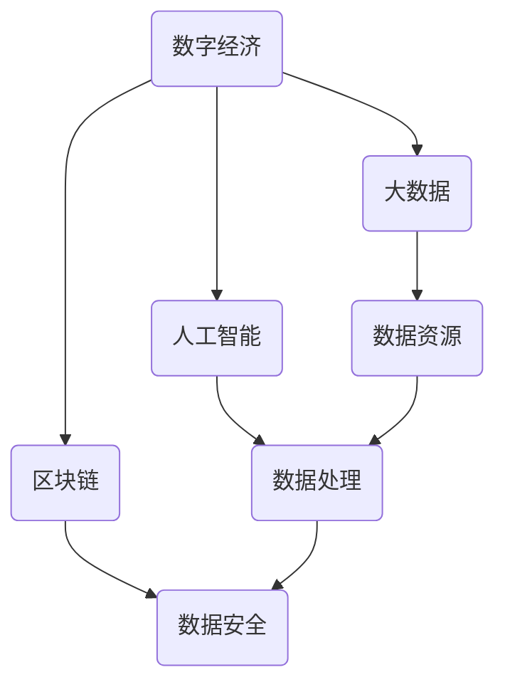

                 

# 在数字经济时代重新定义职业发展：应对就业市场变革

## 摘要

在数字经济时代，全球范围内的职业发展正经历深刻变革。随着技术的飞速进步和产业的持续升级，就业市场面临着前所未有的挑战和机遇。本文旨在探讨数字经济时代对职业发展的深远影响，从问题背景、核心概念、职业发展策略、案例分析等多个维度，重新定义职业发展，为读者提供应对就业市场变革的实用指导。

## 第一部分：问题背景与概述

### 第1章：数字经济时代的背景及其对职业发展的影响

### 1.1 引言

数字经济，作为以数字技术为核心的经济活动形式，正日益成为全球经济的主导力量。随着互联网、大数据、人工智能等技术的发展，数字经济在全球范围内迅速扩张，深刻改变了人们的生产、消费和生活方式。在此背景下，职业发展的方向和路径也在发生重大变革。

### 1.2 挑战

#### 1.2.1 技术变革

技术进步的速度加快，传统职业面临被取代的风险。新兴技术的涌现，如人工智能、物联网、区块链等，要求劳动者具备更高的技术能力和创新精神。

#### 1.2.2 产业升级

产业结构的升级，带来了新兴产业的蓬勃发展，同时也使得一些传统产业面临转型或淘汰。劳动者需要不断适应新的产业环境，寻找新的职业机会。

#### 1.2.3 就业结构变化

就业结构的变化，表现为职业多样性和灵活性增强，同时也增加了职业竞争的压力。劳动者需要具备跨领域的综合能力，以适应多元化的就业市场。

### 1.3 机遇

#### 1.3.1 新职业

数字经济时代带来了大量新职业，如数据分析师、人工智能工程师、区块链开发者等，为劳动者提供了广阔的职业发展空间。

#### 1.3.2 跨界合作

数字经济促进了不同领域的跨界合作，劳动者可以通过跨领域的合作，实现职业发展的多元化。

#### 1.3.3 创业机会

数字经济时代的创业环境更加宽松，创业者可以通过技术创新和模式创新，实现快速成长。

### 1.4 本章小结

数字经济时代的到来，既为职业发展带来了挑战，也提供了新的机遇。劳动者需要具备前瞻性的眼光，积极适应变革，抓住发展机遇。

### 第二部分：核心概念与联系

### 第2章：数字经济时代的关键术语与概念

### 2.1 核心术语

#### 2.1.1 数字经济

数字经济是以数字化的信息和知识为关键生产要素、以现代信息网络为重要载体、以信息通信技术的有效利用为驱动的新型经济形态。

#### 2.1.2 大数据

大数据是指无法在一定时间范围内用常规软件工具进行捕捉、管理和处理的数据集合。它具有海量的数据规模、快速的数据流转、多样的数据类型和价值密度低等特点。

#### 2.1.3 人工智能

人工智能是指由人制造出来的系统所表现出来的智能。它可以模拟、延伸和扩展人类的智能，实现智能感知、智能决策、智能执行等功能。

#### 2.1.4 区块链

区块链是一种分布式数据库技术，其特点是去中心化、不可篡改、可追溯。它通过加密算法和共识机制，实现了数据的安全存储和交换。

### 2.2 概念联系

数字经济时代的关键术语和概念之间存在紧密的联系。例如，大数据为人工智能提供了丰富的数据资源，人工智能则为大数据的处理和利用提供了技术支持；区块链技术则保障了数据的安全性和透明性，为数字经济提供了可信的基础设施。

### 2.3 概念框架

通过分析关键术语和概念的联系，可以构建一个数字经济时代的概念框架，如图所示：

### 2.4 本章小结

理解数字经济时代的关键术语和概念，有助于劳动者更好地把握时代发展的脉搏，为职业发展提供理论支持和实践指导。

### 第三部分：职业发展策略与路径

### 第3章：适应数字经济时代的职业素养与技能

### 3.1 职业素养

#### 3.1.1 创新能力

创新能力是适应数字经济时代的关键素养。劳动者需要具备持续学习、快速适应新技术的能力，以应对快速变化的工作环境。

#### 3.1.2 团队协作能力

数字经济时代的工作往往需要跨领域的团队协作。劳动者需要具备良好的沟通能力和团队协作精神，以实现高效合作。

#### 3.1.3 沟通能力

沟通能力是劳动者在数字经济时代不可或缺的素养。它不仅包括口头和书面沟通，还包括非言语沟通和跨文化沟通。

### 3.2 技能提升

#### 3.2.1 编程技能

编程技能是数字经济时代的基本技能。掌握编程语言和开发工具，有助于劳动者更好地应对数字化转型的挑战。

#### 3.2.2 数据分析技能

数据分析技能是数字经济时代的核心技能之一。掌握数据分析方法和技术，有助于劳动者从海量数据中提取有价值的信息。

#### 3.2.3 人工智能应用技能

人工智能应用技能是数字经济时代的新兴技能。掌握人工智能技术，有助于劳动者在新兴领域实现职业发展。

### 3.3 职业路径

#### 3.3.1 职业规划

职业规划是劳动者在数字经济时代实现职业发展的第一步。通过明确的职业目标设定和路径规划，劳动者可以更加有针对性地提升自身能力。

#### 3.3.2 职业转型

职业转型是劳动者在数字经济时代应对变革的重要策略。通过学习新技能、适应新领域，劳动者可以实现职业的二次定位和升级。

### 3.4 本章小结

适应数字经济时代的职业发展，需要劳动者具备前瞻性的职业素养和技能。通过合理的职业规划和职业转型，劳动者可以更好地抓住时代机遇。

### 第4章：数字化转型与职业发展

### 4.1 数字化转型的概念

数字化转型是指将企业的业务、运营和管理模式与数字技术深度融合，以实现企业的数字化转型和升级。

### 4.2 职业影响

#### 4.2.1 职业机会

数字化转型带来了大量新的职业机会，如数据分析师、人工智能工程师、区块链开发者等。

#### 4.2.2 职业挑战

数字化转型也对劳动者提出了更高的要求，需要劳动者具备更强的技术能力和创新精神。

### 4.3 职业转型策略

#### 4.3.1 技能更新

劳动者需要不断更新自己的技能，以适应数字化转型的需求。

#### 4.3.2 跨领域合作

劳动者可以通过跨领域的合作，实现职业的多元化发展。

#### 4.3.3 创新创业

劳动者可以通过创新创业，抓住数字化转型的机遇。

### 4.4 本章小结

数字化转型为职业发展带来了新的机遇和挑战。劳动者需要积极适应变革，抓住发展机遇。

### 第5章：新职业发展与就业市场变革

### 5.1 新职业概述

新职业是指随着数字技术的进步和产业结构的升级，涌现出的一系列新兴职业。如数据分析师、人工智能工程师、区块链开发者等。

### 5.2 就业市场变革

#### 5.2.1 远程工作

远程工作的普及，改变了传统的就业模式，为劳动者提供了更加灵活的工作选择。

#### 5.2.2 灵活就业

灵活就业的兴起，使得劳动者可以在多个平台和多个岗位上实现职业发展。

### 5.3 职业选择与适应

#### 5.3.1 职业选择

劳动者需要根据自身兴趣、技能和市场需求，选择适合自己的职业。

#### 5.3.2 职业适应

劳动者需要具备快速适应新职业的能力，以应对就业市场的变革。

### 5.4 本章小结

新职业的发展和就业市场的变革，为劳动者提供了更多的职业选择和机会。劳动者需要具备前瞻性的眼光，积极适应变革。

### 第6章：跨领域合作与跨界发展

### 6.1 跨领域合作

跨领域合作是指不同领域的专业人才和资源相互协作，共同解决复杂问题的合作模式。

### 6.2 跨界发展

跨界发展是指劳动者通过跨领域的合作和实践，实现职业发展的跨越。

### 6.3 跨领域合作与跨界发展的意义

#### 6.3.1 拓展视野

跨领域合作和跨界发展有助于劳动者拓展视野，提升综合能力。

#### 6.3.2 创新突破

跨领域合作和跨界发展可以激发创新思维，推动技术创新和模式创新。

#### 6.3.3 职业多元化

跨领域合作和跨界发展有助于劳动者实现职业的多元化发展。

### 6.4 如何实现跨领域合作与跨界发展

#### 6.4.1 学习新技能

劳动者需要不断学习新技能，提升自身能力，以适应跨领域合作和跨界发展的需求。

#### 6.4.2 构建跨界网络

劳动者需要积极构建跨界网络，与不同领域的专业人才建立联系，实现资源共享。

#### 6.4.3 创新思维

劳动者需要培养创新思维，勇于尝试新的合作模式和跨界发展路径。

### 6.5 本章小结

跨领域合作和跨界发展是数字经济时代职业发展的新趋势。劳动者需要积极适应这一趋势，通过跨界合作和跨界发展，实现职业的持续成长和突破。

### 第7章：未来职业发展预测与规划

### 7.1 趋势分析

#### 7.1.1 技术驱动

未来职业发展将受到技术的深刻影响，劳动者需要具备快速适应新技术的能力。

#### 7.1.2 智能化

智能化的推进将改变许多传统职业，劳动者需要具备智能化操作和维护的能力。

#### 7.1.3 跨界融合

未来职业发展将呈现出跨界融合的趋势，劳动者需要具备跨领域的综合能力。

### 7.2 职业规划

#### 7.2.1 设定目标

劳动者需要明确自己的职业目标，制定详细的职业规划。

#### 7.2.2 学习提升

劳动者需要不断学习新知识、新技能，提升自身能力。

#### 7.2.3 动态调整

劳动者需要根据外部环境的变化，动态调整职业规划。

### 7.3 未来职业准备

#### 7.3.1 技能储备

劳动者需要提前储备适应未来职业发展的技能。

#### 7.3.2 心态调整

劳动者需要保持积极的心态，勇于面对未来职业发展的挑战。

#### 7.3.3 网络建设

劳动者需要积极构建自己的职业网络，拓展人脉资源。

### 7.4 本章小结

未来职业发展充满机遇和挑战。劳动者需要提前做好规划，积极准备，以应对未来职业发展的变化。

### 第四部分：案例分析与实践指导

### 第8章：成功案例分享与经验借鉴

### 8.1 案例分析

#### 8.1.1 案例背景

以某人工智能公司为例，该公司在数字经济时代通过技术创新和商业模式创新，成功实现了职业发展的跨越。

#### 8.1.2 成功经验

1. 技术创新：公司不断推出创新产品，引领市场趋势。
2. 商业模式创新：公司通过多元化的商业模式，实现了收入的稳定增长。
3. 团队建设：公司重视团队建设，培养了一支具备高技术能力和创新精神的团队。

### 8.2 经验借鉴

#### 8.2.1 技术创新

劳动者可以学习该公司的技术创新经验，不断提升自身的技术能力。

#### 8.2.2 商业模式创新

劳动者可以思考如何在工作中创新商业模式，实现职业发展。

#### 8.2.3 团队建设

劳动者需要重视团队建设，提升团队协作能力，以实现职业的多元化发展。

### 8.3 本章小结

通过成功案例的分析和经验借鉴，劳动者可以更好地把握数字经济时代的职业发展机遇。

### 第9章：职业发展策略与实践

### 9.1 实践指导

#### 9.1.1 求职技巧

1. 明确求职目标，提高求职效率。
2. 制作精美的简历，突出自身优势。
3. 提升面试技巧，增加求职成功率。

#### 9.1.2 职业拓展

1. 通过线上平台，拓展职业网络。
2. 参加行业活动，提升行业影响力。
3. 积极参与项目，积累实战经验。

### 9.2 职业成长路径

#### 9.2.1 初级阶段

1. 熟悉行业知识，积累基本技能。
2. 找到合适的职位，开始职业生涯。
3. 不断学习，提升自身能力。

#### 9.2.2 中级阶段

1. 承担更多责任，提升领导能力。
2. 拓展职业领域，实现职业多元化。
3. 积极参与项目，提升实战经验。

#### 9.2.3 高级阶段

1. 成为行业专家，提升行业影响力。
2. 创新思维，推动行业进步。
3. 构建职业网络，实现职业发展。

### 9.3 本章小结

通过实践指导和职业成长路径的规划，劳动者可以更好地实现职业发展。

### 第10章：职业发展环境与政策

### 10.1 环境分析

#### 10.1.1 政策支持

政府在数字经济时代为职业发展提供了大量的政策支持，如人才引进政策、产业扶持政策等。

#### 10.1.2 社会文化

社会文化对职业发展也有重要影响，如教育水平、社会观念等。

### 10.2 政策解读

#### 10.2.1 人才政策

政府通过人才政策，鼓励和引导劳动者提升自身能力，实现职业发展。

#### 10.2.2 产业政策

政府通过产业政策，推动产业结构升级，为劳动者提供更多就业机会。

#### 10.2.3 创业政策

政府通过创业政策，鼓励劳动者创新创业，实现职业发展。

### 10.3 职业发展建议

#### 10.3.1 充分利用政策支持

劳动者应充分利用政府的政策支持，提升自身能力和职业竞争力。

#### 10.3.2 积极适应社会文化

劳动者应积极适应社会文化，提升自身的综合素质。

#### 10.3.3 创新创业

劳动者可以积极尝试创新创业，抓住职业发展的新机遇。

### 10.4 本章小结

职业发展环境与政策的支持对劳动者职业发展具有重要影响。劳动者应充分利用这些资源，实现职业发展。

### 第五部分：总结与展望

### 第11章：数字经济时代职业发展的总结与展望

#### 11.1 总结

数字经济时代的到来，带来了职业发展的深刻变革。劳动者需要具备前瞻性的眼光，积极适应变革，抓住发展机遇。

#### 11.2 展望

未来职业发展将呈现技术驱动、智能化和跨界融合的趋势。劳动者需要不断学习新技能、拓展新视野，以适应未来职业发展的变化。

#### 11.3 建议与展望

劳动者应树立正确的职业发展观念，不断提升自身能力，积极适应数字经济时代的发展趋势，实现职业的持续成长和突破。

### 作者：AI天才研究院/AI Genius Institute & 禅与计算机程序设计艺术 /Zen And The Art of Computer Programming

