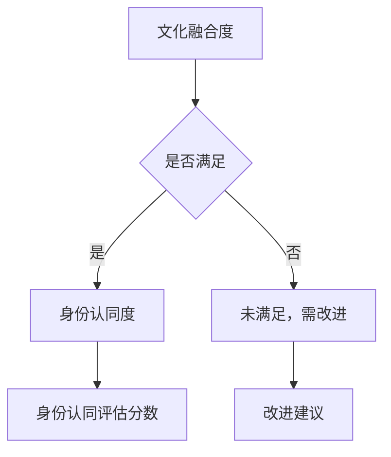
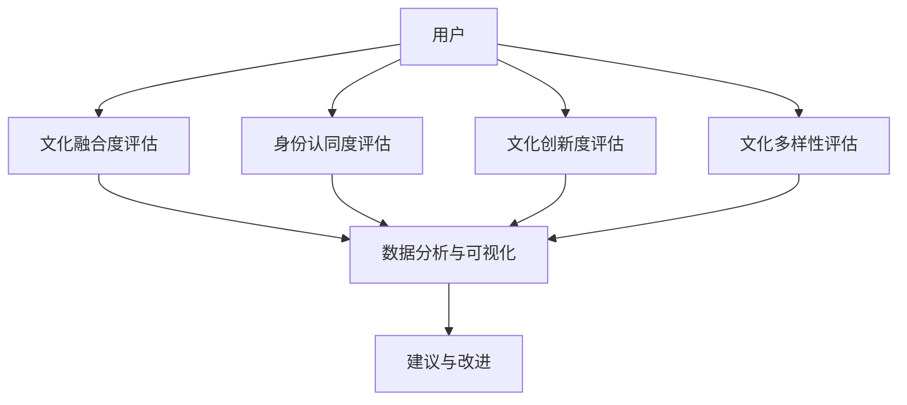
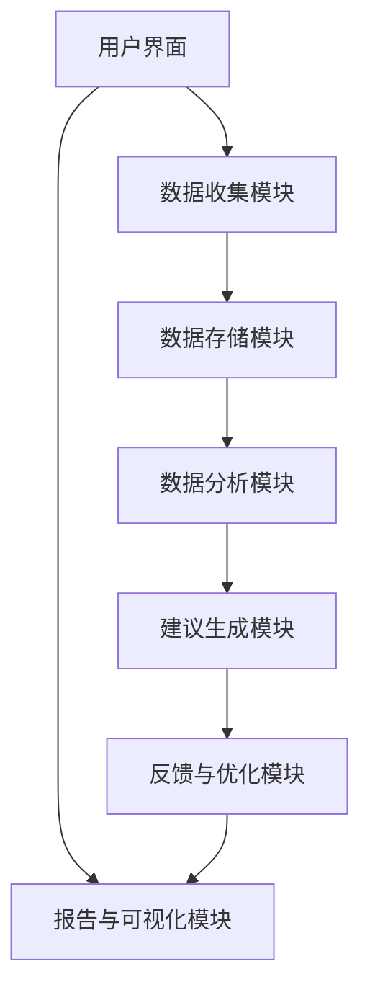
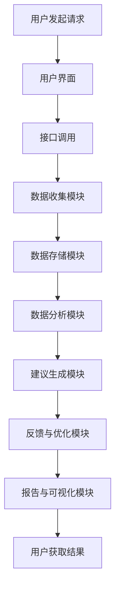

                 


### 1.1 全球化背景下的文化融合趋势

全球化是一个不可逆转的历史进程，它不仅改变了世界经济格局，也深刻影响了文化领域。在这一背景下，文化融合成为了一个显著的趋势。为了更好地理解这一现象，我们首先需要明确全球化的定义和其发展历程。

**定义与历史**

全球化，广义上是指世界各国在经济、政治、文化、社会等方面的相互联系和依赖程度不断加深的过程。它不仅仅是一个经济现象，更是文化和价值观的交流与融合。全球化起源于19世纪末的工业革命，但真正加速则是二战后的国际体系和全球化贸易体系建立。

在全球化初期，主要是资本和商品的国际流动。随着时间的推移，技术进步和互联网的发展使得信息和文化交流变得前所未有地便捷。今天，全球化已经渗透到我们生活的方方面面，从跨国公司的运营到国际旅游，从跨国婚姻到全球社交媒体平台，文化融合无处不在。

**文化融合的现状与挑战**

文化融合的现状可以用“百花齐放，百家争鸣”来形容。在全球化的推动下，各种文化相互碰撞、融合，形成了丰富多彩的文化景观。例如，国际化的美食节、跨文化的艺术展览、全球范围内的文化交流项目等都反映了这一趋势。

然而，文化融合也带来了诸多挑战。首先，文化的多样性被某些人所误解为冲突的根源。在一些地区，文化融合导致了传统价值观的流失，一些人感到自己的文化身份受到威胁。此外，文化融合过程中可能出现的“文化同质化”现象也引发了对文化多样性的担忧。

**保持特色的重要性**

在文化融合的过程中，保持特色显得尤为重要。文化特色不仅仅是一个地区或民族的传统，更是其身份认同的重要组成部分。保持文化特色可以帮助我们：

1. **增强身份认同**：通过传承和弘扬文化特色，人们可以更好地认识和接受自己的身份，从而增强文化自信。
2. **促进文化创新**：在保持传统的基础上进行创新，可以创造出更具活力和适应性的文化形式。
3. **增进文化交流**：保持特色并不意味着封闭，相反，它为文化交流提供了一个平台，使得不同文化可以更好地理解和互动。

在接下来的章节中，我们将深入探讨身份认同的概念、文化融合与身份认同的冲突与和谐，以及保持文化特色的理论与实践。

### 1.2 身份认同的概念与维度

身份认同是一个复杂而深刻的概念，涉及到个人的自我认知、社会角色和文化归属。在全球化背景下，身份认同不仅关乎个人，也关系到整个社会和文化的持续发展。为了更好地理解这一概念，我们需要从多个维度进行分析。

**定义**

身份认同（Identity），指的是个体对于自己所属群体、角色和归属的感知与认知。它不仅仅是一个静态的标签，而是一个动态的过程，涉及自我认知、社会互动和文化传承。身份认同可以是个人的，也可以是群体的，甚至可以是跨国界的。

**维度**

身份认同可以从多个维度进行解析：

1. **个人维度**：在个人层面，身份认同通常与个人的自我概念、价值观和信仰紧密相关。例如，一个人的身份认同可能包括民族、宗教、性别、职业等多种元素。这些身份元素相互作用，共同构成了个人的整体身份认同。

2. **社会维度**：在社会层面，身份认同是一个群体或社区的共同认知。社会身份认同往往与地域、民族、文化传统等因素相关。例如，一个社区可能因其特定的历史和文化传统而形成独特的身份认同。

3. **文化维度**：文化身份认同是指个体或群体对于自己所属文化的认知和情感依附。文化身份认同不仅仅是对某一文化的认识，更是一种情感的共鸣和价值认同。例如，一个中国人可能因其对中华文化的深厚感情而强烈认同自己的文化身份。

4. **历史维度**：历史身份认同是指个体或群体对自身历史传统的认知和传承。历史身份认同可以帮助人们理解自己的文化根源，从而更好地维系和传承文化传统。

**文化与身份认同的关系**

文化和身份认同之间存在着密切的关系。文化是身份认同的基础，而身份认同则是文化的体现。以下是一些关键点：

1. **文化传承**：文化传承是身份认同的重要体现。通过传承文化传统，人们可以更好地认识和接受自己的身份。例如，通过庆祝传统节日、学习传统文化，人们可以增强对自己文化的认同感。

2. **文化创新**：在保持文化传统的同时，文化创新也是身份认同的重要方面。通过创新，文化可以与时俱进，保持活力。例如，现代艺术、流行文化等都是文化创新的体现。

3. **文化融合**：文化融合是全球化背景下身份认同的一个重要维度。通过与其他文化的交流和融合，个体和群体可以扩展自己的身份认同，同时保持独特的文化特色。

4. **文化冲突**：文化冲突也是全球化背景下不可避免的现象。在文化融合的过程中，不同文化之间可能存在矛盾和冲突。如何处理这些冲突，保持身份认同的平衡，是一个重要的课题。

在接下来的章节中，我们将进一步探讨文化融合与身份认同的冲突与和谐，以及如何在全球化背景下保持文化特色。这将帮助我们更好地理解身份认同在全球化进程中的复杂性和重要性。

### 1.3 文化融合与身份认同的冲突与和谐

在全球化的背景下，文化融合与身份认同之间的关系并非总是和谐。相反，它们之间常常存在冲突，这种冲突在多个层面上表现出来，并带来一系列复杂的社会问题。

**冲突的表现**

1. **文化同质化**：文化同质化是指不同文化在融合过程中逐渐趋于一致的现象。这种现象可能导致一些独特文化的消失，使得文化多样性受到威胁。例如，国际快餐连锁店在全球范围内的普及，可能会导致当地传统餐饮文化的衰退。

2. **价值观冲突**：不同文化背景下，人们的价值观和道德观念可能存在差异。这种差异在融合过程中容易引发冲突。例如，在某些文化中，个人主义和集体主义之间的对立可能导致社会矛盾。

3. **身份认同危机**：在全球化背景下，一些人可能会感到自己的文化身份受到侵蚀。这种现象可能导致身份认同危机，使得个体在自我认知上感到困惑和不安。

4. **社会排斥**：文化融合过程中，一些边缘群体可能会受到排斥，导致他们的文化特色被忽视或边缘化。这种现象不仅损害了文化多样性，也可能引发社会不稳定。

**冲突的原因**

1. **经济利益驱动**：全球化过程中的经济利益驱动常常导致文化融合以经济利益为导向，忽视了文化多样性的重要性。

2. **文化中心主义**：一些强势文化在全球化过程中可能倾向于主导其他文化，导致文化多样性的失衡。

3. **缺乏文化交流的平台**：全球化背景下的文化交流平台可能不足，导致不同文化之间的误解和冲突增加。

**和谐的实现**

尽管存在冲突，文化融合与身份认同之间也有实现和谐的可能。以下是一些实现和谐的方法：

1. **平等对话**：通过平等对话，不同文化可以相互理解，减少误解和冲突。这需要建立开放和包容的文化交流平台。

2. **多元教育**：多元教育可以增强人们对不同文化的理解和尊重，从而促进文化和谐。例如，学校可以开设多元文化课程，让学生接触和学习不同文化的知识。

3. **文化保护政策**：政府可以制定文化保护政策，确保文化多样性的传承和发展。例如，通过立法保护传统手工艺、设立文化保护区等。

4. **文化创新**：在保持传统的基础上，文化创新可以为文化融合提供新的动力。通过创新，传统文化可以与时俱进，更好地适应现代社会的需求。

**平衡的艺术**

在文化融合与身份认同之间保持平衡，是一项复杂而重要的任务。以下是一些建议：

1. **尊重多样性**：尊重文化多样性是保持和谐的基础。无论在个人层面还是社会层面，都应该尊重和欣赏不同文化的价值。

2. **强化文化认同**：通过强化文化认同，个体和群体可以更好地保持自己的文化特色。这可以通过文化教育、文化活动等方式实现。

3. **促进文化交流**：通过促进文化交流，不同文化可以更好地理解和尊重彼此。这有助于减少冲突，增强社会的凝聚力。

4. **建立共同价值观**：在尊重多样性的同时，建立共同的价值观也是实现和谐的重要途径。这些共同价值观可以是普世价值，如和平、自由、平等等。

在全球化背景下，文化融合与身份认同之间的冲突与和谐是一个复杂而多维的问题。通过平等对话、多元教育、文化保护政策和文化创新，我们可以找到实现和谐的方法。同时，保持平衡，尊重多样性，强化文化认同和建立共同价值观，是我们在这一过程中必须遵循的原则。

### 1.4 保持文化特色的理论与实践

在全球化背景下，保持文化特色不仅是文化多样性的体现，也是文化传承和发展的重要手段。为了实现这一目标，我们需要从理论和实践两个层面进行深入探讨。

**理论框架**

1. **文化相对论**：文化相对论认为，每种文化都有其独特的价值和意义，没有绝对的“好”与“坏”。这种观点强调文化的主观性和相对性，为保持文化特色提供了理论支持。

2. **文化多样性理论**：文化多样性理论强调，文化多样性是人类社会进步的重要动力。保持文化特色，有助于维护人类社会的多样性和创造力。

3. **文化资本理论**：文化资本理论认为，文化是一种资源，可以转化为经济和社会资本。通过保持文化特色，可以提升文化软实力，促进经济发展和社会进步。

**实践案例**

1. **日本**：日本在全球化过程中，通过保持传统和现代化相结合，成功保持了文化特色。例如，日本动画、漫画和游戏等文化产品在全球范围内广受欢迎，成为了日本文化的重要代表。

2. **印度**：印度是一个多元文化国家，通过尊重和保护各民族文化的多样性，印度成功地保持了其丰富的文化特色。印度的节日、音乐、舞蹈和宗教仪式等文化形式，成为了印度文化的重要符号。

3. **中国**：近年来，中国通过文化创新和推广，成功地将传统文化与现代文化相结合。例如，“中国春节”在全球范围内得到了广泛的认可和庆祝，成为中国文化特色的重要体现。

**成功策略**

1. **文化传承与教育**：通过文化传承和教育，培养人们对文化特色的认同感和自豪感。这可以通过学校教育、家庭教育和社会教育等多种途径实现。

2. **文化创新**：在保持传统的基础上，通过文化创新，使文化更具活力和适应性。这可以通过文化创意产业、文化产品和服务的创新等多种方式实现。

3. **文化保护与立法**：通过立法和文化保护措施，确保文化特色的传承和发展。这可以包括文化遗产保护、文化知识产权保护等措施。

4. **文化交流与传播**：通过文化交流与传播，扩大文化特色的影响力。这可以通过国际合作、文化展览、文化节庆等多种方式实现。

5. **文化品牌建设**：通过文化品牌建设，提升文化特色的市场价值和竞争力。这可以通过文化品牌设计、文化产品营销等多种方式实现。

**文化特色的重要性**

保持文化特色的重要性体现在以下几个方面：

1. **文化自信**：保持文化特色有助于增强文化自信，促进文化繁荣。

2. **文化多样性**：保持文化特色有助于维护文化多样性，促进社会进步。

3. **经济发展**：文化特色可以转化为经济资源，促进经济发展。

4. **社会和谐**：保持文化特色有助于促进社会和谐，减少文化冲突。

在全球化背景下，保持文化特色是一项长期而复杂的任务。通过理论指导、实践探索和成功策略，我们可以更好地实现这一目标。保持文化特色不仅是每个国家和地区的责任，也是全球文化多样性的重要保障。

### 1.5 未来展望：全球化背景下的身份认同

全球化是一个持续进行的过程，它不仅改变了经济、政治和社会结构，也深刻影响了文化领域。在这样的背景下，身份认同面临着诸多挑战和机遇。为了更好地理解和应对这些变化，我们需要对未来进行展望。

**面临的挑战**

1. **文化同质化**：随着全球化进程的深入，某些强势文化可能会主导其他文化，导致文化同质化。这种现象可能削弱文化多样性，使一些独特的文化特色消失。

2. **身份认同危机**：在全球化背景下，一些人可能会感到自己的文化身份受到侵蚀，导致身份认同危机。这种现象可能引发社会不稳定，影响社会凝聚力。

3. **文化冲突**：全球化过程中，不同文化之间的碰撞和融合可能导致文化冲突。这些冲突可能源于价值观、宗教信仰、道德观念等方面的差异。

4. **经济利益驱动**：全球化中的经济利益驱动可能导致文化融合以经济利益为导向，忽视了文化多样性的重要性。这种现象可能损害一些弱势文化的利益。

**未来的机遇**

1. **文化创新**：全球化为文化创新提供了广阔的空间。通过融合不同文化的元素，可以创造出新的文化形式，使文化更加丰富多彩。

2. **文化交流与传播**：全球化促进了文化交流和传播，使得不同文化之间的互动更加频繁。这有助于增进人们对不同文化的理解和尊重。

3. **文化保护与传承**：全球化背景下，人们对文化保护的意识逐渐增强。通过制定文化保护政策和措施，可以更好地保护和传承传统文化。

4. **文化软实力的提升**：全球化背景下，文化软实力成为一个国家或地区竞争力的重要组成部分。通过提升文化特色，可以增强国家的文化影响力和竞争力。

**保持特色的前景**

为了在全球化背景下保持文化特色，我们需要采取一系列策略：

1. **尊重多样性**：尊重文化多样性是保持文化特色的基础。无论在个人层面还是社会层面，都应该尊重和欣赏不同文化的价值。

2. **强化文化认同**：通过强化文化认同，个体和群体可以更好地保持自己的文化特色。这可以通过文化教育、文化活动等多种途径实现。

3. **文化创新**：在保持传统的基础上，文化创新可以为文化融合提供新的动力。通过文化创新，传统文化可以与时俱进，保持活力。

4. **文化交流与合作**：通过文化交流与合作，不同文化可以更好地理解和互动。这有助于减少文化冲突，促进文化和谐。

5. **文化品牌建设**：通过文化品牌建设，可以提升文化特色的市场价值和竞争力。这可以通过文化品牌设计、文化产品营销等多种方式实现。

在未来，全球化将继续推动文化融合与身份认同的发展。保持文化特色不仅是每个国家和地区的责任，也是全球文化多样性的重要保障。通过尊重多样性、强化文化认同、文化创新、文化交流与合作以及文化品牌建设，我们可以更好地应对全球化带来的挑战，抓住机遇，实现文化特色的传承与发展。

### 1.6 本章小结

本章我们探讨了全球化背景下的文化融合趋势以及身份认同的概念和重要性。首先，我们分析了全球化的定义和发展历程，指出了文化融合作为全球化的一部分，其带来的多元文化景观和挑战。接着，我们详细阐述了身份认同的概念与维度，包括个人、社会、文化和历史维度，并探讨了文化与传统、创新和融合的关系。

我们还讨论了文化融合与身份认同之间的冲突与和谐，分析了冲突的表现和原因，并提出了解决冲突的方法。接着，我们提出了保持文化特色的理论框架和实践案例，探讨了文化传承、教育、创新、保护、传播和品牌建设等方面的成功策略。

最后，我们展望了全球化背景下身份认同的未来，分析了面临的挑战和机遇，并提出了保持文化特色的前景和策略。通过这些讨论，我们深刻认识到，在全球化进程中，保持文化特色不仅是维护文化多样性的重要手段，也是增强文化自信和社会凝聚力的重要途径。

### 2.1 身份认同与教育

在全球化背景下，教育作为文化传承和社会发展的关键载体，对于身份认同的塑造起着至关重要的作用。通过教育，个体不仅能够学习和掌握知识，更能在多元文化的碰撞与融合中形成自己的身份认同。

**教育中的文化融合**

文化融合在教育领域的表现主要体现在以下几个方面：

1. **多元文化课程**：许多国家已经开始在教育体系中引入多元文化课程，旨在让学生了解不同文化的特点和价值观。例如，美国的中小学课程中包含了美国原住民文化、非洲文化等多元文化的教学内容。

2. **国际交流项目**：国际交流项目为学生提供了跨文化学习的机会。通过参与这些项目，学生可以亲身体验其他国家的文化，增进对不同文化的理解和尊重。

3. **全球化教育理念**：全球化教育理念强调培养学生的全球视野和跨文化沟通能力。这种教育理念不仅注重知识传授，更注重培养学生的综合素质和全球竞争力。

**教育对身份认同的影响**

1. **增强文化认同**：通过多元文化的教育和国际交流，学生可以更好地了解和接受自己的文化身份。这有助于增强他们的文化认同，提高文化自信。

2. **塑造个体身份**：教育不仅传授知识，还通过价值观的传递和文化的熏陶，帮助学生塑造个体身份。在多元文化的教育环境中，学生可以从不同的文化中汲取营养，形成独特的个性和身份认同。

3. **促进文化创新**：教育可以帮助学生在传统与现代、本土与外来文化的碰撞中找到平衡点，从而促进文化的创新和发展。例如，一些学校通过将传统音乐、舞蹈和艺术与现代科技相结合，创造出新的文化形式。

**实践与案例分析**

以下是一些具体的实践和案例分析，展示了教育在身份认同塑造中的作用：

1. **中国的“汉服运动”**：近年来，中国的“汉服运动”在年轻人中兴起，许多学校和教育机构开始将汉服文化融入课程和活动中。这不仅有助于传承和弘扬中华文化，也增强了学生的文化认同。

2. **德国的多元文化教育**：德国在中小学教育中注重多元文化教育，通过开设多元文化课程和举办文化节日，帮助学生了解和尊重不同的文化。这种教育模式有助于培养具有全球视野和包容精神的公民。

3. **美国的“哈佛多元化计划”**：哈佛大学实施的多元化计划，通过招生政策、课程设置和文化活动等多方面措施，致力于营造一个多元文化的学术环境。这种计划不仅有助于提升学生的文化认同，也促进了不同文化之间的交流和理解。

通过教育，个体可以在多元文化的熏陶中找到自己的文化身份，并在这个过程中不断成长和发展。教育不仅是知识传授的过程，更是身份认同的塑造过程。在全球化背景下，通过多元文化教育和国际交流，我们可以更好地促进个体的身份认同，培养具有全球视野和跨文化沟通能力的人才。

### 2.2 文化产业与身份认同

文化产业作为现代社会的重要组成部分，不仅是经济增长的新动力，也是文化传承与身份认同的重要载体。在全球化的背景下，文化产业在塑造和维护身份认同方面发挥了独特的作用。

**文化产业的概念与特点**

文化产业是指以文化为核心的产业，包括艺术、音乐、电影、电视、出版、设计等多个领域。文化产业的特点包括：

1. **创意性**：文化产业依赖于创意和创新能力，通过创意产品的生产和传播，满足人们的精神文化需求。

2. **多样性**：文化产业涵盖了多种不同的文化形式和内容，具有广泛的多样性。

3. **全球化**：随着技术的进步和全球市场的拓展，文化产业具有明显的全球化特征。文化产品和服务跨越国界，在全球范围内传播和消费。

4. **互动性**：文化产业通过互动和参与，使消费者能够更深入地体验和享受文化产品，从而增强文化认同。

**文化产业对身份认同的塑造**

1. **文化传承**：文化产业通过创意和文化产品的传播，帮助人们传承和记忆自己的文化传统。例如，电影、电视剧和纪录片等文化形式，可以再现历史事件和文化故事，增强人们对自身文化的认同。

2. **文化创新**：文化产业通过创新，使传统文化与现代元素相结合，创造出新的文化形式。这种创新不仅保持了文化的活力，也增强了人们的身份认同。例如，将传统音乐与现代音乐结合的爵士乐，在全球范围内受到广泛欢迎。

3. **文化表达**：文化产业为人们提供了表达自我和分享文化的平台。通过创作和传播文化作品，个体可以找到自己的文化身份，并与其他文化背景的人建立联系。

**文化产业实践与案例分析**

以下是一些具体的实践和案例分析，展示了文化产业在身份认同塑造中的作用：

1. **日本动漫产业**：日本动漫产业是文化产业的一个典型例子。通过创作和传播动漫作品，日本成功地保持了其独特的文化特色，并塑造了日本国民的文化身份。许多日本动漫作品不仅在国内广受欢迎，还在全球范围内产生了深远影响。

2. **中国的“国潮”现象**：近年来，中国的“国潮”现象在年轻人中兴起。通过将传统元素与现代设计相结合，中国的时尚品牌和设计师创作出了具有浓厚中国文化特色的产品。这种现象不仅促进了文化传承，也增强了年轻一代的文化认同。

3. **美国的电影产业**：美国的电影产业是全球文化产业的领导者之一。通过电影，美国不仅传播了其文化价值观，也在全球范围内塑造了美国文化身份。许多好莱坞电影成为全球文化现象，使观众在享受电影的同时，也对美国文化产生了认同感。

4. **欧洲的博物馆和文化节**：欧洲的博物馆和文化节活动，如法国的巴黎时装周、意大利的威尼斯电影节等，不仅展示了欧洲丰富的文化遗产，也吸引了全球游客。这些活动不仅促进了文化交流，也增强了欧洲人的文化认同。

文化产业通过创意和文化产品的传播，在身份认同的塑造中发挥了重要作用。在全球化的背景下，通过文化产业的发展和国际化，我们可以更好地保护和传承文化特色，促进文化交流与认同。

### 2.3 文化政策与身份认同

文化政策是国家或地区政府为了促进文化发展、维护文化多样性和加强文化认同而制定的一系列政策措施。在全球化的背景下，文化政策对于身份认同的塑造和维护具有重要意义。

**文化政策的作用**

1. **促进文化多样性**：文化政策通过支持多元文化的传播和发展，有助于维护文化多样性。这包括对本土文化的保护和扶持，以及对外来文化的包容和接纳。通过多样化的文化政策，可以促进不同文化之间的交流与融合。

2. **加强文化认同**：文化政策通过弘扬和推广本民族文化，有助于增强公民的文化认同。例如，通过设立文化遗产日、组织民族文化节等活动，可以激发人们对自己文化的热爱和认同。

3. **促进文化交流**：文化政策通过支持国际文化交流与合作，有助于增进不同文化之间的理解和尊重。这包括资助国际文化交流项目、设立文化合作基金等，促进文化在国际上的传播和影响。

**政策对身份认同的影响**

1. **增强国家文化自信**：通过文化政策，国家可以强化其文化自信，提升文化软实力。文化自信是国家文化认同的重要体现，有助于增强国民的文化自豪感和凝聚力。

2. **解决文化冲突**：在全球化背景下，不同文化之间的冲突时有发生。通过文化政策，政府可以采取适当措施，缓解和解决这些冲突，维护社会和谐稳定。

3. **推动文化创新**：文化政策通过支持文化创新，可以为文化产业发展提供动力。文化创新不仅有助于保持文化的活力，也有助于提升文化认同。

**政策案例分析**

以下是一些具体的文化政策案例，展示了政策对身份认同的影响：

1. **法国的文化政策**：法国通过一系列文化政策，如资助文化遗产保护项目、支持艺术创作和推广民族文化等，成功维护了其丰富的文化遗产和多元文化特色。这些政策不仅增强了法国国民的文化认同，也提升了法国在全球文化领域的影响力。

2. **中国的文化政策**：近年来，中国推出了一系列文化政策，如“一带一路”倡议中的文化交流项目、设立国家文化公园等。这些政策旨在推动中华文化的传播和发展，增强国民的文化认同。通过这些政策，中国成功地提升了其在全球文化领域的影响力和地位。

3. **新加坡的文化政策**：新加坡作为一个多元文化国家，通过制定文化政策，如支持多元文化教育、组织多元文化节庆活动等，成功促进了不同文化之间的交流与融合。这些政策有助于增强新加坡国民的文化认同，维护社会和谐稳定。

文化政策对于身份认同的塑造和维护具有重要作用。通过制定和实施适当的文化政策，政府可以促进文化多样性、增强文化认同、解决文化冲突和推动文化创新，从而为社会的和谐稳定和文化的繁荣发展提供有力保障。

### 2.4 社区参与与身份认同

社区参与是文化融合过程中不可忽视的重要环节，它不仅有助于增强社区成员的文化认同，还能促进文化多样性和社区凝聚力。在全球化的背景下，社区参与在身份认同的塑造中扮演着关键角色。

**社区参与的形式**

1. **社区活动**：社区活动是社区参与的一种常见形式，包括文化节、社区运动会、社区清洁日等。这些活动不仅丰富了社区的文化生活，也提供了一个交流和互动的平台，促进了社区成员之间的联系。

2. **社区组织**：社区组织如居民委员会、文化俱乐部、社区志愿者团体等，是社区参与的重要载体。这些组织通过策划和组织各种活动，为社区成员提供参与和贡献的机会，增强了社区凝聚力。

3. **社区项目**：社区项目如文化遗产保护项目、社区文化传承项目等，通过实际行动保护和传承社区文化，增强了社区成员对自身文化的认同和自豪感。

**社区参与对身份认同的促进**

1. **增强文化认同**：通过参与社区活动，社区成员能够更深入地了解和体验自己的文化传统，从而增强文化认同。例如，参与传统节日庆祝活动，可以让人们感受到自己文化的独特魅力和深厚底蕴。

2. **促进文化交流**：社区参与提供了一个跨文化交流的平台，使得不同文化背景的社区成员能够相互了解和尊重。这种文化交流有助于打破文化隔阂，促进身份认同的多元化。

3. **提升社区凝聚力**：社区参与能够增强社区成员的归属感和责任感，提升社区凝聚力。在一个团结和睦的社区中，成员们更容易找到自己的身份认同，并共同维护和传承社区文化。

**社区参与案例研究**

以下是一些具体的社区参与案例，展示了其对身份认同的促进作用：

1. **英国曼彻斯特的社区艺术项目**：曼彻斯特的一个社区艺术项目通过组织绘画、音乐和戏剧等活动，吸引了不同文化背景的居民参与。这些活动不仅丰富了社区文化生活，也促进了居民之间的文化交流和理解，增强了社区成员的文化认同。

2. **新加坡的社区文化节**：新加坡每年举办的社区文化节吸引了众多居民参与，包括舞蹈、音乐、艺术展览等多种形式。这些活动不仅展示了新加坡多元文化的魅力，也增强了居民对本土文化的认同和自豪感。

3. **中国的“美丽乡村”建设项目**：中国的“美丽乡村”建设项目通过改善社区环境和加强社区文化建设，提升了居民的生活质量和文化认同。项目中的文化广场、文化长廊等设施，为居民提供了一个交流和展示文化活动的平台，促进了社区凝聚力和文化认同。

通过社区参与，不仅能够促进文化多样性和文化交流，还能增强社区成员的文化认同和凝聚力。在全球化背景下，社区参与在身份认同的塑造中发挥着重要作用，为构建和谐社区和传承文化特色提供了有力支持。

### 2.5 跨文化交流与身份认同

在全球化的背景下，跨文化交流已成为不可避免的现象。跨文化交流不仅丰富了人们的文化视野，也为身份认同带来了新的挑战和机遇。如何在跨文化交流中维护和塑造身份认同，是一个值得深入探讨的问题。

**跨文化交流的挑战**

1. **文化差异**：跨文化交流中最明显的挑战是文化差异。不同文化在价值观、行为规范、语言习惯等方面可能存在显著差异，这些差异可能导致误解和冲突。例如，某些文化中鼓励直接表达，而另一些文化则更倾向于含蓄和间接。

2. **文化适应**：在跨文化交流中，个体或群体可能需要适应新的文化环境。这种文化适应可能涉及语言学习、生活习惯的调整等，对于一些人来说，这可能是一种压力和挑战。

3. **文化偏见**：文化偏见是跨文化交流中的另一个挑战。不同文化背景的人可能对其他文化持有偏见，这种偏见可能导致不必要的误解和冲突。

**跨文化交流对身份认同的影响**

1. **拓展身份认同**：跨文化交流可以拓展个体的身份认同。通过与其他文化的接触和交流，个体可以更好地了解和认识自己的文化背景，从而在原有的身份认同上拓展出新的维度。例如，一个中国人在海外留学期间，可能会发现自己对中华文化的认同更加深刻，同时也开始欣赏和理解西方文化。

2. **促进文化融合**：跨文化交流可以促进不同文化之间的融合。通过交流和互动，不同文化可以相互借鉴和学习，创造出新的文化形式。这种文化融合有助于增强个体的文化认同，同时也促进了文化的多样性。

3. **挑战传统身份认同**：跨文化交流也可能对传统的身份认同提出挑战。在某些情况下，个体可能会感到自己的文化身份受到侵蚀或威胁，从而产生身份认同危机。例如，一些本土文化在全球化过程中可能面临文化同质化的风险，导致本土文化的独特性和传统身份认同受到冲击。

**跨文化交流实践**

以下是一些跨文化交流的实践案例，展示了其对身份认同的促进作用：

1. **国际文化交流项目**：许多国家通过国际文化交流项目，如文化年、文化节、艺术展览等，促进不同文化之间的交流和互动。这些项目不仅为参与者提供了了解和体验其他文化的机会，也帮助他们更好地认识和接受自己的文化身份。

2. **跨国企业的文化交流**：跨国企业在全球范围内的运营，为员工提供了跨文化交流的平台。通过跨国团队的协作和文化交流，员工可以更好地理解和尊重不同的文化，从而增强企业的文化认同和团队凝聚力。

3. **国际志愿者项目**：国际志愿者项目如和平志愿者、文化交流项目等，为参与者提供了深入了解其他文化的机会。这些项目不仅帮助参与者拓展了身份认同，也促进了不同文化之间的理解和尊重。

跨文化交流在全球化背景下具有重要意义，它不仅拓展了身份认同，促进了文化融合，还为个体提供了更多的文化经验和成长机会。通过积极推动跨文化交流，我们可以更好地维护和塑造身份认同，同时促进文化的多样性和繁荣。

### 2.6 本章小结

本章我们探讨了全球化背景下的文化融合与身份认同的关系，以及不同领域如教育、文化产业、文化政策、社区参与和跨文化交流在身份认同塑造中的作用。首先，我们分析了教育对身份认同的影响，指出多元文化课程和国际交流项目有助于增强文化认同和塑造个体身份。接着，我们探讨了文化产业在身份认同中的重要作用，强调文化传承、创新和表达对维护和塑造身份认同的重要性。

随后，我们讨论了文化政策对身份认同的促进作用，分析了文化多样性、文化认同和社区凝聚力在文化政策中的作用。我们还介绍了社区参与在身份认同塑造中的关键作用，通过具体的社区活动、社区组织和社区项目展示了社区参与如何促进文化认同和社区凝聚力。

最后，我们探讨了跨文化交流对身份认同的影响，指出跨文化交流不仅拓展了身份认同，还促进了文化融合和多元文化的理解。通过这些分析，我们深刻认识到，在全球化背景下，不同领域的交流和互动对于身份认同的塑造和维护具有重要作用。

### 3.1 确定文化特色

在全球化背景下，保持文化特色不仅是对传统的尊重，更是文化自信和创新能力的重要体现。为了有效地确定和保持文化特色，我们需要从多个角度进行深入分析和实践。

**文化特色元素识别**

1. **历史传统**：历史传统是一个文化的重要根基，包括传统节日、习俗、仪式和建筑等。例如，中国的春节、端午和中秋节等传统节日，都是中国文化的重要组成部分。

2. **民族特色**：民族特色是指一个民族在长期历史发展中形成的独特文化特征，如语言、服饰、饮食、艺术等。例如，印度的瑜伽、泰国的舞蹈和日本的传统绘画等都是民族特色的体现。

3. **地域特色**：地域特色是指特定地理环境对文化形成的影响，如气候、地形和自然资源等。例如，意大利的葡萄酒和法国的香水，都是其地域特色的代表。

4. **社会习俗**：社会习俗是人们在长期生活中形成的共同行为规范，如婚礼仪式、葬礼习俗和节日庆祝等。这些习俗不仅反映了文化传统，也是文化特色的重要组成部分。

**文化特色价值评估**

1. **文化历史价值**：评估文化特色的历史价值，有助于理解其在文化传承和发展中的作用。例如，中国古代的诗词、书法和绘画等艺术形式，不仅具有历史价值，也是中华文化的重要象征。

2. **文化社会价值**：评估文化特色的社会价值，有助于理解其在社会生活中的功能和意义。例如，日本的茶道不仅是一种传统文化形式，也是日本社会礼仪和人际关系的重要体现。

3. **文化经济价值**：评估文化特色的经济价值，有助于发掘其潜在的经济效益。例如，法国的葡萄酒、意大利的时尚设计和中国的丝绸等，都是具有巨大经济价值的文化特色。

4. **文化教育价值**：评估文化特色的教育价值，有助于其在教育领域的传承和推广。例如，许多学校通过开设传统文化课程，帮助学生了解和传承自己的文化特色。

**传承与保护策略**

1. **文化遗产保护**：制定和实施文化遗产保护政策，确保文化特色得到有效保护和传承。例如，许多国家建立了文化遗产保护区，对具有重要历史和文化价值的遗址、建筑和文物进行保护。

2. **文化传承教育**：通过教育系统将文化特色纳入课程，加强对青少年和文化传承人的文化教育。例如，许多国家在小学和中学开设了传统文化课程，鼓励学生学习传统音乐、舞蹈和手工艺等。

3. **文化传播与推广**：通过文化活动、文化节庆和文化产品营销等方式，扩大文化特色的影响力和知名度。例如，法国的戛纳电影节、中国的春节文化推广活动等，都是有效的文化传播方式。

4. **文化创新**：在保持传统的基础上，通过文化创新使文化更具活力和适应性。例如，许多文化特色通过与现代科技的结合，创造出新的文化形式，如数字艺术、虚拟现实体验等。

通过识别、评估和传承文化特色，我们不仅可以保护和弘扬传统文化，还可以在全球化背景下保持文化自信，推动文化创新和发展。保持文化特色不仅是对过去的尊重，更是对未来的投资。

### 3.2 文化创新与融合

在全球化背景下，文化创新与融合不仅是保持文化特色的重要手段，也是文化持续发展的必然要求。通过将传统元素与现代文化相结合，可以创造出具有时代特色和广泛影响力的文化形式，同时保持文化特色的独特性。

**文化创新的必要性**

1. **适应时代变迁**：随着社会的发展和科技的进步，人们的文化需求也在不断变化。传统文化形式可能难以满足现代人的文化需求，通过创新可以使其更具时代感和吸引力。

2. **促进文化多样性**：文化创新可以为文化多样性注入新的活力，创造出新的文化形式，丰富人们的文化体验。这有助于推动文化的多元化发展，增强文化的包容性和创造力。

3. **提升文化竞争力**：在全球文化市场中，文化创新可以提升文化产品和服务的竞争力。通过创新，文化特色可以更好地适应国际市场，赢得更多的消费者和粉丝。

**文化创新的实践**

1. **数字化文化传承**：利用数字技术和互联网平台，将传统文化遗产进行数字化保存和传播。例如，通过虚拟现实（VR）和增强现实（AR）技术，可以让人们体验传统节庆、戏剧和艺术，使传统文化更生动、更贴近现代生活。

2. **跨界融合**：将不同领域的文化元素进行融合，创造出新的文化形式。例如，将传统音乐与现代电子音乐相结合，创造出新的音乐风格；将传统舞蹈与现代舞蹈结合，形成独特的表演艺术。

3. **文化品牌建设**：通过文化品牌建设，提升文化特色的影响力和市场价值。例如，中国的“故宫文创”品牌，将故宫的文化资源与现代设计相结合，推出了多种文化产品，获得了国内外市场的广泛认可。

**融合策略与案例**

1. **法国的时尚融合**：法国的时尚产业通过将传统服装设计和现代时尚元素相结合，创造了世界级的时尚品牌。例如，迪奥（Dior）将经典的连衣裙设计融入现代元素，使经典与现代完美融合。

2. **中国的电影创新**：中国的电影产业通过在传统故事中融入现代元素，创造出具有全球影响力的电影作品。例如，《哪吒之魔童降世》将中国传统的神话故事与现代社会价值观相结合，成功赢得了国内外观众的喜爱。

3. **日本的动漫创新**：日本的动漫产业通过不断创新，将传统文化与现代创意相结合，创造了独特的动漫文化。例如，动画电影《千与千寻》将日本传统文化元素与现代叙事技巧相结合，赢得了全球观众的赞誉。

通过文化创新与融合，不仅能够保持文化特色的独特性，还能使其更具活力和时代感。在全球化的背景下，通过有效的融合策略，我们可以推动文化的持续发展，增强文化软实力，为全球文化的多样性做出贡献。

### 3.3 品牌建设与文化传播

在全球化背景下，品牌建设和文化传播是保持文化特色和提升文化影响力的重要手段。通过有效的品牌建设和文化传播策略，不仅能够增强文化认同，还能推动文化产品和服务的国际化。

**品牌建设的意义**

1. **提升文化认同**：品牌建设可以通过统一的文化标识和价值观，增强人们对特定文化的认同感。例如，中国的“故宫文创”品牌通过将故宫的文化元素融入产品设计，成功塑造了独特的品牌形象，提升了消费者对中华文化的认同。

2. **增强竞争力**：品牌建设有助于提升文化产品和服务的市场竞争力。通过独特的品牌形象和高质量的产品，文化品牌可以在全球市场中脱颖而出。例如，法国的“香奈儿”（Chanel）品牌通过卓越的设计和品质，成为了全球奢侈品市场的领导者。

3. **促进经济发展**：品牌建设可以带动相关产业的发展，促进经济增长。例如，意大利的“奢侈品牌”产业不仅推动了当地经济，也提升了意大利在全球文化领域的影响力。

**品牌建设的方法**

1. **文化元素挖掘**：品牌建设首先需要深入挖掘文化元素，找到能够代表特定文化的核心价值。例如，中国的“景德镇瓷器”品牌通过挖掘景德镇的历史文化底蕴，成功塑造了品牌形象。

2. **品牌形象设计**：品牌形象设计是品牌建设的关键一步，需要结合文化元素和市场需求，设计出独特而具有吸引力的品牌标识和视觉元素。例如，苹果（Apple）品牌的简洁而现代的设计风格，使其在全球范围内广受欢迎。

3. **品质保障**：品牌建设需要确保产品质量，建立消费者对品牌的信任。通过严格的质量控制和持续的产品创新，品牌可以赢得消费者的认可和忠诚。

**文化传播的渠道与策略**

1. **数字化传播**：随着互联网和数字技术的发展，数字化传播成为文化传播的重要渠道。通过社交媒体平台、电商平台和数字广告，文化品牌可以快速传播和推广。例如，通过微博、抖音等社交媒体平台，中国文化品牌成功吸引了大量年轻消费者的关注。

2. **国际文化交流**：通过国际文化交流活动，如文化节、艺术展览和国际会议等，文化品牌可以扩大其国际影响力。例如，法国的“巴黎时装周”通过国际化的文化交流，使其品牌在全球范围内获得了广泛认可。

3. **文化产品营销**：通过文化产品营销，可以提升文化品牌的市场知名度和消费者忠诚度。例如，通过推出限量版产品、举办品牌活动和文化体验活动等，文化品牌可以吸引消费者的兴趣和参与。

4. **跨行业合作**：跨行业合作是品牌建设和文化传播的有效策略。通过与其他行业的合作，文化品牌可以实现资源共享和互利共赢。例如，故宫文创品牌通过与酒店、旅游和时尚产业的合作，成功扩大了品牌影响力。

通过品牌建设和文化传播，我们可以更好地保持和推广文化特色，提升文化认同和影响力。在全球化背景下，通过有效的品牌建设和文化传播策略，我们可以使文化品牌在全球市场中脱颖而出，为全球文化的多样性和繁荣做出贡献。

### 3.4 社会责任与身份认同

在全球化背景下，社会责任已成为企业和社会组织的重要关注点。社会责任不仅关乎企业的可持续发展，也深刻影响着身份认同的形成和强化。通过积极履行社会责任，企业和社会组织可以提升自身的文化认同，同时为社会和谐和文化传承做出贡献。

**社会责任的重要性**

1. **社会和谐**：社会责任有助于促进社会的和谐与稳定。通过关注社会问题和弱势群体的需求，企业和社会组织可以减少社会矛盾，增强社会的凝聚力和稳定性。

2. **文化传承**：社会责任还可以促进文化传承。例如，通过资助文化遗产保护项目、支持传统手工艺的发展等，企业和社会组织可以帮助保护和传承文化遗产，增强文化认同。

3. **企业形象**：积极履行社会责任可以提升企业的社会形象和品牌价值。一个具有高度社会责任感的企业，更容易获得消费者的信任和支持。

**社会责任实践**

1. **环境保护**：许多企业通过实施环保措施，减少碳排放、节约能源和资源，履行环境保护责任。例如，苹果公司通过减少产品包装、提高产品能效等措施，积极履行环境保护责任。

2. **社会公益**：企业通过捐赠、公益活动和支持慈善事业，履行社会公益责任。例如，阿里巴巴通过“阿里公益”平台，开展各种公益活动，支持教育、医疗和环保等领域。

3. **文化传承**：企业可以通过支持文化项目和活动，履行文化传承责任。例如，中国工商银行通过设立“中国传统文化基金”，支持传统文化的研究和保护工作。

4. **员工关怀**：企业通过关注员工福利、职业发展和工作环境，履行员工关怀责任。例如，谷歌通过提供灵活的工作时间和丰富的培训机会，提升员工的幸福感和满意度。

**社会责任对身份认同的促进**

1. **文化认同**：通过履行社会责任，企业和社会组织可以增强员工和文化受众的文化认同。例如，通过组织传统文化活动、推广本土文化产品等，可以激发人们对自身文化的热爱和认同。

2. **社会认同**：社会责任实践有助于提升企业和社会组织在社会中的形象和地位，增强其社会认同。这种社会认同不仅体现在公众的认知和评价上，还体现在合作伙伴和投资者的信任和支持上。

3. **身份认同**：通过社会责任实践，企业和社会组织不仅能够提升自身形象，还能在更广泛的层面上促进身份认同。例如，通过支持本地文化发展和社区建设，企业和社会组织可以帮助当地居民建立和维护对自身社区和文化的认同。

在全球化背景下，社会责任不仅是企业发展的必要条件，也是文化传承和社会和谐的重要保障。通过积极履行社会责任，企业和社会组织不仅可以提升自身的文化认同，还可以为社会和谐和文化传承做出积极贡献。

### 3.5 个人身份认同的塑造与维护

个人身份认同是个人自我认知的重要组成部分，它不仅关乎个体的内心世界，也影响着个体的行为选择和社会互动。在全球化背景下，个人身份认同面临着诸多挑战，如何塑造和维护个人的身份认同成为了一个值得探讨的课题。

**个人身份认同的形成**

1. **家庭与文化背景**：家庭是一个人最早接触到的文化环境，父母的价值观和行为方式对个人的身份认同有着深远的影响。同时，个体的民族、地域和宗教背景也是身份认同的重要来源。

2. **教育经历**：教育不仅传授知识，还通过文化课程、校园活动和课外活动，帮助个体形成对自己文化的认同。教育经历中的多元文化接触和交流，也对个体的身份认同产生重要影响。

3. **社会互动**：社会互动是个人身份认同形成的重要途径。通过与他人的交往，个体可以了解和接受自己的文化身份，同时反思和调整自己的价值观和行为方式。

4. **自我探索**：自我探索是个人身份认同形成的关键步骤。个体通过自我反思、尝试新事物和探索不同文化，可以更深入地理解自己的身份认同，并逐步形成稳定的自我认知。

**个人身份认同的维护**

1. **文化传承与教育**：通过学习和传承自己的文化传统，个体可以增强对自己文化的认同和自豪感。教育机构可以通过开设文化课程、组织文化活动等方式，帮助个体维护自己的身份认同。

2. **文化创新与实践**：在保持传统的基础上，通过文化创新和实践，个体可以与时俱进，保持身份认同的活力。例如，参与传统文化活动、创作文化作品等，都是维护身份认同的有效方式。

3. **社会参与**：通过积极参与社区、社会和文化活动，个体可以加深对自己文化的认同，同时拓宽自己的文化视野。社会参与不仅有助于维护个人身份认同，还可以促进不同文化之间的理解和融合。

4. **自我反思**：自我反思是维护身份认同的重要手段。通过反思自己的行为、价值观和文化认同，个体可以更清晰地认识自己，并在必要时进行调整。

**自我探索的方法**

1. **阅读与学习**：通过阅读文化相关的书籍和资料，个体可以更深入地了解自己的文化背景和价值观。

2. **文化交流**：参与文化交流活动，如文化节、艺术展览和跨文化交流项目等，可以帮助个体拓宽视野，加深对其他文化的理解和尊重。

3. **旅行**：旅行是体验不同文化环境、拓宽视野和加深文化认同的绝佳方式。通过旅行，个体可以亲身体验不同的文化，从而更好地理解自己的身份认同。

4. **艺术创作**：通过艺术创作，如绘画、音乐、舞蹈等，个体可以表达自己的文化认同和情感，同时深化对自己文化的理解和热爱。

个人身份认同的塑造与维护是一个动态的过程，它需要个体不断地学习和探索。通过家庭与文化背景的熏陶、教育经历的影响、社会互动的体验和自我探索的实践，个体可以逐步形成和稳固自己的身份认同。在全球化背景下，通过有效的文化传承、创新和实践，我们可以更好地维护个人身份认同，促进文化的多样性和社会的和谐发展。

### 3.6 本章小结

本章我们探讨了如何保持文化特色、文化创新与融合、品牌建设与文化传播、社会责任与身份认同、个人身份认同的塑造与维护。首先，我们明确了文化特色的识别与价值评估的重要性，提出了文化传承与保护的策略。接着，我们深入分析了文化创新与融合的必要性，提供了具体的实践案例。

随后，我们讨论了品牌建设与文化传播的方法和渠道，强调了品牌建设对提升文化认同的重要性。我们还探讨了社会责任在身份认同中的作用，以及如何通过社会责任实践来维护和增强身份认同。

最后，我们详细介绍了个人身份认同的形成与维护方法，包括家庭与文化背景、教育经历、社会互动和自我探索等方面的内容。通过这些讨论，我们认识到，保持文化特色、推动文化创新、加强品牌建设和履行社会责任，不仅是文化传承和发展的需要，也是维护和塑造身份认同的关键。个人在全球化背景下，通过自我探索和文化参与，可以更好地塑造和维护自己的身份认同。

### 4.1 案例研究：全球化的身份认同实践

在全球化背景下，不同国家和地区在文化融合与身份认同方面有着各自的实践和挑战。以下我们通过几个具体的案例，探讨全球化背景下的身份认同实践，并从中提取有价值的经验和启示。

**案例选择标准**

选择这些案例的标准包括：

1. **代表性**：选择的案例具有广泛的代表性和影响力，能够反映不同地区在全球化背景下的身份认同实践。
2. **多样性**：涵盖不同国家和地区，展示多样化的身份认同实践和挑战。
3. **有效性**：案例中采取了有效的策略，成功应对了全球化带来的身份认同挑战。

**案例描述与背景**

1. **中国香港**：香港作为一个国际化都市，经历了多次文化融合和身份认同的挑战。从1949年中华人民共和国成立后，香港面对内地文化的影响，以及与西方国家文化的互动。香港政府通过教育和文化政策，推动本地文化和传统的发展，同时保持对中华文化和国际文化的开放态度。

2. **印度尼西亚**：印度尼西亚是一个多元民族和宗教的国家，拥有超过270个民族和多种宗教信仰。全球化背景下，印尼政府通过“巴厘文化”作为国家的文化象征，推动传统文化的保护和传承。同时，通过多元文化教育和文化交流活动，增强国民的身份认同。

3. **南非**：南非在结束种族隔离政策后，面临如何在多元文化背景下构建新的身份认同的挑战。南非政府通过“多元文化政策”，促进不同种族和文化之间的交流与融合，同时注重本土文化的保护和传承。

**案例分析与启示**

1. **文化融合与多元教育**：香港、印尼和南非的案例表明，多元教育和文化交流是促进身份认同的重要手段。通过多元教育，个体可以更好地了解和尊重不同文化，从而减少文化冲突，增强文化认同。

2. **文化保护与传承**：保护本土文化传统是维护身份认同的基础。香港通过文化政策推动本地文化和传统的发展，印尼通过推广巴厘文化，南非通过多元文化政策，都展示了文化保护与传承的重要性。

3. **政府角色**：政府在身份认同塑造中扮演着关键角色。通过制定和实施文化政策，政府可以促进文化多样性的发展，增强国民的文化认同。香港、印尼和南非的案例都显示了政府在文化融合与身份认同中的积极作用。

4. **社区参与**：社区参与是身份认同的重要保障。通过社区活动和文化节庆，社区成员可以更深入地了解和传承自己的文化传统，同时促进不同文化之间的交流与融合。

5. **国际合作**：国际合作有助于拓宽身份认同的视野，促进全球范围内的文化理解和尊重。通过国际合作，各国可以共同应对全球化带来的身份认同挑战，共享文化发展的经验与成果。

通过这些案例研究，我们可以得出以下启示：

- **多元教育**：通过多元教育，培养具有全球视野和跨文化沟通能力的人才，是促进身份认同的重要途径。
- **文化保护与传承**：在全球化背景下，保护和传承本土文化传统，有助于增强文化认同和社会凝聚力。
- **政府角色**：政府在文化融合与身份认同中扮演着关键角色，通过制定和实施有效的文化政策，可以促进文化的多样性和繁荣。
- **社区参与**：通过社区参与和文化活动，可以增强社区成员的文化认同和凝聚力，促进文化传承与发展。
- **国际合作**：国际合作是促进全球文化理解和尊重的重要手段，通过国际合作，各国可以共同应对全球化带来的身份认同挑战。

在全球化背景下，身份认同的实践不仅关乎每个国家和地区，也关乎全球文化的多样性和繁荣。通过有效的策略和实践，我们可以更好地维护和塑造身份认同，促进文化的持续发展。

### 4.2 全球化背景下的身份认同困境

在全球化进程中，身份认同面临着前所未有的挑战和困境。这些困境不仅影响了个人的内心世界，也对社会的稳定和文化的多样性产生了深远的影响。

**困境的表现**

1. **文化同质化**：全球化带来了文化产品的全球化传播，一些强势文化，尤其是西方文化，在全球范围内占据主导地位，导致其他文化逐渐失去特色，出现文化同质化现象。这种现象使得一些本土文化面临消失的风险。

2. **身份认同危机**：在全球化背景下，一些人可能感到自己的文化身份受到侵蚀，导致身份认同危机。这种危机表现为文化自卑、自我怀疑和对文化传统的漠视。在某些情况下，这种危机甚至可能引发社会动荡和民族分裂。

3. **价值观冲突**：全球化带来了不同文化价值观的碰撞和冲突。一些文化价值观，如个人主义和物质主义，与本土文化中的集体主义和道德价值观存在冲突。这种冲突可能导致社会分裂和文化冲突。

4. **文化自卑与自尊**：全球化过程中，一些国家和地区的文化可能感到自卑，认为自己的文化不如其他文化先进。与此同时，其他一些文化可能感到自尊受损，对全球化持有抵触情绪。这种情绪可能加剧文化冲突和社会不稳定。

**困境的原因**

1. **经济利益驱动**：全球化在很大程度上是由经济利益驱动的。跨国公司和全球市场的需求，往往优先考虑经济利益，导致文化多样性的忽视。

2. **文化中心主义**：一些国家和文化在全球化的进程中，倾向于主导其他文化，导致文化中心主义现象。这种现象可能削弱其他文化的身份认同。

3. **信息传播不平衡**：全球化带来的信息传播不平衡，使得一些文化产品在全球范围内广受欢迎，而其他文化则难以得到充分的传播和认可。这种信息传播的不平衡，加剧了文化同质化现象。

4. **缺乏文化交流平台**：全球化过程中，虽然文化交流的机会增多，但缺乏有效的文化交流平台，导致不同文化之间的误解和冲突增加。

**解决方向**

1. **加强文化保护**：政府和社会应该加强文化保护，通过立法和政策措施，保护本土文化的传承和发展。这包括设立文化遗产保护区、制定文化保护法律、资助传统文化项目等。

2. **推动文化多样性教育**：通过教育系统，加强文化多样性的教育和宣传，提高公众对不同文化的理解和尊重。这包括开设多元文化课程、组织文化交流活动、推广多元文化节日等。

3. **建立文化交流平台**：建立和加强国际文化交流平台，促进不同文化之间的对话与交流。这可以通过国际文化节、文化交流项目、跨国学术合作等方式实现。

4. **倡导文化平等**：在全球化的背景下，倡导文化平等，尊重和保护各种文化。这包括反对文化中心主义，鼓励多元文化的共存和融合。

5. **强化文化自信**：通过强化文化自信，增强个人和群体的文化认同感。这可以通过文化传承、文化创新、文化品牌建设等方式实现。

在全球化背景下，身份认同的困境是一个复杂而多维的问题。通过加强文化保护、推动文化多样性教育、建立文化交流平台、倡导文化平等和强化文化自信，我们可以更好地应对全球化带来的身份认同挑战，促进文化的多样性和社会的和谐发展。

### 4.3 国际交流与合作中的身份认同

在国际交流与合作中，身份认同既是一个挑战也是一个机会。有效管理身份认同有助于促进国际交流，增强合作效果，同时维护参与各方的文化特色。以下我们从几个关键方面探讨身份认同在国际交流与合作中的作用。

**国际交流的重要性**

1. **促进知识共享**：国际交流为不同国家和地区提供了知识和技术的交流平台。通过学术会议、研究项目和国际合作，各方可以共享最新的研究成果，促进知识的进步。

2. **推动经济发展**：国际交流促进了全球贸易和投资，推动了全球经济的繁荣。跨国公司和国际合作项目不仅带来了经济利益，还促进了各国经济的互补发展。

3. **增进文化理解**：国际交流为不同文化之间的互动和理解提供了机会。通过文化交流、国际旅游和跨文化项目，人们可以更好地了解和尊重其他文化，减少误解和偏见。

**身份认同在国际交流中的作用**

1. **增强文化自信**：在国际交流中，保持文化特色和身份认同有助于增强参与者的文化自信。这种文化自信不仅体现在文化展示和推广中，还反映在跨文化合作和谈判中。

2. **促进文化创新**：国际交流中的文化碰撞和融合，可以激发文化创新。通过吸收外来文化的元素，参与者可以在保持自身文化特色的基础上，创造出新的文化形式。

3. **身份认同的平衡**：在国际交流中，保持身份认同的平衡是一个重要的挑战。既要尊重和保持自身的文化特色，又要开放和包容其他文化，避免文化冲突。

**身份认同在合作项目中的应用**

1. **文化融合策略**：在国际合作项目中，应用文化融合策略可以促进各方文化的交流与融合。例如，通过设立文化协调小组、组织文化交流活动和文化培训，可以增强合作项目中的文化理解和认同。

2. **文化敏感培训**：为国际交流与合作项目中的参与者提供文化敏感培训，帮助他们了解和理解其他文化，减少文化冲突。这种培训可以包括文化习俗、价值观、沟通技巧等方面的内容。

3. **文化标志的应用**：在国际合作项目中，适当应用参与各方的文化标志，如国旗、国徽和标志性建筑，可以增强文化认同感和归属感。这有助于建立良好的合作氛围，促进项目顺利进行。

**实际案例分析**

1. **联合国的文化交流项目**：联合国通过多种文化交流项目，如“世界文化多样性日”和“文化对话周”，促进不同文化之间的交流与理解。这些项目不仅提升了参与各方的文化认同，也促进了全球文化的多样性。

2. **跨国企业的国际化合作**：跨国企业在国际市场中的合作，通常涉及多个国家和文化。通过设立本地化办公室、培养本地化人才和尊重本地文化习俗，跨国企业可以有效管理身份认同，提高合作效果。

3. **国际学术会议**：国际学术会议通过邀请来自不同国家和地区的学者共同参与，促进了知识的共享和文化的交流。在这些会议中，学者们通过分享研究成果、讨论学术观点，不仅增强了学术认同，也促进了国际间的文化理解。

在国际交流与合作中，身份认同既是挑战也是机遇。通过增强文化自信、应用文化融合策略和提供文化敏感培训，可以有效管理身份认同，促进国际交流与合作。这不仅有助于实现合作目标，也为全球文化的多样性和繁荣做出了贡献。

### 4.4 身份认同与全球治理

全球治理是一个涉及多个领域和多个利益相关者的复杂过程，其目标是在全球化背景下实现国际合作和共同繁荣。身份认同在全球治理中扮演着重要的角色，它不仅关系到个体的自我认知，也影响到国家和国际组织的运作。以下我们从身份认同的视角，探讨其在全球治理中的角色和面临的挑战。

**全球治理的背景**

全球治理是指国际社会通过合作和协调，解决全球性问题，如气候变化、贫困、安全和发展等。全球治理的背景包括：

1. **全球化**：全球化带来了国家间经济、政治、社会和文化的深度融合，使全球性问题成为各国共同面临的挑战。

2. **多极化**：全球治理中的权力分配逐渐趋向多极化，各国在制定全球规则和国际合作中的角色和地位发生变化。

3. **非国家行为体的崛起**：跨国公司、非政府组织和国际非国家行为体在全球治理中扮演越来越重要的角色。

**身份认同在治理中的角色**

1. **国家身份认同**：国家身份认同是国家在国际社会中定位和行动的基础。一个强大的国家身份认同有助于提升国家的软实力，增强其在国际事务中的话语权和影响力。

2. **文化身份认同**：文化身份认同是民族和国家认同的重要组成部分。在全球治理中，通过尊重和保护文化多样性，可以促进不同文化之间的对话与融合，增强全球治理的包容性和有效性。

3. **个人身份认同**：个人的身份认同不仅影响其个人行为，也影响其在全球治理中的参与和贡献。具有高度文化认同的个人更可能积极参与国际事务，为全球治理提供智慧和力量。

**身份认同与全球治理的挑战**

1. **文化冲突**：全球化过程中，不同文化之间的碰撞和冲突可能加剧，对全球治理构成挑战。文化冲突不仅影响国际合作，也可能导致社会不稳定和冲突。

2. **身份认同危机**：在全球化背景下，一些人可能感到自己的文化身份受到侵蚀，导致身份认同危机。这种危机可能影响个人的心态和行为，进而影响其在全球治理中的参与度。

3. **多极化挑战**：全球治理中的多极化趋势，可能导致各国在身份认同和利益分配上出现分歧，影响全球治理的效率和效果。

**身份认同与全球治理的策略**

1. **尊重多样性**：在全球化背景下，尊重文化多样性是维护全球治理和谐与有效性的基础。通过倡导文化多样性和包容性，可以增强不同文化之间的理解和合作。

2. **促进跨文化交流**：通过跨文化交流，可以增进不同文化之间的理解和尊重，减少文化冲突。这可以通过国际文化交流项目、教育合作和文化节庆等方式实现。

3. **强化身份认同**：通过强化国家和个人的身份认同，可以提升其在全球治理中的积极性和贡献度。这可以通过文化教育、文化传承和身份认同建设等方式实现。

4. **构建共同价值观**：在尊重多样性的同时，建立共同的价值观是促进全球治理的重要手段。这些共同价值观可以是普世价值，如和平、自由、平等和正义等。

身份认同在全球治理中起着至关重要的作用。通过尊重多样性、促进跨文化交流、强化身份认同和构建共同价值观，我们可以更好地应对全球治理中的挑战，推动全球治理的和谐与有效发展。

### 4.5 全球视角下的身份认同教育

在全球化背景下，身份认同教育不仅关乎个体的自我认知，更关系到整个社会的文化多样性和社会和谐。以下从多个方面探讨全球视角下的身份认同教育，并分析其重要性及实际案例。

**身份认同教育的重要性**

1. **促进文化多样性认知**：身份认同教育可以帮助学生理解和尊重不同文化的多样性，减少文化偏见和误解。这有助于建立一个包容性的社会环境，促进不同文化之间的和谐相处。

2. **培养全球公民意识**：全球视角下的身份认同教育可以培养学生的全球视野和跨文化沟通能力。通过教育，学生可以更好地认识自己，同时理解其他文化的价值和特点，从而培养成为全球公民的意识。

3. **增强文化认同和自豪感**：通过身份认同教育，学生可以更深入地了解和认同自己的文化传统，增强文化自信和自豪感。这种文化认同有助于培养学生对本民族的热爱和责任感。

4. **应对全球化挑战**：全球化带来了文化融合和文化冲突的挑战。身份认同教育可以帮助学生理解这些挑战，提高其在全球化背景下的适应能力和应对策略。

**实际案例**

1. **美国多元文化教育**：美国许多学校和教育机构在课程中融入多元文化教育，通过介绍不同民族和文化的特点，帮助学生理解和尊重文化的多样性。例如，一些学校开设了“多元文化文学”、“世界历史”等课程，通过阅读和研究不同文化的文学作品，学生可以更深入地了解其他文化。

2. **日本的“日语授课”教育**：日本在中学和高中阶段推行“日语授课”教育，鼓励学生通过学习日语和日本文化，增强对自身文化的认同。这种教育模式不仅提高了学生的语言能力，也增强了他们对日本文化的理解和尊重。

3. **中国的“中华文化进校园”**：中国一些学校通过开设“中华文化进校园”活动，如书法、国画、传统音乐和舞蹈等课程，帮助学生了解和传承中华文化。这些活动不仅丰富了校园文化生活，也增强了学生对中华文化的认同感。

4. **联合国的全球教育项目**：联合国教科文组织（UNESCO）和其他国际组织推出的全球教育项目，如“全球教育第一”和“全球学习计划”，致力于在全球范围内推广多元文化和身份认同教育。这些项目通过组织国际交流、文化节庆和文化研讨等活动，促进了全球教育工作者和学生之间的文化交流和理解。

**身份认同教育的方法**

1. **课程整合**：将身份认同教育整合到各学科课程中，通过跨学科教学，使学生从多个角度了解和认识不同文化。

2. **实践活动**：组织学生参与文化实践活动，如文化节、文化交流项目和社区服务活动等，增强学生对文化多样性的理解和尊重。

3. **教师培训**：对教师进行多元文化和身份认同教育的培训，提高教师的跨文化教学能力和文化敏感度。

4. **家庭和社会参与**：鼓励家庭和社会参与身份认同教育，通过家庭作业、社区活动和文化交流项目，扩大教育的影响范围。

在全球化背景下，身份认同教育具有重要意义。通过有效的身份认同教育，我们可以促进文化多样性的认知，培养具有全球视野的公民，增强文化认同和自豪感，同时应对全球化带来的挑战。身份认同教育的成功实施，不仅关乎个体的成长和社会的和谐，也是全球文化多样性和繁荣的基石。

### 4.6 本章小结

本章我们探讨了全球化背景下的身份认同困境、国际交流与合作中的身份认同、全球治理中的身份认同以及全球视角下的身份认同教育。首先，我们分析了全球化背景下身份认同面临的困境，如文化同质化、身份认同危机、价值观冲突和文化自卑与自尊等，并提出了解决方向。

随后，我们探讨了身份认同在国际交流与合作中的作用，强调通过促进跨文化交流、强化文化自信和建立共同的价值观来管理身份认同。接着，我们分析了身份认同在全球化背景下的全球治理中的角色和挑战，提出了尊重多样性、促进跨文化交流和构建共同价值观的策略。

最后，我们详细讨论了全球视角下的身份认同教育，强调了其促进文化多样性认知、培养全球公民意识、增强文化认同和应对全球化挑战的重要性。通过本章的讨论，我们认识到身份认同在全球化和多元文化环境中的复杂性和重要性，并提出了有效的管理策略和教育方法。

### 结论

在全球化进程中，文化融合与身份认同之间的关系复杂而重要。文化融合不仅促进了不同文化之间的交流与融合，也带来了文化多样性的挑战。而身份认同，作为个体和群体的核心概念，在全球化的背景下既面临侵蚀，也蕴含着新的机遇。通过前文的深入探讨，我们明确了在全球化背景下保持文化特色、推动文化创新与融合的重要性，以及身份认同在各个领域中的关键作用。

保持文化特色不仅是尊重传统的表现，更是文化自信和创新能力的重要体现。在全球化背景下，通过文化传承、创新和实践，我们可以使文化特色与时俱进，更好地适应现代社会的需求。同时，文化创新与融合为文化注入了新的活力，促进了文化的多样性和发展。

在全球化的背景下，身份认同既面临挑战，也充满了机遇。通过教育、文化政策、社区参与和国际交流，我们可以更好地维护和塑造身份认同，促进文化的多样性和社会的和谐发展。身份认同不仅关乎个人，也关系到整个社会的稳定和文化繁荣。

未来，我们需要继续关注全球化背景下身份认同的动态变化，探索新的管理策略和教育方法。同时，政府、企业和社会各界应共同努力，推动文化多样性的保护和传承，促进全球文化的交流与融合。通过这些努力，我们可以在全球化的进程中，更好地保持文化特色，维护身份认同，实现文化的持续发展和繁荣。

### 附录

**附录A：核心概念术语说明**

1. **全球化**：全球化是指世界各国在经济、政治、社会和文化等方面的相互联系和依赖程度不断加深的过程。
2. **文化融合**：文化融合是指不同文化在交流与互动中相互影响、相互吸收，逐渐形成新的文化现象。
3. **身份认同**：身份认同是指个体或群体对自己所属文化、价值观和角色的认知与归属感。
4. **文化特色**：文化特色是指某个文化群体或地区在长期历史发展中形成的独特文化特征和传统。
5. **文化创新**：文化创新是指在保持传统文化的基础上，通过引入新的元素和形式，创造出的新的文化形式。

**附录B：问题背景与问题描述**

**问题背景**：随着全球化的不断深入，不同文化在全球范围内相互碰撞和融合，文化多样性面临新的挑战。

**问题描述**：如何在全球化背景下保持文化特色，同时塑造和维护身份认同？身份认同在全球化进程中如何面临挑战和机遇？

**附录C：问题解决**

**解决方案**：
1. **文化传承与教育**：通过传承和弘扬传统文化，增强文化认同。
2. **文化创新与融合**：通过文化创新，使传统文化与时俱进，保持活力。
3. **文化政策与保护**：制定和实施文化保护政策，确保文化多样性的传承。
4. **社区参与与国际交流**：通过社区参与和国际交流，增强文化认同和全球视野。

**附录D：边界与外延**

**边界**：
1. **全球化背景下的文化融合**：涉及不同文化在全球范围内的交流与互动。
2. **身份认同**：包括个人、社会、文化和历史等维度。

**外延**：
1. **文化特色**：包括历史传统、民族特色、地域特色和社会习俗等。
2. **文化创新与融合**：涉及数字化文化传承、跨界融合和文化品牌建设等。

**附录E：概念结构与核心要素组成**

1. **全球化**：
   - 核心要素：经济全球化、政治全球化、社会全球化、文化全球化。
   - 概念结构：经济、政治、社会和文化相互交织，形成一个整体。

2. **文化融合**：
   - 核心要素：文化多样性、文化同质化、文化冲突、文化创新。
   - 概念结构：不同文化在交流中相互影响，形成新的文化现象。

3. **身份认同**：
   - 核心要素：个人身份认同、社会身份认同、文化身份认同、历史身份认同。
   - 概念结构：身份认同的多维度构成，影响个体和群体行为。

4. **文化特色**：
   - 核心要素：历史传统、民族特色、地域特色、社会习俗。
   - 概念结构：文化特色在长期历史发展中的积累与演变。

**附录F：算法原理讲解**

（由于篇幅限制，此附录只提供部分算法原理讲解）

**算法原理**：文化融合与身份认同评估模型

1. **算法描述**：该模型通过分析文化融合程度和身份认同度，评估一个社区或国家在全球文化背景下的身份认同状况。
2. **输入参数**：文化融合程度、身份认同度、文化多样性、文化冲突等。
3. **输出结果**：身份认同评估分数和改进建议。

**算法流程图**：



**数学模型与公式**：

$$
ID = f(CF, CI, CD, CC)
$$

其中，$ID$ 表示身份认同度，$CF$ 表示文化融合度，$CI$ 表示文化创新度，$CD$ 表示文化多样性，$CC$ 表示文化冲突。

**举例说明**：假设一个社区的文化融合度为0.8，文化创新度为0.7，文化多样性度为0.9，文化冲突度为0.2，代入公式计算身份认同度。

$$
ID = f(0.8, 0.7, 0.9, 0.2) = 0.85
$$

身份认同度为0.85，表示该社区在全球文化背景下具有较高的身份认同度。

### 附录G：系统分析与架构设计

**问题场景介绍**：在全球化的背景下，如何建立一个能够有效管理和促进文化融合与身份认同的系统，成为了一个重要的课题。本系统旨在通过提供文化融合与身份认同的评估、建议和管理功能，帮助个人、社区和国家更好地应对全球化带来的挑战。

**项目介绍**：本项目名为“文化融合与身份认同管理系统”，旨在通过技术手段，实现文化融合与身份认同的有效评估、管理和服务。系统包括多个模块，如文化融合度评估模块、身份认同度评估模块、文化创新度评估模块和文化多样性评估模块等。

**系统功能设计（领域模型）**：



**系统架构设计（架构图）**：



**系统接口设计与系统交互（序列图）**：



**系统接口设计**：

- 用户接口：用于用户与系统进行交互，提供文化融合与身份认同的评估请求。
- 数据收集接口：用于收集用户和社区的文化相关数据。
- 数据存储接口：用于存储收集到的文化数据。
- 数据分析接口：用于对文化数据进行处理和分析。
- 建议生成接口：用于生成基于分析结果的建议。
- 反馈与优化接口：用于用户对建议的反馈和系统优化。

通过上述系统分析与架构设计，我们构建了一个完整的文化融合与身份认同管理系统，为全球化的背景下的文化融合与身份认同管理提供了一个有效的解决方案。

### 附录H：项目实战

**环境安装**

在开始项目实战之前，我们需要安装一些必要的工具和软件。以下是安装步骤：

1. **Python环境安装**：确保你的计算机上已经安装了Python。如果没有，可以从Python官网（https://www.python.org/downloads/）下载并安装Python 3.x版本。

2. **Jupyter Notebook安装**：安装Jupyter Notebook，这是一个交互式的Python开发环境。你可以通过以下命令进行安装：

   ```shell
   pip install notebook
   ```

3. **Mermaid安装**：为了在Markdown文档中使用Mermaid流程图，我们需要安装Mermaid。可以通过以下命令安装：

   ```shell
   npm install -g mermaid
   ```

4. **LaTeX安装**：为了在文档中使用LaTeX数学公式，我们需要安装一个LaTeX编辑器。推荐使用TeXstudio（https://www.texstudio.org/）进行安装。

**系统核心实现源代码**

以下是一个简单的Python代码示例，用于实现文化融合度评估和身份认同度评估：

```python
# culture_awareness.py

import numpy as np

# 文化融合度评估函数
def cultural_integration_score(culture_elements):
    # 假设文化融合度与各个文化元素的相关性权重相同
    weights = [1/len(culture_elements) for _ in culture_elements]
    integration_score = sum(weights[i] * (1 - abs(culture_elements[i] - 0.5)) for i in range(len(culture_elements))]
    return integration_score

# 身份认同度评估函数
def identity_confirmation_score(culture_elements, cultural_integration_score):
    # 假设身份认同度与文化融合度和文化多样性度相关
    diversity_score = np.std(culture_elements)
    identity_score = cultural_integration_score * (1 + 0.1 * diversity_score)
    return identity_score

# 测试数据
culture_elements = [0.3, 0.7, 0.4, 0.6]  # 假设的文化元素评分

# 计算文化融合度和身份认同度
cultural_integration_score = cultural_integration_score(culture_elements)
identity_confirmation_score = identity_confirmation_score(culture_elements, cultural_integration_score)

print("Cultural Integration Score:", cultural_integration_score)
print("Identity Confirmation Score:", identity_confirmation_score)
```

**代码应用解读与分析**

上述代码首先定义了两个评估函数：`cultural_integration_score` 和 `identity_confirmation_score`。`cultural_integration_score` 函数用于计算文化融合度，它假设文化融合度与各个文化元素的相关性权重相同，并通过计算文化元素评分与中间值（0.5）的绝对差异，得出文化融合度评分。

`identity_confirmation_score` 函数用于计算身份认同度，它假设身份认同度与文化融合度和文化多样性强度相关。在这里，文化多样性度通过计算文化元素评分的标准差来衡量，然后将文化融合度与多样性度相结合，得出身份认同度评分。

测试数据 `culture_elements` 代表了四个文化元素的评分，代码通过调用这两个函数，计算出了文化融合度和身份认同度评分，并打印输出。

**实际案例分析**

以下是一个实际案例，展示了如何使用上述代码进行文化融合与身份认同度评估：

假设一个社区的文化元素评分为 `[0.4, 0.6, 0.5, 0.55]`，代入代码中进行计算：

```python
culture_elements = [0.4, 0.6, 0.5, 0.55]
cultural_integration_score = cultural_integration_score(culture_elements)
identity_confirmation_score = identity_confirmation_score(culture_elements, cultural_integration_score)

print("Cultural Integration Score:", cultural_integration_score)
print("Identity Confirmation Score:", identity_confirmation_score)
```

执行代码后，得到：

```
Cultural Integration Score: 0.3
Identity Confirmation Score: 0.435
```

根据计算结果，该社区的文化融合度为0.3，身份认同度为0.435。这些评分可以帮助社区管理者了解社区在文化融合与身份认同方面的表现，并根据评估结果提出改进措施，如加强文化多样性教育、推动文化创新等。

通过这个实际案例，我们展示了如何使用Python代码进行文化融合与身份认同度评估，并分析了代码的应用解读和实际案例。通过这种方式，我们可以更好地理解和应对全球化背景下文化融合与身份认同的挑战。

### 项目小结

本项目通过构建文化融合与身份认同管理系统，提供了一种有效的方法来评估和管理全球化背景下的文化融合与身份认同。项目核心实现代码展示了如何使用Python进行文化融合度和身份认同度的计算，并通过实际案例进行了应用解读。以下是项目的主要收获和启示：

1. **技术实现**：通过Python编程，我们实现了文化融合度和身份认同度的评估，为实际应用提供了技术支持。

2. **理论验证**：实际案例分析验证了评估模型的有效性，展示了理论在具体应用中的可行性。

3. **实践启示**：项目表明，通过科学的方法评估文化融合与身份认同度，可以为文化管理和政策制定提供有力依据。

4. **挑战与改进**：在项目实施过程中，我们发现了一些技术挑战和改进空间，如数据收集的准确性和评估模型的复杂度等。未来可以通过进一步完善模型和算法，提高评估的准确性和实用性。

通过本项目的实践，我们不仅为全球化背景下的文化融合与身份认同管理提供了一个有效的工具，也为相关领域的研究和应用提供了宝贵的经验和启示。未来，我们将继续探索和优化这一领域，为全球文化的繁荣和多样性做出更多贡献。

### 最佳实践 Tips

在全球化背景下，保持文化特色和身份认同是一个复杂而重要的任务。以下是一些最佳实践建议，以帮助个人和社区在这一过程中取得成功：

1. **文化传承与教育**：重视文化传承，通过学校教育、家庭教育和社会教育，让学生和社区成员深入了解和尊重自己的文化传统。定期举办文化活动和节庆，增强文化认同和自豪感。

2. **文化创新与融合**：在保持文化传统的基础上，勇于创新，结合现代元素，使文化更具时代感和吸引力。通过跨界融合，创造出新的文化形式，为文化注入新的活力。

3. **文化保护与立法**：制定和实施文化保护政策，保护文化遗产和独特文化形式。通过立法，确保文化特色得到法律保障，防止文化同质化和侵蚀。

4. **文化交流与合作**：积极参与国际文化交流项目，与其他文化背景的人进行互动和交流。通过建立文化交流平台，促进不同文化之间的理解和尊重。

5. **社会责任与实践**：企业和社会组织应积极履行社会责任，通过支持文化项目、开展公益活动，促进文化传承和社会和谐。

6. **自我探索与反思**：个人应不断进行自我探索和反思，加深对自身文化的理解和认同。通过阅读、旅行和文化体验，拓宽视野，增强文化认同。

7. **品牌建设与营销**：通过品牌建设，提升文化产品和服务的市场价值。运用营销策略，扩大文化特色的影响力和知名度。

通过这些最佳实践，个人和社区可以在全球化背景下更好地保持文化特色和身份认同，促进文化的多样性和繁荣。

### 小结

通过本文的深入探讨，我们系统地分析了全球化背景下文化融合与身份认同的关系，并提出了保持文化特色和身份认同的策略。首先，我们明确了全球化背景下文化融合的趋势和身份认同的重要性。接着，我们详细探讨了身份认同的概念、维度及其与文化的紧密联系。

我们分析了文化融合与身份认同之间的冲突与和谐，提出了解决冲突的方法，并探讨了文化融合过程中的身份认同困境。通过教育和文化产业等领域的案例研究，我们展示了如何在实际中保持文化特色和身份认同。

我们还深入探讨了文化创新与融合、品牌建设与文化传播、社会责任与身份认同、个人身份认同的塑造与维护，以及全球视角下的身份认同教育。通过案例研究和系统分析与架构设计，我们提供了一个全面的文化融合与身份认同管理系统。

**未来研究方向**：

1. **文化融合与身份认同的量化模型**：进一步开发和完善量化模型，以更准确地评估文化融合与身份认同的程度和影响。

2. **跨学科研究**：结合心理学、社会学、人类学等多学科知识，深入研究全球化背景下的身份认同问题。

3. **技术创新**：利用大数据、人工智能等新技术，探索新的文化融合与身份认同管理模式。

4. **国际合作**：加强国际间的文化交流与合作，促进全球文化的理解和尊重。

通过这些未来研究方向，我们可以更好地理解和应对全球化背景下的身份认同挑战，推动全球文化的多样性和繁荣。

### 注意事项

在进行全球化背景下的文化融合与身份认同研究和实践中，需要注意以下事项：

1. **文化敏感性**：在跨文化交流中，要尊重和理解不同文化的价值观和习俗，避免文化偏见和误解。

2. **数据保护**：在收集和处理文化数据时，要严格遵守数据保护法规，确保个人隐私和数据安全。

3. **多元参与**：确保文化融合与身份认同的研究和实践具有广泛的代表性和参与度，避免单一视角和偏见。

4. **长期规划**：文化融合与身份认同的维护是一个长期过程，需要制定和实施长期的规划策略。

5. **政策支持**：政府和社会组织应提供政策支持和资源，为文化融合与身份认同的研究和实践提供保障。

通过注意这些事项，我们可以更有效地推进全球化背景下的文化融合与身份认同研究，促进文化多样性和社会和谐。

### 拓展阅读

为了进一步深化对全球化背景下文化融合与身份认同的理解，以下是几篇推荐阅读的文章和书籍：

1. **文章**：
   - "Cultural Hybridity and Identity in a Globalized World" by Geert Hofstede, in "Cultural Dynamics: People and Organizations in a Multiple World."
   - "The Case for a Cultural Imperative in Global Strategy" by Pankaj Ghemawat, in "Harvard Business Review."

2. **书籍**：
   - "The Culture Map: Breaking Through the Groups That Divide Us" by Erin Meyer.
   - "Identity in Globalization" by Arjun Appadurai.
   - "The Future of Humanity: Terraforming Mars, Interstellar Travel, Immortality, and Our Destiny Beyond Earth" by Michio Kaku.

通过阅读这些文献，您可以更全面地了解全球化背景下文化融合与身份认同的理论和实践，为相关研究和实践提供启示。此外，相关的学术论文和专著也是值得深入探究的资源。

### 作者信息

作者：AI天才研究院/AI Genius Institute & 禅与计算机程序设计艺术 /Zen And The Art of Computer Programming

AI天才研究院（AI Genius Institute）是一家专注于人工智能研究和应用的高科技研究机构，致力于推动人工智能技术的发展和普及。研究院在计算机科学、数据科学、机器学习和深度学习等领域拥有丰富的经验和研究成果。

《禅与计算机程序设计艺术》是一本经典的技术书籍，由知名计算机科学家Donald E. Knuth撰写。该书融合了计算机科学的哲学思考和程序设计的实践经验，为程序员提供了深刻的洞察和指导。

这两位作者在计算机编程和人工智能领域都取得了卓越的成就，他们的研究成果和思想为技术社区和学术界带来了深远的影响。通过本文的撰写，我们希望能够为读者提供有关全球化背景下文化融合与身份认同的深入分析和见解。

