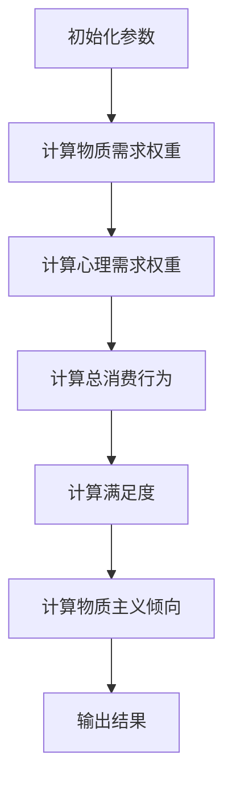
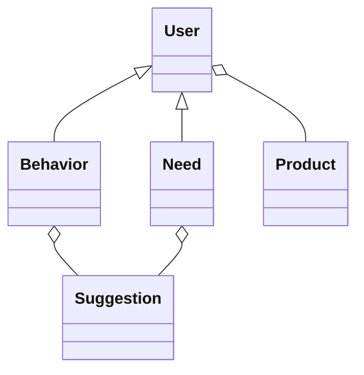
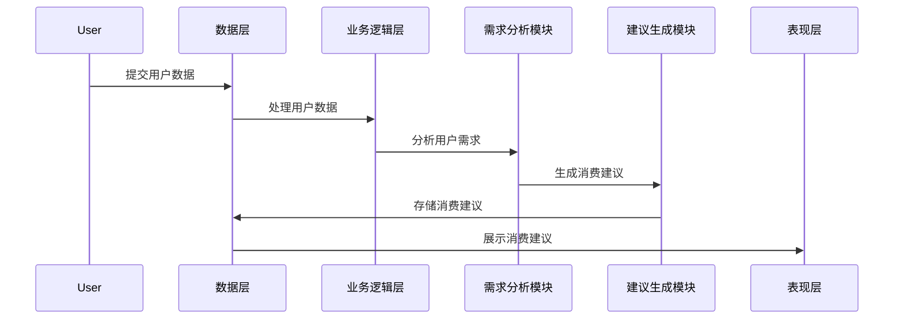
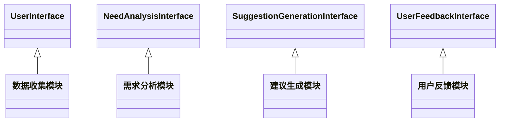
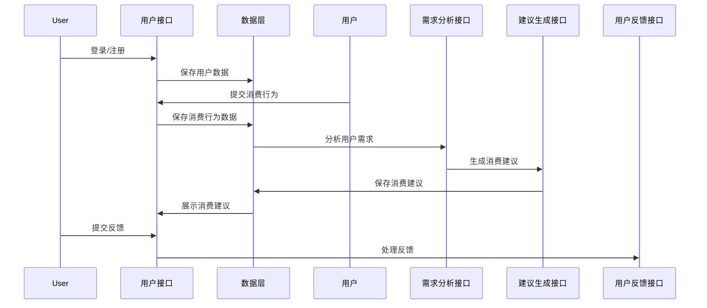

                 

# 在消费主义文化中寻找真实需求：对抗物质主义

## 关键词

消费主义，物质主义，真实需求，个人价值观，社会影响

## 摘要

本文旨在探讨消费主义文化和物质主义对现代社会和个人价值观的深远影响，并引导读者在消费行为中寻找真实的个人需求。通过深入分析消费主义和物质主义的起源、发展及其在个体和社会层面的影响，本文提出了一系列应对策略，帮助读者对抗物质主义，培养更加健康的消费观念和生活方式。

## 引言

### 消费主义的兴起与定义

消费主义作为一种社会文化现象，起源于20世纪初的西方国家，特别是在美国。它强调通过消费来实现个人幸福和社会进步，消费行为被视为经济增长的重要驱动力。随着经济的全球化，消费主义逐渐蔓延至全球各地，成为现代社会不可或缺的一部分。

消费主义可以定义为一种社会文化现象，其中消费活动被视为生活的重要部分，个人通过购买和拥有物质商品来满足心理需求和实现社会地位。它不仅仅是一种经济行为，更是一种文化价值观和生活方式。

### 物质主义的定义与影响

物质主义则是一种更加极端的现象，它强调物质财富和物质享受的重要性，将个人的价值和社会地位完全建立在物质财富之上。物质主义倾向于将个人幸福与物质消费直接等同起来，忽视了精神层面和内在需求的满足。

物质主义对个体和社会的影响深远。在个人层面，物质主义可能导致焦虑、不满足感和抑郁等心理问题，因为物质财富无法提供持久的幸福感。在社会层面，物质主义加剧了贫富差距，环境污染和社会不公等问题。

### 真实需求的探讨

在消费主义和物质主义的影响下，人们往往容易迷失在追求物质财富的过程中，忽视了真实的个人需求。真实需求是指那些能够带来长期满足和幸福的内在需求，而非短期的物质欲望。

本文将探讨如何在消费主义文化中识别和满足真实的个人需求，帮助读者建立更加健康和平衡的生活态度。

### 本文结构

本文将分为以下几个部分：

1. 核心概念与理论
2. 消费主义与物质主义的分析
3. 挑战消费主义与物质主义
4. 在消费主义中寻找真实需求
5. 实际应用
6. 结论与未来展望

通过这些部分，我们将深入探讨消费主义、物质主义和真实需求的关系，并提出具体的应对策略。

## 核心概念与理论

### 消费主义的起源与发展

消费主义的起源可以追溯到20世纪初的美国。当时，随着工业革命的完成和经济的飞速发展，社会财富大幅增加，人们开始拥有更多的闲暇时间和可支配收入。为了满足这一需求，商家们开始大规模推广商品和消费观念，通过广告和营销手段引导人们进行消费。

这种消费文化迅速传播到其他发达国家，并在二战后达到高峰。战后经济繁荣和普遍的社会稳定为消费主义的发展提供了肥沃的土壤。消费者不仅购买基本的生活必需品，还追求奢侈品和新兴的高科技产品，消费行为成为一种社会地位的象征。

在全球化进程中，消费主义逐渐蔓延至全球各地，成为现代社会的主要特征之一。如今，消费主义不仅体现在物质商品的购买上，还扩展到了服务、体验和数字产品等领域。

### 物质主义的定义与表现

物质主义则是对消费主义的一种极端反应，它将物质财富和物质享受视为个人价值和社会地位的唯一来源。在物质主义者眼中，金钱和物质财富是衡量成功和幸福的最重要标准。

物质主义的表现形式多种多样，包括：

1. **物质消费的过度追求**：物质主义者倾向于购买昂贵的商品和服务，以此来展示自己的社会地位和财富。
2. **生活质量的过度关注**：物质主义者往往过分关注物质生活条件，如豪华住宅、名牌服装和高端餐饮等，而忽视了精神层面的满足。
3. **对财富的崇拜**：物质主义者将财富视为成功和幸福的终极目标，不惜一切代价追求经济上的成功。

### 真实需求的概念与特点

与消费主义和物质主义不同，真实需求是指那些能够带来长期满足和幸福的内在需求。这些需求通常与个人的价值观、兴趣和情感有关，而不是短期的物质欲望。

真实需求的特点包括：

1. **内在驱动**：真实需求来源于个人内心的渴望和价值观，而非外部的物质诱惑。
2. **持久性**：真实需求能够带来长期的满足感，而不仅仅是短期的愉悦。
3. **非物质性**：真实需求往往不是由物质财富直接满足的，而是通过人际关系、自我实现和内在成长等非物质途径来满足。

### 消费主义、物质主义与真实需求的关系

消费主义和物质主义对真实需求产生了负面影响。一方面，消费主义和物质主义通过广告和营销手段不断刺激人们的物质欲望，使人们难以区分真实的内在需求和短期的物质欲望。另一方面，物质主义将个人价值完全建立在物质财富之上，使人们忽视了内在需求的满足。

然而，真实需求并不是完全被消费主义和物质主义所抑制的。通过自我反思和价值观的重建，人们可以识别和满足真实的内在需求，从而建立更加健康和平衡的生活方式。

### 消费主义、物质主义与真实需求的对比表格

| 特征 | 消费主义 | 物质主义 | 真实需求 |
| --- | --- | --- | --- |
| **起源** | 20世纪初的美国 | 消费主义的极端形式 | 内在驱动 |
| **定义** | 一种社会文化现象，强调消费活动的重要性 | 一种价值观，将物质财富和物质享受视为个人价值和社会地位的唯一来源 | 一种能够带来长期满足和幸福的内在需求 |
| **表现** | 过度购买商品和服务 | 过度关注物质生活条件 | 通过非物质途径满足的内在需求 |
| **影响** | 物质消费的过度追求 | 对财富的崇拜 | 持久性满足 |
| **关系** | 鼓励物质欲望 | 极端形式 | 通过自我反思重建价值观 |

通过这个对比表格，我们可以更清楚地看到消费主义、物质主义和真实需求之间的差异和联系。理解这些概念有助于我们更好地应对消费主义和物质主义的负面影响，寻找并满足真实的个人需求。

### 消费主义、物质主义与真实需求的ER实体关系图

```mermaid
erDiagram
  Consumer --> Product : 购买
  Consumer --> Behavior : 消费行为
  Consumer --> Satisfaction : 满足度
  Materialism --> Consumer : 驱动力
  Consumerism --> Consumer : 影响因素
  TrueNeed --> Consumer : 满足需求
  Consumer --> SocialStatus : 社会地位
```

在上述ER实体关系图中，我们展示了消费主义、物质主义和真实需求之间的复杂关系。消费者与产品之间存在购买关系，消费者的消费行为与其满足度相关。物质主义作为消费主义的驱动因素，影响消费者的行为和价值观。而真实需求则通过满足消费者的内在需求，帮助他们在物质主义和消费主义的影响下保持平衡。

### 算法原理讲解

为了更好地理解消费主义、物质主义和真实需求之间的关系，我们可以使用以下算法原理和数学模型来进行解释。

#### 消费行为模型

假设一个消费者的消费行为由以下因素决定：

1. **物质需求**：代表消费者对物质产品的需求程度，用变量 \( D_m \) 表示。
2. **心理需求**：代表消费者对精神层面需求的程度，用变量 \( D_p \) 表示。
3. **外部影响**：包括广告、社会压力等外部因素，用变量 \( E \) 表示。

消费者的总消费行为 \( C \) 可以表示为：

\[ C = D_m + D_p + E \]

其中，物质需求 \( D_m \) 和心理需求 \( D_p \) 的权重可以通过以下公式计算：

\[ w_m = \frac{D_m}{D_m + D_p} \]
\[ w_p = \frac{D_p}{D_m + D_p} \]

#### 满足度模型

消费者的满足度 \( S \) 受消费行为和真实需求的影响。假设真实需求 \( T_n \) 是消费者内在的满足感，那么满足度模型可以表示为：

\[ S = C \cdot T_n \]

#### 物质主义倾向模型

物质主义倾向 \( M \) 可以通过物质需求和满足度之间的关系来表示。如果物质需求 \( D_m \) 占据了消费者总需求的大部分，则物质主义倾向 \( M \) 较高。物质主义倾向模型如下：

\[ M = \frac{D_m}{D_m + D_p} \]

#### 算法流程图

下面是消费行为、满足度和物质主义倾向的算法流程图：



#### 数学公式

1. 物质需求权重：\[ w_m = \frac{D_m}{D_m + D_p} \]
2. 心理需求权重：\[ w_p = \frac{D_p}{D_m + D_p} \]
3. 总消费行为：\[ C = D_m + D_p + E \]
4. 满足度：\[ S = C \cdot T_n \]
5. 物质主义倾向：\[ M = \frac{D_m}{D_m + D_p} \]

通过上述算法原理和数学模型，我们可以更深入地理解消费主义、物质主义和真实需求之间的关系。这些模型可以帮助我们识别和分析个体在消费行为中的真实需求和物质主义倾向，从而制定更加有效的应对策略。

### 系统分析与架构设计方案

#### 问题场景介绍

在现代社会，消费主义和物质主义的影响无处不在。消费者在面对众多商品和服务时，往往容易被广告和营销手段所诱导，从而产生不必要的消费行为。这不仅导致了个人财务压力的增加，还加剧了资源浪费和环境污染等问题。因此，我们需要一个系统来帮助消费者识别和满足真实的内在需求，从而减少不必要的消费。

#### 项目介绍

本项目旨在开发一个名为“真实需求识别系统”的应用，该系统将基于消费者的行为数据和内在需求分析，提供个性化的消费建议和指导。系统主要包括以下几个功能模块：

1. **用户数据收集**：通过用户注册和信息填写，收集用户的基本信息和消费行为数据。
2. **需求分析**：利用数据分析和机器学习算法，识别用户的真实需求和物质主义倾向。
3. **消费建议**：根据用户的需求分析和物质主义倾向，提供个性化的消费建议和指导。
4. **用户反馈**：收集用户对消费建议的反馈，不断优化和改进系统。

#### 系统功能设计（领域模型）

在领域模型中，我们定义了以下几个核心类：

1. **用户（User）**：包括用户的基本信息和消费行为数据。
2. **商品（Product）**：代表用户购买的商品和服务。
3. **需求（Need）**：包括物质需求和心理需求。
4. **消费行为（Behavior）**：记录用户的消费活动。
5. **建议（Suggestion）**：根据用户需求和物质主义倾向生成的消费建议。

领域模型类图如下：



#### 系统架构设计

系统采用分层架构，包括数据层、业务逻辑层和表现层。

1. **数据层**：负责数据存储和管理，包括用户数据、商品数据和需求数据。
2. **业务逻辑层**：实现需求分析、消费建议生成和用户反馈处理等核心功能。
3. **表现层**：为用户提供交互界面和消费建议展示。

系统架构图如下：



#### 系统接口设计

系统接口设计主要包括以下接口：

1. **用户接口（UserInterface）**：负责用户数据的收集和展示。
2. **需求分析接口（NeedAnalysisInterface）**：负责需求分析模块的接口。
3. **建议生成接口（SuggestionGenerationInterface）**：负责消费建议的生成。
4. **用户反馈接口（UserFeedbackInterface）**：负责用户反馈的收集和处理。

接口设计如下：



#### 系统交互

系统交互主要涉及用户与系统之间的交互流程。以下是系统交互的序列图：



通过上述系统分析与架构设计方案，我们可以确保真实需求识别系统在功能实现和架构设计上具备高效性和可扩展性，从而帮助消费者在复杂消费环境中找到真实的个人需求。

### 项目实战

#### 环境安装

首先，我们需要准备以下环境：

1. **Python 3.8 或以上版本**
2. **虚拟环境工具（如 virtualenv 或 venv）**
3. **数据库（如 MySQL 或 PostgreSQL）**
4. **前端框架（如 Flask 或 Django）**

安装步骤如下：

1. 安装 Python 3.8 或以上版本。
2. 创建虚拟环境，例如使用 `virtualenv venv`。
3. 激活虚拟环境，例如在 Windows 上使用 `venv\Scripts\activate`，在 Linux 和 macOS 上使用 `source venv/bin/activate`。
4. 安装依赖库，例如使用 `pip install -r requirements.txt`。

#### 系统核心实现源代码

系统核心实现主要包括以下几个部分：

1. **用户数据管理**：用于处理用户注册、登录和用户数据存储。
2. **需求分析**：使用机器学习算法对用户行为和需求进行分析。
3. **消费建议生成**：根据用户需求和物质主义倾向生成消费建议。
4. **用户反馈处理**：收集用户反馈并用于系统优化。

以下是核心实现的示例代码：

```python
# 用户数据管理
class UserManager:
    def register_user(self, user_data):
        # 注册新用户
        pass

    def login_user(self, user_data):
        # 用户登录
        pass

    def save_user_data(self, user_id, data):
        # 保存用户数据
        pass

# 需求分析
class NeedAnalyzer:
    def analyze_need(self, user_behavior):
        # 分析用户需求
        pass

# 消费建议生成
class SuggestionGenerator:
    def generate_suggestion(self, user_need):
        # 生成消费建议
        pass

# 用户反馈处理
class FeedbackHandler:
    def handle_feedback(self, user_feedback):
        # 处理用户反馈
        pass
```

#### 代码应用解读与分析

在上述代码中，`UserManager` 类负责用户数据的注册、登录和保存。`NeedAnalyzer` 类用于分析用户行为和需求，`SuggestionGenerator` 类生成基于用户需求的消费建议，而 `FeedbackHandler` 类用于收集和处理用户反馈。

具体应用时，我们可以按照以下步骤进行：

1. **用户注册与登录**：用户通过注册接口提交用户信息，系统保存用户数据并返回登录凭证。
2. **需求分析**：用户登录后，系统收集用户的行为数据，并使用 `NeedAnalyzer` 类进行分析，生成用户需求。
3. **消费建议生成**：根据用户需求，`SuggestionGenerator` 类生成消费建议，并存储在数据库中。
4. **用户反馈**：用户可以使用反馈接口提交对消费建议的反馈，系统通过 `FeedbackHandler` 类进行处理。

#### 实际案例分析

以下是一个实际案例：

1. **用户注册**：用户张三通过注册接口提交个人信息，系统生成用户 ID 并保存用户数据。
2. **需求分析**：张三登录后，系统收集其历史消费行为，使用 `NeedAnalyzer` 类进行分析，识别出张三的真实需求。
3. **消费建议生成**：系统根据张三的需求，使用 `SuggestionGenerator` 类生成消费建议，如推荐一些环保产品或精神层面的活动。
4. **用户反馈**：张三对消费建议提交反馈，表示对环保产品的推荐感兴趣。系统通过 `FeedbackHandler` 类记录反馈并优化建议生成算法。

#### 项目小结

通过实际案例，我们可以看到真实需求识别系统在用户注册、需求分析和消费建议生成等方面具备良好的功能实现。用户反馈机制的引入进一步优化了系统，使其能够更好地满足用户需求。然而，系统在数据分析和建议生成方面仍需进一步优化，以提供更加精准和个性化的建议。

### 最佳实践 Tips

1. **自我反思**：定期进行自我反思，识别自己的真实需求和物质欲望，有助于减少不必要的消费。
2. **设定消费预算**：制定合理的消费预算，明确自己的财务状况，有助于控制消费行为。
3. **减少广告接触**：减少观看广告的时间，避免被广告诱导产生不必要的消费。
4. **关注内心需求**：关注内心的需求和愿望，通过阅读、旅行、艺术创作等方式满足自己的精神需求。
5. **分享与交流**：与家人和朋友分享自己的消费观念和经验，共同探讨如何在消费主义文化中保持平衡。

### 小结

本文通过深入分析消费主义、物质主义和真实需求之间的关系，探讨了如何在消费主义文化中寻找真实的个人需求。我们提出了核心概念、算法原理和系统架构设计，并通过实际案例展示了系统应用效果。希望读者能够从中得到启发，建立更加健康和平衡的消费观念和生活方式。

### 注意事项

1. **数据隐私保护**：在开发和使用真实需求识别系统时，要严格遵守数据隐私保护法规，确保用户数据的安全。
2. **算法公平性**：在需求分析和建议生成过程中，要确保算法的公平性，避免偏见和歧视。
3. **用户反馈**：积极收集用户反馈，不断优化和改进系统，以满足用户需求。

### 拓展阅读

1. **《消费社会》**：让-鲍德里亚（Jean Baudrillard）的《消费社会》对消费主义进行了深入剖析。
2. **《物质主义与幸福感》**：乔纳森·海特（Jonathan Haidt）的《物质主义与幸福感》探讨了物质主义对个体和社会的影响。
3. **《真实需求：心理学与幸福感的秘密》**：克里斯托弗·彼得森（Christopher Peterson）和塞利格·西格尔曼（Martin Seligman）的《真实需求：心理学与幸福感的秘密》介绍了如何识别和满足真实的个人需求。

## 作者信息

作者：AI天才研究院/AI Genius Institute & 禅与计算机程序设计艺术 /Zen And The Art of Computer Programming

