                 

# 在碎片化时代重建知识体系：个人学习的革命

## 关键词

- 碎片化时代
- 知识体系
- 个人学习
- 学习方法
- 资源利用

> 摘要：本文将探讨在当今碎片化时代，个人如何通过有效的学习方法重建知识体系，从而提高学习效率，实现自我提升。文章将从背景介绍、核心概念、学习方法、学习资源、学习评估、实践案例等多个方面，逐步阐述个人学习的革命。

## 引言

### 1.1 碎片化时代的挑战

随着互联网和信息技术的飞速发展，我们的世界逐渐进入了一个信息爆炸的时代。碎片化的信息如潮水般涌来，知识更新速度加快，学习环境发生了翻天覆地的变化。在这种背景下，个人学习面临着前所未有的挑战。

#### 问题背景

1. **信息过载**：海量的信息使得人们难以分辨哪些是真正有价值的内容。
2. **时间碎片化**：快节奏的生活使得人们的学习时间被分割成一小段一小段的碎片，难以进行系统性的学习。
3. **缺乏系统性**：碎片化的学习往往缺乏整体的规划和系统性的知识体系。

#### 问题描述

如何在这种碎片化的时代背景下，有效地进行个人学习，重建知识体系，提升学习效率？

#### 问题解决

为了应对碎片化时代的挑战，我们需要采取一系列策略和方法，重新审视个人学习的过程，构建适合自己的知识体系。

#### 边界与外延

1. **知识体系**：知识体系是指将不同领域、不同学科的知识进行整合，形成有机的整体。
2. **碎片化学习**：碎片化学习是指利用碎片化的时间进行学习，通过短时间、高频次的学习方式，积累知识。

### 1.2 个人学习的重要性

个人学习不仅是获取知识和技能的重要途径，更是提升自我、实现自我价值的关键手段。在碎片化时代，个人学习的重要性更加凸显。

#### 概念结构与核心要素组成

1. **自主学习能力**：个人学习的能力，包括信息筛选、理解、应用和创新。
2. **知识整合能力**：将碎片化的知识进行整合，构建系统的知识体系。
3. **持续学习能力**：保持对新知识的渴望和学习的热情，不断提升自我。

### 1.3 重建知识体系的必要性

在碎片化时代，重建知识体系显得尤为重要。只有建立了系统的知识体系，我们才能在浩如烟海的信息中找到方向，提高学习效率。

#### 核心概念原理

1. **知识关联性**：知识体系中的各个知识点之间应该有紧密的关联性，形成完整的知识网络。
2. **知识层次性**：知识体系应该有清晰的层次结构，从基础知识到高级知识，形成一个完整的知识层级。
3. **知识动态性**：知识体系应该是一个动态的、不断更新的系统，以适应不断变化的信息环境。

## 第1章 碎片化时代的学习环境

### 1.1 碎片化信息的来源

在碎片化时代，信息的来源多种多样，包括互联网、社交媒体、移动应用等。这些信息渠道为我们提供了丰富的学习资源，但也带来了信息过载的问题。

#### 概念属性特征对比表格

| 信息来源 | 特点 |
| --- | --- |
| 互联网 | 海量信息，实时更新 |
| 社交媒体 | 互动性强，传播速度快 |
| 移动应用 | 便携性，个性化 |

#### ER实体关系图架构

```mermaid
erDiagram
  Student ||--|{ Course }: "参加"
  Course ||--|{ Teacher }: "授课"
  Teacher ||--|{ Student }: "辅导"
```

### 1.2 碎片化学习的特点

碎片化学习具有短时性、高频次、自主性强的特点，这使得学习更加灵活和高效。

#### 概念属性特征对比表格

| 学习特点 | 说明 |
| --- | --- |
| 短时性 | 学习时间被分割成短小的片段 |
| 高频次 | 学习次数多，但每次学习时间短 |
| 自主性 | 学习者可以自主选择学习内容和时间 |

### 1.3 碎片化学习的影响

碎片化学习对个人学习和知识体系建设有着深远的影响。

#### 概念属性特征对比表格

| 影响因素 | 影响 |
| --- | --- |
| 信息过载 | 影响学习效率和质量 |
| 时间碎片化 | 影响系统性学习 |
| 缺乏系统性 | 导致知识体系不完整 |

## 第2章 个人学习的核心概念

### 2.1 学习的本质

学习是一个复杂的过程，涉及到信息的获取、处理和应用。

#### 概念属性特征对比表格

| 学习过程 | 说明 |
| --- | --- |
| 信息获取 | 接收外部信息 |
| 信息处理 | 理解和加工信息 |
| 信息应用 | 将信息应用于实际 |

### 2.2 知识体系的构建

知识体系是学习的核心，构建良好的知识体系对于提高学习效率至关重要。

#### 概念属性特征对比表格

| 知识体系构建 | 说明 |
| --- | --- |
| 知识分类 | 对知识进行分类和整理 |
| 知识整合 | 将不同领域的知识进行整合 |
| 知识创新 | 在原有知识基础上进行创新 |

### 2.3 学习方法与策略

有效的学习方法与策略对于个人学习至关重要。

#### 概念属性特征对比表格

| 学习方法 | 说明 |
| --- | --- |
| 微学习 | 利用碎片时间进行学习 |
| 项目驱动学习 | 通过实际项目进行学习 |
| 社交化学习 | 通过社交互动进行学习 |

## 第3章 碎片化时代下的学习方法

### 3.1 微学习

微学习是碎片化时代下的一种高效学习方法，通过短时高频的学习方式，积累知识。

#### 算法原理讲解

微学习的过程可以简化为以下几个步骤：

1. **确定学习目标**：明确每次学习的具体目标。
2. **选择学习资源**：根据学习目标，选择合适的学习资源。
3. **进行短时学习**：利用碎片时间进行短时学习。
4. **复习巩固**：定期复习所学知识，巩固记忆。

下面是一个微学习过程的Mermaid流程图：

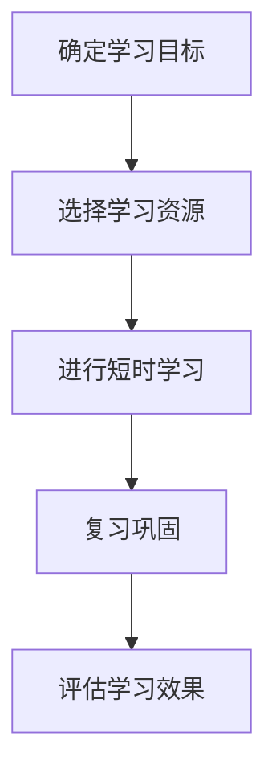

#### 实例说明

假设我们要学习Python编程语言，我们可以制定一个微学习计划：

1. **确定学习目标**：掌握Python的基本语法和常用函数。
2. **选择学习资源**：通过在线教程、视频课程和编程练习进行学习。
3. **进行短时学习**：每天利用半小时的时间学习Python。
4. **复习巩固**：每周进行一次复习，巩固所学知识。

通过这样的微学习计划，我们可以逐步掌握Python编程语言。

### 3.2 项目驱动学习

项目驱动学习是通过实际项目进行学习，将理论知识应用到实践中，提高实际操作能力。

#### 算法原理讲解

项目驱动学习的过程可以分为以下几个步骤：

1. **确定项目目标**：明确项目的具体目标和要求。
2. **制定项目计划**：根据项目目标，制定详细的项目计划。
3. **进行项目实施**：按照项目计划，进行项目的实际实施。
4. **项目评估与反思**：对项目进行评估，总结经验教训。

下面是一个项目驱动学习过程的Mermaid流程图：

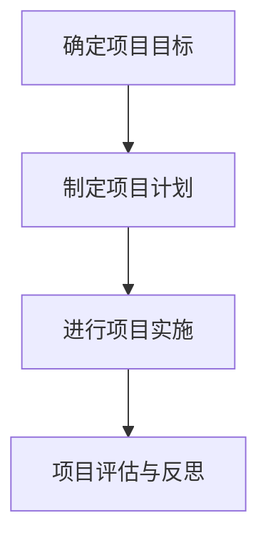

#### 实例说明

假设我们要完成一个简单的网站搭建项目，我们可以按照以下步骤进行项目驱动学习：

1. **确定项目目标**：搭建一个简单的个人博客网站。
2. **制定项目计划**：确定网站的技术栈（如HTML、CSS、JavaScript）、功能需求（如文章发布、评论功能）等。
3. **进行项目实施**：按照项目计划，逐步完成网站的功能开发。
4. **项目评估与反思**：对项目进行评估，总结在开发过程中遇到的问题和解决方案，为下一次项目提供经验。

通过这样的项目驱动学习，我们可以提高实际操作能力，并加深对知识的理解。

### 3.3 社交化学习

社交化学习是通过社交互动进行学习，通过与他人交流、合作，分享知识和经验，提高学习效果。

#### 算法原理讲解

社交化学习的过程可以分为以下几个步骤：

1. **建立学习社区**：寻找或建立适合的学习社区。
2. **参与学习活动**：参与学习社区的活动，如讨论、分享、合作等。
3. **互动交流**：与他人互动交流，分享自己的知识和经验。
4. **评估学习效果**：通过评估学习效果，了解自己的学习进度和成果。

下面是一个社交化学习过程的Mermaid流程图：

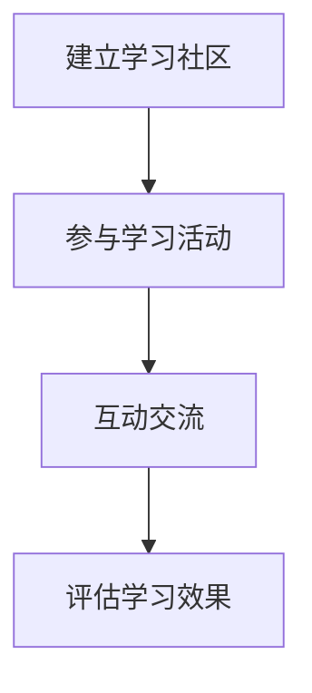

#### 实例说明

假设我们要学习数据分析，我们可以通过以下方式进行社交化学习：

1. **建立学习社区**：加入一个数据分析的学习小组，如微信群、QQ群等。
2. **参与学习活动**：参加小组的学习活动，如分享数据分析的经验、讨论具体案例等。
3. **互动交流**：在小组内与其他成员互动交流，分享自己的学习心得和疑问。
4. **评估学习效果**：定期对学习效果进行评估，了解自己的进步情况，并调整学习计划。

通过这样的社交化学习，我们可以更好地掌握数据分析的知识和技能。

## 第4章 碎片化时代下的学习资源

### 4.1 在线教育资源

在线教育资源是碎片化时代下重要的学习资源，包括在线课程、电子书籍、视频教程等。

#### 系统功能设计

- **在线课程**：提供各种主题的在线课程，包括编程、数据分析、人工智能等。
- **电子书籍**：提供各种电子书籍，方便用户进行阅读和学习。
- **视频教程**：提供各种视频教程，通过视频形式讲解知识点，方便用户理解和掌握。

#### 系统架构设计

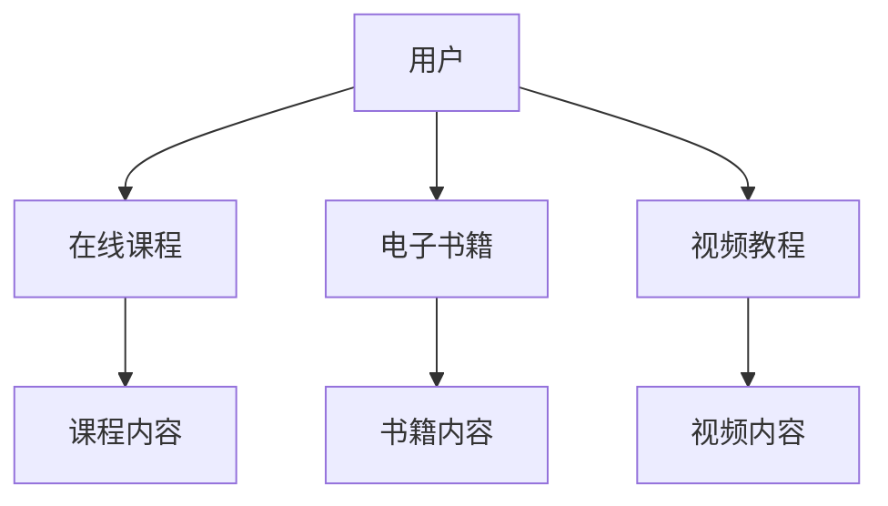

#### 系统接口设计和系统交互

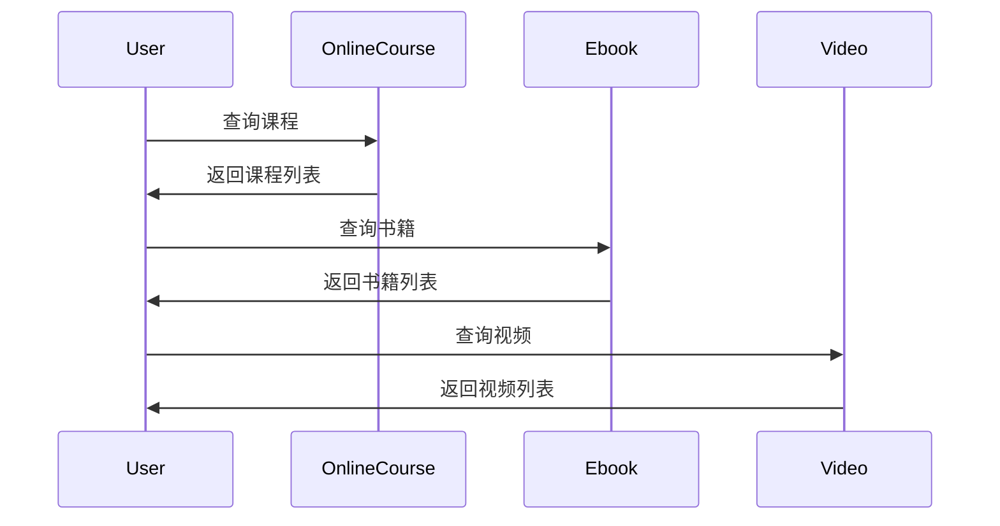

### 4.2 自制学习资源

自制学习资源是指学习者自己创建的学习资料，如笔记、思维导图、总结等。

#### 系统功能设计

- **笔记功能**：提供笔记编辑、存储和分享功能。
- **思维导图**：提供思维导图制作和展示功能。
- **总结功能**：提供总结编辑和发布功能。

#### 系统架构设计

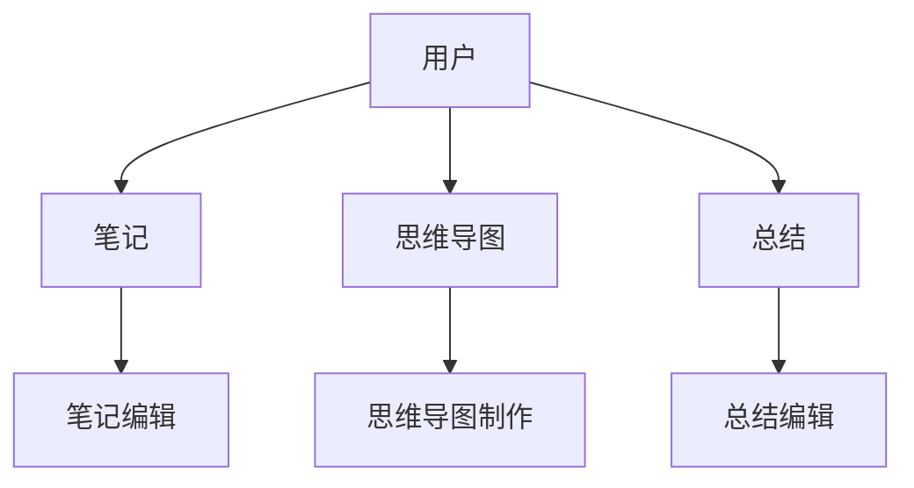

#### 系统接口设计和系统交互

```mermaid
sequenceDiagram
    User->>Note: 创建笔记
    Note->>User: 返回笔记列表
    User->>MindMap: 创建思维导图
    MindMap->>User: 返回思维导图列表
    User->>Summary: 创建总结
    Summary->>User: 返回总结列表
```

### 4.3 利用社交媒体学习

社交媒体是碎片化时代下重要的学习渠道，通过社交媒体，学习者可以获取丰富的学习资源，与他人互动交流。

#### 系统功能设计

- **信息推送**：推送各种学习资源，如文章、视频、课程等。
- **互动交流**：提供评论、点赞、分享等功能，促进学习者之间的互动。
- **学习社区**：建立学习社区，提供学习交流的平台。

#### 系统架构设计

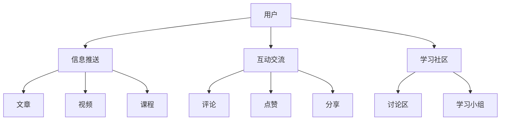

#### 系统接口设计和系统交互

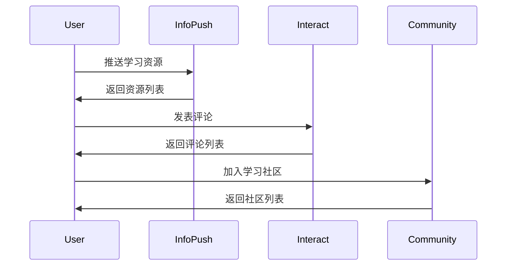

## 第5章 个人学习计划的制定与执行

### 5.1 学习计划的重要性

学习计划是个人学习的指南，有助于明确学习目标、规划学习内容、提高学习效率。

#### 概念属性特征对比表格

| 学习计划重要性 | 说明 |
| --- | --- |
| 明确学习目标 | 提高学习效率 |
| 规划学习内容 | 提高学习质量 |
| 提高学习效率 | 节省学习时间 |

### 5.2 制定学习计划的步骤

制定学习计划需要遵循以下步骤：

1. **明确学习目标**：根据个人兴趣和职业发展，明确学习目标。
2. **分析自身情况**：分析自己的学习需求、基础和能力。
3. **规划学习内容**：确定学习内容，包括知识点、技能点等。
4. **制定时间安排**：合理安排学习时间，确保学习计划的可行性。
5. **制定学习策略**：根据学习内容和学习目标，制定合适的学习策略。

下面是一个学习计划制定过程的Mermaid流程图：

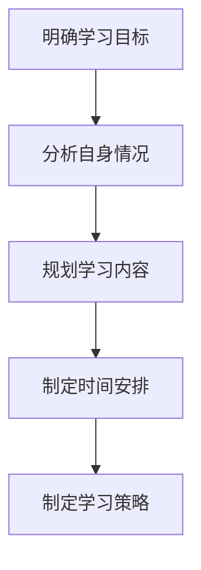

### 5.3 执行学习计划的方法

执行学习计划需要注重以下几个方面：

1. **坚持每日学习**：养成良好的学习习惯，坚持每日学习。
2. **定期复习**：定期复习所学内容，巩固记忆。
3. **记录学习进度**：记录学习进度，及时调整学习计划。
4. **反思学习效果**：定期反思学习效果，总结经验教训。

下面是一个学习计划执行过程的Mermaid流程图：

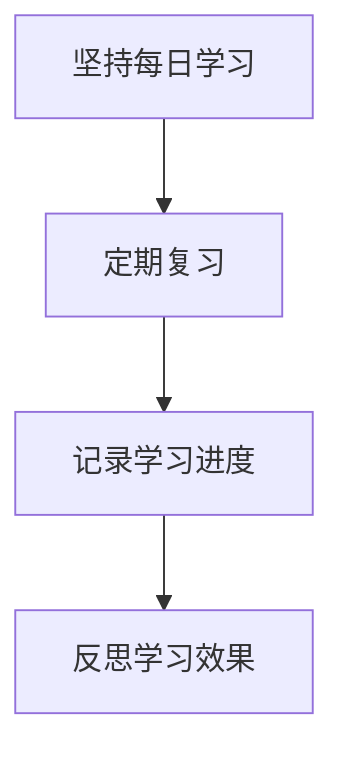

## 第6章 碎片化时代下的学习评估

### 6.1 学习评估的方法

学习评估是衡量学习效果的重要手段，包括自我评估和他人评估等方法。

#### 概念属性特征对比表格

| 学习评估方法 | 说明 |
| --- | --- |
| 自我评估 | 评估自己的学习成果 |
| 他人评估 | 通过他人反馈了解自己的学习情况 |

### 6.2 学习评估的工具

学习评估需要使用一些工具来辅助评估，如问卷调查、测试题、项目展示等。

#### 概念属性特征对比表格

| 学习评估工具 | 说明 |
| --- | --- |
| 问卷调查 | 了解学习需求和效果 |
| 测试题 | 测量学习成果 |
| 项目展示 | 展示学习成果 |

### 6.3 学习评估的应用

学习评估可以应用于个人学习、课程评估、学习项目等多个方面。

#### 概念属性特征对比表格

| 应用场景 | 说明 |
| --- | --- |
| 个人学习 | 了解自己的学习情况 |
| 课程评估 | 评估课程的教学效果 |
| 学习项目 | 评估项目的完成情况 |

## 第7章 个人学习体系的重建与实践

### 7.1 个人学习体系的构建

个人学习体系的构建需要从以下几个方面进行：

1. **知识分类与整合**：对所学知识进行分类和整合，形成系统的知识体系。
2. **技能培养与提升**：根据个人职业规划，有针对性地培养和提升技能。
3. **学习方法优化**：不断优化学习方法，提高学习效率。

下面是一个个人学习体系构建过程的Mermaid流程图：

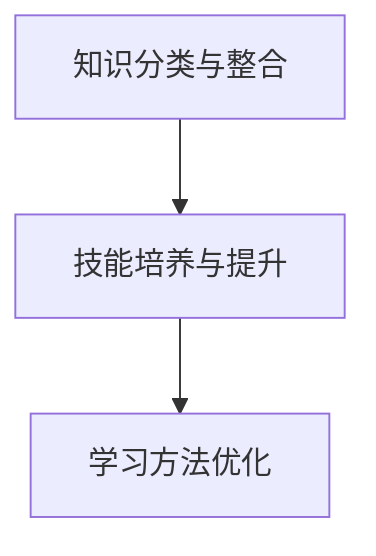

### 7.2 学习体系的应用案例

通过以下案例，我们可以看到个人学习体系在实际应用中的效果：

#### 案例一：编程学习

小明是一名软件工程师，他通过以下步骤构建了个人学习体系：

1. **知识分类与整合**：将编程知识分为基础知识、框架知识、项目经验等类别。
2. **技能培养与提升**：通过学习Python、Java等编程语言，提升编程能力。
3. **学习方法优化**：利用微学习、项目驱动学习等高效学习方法，提高学习效率。

通过这样的学习体系，小明在短时间内掌握了多种编程语言，并成功完成了多个项目。

#### 案例二：数据分析学习

小华是一名数据分析师，她通过以下步骤构建了个人学习体系：

1. **知识分类与整合**：将数据分析知识分为数据处理、数据挖掘、数据可视化等类别。
2. **技能培养与提升**：通过学习Python、R等数据分析工具，提升数据分析能力。
3. **学习方法优化**：利用社交化学习、项目驱动学习等高效学习方法，提高学习效率。

通过这样的学习体系，小华在短时间内掌握了数据分析的多种工具和技术，并成功完成了多个数据分析项目。

### 7.3 学习体系的建设与优化

个人学习体系的建设是一个持续的过程，需要不断地进行优化和完善。

1. **定期评估**：定期对学习体系进行评估，了解自身的优势和不足。
2. **反馈与调整**：根据评估结果，调整学习目标和计划。
3. **持续学习**：保持对新知识的渴望，不断更新和完善学习体系。

下面是一个学习体系建设与优化过程的Mermaid流程图：

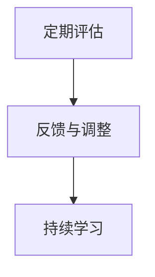

通过这样的持续优化，个人学习体系将更加完善和高效。

## 第8章 总结与展望

### 8.1 碎片化时代学习的未来趋势

随着科技的不断发展，碎片化时代的学习将会更加多样化、个性化。未来，学习将更加注重体验和互动，利用虚拟现实、增强现实等新技术，提供更加生动、直观的学习体验。

### 8.2 重建知识体系的持续价值

重建知识体系不仅是应对碎片化时代的必要手段，更是提升个人竞争力的关键。只有建立了系统的知识体系，我们才能在信息爆炸的时代中找到自己的位置，实现自我价值。

### 8.3 学习者的自我反思与成长

学习是一个不断反思和成长的过程。学习者需要时刻反思自己的学习方法和效果，不断调整和优化学习策略，以适应不断变化的学习环境。

## 作者

作者：AI天才研究院/AI Genius Institute & 禅与计算机程序设计艺术 /Zen And The Art of Computer Programming

本文详细探讨了在碎片化时代如何通过有效的学习方法重建知识体系，从而提高学习效率，实现自我提升。文章从背景介绍、核心概念、学习方法、学习资源、学习评估、实践案例等多个方面，逐步阐述了个人学习的革命。希望本文能对读者在碎片化时代的学习提供一定的指导和启示。在未来的学习道路上，让我们共同努力，不断追求知识的深度和广度，实现自我成长和提升。

