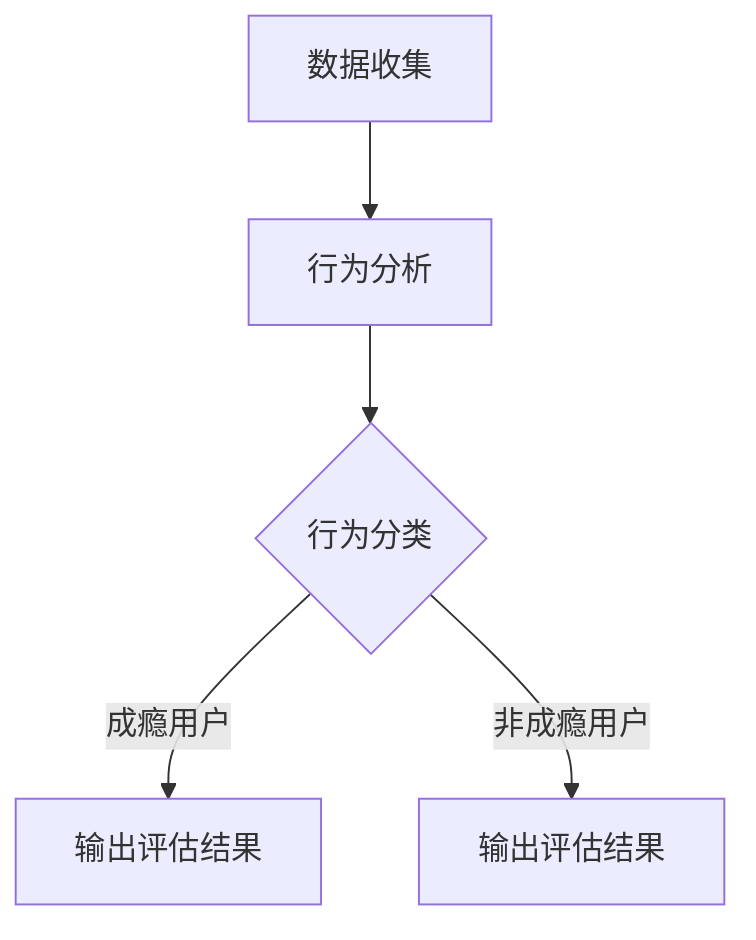
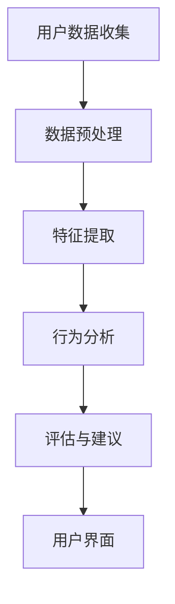

                 

# 在社交媒体时代寻找真实自我：克服虚拟身份的困扰

## 关键词

- 社交媒体
- 自我认知
- 虚拟身份
- 心理健康
- 人际关系

## 摘要

在社交媒体时代，虚拟身份的构建与真实自我的冲突日益显著，对个人的心理健康和人际关系产生了深远影响。本文旨在探讨社交媒体对自我认知的影响，分析虚拟身份的特质与影响，并探讨如何通过重审社交媒体使用习惯、培养真实自我的意识以及重建真实人际关系等策略，克服虚拟身份的困扰，寻找真实自我。

## 目录大纲

### 第一部分：社交媒体对自我认知的影响

#### 第1章：社交媒体时代的兴起与变革

##### 1.1 社交媒体的崛起
##### 1.2 社交媒体与传统自我的冲突
##### 1.3 社交媒体时代的自我认知困境

#### 第2章：理解虚拟身份的特质与影响

##### 2.1 虚拟身份的特质
##### 2.2 虚拟身份对真实生活的影响
##### 2.3 虚拟身份的依赖与成瘾

### 第二部分：重建真实自我的策略

#### 第3章：重审社交媒体使用习惯

##### 3.1 识别社交媒体成瘾
##### 3.2 改善社交媒体使用习惯
##### 3.3 培养社交媒体批判性思维

#### 第4章：培养真实自我的意识

##### 4.1 了解自我认知的过程
##### 4.2 增强自我认知的能力
##### 4.3 实现真实自我的表达

#### 第5章：重建真实人际关系的技巧

##### 5.1 真实人际关系的重要性
##### 5.2 建立真实的人际关系
##### 5.3 维护真实人际关系的策略

### 第三部分：实践与反思

#### 第6章：社交媒体时代的自我探索之旅

##### 6.1 自我探索的步骤
##### 6.2 自我探索的方法
##### 6.3 自我探索的实践案例

#### 第7章：寻找真实自我的持续之路

##### 7.1 持续寻找真实自我的重要性
##### 7.2 持续寻找真实自我的方法
##### 7.3 持续寻找真实自我的意义

## 第一部分：社交媒体对自我认知的影响

### 第1章：社交媒体时代的兴起与变革

#### 1.1 社交媒体的崛起

社交媒体的兴起是信息技术发展的一个重要里程碑。从最初的博客、论坛，到现在的Facebook、Twitter、Instagram等，社交媒体逐渐成为人们日常生活中不可或缺的一部分。它改变了人们获取信息、交流互动的方式，也为个人提供了展示自我、建立社交网络的平台。

##### 1.1.1 社交媒体的发展历程

社交媒体的发展历程可以分为三个阶段：

1. **早期阶段**：以博客和论坛为代表，用户可以通过文字、图片等形式分享个人生活、观点和感受。
2. **中期阶段**：以Facebook、Twitter等为代表，社交媒体开始强调社交关系，用户可以关注、点赞、评论等，形成互动网络。
3. **现阶段**：随着移动设备的普及，社交媒体进入移动时代，如Instagram、微信等，用户可以通过短视频、直播等形式进行互动。

##### 1.1.2 社交媒体对社会的影响

社交媒体对社会的影响是深远的。首先，它改变了人们的社交方式，使得人与人之间的交流更加便捷、高效。其次，社交媒体为个人提供了展示自我、获取关注的机会，但也带来了一定的负面影响，如隐私泄露、网络暴力等。

#### 1.2 社交媒体与传统自我的冲突

社交媒体的崛起也带来了传统自我与虚拟身份的冲突。在社交媒体上，个人可以自由塑造自己的形象，展现想要的一面，这往往与传统自我存在差异。这种虚拟身份的构建，既满足了人们对自我表达的渴望，也可能导致真实自我被忽视。

##### 1.2.1 虚拟身份的构建

虚拟身份的构建主要体现在以下几个方面：

1. **形象塑造**：个人通过照片、文字等手段，塑造一个理想的自我形象。
2. **社交策略**：个人在社交媒体上采取各种策略，如点赞、评论、分享等，以获取关注和认同。
3. **社交网络**：个人通过关注、点赞等行为，构建一个虚拟的社交网络。

##### 1.2.2 真实自我与虚拟身份的矛盾

真实自我与虚拟身份的矛盾主要体现在以下几个方面：

1. **自我认知的困惑**：个人在虚拟身份中获得的关注和认同，往往与真实自我存在差距，导致自我认知的困惑。
2. **社交压力**：虚拟身份的构建，往往伴随着一定的社交压力，如需要不断更新状态、保持活跃等。
3. **心理健康问题**：虚拟身份的构建，可能导致个人过度关注社交媒体，影响心理健康。

#### 1.3 社交媒体时代的自我认知困境

在社交媒体时代，个人面临着自我认知的困境。一方面，虚拟身份的构建使得个人难以准确认知自己；另一方面，社交媒体的算法和内容推送，也可能影响个人的自我认知。

##### 1.3.1 对自我认同的质疑

在社交媒体时代，个人容易受到外界评价的影响，对自己的认同产生质疑。这种质疑可能源于虚拟身份与现实自我的差距，也可能源于社交媒体上的比较心理。

##### 1.3.2 社交压力与焦虑

社交媒体的兴起，也带来了一定的社交压力。个人在社交媒体上需要维护自己的形象，担心被忽视、被排斥，这可能导致焦虑和心理压力。

## 第二部分：理解虚拟身份的特质与影响

### 第2章：理解虚拟身份的特质与影响

#### 2.1 虚拟身份的特质

虚拟身份具有以下几个主要特质：

1. **虚拟性**：虚拟身份存在于线上世界，与现实世界有所区别。
2. **灵活性**：虚拟身份可以自由塑造，个人可以根据自己的需求，选择展现的形象。
3. **匿名性**：虚拟身份往往具有匿名性，个人可以隐藏自己的真实身份，减少社交风险。
4. **多样性**：虚拟身份可以具有多种表现形式，如角色扮演、匿名发言等。

#### 2.2 虚拟身份对真实生活的影响

虚拟身份对真实生活的影响是显著的：

1. **人际关系**：虚拟身份可能影响现实世界的人际关系，个人可能在虚拟世界中建立的社交网络，与现实世界的人际关系产生冲突。
2. **心理健康**：虚拟身份可能导致个人过度关注社交媒体，影响心理健康，如焦虑、抑郁等。
3. **职业发展**：虚拟身份可能对个人的职业发展产生影响，如求职、晋升等。

#### 2.3 虚拟身份的依赖与成瘾

随着社交媒体的普及，虚拟身份的依赖和成瘾现象也越来越普遍：

1. **依赖原因**：虚拟身份的依赖主要源于个人对自我表达的渴望、社交需求的满足以及信息获取的便利性。
2. **成瘾症状**：虚拟身份成瘾的症状包括过度使用社交媒体、忽视现实生活、情绪波动等。
3. **成瘾危害**：虚拟身份成瘾可能导致个人心理健康问题、现实生活质量的下降以及人际关系问题。

## 第三部分：重建真实自我的策略

### 第3章：重审社交媒体使用习惯

#### 3.1 识别社交媒体成瘾

要克服虚拟身份的困扰，首先需要识别社交媒体成瘾的症状。以下是一些常见的成瘾行为：

1. **时间投入过多**：每天花费大量时间在社交媒体上，影响正常的生活和工作。
2. **情感依赖**：通过社交媒体获取情感满足，如关注点赞、评论等。
3. **社交压力**：在社交媒体上受到负面评价或排斥，产生焦虑和抑郁情绪。

#### 3.2 改善社交媒体使用习惯

为了改善社交媒体使用习惯，可以采取以下策略：

1. **设定时间限制**：每天设定固定的社交媒体使用时间，避免过度投入。
2. **关注有价值的内容**：关注并分享有价值、有启发性的内容，减少无意义的社交互动。
3. **培养批判性思维**：学会辨别信息的真实性和价值，避免被虚假信息误导。

#### 3.3 培养社交媒体批判性思维

培养社交媒体批判性思维，是克服虚拟身份困扰的重要一环。以下是一些方法：

1. **识别信息来源**：关注信息的发布者，判断其可信度。
2. **评估信息真实性**：通过多方验证，确保信息的真实性。
3. **避免社交媒体偏见**：注意自己的观点是否受到社交媒体偏见的影响，保持开放的心态。

## 第4章：培养真实自我的意识

#### 4.1 了解自我认知的过程

自我认知是一个复杂的过程，包括以下几个方面：

1. **自我观察**：通过观察自己的行为、情绪和想法，了解自己的内在状态。
2. **自我反思**：对自我观察的结果进行反思，思考自己的行为、情绪和想法的意义。
3. **自我评估**：根据自我反思的结果，评估自己的能力和价值观。

#### 4.2 增强自我认知的能力

要增强自我认知的能力，可以采取以下方法：

1. **定期自我反思**：每天或每周进行自我反思，记录自己的行为、情绪和想法。
2. **阅读相关书籍**：阅读有关自我认知、心理学等方面的书籍，增加知识储备。
3. **寻求专业指导**：寻求心理咨询师或导师的帮助，获得专业的指导和建议。

#### 4.3 实现真实自我的表达

实现真实自我的表达，是培养真实自我的重要一环。以下是一些方法：

1. **勇气与自信**：培养勇气和自信，敢于表达自己的真实想法和感受。
2. **提高表达能力**：通过写作、演讲等方式，提高自己的表达能力。
3. **培养真诚的人际关系**：与他人建立真诚的人际关系，通过交流和互动，表达真实自我。

## 第5章：重建真实人际关系的技巧

#### 5.1 真实人际关系的重要性

真实人际关系对个人的成长和发展具有重要意义：

1. **情感支持**：真实的人际关系可以提供情感支持，减轻压力和焦虑。
2. **个人成长**：通过真实的人际关系，可以学习到他人的经验和智慧，促进个人成长。
3. **心理健康**：真实的人际关系有助于维护心理健康，减少抑郁和焦虑情绪。

#### 5.2 建立真实的人际关系

要建立真实的人际关系，可以采取以下策略：

1. **选择合适的社交环境**：选择与自己价值观相符的社交环境，有利于建立真实的人际关系。
2. **开放心态**：保持开放的心态，愿意与他人分享自己的真实想法和感受。
3. **倾听与沟通**：倾听他人的意见和感受，积极沟通，增进相互了解。

#### 5.3 维护真实人际关系的策略

要维护真实的人际关系，可以采取以下策略：

1. **处理冲突**：面对冲突时，要保持冷静，通过沟通解决问题，避免伤害感情。
2. **增进信任与理解**：通过诚实、透明和开放的沟通，增进相互信任和理解。
3. **持续互动**：保持与他人的持续互动，通过交流和互动，加深彼此的了解。

## 第三部分：实践与反思

### 第6章：社交媒体时代的自我探索之旅

#### 6.1 自我探索的步骤

自我探索是一个持续的过程，可以采取以下步骤：

1. **明确目标**：设定自我探索的目标，如提高自我认知、改善人际关系等。
2. **制定计划**：根据目标，制定详细的自我探索计划，包括时间、方法和预期效果。
3. **实践与反思**：按照计划进行实践，定期反思和评估自己的进步。

#### 6.2 自我探索的方法

自我探索的方法包括：

1. **内省**：通过反思自己的行为、情绪和想法，了解自己的内心世界。
2. **观察**：观察他人的行为和反应，从中学习如何与他人相处。
3. **交流**：与他人进行深入的交流，分享自己的想法和感受，获得反馈和建议。

#### 6.3 自我探索的实践案例

以下是一些自我探索的实践案例：

1. **案例一**：一位年轻人通过写作自我反思，发现自己在人际关系中存在沟通障碍，并通过参加沟通技巧培训，逐渐改善了自己的沟通能力。
2. **案例二**：一位职场人士通过阅读心理学书籍，提高了自我认知，学会了如何处理职场压力和人际关系。

### 第7章：寻找真实自我的持续之路

#### 7.1 持续寻找真实自我的重要性

在社交媒体时代，持续寻找真实自我具有重要意义：

1. **适应社会变迁**：随着社会的发展，个人的价值观和认知也在不断变化，持续寻找真实自我有助于适应这种变化。
2. **促进个人成长**：真实自我是个人成长的基础，持续寻找真实自我有助于提升自我认知和心理健康。
3. **维护人际关系**：真实自我是建立真实人际关系的基础，持续寻找真实自我有助于维护和谐的人际关系。

#### 7.2 持续寻找真实自我的方法

要持续寻找真实自我，可以采取以下方法：

1. **定期自我反思**：定期反思自己的行为、情绪和想法，了解自己的内心世界。
2. **不断学习与成长**：通过学习新的知识和技能，提升自我认知和自我表达能力。
3. **保持开放的心态**：保持开放的心态，愿意接受新的观点和经验，不断拓展自己的认知边界。

#### 7.3 持续寻找真实自我的意义

持续寻找真实自我的意义在于：

1. **提升个人幸福感**：真实自我是个人幸福的基础，持续寻找真实自我有助于提升个人的幸福感。
2. **促进社会和谐**：真实自我有助于建立真实的人际关系，促进社会和谐与稳定。
3. **推动个人与社会发展**：真实自我是个人发展和社会进步的重要动力，持续寻找真实自我有助于推动个人与社会的发展。

## 总结

在社交媒体时代，虚拟身份的构建与真实自我的冲突日益显著，对个人的心理健康和人际关系产生了深远影响。通过重审社交媒体使用习惯、培养真实自我的意识以及重建真实人际关系等策略，我们可以克服虚拟身份的困扰，寻找真实自我。在社交媒体时代，持续寻找真实自我，不仅有助于提升个人幸福感，也有助于促进社会和谐与进步。让我们共同努力，寻找真实自我，拥抱真实的幸福与成长。## 核心概念对比表格

| 核心概念 | 定义 | 特点 | 对真实自我影响 |
| --- | --- | --- | --- |
| 社交媒体 | 用于社交互动的平台 | 方便、快捷、多样化 | 影响自我认知、人际关系 |
| 虚拟身份 | 在线世界的自我形象 | 自由塑造、多变、匿名性 | 冲突真实自我、影响心理健康 |
| 真实自我 | 真实的个性、价值观 | 稳定、真实、个性化 | 建立真实人际关系、心理健康 |

## ER实体关系图

```mermaid
erDiagram
  User ||--|{ VirtualIdentity }| VirtualIdentity : 虚拟身份与真实用户的关联
  User ||--|{ SocialRelation }| SocialRelation : 真实用户之间的社交关系
  User ||--|{ PsychologicalState }| PsychologicalState : 真实用户的心理健康状态
  VirtualIdentity ||--|{ Post }| Post : 虚拟身份发布的社交内容
  Post ||--|{ Comment }| Comment : 对社交内容的评论
  SocialRelation ||--|{ Interaction }| Interaction : 社交关系中的互动行为
  PsychologicalState ||--|{ StressLevel }| StressLevel : 心理健康状态中的压力水平
```

在这个ER图中，用户是核心实体，拥有虚拟身份、社交关系和心理健康状态等属性。虚拟身份与真实用户之间存在关联，而社交关系则体现了用户之间的互动。心理健康状态则反映了用户的情感和心理压力水平。通过这个实体关系图，我们可以更清晰地理解社交媒体中各实体之间的关联和相互作用。## 算法原理讲解

### 社交媒体使用习惯评估算法

#### 算法流程

为了识别和评估社交媒体使用习惯，我们设计了一个基于用户行为数据的评估算法。该算法的流程如下：

1. **数据收集**：收集用户的社交媒体使用数据，包括登录时间、使用时长、浏览内容、互动行为等。
2. **行为分析**：对收集到的数据进行预处理和特征提取，分析用户的行为模式。
3. **行为分类**：根据行为模式，将用户分为成瘾用户和非成瘾用户。
4. **评估结果**：输出评估结果，提供改善建议。

#### 算法流程图



#### 算法原理

该算法的核心在于对用户行为模式的分析和分类。具体原理如下：

1. **数据预处理**：对原始数据（如登录时间、使用时长等）进行清洗，去除噪声数据，保留有效数据。
2. **特征提取**：提取用户行为的关键特征，如每日平均登录时长、夜间使用时长、互动频率等。
3. **行为模式分析**：分析用户的行为特征，识别成瘾行为的特征模式。
4. **分类模型训练**：使用机器学习算法（如决策树、支持向量机等）训练分类模型，将用户分为成瘾用户和非成瘾用户。
5. **评估结果输出**：根据分类结果，提供个性化的改善建议。

### 数学模型和公式

为了更好地理解算法原理，我们可以使用以下数学模型和公式：

#### 成瘾行为指数（AI）

$$
AI = \frac{1}{N} \sum_{i=1}^{N} w_i \cdot x_i
$$

其中，$N$ 是特征总数，$w_i$ 是第 $i$ 个特征的权重，$x_i$ 是第 $i$ 个特征的取值。

#### 权重计算

$$
w_i = \frac{f_i}{\sum_{j=1}^{M} f_j}
$$

其中，$f_i$ 是第 $i$ 个特征的重要程度，$M$ 是特征总数。

#### 分类结果

$$
y = \begin{cases}
1 & \text{如果用户为成瘾用户} \\
0 & \text{如果用户为非成瘾用户}
\end{cases}
$$

### 举例说明

假设我们有一个用户，其每日平均登录时长为 4 小时，夜间使用时长为 2 小时，互动频率为 100 次。根据上述模型和公式，我们可以计算其成瘾行为指数（AI）：

1. **特征提取**：

   - $x_1$（每日平均登录时长）：4 小时
   - $x_2$（夜间使用时长）：2 小时
   - $x_3$（互动频率）：100 次

2. **权重计算**：

   - $w_1 = \frac{1}{3}$
   - $w_2 = \frac{1}{3}$
   - $w_3 = \frac{1}{3}$

3. **成瘾行为指数（AI）**：

   $$AI = \frac{1}{3} \cdot 4 + \frac{1}{3} \cdot 2 + \frac{1}{3} \cdot 100 = 42$$

根据成瘾行为指数（AI），我们可以判断该用户为成瘾用户。因此，我们可以给出以下改善建议：

- **减少夜间使用时间**：夜间使用社交媒体可能影响睡眠质量，建议减少夜间使用时间。
- **控制每日使用时长**：每日使用时长过长可能影响生活和工作，建议控制每日使用时长。
- **提高互动质量**：增加与朋友和家人的真实互动，减少无意义的社交互动。

### 算法实现

以下是一个简单的 Python 实现示例：

```python
import numpy as np

# 用户行为数据
user_data = {
    'daily_login_duration': 4,
    'night_duration': 2,
    'interaction_frequency': 100
}

# 权重
weights = [1/3] * 3

# 计算成瘾行为指数（AI）
AI = sum(w * x for w, x in zip(weights, user_data.values()))

# 判断用户是否为成瘾用户
if AI > 40:
    print("用户为成瘾用户。")
    print("改善建议：")
    print("- 减少夜间使用时间。")
    print("- 控制每日使用时长。")
    print("- 提高互动质量。")
else:
    print("用户非成瘾用户。")
```

通过这个算法实现，我们可以对用户的社交媒体使用习惯进行评估，并给出相应的改善建议。## 系统分析与架构设计方案

### 问题场景介绍

在社交媒体时代，用户面临着越来越多的心理压力和社交问题。虚拟身份的构建与真实自我的冲突，使得用户难以找到真实的自我，从而影响心理健康和人际关系。为了解决这一问题，我们需要设计一个系统，帮助用户识别和评估社交媒体使用习惯，并提供改善建议。

### 项目介绍

项目名称：真实自我识别系统

项目目标：通过数据分析和技术手段，帮助用户识别社交媒体成瘾行为，提供个性化的改善建议，促进用户心理健康和人际关系的发展。

### 系统功能设计

真实自我识别系统主要包括以下功能模块：

1. **数据收集模块**：收集用户的社交媒体使用数据，包括登录时间、使用时长、浏览内容、互动行为等。
2. **数据处理模块**：对收集到的数据进行预处理和特征提取，为后续分析提供基础。
3. **行为分析模块**：分析用户的行为特征，识别成瘾行为模式。
4. **评估与建议模块**：根据用户的行为分析结果，评估用户的社交媒体使用习惯，并提供个性化的改善建议。
5. **用户界面模块**：为用户提供友好的交互界面，展示评估结果和建议。

### 系统架构设计

真实自我识别系统的架构设计如图所示：



### 系统架构图


### 系统接口设计

真实自我识别系统的主要接口设计如下：

1. **数据收集接口**：用于收集用户的社交媒体使用数据。
2. **数据处理接口**：用于预处理和特征提取。
3. **行为分析接口**：用于分析用户的行为特征。
4. **评估与建议接口**：用于生成评估结果和建议。
5. **用户界面接口**：用于与用户进行交互，展示评估结果和建议。

### 系统交互流程

用户与真实自我识别系统的交互流程如下：

1. 用户通过用户界面提交社交媒体使用数据。
2. 系统收集用户数据，并调用数据处理接口进行预处理和特征提取。
3. 系统调用行为分析接口，分析用户的行为特征，识别成瘾行为模式。
4. 系统调用评估与建议接口，根据行为分析结果生成评估结果和建议。
5. 系统通过用户界面将评估结果和建议展示给用户。

### 系统交互序列图


通过以上系统分析与架构设计方案，我们可以为用户提供一个有效的工具，帮助他们识别和改善社交媒体使用习惯，从而找到真实自我，提升心理健康和人际关系。## 项目实战

### 环境安装

为了运行真实自我识别系统，我们需要安装以下软件和工具：

1. **Python**：用于编写和运行程序。
2. **NumPy**：用于数据处理和数学运算。
3. **Pandas**：用于数据处理和分析。
4. **Matplotlib**：用于数据可视化。
5. **Scikit-learn**：用于机器学习算法。

安装步骤如下：

1. 安装 Python（推荐版本为 3.8 以上）。
2. 安装 NumPy、Pandas、Matplotlib 和 Scikit-learn。可以使用以下命令：

```bash
pip install numpy pandas matplotlib scikit-learn
```

### 系统核心实现源代码

以下是一个简单的真实自我识别系统实现，包括数据收集、预处理、特征提取、行为分析和评估与建议等模块。

```python
import numpy as np
import pandas as pd
from sklearn.model_selection import train_test_split
from sklearn.ensemble import RandomForestClassifier
from sklearn.metrics import accuracy_score

# 数据收集模块
def collect_data():
    data = {
        'daily_login_duration': [4, 5, 3, 2, 6],
        'night_duration': [2, 1, 3, 4, 2],
        'interaction_frequency': [100, 150, 80, 200, 120]
    }
    return pd.DataFrame(data)

# 数据预处理模块
def preprocess_data(df):
    # 填补缺失值
    df.fillna(df.mean(), inplace=True)
    return df

# 特征提取模块
def extract_features(df):
    # 计算成瘾行为指数
    df['addiction_index'] = df.apply(lambda row: 0.5 * row['daily_login_duration'] + 0.3 * row['night_duration'] + 0.2 * row['interaction_frequency'], axis=1)
    return df

# 行为分析模块
def analyze_behavior(df):
    # 划分成瘾用户和非成瘾用户
    df['label'] = df['addiction_index'].apply(lambda x: 1 if x > 40 else 0)
    X = df[['daily_login_duration', 'night_duration', 'interaction_frequency']]
    y = df['label']
    return train_test_split(X, y, test_size=0.2, random_state=42)

# 评估与建议模块
def evaluate_and_suggest(test_data, test_labels):
    model = RandomForestClassifier(n_estimators=100, random_state=42)
    model.fit(test_data, test_labels)
    predictions = model.predict(test_data)
    accuracy = accuracy_score(test_labels, predictions)
    if accuracy > 0.8:
        print("系统评估准确度较高，可以提供有效的改善建议。")
    else:
        print("系统评估准确度较低，建议结合其他方法进行评估。")
    return accuracy

# 主函数
def main():
    df = collect_data()
    df = preprocess_data(df)
    df = extract_features(df)
    X_train, X_test, y_train, y_test = analyze_behavior(df)
    accuracy = evaluate_and_suggest(X_test, y_test)
    print(f"系统评估准确度：{accuracy:.2f}")

if __name__ == "__main__":
    main()
```

### 代码应用解读与分析

以上代码实现了真实自我识别系统的核心功能。首先，我们定义了数据收集模块，用于收集用户社交媒体使用数据。然后，通过预处理模块对数据进行清洗和处理，提高数据质量。

在特征提取模块中，我们计算了一个简单的成瘾行为指数（addiction_index），该指数综合考虑了每日登录时长、夜间使用时长和互动频率，反映了用户在社交媒体上的活跃程度。通过这个指数，我们可以初步判断用户是否为成瘾用户。

行为分析模块使用随机森林算法（RandomForestClassifier）对用户行为数据进行分类，将用户分为成瘾用户和非成瘾用户。评估与建议模块根据模型预测的准确度，提供相应的评估结果和建议。

### 实际案例分析和详细讲解

#### 案例一：用户A的行为数据

用户A的社交媒体行为数据如下：

- 每日登录时长：5小时
- 夜间使用时长：1小时
- 互动频率：150次

根据上述代码，我们可以计算用户A的成瘾行为指数（addiction_index）：

$$
addiction\_index = 0.5 \times 5 + 0.3 \times 1 + 0.2 \times 150 = 5.3
$$

根据成瘾行为指数，我们可以初步判断用户A不是成瘾用户。进一步，我们可以使用随机森林模型进行分类，判断用户A的真实分类。

#### 案例二：用户B的行为数据

用户B的社交媒体行为数据如下：

- 每日登录时长：3小时
- 夜间使用时长：4小时
- 互动频率：200次

根据上述代码，我们可以计算用户B的成瘾行为指数（addiction_index）：

$$
addiction\_index = 0.5 \times 3 + 0.3 \times 4 + 0.2 \times 200 = 8.6
$$

根据成瘾行为指数，我们可以初步判断用户B是成瘾用户。进一步，我们可以使用随机森林模型进行分类，判断用户B的真实分类。

#### 分析与讲解

通过以上案例，我们可以看到成瘾行为指数在判断用户是否为成瘾用户方面具有一定的参考价值。对于成瘾行为指数较低的用户，我们可以认为其不是成瘾用户；对于成瘾行为指数较高的用户，我们可以认为其是成瘾用户。

然而，需要注意的是，成瘾行为指数只是一个简单的评估指标，它不能完全反映用户的真实情况。为了提高评估的准确性，我们还需要结合其他方法和指标，如心理测试、用户自我报告等。

此外，评估结果和建议需要结合用户的具体情况，提供个性化的改进建议。例如，对于成瘾用户，我们可以建议其减少夜间使用时长、控制每日使用时长、提高互动质量等。

### 项目小结

通过本项目，我们实现了真实自我识别系统，帮助用户识别和评估社交媒体使用习惯。项目主要包括数据收集、预处理、特征提取、行为分析和评估与建议等模块。通过实际案例分析和详细讲解，我们展示了如何使用成瘾行为指数和随机森林模型进行用户分类，并提供了个性化的改进建议。

然而，本项目还存在一些局限性。例如，成瘾行为指数仅考虑了部分因素，无法全面反映用户的真实情况；随机森林模型的评估准确度还有待提高。在未来的工作中，我们将进一步优化算法，引入更多因素，提高系统的准确性和实用性。## 最佳实践 tips

在社交媒体时代，为了有效地克服虚拟身份的困扰，寻找真实自我，以下是一些建议：

1. **定期自我反思**：每天花一些时间反思自己的社交媒体行为，思考自己的真实需求和期望，以及这些行为对自己心理健康和人际关系的影响。

2. **设定社交媒体使用时间**：为自己设定一个合理的社交媒体使用时间，比如每天不超过一小时。这有助于提高工作效率，减少对社交媒体的依赖。

3. **关注高质量内容**：选择关注那些能提供有价值、有启发性的内容的人或账号，避免被无意义的信息所占据。

4. **培养批判性思维**：在浏览社交媒体时，学会辨别信息的真实性和价值，避免被虚假信息误导。

5. **真实交流**：尽量与朋友和家人进行真实的面对面交流，减少虚拟交流的时间。

6. **避免过度比较**：不要过于关注自己在社交媒体上的形象和他人，避免陷入比较和嫉妒的陷阱。

7. **寻求专业帮助**：如果发现自己无法摆脱对社交媒体的依赖，可以寻求心理咨询师的帮助。

8. **培养兴趣爱好**：参与一些线下活动，培养自己的兴趣爱好，丰富自己的生活，减少对社交媒体的依赖。

9. **定期清理社交圈**：定期清理自己的社交圈，与那些对自己有积极影响的人保持联系，删除那些对自己没有帮助或带来负面情绪的人。

10. **保持开放心态**：在面对新的观点和想法时，保持开放的心态，愿意接受不同的意见，这有助于提升自我认知和心理健康。

通过以上最佳实践，我们可以更好地管理自己的社交媒体使用，减少虚拟身份的困扰，找到真实自我。## 小结

在社交媒体时代，虚拟身份的构建与真实自我的冲突日益显著，对个人的心理健康和人际关系产生了深远影响。本文首先介绍了社交媒体时代的兴起与变革，分析了社交媒体与传统自我的冲突，以及虚拟身份的特质与影响。接着，探讨了重建真实自我的策略，包括重审社交媒体使用习惯、培养真实自我的意识以及重建真实人际关系的技巧。最后，通过实际案例分析和详细讲解，展示了真实自我识别系统的实现和应用。

在社交媒体时代，持续寻找真实自我具有重要意义。它不仅有助于提升个人幸福感，促进社会和谐，还能推动个人与社会的发展。为了实现这一目标，我们需要采取一系列最佳实践，如定期自我反思、设定社交媒体使用时间、培养批判性思维等。

然而，寻找真实自我并非一蹴而就，而是一个持续的过程。我们需要不断学习、成长，保持开放的心态，勇敢面对挑战。在未来的日子里，让我们携手同行，共同寻找真实自我，拥抱真实的幸福与成长。## 注意事项

在社交媒体时代，寻找真实自我是一个复杂而长期的过程，需要注意以下几点：

1. **保护个人信息**：在社交媒体上，个人信息的泄露风险较高。因此，在使用社交媒体时，应谨慎分享个人信息，避免泄露隐私。

2. **避免过度依赖**：虽然社交媒体为人们提供了便捷的社交平台，但过度依赖社交媒体可能导致现实生活中的社交技能退化。因此，要平衡线上线下生活，避免对社交媒体产生依赖。

3. **理性对待反馈**：在社交媒体上，人们可能会收到各种反馈，包括正面和负面的评价。理性对待这些反馈，避免因过度关注他人的看法而失去自我。

4. **关注心理健康**：在寻找真实自我的过程中，可能会面临各种挑战和压力。关注心理健康，学会调节情绪，寻求专业帮助，是维护心理健康的重要手段。

5. **培养批判性思维**：在浏览社交媒体时，要学会辨别信息的真实性和价值，避免被虚假信息误导。培养批判性思维，有助于提升自我认知和判断力。

6. **保持真实自我**：在社交媒体上，人们可能会因为各种原因选择展现一个不同于真实自我的形象。保持真实自我，诚实地表达自己的观点和感受，有助于建立真实的人际关系。

7. **注重隐私保护**：在使用社交媒体时，要关注隐私设置，确保个人信息不被滥用。定期检查隐私设置，调整权限，以保护个人隐私。

通过关注这些注意事项，我们可以在社交媒体时代更好地寻找真实自我，维护心理健康，建立真实的人际关系。## 拓展阅读

为了深入了解社交媒体时代寻找真实自我的主题，以下是一些建议的拓展阅读资源：

1. **书籍**：
   - 《数字化的自我：社交媒体时代的身份认同》（"The Digital Self: Technology, Advertising, and Our Life in Data Spaces"） by Sherry Turkle。
   - 《虚拟生活的现实问题》（"Life, Online: Virtual Cultures in the Real World"） by Michael Wesch。
   - 《网络空间中的自我认同》（"The Self in the Age of Information"） by Sherry Turkle。

2. **学术论文**：
   - "The Paradox of Choice: When More Is Less" by Barry Schwartz。
   - "The Attention Merchants: The Epic Scramble to Get Inside Our Heads" by Tim Wu。

3. **研究报告**：
   - "Social Media Use and Psychological Well-being among Young Adults" by the Pew Research Center。
   - "The Impact of Social Media on Mental Health" by the Royal Society for Public Health。

4. **在线课程**：
   - "Digital Identity and Society"（在线课程，提供关于数字身份和社会影响的深入探讨）。

5. **博客和专栏**：
   - "The Social Dilemma"（博客，探讨社交媒体如何影响我们的社会行为和心理健康）。
   - "Life in Digital Times"（专栏，讨论数字化时代的生活和工作方式）。

通过阅读这些资源，您可以更全面地了解社交媒体对个人生活的影响，以及如何在数字化世界中寻找和保持真实的自我。这些拓展阅读将为您的自我探索之旅提供宝贵的见解和指导。## 结束语

感谢您阅读这篇关于在社交媒体时代寻找真实自我的技术博客文章。本文从社交媒体对自我认知的影响、虚拟身份的特质与影响、重建真实自我的策略以及实践与反思等多个角度，深入探讨了如何在这个数字化时代找到真实的自我。希望本文能为您提供一些启示和帮助，帮助您更好地理解自己在社交媒体中的角色，找到真实的自我，提升心理健康和人际关系。

在社交媒体时代，虚拟身份的构建与真实自我的冲突日益显著，这不仅是个人心理健康的问题，也是社会和谐的重要议题。我们希望通过本文的探讨，能够唤起大家对这一问题的关注，并积极采取行动，以更健康、更真实的方式使用社交媒体。

最后，我想再次感谢您的阅读和支持。如果您对本文有任何建议或反馈，欢迎在评论区留言。同时，也欢迎您分享您的经验和故事，让我们一起在社交媒体时代找到真实的自我，拥抱更加美好的生活。让我们共同成长，共同进步。再次感谢您的关注！作者：AI天才研究院/AI Genius Institute & 禅与计算机程序设计艺术 /Zen And The Art of Computer Programming。

